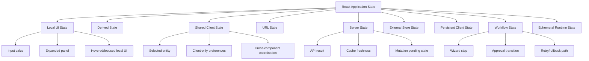
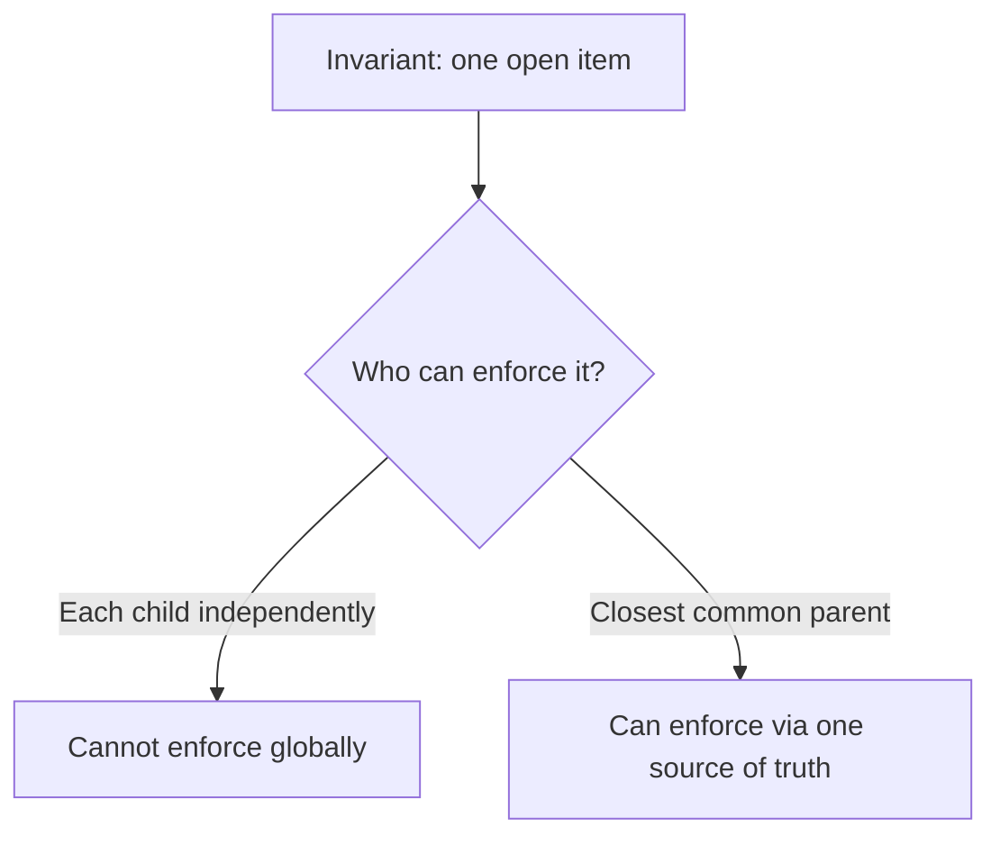
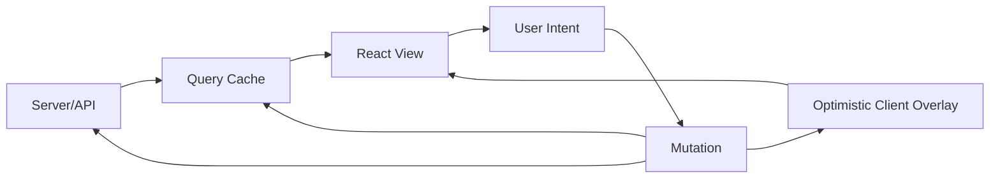
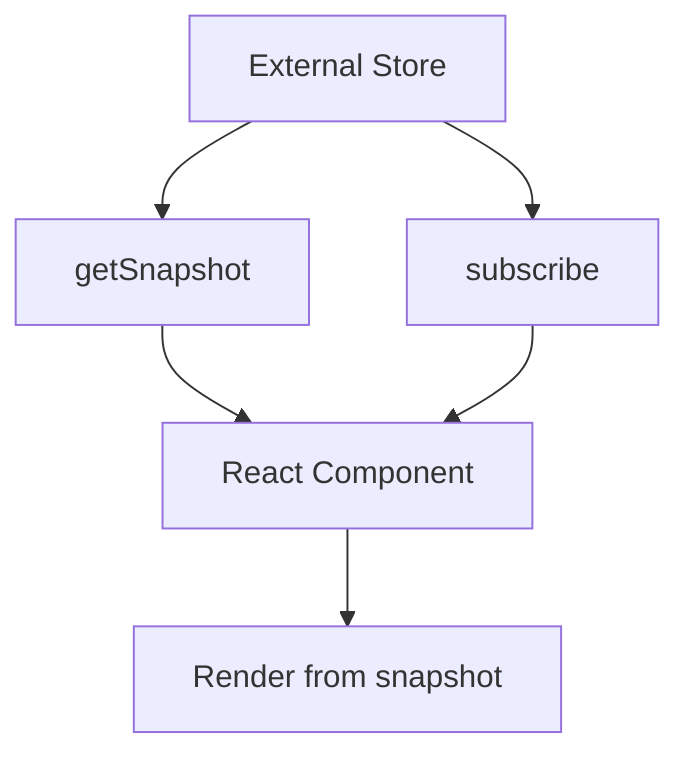
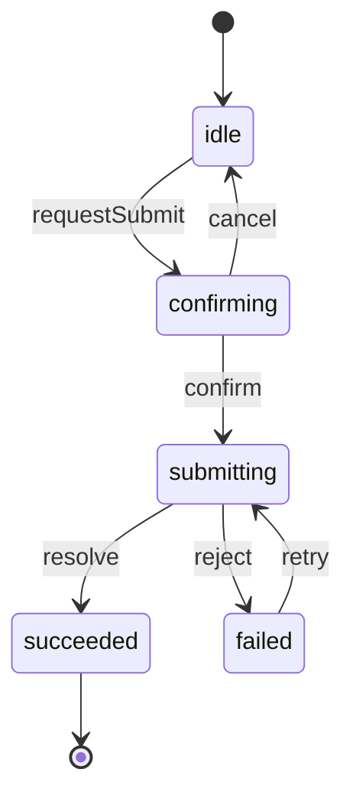
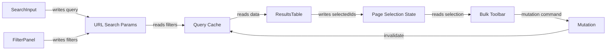
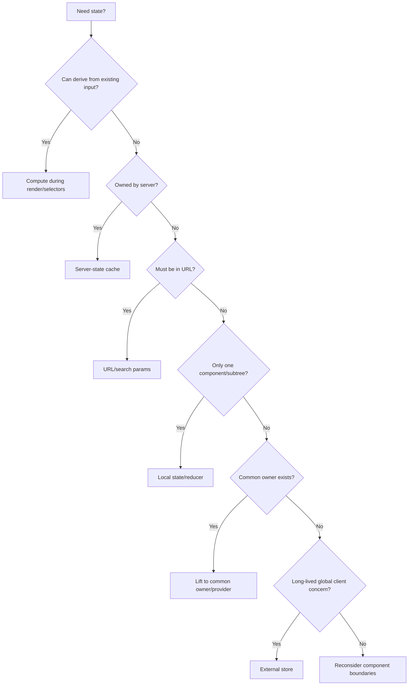

# Part 003 — Thinking in State Topology

React engineer yang kuat tidak memulai desain UI dengan pertanyaan:

> Library state management apa yang harus dipakai?

Pertanyaan yang lebih tepat:

> State ini hidup di mana, dimiliki siapa, berubah karena event apa, dibaca oleh siapa, harus bertahan berapa lama, dan apa konsekuensinya jika stale, hilang, atau duplikat?

Itulah **state topology**.

Topology bukan sekadar daftar jenis state. Topology adalah peta hubungan:

- tempat state disimpan,
- siapa pemilik otoritatifnya,
- siapa yang boleh mengubahnya,
- siapa yang membaca turunan nilainya,
- bagaimana state berpindah antar boundary,
- kapan state harus reset,
- kapan state harus dipertahankan,
- kapan state harus disinkronkan dengan sistem eksternal.

Banyak bug React tidak berasal dari `useState` yang salah. Bug muncul karena state ditempatkan di lokasi yang salah.

Contoh:

- filter tabel disimpan sebagai local state, padahal harus shareable melalui URL,
- data API disalin ke Redux, lalu cache server menjadi tidak konsisten,
- selected row disimpan di child component, padahal toolbar global perlu tahu,
- modal visibility disimpan di lima tempat berbeda,
- form draft dicampur dengan server entity sehingga optimistic update sulit di-rollback,
- derived value disimpan sebagai state sehingga mudah stale,
- workflow step hanya boolean flags sehingga impossible state muncul.

Part ini membangun mental model untuk menentukan **topology state** sebelum kita bicara library.

---

## 1. State Topology dalam Satu Kalimat

State topology adalah jawaban terhadap lima pertanyaan:

```txt
1. Where does this state live?
2. Who owns it?
3. Who reads it?
4. Who can change it?
5. What lifecycle should it follow?
```

Dalam React, jawaban yang berbeda menghasilkan desain yang berbeda:

| Pertanyaan | Jawaban Buruk | Jawaban Lebih Baik |
|---|---|---|
| Di mana state hidup? | "Taruh di global biar gampang." | "Letakkan sedekat mungkin dengan pemilik perubahan." |
| Siapa owner? | "Semua component bisa update." | "Ada satu source of truth; yang lain membaca atau mengirim intent." |
| Siapa reader? | "Nanti kalau perlu tinggal import store." | "Reader menentukan scope propagasi dan biaya re-render." |
| Siapa writer? | "Setter dilempar ke mana-mana." | "Writer melalui event/command yang jelas." |
| Lifecycle? | "Selama app jalan." | "Reset saat identity berubah, persist saat user expectation membutuhkan." |

Topology adalah desain aliran otoritas. Tanpa itu, state management berubah menjadi tempat pembuangan variable.

---

## 2. Peta Besar Jenis State

Jangan mulai dari `local vs global`. Itu terlalu kasar.

Gunakan taxonomy yang lebih tajam:



Setiap jenis punya hukum sendiri.

| Jenis State | Owner Otoritatif | Contoh | Tool Umum |
|---|---|---|---|
| Local UI state | Component/subtree | input draft, dropdown open | `useState`, `useReducer` |
| Derived state | Tidak disimpan; dihitung | total, filtered list, validation summary | render calculation, selector, `useMemo` bila perlu |
| Shared client state | UI/application client | selected tab global, local cart draft | lifted state, context, reducer, external store |
| URL state | Browser location | search query, filters, page number | router/search params |
| Server state | Backend/API | user profile, invoice list, permissions response | TanStack Query, RTK Query, framework loader |
| External store state | Store di luar React | global store, websocket snapshot | `useSyncExternalStore`, Zustand, Redux |
| Persistent client state | Browser storage/device | theme, local draft, onboarding dismissed | localStorage, IndexedDB, storage abstraction |
| Workflow state | State machine/process | wizard, approval, import job UI | reducer, XState, custom machine |
| Ephemeral runtime state | Runtime, bukan UI declarative | timeout id, DOM node, previous value | `useRef` |

Kesalahan umum: satu library dipakai untuk semua jenis state.

Redux/Zustand bukan pengganti URL. TanStack Query bukan pengganti local form draft. Context bukan query cache. `useEffect` bukan derived state engine. `useRef` bukan tempat menyembunyikan state UI.

---

## 3. State Lokal: Letakkan Dekat dengan Perubahan

Prinsip pertama:

```txt
State should live as close as possible to the component that owns its changes.
```

Contoh yang sehat:

```tsx
function CollapsibleSection({ title, children }: PropsWithChildren<{ title: string }>) {
  const [open, setOpen] = useState(false);

  return (
    <section>
      <button onClick={() => setOpen(value => !value)}>{title}</button>
      {open ? <div>{children}</div> : null}
    </section>
  );
}
```

`open` adalah local UI state karena:

- hanya section itu yang membaca,
- hanya section itu yang mengubah,
- tidak perlu survive navigation,
- tidak perlu shareable melalui URL,
- tidak perlu diketahui parent,
- kehilangan state saat component unmount dapat diterima.

Jangan angkat state hanya karena "mungkin nanti dipakai".

### Anti-pattern: premature lifting

```tsx
function Page() {
  const [isProfileOpen, setProfileOpen] = useState(false);
  const [isBillingOpen, setBillingOpen] = useState(false);
  const [isAuditOpen, setAuditOpen] = useState(false);

  return (
    <>
      <Section open={isProfileOpen} onOpenChange={setProfileOpen} />
      <Section open={isBillingOpen} onOpenChange={setBillingOpen} />
      <Section open={isAuditOpen} onOpenChange={setAuditOpen} />
    </>
  );
}
```

Jika parent tidak punya keputusan bisnis terhadap state tersebut, parent hanya menjadi gudang setter.

Versi lebih baik:

```tsx
function Page() {
  return (
    <>
      <Section />
      <Section />
      <Section />
    </>
  );
}
```

Local state menjaga boundary tetap kecil.

---

## 4. Kapan State Harus Diangkat?

State diangkat jika ada invariant lintas component.

Contoh: dua panel tidak boleh terbuka bersamaan.

```tsx
function Accordion() {
  const [openId, setOpenId] = useState<string | null>(null);

  return items.map(item => (
    <AccordionItem
      key={item.id}
      item={item}
      open={openId === item.id}
      onOpen={() => setOpenId(item.id)}
      onClose={() => setOpenId(null)}
    />
  ));
}
```

Di sini `openId` bukan sekadar data. Ia merepresentasikan invariant:

```txt
At most one item can be open.
```

Jika setiap child menyimpan `open` sendiri, invariant ini sulit dijaga.



State harus diangkat jika:

- dua atau lebih component harus berubah bersama,
- parent perlu mengambil keputusan berdasarkan state child,
- ada invariant lintas child,
- state mempengaruhi layout/toolbar/action di luar child,
- state perlu di-reset saat domain identity parent berubah,
- state perlu dikendalikan dari luar sebagai controlled component.

Namun lifting bukan berarti global. Lifting hanya sampai **closest common owner**.

---

## 5. Closest Common Owner

React docs sering menyebut "closest common parent" untuk sharing state. Dalam aplikasi kompleks, istilah yang lebih kuat adalah **closest common owner**.

Parent belum tentu owner. Parent bisa hanya layout shell.

Contoh:

```txt
CaseDetailPage
├── CaseHeader
├── CaseTabNavigation
├── CaseActionPanel
└── CaseTimeline
```

State `selectedCaseAction` dibaca oleh `CaseActionPanel` dan `CaseTimeline`, tetapi diubah oleh `CaseHeader`. Owner yang wajar mungkin bukan `CaseHeader`, melainkan `CaseDetailPage` atau custom hook `useCaseActionSelection` pada boundary page.

```tsx
function CaseDetailPage({ caseId }: { caseId: string }) {
  const actionSelection = useCaseActionSelection(caseId);

  return (
    <CaseActionSelectionProvider value={actionSelection}>
      <CaseHeader />
      <CaseActionPanel />
      <CaseTimeline />
    </CaseActionSelectionProvider>
  );
}
```

Owner bukan berarti component yang pertama kali menerima event. Owner adalah boundary yang:

- memahami invariant,
- tahu kapan reset,
- tahu siapa reader/writer yang sah,
- bisa mengekspresikan state sebagai domain/application concept.

---

## 6. Derived State: Hitung, Jangan Simpan

Derived state adalah nilai yang bisa dihitung dari props/state lain.

Buruk:

```tsx
function Cart({ items }: { items: CartItem[] }) {
  const [total, setTotal] = useState(0);

  useEffect(() => {
    setTotal(items.reduce((sum, item) => sum + item.price * item.quantity, 0));
  }, [items]);

  return <div>Total: {total}</div>;
}
```

Masalah:

- render pertama memakai `total` lama,
- ada render tambahan setelah effect,
- ada dua source of truth,
- dependency effect harus selalu benar,
- bug muncul jika `items` dimutasi diam-diam.

Lebih baik:

```tsx
function Cart({ items }: { items: CartItem[] }) {
  const total = items.reduce((sum, item) => sum + item.price * item.quantity, 0);

  return <div>Total: {total}</div>;
}
```

Jika mahal, gunakan memoization sebagai optimisasi, bukan sebagai model ownership:

```tsx
const total = useMemo(() => {
  return items.reduce((sum, item) => sum + item.price * item.quantity, 0);
}, [items]);
```

Checklist derived state:

| Pertanyaan | Jika Ya |
|---|---|
| Bisa dihitung dari props/state/context saat render? | Jangan simpan sebagai state. |
| Butuh cache karena mahal? | Pertimbangkan `useMemo`, selector memoization, atau precomputation. |
| Butuh berbeda dari sumbernya karena user sedang mengedit? | Itu bukan derived; itu draft state. |
| Butuh snapshot historis? | Itu event/history state, bukan derived biasa. |

---

## 7. Draft State vs Committed State

Banyak bug form berasal dari mencampur dua hal:

```txt
Committed state = data yang sudah dianggap benar/tersimpan.
Draft state     = data sementara yang sedang diedit user.
```

Contoh buruk:

```tsx
function UserEditor({ user }: { user: User }) {
  const [name, setName] = useState(user.name);

  useEffect(() => {
    setName(user.name);
  }, [user.name]);

  // ...
}
```

Kode ini terlihat wajar, tapi behavior-nya kabur:

- jika `user.name` berubah dari server saat user mengetik, apakah draft harus overwrite?
- jika `user.id` berubah, apakah draft harus reset?
- jika parent re-render dengan object baru tapi user sama, apakah draft reset?

Model lebih jelas:

```tsx
function UserEditorBoundary({ userId }: { userId: string }) {
  const userQuery = useUserQuery(userId);

  if (!userQuery.data) return <Spinner />;

  return <UserEditor key={userId} initialUser={userQuery.data} />;
}

function UserEditor({ initialUser }: { initialUser: User }) {
  const [draft, setDraft] = useState(() => toUserDraft(initialUser));

  // draft belongs to this mounted editor instance
}
```

`key={userId}` menyatakan topology:

```txt
Draft is preserved while editing the same user.
Draft resets when user identity changes.
```

Jangan pakai effect untuk menebak lifecycle kalau identity tree bisa mengekspresikannya lebih jelas.

---

## 8. URL State: State yang Harus Bisa Dibagikan

URL adalah state container. Bukan semua state cocok masuk URL, tetapi state tertentu hampir selalu lebih baik di URL:

- search query,
- filter,
- sort,
- pagination,
- active tab yang merepresentasikan resource view,
- selected item jika selection adalah bagian dari navigasi,
- date range laporan,
- mode tampilan yang harus shareable/bookmarkable.

Contoh buruk:

```tsx
function AuditLogPage() {
  const [query, setQuery] = useState('');
  const [page, setPage] = useState(1);
  const [severity, setSeverity] = useState<Severity | null>(null);

  const logs = useAuditLogs({ query, page, severity });
}
```

Masalah:

- refresh hilang,
- tidak bisa share link,
- back/forward browser tidak sesuai ekspektasi,
- state tersembunyi dari observability/navigation,
- deep link tidak mungkin.

Lebih baik:

```tsx
function AuditLogPage() {
  const [searchParams, setSearchParams] = useSearchParams();

  const filters = parseAuditLogFilters(searchParams);

  const logs = useAuditLogs(filters);

  function updateFilters(next: Partial<AuditLogFilters>) {
    setSearchParams(serializeAuditLogFilters({ ...filters, ...next }));
  }

  return <AuditLogView filters={filters} onFiltersChange={updateFilters} logs={logs} />;
}
```

URL state punya trade-off:

| Keuntungan | Biaya |
|---|---|
| Shareable | Perlu parsing/serialization |
| Back/forward native | Harus hati-hati replace vs push |
| Refresh safe | Tidak cocok untuk data sensitif |
| Debuggable | URL bisa menjadi noisy |
| Deep-linkable | Harus punya default yang stabil |

Rule:

```txt
If the user expects copy-paste URL to preserve the view, it is probably URL state.
```

---

## 9. Server State: Jangan Disamakan dengan Client State

Server state adalah state yang owner otoritatifnya bukan React app.

Contoh:

- invoice list,
- user profile,
- permission matrix dari backend,
- case timeline,
- notification count,
- feature configuration dari API,
- status background job.

Ciri server state:

- bisa stale,
- perlu fetch/refetch,
- bisa gagal,
- bisa dipakai banyak screen,
- punya cache lifecycle,
- punya invalidation strategy,
- bisa diubah oleh actor lain di luar browser saat ini.

Jangan copy server state ke client store tanpa alasan kuat.

Buruk:

```tsx
const user = await api.getUser(userId);
dispatch(usersSlice.actions.upsertUser(user));
```

Lalu component membaca dari Redux sebagai source of truth. Sekarang kita harus menjawab:

- kapan data stale?
- siapa yang refetch?
- mutation invalidates slice mana?
- bagaimana dedup request?
- bagaimana loading/error state?
- bagaimana optimistic update rollback?

Kalau jawaban itu tidak jelas, gunakan server-state tool seperti query cache.

```tsx
function UserPanel({ userId }: { userId: string }) {
  const userQuery = useUserQuery(userId);

  if (userQuery.isPending) return <Spinner />;
  if (userQuery.isError) return <ErrorPanel error={userQuery.error} />;

  return <UserView user={userQuery.data} />;
}
```

Client state dan server state boleh berinteraksi, tetapi jangan dicampur tanpa boundary.



---

## 10. Shared Client State: Jangan Otomatis Global

Shared client state adalah state milik aplikasi client yang dibaca oleh beberapa tempat.

Contoh:

- current workspace selected di shell,
- active modal registry,
- unsaved changes map,
- client-side cart draft sebelum checkout,
- selected rows lintas toolbar/table,
- compare basket,
- command palette state,
- layout preference sementara.

Pertanyaan topology:

```txt
Apakah state ini shared karena memang domain-nya shared,
atau shared karena component boundary saat ini buruk?
```

Kadang solusi bukan store. Solusi bisa extraction boundary.

Buruk:

```tsx
// Any component can update this global state.
const useSelectionStore = create(...);
```

Lebih baik jika selection hanya relevan dalam satu page:

```tsx
function InvoiceListPage() {
  const selection = useInvoiceSelection();

  return (
    <InvoiceSelectionProvider value={selection}>
      <InvoiceToolbar />
      <InvoiceTable />
      <InvoiceBulkActionPanel />
    </InvoiceSelectionProvider>
  );
}
```

Global store dipilih jika:

- reader/writer melintasi banyak subtree yang tidak punya common owner praktis,
- state harus bertahan saat route subtree berubah,
- state adalah capability/application service,
- observability/time travel/middleware dibutuhkan,
- state adalah domain client yang memang global.

Context provider di page cukup jika:

- scope-nya satu page/feature,
- lifecycle mengikuti mount/unmount boundary,
- writer jelas,
- tidak butuh subscription granular yang sangat tinggi.

---

## 11. External Store State

External store berarti state hidup di luar React. React hanya subscribe.



Contoh external store:

- Redux store,
- Zustand store,
- custom observable store,
- websocket state container,
- browser storage wrapper,
- collaborative document model,
- data grid internal model.

Topology external store harus menjawab:

- apakah store global atau scoped per feature?
- apakah store instance dibuat per page, per tab, atau singleton module?
- apakah component membaca seluruh store atau selector kecil?
- apakah update menghasilkan immutable snapshot?
- bagaimana unsubscribe saat unmount?
- apakah SSR/hydration perlu snapshot berbeda?

Contoh scoped store lebih sehat untuk banyak kasus:

```tsx
function createInvoiceWorkspaceStore(initial: InvoiceWorkspaceState) {
  return createStore<InvoiceWorkspaceState>()((set, get) => ({
    ...initial,
    selectInvoice(invoiceId) {
      set({ selectedInvoiceId: invoiceId });
    },
    clearSelection() {
      set({ selectedInvoiceId: null });
    },
  }));
}
```

Jangan semua store menjadi singleton module. Singleton membuat lifecycle tersembunyi.

---

## 12. Persistent Client State

Persistent client state bertahan melewati reload/session.

Contoh:

- theme,
- sidebar collapsed,
- dismissed onboarding,
- local draft,
- last selected workspace,
- offline queue,
- feature preference.

Bahaya persistent state:

- schema berubah tapi storage lama masih ada,
- data sensitif tersimpan tanpa sadar,
- cross-tab conflict,
- hydration mismatch,
- stale preference mengalahkan server config,
- user logout tetapi storage tidak dibersihkan.

Minimal abstraction:

```tsx
type PersistedValue<T> = {
  version: number;
  value: T;
};

function readPersisted<T>(key: string, version: number, fallback: T): T {
  const raw = window.localStorage.getItem(key);
  if (!raw) return fallback;

  try {
    const parsed = JSON.parse(raw) as PersistedValue<T>;
    if (parsed.version !== version) return fallback;
    return parsed.value;
  } catch {
    return fallback;
  }
}
```

Persistent state selalu butuh:

- version,
- migration/clear strategy,
- privacy review,
- reset on logout jika user-scoped,
- conflict semantics jika multi-tab.

---

## 13. Workflow State

Workflow state berbeda dari boolean UI state.

Contoh buruk:

```tsx
const [isLoading, setLoading] = useState(false);
const [isSuccess, setSuccess] = useState(false);
const [isError, setError] = useState(false);
const [isConfirmOpen, setConfirmOpen] = useState(false);
```

State ini mengizinkan impossible state:

```txt
isLoading=true, isSuccess=true, isError=true
```

Lebih baik:

```tsx
type SubmitState =
  | { status: 'idle' }
  | { status: 'confirming' }
  | { status: 'submitting' }
  | { status: 'succeeded'; receiptId: string }
  | { status: 'failed'; error: Error };
```

Workflow state punya transitions:



Workflow state harus dipikir sebagai proses, bukan sekumpulan flag.

Gunakan reducer/state machine jika:

- ada multi-step flow,
- async transition,
- guard,
- retry/rollback,
- dependent action,
- illegal transition perlu dicegah,
- state harus diuji sebagai transition table.

---

## 14. Ephemeral Runtime State

Tidak semua nilai harus menyebabkan render.

Gunakan `useRef` untuk nilai mutable yang:

- harus bertahan antar render,
- tidak perlu memicu render saat berubah,
- merepresentasikan handle/runtime detail,
- bukan source of truth UI declarative.

Contoh:

```tsx
function AutoSaveEditor({ draft }: { draft: Draft }) {
  const timeoutRef = useRef<number | null>(null);

  function scheduleSave(nextDraft: Draft) {
    if (timeoutRef.current !== null) {
      window.clearTimeout(timeoutRef.current);
    }

    timeoutRef.current = window.setTimeout(() => {
      saveDraft(nextDraft);
    }, 500);
  }

  // ...
}
```

`timeoutRef` bukan UI state. Jika nilainya berubah, user tidak perlu melihat render baru.

Anti-pattern:

```tsx
const selectedIdRef = useRef<string | null>(null);

function select(id: string) {
  selectedIdRef.current = id;
}

return <div>Selected: {selectedIdRef.current}</div>;
```

Ini salah topology. UI membaca `selectedIdRef.current`, tapi perubahan ref tidak memicu render. Gunakan state/store.

---

## 15. State Identity dan Reset Policy

Topology juga menentukan kapan state reset.

Pertanyaan reset policy:

```txt
State ini harus bertahan ketika parent re-render?
State ini harus bertahan ketika tab berubah?
State ini harus bertahan ketika entity id berubah?
State ini harus bertahan ketika route berubah?
State ini harus bertahan ketika browser refresh?
State ini harus bertahan ketika user logout?
```

Contoh:

| State | Reset Saat | Preserve Saat |
|---|---|---|
| input draft edit user | `userId` berubah | parent re-render |
| filter audit log | user clear filter / URL berubah | refresh/share URL |
| selected row table | dataset identity berubah | sort local berubah, jika row id masih ada |
| modal open | navigation keluar feature | parent re-render |
| server query cache | invalidation/gc | component unmount sementara |
| onboarding dismissed | explicit reset/version migration | reload/session |

Reset yang tidak eksplisit menjadi bug tersembunyi.

Gunakan identity React jika reset mengikuti component identity:

```tsx
<UserEditor key={userId} user={user} />
```

Gunakan reducer event jika reset adalah domain transition:

```tsx
dispatch({ type: 'case.changed', caseId });
```

Gunakan storage/version jika reset adalah persistence lifecycle:

```tsx
clearUserScopedStorage(userId);
```

---

## 16. Reader/Writer Graph

Untuk state kompleks, gambar graph reader/writer.



Graph ini membantu melihat:

- state mana yang source of truth,
- update mana yang command,
- data mana yang derived,
- component mana yang seharusnya tidak import store langsung,
- loop mana yang mungkin terjadi,
- boundary mana yang terlalu banyak tanggung jawab.

Jika graph memiliki siklus yang tidak disengaja, bug akan muncul.

Contoh siklus buruk:

```txt
Effect reads URL -> sets local state -> effect reads local state -> writes URL
```

Lebih baik: URL menjadi source of truth, local UI hanya draft sementara jika diperlukan.

---

## 17. Decision Matrix: Letakkan State di Mana?

Gunakan matrix ini sebelum memilih tool.

| Kondisi | Lokasi State yang Disarankan |
|---|---|
| Hanya satu component yang membaca dan menulis | local state |
| Beberapa child harus konsisten bersama | closest common owner |
| Banyak subtree dalam satu feature membaca state | feature provider/scoped store |
| State harus shareable/bookmarkable | URL |
| State berasal dari API dan bisa stale | query cache/server-state layer |
| State adalah long-lived client domain | external store |
| State adalah proses dengan transition | reducer/state machine |
| State hanya handle mutable | ref |
| State harus survive reload | persistent storage with versioning |
| State bisa dihitung dari state lain | derived calculation, bukan stored state |

Decision tree:



---

## 18. Example: Search Page Topology

Scenario:

- search input,
- filters,
- sort,
- paginated results,
- selected rows,
- bulk archive action,
- detail drawer,
- optimistic mutation.

Naive topology:

```tsx
function SearchPage() {
  const [query, setQuery] = useState('');
  const [filters, setFilters] = useState({});
  const [sort, setSort] = useState('createdAt:desc');
  const [page, setPage] = useState(1);
  const [results, setResults] = useState([]);
  const [loading, setLoading] = useState(false);
  const [selectedIds, setSelectedIds] = useState([]);
  const [drawerItem, setDrawerItem] = useState(null);

  useEffect(() => {
    setLoading(true);
    api.search({ query, filters, sort, page }).then(data => {
      setResults(data.items);
      setLoading(false);
    });
  }, [query, filters, sort, page]);
}
```

Semua terlihat sederhana sampai muncul requirement:

- user ingin share link,
- request lama menimpa request baru,
- selection harus clear saat filter berubah,
- drawer harus deep-linkable,
- bulk archive harus optimistic,
- pagination harus reset saat query berubah,
- browser back harus mengembalikan filter.

Topology yang lebih matang:

| Concern | Topology |
|---|---|
| query/filter/sort/page | URL state |
| results/loading/error/cache | server-state query cache |
| selectedIds | page-scoped client state |
| drawer item | URL param atau page state tergantung deep-link requirement |
| bulk mutation | mutation layer + optimistic overlay |
| pagination reset | URL update rule saat query/filter berubah |
| selection reset | reducer event ketika result identity/filter berubah |

Sketch:

```tsx
function SearchPage() {
  const searchState = useSearchUrlState();
  const resultsQuery = useSearchResultsQuery(searchState.queryKey);
  const selection = useSearchSelection({
    resultIds: resultsQuery.data?.items.map(item => item.id) ?? [],
    scopeKey: searchState.selectionScopeKey,
  });

  const archiveMutation = useArchiveResultsMutation({
    onSuccess() {
      selection.clear();
    },
  });

  return (
    <SearchSelectionProvider value={selection}>
      <SearchView
        searchState={searchState}
        resultsQuery={resultsQuery}
        onArchiveSelected={() => archiveMutation.mutate(selection.selectedIds)}
      />
    </SearchSelectionProvider>
  );
}
```

Perhatikan: tidak ada satu "global state" yang menyelesaikan semua. Ada beberapa state dengan topology berbeda.

---

## 19. Example: Approval Workflow UI

Scenario:

- case bisa berada di `draft`, `submitted`, `under_review`, `approved`, `rejected`, `escalated`,
- user role menentukan action,
- action bisa async,
- beberapa transition butuh confirmation,
- beberapa action butuh reason,
- timeline harus update setelah action,
- UI harus mencegah impossible transition.

Naive topology:

```tsx
const [isSubmitting, setSubmitting] = useState(false);
const [isApproving, setApproving] = useState(false);
const [isRejecting, setRejecting] = useState(false);
const [showApproveModal, setShowApproveModal] = useState(false);
const [showRejectModal, setShowRejectModal] = useState(false);
const [error, setError] = useState(null);
```

Model ini tidak punya grammar.

Topology lebih sehat:

| Concern | Topology |
|---|---|
| authoritative case status | server state |
| available actions | derived from server state + permissions |
| currently executing transition | workflow state |
| modal payload | workflow state |
| reason draft | modal-local state atau workflow context |
| timeline | server state/query cache |
| optimistic status | optimistic overlay dengan rollback |

Sketch:

```tsx
type CaseActionFlow =
  | { status: 'idle' }
  | { status: 'confirming'; action: CaseAction }
  | { status: 'collectingReason'; action: CaseAction; reason: string }
  | { status: 'executing'; action: CaseAction }
  | { status: 'failed'; action: CaseAction; error: Error };
```

Topology workflow membuat UI bisa diaudit:

```txt
idle -> confirming -> executing -> idle
idle -> collectingReason -> executing -> idle
executing -> failed -> executing
failed -> idle
```

Di sistem regulatori/enforcement, explicit transition seperti ini sangat penting karena UI bukan hanya tampilan. UI adalah bagian dari lifecycle kontrol.

---

## 20. Smell Catalogue: State Topology yang Salah

| Smell | Kemungkinan Masalah |
|---|---|
| Banyak `useEffect` hanya untuk copy props ke state | Derived/draft lifecycle tidak jelas |
| Banyak boolean flags untuk satu flow | Perlu union state/state machine |
| Semua state masuk Redux/Zustand | Ownership terlalu global |
| Context provider berisi object raksasa | Rerender propagation dan implicit coupling |
| URL tidak berubah saat filter/search berubah | View state tidak shareable |
| Data API disalin ke local state | Server/client state tercampur |
| Setter dilempar melewati banyak layer | Boundary ownership kabur |
| `useRef` dipakai untuk data yang tampil di UI | Render reactivity dihindari secara salah |
| Modal state tersebar di banyak component | Perlu overlay orchestration boundary |
| Component child tahu terlalu banyak tentang parent | Composition contract bocor |

---

## 21. Heuristics yang Dipakai Engineer Senior

### Heuristic 1 — Prefer local until invariant crosses boundary

State lokal adalah default. Angkat hanya saat ada alasan nyata.

### Heuristic 2 — Server data belongs to server-state layer

Jika backend adalah owner, UI sebaiknya tidak berpura-pura menjadi database otoritatif.

### Heuristic 3 — URL is part of product behavior

Filter/search/sort bukan hanya UI detail. Itu navigasi dan shareability.

### Heuristic 4 — Derived state is a liability unless proven otherwise

Menyimpan derived state berarti membuat cache manual. Cache manual butuh invalidation.

### Heuristic 5 — Booleans do not model workflows well

Jika ada lebih dari dua status, gunakan discriminated union atau state machine.

### Heuristic 6 — Scope store by lifecycle, not convenience

Global singleton mudah dibuat, sulit dibersihkan.

### Heuristic 7 — State topology first, library second

Library hanya implementasi dari topology. Library tidak memperbaiki topology yang salah.

---

## 22. Refactoring Playbook

Saat menemukan state spaghetti, jangan langsung rewrite. Lakukan langkah ini:

### Step 1 — Inventory state

Tulis semua state:

```txt
name
current location
readers
writers
source of truth
reset condition
persistence requirement
failure impact
```

### Step 2 — Klasifikasikan jenisnya

```txt
local / derived / shared client / URL / server / external / persistent / workflow / ref
```

### Step 3 — Temukan duplicate source of truth

Cari pasangan seperti:

```txt
props.user.name + local name
query params + local filters
server data + Redux copy
boolean flags + status field
```

### Step 4 — Tentukan owner baru

Jangan hanya pindahkan state. Pindahkan ownership.

### Step 5 — Ubah writer menjadi event/command

Dari:

```tsx
setSelectedIds(ids)
```

Menjadi:

```tsx
selection.toggle(invoiceId)
selection.clearBecauseFilterChanged(nextFilterKey)
```

### Step 6 — Tambahkan tests untuk invariant

Test bukan hanya render. Test transition.

---

## 23. Checklist Desain State Topology

Sebelum merge feature React kompleks, tanyakan:

```txt
[ ] Apa source of truth untuk setiap state penting?
[ ] Apakah ada derived state yang disimpan tanpa alasan?
[ ] Apakah server state dicampur ke client store?
[ ] Apakah state yang harus shareable sudah berada di URL?
[ ] Apakah local state diangkat terlalu jauh?
[ ] Apakah global store benar-benar perlu global?
[ ] Apakah reset policy eksplisit?
[ ] Apakah workflow memakai union/machine, bukan boolean acak?
[ ] Apakah writer state mengekspresikan intent, bukan setter mentah?
[ ] Apakah topology bisa digambar sebagai reader/writer graph?
```

Jika tidak bisa menggambar graph-nya, kemungkinan desainnya belum matang.

---

## 24. Latihan Implementasi

### Exercise 1 — Klasifikasikan State

Ambil page nyata di codebase. Buat tabel:

| State | Current Location | Readers | Writers | Correct Topology | Refactor Needed |
|---|---|---|---|---|
| `query` | local state | search page | input | URL state | yes |
| `data` | local state | table | effect | server state | yes |
| `selectedIds` | table | toolbar/table | row checkbox | page-scoped state | yes |

Target: minimal 15 state entries.

### Exercise 2 — Hilangkan Derived State

Cari pattern:

```tsx
useEffect(() => {
  setX(computeY(a, b));
}, [a, b]);
```

Refactor menjadi render calculation atau selector.

### Exercise 3 — Ubah Boolean Flow ke Union State

Dari:

```tsx
isLoading, isError, isSuccess, isConfirmOpen
```

Menjadi:

```tsx
type FlowState =
  | { status: 'idle' }
  | { status: 'confirming' }
  | { status: 'submitting' }
  | { status: 'failed'; error: Error }
  | { status: 'succeeded' };
```

### Exercise 4 — Gambar Reader/Writer Graph

Pilih satu feature dan gambar Mermaid graph. Tandai:

- source of truth,
- derived values,
- commands,
- effects/synchronization,
- external systems.

---

## 25. Kesimpulan Part 003

State topology adalah fondasi state management React.

Ringkasnya:

```txt
State yang berbeda punya owner, lifecycle, dan mekanisme propagasi berbeda.
Jangan pakai satu tool untuk semua state.
Letakkan state sedekat mungkin dengan owner-nya.
Angkat state hanya saat invariant menyeberang boundary.
Derived state sebaiknya dihitung, bukan disimpan.
Server state bukan client state.
URL adalah state container untuk view yang shareable.
Workflow state butuh model transition, bukan boolean flags.
Store harus mengikuti lifecycle, bukan convenience.
```

Jika Part 001 menjelaskan bagaimana React runtime bekerja, dan Part 002 menjelaskan boundary/ownership, Part 003 memberi peta untuk menentukan tempat state hidup.

Part berikutnya membahas **Rendering Is Not Execution**: mengapa render harus pure, mengapa side effect tidak boleh berada di render, dan bagaimana membedakan render calculation, event logic, effect synchronization, dan command orchestration.

---

## Referensi

- React Docs — Managing State: https://react.dev/learn/managing-state
- React Docs — Choosing the State Structure: https://react.dev/learn/choosing-the-state-structure
- React Docs — Sharing State Between Components: https://react.dev/learn/sharing-state-between-components
- React Docs — Preserving and Resetting State: https://react.dev/learn/preserving-and-resetting-state
- React Docs — You Might Not Need an Effect: https://react.dev/learn/you-might-not-need-an-effect
- React Docs — State as a Snapshot: https://react.dev/learn/state-as-a-snapshot
- React Docs — `useSyncExternalStore`: https://react.dev/reference/react/useSyncExternalStore
