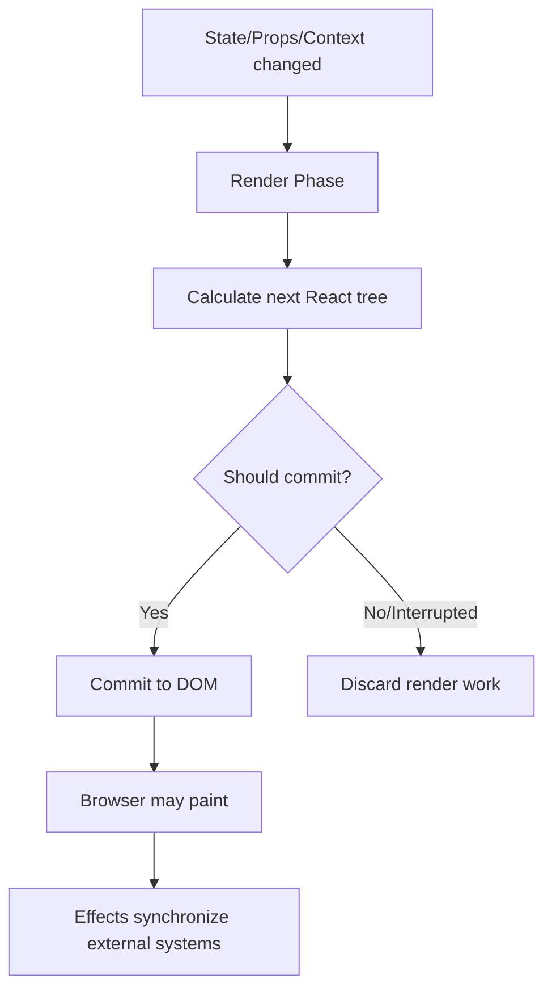
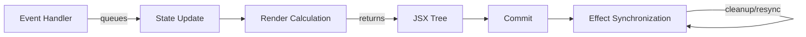
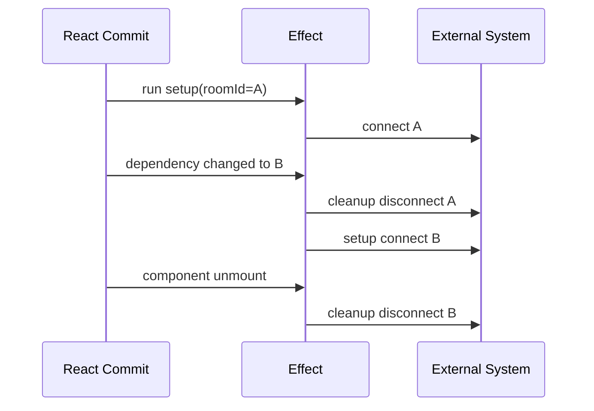

# Part 004 — Rendering Is Not Execution

Salah satu lompatan terbesar dari React intermediate ke React advanced adalah memahami kalimat ini:

> Rendering a component is not the same thing as executing an application transaction.

React boleh memanggil component function untuk menghitung UI. Pemanggilan itu bukan izin untuk:

- mengirim analytics,
- melakukan request,
- menulis ke localStorage,
- mutate singleton,
- subscribe ke websocket,
- mengubah DOM manual,
- menjadwalkan timer,
- mengubah state lain,
- menjalankan command bisnis.

Render adalah kalkulasi. Bukan transaksi.

Jika render diperlakukan sebagai eksekusi aplikasi, bug yang muncul biasanya sulit dilacak:

- analytics double count,
- API call ganda,
- subscription leak,
- infinite render loop,
- state berubah saat React sedang menghitung UI,
- output berbeda untuk input yang sama,
- behavior berbeda antara development Strict Mode dan production,
- race karena render dibatalkan tetapi side effect sudah jalan.

Part ini membangun batas konseptual antara:

```txt
render calculation
commit
browser paint
event logic
effect synchronization
external command
```

---

## 1. Model Besar: React Boleh Menghitung Ulang

React component harus diperlakukan seperti pure calculation:

```txt
nextUI = component(props, state, context)
```

Jika input sama, output seharusnya sama. Render tidak boleh memiliki efek observasi eksternal.



Poin kritis:

```txt
React can render without committing.
React can render more than once.
React can discard render work.
React can preserve or reset state based on identity.
```

Karena itu render tidak boleh melakukan pekerjaan yang "harus terjadi tepat sekali".

---

## 2. Empat Zona Kode React

Dalam component modern, kode harus dikelompokkan ke empat zona:

| Zona | Tujuan | Boleh Side Effect? | Contoh |
|---|---|---:|---|
| Render calculation | Menghitung JSX dan derived value | Tidak | filter list, compute label, choose component |
| Event handler | Menangani user intent tertentu | Ya | submit, click, type, command |
| Effect | Sinkronisasi dengan external system karena render sudah committed | Ya, dengan cleanup | subscribe, connect, imperative DOM sync |
| Module scope | Definisi stabil di luar render | Terbatas | constants, pure helpers, config |

Diagram:



Kesalahan paling umum adalah menaruh logic zona event/effect ke render.

---

## 3. Render Calculation

Render calculation adalah semua kode yang berjalan saat component function dipanggil untuk menghasilkan JSX.

```tsx
function InvoiceRow({ invoice }: { invoice: Invoice }) {
  const isOverdue = invoice.dueDate < new Date();
  const statusLabel = formatInvoiceStatus(invoice.status);

  return (
    <tr aria-invalid={isOverdue}>
      <td>{invoice.number}</td>
      <td>{statusLabel}</td>
    </tr>
  );
}
```

Tapi contoh ini punya satu subtle issue:

```tsx
const isOverdue = invoice.dueDate < new Date();
```

`new Date()` membuat hasil render bergantung pada waktu saat render, bukan hanya props/state/context. Untuk banyak UI ini masih pragmatis, tetapi secara purity ketat ini non-idempotent.

Lebih eksplisit:

```tsx
function InvoiceRow({ invoice, now }: { invoice: Invoice; now: Date }) {
  const isOverdue = invoice.dueDate < now;
  // ...
}
```

Atau update `now` melalui timer/effect di boundary yang memang menyinkronkan waktu.

Render calculation cocok untuk:

- memilih JSX,
- menghitung derived value,
- memetakan collection ke element,
- memilih className,
- memilih disabled state,
- menentukan component branch,
- membaca props/state/context,
- membuat object sementara untuk render selama tidak dipakai sebagai unstable dependency yang berbahaya.

Render calculation tidak cocok untuk:

- network request,
- mutation external object,
- subscription,
- localStorage write,
- analytics event,
- state setter,
- imperative navigation,
- DOM mutation.

---

## 4. Event Handler: User Intent Boundary

Event handler berjalan karena user atau sistem memicu event tertentu. Event handler bukan render. Karena itu ia boleh melakukan side effect yang terkait langsung dengan intent.

```tsx
function SaveButton({ draft }: { draft: Draft }) {
  async function handleSaveClick() {
    await saveDraft(draft);
    toast.success('Draft saved');
  }

  return <button onClick={handleSaveClick}>Save</button>;
}
```

`saveDraft` terjadi karena user klik tombol. Ini command, bukan konsekuensi pasif dari component terlihat.

Event handler cocok untuk:

- submit form,
- klik tombol aksi,
- navigation akibat user intent,
- optimistic mutation,
- logging action user,
- membuka modal karena user memilih action,
- mengubah local state karena input.

Event handler harus diberi nama berdasarkan intent, bukan detail DOM.

Kurang baik:

```tsx
onClick={() => setOpen(true)}
```

Lebih ekspresif:

```tsx
function requestApproval() {
  approvalFlow.start({ action: 'approve' });
}

return <button onClick={requestApproval}>Approve</button>;
```

Untuk component reusable, callback juga sebaiknya intent-based:

```tsx
<InvoiceToolbar onArchiveSelected={archiveSelectedInvoices} />
```

Bukan:

```tsx
<InvoiceToolbar setArchived={setArchived} setLoading={setLoading} />
```

---

## 5. Effect: Synchronization, Bukan Lifecycle General-Purpose

Effect digunakan untuk menyinkronkan React component dengan sistem eksternal setelah commit.

Sistem eksternal berarti sesuatu di luar perhitungan JSX React:

- browser API,
- network connection,
- subscription,
- websocket,
- timer,
- non-React widget,
- imperative DOM API,
- analytics page view setelah screen committed,
- storage read/write tertentu,
- map/video/player library.

Contoh effect yang wajar:

```tsx
function ChatRoom({ roomId }: { roomId: string }) {
  useEffect(() => {
    const connection = createConnection({ roomId });
    connection.connect();

    return () => {
      connection.disconnect();
    };
  }, [roomId]);

  return <ChatRoomView roomId={roomId} />;
}
```

Effect lifecycle bukan component lifecycle. Effect melakukan dua hal:

```txt
start synchronization
stop synchronization
```

Jika dependency berubah, React menghentikan sinkronisasi lama dan memulai sinkronisasi baru.



Effect buruk jika hanya dipakai untuk menghitung state dari state lain.

```tsx
useEffect(() => {
  setFullName(`${firstName} ${lastName}`);
}, [firstName, lastName]);
```

Lebih baik:

```tsx
const fullName = `${firstName} ${lastName}`;
```

---

## 6. Commit Bukan Effect

Commit adalah fase React menerapkan perubahan ke host environment, misalnya DOM. Setelah commit, browser dapat paint, lalu passive effect (`useEffect`) berjalan.

Render:

```txt
calculate what should be shown
```

Commit:

```txt
apply changes to host tree
```

Effect:

```txt
synchronize external systems with committed UI/state
```

Jangan campur commit dengan effect. React yang mengurus DOM hasil JSX. Kita hanya butuh effect untuk hal yang React tidak kelola secara deklaratif.

Contoh tidak perlu effect:

```tsx
function ErrorMessage({ error }: { error: string | null }) {
  useEffect(() => {
    if (error) {
      document.title = 'Error';
    }
  }, [error]);

  return error ? <p role="alert">{error}</p> : null;
}
```

Jika tujuan hanya menampilkan error, JSX sudah cukup.

Effect untuk `document.title` mungkin valid jika title browser memang external system. Tetapi jangan gabungkan dengan render UI.

---

## 7. Render Side Effect: Contoh dan Kerusakan

### Contoh 1 — Analytics di render

Buruk:

```tsx
function ProductCard({ product }: { product: Product }) {
  analytics.track('product_card_seen', { productId: product.id });

  return <article>{product.name}</article>;
}
```

Masalah:

- render ulang akan track lagi,
- Strict Mode development bisa membuatnya terlihat double,
- render yang tidak commit tetap bisa track,
- scroll virtualization bisa mount/unmount berulang,
- parent update yang tidak relevan bisa menaikkan metric palsu.

Alternatif tergantung requirement.

Jika event harus terjadi saat user klik:

```tsx
function ProductCard({ product }: { product: Product }) {
  function openProduct() {
    analytics.track('product_opened', { productId: product.id });
    navigate(`/products/${product.id}`);
  }

  return <button onClick={openProduct}>{product.name}</button>;
}
```

Jika event harus terjadi saat benar-benar terlihat di viewport, gunakan intersection observer boundary, bukan render.

### Contoh 2 — Request di render

Buruk:

```tsx
function UserPanel({ userId }: { userId: string }) {
  const user = api.getUser(userId);
  return <UserView user={user} />;
}
```

Jika `api.getUser` melakukan request imperative, ini side effect di render. Gunakan server-state abstraction, framework loader, Suspense-compatible resource, atau effect dengan cancellation bila memang manual.

### Contoh 3 — State setter di render

Buruk:

```tsx
function Counter({ max }: { max: number }) {
  const [count, setCount] = useState(0);

  if (count > max) {
    setCount(max);
  }

  return <button>{count}</button>;
}
```

Ini bisa menyebabkan render loop atau render ekstra. Jika state harus reset saat `max` berubah, pertimbangkan:

- derive displayed value,
- event guard saat increment,
- reducer invariant,
- key-based reset,
- effect sebagai last resort jika benar-benar sinkronisasi eksternal/local imperative.

Lebih baik untuk counter:

```tsx
function Counter({ max }: { max: number }) {
  const [count, setCount] = useState(0);
  const displayedCount = Math.min(count, max);

  function increment() {
    setCount(current => Math.min(current + 1, max));
  }

  return <button onClick={increment}>{displayedCount}</button>;
}
```

---

## 8. Why Strict Mode Exposes Bad Assumptions

Development Strict Mode sengaja membantu menemukan impure render dan missing cleanup. Karena React dapat melakukan extra render/setup-cleanup cycle dalam development, kode yang salah sering "kelihatan double".

Jangan menyelesaikannya dengan mematikan Strict Mode atau membuat guard ref sembarangan.

Buruk:

```tsx
const didRun = useRef(false);

useEffect(() => {
  if (didRun.current) return;
  didRun.current = true;

  connection.connect();
}, []);
```

Kode ini menyembunyikan masalah: cleanup mungkin tetap tidak benar. Yang benar adalah membuat setup/cleanup simetris.

```tsx
useEffect(() => {
  connection.connect();

  return () => {
    connection.disconnect();
  };
}, [connection]);
```

Strict Mode bukan penyebab bug. Strict Mode memperlihatkan asumsi bahwa render/effect "hanya akan terjadi sekali".

React advanced harus nyaman dengan premis:

```txt
Code must be correct if setup happens, cleanup happens, and setup happens again.
```

---

## 9. Separating Events from Effects

Event handler berjalan karena satu interaction. Effect berjalan karena component perlu re-synchronize setelah commit dan dependency berubah.

| Pertanyaan | Event Handler | Effect |
|---|---|---|
| Kenapa jalan? | User/system event tertentu | UI/state committed dan dependency berubah |
| Frekuensi | Setiap event terjadi | Setiap perlu re-sync |
| Boleh command? | Ya | Hanya jika command adalah synchronization yang benar |
| Contoh | submit invoice | connect websocket untuk room aktif |
| Bahaya | stale closure, double submit | loop, missing cleanup, wrong dependencies |

Contoh salah: notification karena render state berubah.

```tsx
useEffect(() => {
  if (isSubmitted) {
    toast.success('Submitted');
  }
}, [isSubmitted]);
```

Jika `isSubmitted` berasal dari user click submit, toast sebaiknya di event/mutation lifecycle:

```tsx
async function submit() {
  await submitInvoice(draft);
  toast.success('Submitted');
}
```

Effect di atas akan bermasalah jika:

- component remount dengan `isSubmitted=true`,
- state dihydrate dari server,
- dependency berubah karena unrelated flow,
- retry/replay menyebabkan toast tidak sesuai intent.

Rule:

```txt
If logic should happen because the user did something, put it in the event/command path.
If logic should happen because the component is currently synchronized with an external system, put it in an Effect.
```

---

## 10. Render Calculation vs State Adjustment

Sering muncul kode seperti ini:

```tsx
function List({ items }: { items: Item[] }) {
  const [selectedId, setSelectedId] = useState<string | null>(null);

  useEffect(() => {
    if (selectedId && !items.some(item => item.id === selectedId)) {
      setSelectedId(null);
    }
  }, [items, selectedId]);

  // ...
}
```

Kadang ini valid, tapi sering topology-nya belum jelas.

Alternatif 1 — derive visible selection:

```tsx
const selectedItem = items.find(item => item.id === selectedId) ?? null;
```

Jika selected item hilang, UI menampilkan none tanpa mengubah original state.

Alternatif 2 — enforce invariant at writer:

```tsx
function selectItem(id: string) {
  if (items.some(item => item.id === id)) {
    setSelectedId(id);
  }
}
```

Alternatif 3 — reducer event saat dataset scope berubah:

```tsx
dispatch({ type: 'results.loaded', itemIds: items.map(item => item.id) });
```

Effect bukan alat default untuk menambal invariant. Invariant sebaiknya hidup di state transition.

---

## 11. Commands Must Not Hide in Render

Dalam aplikasi bisnis, ada perbedaan penting:

```txt
calculation = menentukan apa yang harus terlihat
command     = meminta dunia berubah
```

Render hanya calculation.

Command adalah:

- approve case,
- submit invoice,
- archive notification,
- assign inspector,
- create payment,
- export report,
- send email,
- log audit action,
- navigate karena user memilih route.

Command harus berada di boundary eksplisit:

```tsx
function CaseActionPanel({ caseId }: { caseId: string }) {
  const approve = useApproveCaseCommand();

  function handleApprove() {
    approve.execute({ caseId });
  }

  return <button onClick={handleApprove}>Approve</button>;
}
```

Jangan command otomatis hanya karena props terlihat:

```tsx
function AutoApprove({ caseId, shouldApprove }: Props) {
  if (shouldApprove) {
    api.approve(caseId);
  }

  return null;
}
```

Jika memang business process otomatis harus terjadi saat kondisi tertentu, modelkan sebagai orchestration effect di boundary yang jelas, dengan idempotency dan cleanup/guard yang benar. Tapi pertanyakan dulu: apakah ini benar-benar responsibility UI?

---

## 12. Effect Dependency adalah Kontrak Reaktivitas

Effect membaca reactive values. Jika effect membaca prop/state/context, dependency harus mencerminkan pembacaan itu.

```tsx
useEffect(() => {
  const connection = createConnection(serverUrl, roomId);
  connection.connect();
  return () => connection.disconnect();
}, [serverUrl, roomId]);
```

Dependency bukan preference. Dependency adalah deklarasi:

```txt
This synchronization must be re-established when these reactive inputs change.
```

Menghapus dependency untuk "mencegah effect jalan lagi" biasanya salah. Yang benar adalah mengubah desain supaya effect tidak membaca nilai yang tidak seharusnya reactive, atau memindahkan logic ke event.

Buruk:

```tsx
useEffect(() => {
  sendAnalytics(userId, route, cart.items.length);
}, [route]); // cart and userId intentionally omitted
```

Pertanyaan desain:

- Apakah analytics ini page view karena route berubah?
- Apakah harus membawa cart length terbaru?
- Apakah userId boleh berubah tanpa page view baru?
- Apakah event ini seharusnya di router instrumentation, bukan component effect?

Dependency lint sering dianggap musuh. Sebenarnya ia memaksa desain menjadi jujur.

---

## 13. Effect as Synchronization Protocol

Effect yang baik punya bentuk protocol:

```txt
Given reactive inputs,
start synchronization with external system,
return cleanup that fully stops that synchronization.
```

Template:

```tsx
useEffect(() => {
  const resource = startSomething(inputs);

  return () => {
    resource.stop();
  };
}, [inputs]);
```

Contoh websocket:

```tsx
function useCaseEvents(caseId: string, onEvent: (event: CaseEvent) => void) {
  useEffect(() => {
    const socket = openCaseSocket(caseId);

    socket.on('event', onEvent);

    return () => {
      socket.off('event', onEvent);
      socket.close();
    };
  }, [caseId, onEvent]);
}
```

Masalah: `onEvent` sering berubah identity. Solusi bukan menghapus dependency begitu saja. Pilihan:

- stabilkan callback dengan `useCallback`,
- pisahkan event reading dengan Effect Event pattern bila tersedia/tepat,
- subscribe ke store/action yang stabil,
- pindahkan event handling ke external store.

Effect protocol harus bisa menjawab:

```txt
What exactly is started?
What exactly is stopped?
Which inputs define the subscription identity?
What happens if setup/cleanup runs twice in development?
What happens if input changes quickly?
```

---

## 14. Data Fetching di Effect: Boleh, Tapi Pahami Biayanya

Manual fetching di `useEffect` sering dipakai, tapi dalam app production ia cepat rumit:

```tsx
function UserPanel({ userId }: { userId: string }) {
  const [user, setUser] = useState<User | null>(null);
  const [error, setError] = useState<Error | null>(null);
  const [loading, setLoading] = useState(false);

  useEffect(() => {
    let cancelled = false;

    setLoading(true);
    setError(null);

    api.getUser(userId)
      .then(data => {
        if (!cancelled) setUser(data);
      })
      .catch(error => {
        if (!cancelled) setError(error);
      })
      .finally(() => {
        if (!cancelled) setLoading(false);
      });

    return () => {
      cancelled = true;
    };
  }, [userId]);

  // ...
}
```

Ini baru minimal. Belum mencakup:

- cache,
- dedup request,
- stale time,
- retry,
- cancellation transport-level,
- background refetch,
- mutation invalidation,
- prefetch,
- SSR/streaming,
- optimistic update,
- race antar tab.

Untuk production server state, query cache biasanya lebih tepat.

```tsx
function UserPanel({ userId }: { userId: string }) {
  const userQuery = useUserQuery(userId);

  if (userQuery.isPending) return <Spinner />;
  if (userQuery.isError) return <ErrorPanel error={userQuery.error} />;

  return <UserView user={userQuery.data} />;
}
```

Effect masih valid untuk synchronization. Tapi jangan jadikan effect sebagai query cache buatan tangan tanpa sadar.

---

## 15. Render Loop Anatomy

Render loop sering terjadi karena state update ditempatkan di path yang selalu terpicu oleh render/effect.

Contoh:

```tsx
function Bad({ items }: { items: Item[] }) {
  const [count, setCount] = useState(0);

  useEffect(() => {
    setCount(items.length);
  });

  return <div>{count}</div>;
}
```

Tanpa dependency, effect jalan setelah setiap commit, lalu set state, lalu render lagi, lalu commit lagi.

Dengan dependency pun derived state tetap buruk:

```tsx
useEffect(() => {
  setCount(items.length);
}, [items.length]);
```

Lebih baik:

```tsx
const count = items.length;
```

Loop juga muncul dari unstable object dependency:

```tsx
const options = { roomId };

useEffect(() => {
  const connection = connect(options);
  return () => connection.disconnect();
}, [options]);
```

`options` baru setiap render, effect resync terus.

Solusi:

```tsx
useEffect(() => {
  const connection = connect({ roomId });
  return () => connection.disconnect();
}, [roomId]);
```

Bukan selalu `useMemo`. Sering cukup pindahkan object creation ke dalam effect.

---

## 16. Render Purity dan Idempotency

Pure component berarti:

```txt
Given the same props, state, and context,
it returns the same JSX and does not mutate external things.
```

Impure:

```tsx
const items: string[] = [];

function ItemList({ item }: { item: string }) {
  items.push(item);
  return <div>{items.join(', ')}</div>;
}
```

Setiap render mengubah module-level array. Output bergantung pada berapa kali React memanggil render.

Pure:

```tsx
function ItemList({ items }: { items: string[] }) {
  return <div>{items.join(', ')}</div>;
}
```

Mutation lokal yang dibuat di dalam render masih boleh jika tidak keluar dari render:

```tsx
function ItemList({ items }: { items: Item[] }) {
  const rows: ReactNode[] = [];

  for (const item of items) {
    rows.push(<Row key={item.id} item={item} />);
  }

  return <>{rows}</>;
}
```

Yang dilarang adalah mutate nilai yang sudah ada sebelum render atau terlihat di luar render.

---

## 17. State Setter Bukan Command Bus

Melempar setter mentah membuat boundary kabur.

Buruk:

```tsx
<Child setUser={setUser} setError={setError} setLoading={setLoading} />
```

Child sekarang bisa mengubah parent dalam kombinasi apapun. Invariant parent bocor.

Lebih baik:

```tsx
<Child onUserRefreshRequested={refreshUser} />
```

Atau:

```tsx
<Child commands={{ refreshUser, deactivateUser }} />
```

State setter adalah mekanisme update. Command adalah intent.

Render harus menerima data untuk ditampilkan dan callback untuk intent, bukan akses bebas ke internal state parent.

---

## 18. Case Study: Bad Effect-Driven Form

Kode awal:

```tsx
function CustomerForm({ customerId }: { customerId: string }) {
  const [customer, setCustomer] = useState<Customer | null>(null);
  const [name, setName] = useState('');
  const [isDirty, setDirty] = useState(false);
  const [canSave, setCanSave] = useState(false);

  useEffect(() => {
    api.getCustomer(customerId).then(setCustomer);
  }, [customerId]);

  useEffect(() => {
    if (customer) setName(customer.name);
  }, [customer]);

  useEffect(() => {
    setDirty(customer ? name !== customer.name : false);
  }, [name, customer]);

  useEffect(() => {
    setCanSave(isDirty && name.trim().length > 0);
  }, [isDirty, name]);

  async function save() {
    await api.updateCustomer(customerId, { name });
  }

  return <button disabled={!canSave} onClick={save}>Save</button>;
}
```

Masalah:

- fetching manual tanpa cache/cancellation,
- props/customer dicopy ke draft lewat effect,
- `isDirty` derived disimpan,
- `canSave` derived disimpan,
- banyak render tambahan,
- reset policy customer identity tidak eksplisit,
- user edit bisa ketimpa refetch customer.

Topology lebih baik:

```tsx
function CustomerFormBoundary({ customerId }: { customerId: string }) {
  const customerQuery = useCustomerQuery(customerId);

  if (customerQuery.isPending) return <Spinner />;
  if (customerQuery.isError) return <ErrorPanel error={customerQuery.error} />;

  return <CustomerForm key={customerId} customer={customerQuery.data} />;
}

function CustomerForm({ customer }: { customer: Customer }) {
  const [draft, setDraft] = useState(() => ({ name: customer.name }));

  const isDirty = draft.name !== customer.name;
  const canSave = isDirty && draft.name.trim().length > 0;

  const updateCustomer = useUpdateCustomerMutation();

  function save() {
    updateCustomer.mutate({ customerId: customer.id, patch: draft });
  }

  return (
    <form onSubmit={event => { event.preventDefault(); save(); }}>
      <input
        value={draft.name}
        onChange={event => setDraft(current => ({ ...current, name: event.target.value }))}
      />
      <button disabled={!canSave}>Save</button>
    </form>
  );
}
```

Perubahan penting:

- server state pindah ke query boundary,
- draft state lokal ke form instance,
- reset saat `customerId` berubah via `key`,
- derived state dihitung saat render,
- save adalah event command,
- effect berkurang menjadi nol di form.

---

## 19. Case Study: Page View Analytics

Requirement:

> Track page view saat user benar-benar melihat halaman case detail.

Naive:

```tsx
function CaseDetailPage({ caseId }: { caseId: string }) {
  analytics.track('case_detail_viewed', { caseId });
  return <CaseDetail caseId={caseId} />;
}
```

Salah karena render bukan page view.

Effect-based:

```tsx
function CaseDetailPage({ caseId }: { caseId: string }) {
  useEffect(() => {
    analytics.track('case_detail_viewed', { caseId });
  }, [caseId]);

  return <CaseDetail caseId={caseId} />;
}
```

Ini lebih baik, tapi tetap perlu desain:

- apakah track setelah route committed?
- apakah Strict Mode dev boleh double dan analytics SDK dedup di dev?
- apakah user permission denied tetap dihitung page view?
- apakah tab visibility penting?
- apakah page view milik router layer, bukan page component?

Untuk production, biasanya page-view instrumentation lebih baik di route analytics boundary:

```tsx
function RouteAnalyticsBoundary() {
  const location = useLocation();
  const routeMatch = useCurrentRouteMatch();

  useEffect(() => {
    analytics.page({
      path: location.pathname,
      routeId: routeMatch.id,
    });
  }, [location.key, location.pathname, routeMatch.id]);

  return <Outlet />;
}
```

Effect digunakan, tetapi boundary-nya jelas: route synchronization.

---

## 20. Failure Modes

| Failure Mode | Penyebab | Gejala | Solusi |
|---|---|---|---|
| Double analytics | side effect di render/effect tanpa dedup | metric inflated | pindah ke event/route effect yang tepat |
| Infinite loop | effect set state setiap commit | app freeze | remove derived effect, fix deps |
| Stale closure | event/effect membaca snapshot lama | data lama terkirim | updater function, correct deps, command design |
| Missing cleanup | subscription/timer tidak dihentikan | memory leak, duplicate events | return cleanup simetris |
| Race request | fetch manual tanpa cancellation | data lama menimpa baru | query cache/cancel/token |
| Hidden command | API call karena component render | unexpected mutation | command in event/orchestrator |
| Dependency lie | deps dikurangi agar effect tidak jalan | stale sync | redesign effect/event boundary |
| State copy drift | props disalin ke state | draft ketimpa/stale | key reset, explicit draft model |
| Ref as UI state | ref berubah tanpa render | UI tidak update | state/store |
| Effect as reducer | transition logic di effect | sulit dites | reducer/state machine |

---

## 21. Practical Rules

### Rule 1 — Render should answer "what should UI look like?"

Jika kode menjawab "what should happen?", kemungkinan bukan render.

### Rule 2 — Event handler should answer "what did the user intend?"

Click, submit, select, confirm, retry, cancel adalah intent boundary.

### Rule 3 — Effect should answer "what external system must be synchronized with committed state?"

Jika tidak ada external system, curigai effect tersebut.

### Rule 4 — Derived state should not be effect-driven

Hitung saat render.

### Rule 5 — Dependency warning is a design smell, not lint noise

Jangan bungkam lint sebelum memahami reactivity contract.

### Rule 6 — Setup and cleanup must be symmetric

Jika effect start sesuatu, cleanup harus stop sesuatu itu.

### Rule 7 — Commands should be idempotent or explicitly guarded

Apalagi jika command bisa dipicu oleh effect/orchestration.

---

## 22. Mini Framework: Classify Any Line of Code

Saat review React code, klasifikasikan setiap baris:

```txt
R = render calculation
E = event/command logic
S = effect synchronization
M = module definition
```

Contoh:

```tsx
function InvoicePage({ invoiceId }: Props) {
  const invoiceQuery = useInvoiceQuery(invoiceId);        // R: read state source
  const canApprove = useCanApprove(invoiceQuery.data);    // R: derived capability
  const approve = useApproveInvoiceMutation();            // R: prepare command interface

  function handleApprove() {                              // E: event boundary
    approve.mutate({ invoiceId });                        // E: command
  }

  useEffect(() => {                                       // S: synchronization
    document.title = invoiceQuery.data?.number ?? 'Invoice';
  }, [invoiceQuery.data?.number]);

  if (invoiceQuery.isPending) return <Spinner />;          // R

  return (
    <InvoiceView
      invoice={invoiceQuery.data}
      canApprove={canApprove}
      onApprove={handleApprove}
    />
  );
}
```

Jika sebuah line tidak jelas masuk kategori mana, desainnya mungkin kabur.

---

## 23. Code Review Checklist

Gunakan checklist ini untuk PR React:

```txt
[ ] Apakah component render pure?
[ ] Apakah ada API call, analytics, storage write, atau mutation di render?
[ ] Apakah effect benar-benar sinkronisasi external system?
[ ] Apakah derived value dihitung, bukan disimpan via effect?
[ ] Apakah event handler mewakili user intent?
[ ] Apakah command bisnis tersembunyi di render/effect?
[ ] Apakah effect punya cleanup simetris?
[ ] Apakah dependency effect jujur?
[ ] Apakah Strict Mode akan memperlihatkan masalah?
[ ] Apakah reset state dinyatakan via identity/key/reducer, bukan effect tambal sulam?
```

---

## 24. Latihan Implementasi

### Exercise 1 — Hapus Effect Turunan

Refactor:

```tsx
function Summary({ items }: { items: Item[] }) {
  const [count, setCount] = useState(0);
  const [total, setTotal] = useState(0);

  useEffect(() => {
    setCount(items.length);
    setTotal(items.reduce((sum, item) => sum + item.price, 0));
  }, [items]);

  return <div>{count} / {total}</div>;
}
```

Target:

- tidak ada state untuk `count` dan `total`,
- tidak ada effect,
- render pertama sudah benar.

### Exercise 2 — Pindahkan Analytics dari Render

Refactor:

```tsx
function ExportButton({ reportId }: { reportId: string }) {
  analytics.track('export_button_rendered', { reportId });

  return <button onClick={() => exportReport(reportId)}>Export</button>;
}
```

Tentukan apakah requirement-nya:

- track impression,
- track click,
- track successful export,
- track failed export.

Setiap requirement punya lokasi berbeda.

### Exercise 3 — Buat Effect Protocol

Untuk subscription websocket:

```tsx
useEffect(() => {
  socket.subscribe(caseId, handler);
}, [caseId]);
```

Lengkapi:

- cleanup,
- dependency handler,
- resubscribe rule,
- behavior saat `caseId` berubah cepat.

### Exercise 4 — Klasifikasikan Line

Ambil satu component besar. Tandai setiap line:

```txt
R / E / S / M
```

Lalu refactor sampai boundary-nya jelas.

---

## 25. Kesimpulan Part 004

React render bukan eksekusi aplikasi.

Ringkasnya:

```txt
Render menghitung UI.
Commit menerapkan perubahan ke DOM/host tree.
Event handler mengeksekusi user intent.
Effect menyinkronkan external system setelah commit.
State transition menjaga invariant.
Command bisnis harus eksplisit, bukan tersembunyi di render.
```

Jika pemisahan ini kuat, banyak bug React hilang sebelum terjadi:

- effect berkurang,
- render lebih pure,
- command lebih dapat diaudit,
- state transition lebih mudah dites,
- Strict Mode tidak lagi terasa sebagai musuh,
- React concurrency lebih aman.

Part berikutnya membahas **Rules of Hooks as Runtime Contract**: mengapa Hooks harus dipanggil di top-level, mengapa urutan panggilan adalah bagian dari runtime mapping, dan bagaimana custom hook harus menjaga kontrak internalnya.

---

## Referensi

- React Docs — Keeping Components Pure: https://react.dev/learn/keeping-components-pure
- React Docs — Components and Hooks must be pure: https://react.dev/reference/rules/components-and-hooks-must-be-pure
- React Docs — Synchronizing with Effects: https://react.dev/learn/synchronizing-with-effects
- React Docs — You Might Not Need an Effect: https://react.dev/learn/you-might-not-need-an-effect
- React Docs — Lifecycle of Reactive Effects: https://react.dev/learn/lifecycle-of-reactive-effects
- React Docs — Separating Events from Effects: https://react.dev/learn/separating-events-from-effects
- React Docs — `useEffect`: https://react.dev/reference/react/useEffect
- React Docs — ESLint `set-state-in-effect`: https://react.dev/reference/eslint-plugin-react-hooks/lints/set-state-in-effect
