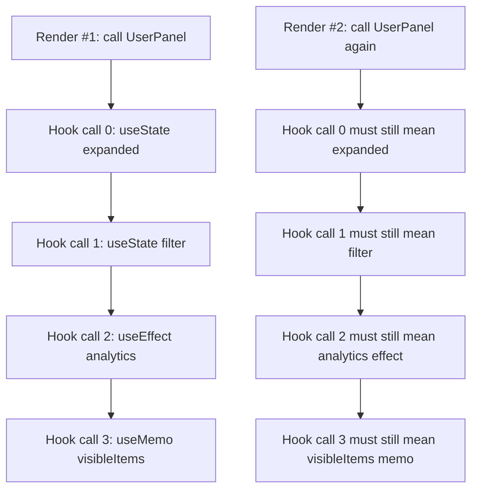
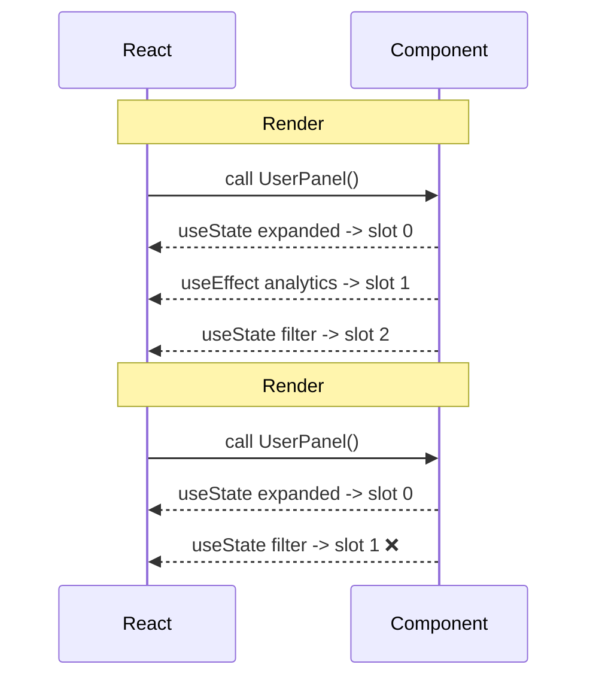
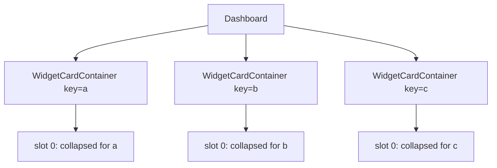

# Rules of Hooks as Runtime Contract

Hooks sering diajarkan dengan kalimat pendek:

> Jangan panggil Hooks di dalam `if`, loop, nested function, atau setelah early return.

Kalimat itu benar, tapi belum cukup. Kalau hanya dipahami sebagai *lint rule*, engineer akan melihatnya seperti aturan kosmetik. Padahal Rules of Hooks adalah **kontrak runtime** antara kode komponen dan React.

React tidak menyimpan state Hook berdasarkan nama variabel. React tidak melihat `const [count, setCount] = useState(0)` lalu menyimpan state dengan key `count`. React menyimpan state berdasarkan **urutan pemanggilan Hook** pada sebuah component instance.

Itulah inti bab ini.

Kalau urutan pemanggilan Hook berubah, React kehilangan peta:

```txt
Hook call #1 -> state/effect/ref/memo slot #1
Hook call #2 -> state/effect/ref/memo slot #2
Hook call #3 -> state/effect/ref/memo slot #3
```

Maka Rules of Hooks bukan preferensi. Ia adalah syarat agar React bisa menjawab:

```txt
Pada render berikutnya, nilai ini milik Hook yang mana?
Effect cleanup ini milik effect yang mana?
Ref ini harus dipertahankan di slot yang mana?
Memo cache ini valid untuk call site yang mana?
```

---

## 1. Model Dasar: Component Instance Punya Hook Slots

Bayangkan setiap instance komponen punya array internal seperti ini:

```txt
Fiber: UserPanel#42
hooks:
  [0] useState slot
  [1] useEffect slot
  [2] useMemo slot
  [3] useRef slot
```

Saat React memanggil komponen, React berjalan dari atas ke bawah. Setiap kali melihat Hook, React mengambil slot berikutnya.

```tsx
function UserPanel({ userId }: { userId: string }) {
  const [expanded, setExpanded] = useState(false);   // slot 0
  const [filter, setFilter] = useState("active");    // slot 1

  useEffect(() => {                                  // slot 2
    analytics.viewed("user_panel", { userId });
  }, [userId]);

  const visibleItems = useMemo(() => {               // slot 3
    return computeVisibleItems(userId, filter);
  }, [userId, filter]);

  return <section>{/* ... */}</section>;
}
```

React tidak butuh nama `expanded`, `filter`, atau `visibleItems`. Yang penting adalah urutannya stabil.



Kontraknya sederhana:

```txt
Untuk component instance yang sama,
setiap render harus memanggil Hook yang sama,
dalam urutan yang sama,
sebelum React bisa mengaitkan state lama ke render baru.
```

---

## 2. Kenapa Conditional Hook Merusak Mapping

Contoh buruk:

```tsx
function UserPanel({ userId, enableAnalytics }: Props) {
  const [expanded, setExpanded] = useState(false); // slot 0

  if (enableAnalytics) {
    useEffect(() => {                              // slot 1, kadang ada kadang tidak
      analytics.viewed("user_panel", { userId });
    }, [userId]);
  }

  const [filter, setFilter] = useState("active");  // slot 1 atau slot 2?

  return <section>{/* ... */}</section>;
}
```

Pada render pertama:

```txt
enableAnalytics = true
slot 0 -> expanded
slot 1 -> analytics effect
slot 2 -> filter
```

Pada render kedua:

```txt
enableAnalytics = false
slot 0 -> expanded
slot 1 -> filter
```

Sekarang `filter` mengambil posisi slot yang sebelumnya milik `analytics effect`. React tidak lagi punya peta yang benar.



Perbaikan yang benar bukan memaksa React memahami kondisi. Perbaikannya adalah **Hook tetap dipanggil**, kondisinya dipindah ke dalam Hook body.

```tsx
function UserPanel({ userId, enableAnalytics }: Props) {
  const [expanded, setExpanded] = useState(false);

  useEffect(() => {
    if (!enableAnalytics) return;

    analytics.viewed("user_panel", { userId });
  }, [enableAnalytics, userId]);

  const [filter, setFilter] = useState("active");

  return <section>{/* ... */}</section>;
}
```

Di sini urutan Hook stabil:

```txt
slot 0 -> expanded
slot 1 -> analytics effect
slot 2 -> filter
```

Efeknya boleh no-op. Hook call-nya tidak boleh hilang.

---

## 3. Early Return: Bug yang Sering Terlihat “Masuk Akal”

Contoh buruk:

```tsx
function UserDetails({ user }: { user: User | null }) {
  const [tab, setTab] = useState("profile");

  if (!user) {
    return <EmptyState />;
  }

  const [isEditing, setEditing] = useState(false); // ❌ kadang terpanggil

  return <ProfileEditor user={user} tab={tab} isEditing={isEditing} />;
}
```

Secara bisnis terlihat wajar: kalau tidak ada user, return kosong. Secara runtime, Hook call tidak stabil.

Render saat `user = null`:

```txt
slot 0 -> tab
return
```

Render saat `user != null`:

```txt
slot 0 -> tab
slot 1 -> isEditing
return
```

Ini melanggar kontrak.

Perbaikan:

```tsx
function UserDetails({ user }: { user: User | null }) {
  const [tab, setTab] = useState("profile");
  const [isEditing, setEditing] = useState(false);

  if (!user) {
    return <EmptyState />;
  }

  return <ProfileEditor user={user} tab={tab} isEditing={isEditing} />;
}
```

Namun ini memunculkan pertanyaan ownership: apakah `isEditing` perlu hidup ketika `user` tidak ada?

Kalau tidak, desain yang lebih bersih adalah memindahkan state ke child yang hanya ada saat user ada:

```tsx
function UserDetails({ user }: { user: User | null }) {
  const [tab, setTab] = useState("profile");

  if (!user) {
    return <EmptyState />;
  }

  return <UserProfileSession user={user} tab={tab} />;
}

function UserProfileSession({ user, tab }: { user: User; tab: string }) {
  const [isEditing, setEditing] = useState(false);

  return <ProfileEditor user={user} tab={tab} isEditing={isEditing} />;
}
```

Ini bukan hanya memperbaiki lint error. Ini memperbaiki model ownership:

```txt
tab       -> milik UserDetails, karena relevan bahkan sebelum user detail ditampilkan
isEditing -> milik UserProfileSession, karena hanya valid saat ada user session
```

---

## 4. Loop: Jumlah Hook Tidak Boleh Bergantung Pada Data

Contoh buruk:

```tsx
function Dashboard({ widgets }: { widgets: Widget[] }) {
  return (
    <div>
      {widgets.map((widget) => {
        const [collapsed, setCollapsed] = useState(false); // ❌

        return (
          <WidgetCard
            key={widget.id}
            widget={widget}
            collapsed={collapsed}
            onToggle={() => setCollapsed((value) => !value)}
          />
        );
      })}
    </div>
  );
}
```

Masalahnya bukan karena `map` buruk. Masalahnya karena jumlah Hook bergantung pada panjang array.

```txt
Render #1 widgets.length = 3 -> 3 useState calls
Render #2 widgets.length = 5 -> 5 useState calls
Render #3 widgets.length = 2 -> 2 useState calls
```

React tidak bisa memastikan slot mana milik widget mana.

Perbaikan umum: ekstrak komponen.

```tsx
function Dashboard({ widgets }: { widgets: Widget[] }) {
  return (
    <div>
      {widgets.map((widget) => (
        <WidgetCardContainer key={widget.id} widget={widget} />
      ))}
    </div>
  );
}

function WidgetCardContainer({ widget }: { widget: Widget }) {
  const [collapsed, setCollapsed] = useState(false);

  return (
    <WidgetCard
      widget={widget}
      collapsed={collapsed}
      onToggle={() => setCollapsed((value) => !value)}
    />
  );
}
```

Setiap `WidgetCardContainer` punya component instance sendiri. Setiap instance punya Hook slots sendiri.



Hook tetap ada di top-level komponen, bukan di loop callback.

---

## 5. Nested Function: Hook Tidak Boleh Tergantung Pemanggilan Manual

Contoh buruk:

```tsx
function SearchPage() {
  function createSearchState() {
    const [query, setQuery] = useState(""); // ❌
    return { query, setQuery };
  }

  const search = createSearchState();

  return <SearchBox value={search.query} onChange={search.setQuery} />;
}
```

Ini mungkin terlihat aman karena `createSearchState()` dipanggil setiap render. Tapi React tidak melihat `createSearchState` sebagai Hook. Ia hanya nested function biasa.

Masalahnya: fungsi itu bisa dipanggil secara kondisional, dipanggil dua kali, dilempar ke tempat lain, atau dipanggil bukan dari render.

Perbaikan: jadikan custom Hook.

```tsx
function useSearchState() {
  const [query, setQuery] = useState("");
  return { query, setQuery };
}

function SearchPage() {
  const search = useSearchState();

  return <SearchBox value={search.query} onChange={search.setQuery} />;
}
```

Prefix `use` bukan dekorasi nama. Ia memberi sinyal kontrak:

```txt
Fungsi ini boleh memanggil Hooks.
Fungsi ini harus dipanggil hanya dari component atau Hook lain.
Fungsi ini ikut tunduk pada Rules of Hooks.
```

---

## 6. Custom Hooks Tidak Menghilangkan Rules of Hooks

Custom Hook adalah cara mengekstrak **stateful protocol**, bukan cara mengakali aturan.

Ini buruk:

```tsx
function useMaybeAnalytics(enabled: boolean, userId: string) {
  if (!enabled) return; // ❌ early return sebelum Hook lain, kalau nanti ditambah

  useEffect(() => {
    analytics.viewed("profile", { userId });
  }, [userId]);
}
```

Lebih aman:

```tsx
function useAnalyticsView(enabled: boolean, userId: string) {
  useEffect(() => {
    if (!enabled) return;

    analytics.viewed("profile", { userId });
  }, [enabled, userId]);
}
```

Kalau custom Hook punya banyak internal Hooks, urutannya juga harus stabil:

```tsx
function useProfileScreen(userId: string, featureFlags: FeatureFlags) {
  const profile = useProfileQuery(userId);
  const permissions = usePermissionSet(userId);
  const editor = useProfileEditor(profile.data);

  useEffect(() => {
    if (!featureFlags.auditProfileViews) return;
    audit.log("profile_viewed", { userId });
  }, [featureFlags.auditProfileViews, userId]);

  return { profile, permissions, editor };
}
```

Custom Hook seperti ini membungkus protokol:

```txt
load profile
load permissions
prepare editor state
optionally audit profile view
return screen model
```

Yang optional adalah behaviour di dalam Hook, bukan Hook call-nya.

---

## 7. Rules of Hooks Membuat Local Reasoning Mungkin

Local reasoning berarti engineer bisa membuka satu komponen dan memahami kemampuan runtime-nya tanpa mencari panggilan tersembunyi di tempat lain.

React mendorong pola ini:

```tsx
function CasePage({ caseId }: Props) {
  const caseRecord = useCaseRecord(caseId);
  const permissions = useCasePermissions(caseId);
  const workflow = useCaseWorkflow(caseRecord.data);

  return <CaseView caseRecord={caseRecord} permissions={permissions} workflow={workflow} />;
}
```

Dari atas file saja terlihat:

```txt
Komponen ini membaca record kasus.
Komponen ini membaca permission.
Komponen ini mengelola workflow.
```

Bandingkan dengan kode ini:

```tsx
function CasePage({ caseId }: Props) {
  const model = buildCasePageModel({ caseId });
  return <CaseView model={model} />;
}
```

Kalau `buildCasePageModel` diam-diam memanggil Hook, kemampuan komponen tersembunyi. Ini buruk untuk code review, testing, dependency tracking, dan debugging.

Custom Hook dengan nama `useCasePageModel` lebih jujur:

```tsx
function CasePage({ caseId }: Props) {
  const model = useCasePageModel(caseId);
  return <CaseView model={model} />;
}
```

Nama bukan sekadar style. Nama menjaga kontrak arsitektural.

---

## 8. Hook Order Adalah Invariant

Invariant adalah aturan yang harus selalu benar agar sistem tidak runtuh.

Untuk Hooks, invariant-nya:

```txt
Given component type T and instance identity I,
for every render Rn of I,
the sequence of Hook call sites must be equivalent.
```

Secara lebih praktis:

```txt
Jangan buat Hook call dipengaruhi oleh:
- kondisi runtime
- panjang array
- hasil fetch
- permission
- feature flag
- locale
- role user
- viewport
- path route
- isi storage
- try/catch path
```

Semua hal di atas boleh memengaruhi **apa yang dilakukan oleh Hook**, tapi tidak boleh memengaruhi **apakah Hook dipanggil**.

---

## 9. Pola Transformasi: Dari Conditional Hook ke Stable Hook

### 9.1 Conditional Effect

Buruk:

```tsx
if (enabled) {
  useEffect(() => {
    subscribe();
    return unsubscribe;
  }, []);
}
```

Benar:

```tsx
useEffect(() => {
  if (!enabled) return;

  subscribe();
  return unsubscribe;
}, [enabled]);
```

### 9.2 Conditional State

Buruk:

```tsx
if (mode === "advanced") {
  const [advancedConfig, setAdvancedConfig] = useState(defaultAdvancedConfig);
}
```

Opsi 1: selalu punya state.

```tsx
const [advancedConfig, setAdvancedConfig] = useState(defaultAdvancedConfig);
```

Opsi 2: ekstrak child agar state hanya ada saat mode valid.

```tsx
return mode === "advanced" ? <AdvancedConfigPanel /> : <SimpleConfigPanel />;
```

### 9.3 Conditional Subscription

Buruk:

```tsx
if (user) {
  useUserPresence(user.id);
}
```

Benar:

```tsx
useUserPresence(user?.id ?? null);
```

Dengan Hook yang didesain untuk menerima `null`:

```tsx
function useUserPresence(userId: string | null) {
  useEffect(() => {
    if (!userId) return;

    return presence.subscribe(userId);
  }, [userId]);
}
```

### 9.4 Conditional Data Hook

Buruk:

```tsx
if (caseId) {
  const caseRecord = useCaseRecord(caseId);
}
```

Benar, tergantung library dan desain:

```tsx
const caseRecord = useCaseRecord(caseId, { enabled: caseId != null });
```

Atau:

```tsx
return caseId ? <CaseRecordPanel caseId={caseId} /> : <EmptyCasePanel />;
```

Rule desainnya:

```txt
Kalau state/subscription/cache harus menjadi bagian dari lifecycle child, ekstrak child.
Kalau Hook tetap milik parent tapi behaviour-nya optional, desain Hook agar menerima enabled/null parameter.
```

---

## 10. `use` Berbeda, Tapi Tidak Menghapus Disiplin

React modern memiliki API `use` yang memiliki pengecualian tertentu dibanding Hooks biasa. Namun dalam desain aplikasi produksi, jangan memakai pengecualian sebagai alasan untuk membuat control flow stateful yang sulit dibaca.

Prinsip praktis:

```txt
Untuk Hooks klasik seperti useState/useEffect/useMemo/useRef/useReducer:
  top-level, stable order, no conditional call.

Untuk API yang punya aturan khusus:
  ikuti dokumentasi spesifiknya,
  tapi tetap pertahankan local reasoning dan control flow yang jelas.
```

Kita tidak membangun sistem yang hanya “lolos runtime”. Kita membangun sistem yang bisa dipahami saat incident, saat migration, dan saat reviewer harus menilai correctness dalam 10 menit.

---

## 11. Failure Mode Catalogue

### 11.1 Rendered Fewer Hooks Than Expected

Biasanya terjadi ketika early return membuat sebagian Hook tidak terpanggil.

```tsx
function Panel({ visible }: { visible: boolean }) {
  const [a, setA] = useState(0);

  if (!visible) return null;

  const [b, setB] = useState(0); // ❌

  return <div />;
}
```

Gejalanya eksplisit: React bisa mendeteksi jumlah Hook berubah.

### 11.2 Rendered More Hooks Than During Previous Render

Biasanya terjadi ketika kondisi berubah dari false ke true sehingga Hook tambahan terpanggil.

```tsx
if (featureEnabled) {
  useEffect(() => {}, []); // ❌
}
```

### 11.3 State Slot Mismatch

Dalam beberapa situasi, bug terlihat seperti state “tertukar”. Ini paling berbahaya karena engineer sering mencari penyebab di tempat yang salah.

Contoh mental:

```txt
Render awal:
slot 0 -> name
slot 1 -> email

Render berikutnya:
slot 0 -> name
slot 1 -> phone
slot 2 -> email
```

Kalau sistem masih berjalan cukup jauh, UI bisa menunjukkan nilai aneh yang terlihat seperti race condition.

### 11.4 Cleanup Salah Sasaran

Effect cleanup bergantung pada mapping slot. Kalau slot berubah, cleanup bisa tidak mewakili subscription yang engineer pikir sedang dibersihkan.

```tsx
useEffect(() => {
  return externalSystem.subscribe(id);
}, [id]);
```

Effect bukan hanya “jalan setelah render”. Ia punya lifecycle internal: setup, dependency comparison, cleanup, setup lagi. Slot identity penting.

### 11.5 Hidden Hook via Utility Function

```tsx
function getCurrentUser() {
  return useContext(UserContext); // ❌ utility palsu
}
```

Ini harus menjadi:

```tsx
function useCurrentUser() {
  return useContext(UserContext);
}
```

Dan hanya dipanggil dari component atau Hook lain.

---

## 12. Hook API Design: Membuat Conditional Behaviour Tanpa Conditional Call

Custom Hook produksi sebaiknya punya desain input yang eksplisit.

### Pattern: `enabled`

```tsx
type UsePollingOptions = {
  enabled: boolean;
  intervalMs: number;
};

function usePolling(callback: () => void, options: UsePollingOptions) {
  const { enabled, intervalMs } = options;

  useEffect(() => {
    if (!enabled) return;

    const id = window.setInterval(callback, intervalMs);
    return () => window.clearInterval(id);
  }, [callback, enabled, intervalMs]);
}
```

Pemakaian:

```tsx
usePolling(refresh, {
  enabled: documentVisible && autoRefreshEnabled,
  intervalMs: 30_000,
});
```

Hook tetap terpanggil. Behaviour bisa mati.

### Pattern: Nullable Input

```tsx
function useCaseLock(caseId: string | null) {
  useEffect(() => {
    if (!caseId) return;

    return caseLockService.acquire(caseId);
  }, [caseId]);
}
```

Pemakaian:

```tsx
useCaseLock(selectedCaseId);
```

### Pattern: Component Extraction

Kalau state hanya bermakna dalam mode tertentu, ekstrak boundary.

```tsx
function PaymentPanel({ mode }: { mode: "card" | "bank" }) {
  if (mode === "card") return <CardPaymentFlow />;
  return <BankTransferFlow />;
}

function CardPaymentFlow() {
  const [cardNumber, setCardNumber] = useState("");
  const [cvv, setCvv] = useState("");
  return <CardForm cardNumber={cardNumber} cvv={cvv} />;
}
```

Ini membuat lifecycle state mengikuti lifecycle UI.

---

## 13. Hooks, Feature Flags, dan Permission

Feature flag dan permission sering menjadi sumber conditional Hook.

Buruk:

```tsx
function CaseActionPanel({ caseId, permissions }: Props) {
  if (permissions.canEscalate) {
    const escalation = useEscalationWorkflow(caseId); // ❌
    return <EscalationButton workflow={escalation} />;
  }

  return null;
}
```

Ada dua desain yang benar.

### Opsi A: Extract Authorized Child

```tsx
function CaseActionPanel({ caseId, permissions }: Props) {
  if (!permissions.canEscalate) return null;

  return <EscalationAction caseId={caseId} />;
}

function EscalationAction({ caseId }: { caseId: string }) {
  const escalation = useEscalationWorkflow(caseId);
  return <EscalationButton workflow={escalation} />;
}
```

Cocok kalau workflow benar-benar tidak perlu hidup saat permission tidak ada.

### Opsi B: Stable Hook dengan Disabled State

```tsx
function CaseActionPanel({ caseId, permissions }: Props) {
  const escalation = useEscalationWorkflow(caseId, {
    enabled: permissions.canEscalate,
  });

  if (!permissions.canEscalate) return null;

  return <EscalationButton workflow={escalation} />;
}
```

Cocok kalau parent perlu membaca state workflow untuk alasan lain, misalnya logging, prefetch, orkestra global, atau consistency.

Decision rule:

```txt
Gunakan child extraction jika lifecycle state harus mengikuti conditional UI.
Gunakan enabled/null input jika lifecycle Hook tetap milik parent, tapi aktivitasnya optional.
```

---

## 14. Hooks dan Error Handling

Jangan memanggil Hook di dalam `try/catch` untuk “mengamankan” render.

Buruk:

```tsx
function RiskyPanel() {
  try {
    const data = useRiskyData(); // ❌
    return <View data={data} />;
  } catch (error) {
    return <Fallback />;
  }
}
```

React punya model sendiri untuk error boundary dan Suspense. Error saat render ditangani oleh Error Boundary, bukan try/catch lokal yang membungkus Hook call.

Lebih benar:

```tsx
function RiskyPanel() {
  const data = useRiskyData();
  return <View data={data} />;
}

function RiskyPanelBoundary() {
  return (
    <ErrorBoundary fallback={<Fallback />}>
      <RiskyPanel />
    </ErrorBoundary>
  );
}
```

Untuk library data fetching, gunakan error state yang disediakan library atau boundary mode sesuai desain.

---

## 15. Hooks dan Dependency Injection

Kadang engineer ingin membuat Hook injectable:

```tsx
function UserPanel({ useUser = useUserQuery }) {
  const user = useUser();
  return <UserView user={user} />;
}
```

Ini berbahaya. Hook diperlakukan sebagai value biasa. React modern menganjurkan agar Hooks tidak diteruskan sebagai regular value karena mengaburkan kemampuan komponen dan menghambat local reasoning.

Alternatif yang lebih bersih:

### Inject service, bukan Hook

```tsx
type UserService = {
  getCurrentUser(): Promise<User>;
};

function UserPanel({ userService }: { userService: UserService }) {
  const user = useAsyncResource(() => userService.getCurrentUser(), [userService]);
  return <UserView user={user} />;
}
```

### Inject data lewat props

```tsx
function UserPanelContainer() {
  const user = useUserQuery();
  return <UserPanel user={user.data} status={user.status} />;
}

function UserPanel({ user, status }: UserPanelProps) {
  return <UserView user={user} status={status} />;
}
```

### Inject provider

```tsx
function App() {
  return (
    <UserServiceProvider value={realUserService}>
      <UserPanel />
    </UserServiceProvider>
  );
}
```

Hook tetap statis. Dependency yang berubah adalah service/data/provider.

---

## 16. Lint Rule Adalah Guardrail, Bukan Pengganti Pemahaman

`eslint-plugin-react-hooks` membantu mendeteksi banyak pelanggaran Rules of Hooks dan dependency effect. Namun lint tidak menggantikan desain.

Lint bisa berkata:

```txt
Hook dipanggil secara conditional.
Dependency effect kurang.
Hook dipanggil dari function biasa.
```

Lint tidak selalu bisa berkata:

```txt
State ini salah ownership.
Effect ini seharusnya event handler.
Custom Hook ini terlalu banyak responsibility.
Provider ini menyebabkan rerender luas.
Workflow ini punya impossible state.
```

Gunakan lint sebagai rem, bukan sebagai supir.

---

## 17. Code Review Checklist

Saat review kode React yang memakai Hooks, tanyakan:

```txt
1. Apakah semua Hook dipanggil di top-level component atau custom Hook?
2. Apakah ada Hook setelah early return?
3. Apakah ada Hook di dalam if, loop, callback, try/catch, atau nested function?
4. Apakah custom Hook selalu dipanggil dengan urutan stabil?
5. Apakah conditional behaviour dipindahkan ke dalam Hook body?
6. Apakah state conditional seharusnya diekstrak ke child component?
7. Apakah nama fungsi yang memanggil Hook diawali use?
8. Apakah utility function diam-diam memanggil Hook?
9. Apakah Hook diteruskan sebagai prop/value?
10. Apakah dependency injection dilakukan pada service/data, bukan Hook?
```

Checklist ini menangkap bug runtime sekaligus smell arsitektur.

---

## 18. Mini Exercise: Refactor Conditional Hooks

Refactor kode ini:

```tsx
function CaseSidebar({ caseId, enabled, permissions }: Props) {
  const [expanded, setExpanded] = useState(true);

  if (!enabled) {
    return null;
  }

  if (permissions.canViewAudit) {
    useEffect(() => {
      auditTrail.viewed(caseId);
    }, [caseId]);
  }

  const workflow = useCaseWorkflow(caseId);

  return <Sidebar workflow={workflow} expanded={expanded} />;
}
```

Solusi pertama:

```tsx
function CaseSidebar({ caseId, enabled, permissions }: Props) {
  const [expanded, setExpanded] = useState(true);

  useEffect(() => {
    if (!enabled) return;
    if (!permissions.canViewAudit) return;

    auditTrail.viewed(caseId);
  }, [caseId, enabled, permissions.canViewAudit]);

  const workflow = useCaseWorkflow(caseId, { enabled });

  if (!enabled) {
    return null;
  }

  return <Sidebar workflow={workflow} expanded={expanded} />;
}
```

Solusi kedua, jika workflow/sidebar state hanya valid saat enabled:

```tsx
function CaseSidebar({ caseId, enabled, permissions }: Props) {
  if (!enabled) return null;

  return <EnabledCaseSidebar caseId={caseId} permissions={permissions} />;
}

function EnabledCaseSidebar({ caseId, permissions }: EnabledProps) {
  const [expanded, setExpanded] = useState(true);
  const workflow = useCaseWorkflow(caseId);

  useEffect(() => {
    if (!permissions.canViewAudit) return;

    auditTrail.viewed(caseId);
  }, [caseId, permissions.canViewAudit]);

  return <Sidebar workflow={workflow} expanded={expanded} />;
}
```

Mana yang benar? Tergantung ownership.

```txt
Jika expanded/workflow harus reset ketika enabled=false -> ekstrak child.
Jika expanded/workflow harus tetap preserve walau UI hidden -> stable Hook di parent.
```

Rules of Hooks memaksa kita menjawab pertanyaan ownership. Itu fitur, bukan gangguan.

---

## 19. Mental Model Ringkas

```txt
Hook bukan function call biasa.
Hook adalah deklarasi kebutuhan runtime komponen.

useState    -> saya butuh memory slot.
useEffect   -> saya butuh synchronization slot.
useRef      -> saya butuh mutable cell slot.
useMemo     -> saya butuh memo cache slot.
useReducer  -> saya butuh transition state slot.
useContext  -> saya butuh dependency dari provider tree.

Karena React mengaitkan semua itu berdasarkan urutan,
urutan Hook adalah bagian dari correctness aplikasi.
```

---

## 20. Kesimpulan

Rules of Hooks bukan aturan hafalan. Ia adalah kontrak agar React bisa mempertahankan state, effect, ref, memo, reducer, dan subscription secara benar antar-render.

Kalau ada kebutuhan conditional, jangan conditional-kan Hook call. Pilih salah satu:

```txt
1. Pindahkan kondisi ke dalam Hook body.
2. Buat Hook menerima enabled/null input.
3. Ekstrak child component agar lifecycle state mengikuti lifecycle UI.
```

Engineer React yang matang tidak bertanya:

```txt
Bagaimana cara lolos lint?
```

Ia bertanya:

```txt
Lifecycle state ini milik siapa?
Apakah Hook ini harus selalu menjadi bagian dari component instance?
Kalau kondisi berubah, apakah state harus preserve atau reset?
Apakah dependency runtime komponen terlihat jelas dari top-level body?
```

Itulah cara membaca Rules of Hooks pada level arsitektur.

---

## Referensi Resmi

- React Docs — Rules of Hooks: https://react.dev/reference/rules/rules-of-hooks
- React Docs — Rules of React: https://react.dev/reference/rules
- React Docs — Components and Hooks must be pure: https://react.dev/reference/rules/components-and-hooks-must-be-pure
- React Docs — React calls Components and Hooks: https://react.dev/reference/rules/react-calls-components-and-hooks
- React Docs — eslint-plugin-react-hooks/rules-of-hooks: https://react.dev/reference/eslint-plugin-react-hooks/lints/rules-of-hooks
