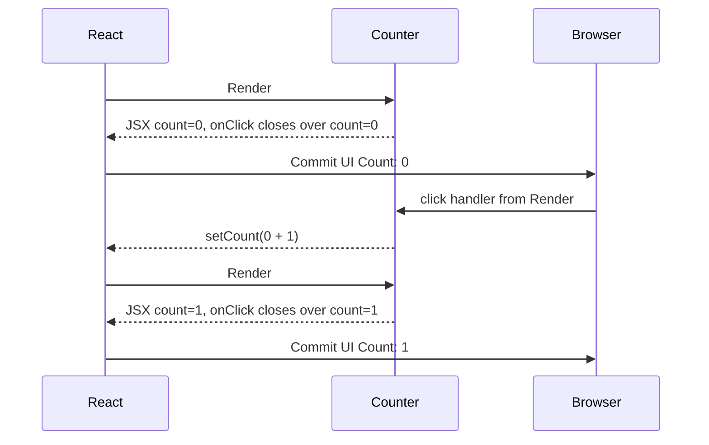
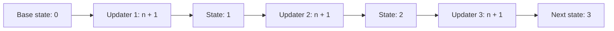
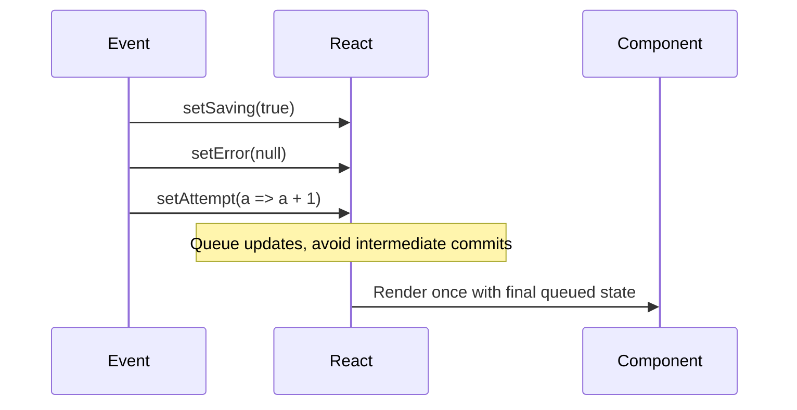

# State as Snapshot, Not Variable

Kesalahan mental model paling mahal dalam React adalah menganggap state seperti variabel mutable biasa.

```tsx
const [count, setCount] = useState(0);

setCount(count + 1);
console.log(count); // banyak engineer berharap ini 1
```

Dalam React, `count` pada render saat ini adalah **snapshot**. Ia bukan pointer ke nilai terbaru yang terus berubah. Saat React memanggil component function, React memberikan satu frame data: props, state, context, local variables, dan event handlers yang dihitung untuk render itu.

Render menghasilkan snapshot UI.

Event handler yang melekat pada UI tersebut juga membawa snapshot state dari render yang sama.

Maka pertanyaan yang benar bukan:

```txt
Kenapa state tidak langsung berubah?
```

Pertanyaan yang benar:

```txt
Render mana yang sedang saya baca?
Event handler ini berasal dari snapshot render yang mana?
Update yang saya enqueue akan dihitung dari nilai apa?
```

---

## 1. Render Mengambil Snapshot

Saat komponen dirender, React memanggil function component:

```tsx
function Counter() {
  const [count, setCount] = useState(0);

  return (
    <button onClick={() => setCount(count + 1)}>
      Count: {count}
    </button>
  );
}
```

Pada render awal:

```txt
count = 0
JSX = <button>Count: 0</button>
onClick = function yang melihat count sebagai 0
```

Ketika user klik button, handler yang berjalan adalah handler dari snapshot itu. Di dalam handler tersebut, `count` tetap `0`.

Setelah `setCount(count + 1)`, React menjadwalkan render baru dengan state berikutnya `1`. Baru pada render berikutnya, component function dipanggil lagi dan menerima snapshot baru:

```txt
count = 1
JSX = <button>Count: 1</button>
onClick = function baru yang melihat count sebagai 1
```



State berubah dengan menghasilkan render baru. Ia tidak mengubah variabel lokal di render lama.

---

## 2. Render Lama Tidak Bisa Diubah

Setiap render adalah frame yang immutable dari perspektif kode component.

```tsx
function Counter() {
  const [count, setCount] = useState(0);

  function handleClick() {
    setCount(count + 1);
    alert(count);
  }

  return <button onClick={handleClick}>Increment</button>;
}
```

Kalau `count` saat render adalah `0`, maka `alert(count)` akan menampilkan `0`, bukan `1`.

Kenapa? Karena handler itu bagian dari render yang melihat `count = 0`.

Ini bukan bug. Ini membuat render deterministic.

```txt
Input render:
  props, state, context

Output render:
  JSX, handlers, closures

Setelah output dibuat,
closure itu tidak diam-diam berubah.
```

Kalau closure render lama bisa berubah diam-diam, debugging event UI akan jauh lebih sulit. React memilih model snapshot agar setiap handler bisa dipahami berdasarkan render tempat ia dibuat.

---

## 3. Setter Adalah Request, Bukan Assignment

`setCount` bukan assignment seperti ini:

```ts
count = count + 1;
```

Lebih tepat dibaca seperti ini:

```txt
React, untuk render berikutnya, jadwalkan count menjadi count + 1 berdasarkan snapshot saat ini.
```

Contoh klasik:

```tsx
function Counter() {
  const [count, setCount] = useState(0);

  function incrementThreeTimes() {
    setCount(count + 1);
    setCount(count + 1);
    setCount(count + 1);
  }

  return <button onClick={incrementThreeTimes}>+3</button>;
}
```

Banyak orang berharap hasilnya `3`. Hasilnya `1`.

Jika `count = 0`, maka tiga baris itu semuanya membaca snapshot yang sama:

```txt
setCount(0 + 1)
setCount(0 + 1)
setCount(0 + 1)
```

React menerima tiga request untuk menjadikan state berikutnya `1`.

---

## 4. Updater Function: Mengubah Request Menjadi Transformasi

Kalau update berikutnya harus bergantung pada state sebelumnya, gunakan updater function.

```tsx
function incrementThreeTimes() {
  setCount((n) => n + 1);
  setCount((n) => n + 1);
  setCount((n) => n + 1);
}
```

Sekarang hasilnya `3`.

Modelnya:

```txt
Queue:
  n => n + 1
  n => n + 1
  n => n + 1

Base state: 0
Step 1: 0 -> 1
Step 2: 1 -> 2
Step 3: 2 -> 3
Next state: 3
```



Rule praktis:

```txt
Jika next state bergantung pada current state,
gunakan updater function.
```

Bukan karena selalu wajib. Tapi karena updater function menyatakan intent dengan lebih benar.

---

## 5. Batching: React Mengumpulkan Update Dalam Satu Event

Dalam event handler, React dapat mengumpulkan beberapa update dan melakukan render setelah handler selesai.

```tsx
function handleClick() {
  setSaving(true);
  setError(null);
  setAttempt((value) => value + 1);

  // React belum harus commit UI di tengah-tengah handler ini.
}
```

Ini penting untuk performa dan konsistensi. UI tidak perlu melewati state antara yang setengah matang:

```txt
saving=true, error masih lama, attempt belum naik
saving=true, error=null, attempt belum naik
saving=true, error=null, attempt naik
```

React bisa langsung menghasilkan snapshot final untuk render berikutnya.



Mental modelnya:

```txt
Di dalam event handler, setter mengantrekan update.
Render baru terjadi setelah React memproses queue.
```

---

## 6. Snapshot dan Stale Closure

Stale closure terjadi ketika function yang berjalan belakangan masih membawa state dari render lama.

Contoh:

```tsx
function DelayedCounter() {
  const [count, setCount] = useState(0);

  function handleClick() {
    setTimeout(() => {
      setCount(count + 1);
    }, 1000);
  }

  return <button onClick={handleClick}>Delayed +1</button>;
}
```

Jika user klik tiga kali cepat saat `count = 0`, setiap timeout callback membawa snapshot `count = 0`.

Setelah satu detik:

```txt
callback #1 -> setCount(0 + 1)
callback #2 -> setCount(0 + 1)
callback #3 -> setCount(0 + 1)
```

Hasil akhirnya `1`, bukan `3`.

Perbaikan:

```tsx
function handleClick() {
  setTimeout(() => {
    setCount((current) => current + 1);
  }, 1000);
}
```

Updater function membaca state terbaru saat queue diproses, bukan snapshot closure lama.

---

## 7. Snapshot dan Async/Await

Async handler punya masalah yang sama.

```tsx
async function handleSave() {
  setStatus("saving");

  await saveDraft(draft);

  setStatus("saved");
  console.log(status); // snapshot lama
}
```

`status` setelah `await` tetap status dari render tempat handler dibuat. `await` tidak membuat local variable React otomatis berubah.

Kalau perlu menjalankan logic berdasarkan hasil operasi, gunakan nilai eksplisit dari operasi tersebut, bukan membaca state lama.

```tsx
async function handleSave() {
  setStatus("saving");

  const result = await saveDraft(draft);

  if (result.ok) {
    setStatus("saved");
  } else {
    setStatus("failed");
  }
}
```

Kalau perlu menghindari response lama menimpa response baru, tambahkan request identity.

```tsx
function useDraftSave() {
  const [status, setStatus] = useState<"idle" | "saving" | "saved" | "failed">("idle");
  const latestRequestId = useRef(0);

  async function save(currentDraft: Draft) {
    const requestId = latestRequestId.current + 1;
    latestRequestId.current = requestId;

    setStatus("saving");

    const result = await saveDraft(currentDraft);

    if (latestRequestId.current !== requestId) {
      return;
    }

    setStatus(result.ok ? "saved" : "failed");
  }

  return { status, save };
}
```

Di sini `useRef` bukan untuk memaksa render. Ia menyimpan mutable cell lintas-render untuk membedakan request terbaru.

---

## 8. Snapshot dan Object Mutation

State snapshot bukan berarti object di dalamnya otomatis immutable secara JavaScript. Kalau Anda mutasi object state langsung, Anda merusak kontrak React.

Buruk:

```tsx
const [user, setUser] = useState({ name: "Ayu", role: "reviewer" });

function promote() {
  user.role = "admin"; // ❌ mutasi object dari snapshot lama
  setUser(user);
}
```

Masalah:

```txt
Reference object sama.
React tidak mendapat snapshot baru yang jelas.
Render lama dan render baru bisa berbagi object yang sudah berubah.
Debugging time-travel mental model rusak.
Memoization dan equality check menjadi tidak terpercaya.
```

Benar:

```tsx
function promote() {
  setUser((current) => ({
    ...current,
    role: "admin",
  }));
}
```

Untuk nested object:

```tsx
setCaseRecord((current) => ({
  ...current,
  assignee: {
    ...current.assignee,
    role: "lead_reviewer",
  },
}));
```

Rule praktis:

```txt
State update harus menghasilkan snapshot baru,
bukan mengubah snapshot lama.
```

---

## 9. Derived Values Juga Snapshot

```tsx
function InvoiceSummary({ invoice }: { invoice: Invoice }) {
  const total = invoice.lines.reduce((sum, line) => sum + line.amount, 0);

  function handleSubmit() {
    submitInvoice({ invoiceId: invoice.id, total });
  }

  return <button onClick={handleSubmit}>Submit {total}</button>;
}
```

`total` juga bagian dari snapshot render. Handler melihat `total` dari render itu.

Ini biasanya benar. Yang berbahaya adalah menyimpan derived value sebagai state tanpa alasan.

Buruk:

```tsx
const [total, setTotal] = useState(0);

useEffect(() => {
  setTotal(invoice.lines.reduce((sum, line) => sum + line.amount, 0));
}, [invoice.lines]);
```

Lebih benar:

```tsx
const total = invoice.lines.reduce((sum, line) => sum + line.amount, 0);
```

Kalau mahal, memoize:

```tsx
const total = useMemo(() => {
  return invoice.lines.reduce((sum, line) => sum + line.amount, 0);
}, [invoice.lines]);
```

Tapi jangan simpan derived state hanya karena ingin “mengikuti perubahan”. Render sudah menghitung snapshot baru saat input berubah.

---

## 10. Event Handler Membawa Intent dari Snapshot

Bayangkan tombol:

```tsx
<button onClick={() => approve(caseId, version)}>
  Approve
</button>
```

Handler ini membawa `caseId` dan `version` dari snapshot UI yang user lihat saat tombol itu dirender.

Itu sering desirable. Misalnya dalam sistem regulatory/case management, ketika user melihat case version `17` dan menekan approve, command harus menyertakan version `17` sebagai concurrency guard.

```tsx
async function handleApprove() {
  const result = await approveCase({
    caseId,
    expectedVersion: version,
  });

  if (result.type === "version_conflict") {
    showConflictDialog(result.currentVersion);
    return;
  }

  showSuccess();
}
```

Snapshot lama bukan selalu bug. Kadang ia justru menjaga auditability:

```txt
User bertindak berdasarkan data yang dia lihat.
Command membawa versi data yang dia lihat.
Server bisa menolak jika data sudah berubah.
```

Masalah terjadi ketika engineer salah mengira closure akan membaca state terbaru.

---

## 11. Kapan Butuh Latest Value?

Ada kasus ketika callback harus membaca nilai paling baru, bukan snapshot saat callback dibuat.

Contoh:

```txt
- websocket message handler
- interval polling
- document event listener
- debounced callback
- long-lived subscription
- async response arbitration
```

Gunakan `useRef` untuk latest value dengan hati-hati.

```tsx
function useLatest<T>(value: T) {
  const ref = useRef(value);

  useEffect(() => {
    ref.current = value;
  }, [value]);

  return ref;
}
```

Pemakaian:

```tsx
function SearchBox({ onSearch }: { onSearch: (query: string) => void }) {
  const [query, setQuery] = useState("");
  const latestQuery = useLatest(query);

  useEffect(() => {
    const id = window.setInterval(() => {
      if (latestQuery.current.length > 2) {
        onSearch(latestQuery.current);
      }
    }, 1000);

    return () => window.clearInterval(id);
  }, [latestQuery, onSearch]);

  return <input value={query} onChange={(event) => setQuery(event.target.value)} />;
}
```

Namun jangan jadikan ref sebagai default state management. Ref tidak memicu render. Ia escape hatch.

Rule:

```txt
Gunakan state untuk nilai yang memengaruhi UI.
Gunakan ref untuk mutable value lintas-render yang tidak perlu memicu UI update.
```

---

## 12. Snapshot dan Reducer

`useReducer` membantu ketika update bukan sekadar assignment, tapi transisi domain lokal.

Daripada:

```tsx
setStatus("saving");
setError(null);
setAttempt((value) => value + 1);
```

Buat event eksplisit:

```tsx
type SaveState = {
  status: "idle" | "saving" | "saved" | "failed";
  error: string | null;
  attempt: number;
};

type SaveEvent =
  | { type: "save_started" }
  | { type: "save_succeeded" }
  | { type: "save_failed"; error: string };

function reducer(state: SaveState, event: SaveEvent): SaveState {
  switch (event.type) {
    case "save_started":
      return {
        ...state,
        status: "saving",
        error: null,
        attempt: state.attempt + 1,
      };

    case "save_succeeded":
      return {
        ...state,
        status: "saved",
        error: null,
      };

    case "save_failed":
      return {
        ...state,
        status: "failed",
        error: event.error,
      };
  }
}
```

Reducer membuat state snapshot berubah lewat event yang jelas.

```tsx
const [state, dispatch] = useReducer(reducer, {
  status: "idle",
  error: null,
  attempt: 0,
});

async function handleSave() {
  dispatch({ type: "save_started" });

  const result = await saveDraft();

  if (result.ok) {
    dispatch({ type: "save_succeeded" });
  } else {
    dispatch({ type: "save_failed", error: result.error });
  }
}
```

Ini tidak menghilangkan snapshot model. Ini membuat transisi antar snapshot lebih eksplisit.

---

## 13. Snapshot dan Controlled Inputs

Controlled input adalah contoh snapshot loop yang sehat:

```tsx
function NameInput() {
  const [name, setName] = useState("");

  return (
    <input
      value={name}
      onChange={(event) => setName(event.target.value)}
    />
  );
}
```

Loop-nya:

```txt
User mengetik
Browser mengirim event
Handler membaca event.target.value
Setter menjadwalkan state baru
React render snapshot baru
Input value mengikuti snapshot baru
```

```mermaid
flowchart TD
    A[User types] --> B[onChange event]
    B --> C[Read event.target.value]
    C --> D[setName(nextValue)]
    D --> E[React renders new snapshot]
    E --> F[input value = name]
```

Yang perlu diperhatikan: jangan membaca `name` setelah `setName` dan berharap nilai baru.

```tsx
function handleChange(event: ChangeEvent<HTMLInputElement>) {
  setName(event.target.value);

  // name masih snapshot lama.
  // Gunakan event.target.value jika butuh nilai baru di handler ini.
}
```

Benar:

```tsx
function handleChange(event: ChangeEvent<HTMLInputElement>) {
  const nextName = event.target.value;

  setName(nextName);
  validateName(nextName);
}
```

---

## 14. Snapshot dan Multi-State Consistency

Bug umum:

```tsx
const [startDate, setStartDate] = useState<Date | null>(null);
const [endDate, setEndDate] = useState<Date | null>(null);
const [duration, setDuration] = useState(0);
```

`duration` derived dari `startDate` dan `endDate`, tapi disimpan sebagai state terpisah. Ini membuka kemungkinan snapshot tidak konsisten:

```txt
startDate = Jan 1
endDate = Jan 10
duration = 0 ❌
```

Lebih baik:

```tsx
const duration = startDate && endDate
  ? differenceInDays(endDate, startDate)
  : 0;
```

Kalau ada banyak state yang harus berubah atomically, gunakan reducer.

```tsx
type DateRangeState = {
  startDate: Date | null;
  endDate: Date | null;
};

function reducer(state: DateRangeState, event: DateRangeEvent): DateRangeState {
  switch (event.type) {
    case "start_changed": {
      const startDate = event.date;
      const endDate = state.endDate && startDate && state.endDate < startDate
        ? null
        : state.endDate;

      return { startDate, endDate };
    }

    case "end_changed":
      return { ...state, endDate: event.date };
  }
}
```

Invariant berada di transition logic, bukan tersebar di beberapa setter.

---

## 15. Snapshot, Identity, dan Reset

State snapshot melekat pada component identity. Jika identity berubah, state reset.

```tsx
function App({ userId }: { userId: string }) {
  return <ProfileEditor key={userId} userId={userId} />;
}
```

`key={userId}` memberi tahu React:

```txt
Kalau userId berubah, ini instance berbeda.
Jangan preserve state editor lama.
```

Ini berguna untuk form editor:

```txt
Edit user A -> draft name: "Ayu Updated"
Switch ke user B -> form harus reset ke B
```

Tanpa key, state lokal bisa preserve dan menghasilkan draft yang salah.

Snapshot state tidak hanya soal nilai. Ia juga soal instance identity.

---

## 16. Failure Mode Catalogue

### 16.1 Read After Set

```tsx
setCount(count + 1);
doSomething(count); // membaca snapshot lama
```

Perbaikan:

```tsx
const nextCount = count + 1;
setCount(nextCount);
doSomething(nextCount);
```

Atau gunakan updater jika bergantung pada current state queue:

```tsx
setCount((current) => {
  const next = current + 1;
  return next;
});
```

Hindari side effect di updater. Updater harus pure.

### 16.2 Multiple Updates Based on Same Snapshot

```tsx
setCount(count + 1);
setCount(count + 1);
setCount(count + 1);
```

Perbaikan:

```tsx
setCount((n) => n + 1);
setCount((n) => n + 1);
setCount((n) => n + 1);
```

### 16.3 Async Callback Uses Old State

```tsx
setTimeout(() => {
  setCount(count + 1);
}, 1000);
```

Perbaikan:

```tsx
setTimeout(() => {
  setCount((current) => current + 1);
}, 1000);
```

### 16.4 Mutating Snapshot Object

```tsx
state.items.push(newItem);
setState(state);
```

Perbaikan:

```tsx
setState((current) => ({
  ...current,
  items: [...current.items, newItem],
}));
```

### 16.5 Duplicated Derived State

```tsx
const [items, setItems] = useState<Item[]>([]);
const [count, setCount] = useState(0);
```

Perbaikan:

```tsx
const count = items.length;
```

### 16.6 Race Response Overwrites Newer State

```tsx
async function loadUser(userId: string) {
  const user = await api.getUser(userId);
  setUser(user);
}
```

Jika `loadUser("A")` lambat dan `loadUser("B")` cepat, response A bisa menimpa B.

Perbaikan sederhana:

```tsx
const latestRequestId = useRef(0);

async function loadUser(userId: string) {
  const requestId = latestRequestId.current + 1;
  latestRequestId.current = requestId;

  const user = await api.getUser(userId);

  if (latestRequestId.current !== requestId) return;

  setUser(user);
}
```

Untuk server state, biasanya lebih baik gunakan cache library seperti TanStack Query yang memang menangani identity, stale data, observer, cancellation, dan invalidation.

---

## 17. Decision Matrix: Snapshot Lama atau Latest Value?

| Situasi | Baca Snapshot Lama? | Butuh Latest? | Pola |
|---|---:|---:|---|
| Button submit membawa form version yang user lihat | Ya | Tidak selalu | Closure snapshot + server version guard |
| Increment berdasarkan nilai sekarang | Tidak | Ya | Updater function |
| Timeout increment | Tidak | Ya | Updater function |
| Interval membaca setting terbaru | Tidak | Ya | Ref latest value |
| Controlled input validate nilai baru | Tidak | Nilai event | Local `nextValue` dari event |
| Async save result | Tidak baca state lama | Result eksplisit | Branch dari response |
| Race request | Tidak | Latest request identity | Ref request id / abort / query library |
| Derived display total | Snapshot render cukup | Tidak | Derive during render / memo |

---

## 18. Production Pattern: Snapshot-Aware Command Handler

Contoh dalam aplikasi case management:

```tsx
type CaseRecord = {
  id: string;
  version: number;
  status: "draft" | "review" | "approved" | "rejected";
};

function CaseApprovalPanel({ caseRecord }: { caseRecord: CaseRecord }) {
  const [submitting, setSubmitting] = useState(false);
  const [error, setError] = useState<string | null>(null);

  async function handleApprove() {
    const command = {
      caseId: caseRecord.id,
      expectedVersion: caseRecord.version,
      action: "approve" as const,
    };

    setSubmitting(true);
    setError(null);

    const result = await approveCase(command);

    setSubmitting(false);

    if (result.type === "version_conflict") {
      setError("Case changed while you were reviewing it. Refresh before approving.");
      return;
    }

    if (result.type === "rejected_by_policy") {
      setError(result.reason);
      return;
    }
  }

  return (
    <section>
      <button disabled={submitting} onClick={handleApprove}>
        Approve version {caseRecord.version}
      </button>
      {error && <p role="alert">{error}</p>}
    </section>
  );
}
```

Notice:

```txt
Command dibuat dari snapshot yang user lihat.
Version dikirim sebagai expectedVersion.
Server menjaga concurrency.
UI tidak berpura-pura selalu punya latest state.
```

Snapshot model cocok dengan sistem yang butuh auditability.

---

## 19. Production Pattern: Avoiding Double Submit

```tsx
function SubmitButton({ submit }: { submit: () => Promise<void> }) {
  const [pending, setPending] = useState(false);

  async function handleClick() {
    if (pending) return;

    setPending(true);

    try {
      await submit();
    } finally {
      setPending(false);
    }
  }

  return (
    <button disabled={pending} onClick={handleClick}>
      {pending ? "Submitting..." : "Submit"}
    </button>
  );
}
```

Ada edge case: dua click bisa terjadi sebelum render disabled commit, terutama pada interaction cepat atau programmatic call. Untuk sistem high-stakes, gunakan idempotency key atau ref guard.

```tsx
function SubmitButton({ submit }: { submit: () => Promise<void> }) {
  const [pending, setPending] = useState(false);
  const inFlight = useRef(false);

  async function handleClick() {
    if (inFlight.current) return;

    inFlight.current = true;
    setPending(true);

    try {
      await submit();
    } finally {
      inFlight.current = false;
      setPending(false);
    }
  }

  return (
    <button disabled={pending} onClick={handleClick}>
      {pending ? "Submitting..." : "Submit"}
    </button>
  );
}
```

State mengontrol UI. Ref menjaga synchronous in-flight guard. Server tetap sebaiknya memakai idempotency key untuk correctness end-to-end.

---

## 20. Checklist Debugging Snapshot Bugs

Saat UI terlihat memakai state lama, tanyakan:

```txt
1. Apakah kode membaca state tepat setelah setter?
2. Apakah beberapa setter memakai snapshot yang sama padahal butuh incremental update?
3. Apakah callback berjalan belakangan lewat timeout, interval, promise, subscription, atau debounce?
4. Apakah object/array state dimutasi langsung?
5. Apakah derived state disimpan terpisah dan menjadi tidak sinkron?
6. Apakah response async lama menimpa response baru?
7. Apakah event handler memang harus memakai snapshot yang user lihat?
8. Apakah state harus menjadi ref karena tidak memengaruhi render?
9. Apakah state harus menjadi reducer karena transisinya punya invariant?
10. Apakah state harus dipindahkan ke server-state cache library?
```

---

## 21. Mental Model Ringkas

```txt
State dalam render adalah snapshot.
Setter tidak mengubah snapshot lama.
Setter menjadwalkan snapshot berikutnya.
Event handler membawa snapshot render tempat ia dibuat.
Updater function adalah transformasi atas queued current state.
Ref adalah mutable cell lintas-render, bukan UI state.
Reducer adalah mesin transisi untuk snapshot yang punya invariant.
```

---

## 22. Kesimpulan

React state bukan variabel mutable. Ia adalah input untuk render saat ini dan basis untuk render berikutnya.

Kalau next value bergantung pada current value, gunakan updater function.

Kalau callback berjalan lama setelah render, sadari closure-nya membawa snapshot lama.

Kalau butuh nilai terbaru tanpa render, gunakan ref dengan disiplin.

Kalau beberapa field harus berubah bersama dan menjaga invariant, gunakan reducer.

Kalau data dimiliki server, jangan paksa masuk mental model local state; gunakan server-state pattern.

Engineer React yang kuat tidak hanya tahu `useState`. Ia tahu kapan state yang dibaca adalah fakta saat ini, kapan itu snapshot historis, dan kapan snapshot historis justru diperlukan untuk command correctness.

---

## Referensi Resmi

- React Docs — State as a Snapshot: https://react.dev/learn/state-as-a-snapshot
- React Docs — Queueing a Series of State Updates: https://react.dev/learn/queueing-a-series-of-state-updates
- React Docs — State: A Component's Memory: https://react.dev/learn/state-a-components-memory
- React Docs — Updating Objects in State: https://react.dev/learn/updating-objects-in-state
- React Docs — Choosing the State Structure: https://react.dev/learn/choosing-the-state-structure
- React Docs — Preserving and Resetting State: https://react.dev/learn/preserving-and-resetting-state
