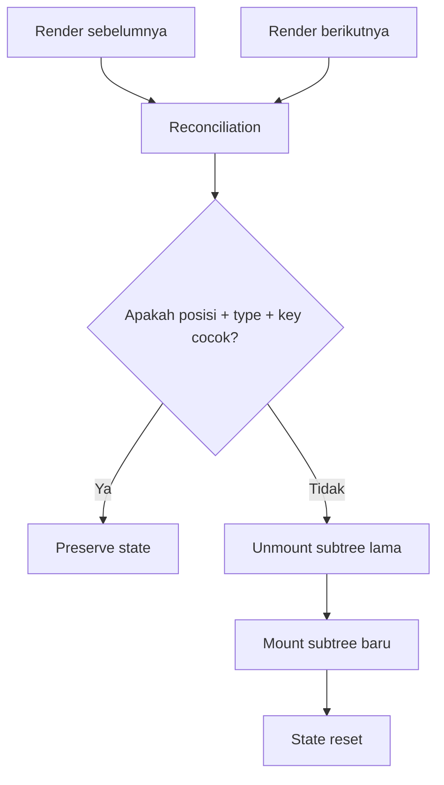
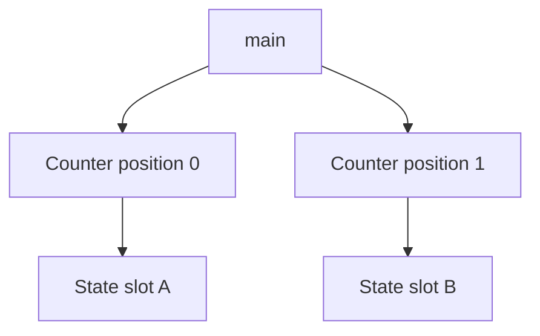
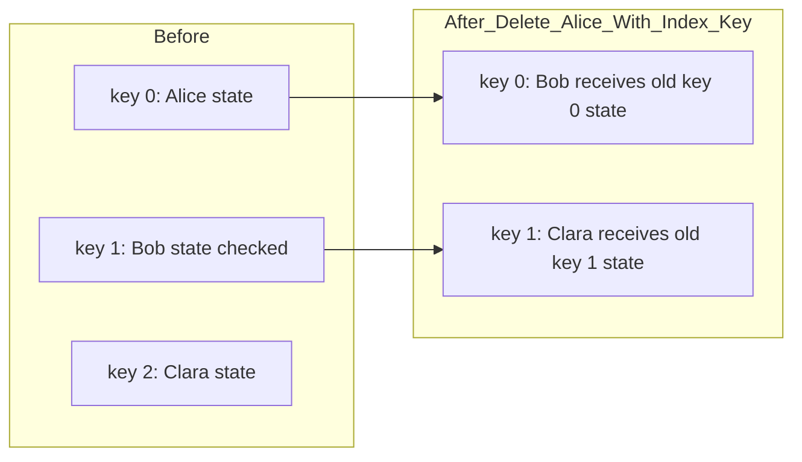

# Component Identity and State Preservation

React tidak menyimpan state di dalam function component seperti object instance klasik.
React menyimpan state pada **posisi logis di render tree**.

Ini detail kecil yang dampaknya besar.

Banyak bug React yang terlihat seperti:

```txt
input tiba-tiba reset
modal menyimpan data lama
form user A bocor ke user B
state tab tidak hilang ketika entity berubah
list item salah mempertahankan checkbox
component seperti remount padahal tidak diinginkan
component tidak remount padahal harus reset
```

Akar masalahnya sering sama: engineer belum membedakan antara:

```txt
Komponen sebagai function/type
Elemen sebagai hasil render
Instance logis sebagai posisi + type + key
State sebagai memori yang ditempelkan ke instance logis itu
```

Di bagian ini kita tidak bicara `key` hanya sebagai solusi warning list.
Kita bicara `key` sebagai **identity boundary**.

---

## 1. Mental Model Utama

React perlu menjawab satu pertanyaan pada setiap render:

```txt
Bagian tree mana yang sama dengan render sebelumnya?
Bagian mana yang baru?
Bagian mana yang harus dibuang?
```

Kalau React menganggap sebuah subtree masih sama, state di dalamnya dipertahankan.
Kalau React menganggap subtree berbeda, state lama dibuang dan subtree baru dibuat.



Rule praktisnya:

```txt
State dipertahankan jika React melihat komponen berada pada posisi yang sama,
dengan tipe yang sama,
dan key yang sama bila key digunakan.
```

---

## 2. Identity Bukan Nama Variable

Perhatikan contoh ini:

```tsx
function App({ mode }: { mode: 'edit' | 'preview' }) {
  let content;

  if (mode === 'edit') {
    content = <Editor />;
  } else {
    content = <Preview />;
  }

  return <section>{content}</section>;
}
```

`content` hanya variable JavaScript.
React tidak peduli nama variable itu.
React peduli bentuk tree yang dikembalikan:

```txt
section
└── Editor
```

atau:

```txt
section
└── Preview
```

Karena tipe anak berubah dari `Editor` ke `Preview`, React membuang subtree lama dan membuat subtree baru.
State `Editor` tidak mungkin dipertahankan sebagai state `Preview`.

Sekarang contoh lain:

```tsx
function App({ compact }: { compact: boolean }) {
  if (compact) {
    return <ProfileCard density="compact" />;
  }

  return <ProfileCard density="comfortable" />;
}
```

Meskipun ada dua cabang `return`, React melihat tipe komponen yang sama pada posisi yang sama:

```txt
ProfileCard key=null
```

Maka state `ProfileCard` dipertahankan.
Yang berubah hanya props.

---

## 3. Posisi di Tree Adalah Bagian dari Identity

Dua komponen dengan tipe sama tetap bisa memiliki state berbeda jika berada di posisi berbeda.

```tsx
function Dashboard() {
  return (
    <main>
      <Counter />
      <Counter />
    </main>
  );
}
```

Tree logis:

```txt
main
├── Counter at index 0
└── Counter at index 1
```

Dua `Counter` ini bukan satu state yang dipakai bersama.
Masing-masing punya slot state sendiri.



Ini sebabnya React bisa menjaga state per component occurrence, bukan per component type.

---

## 4. State Preservation: Saat React Menganggap Tree Sama

Contoh:

```tsx
function UserPanel({ userId }: { userId: string }) {
  const [draft, setDraft] = useState('');

  return (
    <section>
      <h2>User {userId}</h2>
      <textarea value={draft} onChange={(e) => setDraft(e.target.value)} />
    </section>
  );
}

function App({ selectedUserId }: { selectedUserId: string }) {
  return <UserPanel userId={selectedUserId} />;
}
```

Saat `selectedUserId` berubah dari `alice` ke `bob`, state `draft` tetap dipertahankan.
Kenapa?

Karena dari sudut pandang React:

```txt
sebelum: UserPanel at root child position, key=null
sesudah: UserPanel at root child position, key=null
```

Props berubah.
Identity tidak berubah.

Ini benar jika `draft` memang draft global panel.
Tapi salah jika `draft` adalah draft per user.

Bugnya:

```txt
Alice punya draft komentar.
User pindah ke Bob.
Textarea Bob menampilkan draft Alice.
```

Solusi arsitekturalnya bukan selalu `useEffect(() => setDraft(''), [userId])`.
Solusi yang lebih langsung adalah membuat identity-nya jujur:

```tsx
function App({ selectedUserId }: { selectedUserId: string }) {
  return <UserPanel key={selectedUserId} userId={selectedUserId} />;
}
```

Sekarang React melihat:

```txt
sebelum: UserPanel key=alice
sesudah: UserPanel key=bob
```

Subtree lama dibuang.
Subtree baru dibuat.
State reset.

---

## 5. Key Sebagai Identity Boundary

`key` bukan hanya metadata untuk array.
`key` adalah instruksi identity.

Tanpa key:

```txt
identity = type + sibling position
```

Dengan key:

```txt
identity = type + key within sibling set
```

Contoh intentional reset:

```tsx
function CaseEditorPage({ caseId }: { caseId: string }) {
  return <CaseEditor key={caseId} caseId={caseId} />;
}
```

Maknanya:

```txt
CaseEditor untuk case A dan CaseEditor untuk case B bukan instance UI yang sama.
Mereka boleh memiliki initial state, dirty state, validation state, dan effect lifecycle berbeda.
```

Gunakan key ketika perubahan props berarti perubahan **entity identity**, bukan sekadar perubahan tampilan.

---

## 6. Key Harus Stabil, Bermakna, dan Lokal

Key yang baik memiliki tiga sifat:

```txt
stable      : tidak berubah tanpa alasan
semantic    : mewakili identity domain/entity
local       : unik hanya di antara sibling, bukan harus global
```

Bagus:

```tsx
users.map((user) => <UserRow key={user.id} user={user} />)
```

Buruk:

```tsx
users.map((user) => <UserRow key={Math.random()} user={user} />)
```

Kenapa buruk?

Karena setiap render menghasilkan key baru.
React menganggap semua row lama hilang dan semua row baru muncul.
Dampaknya:

```txt
state row reset terus
focus hilang
effect cleanup/setup berulang
DOM recreation mahal
animasi kacau
input terasa patah-patah
```

Buruk juga:

```tsx
users.map((user, index) => <UserRow key={index} user={user} />)
```

Index kadang aman, tapi hanya jika list benar-benar statis: tidak reorder, tidak insert, tidak delete, tidak filter.
Di real product, list sering berubah.
Index key membuat React mempertahankan state berdasarkan posisi, bukan entity.

---

## 7. Index Key Bug: State Menempel ke Posisi, Bukan Item

Misal list awal:

```txt
index 0 -> Alice
index 1 -> Bob
index 2 -> Clara
```

Row `Bob` punya local state `checked = true`.

Lalu Alice dihapus:

```txt
index 0 -> Bob
index 1 -> Clara
```

Jika key adalah index, React membaca:

```txt
sebelum index 0: Row key=0
sesudah index 0: Row key=0
```

State Alice bisa menempel ke Bob.
State Bob bisa menempel ke Clara.



Dengan entity key:

```tsx
users.map((user) => <UserRow key={user.id} user={user} />)
```

React bisa mempertahankan state milik `bob` meskipun posisinya berubah.

---

## 8. Type Change Selalu Reset Subtree

React tidak hanya melihat key.
React juga melihat type.

```tsx
function App({ asCard }: { asCard: boolean }) {
  return asCard ? (
    <Card>
      <UserForm />
    </Card>
  ) : (
    <Panel>
      <UserForm />
    </Panel>
  );
}
```

Secara visual mungkin `Card` dan `Panel` mirip.
Tapi tree berubah:

```txt
Card -> UserForm
```

menjadi:

```txt
Panel -> UserForm
```

Karena parent type pada posisi itu berubah, React unmount `Card` subtree dan mount `Panel` subtree.
`UserForm` di bawahnya ikut hilang dan dibuat ulang.

Jika tujuan Anda hanya mengganti style, jangan ganti wrapper type secara kondisional.
Gunakan satu wrapper stabil:

```tsx
function App({ asCard }: { asCard: boolean }) {
  return (
    <Surface variant={asCard ? 'card' : 'panel'}>
      <UserForm />
    </Surface>
  );
}
```

Atau jika harus beda semantic element, sadari bahwa itu bisa menjadi remount boundary.

---

## 9. Conditional Rendering dan State Preservation

Kasus umum:

```tsx
function App({ showDetails }: { showDetails: boolean }) {
  return (
    <section>
      <Summary />
      {showDetails ? <Details /> : null}
    </section>
  );
}
```

Saat `showDetails` false, `Details` tidak ada di tree.
State-nya hilang.
Saat true lagi, `Details` mount baru.

Ini normal.

Jika Anda ingin menyembunyikan tanpa reset, jangan unmount.
Render tetap ada, tapi tersembunyi:

```tsx
function App({ showDetails }: { showDetails: boolean }) {
  return (
    <section>
      <Summary />
      <div hidden={!showDetails}>
        <Details />
      </div>
    </section>
  );
}
```

Trade-off-nya:

```txt
Unmount when hidden:
+ memory dan effect lifecycle bersih
+ state reset natural
- expensive jika sering mount ulang
- draft/focus/scroll hilang

Keep mounted when hidden:
+ state tetap ada
+ switching cepat
- effect tetap hidup kecuali dikontrol
- DOM/subtree tetap ada
- bisa menyimpan data yang seharusnya dibuang
```

Jangan pilih berdasarkan kebiasaan.
Pilih berdasarkan lifecycle state yang benar.

---

## 10. Intentional Reset vs Accidental Reset

Reset state bukan selalu bug.
Kadang reset adalah requirement.

Contoh yang harus reset:

```txt
form create order setelah submit sukses
editor ketika berpindah entity
wizard ketika workflow instance berubah
filter draft ketika user klik reset
modal form ketika dibuka untuk record berbeda
```

Contoh yang tidak boleh reset:

```txt
input kehilangan text karena parent rerender
expanded row hilang karena list refetch
tab local state hilang karena theme berubah
scroll position hilang karena wrapper type berubah
```

Framework thinking:

```txt
Apakah perubahan ini perubahan identity domain?
Jika ya, reset mungkin benar.
Jika tidak, reset mungkin accidental.
```

---

## 11. Reset dengan Key vs Reset dengan Effect

Dua pendekatan umum:

### Reset dengan Effect

```tsx
function UserPanel({ userId }: { userId: string }) {
  const [draft, setDraft] = useState('');

  useEffect(() => {
    setDraft('');
  }, [userId]);

  return <textarea value={draft} onChange={(e) => setDraft(e.target.value)} />;
}
```

Masalah:

```txt
render pertama setelah userId berubah masih membawa draft lama
lalu effect berjalan setelah commit
lalu setState menyebabkan render kedua
ada peluang flicker atau intermediate invalid UI
logic reset tersembunyi di dalam component
semua state lain harus di-reset manual satu per satu
```

### Reset dengan Key

```tsx
function Page({ userId }: { userId: string }) {
  return <UserPanel key={userId} userId={userId} />;
}
```

Maknanya lebih jelas:

```txt
UserPanel untuk user berbeda adalah instance berbeda.
```

Semua state lokal di bawah `UserPanel` reset sekaligus.
Effect cleanup/setup juga mengikuti lifecycle instance baru.

Gunakan key ketika:

```txt
perubahan props berarti instance UI berbeda
semua atau hampir semua local state harus reset
subtree punya lifecycle natural per entity/workflow
```

Gunakan effect reset hanya ketika:

```txt
hanya sebagian kecil state harus disesuaikan
state lain harus tetap preserve
reset bergantung pada sinkronisasi external system
```

---

## 12. Key Placement: Reset Boundary yang Tepat

`key` mereset component yang diberi key dan seluruh subtree di bawahnya.
Karena itu placement penting.

Terlalu tinggi:

```tsx
<AppShell key={caseId}>
  <Sidebar />
  <CaseEditor caseId={caseId} />
</AppShell>
```

Dampak:

```txt
Sidebar ikut remount
layout state hilang
cache lokal shell reset
focus global bisa terganggu
```

Lebih tepat:

```tsx
<AppShell>
  <Sidebar />
  <CaseEditor key={caseId} caseId={caseId} />
</AppShell>
```

Pertanyaan desainnya:

```txt
State mana yang harus mati ketika identity berubah?
State mana yang harus tetap hidup?
```

`key` harus ditempatkan pada boundary paling sempit yang mencakup state yang perlu reset.

---

## 13. Preserve Boundary: Menjaga State Tetap Hidup

Kadang masalahnya kebalikan: state terlalu mudah hilang.

Contoh:

```tsx
function Layout({ mode }: { mode: 'compact' | 'full' }) {
  if (mode === 'compact') {
    return (
      <CompactShell>
        <SearchPanel />
      </CompactShell>
    );
  }

  return (
    <FullShell>
      <SearchPanel />
    </FullShell>
  );
}
```

`SearchPanel` bisa remount setiap mode berubah karena parent wrapper berubah.
Jika search draft harus preserve, Anda punya beberapa opsi:

### Opsi 1: Stabilkan wrapper

```tsx
function Layout({ mode }: { mode: 'compact' | 'full' }) {
  return (
    <Shell mode={mode}>
      <SearchPanel />
    </Shell>
  );
}
```

### Opsi 2: Angkat state ke parent yang stabil

```tsx
function Layout({ mode }: { mode: 'compact' | 'full' }) {
  const [query, setQuery] = useState('');

  return mode === 'compact' ? (
    <CompactShell>
      <SearchPanel query={query} onQueryChange={setQuery} />
    </CompactShell>
  ) : (
    <FullShell>
      <SearchPanel query={query} onQueryChange={setQuery} />
    </FullShell>
  );
}
```

### Opsi 3: Simpan state di external store atau URL

Jika state harus survive bukan hanya remount, tapi juga route navigation atau reload, local component state memang bukan tempatnya.

---

## 14. Component Declaration di Dalam Component: Identity Trap

Jangan definisikan component type di dalam render component lain jika component itu punya state.

```tsx
function Parent() {
  function Child() {
    const [text, setText] = useState('');
    return <input value={text} onChange={(e) => setText(e.target.value)} />;
  }

  return <Child />;
}
```

Setiap render `Parent` membuat function `Child` baru.
Dari sudut pandang React, type `Child` bisa dianggap berbeda.
Ini dapat menyebabkan state reset dan performa buruk.

Lebih baik:

```tsx
function Child() {
  const [text, setText] = useState('');
  return <input value={text} onChange={(e) => setText(e.target.value)} />;
}

function Parent() {
  return <Child />;
}
```

Rule praktis:

```txt
Deklarasikan component di top-level module, bukan di dalam render.
Jika perlu konfigurasi, kirim props.
Jika perlu logic sharing, ekstrak custom hook.
```

---

## 15. Nested Components vs Render Functions

Ada pengecualian yang perlu dipahami.

Render function bukan component type jika Anda memanggilnya sebagai function biasa.

```tsx
function Parent() {
  const renderLabel = () => <span>Status</span>;

  return <div>{renderLabel()}</div>;
}
```

Ini bukan `<RenderLabel />`.
Ini hanya function yang menghasilkan element.
Tidak punya Hook sendiri.
Tidak boleh memanggil Hook di dalamnya kecuali function itu adalah custom hook yang dipanggil sesuai rules.

Jika Anda menulis:

```tsx
function Parent() {
  const Label = () => {
    const [open, setOpen] = useState(false);
    return <button onClick={() => setOpen(!open)}>{String(open)}</button>;
  };

  return <Label />;
}
```

Anda membuat component type baru di setiap render.
Itu identity smell.

---

## 16. Route, Page, dan Entity Identity

Dalam aplikasi nyata, identity sering datang dari route.

```txt
/cases/CASE-001
/cases/CASE-002
```

Pertanyaannya:

```txt
Apakah pindah dari CASE-001 ke CASE-002 harus preserve state page?
```

Biasanya:

```txt
layout shell      preserve
navigation state  preserve
case query cache  tergantung cache policy
case form draft   reset atau load draft per case
validation state  reset
selected tab      mungkin preserve per case atau global
scroll            tergantung UX
```

Implementasi naif:

```tsx
function CaseRoute() {
  const { caseId } = useParams();
  return <CasePage caseId={caseId} />;
}
```

Jika `CasePage` punya local state, state preserve antar `caseId`.
Kadang salah.

Intentional entity boundary:

```tsx
function CaseRoute() {
  const { caseId } = useParams();
  return <CasePage key={caseId} caseId={caseId} />;
}
```

Tapi jangan otomatis key seluruh page jika ada state yang harus survive antar case.
Lebih baik pecah boundary:

```tsx
function CaseRoute() {
  const { caseId } = useParams();

  return (
    <CaseWorkspace>
      <CaseNavigation />
      <CaseEditor key={caseId} caseId={caseId} />
    </CaseWorkspace>
  );
}
```

---

## 17. Modal Identity

Modal sering menjadi sumber leak state.

```tsx
function EditUserModal({ user }: { user: User | null }) {
  const [name, setName] = useState(user?.name ?? '');

  if (!user) return null;

  return <input value={name} onChange={(e) => setName(e.target.value)} />;
}
```

Bug:

```txt
Buka Alice -> name = Alice
Tutup
Buka Bob -> state masih Alice karena initializer useState tidak dijalankan ulang
```

`useState(initialValue)` menggunakan initial value saat mount, bukan setiap props berubah.

Solusi 1: remount berdasarkan entity.

```tsx
function UsersPage({ editingUser }: { editingUser: User | null }) {
  return editingUser ? (
    <EditUserModal key={editingUser.id} user={editingUser} />
  ) : null;
}
```

Solusi 2: controlled form state di parent.

```tsx
function UsersPage() {
  const [draft, setDraft] = useState<UserDraft | null>(null);

  return draft ? (
    <EditUserModal draft={draft} onDraftChange={setDraft} />
  ) : null;
}
```

Pilih berdasarkan ownership:

```txt
Jika draft hanya hidup selama modal instance, key-based remount sederhana.
Jika draft perlu survive close/reopen, parent/external ownership lebih tepat.
```

---

## 18. Tab Identity

Tab UI punya dua mode identity:

### Mode A: Preserve setiap panel

```txt
User pindah tab, isi form tab sebelumnya tetap ada.
```

Implementasi:

```tsx
function Tabs({ activeTab }: { activeTab: string }) {
  return (
    <div>
      <div hidden={activeTab !== 'profile'}>
        <ProfilePanel />
      </div>
      <div hidden={activeTab !== 'permissions'}>
        <PermissionsPanel />
      </div>
    </div>
  );
}
```

### Mode B: Only active panel mounted

```txt
User pindah tab, tab lama cleanup dan state hilang.
```

Implementasi:

```tsx
function Tabs({ activeTab }: { activeTab: string }) {
  if (activeTab === 'profile') return <ProfilePanel />;
  if (activeTab === 'permissions') return <PermissionsPanel />;
  return null;
}
```

Mode mana benar?

Tidak ada jawaban universal.

Gunakan preserve ketika:

```txt
tab adalah beberapa view atas workflow yang sama
user expectation: input tidak hilang
switching sering
state mahal dihitung ulang
```

Gunakan unmount ketika:

```txt
tab adalah mode mutually exclusive
state hidden bisa stale/berbahaya
effect hidden tidak boleh tetap hidup
memory perlu hemat
```

---

## 19. Wizard Identity

Wizard sering butuh state preservation antar step.

Naif:

```tsx
function Wizard({ step }: { step: Step }) {
  if (step === 'account') return <AccountStep />;
  if (step === 'billing') return <BillingStep />;
  if (step === 'review') return <ReviewStep />;
}
```

Jika setiap step punya local state, state step hilang saat pindah step.

Lebih robust:

```tsx
function Wizard() {
  const [draft, dispatch] = useReducer(wizardReducer, initialWizardDraft);
  const [step, setStep] = useState<Step>('account');

  return (
    <WizardContext.Provider value={{ draft, dispatch }}>
      {step === 'account' && <AccountStep />}
      {step === 'billing' && <BillingStep />}
      {step === 'review' && <ReviewStep />}
    </WizardContext.Provider>
  );
}
```

State workflow tidak ditempelkan ke step component.
State workflow ditempelkan ke workflow owner.

Kalau workflow instance berubah, key di boundary workflow:

```tsx
<Wizard key={workflowId} workflowId={workflowId} />
```

---

## 20. State Preservation vs Data Cache

Jangan mencampur dua konsep ini:

```txt
component local state preservation
server data cache preservation
```

Component bisa remount tapi data dari query cache tetap tersedia.
Component bisa preserve tapi server data refetch.

Contoh:

```tsx
function CaseEditor({ caseId }: { caseId: string }) {
  const caseQuery = useCaseQuery(caseId);
  const [localDraft, setLocalDraft] = useState(() => createDraft(caseQuery.data));

  // ...
}
```

Jika `caseId` berubah dan component preserve, `localDraft` tidak otomatis mengikuti `caseQuery.data` baru.
Jika component remount dengan key, `localDraft` dibuat ulang.

Arsitektur yang lebih eksplisit:

```tsx
function CaseEditorBoundary({ caseId }: { caseId: string }) {
  return <CaseEditor key={caseId} caseId={caseId} />;
}
```

Atau pisahkan draft by entity:

```tsx
const draft = useCaseDraftStore((s) => s.draftsByCaseId[caseId]);
```

---

## 21. Identity dan Effect Lifecycle

Ketika component remount:

```txt
cleanup effect lama berjalan
state lama dibuang
ref lama dilepas
DOM lama bisa dibuang
component baru mount
initializer state baru berjalan
effect baru setup setelah commit
```

Ini penting untuk external subscriptions.

```tsx
function ChatRoom({ roomId }: { roomId: string }) {
  useEffect(() => {
    const connection = connect(roomId);
    connection.open();

    return () => connection.close();
  }, [roomId]);

  return <ChatMessages roomId={roomId} />;
}
```

Di sini tidak harus key karena effect dependency sudah menyatakan resynchronization.
Tapi jika semua state internal chat room harus reset ketika `roomId` berubah, key bisa lebih tepat di boundary:

```tsx
<ChatRoom key={roomId} roomId={roomId} />
```

Namun hati-hati: key akan cleanup/setup semua effect di subtree, bukan hanya chat connection.

---

## 22. Identity Decision Table

| Situasi | Default React | Risiko | Solusi umum |
|---|---:|---|---|
| Props berubah, type/key sama | State preserve | State lama bocor ke entity baru | Tambah `key` pada boundary entity |
| Component conditional jadi `null` | State reset | Draft/focus hilang | Keep mounted atau lift state |
| Wrapper type berubah | Subtree remount | State child hilang | Stabilkan wrapper atau lift state |
| List pakai index key | State ikut posisi | State salah item | Pakai stable entity id |
| `key={Math.random()}` | Remount setiap render | Performa/focus rusak | Pakai stable semantic key |
| Modal reused antar entity | State preserve | Draft entity lama | Key by entity atau controlled draft |
| Route param berubah | Page preserve | Entity state leak | Key subtree yang harus reset |
| Tab unmount inactive panel | State reset | Input tab hilang | Keep mounted atau state owner di parent |

---

## 23. Invariant yang Harus Dijaga

Saat mendesain component identity, tuliskan invariant seperti ini:

```txt
Invariant 1:
Draft komentar tidak boleh berpindah antar caseId.

Invariant 2:
Layout sidebar expansion harus tetap hidup antar caseId.

Invariant 3:
Jika workflowId berubah, semua step validation state harus reset.

Invariant 4:
Jika tab berubah, form field tiap tab harus tetap preserve sampai user submit/cancel.
```

Dari invariant itu, placement state dan key menjadi jelas.

```tsx
function CaseWorkspace({ caseId }: { caseId: string }) {
  return (
    <WorkspaceLayout>
      <Sidebar /> {/* preserve antar case */}
      <CaseWorkflow key={caseId} caseId={caseId} /> {/* reset per case */}
    </WorkspaceLayout>
  );
}
```

---

## 24. Failure Mode: Reset Karena Wrapper Refactor

Salah satu bug paling licin terjadi saat refactor visual.

Sebelum:

```tsx
function SearchArea() {
  return <SearchPanel />;
}
```

Sesudah:

```tsx
function SearchArea({ experimental }: { experimental: boolean }) {
  return experimental ? (
    <ExperimentalShell>
      <SearchPanel />
    </ExperimentalShell>
  ) : (
    <SearchPanel />
  );
}
```

Saat flag berubah, posisi `SearchPanel` berubah.
State bisa reset.

Lebih stabil:

```tsx
function SearchArea({ experimental }: { experimental: boolean }) {
  return (
    <SearchShell experimental={experimental}>
      <SearchPanel />
    </SearchShell>
  );
}
```

Atau lift state ke atas `SearchArea` jika shell benar-benar harus berbeda.

---

## 25. Failure Mode: Preserve Karena Component Sama Tapi Domain Berbeda

Contoh:

```tsx
function Editor({ mode, entityId }: Props) {
  const [draft, setDraft] = useState('');

  return mode === 'case' ? (
    <CaseEditor id={entityId} draft={draft} setDraft={setDraft} />
  ) : (
    <UserEditor id={entityId} draft={draft} setDraft={setDraft} />
  );
}
```

State `draft` hidup di `Editor`, bukan di `CaseEditor` atau `UserEditor`.
Ketika mode berubah, draft tetap ada.

Mungkin ini bug domain:

```txt
Case draft dan user draft tidak boleh berbagi state.
```

Solusi:

```tsx
function Editor({ mode, entityId }: Props) {
  const identity = `${mode}:${entityId}`;
  return <EditorInstance key={identity} mode={mode} entityId={entityId} />;
}
```

atau pisahkan owner:

```tsx
function Editor({ mode, entityId }: Props) {
  if (mode === 'case') return <CaseEditorBoundary caseId={entityId} />;
  return <UserEditorBoundary userId={entityId} />;
}
```

---

## 26. Jangan Memakai Key untuk Menutupi State Model yang Salah

`key` kuat, tapi bisa menjadi hammer.

Bad smell:

```tsx
<Form key={JSON.stringify(formValuesFromParent)} data={formValuesFromParent} />
```

Masalah:

```txt
setiap perubahan data bisa remount form
focus hilang
dirty state hilang
validasi berulang
performance buruk
```

Ini biasanya tanda bahwa state model belum jelas.

Pertanyaan yang lebih benar:

```txt
Apakah form ini controlled atau uncontrolled?
Apakah data parent adalah initial data atau source of truth live?
Apakah local draft boleh berbeda dari parent data?
Kapan local draft harus reset?
Kapan local draft harus merge?
```

`key` hanya menjawab identity.
Ia tidak menggantikan ownership model.

---

## 27. Pattern: Initial Props to Local Draft

Banyak form butuh mengambil initial props lalu membuat local draft.

```tsx
function ProfileForm({ profile }: { profile: Profile }) {
  const [draft, setDraft] = useState(() => profile);

  return <ProfileFields draft={draft} onDraftChange={setDraft} />;
}
```

Ini valid hanya jika invariant-nya:

```txt
profile digunakan sebagai initial value saat mount.
Setelah mount, draft dimiliki form.
Perubahan profile dari luar tidak otomatis mengubah draft.
```

Jika entity berubah, gunakan key:

```tsx
<ProfileForm key={profile.id} profile={profile} />
```

Jika data server refresh untuk entity yang sama, jangan otomatis reset draft kecuali memang requirement.
Anda mungkin perlu conflict model:

```txt
serverDataVersion changed while draft dirty
→ show "new version available"
→ allow reload / merge / keep editing
```

Ini bukan masalah React semata.
Ini masalah lifecycle domain data.

---

## 28. Pattern: Reset Token

Kadang entity sama, tapi user secara eksplisit klik reset.

```tsx
function Page({ profile }: { profile: Profile }) {
  const [resetVersion, bumpResetVersion] = useReducer((x) => x + 1, 0);

  return (
    <>
      <button onClick={bumpResetVersion}>Reset</button>
      <ProfileForm key={`${profile.id}:${resetVersion}`} profile={profile} />
    </>
  );
}
```

Ini membuat reset explicit dan lokal.

Tapi gunakan dengan hati-hati.
Kalau hanya satu field perlu reset, lebih baik update state langsung.
Jika seluruh subtree form harus kembali ke initial state, reset token bagus.

---

## 29. Pattern: Preserve Expensive Child While Resetting Inner Form

Kadang kita perlu reset form, tapi preserve expensive shell.

```tsx
function CaseEditor({ caseId }: { caseId: string }) {
  return (
    <CaseEditorShell>
      <CaseToolbar caseId={caseId} />
      <CaseForm key={caseId} caseId={caseId} />
    </CaseEditorShell>
  );
}
```

Di sini:

```txt
CaseEditorShell preserve
CaseToolbar preserve atau update via props
CaseForm reset per case
```

Boundary ini lebih presisi daripada key seluruh page.

---

## 30. Debugging Checklist

Saat state hilang atau bocor, cek urutan ini:

```txt
1. Apakah component masih dirender atau sempat null?
2. Apakah type component pada posisi itu berubah?
3. Apakah parent wrapper berubah type?
4. Apakah key berubah?
5. Apakah key terlalu tidak stabil?
6. Apakah list memakai index key?
7. Apakah state diletakkan di component yang identity-nya salah?
8. Apakah initializer useState disalahpahami sebagai sync props?
9. Apakah effect reset menimbulkan render intermediate?
10. Apakah state seharusnya local, parent, URL, server cache, atau external store?
```

Tambahkan log mount/unmount untuk membuktikan:

```tsx
function useMountDebug(name: string) {
  useEffect(() => {
    console.log(`${name} mounted`);
    return () => console.log(`${name} unmounted`);
  }, [name]);
}
```

Jangan biarkan debugging berhenti pada "React aneh".
React biasanya konsisten; identity model kita yang kabur.

---

## 31. Exercise: Case Editor Identity

Requirement:

```txt
- User membuka /cases/A dan mengedit draft.
- User pindah ke /cases/B.
- Draft A tidak boleh muncul di B.
- Sidebar expansion tetap preserve antar case.
- Tab aktif di editor reset ke tab default setiap case berubah.
- Query cache boleh tetap menyimpan data A dan B.
```

Rancang tree:

```tsx
function CaseRoute({ caseId }: { caseId: string }) {
  return (
    <AppShell>
      <Sidebar />
      <CaseEditor key={caseId} caseId={caseId} />
    </AppShell>
  );
}
```

Kemudian pecah:

```tsx
function CaseEditor({ caseId }: { caseId: string }) {
  return (
    <CaseEditorLayout>
      <CaseHeader caseId={caseId} />
      <CaseTabs initialTab="overview" />
      <CaseDraftForm caseId={caseId} />
    </CaseEditorLayout>
  );
}
```

Pertanyaan review:

```txt
Apakah key di CaseEditor terlalu tinggi?
Apakah CaseHeader perlu reset?
Apakah CaseTabs perlu reset?
Apakah CaseDraftForm perlu reset?
Apakah ada state yang lebih baik per-case di external draft store?
```

Jawaban tidak tunggal.
Yang penting invariant-nya eksplisit.

---

## 32. Exercise: List Row Selection

Bug:

```tsx
function UserTable({ users }: { users: User[] }) {
  return users.map((user, index) => <UserRow key={index} user={user} />);
}
```

`UserRow` punya local `selected`.
Saat search/filter berubah, selection pindah ke row lain.

Perbaikan minimal:

```tsx
function UserTable({ users }: { users: User[] }) {
  return users.map((user) => <UserRow key={user.id} user={user} />);
}
```

Tapi review lebih dalam:

```txt
Apakah selection state memang milik row?
Atau milik table?
Apakah selection harus survive pagination/filter?
Apakah selected ids harus dikirim ke server?
```

Jika selection adalah state table:

```tsx
function UserTable({ users }: { users: User[] }) {
  const [selectedIds, setSelectedIds] = useState<Set<string>>(() => new Set());

  return users.map((user) => (
    <UserRow
      key={user.id}
      user={user}
      selected={selectedIds.has(user.id)}
      onSelectedChange={(selected) => {
        setSelectedIds((prev) => {
          const next = new Set(prev);
          if (selected) next.add(user.id);
          else next.delete(user.id);
          return next;
        });
      }}
    />
  ));
}
```

Key memperbaiki identity row.
Ownership memperbaiki semantics selection.

---

## 33. Architecture Heuristic

Gunakan heuristic ini:

```txt
Jika state harus mengikuti component occurrence → local state.
Jika state harus mengikuti domain entity → key by entity atau store by entity id.
Jika state harus mengikuti workflow instance → key/store by workflow id.
Jika state harus survive route/remount → URL, parent, external store, atau persistence.
Jika state harus reset saat entity berubah → key boundary paling sempit.
Jika state tidak boleh reset saat layout berubah → stabilkan tree atau lift state.
```

---

## 34. Summary

React preservation model sederhana, tapi implikasinya luas.

```txt
State bukan disimpan di function.
State ditempelkan pada posisi logis dalam tree.
React preserve state ketika type + position + key masih cocok.
React reset state ketika identity berubah atau subtree dihapus.
Key adalah alat identity, bukan hanya alat list rendering.
```

Gunakan key untuk menyatakan:

```txt
Ini bukan instance UI yang sama.
```

Gunakan stable tree atau lifted state untuk menyatakan:

```txt
Ini tetap workflow/UI yang sama walaupun tampilannya berubah.
```

Engineer React yang kuat tidak bertanya:

```txt
Kenapa React reset state saya?
```

Ia bertanya:

```txt
Identity boundary apa yang sedang saya desain?
State ini harus hidup dan mati bersama apa?
```

Itulah fondasi sebelum kita membahas derived state dan source of truth di part berikutnya.

---

## References

- React Docs — Preserving and Resetting State: https://react.dev/learn/preserving-and-resetting-state
- React Docs — Rendering Lists: https://react.dev/learn/rendering-lists
- React Docs — State as a Snapshot: https://react.dev/learn/state-as-a-snapshot
- React Docs — Thinking in React: https://react.dev/learn/thinking-in-react
