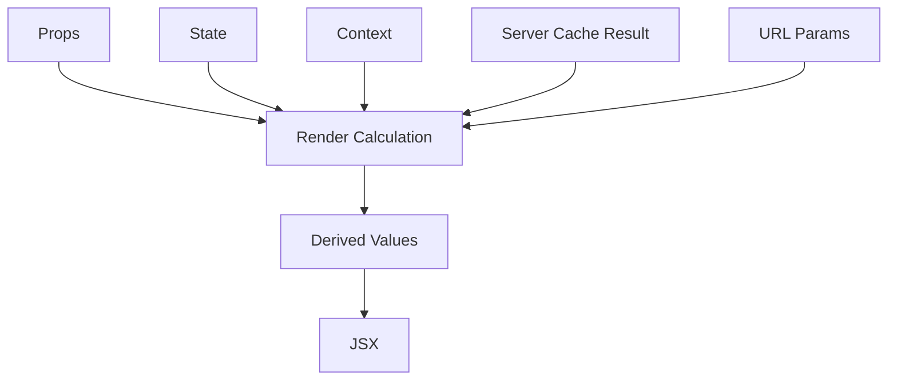
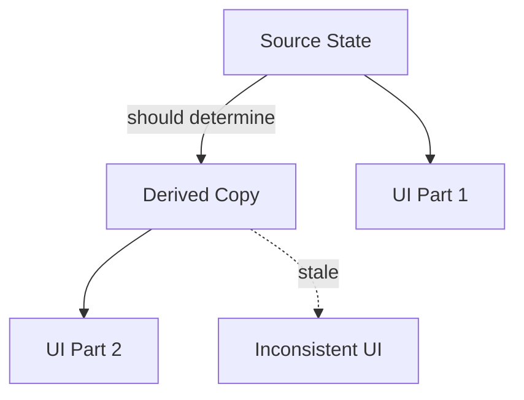
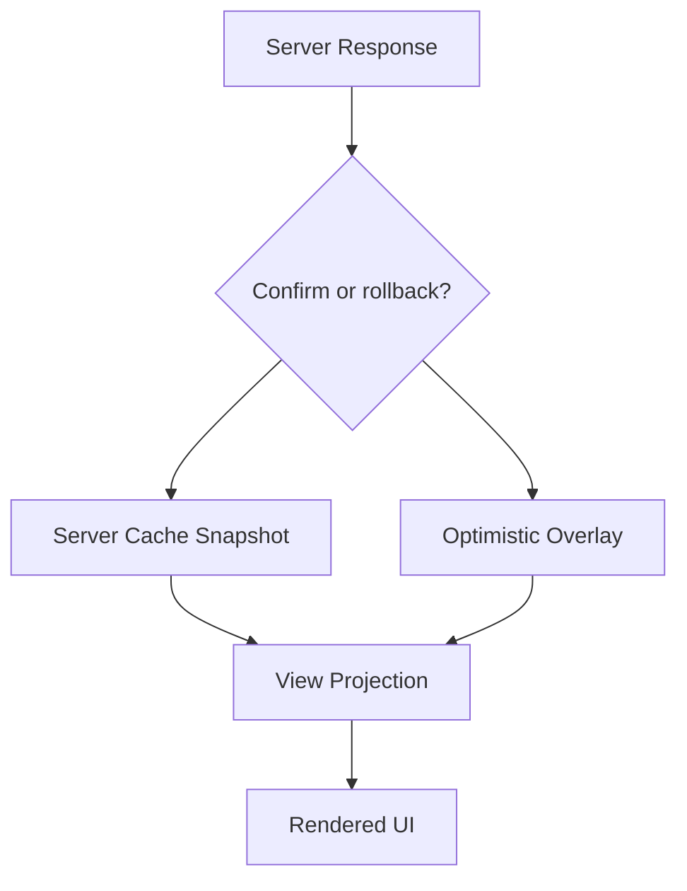

# Derived State and Source of Truth

Banyak aplikasi React tidak rusak karena kurang library.
Mereka rusak karena terlalu banyak **source of truth palsu**.

Contoh sederhana:

```tsx
const [firstName, setFirstName] = useState('Ada');
const [lastName, setLastName] = useState('Lovelace');
const [fullName, setFullName] = useState('Ada Lovelace');
```

`fullName` bukan state independen.
Ia dapat dihitung dari `firstName` dan `lastName`.
Ketika data yang bisa dihitung ikut disimpan, Anda menciptakan kewajiban baru:

```txt
setiap perubahan firstName harus update fullName
setiap perubahan lastName harus update fullName
setiap reset harus update semua field terkait
setiap async load harus menjaga urutan update
setiap bug sync bisa menghasilkan UI mustahil
```

Ini bukan sekadar style.
Ini masalah invariant.

---

## 1. Mental Model: State vs Derived Value

State adalah data yang harus diingat React karena tidak bisa dihitung secara murni dari input render saat ini.

Derived value adalah data yang bisa dihitung dari:

```txt
props
state
context
query result
URL params
constants
```



Rule awal:

```txt
Jika suatu nilai bisa dihitung saat render tanpa side effect, jangan simpan sebagai state.
```

---

## 2. Source of Truth

Source of truth adalah tempat otoritatif untuk suatu fakta.

Contoh:

```txt
searchText          source: input state atau URL query param
filteredProducts    derived dari products + searchText
selectedUserName    derived dari usersById + selectedUserId
canSubmit           derived dari draft + validation + permission
isDirty             derived dari initialData + draft
```

Masalah muncul ketika kita menyimpan source dan derived copy sekaligus.

```tsx
const [items, setItems] = useState<Item[]>([]);
const [selectedItemId, setSelectedItemId] = useState<string | null>(null);
const [selectedItem, setSelectedItem] = useState<Item | null>(null);
```

`selectedItem` redundant jika ia bisa dicari dari `items` dan `selectedItemId`.

Lebih baik:

```tsx
const selectedItem = items.find((item) => item.id === selectedItemId) ?? null;
```

Atau untuk koleksi besar:

```tsx
const itemsById = useMemo(() => {
  return new Map(items.map((item) => [item.id, item]));
}, [items]);

const selectedItem = selectedItemId ? itemsById.get(selectedItemId) ?? null : null;
```

---

## 3. Mengapa Redundant State Berbahaya

Redundant state menciptakan lebih dari satu representasi dari fakta yang sama.

```txt
A = source
B = copy/derived
Invariant: B harus selalu sama dengan f(A)
```

Setiap update sekarang harus menjaga invariant itu.



Contoh bug:

```tsx
function ProductSearch({ products }: { products: Product[] }) {
  const [query, setQuery] = useState('');
  const [filtered, setFiltered] = useState(products);

  useEffect(() => {
    setFiltered(
      products.filter((product) => product.name.includes(query))
    );
  }, [products, query]);

  return <ProductList products={filtered} />;
}
```

Masalah:

```txt
render pertama setelah query berubah masih memakai filtered lama
lalu effect jalan
lalu setFiltered memicu render tambahan
UI bisa menampilkan frame intermediate yang tidak perlu
logic sederhana menjadi async lifecycle
```

Lebih benar:

```tsx
function ProductSearch({ products }: { products: Product[] }) {
  const [query, setQuery] = useState('');

  const filtered = products.filter((product) =>
    product.name.toLowerCase().includes(query.toLowerCase())
  );

  return <ProductList products={filtered} />;
}
```

Jika filtering mahal, optimalkan kalkulasinya, bukan ubah semantics menjadi state:

```tsx
const filtered = useMemo(() => {
  return products.filter((product) =>
    product.name.toLowerCase().includes(query.toLowerCase())
  );
}, [products, query]);
```

`useMemo` bukan source of truth.
Ia cache kalkulasi render.

---

## 4. Derived State Bukan Selalu Salah

Istilah "derived state" sering membingungkan karena ada dua makna:

```txt
1. Derived value: dihitung saat render. Ini baik.
2. Derived copy stored in state: hasil hitungan disimpan di state. Ini sering buruk.
```

Kita akan memakai istilah:

```txt
Derived value        = aman, dihitung dari source
Stored derived state = berisiko, butuh alasan kuat
```

Stored derived state bisa valid jika:

```txt
nilai adalah snapshot historis, bukan mirror live
nilai butuh user edit sebagai draft terpisah dari source
nilai adalah hasil proses mahal asynchronous
nilai berasal dari external system dan punya lifecycle sendiri
nilai harus intentionally diverge dari source
```

Contoh valid:

```tsx
function ProfileForm({ profile }: { profile: Profile }) {
  const [draft, setDraft] = useState(() => createDraft(profile));

  return <ProfileFields draft={draft} onDraftChange={setDraft} />;
}
```

Di sini `draft` bukan mirror live dari `profile`.
Ia adalah snapshot awal yang kemudian dimiliki form.

Invariant-nya:

```txt
profile hanya initial input.
draft boleh berbeda dari profile.
draft berubah karena user edit.
```

---

## 5. Cara Membedakan Source dan Derived

Gunakan pertanyaan ini:

```txt
Jika nilai ini hilang, apakah saya bisa menghitungnya ulang secara deterministik dari data yang sudah ada pada render saat ini?
```

Jika ya, kemungkinan besar bukan state.

Contoh:

| Nilai | Source atau Derived? | Alasan |
|---|---|---|
| `query` dari input search | Source | User mengetik, tidak bisa dihitung dari produk |
| `filteredProducts` | Derived | Bisa dihitung dari `products + query` |
| `selectedId` | Source | Pilihan user |
| `selectedItem` | Derived | Bisa dihitung dari `items + selectedId` |
| `isModalOpen` | Source | Keputusan UI/event |
| `modalTitle` dari selected item | Derived | Bisa dihitung |
| `isValid` dari field errors | Derived | Bisa dihitung |
| `errors` hasil validasi async server | Source-ish | Datang dari external result |
| `isDirty` | Derived | Bisa dihitung dari `initial + draft` |
| `lastSubmittedAt` | Source | Event historis |

---

## 6. Single Source of Truth Tidak Selalu Berarti Satu State Variable

Single source of truth bukan berarti semua data harus masuk satu object besar.
Maksudnya: setiap fakta punya satu lokasi otoritatif.

Boleh:

```tsx
const [firstName, setFirstName] = useState('');
const [lastName, setLastName] = useState('');

const fullName = `${firstName} ${lastName}`.trim();
```

Jangan:

```tsx
const [firstName, setFirstName] = useState('');
const [lastName, setLastName] = useState('');
const [fullName, setFullName] = useState('');
```

Boleh juga satu reducer jika perubahan harus atomic:

```tsx
type Draft = {
  firstName: string;
  lastName: string;
};

const [draft, dispatch] = useReducer(draftReducer, {
  firstName: '',
  lastName: '',
});

const fullName = `${draft.firstName} ${draft.lastName}`.trim();
```

State shape dipilih berdasarkan update semantics, bukan dogma.

---

## 7. Avoid Contradictory State

State buruk bukan hanya redundant.
State juga bisa kontradiktif.

```tsx
const [isLoading, setIsLoading] = useState(false);
const [data, setData] = useState<User | null>(null);
const [error, setError] = useState<Error | null>(null);
```

Kombinasi yang mungkin:

```txt
isLoading=true, data exists, error exists
isLoading=false, data=null, error=null
isLoading=true, error exists
```

Beberapa valid, beberapa ambigu.

Lebih eksplisit:

```tsx
type LoadState<T> =
  | { status: 'idle' }
  | { status: 'loading' }
  | { status: 'success'; data: T }
  | { status: 'error'; error: Error };
```

Sekarang impossible state lebih sulit dibuat.

```tsx
function UserPanel() {
  const [state, setState] = useState<LoadState<User>>({ status: 'idle' });

  if (state.status === 'idle') return <EmptyState />;
  if (state.status === 'loading') return <Spinner />;
  if (state.status === 'error') return <ErrorView error={state.error} />;
  return <UserView user={state.data} />;
}
```

Ini bukan sekadar TypeScript trick.
Ini cara memindahkan invariant dari ingatan manusia ke struktur data.

---

## 8. Avoid Deeply Duplicated State

Contoh umum:

```tsx
type Order = {
  id: string;
  customer: Customer;
  items: OrderItem[];
};

const [orders, setOrders] = useState<Order[]>([]);
const [selectedOrder, setSelectedOrder] = useState<Order | null>(null);
```

Jika `orders` update karena refetch, `selectedOrder` bisa masih versi lama.

Lebih aman:

```tsx
const [orders, setOrders] = useState<Order[]>([]);
const [selectedOrderId, setSelectedOrderId] = useState<string | null>(null);

const selectedOrder = orders.find((order) => order.id === selectedOrderId) ?? null;
```

Untuk struktur besar, normalisasi:

```tsx
type OrderState = {
  orderIds: string[];
  ordersById: Record<string, Order>;
  selectedOrderId: string | null;
};

const selectedOrder = state.selectedOrderId
  ? state.ordersById[state.selectedOrderId] ?? null
  : null;
```

Normalisasi bukan hanya performa.
Normalisasi mengurangi duplikasi sumber fakta.

---

## 9. Derived Value Bisa Menjadi Selector

Dalam aplikasi besar, derived calculation sebaiknya punya nama domain.

Jangan menyebar kalkulasi:

```tsx
const canSubmit =
  draft.items.length > 0 &&
  draft.customerId !== null &&
  !draft.items.some((item) => item.quantity <= 0) &&
  permissions.includes('ORDER_SUBMIT');
```

Lebih baik:

```tsx
function selectCanSubmitOrder(input: {
  draft: OrderDraft;
  permissions: Permission[];
}) {
  const { draft, permissions } = input;

  return (
    draft.items.length > 0 &&
    draft.customerId !== null &&
    !draft.items.some((item) => item.quantity <= 0) &&
    permissions.includes('ORDER_SUBMIT')
  );
}
```

Lalu:

```tsx
const canSubmit = selectCanSubmitOrder({ draft, permissions });
```

Keuntungan:

```txt
logic bisa dites tanpa React
nama selector mengungkap intent
aturan domain tidak tersebar
refactor state shape lebih terkendali
```

---

## 10. Selector Tidak Harus Selalu `useMemo`

Banyak engineer menulis:

```tsx
const canSubmit = useMemo(() => {
  return selectCanSubmitOrder({ draft, permissions });
}, [draft, permissions]);
```

Ini tidak selalu perlu.

Jika kalkulasi murah, hitung langsung:

```tsx
const canSubmit = selectCanSubmitOrder({ draft, permissions });
```

Gunakan `useMemo` ketika:

```txt
kalkulasi mahal secara nyata
referential stability dibutuhkan downstream
hasil berupa object/array yang dipakai dependency atau memoized child
profiling menunjukkan bottleneck
```

Jangan memakai memoization untuk memperbaiki model source of truth yang buruk.
`useMemo` cache hasil hitung; ia tidak membuat data lebih benar.

---

## 11. Source of Truth dan Forms

Form adalah area paling sering salah.

Ada tiga model besar:

### Model A: Controlled live state

```tsx
function NameField() {
  const [name, setName] = useState('');

  return <input value={name} onChange={(e) => setName(e.target.value)} />;
}
```

Source of truth: React state.

### Model B: Uncontrolled DOM state

```tsx
function NameField() {
  const inputRef = useRef<HTMLInputElement>(null);

  function submit() {
    const name = inputRef.current?.value ?? '';
  }

  return <input ref={inputRef} defaultValue="" />;
}
```

Source of truth: DOM input until read.

### Model C: Initial server data + editable draft

```tsx
function ProfileForm({ profile }: { profile: Profile }) {
  const [draft, setDraft] = useState(() => createDraft(profile));

  const isDirty = !isEqual(draft, createDraft(profile));

  return <ProfileFields draft={draft} onDraftChange={setDraft} dirty={isDirty} />;
}
```

Source of truth while editing: local draft.
Server profile is baseline.

Jangan mencampur tanpa sadar:

```tsx
<input value={profile.name} onChange={...updateDraftSomewhereElse} />
```

Jika `value` dari server data tapi `onChange` update draft lain, UI akan terasa tidak bisa diketik.

---

## 12. Initial Value Bukan Live Sync

`useState(() => props.value)` bukan berarti state akan update saat props berubah.

```tsx
function Form({ initialName }: { initialName: string }) {
  const [name, setName] = useState(initialName);

  return <input value={name} onChange={(e) => setName(e.target.value)} />;
}
```

`initialName` hanya dipakai saat mount.

Ini benar jika props memang initial.
Namai dengan jujur:

```tsx
function Form({ initialName }: { initialName: string }) {
  const [name, setName] = useState(initialName);
  // ...
}
```

Jika props adalah source live:

```tsx
function Form({ name, onNameChange }: Props) {
  return <input value={name} onChange={(e) => onNameChange(e.target.value)} />;
}
```

Jika props berubah berarti form instance baru, gunakan key pada parent:

```tsx
<Form key={profile.id} initialName={profile.name} />
```

---

## 13. Jangan Sinkronkan Props ke State Tanpa Alasan

Anti-pattern umum:

```tsx
function UserCard({ user }: { user: User }) {
  const [localUser, setLocalUser] = useState(user);

  useEffect(() => {
    setLocalUser(user);
  }, [user]);

  return <UserView user={localUser} />;
}
```

Jika `localUser` selalu harus sama dengan `user`, hapus state:

```tsx
function UserCard({ user }: { user: User }) {
  return <UserView user={user} />;
}
```

Jika `localUser` adalah editable draft, namai sebagai draft dan tentukan reset policy:

```tsx
function UserEditor({ user }: { user: User }) {
  const [draft, setDraft] = useState(() => createUserDraft(user));

  return <UserForm draft={draft} onDraftChange={setDraft} />;
}
```

Lalu parent menentukan identity:

```tsx
<UserEditor key={user.id} user={user} />
```

---

## 14. Effect Bukan Mesin Derived State

Jangan menulis:

```tsx
const [total, setTotal] = useState(0);

useEffect(() => {
  setTotal(items.reduce((sum, item) => sum + item.price, 0));
}, [items]);
```

Tulis:

```tsx
const total = items.reduce((sum, item) => sum + item.price, 0);
```

Jika mahal:

```tsx
const total = useMemo(() => {
  return items.reduce((sum, item) => sum + item.price, 0);
}, [items]);
```

Effect dipakai untuk sinkronisasi dengan external system, bukan untuk menjaga variabel hitungan internal tetap sejalan.

Derived state via effect menambah lifecycle yang tidak perlu:

```txt
render dengan nilai lama
commit
run effect
set state
render lagi dengan nilai baru
```

Padahal render calculation bisa menghasilkan nilai benar langsung pada render yang sama.

---

## 15. Reducer untuk Invariant Multi-field

Kadang beberapa field harus berubah bersama.

Contoh buruk:

```tsx
const [status, setStatus] = useState<'idle' | 'submitting' | 'success' | 'error'>('idle');
const [error, setError] = useState<string | null>(null);
const [submittedAt, setSubmittedAt] = useState<Date | null>(null);
```

Event submit success harus update tiga state secara konsisten.

Lebih kuat:

```tsx
type SubmitState =
  | { status: 'idle' }
  | { status: 'submitting' }
  | { status: 'success'; submittedAt: Date }
  | { status: 'error'; message: string };

type SubmitEvent =
  | { type: 'submit' }
  | { type: 'succeed'; submittedAt: Date }
  | { type: 'fail'; message: string }
  | { type: 'reset' };

function submitReducer(state: SubmitState, event: SubmitEvent): SubmitState {
  switch (event.type) {
    case 'submit':
      return { status: 'submitting' };
    case 'succeed':
      return { status: 'success', submittedAt: event.submittedAt };
    case 'fail':
      return { status: 'error', message: event.message };
    case 'reset':
      return { status: 'idle' };
  }
}
```

Reducer membantu ketika invariant bukan sekadar kalkulasi, tapi transition.

---

## 16. Derived Boolean Smell

Boolean sering terlihat harmless, tapi bisa menyebabkan state kontradiktif.

```tsx
const [isOpen, setIsOpen] = useState(false);
const [selectedUserId, setSelectedUserId] = useState<string | null>(null);
```

Apa arti ini?

```txt
isOpen = true, selectedUserId = null
isOpen = false, selectedUserId = 'u1'
```

Mungkin valid, mungkin bug.

Jika modal terbuka hanya ketika ada selected user:

```tsx
const [selectedUserId, setSelectedUserId] = useState<string | null>(null);
const isOpen = selectedUserId !== null;

function close() {
  setSelectedUserId(null);
}
```

Sekarang source of truth satu.

Jika modal bisa terbuka tanpa selected user, maka pisahkan state memang benar.
Tapi tuliskan modelnya eksplisit:

```tsx
type UserModalState =
  | { status: 'closed' }
  | { status: 'creating' }
  | { status: 'editing'; userId: string };
```

---

## 17. Derived Permission State

Dalam aplikasi enterprise, authorization UI sering salah karena permissions diduplikasi.

Anti-pattern:

```tsx
const [canApprove, setCanApprove] = useState(false);

useEffect(() => {
  setCanApprove(
    caseStatus === 'PENDING' && permissions.includes('CASE_APPROVE')
  );
}, [caseStatus, permissions]);
```

Lebih baik:

```tsx
const canApprove = selectCanApproveCase({
  caseStatus,
  permissions,
  assigneeId,
  currentUserId,
});
```

Jika rule kompleks, buat policy selector:

```tsx
type CaseApprovalInput = {
  status: CaseStatus;
  permissions: Permission[];
  assigneeId: string | null;
  currentUserId: string;
};

function selectCaseApprovalCapability(input: CaseApprovalInput) {
  if (!input.permissions.includes('CASE_APPROVE')) {
    return { allowed: false, reason: 'missing-permission' } as const;
  }

  if (input.status !== 'PENDING_REVIEW') {
    return { allowed: false, reason: 'invalid-status' } as const;
  }

  if (input.assigneeId !== input.currentUserId) {
    return { allowed: false, reason: 'not-assignee' } as const;
  }

  return { allowed: true } as const;
}
```

Lalu UI:

```tsx
const approval = selectCaseApprovalCapability(input);

return (
  <button disabled={!approval.allowed}>
    Approve
  </button>
);
```

Ini lebih audit-friendly dibanding boolean mentah.

---

## 18. Derived State dan URL

Kadang source of truth terbaik bukan React state, tapi URL.

Contoh search page:

```txt
/cases?status=open&q=fraud&page=2
```

Source:

```txt
status = URL query param
q      = URL query param
page   = URL query param
```

Derived:

```txt
queryKey = ['cases', { status, q, page }]
activeFilterCount = count non-empty filters
isFiltered = activeFilterCount > 0
```

Jangan simpan filter yang sama di URL dan local state tanpa sync protocol jelas.

Anti-pattern:

```tsx
const [filters, setFilters] = useState(readFiltersFromUrl());

useEffect(() => {
  setFilters(readFiltersFromUrl());
}, [location.search]);

useEffect(() => {
  writeFiltersToUrl(filters);
}, [filters]);
```

Ini mudah menjadi loop atau race.

Pilih model:

```txt
URL as source of truth:
  read filters directly from URL each render
  update URL on user intent

Local draft + URL applied filters:
  URL = applied filters
  local state = draft filters before user clicks Apply
```

Model kedua valid karena draft intentionally diverges.

---

## 19. Applied Filter vs Draft Filter

Contoh production search:

```txt
User mengedit filter form.
Query tidak langsung jalan sampai user klik Apply.
URL hanya berubah saat Apply.
```

Model:

```txt
appliedFilters = source dari URL
draftFilters   = local state, initial dari appliedFilters saat panel dibuka/reset
queryKey       = derived dari appliedFilters
isDirty        = derived dari draftFilters vs appliedFilters
```

Implementasi:

```tsx
function CaseSearchPage() {
  const appliedFilters = useCaseFiltersFromUrl();
  const [draftFilters, setDraftFilters] = useState(() => appliedFilters);

  const isDirty = !shallowEqual(draftFilters, appliedFilters);

  function apply() {
    writeCaseFiltersToUrl(draftFilters);
  }

  function resetDraft() {
    setDraftFilters(appliedFilters);
  }

  const query = useCasesQuery(appliedFilters);

  return (
    <CaseSearchView
      draftFilters={draftFilters}
      onDraftFiltersChange={setDraftFilters}
      isDirty={isDirty}
      onApply={apply}
      onReset={resetDraft}
      result={query.data}
    />
  );
}
```

Di sini ada dua state mirip, tapi bukan duplicate bug.
Mereka punya semantics berbeda:

```txt
applied = committed source for query
draft   = editable working copy
```

---

## 20. Server State Source of Truth

Data dari server punya source of truth di server.
Client menyimpan cache, bukan kebenaran final.

Jika memakai query library:

```txt
server             source authority
query cache         client-side cached snapshot
component derived   projection untuk render
local draft         user editable copy
```

Jangan copy query data ke local state hanya untuk render.

Anti-pattern:

```tsx
const { data } = useUserQuery(userId);
const [user, setUser] = useState<User | null>(null);

useEffect(() => {
  if (data) setUser(data);
}, [data]);
```

Jika hanya display:

```tsx
const { data: user } = useUserQuery(userId);
```

Jika edit draft:

```tsx
const { data: user } = useUserQuery(userId);

if (!user) return <Loading />;

return <UserEditor key={user.id} initialUser={user} />;
```

Dalam `UserEditor`, local draft memang intentional.

---

## 21. Optimistic State: Derived atau Source?

Optimistic UI tampak seperti duplicate state, tapi sebenarnya punya lifecycle sendiri.

Contoh:

```txt
server says: item not liked
user clicks like
UI immediately shows liked
request pending
server confirms or rejects
```

State optimistic adalah overlay sementara di atas server snapshot.

Model:

```txt
base = server/cache state
overlay = pending local optimistic changes
view = derive(base, overlay)
```



Jangan mencampur optimistic value langsung ke banyak tempat tanpa rollback protocol.

Buat model eksplisit:

```tsx
type OptimisticLikeState = {
  serverLiked: boolean;
  pendingLiked: boolean | null;
};

const likedForDisplay = state.pendingLiked ?? state.serverLiked;
```

Atau gunakan primitive/library yang memang mendukung optimistic lifecycle.

---

## 22. Jangan Simpan Derived Arrays Tanpa Strategi Identity

Contoh:

```tsx
const [visibleRows, setVisibleRows] = useState<Row[]>([]);
```

Jika `visibleRows` berasal dari `rows + filters + sort`, ia derived.

Lebih baik:

```tsx
const visibleRows = useMemo(() => {
  return rows
    .filter((row) => matchesFilters(row, filters))
    .sort(compareRows(sort));
}, [rows, filters, sort]);
```

Namun hati-hati: `.sort()` mutates array.
Gunakan copy:

```tsx
const visibleRows = useMemo(() => {
  return [...rows]
    .filter((row) => matchesFilters(row, filters))
    .sort(compareRows(sort));
}, [rows, filters, sort]);
```

Derived array harus menjaga immutability agar tidak merusak source.

---

## 23. Referential Stability dan Derived Objects

Derived object baru pada setiap render bisa memicu rerender child atau effect dependency.

```tsx
const filters = { status, q, page };

useEffect(() => {
  analytics.track('filters_changed', filters);
}, [filters]);
```

`filters` object baru setiap render.
Effect berjalan setiap render.

Solusi bisa:

### Buat dependency primitive

```tsx
useEffect(() => {
  analytics.track('filters_changed', { status, q, page });
}, [status, q, page]);
```

### Memoize object jika memang perlu identity stabil

```tsx
const filters = useMemo(() => ({ status, q, page }), [status, q, page]);
```

Jangan campur masalah:

```txt
source of truth correctness
referential stability
performance
```

Mereka terkait, tapi bukan hal yang sama.

---

## 24. Validation State

Validation bisa synchronous atau asynchronous.

### Synchronous validation

Jika bisa dihitung dari draft, jangan simpan.

```tsx
const errors = validateOrderDraft(draft);
const canSubmit = errors.length === 0;
```

### Asynchronous validation

Jika butuh server check, hasilnya adalah external result.

```tsx
type UsernameCheck =
  | { status: 'idle' }
  | { status: 'checking'; username: string }
  | { status: 'available'; username: string }
  | { status: 'taken'; username: string }
  | { status: 'error'; username: string; message: string };
```

Perhatikan `username` ikut disimpan pada result.
Kenapa?

Agar response lama tidak diterapkan ke input baru.

```tsx
if (result.username !== draft.username) {
  // stale validation result, jangan tampilkan sebagai current truth
}
```

Ini contoh derived/external boundary yang perlu model eksplisit.

---

## 25. State Normalization dan Selector Layer

Untuk aplikasi kompleks, state shape sering butuh normalisasi.

```tsx
type State = {
  casesById: Record<string, Case>;
  caseIds: string[];
  selectedCaseId: string | null;
  filters: CaseFilters;
};
```

Selector:

```tsx
function selectAllCases(state: State) {
  return state.caseIds.map((id) => state.casesById[id]);
}

function selectSelectedCase(state: State) {
  return state.selectedCaseId
    ? state.casesById[state.selectedCaseId] ?? null
    : null;
}

function selectVisibleCases(state: State) {
  return selectAllCases(state).filter((item) => matchesFilters(item, state.filters));
}
```

Kelebihan:

```txt
state source minimal
derived read model jelas
UI tidak tahu detail normalisasi
logic dapat dites
perubahan state shape tidak merusak semua component
```

---

## 26. Derived State Across Context

Context sering dipakai sebagai tempat menaruh semua hal.

Buruk:

```tsx
const value = {
  users,
  selectedUserId,
  selectedUser,
  canEditSelectedUser,
  visibleUsers,
};
```

Jika `selectedUser`, `canEditSelectedUser`, dan `visibleUsers` derived, provider value menjadi besar dan mudah stale.

Lebih baik:

```tsx
const value = {
  users,
  selectedUserId,
  setSelectedUserId,
};
```

Lalu custom hook selector:

```tsx
function useSelectedUser() {
  const { users, selectedUserId } = useUsersContext();
  return users.find((user) => user.id === selectedUserId) ?? null;
}
```

Namun ini punya trade-off performa: semua consumer context tetap rerender saat value berubah.
Nanti kita bahas context performance dan selector-based external store.
Di bagian ini fokusnya correctness: jangan menyimpan copy kebenaran tanpa alasan.

---

## 27. Source of Truth Decision Matrix

| Pertanyaan | Jika Ya | Tempat yang mungkin |
|---|---|---|
| Bisa dihitung dari render input saat ini? | Jangan state | Derived value/selector |
| Datang dari input user dan harus diingat? | State | Local/parent/store/URL |
| Harus shareable/bookmarkable? | URL | Query params/path |
| Datang dari server dan butuh freshness/cache? | Server state | Query cache |
| Editable copy dari server data? | Draft state | Local/reducer/form store |
| Harus survive remount/route? | Bukan local child | Parent/external store/URL/persistence |
| Harus atomic dengan field lain? | Gabungkan transition | Reducer/state machine |
| Merupakan status workflow? | Explicit state | Union/reducer/machine |
| Merupakan hasil async external? | State/cache | Query/mutation/result state |
| Hanya untuk render format? | Derived | Function/useMemo |

---

## 28. Anti-pattern Catalog

### Anti-pattern 1: Mirroring props

```tsx
const [value, setValue] = useState(props.value);
useEffect(() => setValue(props.value), [props.value]);
```

Better:

```txt
controlled prop, uncontrolled initial value, atau keyed remount.
Pilih salah satu.
```

### Anti-pattern 2: Storing filtered data

```tsx
const [filtered, setFiltered] = useState([]);
useEffect(() => setFiltered(filter(items, query)), [items, query]);
```

Better:

```tsx
const filtered = useMemo(() => filter(items, query), [items, query]);
```

### Anti-pattern 3: Boolean explosion

```tsx
const [isLoading, setLoading] = useState(false);
const [isSuccess, setSuccess] = useState(false);
const [isError, setError] = useState(false);
```

Better:

```tsx
type Status = 'idle' | 'loading' | 'success' | 'error';
```

atau discriminated union.

### Anti-pattern 4: Selected object copy

```tsx
const [selectedUser, setSelectedUser] = useState<User | null>(null);
```

Better jika user ada di collection:

```tsx
const [selectedUserId, setSelectedUserId] = useState<string | null>(null);
const selectedUser = selectedUserId ? usersById[selectedUserId] : null;
```

### Anti-pattern 5: Effect as internal calculator

```tsx
useEffect(() => {
  setCanSubmit(validate(draft));
}, [draft]);
```

Better:

```tsx
const canSubmit = validate(draft);
```

---

## 29. Case Study: Approval Button

Requirement:

```txt
Button Approve muncul di case detail page.
Button enabled hanya jika:
- case status PENDING_REVIEW
- current user adalah assignee
- user punya permission CASE_APPROVE
- tidak ada pending mutation approve
- form comment valid
```

Model buruk:

```tsx
const [canApprove, setCanApprove] = useState(false);
const [showApprove, setShowApprove] = useState(false);
```

Ini rawan sync bug.

Model lebih baik:

```tsx
function selectApprovalView(input: {
  status: CaseStatus;
  assigneeId: string | null;
  currentUserId: string;
  permissions: Permission[];
  approvePending: boolean;
  comment: string;
}) {
  if (!input.permissions.includes('CASE_APPROVE')) {
    return { visible: false, enabled: false, reason: 'missing-permission' } as const;
  }

  if (input.status !== 'PENDING_REVIEW') {
    return { visible: false, enabled: false, reason: 'invalid-status' } as const;
  }

  if (input.assigneeId !== input.currentUserId) {
    return { visible: true, enabled: false, reason: 'not-assignee' } as const;
  }

  if (input.approvePending) {
    return { visible: true, enabled: false, reason: 'pending' } as const;
  }

  if (input.comment.trim().length < 10) {
    return { visible: true, enabled: false, reason: 'comment-too-short' } as const;
  }

  return { visible: true, enabled: true } as const;
}
```

UI:

```tsx
const approval = selectApprovalView({
  status: caseData.status,
  assigneeId: caseData.assigneeId,
  currentUserId,
  permissions,
  approvePending: approveMutation.isPending,
  comment,
});

if (!approval.visible) return null;

return (
  <button disabled={!approval.enabled} onClick={approve}>
    Approve
  </button>
);
```

Keuntungan:

```txt
Tidak ada canApprove state yang harus disinkronkan.
Alasan disabled bisa ditampilkan/audit.
Logic domain bisa dites sebagai pure function.
Mutation pending tetap menjadi source dari mutation state.
Comment tetap menjadi source dari input state.
```

---

## 30. Case Study: Data Table

Requirement:

```txt
Table memiliki rows dari server.
User bisa filter, sort, select rows, dan expand detail row.
Selection harus survive filter.
Expansion hanya untuk visible row dan boleh collapse saat row hilang.
Sort/filter harus shareable via URL.
```

Model:

```txt
rows             source: server/query cache
filters          source: URL
sort             source: URL
visibleRows      derived: rows + filters + sort
selectedIds      source: table state atau URL/store tergantung requirement
expandedRowIds   source: local table state
allSelected      derived: visibleRows + selectedIds
```

Implementation sketch:

```tsx
function CasesTablePage() {
  const filters = useFiltersFromUrl();
  const sort = useSortFromUrl();
  const casesQuery = useCasesQuery(filters);

  const [selectedIds, setSelectedIds] = useState<Set<string>>(() => new Set());
  const [expandedIds, setExpandedIds] = useState<Set<string>>(() => new Set());

  const visibleRows = useMemo(() => {
    return sortCases(casesQuery.data ?? [], sort);
  }, [casesQuery.data, sort]);

  const allVisibleSelected = visibleRows.length > 0 &&
    visibleRows.every((row) => selectedIds.has(row.id));

  return (
    <CasesTable
      rows={visibleRows}
      selectedIds={selectedIds}
      expandedIds={expandedIds}
      allVisibleSelected={allVisibleSelected}
      onSelectedIdsChange={setSelectedIds}
      onExpandedIdsChange={setExpandedIds}
    />
  );
}
```

Tidak semua state harus URL.
Tidak semua state harus server.
Tidak semua derived value harus disimpan.

---

## 31. Testing Derived Logic

Selector pure function mudah dites.

```tsx
describe('selectApprovalView', () => {
  it('disables approval when user is not assignee', () => {
    const result = selectApprovalView({
      status: 'PENDING_REVIEW',
      assigneeId: 'user-1',
      currentUserId: 'user-2',
      permissions: ['CASE_APPROVE'],
      approvePending: false,
      comment: 'Looks valid enough',
    });

    expect(result).toEqual({
      visible: true,
      enabled: false,
      reason: 'not-assignee',
    });
  });
});
```

Jika logic ini disimpan sebagai state dan effect, test harus menjalankan render lifecycle.
Pure selector membuat reasoning lebih murah.

---

## 32. Debugging Checklist

Jika UI tidak konsisten, cek:

```txt
1. Apakah ada data yang sama disimpan di dua state berbeda?
2. Apakah props dicopy ke state tanpa alasan?
3. Apakah derived value dihitung via effect?
4. Apakah selected object disimpan padahal selected id cukup?
5. Apakah boolean state bisa saling kontradiktif?
6. Apakah URL dan local state saling mirror?
7. Apakah server data dicopy ke local state hanya untuk display?
8. Apakah draft memang intentional divergence dari source?
9. Apakah reset policy saat identity berubah eksplisit?
10. Apakah selector bisa menggantikan stored derived state?
```

---

## 33. Architecture Heuristic

Gunakan rumus ini:

```txt
Store facts.
Derive views.
Name transitions.
Test invariants.
```

Lebih detail:

```txt
1. Simpan input yang tidak bisa dihitung.
2. Simpan event/result historis yang punya lifecycle sendiri.
3. Jangan simpan projection yang bisa dihitung dari source.
4. Jika butuh draft, namai sebagai draft dan definisikan reset/commit/cancel.
5. Jika butuh async result, modelkan status + payload + stale guard.
6. Jika beberapa field harus konsisten, pakai reducer/union/machine.
7. Jika derived logic penting, ekstrak selector pure function.
```

---

## 34. Summary

State design yang baik bukan tentang membuat state sedikit mungkin secara buta.
State design yang baik adalah membuat **source of truth eksplisit**.

```txt
Jangan simpan apa yang bisa dihitung.
Jangan mirror props tanpa alasan.
Jangan copy server data hanya untuk display.
Jangan pisahkan boolean yang membentuk satu state machine.
Jangan biarkan draft tampak seperti live source.
Jangan biarkan URL dan local state saling sync tanpa protocol.
```

Pola yang kuat:

```txt
source state     -> fakta minimal
selector         -> derived read model
reducer/machine  -> transition dan invariant
key boundary     -> lifecycle/reset identity
query cache      -> server snapshot
local draft      -> intentional editable divergence
```

Setelah ini, kita masuk ke Module 1: Hooks Foundation at Production Depth.
Part berikutnya membedah `useState` bukan sebagai API basic, tapi sebagai primitive state cell, initializer, updater queue, batching, object update discipline, dan reset semantics.

---

## References

- React Docs — Choosing the State Structure: https://react.dev/learn/choosing-the-state-structure
- React Docs — You Might Not Need an Effect: https://react.dev/learn/you-might-not-need-an-effect
- React Docs — Sharing State Between Components: https://react.dev/learn/sharing-state-between-components
- React Docs — State as a Snapshot: https://react.dev/learn/state-as-a-snapshot
- React Docs — Updating Objects in State: https://react.dev/learn/updating-objects-in-state
