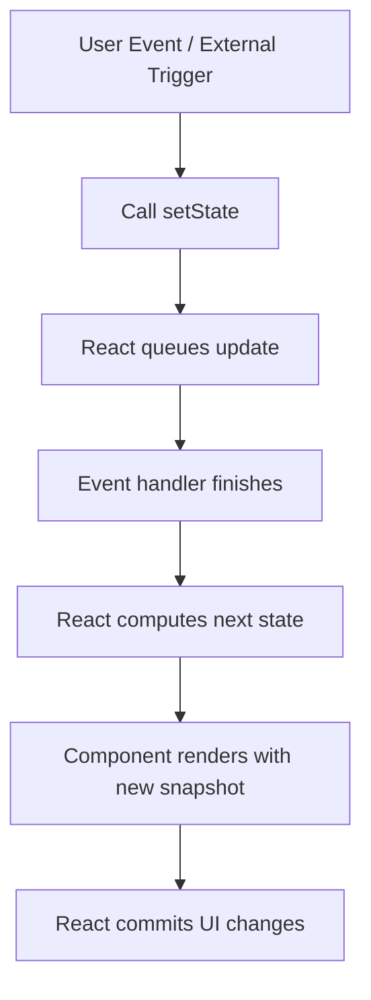
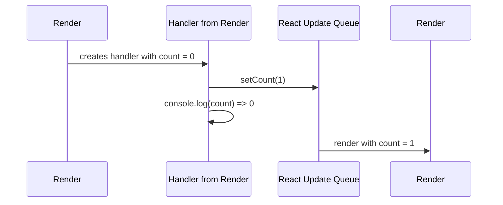
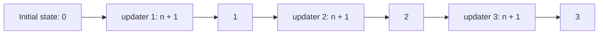
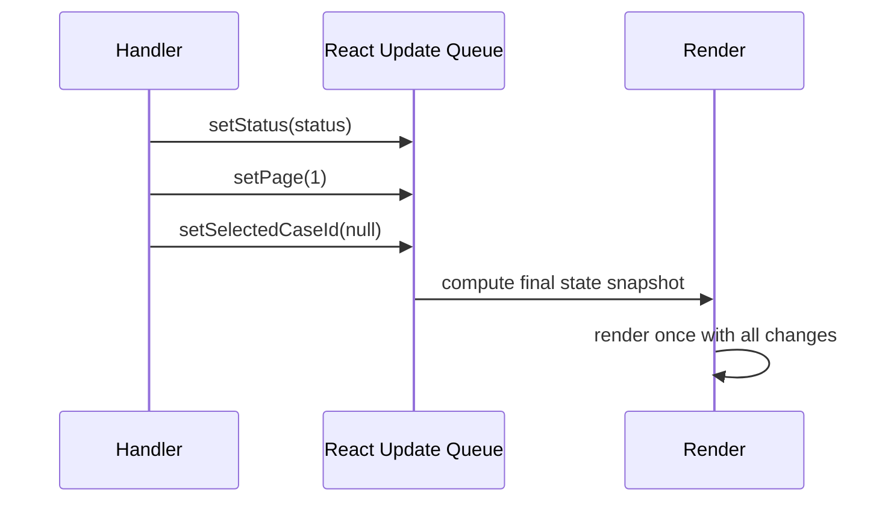

# Part 009 — `useState` Deep Dive

`useState` sering terlihat sederhana:

```tsx
const [value, setValue] = useState(initialValue);
```

Tapi di aplikasi production, bug state jarang muncul karena engineer tidak tahu syntax. Bug muncul karena mental model-nya salah.

`useState` bukan variable mutable. `setState` bukan assignment. Komponen bukan object instance yang terus berubah. React menyimpan state di luar function component, lalu memanggil function component untuk menghasilkan snapshot UI berikutnya.

Part ini membahas `useState` sebagai primitive state lokal yang harus dipakai dengan invariant yang jelas.

---

## 1. Kontrak Dasar `useState`

Secara praktis, `useState` memberi komponen satu slot state.

```tsx
const [count, setCount] = useState(0);
```

Kontraknya:

1. `count` adalah nilai state untuk render saat ini.
2. `setCount` meminta React menjadwalkan render baru dengan nilai berikutnya.
3. Nilai `count` di render saat ini tidak berubah setelah `setCount` dipanggil.
4. React dapat menggabungkan beberapa update sebelum melakukan render berikutnya.
5. State dipertahankan selama identity komponen tetap sama.

Mental model sederhananya:



Yang penting: `setState` tidak mengubah variable yang sedang kamu pegang. Ia mengantrekan update untuk render berikutnya.

---

## 2. State Adalah Snapshot Per Render

Perhatikan kode ini:

```tsx
function Counter() {
  const [count, setCount] = useState(0);

  function handleClick() {
    setCount(count + 1);
    console.log(count);
  }

  return <button onClick={handleClick}>{count}</button>;
}
```

Saat `count = 0`, klik pertama akan mencetak `0`, bukan `1`.

Ini bukan bug. Itu konsekuensi model snapshot.

Untuk setiap render, React memberi function component nilai state tetap. Semua event handler yang dibuat pada render itu menangkap snapshot yang sama.



Implikasi arsitektural:

- Jangan membaca state setelah setter lalu menganggap nilainya sudah berubah.
- Jangan menyusun business logic berdasarkan asumsi setter sinkron.
- Gunakan updater function bila next state bergantung pada previous state.

---

## 3. Setter Bukan Assignment

Assignment:

```ts
count = count + 1;
```

Setter React:

```tsx
setCount(count + 1);
```

Keduanya berbeda total.

Assignment mengubah lokasi memory saat itu juga. Setter memberi React instruksi:

> “Untuk render berikutnya, state slot ini harus menghasilkan nilai tertentu atau dihitung dari nilai sebelumnya.”

Karena itu, pattern berikut sering salah:

```tsx
function handleTripleIncrement() {
  setCount(count + 1);
  setCount(count + 1);
  setCount(count + 1);
}
```

Jika `count = 0`, hasil akhirnya `1`, bukan `3`, karena semua ekspresi `count + 1` membaca snapshot yang sama.

Yang benar:

```tsx
function handleTripleIncrement() {
  setCount((current) => current + 1);
  setCount((current) => current + 1);
  setCount((current) => current + 1);
}
```

Hasilnya `3`, karena setiap updater function menerima hasil update sebelumnya.



Rule praktis:

```tsx
// Jika next state tidak bergantung pada previous state
setOpen(true);
setSelectedId(id);

// Jika next state bergantung pada previous state
setCount((count) => count + 1);
setItems((items) => [...items, newItem]);
setExpanded((expanded) => !expanded);
```

---

## 4. Initial State: Value vs Lazy Initializer

`useState` menerima initial value.

```tsx
const [query, setQuery] = useState('');
```

Tapi jika initial value mahal dihitung, gunakan lazy initializer.

```tsx
const [preferences, setPreferences] = useState(() => {
  return readInitialPreferences();
});
```

Perbedaannya penting.

```tsx
// Ini memanggil expensiveComputation() setiap render,
// walaupun React hanya memakai hasilnya pada initial mount.
const [value, setValue] = useState(expensiveComputation());

// Ini memberi React function initializer.
// React memanggilnya saat initial state perlu dibuat.
const [value, setValue] = useState(() => expensiveComputation());
```

Gunakan lazy initializer untuk:

- parsing data awal yang mahal,
- membaca storage secara aman pada client,
- membangun struktur awal besar,
- membuat state awal dari props dengan aturan yang eksplisit.

Tapi initializer harus tetap dianggap pure terhadap render. Jangan melakukan subscription, network request, logging analytics, atau mutation global di initializer.

Contoh aman:

```tsx
function createInitialFilters(): Filters {
  return {
    status: 'open',
    assignee: null,
    page: 1,
  };
}

function CaseSearchPage() {
  const [filters, setFilters] = useState(createInitialFilters);

  // ...
}
```

---

## 5. State Granularity: Satu Object atau Banyak Slot?

Pertanyaan klasik:

```tsx
const [firstName, setFirstName] = useState('');
const [lastName, setLastName] = useState('');
const [email, setEmail] = useState('');
```

atau:

```tsx
const [form, setForm] = useState({
  firstName: '',
  lastName: '',
  email: '',
});
```

Tidak ada jawaban universal. Gunakan prinsip ini:

## 5.1 Pisahkan Jika Life Cycle Berbeda

Jika state berubah karena event berbeda, reset berbeda, atau validasi berbeda, pisahkan.

```tsx
const [query, setQuery] = useState('');
const [selectedCaseId, setSelectedCaseId] = useState<string | null>(null);
const [isFilterPanelOpen, setFilterPanelOpen] = useState(false);
```

Mereka bukan satu konsep. Jangan dipaksa menjadi satu object hanya karena berada di komponen yang sama.

## 5.2 Gabungkan Jika Invariant-nya Sama

Jika beberapa field harus berubah bersama agar state tetap valid, gabungkan atau pindahkan ke reducer.

```tsx
type DateRange = {
  start: Date | null;
  end: Date | null;
};

const [range, setRange] = useState<DateRange>({
  start: null,
  end: null,
});
```

Jika `start` dan `end` dipisah, kamu mudah menghasilkan state ilegal:

```tsx
start = 2026-07-20
end = 2026-07-10
```

Jika invariant makin kompleks, `useState` mulai kurang tepat. Gunakan `useReducer`.

## 5.3 Jangan Membuat Object State Besar Tanpa Alasan

Object state besar membuat update terlihat mudah, tapi sering menyembunyikan coupling.

```tsx
const [pageState, setPageState] = useState({
  query: '',
  selectedId: null,
  modal: null,
  draft: {},
  permissions: {},
  cache: {},
  errors: {},
});
```

Ini biasanya tanda bahwa komponen menjadi orchestration dump. Pecah berdasarkan ownership:

- URL/query state,
- local UI state,
- form draft state,
- server state,
- permission/capability state,
- workflow state.

---

## 6. Updating Object State

React state harus diperlakukan immutable.

Salah:

```tsx
const [user, setUser] = useState({ name: 'Ayu', role: 'admin' });

function rename(name: string) {
  user.name = name;
  setUser(user);
}
```

Masalahnya:

1. Kamu mutate object lama.
2. Referensi object tetap sama.
3. React dan komponen lain bisa melihat state yang berubah tanpa render yang benar.
4. Time-travel/debugging/strict behavior menjadi sulit diprediksi.

Benar:

```tsx
function rename(name: string) {
  setUser((user) => ({
    ...user,
    name,
  }));
}
```

Untuk nested object:

```tsx
type CaseDraft = {
  subject: string;
  reporter: {
    name: string;
    email: string;
  };
};

const [draft, setDraft] = useState<CaseDraft>({
  subject: '',
  reporter: {
    name: '',
    email: '',
  },
});

function updateReporterEmail(email: string) {
  setDraft((draft) => ({
    ...draft,
    reporter: {
      ...draft.reporter,
      email,
    },
  }));
}
```

Jika update nested terlalu sering dan kompleks, itu bukan sinyal untuk langsung memakai Immer. Itu sinyal untuk bertanya:

- Apakah bentuk state terlalu nested?
- Apakah state harus dinormalisasi?
- Apakah ini seharusnya reducer?
- Apakah sebagian state adalah derived state?
- Apakah sebagian state seharusnya milik child component?

Immer bisa membantu ergonomi, tapi tidak memperbaiki model state yang salah.

---

## 7. Updating Array State

Array state juga harus immutable.

Tambah item:

```tsx
setItems((items) => [...items, newItem]);
```

Hapus item:

```tsx
setItems((items) => items.filter((item) => item.id !== id));
```

Update item:

```tsx
setItems((items) =>
  items.map((item) =>
    item.id === updated.id ? { ...item, ...updated } : item,
  ),
);
```

Reorder item:

```tsx
function moveItem(fromIndex: number, toIndex: number) {
  setItems((items) => {
    const next = [...items];
    const [item] = next.splice(fromIndex, 1);
    next.splice(toIndex, 0, item);
    return next;
  });
}
```

Jangan mutate array lama:

```tsx
// Salah
items.push(newItem);
setItems(items);
```

Rule penting: mutation lokal terhadap copy boleh.

```tsx
setItems((items) => {
  const next = [...items];
  next.sort(compareByCreatedAt);
  return next;
});
```

Yang tidak boleh adalah mutate state object/array yang sedang dimiliki React.

---

## 8. Batching: Kenapa Beberapa Update Bisa Jadi Satu Render

React menggabungkan beberapa update state agar tidak setiap setter langsung menyebabkan render terpisah.

Contoh:

```tsx
function handleApplyFilter(status: Status) {
  setStatus(status);
  setPage(1);
  setSelectedCaseId(null);
}
```

Secara mental, kamu meminta tiga perubahan state. React dapat merender sekali dengan snapshot akhir.



Implikasi:

- Jangan menulis kode yang bergantung pada render terjadi setelah setiap setter.
- Kelompokkan update yang satu intent dalam satu handler.
- Jika update saling bergantung, gunakan updater function atau reducer.

---

## 9. Replacement Semantics vs Merge Semantics

`useState` mengganti state. Ia tidak merge otomatis seperti `this.setState` pada class component lama.

```tsx
const [form, setForm] = useState({ name: '', email: '' });

setForm({ name: 'Ayu' });
```

Setelah itu `email` hilang.

Yang benar:

```tsx
setForm((form) => ({
  ...form,
  name: 'Ayu',
}));
```

Tapi hati-hati: `...form` bukan solusi universal. Ia hanya benar jika field lain memang masih valid setelah update.

Contoh update yang harus reset field lain:

```tsx
setFilters((filters) => ({
  ...filters,
  status: nextStatus,
  page: 1,
  selectedIds: [],
}));
```

Kalau setiap update membutuhkan banyak reset koordinatif, ini tanda state memiliki transition logic dan lebih cocok ke reducer.

---

## 10. Reset Semantics

Ada beberapa cara reset state.

## 10.1 Reset Manual

```tsx
const initialDraft = {
  subject: '',
  description: '',
};

function CaseForm() {
  const [draft, setDraft] = useState(initialDraft);

  function reset() {
    setDraft(initialDraft);
  }
}
```

Aman jika `initialDraft` immutable dan tidak dimutasi.

Untuk object baru:

```tsx
function createInitialDraft(): CaseDraft {
  return {
    subject: '',
    description: '',
    attachments: [],
  };
}

function CaseForm() {
  const [draft, setDraft] = useState(createInitialDraft);

  function reset() {
    setDraft(createInitialDraft());
  }
}
```

## 10.2 Reset via `key`

Jika ingin reset seluruh subtree, ubah `key`.

```tsx
function CaseEditor({ caseId }: { caseId: string }) {
  return <CaseDraftForm key={caseId} caseId={caseId} />;
}
```

Saat `caseId` berubah, React melihat komponen berbeda dan membuat state baru.

Gunakan ini untuk:

- form detail entity berbeda,
- editor yang harus bersih saat pindah record,
- wizard yang harus dimulai ulang.

Jangan gunakan `key` acak:

```tsx
// Salah: remount setiap render
<CaseDraftForm key={Math.random()} />
```

Ini menghancurkan state, focus, performance, dan lifecycle.

---

## 11. State dari Props: Pattern yang Sering Salah

Contoh berbahaya:

```tsx
function UserEditor({ user }: { user: User }) {
  const [name, setName] = useState(user.name);

  return <input value={name} onChange={(e) => setName(e.target.value)} />;
}
```

`useState(user.name)` hanya dipakai untuk initial mount. Jika `user` berubah tapi identity komponen tetap sama, `name` tidak otomatis berubah.

Pertanyaannya: apakah field ini controlled oleh parent, atau local draft?

## 11.1 Jika Parent Source of Truth

```tsx
function UserEditor({ name, onNameChange }: Props) {
  return <input value={name} onChange={(e) => onNameChange(e.target.value)} />;
}
```

## 11.2 Jika Local Draft

```tsx
function UserEditor({ user }: { user: User }) {
  const [draft, setDraft] = useState(() => createDraft(user));

  return <input value={draft.name} onChange={(e) => setDraft({ ...draft, name: e.target.value })} />;
}
```

Tapi sekarang kamu harus menentukan reset semantics.

Pilihan umum:

```tsx
<UserEditor key={user.id} user={user} />
```

Dengan begitu, saat entity berubah, draft ikut reset.

Jangan otomatis sinkron props ke state dengan effect tanpa alasan kuat:

```tsx
// Biasanya smell
useEffect(() => {
  setName(user.name);
}, [user.name]);
```

Ini sering menimpa input user ketika props berubah terlambat. Jika memang butuh sync, definisikan policy-nya:

- reset hanya saat `user.id` berubah,
- jangan reset jika form dirty,
- tampilkan conflict jika remote data berubah,
- minta user memilih reload draft atau keep local edits.

---

## 12. Avoiding Boolean Explosion

Boolean state cepat terlihat sederhana.

```tsx
const [isLoading, setLoading] = useState(false);
const [isSuccess, setSuccess] = useState(false);
const [isError, setError] = useState(false);
```

Tapi kombinasi boolean bisa menghasilkan state ilegal:

```txt
isLoading = true
isSuccess = true
isError = true
```

Lebih baik pakai union state:

```tsx
type SubmitStatus =
  | { type: 'idle' }
  | { type: 'submitting' }
  | { type: 'success'; receiptId: string }
  | { type: 'failed'; error: string };

const [status, setStatus] = useState<SubmitStatus>({ type: 'idle' });
```

Render menjadi eksplisit:

```tsx
switch (status.type) {
  case 'idle':
    return <SubmitButton />;
  case 'submitting':
    return <Spinner />;
  case 'success':
    return <Success receiptId={status.receiptId} />;
  case 'failed':
    return <ErrorMessage message={status.error} />;
}
```

Jika transition antar status mulai banyak, pindah ke reducer atau state machine.

---

## 13. `useState` untuk Ephemeral UI State

`useState` paling cocok untuk state yang:

- hanya relevan untuk satu komponen/subtree kecil,
- tidak perlu diobservasi global,
- tidak perlu persistence kompleks,
- tidak punya transition graph besar,
- tidak perlu server cache semantics.

Contoh bagus:

```tsx
const [isOpen, setOpen] = useState(false);
const [selectedTab, setSelectedTab] = useState<TabId>('details');
const [draftComment, setDraftComment] = useState('');
const [hoveredRowId, setHoveredRowId] = useState<string | null>(null);
```

Contoh yang mulai mencurigakan:

```tsx
const [cases, setCases] = useState<Case[]>([]);
const [isFetching, setFetching] = useState(false);
const [error, setError] = useState<Error | null>(null);
const [lastFetchedAt, setLastFetchedAt] = useState<Date | null>(null);
```

Ini mungkin server state. Lebih cocok dikelola query cache seperti TanStack Query atau framework data loader, bukan `useState + useEffect` manual.

---

## 14. Functional Updater sebagai Concurrency-Safe Primitive

Jika update bergantung pada previous state, functional updater bukan style preference. Ia correctness primitive.

```tsx
setSelectedIds((ids) =>
  ids.includes(id)
    ? ids.filter((current) => current !== id)
    : [...ids, id],
);
```

Ini lebih aman daripada:

```tsx
setSelectedIds(
  selectedIds.includes(id)
    ? selectedIds.filter((current) => current !== id)
    : [...selectedIds, id],
);
```

Kenapa?

Karena handler mungkin membaca snapshot lama, sementara update lain sudah antre. Functional updater meminta React menghitung next state dari state terbaru dalam queue.

Gunakan functional updater untuk:

- increment/decrement,
- toggle,
- append/remove array,
- update map/set,
- update berdasarkan state sebelumnya,
- event yang bisa terjadi cepat/berulang.

---

## 15. Pattern: Local Draft dengan Commit

Banyak UI enterprise butuh local draft sebelum commit.

```tsx
type CaseTitleEditorProps = {
  value: string;
  onCommit: (value: string) => void;
};

function CaseTitleEditor({ value, onCommit }: CaseTitleEditorProps) {
  const [draft, setDraft] = useState(value);

  function commit() {
    onCommit(draft.trim());
  }

  function cancel() {
    setDraft(value);
  }

  return (
    <section>
      <input value={draft} onChange={(event) => setDraft(event.target.value)} />
      <button onClick={commit}>Save</button>
      <button onClick={cancel}>Cancel</button>
    </section>
  );
}
```

Namun ada problem tersembunyi: apa yang terjadi jika `value` dari parent berubah saat user sedang edit?

Policy harus eksplisit:

```tsx
type DraftState =
  | { type: 'clean'; value: string }
  | { type: 'dirty'; baseValue: string; draftValue: string }
  | { type: 'conflicted'; remoteValue: string; draftValue: string };
```

Untuk local draft yang punya conflict policy, `useReducer` biasanya lebih tepat.

---

## 16. Pattern: State sebagai Map untuk Lookup Cepat

Array bagus untuk urutan. Map/object bagus untuk akses berdasarkan id.

```tsx
type ExpandedById = Record<string, boolean>;

const [expandedById, setExpandedById] = useState<ExpandedById>({});

function toggleExpanded(id: string) {
  setExpandedById((expandedById) => ({
    ...expandedById,
    [id]: !expandedById[id],
  }));
}
```

Tetapi jangan simpan redundant data:

```tsx
// Smell: selectedCase disalin dari cases
const [cases, setCases] = useState<Case[]>([]);
const [selectedCase, setSelectedCase] = useState<Case | null>(null);
```

Lebih baik:

```tsx
const [casesById, setCasesById] = useState<Record<string, Case>>({});
const [selectedCaseId, setSelectedCaseId] = useState<string | null>(null);

const selectedCase = selectedCaseId ? casesById[selectedCaseId] : null;
```

Namun jika `casesById` berasal dari server, jangan kelola manual dengan `useState` kecuali memang scope-nya lokal dan sederhana.

---

## 17. Pattern: Reset dengan Version Counter

Kadang parent ingin memerintahkan child reset tanpa mengganti entity id.

```tsx
function Parent() {
  const [resetVersion, setResetVersion] = useState(0);

  return (
    <>
      <button onClick={() => setResetVersion((version) => version + 1)}>
        Reset form
      </button>
      <CaseForm key={resetVersion} />
    </>
  );
}
```

Ini sah jika memang ingin remount total.

Alternatif yang lebih terkontrol:

```tsx
function CaseForm({ resetVersion }: { resetVersion: number }) {
  const [draft, setDraft] = useState(createInitialDraft);
  const previousResetVersion = useRef(resetVersion);

  if (previousResetVersion.current !== resetVersion) {
    previousResetVersion.current = resetVersion;
    setDraft(createInitialDraft());
  }

  // ...
}
```

Namun pattern set state saat render harus sangat hati-hati dan hanya valid untuk kasus tertentu. Umumnya lebih mudah dan jelas memakai `key` untuk reset subtree, atau expose event reset melalui reducer.

---

## 18. Kapan `useState` Harus Ditinggalkan

`useState` mulai tidak cukup jika:

1. Banyak setter harus dipanggil bersama untuk menjaga invariant.
2. Ada banyak event yang mengubah state dengan aturan berbeda.
3. Ada state ilegal yang mudah terbentuk.
4. Ada workflow async: idle → pending → success/error → retry.
5. Ada rollback/undo.
6. Ada conflict handling.
7. Ada state yang harus dibaca banyak komponen jauh di tree.
8. Ada kebutuhan observability dan transition logging.

Matriks ringkas:

| Kondisi | Tetap `useState`? | Alternatif |
|---|---:|---|
| Toggle lokal | Ya | — |
| Input field lokal | Ya | — |
| Form multi-step kompleks | Tidak ideal | `useReducer`, form library, state machine |
| Fetch cache | Tidak | TanStack Query / data loader |
| Permission map global | Tidak | Context capability / external store |
| Modal lokal sederhana | Ya | — |
| Modal orchestration global | Tidak ideal | overlay manager / external store |
| Workflow approval | Tidak | reducer/state machine |

---

## 19. Failure Modes Production

## 19.1 Stale State

Gejala:

- klik cepat menghasilkan nilai salah,
- toggle kadang tidak sinkron,
- update array kehilangan item.

Penyebab umum:

```tsx
setCount(count + 1);
```

Fix:

```tsx
setCount((count) => count + 1);
```

## 19.2 Duplicated Source of Truth

Gejala:

- data selected tidak sinkron dengan list,
- form menampilkan data lama,
- UI perlu banyak effect untuk “sinkronisasi”.

Fix:

- simpan id, bukan salinan object,
- derive value saat render,
- pilih satu owner state.

## 19.3 Object Mutation

Gejala:

- UI tidak rerender,
- child menerima data berubah tanpa lifecycle jelas,
- bug sulit direproduksi.

Fix:

- immutable update,
- normalisasi struktur,
- reducer untuk transition kompleks.

## 19.4 Boolean Explosion

Gejala:

- loading dan error muncul bersamaan,
- tombol disabled di state yang salah,
- banyak `if` defensif.

Fix:

- discriminated union,
- reducer,
- state machine.

## 19.5 Accidental Remount

Gejala:

- input tiba-tiba reset,
- focus hilang,
- scroll hilang,
- child state hilang.

Penyebab:

```tsx
<Component key={Math.random()} />
```

atau component function didefinisikan di dalam component lain.

Fix:

- key stabil,
- component type stabil,
- reset eksplisit.

---

## 20. Checklist Saat Membuat State Baru

Sebelum menulis `useState`, tanya:

```txt
1. Apakah ini benar-benar state, atau bisa dihitung dari props/state lain?
2. Siapa owner-nya?
3. Berapa lama lifecycle-nya?
4. Apakah state ini perlu survive route change/remount?
5. Apakah ada state lain yang harus berubah bersama?
6. Apakah ada invalid combination?
7. Apakah update bergantung pada previous state?
8. Apakah ini server/cache state?
9. Apakah ini URL state?
10. Apakah ini workflow state?
```

Jika banyak jawaban mengarah ke invariant dan transition, jangan memaksakan `useState`.

---

## 21. Build From Scratch: Mini State Slot Mental Model

Untuk memahami `useState`, bayangkan React punya array state slot per component identity.

Ini bukan implementasi asli React, tapi model edukatif.

```tsx
let stateSlots: unknown[] = [];
let currentIndex = 0;

function useMiniState<T>(initialValue: T): [T, (next: T) => void] {
  const index = currentIndex;

  if (stateSlots[index] === undefined) {
    stateSlots[index] = initialValue;
  }

  function setState(next: T) {
    stateSlots[index] = next;
    rerender();
  }

  currentIndex++;

  return [stateSlots[index] as T, setState];
}

function render(Component: () => JSX.Element) {
  currentIndex = 0;
  return Component();
}
```

Kenapa Rules of Hooks penting?

Karena React perlu urutan Hook tetap stabil agar slot state cocok dengan pemanggilan Hook.

```tsx
function Broken({ enabled }: { enabled: boolean }) {
  if (enabled) {
    const [a, setA] = useState(0);
  }

  const [b, setB] = useState(0);
}
```

Jika `enabled` berubah, posisi slot `b` bergeser. State mapping rusak.

Model ini menyederhanakan React, tapi cukup untuk memahami kenapa Hook harus dipanggil konsisten.

---

## 22. Latihan Implementasi

Buat komponen `SelectionPanel` dengan requirement:

1. Menampilkan daftar item.
2. Bisa select/unselect banyak item.
3. Ada tombol `Select All`.
4. Ada tombol `Clear`.
5. Ada counter selected item.
6. Tidak menyimpan redundant state untuk counter.
7. Semua update selection memakai functional updater.

Skeleton:

```tsx
type Item = {
  id: string;
  label: string;
};

type SelectionPanelProps = {
  items: Item[];
};

export function SelectionPanel({ items }: SelectionPanelProps) {
  const [selectedIds, setSelectedIds] = useState<string[]>([]);

  const selectedCount = selectedIds.length;

  function toggle(id: string) {
    setSelectedIds((selectedIds) =>
      selectedIds.includes(id)
        ? selectedIds.filter((current) => current !== id)
        : [...selectedIds, id],
    );
  }

  function selectAll() {
    setSelectedIds(items.map((item) => item.id));
  }

  function clear() {
    setSelectedIds([]);
  }

  return (
    <section>
      <p>{selectedCount} selected</p>
      <button onClick={selectAll}>Select all</button>
      <button onClick={clear}>Clear</button>

      {items.map((item) => (
        <label key={item.id}>
          <input
            type="checkbox"
            checked={selectedIds.includes(item.id)}
            onChange={() => toggle(item.id)}
          />
          {item.label}
        </label>
      ))}
    </section>
  );
}
```

Refactor lanjutan:

- ubah `selectedIds` menjadi `Set<string>`,
- pastikan tetap immutable,
- hapus selected ids yang tidak lagi ada jika `items` berubah,
- tentukan apakah pruning dilakukan saat render, event, atau effect.

---

## 23. Kesimpulan

`useState` adalah primitive kecil, tapi efek arsitekturalnya besar.

Gunakan `useState` ketika state lokal, sederhana, dan invariant-nya kecil. Gunakan functional updater saat next state bergantung pada previous state. Treat object dan array secara immutable. Jangan menyimpan state yang bisa dihitung. Jangan menduplikasi source of truth. Jangan memaksa `useState` menjadi workflow engine.

Formula praktis:

```txt
useState cocok untuk value lokal.
useReducer cocok untuk transition lokal.
Context cocok untuk passing dependency/capability.
External store cocok untuk shared subscription state.
Query cache cocok untuk server state.
State machine cocok untuk workflow eksplisit.
```

Part berikutnya akan membahas `useReducer` sebagai local state machine: bukan karena reducer lebih “advanced”, tapi karena ia memindahkan state update dari setter tersebar menjadi transition model yang bisa dites, dibaca, dan dijaga invariant-nya.

---

## Referensi

- React Docs — `useState`: https://react.dev/reference/react/useState
- React Docs — Queueing a Series of State Updates: https://react.dev/learn/queueing-a-series-of-state-updates
- React Docs — State as a Snapshot: https://react.dev/learn/state-as-a-snapshot
- React Docs — Choosing the State Structure: https://react.dev/learn/choosing-the-state-structure
- React Docs — Preserving and Resetting State: https://react.dev/learn/preserving-and-resetting-state
