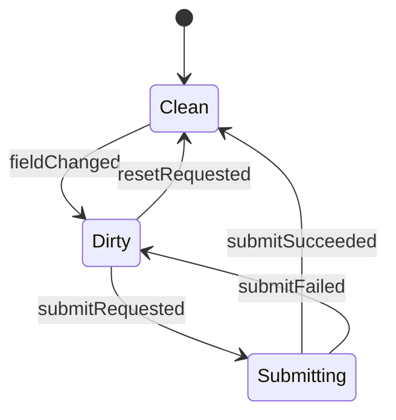
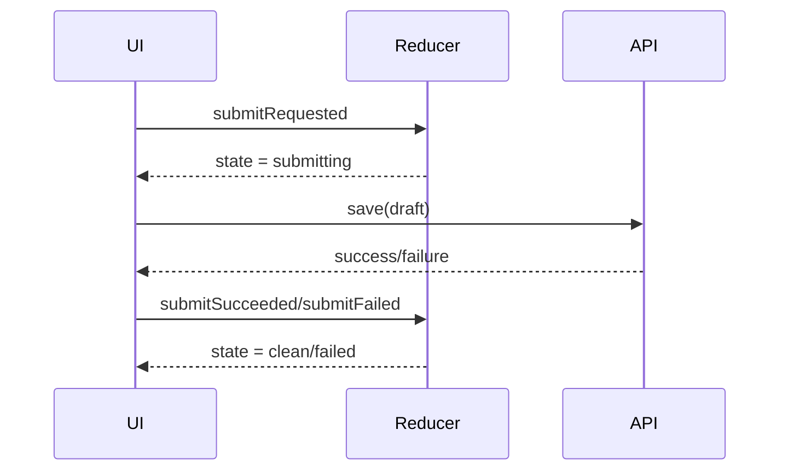

# Part 010 — `useReducer` as Local State Machine

`useReducer` sering dijelaskan sebagai “alternatif `useState` untuk state kompleks”. Itu benar, tapi kurang tajam.

Penjelasan yang lebih berguna:

> `useReducer` memindahkan logika perubahan state dari event handler tersebar ke satu transition function yang deterministic.

Dengan `useState`, event handler sering langsung menyusun next state:

```tsx
setDraft((draft) => ({ ...draft, title }));
setDirty(true);
setValidationErrors({});
```

Dengan `useReducer`, event handler hanya mendeskripsikan apa yang terjadi:

```tsx
dispatch({ type: 'titleChanged', title });
```

Reducer yang menentukan dampaknya terhadap state.

Ini bukan sekadar perbedaan style. Ini perubahan dari setter-thinking ke event/transition-thinking.

---

## 1. Kontrak Dasar `useReducer`

Signature umum:

```tsx
const [state, dispatch] = useReducer(reducer, initialArg, init);
```

Komponen menerima:

1. `state`: snapshot state untuk render saat ini.
2. `dispatch`: function stabil untuk mengirim action/event ke reducer.
3. `reducer`: pure function yang menghitung next state dari current state dan action.

Bentuk reducer:

```tsx
function reducer(state: State, action: Action): State {
  switch (action.type) {
    case 'somethingHappened':
      return nextState;
    default:
      return state;
  }
}
```

Mental model:

```mermaid
flowchart TD
    A[User intent / event] --> B[dispatch(action)]
    B --> C[React queues reducer update]
    C --> D[reducer(currentState, action)]
    D --> E[nextState]
    E --> F[Component renders new snapshot]
```

Reducer tidak boleh:

- mutate state lama,
- melakukan network request,
- membaca waktu saat ini untuk logic utama,
- menulis localStorage,
- memanggil analytics,
- memanggil `dispatch`,
- bergantung pada external mutable value.

Reducer harus seperti fungsi matematika:

```txt
same state + same action => same next state
```

---

## 2. Kenapa `useReducer` Bukan Redux Mini

`useReducer` dan Redux sama-sama memakai reducer pattern. Tapi perannya beda.

`useReducer`:

- local ke component/subtree,
- tidak otomatis global,
- tidak punya middleware built-in,
- tidak punya devtools built-in,
- tidak punya normalized entity convention,
- cocok untuk transition logic lokal.

Redux Toolkit:

- application-level store,
- shared state global/feature-wide,
- middleware, devtools, async conventions,
- lebih cocok untuk state yang perlu observability lintas fitur.

Jangan memakai `useReducer` karena ingin terlihat advanced. Pakai ketika state punya transition rules yang lebih penting daripada field storage-nya.

---

## 3. Kapan `useState` Mulai Patah

Contoh local form sederhana:

```tsx
const [title, setTitle] = useState('');
const [description, setDescription] = useState('');
```

Ini masih sehat.

Tapi lalu requirement bertambah:

- form punya dirty state,
- validasi field,
- submit async,
- error bisa field-level atau global,
- setelah submit sukses form reset,
- jika remote value berubah saat dirty, tampilkan conflict,
- tombol save disabled di state tertentu.

Dengan `useState`, handler mulai seperti ini:

```tsx
function changeTitle(title: string) {
  setTitle(title);
  setDirty(true);
  setErrors((errors) => ({ ...errors, title: undefined }));
  setSubmitStatus('idle');
}

async function submit() {
  setSubmitting(true);
  setGlobalError(null);

  try {
    const result = await save({ title, description });
    setSubmitting(false);
    setDirty(false);
    setLastSavedAt(result.savedAt);
  } catch (error) {
    setSubmitting(false);
    setGlobalError(toMessage(error));
  }
}
```

Masalahnya bukan jumlah baris. Masalahnya invariant tersebar.

```txt
Ketika title berubah:
- dirty harus true
- title error harus clear
- submit success lama tidak boleh tetap tampil

Ketika submit dimulai:
- status harus submitting
- global error harus clear
- duplicate submit harus dicegah

Ketika submit sukses:
- dirty harus false
- draft baseline harus diperbarui
- error harus clear
```

Jika invariant tersebar di banyak handler, reducer lebih cocok.

---

## 4. Reducer sebagai Transition Table

State machine minimal punya:

- state,
- event/action,
- transition,
- guard,
- effect boundary.

Reducer tidak menjalankan effect, tapi bisa merepresentasikan transition.



Transition table:

| Current State | Action | Next State |
|---|---|---|
| `clean` | `fieldChanged` | `dirty` |
| `dirty` | `fieldChanged` | `dirty` |
| `dirty` | `submitRequested` | `submitting` |
| `submitting` | `submitSucceeded` | `clean` |
| `submitting` | `submitFailed` | `dirty` |
| `dirty` | `resetRequested` | `clean` |

Dengan reducer, table ini bisa dipindahkan ke kode.

---

## 5. Modeling State dengan Discriminated Union

Jangan mulai dari field boolean. Mulai dari state yang valid.

Buruk:

```tsx
type State = {
  title: string;
  isDirty: boolean;
  isSubmitting: boolean;
  isSuccess: boolean;
  error: string | null;
};
```

State ini mengizinkan kombinasi aneh:

```txt
isSubmitting = true
isSuccess = true
error = "Network error"
```

Lebih baik:

```tsx
type Draft = {
  title: string;
  description: string;
};

type State =
  | {
      type: 'clean';
      draft: Draft;
      savedDraft: Draft;
    }
  | {
      type: 'dirty';
      draft: Draft;
      savedDraft: Draft;
      errors: Partial<Record<keyof Draft, string>>;
    }
  | {
      type: 'submitting';
      draft: Draft;
      savedDraft: Draft;
    }
  | {
      type: 'failed';
      draft: Draft;
      savedDraft: Draft;
      message: string;
      errors: Partial<Record<keyof Draft, string>>;
    };
```

Sekarang impossible state lebih sulit terbentuk. UI juga lebih eksplisit.

```tsx
function canSubmit(state: State): boolean {
  return state.type === 'dirty' || state.type === 'failed';
}
```

---

## 6. Modeling Action sebagai Event, Bukan Setter

Buruk:

```tsx
type Action =
  | { type: 'setTitle'; title: string }
  | { type: 'setSubmitting'; submitting: boolean }
  | { type: 'setError'; error: string | null };
```

Ini hanya memindahkan setter ke reducer. Tidak ada value arsitektural.

Lebih baik:

```tsx
type Action =
  | { type: 'fieldChanged'; field: keyof Draft; value: string }
  | { type: 'resetRequested' }
  | { type: 'submitRequested' }
  | { type: 'submitSucceeded'; savedDraft: Draft }
  | { type: 'submitFailed'; message: string; errors?: Partial<Record<keyof Draft, string>> };
```

Action harus menjawab:

> Peristiwa apa yang terjadi di domain/UI?

Bukan:

> Field mana yang ingin saya set?

Perbedaan ini penting karena satu event bisa mengubah banyak field untuk menjaga invariant.

---

## 7. Implementasi Reducer Form Draft

```tsx
type Draft = {
  title: string;
  description: string;
};

type FieldErrors = Partial<Record<keyof Draft, string>>;

type State =
  | { type: 'clean'; draft: Draft; savedDraft: Draft }
  | { type: 'dirty'; draft: Draft; savedDraft: Draft; errors: FieldErrors }
  | { type: 'submitting'; draft: Draft; savedDraft: Draft }
  | { type: 'failed'; draft: Draft; savedDraft: Draft; message: string; errors: FieldErrors };

type Action =
  | { type: 'fieldChanged'; field: keyof Draft; value: string }
  | { type: 'resetRequested' }
  | { type: 'submitRequested' }
  | { type: 'submitSucceeded'; savedDraft: Draft }
  | { type: 'submitFailed'; message: string; errors?: FieldErrors };

function reducer(state: State, action: Action): State {
  switch (action.type) {
    case 'fieldChanged': {
      if (state.type === 'submitting') {
        return state;
      }

      const draft = {
        ...state.draft,
        [action.field]: action.value,
      };

      const errors =
        state.type === 'dirty' || state.type === 'failed'
          ? { ...state.errors, [action.field]: undefined }
          : {};

      return {
        type: 'dirty',
        draft,
        savedDraft: state.savedDraft,
        errors,
      };
    }

    case 'resetRequested': {
      if (state.type === 'submitting') {
        return state;
      }

      return {
        type: 'clean',
        draft: state.savedDraft,
        savedDraft: state.savedDraft,
      };
    }

    case 'submitRequested': {
      if (state.type !== 'dirty' && state.type !== 'failed') {
        return state;
      }

      return {
        type: 'submitting',
        draft: state.draft,
        savedDraft: state.savedDraft,
      };
    }

    case 'submitSucceeded': {
      return {
        type: 'clean',
        draft: action.savedDraft,
        savedDraft: action.savedDraft,
      };
    }

    case 'submitFailed': {
      if (state.type !== 'submitting') {
        return state;
      }

      return {
        type: 'failed',
        draft: state.draft,
        savedDraft: state.savedDraft,
        message: action.message,
        errors: action.errors ?? {},
      };
    }

    default: {
      return assertNever(action);
    }
  }
}

function assertNever(value: never): never {
  throw new Error(`Unhandled action: ${JSON.stringify(value)}`);
}
```

Catatan penting:

- `fieldChanged` menolak update saat `submitting`.
- `resetRequested` menolak reset saat `submitting`.
- `submitRequested` hanya valid dari `dirty` atau `failed`.
- `submitFailed` hanya diproses jika state sekarang `submitting`.
- Reducer menjaga state tetap valid.

---

## 8. Menggunakan Reducer di Komponen

```tsx
function createInitialState(initialDraft: Draft): State {
  return {
    type: 'clean',
    draft: initialDraft,
    savedDraft: initialDraft,
  };
}

type CaseDraftFormProps = {
  initialDraft: Draft;
  onSave: (draft: Draft) => Promise<Draft>;
};

export function CaseDraftForm({ initialDraft, onSave }: CaseDraftFormProps) {
  const [state, dispatch] = useReducer(reducer, initialDraft, createInitialState);

  async function handleSubmit() {
    if (state.type !== 'dirty' && state.type !== 'failed') {
      return;
    }

    const draft = state.draft;
    dispatch({ type: 'submitRequested' });

    try {
      const savedDraft = await onSave(draft);
      dispatch({ type: 'submitSucceeded', savedDraft });
    } catch (error) {
      dispatch({
        type: 'submitFailed',
        message: error instanceof Error ? error.message : 'Failed to save draft',
      });
    }
  }

  return (
    <form
      onSubmit={(event) => {
        event.preventDefault();
        void handleSubmit();
      }}
    >
      <input
        value={state.draft.title}
        disabled={state.type === 'submitting'}
        onChange={(event) =>
          dispatch({
            type: 'fieldChanged',
            field: 'title',
            value: event.target.value,
          })
        }
      />

      <textarea
        value={state.draft.description}
        disabled={state.type === 'submitting'}
        onChange={(event) =>
          dispatch({
            type: 'fieldChanged',
            field: 'description',
            value: event.target.value,
          })
        }
      />

      {state.type === 'failed' ? <p role="alert">{state.message}</p> : null}

      <button type="submit" disabled={state.type !== 'dirty' && state.type !== 'failed'}>
        {state.type === 'submitting' ? 'Saving...' : 'Save'}
      </button>

      <button
        type="button"
        disabled={state.type === 'submitting'}
        onClick={() => dispatch({ type: 'resetRequested' })}
      >
        Reset
      </button>
    </form>
  );
}
```

Notice:

- Komponen tidak tahu detail reset dirty/error.
- Komponen hanya dispatch event.
- Reducer menjadi pusat transition logic.
- Async effect tetap berada di handler, bukan reducer.

---

## 9. Async Boundary: Reducer Tidak Menjalankan Promise

Reducer harus pure. Jadi async flow dipecah:

```txt
submit handler
→ dispatch submitRequested
→ await API
→ dispatch submitSucceeded / submitFailed
```



Jangan menulis reducer seperti ini:

```tsx
async function reducer(state: State, action: Action): Promise<State> {
  // Salah
}
```

Jangan melakukan ini juga:

```tsx
function reducer(state: State, action: Action): State {
  if (action.type === 'submitRequested') {
    save(state.draft); // Salah: side effect di reducer
    return { ...state, type: 'submitting' };
  }
}
```

Reducer hanya menghitung state. Handler/action layer menjalankan effect.

---

## 10. Init Function dan Reset yang Konsisten

`useReducer` punya argumen ketiga `init`.

```tsx
const [state, dispatch] = useReducer(reducer, initialDraft, createInitialState);
```

Ini berguna ketika initial state perlu dibangun dari `initialArg`.

```tsx
function createInitialState(draft: Draft): State {
  return {
    type: 'clean',
    draft,
    savedDraft: draft,
  };
}
```

Kamu juga bisa memakai function yang sama untuk reset total.

```tsx
type Action =
  | { type: 'externalDraftReplaced'; draft: Draft }
  | { type: 'fieldChanged'; field: keyof Draft; value: string };

function reducer(state: State, action: Action): State {
  switch (action.type) {
    case 'externalDraftReplaced':
      return createInitialState(action.draft);

    // ...
  }
}
```

Tetapi hati-hati: jika external draft berubah saat user sedang dirty, reset otomatis dapat menghapus edit lokal. Untuk aplikasi enterprise, biasanya butuh conflict policy.

---

## 11. Event Naming yang Sehat

Action naming menentukan kualitas reducer.

Hindari nama command setter:

```tsx
{ type: 'setOpen', value: true }
{ type: 'setStatus', status: 'approved' }
{ type: 'setSelectedIds', selectedIds }
```

Lebih baik nama event/intention:

```tsx
{ type: 'menuOpened' }
{ type: 'approvalRequested' }
{ type: 'caseSelected', caseId }
{ type: 'selectionCleared' }
```

Guideline:

| Buruk | Lebih Baik |
|---|---|
| `setName` | `nameChanged` |
| `setLoading` | `submitRequested` |
| `setError` | `submitFailed` |
| `setSelectedId` | `caseSelected` |
| `setModal` | `deleteDialogOpened` |

Event naming membuat reducer terdengar seperti log sistem. Ini bagus karena UI state adalah hasil dari peristiwa.

---

## 12. Reducer dan Invariant

Reducer harus menjadi tempat invariant hidup.

Contoh selection state:

```tsx
type State = {
  selectedIds: string[];
  anchorId: string | null;
};

type Action =
  | { type: 'itemToggled'; id: string }
  | { type: 'rangeSelected'; fromId: string; toId: string }
  | { type: 'selectionCleared' }
  | { type: 'itemsReplaced'; ids: string[] };
```

Invariant:

```txt
1. selectedIds tidak boleh mengandung id yang sudah tidak ada.
2. selectedIds tidak boleh duplicate.
3. anchorId harus null atau id yang masih ada.
4. rangeSelected harus menghasilkan urutan yang valid.
```

Reducer menjaga invariant:

```tsx
function reducer(state: State, action: Action): State {
  switch (action.type) {
    case 'itemsReplaced': {
      const validIds = new Set(action.ids);

      return {
        selectedIds: state.selectedIds.filter((id) => validIds.has(id)),
        anchorId: state.anchorId && validIds.has(state.anchorId) ? state.anchorId : null,
      };
    }

    // ...
  }
}
```

Jika invariant tersebar di komponen, kamu akan membuat bug saat menambah fitur baru.

---

## 13. Build From Scratch: Reducer Runner Mini

Untuk memahami `useReducer`, bayangkan implementasi mini ini.

```tsx
type Reducer<S, A> = (state: S, action: A) => S;

function createReducerStore<S, A>(reducer: Reducer<S, A>, initialState: S) {
  let state = initialState;
  const listeners = new Set<() => void>();

  function getState() {
    return state;
  }

  function dispatch(action: A) {
    const nextState = reducer(state, action);

    if (Object.is(nextState, state)) {
      return;
    }

    state = nextState;
    listeners.forEach((listener) => listener());
  }

  function subscribe(listener: () => void) {
    listeners.add(listener);
    return () => listeners.delete(listener);
  }

  return {
    getState,
    dispatch,
    subscribe,
  };
}
```

`useReducer` bukan external store seperti ini, tapi model ini menunjukkan ide intinya:

```txt
state + action -> reducer -> nextState -> notify/render
```

Reducer adalah transition kernel.

---

## 14. Reducer Composition

Untuk state besar, reducer bisa dipecah.

```tsx
type State = {
  draft: DraftState;
  attachments: AttachmentState;
  validation: ValidationState;
};

type Action = DraftAction | AttachmentAction | ValidationAction;

function reducer(state: State, action: Action): State {
  return {
    draft: draftReducer(state.draft, action),
    attachments: attachmentReducer(state.attachments, action),
    validation: validationReducer(state.validation, action),
  };
}
```

Tapi hati-hati. Composition seperti ini bagus jika substate relatif independen. Jika satu action harus mengubah beberapa substate secara koordinatif, root reducer tetap harus menjaga invariant.

Contoh:

```tsx
function reducer(state: State, action: Action): State {
  switch (action.type) {
    case 'formSubmitted':
      return {
        ...state,
        draft: draftReducer(state.draft, action),
        validation: clearValidationErrors(state.validation),
        attachments: lockAttachments(state.attachments),
      };

    default:
      return {
        draft: draftReducer(state.draft, action),
        attachments: attachmentReducer(state.attachments, action),
        validation: validationReducer(state.validation, action),
      };
  }
}
```

Jangan memecah reducer sampai invariant lintas-substate hilang dari pandangan.

---

## 15. Reducer dengan Command Output?

Kadang reducer perlu memicu side effect berdasarkan transition. Karena reducer harus pure, satu pattern advanced adalah menghasilkan command sebagai data.

```tsx
type Command =
  | { type: 'saveDraft'; draft: Draft }
  | { type: 'trackEvent'; name: string };

type StateWithCommand = {
  state: State;
  command: Command | null;
};
```

Reducer:

```tsx
function reducer(current: StateWithCommand, action: Action): StateWithCommand {
  switch (action.type) {
    case 'submitRequested': {
      if (current.state.type !== 'dirty') {
        return { state: current.state, command: null };
      }

      return {
        state: {
          type: 'submitting',
          draft: current.state.draft,
          savedDraft: current.state.savedDraft,
        },
        command: {
          type: 'saveDraft',
          draft: current.state.draft,
        },
      };
    }
  }
}
```

Komponen menjalankan command di effect:

```tsx
useEffect(() => {
  if (!model.command) {
    return;
  }

  if (model.command.type === 'saveDraft') {
    void saveDraft(model.command.draft);
  }
}, [model.command]);
```

Pattern ini berguna untuk workflow engine, tapi untuk kebanyakan komponen terlalu berat. Gunakan hanya jika kamu benar-benar butuh transition menghasilkan effect description yang bisa dites.

---

## 16. Reducer vs State Machine Library

`useReducer` cukup untuk:

- state lokal dengan transition jelas,
- form kecil-menengah,
- modal flow sederhana,
- selection logic,
- local wizard sederhana.

State machine library seperti XState lebih cocok ketika:

- state graph besar,
- ada nested/parallel states,
- ada invoked async services,
- ada actor model,
- transition perlu divisualisasikan,
- workflow harus diaudit/dites sangat ketat,
- banyak event eksternal masuk.

Matriks:

| Kebutuhan | `useReducer` | State Machine Library |
|---|---:|---:|
| Local transition sederhana | Kuat | Bisa overkill |
| Nested state kompleks | Manual | Kuat |
| Parallel states | Manual dan rawan | Kuat |
| Async services | Manual | Built-in model |
| Visualization | Manual | Kuat |
| Team governance | Sedang | Kuat jika workflow kritikal |

---

## 17. Testing Reducer

Reducer sangat mudah dites karena pure.

```tsx
describe('case draft reducer', () => {
  it('marks clean draft as dirty when a field changes', () => {
    const state: State = {
      type: 'clean',
      draft: { title: 'Old', description: '' },
      savedDraft: { title: 'Old', description: '' },
    };

    const next = reducer(state, {
      type: 'fieldChanged',
      field: 'title',
      value: 'New',
    });

    expect(next).toEqual({
      type: 'dirty',
      draft: { title: 'New', description: '' },
      savedDraft: { title: 'Old', description: '' },
      errors: {},
    });
  });

  it('does not allow field change while submitting', () => {
    const state: State = {
      type: 'submitting',
      draft: { title: 'Current', description: '' },
      savedDraft: { title: 'Old', description: '' },
    };

    const next = reducer(state, {
      type: 'fieldChanged',
      field: 'title',
      value: 'New',
    });

    expect(next).toBe(state);
  });
});
```

Testing transition lebih valuable daripada testing setter dipanggil.

Test matrix yang sehat:

```txt
Given state X
When action Y
Then next state Z
And invariant still holds
```

---

## 18. Exhaustiveness dengan TypeScript

Reducer harus gagal saat action baru belum ditangani.

```tsx
function assertNever(value: never): never {
  throw new Error(`Unexpected value: ${JSON.stringify(value)}`);
}

function reducer(state: State, action: Action): State {
  switch (action.type) {
    case 'fieldChanged':
      return state;

    case 'submitRequested':
      return state;

    default:
      return assertNever(action);
  }
}
```

Jika kamu menambah action baru ke union tapi lupa menanganinya, TypeScript akan membantu.

Ini penting untuk sistem besar. Action yang tidak tertangani adalah bug diam-diam.

---

## 19. Reducer Failure Modes

## 19.1 Reducer Mutates State

Salah:

```tsx
function reducer(state: State, action: Action): State {
  state.count++;
  return state;
}
```

Fix:

```tsx
function reducer(state: State, action: Action): State {
  return { ...state, count: state.count + 1 };
}
```

## 19.2 Action Terlalu Teknis

Salah:

```tsx
dispatch({ type: 'setIsLoading', value: true });
```

Fix:

```tsx
dispatch({ type: 'submitRequested' });
```

## 19.3 Reducer Menjadi God Function

Gejala:

- switch sangat panjang,
- state terlalu besar,
- action unrelated bercampur,
- setiap action menyentuh banyak bagian state.

Fix:

- pecah feature boundary,
- pisahkan subreducer dengan hati-hati,
- evaluasi apakah sebagian state harus pindah ke server cache/context/external store.

## 19.4 Async Race

Contoh:

```tsx
submit A started
submit B started
B succeeds
A fails later
UI becomes failed although latest submit succeeded
```

Fix: bawa request id.

```tsx
type State =
  | { type: 'idle' }
  | { type: 'submitting'; requestId: string; draft: Draft }
  | { type: 'success' }
  | { type: 'failed'; message: string };

type Action =
  | { type: 'submitRequested'; requestId: string; draft: Draft }
  | { type: 'submitSucceeded'; requestId: string }
  | { type: 'submitFailed'; requestId: string; message: string };

function reducer(state: State, action: Action): State {
  switch (action.type) {
    case 'submitSucceeded':
      if (state.type !== 'submitting' || state.requestId !== action.requestId) {
        return state;
      }
      return { type: 'success' };

    case 'submitFailed':
      if (state.type !== 'submitting' || state.requestId !== action.requestId) {
        return state;
      }
      return { type: 'failed', message: action.message };
  }
}
```

Reducer bisa menolak response lama.

## 19.5 Invalid Transition Silent

Kadang reducer mengembalikan state lama untuk invalid transition.

```tsx
if (state.type !== 'dirty') {
  return state;
}
```

Ini aman untuk user interaction normal, tapi bisa menyembunyikan bug programmer. Untuk workflow kritikal, pertimbangkan helper:

```tsx
function invalidTransition(state: State, action: Action): State {
  if (process.env.NODE_ENV !== 'production') {
    throw new Error(`Invalid transition ${state.type} -> ${action.type}`);
  }

  return state;
}
```

---

## 20. Reducer Design Checklist

Sebelum memakai `useReducer`, definisikan:

```txt
1. Apa state valid yang mungkin terjadi?
2. Apa event/action yang bisa terjadi?
3. Event mana yang valid di state mana?
4. Apa invariant yang harus selalu benar?
5. Apakah reducer pure?
6. Apakah action bernama berdasarkan kejadian/intensi, bukan setter?
7. Apakah async result bisa datang terlambat?
8. Apakah perlu request id/correlation id?
9. Apakah perlu reset/reinitialize policy?
10. Apakah reducer masih lokal, atau sudah menjadi application store?
```

---

## 21. Latihan Implementasi

Buat reducer untuk `ApprovalPanel`.

Requirement:

1. Initial state `idle`.
2. User bisa klik `approve` atau `reject`.
3. Saat action dimulai, state menjadi `submitting` dengan `decision` dan `requestId`.
4. Jika sukses, state menjadi `approved` atau `rejected`.
5. Jika gagal, state menjadi `failed` dengan message dan decision terakhir.
6. Response lama harus diabaikan jika `requestId` tidak cocok.
7. Tidak boleh ada boolean `isApproved`, `isRejected`, `isSubmitting` terpisah.

Skeleton:

```tsx
type Decision = 'approve' | 'reject';

type State =
  | { type: 'idle' }
  | { type: 'submitting'; decision: Decision; requestId: string }
  | { type: 'approved' }
  | { type: 'rejected' }
  | { type: 'failed'; decision: Decision; message: string };

type Action =
  | { type: 'decisionSubmitted'; decision: Decision; requestId: string }
  | { type: 'decisionSucceeded'; decision: Decision; requestId: string }
  | { type: 'decisionFailed'; decision: Decision; requestId: string; message: string }
  | { type: 'retryRequested'; requestId: string };

function reducer(state: State, action: Action): State {
  switch (action.type) {
    case 'decisionSubmitted':
      return {
        type: 'submitting',
        decision: action.decision,
        requestId: action.requestId,
      };

    case 'decisionSucceeded':
      if (state.type !== 'submitting' || state.requestId !== action.requestId) {
        return state;
      }

      return action.decision === 'approve'
        ? { type: 'approved' }
        : { type: 'rejected' };

    case 'decisionFailed':
      if (state.type !== 'submitting' || state.requestId !== action.requestId) {
        return state;
      }

      return {
        type: 'failed',
        decision: action.decision,
        message: action.message,
      };

    case 'retryRequested':
      if (state.type !== 'failed') {
        return state;
      }

      return {
        type: 'submitting',
        decision: state.decision,
        requestId: action.requestId,
      };

    default:
      return assertNever(action);
  }
}
```

Diskusi lanjutan:

- Apakah `retryRequested` harus membawa decision atau membaca dari failed state?
- Apakah user boleh submit decision lain setelah failed?
- Apakah approved/rejected final state bisa diubah?
- Jika bisa undo, state graph berubah seperti apa?

---

## 22. Kesimpulan

`useReducer` bukan alat untuk membuat kode terlihat enterprise. Ia berguna ketika state berubah karena event yang punya aturan.

Gunakan `useReducer` ketika kamu butuh:

- transition yang eksplisit,
- invariant yang terpusat,
- testability tinggi,
- illegal state prevention,
- action log yang masuk akal,
- async result handling dengan request id,
- refactor path menuju state machine.

Formula:

```txt
useState menyimpan value lokal.
useReducer memodelkan transition lokal.
State machine memodelkan workflow eksplisit.
External store membagikan state lintas subtree.
Query cache mengelola server state.
```

Part berikutnya akan naik satu level: bukan lagi “setter mana yang dipakai”, tetapi bagaimana berpikir dalam state transitions, command, event, guard, dan reducer sebagai model perubahan yang bisa dijaga seiring fitur membesar.

---

## Referensi

- React Docs — `useReducer`: https://react.dev/reference/react/useReducer
- React Docs — Extracting State Logic into a Reducer: https://react.dev/learn/extracting-state-logic-into-a-reducer
- React Docs — Choosing the State Structure: https://react.dev/learn/choosing-the-state-structure
- React Docs — Keeping Components Pure: https://react.dev/learn/keeping-components-pure
- React Docs — Queueing a Series of State Updates: https://react.dev/learn/queueing-a-series-of-state-updates
