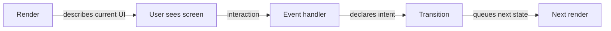
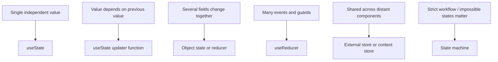
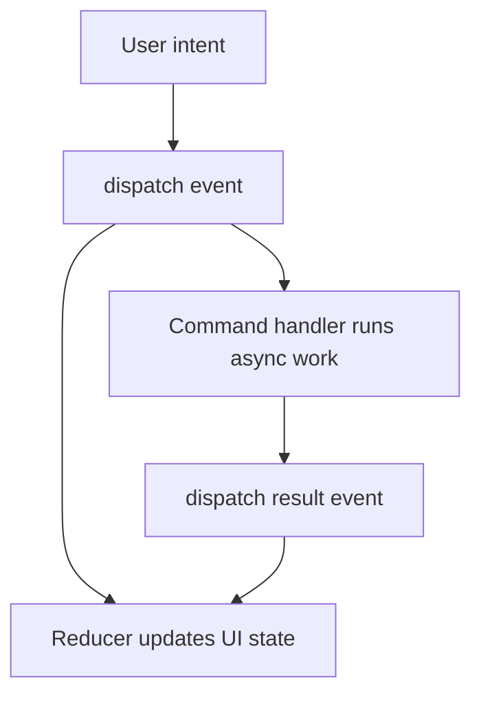

# Part 011 — State Transitions, Not Setters

Banyak bug React tidak muncul karena engineer tidak tahu `useState` atau `useReducer`.
Bug muncul karena engineer melihat state update sebagai operasi setter individual, bukan sebagai **transisi sistem**.

Setter-thinking bertanya:

```txt
Field mana yang perlu saya set?
```

Transition-thinking bertanya:

```txt
Peristiwa apa yang terjadi?
State sebelumnya apa?
State berikutnya yang valid apa?
Invariant apa yang harus tetap benar?
```

Perbedaannya terlihat kecil di komponen sederhana. Pada UI enterprise — approval workflow, case management, onboarding wizard, complex search, regulatory review, dispute flow, claim processing — perbedaannya menentukan apakah UI bisa diaudit, dites, dan dimodifikasi tanpa menciptakan state liar.

---

## 1. Masalah Utama: Setter Bukan Bahasa Domain

Setter adalah operasi mekanis.

```tsx
setStep(2);
setIsSubmitting(false);
setError(null);
setDirty(true);
```

Kode di atas menjawab **apa field yang berubah**, tapi tidak menjawab **mengapa berubah**.

Dalam sistem kecil, itu cukup.
Dalam sistem besar, “mengapa” adalah informasi utama.

Contoh buruk:

```tsx
function handleApprove() {
  setStatus('approved');
  setApprovedAt(new Date().toISOString());
  setCanEdit(false);
  setError(null);
}
```

Yang hilang:

1. Apakah user memang punya permission approve?
2. Apakah case boleh approve dari status saat ini?
3. Apakah ada required field yang belum valid?
4. Apakah approval optimistic atau confirmed dari server?
5. Apakah transisi ini bisa diulang?
6. Apakah audit trail perlu dibuat?
7. Apakah UI harus masuk pending state dulu?

Setter membuat perubahan terlihat sederhana, padahal domain transition mungkin tidak sederhana.

Transition-thinking menulisnya seperti ini:

```tsx
dispatch({ type: 'approvalRequested', actorId: user.id });
```

Lalu satu tempat menentukan apakah event itu valid dan dampaknya ke state.

---

## 2. Render, Event, Transition

React UI memiliki tiga ruang kerja yang perlu dipisahkan.



### Render

Render adalah kalkulasi UI dari snapshot saat ini.

```tsx
return <button disabled={state.status === 'submitting'}>Save</button>;
```

Render tidak boleh “memperbaiki” state, melakukan IO, atau memulai workflow.

### Event handler

Event handler adalah tempat user intent ditangkap.

```tsx
function handleSubmit() {
  dispatch({ type: 'submitClicked' });
}
```

Event handler boleh memulai state update karena handler terjadi setelah render.

### Transition

Transition adalah aturan perubahan state.

```tsx
function reducer(state: State, event: Event): State {
  switch (event.type) {
    case 'submitClicked':
      if (!state.form.valid) return state;
      return { ...state, status: 'submitting', error: null };
  }
}
```

Transition menjaga invariant.

---

## 3. UI Event, Intent Event, Domain Event, Command

Kesalahan desain sering terjadi karena semua hal disebut “event”.

Padahal dalam UI production, minimal ada empat level.

| Level | Contoh | Arti |
|---|---|---|
| DOM/UI event | `onClick`, `onChange`, `onBlur` | Sinyal teknis dari browser/React |
| Intent event | `submitClicked`, `filterChanged` | Maksud user dalam bahasa UI |
| Domain event | `caseApproved`, `invoiceRejected` | Fakta domain yang sudah terjadi |
| Command | `approveCase`, `saveDraft` | Permintaan melakukan aksi, biasanya async |

Jangan mencampur semuanya dalam satu callback.

Bad:

```tsx
<button
  onClick={async () => {
    setLoading(true);
    await api.approveCase(caseId);
    setStatus('approved');
    setLoading(false);
  }}
>
  Approve
</button>
```

Better:

```tsx
<button onClick={() => send({ type: 'approvalRequested' })}>
  Approve
</button>
```

Lalu orchestration layer menangani detail command, pending state, success, failure, dan invalidation.

```tsx
async function approve() {
  dispatch({ type: 'approvalRequested' });

  try {
    const approvedCase = await api.approveCase(caseId);
    dispatch({ type: 'approvalSucceeded', case: approvedCase });
  } catch (error) {
    dispatch({ type: 'approvalFailed', error });
  }
}
```

Perhatikan pemisahan:

1. `approvalRequested` = intent/command request.
2. `approvalSucceeded` = async result.
3. `approvalFailed` = async result failure.

---

## 4. Setter-Thinking Membuat Update Tidak Atomic

Contoh umum:

```tsx
function submit() {
  setIsSubmitting(true);
  setError(null);
  setSubmitCount(submitCount + 1);
}
```

Masalahnya bukan hanya banyak setter.
Masalahnya adalah state update tersebar sebagai beberapa operasi yang secara mental adalah satu transisi.

Jika beberapa handler lain juga mengubah `isSubmitting`, `error`, atau `submitCount`, invariant mulai tersebar.

Better:

```tsx
setSubmission((submission) => ({
  status: 'submitting',
  error: null,
  submitCount: submission.submitCount + 1,
}));
```

Even better ketika state semakin kompleks:

```tsx
dispatch({ type: 'submitStarted' });
```

Dengan reducer:

```tsx
type SubmissionState =
  | { status: 'idle'; submitCount: number; error: null }
  | { status: 'submitting'; submitCount: number; error: null }
  | { status: 'failed'; submitCount: number; error: string }
  | { status: 'succeeded'; submitCount: number; error: null };

type SubmissionEvent =
  | { type: 'submitStarted' }
  | { type: 'submitSucceeded' }
  | { type: 'submitFailed'; error: string };

function submissionReducer(
  state: SubmissionState,
  event: SubmissionEvent,
): SubmissionState {
  switch (event.type) {
    case 'submitStarted':
      if (state.status === 'submitting') return state;

      return {
        status: 'submitting',
        submitCount: state.submitCount + 1,
        error: null,
      };

    case 'submitSucceeded':
      return {
        status: 'succeeded',
        submitCount: state.submitCount,
        error: null,
      };

    case 'submitFailed':
      return {
        status: 'failed',
        submitCount: state.submitCount,
        error: event.error,
      };
  }
}
```

Sekarang transisi `submitStarted` adalah satu unit konseptual.

---

## 5. Atomicity di React: Batching Bukan Desain State

React dapat melakukan batching beberapa state update sehingga beberapa setter dalam satu event tidak selalu menghasilkan beberapa render terpisah. Tetapi batching bukan pengganti desain state.

Batching menjawab:

```txt
Kapan React memproses update?
```

Transition design menjawab:

```txt
Apa arti update ini?
Apakah next state valid?
```

Contoh:

```tsx
setStatus('submitting');
setCanEdit(false);
setError(null);
```

Meskipun React mem-batch update ini, invariant tetap tersebar di tiga setter.

Pertanyaan yang lebih tajam:

```txt
Apakah status='submitting' selalu berarti canEdit=false?
```

Jika ya, `canEdit` mungkin tidak perlu disimpan sebagai state.

```tsx
const canEdit = state.status === 'draft' || state.status === 'failed';
```

Atau state harus direpresentasikan sebagai union:

```tsx
type CaseViewState =
  | { status: 'draft'; draft: Draft; error: null }
  | { status: 'submitting'; draft: Draft; error: null }
  | { status: 'submitted'; caseId: string; error: null }
  | { status: 'failed'; draft: Draft; error: string };
```

Dengan begitu impossible state seperti ini tidak bisa muncul:

```tsx
{
  status: 'submitting',
  canEdit: true,
  error: 'Already approved'
}
```

---

## 6. Transisi Selalu Punya Current State

State update yang benar hampir selalu perlu mempertimbangkan current state.

Bad:

```tsx
setCount(count + 1);
setCount(count + 1);
setCount(count + 1);
```

Karena `count` di handler adalah snapshot dari render saat ini.

Better:

```tsx
setCount((count) => count + 1);
setCount((count) => count + 1);
setCount((count) => count + 1);
```

Updater function bukan hanya “trik increment”.
Ia adalah bentuk kecil dari transition function.

```tsx
setCart((cart) => addItem(cart, product));
```

`addItem` dapat menjadi pure transition:

```tsx
function addItem(cart: Cart, product: Product): Cart {
  const existing = cart.items.find((item) => item.productId === product.id);

  if (!existing) {
    return {
      ...cart,
      items: [...cart.items, { productId: product.id, quantity: 1 }],
    };
  }

  return {
    ...cart,
    items: cart.items.map((item) =>
      item.productId === product.id
        ? { ...item, quantity: item.quantity + 1 }
        : item,
    ),
  };
}
```

Sekarang transition bisa dites tanpa React.

---

## 7. Membuat State Transition Table

Sebelum menulis reducer, tulis transition table.

Contoh wizard approval:

| Current State | Event | Next State | Guard |
|---|---|---|---|
| `editing` | `nextClicked` | `reviewing` | form valid |
| `editing` | `nextClicked` | `editing` | form invalid |
| `reviewing` | `backClicked` | `editing` | always |
| `reviewing` | `submitClicked` | `submitting` | user can submit |
| `submitting` | `submitSucceeded` | `submitted` | request id matches |
| `submitting` | `submitFailed` | `reviewing` | recoverable error |

Lalu reducer mengikuti table.

```tsx
type WizardState =
  | { step: 'editing'; draft: Draft; errors: FieldErrors }
  | { step: 'reviewing'; draft: Draft }
  | { step: 'submitting'; draft: Draft; requestId: string }
  | { step: 'submitted'; submissionId: string };

type WizardEvent =
  | { type: 'fieldChanged'; field: keyof Draft; value: string }
  | { type: 'nextClicked' }
  | { type: 'backClicked' }
  | { type: 'submitClicked'; requestId: string }
  | { type: 'submitSucceeded'; requestId: string; submissionId: string }
  | { type: 'submitFailed'; requestId: string; reason: string };
```

Reducer:

```tsx
function wizardReducer(state: WizardState, event: WizardEvent): WizardState {
  switch (state.step) {
    case 'editing': {
      switch (event.type) {
        case 'fieldChanged':
          return {
            step: 'editing',
            draft: { ...state.draft, [event.field]: event.value },
            errors: {},
          };

        case 'nextClicked': {
          const errors = validateDraft(state.draft);

          if (hasErrors(errors)) {
            return { ...state, errors };
          }

          return { step: 'reviewing', draft: state.draft };
        }

        default:
          return state;
      }
    }

    case 'reviewing': {
      switch (event.type) {
        case 'backClicked':
          return { step: 'editing', draft: state.draft, errors: {} };

        case 'submitClicked':
          return {
            step: 'submitting',
            draft: state.draft,
            requestId: event.requestId,
          };

        default:
          return state;
      }
    }

    case 'submitting': {
      switch (event.type) {
        case 'submitSucceeded':
          if (event.requestId !== state.requestId) return state;
          return { step: 'submitted', submissionId: event.submissionId };

        case 'submitFailed':
          if (event.requestId !== state.requestId) return state;
          return { step: 'reviewing', draft: state.draft };

        default:
          return state;
      }
    }

    case 'submitted':
      return state;
  }
}
```

Notice: event handling is scoped by current state.
That prevents invalid transitions from being handled accidentally.

---

## 8. Jangan Menamai Event Seperti Setter

Bad event names:

```tsx
dispatch({ type: 'setLoading', value: true });
dispatch({ type: 'setError', error });
dispatch({ type: 'setStep', step: 2 });
```

Itu hanya setter yang menyamar sebagai reducer action.

Better:

```tsx
dispatch({ type: 'saveStarted' });
dispatch({ type: 'saveFailed', error });
dispatch({ type: 'reviewRequested' });
```

Nama event yang baik menjelaskan peristiwa, bukan field.

| Setter-ish | Transition-oriented |
|---|---|
| `setOpen` | `dialogOpened`, `dialogClosed` |
| `setLoading` | `fetchStarted`, `fetchSucceeded`, `fetchFailed` |
| `setPage` | `pageRequested`, `pageLoaded` |
| `setSelectedId` | `rowSelected`, `selectionCleared` |
| `setDirty` | `fieldChanged`, `draftReset` |

Event yang baik memudahkan debugging.

```txt
fieldChanged -> validationFailed -> submitBlocked -> fieldChanged -> submitRequested -> submitSucceeded
```

Sequence ini bisa dibaca sebagai cerita sistem.

---

## 9. State Update Harus Menjaga Invariant

Invariant adalah aturan yang harus selalu benar.

Contoh invariant form:

```txt
Jika status=submitting, tombol submit harus disabled.
Jika status=submitted, draft tidak boleh diedit.
Jika ada field error, step tidak boleh review.
```

Setter-thinking menyebarkan invariant ke render, handler, effect, dan helper.

```tsx
if (isSubmitting) return;
setIsSubmitting(true);

if (!isValid) {
  setErrors(errors);
  setStep('editing');
}

if (status === 'submitted') {
  setCanEdit(false);
}
```

Transition-thinking menaruh invariant dekat dengan transisi.

```tsx
case 'submitClicked': {
  if (state.step !== 'reviewing') return state;
  if (!state.canSubmit) return state;

  return {
    ...state,
    step: 'submitting',
    error: null,
  };
}
```

Untuk invariant yang bisa diturunkan, jangan simpan sebagai state.

Bad:

```tsx
const [status, setStatus] = useState<'draft' | 'submitted'>('draft');
const [canEdit, setCanEdit] = useState(true);
```

Better:

```tsx
const [status, setStatus] = useState<'draft' | 'submitted'>('draft');
const canEdit = status === 'draft';
```

Best, jika domain bertambah:

```tsx
type State =
  | { status: 'draft'; draft: Draft }
  | { status: 'submitted'; submissionId: string };
```

---

## 10. Transition Function Sebagai Unit Test Target

Komponen sulit dites jika semua logic ada di handler.

Bad:

```tsx
function CaseEditor() {
  const [status, setStatus] = useState('editing');
  const [errors, setErrors] = useState({});

  function next() {
    const errors = validate(form);
    if (Object.keys(errors).length > 0) {
      setErrors(errors);
      return;
    }
    setStatus('reviewing');
  }
}
```

Better:

```tsx
export function transition(state: State, event: Event): State {
  // pure transition logic
}
```

Test:

```tsx
it('blocks transition to review when draft is invalid', () => {
  const state: State = {
    step: 'editing',
    draft: { title: '' },
    errors: {},
  };

  expect(transition(state, { type: 'nextClicked' })).toEqual({
    step: 'editing',
    draft: { title: '' },
    errors: { title: 'Required' },
  });
});
```

Testing transition is cheaper than rendering the whole component.

---

## 11. Scaling Path: From Setter to Reducer to Store to Machine

Not every state needs reducer. The point is not “always use reducer”. The point is to choose the smallest model that preserves correctness.



### Use `useState` when

1. State is local.
2. Transitions are simple.
3. Illegal states are unlikely.
4. There are few update paths.
5. The value maps directly to UI.

Example:

```tsx
const [isOpen, setOpen] = useState(false);
```

### Use updater function when

Next value depends on previous value.

```tsx
setQuantity((quantity) => quantity + 1);
```

### Use object state when

Several fields are one unit.

```tsx
setDraft((draft) => ({ ...draft, title }));
```

### Use reducer when

1. Multiple fields transition together.
2. Events matter more than fields.
3. You need central invariant enforcement.
4. You want transition tests.
5. You are repeatedly fixing stale or inconsistent state bugs.

### Use state machine when

1. UI has strict finite states.
2. Some events are legal only in certain states.
3. Async operations can overlap.
4. Workflow auditability matters.
5. The team needs a visual transition map.

---

## 12. Example: Selection State in Data Grid

Bad:

```tsx
const [selectedIds, setSelectedIds] = useState<string[]>([]);
const [lastSelectedId, setLastSelectedId] = useState<string | null>(null);
const [isAllSelected, setAllSelected] = useState(false);

function toggleRow(id: string) {
  if (selectedIds.includes(id)) {
    setSelectedIds(selectedIds.filter((selectedId) => selectedId !== id));
  } else {
    setSelectedIds([...selectedIds, id]);
  }

  setLastSelectedId(id);
  setAllSelected(selectedIds.length + 1 === rows.length);
}
```

Problems:

1. `isAllSelected` is derived.
2. `selectedIds` uses snapshot directly.
3. `lastSelectedId` and `selectedIds` can drift.
4. Logic breaks when row list changes.

Better:

```tsx
type SelectionState = {
  selectedIds: Set<string>;
  lastSelectedId: string | null;
};

type SelectionEvent =
  | { type: 'rowToggled'; id: string }
  | { type: 'allVisibleRowsSelected'; ids: string[] }
  | { type: 'selectionCleared' }
  | { type: 'rowsChanged'; visibleIds: string[] };

function selectionReducer(
  state: SelectionState,
  event: SelectionEvent,
): SelectionState {
  switch (event.type) {
    case 'rowToggled': {
      const selectedIds = new Set(state.selectedIds);

      if (selectedIds.has(event.id)) {
        selectedIds.delete(event.id);
      } else {
        selectedIds.add(event.id);
      }

      return {
        selectedIds,
        lastSelectedId: event.id,
      };
    }

    case 'allVisibleRowsSelected':
      return {
        selectedIds: new Set(event.ids),
        lastSelectedId: event.ids.at(-1) ?? null,
      };

    case 'selectionCleared':
      return {
        selectedIds: new Set(),
        lastSelectedId: null,
      };

    case 'rowsChanged': {
      const visible = new Set(event.visibleIds);
      const selectedIds = new Set(
        [...state.selectedIds].filter((id) => visible.has(id)),
      );

      return {
        selectedIds,
        lastSelectedId:
          state.lastSelectedId && visible.has(state.lastSelectedId)
            ? state.lastSelectedId
            : null,
      };
    }
  }
}
```

Derived values remain derived:

```tsx
const isAllSelected =
  rows.length > 0 && rows.every((row) => state.selectedIds.has(row.id));

const selectedCount = state.selectedIds.size;
```

---

## 13. Example: Modal State

Bad:

```tsx
const [isDeleteOpen, setDeleteOpen] = useState(false);
const [selectedUserId, setSelectedUserId] = useState<string | null>(null);

function openDelete(userId: string) {
  setSelectedUserId(userId);
  setDeleteOpen(true);
}

function closeDelete() {
  setDeleteOpen(false);
}
```

Bug: modal bisa tertutup tapi `selectedUserId` masih ada. Atau `isDeleteOpen=true` tapi `selectedUserId=null`.

Better:

```tsx
type ModalState =
  | { type: 'none' }
  | { type: 'deleteUser'; userId: string }
  | { type: 'inviteUser' }
  | { type: 'editRole'; userId: string; roleId: string };

const [modal, setModal] = useState<ModalState>({ type: 'none' });
```

Open:

```tsx
setModal({ type: 'deleteUser', userId });
```

Close:

```tsx
setModal({ type: 'none' });
```

Render:

```tsx
{modal.type === 'deleteUser' && (
  <DeleteUserDialog
    userId={modal.userId}
    onClose={() => setModal({ type: 'none' })}
  />
)}
```

State shape itself prevents impossible state.

---

## 14. Example: Async Request State

Bad:

```tsx
const [data, setData] = useState<User | null>(null);
const [loading, setLoading] = useState(false);
const [error, setError] = useState<string | null>(null);
```

This permits impossible combinations:

```tsx
{ loading: true, data: user, error: 'Failed' }
{ loading: false, data: null, error: null }
```

Maybe some are valid, maybe not. The state shape does not say.

Better:

```tsx
type AsyncState<T> =
  | { status: 'idle' }
  | { status: 'loading'; requestId: string }
  | { status: 'success'; data: T }
  | { status: 'error'; error: string };
```

Transition:

```tsx
type AsyncEvent<T> =
  | { type: 'loadStarted'; requestId: string }
  | { type: 'loadSucceeded'; requestId: string; data: T }
  | { type: 'loadFailed'; requestId: string; error: string };

function asyncReducer<T>(
  state: AsyncState<T>,
  event: AsyncEvent<T>,
): AsyncState<T> {
  switch (event.type) {
    case 'loadStarted':
      return { status: 'loading', requestId: event.requestId };

    case 'loadSucceeded':
      if (state.status !== 'loading') return state;
      if (state.requestId !== event.requestId) return state;
      return { status: 'success', data: event.data };

    case 'loadFailed':
      if (state.status !== 'loading') return state;
      if (state.requestId !== event.requestId) return state;
      return { status: 'error', error: event.error };
  }
}
```

The `requestId` guard prevents stale request completion from overwriting newer state.

---

## 15. Side Effects Are Not Reducer Work

A reducer must be pure.

Bad:

```tsx
function reducer(state: State, event: Event): State {
  switch (event.type) {
    case 'submitClicked':
      api.save(state.draft); // wrong
      return { ...state, status: 'submitting' };
  }
}
```

A transition function calculates next state. It does not talk to network, localStorage, analytics, DOM, timers, or random global systems.

Better:

```tsx
async function submit() {
  const requestId = crypto.randomUUID();

  dispatch({ type: 'submitStarted', requestId });

  try {
    const result = await api.save(state.draft);
    dispatch({ type: 'submitSucceeded', requestId, result });
  } catch (error) {
    dispatch({ type: 'submitFailed', requestId, error: toMessage(error) });
  }
}
```

Caveat: this reads `state.draft` from the current render snapshot. If user can mutate the draft while request is pending, you must decide which draft is submitted:

1. Freeze snapshot at submit time.
2. Disable editing while submitting.
3. Allow editing but submit the captured draft.
4. Cancel/restart submit when draft changes.

That is a product and workflow decision, not merely a React decision.

---

## 16. Command Boundary Pattern

For more structured orchestration, separate transition from command execution.



Simplified hook:

```tsx
function useCaseApproval(caseId: string) {
  const [state, dispatch] = useReducer(reducer, initialState);

  const approve = async () => {
    const requestId = crypto.randomUUID();
    dispatch({ type: 'approvalStarted', requestId });

    try {
      const approved = await approveCase(caseId);
      dispatch({ type: 'approvalSucceeded', requestId, approved });
    } catch (error) {
      dispatch({ type: 'approvalFailed', requestId, error: toMessage(error) });
    }
  };

  return {
    state,
    approve,
    retry: approve,
    cancel: () => dispatch({ type: 'approvalCancelled' }),
  };
}
```

The component consumes a domain-oriented API:

```tsx
const { state, approve, retry, cancel } = useCaseApproval(caseId);
```

The component does not know which internal fields change.

---

## 17. State Transition Design Heuristics

Use these questions before adding another setter.

### 17.1 What happened?

If you cannot name the event, you probably do not understand the interaction yet.

```txt
fieldChanged
filterReset
submitRequested
serverValidationFailed
rowSelectionCleared
```

### 17.2 What state is legal before this event?

Not every event is valid in every state.

```txt
submitSucceeded is only meaningful after submitStarted.
backClicked may be invalid after submitted.
fieldChanged may be invalid while submitted.
```

### 17.3 Is this state stored or derived?

Do not store values that are always calculable from other state.

```tsx
const hasError = Object.keys(errors).length > 0;
const canSubmit = isDirty && !hasError && status !== 'submitting';
```

### 17.4 Does this transition affect several fields?

If yes, group it.

### 17.5 Can async result arrive out of order?

If yes, include identity.

```tsx
{ type: 'searchSucceeded', query, requestId, results }
```

### 17.6 Can this be tested without React?

If not, move logic into a pure transition function.

---

## 18. Migration: From Multiple `useState` to Reducer

Suppose you start with this:

```tsx
const [title, setTitle] = useState('');
const [description, setDescription] = useState('');
const [errors, setErrors] = useState<FieldErrors>({});
const [status, setStatus] = useState<'editing' | 'saving' | 'saved'>('editing');
```

Step 1: group fields that are one conceptual state.

```tsx
type State = {
  draft: {
    title: string;
    description: string;
  };
  errors: FieldErrors;
  status: 'editing' | 'saving' | 'saved';
};
```

Step 2: write events.

```tsx
type Event =
  | { type: 'titleChanged'; title: string }
  | { type: 'descriptionChanged'; description: string }
  | { type: 'saveRequested' }
  | { type: 'saveSucceeded' }
  | { type: 'saveFailed'; errors: FieldErrors };
```

Step 3: write reducer.

```tsx
function reducer(state: State, event: Event): State {
  switch (event.type) {
    case 'titleChanged':
      return {
        ...state,
        draft: { ...state.draft, title: event.title },
        status: state.status === 'saved' ? 'editing' : state.status,
      };

    case 'descriptionChanged':
      return {
        ...state,
        draft: { ...state.draft, description: event.description },
        status: state.status === 'saved' ? 'editing' : state.status,
      };

    case 'saveRequested': {
      const errors = validate(state.draft);

      if (Object.keys(errors).length > 0) {
        return { ...state, errors };
      }

      return { ...state, status: 'saving', errors: {} };
    }

    case 'saveSucceeded':
      return { ...state, status: 'saved' };

    case 'saveFailed':
      return { ...state, status: 'editing', errors: event.errors };
  }
}
```

Step 4: simplify handlers.

```tsx
<input
  value={state.draft.title}
  onChange={(event) =>
    dispatch({ type: 'titleChanged', title: event.target.value })
  }
/>
```

Now handlers speak in events, not implementation details.

---

## 19. Failure Modes

### 19.1 Setter cascade

Symptom:

```tsx
setA(...);
setB(...);
setC(...);
setD(...);
```

Risk: invariant is spread across setter sequence.

Fix: define event and transition.

---

### 19.2 Reducer as setter bag

Bad:

```tsx
case 'setError':
  return { ...state, error: action.error };
```

Sometimes acceptable for generic form editing, but if the domain matters, use event names.

Better:

```tsx
case 'serverValidationFailed':
  return { ...state, status: 'editing', errors: action.errors };
```

---

### 19.3 Derived state stored separately

Bad:

```tsx
const [items, setItems] = useState<Item[]>([]);
const [itemCount, setItemCount] = useState(0);
```

Better:

```tsx
const itemCount = items.length;
```

---

### 19.4 Async result overwrites newer state

Bad:

```tsx
const result = await search(query);
setResults(result);
```

If user types fast, old request can finish later.

Fix: request identity, AbortController, or server-state library.

---

### 19.5 Event name exposes implementation

Bad:

```tsx
onClick={() => dispatch({ type: 'setStep', step: 3 })}
```

Better:

```tsx
onClick={() => dispatch({ type: 'paymentDetailsConfirmed' })}
```

---

### 19.6 State transition hidden inside render

Bad:

```tsx
if (props.user.role === 'admin') {
  setCanApprove(true);
}
```

Render must not enqueue state updates as part of ordinary calculation.

Better:

```tsx
const canApprove = props.user.role === 'admin';
```

---

## 20. Practical Checklist

Before adding a state setter, ask:

```txt
1. Am I setting a field or modeling an event?
2. Does this next state depend on previous state?
3. Are multiple fields changing as one conceptual transition?
4. Is any field derived and removable?
5. Are invalid state combinations possible?
6. Can async results arrive out of order?
7. Can this transition be tested as a pure function?
8. Is this still local state, or has it become shared workflow state?
```

A good React component does not merely “set state correctly”.
It makes invalid state hard to represent and invalid transitions easy to reject.

---

## 21. Mini Exercise: Refactor Setter Logic

Start from this:

```tsx
function ReviewPanel() {
  const [step, setStep] = useState<'edit' | 'review' | 'done'>('edit');
  const [isSaving, setSaving] = useState(false);
  const [error, setError] = useState<string | null>(null);
  const [draft, setDraft] = useState({ title: '' });

  async function submit() {
    if (!draft.title) {
      setError('Title is required');
      setStep('edit');
      return;
    }

    setSaving(true);
    setError(null);

    try {
      await saveDraft(draft);
      setSaving(false);
      setStep('done');
    } catch (error) {
      setSaving(false);
      setError('Failed to save');
      setStep('review');
    }
  }
}
```

Target shape:

```tsx
type State =
  | { step: 'edit'; draft: Draft; error: string | null }
  | { step: 'review'; draft: Draft; error: string | null }
  | { step: 'saving'; draft: Draft; requestId: string }
  | { step: 'done' };
```

Then define events:

```tsx
type Event =
  | { type: 'fieldChanged'; title: string }
  | { type: 'reviewRequested' }
  | { type: 'submitRequested'; requestId: string }
  | { type: 'submitSucceeded'; requestId: string }
  | { type: 'submitFailed'; requestId: string; error: string }
  | { type: 'editRequested' };
```

Exercise goals:

1. Remove `isSaving` as independent boolean.
2. Prevent `step='done'` with non-null draft unless required.
3. Prevent stale submit result from overwriting state.
4. Make invalid transition return current state.
5. Test reducer without rendering the component.

---

## 22. Key Takeaways

1. Setter-thinking mutates fields; transition-thinking models events.
2. React batching optimizes update processing, but it does not design your state model.
3. Updater functions are small transition functions.
4. Reducers centralize transition rules and make invariant testable.
5. Event names should describe what happened, not which field changed.
6. Derived state should usually be calculated, not stored.
7. Async transitions need identity, cancellation, or a server-state abstraction.
8. The best UI state model makes illegal states unrepresentable or explicitly rejected.

---

## References

- React Docs — State as a Snapshot: https://react.dev/learn/state-as-a-snapshot
- React Docs — Queueing a Series of State Updates: https://react.dev/learn/queueing-a-series-of-state-updates
- React Docs — Choosing the State Structure: https://react.dev/learn/choosing-the-state-structure
- React Docs — Extracting State Logic into a Reducer: https://react.dev/learn/extracting-state-logic-into-a-reducer
