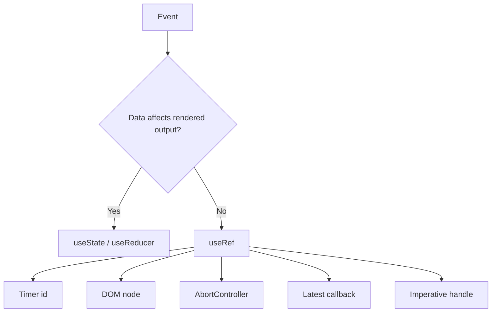

# Part 012 — `useRef`: Mutable Cell and Escape Hatch

`useRef` terlihat sederhana:

```tsx
const ref = useRef(initialValue);
```

Tapi di React production, `useRef` adalah salah satu Hook yang paling sering disalahgunakan.

Mental model yang benar:

> `useRef` memberi komponen sebuah mutable cell yang bertahan antar render, tetapi perubahan cell itu tidak memicu render.

Itu membuat ref sangat berguna untuk hal-hal yang **bukan bagian dari output render**, seperti DOM node, timer id, `AbortController`, object imperative, dan latest callback.

Itu juga membuat ref berbahaya jika dipakai untuk menyimpan data yang seharusnya menentukan UI.

---

## 1. Bentuk Dasar Ref

```tsx
const countRef = useRef(0);
```

React mengembalikan object seperti ini:

```tsx
{
  current: 0
}
```

Object ref yang sama dipertahankan sepanjang lifecycle instance komponen.

```tsx
function Counter() {
  const countRef = useRef(0);

  function increment() {
    countRef.current += 1;
    console.log(countRef.current);
  }

  return <button onClick={increment}>Increment ref</button>;
}
```

Klik button akan mengubah `countRef.current`, tetapi UI tidak re-render.

Jika UI perlu berubah, gunakan state.

```tsx
const [count, setCount] = useState(0);
```

Ref bukan pengganti state.
Ref adalah tempat menyimpan informasi yang komponen perlu ingat tetapi tidak perlu tampil dalam render.

---

## 2. State vs Ref

| Aspek | State | Ref |
|---|---|---|
| Bertahan antar render | Ya | Ya |
| Update memicu render | Ya | Tidak |
| Aman dipakai untuk output UI | Ya | Tidak, kecuali dibaca dalam konteks yang tidak menentukan render |
| Cocok untuk | Data render, state UI, workflow | DOM node, timer id, mutable handle, latest value non-render |
| Sifat mental model | Snapshot per render | Mutable cell lintas render |

Diagram:



Rule of thumb:

```txt
Jika perubahan data harus terlihat di layar, pakai state.
Jika data hanya perlu diingat untuk event/effect/imperative operation, ref mungkin tepat.
```

---

## 3. Ref Tidak Memiliki Snapshot Semantics

State di React bersifat snapshot per render.
Ref bersifat mutable.

Contoh:

```tsx
function Example() {
  const [count, setCount] = useState(0);
  const countRef = useRef(0);

  function handleClick() {
    setCount(count + 1);
    countRef.current += 1;

    console.log(count); // snapshot dari render saat ini
    console.log(countRef.current); // nilai mutable terbaru
  }

  return <button onClick={handleClick}>Click</button>;
}
```

`count` di handler adalah snapshot.
`countRef.current` adalah mutable cell.

Ini berguna, tapi juga berarti ref bisa menembus model React.
Gunakan dengan disiplin.

---

## 4. Use Case 1: DOM Node Ref

Contoh paling umum:

```tsx
function SearchBox() {
  const inputRef = useRef<HTMLInputElement | null>(null);

  function focusInput() {
    inputRef.current?.focus();
  }

  return (
    <>
      <input ref={inputRef} />
      <button onClick={focusInput}>Focus</button>
    </>
  );
}
```

React akan mengisi `inputRef.current` dengan DOM node setelah node terpasang.
Saat node dilepas, React mengatur ref kembali ke `null`.

### Operasi DOM yang umumnya aman

1. Focus.
2. Scroll.
3. Text selection.
4. Reading size/position setelah layout.
5. Calling browser API yang tidak diekspos secara deklaratif.

Contoh scroll:

```tsx
function MessageList() {
  const bottomRef = useRef<HTMLDivElement | null>(null);

  function scrollToBottom() {
    bottomRef.current?.scrollIntoView({ block: 'end' });
  }

  return (
    <div>
      {/* messages */}
      <div ref={bottomRef} />
      <button onClick={scrollToBottom}>Jump to latest</button>
    </div>
  );
}
```

### Operasi DOM yang berisiko

Bad:

```tsx
inputRef.current!.remove();
```

React masih mengira node itu bagian dari tree.
Jika Anda memodifikasi DOM secara destruktif di luar React, React dan DOM nyata bisa konflik.

Gunakan ref untuk tindakan non-destruktif atau integrasi imperative yang memang tidak punya API deklaratif.

---

## 5. Use Case 2: Timer ID

Timer id tidak perlu memicu render.
Ia hanya perlu diingat agar bisa dibatalkan.

```tsx
function AutoDismissToast({ onClose }: { onClose: () => void }) {
  const timeoutRef = useRef<number | null>(null);

  useEffect(() => {
    timeoutRef.current = window.setTimeout(onClose, 5000);

    return () => {
      if (timeoutRef.current !== null) {
        window.clearTimeout(timeoutRef.current);
      }
    };
  }, [onClose]);

  return <div>Saved successfully</div>;
}
```

Menggunakan state untuk `timeoutId` salah secara konsep karena perubahan timer id tidak perlu memengaruhi UI.

---

## 6. Use Case 3: AbortController dan Request Guard

Untuk operasi async manual, ref dapat menyimpan controller aktif.

```tsx
function useUserSearch() {
  const abortRef = useRef<AbortController | null>(null);
  const [state, setState] = useState<SearchState>({ status: 'idle' });

  async function search(query: string) {
    abortRef.current?.abort();

    const controller = new AbortController();
    abortRef.current = controller;

    setState({ status: 'loading', query });

    try {
      const results = await fetchUsers(query, { signal: controller.signal });

      if (controller.signal.aborted) return;

      setState({ status: 'success', query, results });
    } catch (error) {
      if (controller.signal.aborted) return;
      setState({ status: 'error', query, error: toMessage(error) });
    }
  }

  useEffect(() => {
    return () => abortRef.current?.abort();
  }, []);

  return { state, search };
}
```

Ref di sini menyimpan object imperative yang mengontrol external async process.

Caveat: untuk server state kompleks, biasanya lebih baik memakai abstraction seperti TanStack Query daripada membuat cache, retry, deduplication, cancellation, dan invalidation sendiri.

---

## 7. Use Case 4: Latest Callback

Kadang effect atau subscription harus memanggil callback terbaru tanpa resubscribe setiap render.

Contoh interval:

```tsx
function useInterval(callback: () => void, delay: number | null) {
  const callbackRef = useRef(callback);

  useEffect(() => {
    callbackRef.current = callback;
  }, [callback]);

  useEffect(() => {
    if (delay === null) return;

    const id = window.setInterval(() => {
      callbackRef.current();
    }, delay);

    return () => window.clearInterval(id);
  }, [delay]);
}
```

Tanpa ref, effect interval mungkin menangkap callback lama atau resubscribe setiap kali callback identity berubah.

Tetapi pattern ini harus dipakai hati-hati. Jika dependency memang bagian dari subscription semantics, jangan sembunyikan dependency dengan ref.

Pertanyaan kunci:

```txt
Apakah subscription harus berubah ketika value berubah?
```

Jika ya, masukkan value ke dependency array.
Jika tidak, latest ref mungkin benar.

---

## 8. Use Case 5: Previous Value

Ref bisa menyimpan previous value untuk perbandingan di effect.

```tsx
function usePrevious<T>(value: T): T | undefined {
  const ref = useRef<T | undefined>(undefined);

  useEffect(() => {
    ref.current = value;
  }, [value]);

  return ref.current;
}
```

Usage:

```tsx
const previousStatus = usePrevious(status);

useEffect(() => {
  if (previousStatus === 'submitting' && status === 'success') {
    announce('Saved');
  }
}, [previousStatus, status]);
```

Namun jangan terlalu cepat memakai `usePrevious`. Sering kali transisi eksplisit di reducer lebih jelas.

Better in many workflow cases:

```tsx
dispatch({ type: 'submitSucceeded' });
```

Daripada menebak transisi dari old/new values.

---

## 9. Use Case 6: Lazy Imperative Object

Kadang Anda butuh membuat object mahal sekali per component instance.

Bad:

```tsx
const serviceRef = useRef(new ExpensiveService());
```

Expression `new ExpensiveService()` tetap dievaluasi setiap render, walau nilai ref awal hanya dipakai sekali.

Better:

```tsx
const serviceRef = useRef<ExpensiveService | null>(null);

if (serviceRef.current === null) {
  serviceRef.current = new ExpensiveService();
}
```

Ini salah satu pengecualian membaca/menulis ref saat render yang dapat diterima jika hasilnya deterministic dan hanya untuk initialization idempotent.

Tetap hati-hati: jangan lakukan IO, subscription, atau side effect eksternal di sini.

---

## 10. Jangan Membaca/Menulis Ref Saat Render untuk Menentukan UI

Bad:

```tsx
function Counter() {
  const countRef = useRef(0);

  return <div>{countRef.current}</div>;
}
```

Jika `countRef.current` berubah, React tidak tahu harus render ulang.
UI bisa stale.

Lebih buruk:

```tsx
function Component() {
  const renderCount = useRef(0);
  renderCount.current += 1;

  return <div>Rendered {renderCount.current} times</div>;
}
```

Ini membuat render tidak pure. Dalam Strict Mode dan concurrent rendering, asumsi seperti ini mudah pecah.

Jika nilai memengaruhi output render, gunakan state atau derived value.

---

## 11. Ref dan Strict Mode

Dalam development, Strict Mode dapat menjalankan beberapa logic lebih dari sekali untuk membantu menemukan bug impurity.

Implikasinya:

1. Jangan mengandalkan ref mutation saat render untuk side effect.
2. Cleanup effect harus benar.
3. Initialization harus idempotent.
4. Subscription/timer harus aman jika setup-cleanup-setup terjadi.

Good:

```tsx
useEffect(() => {
  const socket = connect(url);

  return () => socket.disconnect();
}, [url]);
```

Bad:

```tsx
const socketRef = useRef<WebSocket | null>(null);

if (socketRef.current === null) {
  socketRef.current = connect(url); // side effect during render
}
```

Connection adalah external side effect. Tempatnya effect, bukan render.

---

## 12. Ref sebagai Instance Variable

Dalam class component lama, engineer sering memakai instance field:

```tsx
class Search extends Component {
  latestRequestId = 0;
}
```

Dalam function component, ref bisa menggantikan instance field:

```tsx
function Search() {
  const latestRequestIdRef = useRef(0);

  async function runSearch(query: string) {
    const requestId = latestRequestIdRef.current + 1;
    latestRequestIdRef.current = requestId;

    const results = await api.search(query);

    if (latestRequestIdRef.current !== requestId) return;

    // safe to commit result
  }
}
```

Ini cocok untuk informasi imperative yang tidak perlu render.

Tetapi jika `latestRequestId` harus terlihat di UI atau memengaruhi disabled state, pindahkan ke state/reducer.

---

## 13. Ref vs Module-Level Variable

Bad:

```tsx
let latestRequestId = 0;

function SearchBox() {
  // all component instances share latestRequestId
}
```

Module-level variable dibagi oleh semua instance komponen.
Itu hampir selalu salah untuk per-instance state.

Better:

```tsx
function SearchBox() {
  const latestRequestIdRef = useRef(0);
}
```

Setiap mounted component instance punya ref sendiri.

Gunakan module-level variable hanya untuk state global yang memang sengaja global, dan biasanya bungkus dengan external store yang jelas.

---

## 14. Dynamic List Refs

Untuk list dinamis, satu `useRef` per item tidak bisa dibuat dalam loop karena Hook harus dipanggil di top-level.

Bad:

```tsx
items.map((item) => {
  const ref = useRef<HTMLDivElement | null>(null); // invalid
  return <div ref={ref}>{item.name}</div>;
});
```

Gunakan map di dalam satu ref.

```tsx
function ItemList({ items }: { items: Item[] }) {
  const nodeMapRef = useRef(new Map<string, HTMLDivElement>());

  function register(id: string) {
    return (node: HTMLDivElement | null) => {
      if (node) {
        nodeMapRef.current.set(id, node);
      } else {
        nodeMapRef.current.delete(id);
      }
    };
  }

  function scrollToItem(id: string) {
    nodeMapRef.current.get(id)?.scrollIntoView({ block: 'nearest' });
  }

  return (
    <>
      {items.map((item) => (
        <div key={item.id} ref={register(item.id)}>
          {item.name}
        </div>
      ))}

      <button onClick={() => scrollToItem(items[0]?.id)}>Scroll first</button>
    </>
  );
}
```

Caveat: callback ref identity dapat berubah setiap render. Untuk simple case ini sering cukup, tetapi untuk hot path besar, memoize register callback strategy atau gunakan child component.

---

## 15. Ref dan Measurement

Jika Anda perlu membaca layout setelah DOM commit, gunakan ref bersama `useLayoutEffect`.

```tsx
function MeasuredBox() {
  const boxRef = useRef<HTMLDivElement | null>(null);
  const [height, setHeight] = useState(0);

  useLayoutEffect(() => {
    const node = boxRef.current;
    if (!node) return;

    setHeight(node.getBoundingClientRect().height);
  }, []);

  return (
    <>
      <div ref={boxRef}>Content</div>
      <div>Height: {height}</div>
    </>
  );
}
```

Why state for `height`?
Because height is rendered.

Why ref for `boxRef`?
Because DOM node identity is imperative and not itself rendered.

---

## 16. Ref dan External Widgets

Integrasi dengan library non-React sering butuh ref.

```tsx
function MapView({ center }: { center: LatLng }) {
  const containerRef = useRef<HTMLDivElement | null>(null);
  const mapRef = useRef<MapLibrary.Map | null>(null);

  useEffect(() => {
    if (!containerRef.current) return;

    mapRef.current = new MapLibrary.Map(containerRef.current);

    return () => {
      mapRef.current?.destroy();
      mapRef.current = null;
    };
  }, []);

  useEffect(() => {
    mapRef.current?.setCenter(center);
  }, [center]);

  return <div ref={containerRef} />;
}
```

Ada dua ref:

1. `containerRef`: DOM node untuk mounting widget.
2. `mapRef`: object imperative dari external library.

Effects mengatur lifecycle external system.
Render tetap hanya mendeskripsikan container.

---

## 17. Ref untuk Event Handler Stability: Jangan Overuse

Pattern latest callback sering dipakai untuk menghindari dependency array.

Bad motivation:

```txt
Saya tidak mau effect jalan ulang, jadi semua dependency saya masukkan ref.
```

Itu menyembunyikan dependency dan dapat membuat bug lebih sulit dilacak.

Valid motivation:

```txt
Subscription harus stabil, tetapi callback yang dipanggil subscription harus callback terbaru.
```

Contoh valid:

```tsx
function useWindowEvent<K extends keyof WindowEventMap>(
  type: K,
  handler: (event: WindowEventMap[K]) => void,
) {
  const handlerRef = useRef(handler);

  useEffect(() => {
    handlerRef.current = handler;
  }, [handler]);

  useEffect(() => {
    const listener = (event: WindowEventMap[K]) => {
      handlerRef.current(event);
    };

    window.addEventListener(type, listener);
    return () => window.removeEventListener(type, listener);
  }, [type]);
}
```

Subscription berubah hanya ketika event type berubah.
Handler tetap latest.

---

## 18. Ref Tidak Menyelesaikan Data Flow

Ref bisa membuat bug terlihat hilang karena tidak memicu render.

Bad:

```tsx
const selectedUserRef = useRef<User | null>(null);

function selectUser(user: User) {
  selectedUserRef.current = user;
}

return <UserDetails user={selectedUserRef.current} />;
```

UI tidak akan update saat user dipilih.

Correct:

```tsx
const [selectedUser, setSelectedUser] = useState<User | null>(null);

return <UserDetails user={selectedUser} />;
```

Ref bukan tempat menyimpan source of truth UI.

---

## 19. Ref Sebagai Escape Hatch, Bukan Foundation

Jika arsitektur Anda bergantung pada ref untuk komunikasi antar komponen, kemungkinan ada masalah desain.

Bad smell:

```tsx
formRef.current?.setFieldValue('title', value);
modalRef.current?.open();
tableRef.current?.refresh();
```

Kadang valid, terutama untuk headless/imperative API terbatas. Tetapi jika semua interaksi utama lewat imperative ref, React data flow menjadi kabur.

Prefer deklaratif:

```tsx
<Modal open={modal.type === 'delete'} onOpenChange={handleOpenChange} />
```

Atau command API di orchestration layer:

```tsx
const modal = useModalController();
modal.open({ type: 'deleteUser', userId });
```

Imperative ref sebaiknya menjadi edge adapter, bukan jalur utama state orchestration.

---

## 20. Common Patterns

### 20.1 Prevent double click within same tick

```tsx
function SubmitButton({ onSubmit }: { onSubmit: () => Promise<void> }) {
  const inFlightRef = useRef(false);
  const [status, setStatus] = useState<'idle' | 'submitting'>('idle');

  async function handleClick() {
    if (inFlightRef.current) return;

    inFlightRef.current = true;
    setStatus('submitting');

    try {
      await onSubmit();
    } finally {
      inFlightRef.current = false;
      setStatus('idle');
    }
  }

  return (
    <button disabled={status === 'submitting'} onClick={handleClick}>
      Submit
    </button>
  );
}
```

Why both ref and state?

1. Ref gives immediate imperative guard before React renders disabled state.
2. State updates visible UI.

Do not use only ref if UI must show pending state.

---

### 20.2 Track mounted state — usually avoid

You may see this:

```tsx
const mountedRef = useRef(false);

useEffect(() => {
  mountedRef.current = true;
  return () => {
    mountedRef.current = false;
  };
}, []);
```

This pattern can prevent setting state after unmount in manual async logic, but often the better fix is cancellation.

Prefer:

```tsx
useEffect(() => {
  const controller = new AbortController();

  fetchData({ signal: controller.signal });

  return () => controller.abort();
}, []);
```

Mounted refs can hide lifecycle bugs rather than solving them.

---

### 20.3 Store latest prop for non-reactive logging

```tsx
function useLatest<T>(value: T) {
  const ref = useRef(value);

  useEffect(() => {
    ref.current = value;
  }, [value]);

  return ref;
}
```

Usage:

```tsx
const latestUserId = useLatest(userId);

useEffect(() => {
  return analytics.subscribe('flush', () => {
    analytics.log({ userId: latestUserId.current });
  });
}, [latestUserId]);
```

Again: only when subscription does not semantically depend on `userId`.

---

## 21. Ref Failure Modes

### 21.1 Ref used as hidden state

Symptom:

```tsx
const valueRef = useRef(value);
```

Then many handlers read/write it instead of using state.

Risk: render output becomes detached from actual mutable data.

Fix: keep source of truth in state/reducer/store.

---

### 21.2 Render depends on ref

Bad:

```tsx
return <div>{ref.current.status}</div>;
```

If `ref.current.status` changes, React does not know.

Fix: use state for rendered values.

---

### 21.3 Ref mutation during render

Bad:

```tsx
ref.current = computeSomething(props);
```

Unless it is deterministic one-time initialization, avoid writing refs during render.

Fix: compute local derived value or update ref in effect/event.

---

### 21.4 Ref hides missing effect dependency

Bad:

```tsx
const userIdRef = useRef(userId);

useEffect(() => {
  connect(userIdRef.current);
}, []);
```

If connection should change when `userId` changes, this is wrong.

Fix:

```tsx
useEffect(() => {
  const connection = connect(userId);
  return () => connection.disconnect();
}, [userId]);
```

---

### 21.5 Imperative ref as cross-component bus

Bad:

```tsx
window.appRefs.userTable.current.refresh();
```

This creates global mutable coupling.

Fix: use declarative state, context capability, event channel, or external store with explicit contract.

---

## 22. Decision Framework

Use ref when all are true:

```txt
1. The value must survive re-render.
2. Changing it should not by itself update UI.
3. It represents imperative/lifecycle data, not rendered state.
4. It is scoped to one component instance or explicit imperative integration.
5. Reading/writing it will not violate render purity.
```

Do not use ref when any are true:

```txt
1. The value appears in JSX output.
2. The value determines conditional rendering.
3. Other components need to react to changes.
4. The value is business/domain state.
5. You are using it to avoid understanding dependencies.
```

---

## 23. How This Connects to Later Parts

`useRef` will appear again in later topics:

1. `useEffect`: refs help manage external subscriptions and cancellation.
2. `useLayoutEffect`: refs enable DOM measurement before paint.
3. `useImperativeHandle`: refs expose controlled imperative APIs.
4. Headless components: refs support focus management and keyboard navigation.
5. Modals/overlays: refs support focus trap, return focus, scroll lock.
6. Performance: refs can avoid re-render for non-visual mutable bookkeeping.
7. External store integration: refs sometimes hold unsubscribe functions or previous snapshots.

But the invariant stays the same:

```txt
Ref is for remembering non-render data.
State is for rendering data.
Reducer/store/machine is for coordinated state transitions.
```

---

## 24. Mini Exercise: Replace Ref Misuse

Starting point:

```tsx
function UserPicker({ users }: { users: User[] }) {
  const selectedIdRef = useRef<string | null>(null);

  function selectUser(id: string) {
    selectedIdRef.current = id;
  }

  const selectedUser = users.find((user) => user.id === selectedIdRef.current);

  return (
    <div>
      {users.map((user) => (
        <button key={user.id} onClick={() => selectUser(user.id)}>
          {user.name}
        </button>
      ))}

      {selectedUser && <UserDetails user={selectedUser} />}
    </div>
  );
}
```

Problems:

1. `selectedIdRef.current` determines rendered output.
2. Selecting a user does not trigger render.
3. UI can remain stale.

Refactor:

```tsx
function UserPicker({ users }: { users: User[] }) {
  const [selectedId, setSelectedId] = useState<string | null>(null);

  const selectedUser = users.find((user) => user.id === selectedId);

  return (
    <div>
      {users.map((user) => (
        <button key={user.id} onClick={() => setSelectedId(user.id)}>
          {user.name}
        </button>
      ))}

      {selectedUser && <UserDetails user={selectedUser} />}
    </div>
  );
}
```

Now selection is render state.

---

## 25. Key Takeaways

1. `useRef` stores a mutable cell that persists across renders.
2. Updating `ref.current` does not trigger render.
3. Use refs for DOM nodes, timer ids, controllers, external objects, and non-render mutable bookkeeping.
4. Do not use refs as hidden UI state.
5. Do not make render output depend on mutable refs.
6. Do not use refs to avoid correct effect dependencies unless subscription semantics justify it.
7. Ref mutation during render is usually a purity violation, except deterministic one-time initialization.
8. Ref is an escape hatch. Treat it as an edge tool, not an architecture foundation.

---

## References

- React Docs — `useRef`: https://react.dev/reference/react/useRef
- React Docs — Referencing Values with Refs: https://react.dev/learn/referencing-values-with-refs
- React Docs — Manipulating the DOM with Refs: https://react.dev/learn/manipulating-the-dom-with-refs
- React Docs — Escape Hatches: https://react.dev/learn/escape-hatches
- React Docs — Keeping Components Pure: https://react.dev/learn/keeping-components-pure
