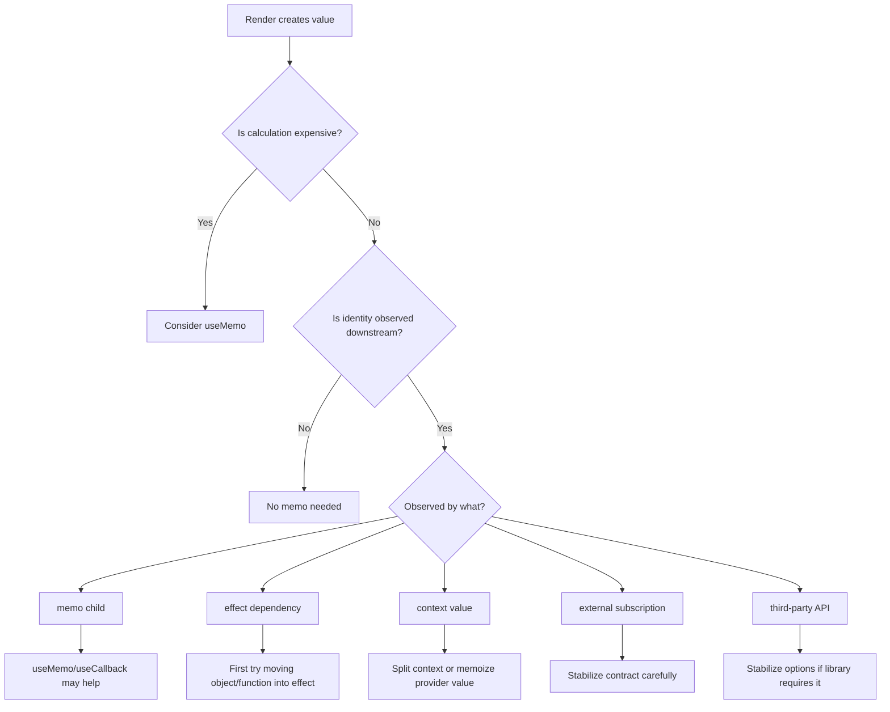
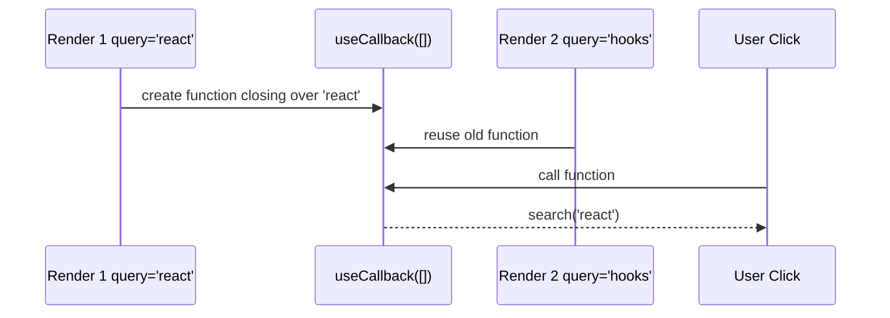

# Part 013 — `useMemo` and `useCallback` Before and After React Compiler

`useMemo` dan `useCallback` sering dipakai sebagai ritual performa.

Banyak codebase punya pola seperti ini:

```tsx
const onClick = useCallback(() => {
  doSomething(id);
}, [id]);

const value = useMemo(() => ({ id, onClick }), [id, onClick]);
```

Kadang benar.
Kadang tidak berguna.
Kadang justru menyembunyikan bug dependency.

Materi ini tidak mengajarkan “selalu pakai memo”.
Materi ini mengajarkan **kapan identity benar-benar bagian dari kontrak**, kapan calculation memang mahal, dan bagaimana kebijakan ini berubah di era React Compiler.

Mental model utama:

> Memoization bukan mekanisme correctness. Memoization adalah cache performa dan identity stabilization. Jika correctness bergantung pada `useMemo`, desain state kemungkinan salah.

React Compiler membuat banyak memoization manual tidak lagi perlu pada kode yang dapat dikompilasi. Tapi itu tidak berarti `useMemo`, `useCallback`, dan `React.memo` menjadi tidak relevan. Mereka tetap berguna sebagai escape hatch, boundary eksplisit, dan alat untuk kasus yang butuh kontrol identity presisi.

---

## 1. Masalah yang Sebenarnya Diselesaikan Memoization

React render adalah kalkulasi ulang UI dari props, state, dan context.

Setiap render membuat nilai baru untuk expression yang dievaluasi ulang:

```tsx
function ProductPage({ product, user }) {
  const permissions = {
    canEdit: user.role === "admin",
    canDelete: user.role === "admin" && product.status !== "locked",
  };

  function onSave() {
    saveProduct(product.id);
  }

  return <ProductEditor permissions={permissions} onSave={onSave} />;
}
```

Pada setiap render:

```txt
permissions object baru
onSave function baru
```

Itu belum tentu masalah.

Masalah muncul jika nilai tersebut dipakai pada tempat yang sensitif terhadap identity:

1. props ke component yang di-`memo`
2. dependency `useEffect`
3. dependency `useMemo` lain
4. dependency `useCallback` lain
5. value untuk Context Provider
6. subscription selector atau external store boundary
7. object option untuk third-party library

Jadi pertanyaan yang benar bukan:

```txt
Apakah object/function baru buruk?
```

Tapi:

```txt
Apakah identity object/function ini merupakan bagian dari kontrak downstream?
```

---

## 2. `useMemo` sebagai Cache Calculation

Bentuk dasar:

```tsx
const value = useMemo(() => computeValue(input), [input]);
```

Maknanya:

> “Hitung `value` lagi hanya jika dependency berubah menurut `Object.is`.”

Contoh valid:

```tsx
type Invoice = {
  id: string;
  customerId: string;
  status: "draft" | "issued" | "paid" | "void";
  total: number;
};

function InvoiceTable({ invoices, status }: {
  invoices: Invoice[];
  status: Invoice["status"] | "all";
}) {
  const visibleInvoices = useMemo(() => {
    return invoices
      .filter((invoice) => status === "all" || invoice.status === status)
      .sort((a, b) => b.total - a.total);
  }, [invoices, status]);

  return <Table rows={visibleInvoices} />;
}
```

Ini masuk akal jika:

- `invoices` cukup besar
- filter/sort cukup mahal
- render sering terjadi karena state lain
- `Table` memanfaatkan identity rows untuk optimasi

Tapi untuk calculation murah:

```tsx
const fullName = useMemo(() => `${firstName} ${lastName}`, [firstName, lastName]);
```

ini biasanya noise.

Lebih baik:

```tsx
const fullName = `${firstName} ${lastName}`;
```

Memoization juga punya biaya:

- dependency tracking
- closure allocation
- code complexity
- risiko stale dependency
- false confidence terhadap performa

Rule praktis:

```txt
Jangan cache kalkulasi murah hanya karena bisa.
Cache ketika ada bukti biaya, atau ketika identity hasil menjadi kontrak downstream.
```

---

## 3. `useCallback` sebagai Cache Function Identity

Bentuk dasar:

```tsx
const handler = useCallback(() => {
  doSomething(id);
}, [id]);
```

`useCallback(fn, deps)` secara mental mirip:

```tsx
useMemo(() => fn, deps)
```

Yang di-cache adalah **identity function**, bukan hasil function.

Contoh valid:

```tsx
const Row = memo(function Row({
  invoice,
  onSelect,
}: {
  invoice: Invoice;
  onSelect: (id: string) => void;
}) {
  return (
    <button onClick={() => onSelect(invoice.id)}>
      {invoice.id}
    </button>
  );
});

function InvoiceList({ invoices }: { invoices: Invoice[] }) {
  const [selectedId, setSelectedId] = useState<string | null>(null);

  const handleSelect = useCallback((id: string) => {
    setSelectedId(id);
  }, []);

  return (
    <>
      <p>Selected: {selectedId ?? "none"}</p>
      {invoices.map((invoice) => (
        <Row key={invoice.id} invoice={invoice} onSelect={handleSelect} />
      ))}
    </>
  );
}
```

`handleSelect` stabil karena tidak membaca state snapshot secara langsung.
Ia hanya mengirim update ke React.

Tapi contoh ini tidak selalu butuh `useCallback`:

```tsx
<button onClick={() => setOpen(true)}>Open</button>
```

Inline handler di DOM element biasa hampir selalu baik-baik saja.

Gunakan `useCallback` ketika:

- function dikirim ke memoized child
- function menjadi dependency effect/custom hook
- function menjadi bagian dari context value
- function dipakai untuk subscribe/unsubscribe external system
- identity function adalah kontrak API internal

Jangan gunakan `useCallback` hanya untuk membuat kode terlihat “optimized”.

---

## 4. Referential Identity: Bagian yang Sering Hilang

JavaScript membandingkan object/function by reference:

```tsx
{ a: 1 } === { a: 1 } // false
(() => {}) === (() => {}) // false
```

React dependency array juga memakai identity comparison.

Contoh effect bermasalah:

```tsx
function ChatRoom({ roomId }: { roomId: string }) {
  const options = {
    serverUrl: "wss://chat.example.com",
    roomId,
  };

  useEffect(() => {
    const connection = createConnection(options);
    connection.connect();
    return () => connection.disconnect();
  }, [options]);

  return <h1>Room {roomId}</h1>;
}
```

`options` selalu baru.
Effect reconnect setiap render.

Solusi pertama bukan selalu `useMemo`.
Sering kali solusi terbaik adalah memindahkan object ke dalam effect:

```tsx
function ChatRoom({ roomId }: { roomId: string }) {
  useEffect(() => {
    const options = {
      serverUrl: "wss://chat.example.com",
      roomId,
    };

    const connection = createConnection(options);
    connection.connect();
    return () => connection.disconnect();
  }, [roomId]);

  return <h1>Room {roomId}</h1>;
}
```

Dependency menjadi primitive yang benar-benar menentukan sinkronisasi.

Gunakan `useMemo` untuk dependency stabilization hanya jika object memang perlu hidup di luar effect.

```tsx
const options = useMemo(() => {
  return { serverUrl, roomId };
}, [serverUrl, roomId]);

useEffect(() => {
  const connection = createConnection(options);
  connection.connect();
  return () => connection.disconnect();
}, [options]);
```

Tapi versi ini lebih kompleks dibanding langsung membuat object di dalam effect.

---

## 5. Diagram: Kapan Memoization Relevan



---

## 6. `React.memo` Tanpa Stable Props Sering Tidak Berguna

`React.memo` membandingkan props secara shallow.

```tsx
const UserCard = memo(function UserCard({ user, actions }) {
  return <Card user={user} actions={actions} />;
});
```

Kalau parent melakukan ini:

```tsx
<UserCard
  user={user}
  actions={{
    onEdit: () => editUser(user.id),
    onDelete: () => deleteUser(user.id),
  }}
/>
```

`actions` selalu object baru.
`memo` hampir tidak berguna.

Solusi yang lebih baik bisa berupa API props yang lebih sederhana:

```tsx
<UserCard
  user={user}
  onEdit={handleEdit}
  onDelete={handleDelete}
/>
```

Lalu stabilkan hanya jika child memang memoized dan rerender mahal:

```tsx
const handleEdit = useCallback((userId: string) => {
  openEditor(userId);
}, []);

const handleDelete = useCallback((userId: string) => {
  confirmDelete(userId);
}, []);
```

Memoization tidak memperbaiki API component yang terlalu gemuk.
Ia hanya mengurangi biaya dari API yang sudah cukup baik.

---

## 7. Context Provider Value: Kasus Memoization yang Sering Valid

Context punya sifat penting:

> Semua consumer yang membaca context akan dianggap perlu update ketika `value` provider berubah identity.

Contoh bermasalah:

```tsx
function AuthProvider({ children }: { children: ReactNode }) {
  const [user, setUser] = useState<User | null>(null);

  const login = async (credential: Credential) => {
    const user = await authApi.login(credential);
    setUser(user);
  };

  const logout = async () => {
    await authApi.logout();
    setUser(null);
  };

  return (
    <AuthContext.Provider value={{ user, login, logout }}>
      {children}
    </AuthContext.Provider>
  );
}
```

Setiap render membuat object value baru dan function baru.

Versi lebih stabil:

```tsx
function AuthProvider({ children }: { children: ReactNode }) {
  const [user, setUser] = useState<User | null>(null);

  const login = useCallback(async (credential: Credential) => {
    const nextUser = await authApi.login(credential);
    setUser(nextUser);
  }, []);

  const logout = useCallback(async () => {
    await authApi.logout();
    setUser(null);
  }, []);

  const value = useMemo(() => {
    return { user, login, logout };
  }, [user, login, logout]);

  return (
    <AuthContext.Provider value={value}>
      {children}
    </AuthContext.Provider>
  );
}
```

Namun ini belum tentu cukup untuk large app.

Jika banyak consumer hanya butuh `login/logout`, sedangkan `user` sering berubah, pisahkan context:

```tsx
const AuthStateContext = createContext<User | null>(null);
const AuthActionsContext = createContext<AuthActions | null>(null);
```

Lalu:

```tsx
<AuthActionsContext.Provider value={actions}>
  <AuthStateContext.Provider value={user}>
    {children}
  </AuthStateContext.Provider>
</AuthActionsContext.Provider>
```

Memoization membantu.
Boundary design lebih penting.

---

## 8. Dependency Correctness Lebih Penting dari Stability

Ini salah:

```tsx
const handleSave = useCallback(() => {
  saveDraft(draft.id, draft.content);
}, []); // ❌ draft tidak dimasukkan
```

Function stabil, tetapi membaca `draft` lama.

Versi benar:

```tsx
const handleSave = useCallback(() => {
  saveDraft(draft.id, draft.content);
}, [draft.id, draft.content]);
```

Atau desain ulang agar handler menerima payload saat event:

```tsx
const handleSave = useCallback((draft: Draft) => {
  saveDraft(draft.id, draft.content);
}, []);
```

Kemudian:

```tsx
<button onClick={() => handleSave(draft)}>Save</button>
```

Kita menggeser dependency dari closure ke argument.
Ini sering membuat function lebih stabil tanpa berbohong ke dependency array.

Prinsip:

```txt
Jangan menghapus dependency untuk mengejar stability.
Ubah bentuk data flow supaya dependency memang tidak diperlukan.
```

---

## 9. Stale Closure: Memoization Bisa Mengawetkan Bug

Contoh:

```tsx
function SearchBox({ query }: { query: string }) {
  const runSearch = useCallback(() => {
    search(query);
  }, []);

  return <button onClick={runSearch}>Search</button>;
}
```

`runSearch` selalu memakai `query` dari render pertama.

Bug ini muncul karena `useCallback` dipakai sebagai “freeze function”, padahal yang di-freeze adalah closure juga.

Diagram:



Kalau function membaca reactive value, value itu harus muncul sebagai dependency.

---

## 10. Updater Function untuk Mengurangi Dependency

Kadang dependency bisa dihilangkan dengan updater function.

Kurang baik:

```tsx
const addTodo = useCallback((text: string) => {
  setTodos([...todos, { id: crypto.randomUUID(), text }]);
}, [todos]);
```

Lebih baik:

```tsx
const addTodo = useCallback((text: string) => {
  setTodos((currentTodos) => [
    ...currentTodos,
    { id: crypto.randomUUID(), text },
  ]);
}, []);
```

Sekarang handler tidak perlu membaca `todos` dari closure.
Ia memberi React instruksi transisi.

Ini bukan “trick untuk dependency”.
Ini desain state transition yang lebih tepat.

---

## 11. `useMemo` Bukan Tempat Side Effect

Salah:

```tsx
const result = useMemo(() => {
  analytics.track("invoice_filtered"); // ❌ side effect
  return filterInvoices(invoices, filter);
}, [invoices, filter]);
```

`useMemo` berjalan saat render.
Render harus pure.

Benar:

```tsx
const result = useMemo(() => {
  return filterInvoices(invoices, filter);
}, [invoices, filter]);

useEffect(() => {
  analytics.track("invoice_filtered", { filter });
}, [filter]);
```

Tetapi untuk analytics yang terjadi karena user action, lebih tepat di event handler:

```tsx
function handleApplyFilter(nextFilter: Filter) {
  analytics.track("invoice_filter_applied", { filter: nextFilter });
  setFilter(nextFilter);
}
```

`useMemo` hanya untuk pure calculation.

---

## 12. React Compiler: Apa yang Berubah

Sebelum compiler, banyak tim memakai aturan kasar:

```txt
- memoize expensive calculations
- memoize callbacks passed to memo children
- memoize context values
```

Di era React Compiler, aturan itu berubah menjadi:

```txt
- tulis render yang pure dan predictable
- biarkan compiler menangani memoization yang aman
- gunakan useMemo/useCallback hanya saat butuh kontrol identity eksplisit
- jangan melawan dependency model
```

React Compiler menganalisis component dan hook untuk menerapkan memoization otomatis pada kode yang memenuhi aturan React.
Ini mengurangi kebutuhan manual terhadap `useMemo`, `useCallback`, dan `React.memo`.

Namun compiler bukan alasan untuk menulis kode impure.
Justru compiler membutuhkan kode yang mengikuti rules/purity supaya optimasi aman.

---

## 13. Kebijakan Memoization di Codebase Production

Gunakan policy yang eksplisit.

```txt
Default:
  Jangan memoize manual.

Memoize calculation:
  Jika expensive dan terbukti dari profiling, atau hasilnya dipakai sebagai stable identity.

Memoize callback:
  Jika dikirim ke memoized child, context value, effect dependency, external subscription, atau library yang sensitif identity.

Memoize context value:
  Ya, jika value object/function dibuat di provider.
  Tapi pertimbangkan split context lebih dulu jika update frequency berbeda.

React Compiler:
  Untuk code baru yang compiled, andalkan compiler untuk kasus umum.
  Manual memo tetap boleh sebagai boundary eksplisit, bukan ritual.
```

---

## 14. Before/After Compiler Decision Table

| Kasus | Sebelum Compiler | Setelah Compiler | Catatan |
|---|---|---|---|
| Kalkulasi murah | Jangan memo | Jangan memo | Noise tetap noise |
| Kalkulasi mahal | `useMemo` setelah profiling | Compiler mungkin cukup, `useMemo` jika perlu kontrol | Ukur tetap penting |
| Callback inline ke DOM | Biasanya tidak perlu | Tidak perlu | DOM handler identity jarang bottleneck |
| Callback ke memo child | Sering `useCallback` | Compiler dapat membantu, manual jika boundary eksplisit | Bergantung compilation coverage |
| Context value object | `useMemo` umum dipakai | Masih sering valid | Context propagation tetap perlu desain boundary |
| Effect dependency object | Sering disalahgunakan | Masih harus desain dependency benar | Pindahkan object ke effect jika bisa |
| Third-party options | `useMemo` bila library sensitif | Tetap valid | Identity adalah kontrak library |
| Missing dependency | Bug | Bug | Compiler bukan penghapus bug closure |

---

## 15. Profiling-First Workflow

Jangan mulai dari `useMemo`.
Mulai dari bukti.

Workflow:

```txt
1. Reproduce lag.
2. Buka React Profiler.
3. Cari commit yang mahal.
4. Identifikasi component yang sering render atau render-nya mahal.
5. Tentukan penyebab:
   - parent rerender
   - context propagation
   - expensive calculation
   - unstable props
   - large list
   - external store subscription terlalu luas
6. Terapkan solusi paling struktural.
7. Ukur ulang.
```

Memoization adalah salah satu solusi, bukan satu-satunya.

Solusi struktural bisa berupa:

- state colocation
- split context
- selector store
- virtualized list
- moving state down
- moving expensive component behind boundary
- normalized data
- removing unnecessary effect
- fixing component API

---

## 16. Pattern: Stable Callback dengan Command Payload

Buruk:

```tsx
function UserRow({ user }: { user: User }) {
  const handlePromote = useCallback(() => {
    promoteUser(user.id, user.version);
  }, [user]);

  return <button onClick={handlePromote}>Promote</button>;
}
```

`user` object mungkin berubah identity walau `id/version` sama.

Lebih baik:

```tsx
function UserRow({ user }: { user: User }) {
  const handlePromote = useCallback(() => {
    promoteUser(user.id, user.version);
  }, [user.id, user.version]);

  return <button onClick={handlePromote}>Promote</button>;
}
```

Atau push command ke parent:

```tsx
const handlePromote = useCallback((command: PromoteUserCommand) => {
  promoteUser(command.userId, command.expectedVersion);
}, []);
```

```tsx
<UserRow user={user} onPromote={handlePromote} />
```

```tsx
function UserRow({ user, onPromote }: {
  user: User;
  onPromote: (command: PromoteUserCommand) => void;
}) {
  return (
    <button
      onClick={() =>
        onPromote({
          userId: user.id,
          expectedVersion: user.version,
        })
      }
    >
      Promote
    </button>
  );
}
```

Parent callback stabil karena tidak capture per-row state.
Row tetap sederhana.

---

## 17. Pattern: Stable Derived View Model

Kadang UI membutuhkan view model yang cukup mahal dan harus stabil untuk child.

```tsx
type InvoiceViewModel = {
  id: string;
  label: string;
  severity: "neutral" | "warning" | "critical";
  canSubmit: boolean;
};

function InvoiceDashboard({ invoices, permissions }: {
  invoices: Invoice[];
  permissions: PermissionSet;
}) {
  const rows = useMemo<InvoiceViewModel[]>(() => {
    return invoices.map((invoice) => ({
      id: invoice.id,
      label: `${invoice.number} — ${invoice.customerName}`,
      severity: computeSeverity(invoice),
      canSubmit:
        permissions.canSubmitInvoice && invoice.status === "draft",
    }));
  }, [invoices, permissions.canSubmitInvoice]);

  return <InvoiceGrid rows={rows} />;
}
```

Di sini `useMemo` punya dua fungsi:

1. menghindari mapping mahal setiap render
2. menjaga `rows` stabil saat dependency tidak berubah

Tapi hati-hati: jika `invoices` selalu array baru dari parent, memo ini tetap invalid setiap render.
Masalahnya mungkin ada di parent atau data source, bukan di child.

---

## 18. Pattern: Context Actions Stabil, State Dinamis

Untuk provider dengan state dan actions, actions sering bisa stabil.

```tsx
type CaseState = {
  selectedCaseId: string | null;
  filter: CaseFilter;
};

type CaseActions = {
  selectCase(id: string): void;
  updateFilter(filter: CaseFilter): void;
};

const CaseStateContext = createContext<CaseState | null>(null);
const CaseActionsContext = createContext<CaseActions | null>(null);

function CaseProvider({ children }: { children: ReactNode }) {
  const [state, setState] = useState<CaseState>({
    selectedCaseId: null,
    filter: { status: "open" },
  });

  const actions = useMemo<CaseActions>(() => {
    return {
      selectCase(id) {
        setState((current) => ({ ...current, selectedCaseId: id }));
      },
      updateFilter(filter) {
        setState((current) => ({ ...current, filter }));
      },
    };
  }, []);

  return (
    <CaseActionsContext.Provider value={actions}>
      <CaseStateContext.Provider value={state}>
        {children}
      </CaseStateContext.Provider>
    </CaseActionsContext.Provider>
  );
}
```

Actions tidak membaca state dari closure.
Mereka memakai updater function.
Karena itu actions bisa stabil.

---

## 19. Anti-Pattern: Memoizing Everything

Kode seperti ini buruk:

```tsx
const isOpen = useMemo(() => selectedId === item.id, [selectedId, item.id]);
const label = useMemo(() => item.name.trim(), [item.name]);
const handleClick = useCallback(() => setSelectedId(item.id), [item.id]);
const className = useMemo(() => isOpen ? "open" : "closed", [isOpen]);
```

Lebih sederhana:

```tsx
const isOpen = selectedId === item.id;
const label = item.name.trim();
const className = isOpen ? "open" : "closed";

function handleClick() {
  setSelectedId(item.id);
}
```

Memoization yang terlalu agresif membuat kode sulit dibaca tanpa bukti manfaat.

---

## 20. Anti-Pattern: Memoizing Wrong Layer

Misalnya list lambat:

```tsx
const rows = useMemo(() => buildRows(data), [data]);
```

Tapi yang mahal sebenarnya render 10.000 row.

Solusi yang benar bukan hanya memoization.
Mungkin perlu virtualization:

```txt
Render hanya row yang terlihat.
Jaga row identity.
Jaga selection state di luar row.
Hindari context consumer per row jika tidak perlu.
```

Memoization calculation tidak menyelesaikan DOM/render volume.

---

## 21. Anti-Pattern: `useCallback` untuk “Mencegah Function Dibuat”

Function tetap dibuat sebagai argument ke `useCallback` pada render.
Yang disimpan React adalah function sebelumnya jika dependency tidak berubah.

Tujuan `useCallback` bukan menghindari alokasi function kecil.
Tujuannya menjaga identity yang dilihat downstream.

Kalimat yang benar:

```txt
useCallback menjaga referential identity function antar render ketika dependency tidak berubah.
```

Bukan:

```txt
useCallback membuat function tidak dibuat ulang sama sekali.
```

---

## 22. Failure Modes

| Failure Mode | Gejala | Akar Masalah | Solusi |
|---|---|---|---|
| Stale callback | Handler membaca state lama | Missing dependency | Tambahkan dependency atau ubah payload/updater |
| Memo noise | Banyak `useMemo` tanpa manfaat | Ritual optimization | Hapus, profile dulu |
| Useless `memo` | Child tetap rerender | Props object/function selalu baru | Stabilkan props atau ubah API |
| Context storm | Banyak consumer rerender | Provider value berubah identity atau terlalu luas | Memoize value, split context, gunakan selector store |
| Effect reconnect loop | Subscription reconnect terus | Object/function dependency unstable | Pindahkan object ke effect atau memoize boundary |
| Expensive render tetap lambat | `useMemo` tidak membantu | Bottleneck di tree/DOM/list | Virtualization, boundary split, state colocation |
| Compiler blocked | Optimasi tidak terjadi | Kode impure / rule violation | Perbaiki purity dan dependencies |

---

## 23. Engineering Checklist

Sebelum menulis `useMemo`:

```txt
[ ] Apakah calculation benar-benar mahal?
[ ] Apakah hasilnya dipakai sebagai stable identity downstream?
[ ] Apakah dependency lengkap dan minimal?
[ ] Apakah masalah sebenarnya bukan state placement?
[ ] Apakah masalah sebenarnya bukan context terlalu luas?
[ ] Apakah masalah sebenarnya bukan large list/render volume?
[ ] Apakah sudah diukur dengan profiler?
```

Sebelum menulis `useCallback`:

```txt
[ ] Apakah function dikirim ke memoized child?
[ ] Apakah function dependency effect/custom hook?
[ ] Apakah function bagian dari context value?
[ ] Apakah function dipakai subscribe/unsubscribe external system?
[ ] Apakah function membaca reactive value dari closure?
[ ] Apakah bisa memakai updater function atau command payload?
```

Di codebase dengan React Compiler:

```txt
[ ] Apakah file/component masuk cakupan compiler?
[ ] Apakah kode mengikuti purity rules?
[ ] Apakah manual memoization masih dibutuhkan sebagai contract?
[ ] Apakah lint preserve-manual-memoization tidak mengindikasikan dependency buruk?
```

---

## 24. Mini Lab: Menghapus Memoization yang Tidak Perlu

Mulai dari kode ini:

```tsx
function CaseCard({ caseItem, selectedId, onSelect }: Props) {
  const isSelected = useMemo(
    () => selectedId === caseItem.id,
    [selectedId, caseItem.id]
  );

  const title = useMemo(
    () => caseItem.title.trim(),
    [caseItem.title]
  );

  const handleClick = useCallback(() => {
    onSelect(caseItem.id);
  }, [onSelect, caseItem.id]);

  return (
    <button onClick={handleClick} aria-pressed={isSelected}>
      {title}
    </button>
  );
}
```

Refactor pertama:

```tsx
function CaseCard({ caseItem, selectedId, onSelect }: Props) {
  const isSelected = selectedId === caseItem.id;
  const title = caseItem.title.trim();

  return (
    <button
      onClick={() => onSelect(caseItem.id)}
      aria-pressed={isSelected}
    >
      {title}
    </button>
  );
}
```

Jika nanti `CaseCard` dibungkus `memo` dan list sangat besar, baru evaluasi ulang:

```tsx
const CaseCard = memo(function CaseCard({ caseItem, selectedId, onSelect }: Props) {
  const isSelected = selectedId === caseItem.id;

  return (
    <button
      onClick={() => onSelect(caseItem.id)}
      aria-pressed={isSelected}
    >
      {caseItem.title.trim()}
    </button>
  );
});
```

Masalah berikutnya mungkin bukan `useCallback` di setiap row, tetapi API list:

```tsx
function CaseList({ cases, selectedId }: Props) {
  const handleSelect = useCallback((id: string) => {
    // stable command handler
  }, []);

  return cases.map((caseItem) => (
    <CaseCard
      key={caseItem.id}
      caseItem={caseItem}
      selectedId={selectedId}
      onSelect={handleSelect}
    />
  ));
}
```

---

## 25. Latihan Desain

Ambil salah satu page di aplikasi nyata:

```txt
1. Tandai semua useMemo/useCallback.
2. Untuk masing-masing, tulis alasan:
   - expensive calculation
   - stable prop for memo child
   - effect dependency
   - context value
   - external library contract
   - unknown / ritual
3. Hapus yang unknown.
4. Jalankan test.
5. Profile sebelum/sesudah.
6. Untuk yang tersisa, pastikan dependency lengkap.
7. Catat memoization yang merupakan public/internal contract.
```

Target latihan bukan menghapus semua memoization.
Targetnya membuat memoization intentional.

---

## 26. Kesimpulan

`useMemo` dan `useCallback` bukan fondasi utama React.
Fondasi utamanya tetap:

```txt
pure render
state ownership jelas
dependency benar
component boundary sehat
profiling sebelum optimasi
```

Memoization berguna ketika:

```txt
- calculation mahal
- identity diamati downstream
- provider value perlu stabil
- external system membutuhkan stable options/callback
- compiler tidak cukup atau boundary perlu eksplisit
```

Di era React Compiler, manual memoization bergeser dari “alat rutin” menjadi “alat presisi”.

Engineer React yang matang tidak bertanya:

```txt
Haruskah semua function dibungkus useCallback?
```

Ia bertanya:

```txt
Siapa yang mengamati identity ini?
Apa kontraknya?
Apa biayanya?
Apa bukti performanya?
Apakah compiler bisa menangani ini?
```

Itulah perbedaan antara optimization theater dan engineering.

---

## Referensi Utama

- React Docs — `useMemo`
- React Docs — `useCallback`
- React Docs — `memo`
- React Docs — React Compiler Introduction
- React Docs — React Compiler directives: `"use memo"` and `"use no memo"`
- React Docs — ESLint rule `preserve-manual-memoization`
