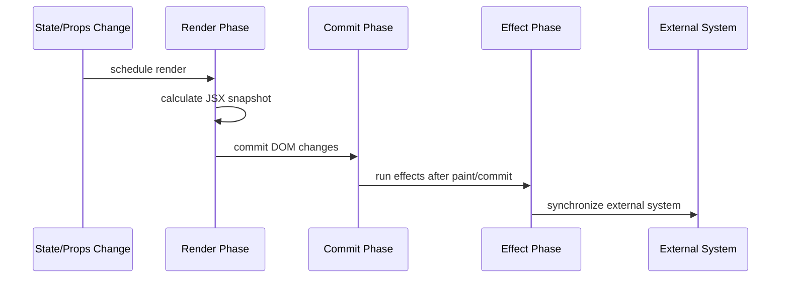
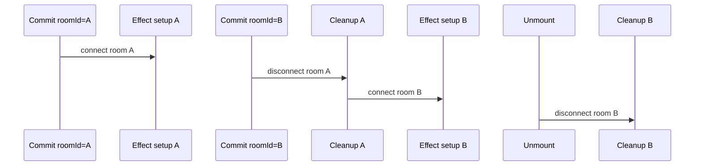
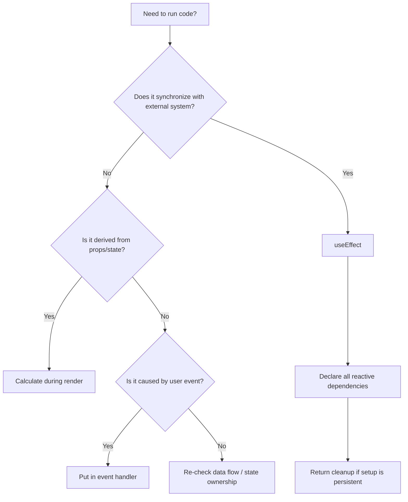
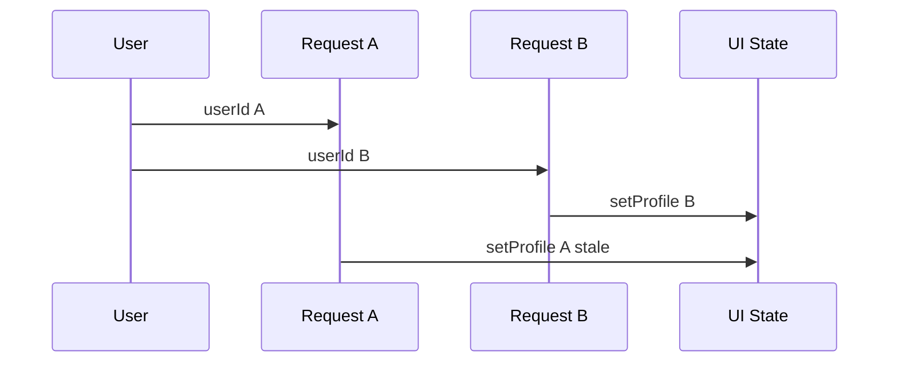

# Part 014 — `useEffect` Is Synchronization

`useEffect` adalah salah satu Hook yang paling penting dan paling sering disalahgunakan.

Kesalahan umum:

```txt
useEffect adalah pengganti componentDidMount/componentDidUpdate/componentWillUnmount.
```

Mental model yang lebih tepat:

> `useEffect` adalah mekanisme untuk menyinkronkan component dengan sistem eksternal setelah React melakukan commit ke layar.

Efek bukan tempat default untuk “menjalankan kode setelah render”.
Efek bukan tempat default untuk derivasi state.
Efek bukan tempat default untuk merespons klik user.
Efek bukan tempat default untuk memperbaiki data flow yang buruk.

Efek dipakai ketika component perlu menjaga hubungan dengan sesuatu di luar React.

Contoh sistem eksternal:

- browser API
- DOM API imperative
- timer
- network connection
- WebSocket
- analytics system
- third-party widget
- subscription store
- media query
- intersection observer
- localStorage/sessionStorage
- API fetch, dengan catatan modern framework/query library sering lebih baik

---

## 1. Render, Commit, Effect

React punya alur konseptual:



Render harus pure.
Commit mengubah DOM.
Effect berjalan setelah React selesai commit.

Artinya kode ini salah:

```tsx
function Page({ title }: { title: string }) {
  document.title = title; // ❌ side effect during render
  return <h1>{title}</h1>;
}
```

Benar:

```tsx
function Page({ title }: { title: string }) {
  useEffect(() => {
    document.title = title;
  }, [title]);

  return <h1>{title}</h1>;
}
```

`document.title` adalah browser API eksternal.
Component menyinkronkan external document dengan React state/props.

---

## 2. Effect Sebagai Protocol: Setup, Cleanup, Dependency

Bentuk dasar:

```tsx
useEffect(() => {
  // setup synchronization

  return () => {
    // cleanup previous synchronization
  };
}, [dependencies]);
```

Maknanya:

```txt
Setelah commit, jalankan setup.
Jika dependency berubah, cleanup sinkronisasi lama, lalu setup sinkronisasi baru.
Jika component unmount, cleanup sinkronisasi terakhir.
```

Diagram:



Contoh:

```tsx
function ChatRoom({ roomId }: { roomId: string }) {
  useEffect(() => {
    const connection = createConnection({
      serverUrl: "wss://chat.example.com",
      roomId,
    });

    connection.connect();

    return () => {
      connection.disconnect();
    };
  }, [roomId]);

  return <h1>Room {roomId}</h1>;
}
```

Effect ini punya kontrak jelas:

```txt
Untuk roomId aktif, harus ada satu connection aktif.
Ketika roomId berubah, connection lama harus ditutup sebelum connection baru menjadi authoritative.
```

---

## 3. Dependency Array Bukan Scheduler Manual

Dependency array bukan “kapan saya ingin effect jalan”.

Dependency array adalah deklarasi:

> “Reactive value apa saja yang dipakai effect untuk melakukan sinkronisasi?”

Salah:

```tsx
useEffect(() => {
  connect(roomId, token);
}, []); // ❌ roomId dan token dipakai tapi tidak dideklarasikan
```

Benar:

```tsx
useEffect(() => {
  const connection = connect(roomId, token);
  return () => connection.disconnect();
}, [roomId, token]);
```

Jika effect terlalu sering berjalan, jangan bohong ke dependency array.
Ubah struktur kode.

Misalnya object unstable:

```tsx
const options = { roomId, token };

useEffect(() => {
  const connection = connect(options);
  return () => connection.disconnect();
}, [options]);
```

Lebih baik:

```tsx
useEffect(() => {
  const options = { roomId, token };
  const connection = connect(options);
  return () => connection.disconnect();
}, [roomId, token]);
```

Dependency harus merepresentasikan input sinkronisasi, bukan object sementara.

---

## 4. Effect Bukan Lifecycle Replacement

Class component membuat banyak engineer berpikir seperti ini:

```txt
componentDidMount    -> useEffect(..., [])
componentDidUpdate   -> useEffect(..., [deps])
componentWillUnmount -> cleanup
```

Mapping itu kadang membantu untuk migrasi, tapi buruk sebagai mental model utama.

Effect tidak seharusnya ditulis berdasarkan fase component.
Effect seharusnya ditulis berdasarkan **satu proses sinkronisasi independen**.

Buruk:

```tsx
useEffect(() => {
  document.title = title;
  analytics.pageView(route);
  window.addEventListener("resize", handleResize);
  socket.subscribe(roomId);

  return () => {
    window.removeEventListener("resize", handleResize);
    socket.unsubscribe(roomId);
  };
}, [title, route, roomId, handleResize]);
```

Ini mencampur banyak proses.

Lebih baik split:

```tsx
useEffect(() => {
  document.title = title;
}, [title]);

useEffect(() => {
  analytics.pageView(route);
}, [route]);

useEffect(() => {
  window.addEventListener("resize", handleResize);
  return () => window.removeEventListener("resize", handleResize);
}, [handleResize]);

useEffect(() => {
  socket.subscribe(roomId);
  return () => socket.unsubscribe(roomId);
}, [roomId]);
```

Setiap effect menjawab satu pertanyaan:

```txt
External system apa yang sedang saya sinkronkan?
Apa input sinkronisasinya?
Bagaimana membersihkan sinkronisasi lama?
```

---

## 5. Kapan Tidak Perlu Effect

Banyak effect bisa dihapus.

### 5.1 Derived Data

Buruk:

```tsx
const [fullName, setFullName] = useState("");

useEffect(() => {
  setFullName(`${firstName} ${lastName}`);
}, [firstName, lastName]);
```

Benar:

```tsx
const fullName = `${firstName} ${lastName}`;
```

Ini bukan sinkronisasi eksternal.
Ini derivasi render.

### 5.2 Filtering Data

Buruk:

```tsx
const [visibleItems, setVisibleItems] = useState<Item[]>([]);

useEffect(() => {
  setVisibleItems(items.filter((item) => item.status === status));
}, [items, status]);
```

Benar:

```tsx
const visibleItems = items.filter((item) => item.status === status);
```

Jika mahal:

```tsx
const visibleItems = useMemo(() => {
  return items.filter((item) => item.status === status);
}, [items, status]);
```

### 5.3 Event-Specific Logic

Buruk:

```tsx
useEffect(() => {
  if (submitted) {
    analytics.track("form_submitted");
    showToast("Saved");
  }
}, [submitted]);
```

Benar:

```tsx
async function handleSubmit() {
  await saveForm();
  analytics.track("form_submitted");
  showToast("Saved");
}
```

Jika sesuatu terjadi karena event user, taruh di event handler.

### 5.4 Reset State karena Prop Berubah

Kadang effect dipakai untuk reset:

```tsx
useEffect(() => {
  setComment("");
}, [postId]);
```

Untuk reset seluruh subtree, sering lebih baik pakai `key`:

```tsx
<PostEditor key={postId} postId={postId} />
```

`key` memberi tahu React bahwa ini instance berbeda.

---

## 6. Diagram: Effect Decision Tree



---

## 7. Strict Mode: Kenapa Effect Terlihat Jalan Dua Kali

Dalam development dengan Strict Mode, React dapat menjalankan setup-cleanup-setup tambahan untuk membantu menemukan effect yang cleanup-nya tidak benar.

Jika effect tidak tahan terhadap setup-cleanup-setup, effect itu kemungkinan punya bug.

Buruk:

```tsx
useEffect(() => {
  connection.connect();
}, []); // ❌ no cleanup
```

Benar:

```tsx
useEffect(() => {
  connection.connect();
  return () => connection.disconnect();
}, []);
```

Prinsip:

```txt
User tidak boleh bisa membedakan antara:
- setup satu kali di production
- setup -> cleanup -> setup di development Strict Mode
```

Jika terlihat ada duplikasi subscription, timer, event listener, atau network connection, cleanup kemungkinan salah.

---

## 8. Subscription Pattern

Contoh event listener:

```tsx
function WindowSizeLogger() {
  useEffect(() => {
    function handleResize() {
      console.log(window.innerWidth, window.innerHeight);
    }

    window.addEventListener("resize", handleResize);

    return () => {
      window.removeEventListener("resize", handleResize);
    };
  }, []);

  return null;
}
```

Jika handler membaca reactive value:

```tsx
function ResizeReporter({ report }: { report: (width: number) => void }) {
  useEffect(() => {
    function handleResize() {
      report(window.innerWidth);
    }

    window.addEventListener("resize", handleResize);
    return () => window.removeEventListener("resize", handleResize);
  }, [report]);

  return null;
}
```

`report` harus dependency.
Jika parent membuat `report` inline dan menyebabkan resubscribe terus, stabilkan di parent dengan `useCallback` atau ubah contract.

Jangan menghapus `report` dari deps.

---

## 9. Timer Pattern

```tsx
function PollingIndicator({ intervalMs }: { intervalMs: number }) {
  const [tick, setTick] = useState(0);

  useEffect(() => {
    const id = window.setInterval(() => {
      setTick((current) => current + 1);
    }, intervalMs);

    return () => window.clearInterval(id);
  }, [intervalMs]);

  return <span>Tick {tick}</span>;
}
```

Perhatikan updater function:

```tsx
setTick((current) => current + 1)
```

Ini menghindari stale closure terhadap `tick`.

Buruk:

```tsx
useEffect(() => {
  const id = setInterval(() => {
    setTick(tick + 1); // ❌ tick dari closure lama
  }, intervalMs);

  return () => clearInterval(id);
}, [intervalMs]);
```

Kalau memasukkan `tick` ke dependency:

```tsx
[tick, intervalMs]
```

interval akan dibuat ulang setiap tick.
Kadang bukan yang diinginkan.

Updater function adalah model transisi yang tepat.

---

## 10. Fetching di Effect: Valid, Tapi Ada Caveat

Fetch di effect bisa valid untuk sinkronisasi query dengan network.
Namun untuk production app modern, data fetching langsung di effect sering kurang ideal karena:

- tidak otomatis cache
- mudah race condition
- tidak dedupe request
- waterfall antar component
- tidak punya invalidation model
- sulit SSR/streaming integration
- retry/error/loading state tersebar

Contoh minimal dengan cancellation guard:

```tsx
function UserProfile({ userId }: { userId: string }) {
  const [profile, setProfile] = useState<UserProfileData | null>(null);
  const [status, setStatus] = useState<"idle" | "loading" | "success" | "error">("idle");

  useEffect(() => {
    const controller = new AbortController();

    async function load() {
      setStatus("loading");

      try {
        const response = await fetch(`/api/users/${userId}`, {
          signal: controller.signal,
        });

        if (!response.ok) {
          throw new Error("Failed to load profile");
        }

        const data = (await response.json()) as UserProfileData;
        setProfile(data);
        setStatus("success");
      } catch (error) {
        if (controller.signal.aborted) return;
        setStatus("error");
      }
    }

    load();

    return () => {
      controller.abort();
    };
  }, [userId]);

  if (status === "loading") return <Spinner />;
  if (status === "error") return <ErrorMessage />;
  if (!profile) return null;

  return <ProfileView profile={profile} />;
}
```

Ini cukup untuk memahami mechanics.
Untuk aplikasi besar, gunakan framework data loading atau server-state library seperti TanStack Query.
Bagian server state akan dibahas jauh lebih detail di Part 067 sampai Part 077.

---

## 11. Race Condition: Response Lama Mengalahkan Response Baru

Masalah:

```txt
1. userId = A, fetch A mulai
2. userId = B, fetch B mulai
3. fetch B selesai, UI tampil B
4. fetch A selesai lebih lambat, UI tertimpa A
```

Diagram:



Gunakan cleanup/cancellation.

Versi boolean guard:

```tsx
useEffect(() => {
  let ignore = false;

  async function load() {
    const data = await fetchProfile(userId);
    if (!ignore) {
      setProfile(data);
    }
  }

  load();

  return () => {
    ignore = true;
  };
}, [userId]);
```

Versi `AbortController` lebih baik jika API mendukung abort.

---

## 12. Infinite Loop karena Effect Mengubah Dependency Sendiri

Contoh buruk:

```tsx
const [count, setCount] = useState(0);

useEffect(() => {
  setCount(count + 1);
}, [count]);
```

Alurnya:

```txt
count berubah -> effect jalan -> setCount -> count berubah -> effect jalan -> ...
```

Tidak semua `setState` di effect salah.
Yang salah adalah effect yang menciptakan loop tanpa external synchronization reason.

Valid:

```tsx
useEffect(() => {
  const unsubscribe = externalStore.subscribe(() => {
    setSnapshot(externalStore.getSnapshot());
  });

  return unsubscribe;
}, []);
```

Tapi untuk external store, React menyediakan `useSyncExternalStore`, yang akan dibahas di Part 061.

---

## 13. Effect untuk Third-Party Widget

Misalnya library imperative:

```tsx
function MapView({ center, zoom }: { center: LatLng; zoom: number }) {
  const containerRef = useRef<HTMLDivElement | null>(null);
  const mapRef = useRef<MapInstance | null>(null);

  useEffect(() => {
    if (!containerRef.current) return;

    const map = createMap(containerRef.current);
    mapRef.current = map;

    return () => {
      map.destroy();
      mapRef.current = null;
    };
  }, []);

  useEffect(() => {
    mapRef.current?.setCenter(center);
  }, [center]);

  useEffect(() => {
    mapRef.current?.setZoom(zoom);
  }, [zoom]);

  return <div ref={containerRef} />;
}
```

Ada tiga sinkronisasi berbeda:

1. create/destroy map instance
2. sync center
3. sync zoom

Jangan campur semuanya kalau lifecycle input berbeda.

---

## 14. Effect dan `useRef`: Menghindari Re-render untuk Data Non-UI

Contoh menyimpan latest callback:

```tsx
function useInterval(callback: () => void, delay: number) {
  const callbackRef = useRef(callback);

  useEffect(() => {
    callbackRef.current = callback;
  }, [callback]);

  useEffect(() => {
    const id = window.setInterval(() => {
      callbackRef.current();
    }, delay);

    return () => window.clearInterval(id);
  }, [delay]);
}
```

Ini pattern advanced.
Ia memisahkan:

```txt
- sinkronisasi latest callback ke ref
- sinkronisasi timer berdasarkan delay
```

Namun jangan gunakan ref untuk menyembunyikan dependency secara sembarangan.
Pattern ini valid ketika yang dibutuhkan adalah latest callable behavior tanpa restart subscription.

---

## 15. Effect Event: Memisahkan Reactive Effect dan Non-Reactive Callback

React modern menyediakan `useEffectEvent` untuk kasus tertentu: callback di dalam effect perlu membaca value terbaru, tetapi callback itu tidak seharusnya membuat effect re-synchronize.

Contoh konsep:

```tsx
function ChatRoom({ roomId, theme }: { roomId: string; theme: Theme }) {
  const onConnected = useEffectEvent(() => {
    showNotification("Connected", theme);
  });

  useEffect(() => {
    const connection = createConnection(roomId);

    connection.on("connected", () => {
      onConnected();
    });

    connection.connect();
    return () => connection.disconnect();
  }, [roomId]);

  return null;
}
```

Di sini koneksi seharusnya re-sync ketika `roomId` berubah, bukan ketika `theme` berubah.
Tapi notification tetap perlu membaca theme terbaru.

Ini kasus yang berbeda dari “menghapus dependency agar linter diam”.
Ia adalah pemisahan eksplisit antara reactive synchronization dan non-reactive event logic di dalam effect.

---

## 16. Custom Hook untuk Mengemas Synchronization Protocol

Jika effect punya protocol yang reusable, ekstrak ke custom hook.

```tsx
function useDocumentTitle(title: string) {
  useEffect(() => {
    document.title = title;
  }, [title]);
}
```

```tsx
function InvoicePage({ invoice }: { invoice: Invoice }) {
  useDocumentTitle(`Invoice ${invoice.number}`);
  return <InvoiceDetail invoice={invoice} />;
}
```

Contoh WebSocket:

```tsx
function useChatConnection(roomId: string, onMessage: (message: ChatMessage) => void) {
  useEffect(() => {
    const connection = createConnection({ roomId });

    connection.on("message", onMessage);
    connection.connect();

    return () => {
      connection.disconnect();
    };
  }, [roomId, onMessage]);
}
```

Custom hook membuat intent terlihat:

```tsx
useChatConnection(roomId, handleMessage);
```

Bukan sekadar “ada effect panjang di component”.

---

## 17. Splitting Effects Berdasarkan Sinkronisasi

Buruk:

```tsx
useEffect(() => {
  localStorage.setItem("draft", JSON.stringify(draft));
  document.title = draft.title;
  validateDraft(draft).then(setValidation);
}, [draft]);
```

Tiga external process:

1. persistence ke localStorage
2. document title
3. async validation

Pisahkan:

```tsx
useEffect(() => {
  localStorage.setItem("draft", JSON.stringify(draft));
}, [draft]);

useEffect(() => {
  document.title = draft.title;
}, [draft.title]);

useEffect(() => {
  let ignore = false;

  async function validate() {
    const result = await validateDraft(draft);
    if (!ignore) setValidation(result);
  }

  validate();

  return () => {
    ignore = true;
  };
}, [draft]);
```

Sekarang dependency setiap effect lebih spesifik.

---

## 18. Effect Smells

| Smell | Gejala | Biasanya Solusi |
|---|---|---|
| Effect hanya set derived state | Render dua kali untuk data yang bisa dihitung langsung | Hitung saat render atau `useMemo` |
| Effect merespons klik | State flag dipakai untuk memicu side effect | Pindahkan ke event handler |
| Dependency array kosong tapi membaca props/state | Stale closure | Tambahkan dependency atau ubah desain |
| Banyak concern dalam satu effect | Cleanup sulit, dependency membesar | Split effect |
| Effect tanpa cleanup untuk subscription/timer | Leak atau duplikasi di Strict Mode | Tambahkan cleanup |
| Effect reconnect terus | Object/function unstable | Pindahkan object ke effect atau stabilkan identity |
| Effect update dependency sendiri | Infinite loop | Re-think state transition |
| Fetch manual tersebar di banyak component | Duplicate request/cache inconsistency | Server-state library/framework data loading |

---

## 19. Production Checklist untuk Effect

Untuk setiap effect, tulis jawaban ini:

```txt
[ ] External system apa yang disinkronkan?
[ ] Reactive input apa yang menentukan sinkronisasi?
[ ] Apakah semua input itu ada di dependency array?
[ ] Apakah setup perlu cleanup?
[ ] Apakah cleanup membalikkan setup secara simetris?
[ ] Apakah effect tetap benar jika setup-cleanup-setup terjadi di development?
[ ] Apakah effect mencampur beberapa sinkronisasi yang harus dipisah?
[ ] Apakah logic ini sebenarnya derived render data?
[ ] Apakah logic ini sebenarnya event handler?
[ ] Apakah async result bisa stale?
[ ] Apakah ada cancellation/ignore guard?
```

Jika tidak bisa menjawab “external system apa?”, kemungkinan effect itu tidak perlu.

---

## 20. Mini Lab: Menghapus Effect yang Tidak Perlu

Kode awal:

```tsx
function ProductSummary({ product, taxRate }: Props) {
  const [subtotal, setSubtotal] = useState(0);
  const [tax, setTax] = useState(0);
  const [total, setTotal] = useState(0);

  useEffect(() => {
    const nextSubtotal = product.items.reduce(
      (sum, item) => sum + item.price * item.quantity,
      0
    );

    setSubtotal(nextSubtotal);
    setTax(nextSubtotal * taxRate);
    setTotal(nextSubtotal + nextSubtotal * taxRate);
  }, [product.items, taxRate]);

  return (
    <section>
      <p>Subtotal: {subtotal}</p>
      <p>Tax: {tax}</p>
      <p>Total: {total}</p>
    </section>
  );
}
```

Masalah:

```txt
Tidak ada external system.
Semua nilai derived dari props.
Effect menyebabkan render tambahan.
Ada risiko state intermediate tidak konsisten.
```

Refactor:

```tsx
function ProductSummary({ product, taxRate }: Props) {
  const subtotal = product.items.reduce(
    (sum, item) => sum + item.price * item.quantity,
    0
  );

  const tax = subtotal * taxRate;
  const total = subtotal + tax;

  return (
    <section>
      <p>Subtotal: {subtotal}</p>
      <p>Tax: {tax}</p>
      <p>Total: {total}</p>
    </section>
  );
}
```

Jika item banyak:

```tsx
const subtotal = useMemo(() => {
  return product.items.reduce(
    (sum, item) => sum + item.price * item.quantity,
    0
  );
}, [product.items]);
```

Tetap bukan effect.

---

## 21. Mini Lab: Memperbaiki Subscription Effect

Kode awal:

```tsx
function CaseFeed({ caseId, token, onEvent }: Props) {
  const options = { caseId, token };

  useEffect(() => {
    const feed = createCaseFeed(options);
    feed.on("event", onEvent);
    feed.connect();
  }, []);

  return null;
}
```

Masalah:

```txt
options membaca caseId/token tapi deps kosong.
onEvent juga deps kosong.
Tidak ada cleanup.
Jika caseId berubah, feed lama tetap hidup.
Strict Mode dapat membuka koneksi ganda di development.
```

Refactor minimal:

```tsx
function CaseFeed({ caseId, token, onEvent }: Props) {
  useEffect(() => {
    const feed = createCaseFeed({ caseId, token });
    feed.on("event", onEvent);
    feed.connect();

    return () => {
      feed.disconnect();
    };
  }, [caseId, token, onEvent]);

  return null;
}
```

Jika `onEvent` berubah terlalu sering, stabilkan di parent atau gunakan pattern yang memang memisahkan latest callback dari subscription lifecycle.

---

## 22. Mental Model Ringkas

```txt
Render:
  Hitung UI. Harus pure.

Event handler:
  Respon langsung terhadap aksi user.

Effect:
  Sinkronisasi setelah commit dengan sistem eksternal.

Cleanup:
  Batalkan sinkronisasi lama.

Dependency:
  Input reactive yang menentukan sinkronisasi.
```

Kalau bingung menaruh kode, gunakan pertanyaan ini:

```txt
Apakah kode ini menghitung apa yang harus ditampilkan?
  -> render

Apakah kode ini terjadi karena user melakukan sesuatu?
  -> event handler

Apakah kode ini menjaga sesuatu di luar React agar sesuai dengan state React?
  -> effect
```

---

## 23. Kesimpulan

`useEffect` bukan default hammer.
`useEffect` adalah protocol sinkronisasi.

Engineer React yang matang tidak menulis:

```txt
Saya butuh kode ini jalan setelah render, jadi pakai useEffect.
```

Ia menulis:

```txt
Component ini perlu menyinkronkan X eksternal dengan input Y.
Jika Y berubah, sinkronisasi lama harus dibersihkan dan sinkronisasi baru dibuat.
```

Itu perubahan kecil dalam kalimat, tapi besar dalam arsitektur.

Karena begitu effect dipahami sebagai sinkronisasi, banyak bug menjadi lebih mudah dilihat:

```txt
- missing cleanup
- stale dependency
- race condition
- duplicated derived state
- event logic salah tempat
- reconnect loop
- mixed concern effect
```

Part berikutnya akan masuk lebih tajam ke dependency graph: bagaimana membaca dependency array sebagai graph reactive, kenapa stale closure terjadi, dan bagaimana menyusun effect agar tidak melawan linter.

---

## Referensi Utama

- React Docs — `useEffect`
- React Docs — Synchronizing with Effects
- React Docs — Lifecycle of Reactive Effects
- React Docs — You Might Not Need an Effect
- React Docs — Separating Events from Effects
- React Docs — `useEffectEvent`
- React Docs — exhaustive-deps lint rule
