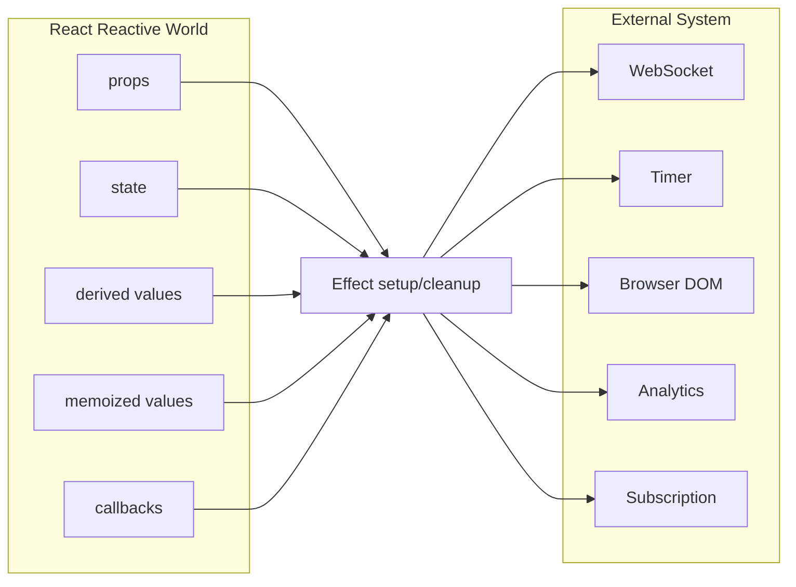
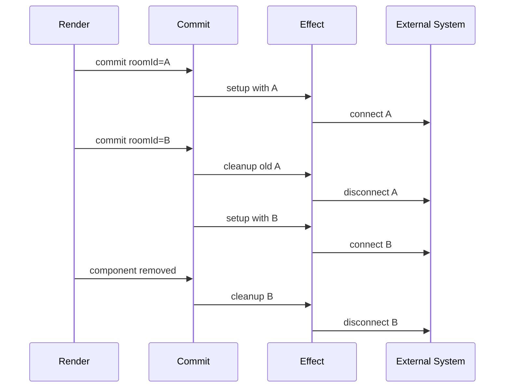
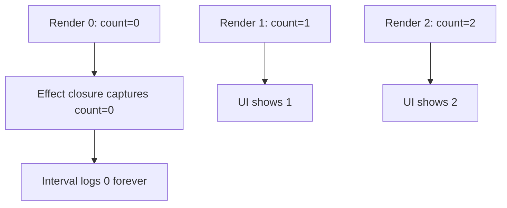
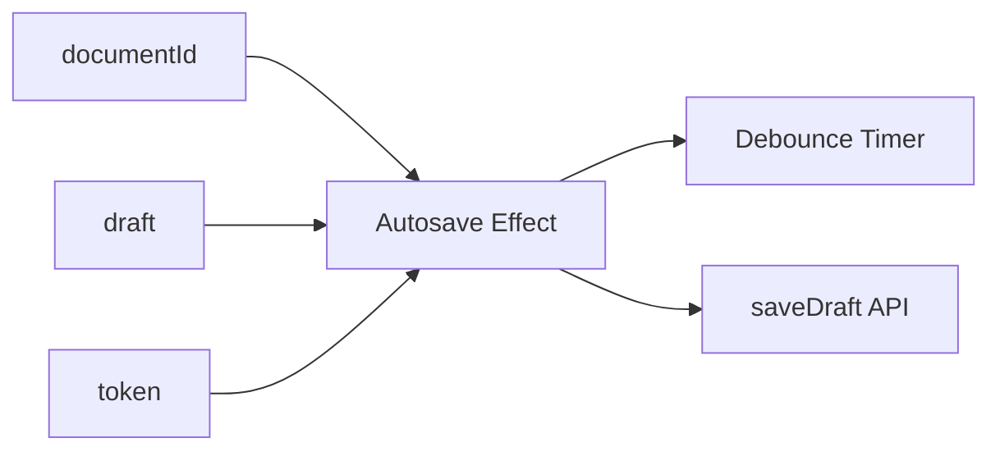
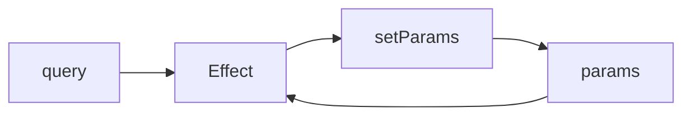

# Part 015 — Effect Dependency Graph

Di Part 014 kita sudah mengunci satu prinsip:

> `useEffect` bukan lifecycle replacement. `useEffect` adalah mekanisme sinkronisasi dengan sistem eksternal.

Part ini masuk ke bagian yang biasanya membuat engineer React tersandung: **dependency array**.

Banyak orang membaca dependency array seperti ini:

```txt
"Kapan effect ini ingin saya jalankan?"
```

Itu framing yang berbahaya.

Framing yang lebih benar:

```txt
"Nilai reactive apa saja yang dipakai effect ini untuk menjaga sinkronisasi tetap benar?"
```

Dependency array bukan tombol scheduling manual. Dependency array adalah deklarasi edge pada graph reactivity.

Kalau kamu menghilangkan dependency yang dibaca oleh effect, kamu sedang menyembunyikan edge. Graph menjadi bohong. Begitu graph bohong, bug-nya biasanya bukan langsung crash. Bug-nya lebih licin: stale closure, subscription salah, race condition, cache mismatch, listener membaca state lama, atau reconnect yang tidak pernah terjadi.

---

## 1. Mental Model: Effect sebagai Edge dari React ke External System

Component React memiliki dunia internal:

- props
- state
- derived value
- memoized value
- callback
- ref
- render output

Effect menghubungkan dunia internal ini ke sistem eksternal:

- WebSocket
- timer
- DOM imperative API
- analytics
- browser storage
- media query
- event listener
- third-party widget
- network request manual
- subscription store

Dependency array menjawab:

```txt
Jika nilai-nilai reactive tertentu berubah,
apakah synchronization yang lama masih valid?
```

Diagramnya seperti ini:



Dependency array adalah daftar node di sisi kiri yang dibaca oleh effect.

Kalau effect membaca `roomId`, maka `roomId` adalah dependency.
Kalau effect membaca `serverUrl`, maka `serverUrl` adalah dependency.
Kalau effect membaca `authToken`, maka `authToken` adalah dependency.
Kalau effect membaca `onMessage`, maka `onMessage` adalah dependency.

Bukan karena linter cerewet. Karena sinkronisasinya memang bergantung pada nilai itu.

---

## 2. Reactive Value: Apa yang Harus Masuk Dependency?

Di React, **reactive value** adalah nilai yang bisa berbeda antar render dan berasal dari scope component.

Umumnya termasuk:

- props
- state
- variable yang dideklarasikan di body component
- function yang dideklarasikan di body component
- object/array yang dibuat di body component
- value hasil custom Hook
- memoized value dari `useMemo`
- callback dari `useCallback`

Contoh:

```tsx
function ChatRoom({ roomId }: { roomId: string }) {
  const [serverUrl, setServerUrl] = useState("wss://chat.example.com");
  const authToken = useAuthToken();

  useEffect(() => {
    const connection = createConnection({
      serverUrl,
      roomId,
      authToken,
    });

    connection.connect();

    return () => connection.disconnect();
  }, [serverUrl, roomId, authToken]);

  return <RoomScreen />;
}
```

Dependency-nya bukan dipilih berdasarkan selera.
Dependency-nya berasal dari nilai yang dibaca oleh setup/cleanup effect.

```txt
Effect reads: serverUrl, roomId, authToken
Dependencies: [serverUrl, roomId, authToken]
```

Kalau `roomId` berubah tapi effect tidak re-run, connection masih tersambung ke room lama.
Kalau `authToken` berubah tapi effect tidak re-run, connection masih memakai token lama.
Kalau `serverUrl` berubah tapi effect tidak re-run, connection masih menunjuk server lama.

---

## 3. Dependency Array sebagai Graph, Bukan Lifecycle Flag

Ada tiga bentuk umum dependency array:

```tsx
useEffect(() => {
  // runs after every commit
});

useEffect(() => {
  // runs after mount and whenever a/b changes
}, [a, b]);

useEffect(() => {
  // runs after mount only, but only valid if it reads no reactive values
}, []);
```

Kesalahan paling umum adalah memakai `[]` sebagai pengganti `componentDidMount`.

```tsx
function ChatRoom({ roomId }: { roomId: string }) {
  useEffect(() => {
    const connection = createConnection(roomId);
    connection.connect();
    return () => connection.disconnect();
  }, []); // ❌ roomId dibaca tapi tidak dideklarasikan

  return <div />;
}
```

Masalahnya bukan "effect tidak rerun" secara abstrak.
Masalahnya lebih konkret:

```txt
Graph mengatakan effect tidak bergantung pada roomId.
Kode effect sebenarnya bergantung pada roomId.
Graph dan realitas tidak sama.
```

Hasilnya:

- user pindah room
- UI menampilkan room baru
- connection masih room lama
- pesan masuk salah konteks
- bug terlihat seperti backend/event ordering problem
- akar masalahnya dependency graph yang bohong

Yang benar:

```tsx
function ChatRoom({ roomId }: { roomId: string }) {
  useEffect(() => {
    const connection = createConnection(roomId);
    connection.connect();
    return () => connection.disconnect();
  }, [roomId]);

  return <div />;
}
```

---

## 4. Effect Lifecycle Berbeda dari Component Lifecycle

Component bisa dipikirkan sebagai mount, update, unmount.

Effect lebih tepat dipikirkan sebagai:

```txt
start synchronization
stop synchronization
start synchronization again
stop synchronization again
```

Diagram:



Dependency array menentukan kapan synchronization lama dianggap tidak valid.

Jika dependency berubah:

1. React commit render baru.
2. React menjalankan cleanup effect lama.
3. React menjalankan setup effect baru.

Ini alasan cleanup harus simetris dengan setup.

Buruk:

```tsx
useEffect(() => {
  socket.subscribe(roomId);

  return () => {
    socket.unsubscribe(); // ❌ unsubscribe apa? semua? room saat ini? room lama?
  };
}, [roomId]);
```

Lebih baik:

```tsx
useEffect(() => {
  socket.subscribe(roomId);

  return () => {
    socket.unsubscribe(roomId);
  };
}, [roomId]);
```

Setup dan cleanup membaca `roomId` snapshot yang sama dari render effect tersebut.

---

## 5. Closure Snapshot: Effect Melihat Render Tertentu

Setiap render menghasilkan lexical environment sendiri.
Effect yang dibuat pada render tertentu melihat nilai dari render itu.

Contoh:

```tsx
function Counter() {
  const [count, setCount] = useState(0);

  useEffect(() => {
    const id = setInterval(() => {
      console.log(count);
    }, 1000);

    return () => clearInterval(id);
  }, []); // ❌ count dibaca tapi tidak masuk dependency

  return <button onClick={() => setCount(count + 1)}>{count}</button>;
}
```

Banyak orang berharap `console.log(count)` selalu melihat count terbaru.
Padahal effect dengan `[]` dibuat dari render pertama.
Ia melihat `count = 0` selamanya.

Itu stale closure.

Graph-nya:



Ada beberapa solusi, tergantung intent.

### Solusi A: Effect memang perlu resync saat `count` berubah

```tsx
useEffect(() => {
  const id = setInterval(() => {
    console.log(count);
  }, 1000);

  return () => clearInterval(id);
}, [count]);
```

Ini benar kalau interval harus dibuat ulang saat `count` berubah.
Tapi untuk interval logging, ini sering tidak ideal karena interval di-reset terus.

### Solusi B: Gunakan updater function untuk menulis state tanpa membaca stale state

```tsx
useEffect(() => {
  const id = setInterval(() => {
    setCount((current) => current + 1);
  }, 1000);

  return () => clearInterval(id);
}, []);
```

Di sini effect tidak membaca `count`.
Ia hanya mengirim instruksi:

```txt
React, ambil state terbaru dan tambahkan 1.
```

Karena `count` tidak dibaca, `count` tidak menjadi dependency.

### Solusi C: Gunakan ref untuk latest value jika yang dibutuhkan adalah mutable latest cell

```tsx
function CounterLogger() {
  const [count, setCount] = useState(0);
  const latestCountRef = useRef(count);

  useEffect(() => {
    latestCountRef.current = count;
  }, [count]);

  useEffect(() => {
    const id = setInterval(() => {
      console.log(latestCountRef.current);
    }, 1000);

    return () => clearInterval(id);
  }, []);

  return <button onClick={() => setCount((c) => c + 1)}>{count}</button>;
}
```

Ini valid untuk kebutuhan tertentu, tapi jangan dijadikan default untuk menghindari dependencies.
Ref adalah escape hatch. Ia mengorbankan reactivity agar bisa membaca nilai terbaru secara imperative.

---

## 6. Cara Membaca Effect Dependency secara Mekanis

Gunakan prosedur ini:

```txt
1. Buka body useEffect.
2. Tandai semua nilai dari scope component yang dibaca setup.
3. Tandai semua nilai dari scope component yang dibaca cleanup.
4. Coret nilai yang stabil by definition, seperti setState dispatcher.
5. Coret ref object jika hanya membaca/menulis ref.current secara imperative.
6. Sisanya adalah dependencies.
7. Jika dependencies membuat effect terlalu sering run, jangan hapus dependency. Ubah struktur kode.
```

Contoh:

```tsx
function UserPresence({ userId, tenantId }: Props) {
  const [status, setStatus] = useState("offline");
  const config = usePresenceConfig(tenantId);

  useEffect(() => {
    const client = createPresenceClient(config);

    client.subscribe(userId, (nextStatus) => {
      setStatus(nextStatus);
    });

    return () => {
      client.unsubscribe(userId);
      client.close();
    };
  }, [config, userId]);

  return <PresenceBadge status={status} />;
}
```

Pembacaan:

```txt
Reads from component scope:
- config
- userId
- setStatus

Stable by definition:
- setStatus

Dependencies:
- config
- userId
```

`tenantId` tidak langsung dibaca effect. Tapi `config` berasal dari `tenantId` melalui custom Hook. Jadi dependency effect tetap `config`, bukan `tenantId`, kecuali effect langsung membaca `tenantId`.

---

## 7. Stable Values: Nilai yang Tidak Perlu Masuk Dependency

Beberapa nilai stabil secara kontrak React:

- state setter dari `useState`
- dispatch dari `useReducer`
- ref object dari `useRef`

Contoh:

```tsx
const [value, setValue] = useState("");
const inputRef = useRef<HTMLInputElement | null>(null);

useEffect(() => {
  inputRef.current?.focus();
  setValue("ready");
}, []);
```

`setValue` tidak perlu dependency karena React menjamin identity-nya stabil.
`inputRef` object stabil. Tapi `inputRef.current` adalah mutable field, bukan reactive value.

Namun hati-hati:

```tsx
const optionsRef = useRef({ retry: 3 });

useEffect(() => {
  client.configure(optionsRef.current);
}, []);
```

Secara dependency linter mungkin aman, tapi secara desain kamu perlu bertanya:

```txt
Apakah optionsRef.current memang mutable imperative config?
Atau sebenarnya state/props yang disembunyikan di ref?
```

Kalau yang kedua, kamu sedang membuat hidden state yang tidak transparan terhadap React.

---

## 8. Object dan Array Dependency: Identity Trap

Object dan array baru dibuat ulang setiap render.

```tsx
function SearchPage({ query }: { query: string }) {
  const options = {
    query,
    limit: 20,
  };

  useEffect(() => {
    searchClient.configure(options);
  }, [options]); // ⚠️ options identity berubah setiap render

  return <SearchResults />;
}
```

`options` berubah setiap render karena object literal membuat identity baru.
Effect akan re-run setiap render.

Ada beberapa solusi.

### Solusi A: Buat object di dalam effect

Jika object hanya dipakai effect:

```tsx
function SearchPage({ query }: { query: string }) {
  useEffect(() => {
    const options = {
      query,
      limit: 20,
    };

    searchClient.configure(options);
  }, [query]);

  return <SearchResults />;
}
```

Ini sering solusi terbaik.
Dependency menjadi primitive yang benar-benar dibaca dari render: `query`.

### Solusi B: Memoize object jika object juga dibutuhkan render/child

```tsx
function SearchPage({ query }: { query: string }) {
  const options = useMemo(() => {
    return {
      query,
      limit: 20,
    };
  }, [query]);

  useEffect(() => {
    searchClient.configure(options);
  }, [options]);

  return <SearchToolbar options={options} />;
}
```

Gunakan ini jika identity `options` memang bagian dari contract ke child atau dependency lain.

### Solusi C: Pecah dependency menjadi scalar

```tsx
function SearchPage({ query, limit }: Props) {
  useEffect(() => {
    searchClient.configure({ query, limit });
  }, [query, limit]);

  return <SearchResults />;
}
```

Ini membuat graph lebih jelas.

---

## 9. Function Dependency: Closure Trap

Function di component body juga dibuat ulang setiap render.

```tsx
function ChatRoom({ roomId }: { roomId: string }) {
  function createOptions() {
    return {
      roomId,
      serverUrl: "wss://chat.example.com",
    };
  }

  useEffect(() => {
    const options = createOptions();
    const connection = createConnection(options);
    connection.connect();
    return () => connection.disconnect();
  }, [createOptions]); // ⚠️ createOptions berubah setiap render

  return <Room />;
}
```

Ada tiga pendekatan.

### Solusi A: Pindahkan function ke dalam effect

```tsx
function ChatRoom({ roomId }: { roomId: string }) {
  useEffect(() => {
    function createOptions() {
      return {
        roomId,
        serverUrl: "wss://chat.example.com",
      };
    }

    const connection = createConnection(createOptions());
    connection.connect();
    return () => connection.disconnect();
  }, [roomId]);

  return <Room />;
}
```

Ini paling langsung kalau function hanya dipakai effect.

### Solusi B: Pindahkan function ke module scope

```tsx
function createOptions(roomId: string) {
  return {
    roomId,
    serverUrl: "wss://chat.example.com",
  };
}

function ChatRoom({ roomId }: { roomId: string }) {
  useEffect(() => {
    const connection = createConnection(createOptions(roomId));
    connection.connect();
    return () => connection.disconnect();
  }, [roomId]);

  return <Room />;
}
```

Function module-scope bukan reactive value karena tidak dibuat di render.

### Solusi C: `useCallback` jika function adalah public contract ke child/effect

```tsx
function ChatRoom({ roomId }: { roomId: string }) {
  const createOptions = useCallback(() => {
    return {
      roomId,
      serverUrl: "wss://chat.example.com",
    };
  }, [roomId]);

  useEffect(() => {
    const connection = createConnection(createOptions());
    connection.connect();
    return () => connection.disconnect();
  }, [createOptions]);

  return <Room />;
}
```

Ini valid, tetapi jangan menjadikan `useCallback` sebagai plester otomatis. Sering kali memindahkan function ke dalam effect lebih sederhana.

---

## 10. "Saya Tidak Mau Effect Re-run" Biasanya Bukan Alasan untuk Menghapus Dependency

Kalimat ini sering muncul:

```txt
Kalau saya tambahkan dependency, effect jadi jalan terus.
```

Kesimpulan yang salah:

```txt
Berarti dependency-nya harus dihapus.
```

Kesimpulan yang benar:

```txt
Berarti struktur effect-nya belum tepat.
```

Contoh buruk:

```tsx
function Page({ user, analytics }: Props) {
  useEffect(() => {
    analytics.track("page_view", {
      userId: user.id,
      plan: user.plan,
    });
  }, []); // ❌ user dan analytics dibaca

  return <Dashboard />;
}
```

Kalau dependency ditambahkan:

```tsx
useEffect(() => {
  analytics.track("page_view", {
    userId: user.id,
    plan: user.plan,
  });
}, [analytics, user]);
```

Effect mungkin re-run saat object `user` identity berubah.

Solusi yang lebih baik tergantung intent.

Jika ingin track satu kali per page mount dengan user awal:

```tsx
function Page({ user, analytics }: Props) {
  const initialUserRef = useRef(user);
  const analyticsRef = useRef(analytics);

  useEffect(() => {
    analyticsRef.current.track("page_view", {
      userId: initialUserRef.current.id,
      plan: initialUserRef.current.plan,
    });
  }, []);

  return <Dashboard />;
}
```

Tapi ini harus eksplisit: kamu memang ingin **initial value**, bukan latest value.

Jika ingin track setiap perubahan user id:

```tsx
function Page({ user, analytics }: Props) {
  useEffect(() => {
    analytics.track("page_view", {
      userId: user.id,
      plan: user.plan,
    });
  }, [analytics, user.id, user.plan]);

  return <Dashboard />;
}
```

Jika analytics object tidak stabil padahal seharusnya stabil, perbaiki provider-nya, bukan effect-nya.

---

## 11. Dependency Bukan Deep Equality

React membandingkan dependencies dengan `Object.is`.

Ini berarti:

```tsx
useEffect(() => {
  // ...
}, [{ page: 1 }]); // ❌ object baru setiap render
```

Object literal selalu berbeda identity.

```txt
Object.is({ page: 1 }, { page: 1 }) === false
```

Untuk dependencies, identity matters.

Implikasinya:

- object/array/function di dependency harus stabil jika dipakai sebagai dependency
- jangan berharap React melakukan deep compare
- deep compare custom Hook biasanya menutup bau desain, bukan menyelesaikan akar masalah

Kadang deep compare masuk akal untuk adapter boundary ke API legacy. Tetapi sebagai default architecture, deep compare mahal dan bisa menyembunyikan state modeling yang buruk.

---

## 12. Cleanup Juga Membaca Dependencies

Banyak engineer hanya melihat setup.
Padahal cleanup juga closure dari render yang sama.

```tsx
useEffect(() => {
  registry.register(id);

  return () => {
    registry.unregister(id);
  };
}, [registry, id]);
```

`registry` dan `id` dipakai setup dan cleanup.
Keduanya dependency.

Kasus subtle:

```tsx
function Presence({ userId, onDisconnect }: Props) {
  useEffect(() => {
    const connection = connect(userId);

    return () => {
      connection.disconnect();
      onDisconnect(userId);
    };
  }, [userId, onDisconnect]);

  return null;
}
```

`onDisconnect` hanya dipanggil cleanup, tapi tetap dependency.
Kalau `onDisconnect` berubah dan dependency tidak diperbarui, cleanup akan memanggil callback lama.

Jika kamu tidak ingin perubahan `onDisconnect` memicu resubscription, kamu perlu memisahkan reactive synchronization dari non-reactive event logic. Pada React modern, pola ini bisa memakai Effect Event untuk logic yang harus membaca latest value tanpa membuat effect re-synchronize. Jika tidak memakai Effect Event, custom latest-ref pattern bisa dipakai dengan disiplin tinggi.

---

## 13. Separating Events from Effects

Event handler berjalan karena user melakukan interaksi tertentu.
Effect berjalan karena synchronization perlu dijaga setelah commit.

Perbedaan:

```txt
Event handler:
- caused by specific interaction
- runs when event happens
- can read current render snapshot
- good for commands

Effect:
- caused by rendered state being present
- re-runs when reactive dependencies change
- good for synchronization
```

Buruk:

```tsx
function ProductPage({ productId }: { productId: string }) {
  const [isBought, setIsBought] = useState(false);

  useEffect(() => {
    if (isBought) {
      purchase(productId); // ❌ command user disembunyikan di effect
    }
  }, [isBought, productId]);

  return <button onClick={() => setIsBought(true)}>Buy</button>;
}
```

Lebih baik:

```tsx
function ProductPage({ productId }: { productId: string }) {
  async function handleBuyClick() {
    await purchase(productId);
  }

  return <button onClick={handleBuyClick}>Buy</button>;
}
```

Pembelian adalah command dari interaction, bukan synchronization akibat component muncul di layar.

Effect bukan orchestrator command user.

---

## 14. Pattern: Subscription Effect

Subscription adalah kasus effect klasik.

```tsx
type OnlineStatus = "online" | "offline";

function useOnlineStatus() {
  const [status, setStatus] = useState<OnlineStatus>(() => {
    return navigator.onLine ? "online" : "offline";
  });

  useEffect(() => {
    function handleOnline() {
      setStatus("online");
    }

    function handleOffline() {
      setStatus("offline");
    }

    window.addEventListener("online", handleOnline);
    window.addEventListener("offline", handleOffline);

    return () => {
      window.removeEventListener("online", handleOnline);
      window.removeEventListener("offline", handleOffline);
    };
  }, []);

  return status;
}
```

Dependency `[]` valid karena effect tidak membaca props/state dari component scope.
`setStatus` stabil.
`handleOnline` dan `handleOffline` dideklarasikan di dalam effect, bukan dari component scope.

Kalau handler butuh prop:

```tsx
function useWindowEvent(type: string, handler: EventListener) {
  useEffect(() => {
    window.addEventListener(type, handler);

    return () => {
      window.removeEventListener(type, handler);
    };
  }, [type, handler]);
}
```

Di sini `type` dan `handler` dependency.
Caller harus memastikan handler identity sesuai intent, misalnya dengan `useCallback`, atau custom Hook harus menyediakan latest-handler pattern jika memang ingin subscription stabil.

---

## 15. Pattern: Fetch Effect dengan Race Guard

Fetching di effect bisa valid pada aplikasi client-side sederhana, meskipun untuk production server-state TanStack Query/framework data loader sering lebih kuat.

Masalah utamanya: race condition.

Buruk:

```tsx
function UserProfile({ userId }: { userId: string }) {
  const [user, setUser] = useState<User | null>(null);

  useEffect(() => {
    fetchUser(userId).then(setUser);
  }, [userId]);

  return <ProfileView user={user} />;
}
```

Jika userId berubah cepat:

```txt
request A starts
request B starts
request B finishes -> set user B
request A finishes later -> set user A
UI salah
```

Minimal race guard:

```tsx
function UserProfile({ userId }: { userId: string }) {
  const [user, setUser] = useState<User | null>(null);

  useEffect(() => {
    let ignore = false;

    async function load() {
      const nextUser = await fetchUser(userId);

      if (!ignore) {
        setUser(nextUser);
      }
    }

    load();

    return () => {
      ignore = true;
    };
  }, [userId]);

  return <ProfileView user={user} />;
}
```

Lebih baik dengan `AbortController` jika API mendukung:

```tsx
function UserProfile({ userId }: { userId: string }) {
  const [user, setUser] = useState<User | null>(null);
  const [error, setError] = useState<Error | null>(null);

  useEffect(() => {
    const controller = new AbortController();

    async function load() {
      try {
        setError(null);
        const nextUser = await fetchUser(userId, {
          signal: controller.signal,
        });
        setUser(nextUser);
      } catch (error) {
        if (!controller.signal.aborted) {
          setError(error as Error);
        }
      }
    }

    load();

    return () => {
      controller.abort();
    };
  }, [userId]);

  return <ProfileView user={user} error={error} />;
}
```

Dependencies:

```txt
userId
```

`controller` dibuat di dalam effect.
`load` dibuat di dalam effect.
`setUser` dan `setError` stabil.

---

## 16. Pattern: External Widget Synchronization

Contoh third-party map widget.

```tsx
function Map({ zoomLevel, center }: Props) {
  const containerRef = useRef<HTMLDivElement | null>(null);
  const mapRef = useRef<MapWidget | null>(null);

  useEffect(() => {
    if (containerRef.current === null) return;

    if (mapRef.current === null) {
      mapRef.current = new MapWidget(containerRef.current);
    }

    mapRef.current.setZoom(zoomLevel);
    mapRef.current.setCenter(center);
  }, [zoomLevel, center]);

  return <div ref={containerRef} />;
}
```

Di sini effect menyinkronkan external widget dengan React props.

Dependency:

- `zoomLevel`
- `center`

`containerRef` dan `mapRef` object stabil.

Jika `center` adalah object yang dibuat inline oleh parent, effect akan re-run setiap render. Itu mungkin benar jika center identity selalu berubah, tapi biasanya perlu stabilisasi di parent atau pecah menjadi scalar:

```tsx
function Map({ lat, lng, zoomLevel }: Props) {
  const containerRef = useRef<HTMLDivElement | null>(null);
  const mapRef = useRef<MapWidget | null>(null);

  useEffect(() => {
    if (containerRef.current === null) return;

    if (mapRef.current === null) {
      mapRef.current = new MapWidget(containerRef.current);
    }

    mapRef.current.setZoom(zoomLevel);
    mapRef.current.setCenter({ lat, lng });
  }, [zoomLevel, lat, lng]);

  return <div ref={containerRef} />;
}
```

Graph menjadi lebih jelas.

---

## 17. Strict Mode: Stress Test untuk Effect

Di development, Strict Mode dapat menjalankan setup-cleanup-setup untuk membantu menemukan effect yang tidak idempotent atau cleanup-nya tidak lengkap.

Jika effect rusak saat double setup, biasanya effect memang tidak punya cleanup yang benar.

Buruk:

```tsx
useEffect(() => {
  connection.connect();
}, []); // ❌ tidak ada cleanup
```

Lebih baik:

```tsx
useEffect(() => {
  connection.connect();

  return () => {
    connection.disconnect();
  };
}, [connection]);
```

Tapi perhatikan `connection` dependency. Jika `connection` dibuat di render sebagai object baru, effect re-run terus.

```tsx
const connection = createConnection(roomId); // ❌ object baru tiap render

useEffect(() => {
  connection.connect();
  return () => connection.disconnect();
}, [connection]);
```

Lebih baik:

```tsx
useEffect(() => {
  const connection = createConnection(roomId);
  connection.connect();
  return () => connection.disconnect();
}, [roomId]);
```

---

## 18. Exhaustive Deps Linter: Jangan Dilawan, Pahami Sinyalnya

Rule `exhaustive-deps` bukan sekadar style rule.
Ia mencoba menjaga graph reactivity tetap jujur.

Ketika linter bilang dependency kurang, ada beberapa kemungkinan:

```txt
1. Effect memang membaca nilai reactive dan harus re-run saat nilai itu berubah.
2. Nilai itu seharusnya dibuat di dalam effect.
3. Nilai itu seharusnya dipindah ke event handler.
4. Nilai itu seharusnya dihitung saat render.
5. Nilai itu seharusnya menjadi updater function.
6. Nilai itu seharusnya dipisahkan menjadi Effect Event/latest ref.
7. Effect itu sendiri tidak perlu ada.
```

Yang hampir selalu salah:

```tsx
// eslint-disable-next-line react-hooks/exhaustive-deps
```

Disable linter hanya bisa diterima jika ada alasan architecture yang eksplisit, terdokumentasi, dan diuji.
Misalnya adapter legacy dengan lifecycle sangat khusus.
Bahkan di sana pun lebih baik membungkusnya dalam custom Hook agar suppressions tidak menyebar.

---

## 19. Refactor Playbook Saat Dependency Membuat Effect Terlalu Sering Jalan

Jangan mulai dari "hapus dependency".
Mulai dari pertanyaan berikut.

### Pertanyaan 1: Apakah effect ini sebenarnya derivasi state?

Buruk:

```tsx
const [fullName, setFullName] = useState("");

useEffect(() => {
  setFullName(firstName + " " + lastName);
}, [firstName, lastName]);
```

Lebih baik:

```tsx
const fullName = firstName + " " + lastName;
```

### Pertanyaan 2: Apakah effect ini sebenarnya event handler?

Buruk:

```tsx
useEffect(() => {
  if (submitted) {
    submitForm(formData);
  }
}, [submitted, formData]);
```

Lebih baik:

```tsx
async function handleSubmit() {
  await submitForm(formData);
}
```

### Pertanyaan 3: Apakah object/function dependency bisa dibuat di dalam effect?

Buruk:

```tsx
const options = { roomId, serverUrl };

useEffect(() => {
  connect(options);
}, [options]);
```

Lebih baik:

```tsx
useEffect(() => {
  connect({ roomId, serverUrl });
}, [roomId, serverUrl]);
```

### Pertanyaan 4: Apakah state update bisa memakai updater function?

Buruk:

```tsx
useEffect(() => {
  const id = setInterval(() => {
    setCount(count + 1);
  }, 1000);

  return () => clearInterval(id);
}, [count]);
```

Lebih baik:

```tsx
useEffect(() => {
  const id = setInterval(() => {
    setCount((count) => count + 1);
  }, 1000);

  return () => clearInterval(id);
}, []);
```

### Pertanyaan 5: Apakah butuh latest value tanpa resubscribe?

Gunakan latest ref dengan sengaja:

```tsx
function useLatest<T>(value: T) {
  const ref = useRef(value);

  useEffect(() => {
    ref.current = value;
  }, [value]);

  return ref;
}
```

Lalu:

```tsx
function useStableSubscription(source: Source, onMessage: (msg: Message) => void) {
  const latestOnMessage = useLatest(onMessage);

  useEffect(() => {
    return source.subscribe((message) => {
      latestOnMessage.current(message);
    });
  }, [source, latestOnMessage]);
}
```

Namun ini harus dipakai untuk kasus yang tepat: subscription stabil, callback latest.
Jangan pakai ref untuk menyembunyikan dependency yang sebenarnya harus memicu resync.

---

## 20. Dependency Graph dalam Custom Hook

Custom Hook menyembunyikan detail effect dari component, tapi tidak menghapus dependency problem.

Buruk:

```tsx
function useChatRoom(roomId: string) {
  useEffect(() => {
    const connection = createConnection(roomId);
    connection.connect();
    return () => connection.disconnect();
  }, []); // ❌ roomId disembunyikan tapi tetap reactive
}
```

Benar:

```tsx
function useChatRoom(roomId: string) {
  useEffect(() => {
    const connection = createConnection(roomId);
    connection.connect();
    return () => connection.disconnect();
  }, [roomId]);
}
```

Lebih production-ready:

```tsx
type UseChatRoomOptions = {
  roomId: string;
  serverUrl: string;
  token: string;
  onMessage?: (message: ChatMessage) => void;
};

function useChatRoom({ roomId, serverUrl, token, onMessage }: UseChatRoomOptions) {
  const latestOnMessage = useLatest(onMessage);

  useEffect(() => {
    const connection = createConnection({ roomId, serverUrl, token });

    connection.on("message", (message) => {
      latestOnMessage.current?.(message);
    });

    connection.connect();

    return () => {
      connection.disconnect();
    };
  }, [roomId, serverUrl, token, latestOnMessage]);
}
```

Catatan desain:

- `roomId`, `serverUrl`, `token` mengubah connection, jadi dependency.
- `onMessage` tidak mengubah connection, hanya callback latest saat message datang.
- latest-ref pattern memisahkan resubscription dependencies dari callback freshness.

Ini bukan trik untuk menghindari dependency. Ini pemodelan dua jenis dependency yang berbeda:

```txt
synchronization dependency: nilai yang mengubah external subscription
observation dependency: callback yang ingin melihat latest render state
```

---

## 21. Case Study: Autosave Draft

Autosave sering membuat effect dependency kacau.

Requirement:

```txt
Ketika draft berubah, simpan ke server setelah user berhenti mengetik 800ms.
Jika documentId berubah, autosave harus pindah dokumen.
Jika token berubah, request berikutnya harus memakai token baru.
Jika component unmount, pending timeout dibatalkan.
```

Implementasi:

```tsx
type Draft = {
  title: string;
  body: string;
};

function useAutosaveDraft({
  documentId,
  draft,
  token,
}: {
  documentId: string;
  draft: Draft;
  token: string;
}) {
  useEffect(() => {
    const controller = new AbortController();

    const timeoutId = window.setTimeout(async () => {
      try {
        await saveDraft({
          documentId,
          draft,
          token,
          signal: controller.signal,
        });
      } catch (error) {
        if (!controller.signal.aborted) {
          reportAutosaveError(error);
        }
      }
    }, 800);

    return () => {
      window.clearTimeout(timeoutId);
      controller.abort();
    };
  }, [documentId, draft, token]);
}
```

Dependency graph:



Masalah: `draft` object mungkin berubah identity setiap keystroke. Itu memang benar karena autosave harus re-schedule setiap draft berubah.

Tapi jika parent membuat `draft` object baru walau field tidak berubah, autosave akan re-schedule tanpa perlu. Solusi bukan menghapus `draft`, melainkan memperbaiki state ownership atau dependency scalar:

```tsx
function useAutosaveDraft({ documentId, title, body, token }: Params) {
  useEffect(() => {
    const controller = new AbortController();

    const timeoutId = window.setTimeout(() => {
      saveDraft({
        documentId,
        draft: { title, body },
        token,
        signal: controller.signal,
      });
    }, 800);

    return () => {
      window.clearTimeout(timeoutId);
      controller.abort();
    };
  }, [documentId, title, body, token]);
}
```

Sekarang graph lebih eksplisit.

---

## 22. Case Study: Permission-Aware Subscription

Requirement:

```txt
Subscribe ke case updates hanya jika user punya permission.
Jika caseId berubah, pindah subscription.
Jika permission berubah dari allowed ke denied, unsubscribe.
Jika handler berubah, subscription tidak perlu dibuat ulang, tapi handler terbaru harus dipanggil.
```

Implementasi:

```tsx
function useCaseUpdates({
  caseId,
  canReadCase,
  onUpdate,
}: {
  caseId: string;
  canReadCase: boolean;
  onUpdate: (event: CaseUpdateEvent) => void;
}) {
  const latestOnUpdate = useLatest(onUpdate);

  useEffect(() => {
    if (!canReadCase) {
      return;
    }

    const subscription = caseUpdateBus.subscribe(caseId, (event) => {
      latestOnUpdate.current(event);
    });

    return () => {
      subscription.unsubscribe();
    };
  }, [caseId, canReadCase, latestOnUpdate]);
}
```

Dependency reasoning:

```txt
caseId changes -> subscription target changes -> resubscribe
canReadCase changes -> subscription allowed/disallowed -> resubscribe/cleanup
onUpdate changes -> only callback body changes -> latest ref, no resubscribe
```

Ini pola penting untuk aplikasi enterprise: permission, tenancy, feature flags, dan workflow state sering mempengaruhi subscription boundary.

---

## 23. Infinite Loop: Biasanya Graph Berputar

Contoh:

```tsx
function SearchPage({ query }: { query: string }) {
  const [params, setParams] = useState({ query, page: 1 });

  useEffect(() => {
    setParams({ query, page: 1 });
  }, [query, params]); // ❌ params berubah karena effect, effect tergantung params

  return <Results params={params} />;
}
```

Graph:



Ada cycle:

```txt
params -> effect -> setParams -> params -> effect
```

Biasanya solusi: hapus state redundant.

```tsx
function SearchPage({ query }: { query: string }) {
  const params = { query, page: 1 };

  return <Results params={params} />;
}
```

Jika identity `params` penting:

```tsx
const params = useMemo(() => ({ query, page: 1 }), [query]);
```

Bukan effect.

---

## 24. Decision Table: Dependency Problem ke Refactor

| Gejala | Penyebab Umum | Refactor Utama |
|---|---|---|
| Effect stale membaca value lama | Dependency hilang | Tambahkan dependency atau ubah ke updater/ref sesuai intent |
| Effect run setiap render | Object/function dependency tidak stabil | Pindah object/function ke dalam effect, memoize, atau pecah scalar |
| Infinite loop | Effect set state yang menjadi dependency | Hilangkan redundant state, hitung saat render, atau ubah transition |
| Subscription reconnect terus | Callback dependency berubah tiap render | Pisahkan subscription dependency dari latest callback |
| Linter exhaustive-deps marah | Graph tidak jujur | Restruktur kode, jangan suppress dulu |
| Cleanup salah target | Cleanup tidak memakai snapshot yang sama | Buat setup/cleanup simetris dan explicit |
| Fetch menimpa data baru | Race response lama | Cleanup guard atau AbortController |

---

## 25. Production Checklist

Sebelum merge effect, jawab ini:

```txt
1. External system apa yang disinkronkan?
2. Nilai reactive apa yang dibaca setup?
3. Nilai reactive apa yang dibaca cleanup?
4. Apakah semua nilai itu ada di dependency array?
5. Jika tidak, apa alasan eksplisitnya?
6. Apakah object/function dependency stabil atau dibuat di dalam effect?
7. Apakah cleanup membatalkan semua kerja setup?
8. Apakah Strict Mode setup-cleanup-setup aman?
9. Apakah async effect punya race guard/cancellation?
10. Apakah effect sebenarnya bisa diganti dengan render calculation, event handler, reducer, atau external store?
```

---

## 26. Anti-Pattern Map

### Anti-pattern 1: `[]` untuk semua hal

```tsx
useEffect(() => {
  doSomething(propA, stateB);
}, []); // ❌
```

Ini hampir selalu stale closure.

### Anti-pattern 2: Suppress linter sebagai solusi

```tsx
// eslint-disable-next-line react-hooks/exhaustive-deps
```

Kalau perlu, isolasi di custom Hook dan dokumentasikan invariant.

### Anti-pattern 3: `useMemo` semua hal agar dependency diam

```tsx
const options = useMemo(() => ({ a, b, c }), [a, b, c]);
```

Valid kalau identity penting. Tidak valid kalau hanya menenangkan linter padahal object bisa dibuat di dalam effect.

### Anti-pattern 4: Ref untuk menyembunyikan state reactive

```tsx
const valueRef = useRef(value);
```

Ref latest-value bisa valid, tapi jika semua state dimasukkan ref agar effect tidak re-run, kamu keluar dari React model.

### Anti-pattern 5: Effect sebagai event bus internal

```tsx
useEffect(() => {
  if (flag) doCommand();
}, [flag]);
```

Sering kali command harus berada di event handler atau reducer transition.

---

## 27. Latihan: Audit Dependency Graph

Audit kode ini:

```tsx
function CaseTimeline({ caseId, filters, onEvent }: Props) {
  const [events, setEvents] = useState<CaseEvent[]>([]);
  const client = createTimelineClient();

  useEffect(() => {
    client.subscribe(caseId, filters, (event) => {
      setEvents([...events, event]);
      onEvent(event);
    });

    return () => {
      client.unsubscribe(caseId);
    };
  }, [caseId]);

  return <Timeline events={events} />;
}
```

Masalah:

```txt
1. client dibuat ulang setiap render.
2. filters dibaca tapi tidak menjadi dependency.
3. events dibaca dalam callback, stale closure.
4. onEvent dibaca tapi tidak menjadi dependency.
5. subscribe tidak jelas mengembalikan unsubscribe handle.
6. cleanup unsubscribe hanya by caseId, bisa salah jika filters/client berubah.
```

Refactor:

```tsx
function CaseTimeline({ caseId, filters, onEvent }: Props) {
  const [events, setEvents] = useState<CaseEvent[]>([]);
  const latestOnEvent = useLatest(onEvent);

  useEffect(() => {
    const client = createTimelineClient();

    const subscription = client.subscribe(caseId, filters, (event) => {
      setEvents((currentEvents) => [...currentEvents, event]);
      latestOnEvent.current(event);
    });

    return () => {
      subscription.unsubscribe();
      client.close();
    };
  }, [caseId, filters, latestOnEvent]);

  return <Timeline events={events} />;
}
```

Jika `filters` object tidak stabil, pecah menjadi scalar atau memoize di owner.

---

## 28. Ringkasan

Dependency array adalah graph reactivity.

Prinsip utama:

```txt
Effect dependency bukan daftar kapan effect ingin jalan.
Effect dependency adalah daftar nilai reactive yang dipakai effect untuk menjaga sinkronisasi benar.
```

Jangan bohong pada dependency array.
Jika dependency membuat effect bermasalah, restruktur kode:

- pindahkan object/function ke dalam effect
- hitung derived value saat render
- pindahkan command ke event handler
- pakai updater function
- pisahkan synchronization dependency dari latest callback
- gunakan custom Hook untuk membungkus protocol
- gunakan reducer/state machine jika alur sudah menjadi workflow

Effect yang baik punya graph yang jujur, cleanup yang simetris, dan alasan external system yang jelas.

---

## Referensi Resmi

- React Docs — Synchronizing with Effects: https://react.dev/learn/synchronizing-with-effects
- React Docs — Lifecycle of Reactive Effects: https://react.dev/learn/lifecycle-of-reactive-effects
- React Docs — Separating Events from Effects: https://react.dev/learn/separating-events-from-effects
- React Docs — Removing Effect Dependencies: https://react.dev/learn/removing-effect-dependencies
- React Docs — exhaustive-deps lint: https://react.dev/reference/eslint-plugin-react-hooks/lints/exhaustive-deps
- React Docs — useEffect: https://react.dev/reference/react/useEffect

