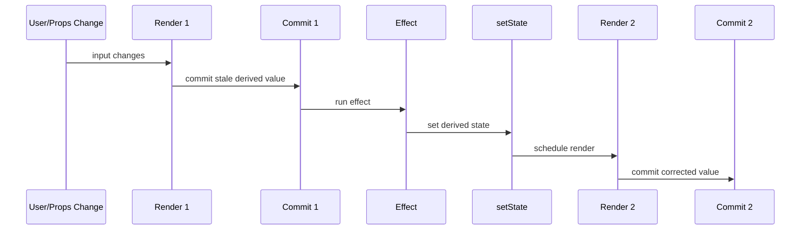
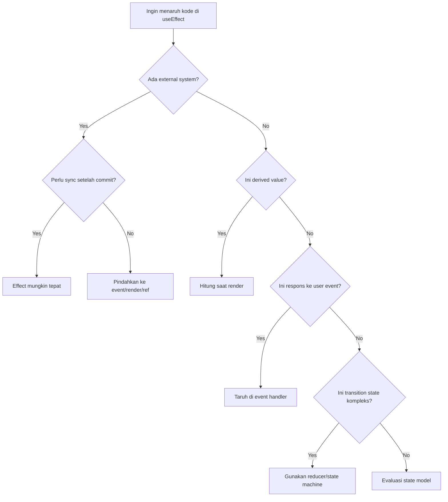
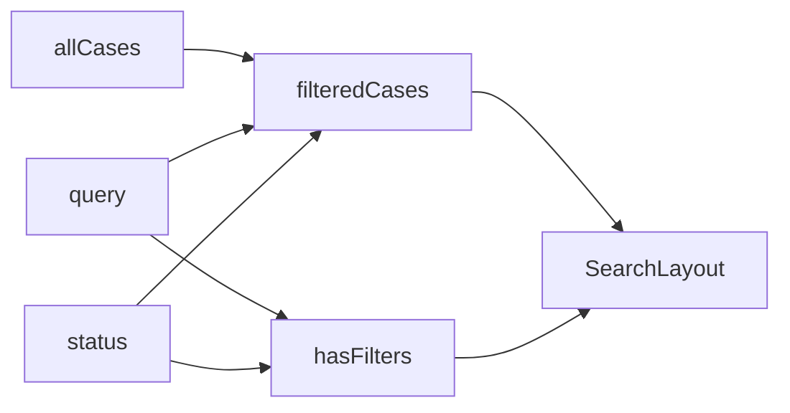
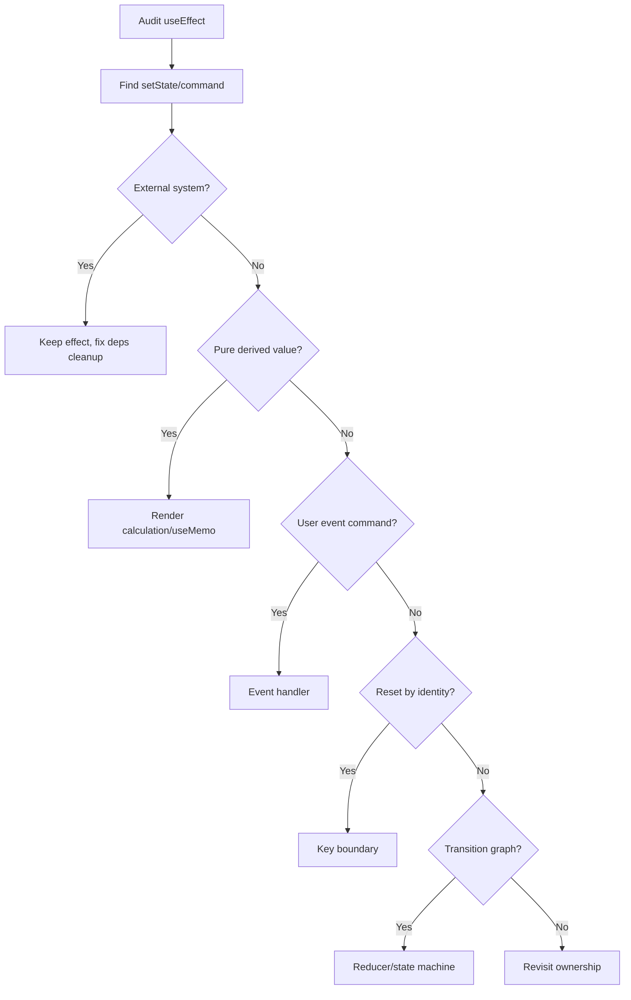

# Part 016 — Removing Unnecessary Effects

React code yang matang biasanya bukan code yang punya banyak `useEffect`.
React code yang matang adalah code yang tahu **kapan effect memang perlu** dan kapan effect hanya menutupi model state yang buruk.

Kalimat penting:

> Jika tidak ada sistem eksternal yang perlu disinkronkan, kemungkinan besar kamu tidak membutuhkan effect.

Effect adalah escape hatch. Ia membuat component melangkah keluar dari model React yang pure:

```txt
props + state -> render output
```

Begitu kamu menambahkan effect, kamu menambahkan second pass:

```txt
render -> commit -> effect -> setState? -> render lagi
```

Kadang memang perlu. Tetapi sering tidak.

Part ini adalah panduan refactor untuk menghapus effect yang tidak perlu.

---

## 1. Biaya Tersembunyi dari Effect yang Tidak Perlu

Effect yang tidak perlu terlihat sederhana:

```tsx
useEffect(() => {
  setSomething(computeSomething(input));
}, [input]);
```

Tapi secara runtime ia membuat alur seperti ini:



Masalahnya:

- render pertama bisa membawa value turunan yang stale
- ada extra render pass
- dependency graph menjadi lebih rumit
- kemungkinan infinite loop naik
- test perlu menunggu effect flush
- state bisa punya dua source of truth
- user bisa melihat flicker pada kasus tertentu

Kalau value bisa dihitung dari props/state saat render, hitung saat render.

---

## 2. Rule of Thumb

Gunakan effect untuk:

```txt
Synchronize component dengan external system.
```

Jangan gunakan effect untuk:

```txt
1. Menghitung derived data.
2. Menyalin props ke state tanpa alasan ownership yang jelas.
3. Merespons event user yang spesifik.
4. Mengatur data flow antar state internal.
5. Reset state yang bisa dimodelkan dengan key.
6. Menggabungkan state yang seharusnya satu reducer.
7. Menjalankan command yang seharusnya berada di event handler.
```

Decision tree:



---

## 3. Pattern 1: Jangan Simpan Derived Value sebagai State

Buruk:

```tsx
function UserCard({ firstName, lastName }: Props) {
  const [fullName, setFullName] = useState("");

  useEffect(() => {
    setFullName(firstName + " " + lastName);
  }, [firstName, lastName]);

  return <h2>{fullName}</h2>;
}
```

Masalah:

- `fullName` bukan source of truth
- source of truth sebenarnya `firstName` dan `lastName`
- render pertama setelah perubahan props membawa `fullName` lama
- butuh effect dan render tambahan

Benar:

```tsx
function UserCard({ firstName, lastName }: Props) {
  const fullName = firstName + " " + lastName;

  return <h2>{fullName}</h2>;
}
```

State seharusnya menyimpan fakta minimal, bukan duplikasi.

Invariant:

```txt
fullName === firstName + " " + lastName
```

Jika invariant ini bisa dijaga dengan kalkulasi, jangan jadikan state.

---

## 4. Pattern 2: Expensive Derived Value Pakai `useMemo`, Bukan Effect

Buruk:

```tsx
function ProductList({ products, filters }: Props) {
  const [visibleProducts, setVisibleProducts] = useState<Product[]>([]);

  useEffect(() => {
    setVisibleProducts(applyFilters(products, filters));
  }, [products, filters]);

  return <List items={visibleProducts} />;
}
```

Jika `applyFilters` mahal, solusi bukan effect.
Effect tetap membuat extra render.

Lebih baik:

```tsx
function ProductList({ products, filters }: Props) {
  const visibleProducts = useMemo(() => {
    return applyFilters(products, filters);
  }, [products, filters]);

  return <List items={visibleProducts} />;
}
```

`useMemo` bukan untuk side effect. Ia cache hasil kalkulasi pure.

Jika calculation tidak mahal, bahkan `useMemo` tidak perlu:

```tsx
const visibleProducts = applyFilters(products, filters);
```

Pakai profiling/measurement sebelum mengoptimasi.

---

## 5. Pattern 3: Jangan Sinkronkan Props ke State Tanpa Ownership yang Jelas

Buruk:

```tsx
function ProfileForm({ user }: { user: User }) {
  const [name, setName] = useState(user.name);

  useEffect(() => {
    setName(user.name);
  }, [user]);

  return <input value={name} onChange={(e) => setName(e.target.value)} />;
}
```

Ini terlihat masuk akal, tapi memiliki pertanyaan ownership yang belum dijawab:

```txt
Apakah name sedang diedit sebagai draft lokal?
Atau harus selalu sama dengan user.name?
```

Jika harus selalu sama, tidak perlu state lokal:

```tsx
function ProfileName({ user }: { user: User }) {
  return <span>{user.name}</span>;
}
```

Jika perlu draft lokal, gunakan initializer dan reset eksplisit dengan identity.

```tsx
function ProfileForm({ user }: { user: User }) {
  const [name, setName] = useState(user.name);

  return <input value={name} onChange={(e) => setName(e.target.value)} />;
}
```

Lalu owner menentukan kapan form di-remount:

```tsx
<ProfileForm key={user.id} user={user} />
```

Dengan `key`, React memahami bahwa user berbeda berarti instance form berbeda.
Tidak perlu effect untuk reset.

---

## 6. Pattern 4: Reset State dengan Key, Bukan Effect

Buruk:

```tsx
function CasePage({ caseId }: { caseId: string }) {
  const [selectedTab, setSelectedTab] = useState("summary");
  const [draftComment, setDraftComment] = useState("");

  useEffect(() => {
    setSelectedTab("summary");
    setDraftComment("");
  }, [caseId]);

  return (
    <CaseWorkspace
      caseId={caseId}
      selectedTab={selectedTab}
      onTabChange={setSelectedTab}
      draftComment={draftComment}
      onDraftCommentChange={setDraftComment}
    />
  );
}
```

Masalah:

- render pertama setelah `caseId` berubah masih membawa state case lama
- effect reset setelah commit
- ada extra render
- risiko child melihat kombinasi tidak valid: `caseId` baru + draft case lama

Lebih baik pisahkan boundary:

```tsx
function CasePage({ caseId }: { caseId: string }) {
  return <CaseWorkspace key={caseId} caseId={caseId} />;
}

function CaseWorkspace({ caseId }: { caseId: string }) {
  const [selectedTab, setSelectedTab] = useState("summary");
  const [draftComment, setDraftComment] = useState("");

  return (
    <CaseLayout
      caseId={caseId}
      selectedTab={selectedTab}
      onTabChange={setSelectedTab}
      draftComment={draftComment}
      onDraftCommentChange={setDraftComment}
    />
  );
}
```

`key={caseId}` menyatakan:

```txt
State di bawah boundary ini milik case tertentu.
Jika case berubah, state lama tidak valid.
```

Ini lebih declarative daripada effect reset.

---

## 7. Pattern 5: Jangan Gunakan Effect untuk Event-Specific Logic

Buruk:

```tsx
function CheckoutButton({ cart }: { cart: Cart }) {
  const [shouldCheckout, setShouldCheckout] = useState(false);

  useEffect(() => {
    if (shouldCheckout) {
      createOrder(cart);
    }
  }, [shouldCheckout, cart]);

  return <button onClick={() => setShouldCheckout(true)}>Checkout</button>;
}
```

Masalah:

- checkout adalah command dari klik user
- effect membuat command tergantung state flag
- jika `cart` berubah saat `shouldCheckout` true, order bisa dibuat ulang
- flag perlu reset

Benar:

```tsx
function CheckoutButton({ cart }: { cart: Cart }) {
  async function handleCheckoutClick() {
    await createOrder(cart);
  }

  return <button onClick={handleCheckoutClick}>Checkout</button>;
}
```

Rule:

```txt
Jika logic terjadi karena user melakukan event tertentu, taruh di event handler.
Jika logic terjadi karena component harus tetap sinkron dengan external system, taruh di effect.
```

---

## 8. Pattern 6: Jangan Gunakan Effect untuk Mengabarkan Parent Perubahan State yang Parent Bisa Hitung

Buruk:

```tsx
function FilterPanel({ filters, onHasActiveFiltersChange }: Props) {
  const hasActiveFilters = filters.status !== "all" || filters.search !== "";

  useEffect(() => {
    onHasActiveFiltersChange(hasActiveFilters);
  }, [hasActiveFilters, onHasActiveFiltersChange]);

  return <Panel />;
}
```

Jika parent butuh `hasActiveFilters`, parent seharusnya menghitung dari source of truth yang sama.

Lebih baik:

```tsx
function SearchPage() {
  const [filters, setFilters] = useState({ status: "all", search: "" });
  const hasActiveFilters = filters.status !== "all" || filters.search !== "";

  return (
    <>
      <Toolbar hasActiveFilters={hasActiveFilters} />
      <FilterPanel filters={filters} onFiltersChange={setFilters} />
    </>
  );
}
```

Effect untuk memberi tahu parent sering menandakan ownership salah.

---

## 9. Pattern 7: Jangan Gunakan Effect untuk Chain of State Updates

Buruk:

```tsx
function Wizard({ initialStep }: Props) {
  const [step, setStep] = useState(initialStep);
  const [canContinue, setCanContinue] = useState(false);
  const [nextStep, setNextStep] = useState<string | null>(null);

  useEffect(() => {
    setCanContinue(validateStep(step));
  }, [step]);

  useEffect(() => {
    if (canContinue) {
      setNextStep(resolveNextStep(step));
    }
  }, [canContinue, step]);

  return <WizardView step={step} canContinue={canContinue} nextStep={nextStep} />;
}
```

Ada chain:

```txt
step -> effect -> canContinue -> effect -> nextStep
```

Padahal `canContinue` dan `nextStep` derived dari `step`.

Lebih baik:

```tsx
function Wizard({ initialStep }: Props) {
  const [step, setStep] = useState(initialStep);

  const canContinue = validateStep(step);
  const nextStep = canContinue ? resolveNextStep(step) : null;

  return <WizardView step={step} canContinue={canContinue} nextStep={nextStep} />;
}
```

Jika transition semakin kompleks, gunakan reducer/state machine:

```tsx
type WizardState = {
  step: StepId;
  answers: Record<string, unknown>;
};

type WizardEvent =
  | { type: "ANSWER_CHANGED"; field: string; value: unknown }
  | { type: "NEXT_CLICKED" }
  | { type: "BACK_CLICKED" };

function wizardReducer(state: WizardState, event: WizardEvent): WizardState {
  switch (event.type) {
    case "ANSWER_CHANGED":
      return {
        ...state,
        answers: {
          ...state.answers,
          [event.field]: event.value,
        },
      };

    case "NEXT_CLICKED": {
      if (!canLeaveStep(state.step, state.answers)) {
        return state;
      }

      return {
        ...state,
        step: resolveNextStep(state.step, state.answers),
      };
    }

    case "BACK_CLICKED":
      return {
        ...state,
        step: resolvePreviousStep(state.step),
      };
  }
}
```

Effect tidak cocok untuk mengorkestrasi state internal yang deterministic.

---

## 10. Pattern 8: Jangan Gunakan Effect untuk Validasi Pure

Buruk:

```tsx
function EmailField({ value }: { value: string }) {
  const [error, setError] = useState<string | null>(null);

  useEffect(() => {
    if (!value.includes("@")) {
      setError("Invalid email");
    } else {
      setError(null);
    }
  }, [value]);

  return <Field value={value} error={error} />;
}
```

Validasi pure bisa dihitung saat render:

```tsx
function EmailField({ value }: { value: string }) {
  const error = value.includes("@") ? null : "Invalid email";

  return <Field value={value} error={error} />;
}
```

Jika validasi mahal:

```tsx
const error = useMemo(() => validateEmail(value), [value]);
```

Jika validasi asynchronous ke server, itu sudah external system dan bisa masuk server state/mutation/query pattern, bukan pure effect sembarangan.

---

## 11. Pattern 9: Jangan Gunakan Effect untuk Menyimpan Previous Value Jika Bisa Dimodelkan sebagai Event Transition

Kadang kita butuh previous value.

Buruk:

```tsx
function PriceTicker({ price }: { price: number }) {
  const [previousPrice, setPreviousPrice] = useState(price);

  useEffect(() => {
    setPreviousPrice(price);
  }, [price]);

  const direction = price > previousPrice ? "up" : "down";

  return <Ticker price={price} direction={direction} />;
}
```

Ini salah karena setelah effect berjalan, `previousPrice` menjadi sama dengan `price`. Timing-nya rapuh.

Jika previous value hanya untuk compare render, gunakan ref dengan hati-hati:

```tsx
function usePrevious<T>(value: T) {
  const ref = useRef<T | undefined>(undefined);

  useEffect(() => {
    ref.current = value;
  }, [value]);

  return ref.current;
}

function PriceTicker({ price }: { price: number }) {
  const previousPrice = usePrevious(price);
  const direction =
    previousPrice === undefined
      ? "same"
      : price > previousPrice
        ? "up"
        : price < previousPrice
          ? "down"
          : "same";

  return <Ticker price={price} direction={direction} />;
}
```

Namun untuk domain event seperti price updates dari stream, lebih baik reducer:

```tsx
type PriceState = {
  current: number;
  previous: number | null;
};

function priceReducer(state: PriceState, event: { type: "PRICE_RECEIVED"; price: number }): PriceState {
  return {
    current: event.price,
    previous: state.current,
  };
}
```

Reducer menjaga previous/current sebagai bagian dari transition, bukan efek samping setelah render.

---

## 12. Pattern 10: Jangan Fetch Manual dengan Effect Jika Masalahnya Server State

Manual fetch dengan effect:

```tsx
function UserPage({ userId }: { userId: string }) {
  const [user, setUser] = useState<User | null>(null);
  const [loading, setLoading] = useState(false);
  const [error, setError] = useState<Error | null>(null);

  useEffect(() => {
    let ignore = false;

    async function load() {
      setLoading(true);
      setError(null);

      try {
        const nextUser = await fetchUser(userId);
        if (!ignore) setUser(nextUser);
      } catch (error) {
        if (!ignore) setError(error as Error);
      } finally {
        if (!ignore) setLoading(false);
      }
    }

    load();

    return () => {
      ignore = true;
    };
  }, [userId]);

  return <UserView user={user} loading={loading} error={error} />;
}
```

Ini valid sebagai low-level learning, tetapi production server state biasanya butuh:

- cache
- stale time
- deduplication
- retries
- cancellation
- invalidation
- optimistic mutation
- background refetch
- pagination/infinite query
- prefetch/hydration
- route-level loading

Jika kebutuhan itu muncul, effect bukan abstraction yang cukup.
Gunakan data fetching framework atau query cache.

Contoh dengan query abstraction:

```tsx
function UserPage({ userId }: { userId: string }) {
  const userQuery = useUserQuery(userId);

  if (userQuery.isPending) return <Spinner />;
  if (userQuery.isError) return <ErrorMessage error={userQuery.error} />;

  return <UserView user={userQuery.data} />;
}
```

Point-nya bukan library tertentu.
Point-nya adalah state ownership:

```txt
Server owns server data.
Client owns view state.
Query cache owns freshness/invalidation lifecycle.
```

---

## 13. Pattern 11: Jangan Gunakan Effect untuk Mengubah State Parent Setelah Render Child

Buruk:

```tsx
function Child({ items, onCountChange }: Props) {
  useEffect(() => {
    onCountChange(items.length);
  }, [items.length, onCountChange]);

  return <List items={items} />;
}
```

Lebih baik parent menghitung sendiri:

```tsx
function Parent() {
  const [items, setItems] = useState<Item[]>([]);
  const count = items.length;

  return (
    <>
      <Summary count={count} />
      <Child items={items} onItemsChange={setItems} />
    </>
  );
}
```

Jika child adalah satu-satunya yang tahu count karena melakukan measurement DOM, itu external system dan effect/layout effect bisa valid. Tapi kalau data count berasal dari props/state biasa, parent harus memodelkan ownership dengan benar.

---

## 14. Pattern 12: Jangan Gunakan Effect untuk Mengatur Visibility yang Bisa Diturunkan

Buruk:

```tsx
function SearchResults({ query, results }: Props) {
  const [showEmptyState, setShowEmptyState] = useState(false);

  useEffect(() => {
    setShowEmptyState(query !== "" && results.length === 0);
  }, [query, results]);

  return showEmptyState ? <EmptyState /> : <Results items={results} />;
}
```

Benar:

```tsx
function SearchResults({ query, results }: Props) {
  const showEmptyState = query !== "" && results.length === 0;

  return showEmptyState ? <EmptyState /> : <Results items={results} />;
}
```

Visibility state sering bukan state. Ia adalah projection.

---

## 15. Pattern 13: Jangan Gunakan Effect untuk Menggabungkan State yang Seharusnya Satu Object/Reducer

Buruk:

```tsx
function CaseEditor() {
  const [status, setStatus] = useState<"draft" | "submitted">("draft");
  const [canEdit, setCanEdit] = useState(true);

  useEffect(() => {
    setCanEdit(status === "draft");
  }, [status]);

  return <Editor disabled={!canEdit} />;
}
```

`canEdit` derived:

```tsx
const canEdit = status === "draft";
```

Jika status dan editability memiliki business rules kompleks:

```tsx
type CaseState =
  | { status: "draft"; canEdit: true }
  | { status: "submitted"; canEdit: false }
  | { status: "approved"; canEdit: false };
```

Atau hitung dengan selector:

```tsx
function selectCanEdit(state: CaseState, permissions: Permissions) {
  return state.status === "draft" && permissions.includes("case:update");
}
```

Jangan membuat effect untuk menjaga dua state tetap sinkron kalau salah satunya bisa dihitung.

---

## 16. Pattern 14: Gunakan Lazy Initializer, Bukan Mount Effect

Buruk:

```tsx
function PreferencesPanel() {
  const [theme, setTheme] = useState("light");

  useEffect(() => {
    const savedTheme = window.localStorage.getItem("theme");
    if (savedTheme) {
      setTheme(savedTheme);
    }
  }, []);

  return <ThemePicker theme={theme} onChange={setTheme} />;
}
```

Ini render dulu dengan `light`, lalu effect mengganti ke saved theme.
Jika localStorage bisa dibaca saat initialization di client-only component, gunakan lazy initializer:

```tsx
function PreferencesPanel() {
  const [theme, setTheme] = useState(() => {
    return window.localStorage.getItem("theme") ?? "light";
  });

  return <ThemePicker theme={theme} onChange={setTheme} />;
}
```

Tetap butuh effect untuk menyimpan perubahan ke external system:

```tsx
useEffect(() => {
  window.localStorage.setItem("theme", theme);
}, [theme]);
```

Read initial value bisa initializer.
Write synchronization ke external storage bisa effect.

Pada SSR/hydration, akses `window` perlu guard atau strategi khusus. Jangan membaca browser API di server render.

---

## 17. Pattern 15: External System Tetap Butuh Effect

Kita sedang menghapus unnecessary effects, bukan semua effects.

Effect tepat untuk:

```tsx
useEffect(() => {
  const connection = createConnection(roomId);
  connection.connect();
  return () => connection.disconnect();
}, [roomId]);
```

Effect tepat untuk:

```tsx
useEffect(() => {
  document.title = title;
}, [title]);
```

Effect tepat untuk:

```tsx
useEffect(() => {
  const mediaQuery = window.matchMedia(query);

  function handleChange() {
    setMatches(mediaQuery.matches);
  }

  handleChange();
  mediaQuery.addEventListener("change", handleChange);

  return () => {
    mediaQuery.removeEventListener("change", handleChange);
  };
}, [query]);
```

Effect tepat untuk:

```tsx
useEffect(() => {
  analytics.identify(userId);
}, [analytics, userId]);
```

Pertanyaannya selalu:

```txt
External system apa?
Apa yang disinkronkan?
Apa dependency sinkronisasinya?
Apa cleanup-nya?
```

---

## 18. Refactor Playbook: Dari Effect ke Model yang Lebih Sederhana

Gunakan tabel ini saat code review.

| Effect Digunakan Untuk | Ganti Dengan | Kenapa |
|---|---|---|
| Menghitung `fullName`, `visibleItems`, `isValid` | Render calculation / `useMemo` | Derived value bukan state |
| Reset form saat entity berubah | `key` boundary | State lama memang milik entity lama |
| Submit setelah flag berubah | Event handler | Submit disebabkan event user |
| Chain `A -> B -> C` internal state | Reducer / selector | Transition harus atomic dan deterministic |
| Memberi tahu parent value yang bisa parent hitung | Lift ownership | Parent harus memegang source of truth |
| Fetch server data kompleks | Query/cache abstraction | Server state punya lifecycle sendiri |
| Previous/current transition | Reducer | Previous adalah bagian dari event transition |
| DOM measurement | `useLayoutEffect` / callback ref | External DOM layout |
| Subscription | `useEffect` / `useSyncExternalStore` | External system subscription |
| Browser storage sync | Initializer + effect write | Initial read dan external write beda fase |

---

## 19. Case Study: Filtered Search Page

Versi buruk:

```tsx
function SearchPage({ allCases }: { allCases: Case[] }) {
  const [query, setQuery] = useState("");
  const [status, setStatus] = useState("all");
  const [filteredCases, setFilteredCases] = useState<Case[]>([]);
  const [hasFilters, setHasFilters] = useState(false);

  useEffect(() => {
    setFilteredCases(
      allCases.filter((item) => {
        return (
          item.title.includes(query) &&
          (status === "all" || item.status === status)
        );
      }),
    );
  }, [allCases, query, status]);

  useEffect(() => {
    setHasFilters(query !== "" || status !== "all");
  }, [query, status]);

  return (
    <SearchLayout
      query={query}
      onQueryChange={setQuery}
      status={status}
      onStatusChange={setStatus}
      hasFilters={hasFilters}
      cases={filteredCases}
    />
  );
}
```

Masalah:

```txt
Source of truth:
- allCases
- query
- status

Derived:
- filteredCases
- hasFilters

Derived value disimpan sebagai state.
```

Refactor:

```tsx
function SearchPage({ allCases }: { allCases: Case[] }) {
  const [query, setQuery] = useState("");
  const [status, setStatus] = useState("all");

  const hasFilters = query !== "" || status !== "all";

  const filteredCases = useMemo(() => {
    return allCases.filter((item) => {
      return (
        item.title.includes(query) &&
        (status === "all" || item.status === status)
      );
    });
  }, [allCases, query, status]);

  return (
    <SearchLayout
      query={query}
      onQueryChange={setQuery}
      status={status}
      onStatusChange={setStatus}
      hasFilters={hasFilters}
      cases={filteredCases}
    />
  );
}
```

Graph baru:



Tidak ada effect.
Tidak ada second render.
Tidak ada stale derived state.

---

## 20. Case Study: Modal Open After Save

Versi buruk:

```tsx
function SaveButton({ draft }: { draft: Draft }) {
  const [saved, setSaved] = useState(false);
  const [showSuccessModal, setShowSuccessModal] = useState(false);

  useEffect(() => {
    if (saved) {
      setShowSuccessModal(true);
    }
  }, [saved]);

  async function handleSave() {
    await saveDraft(draft);
    setSaved(true);
  }

  return (
    <>
      <button onClick={handleSave}>Save</button>
      {showSuccessModal && <SuccessModal />}
    </>
  );
}
```

`showSuccessModal` adalah akibat langsung dari command `handleSave`.

Refactor:

```tsx
function SaveButton({ draft }: { draft: Draft }) {
  const [showSuccessModal, setShowSuccessModal] = useState(false);

  async function handleSave() {
    await saveDraft(draft);
    setShowSuccessModal(true);
  }

  return (
    <>
      <button onClick={handleSave}>Save</button>
      {showSuccessModal && (
        <SuccessModal onClose={() => setShowSuccessModal(false)} />
      )}
    </>
  );
}
```

Lebih lanjut, jika save punya lifecycle kompleks:

```tsx
type SaveState =
  | { status: "idle" }
  | { status: "saving" }
  | { status: "success" }
  | { status: "error"; error: Error };
```

Gunakan reducer atau mutation abstraction, bukan chain of effects.

---

## 21. Case Study: Dependent Dropdown

Versi buruk:

```tsx
function AddressForm() {
  const [country, setCountry] = useState("ID");
  const [city, setCity] = useState("");
  const [availableCities, setAvailableCities] = useState<string[]>([]);

  useEffect(() => {
    setAvailableCities(getCities(country));
    setCity("");
  }, [country]);

  return <AddressFields />;
}
```

`availableCities` derived dari `country`.
`city` reset saat country berubah adalah transition.

Refactor dengan event handler:

```tsx
function AddressForm() {
  const [country, setCountry] = useState("ID");
  const [city, setCity] = useState("");

  const availableCities = getCities(country);

  function handleCountryChange(nextCountry: string) {
    setCountry(nextCountry);
    setCity("");
  }

  return (
    <AddressFields
      country={country}
      onCountryChange={handleCountryChange}
      city={city}
      onCityChange={setCity}
      availableCities={availableCities}
    />
  );
}
```

Lebih strict dengan reducer:

```tsx
type AddressState = {
  country: string;
  city: string;
};

type AddressEvent =
  | { type: "COUNTRY_CHANGED"; country: string }
  | { type: "CITY_CHANGED"; city: string };

function addressReducer(state: AddressState, event: AddressEvent): AddressState {
  switch (event.type) {
    case "COUNTRY_CHANGED":
      return {
        country: event.country,
        city: "",
      };

    case "CITY_CHANGED":
      return {
        ...state,
        city: event.city,
      };
  }
}
```

`availableCities` tetap selector:

```tsx
const availableCities = getCities(state.country);
```

---

## 22. Case Study: Permission Gate

Versi buruk:

```tsx
function EditButton({ user, caseRecord }: Props) {
  const [canEdit, setCanEdit] = useState(false);

  useEffect(() => {
    setCanEdit(
      user.roles.includes("case-editor") &&
      caseRecord.status === "draft",
    );
  }, [user, caseRecord]);

  return <button disabled={!canEdit}>Edit</button>;
}
```

Permission pure bisa selector:

```tsx
function selectCanEditCase(user: User, caseRecord: CaseRecord) {
  return user.roles.includes("case-editor") && caseRecord.status === "draft";
}

function EditButton({ user, caseRecord }: Props) {
  const canEdit = selectCanEditCase(user, caseRecord);

  return <button disabled={!canEdit}>Edit</button>;
}
```

Jika permission datang dari server dan perlu cache, jadikan server state:

```tsx
function EditButton({ caseId }: { caseId: string }) {
  const permissionQuery = useCasePermissionQuery(caseId);

  return (
    <button disabled={!permissionQuery.data?.canEdit}>
      Edit
    </button>
  );
}
```

Jangan campur pure permission projection dengan effect.

---

## 23. Case Study: Scroll to Item

Tidak semua effect harus dihapus.

Requirement:

```txt
Setelah selectedId berubah, scroll DOM node terkait agar terlihat.
```

Ini external DOM imperative operation. Effect valid.

```tsx
function ItemList({ items, selectedId }: Props) {
  const itemRefs = useRef(new Map<string, HTMLLIElement>());

  useEffect(() => {
    const node = itemRefs.current.get(selectedId);
    node?.scrollIntoView({ block: "nearest" });
  }, [selectedId]);

  return (
    <ul>
      {items.map((item) => (
        <li
          key={item.id}
          ref={(node) => {
            if (node) {
              itemRefs.current.set(item.id, node);
            } else {
              itemRefs.current.delete(item.id);
            }
          }}
        >
          {item.title}
        </li>
      ))}
    </ul>
  );
}
```

Kenapa effect valid?

```txt
External system: browser DOM scrolling
Reactive dependency: selectedId
Synchronization: selected item should be visible
```

Jika butuh sebelum paint untuk menghindari flicker/layout issue, gunakan `useLayoutEffect` dengan hati-hati.

---

## 24. Case Study: Document Title

Document title external system.

```tsx
function CasePage({ caseNumber, status }: Props) {
  const title = `Case ${caseNumber} · ${status}`;

  useEffect(() => {
    document.title = title;
  }, [title]);

  return <CaseWorkspace />;
}
```

Bisa juga langsung dependencies scalar:

```tsx
useEffect(() => {
  document.title = `Case ${caseNumber} · ${status}`;
}, [caseNumber, status]);
```

Effect ini perlu karena `document.title` berada di luar React render tree.

---

## 25. Case Study: Analytics

Analytics tricky karena sering terlihat seperti effect.

### Page view karena page tampil

Valid:

```tsx
function CasePage({ caseId, analytics }: Props) {
  useEffect(() => {
    analytics.track("case_page_viewed", { caseId });
  }, [analytics, caseId]);

  return <CaseWorkspace />;
}
```

Page view adalah synchronization dengan fact bahwa page tertentu sekarang rendered.

### Button click

Jangan effect:

```tsx
function AssignButton({ caseId, analytics }: Props) {
  function handleClick() {
    analytics.track("assign_clicked", { caseId });
    openAssignDialog();
  }

  return <button onClick={handleClick}>Assign</button>;
}
```

Click analytics disebabkan event specific.
Event handler lebih benar.

---

## 26. When `setState` in Effect Is Legitimate

Jangan menyimpulkan semua `setState` dalam effect salah.

Valid jika state adalah hasil dari external system.

Contoh media query:

```tsx
function useMediaQuery(query: string) {
  const [matches, setMatches] = useState(false);

  useEffect(() => {
    const mediaQuery = window.matchMedia(query);

    function handleChange() {
      setMatches(mediaQuery.matches);
    }

    handleChange();
    mediaQuery.addEventListener("change", handleChange);

    return () => {
      mediaQuery.removeEventListener("change", handleChange);
    };
  }, [query]);

  return matches;
}
```

`matches` bukan derived dari React props/state saja. Ia berasal dari browser environment.

Valid jika state berasal dari DOM measurement:

```tsx
function useElementHeight(ref: React.RefObject<HTMLElement>) {
  const [height, setHeight] = useState(0);

  useLayoutEffect(() => {
    if (!ref.current) return;

    const observer = new ResizeObserver(([entry]) => {
      setHeight(entry.contentRect.height);
    });

    observer.observe(ref.current);

    return () => observer.disconnect();
  }, [ref]);

  return height;
}
```

External system: layout engine / ResizeObserver.

---

## 27. Checklist: Apakah Effect Ini Tidak Perlu?

Tanyakan:

```txt
1. Apakah effect ini menulis state yang bisa dihitung dari props/state?
2. Apakah effect ini hanya meng-copy props ke state?
3. Apakah effect ini menjalankan command yang disebabkan klik/submit/change?
4. Apakah effect ini membuat chain update antar state internal?
5. Apakah effect ini memberi tahu parent tentang data yang parent bisa hitung?
6. Apakah effect ini reset state karena entity berubah?
7. Apakah effect ini dipakai untuk menghindari dependency lint?
8. Apakah tidak ada external system yang jelas?
```

Jika banyak jawaban "ya", hapus atau refactor effect.

---

## 28. Refactoring Algorithm

Gunakan langkah mekanis berikut.

```txt
Input: satu useEffect yang mencurigakan.

1. Tandai semua setState di dalam effect.
2. Untuk setiap setState, tanya: value baru berasal dari external system atau pure calculation?
3. Jika pure calculation, pindahkan ke render/useMemo.
4. Jika event-specific, pindahkan ke event handler.
5. Jika reset karena identity berubah, pakai key boundary.
6. Jika state transition kompleks, pindahkan ke reducer.
7. Jika external system, pertahankan effect dan perbaiki dependency/cleanup.
8. Jika effect masih ada, bungkus protocol dalam custom Hook.
```

Diagram:



---

## 29. Code Review Smells

Saat review, cari pola ini:

```tsx
useEffect(() => {
  setX(...);
}, [a, b, c]);
```

Tidak selalu salah, tapi harus memicu pertanyaan.

Smell lain:

```tsx
const [x, setX] = useState(computeX(a));

useEffect(() => {
  setX(computeX(a));
}, [a]);
```

Biasanya derived state.

Smell:

```tsx
useEffect(() => {
  if (flag) {
    doCommand();
  }
}, [flag]);
```

Biasanya event handler atau reducer action.

Smell:

```tsx
useEffect(() => {
  setChildReady(true);
}, []);
```

Biasanya lifecycle thinking, bukan React data flow.

Smell:

```tsx
useEffect(() => {
  onChange(localState);
}, [localState]);
```

Mungkin controlled component contract salah.

---

## 30. Component API Design Agar Tidak Membutuhkan Effect

Banyak unnecessary effect berasal dari API component yang buruk.

Buruk:

```tsx
function DataTable({ rows, onVisibleRowsChange }: Props) {
  const visibleRows = applyInternalFilters(rows);

  useEffect(() => {
    onVisibleRowsChange(visibleRows);
  }, [visibleRows, onVisibleRowsChange]);

  return <Table rows={visibleRows} />;
}
```

Lebih baik jika parent butuh visible rows, expose filter state atau selector di parent:

```tsx
function DataTable({ rows, filters, onFiltersChange }: Props) {
  const visibleRows = applyFilters(rows, filters);

  return (
    <TableView
      rows={visibleRows}
      filters={filters}
      onFiltersChange={onFiltersChange}
    />
  );
}
```

Atau jika table adalah headless controller:

```tsx
const table = useDataTable({ rows, filters });

return (
  <>
    <Summary count={table.visibleRows.length} />
    <DataTable table={table} />
  </>
);
```

Effect hilang karena data flow eksplisit.

---

## 31. State Ownership Sebagai Obat Utama

Unnecessary effect sering muncul saat state ownership tidak jelas.

Contoh konflik:

```txt
Child punya local selectedRows.
Parent ingin tahu selectedRows.
Child mengirim selectedRows ke parent lewat effect.
Parent mengubah props berdasarkan selectedRows.
Child menerima props dan sync lagi lewat effect.
```

Ini cycle architecture.

Lebih baik pilih salah satu:

### Controlled

```tsx
<DataGrid
  selectedRowIds={selectedRowIds}
  onSelectedRowIdsChange={setSelectedRowIds}
/>
```

Parent owner.

### Uncontrolled

```tsx
<DataGrid defaultSelectedRowIds={[]} />
```

Child owner.

### Hybrid with explicit API

```tsx
<DataGrid
  defaultSelectedRowIds={[]}
  onSelectionCommitted={handleSelectionCommitted}
/>
```

Child owns draft selection, parent only receives committed event.

Effect tidak perlu jika contract benar.

---

## 32. Removing Effect vs Hiding Effect in Custom Hook

Jangan hanya memindahkan effect ke custom Hook dan menganggap masalah selesai.

Buruk:

```tsx
function useDerivedFullName(firstName: string, lastName: string) {
  const [fullName, setFullName] = useState("");

  useEffect(() => {
    setFullName(firstName + " " + lastName);
  }, [firstName, lastName]);

  return fullName;
}
```

Ini tetap unnecessary effect, hanya disembunyikan.

Benar:

```tsx
function useFullName(firstName: string, lastName: string) {
  return firstName + " " + lastName;
}
```

Custom Hook boleh memakai effect jika ia membungkus external synchronization protocol:

```tsx
function useDocumentTitle(title: string) {
  useEffect(() => {
    document.title = title;
  }, [title]);
}
```

---

## 33. Latihan: Hapus Effect

Kode awal:

```tsx
function InvoiceEditor({ invoice }: { invoice: Invoice }) {
  const [lineItems, setLineItems] = useState(invoice.lineItems);
  const [subtotal, setSubtotal] = useState(0);
  const [tax, setTax] = useState(0);
  const [total, setTotal] = useState(0);
  const [canSubmit, setCanSubmit] = useState(false);

  useEffect(() => {
    setLineItems(invoice.lineItems);
  }, [invoice]);

  useEffect(() => {
    setSubtotal(lineItems.reduce((sum, item) => sum + item.price * item.qty, 0));
  }, [lineItems]);

  useEffect(() => {
    setTax(subtotal * 0.11);
  }, [subtotal]);

  useEffect(() => {
    setTotal(subtotal + tax);
  }, [subtotal, tax]);

  useEffect(() => {
    setCanSubmit(total > 0 && lineItems.length > 0);
  }, [total, lineItems]);

  return <InvoiceForm />;
}
```

Refactor:

```tsx
function InvoiceEditor({ invoice }: { invoice: Invoice }) {
  return <InvoiceEditorInner key={invoice.id} invoice={invoice} />;
}

function InvoiceEditorInner({ invoice }: { invoice: Invoice }) {
  const [lineItems, setLineItems] = useState(invoice.lineItems);

  const subtotal = useMemo(() => {
    return lineItems.reduce((sum, item) => sum + item.price * item.qty, 0);
  }, [lineItems]);

  const tax = subtotal * 0.11;
  const total = subtotal + tax;
  const canSubmit = total > 0 && lineItems.length > 0;

  return (
    <InvoiceForm
      lineItems={lineItems}
      onLineItemsChange={setLineItems}
      subtotal={subtotal}
      tax={tax}
      total={total}
      canSubmit={canSubmit}
    />
  );
}
```

Yang berubah:

```txt
invoice.id berubah -> remount editor draft
subtotal/tax/total/canSubmit -> derived values
lineItems -> local draft state
```

Effect count: 5 menjadi 0.
State model lebih jelas.

---

## 34. Production Checklist

Sebelum menambahkan effect baru:

```txt
1. Tulis nama external system yang disinkronkan.
2. Jika tidak bisa menulisnya, jangan pakai effect dulu.
3. Tentukan source of truth.
4. Hapus state yang bisa dihitung.
5. Pindahkan event-specific command ke event handler.
6. Gunakan key untuk reset state by identity.
7. Gunakan reducer untuk transition internal kompleks.
8. Gunakan query/cache untuk server state.
9. Jika effect tetap perlu, pastikan dependency graph jujur.
10. Pastikan cleanup simetris.
```

---

## 35. Ringkasan

Effect yang baik adalah sinkronisasi eksternal yang jelas.
Effect yang buruk adalah data flow internal yang menyamar.

Hapus effect jika ia hanya:

- menghitung derived value
- menyalin props ke state
- menjalankan command dari event
- menghubungkan state internal secara berantai
- reset state yang bisa dilakukan dengan key
- memberi tahu parent data yang parent bisa hitung

Pertahankan effect jika ia benar-benar menyinkronkan React dengan external system:

- DOM imperative operation
- browser API
- subscription
- timer
- network connection
- analytics page lifecycle
- third-party widget
- storage sync

React architecture yang kuat bukan memperbanyak abstraction. React architecture yang kuat mengurangi state, mengurangi effect, dan membuat ownership eksplisit.

---

## Referensi Resmi

- React Docs — You Might Not Need an Effect: https://react.dev/learn/you-might-not-need-an-effect
- React Docs — Removing Effect Dependencies: https://react.dev/learn/removing-effect-dependencies
- React Docs — Synchronizing with Effects: https://react.dev/learn/synchronizing-with-effects
- React Docs — Separating Events from Effects: https://react.dev/learn/separating-events-from-effects
- React Docs — set-state-in-effect lint: https://react.dev/reference/eslint-plugin-react-hooks/lints/set-state-in-effect
- React Docs — useEffect: https://react.dev/reference/react/useEffect

