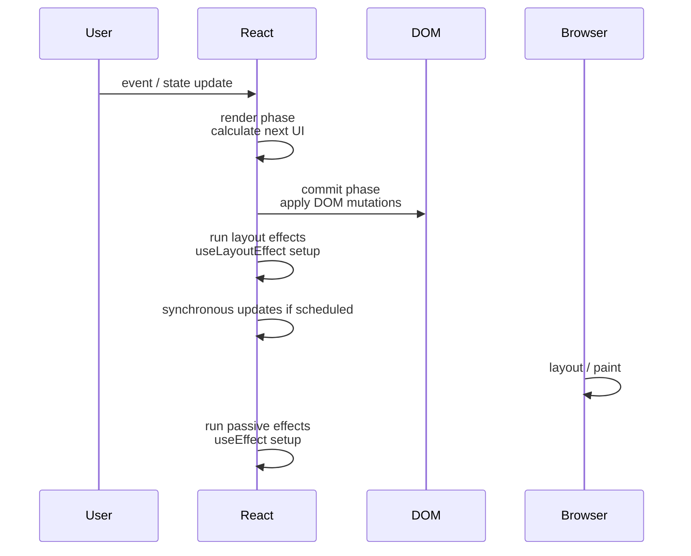
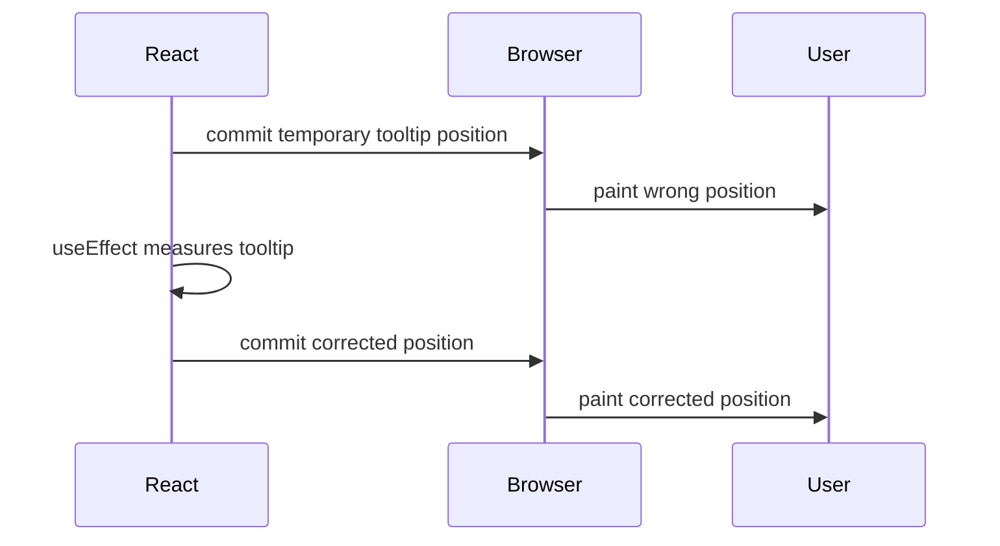
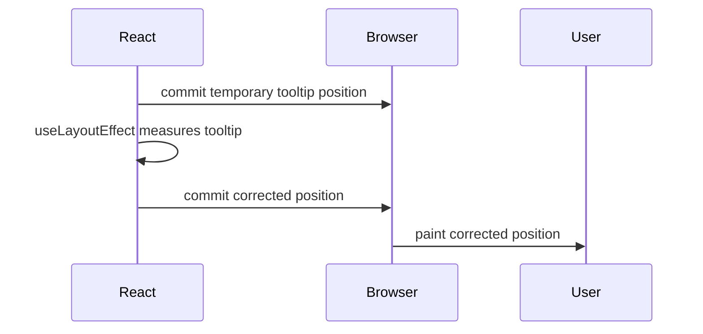
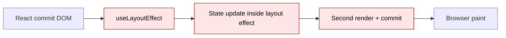

# Part 017 — `useLayoutEffect` and Render-Blocking Work

`useLayoutEffect` adalah salah satu Hook yang terlihat sederhana, tetapi konsekuensinya besar.

Secara API, ia mirip `useEffect`:

```tsx
useLayoutEffect(() => {
  // setup
  return () => {
    // cleanup
  };
}, [dependencies]);
```

Tetapi secara runtime, ia hidup di tempat yang berbeda.

`useEffect` berjalan setelah browser punya kesempatan melakukan paint. `useLayoutEffect` berjalan setelah React melakukan DOM mutation, tetapi sebelum browser repaint. Artinya, kode di dalamnya dapat membaca layout DOM yang sudah final untuk commit tersebut, lalu melakukan update sinkron agar user tidak melihat frame yang salah.

Itu kekuatannya.

Itu juga bahayanya.

> `useLayoutEffect` bukan versi “lebih kuat” dari `useEffect`. Ia adalah escape hatch untuk sinkronisasi layout yang harus selesai sebelum paint.

Kalau salah dipakai, ia membuat UI terasa berat, input lag, scroll jank, dan hydration/client rendering lebih sulit dipahami.

---

## 1. Posisi `useLayoutEffect` di Runtime React

Untuk memahami `useLayoutEffect`, kita harus melihat fase React secara lebih presisi.



Urutan pentingnya:

```txt
render
→ commit DOM mutation
→ useLayoutEffect
→ browser paint
→ useEffect
```

Konsekuensinya:

- `useLayoutEffect` dapat membaca DOM yang sudah diubah React.
- `useLayoutEffect` dapat melakukan update state sebelum user melihat paint.
- Semua kerja di `useLayoutEffect` menunda paint.
- Kerja berat di `useLayoutEffect` langsung terasa sebagai jank.

Inilah mental model yang benar:

```txt
useEffect       = synchronize after paint
useLayoutEffect = synchronize layout before paint
```

---

## 2. Problem yang Diselesaikan `useLayoutEffect`

Bayangkan tooltip.

Tooltip perlu tahu tinggi dirinya sebelum bisa menentukan apakah harus muncul di atas atau di bawah target.

Masalahnya: sebelum tooltip dirender, tinggi tooltip belum bisa diukur.

Maka prosesnya biasanya dua pass:

```txt
Pass 1:
render tooltip with temporary position
commit DOM
measure tooltip height

Pass 2:
render tooltip with correct position
commit DOM
paint correct result
```

Kalau pengukuran dilakukan di `useEffect`, user bisa melihat frame pertama yang salah.



Kalau pengukuran dilakukan di `useLayoutEffect`, koreksi terjadi sebelum paint.



User hanya melihat posisi final.

Itulah alasan `useLayoutEffect` ada.

---

## 3. Definisi Praktis

Gunakan `useLayoutEffect` ketika semua kondisi ini benar:

```txt
1. Kode harus membaca layout DOM setelah React commit.
2. Hasil pembacaan memengaruhi render visual berikutnya.
3. User tidak boleh melihat frame intermediate yang salah.
4. Pekerjaan cukup kecil untuk dijalankan sebelum paint.
```

Kalau salah satu tidak benar, kemungkinan besar `useEffect`, callback ref, CSS, `ResizeObserver`, atau desain state yang berbeda lebih tepat.

---

## 4. `useEffect` vs `useLayoutEffect` vs `useInsertionEffect`

| Hook | Waktu eksekusi | Tujuan utama | Risiko |
|---|---|---|---|
| `useEffect` | Setelah paint | Sinkronisasi external system non-layout | UI mungkin sempat menampilkan frame awal |
| `useLayoutEffect` | Setelah DOM mutation, sebelum paint | Measurement, scroll/focus/layout sync | Menunda paint, bisa jank |
| `useInsertionEffect` | Sebelum layout effect | Inject style untuk CSS-in-JS library | Sangat specialized, jarang untuk app code |

Rule of thumb:

```txt
Default: useEffect
Layout must be corrected before paint: useLayoutEffect
CSS-in-JS library style injection: useInsertionEffect
```

`useInsertionEffect` bukan solusi umum untuk layout bug. Ia ada untuk library yang perlu memasukkan style sebelum layout effect membaca layout.

---

## 5. Contoh Dasar: Measuring Element Sebelum Paint

Misalnya kita ingin membaca ukuran box.

```tsx
import { useLayoutEffect, useRef, useState } from "react";

type Rect = {
  width: number;
  height: number;
};

export function MeasuredBox() {
  const nodeRef = useRef<HTMLDivElement | null>(null);
  const [rect, setRect] = useState<Rect | null>(null);

  useLayoutEffect(() => {
    const node = nodeRef.current;
    if (!node) return;

    const nextRect = node.getBoundingClientRect();

    setRect({
      width: nextRect.width,
      height: nextRect.height,
    });
  }, []);

  return (
    <div ref={nodeRef}>
      <div>Measured content</div>
      {rect && (
        <pre>
          {rect.width} x {rect.height}
        </pre>
      )}
    </div>
  );
}
```

Apa yang terjadi?

```txt
1. Render pertama: rect = null.
2. React commit DOM.
3. useLayoutEffect membaca ukuran DOM.
4. setRect menjadwalkan update sinkron sebelum paint.
5. Render kedua menghasilkan ukuran final.
6. Browser paint.
```

User tidak melihat state visual intermediate jika koreksi visual bergantung pada `rect`.

Tetapi ada cost: render kedua terjadi sebelum paint.

Kalau component tree besar, ini mahal.

---

## 6. Contoh Lebih Realistis: Tooltip Positioning

Tooltip adalah contoh klasik karena ukuran tooltip memengaruhi posisi tooltip.

```tsx
import { useLayoutEffect, useRef, useState } from "react";

type Placement = "top" | "bottom";

type TooltipProps = {
  targetRect: DOMRect;
  children: React.ReactNode;
};

export function Tooltip({ targetRect, children }: TooltipProps) {
  const tooltipRef = useRef<HTMLDivElement | null>(null);
  const [placement, setPlacement] = useState<Placement>("bottom");

  useLayoutEffect(() => {
    const node = tooltipRef.current;
    if (!node) return;

    const tooltipRect = node.getBoundingClientRect();
    const hasEnoughSpaceBelow =
      targetRect.bottom + tooltipRect.height <= window.innerHeight;

    setPlacement(hasEnoughSpaceBelow ? "bottom" : "top");
  }, [targetRect]);

  const top =
    placement === "bottom"
      ? targetRect.bottom + 8
      : targetRect.top - 8;

  const transform =
    placement === "bottom"
      ? "translateY(0)"
      : "translateY(-100%)";

  return (
    <div
      ref={tooltipRef}
      role="tooltip"
      style={{
        position: "fixed",
        left: targetRect.left,
        top,
        transform,
      }}
    >
      {children}
    </div>
  );
}
```

Kode ini memiliki satu masalah kecil: setiap `targetRect` identity berubah, effect akan ulang.

Dalam production, kita biasanya tidak menyimpan raw `DOMRect` yang identity-nya berubah terus. Lebih baik normalisasi menjadi primitive object yang stabil.

```tsx
type AnchorBox = {
  top: number;
  right: number;
  bottom: number;
  left: number;
  width: number;
  height: number;
};
```

Dependency graph menjadi lebih eksplisit.

```tsx
useLayoutEffect(() => {
  // measure and decide placement
}, [anchor.top, anchor.bottom, anchor.left, anchor.width]);
```

Jangan menipu dependency array. Kalau placement bergantung pada ukuran anchor, dependency-nya harus mencerminkan ukuran anchor.

---

## 7. Layout Effect Harus Kecil

Karena `useLayoutEffect` memblokir paint, isi effect harus diperlakukan seperti critical section.

Buruk:

```tsx
useLayoutEffect(() => {
  const node = ref.current;
  if (!node) return;

  const rect = node.getBoundingClientRect();

  expensiveNormalizeData();
  expensiveSortRows();
  expensiveBuildTree();

  setLayout({ width: rect.width });
}, [data]);
```

Lebih baik:

```tsx
const normalizedData = useMemo(() => {
  return normalizeData(data);
}, [data]);

useLayoutEffect(() => {
  const node = ref.current;
  if (!node) return;

  const rect = node.getBoundingClientRect();
  setLayout({ width: rect.width });
}, [normalizedData.length]);
```

Bahkan ini pun harus dipertanyakan. Apakah layout benar-benar bergantung pada `normalizedData.length`, atau cukup memakai CSS?

Prinsipnya:

```txt
useLayoutEffect should measure and minimally correct layout.
It should not become a computation pipeline.
```

---

## 8. Render-Blocking Work

Render-blocking work adalah pekerjaan JavaScript yang mencegah browser melakukan paint.

`useLayoutEffect` berada di jalur ini.



Semakin banyak pekerjaan di B, C, dan D, semakin lama user menunggu frame.

Untuk UI interaktif, ini terasa sebagai:

- typing lag,
- dropdown lambat terbuka,
- scroll tersendat,
- modal muncul terlambat,
- popover berkedip atau telat,
- low-end Android terasa berat.

`useLayoutEffect` harus menjadi exception, bukan default.

---

## 9. Layout Thrashing

Browser menghitung layout ketika kode membaca property layout seperti:

```txt
getBoundingClientRect()
offsetWidth
offsetHeight
clientWidth
clientHeight
scrollWidth
scrollHeight
```

Kalau kita mencampur read/write/read/write, browser bisa dipaksa menghitung layout berulang-ulang.

Buruk:

```tsx
useLayoutEffect(() => {
  const items = Array.from(document.querySelectorAll("[data-row]"));

  for (const item of items) {
    const height = item.getBoundingClientRect().height; // read
    item.setAttribute("data-size", height > 40 ? "large" : "small"); // write
  }
}, []);
```

Lebih baik: batch reads, lalu writes.

```tsx
useLayoutEffect(() => {
  const items = Array.from(document.querySelectorAll<HTMLElement>("[data-row]"));

  const measurements = items.map((item) => ({
    item,
    height: item.getBoundingClientRect().height,
  }));

  for (const { item, height } of measurements) {
    item.dataset.size = height > 40 ? "large" : "small";
  }
}, []);
```

Lebih baik lagi: hindari DOM mutation manual dan simpan result ke state jika itu memengaruhi render React.

Tetapi kalau jumlah item besar, jangan ukur semuanya sebelum paint. Pakai virtualization, CSS, atau observer.

---

## 10. Measurement Tidak Selalu Butuh `useLayoutEffect`

Banyak engineer terlalu cepat memakai `useLayoutEffect` untuk semua measurement.

Pertanyaan yang lebih baik:

```txt
Apakah user akan melihat frame yang salah jika measurement dilakukan setelah paint?
```

Kalau jawabannya tidak, pakai `useEffect` atau `ResizeObserver`.

Contoh: analytics ukuran container.

```tsx
useEffect(() => {
  const node = ref.current;
  if (!node) return;

  const rect = node.getBoundingClientRect();
  reportSize(rect.width, rect.height);
}, []);
```

Ini tidak perlu memblokir paint.

Contoh: responsive layout yang bisa diselesaikan CSS.

```css
.card-grid {
  display: grid;
  grid-template-columns: repeat(auto-fit, minmax(240px, 1fr));
}
```

Tidak perlu JavaScript measurement sama sekali.

Urutan preferensi:

```txt
CSS first
→ normal render calculation
→ useEffect for non-visual sync
→ ResizeObserver for ongoing size observation
→ useLayoutEffect only for before-paint correction
```

---

## 11. Callback Ref vs `useLayoutEffect`

Callback ref berjalan saat node dipasang atau dilepas.

```tsx
function Example() {
  const [height, setHeight] = useState(0);

  const measure = useCallback((node: HTMLDivElement | null) => {
    if (!node) return;
    setHeight(node.getBoundingClientRect().height);
  }, []);

  return <div ref={measure}>Height: {height}</div>;
}
```

Callback ref berguna ketika:

- node bisa berganti,
- kita ingin bereaksi tepat saat node attached,
- component abstraction membuat `ref.current` sulit menjadi dependency,
- kita ingin menghindari effect yang bergantung pada state tertentu.

Tetapi callback ref juga harus hati-hati:

- jika function identity berubah, React bisa detach dan attach ulang ref;
- Strict Mode development dapat menjalankan ref callback ekstra untuk mendeteksi cleanup bug;
- jangan melakukan kerja berat di callback ref.

Untuk measurement yang memengaruhi layout sebelum paint, `useLayoutEffect` masih lebih eksplisit.

Untuk node lifecycle yang berubah dinamis, callback ref sering lebih tepat.

---

## 12. Ongoing Measurement: `ResizeObserver`

`useLayoutEffect` bukan tool terbaik untuk size yang berubah terus.

Contoh: container yang berubah karena sidebar dibuka, font load, user resize window, responsive layout, content async.

Untuk itu, gunakan `ResizeObserver`.

```tsx
import { useLayoutEffect, useRef, useState } from "react";

type Size = {
  width: number;
  height: number;
};

export function useElementSize<T extends HTMLElement>() {
  const ref = useRef<T | null>(null);
  const [size, setSize] = useState<Size | null>(null);

  useLayoutEffect(() => {
    const node = ref.current;
    if (!node) return;

    const update = () => {
      const rect = node.getBoundingClientRect();
      setSize({ width: rect.width, height: rect.height });
    };

    update();

    const observer = new ResizeObserver(() => {
      update();
    });

    observer.observe(node);

    return () => {
      observer.disconnect();
    };
  }, []);

  return { ref, size };
}
```

Catatan penting:

- Initial measurement di `useLayoutEffect` menghindari first-paint mismatch.
- Ongoing measurement dilakukan observer.
- Cleanup wajib disconnect observer.
- Untuk update sangat sering, pertimbangkan throttling atau `requestAnimationFrame`.

Versi yang lebih aman terhadap update berlebihan:

```tsx
function useRafElementSize<T extends HTMLElement>() {
  const ref = useRef<T | null>(null);
  const frameRef = useRef<number | null>(null);
  const [size, setSize] = useState<Size | null>(null);

  useLayoutEffect(() => {
    const node = ref.current;
    if (!node) return;

    const measure = () => {
      const rect = node.getBoundingClientRect();
      setSize({ width: rect.width, height: rect.height });
    };

    const scheduleMeasure = () => {
      if (frameRef.current !== null) return;

      frameRef.current = window.requestAnimationFrame(() => {
        frameRef.current = null;
        measure();
      });
    };

    measure();

    const observer = new ResizeObserver(scheduleMeasure);
    observer.observe(node);

    return () => {
      observer.disconnect();

      if (frameRef.current !== null) {
        window.cancelAnimationFrame(frameRef.current);
      }
    };
  }, []);

  return { ref, size };
}
```

---

## 13. Scroll Restoration

Scroll behavior sering membutuhkan timing sebelum paint.

Contoh: chat thread setelah pesan baru masuk.

Naif:

```tsx
useEffect(() => {
  listRef.current?.scrollTo({ top: listRef.current.scrollHeight });
}, [messages.length]);
```

User mungkin melihat scroll position lama sebentar.

Jika scroll position harus dikoreksi sebelum paint:

```tsx
useLayoutEffect(() => {
  const list = listRef.current;
  if (!list) return;

  list.scrollTop = list.scrollHeight;
}, [messages.length]);
```

Tetapi ini tidak selalu benar.

Untuk chat, invariant-nya biasanya bukan “selalu scroll ke bawah”. Lebih tepat:

```txt
If user was already near bottom, keep pinned to bottom.
If user scrolled up reading older messages, preserve current position.
```

Implementasi lebih production-grade:

```tsx
type Message = {
  id: string;
  text: string;
};

function ChatList({ messages }: { messages: Message[] }) {
  const listRef = useRef<HTMLDivElement | null>(null);
  const wasPinnedRef = useRef(true);

  function handleScroll() {
    const list = listRef.current;
    if (!list) return;

    const distanceFromBottom =
      list.scrollHeight - list.scrollTop - list.clientHeight;

    wasPinnedRef.current = distanceFromBottom < 32;
  }

  useLayoutEffect(() => {
    const list = listRef.current;
    if (!list) return;

    if (wasPinnedRef.current) {
      list.scrollTop = list.scrollHeight;
    }
  }, [messages.length]);

  return (
    <div ref={listRef} onScroll={handleScroll} style={{ overflow: "auto" }}>
      {messages.map((message) => (
        <div key={message.id}>{message.text}</div>
      ))}
    </div>
  );
}
```

Perhatikan separation:

- `wasPinnedRef` menyimpan mutable fact yang tidak perlu render.
- `useLayoutEffect` melakukan correction sebelum paint.
- State React tidak dipakai untuk scroll position high-frequency.

Ini lebih stabil.

---

## 14. Focus dan Selection

Focus adalah area abu-abu.

Kadang `useEffect` cukup:

```tsx
useEffect(() => {
  inputRef.current?.focus();
}, []);
```

Tetapi untuk UI tertentu, focus harus terjadi sebelum paint agar tidak ada flash atau agar keyboard/focus ring tidak terlihat berpindah setelah frame pertama.

Contoh: dialog yang harus langsung memindahkan focus ke field pertama.

```tsx
useLayoutEffect(() => {
  firstFieldRef.current?.focus();
}, []);
```

Namun jangan jadikan ini default buta.

Pertimbangan production:

- Apakah focus change visible?
- Apakah accessibility membutuhkan focus segera?
- Apakah browser/assistive tech behavior stabil?
- Apakah component bisa server-rendered?
- Apakah ada library focus trap yang lebih tepat?

Untuk modal kompleks, sering lebih baik memakai focus management utility yang teruji daripada menulis semua sendiri.

---

## 15. Strict Mode dan Symmetric Cleanup

Dalam development dengan Strict Mode, React dapat menjalankan setup dan cleanup effect ekstra untuk menemukan bug cleanup.

Ini berarti `useLayoutEffect` harus simetris.

Buruk:

```tsx
useLayoutEffect(() => {
  window.addEventListener("resize", handleResize);
}, []);
```

Tidak ada cleanup.

Benar:

```tsx
useLayoutEffect(() => {
  window.addEventListener("resize", handleResize);

  return () => {
    window.removeEventListener("resize", handleResize);
  };
}, [handleResize]);
```

Tetapi `handleResize` harus stabil atau didefinisikan di dalam effect.

```tsx
useLayoutEffect(() => {
  function handleResize() {
    // measure and update
  }

  window.addEventListener("resize", handleResize);
  handleResize();

  return () => {
    window.removeEventListener("resize", handleResize);
  };
}, []);
```

Prinsipnya:

```txt
The user should not be able to distinguish:
setup once
from
setup → cleanup → setup
```

Kalau bisa dibedakan, cleanup belum benar.

---

## 16. Server Rendering Caveat

`useLayoutEffect` bergantung pada DOM.

Di server tidak ada layout.

Artinya:

```txt
useLayoutEffect does not run on the server.
```

Kalau UI server-rendered bergantung pada layout measurement untuk render final, server tidak bisa menghasilkan markup final itu.

Ada beberapa strategi:

### Strategy A — Degrade to CSS

Solusi terbaik: jangan butuh measurement.

Gunakan CSS layout, container queries, flex/grid, `position`, `max-height`, `overflow`, dan lain-lain.

### Strategy B — Render Stable Placeholder

Render placeholder yang tidak menyebabkan layout shift besar, lalu ukur di client.

```tsx
function ClientMeasuredPanel() {
  const ref = useRef<HTMLDivElement | null>(null);
  const [height, setHeight] = useState<number | null>(null);

  useLayoutEffect(() => {
    const node = ref.current;
    if (!node) return;

    setHeight(node.getBoundingClientRect().height);
  }, []);

  return (
    <div ref={ref} style={{ minHeight: height ?? 120 }}>
      Content
    </div>
  );
}
```

### Strategy C — Client-Only Boundary

Untuk component yang memang tidak bermakna di server, render setelah mounted.

```tsx
function ClientOnly({ children }: { children: React.ReactNode }) {
  const [mounted, setMounted] = useState(false);

  useEffect(() => {
    setMounted(true);
  }, []);

  if (!mounted) return null;

  return <>{children}</>;
}
```

Pakai ini dengan hati-hati karena menghilangkan manfaat SSR untuk subtree tersebut.

### Strategy D — Isomorphic Layout Effect untuk Library

Beberapa library memakai pola:

```tsx
const useIsomorphicLayoutEffect =
  typeof window === "undefined" ? useEffect : useLayoutEffect;
```

Ini berguna untuk library yang harus berjalan di SSR tanpa warning, tetapi bukan alasan untuk menyembunyikan masalah arsitektur. Kalau layout final benar-benar butuh DOM, server tetap tidak bisa mengetahuinya.

---

## 17. Dependency Array Tetap Kontrak Reaktivitas

`useLayoutEffect` mengikuti aturan dependency yang sama seperti `useEffect`.

Buruk:

```tsx
useLayoutEffect(() => {
  const rect = anchorRef.current?.getBoundingClientRect();
  if (!rect) return;

  setPosition(computePosition(rect, placement));
}, []); // placement disembunyikan
```

Ini stale closure.

Benar:

```tsx
useLayoutEffect(() => {
  const rect = anchorRef.current?.getBoundingClientRect();
  if (!rect) return;

  setPosition(computePosition(rect, placement));
}, [placement]);
```

Kalau dependency membuat effect terlalu sering jalan, jangan hapus dependency secara paksa. Ubah desain:

- pindahkan non-reactive value ke ref,
- memoize input yang memang harus stabil,
- pecah effect,
- pindahkan logic ke event handler,
- ubah state topology,
- gunakan observer.

Dependency array bukan performance knob utama. Ia adalah correctness contract.

---

## 18. Infinite Loop di Layout Effect

Karena update dari layout effect bisa terjadi sebelum paint, infinite loop di sini sangat buruk.

Buruk:

```tsx
useLayoutEffect(() => {
  const rect = ref.current!.getBoundingClientRect();
  setRect(rect);
});
```

Tanpa dependency, effect jalan setiap render. `setRect` membuat object baru. Render ulang. Effect ulang. Loop.

Lebih baik:

```tsx
useLayoutEffect(() => {
  const node = ref.current;
  if (!node) return;

  const next = node.getBoundingClientRect();

  setRect((previous) => {
    if (
      previous &&
      previous.width === next.width &&
      previous.height === next.height
    ) {
      return previous;
    }

    return {
      width: next.width,
      height: next.height,
    };
  });
}, [contentVersion]);
```

Gunakan equality guard ketika measurement menghasilkan object baru.

---

## 19. Custom Hook: `useBeforePaintMeasure`

Kita bisa membuat hook eksplisit untuk measurement sebelum paint.

```tsx
import { useLayoutEffect, useRef, useState } from "react";

type Measurement = {
  width: number;
  height: number;
};

type MeasureOptions = {
  enabled?: boolean;
};

export function useBeforePaintMeasure<T extends HTMLElement>(
  deps: React.DependencyList,
  options: MeasureOptions = {},
) {
  const { enabled = true } = options;
  const ref = useRef<T | null>(null);
  const [measurement, setMeasurement] = useState<Measurement | null>(null);

  useLayoutEffect(() => {
    if (!enabled) return;

    const node = ref.current;
    if (!node) return;

    const rect = node.getBoundingClientRect();
    const next = {
      width: rect.width,
      height: rect.height,
    };

    setMeasurement((previous) => {
      if (
        previous &&
        previous.width === next.width &&
        previous.height === next.height
      ) {
        return previous;
      }

      return next;
    });
    // eslint-disable-next-line react-hooks/exhaustive-deps
  }, [enabled, ...deps]);

  return { ref, measurement };
}
```

Catatan: spreading deps seperti ini sering tidak disukai lint rule dan bisa membuat API hook kurang jelas. Dalam library, Anda bisa mendesain API yang lebih eksplisit.

Versi yang lebih explicit:

```tsx
export function useMeasuredElement<T extends HTMLElement>(key: string | number) {
  const ref = useRef<T | null>(null);
  const [measurement, setMeasurement] = useState<Measurement | null>(null);

  useLayoutEffect(() => {
    const node = ref.current;
    if (!node) return;

    const rect = node.getBoundingClientRect();

    setMeasurement((previous) => {
      const next = { width: rect.width, height: rect.height };

      if (
        previous &&
        previous.width === next.width &&
        previous.height === next.height
      ) {
        return previous;
      }

      return next;
    });
  }, [key]);

  return { ref, measurement };
}
```

Hook ini memaksa caller menyatakan kapan measurement perlu diulang.

---

## 20. Custom Hook: Stable Scroll Pinning

Contoh production yang lebih lengkap:

```tsx
import { useLayoutEffect, useRef } from "react";

type ScrollPinOptions = {
  itemCount: number;
  threshold?: number;
};

export function useScrollPinning({
  itemCount,
  threshold = 32,
}: ScrollPinOptions) {
  const containerRef = useRef<HTMLDivElement | null>(null);
  const pinnedRef = useRef(true);

  function updatePinnedState() {
    const container = containerRef.current;
    if (!container) return;

    const distanceFromBottom =
      container.scrollHeight - container.scrollTop - container.clientHeight;

    pinnedRef.current = distanceFromBottom <= threshold;
  }

  useLayoutEffect(() => {
    const container = containerRef.current;
    if (!container) return;

    if (pinnedRef.current) {
      container.scrollTop = container.scrollHeight;
    }
  }, [itemCount]);

  return {
    containerRef,
    onScroll: updatePinnedState,
    isPinnedRef: pinnedRef,
  };
}
```

Usage:

```tsx
function MessageList({ messages }: { messages: Message[] }) {
  const { containerRef, onScroll } = useScrollPinning({
    itemCount: messages.length,
  });

  return (
    <div ref={containerRef} onScroll={onScroll}>
      {messages.map((message) => (
        <article key={message.id}>{message.text}</article>
      ))}
    </div>
  );
}
```

Ini lebih baik daripada menyimpan `scrollTop` di React state.

Scroll position high-frequency adalah mutable UI fact, bukan render state utama.

---

## 21. Integrasi dengan Library Imperatif

Kadang kita harus integrate dengan library non-React yang butuh DOM final sebelum initialize.

Contoh abstrak:

```tsx
function Chart({ data }: { data: ChartData }) {
  const containerRef = useRef<HTMLDivElement | null>(null);
  const chartRef = useRef<ChartInstance | null>(null);

  useLayoutEffect(() => {
    const container = containerRef.current;
    if (!container) return;

    chartRef.current = createChart(container);

    return () => {
      chartRef.current?.destroy();
      chartRef.current = null;
    };
  }, []);

  useEffect(() => {
    chartRef.current?.setData(data);
  }, [data]);

  return <div ref={containerRef} />;
}
```

Mengapa init di `useLayoutEffect`, data update di `useEffect`?

Karena:

- chart instance mungkin butuh DOM size sebelum paint;
- data update tidak selalu harus block paint;
- lifecycle instance dan data synchronization adalah dua concerns berbeda.

Tetapi ini bukan aturan mutlak. Jika library menggambar canvas dan user harus melihat frame pertama yang benar, update data awal mungkin juga perlu terjadi sebelum paint. Ukur berdasarkan visual invariant.

---

## 22. Jangan Membaca Layout Saat Render

Buruk:

```tsx
function BadComponent() {
  const width = document.body.getBoundingClientRect().width;

  return <div>{width}</div>;
}
```

Masalah:

- render tidak lagi pure;
- server tidak punya `document`;
- concurrent rendering bisa menjadi tidak deterministik;
- test sulit;
- browser layout bisa dipaksa saat render;
- output tergantung external mutable state.

Benar:

```tsx
function GoodComponent() {
  const [width, setWidth] = useState<number | null>(null);

  useLayoutEffect(() => {
    setWidth(document.body.getBoundingClientRect().width);
  }, []);

  return <div>{width ?? "measuring"}</div>;
}
```

Lebih baik lagi, jika hanya responsive rendering:

```css
@media (min-width: 768px) {
  .panel {
    display: grid;
  }
}
```

---

## 23. `useLayoutEffect` dan Concurrent Rendering

React dapat melakukan render yang tidak selalu langsung commit. Tetapi effect, termasuk layout effect, hanya berjalan setelah commit.

Ini penting:

```txt
Render phase may be interrupted.
Commit phase is where DOM changes become real.
Layout effect runs only after committed DOM exists.
```

Maka layout effect adalah tempat aman untuk membaca DOM hasil commit.

Namun, jangan menganggap layout effect sebagai lifecycle global. Component bisa mount/unmount ulang, Strict Mode bisa menjalankan ekstra, dan future rendering optimizations tetap mengandalkan purity.

---

## 24. Decision Matrix

| Masalah | Solusi default | Gunakan `useLayoutEffect` jika |
|---|---|---|
| Fetch data | Server state library / framework loader / `useEffect` | Hampir tidak pernah |
| Subscribe external system | `useEffect` | Subscription memengaruhi layout sebelum paint, jarang |
| Measure element untuk analytics | `useEffect` | Tidak perlu |
| Measure tooltip/popover position | CSS/positioning library | Harus koreksi sebelum paint |
| Scroll correction | Browser/default/CSS | Frame pertama tidak boleh salah |
| Focus input | `useEffect` / event handler | Focus harus benar sebelum paint |
| Inject styles | CSS build / stylesheet | Gunakan `useInsertionEffect` untuk CSS-in-JS library |
| Integrasi chart/canvas | `useEffect` | Init harus membaca layout sebelum paint |
| Responsive layout | CSS | JavaScript measurement benar-benar dibutuhkan |
| Large list sizing | virtualization / observer | Initial measurement kecil dan critical |

---

## 25. Common Anti-Patterns

### Anti-Pattern 1 — Replacing Every `useEffect` with `useLayoutEffect`

Ini sering dilakukan untuk “menghilangkan flicker”.

Masalahnya flicker biasanya gejala desain state/layout yang salah.

Perbaiki root cause:

- pakai CSS,
- render placeholder stabil,
- hindari duplicated state,
- pakai key reset,
- co-locate state,
- ukur hanya bagian kecil.

### Anti-Pattern 2 — Data Fetching in `useLayoutEffect`

Buruk:

```tsx
useLayoutEffect(() => {
  fetch("/api/items").then(...);
}, []);
```

Network tidak bisa selesai sebelum paint. Ini hanya membuat intent salah dan memperumit SSR.

Pakai server state strategy.

### Anti-Pattern 3 — Expensive Computation in Layout Effect

Jika computation tidak membutuhkan DOM, jangan taruh di layout effect.

### Anti-Pattern 4 — Manual DOM Mutation Competing with React

Buruk:

```tsx
useLayoutEffect(() => {
  ref.current!.innerHTML = "patched";
}, []);
```

Kalau React juga mengelola subtree itu, Anda membuat dua owner.

Gunakan state/props atau isolasi DOM subtree untuk library imperatif.

### Anti-Pattern 5 — Measurement as Permanent Source of Truth

Measurement adalah observation, bukan domain state.

Jangan membuat model bisnis bergantung pada pixel kalau sebenarnya bisa ditentukan dari data.

---

## 26. Failure Modes

| Failure mode | Gejala | Penyebab | Pencegahan |
|---|---|---|---|
| Paint jank | UI terasa lambat muncul | Work berat sebelum paint | Kecilkan layout effect, pindahkan computation |
| Infinite layout loop | Browser hang / terlalu banyak render | Measurement object baru memicu setState terus | Equality guard, dependency benar |
| Stale measurement | Posisi salah setelah prop berubah | Dependency tidak lengkap | Ikuti exhaustive deps |
| Flicker tetap muncul | Frame salah masih terlihat | Measurement terlambat atau CSS async | Pastikan correction sebelum paint, stabilkan placeholder |
| SSR mismatch | Server/client visual berbeda | Layout bergantung pada DOM-only measurement | CSS-first, client boundary, placeholder |
| Layout thrashing | Scroll/input jank | Read/write layout bergantian | Batch read/write, observer, CSS |
| Strict Mode duplicate side effect | Listener dobel, observer dobel | Cleanup tidak simetris | Cleanup lengkap |
| Hidden element measured zero | Width/height 0 | Element `display: none` atau belum visible | Ukur saat visible, pakai observer |
| Font/image changes layout later | Posisi berubah setelah paint | Asset load mengubah layout | ResizeObserver, font loading strategy |
| Overcoupled UI | Component sulit dipindah | Layout effect membaca global DOM | Gunakan refs dan boundary eksplisit |

---

## 27. Production Checklist

Sebelum memakai `useLayoutEffect`, jawab ini:

```txt
[ ] Apakah ini benar-benar masalah visual before-paint?
[ ] Apakah CSS bisa menyelesaikan tanpa JavaScript?
[ ] Apakah useEffect cukup?
[ ] Apakah measurement hanya membaca node milik component ini?
[ ] Apakah work di dalam effect kecil?
[ ] Apakah dependency array lengkap?
[ ] Apakah cleanup simetris?
[ ] Apakah ada equality guard sebelum setState?
[ ] Apakah ini aman untuk Strict Mode?
[ ] Apakah SSR/client rendering dipikirkan?
[ ] Apakah ongoing measurement lebih cocok memakai ResizeObserver?
[ ] Apakah high-frequency mutable value disimpan di ref, bukan state?
```

Kalau banyak jawaban “tidak”, jangan pakai `useLayoutEffect` dulu.

---

## 28. Mental Model Akhir

`useLayoutEffect` adalah alat untuk mengoreksi dunia visual sebelum user melihatnya.

Bukan tempat:

- mengambil data,
- menghitung business logic,
- menyimpan duplicated state,
- memperbaiki dependency yang buruk,
- menggantikan lifecycle lama,
- memaksa semua effect jadi sinkron.

Gunakan seperti operasi bedah kecil.

```txt
Commit has happened.
DOM is real.
Paint has not happened.
You have a tiny window to measure and correct layout.
Do the minimum.
Then get out.
```

Jika Anda menguasai kapan harus memakai `useLayoutEffect`, Anda juga menguasai kapan harus menghindarinya. Itu yang membedakan React code yang terasa “benar” dari React code yang hanya “jalan”.

---

## 29. Latihan Implementasi

### Latihan 1 — Tooltip Without Flicker

Buat tooltip yang:

- mengukur tinggi tooltip sebelum paint,
- memilih `top` atau `bottom`,
- tidak infinite loop,
- tidak menyimpan raw `DOMRect` sebagai state,
- memakai dependency eksplisit.

### Latihan 2 — Chat Scroll Pinning

Buat chat list yang:

- auto-scroll hanya jika user sudah near bottom,
- tidak menyimpan `scrollTop` di state,
- memperbaiki scroll sebelum paint saat message baru masuk,
- tetap aman saat Strict Mode.

### Latihan 3 — Replace Layout Effect with CSS

Ambil satu component yang memakai `useLayoutEffect` untuk responsive layout. Refactor memakai CSS grid/flex/container query. Tuliskan alasan kenapa JS measurement tidak perlu.

### Latihan 4 — Detect Layout Thrashing

Buat list 1000 item dan ukur semuanya di `useLayoutEffect`. Profile. Lalu ubah menjadi batch read/write atau virtualization. Bandingkan hasilnya.

---

## 30. Referensi

- React Docs — `useLayoutEffect`
- React Docs — `useEffect`
- React Docs — `useInsertionEffect`
- React Docs — Manipulating the DOM with refs
- React Docs — Strict Mode
- MDN — `ResizeObserver`
- MDN — `getBoundingClientRect`
