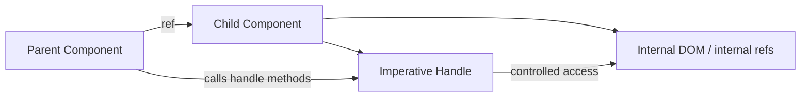

# Part 018 — Imperative Handles and Forwarded Interfaces

React mendorong data flow deklaratif:

```txt
state → render → UI
```

Tetapi UI nyata tidak selalu murni deklaratif.

Ada hal yang secara alami imperative:

- focus input,
- scroll element,
- select text,
- open native dialog,
- measure DOM,
- control media playback,
- integrate canvas/chart/map/editor,
- expose command kecil dari child component ke parent.

Untuk kasus seperti itu, React menyediakan `ref` dan `useImperativeHandle`.

`useImperativeHandle` memungkinkan component mengontrol apa yang diekspos ke parent melalui ref.

Bukan seluruh DOM node.

Bukan seluruh internal state.

Hanya handle yang sengaja dipublikasikan.

> `useImperativeHandle` adalah alat untuk membuat imperative API yang kecil, eksplisit, dan terkendali di atas component yang tetap deklaratif.

---

## 1. Problem: Parent Butuh Melakukan Command ke Child

Misalnya parent punya form dan ingin melakukan focus ke field tertentu ketika validasi gagal.

Cara deklaratif murni:

```tsx
<EmailField autoFocus={hasEmailError} />
```

Ini kadang cukup, tetapi tidak selalu tepat.

Masalahnya:

- focus adalah command, bukan state domain;
- `autoFocus` sebagai boolean bisa ambigu karena `true` terus tidak berarti “focus ulang sekarang”;
- parent mungkin butuh memanggil `focus()` pada event tertentu;
- field internal mungkin bukan satu DOM node sederhana;
- field mungkin punya wrapper, clear button, hidden input, masked input, atau editor instance.

Kita butuh public imperative interface:

```tsx
emailFieldRef.current?.focus();
emailFieldRef.current?.select();
emailFieldRef.current?.clear();
```

Tetapi kita tidak ingin parent mengetahui struktur internal `EmailField`.

Inilah tempat `useImperativeHandle` berguna.

---

## 2. Mental Model



Parent tidak mendapat akses bebas ke semua internal child.

Child membuat interface kecil:

```txt
focus()
select()
scrollIntoView()
resetDraft()
open()
close()
```

Interface ini seperti public method di object-oriented programming, tetapi harus dipakai hemat.

---

## 3. React 19: `ref` sebagai Prop

Dalam React 19, `ref` dapat diterima sebagai prop oleh function component. Pola ini mengurangi kebutuhan `forwardRef` untuk component baru.

Contoh React 19 style:

```tsx
import { useImperativeHandle, useRef } from "react";

type TextInputHandle = {
  focus(): void;
  select(): void;
};

type TextInputProps = {
  label: string;
  ref?: React.Ref<TextInputHandle>;
};

export function TextInput({ label, ref }: TextInputProps) {
  const inputRef = useRef<HTMLInputElement | null>(null);

  useImperativeHandle(ref, () => ({
    focus() {
      inputRef.current?.focus();
    },
    select() {
      inputRef.current?.select();
    },
  }), []);

  return (
    <label>
      {label}
      <input ref={inputRef} />
    </label>
  );
}
```

Usage:

```tsx
function Form() {
  const emailRef = useRef<TextInputHandle | null>(null);

  function handleInvalidEmail() {
    emailRef.current?.focus();
  }

  return (
    <>
      <TextInput ref={emailRef} label="Email" />
      <button onClick={handleInvalidEmail}>Focus email</button>
    </>
  );
}
```

Untuk codebase yang masih memakai React 18 atau library yang perlu kompatibilitas lama, gunakan `forwardRef`.

```tsx
import { forwardRef, useImperativeHandle, useRef } from "react";

type TextInputHandle = {
  focus(): void;
  select(): void;
};

type TextInputProps = {
  label: string;
};

export const TextInput = forwardRef<TextInputHandle, TextInputProps>(
  function TextInput({ label }, ref) {
    const inputRef = useRef<HTMLInputElement | null>(null);

    useImperativeHandle(ref, () => ({
      focus() {
        inputRef.current?.focus();
      },
      select() {
        inputRef.current?.select();
      },
    }), []);

    return (
      <label>
        {label}
        <input ref={inputRef} />
      </label>
    );
  },
);
```

Penting: `forwardRef` masih akan banyak ditemui di ecosystem. Tetapi untuk desain baru di React 19+, `ref` sebagai prop adalah arah modern.

---

## 4. Apa yang Dilakukan `useImperativeHandle`

Signature:

```tsx
useImperativeHandle(ref, createHandle, dependencies?)
```

Konsepnya:

```txt
ref dari parent
→ child menerima ref
→ child membuat handle object
→ React menaruh handle object ke parentRef.current
```

Contoh:

```tsx
useImperativeHandle(ref, () => ({
  focus() {
    inputRef.current?.focus();
  },
}), []);
```

Parent melihat:

```tsx
inputRef.current?.focus();
```

Bukan:

```tsx
inputRef.current?.querySelector("input")?.focus();
```

Ini perbedaan besar.

Dengan handle, child tetap bisa mengubah struktur internal tanpa merusak parent.

---

## 5. Ref Bukan State

Ref adalah mutable container.

Perubahan `ref.current` tidak menyebabkan render.

```tsx
const ref = useRef<HTMLInputElement | null>(null);
```

Artinya imperative handle tidak cocok untuk data yang harus memengaruhi render.

Buruk:

```tsx
cartRef.current?.addItem(product);
```

Kalau add item harus mengubah UI, itu state/domain command, bukan imperative child handle.

Lebih baik:

```tsx
onAddItem(product);
```

Gunakan imperative handle untuk command yang memang berkaitan dengan instance UI, DOM, atau resource imperatif.

---

## 6. Declarative vs Imperative Boundary

Pertanyaan utama:

```txt
Apakah parent sedang menyatakan desired UI state,
atau sedang memberi command kepada instance UI?
```

Declarative:

```tsx
<Dialog open={isOpen} onOpenChange={setIsOpen} />
```

Imperative:

```tsx
dialogRef.current?.focusFirstField();
```

Yang pertama adalah state.
Yang kedua adalah command.

Jangan mencampurnya sembarangan.

Buruk:

```tsx
dialogRef.current?.open();
```

Jika dialog open/closed adalah bagian dari application state, lebih baik:

```tsx
setDialogOpen(true);
```

Tetapi command seperti ini bisa valid:

```tsx
dialogRef.current?.focusFirstField();
dialogRef.current?.shakeInvalidFields();
dialogRef.current?.scrollToError();
```

Karena itu bukan source of truth utama dialog open state.

---

## 7. Design Rule: Expose Capability, Not Implementation

Buruk:

```tsx
type BadInputHandle = {
  inputElement: HTMLInputElement | null;
  wrapperElement: HTMLDivElement | null;
  internalState: unknown;
};
```

Ini membocorkan implementation detail.

Lebih baik:

```tsx
type TextInputHandle = {
  focus(): void;
  select(): void;
  getValue(): string;
};
```

Bahkan `getValue()` pun harus dipertanyakan. Jika value memengaruhi application logic, lebih baik controlled value lewat props.

Pola yang lebih aman:

```tsx
type TextInputHandle = {
  focus(): void;
  select(): void;
  clearVisualSelection(): void;
};
```

Expose behavior, bukan DOM structure.

---

## 8. Use Case 1 — Focusable Field

```tsx
import { useImperativeHandle, useId, useRef } from "react";

type FieldHandle = {
  focus(): void;
  select(): void;
};

type FieldProps = {
  label: string;
  value: string;
  onChange(value: string): void;
  error?: string;
  ref?: React.Ref<FieldHandle>;
};

export function Field({
  label,
  value,
  onChange,
  error,
  ref,
}: FieldProps) {
  const id = useId();
  const inputRef = useRef<HTMLInputElement | null>(null);

  useImperativeHandle(ref, () => ({
    focus() {
      inputRef.current?.focus();
    },
    select() {
      inputRef.current?.select();
    },
  }), []);

  return (
    <div>
      <label htmlFor={id}>{label}</label>
      <input
        id={id}
        ref={inputRef}
        value={value}
        aria-invalid={Boolean(error)}
        aria-describedby={error ? `${id}-error` : undefined}
        onChange={(event) => onChange(event.target.value)}
      />
      {error && <p id={`${id}-error`}>{error}</p>}
    </div>
  );
}
```

Parent:

```tsx
function ProfileForm() {
  const emailRef = useRef<FieldHandle | null>(null);
  const [email, setEmail] = useState("");
  const [error, setError] = useState<string | undefined>();

  function submit() {
    if (!email.includes("@")) {
      setError("Email is invalid");
      emailRef.current?.focus();
      return;
    }

    setError(undefined);
  }

  return (
    <form onSubmit={(event) => { event.preventDefault(); submit(); }}>
      <Field
        ref={emailRef}
        label="Email"
        value={email}
        error={error}
        onChange={setEmail}
      />
      <button type="submit">Save</button>
    </form>
  );
}
```

Yang penting:

- value tetap declarative;
- focus command imperative;
- parent tidak tahu apakah field memakai `<input>`, masked input, atau contenteditable;
- public API kecil.

---

## 9. Use Case 2 — Scrollable Panel

```tsx
type ScrollPanelHandle = {
  scrollToTop(): void;
  scrollToBottom(): void;
  scrollToItem(id: string): void;
};

type Item = {
  id: string;
  label: string;
};

type ScrollPanelProps = {
  items: Item[];
  ref?: React.Ref<ScrollPanelHandle>;
};

export function ScrollPanel({ items, ref }: ScrollPanelProps) {
  const containerRef = useRef<HTMLDivElement | null>(null);
  const itemRefs = useRef(new Map<string, HTMLDivElement>());

  useImperativeHandle(ref, () => ({
    scrollToTop() {
      containerRef.current?.scrollTo({ top: 0, behavior: "smooth" });
    },
    scrollToBottom() {
      const container = containerRef.current;
      if (!container) return;

      container.scrollTo({
        top: container.scrollHeight,
        behavior: "smooth",
      });
    },
    scrollToItem(id: string) {
      itemRefs.current.get(id)?.scrollIntoView({
        block: "nearest",
        behavior: "smooth",
      });
    },
  }), []);

  return (
    <div ref={containerRef} style={{ overflow: "auto", maxHeight: 320 }}>
      {items.map((item) => (
        <div
          key={item.id}
          ref={(node) => {
            if (node) {
              itemRefs.current.set(item.id, node);
            } else {
              itemRefs.current.delete(item.id);
            }
          }}
        >
          {item.label}
        </div>
      ))}
    </div>
  );
}
```

Mengapa handle bagus di sini?

Karena parent butuh command:

```tsx
panelRef.current?.scrollToItem(selectedId);
```

Parent tidak perlu tahu:

- container DOM structure,
- apakah item div atau button,
- bagaimana map ref disimpan,
- apakah scrolling smooth atau instant.

---

## 10. Use Case 3 — Modal/Dialog Handle

Dialog sering punya dua jenis API:

1. Declarative open state.
2. Imperative focus/scroll/animation command.

```tsx
type DialogHandle = {
  focusFirstField(): void;
  scrollToTop(): void;
};

type DialogProps = {
  open: boolean;
  onOpenChange(open: boolean): void;
  children: React.ReactNode;
  ref?: React.Ref<DialogHandle>;
};

export function Dialog({ open, onOpenChange, children, ref }: DialogProps) {
  const panelRef = useRef<HTMLDivElement | null>(null);

  useImperativeHandle(ref, () => ({
    focusFirstField() {
      const firstFocusable = panelRef.current?.querySelector<HTMLElement>(
        "button, [href], input, select, textarea, [tabindex]:not([tabindex='-1'])",
      );

      firstFocusable?.focus();
    },
    scrollToTop() {
      panelRef.current?.scrollTo({ top: 0 });
    },
  }), []);

  if (!open) return null;

  return (
    <div role="dialog" aria-modal="true">
      <div ref={panelRef}>{children}</div>
      <button onClick={() => onOpenChange(false)}>Close</button>
    </div>
  );
}
```

Perhatikan desainnya:

```txt
open/closed = declarative state
focus/scroll = imperative command
```

Jangan expose `open()` dan `close()` kecuali component memang intentionally uncontrolled dan application tidak perlu source of truth external.

---

## 11. Use Case 4 — Rich Text Editor Wrapper

Rich text editor sering punya instance imperative.

```tsx
type EditorHandle = {
  focus(): void;
  insertText(text: string): void;
  getSelection(): EditorSelection | null;
};

type EditorProps = {
  initialValue: string;
  onChange(value: string): void;
  ref?: React.Ref<EditorHandle>;
};

export function RichTextEditor({ initialValue, onChange, ref }: EditorProps) {
  const rootRef = useRef<HTMLDivElement | null>(null);
  const editorRef = useRef<EditorInstance | null>(null);

  useLayoutEffect(() => {
    const root = rootRef.current;
    if (!root) return;

    const editor = createEditor(root, {
      initialValue,
      onChange,
    });

    editorRef.current = editor;

    return () => {
      editor.destroy();
      editorRef.current = null;
    };
  }, []);

  useImperativeHandle(ref, () => ({
    focus() {
      editorRef.current?.focus();
    },
    insertText(text: string) {
      editorRef.current?.insertText(text);
    },
    getSelection() {
      return editorRef.current?.getSelection() ?? null;
    },
  }), []);

  return <div ref={rootRef} />;
}
```

Di sini imperative handle masuk akal karena editor sendiri adalah object imperative.

Tetapi tetap batasi public API.

Jangan expose `editorRef.current` mentah kecuali Anda sengaja membuat low-level adapter.

---

## 12. Dependency Array pada `useImperativeHandle`

`useImperativeHandle` juga punya dependency array.

Buruk:

```tsx
useImperativeHandle(ref, () => ({
  validate() {
    return value.length > 0;
  },
}), []); // value stale
```

`validate()` akan membaca `value` dari render pertama.

Benar:

```tsx
useImperativeHandle(ref, () => ({
  validate() {
    return value.length > 0;
  },
}), [value]);
```

Tetapi ini membuat handle object berubah ketika `value` berubah.

Apakah itu masalah? Biasanya tidak, karena parent memanggil via `ref.current` saat dibutuhkan.

Namun untuk method yang harus stabil dan membaca latest value, bisa memakai ref.

```tsx
function ValidatedInput({ value, ref }: {
  value: string;
  ref?: React.Ref<{ validate(): boolean }>;
}) {
  const valueRef = useRef(value);

  useEffect(() => {
    valueRef.current = value;
  }, [value]);

  useImperativeHandle(ref, () => ({
    validate() {
      return valueRef.current.length > 0;
    },
  }), []);

  return <input value={value} readOnly />;
}
```

Mana yang lebih baik?

Tergantung.

Jika handle method adalah projection dari reactive props/state, dependency eksplisit lebih sederhana dan lebih aman.

Jika handle harus stabil karena external library menyimpan reference method, latest ref pattern bisa valid.

Jangan memakai ref untuk menghindari dependency tanpa alasan kuat.

---

## 13. Stable Handle vs Fresh Handle

Ada dua style.

### Fresh Handle

```tsx
useImperativeHandle(ref, () => ({
  validate() {
    return value.trim().length > 0;
  },
}), [value]);
```

Kelebihan:

- dependency jujur;
- mudah dibaca;
- lint-friendly;
- closure tidak stale.

Kekurangan:

- handle object berubah saat dependency berubah.

### Stable Handle with Latest Refs

```tsx
const valueRef = useRef(value);

useEffect(() => {
  valueRef.current = value;
}, [value]);

useImperativeHandle(ref, () => ({
  validate() {
    return valueRef.current.trim().length > 0;
  },
}), []);
```

Kelebihan:

- handle identity stabil;
- berguna untuk integration boundary tertentu.

Kekurangan:

- lebih kompleks;
- lebih mudah menyembunyikan dependency;
- bisa menjadi mutation channel gelap.

Default untuk application code: fresh handle dengan dependency benar.

Gunakan stable handle jika ada alasan teknis nyata.

---

## 14. TypeScript Contract Design

Imperative handle harus diberi type eksplisit.

Buruk:

```tsx
const ref = useRef<any>(null);
```

Ini menghilangkan kontrak.

Baik:

```tsx
type SearchBoxHandle = {
  focus(): void;
  clear(): void;
};

const searchBoxRef = useRef<SearchBoxHandle | null>(null);
```

Untuk public component library, export type handle.

```tsx
export type SearchBoxHandle = {
  focus(): void;
  clear(): void;
};

export type SearchBoxProps = {
  value: string;
  onChange(value: string): void;
  ref?: React.Ref<SearchBoxHandle>;
};
```

Parent bisa memakai:

```tsx
const ref = useRef<SearchBoxHandle | null>(null);
```

Jangan membuat handle terlalu generic.

Buruk:

```tsx
type ComponentHandle = {
  execute(action: string, payload?: unknown): unknown;
};
```

Ini membuat API tidak bisa diverifikasi compile-time.

Lebih baik:

```tsx
type SearchBoxHandle = {
  focus(): void;
  clear(): void;
  selectAll(): void;
};
```

---

## 15. Imperative Handle sebagai Public API

Begitu component dipakai banyak tempat, handle adalah public API.

Perubahan ini breaking:

```tsx
type OldHandle = {
  focus(): void;
};
```

menjadi:

```tsx
type NewHandle = {
  focusInput(): void;
};
```

Karena parent memanggil method tersebut.

Maka perlakukan handle seperti contract:

```txt
[ ] Apakah method name jelas?
[ ] Apakah method idempotent jika dipanggil saat node belum mounted?
[ ] Apakah method aman dipanggil setelah component unmount? ref.current akan null.
[ ] Apakah method melempar error atau no-op?
[ ] Apakah return value diperlukan?
[ ] Apakah async behavior jelas?
[ ] Apakah method expose detail internal?
```

Untuk UI handle, no-op sering lebih aman daripada throw.

```tsx
focus() {
  inputRef.current?.focus();
}
```

Namun untuk domain-like command, jangan gunakan imperative handle; pakai explicit callback/command handler.

---

## 16. Imperative Handle dan Component Composition

Kadang parent ingin mengoper ref melalui beberapa layer.

```tsx
function FormField({ ref, ...props }: FieldProps) {
  return (
    <FieldShell>
      <TextInput ref={ref} {...props} />
    </FieldShell>
  );
}
```

Ini valid jika wrapper hanya dekorasi dan tetap ingin expose child capability.

Tetapi jangan blindly pass all refs through arbitrary composition. Ref forwarding adalah coupling.

Pertanyaan:

```txt
Apakah wrapper ini ingin memiliki public imperative interface yang sama dengan child?
Atau wrapper seharusnya expose API baru yang lebih tinggi level?
```

Contoh API lebih tinggi level:

```tsx
type DateRangeFieldHandle = {
  focusStartDate(): void;
  focusEndDate(): void;
  openCalendar(): void;
};
```

Bukan expose dua input DOM mentah.

---

## 17. Avoid Ref Tunneling

Ref tunneling terjadi ketika ref dilewatkan terlalu jauh agar parent bisa mengontrol child jauh di dalam tree.

```tsx
<Page ref={deepInputRef}>
  <Section>
    <Panel>
      <Form>
        <Input />
      </Form>
    </Panel>
  </Section>
</Page>
```

Ini biasanya sinyal desain komunikasi buruk.

Alternatif:

- co-locate command di boundary yang tepat,
- pakai context capability untuk form registry,
- pakai event/command bus lokal,
- pakai form library registry,
- expose higher-level page handle, bukan deep DOM.

Contoh form registry:

```tsx
type FieldRegistry = {
  register(name: string, handle: FieldHandle): () => void;
  focus(name: string): void;
};
```

Ini lebih scalable daripada parent menyimpan banyak ref individual.

---

## 18. Pattern: Form Field Registry

Untuk form besar, parent sering perlu focus field pertama yang error.

Daripada banyak refs:

```tsx
const nameRef = useRef<FieldHandle | null>(null);
const emailRef = useRef<FieldHandle | null>(null);
const phoneRef = useRef<FieldHandle | null>(null);
```

Buat registry.

```tsx
type FieldHandle = {
  focus(): void;
};

type FieldRegistry = {
  register(name: string, handle: FieldHandle): () => void;
  focus(name: string): void;
};

function useFieldRegistry(): FieldRegistry {
  const handlesRef = useRef(new Map<string, FieldHandle>());

  return useMemo(() => ({
    register(name, handle) {
      handlesRef.current.set(name, handle);

      return () => {
        handlesRef.current.delete(name);
      };
    },
    focus(name) {
      handlesRef.current.get(name)?.focus();
    },
  }), []);
}
```

Field:

```tsx
function RegisteredField({
  name,
  registry,
}: {
  name: string;
  registry: FieldRegistry;
}) {
  const inputRef = useRef<HTMLInputElement | null>(null);

  useEffect(() => {
    return registry.register(name, {
      focus() {
        inputRef.current?.focus();
      },
    });
  }, [name, registry]);

  return <input ref={inputRef} name={name} />;
}
```

Submit:

```tsx
function submit(errors: Record<string, string>) {
  const firstErrorField = Object.keys(errors)[0];

  if (firstErrorField) {
    registry.focus(firstErrorField);
  }
}
```

Ini bukan pengganti `useImperativeHandle`, tetapi pola yang sama: expose capability kecil, bukan internal structure.

---

## 19. Pattern: Command Handle untuk Virtualized List

Virtualized list sering expose imperative API:

```tsx
type VirtualListHandle = {
  scrollToIndex(index: number): void;
  scrollToKey(key: string): void;
  resetMeasurements(): void;
};
```

Kenapa imperative?

Karena scroll adalah command terhadap viewport instance. Ia bukan state yang selalu bisa dideklarasikan tanpa edge case.

Tetapi harus tetap hati-hati.

Buruk:

```tsx
listRef.current!.internalCache.clear();
```

Baik:

```tsx
listRef.current?.resetMeasurements();
```

Command menjelaskan intent.

---

## 20. Pattern: Overlay Manager Handle

Kadang overlay root expose command:

```tsx
type OverlayManagerHandle = {
  closeTopmost(): void;
  closeAll(): void;
  focusTopmost(): void;
};
```

Tetapi open overlay biasanya lebih baik sebagai state/action di overlay store.

```tsx
overlayStore.open({ type: "confirm-delete", itemId });
```

Handle lebih cocok untuk command yang berkaitan dengan mounted overlay stack:

```tsx
overlayRef.current?.focusTopmost();
overlayRef.current?.closeTopmost();
```

Batasnya:

```txt
State transition → store/reducer/action
Instance command → handle
```

---

## 21. Imperative Handle dan Cleanup

Handle method bisa dipanggil ketika internal resource belum siap.

Contoh:

```tsx
useImperativeHandle(ref, () => ({
  play() {
    playerRef.current?.play();
  },
}), []);
```

No-op jika player belum siap.

Jika parent butuh readiness, expose secara deklaratif:

```tsx
<VideoPlayer onReady={() => setReady(true)} />
```

Jangan membuat parent polling:

```tsx
if (playerRef.current?.isReady()) {
  playerRef.current.play();
}
```

Itu biasanya sinyal protocol belum jelas.

---

## 22. Async Methods di Handle

Kadang method imperative async.

```tsx
type ExportHandle = {
  exportAsImage(): Promise<Blob>;
};
```

Ini valid untuk canvas/editor/chart.

```tsx
useImperativeHandle(ref, () => ({
  async exportAsImage() {
    const chart = chartRef.current;
    if (!chart) {
      throw new Error("Chart is not ready");
    }

    return chart.exportAsImage();
  },
}), []);
```

Untuk async handle, contract harus jelas:

- apakah method bisa reject?
- error type apa?
- apakah call bisa dibatalkan?
- apa yang terjadi jika component unmount saat promise pending?
- apakah concurrent calls allowed?

Untuk app-level mutation, jangan jadikan handle async command.

Buruk:

```tsx
checkoutRef.current?.submitOrder();
```

Lebih baik:

```tsx
submitOrder({ cartId });
```

Order submission adalah domain/application command, bukan UI instance command.

---

## 23. Testing Imperative Handles

Test behavior, bukan implementation.

Contoh dengan Testing Library style:

```tsx
function Harness() {
  const ref = useRef<FieldHandle | null>(null);

  return (
    <>
      <Field ref={ref} label="Email" value="" onChange={() => {}} />
      <button onClick={() => ref.current?.focus()}>Focus</button>
    </>
  );
}
```

Test:

```tsx
render(<Harness />);

await user.click(screen.getByRole("button", { name: /focus/i }));

expect(screen.getByLabelText(/email/i)).toHaveFocus();
```

Jangan test bahwa `inputRef.current.focus` dipanggil. Test outcome user-visible.

Untuk non-DOM resource seperti chart/editor, test adapter contract:

```tsx
expect(editor.focus).toHaveBeenCalled();
```

Tetapi tetap lewat public handle jika memungkinkan.

---

## 24. Imperative Handle dan Accessibility

Imperative handle sering dipakai untuk focus. Focus bukan hanya visual; ia bagian dari accessibility flow.

Beberapa prinsip:

- Jangan memindahkan focus tanpa alasan jelas.
- Setelah modal terbuka, focus harus masuk ke modal.
- Setelah modal tertutup, focus idealnya kembali ke trigger.
- Setelah validation gagal, focus field pertama yang error bisa membantu.
- Jangan focus element yang disabled/hidden.
- Pastikan label dan error relationship benar.

Handle bisa membantu:

```tsx
type InvalidFieldHandle = {
  focusError(): void;
};
```

Tetapi accessibility state harus tetap declarative:

```tsx
<input aria-invalid={hasError} aria-describedby={errorId} />
```

Imperative focus tidak menggantikan semantic markup.

---

## 25. Failure Modes

| Failure mode | Gejala | Penyebab | Pencegahan |
|---|---|---|---|
| Leaky abstraction | Parent tahu DOM internal child | Handle expose node/detail internal | Expose capability/method kecil |
| Hidden global mutation | UI berubah tanpa state jelas | Handle dipakai untuk domain mutation | Pisahkan state transition dan instance command |
| Stale closure | Method membaca value lama | Dependency array salah | Dependency lengkap atau latest ref pattern sadar |
| Ref tunneling | Banyak layer pass ref tanpa makna | Parent mengontrol child terlalu dalam | Registry/context/capability boundary |
| Over-imperative dialog | `open()`/`close()` dipanggil dari mana-mana | Open state tidak punya owner jelas | Controlled `open` + command terbatas |
| Test rapuh | Test mock internal refs | Implementation detail diuji | Test outcome public behavior |
| Null crash | `ref.current!` saat unmounted | Non-null assertion berlebihan | Optional chaining/no-op/error contract |
| Async race | Promise resolve setelah unmount | Async handle tidak punya cancellation | Abort/cancel/check mounted/resource state |
| Type erosion | `any` menyebar | Handle tidak diberi type | Export explicit handle type |
| Public API lock-in | Sulit refactor | Handle terlalu luas | Minimal API, semver discipline |

---

## 26. Anti-Patterns

### Anti-Pattern 1 — Exposing Raw DOM by Default

```tsx
useImperativeHandle(ref, () => inputRef.current!);
```

Kadang valid untuk low-level primitive, tetapi untuk application component biasanya terlalu bocor.

Lebih baik:

```tsx
useImperativeHandle(ref, () => ({
  focus() {
    inputRef.current?.focus();
  },
}), []);
```

### Anti-Pattern 2 — Imperative Setter API

Buruk:

```tsx
tableRef.current?.setRows(rows);
tableRef.current?.setFilter(filter);
tableRef.current?.setSort(sort);
```

Ini seharusnya props/state:

```tsx
<Table rows={rows} filter={filter} sort={sort} />
```

### Anti-Pattern 3 — Command API untuk Business Workflow

Buruk:

```tsx
caseWorkflowRef.current?.approveCase(caseId);
```

Approval adalah domain transition. Ia harus lewat action/service/mutation yang jelas, observable, testable, dan auditable.

Lebih baik:

```tsx
approveCase({ caseId, reason });
```

Component bisa expose `scrollToDecisionPanel()`, bukan `approveCase()`.

### Anti-Pattern 4 — `useImperativeHandle` untuk Parent-Child Data Read

Buruk:

```tsx
const value = fieldRef.current?.getValue();
```

Untuk form sederhana, controlled input lebih jelas:

```tsx
<Field value={value} onChange={setValue} />
```

`getValue()` bisa valid untuk uncontrolled form/performance-specific case, tetapi harus intentional.

### Anti-Pattern 5 — Giant Handle

Buruk:

```tsx
type GridHandle = {
  focus(): void;
  reload(): void;
  setRows(rows: Row[]): void;
  setColumns(columns: Column[]): void;
  openFilter(): void;
  closeFilter(): void;
  exportCsv(): void;
  mutateCell(id: string, value: unknown): void;
  internalDebug(): unknown;
};
```

Ini bukan handle. Ini hidden store.

Pecah menjadi:

- declarative props,
- store/reducer actions,
- small imperative viewport commands,
- explicit export service.

---

## 27. Decision Matrix

| Kebutuhan | Gunakan handle? | Alternatif utama |
|---|---:|---|
| Focus input | Ya | Event handler, accessibility library |
| Select text | Ya | DOM ref command |
| Scroll to item | Ya | URL anchor, browser default, virtualizer API |
| Open/close controlled modal | Biasanya tidak | `open` prop + `onOpenChange` |
| Focus first field in modal | Ya | Focus trap library |
| Set form value | Biasanya tidak | Controlled state/form library |
| Read form value | Biasanya tidak | Controlled state/FormData/form library |
| Submit order | Tidak | Mutation/application service |
| Control video playback | Ya | Media ref/handle |
| Insert text in editor | Ya | Editor adapter API |
| Recalculate chart layout | Ya | Chart instance adapter |
| Change table rows | Tidak | Props/server state/store |
| Reset virtualizer measurements | Ya | Virtualizer handle |
| Notify parent of event | Tidak | Callback prop/event |

---

## 28. Designing Handle Methods

Good handle method memiliki sifat:

```txt
small
idempotent when possible
instance-oriented
implementation-hiding
typed
safe when not mounted
clear failure behavior
not a replacement for state
```

Contoh baik:

```tsx
type SearchInputHandle = {
  focus(): void;
  clearSelection(): void;
};
```

Contoh buruk:

```tsx
type SearchInputHandle = {
  setInternalValue(value: string): void;
  getInputNode(): HTMLInputElement;
  forceRender(): void;
  dispatch(action: unknown): void;
};
```

Pertanyaan desain:

```txt
If the component internal DOM changes tomorrow, should this method still exist?
```

Jika jawabannya ya, method kemungkinan capability yang benar.

---

## 29. Build From Scratch: Mini Imperative Component Protocol

Kita akan membangun small protocol untuk wizard stepper.

Requirement:

- Parent mengelola current step declaratively.
- Tiap step bisa expose `validate()` dan `focusFirstInvalidField()`.
- Parent tidak tahu internal fields step.

Type:

```tsx
type StepHandle = {
  validate(): boolean;
  focusFirstInvalidField(): void;
};
```

Step:

```tsx
type AccountStepProps = {
  email: string;
  onEmailChange(value: string): void;
  ref?: React.Ref<StepHandle>;
};

function AccountStep({ email, onEmailChange, ref }: AccountStepProps) {
  const emailRef = useRef<HTMLInputElement | null>(null);

  const isValid = email.includes("@");

  useImperativeHandle(ref, () => ({
    validate() {
      return email.includes("@");
    },
    focusFirstInvalidField() {
      if (!email.includes("@")) {
        emailRef.current?.focus();
      }
    },
  }), [email]);

  return (
    <section>
      <label>
        Email
        <input
          ref={emailRef}
          value={email}
          aria-invalid={!isValid}
          onChange={(event) => onEmailChange(event.target.value)}
        />
      </label>
    </section>
  );
}
```

Wizard:

```tsx
function Wizard() {
  const accountStepRef = useRef<StepHandle | null>(null);
  const [step, setStep] = useState(0);
  const [email, setEmail] = useState("");

  function next() {
    const currentStepHandle = accountStepRef.current;

    if (currentStepHandle && !currentStepHandle.validate()) {
      currentStepHandle.focusFirstInvalidField();
      return;
    }

    setStep((current) => current + 1);
  }

  return (
    <div>
      {step === 0 && (
        <AccountStep
          ref={accountStepRef}
          email={email}
          onEmailChange={setEmail}
        />
      )}
      <button onClick={next}>Next</button>
    </div>
  );
}
```

Apakah ini selalu terbaik?

Tidak.

Untuk form kompleks, schema validation dan form registry mungkin lebih baik.

Tetapi contoh ini menunjukkan batas yang sehat:

```txt
Wizard owns workflow state.
Step owns internal focus details.
Step exposes small validation/focus capability.
```

---

## 30. Production Checklist

Sebelum membuat imperative handle:

```txt
[ ] Apakah kebutuhan ini benar-benar command terhadap UI instance?
[ ] Apakah state/application transition lebih tepat?
[ ] Apakah props/callback/context cukup?
[ ] Apakah public handle kecil?
[ ] Apakah handle expose capability, bukan DOM/internal state?
[ ] Apakah type handle eksplisit dan diekspor jika public?
[ ] Apakah dependency array benar?
[ ] Apakah method aman saat internal node null?
[ ] Apakah async behavior jelas jika ada?
[ ] Apakah accessibility tetap deklaratif?
[ ] Apakah test memverifikasi behavior, bukan implementation?
[ ] Apakah API ini masih masuk akal jika internal markup berubah?
```

Kalau handle mulai terlihat seperti store, berhenti dan desain ulang.

---

## 31. Mental Model Akhir

React memberi kita deklaratif UI sebagai default.

Tetapi beberapa hal di browser adalah imperative by nature.

`useImperativeHandle` adalah jembatan kecil antara dua dunia itu.

```txt
Declarative state describes what UI should be.
Imperative handle commands a mounted UI instance to do something now.
```

Gunakan handle untuk:

- focus,
- scroll,
- selection,
- media/editor/chart commands,
- small instance capabilities.

Jangan gunakan handle untuk:

- domain mutation,
- state ownership bypass,
- hidden store,
- parent-child data sync,
- menggantikan props/callback.

Handle yang baik terasa seperti public capability kecil.

Handle yang buruk terasa seperti remote control untuk isi perut component.

---

## 32. Latihan Implementasi

### Latihan 1 — Focusable Field Handle

Buat `TextField` yang expose:

```tsx
type TextFieldHandle = {
  focus(): void;
  select(): void;
};
```

Pastikan:

- value tetap controlled;
- parent tidak menerima DOM node;
- error state tetap declarative;
- focus method no-op jika input belum mounted.

### Latihan 2 — Scrollable Error Summary

Buat form dengan banyak section. Expose handle pada tiap section:

```tsx
type SectionHandle = {
  focusFirstInvalidField(): void;
  scrollIntoView(): void;
};
```

Parent harus bisa focus section pertama yang error tanpa tahu field internal.

### Latihan 3 — Refactor Giant Handle

Ambil handle besar yang berisi minimal 8 method. Pisahkan menjadi:

- props declarative,
- callback events,
- store/reducer action,
- imperative handle kecil.

Tulis alasan tiap pemindahan.

### Latihan 4 — React 18 Compatibility

Implementasikan component yang sama dalam dua versi:

- React 19 style dengan `ref` prop;
- React 18 style dengan `forwardRef`.

Bandingkan type signature dan public API.

---

## 33. Referensi

- React Docs — `useImperativeHandle`
- React Docs — `useRef`
- React Docs — Manipulating the DOM with refs
- React Docs — `forwardRef`
- React Docs — React 19 ref as prop and deprecations
- React Docs — Strict Mode
