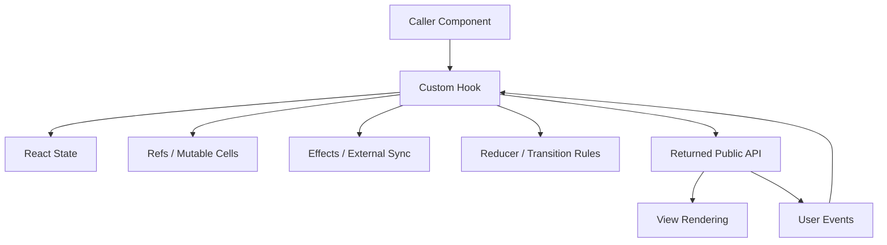
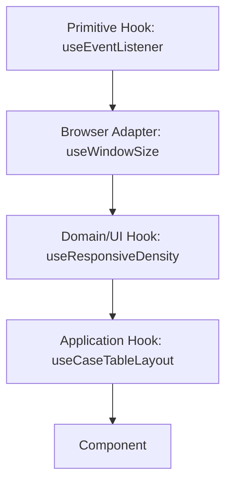

# Part 019 — Custom Hooks as Stateful Protocols

Custom Hook sering diajarkan terlalu sederhana:

```txt
extract duplicated hook logic into a reusable function named useSomething
```

Itu benar, tetapi belum cukup untuk production engineering.

Di sistem nyata, custom hook bukan hanya tempat memindahkan `useState` dan `useEffect` agar component terlihat pendek.

Custom hook adalah **stateful protocol**.

Artinya, hook mendefinisikan:

- data apa yang bisa dibaca;
- event atau command apa yang bisa dikirim;
- kapan resource dibuat;
- kapan resource dibersihkan;
- siapa yang memiliki state;
- kapan caller boleh melakukan sesuatu;
- invariant apa yang dijaga;
- failure mode apa yang disembunyikan atau diekspos;
- kontrak stabil apa yang dapat dipakai component.

> Component adalah permukaan visual. Custom hook adalah permukaan perilaku.

---

## 1. Mental Model Utama

Custom Hook bukan mechanism untuk share state.

Custom Hook adalah mechanism untuk share **stateful logic**.

Setiap pemanggilan custom hook punya state sendiri.

```tsx
function useCounter() {
  const [count, setCount] = useState(0);

  return {
    count,
    increment: () => setCount((x) => x + 1),
  };
}

function A() {
  const counter = useCounter();
  return <button onClick={counter.increment}>{counter.count}</button>;
}

function B() {
  const counter = useCounter();
  return <button onClick={counter.increment}>{counter.count}</button>;
}
```

`A` dan `B` tidak berbagi `count`.

Mereka hanya berbagi **logic**.

Kalau butuh state yang benar-benar shared, pilih salah satu:

- lift state ke parent;
- context provider;
- external store;
- URL state;
- server cache;
- workflow actor/machine;
- shared service dengan subscription model.

Custom hook tidak otomatis membuat shared state.

---

## 2. Dari Function ke Protocol

Function biasa menjawab:

```txt
input → output
```

Custom hook menjawab:

```txt
reactive input
→ internal state/resource lifecycle
→ readable snapshot
→ stable commands/events
→ cleanup/synchronization
```

Diagram:



Custom hook yang baik terasa seperti mini-module.

Ia punya public API kecil, jelas, dan stabil.

---

## 3. Batas: Apa yang Layak Masuk Custom Hook?

Tidak semua helper perlu menjadi hook.

Gunakan custom hook ketika logic membutuhkan minimal satu dari ini:

- React state;
- React context;
- React ref;
- effect lifecycle;
- subscription;
- memoized callback/value yang bergantung pada reactive values;
- interaction dengan external system;
- composition dari hook lain;
- stateful protocol yang dipakai beberapa component;
- boundary untuk testing dan dependency injection.

Jangan buat hook untuk pure utility.

Buruk:

```tsx
function useFormatCurrency(value: number) {
  return new Intl.NumberFormat('id-ID', {
    style: 'currency',
    currency: 'IDR',
  }).format(value);
}
```

Ini tidak memakai fitur React.

Lebih jujur:

```ts
function formatCurrency(value: number) {
  return new Intl.NumberFormat('id-ID', {
    style: 'currency',
    currency: 'IDR',
  }).format(value);
}
```

Hook prefix `use` adalah kontrak: function ini mengikuti Rules of Hooks dan mungkin punya lifecycle.

Jangan gunakan prefix itu untuk utility biasa.

---

## 4. Bentuk Dasar Custom Hook

Custom hook adalah function JavaScript/TypeScript yang:

- namanya dimulai dengan `use`;
- memanggil hook lain di top-level;
- tidak dipanggil secara kondisional;
- tidak dipanggil dari function biasa;
- mengembalikan API yang dapat digunakan component.

```tsx
function useDisclosure(initialOpen = false) {
  const [open, setOpen] = useState(initialOpen);

  const show = useCallback(() => setOpen(true), []);
  const hide = useCallback(() => setOpen(false), []);
  const toggle = useCallback(() => setOpen((value) => !value), []);

  return {
    open,
    show,
    hide,
    toggle,
  };
}
```

Pemakaian:

```tsx
function DeleteButton() {
  const confirm = useDisclosure();

  return (
    <>
      <button onClick={confirm.show}>Delete</button>
      {confirm.open && (
        <ConfirmDialog onCancel={confirm.hide} onConfirm={confirm.hide} />
      )}
    </>
  );
}
```

Ini kecil, tetapi sudah punya protocol:

```txt
state     : open | closed
commands  : show, hide, toggle
invariant : open selalu boolean
owner     : caller component instance
```

---

## 5. Design Rule: Return Meaning, Not Implementation

Custom hook jangan membocorkan implementasi internal.

Buruk:

```tsx
function useModal() {
  const [isOpen, setIsOpen] = useState(false);
  return [isOpen, setIsOpen] as const;
}
```

Caller bisa melakukan apa pun:

```tsx
const [isOpen, setIsOpen] = useModal();
setIsOpen((x: any) => !x);
```

Untuk hook kecil ini masih mungkin diterima, tetapi untuk production protocol biasanya terlalu lemah.

Lebih kuat:

```tsx
function useModal() {
  const [open, setOpen] = useState(false);

  return {
    open,
    openModal: () => setOpen(true),
    closeModal: () => setOpen(false),
  };
}
```

Sekarang API menyatakan intent.

```txt
openModal bukan set true secara teknis saja.
openModal adalah command domain UI.
```

Kalau nanti `openModal` harus log analytics, reset form draft, lock scroll, atau request permission, caller tidak berubah.

---

## 6. Tuple vs Object Return

Gunakan tuple ketika:

- jumlah item kecil;
- urutan sudah idiomatis;
- caller hampir pasti rename sendiri;
- API mirip built-in hook.

Contoh:

```tsx
const [value, setValue] = useControllableState(...);
```

Gunakan object ketika:

- ada lebih dari dua field;
- field punya semantic name penting;
- API mungkin bertambah;
- ingin memisahkan read state dan commands;
- caller perlu destructuring sebagian.

```tsx
const {
  status,
  data,
  error,
  retry,
  cancel,
} = useExportJob(jobId);
```

Untuk protocol kompleks, object lebih tahan evolusi.

---

## 7. Pisahkan Read Model dan Command Model

Hook production-grade sering lebih jelas kalau API-nya dipisah antara:

- **read model**: snapshot yang dipakai render;
- **command model**: fungsi yang mengubah state atau memulai side effect.

```tsx
type UseUploadResult = {
  state: {
    status: 'idle' | 'selecting' | 'uploading' | 'success' | 'failed';
    progress: number;
    error: Error | null;
  };
  commands: {
    selectFiles(files: File[]): void;
    start(): Promise<void>;
    cancel(): void;
    reset(): void;
  };
};
```

Kenapa ini bagus?

Karena component akan membaca seperti ini:

```tsx
const upload = useFileUpload();

if (upload.state.status === 'uploading') {
  return <Progress value={upload.state.progress} onCancel={upload.commands.cancel} />;
}
```

Public contract-nya terlihat.

Hook bukan lagi kumpulan setter.

Ia adalah protocol.

---

## 8. Custom Hook sebagai Adapter ke External System

Salah satu kegunaan paling kuat custom hook adalah menyembunyikan complexity external system.

Contoh external system:

- WebSocket connection;
- BroadcastChannel;
- DOM event listener;
- ResizeObserver;
- IntersectionObserver;
- media query;
- localStorage;
- notification permission;
- browser online/offline status;
- third-party SDK;
- editor instance;
- map/chart/canvas engine.

Component tidak seharusnya tahu detail subscribe/unsubscribe.

```tsx
function useOnlineStatus() {
  const [online, setOnline] = useState(() => navigator.onLine);

  useEffect(() => {
    function handleOnline() {
      setOnline(true);
    }

    function handleOffline() {
      setOnline(false);
    }

    window.addEventListener('online', handleOnline);
    window.addEventListener('offline', handleOffline);

    return () => {
      window.removeEventListener('online', handleOnline);
      window.removeEventListener('offline', handleOffline);
    };
  }, []);

  return online;
}
```

Caller hanya melihat:

```tsx
const online = useOnlineStatus();
```

Detail lifecycle tersembunyi.

Namun tersembunyi bukan berarti tidak ada.

Hook tetap harus benar terhadap:

- initial snapshot;
- cleanup;
- Strict Mode;
- SSR/browser availability;
- event listener identity;
- stale closure;
- testing environment.

---

## 9. Custom Hook dan Ownership State

Pertanyaan pertama sebelum membuat hook:

```txt
Apakah hook ini memiliki state, atau hanya membaca state milik pihak lain?
```

Ada empat bentuk umum.

### 9.1 Owner Hook

Hook menciptakan dan memiliki state.

```tsx
function useWizardState() {
  const [step, setStep] = useState(0);
  // ...
}
```

State per hook call.

### 9.2 Adapter Hook

Hook membaca state dari provider/store/external system.

```tsx
function useCurrentUser() {
  return useContext(AuthContext).user;
}
```

State bukan milik hook ini.

Ia hanya adapter.

### 9.3 Controller Hook

Hook mengorkestrasi beberapa dependency.

```tsx
function useCaseAssignment(caseId: string) {
  const currentUser = useCurrentUser();
  const permissions = usePermissions();
  const mutation = useAssignCaseMutation();

  // returns domain-specific commands and state
}
```

Ia mungkin memiliki sedikit UI state, tetapi core data berasal dari luar.

### 9.4 Facade Hook

Hook menyembunyikan detail beberapa hook lebih rendah.

```tsx
function useSearchPageModel() {
  const filters = useSearchFiltersFromUrl();
  const query = useSearchQuery(filters.value);
  const selection = useSelectionModel(query.data?.items ?? []);

  return {
    filters,
    query,
    selection,
  };
}
```

Facade hook adalah orchestration boundary.

---

## 10. Layering Custom Hooks

Jangan campur semua level dalam satu hook.

Gunakan layering:

```txt
primitive hook
→ browser adapter hook
→ domain hook
→ page/application hook
```

Contoh:

```txt
useEventListener
→ useWindowSize
→ useResponsiveDensity
→ useTableLayoutModel
```

Diagram:



Setiap layer punya tanggung jawab berbeda.

Primitive hook tidak tahu domain.

Domain hook tidak tahu detail DOM event subscription.

Application hook boleh tahu page use case.

---

## 11. Primitive Hook: `useEventListener`

Kita bangun primitive kecil.

Tujuan:

- subscribe event;
- cleanup event;
- hindari stale handler;
- tidak resubscribe setiap render tanpa perlu.

```tsx
function useEventListener<K extends keyof WindowEventMap>(
  target: Window | null,
  type: K,
  handler: (event: WindowEventMap[K]) => void,
  options?: AddEventListenerOptions,
) {
  const handlerRef = useRef(handler);

  useEffect(() => {
    handlerRef.current = handler;
  }, [handler]);

  useEffect(() => {
    if (!target) return;

    const listener = (event: WindowEventMap[K]) => {
      handlerRef.current(event);
    };

    target.addEventListener(type, listener, options);

    return () => {
      target.removeEventListener(type, listener, options);
    };
  }, [target, type, options]);
}
```

Catatan penting:

- `handlerRef` menyimpan latest handler;
- subscription tidak perlu berubah hanya karena handler berubah;
- `options` harus stabil, atau subscription akan re-run;
- hook ini browser-only, jadi caller harus hati-hati untuk SSR.

Dalam React modern, beberapa logic non-reactive di dalam Effect dapat diekspresikan dengan Effect Event. Tetapi untuk banyak codebase, ref-latest-handler masih umum, terutama untuk compatibility dan custom abstraction.

---

## 12. Browser Adapter Hook: `useWindowSize`

Bangun di atas primitive:

```tsx
type WindowSize = {
  width: number;
  height: number;
};

function readWindowSize(): WindowSize {
  return {
    width: window.innerWidth,
    height: window.innerHeight,
  };
}

function useWindowSize() {
  const [size, setSize] = useState<WindowSize>(() => {
    if (typeof window === 'undefined') {
      return { width: 0, height: 0 };
    }

    return readWindowSize();
  });

  useEventListener(
    typeof window === 'undefined' ? null : window,
    'resize',
    () => setSize(readWindowSize()),
  );

  return size;
}
```

Sekarang component tidak tahu detail event listener.

Tetapi hook masih punya keputusan arsitektural:

- apakah `0` cocok sebagai SSR fallback?
- apakah resize harus debounced?
- apakah butuh `ResizeObserver` per container, bukan window?
- apakah hook ini menyebabkan terlalu banyak rerender?

Custom hook membuat keputusan itu eksplisit di satu tempat.

---

## 13. Domain Hook: `useResponsiveDensity`

```tsx
type Density = 'compact' | 'comfortable' | 'spacious';

function useResponsiveDensity(): Density {
  const { width } = useWindowSize();

  if (width < 640) return 'compact';
  if (width < 1024) return 'comfortable';
  return 'spacious';
}
```

Sekarang domain UI tidak tahu `resize`.

Ia hanya memutuskan density berdasarkan read model.

---

## 14. Application Hook: `useCaseTableLayout`

```tsx
function useCaseTableLayout() {
  const density = useResponsiveDensity();

  return useMemo(() => {
    return {
      density,
      visibleColumns:
        density === 'compact'
          ? ['caseNumber', 'status', 'assignee']
          : ['caseNumber', 'status', 'assignee', 'risk', 'deadline'],
    };
  }, [density]);
}
```

Component:

```tsx
function CaseTablePage() {
  const layout = useCaseTableLayout();

  return (
    <CaseTable
      density={layout.density}
      visibleColumns={layout.visibleColumns}
    />
  );
}
```

Layering menghasilkan code yang mudah diuji dan mudah diganti.

---

## 15. Hook API Harus Menyatakan Lifecycle

Beberapa hook memiliki lifecycle implisit.

Contoh:

```tsx
function useChatRoom(roomId: string) {
  useEffect(() => {
    const connection = createConnection(roomId);
    connection.connect();

    return () => connection.disconnect();
  }, [roomId]);
}
```

Dari luar, ini terlihat sederhana.

Tetapi protocol-nya besar:

```txt
input berubah: disconnect old room, connect new room
mount       : connect
unmount     : disconnect
StrictMode  : setup/cleanup bisa terjadi ekstra di development
failure     : connect bisa gagal
```

API lebih jujur:

```tsx
function useChatRoom(roomId: string) {
  const [status, setStatus] = useState<'connecting' | 'connected' | 'failed'>('connecting');
  const [error, setError] = useState<Error | null>(null);

  useEffect(() => {
    let cancelled = false;
    const connection = createConnection(roomId);

    setStatus('connecting');
    setError(null);

    connection.on('connected', () => {
      if (!cancelled) setStatus('connected');
    });

    connection.on('error', (nextError) => {
      if (!cancelled) {
        setStatus('failed');
        setError(nextError);
      }
    });

    connection.connect();

    return () => {
      cancelled = true;
      connection.disconnect();
    };
  }, [roomId]);

  return { status, error };
}
```

Sekarang caller bisa render lifecycle state.

---

## 16. Jangan Sembunyikan Async Failure Secara Berlebihan

Custom hook sering membuat async terlihat “rapi”, tetapi failure masih harus punya tempat.

Buruk:

```tsx
function useSaveUser() {
  return async function saveUser(input: UserInput) {
    await api.saveUser(input);
  };
}
```

Apa status submit?

Apa error-nya?

Apakah double submit dicegah?

Apakah retry ada?

Apakah optimistic update terjadi?

Lebih eksplisit:

```tsx
function useSaveUser() {
  const [status, setStatus] = useState<'idle' | 'saving' | 'success' | 'failed'>('idle');
  const [error, setError] = useState<Error | null>(null);

  const save = useCallback(async (input: UserInput) => {
    setStatus('saving');
    setError(null);

    try {
      await api.saveUser(input);
      setStatus('success');
    } catch (error) {
      setStatus('failed');
      setError(error as Error);
      throw error;
    }
  }, []);

  return {
    status,
    error,
    save,
    isSaving: status === 'saving',
  };
}
```

Namun jangan membangun mini React Query di setiap hook.

Untuk server state yang kompleks, gunakan cache layer seperti TanStack Query atau framework data layer.

Custom hook bisa menjadi facade domain di atas cache layer.

---

## 17. Custom Hook sebagai Facade di Atas Server State

Contoh domain hook:

```tsx
function useCaseDetails(caseId: string) {
  const query = useQuery({
    queryKey: ['case', caseId],
    queryFn: () => fetchCase(caseId),
  });

  const canEscalate = useMemo(() => {
    const data = query.data;
    return data?.status === 'open' && data?.risk === 'high';
  }, [query.data]);

  return {
    case: query.data,
    status: query.status,
    error: query.error,
    canEscalate,
    refetch: query.refetch,
  };
}
```

Caller tidak perlu tahu query key detail.

Tetapi jangan sembunyikan semua hal penting.

Kadang caller butuh tahu:

- loading state;
- stale state;
- refetch state;
- error boundary behavior;
- retry command;
- mutation pending state.

Facade yang terlalu tebal berubah menjadi black box.

---

## 18. Dependency Injection dalam Custom Hook

Untuk testability dan environment boundary, hindari hardcoded dependency berlebihan.

Buruk:

```tsx
function useExportCase(caseId: string) {
  const exportCase = async () => {
    await window.fetch(`/api/cases/${caseId}/export`, { method: 'POST' });
  };

  return { exportCase };
}
```

Lebih testable:

```tsx
type CaseExportApi = {
  exportCase(caseId: string): Promise<void>;
};

function useExportCase(caseId: string, api: CaseExportApi = defaultCaseExportApi) {
  const [status, setStatus] = useState<'idle' | 'exporting' | 'done' | 'failed'>('idle');

  const exportCase = useCallback(async () => {
    setStatus('exporting');

    try {
      await api.exportCase(caseId);
      setStatus('done');
    } catch (error) {
      setStatus('failed');
      throw error;
    }
  }, [api, caseId]);

  return { status, exportCase };
}
```

Sekarang test bisa inject fake API.

Tetapi jangan berlebihan sampai semua hook signature penuh dependency.

Untuk dependency global, context provider sering lebih rapi.

```tsx
function useExportCase(caseId: string) {
  const api = useCaseApi();
  // ...
}
```

---

## 19. Stable Function Return

Jika custom hook mengembalikan function, pikirkan identity.

```tsx
function useRouterCommands() {
  const router = useRouter();

  const navigateToCase = useCallback(
    (caseId: string) => {
      router.navigate(`/cases/${caseId}`);
    },
    [router],
  );

  return { navigateToCase };
}
```

Kenapa `useCallback` berguna di custom hook?

Karena caller mungkin memakai function itu sebagai dependency:

```tsx
const { navigateToCase } = useRouterCommands();

useEffect(() => {
  audit.registerNavigation(navigateToCase);
}, [navigateToCase]);
```

Atau melewatkannya ke memoized child.

Tidak semua function return wajib `useCallback`, tetapi custom hook yang menjadi reusable API sebaiknya menjaga identity bila cost dan dependency-nya masuk akal.

---

## 20. Stable Object Return: Hati-Hati

Object baru dibuat setiap render.

```tsx
function useDisclosure() {
  const [open, setOpen] = useState(false);

  return {
    open,
    show: () => setOpen(true),
    hide: () => setOpen(false),
  };
}
```

Ini membuat semua field function berubah setiap render.

Untuk banyak kasus tidak masalah.

Tetapi jika API dipakai sebagai dependency atau prop ke memoized child, gunakan callback.

```tsx
function useDisclosure() {
  const [open, setOpen] = useState(false);

  const show = useCallback(() => setOpen(true), []);
  const hide = useCallback(() => setOpen(false), []);
  const toggle = useCallback(() => setOpen((value) => !value), []);

  return useMemo(
    () => ({ open, show, hide, toggle }),
    [open, show, hide, toggle],
  );
}
```

Namun jangan jadikan ini ritual.

Object return yang dimemoize hanya berguna jika identity object memang dikonsumsi.

Kalau caller langsung destructuring:

```tsx
const { open, show } = useDisclosure();
```

maka memoizing whole object sering tidak signifikan.

---

## 21. Hook dengan Parameter Object

Saat input hook mulai banyak, pakai object parameter.

Buruk:

```tsx
useSearchCases(query, status, assignee, page, pageSize, sort, includeArchived);
```

Lebih baik:

```tsx
useSearchCases({
  query,
  status,
  assignee,
  page,
  pageSize,
  sort,
  includeArchived,
});
```

Tetapi parameter object punya problem identity.

Jika hook memakai object langsung sebagai dependency:

```tsx
function useSearchCases(params: SearchParams) {
  useEffect(() => {
    search(params);
  }, [params]);
}
```

Caller yang menulis inline object akan memicu effect setiap render.

Solusi yang lebih benar: dependency pada scalar fields yang benar-benar reactive.

```tsx
function useSearchCases(params: SearchParams) {
  const {
    query,
    status,
    assignee,
    page,
    pageSize,
    sort,
    includeArchived,
  } = params;

  useEffect(() => {
    search({ query, status, assignee, page, pageSize, sort, includeArchived });
  }, [query, status, assignee, page, pageSize, sort, includeArchived]);
}
```

Atau pindahkan ke query key jika memakai server cache.

---

## 22. Jangan Buat Custom Hook sebagai “Dumping Ground”

Anti-pattern:

```tsx
function useCasePageEverything(caseId: string) {
  const user = useCurrentUser();
  const permissions = usePermissions();
  const caseQuery = useCaseQuery(caseId);
  const commentsQuery = useCommentsQuery(caseId);
  const [tab, setTab] = useState('summary');
  const [modal, setModal] = useState(null);
  const [draft, setDraft] = useState({});
  const theme = useTheme();
  const router = useRouter();
  // 300 more lines
}
```

Masalah:

- terlalu banyak alasan berubah;
- test setup berat;
- dependency graph tidak terlihat;
- UI boundary menjadi kabur;
- semua consumer tergantung semua logic;
- sulit memecah page;
- hook menjadi God Object.

Pecah berdasarkan protocol:

```txt
useCaseDetailsModel
useCaseCommentsModel
useCasePermissions
useCaseTabs
useCaseModalCommands
useCaseDraftAutosave
```

Kemudian page orchestration layer menggabungkan seperlunya.

---

## 23. Hook Naming sebagai Arsitektur

Nama hook harus menjawab level abstraction.

| Nama | Sinyal |
|---|---|
| `useBoolean` | primitive utility state |
| `useDisclosure` | generic UI protocol |
| `useModalController` | controller untuk modal behavior |
| `useCaseSearchParams` | domain-specific URL/search state |
| `useCaseAssignmentWorkflow` | workflow/business interaction |
| `useCurrentUser` | application context adapter |
| `usePermissionGate` | capability/authorization adapter |

Hindari nama kabur:

```txt
useData
useLogic
useHandler
useCommon
useManager
useUtils
```

Nama yang kabur menghasilkan coupling yang kabur.

---

## 24. Custom Hook dan Context

Custom hook sering menjadi public access point untuk context.

```tsx
const AuthContext = createContext<AuthContextValue | null>(null);

function useAuth() {
  const value = useContext(AuthContext);

  if (!value) {
    throw new Error('useAuth must be used inside AuthProvider');
  }

  return value;
}
```

Ini lebih baik daripada mengekspos context langsung karena:

- caller tidak perlu handle `null`;
- error lebih jelas;
- context internal bisa diganti;
- hook bisa menambahkan selector/derived capability;
- public API lebih terkendali.

Namun jangan membuat hook menyembunyikan provider requirement tanpa error.

Buruk:

```tsx
function useAuth() {
  return useContext(AuthContext) ?? anonymousAuth;
}
```

Ini bisa menyembunyikan bug wiring provider.

Fallback hanya boleh dipakai jika memang bagian dari desain.

---

## 25. Custom Hook sebagai Capability Boundary

Dalam aplikasi enterprise, component sering butuh capability, bukan user object mentah.

Buruk:

```tsx
const { user } = useAuth();

if (user.role === 'admin') {
  return <DeleteButton />;
}
```

Lebih baik:

```tsx
function useCaseCapabilities(caseRecord: CaseRecord) {
  const currentUser = useCurrentUser();
  const policy = useAuthorizationPolicy();

  return useMemo(() => {
    return {
      canView: policy.can(currentUser, 'case:view', caseRecord),
      canAssign: policy.can(currentUser, 'case:assign', caseRecord),
      canEscalate: policy.can(currentUser, 'case:escalate', caseRecord),
      canClose: policy.can(currentUser, 'case:close', caseRecord),
    };
  }, [currentUser, policy, caseRecord]);
}
```

Caller:

```tsx
const capabilities = useCaseCapabilities(caseRecord);

return capabilities.canEscalate ? <EscalateButton /> : null;
```

Component tidak tahu struktur role.

Ia tahu capability.

Ini lebih defensible dan lebih mudah diubah.

---

## 26. Custom Hook untuk Workflow Lokal

Contoh hook workflow upload.

```tsx
type UploadState =
  | { tag: 'idle' }
  | { tag: 'ready'; files: File[] }
  | { tag: 'uploading'; files: File[]; progress: number }
  | { tag: 'success'; uploadedIds: string[] }
  | { tag: 'failed'; files: File[]; error: Error };

type UploadEvent =
  | { type: 'files_selected'; files: File[] }
  | { type: 'upload_started' }
  | { type: 'progress_changed'; progress: number }
  | { type: 'upload_succeeded'; uploadedIds: string[] }
  | { type: 'upload_failed'; error: Error }
  | { type: 'reset' };

function uploadReducer(state: UploadState, event: UploadEvent): UploadState {
  switch (event.type) {
    case 'files_selected':
      return { tag: 'ready', files: event.files };

    case 'upload_started':
      if (state.tag !== 'ready') return state;
      return { tag: 'uploading', files: state.files, progress: 0 };

    case 'progress_changed':
      if (state.tag !== 'uploading') return state;
      return { ...state, progress: event.progress };

    case 'upload_succeeded':
      return { tag: 'success', uploadedIds: event.uploadedIds };

    case 'upload_failed':
      if (state.tag !== 'uploading') return state;
      return { tag: 'failed', files: state.files, error: event.error };

    case 'reset':
      return { tag: 'idle' };
  }
}
```

Hook:

```tsx
function useUploadWorkflow(api: UploadApi) {
  const [state, dispatch] = useReducer(uploadReducer, { tag: 'idle' });
  const abortRef = useRef<AbortController | null>(null);

  const selectFiles = useCallback((files: File[]) => {
    dispatch({ type: 'files_selected', files });
  }, []);

  const start = useCallback(async () => {
    // In real production code, prefer reading files through command input
    // or a ref if this command must avoid stale captured state.
    if (state.tag !== 'ready') return;

    const controller = new AbortController();
    abortRef.current = controller;
    dispatch({ type: 'upload_started' });

    try {
      const uploadedIds = await api.upload(state.files, {
        signal: controller.signal,
        onProgress: (progress) => {
          dispatch({ type: 'progress_changed', progress });
        },
      });

      dispatch({ type: 'upload_succeeded', uploadedIds });
    } catch (error) {
      if (!controller.signal.aborted) {
        dispatch({ type: 'upload_failed', error: error as Error });
      }
    }
  }, [api, state]);

  const cancel = useCallback(() => {
    abortRef.current?.abort();
    dispatch({ type: 'reset' });
  }, []);

  return {
    state,
    commands: {
      selectFiles,
      start,
      cancel,
      reset: () => dispatch({ type: 'reset' }),
    },
  };
}
```

Ini hook besar, tapi ia punya protocol eksplisit:

```txt
states    : idle, ready, uploading, success, failed
events    : files_selected, upload_started, progress_changed, upload_succeeded, upload_failed, reset
resource  : AbortController
commands  : selectFiles, start, cancel, reset
```

---

## 27. Stale State dalam Command Hook

Perhatikan `start` di atas bergantung pada `state`.

Itu benar secara dependency, tetapi ada konsekuensi:

- identity `start` berubah setiap state berubah;
- caller effect yang depend pada `start` bisa re-run;
- command bisa membaca snapshot lama kalau dipanggil dari async callback lama.

Alternatif: command menerima explicit input.

```tsx
const start = useCallback(async (files: File[]) => {
  const controller = new AbortController();
  abortRef.current = controller;

  dispatch({ type: 'upload_started' });

  try {
    const uploadedIds = await api.upload(files, { signal: controller.signal });
    dispatch({ type: 'upload_succeeded', uploadedIds });
  } catch (error) {
    if (!controller.signal.aborted) {
      dispatch({ type: 'upload_failed', error: error as Error });
    }
  }
}, [api]);
```

Trade-off:

```txt
command reads internal state  → simpler caller, more closure sensitivity
command receives input        → more explicit caller, easier stable identity
```

Tidak ada jawaban tunggal.

Pilih berdasarkan protocol.

---

## 28. Custom Hook dan Reducer Boundary

Jika hook punya banyak transition, jangan biarkan setter tersebar.

Buruk:

```tsx
function useCheckout() {
  const [step, setStep] = useState('cart');
  const [items, setItems] = useState([]);
  const [payment, setPayment] = useState(null);
  const [error, setError] = useState(null);

  // many handlers updating many fields
}
```

Lebih kuat:

```tsx
function useCheckout() {
  const [state, dispatch] = useReducer(checkoutReducer, initialCheckoutState);

  const addItem = useCallback((item: Item) => {
    dispatch({ type: 'item_added', item });
  }, []);

  const submitPayment = useCallback((payment: PaymentInput) => {
    dispatch({ type: 'payment_submitted', payment });
  }, []);

  return {
    state,
    commands: {
      addItem,
      submitPayment,
    },
  };
}
```

Reducer menjaga invariant.

Hook menjadi command facade.

Component tidak tahu transition detail.

---

## 29. Custom Hook dan Effect Containment

Effect sebaiknya dekat dengan external system yang disinkronkan.

Jika effect hanya ada karena custom hook ingin membuat API nyaman, cek ulang.

Buruk:

```tsx
function useFullName(firstName: string, lastName: string) {
  const [fullName, setFullName] = useState('');

  useEffect(() => {
    setFullName(`${firstName} ${lastName}`);
  }, [firstName, lastName]);

  return fullName;
}
```

Ini derived value.

Tidak perlu effect.

```tsx
function useFullName(firstName: string, lastName: string) {
  return `${firstName} ${lastName}`;
}
```

Bahkan lebih baik sebagai pure function:

```ts
function getFullName(firstName: string, lastName: string) {
  return `${firstName} ${lastName}`;
}
```

Custom hook bukan tempat membungkus semua transformasi.

---

## 30. Custom Hook dan Suspense/Async Boundary

Beberapa hook bisa throw promise/error jika menggunakan Suspense-enabled data source.

Kalau hook bisa suspend, nama/API harus membuat boundary itu jelas secara dokumentasi.

```tsx
function useCaseResource(caseId: string) {
  return caseResource.read(caseId); // may suspend
}
```

Caller harus berada di bawah Suspense boundary.

```tsx
<Suspense fallback={<CaseDetailsSkeleton />}>
  <CaseDetails caseId={caseId} />
</Suspense>
```

Jangan campur hook yang kadang suspend dan kadang return status object tanpa contract jelas.

Pilih salah satu model:

```txt
status object model : { status, data, error }
Suspense model      : return data or throw
```

Campuran keduanya membuat caller sulit benar.

---

## 31. Testing Custom Hook

Test hook berdasarkan protocol, bukan implementasi internal.

Untuk primitive hook:

```txt
Given mounted hook
When external event fires
Then returned snapshot changes
When unmounted
Then listener is removed
```

Untuk reducer-backed hook:

```txt
Given idle upload workflow
When files selected
Then state becomes ready
When start succeeds
Then state becomes success
When start fails
Then state becomes failed
```

Untuk dependency-injected hook:

```tsx
it('sets failed status when export fails', async () => {
  const api = {
    exportCase: vi.fn().mockRejectedValue(new Error('network')),
  };

  const { result } = renderHook(() => useExportCase('CASE-1', api));

  await expect(result.current.exportCase()).rejects.toThrow('network');

  expect(result.current.status).toBe('failed');
});
```

Jangan test bahwa hook memakai `useState` atau `useEffect` tertentu.

Test public behavior.

---

## 32. Documentation untuk Custom Hook

Custom hook production-grade perlu dokumentasi kecil.

Minimal:

```txt
Purpose
Inputs
Returned read model
Returned commands
Lifecycle behavior
Ownership
Concurrency behavior
Failure behavior
SSR/browser caveat
Testing notes
```

Contoh:

```ts
/**
 * useCaseAssignmentWorkflow
 *
 * Owns local UI workflow for assigning a case to an officer.
 * Does not own case server state; server state is updated through mutation layer.
 *
 * Invariants:
 * - Cannot submit while assignee is empty.
 * - Cannot submit while previous submit is pending.
 * - Failed submit preserves draft assignee.
 *
 * Failure behavior:
 * - exposes error in state
 * - rethrows error to caller for toast/reporting when needed
 */
```

Hook adalah API.

API perlu contract.

---

## 33. Failure Modes Custom Hook

| Failure Mode | Penyebab | Gejala | Perbaikan |
|---|---|---|---|
| Hidden shared-state expectation | Caller mengira hook call berbagi state | Dua component tidak sinkron | Lift state/context/store |
| Stale command | Callback membaca snapshot lama | Submit pakai data lama | dependency benar, explicit input, ref/latest event |
| Over-resubscription | Object/function dependency tidak stabil | listener reconnect terus | scalar deps, stable options, split effects |
| Leaky subscription | cleanup salah | duplicate events, memory leak | return cleanup benar |
| God hook | terlalu banyak protocol digabung | sulit test/refactor | split per responsibility |
| Weak API | return raw setter | invariant bocor | expose command semantic |
| Hidden provider failure | context fallback diam-diam | bug wiring sulit terlihat | throw error bila provider wajib |
| Async black box | status/error tidak diekspos | UI tidak bisa render failure | expose lifecycle state |
| SSR unsafe | akses `window` saat render server | crash/hydration issue | guard browser-only access |
| Memo ritual | `useMemo`/`useCallback` berlebihan | kompleksitas palsu | profile/contract-driven memo |

---

## 34. Decision Checklist

Sebelum membuat custom hook, jawab:

```txt
1. Apakah logic ini benar-benar membutuhkan React hook?
2. Apakah hook ini owner, adapter, controller, atau facade?
3. State apa yang dimiliki hook ini?
4. State apa yang hanya dibaca dari luar?
5. Apa read model yang dikembalikan?
6. Apa command/event yang dikembalikan?
7. Apakah command perlu stable identity?
8. Apakah hook melakukan synchronization dengan external system?
9. Apa cleanup-nya?
10. Apa behavior saat input berubah?
11. Apa behavior saat unmount?
12. Apa failure state-nya?
13. Apakah caller perlu retry/cancel/reset?
14. Apakah hook aman terhadap SSR?
15. Apakah hook mudah dites dengan fake dependency?
16. Apakah hook terlalu banyak tahu?
```

Jika jawaban nomor 16 adalah “iya”, pecah hook.

---

## 35. Heuristik Produksi

Gunakan custom hook untuk:

- menyembunyikan subscription lifecycle;
- membuat UI workflow reusable;
- membuat domain-specific facade;
- mengisolasi dependency eksternal;
- menjaga state invariant;
- mengurangi kebocoran detail implementation ke component;
- membuat component fokus pada render dan interaction binding.

Jangan gunakan custom hook untuk:

- pure formatting;
- one-line wrapper tanpa contract;
- menyembunyikan complexity yang seharusnya eksplisit;
- menggabungkan semua page logic menjadi satu God hook;
- mengganti state management yang sebenarnya perlu shared ownership;
- membungkus effect yang tidak perlu ada.

---

## 36. Mini Exercise

Bangun hook:

```txt
useBulkSelection(items)
```

Requirement:

```txt
- caller memberikan list item dengan id
- hook mengelola selected ids
- bisa select one
- bisa unselect one
- bisa toggle one
- bisa select all visible
- bisa clear
- expose selectedCount
- expose allVisibleSelected
- jika item hilang dari list, selection untuk id itu dibersihkan atau dipertahankan berdasarkan option
```

Pikirkan API:

```tsx
const selection = useBulkSelection(items, {
  getId: (item) => item.id,
  preserveMissing: false,
});
```

Return:

```tsx
{
  selectedIds,
  selectedCount,
  isSelected,
  allVisibleSelected,
  toggle,
  select,
  unselect,
  selectAllVisible,
  clear,
}
```

Diskusikan invariant:

```txt
selectedIds tidak boleh berisi id invalid jika preserveMissing=false
selectedCount harus selalu sama dengan selectedIds.size
allVisibleSelected benar hanya jika semua visible ids dipilih
```

Ini cara berpikir custom hook sebagai protocol, bukan helper.

---

## 37. Ringkasan

Custom Hook adalah batas perilaku.

Ia bukan sekadar extraction.

Custom hook yang baik:

- membagikan stateful logic, bukan otomatis membagikan state;
- menyatakan ownership;
- menyembunyikan lifecycle detail tanpa menyembunyikan failure;
- mengembalikan semantic commands, bukan raw setter sembarangan;
- menjaga invariant;
- aman terhadap stale closure, cleanup leak, dan dependency bug;
- bisa dites sebagai protocol;
- punya nama yang menunjukkan level abstraction;
- kecil cukup untuk dipahami, besar cukup untuk berguna.

Kualitas custom hook terlihat dari satu hal:

```txt
Apakah component yang memakainya menjadi lebih jujur tentang intent, atau hanya lebih pendek?
```

Kalau hanya lebih pendek, belum tentu lebih baik.

Kalau intent, ownership, lifecycle, dan failure model menjadi lebih jelas, hook itu layak.

---

## References

- React Docs — Reusing Logic with Custom Hooks: https://react.dev/learn/reusing-logic-with-custom-hooks
- React Docs — Rules of Hooks: https://react.dev/reference/rules/rules-of-hooks
- React Docs — Components and Hooks must be pure: https://react.dev/reference/rules/components-and-hooks-must-be-pure
- React Docs — useCallback: https://react.dev/reference/react/useCallback
- React Docs — useEffect: https://react.dev/reference/react/useEffect
- React Docs — eslint-plugin-react-hooks: https://react.dev/reference/eslint-plugin-react-hooks
