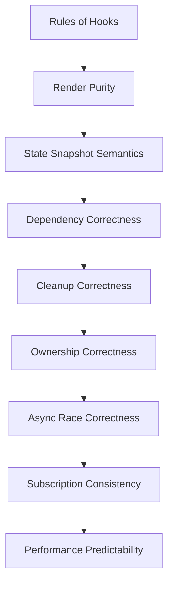
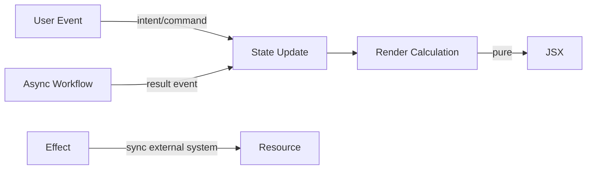

# Part 020 — Hook Invariants and Failure Modes

Sampai titik ini, kita sudah membahas Hooks sebagai mekanisme state, synchronization, ref, memoization, layout effect, imperative handle, dan custom hook.

Sekarang kita perlu membahas sisi yang lebih penting untuk production engineering:

```txt
Apa invariant yang harus selalu benar agar Hooks aman?
Apa failure mode yang muncul ketika invariant itu dilanggar?
Bagaimana cara mendeteksi dan memperbaikinya secara sistematis?
```

React Hook bug jarang terlihat sebagai “Hook bug” secara langsung.

Biasanya gejalanya seperti:

- UI kadang stale;
- listener terpanggil dua kali;
- request lama menimpa response baru;
- modal kembali terbuka setelah ditutup;
- form reset tanpa sebab;
- data terlihat benar di log tetapi salah di UI;
- effect loop tanpa henti;
- child rerender terus;
- hydration mismatch;
- race condition hanya muncul di jaringan lambat;
- bug hanya muncul di development Strict Mode;
- bug hanya muncul ketika tab cepat diganti;
- bug hanya muncul setelah refactor component tree.

Untuk engineer senior, skill penting bukan hanya “tahu Hook apa yang dipakai”, tetapi bisa membaca failure pattern dari gejala.

---

## 1. Hook Correctness Stack

React Hook correctness berdiri di atas beberapa lapis invariant.



Jika layer bawah rusak, layer atas sulit diselamatkan.

Contoh:

- dependency array benar tidak membantu jika hook dipanggil kondisional;
- memoization tidak membantu jika render tidak pure;
- cleanup tidak membantu jika resource dibuat di render;
- external store selector tidak membantu jika snapshot tidak konsisten.

---

## 2. Invariant #1: Hook Call Order Harus Stabil

React mengasosiasikan state Hook berdasarkan urutan pemanggilan di component instance.

Invariant:

```txt
Pada setiap render component yang sama, urutan Hook calls harus sama.
```

Buruk:

```tsx
function UserPanel({ enabled }: { enabled: boolean }) {
  if (enabled) {
    const [user, setUser] = useState(null);
  }

  const [open, setOpen] = useState(false);

  return null;
}
```

Jika `enabled` berubah, posisi Hook berubah.

React tidak bisa lagi memetakan slot state dengan benar.

Benar:

```tsx
function UserPanel({ enabled }: { enabled: boolean }) {
  const [user, setUser] = useState(null);
  const [open, setOpen] = useState(false);

  if (!enabled) {
    return null;
  }

  return null;
}
```

Atau pecah component:

```tsx
function UserPanel({ enabled }: { enabled: boolean }) {
  return enabled ? <EnabledUserPanel /> : null;
}

function EnabledUserPanel() {
  const [user, setUser] = useState(null);
  const [open, setOpen] = useState(false);

  return null;
}
```

### Failure Signal

```txt
Rendered fewer hooks than expected
Rendered more hooks than during the previous render
Invalid hook call
State milik hook A muncul di hook B
```

### Root Cause

- Hook dalam `if`;
- Hook dalam loop;
- Hook setelah early return;
- Hook dalam callback/event handler;
- Hook dalam nested function yang bukan custom hook/component;
- Hook dipanggil dari function biasa yang tidak bernama `use...`.

---

## 3. Invariant #2: Component dan Hook Harus Pure saat Render

Render harus bisa dipanggil ulang tanpa menimbulkan efek samping.

Invariant:

```txt
Render hanya menghitung JSX dari props, state, dan context.
```

Buruk:

```tsx
function AuditPanel({ caseId }: { caseId: string }) {
  audit.log('viewed_case', caseId); // side effect during render

  return <section>{caseId}</section>;
}
```

React bisa render ulang, membatalkan render, atau menjalankan render ekstra di development.

Log bisa dobel atau muncul walau UI tidak committed.

Benar:

```tsx
function AuditPanel({ caseId }: { caseId: string }) {
  useEffect(() => {
    audit.log('viewed_case', caseId);
  }, [caseId]);

  return <section>{caseId}</section>;
}
```

Namun cek lagi: apakah log itu memang sinkronisasi karena screen terlihat, atau event karena user melakukan action?

Jika action, taruh di event handler.

---

## 4. Invariant #3: State adalah Snapshot per Render

Setiap render punya snapshot state sendiri.

Buruk:

```tsx
function Counter() {
  const [count, setCount] = useState(0);

  function incrementThreeTimes() {
    setCount(count + 1);
    setCount(count + 1);
    setCount(count + 1);
  }

  return <button onClick={incrementThreeTimes}>{count}</button>;
}
```

Ketiga update membaca snapshot `count` yang sama.

Benar:

```tsx
function incrementThreeTimes() {
  setCount((value) => value + 1);
  setCount((value) => value + 1);
  setCount((value) => value + 1);
}
```

Invariant:

```txt
Jika next state bergantung pada previous state, gunakan updater function.
```

### Failure Signal

- increment tidak sebanyak yang diharapkan;
- toggle double-click aneh;
- async callback memakai value lama;
- console log setelah setState masih menampilkan state lama;
- batch update terasa “hilang”.

---

## 5. Invariant #4: Dependency Array Harus Mewakili Reactive Reads

Effect, memo, dan callback yang membaca reactive value harus menyatakannya sebagai dependency.

Reactive value:

- props;
- state;
- context;
- variable/function yang dibuat di body component;
- value dari custom hook;
- derived value yang bergantung pada reactive value.

Buruk:

```tsx
function ChatRoom({ roomId, theme }: Props) {
  useEffect(() => {
    const connection = createConnection(roomId);

    connection.on('connected', () => {
      toast.success('Connected', { theme });
    });

    connection.connect();
    return () => connection.disconnect();
  }, [roomId]); // theme dibaca tapi tidak dideklarasikan
}
```

`theme` stale.

Menambahkan `theme` mungkin membuat connection reconnect setiap theme berubah.

Itu mungkin tidak diinginkan.

Masalahnya bukan linter “cerewet”.

Masalahnya effect mencampur dua logic:

```txt
reactive synchronization : connect berdasarkan roomId
non-reactive side action : tampilkan toast dengan latest theme
```

Solusi dapat berupa Effect Event di React modern, atau pattern latest ref jika belum mengadopsinya.

---

## 6. Invariant #5: Cleanup Harus Membalik Setup

Effect yang membuat resource harus membersihkannya.

Invariant:

```txt
setup dan cleanup harus simetris.
```

Buruk:

```tsx
useEffect(() => {
  window.addEventListener('resize', onResize);
}, [onResize]);
```

Setiap effect run menambah listener.

Tidak pernah menghapus.

Benar:

```tsx
useEffect(() => {
  window.addEventListener('resize', onResize);

  return () => {
    window.removeEventListener('resize', onResize);
  };
}, [onResize]);
```

Namun ini hanya benar jika `onResize` identity yang sama dipakai untuk add/remove dalam satu effect execution.

Jika membuat anonymous function berbeda:

```tsx
useEffect(() => {
  window.addEventListener('resize', () => onResize());

  return () => {
    window.removeEventListener('resize', () => onResize());
  };
}, [onResize]);
```

Cleanup gagal karena function identity berbeda.

---

## 7. Invariant #6: Input Berubah Harus Membatalkan atau Mengabaikan Work Lama

Async effect rawan race.

Buruk:

```tsx
function UserDetails({ userId }: { userId: string }) {
  const [user, setUser] = useState<User | null>(null);

  useEffect(() => {
    fetchUser(userId).then(setUser);
  }, [userId]);

  return <UserCard user={user} />;
}
```

Jika `userId` berubah cepat:

```txt
fetch A starts
fetch B starts
fetch B returns
UI shows B
fetch A returns late
UI overwritten with A
```

Benar dengan ignore flag:

```tsx
useEffect(() => {
  let ignore = false;

  fetchUser(userId).then((nextUser) => {
    if (!ignore) {
      setUser(nextUser);
    }
  });

  return () => {
    ignore = true;
  };
}, [userId]);
```

Lebih baik jika API mendukung cancellation:

```tsx
useEffect(() => {
  const controller = new AbortController();

  fetchUser(userId, { signal: controller.signal })
    .then(setUser)
    .catch((error) => {
      if (error.name !== 'AbortError') {
        throw error;
      }
    });

  return () => {
    controller.abort();
  };
}, [userId]);
```

Untuk server state kompleks, prefer cache/query layer yang mengelola race, dedupe, cache, retry, dan invalidation.

---

## 8. Invariant #7: Ownership State Harus Tunggal

Banyak Hook bug sebenarnya ownership bug.

Buruk:

```tsx
function UserEditor({ user }: { user: User }) {
  const [name, setName] = useState(user.name);

  useEffect(() => {
    setName(user.name);
  }, [user.name]);

  return <input value={name} onChange={(e) => setName(e.target.value)} />;
}
```

Pertanyaan penting:

```txt
Apakah name milik parent/server, atau draft lokal editor?
```

Jika draft lokal, effect sync ini bisa menghapus input user saat parent rerender.

Lebih jujur:

```tsx
function UserEditor({ user }: { user: User }) {
  const [draft, setDraft] = useState(() => ({ name: user.name }));

  return (
    <input
      value={draft.name}
      onChange={(e) => setDraft({ name: e.target.value })}
    />
  );
}
```

Jika ganti user harus reset draft, gunakan key di boundary:

```tsx
<UserEditor key={user.id} user={user} />
```

Invariant:

```txt
Satu data domain harus punya satu source of truth aktif pada satu waktu.
Draft lokal boleh ada, tetapi harus didefinisikan sebagai draft, bukan copy pasif.
```

---

## 9. Invariant #8: Derived Value Jangan Disimpan Tanpa Alasan

Buruk:

```tsx
const [fullName, setFullName] = useState('');

useEffect(() => {
  setFullName(`${firstName} ${lastName}`);
}, [firstName, lastName]);
```

Ini membuat extra render dan risk stale state.

Benar:

```tsx
const fullName = `${firstName} ${lastName}`;
```

Jika mahal:

```tsx
const visibleRows = useMemo(
  () => filterAndSortRows(rows, filters, sort),
  [rows, filters, sort],
);
```

Invariant:

```txt
Jika value bisa dihitung dari source saat render, jangan jadikan state.
```

Kecuali:

- value adalah user-editable draft;
- value adalah historical snapshot;
- value harus survive source changes;
- value berasal dari external system event;
- value adalah cache dengan explicit invalidation.

---

## 10. Invariant #9: Ref Mutation Tidak Boleh Menjadi Hidden Render State

Ref tidak memicu rerender.

Buruk:

```tsx
function Counter() {
  const countRef = useRef(0);

  return (
    <button onClick={() => countRef.current++}>
      {countRef.current}
    </button>
  );
}
```

Klik mengubah ref, tetapi UI tidak rerender.

Gunakan state untuk data yang mempengaruhi render:

```tsx
const [count, setCount] = useState(0);
```

Gunakan ref untuk:

- DOM node;
- timer id;
- AbortController;
- previous value;
- mutable instance;
- latest callback;
- data yang tidak menentukan output render.

Invariant:

```txt
Jika perubahan value harus terlihat di UI, value itu bukan hanya ref.
```

---

## 11. Invariant #10: External Store Snapshot Harus Konsisten

Ketika React membaca external store, snapshot harus stabil sampai store berubah.

Buruk secara konsep:

```tsx
function getSnapshot() {
  return { value: store.value }; // object baru setiap call
}
```

Jika memakai `useSyncExternalStore`, snapshot baru terus dapat membuat rerender loop atau ketidakkonsistenan.

Lebih benar:

```tsx
let cachedSnapshot = { value: store.value };
let cachedValue = store.value;

function getSnapshot() {
  if (store.value !== cachedValue) {
    cachedValue = store.value;
    cachedSnapshot = { value: store.value };
  }

  return cachedSnapshot;
}
```

Invariant:

```txt
getSnapshot harus mengembalikan value yang sama secara Object.is jika store belum berubah.
```

Untuk external store serius, gunakan pattern subscription yang memang didesain untuk React concurrent rendering.

---

## 12. Strict Mode Failure Modes

Strict Mode development dapat menjalankan beberapa hal ekstra untuk menemukan bug:

- render tambahan;
- effect setup + cleanup tambahan;
- ref callback tambahan;
- pemeriksaan deprecated API.

Jika effect cleanup benar, Strict Mode tidak merusak behavior.

Jika cleanup salah, Strict Mode memperlihatkannya lebih cepat.

Buruk:

```tsx
useEffect(() => {
  const connection = createConnection(roomId);
  connection.connect();
}, [roomId]);
```

Di Strict Mode development, connection leak akan terlihat sebagai connect dobel.

Benar:

```tsx
useEffect(() => {
  const connection = createConnection(roomId);
  connection.connect();

  return () => {
    connection.disconnect();
  };
}, [roomId]);
```

Jangan “memperbaiki” Strict Mode dengan menambahkan ref guard agar effect hanya run sekali.

Buruk:

```tsx
const didRun = useRef(false);

useEffect(() => {
  if (didRun.current) return;
  didRun.current = true;

  connection.connect();
}, []);
```

Ini menyembunyikan bug cleanup.

---

## 13. Infinite Effect Loop

Pattern umum:

```tsx
function SearchPage({ filters }: Props) {
  const [results, setResults] = useState([]);

  useEffect(() => {
    setResults(runSearch(filters));
  }, [filters]);
}
```

Jika parent membuat `filters` inline setiap render, identity berubah terus.

Atau:

```tsx
const options = { threshold: 0.5 };

useEffect(() => {
  observer.configure(options);
}, [options]);
```

`options` object baru setiap render.

Fix tergantung niat:

### Jika value derived

```tsx
const results = runSearch(filters);
```

### Jika expensive derived

```tsx
const results = useMemo(() => runSearch(filters), [filters]);
```

### Jika effect benar-benar external sync

```tsx
useEffect(() => {
  observer.configure({ threshold });
}, [threshold]);
```

Jangan asal `useMemo` semua object.

Tanyakan dulu apakah effect memang perlu.

---

## 14. Stale Closure dalam Timer

Buruk:

```tsx
function Timer() {
  const [count, setCount] = useState(0);

  useEffect(() => {
    const id = setInterval(() => {
      setCount(count + 1);
    }, 1000);

    return () => clearInterval(id);
  }, []);

  return <span>{count}</span>;
}
```

`count` di interval selalu snapshot awal.

Benar:

```tsx
useEffect(() => {
  const id = setInterval(() => {
    setCount((value) => value + 1);
  }, 1000);

  return () => clearInterval(id);
}, []);
```

Atau jika callback perlu latest props/state yang kompleks, gunakan pattern latest ref atau Effect Event sesuai stack React yang dipakai.

---

## 15. Stale Closure dalam Async Submit

Buruk:

```tsx
function SaveButton({ draft }: { draft: Draft }) {
  const [saving, setSaving] = useState(false);

  const save = useCallback(async () => {
    setSaving(true);
    await api.save(draft);
    setSaving(false);
  }, []);

  return <button onClick={save}>Save</button>;
}
```

`draft` tidak ada di dependency.

Save memakai draft lama.

Benar:

```tsx
const save = useCallback(async () => {
  setSaving(true);

  try {
    await api.save(draft);
  } finally {
    setSaving(false);
  }
}, [draft]);
```

Atau explicit input:

```tsx
const save = useCallback(async (nextDraft: Draft) => {
  setSaving(true);

  try {
    await api.save(nextDraft);
  } finally {
    setSaving(false);
  }
}, []);
```

Caller:

```tsx
<button onClick={() => save(draft)}>Save</button>
```

---

## 16. Double Submit Race

Bug umum:

```tsx
async function submit() {
  if (saving) return;

  setSaving(true);
  await api.submit();
  setSaving(false);
}
```

Jika user klik sangat cepat sebelum rerender dengan `saving=true`, dua submit bisa lewat.

Solusi UI saja tidak cukup untuk domain penting.

Gunakan ref lock atau idempotency key.

```tsx
const inFlightRef = useRef(false);

const submit = useCallback(async () => {
  if (inFlightRef.current) return;

  inFlightRef.current = true;
  setSaving(true);

  try {
    await api.submit({ idempotencyKey });
  } finally {
    inFlightRef.current = false;
    setSaving(false);
  }
}, [api, idempotencyKey]);
```

Untuk operasi bisnis penting, backend tetap harus idempotent.

Frontend hanya mengurangi accidental duplicate.

---

## 17. Lost Update pada Object State

Buruk:

```tsx
setForm({ ...form, firstName: 'Ada' });
setForm({ ...form, lastName: 'Lovelace' });
```

Kedua update membaca snapshot `form` yang sama.

Update pertama bisa hilang.

Benar:

```tsx
setForm((current) => ({ ...current, firstName: 'Ada' }));
setForm((current) => ({ ...current, lastName: 'Lovelace' }));
```

Jika object state besar dan transition kompleks, gunakan reducer.

---

## 18. Accidental Remount karena Key Tidak Stabil

Buruk:

```tsx
<Form key={Math.random()} />
```

Atau:

```tsx
{items.map((item, index) => (
  <EditableRow key={index} item={item} />
))}
```

Jika list reorder, state row bisa pindah ke item lain.

Benar:

```tsx
{items.map((item) => (
  <EditableRow key={item.id} item={item} />
))}
```

Invariant:

```txt
key harus mewakili identity domain yang stabil, bukan posisi sementara.
```

Gunakan key untuk reset state secara sengaja.

Jangan membuat key berubah tanpa alasan.

---

## 19. Memoization Failure Modes

### 19.1 Memo dengan Dependency Kurang

```tsx
const visibleRows = useMemo(
  () => filterRows(rows, filters),
  [rows],
);
```

`filters` berubah, result stale.

### 19.2 Memo dengan Dependency Terlalu Luas

```tsx
const visibleRows = useMemo(
  () => filterRows(rows, filters),
  [rows, filters, theme],
);
```

`theme` tidak relevan, recompute tidak perlu.

### 19.3 Memo untuk Menutupi Model yang Salah

```tsx
const stableFilters = useMemo(() => filters, []);
```

Ini bukan optimasi.

Ini membekukan bug.

### 19.4 Callback Stabil tetapi Membaca Data Lama

```tsx
const onSubmit = useCallback(() => {
  submit(form);
}, []);
```

Function identity stabil, logic salah.

Invariant:

```txt
Correctness lebih penting daripada stable identity.
```

---

## 20. Context Failure Modes

Context sering dipakai sebagai global state dump.

Failure modes:

- semua consumer rerender karena value object berubah;
- provider terlalu tinggi;
- context berisi state tidak terkait;
- setter mentah bocor ke seluruh tree;
- provider nesting sulit diuji;
- hidden dependency membuat component tidak portable.

Buruk:

```tsx
<AuthContext.Provider value={{ user, permissions, theme, modal, setModal }}>
  {children}
</AuthContext.Provider>
```

Pisahkan berdasarkan change frequency dan domain:

```txt
AuthUserContext
PermissionContext
ThemeContext
ModalCommandContext
```

Atau pindahkan state dengan high-frequency updates ke external store/selector model.

---

## 21. Hook inside Custom Hook: Failure Modes

Custom hook juga harus mengikuti Rules of Hooks.

Buruk:

```tsx
function useMaybeUser(enabled: boolean) {
  if (enabled) {
    return useUser();
  }

  return null;
}
```

Benar:

```tsx
function useMaybeUser(enabled: boolean) {
  const user = useUser();
  return enabled ? user : null;
}
```

Atau pindahkan condition ke parameter hook/data layer:

```tsx
function useMaybeUser(enabled: boolean) {
  return useUserQuery({ enabled });
}
```

Pastikan hook library memang mendukung option tersebut.

---

## 22. Hook Factory Trap

Buruk:

```tsx
function createUseFeature(config: Config) {
  return function useFeature() {
    const [state, setState] = useState(config.initial);
    return state;
  };
}

function Component() {
  const useFeature = createUseFeature(config);
  const state = useFeature();
}
```

Membuat hook function saat render dapat membingungkan linter/compiler dan identity model.

Lebih baik:

```tsx
function useFeature(config: Config) {
  const [state, setState] = useState(config.initial);
  return state;
}
```

Jika memang perlu factory, buat di module scope atau gunakan pattern yang didukung tooling.

---

## 23. SSR and Hydration Failure Modes

Buruk:

```tsx
function ThemeLabel() {
  const theme = window.localStorage.getItem('theme');
  return <span>{theme}</span>;
}
```

Server tidak punya `window`.

Atau server render menghasilkan markup berbeda dari client.

Solusi tergantung requirement:

### Client-only after mount

```tsx
function ThemeLabel() {
  const [theme, setTheme] = useState<string | null>(null);

  useEffect(() => {
    setTheme(window.localStorage.getItem('theme'));
  }, []);

  return <span>{theme ?? 'system'}</span>;
}
```

### External store dengan server snapshot

Gunakan `useSyncExternalStore` dengan `getServerSnapshot` untuk source yang perlu SSR-safe.

Invariant:

```txt
Markup awal server dan render awal client harus kompatibel.
```

---

## 24. Subscription Tearing

Tearing terjadi ketika UI membaca snapshot external state yang tidak konsisten antar component dalam satu render.

Pattern raw subscription rentan jika tidak mengikuti kontrak React.

Buruk secara arsitektural:

```tsx
function useStoreValue() {
  const [value, setValue] = useState(store.get());

  useEffect(() => {
    return store.subscribe(() => setValue(store.get()));
  }, []);

  return value;
}
```

Ini bisa cukup untuk kasus sederhana, tetapi untuk external store shared serius gunakan `useSyncExternalStore`.

```tsx
function useStoreValue() {
  return useSyncExternalStore(
    store.subscribe,
    store.getSnapshot,
    store.getServerSnapshot,
  );
}
```

Invariant:

```txt
React harus bisa membaca snapshot external store secara konsisten selama render.
```

---

## 25. Resource Lifetime Mismatch

Bug terjadi saat lifetime resource tidak sama dengan lifetime component/effect.

Contoh:

```tsx
function Chart({ data }: Props) {
  const chart = createChart(); // dibuat saat render

  useEffect(() => {
    chart.setData(data);
  }, [chart, data]);

  return <canvas />;
}
```

`chart` dibuat setiap render.

Benar:

```tsx
function Chart({ data }: Props) {
  const canvasRef = useRef<HTMLCanvasElement | null>(null);
  const chartRef = useRef<ChartInstance | null>(null);

  useEffect(() => {
    if (!canvasRef.current) return;

    const chart = createChart(canvasRef.current);
    chartRef.current = chart;

    return () => {
      chart.destroy();
      chartRef.current = null;
    };
  }, []);

  useEffect(() => {
    chartRef.current?.setData(data);
  }, [data]);

  return <canvas ref={canvasRef} />;
}
```

Pisahkan:

```txt
create/destroy resource effect
sync data effect
```

---

## 26. Derived Callback vs Event Callback

Kadang callback bukan “reactive synchronization”, tetapi event logic.

Buruk:

```tsx
useEffect(() => {
  if (submitted) {
    toast.success(`Saved as ${name}`);
  }
}, [submitted, name]);
```

Jika `name` berubah setelah submitted, toast bisa muncul lagi.

Event-specific logic sebaiknya ada di event handler:

```tsx
async function handleSubmit() {
  await save(name);
  toast.success(`Saved as ${name}`);
}
```

Invariant:

```txt
Effect digunakan untuk sinkronisasi yang disebabkan oleh render/visibility/input reactive.
Event handler digunakan untuk logic yang disebabkan oleh aksi user tertentu.
```

---

## 27. Error Handling Failure Modes

Hooks tidak boleh menelan error yang harus diketahui caller.

Buruk:

```tsx
function useSave() {
  const [error, setError] = useState(null);

  async function save(input: Input) {
    try {
      await api.save(input);
    } catch (error) {
      setError(error);
    }
  }

  return { save, error };
}
```

Caller tidak tahu apakah save berhasil kecuali membaca state kemudian.

Kadang ini tepat.

Untuk command, sering lebih baik:

```tsx
async function save(input: Input) {
  try {
    await api.save(input);
  } catch (error) {
    setError(error as Error);
    throw error;
  }
}
```

Sekarang caller bisa:

```tsx
try {
  await save(input);
  closeModal();
} catch {
  // keep modal open
}
```

Invariant:

```txt
Command async harus punya failure contract yang jelas: expose state, throw, atau keduanya.
```

---

## 28. Transition and Pending State Failure Modes

Dengan concurrent features, urgent dan non-urgent update bisa dipisah.

Failure mode umum:

- semua update dianggap urgent;
- input terasa lag karena list besar dirender sinkron;
- pending state tidak dikaitkan dengan action yang benar;
- user bisa submit ulang saat transition pending.

Pattern:

```tsx
const [isPending, startTransition] = useTransition();

function handleSearch(nextQuery: string) {
  setQueryInput(nextQuery); // urgent

  startTransition(() => {
    setSearchQuery(nextQuery); // non-urgent expensive result update
  });
}
```

Invariant:

```txt
Input yang harus terasa langsung tetap urgent.
Update UI berat yang boleh tertunda masuk transition.
```

Jangan gunakan transition untuk menyembunyikan side-effect race.

---

## 29. Hook Failure Mode Table

| Gejala | Kemungkinan Penyebab | Layer | Fix Pertama |
|---|---|---|---|
| State hilang saat rerender | key berubah/remount | identity | stabilkan key atau reset sengaja |
| State row pindah ke row lain | index key pada reorder | identity | gunakan id domain |
| Effect jalan terus | dependency object/function berubah | dependency | scalar deps/split effect |
| Effect tidak update | dependency kurang | dependency | ikut exhaustive-deps |
| Listener dobel | cleanup hilang/salah | cleanup | setup-cleanup simetris |
| Data lama menimpa data baru | async race | async | ignore flag/abort/cache layer |
| Submit pakai draft lama | stale closure | snapshot | dependency benar/explicit input |
| UI tidak update | mutable ref dipakai untuk render state | ownership | gunakan state/store |
| UI rerender masif | context value terlalu luas | subscription | split context/selector store |
| Hydration mismatch | akses browser data saat initial render | SSR | server snapshot/fallback/effect |
| Bug hanya di Strict Mode | cleanup/render impurity | purity/lifecycle | perbaiki cleanup, jangan matikan sinyal |
| Memo stale | dependency kurang | memo | dependency benar |
| Callback stabil tapi salah | stale closure | memo | correctness first |
| External store loop | snapshot object baru terus | external store | cache snapshot |
| Double submit | state lock terlambat | async/command | ref lock + backend idempotency |

---

## 30. Debugging Protocol

Saat menemukan Hook bug, jangan langsung tambah `useMemo`, `useCallback`, atau disable lint.

Ikuti urutan ini.

### Step 1 — Identifikasi State Owner

```txt
Data ini milik siapa?
Component lokal?
Parent?
Context?
External store?
Server cache?
URL?
Workflow machine?
```

Jika owner tidak jelas, bug akan terus muncul.

### Step 2 — Cek Identity Boundary

```txt
Apakah component remount?
Apakah key berubah?
Apakah posisi tree berubah?
Apakah type component berubah?
```

### Step 3 — Cek Render Purity

```txt
Apakah ada side effect saat render?
Apakah ada mutation object props/state?
Apakah ada Date.now/Math.random untuk markup awal?
```

### Step 4 — Cek Snapshot

```txt
Apakah update bergantung previous state?
Apakah async callback membaca state lama?
Apakah closure dibuat dari render lama?
```

### Step 5 — Cek Dependency

```txt
Apa reactive value yang dibaca effect/memo/callback?
Apakah semuanya ada di dependency?
Apakah dependency terlalu luas?
Apakah effect mencampur reactive dan non-reactive logic?
```

### Step 6 — Cek Cleanup

```txt
Apa resource yang dibuat?
Kapan dibersihkan?
Apakah cleanup function identity benar?
Apakah setup dan cleanup simetris?
```

### Step 7 — Cek Async Race

```txt
Apa yang terjadi jika input berubah sebelum request selesai?
Apa yang terjadi jika component unmount sebelum promise resolve?
Apa yang terjadi jika user klik dua kali?
Apa yang terjadi jika response datang out of order?
```

### Step 8 — Cek External Store/Context

```txt
Apakah snapshot stabil?
Apakah subscription granular?
Apakah provider value berubah setiap render?
Apakah context terlalu luas?
```

### Step 9 — Cek Performance Setelah Correctness

```txt
Baru setelah logic benar, profile rerender.
Jangan optimasi bug.
```

---

## 31. Instrumentasi Debugging

Tambahkan log yang menyatakan render id.

```tsx
function useRenderDebug(name: string, values: Record<string, unknown>) {
  const renderCountRef = useRef(0);
  renderCountRef.current += 1;

  useEffect(() => {
    console.log(`[${name}] committed render`, renderCountRef.current, values);
  });
}
```

Gunakan hanya untuk debugging lokal.

Untuk effect:

```tsx
useEffect(() => {
  console.log('setup subscription', { roomId });

  const connection = createConnection(roomId);
  connection.connect();

  return () => {
    console.log('cleanup subscription', { roomId });
    connection.disconnect();
  };
}, [roomId]);
```

Cari symmetry.

Jika setup muncul tanpa cleanup yang sesuai, problem jelas.

---

## 32. Testing Invariants

Reducer invariant:

```tsx
it('does not allow submit from idle state', () => {
  const state = reducer({ tag: 'idle' }, { type: 'submit' });
  expect(state.tag).toBe('idle');
});
```

Async race invariant:

```tsx
it('ignores stale response', async () => {
  const first = deferred<User>();
  const second = deferred<User>();

  api.fetchUser
    .mockReturnValueOnce(first.promise)
    .mockReturnValueOnce(second.promise);

  const { result, rerender } = renderHook(
    ({ userId }) => useUserDetails(userId),
    { initialProps: { userId: 'A' } },
  );

  rerender({ userId: 'B' });

  second.resolve({ id: 'B' });
  await waitFor(() => expect(result.current.user?.id).toBe('B'));

  first.resolve({ id: 'A' });

  expect(result.current.user?.id).toBe('B');
});
```

Subscription cleanup invariant:

```tsx
it('unsubscribes on unmount', () => {
  const unsubscribe = vi.fn();
  store.subscribe.mockReturnValue(unsubscribe);

  const { unmount } = renderHook(() => useStoreValue());

  unmount();

  expect(unsubscribe).toHaveBeenCalledOnce();
});
```

Test behavior yang ingin dijaga, bukan detail Hook internal.

---

## 33. Lint sebagai Guardrail, Bukan Musuh

`eslint-plugin-react-hooks` bukan sekadar style lint.

Ia menjaga correctness:

- rules-of-hooks;
- exhaustive-deps;
- purity checks;
- invalid setState patterns;
- React Compiler diagnostics pada codebase yang mengadopsi compiler/lint modern.

Jangan disable rule tanpa alasan tertulis.

Jika linter meminta dependency yang membuat effect bermasalah, biasanya effect-nya salah bentuk.

Pertanyaan yang lebih baik:

```txt
Kenapa effect ini membaca value yang tidak ingin membuat effect re-run?
Apakah logic itu sebenarnya event, bukan effect?
Apakah perlu split effect?
Apakah perlu Effect Event/latest ref?
Apakah external system API perlu adapter yang lebih baik?
```

---

## 34. Anti-Patterns yang Sering Terlihat Senior Tapi Rapuh

### 34.1 `useEffect(..., [])` untuk Menghindari Dependency

```tsx
useEffect(() => {
  doSomething(userId);
}, []);
```

Ini mengatakan:

```txt
userId tidak reactive
```

Padahal dibaca.

### 34.2 `// eslint-disable-next-line react-hooks/exhaustive-deps`

Kadang valid, tetapi harus ada komentar arsitektural.

Buruk:

```tsx
// eslint-disable-next-line react-hooks/exhaustive-deps
```

Lebih bertanggung jawab:

```tsx
// We intentionally subscribe once to a stable process-level event bus.
// The handler reads latest state through handlerRef to avoid resubscription.
// eslint-disable-next-line react-hooks/exhaustive-deps
```

Tetap cek apakah pattern itu benar.

### 34.3 Ref Guard untuk Meniru `componentDidMount`

```tsx
const didMount = useRef(false);

useEffect(() => {
  if (didMount.current) return;
  didMount.current = true;

  initialize();
}, [initialize]);
```

Sering menyembunyikan lifecycle bug.

### 34.4 Memo Semua Hal

```tsx
const value = useMemo(() => ({ a, b, c }), [a, b, c]);
const handler = useCallback(() => {}, []);
```

Jika tidak ada consumer yang peduli identity, ini noise.

### 34.5 Custom Hook untuk Semua Logic

Tidak semua logic perlu hook.

Pure domain logic lebih baik sebagai pure function.

---

## 35. Production Checklist

Sebelum merge component/hook kompleks, cek:

```txt
[ ] Semua Hook call top-level dan unconditional.
[ ] Render tidak melakukan side effect.
[ ] State owner jelas.
[ ] Tidak ada duplicated source of truth tanpa alasan.
[ ] Derived value tidak disimpan sebagai state kecuali perlu.
[ ] Updater function dipakai saat next state bergantung previous state.
[ ] Effect hanya untuk external synchronization.
[ ] Dependency array mengikuti reactive reads.
[ ] Cleanup simetris terhadap setup.
[ ] Async work punya cancellation/ignore/invalidation strategy.
[ ] Command async punya pending/error/failure contract.
[ ] Double submit dipertimbangkan untuk operasi penting.
[ ] Ref tidak dipakai untuk hidden render state.
[ ] Key stabil dan mewakili identity domain.
[ ] Context provider value tidak terlalu luas.
[ ] External store memakai snapshot/subscription yang aman.
[ ] SSR/browser-only access dipisahkan.
[ ] Strict Mode tidak “dimatikan” untuk menyembunyikan bug.
[ ] Lint hook tidak didisable tanpa penjelasan kuat.
[ ] Test mencakup transition/failure path, bukan hanya happy path.
```

---

## 36. Mental Model Akhir

Hooks bukan magic.

Hooks adalah cara React memberi component akses ke stateful capability sambil tetap mempertahankan model render yang pure dan predictable.

Kebanyakan bug muncul saat kita mencampur empat dunia ini:

```txt
render calculation
user event
external synchronization
async workflow
```

Diagram:



Jika logic ditempatkan di dunia yang salah, failure mode muncul.

- Event logic di Effect → duplicate action.
- External sync di render → side effect tidak terkendali.
- Derived value di state → stale/extra render.
- Resource lifetime di variable render → leak/remount bug.
- Async result tanpa guard → race condition.
- Shared state tanpa owner → consistency bug.

Engineer yang kuat bukan hanya tahu API Hook.

Ia tahu invariant runtime yang harus dijaga.

---

## 37. Ringkasan

Hook invariants yang paling penting:

```txt
1. Hook call order stabil.
2. Render pure dan idempotent.
3. State adalah snapshot per render.
4. Dependency array mencerminkan reactive reads.
5. Setup/cleanup effect simetris.
6. Async work lama tidak boleh merusak state baru.
7. State ownership harus jelas.
8. Derived value tidak disimpan tanpa alasan.
9. Ref tidak menggantikan render state.
10. External store snapshot harus konsisten.
```

Failure mode yang paling sering:

```txt
stale closure
infinite effect loop
lost update
race condition
subscription leak
accidental remount
context over-render
hydration mismatch
memoization stale bug
Strict Mode cleanup bug
```

Cara memperbaiki bukan dengan menambah Hook secara acak.

Cara memperbaiki adalah mengembalikan logic ke tempat yang benar:

```txt
pure calculation → render
user intent → event handler/command
external synchronization → effect
complex transition → reducer/state machine
shared subscription → external store/context with clear ownership
server data → server cache/query layer
```

Ini menutup Module 1: Hooks Foundation at Production Depth.

Part berikutnya masuk ke Module 2: Component Composition.

---

## References

- React Docs — Rules of Hooks: https://react.dev/reference/rules/rules-of-hooks
- React Docs — Components and Hooks must be pure: https://react.dev/reference/rules/components-and-hooks-must-be-pure
- React Docs — State as a Snapshot: https://react.dev/learn/state-as-a-snapshot
- React Docs — Queueing a Series of State Updates: https://react.dev/learn/queueing-a-series-of-state-updates
- React Docs — Synchronizing with Effects: https://react.dev/learn/synchronizing-with-effects
- React Docs — Lifecycle of Reactive Effects: https://react.dev/learn/lifecycle-of-reactive-effects
- React Docs — Removing Effect Dependencies: https://react.dev/learn/removing-effect-dependencies
- React Docs — exhaustive-deps lint: https://react.dev/reference/eslint-plugin-react-hooks/lints/exhaustive-deps
- React Docs — StrictMode: https://react.dev/reference/react/StrictMode
- React Docs — useSyncExternalStore: https://react.dev/reference/react/useSyncExternalStore
