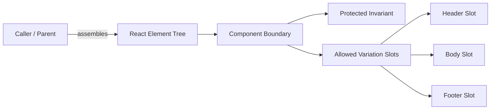
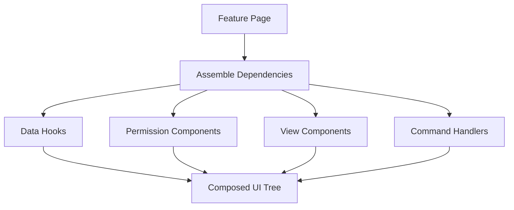
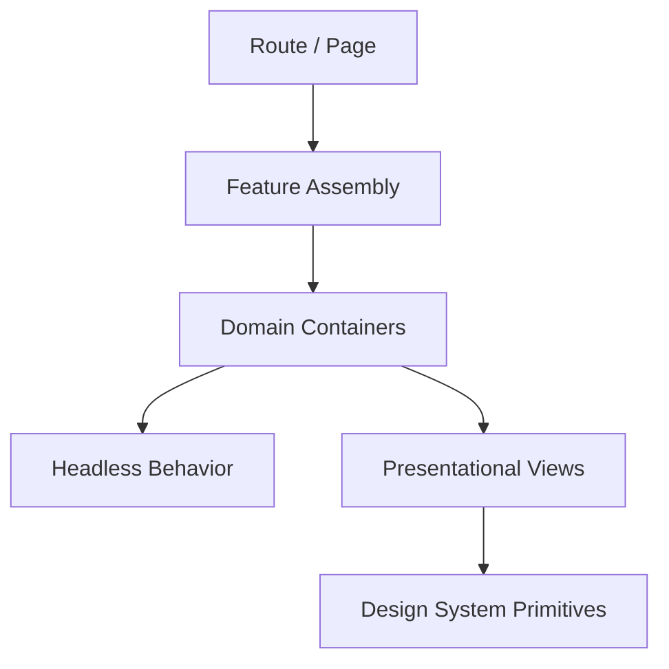

# Part 021 — Composition Over Configuration

Module sebelumnya membangun correctness layer untuk Hooks. Sekarang kita naik satu level: **bagaimana komponen disusun menjadi sistem UI yang bisa tumbuh tanpa menjadi kumpulan props, flags, dan conditional rendering yang rapuh**.

React sering disebut “component-based”. Itu benar, tetapi belum cukup. Banyak codebase React tetap kacau walaupun semua file-nya adalah komponen. Masalahnya bukan “apakah memakai komponen”, melainkan:

```txt
Siapa yang menyusun komponen?
Siapa yang mengontrol variasi?
Apakah variasi dikodekan sebagai konfigurasi/flag, atau sebagai struktur tree?
Apakah child diberi data final, atau diberi terlalu banyak knowledge tentang dunia luar?
Apakah API komponen mengekspresikan invariant, atau hanya membuka semua kemungkinan?
```

**Composition over configuration** berarti kita lebih sering membiarkan caller menyusun struktur UI dengan elemen, slot, dan child components, daripada membuat satu komponen besar yang dikendalikan oleh puluhan prop konfigurasi.

Ini bukan dogma. Configuration tetap berguna. Tetapi ketika configuration berubah menjadi mini-language, composition biasanya lebih jujur, lebih testable, dan lebih mudah dievolusi.

---

## 1. Masalah yang Sebenarnya

Misalkan kita punya `Panel`.

Awalnya sederhana:

```tsx
function Panel({ title, children }: { title: string; children: React.ReactNode }) {
  return (
    <section className="panel">
      <h2>{title}</h2>
      <div>{children}</div>
    </section>
  );
}
```

Lalu product butuh subtitle.

```tsx
<Panel title="Cases" subtitle="Open enforcement cases" />
```

Lalu butuh action button.

```tsx
<Panel
  title="Cases"
  subtitle="Open enforcement cases"
  actionLabel="Create"
  onAction={openCreateCase}
/>
```

Lalu butuh secondary action, badge, loading state, empty state, error state, permission-aware action, compact mode, sticky header, custom footer, and so on.

Hasilnya sering menjadi ini:

```tsx
<Panel
  title="Cases"
  subtitle="Open enforcement cases"
  badge="12"
  showBadge
  actionLabel="Create"
  actionIcon="plus"
  actionDisabled={!canCreate}
  actionTooltip="You do not have permission"
  onAction={openCreateCase}
  secondaryActionLabel="Export"
  onSecondaryAction={exportCases}
  variant="elevated"
  compact={isCompact}
  stickyHeader
  isLoading={query.isLoading}
  isError={query.isError}
  errorMessage="Failed to load cases"
  emptyMessage="No cases found"
  footer={<Pagination />}
/>
```

Ini bukan component API. Ini **configuration landfill**.

Komponen mulai menyimpan terlalu banyak pengetahuan:

- apa itu action;
- bagaimana action dirender;
- berapa action yang mungkin ada;
- bagaimana permission direpresentasikan;
- bagaimana loading/error/empty ditangani;
- bagaimana footer dibentuk;
- bagaimana variasi layout berkembang.

Masalahnya bukan jumlah props semata. Masalahnya adalah props tersebut membentuk **bahasa konfigurasi tersembunyi**.

---

## 2. Mental Model: Component Is a Boundary, Composition Is Assembly

Komponen yang baik biasanya punya dua sisi:

```txt
inside  : invariant yang dilindungi komponen
outside : ruang variasi yang boleh dikendalikan caller
```

Composition adalah cara caller mengisi ruang variasi itu dengan struktur React tree.



Prinsipnya:

```txt
Komponen harus strict pada invariant,
tetapi longgar pada variasi yang sah.
```

Contoh invariant `Panel`:

- selalu render sebagai `section`;
- header berada sebelum body;
- spacing konsisten;
- accessible label tersedia;
- content tidak keluar dari layout boundary.

Contoh variasi yang bisa diberikan caller:

- title content;
- action area;
- body content;
- footer content;
- badge;
- contextual help.

Daripada membuat prop untuk setiap variasi, kita bisa memberi slot.

---

## 3. React Primitive untuk Composition

React memberi composition primitive yang sangat sederhana:

1. props;
2. `children`;
3. elemen sebagai value;
4. komponen sebagai value;
5. function sebagai value;
6. context untuk implicit passing;
7. hooks untuk reusable stateful protocol.

React tidak punya “slot syntax” khusus seperti beberapa framework lain. Slot di React biasanya hanyalah prop yang berisi `ReactNode`, `ReactElement`, component type, atau render function.

```tsx
type PanelProps = {
  header: React.ReactNode;
  children: React.ReactNode;
  footer?: React.ReactNode;
};

function Panel({ header, children, footer }: PanelProps) {
  return (
    <section className="panel" aria-labelledby="panel-title">
      <div className="panel-header">{header}</div>
      <div className="panel-body">{children}</div>
      {footer ? <div className="panel-footer">{footer}</div> : null}
    </section>
  );
}
```

Usage:

```tsx
<Panel
  header={
    <Stack direction="horizontal" justify="between">
      <div>
        <h2 id="panel-title">Cases</h2>
        <p>Open enforcement cases</p>
      </div>
      <CreateCaseButton />
    </Stack>
  }
  footer={<Pagination page={page} onPageChange={setPage} />}
>
  <CaseTable cases={cases} />
</Panel>
```

Sekarang `Panel` tidak perlu tahu apa itu `CreateCaseButton`, permission, export, pagination, atau case table. `Panel` menjaga layout contract. Caller menyusun isi.

---

## 4. Configuration vs Composition

Jangan membuang configuration. Configuration cocok ketika pilihan kecil, stabil, dan benar-benar bagian dari desain komponen.

Contoh configuration yang sehat:

```tsx
<Button variant="primary" size="sm" disabled={isSubmitting}>
  Save
</Button>
```

`variant` dan `size` adalah bounded design-system options. Itu bukan mini-application.

Configuration mulai bermasalah ketika:

- jumlah prop terus bertambah;
- prop saling bergantung;
- beberapa kombinasi prop invalid;
- caller butuh markup khusus;
- component harus tahu domain terlalu banyak;
- boolean flag mengubah struktur besar;
- komponen punya nested conditional rendering yang tidak terbaca;
- dokumentasi prop lebih panjang daripada implementasi.

Decision matrix:

| Kebutuhan | Lebih cocok configuration | Lebih cocok composition |
|---|---:|---:|
| Variasi kecil dan finite | Ya | Kadang |
| Variasi domain-specific | Tidak | Ya |
| Caller perlu custom markup | Tidak | Ya |
| Komponen harus menjaga layout invariant | Ya | Ya |
| Banyak kombinasi invalid | Tidak | Ya, atau state machine |
| Perlu design-system token | Ya | Tidak selalu |
| Perlu override behavior | Tidak selalu | Ya, lewat injected component/function |
| Perlu readability di call site | Kadang | Ya jika slot jelas |

Rule praktis:

```txt
Gunakan configuration untuk pilihan kecil.
Gunakan composition untuk struktur.
Gunakan state machine untuk workflow.
Gunakan custom hook/headless component untuk behavior reusable.
```

---

## 5. Boolean Props adalah Bau Desain, Bukan Selalu Bug

Boolean prop tidak salah. `disabled`, `checked`, `required`, `open` adalah prop yang natural.

Yang berbahaya adalah boolean yang mengubah mode besar.

```tsx
<DataPanel
  showFilters
  showBulkActions
  showExport
  showCreate
  showOwnerColumn
  showRiskColumn
  compact
  embedded
  adminMode
/>
```

Ini biasanya menandakan komponen sedang memikul beberapa use case sekaligus.

Masalah boolean explosion:

```txt
N boolean => 2^N kombinasi kemungkinan.
```

10 boolean berarti 1024 kombinasi. Sebagian besar tidak pernah dites. Sebagian invalid. Sebagian menghasilkan UI aneh.

Refactor path:

```tsx
function CaseListPage() {
  return (
    <CaseListShell
      filters={<CaseFilters />}
      toolbar={<CaseToolbar />}
      table={<CaseTable columns={caseColumns} />}
      footer={<CasePagination />}
    />
  );
}
```

Sekarang variasi terlihat sebagai struktur, bukan kombinasi flag.

---

## 6. Slot Pattern

Slot adalah lubang variasi yang sengaja disediakan oleh komponen.

```tsx
type PageShellProps = {
  title: React.ReactNode;
  description?: React.ReactNode;
  actions?: React.ReactNode;
  tabs?: React.ReactNode;
  aside?: React.ReactNode;
  children: React.ReactNode;
};

function PageShell({ title, description, actions, tabs, aside, children }: PageShellProps) {
  return (
    <main className="page-shell">
      <header className="page-shell__header">
        <div>
          <h1>{title}</h1>
          {description ? <p>{description}</p> : null}
        </div>
        {actions ? <div className="page-shell__actions">{actions}</div> : null}
      </header>

      {tabs ? <nav className="page-shell__tabs">{tabs}</nav> : null}

      <div className="page-shell__content">
        <section>{children}</section>
        {aside ? <aside>{aside}</aside> : null}
      </div>
    </main>
  );
}
```

Usage:

```tsx
<PageShell
  title="Enforcement Cases"
  description="Investigate, escalate, and resolve active cases."
  actions={<CreateCaseButton />}
  tabs={<CaseStatusTabs value={status} onChange={setStatus} />}
  aside={<CaseQueueSummary />}
>
  <CaseSearchResults />
</PageShell>
```

`PageShell` tidak tahu domain `case`. Ia hanya tahu layout contract.

Slot bagus ketika:

- struktur global stabil;
- isi bervariasi;
- caller perlu kontrol penuh atas markup di slot;
- design system ingin menjaga skeleton layout;
- page-level composition harus eksplisit.

Slot buruk ketika:

- slot terlalu banyak;
- slot tidak punya semantic boundary;
- slot mengizinkan caller merusak accessibility invariant;
- slot menjadi dumping ground untuk arbitrary hacks.

---

## 7. Children sebagai Slot Default

`children` adalah slot default.

Gunakan `children` ketika komponen adalah wrapper natural:

```tsx
<Card>
  <CardTitle>Risk Summary</CardTitle>
  <RiskMeter value={riskScore} />
</Card>
```

Jangan memaksa `children` untuk semua hal.

Buruk:

```tsx
<Dialog>
  <DialogHeader />
  <DialogBody />
  <DialogFooter />
</Dialog>
```

Bentuk ini bisa bagus, tetapi hanya jika `DialogHeader`, `DialogBody`, dan `DialogFooter` punya kontrak jelas. Kalau tidak, caller bisa menaruh apa pun dalam urutan apa pun dan merusak accessibility.

Untuk komponen yang sangat strict, named slots lebih jelas:

```tsx
<Dialog
  title="Close case?"
  body={<p>This action cannot be undone.</p>}
  footer={<ConfirmCloseActions />}
/>
```

Tidak ada satu bentuk universal. Pilih berdasarkan invariant.

---

## 8. Element Injection

Element injection berarti caller memberikan elemen siap render.

```tsx
type EmptyStateProps = {
  icon?: React.ReactNode;
  title: string;
  description?: string;
  action?: React.ReactNode;
};

function EmptyState({ icon, title, description, action }: EmptyStateProps) {
  return (
    <div className="empty-state">
      {icon}
      <h2>{title}</h2>
      {description ? <p>{description}</p> : null}
      {action}
    </div>
  );
}
```

Usage:

```tsx
<EmptyState
  icon={<InboxIcon />}
  title="No cases found"
  description="Try adjusting your filters."
  action={<Button onClick={clearFilters}>Clear filters</Button>}
/>
```

Element injection cocok ketika komponen penerima tidak perlu mengontrol props internal elemen itu.

Kelemahannya:

- penerima tidak bisa menambahkan prop secara type-safe;
- penerima tidak mudah mengontrol behavior elemen;
- caller bertanggung jawab membuat elemen benar.

Kalau penerima perlu memberi data kepada renderer, gunakan render function.

---

## 9. Component Injection

Component injection berarti caller memberi component type, bukan element instance.

```tsx
type ListProps<T> = {
  items: T[];
  ItemComponent: React.ComponentType<{ item: T }>;
};

function List<T>({ items, ItemComponent }: ListProps<T>) {
  return (
    <ul>
      {items.map((item, index) => (
        <li key={index}>
          <ItemComponent item={item} />
        </li>
      ))}
    </ul>
  );
}
```

Usage:

```tsx
<List items={cases} ItemComponent={CaseListItem} />
```

Component injection cocok ketika penerima perlu mengontrol kapan dan bagaimana component dirender, tetapi caller menentukan implementasinya.

Namun hati-hati dengan component identity.

Buruk:

```tsx
<List
  items={cases}
  ItemComponent={({ item }) => <CaseListItem item={item} compact />}
/>
```

Inline component type bisa membuat identity berubah dan menyebabkan remount di beberapa pola pemakaian.

Lebih aman:

```tsx
function CompactCaseListItem({ item }: { item: Case }) {
  return <CaseListItem item={item} compact />;
}

<List items={cases} ItemComponent={CompactCaseListItem} />
```

Untuk banyak kasus, render function lebih natural daripada component injection.

---

## 10. Render Function

Render function memberi penerima kendali terhadap data, dan caller kendali terhadap markup.

```tsx
type DataState<T> =
  | { status: "loading" }
  | { status: "error"; error: Error }
  | { status: "success"; data: T };

type DataBoundaryProps<T> = {
  state: DataState<T>;
  loading?: React.ReactNode;
  error?: (error: Error) => React.ReactNode;
  children: (data: T) => React.ReactNode;
};

function DataBoundary<T>({ state, loading, error, children }: DataBoundaryProps<T>) {
  if (state.status === "loading") {
    return <>{loading ?? <Spinner />}</>;
  }

  if (state.status === "error") {
    return <>{error ? error(state.error) : <ErrorMessage error={state.error} />}</>;
  }

  return <>{children(state.data)}</>;
}
```

Usage:

```tsx
<DataBoundary
  state={caseQueryState}
  loading={<CaseTableSkeleton />}
  error={(error) => <CaseLoadError error={error} onRetry={retry} />}
>
  {(cases) => <CaseTable cases={cases} />}
</DataBoundary>
```

Render function cocok ketika:

- penerima punya state/data internal;
- caller butuh render output custom;
- variasi bergantung pada value runtime;
- kita ingin menghindari prop explosion.

Trade-off:

- nesting bisa berat;
- function baru dibuat tiap render, biasanya bukan masalah, tapi bisa berdampak jika child dimemoisasi manual;
- readability menurun jika terlalu banyak render prop bertingkat.

---

## 11. Headless Composition

Headless component atau headless hook memisahkan behavior dari rendering.

Contoh sederhana: disclosure.

```tsx
type UseDisclosureOptions = {
  defaultOpen?: boolean;
  onOpenChange?: (open: boolean) => void;
};

function useDisclosure(options: UseDisclosureOptions = {}) {
  const [open, setOpen] = React.useState(options.defaultOpen ?? false);

  const setOpenControlled = React.useCallback(
    (next: boolean) => {
      setOpen(next);
      options.onOpenChange?.(next);
    },
    [options]
  );

  return {
    open,
    openPanel: () => setOpenControlled(true),
    closePanel: () => setOpenControlled(false),
    togglePanel: () => setOpenControlled(!open),
    triggerProps: {
      "aria-expanded": open,
      onClick: () => setOpenControlled(!open),
    },
    panelProps: {
      hidden: !open,
    },
  };
}
```

Usage:

```tsx
function HelpDisclosure() {
  const disclosure = useDisclosure();

  return (
    <section>
      <button {...disclosure.triggerProps}>Why is this case flagged?</button>
      <div {...disclosure.panelProps}>
        This case matches the high-risk escalation rule.
      </div>
    </section>
  );
}
```

Headless style cocok ketika:

- behavior reusable;
- visual design berbeda antar product;
- accessibility contract harus dijaga;
- stateful protocol lebih penting daripada markup default;
- design system ingin menyediakan primitive, bukan product UI final.

Tetapi headless bukan alasan untuk melepas semua invariant ke caller. Hook harus tetap memberi prop getter, command, dan state yang jelas.

---

## 12. Composition sebagai Dependency Injection

Dalam React, dependency injection sering tidak perlu container framework. Tree itu sendiri adalah injection mechanism.

```tsx
<AuditTrailPanel
  formatter={caseAuditFormatter}
  emptyState={<NoAuditEvents />}
  eventRenderer={(event) => <AuditEventRow event={event} />}
/>
```

Atau:

```tsx
<CaseWorkflowShell
  permissionGate={<PermissionGate capability="case.transition" />}
  transitionDialog={<TransitionCaseDialog />}
  auditPreview={<AuditPreview />}
/>
```

Caller menyuntikkan capability dan UI behavior melalui composition.

Mental model:



Composition membuat dependency terlihat di call site. Ini bagus untuk review arsitektur karena reviewer bisa melihat wiring tanpa membuka implementasi komponen internal.

---

## 13. API Surface: Closed Core, Open Edge

Komponen production-grade perlu memutuskan bagian mana yang closed dan bagian mana yang open.

Contoh `Dialog`:

Closed core:

- focus management;
- escape key behavior;
- backdrop click policy;
- aria attributes;
- portal root;
- scroll lock;
- close lifecycle.

Open edge:

- title content;
- body content;
- footer actions;
- size;
- destructive vs normal tone;
- optional description.

API yang buruk memberi caller terlalu banyak kekuasaan:

```tsx
<Dialog
  renderBackdrop={...}
  renderFocusTrap={...}
  renderPortal={...}
  renderCloseButton={...}
  shouldCloseOnEveryPossibleThing={...}
/>
```

Ini membuat invariant dialog bocor.

API yang lebih baik:

```tsx
<Dialog open={open} onOpenChange={setOpen} size="md">
  <Dialog.Header>Close case?</Dialog.Header>
  <Dialog.Body>
    This will mark the case as closed and create an audit entry.
  </Dialog.Body>
  <Dialog.Footer>
    <Button variant="secondary" onClick={() => setOpen(false)}>Cancel</Button>
    <Button variant="danger" onClick={confirmClose}>Close case</Button>
  </Dialog.Footer>
</Dialog>
```

Dialog mengontrol protocol. Caller mengontrol content.

---

## 14. Composition dan State Ownership

Composition tidak boleh dipakai untuk mengaburkan ownership.

Pertanyaan utama:

```txt
Siapa yang memiliki state?
Siapa yang boleh mengubah state?
Siapa yang hanya membaca state?
Siapa yang hanya menyusun UI?
```

Contoh bermasalah:

```tsx
<CaseTable
  cases={cases}
  toolbar={<BulkActionToolbar selectedIds={selectedIds} setSelectedIds={setSelectedIds} />}
/>
```

Di sini `CaseTable` menerima `toolbar`, tetapi selection state mungkin sebenarnya dimiliki table. Jika `toolbar` dan table perlu sinkron, caller harus menjadi owner state, atau table harus menyediakan render slot dengan selection API.

Lebih jelas:

```tsx
<SelectableCaseTable cases={cases}>
  {({ selectedIds, clearSelection }) => (
    <BulkActionToolbar
      selectedIds={selectedIds}
      onClearSelection={clearSelection}
    />
  )}
</SelectableCaseTable>
```

Atau:

```tsx
function CaseListPage() {
  const selection = useSelection<string>();

  return (
    <>
      <BulkActionToolbar selection={selection} />
      <CaseTable cases={cases} selection={selection} />
    </>
  );
}
```

Pilih berdasarkan ownership:

- jika selection adalah behavior internal table, table dapat expose render function;
- jika selection dipakai oleh banyak sibling, parent/page menjadi owner;
- jika selection global lintas page, external store atau URL state mungkin lebih tepat.

---

## 15. Composition Tidak Sama dengan Prop Drilling

Prop drilling sering dianggap buruk, lalu semua hal dimasukkan ke context. Itu reaksi yang terlalu kasar.

Prop passing adalah explicit data flow. Itu bagus ketika jarak pendek dan dependency penting untuk terlihat.

Composition bisa mengurangi prop drilling dengan menyusun child lebih dekat ke data owner.

Buruk:

```tsx
function App() {
  const user = useUser();

  return <Layout user={user} />;
}

function Layout({ user }: Props) {
  return <Sidebar user={user} />;
}

function Sidebar({ user }: Props) {
  return <UserMenu user={user} />;
}
```

Lebih compositional:

```tsx
function App() {
  const user = useUser();

  return (
    <Layout
      sidebar={<UserMenu user={user} />}
      content={<Dashboard />}
    />
  );
}
```

`Layout` tidak perlu tahu `user`. `Sidebar` tidak perlu jadi perantara pasif.

Composition menghilangkan “middleman props” tanpa membuat dependency menjadi implicit global.

---

## 16. Composition dan Permission Boundary

Dalam aplikasi enterprise, permission sering membuat component API bengkak.

Buruk:

```tsx
<CaseActions
  canCreate={canCreate}
  canExport={canExport}
  canEscalate={canEscalate}
  canClose={canClose}
  onCreate={createCase}
  onExport={exportCases}
  onEscalate={escalateCase}
  onClose={closeCase}
/>
```

Lebih compositional:

```tsx
<ActionBar>
  <PermissionGate capability="case.create">
    <CreateCaseButton />
  </PermissionGate>

  <PermissionGate capability="case.export">
    <ExportCasesButton />
  </PermissionGate>

  <PermissionGate capability="case.escalate">
    <EscalateCaseButton />
  </PermissionGate>
</ActionBar>
```

`ActionBar` hanya menjaga layout action. Permission policy berada di boundary yang memang mengerti permission. Action button mengerti command spesifik.

Ini membuat perubahan permission tidak memaksa `ActionBar` tumbuh.

---

## 17. Composition dan Error/Loading Boundary

Configuration sering membuat data component membengkak:

```tsx
<DataTable
  data={cases}
  isLoading={isLoading}
  isError={isError}
  errorMessage="Failed to load cases"
  emptyMessage="No cases"
  loadingRows={10}
/>
```

Untuk table kecil ini mungkin cukup. Untuk aplikasi besar, loading/error/empty sering punya behavior domain.

Composition:

```tsx
<QueryBoundary
  query={casesQuery}
  loading={<CaseTableSkeleton rows={10} />}
  error={(error) => <CaseTableError error={error} onRetry={casesQuery.refetch} />}
  empty={<NoCasesEmptyState onCreate={openCreateCase} />}
>
  {(cases) => <CaseTable cases={cases} />}
</QueryBoundary>
```

Boundary mengontrol status protocol. Caller mengontrol representasi domain.

---

## 18. Composition dan Key/Identity

Composition bisa menyebabkan remount tidak sengaja jika kita tidak memperhatikan identity.

Contoh:

```tsx
function Page({ mode }: { mode: "compact" | "full" }) {
  const Toolbar = mode === "compact" ? CompactToolbar : FullToolbar;

  return <Shell toolbar={<Toolbar />} />;
}
```

Ini biasanya aman karena element type berganti memang diinginkan.

Tetapi ini bermasalah:

```tsx
function Page() {
  function Toolbar() {
    return <CaseToolbar />;
  }

  return <Shell toolbar={<Toolbar />} />;
}
```

`Toolbar` didefinisikan di dalam render. Identitas component type baru dibuat setiap render. Dalam banyak kasus ini memicu reset state subtree.

Lebih baik:

```tsx
function Toolbar() {
  return <CaseToolbar />;
}

function Page() {
  return <Shell toolbar={<Toolbar />} />;
}
```

Atau langsung:

```tsx
function Page() {
  return <Shell toolbar={<CaseToolbar />} />;
}
```

Composition harus tetap menghormati model identity React yang sudah dibahas di Part 007.

---

## 19. Refactor Example: From Mega Configuration to Composition

Versi awal:

```tsx
type CasePanelProps = {
  title: string;
  cases: Case[];
  isLoading: boolean;
  isError: boolean;
  canCreate: boolean;
  canExport: boolean;
  onCreate: () => void;
  onExport: () => void;
  compact: boolean;
  showRisk: boolean;
  showOwner: boolean;
};
```

Ini mencampur:

- layout;
- data status;
- domain data;
- permission;
- table columns;
- action commands;
- presentation mode.

Langkah 1: pisahkan shell layout.

```tsx
type CasePanelShellProps = {
  header: React.ReactNode;
  toolbar?: React.ReactNode;
  children: React.ReactNode;
  footer?: React.ReactNode;
};

function CasePanelShell({ header, toolbar, children, footer }: CasePanelShellProps) {
  return (
    <section className="case-panel">
      <header>{header}</header>
      {toolbar ? <div>{toolbar}</div> : null}
      <div>{children}</div>
      {footer ? <footer>{footer}</footer> : null}
    </section>
  );
}
```

Langkah 2: buat domain assembly di parent.

```tsx
function CasePanel({ query, permissions }: Props) {
  return (
    <CasePanelShell
      header={<CasePanelHeader title="Cases" count={query.data?.length ?? 0} />}
      toolbar={
        <ActionBar>
          {permissions.canCreate ? <CreateCaseButton /> : null}
          {permissions.canExport ? <ExportCasesButton /> : null}
        </ActionBar>
      }
    >
      <QueryBoundary query={query} loading={<CaseTableSkeleton />}>
        {(cases) => <CaseTable cases={cases} columns={caseColumns} />}
      </QueryBoundary>
    </CasePanelShell>
  );
}
```

Hasil:

- shell reusable;
- permission tidak masuk shell;
- table tidak tahu loading;
- boundary status eksplisit;
- action domain berada di action component;
- variasi UI terlihat sebagai tree.

---

## 20. Layered Composition

Dalam aplikasi besar, composition terjadi di beberapa layer.



Contoh:

```tsx
function CaseSearchRoute() {
  return (
    <CaseSearchProvider>
      <CaseSearchPage />
    </CaseSearchProvider>
  );
}

function CaseSearchPage() {
  const controller = useCaseSearchController();

  return (
    <PageShell
      title="Case Search"
      actions={<CreateCaseButton />}
    >
      <CaseSearchView
        filters={controller.filters}
        results={controller.results}
        onFilterChange={controller.changeFilter}
        onSelectCase={controller.selectCase}
      />
    </PageShell>
  );
}
```

Composition bukan berarti semua logic ada di JSX. Logic tetap bisa berada di hook/controller. JSX menampilkan assembly.

---

## 21. Design Heuristics

Gunakan pertanyaan berikut saat mendesain component API.

### Pertanyaan 1: Apakah caller perlu mengontrol struktur?

Jika ya, composition.

```tsx
<Layout sidebar={<Sidebar />} main={<Main />} />
```

### Pertanyaan 2: Apakah variasinya finite dan design-system-level?

Jika ya, configuration.

```tsx
<Button variant="primary" size="sm" />
```

### Pertanyaan 3: Apakah ada banyak kombinasi invalid?

Jika ya, jangan pakai banyak boolean. Gunakan union type, composition, atau state machine.

```tsx
type Status =
  | { kind: "idle" }
  | { kind: "loading" }
  | { kind: "error"; error: Error }
  | { kind: "success"; data: Case[] };
```

### Pertanyaan 4: Apakah child perlu menerima data dari parent component internal?

Jika ya, render function atau compound component.

```tsx
<SelectableList items={items}>
  {({ item, selected, toggle }) => (
    <Row item={item} selected={selected} onToggle={toggle} />
  )}
</SelectableList>
```

### Pertanyaan 5: Apakah behavior reusable tetapi rendering berbeda?

Jika ya, custom hook/headless component.

```tsx
const combobox = useCombobox({ items, onSelect });
```

---

## 22. Failure Modes

### Failure Mode 1: Prop Explosion

Gejala:

- komponen punya puluhan props;
- boolean bertambah tiap sprint;
- dokumentasi komponen sulit dipahami;
- banyak prop hanya dipakai bersama prop lain.

Fix:

- ubah variasi struktur menjadi slot;
- kelompokkan prop domain menjadi object bermakna;
- pecah shell dari feature assembly;
- gunakan union untuk mode yang mutually exclusive.

### Failure Mode 2: Configuration Language

Gejala:

```tsx
<ReportWidget
  layout="two-column"
  primaryMetric="risk"
  secondaryMetric="sla"
  actionType="export"
  actionPlacement="top-right"
  detailMode="drawer"
/>
```

Komponen menjadi interpreter mini-language.

Fix:

```tsx
<ReportWidgetShell
  metrics={<RiskAndSlaMetrics />}
  actions={<ExportReportButton />}
  details={<ReportDetailDrawer />}
/>
```

### Failure Mode 3: Slot Tanpa Kontrak

Gejala:

- caller bisa menaruh elemen invalid;
- urutan semantic rusak;
- accessibility rusak;
- layout pecah.

Fix:

- buat named slot yang semantic;
- sediakan subcomponent resmi;
- validasi dev-only jika perlu;
- tutup bagian invariant.

### Failure Mode 4: Hidden Ownership

Gejala:

- parent dan child sama-sama punya state mirip;
- slot butuh mengubah state internal parent;
- callback chain tidak jelas.

Fix:

- pindahkan ownership ke nearest common owner;
- expose render function dengan state API;
- ekstrak state ke hook bersama;
- gunakan context/store jika jarak terlalu jauh.

### Failure Mode 5: Fake Reuse

Gejala:

- komponen “generic” tetapi penuh prop domain;
- tiap usage butuh override;
- reusable component lebih sulit daripada copy-paste kecil.

Fix:

- pisahkan primitive reusable dari product-specific assembly;
- jangan memaksa semua use case masuk satu komponen;
- buat beberapa specialized wrapper di atas primitive.

---

## 23. Anti-Pattern: One Component to Rule Them All

Komponen seperti ini sering muncul di enterprise dashboard:

```tsx
<UniversalTable
  entity="case"
  columns={columns}
  filters={filters}
  actions={actions}
  permissions={permissions}
  workflow={workflow}
  audit={audit}
  export={exportConfig}
  bulk={bulkConfig}
/>
```

Kadang ini valid untuk internal platform dengan schema kuat. Tetapi sering kali ini hanya memindahkan kompleksitas dari JSX ke JSON/config.

Pertanyaan yang harus dijawab:

```txt
Apakah ini benar-benar platform primitive?
Atau hanya satu komponen besar karena tim takut membuat komposisi eksplisit?
```

Jika konfigurasi punya:

- conditional logic;
- permission logic;
- workflow transition;
- custom renderer;
- async action;
- validation;
- domain semantics;

maka Anda sedang membangun framework kecil. Itu boleh, tetapi harus diperlakukan sebagai framework: punya schema, lifecycle, testing, versioning, migration, dan debugging story.

Kalau tidak, composition lebih aman.

---

## 24. Production Checklist

Sebelum menambahkan prop baru ke komponen, tanyakan:

```txt
Apakah prop ini finite design option, atau variasi struktur?
Apakah prop ini membuat kombinasi invalid baru?
Apakah caller sebenarnya ingin menyuntikkan elemen?
Apakah component mulai tahu domain terlalu banyak?
Apakah prop ini akan dipakai oleh lebih dari satu product context?
Apakah ini merusak invariant internal?
Apakah slot lebih jelas?
Apakah custom hook/headless boundary lebih tepat?
Apakah mode ini sebaiknya menjadi komponen berbeda?
```

Checklist component API:

- core invariant jelas;
- open variation jelas;
- prop naming menggambarkan intent, bukan implementation detail;
- boolean mode minimal;
- slot semantic;
- state ownership eksplisit;
- accessibility invariant tidak dilepas sembarangan;
- identity/remount effect dipahami;
- error/loading/empty tidak dipaksa masuk komponen presentational jika domain-specific;
- caller code tetap terbaca.

---

## 25. Latihan Implementasi

Ambil satu komponen internal yang punya banyak props. Lakukan refactor berikut:

1. Tandai prop mana yang design-system configuration.
2. Tandai prop mana yang domain-specific.
3. Tandai prop mana yang sebenarnya slot.
4. Pisahkan shell component dari feature assembly.
5. Ubah boolean mode menjadi union atau child composition.
6. Tulis ulang usage agar struktur UI terlihat di call site.
7. Buat checklist invariant yang tetap dilindungi shell.

Contoh target refactor:

```tsx
<DataCard
  title="Open Cases"
  subtitle="Cases requiring review"
  showExport
  showCreate
  showRefresh
  showOwner
  showRisk
  loading={isLoading}
  error={error}
  empty={cases.length === 0}
/>
```

Target akhir:

```tsx
<DataCardShell
  header={<OpenCasesHeader />}
  actions={<OpenCasesActions />}
>
  <QueryBoundary query={casesQuery} loading={<CaseTableSkeleton />}>
    {(cases) => <OpenCasesTable cases={cases} />}
  </QueryBoundary>
</DataCardShell>
```

---

## 26. Ringkasan

Composition over configuration bukan berarti “jangan pakai props”. Props tetap mekanisme utama komunikasi parent-child di React.

Intinya adalah:

```txt
Jangan ubah komponen menjadi interpreter untuk semua variasi.
Gunakan props untuk data dan opsi kecil.
Gunakan children/slots untuk struktur.
Gunakan render functions untuk data-driven customization.
Gunakan component injection untuk pluggable implementation.
Gunakan headless hooks untuk behavior reusable.
Gunakan state machine ketika variasi adalah workflow.
```

React kuat karena UI adalah tree. Banyak desain komponen menjadi lebih sederhana ketika kita berhenti menyembunyikan tree di balik konfigurasi dan membiarkan struktur terlihat sebagai composition.

Part berikutnya akan meninjau ulang pattern lama **container/presentational** dan mengubahnya menjadi boundary modern: data boundary, orchestration boundary, view boundary, dan domain hook boundary.

---

## References

- React Docs — Passing Props to a Component: https://react.dev/learn/passing-props-to-a-component
- React Docs — Sharing State Between Components: https://react.dev/learn/sharing-state-between-components
- React Docs — Passing Data Deeply with Context: https://react.dev/learn/passing-data-deeply-with-context
- React Docs — Reusing Logic with Custom Hooks: https://react.dev/learn/reusing-logic-with-custom-hooks
- React Docs — Preserving and Resetting State: https://react.dev/learn/preserving-and-resetting-state
