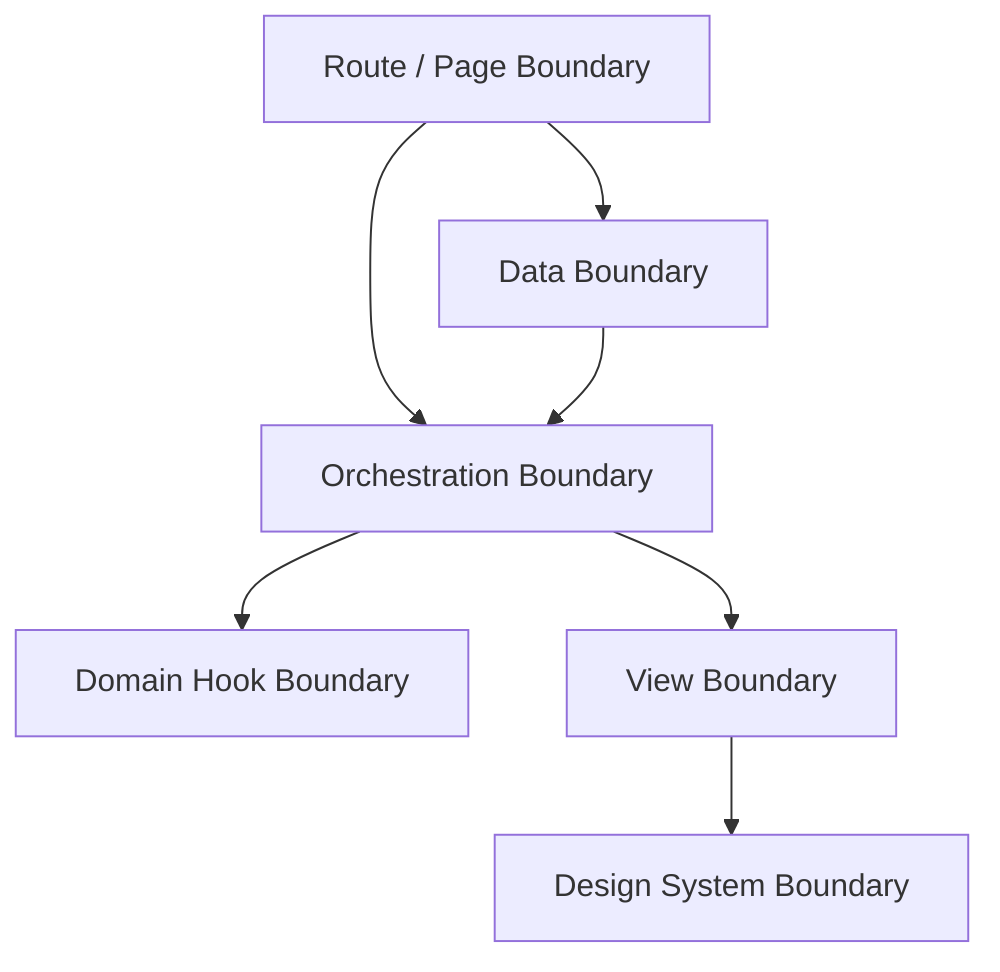
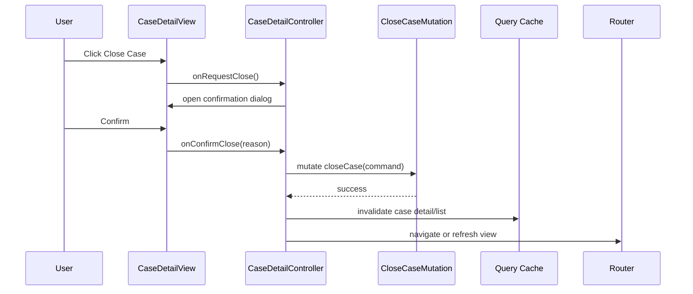

# Part 022 — Container/Presentational Revisited

Pattern **container/presentational** pernah sangat populer di React.

Versi sederhananya:

```txt
container component      : tahu data, state, side effect, store, route, API
presentational component : hanya menerima props dan merender UI
```

Pattern ini lahir dari kebutuhan yang sehat: memisahkan **cara mendapatkan/mengubah data** dari **cara menampilkan UI**.

Tetapi React modern mengubah banyak hal:

- function components menjadi default;
- Hooks membuat stateful logic bisa diekstrak tanpa class/container wrapper;
- server-state libraries membuat fetch/cache/invalidation bukan sekadar `useEffect`;
- route frameworks sering punya loader/action boundary;
- Context dan external stores membuat dependency bisa berada di banyak layer;
- React Compiler dan concurrent rendering membuat purity dan identity lebih penting;
- design systems dan headless primitives membuat “presentational” tidak selalu stateless sederhana.

Jadi, pertanyaan modernnya bukan:

```txt
Apakah komponen ini container atau presentational?
```

Pertanyaan yang lebih kuat:

```txt
Boundary apa yang sedang kita buat?
Apakah boundary ini data boundary, orchestration boundary, view boundary, domain hook boundary, atau design-system boundary?
```

Part ini tidak membuang pattern container/presentational. Kita akan memperbaikinya agar cocok untuk React modern.

---

## 1. Kenapa Pattern Ini Dulu Berguna

Container/presentational membantu memecahkan beberapa masalah nyata:

1. View component mudah dites karena hanya props masuk, UI keluar.
2. Data-fetching tidak tersebar di seluruh tree.
3. Komponen reusable tidak tergantung store global.
4. UI designer bisa bekerja pada presentational component.
5. Domain logic lebih mudah dilacak.

Contoh klasik:

```tsx
function UserListContainer() {
  const [users, setUsers] = React.useState<User[]>([]);

  React.useEffect(() => {
    fetch("/api/users")
      .then((response) => response.json())
      .then(setUsers);
  }, []);

  return <UserList users={users} />;
}

function UserList({ users }: { users: User[] }) {
  return (
    <ul>
      {users.map((user) => (
        <li key={user.id}>{user.name}</li>
      ))}
    </ul>
  );
}
```

Intinya sehat: `UserList` tidak tahu API.

Tetapi versi klasik ini punya keterbatasan:

- fetch dengan effect mudah race/leak/stale;
- container sering menjadi terlalu besar;
- setiap view punya pasangan container ritualistik;
- business logic kadang tersebar antara container dan child;
- container sering bocor sebagai “god component”.

---

## 2. Modern Replacement: Boundary Thinking

Kita ganti kategori biner menjadi beberapa boundary.



### Route/Page Boundary

Menghubungkan route, params, search params, layout, page-level providers, dan high-level composition.

### Data Boundary

Mengambil, cache, invalidate, refresh, prefetch, dan menangani server-state lifecycle.

### Orchestration Boundary

Menggabungkan beberapa state/resource/command menjadi user journey.

### Domain Hook Boundary

Menyediakan stateful protocol domain, misalnya `useCaseSearchController`, `useApprovalWorkflow`, atau `useBulkSelection`.

### View Boundary

Menerima read model dan callbacks. Fokus pada rendering dan interaction forwarding.

### Design-System Boundary

Menyediakan primitive reusable seperti `Button`, `Dialog`, `Tabs`, `Table`, `FormField`.

Pattern modern bukan lagi “container vs presentational”, tetapi **layered responsibility**.

---

## 3. Komponen Presentational Modern

Presentational component modern bukan berarti “bodoh”. Ia bisa punya local UI state selama state itu benar-benar milik presentation.

Contoh state yang valid di presentational component:

- hover/focus visual state;
- local expanded row jika tidak perlu sinkron dengan luar;
- uncontrolled input draft kecil;
- animation state;
- measurement/ref state;
- local tab selection untuk isolated widget.

Contoh state yang tidak cocok:

- selected case yang dipakai bulk action di sibling;
- current filter yang harus masuk URL;
- permission decision;
- server data cache;
- workflow transition state;
- optimistic mutation queue;
- audit-affecting decision.

Definition yang lebih akurat:

```txt
View component adalah komponen yang tidak memiliki dependency langsung pada sumber data/application service eksternal.
Ia boleh punya local UI state jika ownership-nya benar-benar lokal dan tidak merusak invariant aplikasi.
```

---

## 4. View Component Contract

View component sebaiknya menerima **read model**, bukan raw domain/server object jika raw object terlalu besar.

Buruk:

```tsx
<CaseSearchView
  query={casesQuery}
  permissions={permissionService}
  router={router}
  store={caseStore}
/>
```

Ini bukan presentational. Ini view yang diberi seluruh dunia.

Lebih baik:

```tsx
type CaseSearchViewProps = {
  filters: CaseSearchFilters;
  rows: CaseSearchRow[];
  status: "idle" | "loading" | "error" | "success";
  errorMessage?: string;
  canCreateCase: boolean;
  onFilterChange: (next: CaseSearchFilters) => void;
  onClearFilters: () => void;
  onSelectCase: (caseId: string) => void;
  onCreateCase: () => void;
  onRetry: () => void;
};
```

View menerima:

- data yang sudah disiapkan untuk render;
- status eksplisit;
- capability boolean sederhana jika memang hanya untuk display;
- callbacks sebagai intent event.

View tidak menerima:

- query client;
- router object;
- raw mutation object;
- permission service;
- global store;
- repository/API client.

---

## 5. Container Modern = Wiring Boundary, Bukan Logic Landfill

Container modern sebaiknya melakukan wiring:

- baca route/search params;
- panggil domain hooks;
- panggil query/mutation hooks;
- bentuk view model;
- definisikan command handlers;
- compose view dan boundary.

Container tidak sebaiknya menjadi tempat semua algorithm/domain logic.

Buruk:

```tsx
function CaseSearchContainer() {
  // 300 lines:
  // query parsing
  // permission calculation
  // filtering
  // sorting
  // mutation
  // modal state
  // validation
  // row mapping
  // audit formatting
  // retry policy
  // table rendering
}
```

Lebih baik:

```tsx
function CaseSearchPage() {
  const controller = useCaseSearchController();

  return (
    <CaseSearchView
      filters={controller.filters}
      rows={controller.rows}
      status={controller.status}
      errorMessage={controller.errorMessage}
      canCreateCase={controller.canCreateCase}
      onFilterChange={controller.changeFilters}
      onClearFilters={controller.clearFilters}
      onSelectCase={controller.openCase}
      onCreateCase={controller.createCase}
      onRetry={controller.retry}
    />
  );
}
```

`CaseSearchPage` masih container-ish, tetapi logic berat dipindahkan ke domain hook.

---

## 6. Domain Hook sebagai Controller Boundary

Domain hook adalah modern replacement untuk banyak container lama.

```tsx
function useCaseSearchController() {
  const [searchParams, setSearchParams] = useSearchParams();
  const filters = parseCaseFilters(searchParams);

  const permissions = useCasePermissions();
  const casesQuery = useCasesQuery(filters);
  const navigate = useNavigate();

  const rows = React.useMemo(
    () => mapCasesToRows(casesQuery.data ?? []),
    [casesQuery.data]
  );

  const changeFilters = React.useCallback(
    (next: CaseSearchFilters) => {
      setSearchParams(serializeCaseFilters(next));
    },
    [setSearchParams]
  );

  const openCase = React.useCallback(
    (caseId: string) => {
      navigate(`/cases/${caseId}`);
    },
    [navigate]
  );

  return {
    filters,
    rows,
    status: toViewStatus(casesQuery),
    errorMessage: toErrorMessage(casesQuery.error),
    canCreateCase: permissions.canCreate,
    changeFilters,
    clearFilters: () => changeFilters(defaultCaseFilters),
    openCase,
    createCase: () => navigate("/cases/new"),
    retry: casesQuery.refetch,
  };
}
```

Hook ini bukan “presentational”. Ia adalah application/domain controller untuk satu screen/feature.

Keuntungan:

- bisa dites sebagai stateful protocol;
- page component tetap kecil;
- view tetap dependency-light;
- routing/query/store detail tidak bocor ke view;
- logic bisa direuse oleh varian desktop/mobile jika perlu.

Catatan: jangan membuat semua hook menjadi global reusable abstraction. Banyak domain hook memang hanya untuk satu page. Itu tetap valid.

---

## 7. Data Boundary Modern

Dalam React modern, data fetching dengan raw `useEffect` sering bukan boundary terbaik untuk server state. Server state punya masalah khusus:

- cache;
- freshness;
- deduplication;
- cancellation;
- invalidation;
- background refetch;
- optimistic mutation;
- retry;
- pagination;
- dependent query;
- offline/reconnect behavior.

Karena itu, data boundary sering dibangun di atas framework loader atau server-state library.

Pola container modern:

```tsx
function CaseSearchDataBoundary({ children }: PropsWithChildren) {
  const filters = useCaseFiltersFromUrl();
  const casesQuery = useCasesQuery(filters);

  if (casesQuery.isPending) {
    return <CaseSearchSkeleton />;
  }

  if (casesQuery.isError) {
    return <CaseSearchError error={casesQuery.error} onRetry={casesQuery.refetch} />;
  }

  return <>{children(casesQuery.data)}</>;
}
```

Tetapi jangan berlebihan. Banyak library query sudah memberi hook yang cukup. Boundary bisa menjadi:

```tsx
<QueryBoundary query={casesQuery}>
  {(cases) => <CaseSearchView rows={mapCasesToRows(cases)} />}
</QueryBoundary>
```

Yang penting: view tidak dipaksa mengerti semua detail query lifecycle jika itu bukan tanggung jawabnya.

---

## 8. Orchestration Boundary

Orchestration berbeda dari data fetching dan rendering.

Orchestration menjawab:

```txt
Saat user melakukan A, state apa berubah?
Command apa dikirim?
Resource apa invalidated?
Modal apa dibuka?
Navigation apa terjadi?
Optimistic UI apa perlu dipasang?
Error bagaimana dikompensasi?
Audit/action tracking apa dicatat?
```

Contoh: user menutup enforcement case.

Flow:



Jika flow seperti ini dimasukkan ke view, view menjadi terlalu pintar. Jika dimasukkan ke mutation hook saja, UI decision bocor ke data layer. Jika dimasukkan ke page/controller, boundary-nya lebih jelas.

---

## 9. Presentational Component dengan Intent Events

View tidak perlu tahu implementasi command. Tetapi view perlu mengekspresikan intent user.

Buruk:

```tsx
<Button onClick={() => closeCaseMutation.mutate({ id: case.id })}>
  Close
</Button>
```

Ini membuat view tahu mutation detail.

Lebih baik:

```tsx
<CaseDetailView
  caseDetail={viewModel}
  onRequestCloseCase={controller.requestCloseCase}
  onRequestEscalation={controller.requestEscalation}
/>
```

Dalam view:

```tsx
<Button onClick={onRequestCloseCase}>Close Case</Button>
```

Callback naming harus berbasis intent, bukan implementation.

Kurang baik:

```tsx
onClickCloseMutation
onSetModalTrue
onNavigateToCase
```

Lebih baik:

```tsx
onRequestCloseCase
onOpenCase
onClearFilters
onSubmitDecision
```

Nama callback adalah bagian dari kontrak komunikasi.

---

## 10. Read Model, Command Model

Untuk layar kompleks, pisahkan read model dan command model.

```tsx
type CaseDetailReadModel = {
  id: string;
  title: string;
  statusLabel: string;
  riskLevel: "low" | "medium" | "high";
  assignedOfficerName: string;
  timeline: TimelineItem[];
  availableActions: Array<{
    kind: "close" | "escalate" | "assign";
    label: string;
    disabledReason?: string;
  }>;
};

type CaseDetailCommands = {
  onCloseCase: () => void;
  onEscalateCase: () => void;
  onAssignOfficer: () => void;
};
```

View menerima keduanya:

```tsx
function CaseDetailView({ model, commands }: Props) {
  return (
    <PageShell title={model.title}>
      <CaseSummary model={model} />
      <CaseActionBar model={model} commands={commands} />
      <CaseTimeline items={model.timeline} />
    </PageShell>
  );
}
```

Keuntungan:

- render contract jelas;
- command surface jelas;
- view tidak tahu service implementation;
- controller bisa diuji dengan event/command assertion;
- read model bisa snapshot-tested atau storybooked.

---

## 11. Layering Example: Case Search Page

Struktur file:

```txt
features/case-search/
  case-search-page.tsx
  use-case-search-controller.ts
  case-search-view.tsx
  case-search-read-model.ts
  case-search-url-state.ts
  case-search-queries.ts
  components/
    case-search-filters.tsx
    case-search-table.tsx
    case-search-empty-state.tsx
```

Page boundary:

```tsx
export function CaseSearchPage() {
  const controller = useCaseSearchController();

  return (
    <CaseSearchView
      model={controller.model}
      commands={controller.commands}
    />
  );
}
```

Controller hook:

```tsx
export function useCaseSearchController() {
  const filters = useCaseSearchUrlState();
  const casesQuery = useCasesQuery(filters.value);
  const permissions = useCasePermissions();
  const navigate = useCaseNavigation();

  const model = React.useMemo(
    () => createCaseSearchReadModel({
      filters: filters.value,
      query: casesQuery,
      permissions,
    }),
    [filters.value, casesQuery, permissions]
  );

  const commands = React.useMemo(
    () => ({
      changeFilters: filters.set,
      clearFilters: filters.clear,
      openCase: navigate.toCaseDetail,
      createCase: navigate.toCreateCase,
      retry: casesQuery.refetch,
    }),
    [filters, navigate, casesQuery.refetch]
  );

  return { model, commands };
}
```

View:

```tsx
export function CaseSearchView({ model, commands }: Props) {
  return (
    <PageShell
      title="Case Search"
      actions={model.canCreateCase ? <Button onClick={commands.createCase}>Create Case</Button> : null}
    >
      <CaseSearchFilters
        value={model.filters}
        onChange={commands.changeFilters}
        onClear={commands.clearFilters}
      />

      <CaseSearchResults
        status={model.status}
        rows={model.rows}
        error={model.error}
        onRetry={commands.retry}
        onOpenCase={commands.openCase}
      />
    </PageShell>
  );
}
```

Hasilnya bukan dogmatic container/presentational. Ini boundary yang eksplisit.

---

## 12. Kapan Harus Memisahkan Container dan View?

Tidak semua komponen butuh split.

Split berguna jika:

- view dipakai oleh beberapa data source;
- view perlu Storybook/testing tanpa app providers;
- data/query/router/store dependencies berat;
- page punya banyak orchestration;
- props contract bisa menjadi read model stabil;
- tim UI dan domain logic berbeda ownership;
- komponen sulit dites karena terlalu banyak provider.

Tidak perlu split jika:

- komponen kecil;
- logic lokal sederhana;
- view tidak reusable;
- split hanya menghasilkan file forwarding props;
- abstraction membuat navigasi code lebih sulit;
- belum ada variasi nyata.

Decision matrix:

| Kondisi | Keep together | Split view/controller |
|---|---:|---:|
| Komponen kecil | Ya | Tidak |
| Mengakses router/query/store langsung | Kadang | Sering |
| Banyak command user journey | Tidak | Ya |
| Butuh Storybook state scenarios | Kadang | Ya |
| Hanya wrapper visual | Ya | Tidak |
| Banyak provider di test | Tidak | Ya |
| Logic domain reusable | Tidak | Ya, ekstrak hook |
| View reusable lintas context | Tidak | Ya |

---

## 13. Jangan Membuat Paired Files secara Ritual

Anti-pattern:

```txt
button-container.tsx
button-view.tsx
badge-container.tsx
badge-view.tsx
title-container.tsx
title-view.tsx
```

Ini bukan architecture. Ini ceremony.

Split harus membeli sesuatu:

- testability;
- reuse;
- clarity;
- dependency isolation;
- orchestration containment;
- design-system independence.

Kalau split tidak membeli salah satu hal itu, jangan split.

---

## 14. Presentational Tidak Berarti Tidak Punya Hooks

View component boleh memakai Hooks untuk behavior presentational.

Contoh valid:

```tsx
function ResizablePanel({ children }: PropsWithChildren) {
  const panelRef = React.useRef<HTMLDivElement | null>(null);
  const size = useElementSize(panelRef);

  return (
    <section ref={panelRef} data-size={size.category}>
      {children}
    </section>
  );
}
```

Ini masih presentational karena hook-nya mengukur UI, bukan mengambil domain data.

Contoh tidak valid untuk presentational:

```tsx
function CaseTable() {
  const cases = useCasesQuery();
  const permissions = usePermissionService();
  const navigate = useNavigate();

  // render table
}
```

Ini mengikat table ke app runtime.

Boundary bukan soal “pakai Hook atau tidak”. Boundary soal dependency dan ownership.

---

## 15. Data Leakage: Jangan Bocorkan Query Object ke View

Server-state library biasanya mengembalikan object kaya:

```tsx
{
  data,
  error,
  isPending,
  isFetching,
  isError,
  refetch,
  status,
  fetchStatus,
  ...
}
```

Melempar semua object ini ke view membuat view tergantung library detail.

Buruk:

```tsx
<CaseTable query={casesQuery} />
```

Lebih baik:

```tsx
<CaseTable
  rows={rows}
  loading={casesQuery.isPending}
  refreshing={casesQuery.isFetching && !casesQuery.isPending}
  errorMessage={toErrorMessage(casesQuery.error)}
  onRetry={casesQuery.refetch}
/>
```

Atau gunakan status union:

```tsx
type AsyncViewState<T> =
  | { kind: "pending" }
  | { kind: "refreshing"; data: T }
  | { kind: "error"; errorMessage: string }
  | { kind: "success"; data: T };
```

Dengan union, view tidak perlu tahu library.

---

## 16. Store Leakage: Jangan Bocorkan Global Store ke View

Buruk:

```tsx
function CaseToolbar() {
  const selectedIds = useCaseSelectionStore((s) => s.selectedIds);
  const clear = useCaseSelectionStore((s) => s.clear);

  return <BulkToolbar selectedIds={selectedIds} onClear={clear} />;
}
```

Ini bisa valid jika `CaseToolbar` memang container kecil. Tetapi jika disebut “presentational”, maka dependency-nya tersembunyi.

Lebih eksplisit:

```tsx
function CaseToolbarContainer() {
  const selectedIds = useCaseSelectionStore((s) => s.selectedIds);
  const clear = useCaseSelectionStore((s) => s.clear);

  return <CaseToolbar selectedIds={selectedIds} onClearSelection={clear} />;
}
```

Atau jika selection owner adalah parent:

```tsx
<CaseToolbar selectedIds={selection.selectedIds} onClearSelection={selection.clear} />
```

Pentingnya bukan nama `Container`. Pentingnya dependency boundary terlihat.

---

## 17. Permission Leakage

Permission sering menjadi dependency app-level yang bocor ke view.

Buruk:

```tsx
function CaseActions({ caseId }: { caseId: string }) {
  const authz = useAuthorization();

  return authz.can("case.close", caseId) ? <CloseButton /> : null;
}
```

Ini bisa valid untuk permission-aware container. Tetapi untuk view murni, lebih baik controller menghitung capability.

```tsx
<CaseActionsView
  actions={[
    { kind: "close", label: "Close case", disabledReason: closeDisabledReason },
    { kind: "escalate", label: "Escalate", disabledReason: escalateDisabledReason },
  ]}
  onAction={commands.runAction}
/>
```

Atau gunakan composition dengan `PermissionGate` di orchestration layer:

```tsx
<ActionBar>
  <PermissionGate capability="case.close" subject={caseId}>
    <CloseCaseButton onClick={commands.requestClose} />
  </PermissionGate>
</ActionBar>
```

Pilih berdasarkan kebutuhan auditability dan reuse.

---

## 18. Testing Strategy

Boundary thinking membuat test lebih tajam.

### Test view sebagai pure UI behavior

```tsx
it("calls onClearFilters when clear button is clicked", async () => {
  const onClearFilters = vi.fn();

  render(
    <CaseSearchView
      model={caseSearchModelWithFilters}
      commands={{ ...fakeCommands, clearFilters: onClearFilters }}
    />
  );

  await userEvent.click(screen.getByRole("button", { name: /clear filters/i }));

  expect(onClearFilters).toHaveBeenCalledOnce();
});
```

Tidak perlu router/query provider.

### Test controller sebagai stateful protocol

```tsx
it("updates URL state when filters change", () => {
  const harness = renderHookWithRouter(() => useCaseSearchController());

  act(() => {
    harness.result.current.commands.changeFilters({ status: "open" });
  });

  expect(harness.location.search).toContain("status=open");
});
```

### Test integration untuk wiring

```tsx
it("loads cases and opens detail page", async () => {
  render(<CaseSearchPage />, { wrapper: AppTestProviders });

  await screen.findByText("CASE-001");
  await userEvent.click(screen.getByRole("link", { name: /CASE-001/i }));

  expect(location.pathname).toBe("/cases/CASE-001");
});
```

Layer berbeda, test berbeda.

---

## 19. Storybook sebagai View Boundary Lab

Jika view menerima read model dan commands, Storybook menjadi sangat kuat.

```tsx
export const Loading = {
  args: {
    model: caseSearchLoadingModel,
    commands: fakeCommands,
  },
};

export const Empty = {
  args: {
    model: caseSearchEmptyModel,
    commands: fakeCommands,
  },
};

export const Error = {
  args: {
    model: caseSearchErrorModel,
    commands: fakeCommands,
  },
};

export const WithResults = {
  args: {
    model: caseSearchSuccessModel,
    commands: fakeCommands,
  },
};
```

Ini sulit jika view langsung memanggil query/router/store.

---

## 20. Migration Path dari Legacy Container

Misalkan legacy component:

```tsx
function CaseDashboard() {
  const [filters, setFilters] = React.useState(defaultFilters);
  const [selectedIds, setSelectedIds] = React.useState<string[]>([]);
  const cases = useCases(filters);
  const permissions = usePermissions();
  const router = useRouter();

  // many handlers
  // many derived values
  // big JSX
}
```

Migration step-by-step:

### Step 1: Extract presentational view without changing logic

```tsx
function CaseDashboard() {
  // existing logic
  return <CaseDashboardView {...props} />;
}
```

Jangan refactor semua sekaligus.

### Step 2: Define read model

```tsx
const model = createCaseDashboardModel({ cases, filters, selectedIds, permissions });
```

### Step 3: Group commands

```tsx
const commands = {
  changeFilters,
  clearFilters,
  selectCase,
  clearSelection,
  openCase,
  exportCases,
};
```

### Step 4: Extract controller hook

```tsx
function useCaseDashboardController() {
  // moved logic
  return { model, commands };
}
```

### Step 5: Reduce prop surface

```tsx
<CaseDashboardView model={model} commands={commands} />
```

### Step 6: Move domain-independent pieces to design-system/component library

Shell, table primitive, toolbar layout, empty state primitive.

---

## 21. Failure Modes

### Failure Mode 1: God Container

Gejala:

- satu file page 500+ lines;
- semua query/mutation/modal/router/permission ada di satu tempat;
- child hanya menerima data mentah;
- bug kecil butuh memahami seluruh page.

Fix:

- extract domain hook;
- group read model;
- group commands;
- split data boundary dan view boundary;
- move pure mapping functions outside React.

### Failure Mode 2: Fake Presentational Component

Gejala:

- component menerima props, tetapi juga membaca store/router/context diam-diam;
- test perlu banyak provider;
- component sulit dipakai di Storybook.

Fix:

- rename sebagai container jika dependency memang perlu;
- inject data sebagai props;
- pindahkan dependency ke controller/page boundary.

### Failure Mode 3: Anemic Container

Gejala:

- container hanya forward props tanpa nilai tambah;
- banyak file tanpa alasan;
- developer harus buka 4 file untuk memahami satu button.

Fix:

- inline kembali;
- split hanya saat ada dependency isolation nyata.

### Failure Mode 4: Query Object Coupling

Gejala:

- view tergantung `isPending`, `isFetching`, `refetch`, `status` dari library tertentu;
- migrasi query library menyentuh banyak view;
- UI state semantics tidak konsisten antar screen.

Fix:

- map query result ke async view state;
- centralize query-to-view conversion;
- gunakan boundary component untuk status umum.

### Failure Mode 5: Callback Soup

Gejala:

```tsx
<View
  onClickA={...}
  onClickB={...}
  onChangeC={...}
  onSubmitD={...}
  onOpenE={...}
  onCloseF={...}
/>
```

Fix:

- group commands by domain;
- gunakan intent naming;
- pecah view menjadi sub-view;
- pertimbangkan reducer/state machine untuk workflow.

### Failure Mode 6: View Model Terlalu Tebal

Gejala:

- read model menjadi duplikasi seluruh domain object;
- mapping mahal dan sulit dilacak;
- setiap field domain disalin tanpa alasan.

Fix:

- map hanya data yang benar-benar dibutuhkan view;
- gunakan selector pure;
- pertahankan domain object jika view memang domain-specific dan contract stabil.

---

## 22. Naming Convention yang Membantu

Nama file/component harus mengungkap boundary.

Contoh:

```txt
CaseSearchPage             route/page assembly
CaseSearchView             view boundary
useCaseSearchController    orchestration/domain hook
CaseSearchResults          sub-view
CaseSearchFilters          sub-view/input boundary
CaseSearchDataBoundary     optional data status boundary
CaseTable                  reusable/domain table view
DataTable                  design-system primitive
```

Hindari nama terlalu generik:

```txt
Manager
Handler
Wrapper
Helper
Container2
NewContainer
SmartComponent
```

Nama buruk membuat dependency boundary kabur.

---

## 23. Practical Architecture Rule

Untuk screen kompleks, struktur default yang sehat:

```tsx
export function FeaturePage() {
  const controller = useFeatureController();
  return <FeatureView model={controller.model} commands={controller.commands} />;
}
```

Lalu pecah hanya jika perlu:

```tsx
export function FeaturePage() {
  return (
    <FeatureProviders>
      <FeatureDataBoundary>
        <FeatureControllerBoundary />
      </FeatureDataBoundary>
    </FeatureProviders>
  );
}
```

Jangan mulai dari architecture besar. Mulai dari boundary minimal yang jelas.

---

## 24. Checklist Boundary

Sebelum menyebut komponen “presentational”, cek:

```txt
Apakah ia membaca router?
Apakah ia membaca global store?
Apakah ia membaca query/mutation langsung?
Apakah ia membaca permission service?
Apakah ia melakukan navigation?
Apakah ia melakukan API call?
Apakah ia mengatur workflow domain?
Apakah ia mengubah URL?
```

Jika ya, ia bukan view murni. Itu tidak otomatis salah. Tetapi namanya dan test strategy harus jujur.

Sebelum membuat container/controller, cek:

```txt
Apakah boundary ini mengurangi dependency view?
Apakah ia menyatukan orchestration yang memang satu user journey?
Apakah read model menjadi lebih jelas?
Apakah command model menjadi lebih jelas?
Apakah test menjadi lebih mudah?
Apakah file baru hanya forward props?
```

Kalau file baru hanya forward props, jangan buat.

---

## 25. Latihan Implementasi

Ambil satu page React yang kompleks. Lakukan audit:

1. Tandai semua dependency: router, query, store, context, permission, local state.
2. Tandai semua state owner.
3. Tandai semua user intent event.
4. Tandai semua derived view data.
5. Pisahkan read model dan commands.
6. Extract `useFeatureController` jika page terlalu besar.
7. Ubah view agar menerima `model` dan `commands`.
8. Buat Storybook stories untuk loading, error, empty, success, permission denied.
9. Buat test controller untuk command penting.
10. Hapus split yang tidak memberi value.

Target akhir bukan jumlah file tertentu. Targetnya adalah boundary yang bisa dijelaskan dalam satu menit.

---

## 26. Ringkasan

Container/presentational bukan pattern mati. Ia hanya terlalu sederhana untuk React modern jika dipahami sebagai kategori biner.

Versi modernnya:

```txt
Page/route boundary       : menyusun screen besar
Data boundary             : server-state lifecycle
Controller/domain hook    : orchestration dan application behavior
View boundary             : read model + intent callbacks
Design-system boundary    : reusable UI primitive
```

Presentational component modern boleh punya local UI state. Yang tidak boleh adalah menyembunyikan dependency application-level tanpa alasan.

Container modern bukan tempat menumpuk semua logic. Ia adalah wiring boundary yang menghubungkan data, command, state, dan view secara eksplisit.

Part berikutnya akan masuk ke **controlled dan uncontrolled components**, yaitu pattern ownership yang sangat penting untuk form, input, modal, tab, accordion, table selection, dan semua komponen yang bisa dikendalikan dari luar atau mengelola state sendiri.

---

## References

- React Docs — Passing Props to a Component: https://react.dev/learn/passing-props-to-a-component
- React Docs — Sharing State Between Components: https://react.dev/learn/sharing-state-between-components
- React Docs — Choosing the State Structure: https://react.dev/learn/choosing-the-state-structure
- React Docs — Reusing Logic with Custom Hooks: https://react.dev/learn/reusing-logic-with-custom-hooks
- React Docs — Managing State: https://react.dev/learn/managing-state
- React Docs — Synchronizing with Effects: https://react.dev/learn/synchronizing-with-effects
