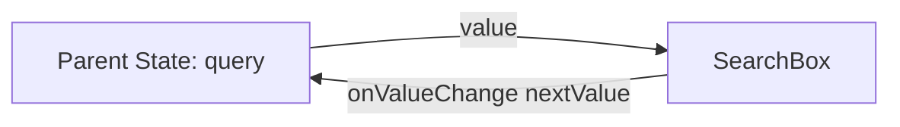
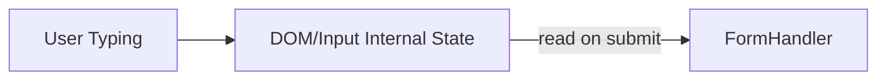
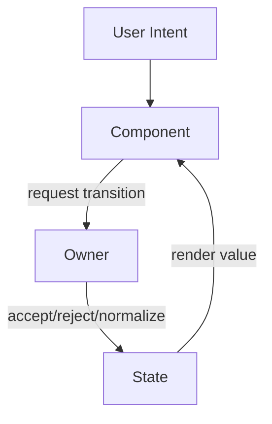
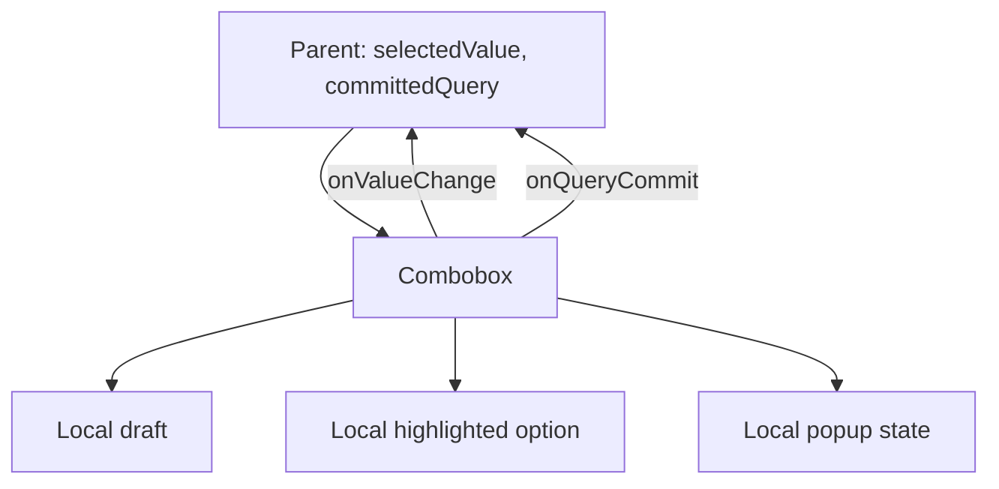

# Part 023 — Controlled and Uncontrolled Components

Controlled vs uncontrolled bukan sekadar topik form input. Ini adalah topik **state ownership**.

Pertanyaan intinya:

```txt
Siapa pemilik value saat ini?
Siapa yang boleh mengubah value?
Kapan perubahan dianggap committed?
Apakah parent perlu tahu setiap perubahan atau hanya hasil akhirnya?
Apakah komponen ini harus bisa dikontrol dari luar?
Apakah komponen ini boleh menyimpan draft internal?
```

Kalau jawaban-jawaban ini tidak jelas, UI akan menghasilkan bug klasik:

```txt
input tiba-tiba reset
cursor lompat
state parent dan child beda
komponen kadang controlled kadang uncontrolled
form kehilangan draft user
modal/tabs/table punya dua source of truth
```

Controlled/uncontrolled adalah kontrak arsitektur, bukan preferensi gaya kode.

---

## 1. Definisi Praktis

### Controlled component

Sebuah komponen disebut controlled ketika **state pentingnya dimiliki oleh parent** dan child hanya menerima state + mengirim event perubahan.

```tsx
function SearchBox({ value, onValueChange }: {
  value: string;
  onValueChange: (next: string) => void;
}) {
  return (
    <input
      value={value}
      onChange={(event) => onValueChange(event.target.value)}
    />
  );
}
```

Di sini `SearchBox` tidak memutuskan nilai akhirnya sendiri. Ia hanya menjadi view + event emitter.

State flow-nya:



Invariant:

```txt
Tampilan input harus selalu merepresentasikan parent state.
```

### Uncontrolled component

Sebuah komponen disebut uncontrolled ketika **state pentingnya disimpan internal**, bisa oleh DOM atau oleh state lokal component.

```tsx
function SearchBox() {
  return <input defaultValue="initial query" />;
}
```

Untuk membaca nilai, caller biasanya memakai ref, `FormData`, submit event, atau API imperative terbatas.

```tsx
function SearchForm() {
  function handleSubmit(event: React.FormEvent<HTMLFormElement>) {
    event.preventDefault();
    const formData = new FormData(event.currentTarget);
    const query = String(formData.get('query') ?? '');
    console.log(query);
  }

  return (
    <form onSubmit={handleSubmit}>
      <input name="query" defaultValue="react" />
      <button type="submit">Search</button>
    </form>
  );
}
```

State flow-nya:



Invariant:

```txt
React tidak harus tahu setiap intermediate keystroke.
```

---

## 2. Controlled/Uncontrolled di React DOM

Untuk native form elements, React punya perbedaan penting:

| Element | Controlled prop | Uncontrolled initial prop |
|---|---|---|
| `<input type="text" />` | `value` | `defaultValue` |
| `<textarea />` | `value` | `defaultValue` |
| `<select />` | `value` | `defaultValue` |
| checkbox/radio | `checked` | `defaultChecked` |

Aturan produksi yang tidak boleh dilanggar:

```txt
Jangan membuat satu input berubah dari uncontrolled menjadi controlled selama lifetime yang sama.
Jangan membuat satu input berubah dari controlled menjadi uncontrolled selama lifetime yang sama.
```

Bad:

```tsx
function EmailInput({ email }: { email?: string }) {
  return <input value={email} onChange={() => {}} />;
}
```

Kenapa buruk?

```txt
render pertama: email undefined -> React menganggap uncontrolled
render berikutnya: email string -> React menganggap controlled
```

Correct:

```tsx
function EmailInput({ email }: { email?: string }) {
  return <input value={email ?? ''} onChange={() => {}} />;
}
```

Untuk checkbox:

```tsx
function AcceptTerms({ checked }: { checked?: boolean }) {
  return <input type="checkbox" checked={checked ?? false} onChange={() => {}} />;
}
```

Untuk uncontrolled:

```tsx
<input defaultValue={initialEmail} />
<input type="checkbox" defaultChecked={initialAccepted} />
```

`defaultValue` dan `defaultChecked` hanya memberi nilai awal. Setelah itu DOM boleh mengelola perubahan sendiri.

---

## 3. Controlled/Uncontrolled Bukan Hanya Form

Pola ini berlaku untuk semua komponen stateful.

### Tabs controlled

```tsx
<Tabs value={activeTab} onValueChange={setActiveTab}>
  ...
</Tabs>
```

Parent mengontrol tab aktif.

### Tabs uncontrolled

```tsx
<Tabs defaultValue="overview">
  ...
</Tabs>
```

Tabs mengelola tab aktif sendiri.

### Modal controlled

```tsx
<Dialog open={isOpen} onOpenChange={setIsOpen} />
```

Parent bisa buka/tutup dari route, permission, command palette, atau workflow.

### Modal uncontrolled

```tsx
<Dialog defaultOpen={false} />
```

Dialog mengatur state internal berdasarkan trigger/close button.

### Data table row selection controlled

```tsx
<DataTable
  rows={rows}
  selectedRowIds={selectedRowIds}
  onSelectedRowIdsChange={setSelectedRowIds}
/>
```

Useful saat selection harus sinkron dengan toolbar, batch action, URL, atau domain command.

### Data table row selection uncontrolled

```tsx
<DataTable rows={rows} defaultSelectedRowIds={[]} />
```

Useful saat selection hanya concern internal table.

---

## 4. Mental Model: Owner, View, Transition

Jangan mulai dari pertanyaan “controlled atau uncontrolled?”. Mulai dari model ini:

```txt
Owner      : pihak yang menyimpan source of truth
View       : pihak yang menampilkan source of truth
Transition : pihak yang memutuskan perubahan valid/tidak
Commit     : waktu perubahan dianggap final
```

Diagram:



Dalam controlled component:

```txt
Owner      = parent
View       = child
Transition = parent atau domain layer
Commit     = parent state update
```

Dalam uncontrolled component:

```txt
Owner      = child atau DOM
View       = child/DOM
Transition = child/DOM
Commit     = submit, blur, imperative read, atau internal event
```

Ini alasan controlled component lebih cocok untuk state yang butuh koordinasi. Parent bisa menjadi single source of truth.

---

## 5. Decision Matrix

| Kondisi | Lebih cocok |
|---|---|
| Parent harus tahu setiap perubahan | Controlled |
| State memengaruhi sibling lain | Controlled |
| State harus masuk URL | Controlled |
| State dipakai untuk query/filter server | Controlled atau committed-controlled |
| State adalah draft lokal sementara | Uncontrolled/local draft |
| Field sangat banyak dan parent tidak perlu tahu setiap keystroke | Uncontrolled/form library/localized control |
| Butuh reset dari luar | Controlled atau key-based reset |
| Butuh validasi real-time lintas field | Controlled atau form state manager |
| Butuh integrasi native form submit | Uncontrolled bisa sangat efektif |
| Component library perlu fleksibel | Support both controlled and uncontrolled |

Rule of thumb:

```txt
Control state yang perlu dikoordinasikan.
Jangan control state yang hanya noise lokal.
```

---

## 6. Controlled Component: Anatomy

Controlled component minimal punya dua prop:

```txt
value
onValueChange
```

Contoh search box:

```tsx
type SearchBoxProps = {
  value: string;
  onValueChange: (nextValue: string) => void;
};

export function SearchBox({ value, onValueChange }: SearchBoxProps) {
  return (
    <input
      type="search"
      value={value}
      onChange={(event) => onValueChange(event.target.value)}
    />
  );
}
```

Caller:

```tsx
function SearchPage() {
  const [query, setQuery] = React.useState('');

  return (
    <>
      <SearchBox value={query} onValueChange={setQuery} />
      <SearchResults query={query} />
    </>
  );
}
```

Kelebihan:

```txt
single source of truth
mudah sinkron dengan URL/query/cache/sibling
mudah reset dari parent
mudah audit perubahan state
mudah membuat invariant lintas komponen
```

Biaya:

```txt
parent re-render pada setiap perubahan
API lebih verbose
caller harus menyediakan state
bisa over-centralized kalau semua hal dikontrol parent
```

---

## 7. Uncontrolled Component: Anatomy

Uncontrolled component minimal punya initial value dan commit point.

```tsx
type SearchFormProps = {
  defaultQuery?: string;
  onSearch: (query: string) => void;
};

export function SearchForm({ defaultQuery = '', onSearch }: SearchFormProps) {
  function handleSubmit(event: React.FormEvent<HTMLFormElement>) {
    event.preventDefault();

    const formData = new FormData(event.currentTarget);
    const query = String(formData.get('query') ?? '');

    onSearch(query);
  }

  return (
    <form onSubmit={handleSubmit}>
      <input name="query" type="search" defaultValue={defaultQuery} />
      <button type="submit">Search</button>
    </form>
  );
}
```

Kelebihan:

```txt
lebih sedikit re-render
lebih dekat dengan native browser form model
bagus untuk draft input yang tidak perlu diketahui parent
bagus untuk form besar dengan commit on submit
```

Biaya:

```txt
state tidak langsung terlihat oleh React parent
lebih sulit sinkron dengan sibling/URL/server query
lebih sulit melakukan real-time validation lintas field
reset dari luar perlu key, ref, atau form reset
```

---

## 8. Anti-Pattern: Double Source of Truth

Bad:

```tsx
function SearchBox({ value, onValueChange }: {
  value: string;
  onValueChange: (value: string) => void;
}) {
  const [localValue, setLocalValue] = React.useState(value);

  return (
    <input
      value={localValue}
      onChange={(event) => {
        setLocalValue(event.target.value);
        onValueChange(event.target.value);
      }}
    />
  );
}
```

Masalah:

```txt
value parent bisa berubah tetapi localValue tidak otomatis sinkron
sinkronisasi via effect akan menciptakan edge case cursor/reset
ada dua state untuk satu fakta yang sama
```

Kalau butuh local draft, namakan sebagai draft dan buat commit boundary eksplisit.

Correct draft pattern:

```tsx
type EditableTitleProps = {
  value: string;
  onCommit: (nextValue: string) => void;
};

function EditableTitle({ value, onCommit }: EditableTitleProps) {
  const [draft, setDraft] = React.useState(value);

  React.useEffect(() => {
    setDraft(value);
  }, [value]);

  return (
    <form
      onSubmit={(event) => {
        event.preventDefault();
        onCommit(draft.trim());
      }}
    >
      <input value={draft} onChange={(event) => setDraft(event.target.value)} />
      <button type="submit">Save</button>
    </form>
  );
}
```

Ini masih punya sinkronisasi, tapi sekarang maknanya jelas:

```txt
value = committed source of truth dari parent
draft = editing buffer internal
onCommit = boundary perubahan final
```

Untuk mencegah overwrite draft saat user sedang edit, bisa tambahkan dirty guard.

```tsx
function EditableTitle({ value, onCommit }: EditableTitleProps) {
  const [draft, setDraft] = React.useState(value);
  const [isDirty, setIsDirty] = React.useState(false);

  React.useEffect(() => {
    if (!isDirty) {
      setDraft(value);
    }
  }, [value, isDirty]);

  return (
    <form
      onSubmit={(event) => {
        event.preventDefault();
        onCommit(draft.trim());
        setIsDirty(false);
      }}
    >
      <input
        value={draft}
        onChange={(event) => {
          setDraft(event.target.value);
          setIsDirty(true);
        }}
      />
      <button type="submit">Save</button>
    </form>
  );
}
```

---

## 9. Controlled Shell, Uncontrolled Core

Kadang API luar harus controlled, tapi bagian dalam tetap punya state lokal untuk interaksi cepat.

Contoh: search autocomplete.

```txt
committed query       -> controlled by parent
input draft           -> local state
highlighted option    -> local state
is popup open         -> local or controlled depending on use case
selected value        -> controlled by parent
```

Diagram:



Ini bukan double source of truth jika tiap state punya makna berbeda.

Yang salah adalah dua state menyimpan fakta yang sama.

---

## 10. Designing Controllable Component APIs

Component library yang mature biasanya mendukung dua mode:

```tsx
<Tabs value={value} onValueChange={setValue} />
<Tabs defaultValue="overview" />
```

API umum:

```txt
value            controlled current value
defaultValue     uncontrolled initial value
onValueChange    notification/request when value changes
```

Untuk boolean:

```txt
open
 defaultOpen
onOpenChange
```

Untuk checked:

```txt
checked
defaultChecked
onCheckedChange
```

Untuk selected collection:

```txt
selectedKeys
defaultSelectedKeys
onSelectedKeysChange
```

Prinsip naming:

| Domain | Controlled | Uncontrolled | Event |
|---|---|---|---|
| value | `value` | `defaultValue` | `onValueChange` |
| open | `open` | `defaultOpen` | `onOpenChange` |
| checked | `checked` | `defaultChecked` | `onCheckedChange` |
| selected row ids | `selectedRowIds` | `defaultSelectedRowIds` | `onSelectedRowIdsChange` |
| expanded keys | `expandedKeys` | `defaultExpandedKeys` | `onExpandedKeysChange` |

Jangan pakai nama yang kabur:

```txt
onChange    -> terlalu generic jika value domain spesifik
onClick     -> event DOM, bukan transition domain
setValue    -> mencampur implementation detail parent
```

Lebih baik:

```txt
onTabChange
onOpenChange
onSelectionChange
onDraftCommit
onFilterCommit
```

---

## 11. Build From Scratch: `useControllableState`

Kita ingin hook kecil untuk membangun component yang bisa controlled dan uncontrolled.

Target API:

```tsx
const [value, setValue] = useControllableState({
  value: props.value,
  defaultValue: props.defaultValue,
  onChange: props.onValueChange,
});
```

Implementasi pertama:

```tsx
function useControllableState<T>({
  value,
  defaultValue,
  onChange,
}: {
  value?: T;
  defaultValue: T;
  onChange?: (value: T) => void;
}) {
  const isControlled = value !== undefined;
  const [internalValue, setInternalValue] = React.useState(defaultValue);

  const currentValue = isControlled ? value : internalValue;

  const setValue = React.useCallback(
    (nextValue: T) => {
      if (!isControlled) {
        setInternalValue(nextValue);
      }

      onChange?.(nextValue);
    },
    [isControlled, onChange]
  );

  return [currentValue, setValue] as const;
}
```

Ini cukup untuk banyak kasus, tapi belum robust.

Problem:

```txt
Tidak mendukung updater function.
Tidak mendeteksi mode switch.
value undefined mungkin value valid untuk beberapa domain.
Callback bisa dipanggil meski value sama.
```

Versi lebih kuat:

```tsx
type SetStateAction<T> = T | ((previousValue: T) => T);

type ControllableStateOptions<T> = {
  value: T | undefined;
  defaultValue: T;
  onChange?: (value: T) => void;
  isEqual?: (a: T, b: T) => boolean;
  componentName?: string;
};

function useControllableState<T>({
  value,
  defaultValue,
  onChange,
  isEqual = Object.is,
  componentName = 'Component',
}: ControllableStateOptions<T>) {
  const wasControlledRef = React.useRef(value !== undefined);
  const isControlled = value !== undefined;

  const [internalValue, setInternalValue] = React.useState(defaultValue);

  if (process.env.NODE_ENV !== 'production') {
    if (wasControlledRef.current !== isControlled) {
      console.error(
        `${componentName} changed from ${
          wasControlledRef.current ? 'controlled' : 'uncontrolled'
        } to ${isControlled ? 'controlled' : 'uncontrolled'}. ` +
          `Choose one mode for the component lifetime.`
      );
    }
  }

  const currentValue = isControlled ? (value as T) : internalValue;

  const setValue = React.useCallback(
    (next: SetStateAction<T>) => {
      const nextValue =
        typeof next === 'function'
          ? (next as (previousValue: T) => T)(currentValue)
          : next;

      if (isEqual(currentValue, nextValue)) {
        return;
      }

      if (!isControlled) {
        setInternalValue(nextValue);
      }

      onChange?.(nextValue);
    },
    [currentValue, isControlled, isEqual, onChange]
  );

  return [currentValue, setValue, isControlled] as const;
}
```

Usage:

```tsx
type TabsProps = {
  value?: string;
  defaultValue?: string;
  onValueChange?: (value: string) => void;
  children: React.ReactNode;
};

function Tabs({
  value,
  defaultValue = 'overview',
  onValueChange,
  children,
}: TabsProps) {
  const [activeTab, setActiveTab] = useControllableState({
    value,
    defaultValue,
    onChange: onValueChange,
    componentName: 'Tabs',
  });

  return (
    <TabsContext.Provider value={{ activeTab, setActiveTab }}>
      {children}
    </TabsContext.Provider>
  );
}
```

Important nuance:

```txt
`value !== undefined` adalah konvensi umum.
Jika undefined adalah value valid untuk domain Anda, pakai prop eksplisit seperti `controlledValue` atau `isControlled` internal yang dihitung dari `hasOwnProperty`.
```

Contoh dengan presence check:

```tsx
function hasProp(object: object, key: string) {
  return Object.prototype.hasOwnProperty.call(object, key);
}
```

Tapi untuk public component API, lebih baik desain domain agar `undefined` berarti “not provided”.

---

## 12. Controllable State Is Not Always Good

Mendukung controlled + uncontrolled menambah kompleksitas.

Gunakan dual-mode API ketika:

```txt
komponen adalah reusable primitive/library
caller berbeda punya kebutuhan berbeda
state sering perlu dikontrol dari luar
uncontrolled mode memberi ergonomi besar
```

Jangan gunakan dual-mode API ketika:

```txt
komponen hanya internal page-specific
state harus selalu dimiliki parent/domain
mode ganda membuat invariant kabur
team belum punya konvensi testing yang kuat
```

Untuk product-specific component, controlled-only sering lebih sederhana.

```tsx
<CaseStatusFilter value={status} onValueChange={setStatus} />
```

Untuk design-system primitive, dual mode sering layak.

```tsx
<Tabs defaultValue="details" />
<Tabs value={tabFromUrl} onValueChange={setTabFromUrl} />
```

---

## 13. Controlled Inputs and Performance

Controlled input membuat React state update pada tiap keystroke. Ini normal dan valid.

Masalah biasanya bukan input-nya, tapi parent tree terlalu besar.

Bad structure:

```tsx
function DashboardPage() {
  const [query, setQuery] = React.useState('');

  return (
    <main>
      <SearchBox value={query} onValueChange={setQuery} />
      <HugeAnalyticsTree query={query} />
      <ExpensiveChartPanel />
      <AuditLogPanel />
    </main>
  );
}
```

Kalau seluruh page berat ikut re-render setiap keystroke, isolasi state.

```tsx
function DashboardPage() {
  return (
    <main>
      <SearchSection />
      <ExpensiveChartPanel />
      <AuditLogPanel />
    </main>
  );
}

function SearchSection() {
  const [query, setQuery] = React.useState('');

  return (
    <>
      <SearchBox value={query} onValueChange={setQuery} />
      <HugeAnalyticsTree query={query} />
    </>
  );
}
```

Jika expensive result boleh lag sedikit dari input, pisahkan draft dan derived/deferred value.

```tsx
function SearchSection() {
  const [query, setQuery] = React.useState('');
  const deferredQuery = React.useDeferredValue(query);

  return (
    <>
      <SearchBox value={query} onValueChange={setQuery} />
      <HugeAnalyticsTree query={deferredQuery} />
    </>
  );
}
```

Jangan membuat input value sendiri deferred. Input harus tetap responsif terhadap typing langsung.

Better mental model:

```txt
input draft      = immediate
expensive view   = deferred
server query     = debounced/committed/query-managed
```

---

## 14. Debounced Controlled State

Search sering membutuhkan dua state:

```txt
queryDraft       = apa yang user ketik sekarang
committedQuery   = query yang dipakai fetch/filter final
```

Implementation:

```tsx
function SearchPage() {
  const [queryDraft, setQueryDraft] = React.useState('');
  const [committedQuery, setCommittedQuery] = React.useState('');

  React.useEffect(() => {
    const timeoutId = window.setTimeout(() => {
      setCommittedQuery(queryDraft.trim());
    }, 300);

    return () => window.clearTimeout(timeoutId);
  }, [queryDraft]);

  return (
    <>
      <SearchBox value={queryDraft} onValueChange={setQueryDraft} />
      <SearchResults query={committedQuery} />
    </>
  );
}
```

But note:

```txt
queryDraft dan committedQuery bukan duplicate state.
Mereka punya semantic berbeda.
```

Kalau Anda menyimpan `query` dan `sameQueryButDelayed`, itu buruk. Kalau Anda menyimpan `draft` dan `committed`, itu domain boundary.

---

## 15. Reset Semantics

Controlled reset:

```tsx
function Parent() {
  const [value, setValue] = React.useState('initial');

  return (
    <>
      <SearchBox value={value} onValueChange={setValue} />
      <button onClick={() => setValue('')}>Reset</button>
    </>
  );
}
```

Uncontrolled reset with form:

```tsx
function Form() {
  return (
    <form>
      <input name="email" defaultValue="a@example.com" />
      <button type="reset">Reset</button>
    </form>
  );
}
```

Uncontrolled reset with key:

```tsx
function Parent() {
  const [version, setVersion] = React.useState(0);

  return (
    <>
      <UncontrolledEditor key={version} defaultValue="initial" />
      <button onClick={() => setVersion((v) => v + 1)}>Reset editor</button>
    </>
  );
}
```

`key` berarti remount. Gunakan ketika memang ingin membuang seluruh internal state subtree.

---

## 16. Imperative Read with Refs

Ref valid untuk membaca uncontrolled value pada event, bukan pada render.

Correct:

```tsx
function EmailCapture() {
  const inputRef = React.useRef<HTMLInputElement | null>(null);

  function handleSubmit() {
    const email = inputRef.current?.value ?? '';
    console.log(email);
  }

  return (
    <>
      <input ref={inputRef} defaultValue="" />
      <button onClick={handleSubmit}>Submit</button>
    </>
  );
}
```

Bad:

```tsx
function EmailCapture() {
  const inputRef = React.useRef<HTMLInputElement | null>(null);
  const email = inputRef.current?.value ?? '';

  return <p>Email is {email}</p>;
}
```

Kenapa buruk?

```txt
Mutasi ref tidak menyebabkan render.
Render tidak akan otomatis mengikuti value DOM.
```

Kalau value harus tampil reaktif di UI, jadikan controlled state.

---

## 17. Controlled Boundary for Domain Invariant

Controlled component berguna saat parent perlu enforce invariant.

Contoh: range filter `min <= max`.

Bad jika dua field punya state internal sendiri tanpa koordinasi.

Better:

```tsx
type PriceRange = {
  min: number;
  max: number;
};

function PriceRangeFilter({
  value,
  onValueChange,
}: {
  value: PriceRange;
  onValueChange: (value: PriceRange) => void;
}) {
  function setMin(min: number) {
    onValueChange({
      min,
      max: Math.max(min, value.max),
    });
  }

  function setMax(max: number) {
    onValueChange({
      min: Math.min(value.min, max),
      max,
    });
  }

  return (
    <fieldset>
      <input
        type="number"
        value={value.min}
        onChange={(event) => setMin(Number(event.target.value))}
      />
      <input
        type="number"
        value={value.max}
        onChange={(event) => setMax(Number(event.target.value))}
      />
    </fieldset>
  );
}
```

Invariant diletakkan di transition, bukan di effect.

---

## 18. Component API: Request, Not Command

`onValueChange` sebaiknya dipahami sebagai request/event, bukan command mutlak.

Child berkata:

```txt
User requested nextValue.
```

Parent boleh:

```txt
accept
reject
normalize
clamp
delay
persist
sync to URL
```

Contoh normalize:

```tsx
function UsernameFieldController() {
  const [username, setUsername] = React.useState('');

  return (
    <UsernameField
      value={username}
      onValueChange={(next) => {
        setUsername(next.toLowerCase().replace(/\s+/g, '-'));
      }}
    />
  );
}
```

Child tidak boleh berasumsi bahwa setelah memanggil `onValueChange(next)`, value pasti langsung berubah ke `next`. Di concurrent rendering atau async state boundary, parent tetap owner final.

---

## 19. Illegal States

Controlled/uncontrolled design harus menghindari state yang tidak mungkin.

Bad API:

```tsx
type ModalProps = {
  isOpen?: boolean;
  defaultOpen?: boolean;
  forceOpen?: boolean;
  closeOnEscape?: boolean;
  onClose?: () => void;
  onOpen?: () => void;
};
```

Problem:

```txt
isOpen dan forceOpen bisa konflik
onOpen/onClose tidak membawa next state
defaultOpen tidak jelas jika isOpen ada
```

Better:

```tsx
type DialogProps = {
  open?: boolean;
  defaultOpen?: boolean;
  onOpenChange?: (open: boolean) => void;
  modal?: boolean;
  closeOnEscape?: boolean;
};
```

Rules:

```txt
Jika `open` disediakan, Dialog controlled.
Jika `open` tidak disediakan, Dialog uncontrolled.
`defaultOpen` hanya initial state uncontrolled.
`onOpenChange` dipanggil ketika user/request mencoba mengubah state.
```

---

## 20. Failure Mode Catalog

### 20.1 Switching controlled/uncontrolled

Symptom:

```txt
React warning
input tidak konsisten
value hilang saat async data datang
```

Fix:

```tsx
<input value={data?.name ?? ''} onChange={...} />
```

Atau render setelah data ada:

```tsx
if (!data) return <Loading />;
return <input value={data.name} onChange={...} />;
```

### 20.2 Cursor jump

Symptom:

```txt
cursor lompat ke akhir saat mengetik
```

Common causes:

```txt
value dinormalisasi setiap keystroke
input remount karena key berubah
parent membuat string value dari source yang lag
```

Fix:

```txt
gunakan draft lokal untuk editing
commit normalization on blur/submit
pastikan key stabil
```

### 20.3 Lost draft on parent refresh

Symptom:

```txt
user sedang edit, lalu server refetch overwrite input
```

Fix:

```txt
bedakan committed value dan draft value
jangan sync prop ke draft ketika dirty
berikan conflict handling eksplisit
```

### 20.4 Parent over-control

Symptom:

```txt
semua field mengangkat state ke page
page lambat dan sulit dipahami
```

Fix:

```txt
co-locate draft state
commit hanya pada blur/submit
gunakan form state manager atau uncontrolled form untuk field besar
```

### 20.5 Uncontrolled value needed reactively

Symptom:

```txt
parent perlu enable/disable button berdasarkan input, tapi input uncontrolled
```

Fix:

```txt
jadikan controlled
atau commit state pada event tertentu
```

### 20.6 Controlled value without onChange

Symptom:

```txt
input tidak bisa diketik
```

Fix:

```tsx
<input value={value} onChange={(e) => setValue(e.target.value)} />
```

Kalau read-only memang disengaja:

```tsx
<input value={value} readOnly />
```

---

## 21. Testing Strategy

Controlled component test:

```tsx
it('requests value change', async () => {
  const user = userEvent.setup();
  const onValueChange = vi.fn();

  render(<SearchBox value="" onValueChange={onValueChange} />);

  await user.type(screen.getByRole('searchbox'), 'react');

  expect(onValueChange).toHaveBeenCalled();
});
```

But better test with wrapper if you want full behavior:

```tsx
function ControlledHarness() {
  const [value, setValue] = React.useState('');
  return <SearchBox value={value} onValueChange={setValue} />;
}

it('updates displayed value in controlled harness', async () => {
  const user = userEvent.setup();

  render(<ControlledHarness />);

  await user.type(screen.getByRole('searchbox'), 'react');

  expect(screen.getByRole('searchbox')).toHaveValue('react');
});
```

Uncontrolled form test:

```tsx
it('submits uncontrolled field value', async () => {
  const user = userEvent.setup();
  const onSearch = vi.fn();

  render(<SearchForm onSearch={onSearch} />);

  await user.type(screen.getByRole('searchbox'), 'react');
  await user.click(screen.getByRole('button', { name: /search/i }));

  expect(onSearch).toHaveBeenCalledWith('react');
});
```

Controllable component test matrix:

```txt
controlled mode renders value prop
controlled mode calls onChange but does not mutate internally
uncontrolled mode uses defaultValue initially
uncontrolled mode updates internal state
mode switch emits development warning
```

---

## 22. Architecture Checklist

Sebelum memilih controlled/uncontrolled, jawab ini:

```txt
[ ] Apakah state perlu diketahui parent setiap saat?
[ ] Apakah state memengaruhi sibling lain?
[ ] Apakah state harus masuk URL/cache/server request?
[ ] Apakah state hanya draft lokal?
[ ] Apakah ada commit boundary: blur, submit, select, close?
[ ] Apakah parent boleh reject/normalize perubahan?
[ ] Apakah component library butuh controlled dan uncontrolled mode?
[ ] Apakah value bisa berubah dari undefined ke string/boolean?
[ ] Apakah defaultValue hanya dipakai sebagai initial value?
[ ] Apakah reset behavior eksplisit?
[ ] Apakah ada risiko lost draft saat server data refresh?
[ ] Apakah testing mencakup controlled dan uncontrolled behavior?
```

---

## 23. Practical Refactor Paths

### Local uncontrolled to controlled

Before:

```tsx
function FilterInput() {
  const [value, setValue] = React.useState('');
  return <input value={value} onChange={(e) => setValue(e.target.value)} />;
}
```

After:

```tsx
function FilterInput({ value, onValueChange }: {
  value: string;
  onValueChange: (value: string) => void;
}) {
  return (
    <input
      value={value}
      onChange={(event) => onValueChange(event.target.value)}
    />
  );
}
```

Use when parent needs coordination.

### Controlled to draft/commit

Before:

```tsx
<SearchBox value={query} onValueChange={setQuery} />
```

After:

```tsx
<SearchBox
  defaultValue={query}
  onCommit={(nextQuery) => setQuery(nextQuery)}
/>
```

Use when parent only needs committed result.

### Duplicated state to explicit draft

Before:

```tsx
const [value, setValue] = useState(props.value);
```

After:

```tsx
const [draft, setDraft] = useState(props.value);
const isDirty = draft !== props.value;
```

Use when local value is semantically edit buffer.

---

## 24. Production Heuristics

Use controlled when:

```txt
state is part of product behavior
state crosses component boundary
state affects permissions/actions/query/cache
state must be serializable into URL
state must be audited/debugged centrally
```

Use uncontrolled when:

```txt
state is purely interaction detail
state is temporary draft
state only matters on submit
native form behavior is enough
performance and ergonomics are better with DOM ownership
```

Use controllable API when:

```txt
you are designing reusable primitive
consumers vary between simple and advanced usage
state sometimes must be externalized
```

Avoid controllable API when:

```txt
component has one clear owner
mode ambiguity will create bugs
team lacks tests for both modes
```

---

## 25. Summary

Controlled/uncontrolled adalah cara mendesain kepemilikan state.

```txt
Controlled   = parent owns source of truth.
Uncontrolled = component/DOM owns source of truth.
Draft        = local temporary state with explicit commit boundary.
Controllable = component supports both controlled and uncontrolled modes.
```

Yang perlu Anda jaga bukan sekadar “pakai `value` atau `defaultValue`”, tapi invariant ini:

```txt
Satu fakta harus punya satu owner.
Setiap perubahan harus punya transition boundary.
Setiap draft harus punya commit semantics.
Setiap component API harus membuat ownership terlihat dari luar.
```

Kalau ownership jelas, React state menjadi mudah diprediksi. Kalau ownership kabur, aplikasi akan terasa seperti kumpulan patch `useEffect`.

---

## References

- React Docs — `<input>`: controlled and uncontrolled input props, `value`, `defaultValue`, `checked`, `defaultChecked`: https://react.dev/reference/react-dom/components/input
- React Docs — `<select>`: controlled/uncontrolled rules and lifetime constraints: https://react.dev/reference/react-dom/components/select
- React Docs — `<textarea>`: controlled value and uncontrolled defaultValue rules: https://react.dev/reference/react-dom/components/textarea
- React Docs — Sharing State Between Components: https://react.dev/learn/sharing-state-between-components
- React Docs — State as a Snapshot: https://react.dev/learn/state-as-a-snapshot
- React Docs — Preserving and Resetting State: https://react.dev/learn/preserving-and-resetting-state
