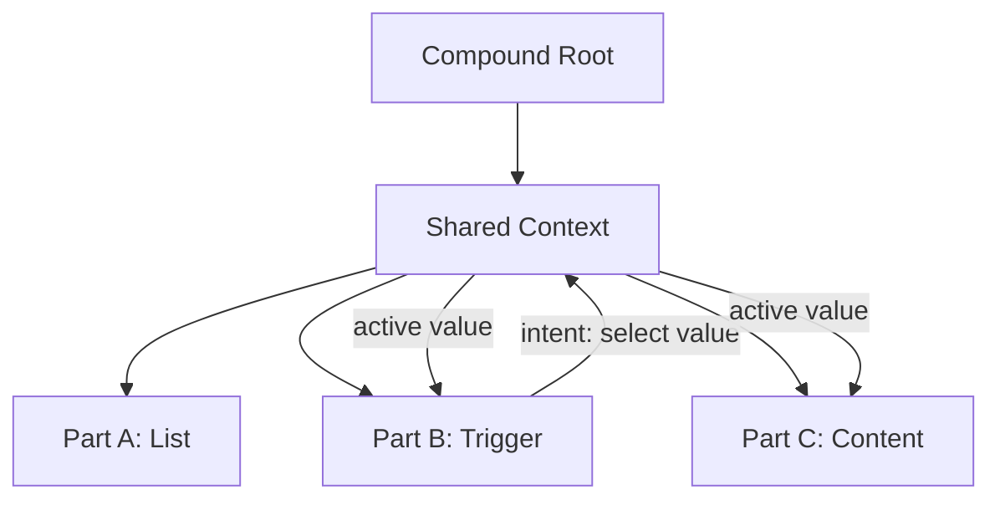
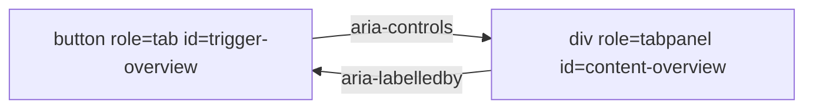
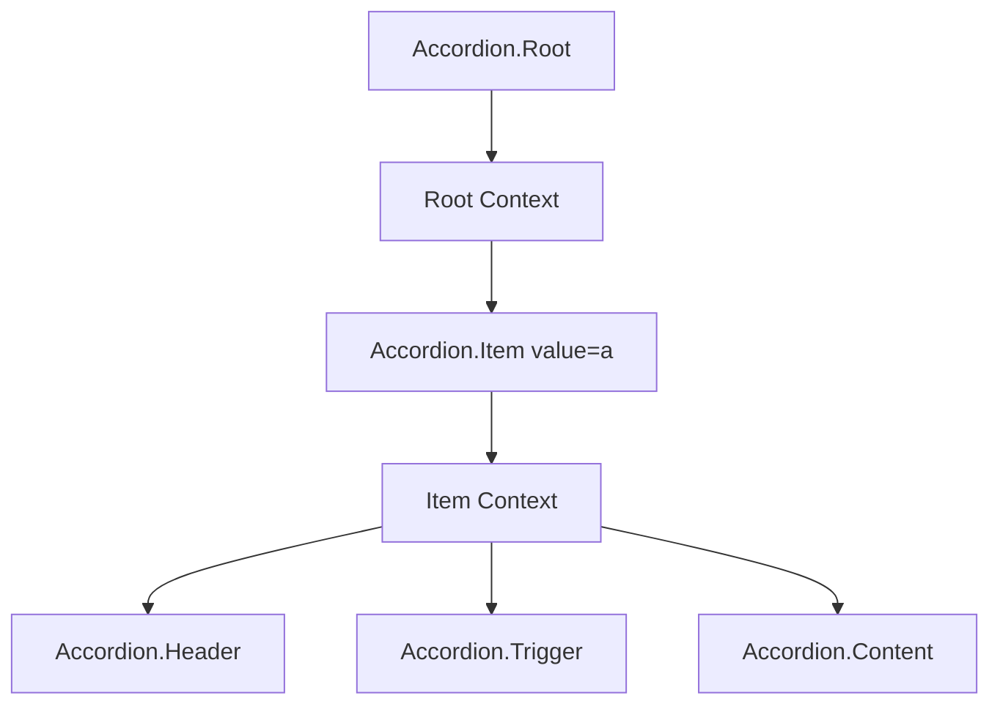
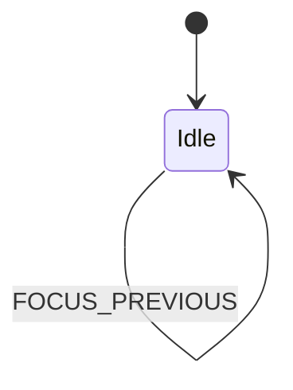
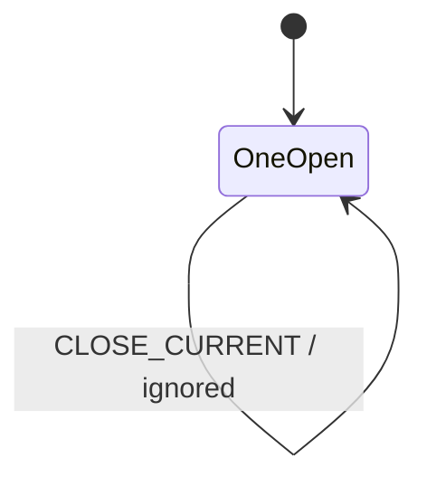
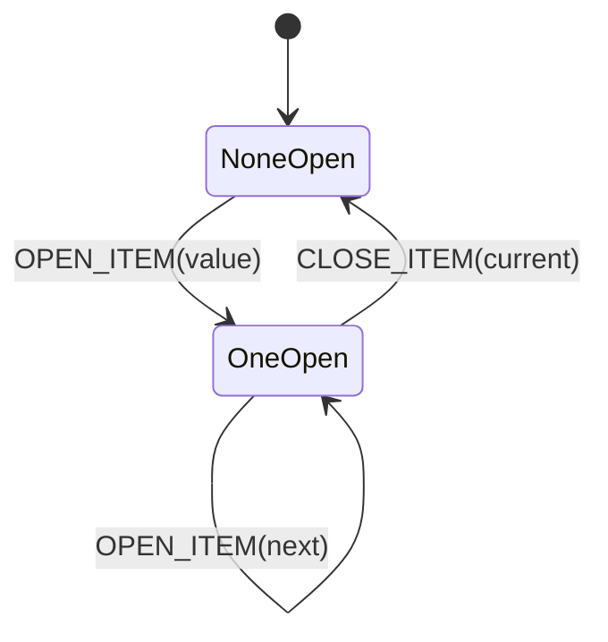

# Part 024 — Compound Components Pattern

Compound components adalah pola ketika beberapa komponen kecil bekerja sebagai satu unit perilaku.

Contoh API:

```tsx
<Tabs defaultValue="overview">
  <Tabs.List>
    <Tabs.Trigger value="overview">Overview</Tabs.Trigger>
    <Tabs.Trigger value="billing">Billing</Tabs.Trigger>
  </Tabs.List>

  <Tabs.Content value="overview">...</Tabs.Content>
  <Tabs.Content value="billing">...</Tabs.Content>
</Tabs>
```

Yang menarik bukan sintaksnya. Yang menarik adalah arsitekturnya.

```txt
Tabs.Root owns shared coordination state.
Tabs.List defines interaction group.
Tabs.Trigger emits tab activation intent.
Tabs.Content renders based on active value.
All parts cooperate without prop drilling between every child.
```

Compound component adalah jawaban untuk komponen yang punya:

```txt
banyak sub-part
state bersama
koordinasi keyboard/focus
API harus fleksibel
struktur markup harus dikontrol consumer
behavior harus tetap konsisten
```

---

## 1. Problem yang Diselesaikan

Bayangkan Tabs tanpa compound pattern.

```tsx
<Tabs
  value={tab}
  onValueChange={setTab}
  items={[
    { value: 'overview', label: 'Overview', content: <Overview /> },
    { value: 'billing', label: 'Billing', content: <Billing /> },
  ]}
/>
```

Ini baik untuk kasus sederhana. Tapi cepat memburuk saat kebutuhan bertambah:

```txt
trigger butuh badge
trigger butuh icon
content butuh layout custom
sebagian trigger disabled karena permission
ada tooltip per trigger
ada custom analytics per trigger
ada panel yang lazy mounted
ada panel yang keep alive
markup harus menyesuaikan design system
```

Lalu API berubah menjadi configuration language.

```tsx
<Tabs
  items={items}
  triggerRender={(item) => ...}
  contentRender={(item) => ...}
  triggerClassName={...}
  contentClassName={...}
  disabledItems={...}
  lazyItems={...}
  keepMountedItems={...}
/>
```

Ini adalah smell:

```txt
Komponen mencoba menjadi interpreter konfigurasi, bukan primitive komposisi.
```

Compound pattern memindahkan kontrol struktur ke caller tanpa kehilangan koordinasi internal.

---

## 2. Mental Model



Ada empat peran:

```txt
Root       : owner state bersama dan menyediakan context
Part       : child component yang membaca context
Intent     : event dari part ke root/shared state
Contract   : aturan bahwa part hanya valid di dalam root
```

Compound components tidak berarti child saling bicara langsung. Biasanya mereka berkoordinasi lewat shared parent context.

---

## 3. Kapan Pakai Compound Components

Gunakan ketika:

```txt
komponen punya beberapa subcomponent yang harus bekerja bersama
caller butuh kebebasan menyusun markup
state bersama harus tersembunyi dari prop drilling
API config mulai meledak
accessibility/keyboard behavior harus konsisten
```

Contoh cocok:

```txt
Tabs
Accordion
Menu
Dropdown
Dialog
Popover
Select
Combobox
Stepper
Wizard
Field/Form group
Data table primitive
Command palette
```

Jangan gunakan ketika:

```txt
komponen hanya punya satu elemen sederhana
struktur selalu sama dan items config cukup
consumer tidak butuh custom markup
context implicit justru membuat ownership kabur
```

---

## 4. Compound vs Configuration

| Aspek | Configuration API | Compound API |
|---|---|---|
| Struktur markup | Ditentukan component | Ditentukan caller |
| Customisasi | Lewat props/render callbacks | Lewat composition |
| API surface | Bisa membesar cepat | Terpecah ke subcomponents |
| Discoverability | Satu component banyak props | Namespace parts |
| Flexibility | Terbatas oleh config schema | Tinggi |
| Risk | Config language | Implicit context coupling |

Tidak ada pemenang absolut.

Gunakan configuration API untuk list sederhana:

```tsx
<Tabs items={items} />
```

Gunakan compound API untuk primitive reusable:

```tsx
<Tabs.Root>
  <Tabs.List>...</Tabs.List>
  <Tabs.Content>...</Tabs.Content>
</Tabs.Root>
```

Production library sering menyediakan keduanya di layer berbeda:

```txt
TabsPrimitive   -> compound low-level primitive
ProductTabs     -> config-driven wrapper untuk kasus umum
```

---

## 5. Anatomy of a Compound Component

Kita akan bangun Tabs primitive.

Target usage:

```tsx
<Tabs.Root defaultValue="overview">
  <Tabs.List aria-label="Account sections">
    <Tabs.Trigger value="overview">Overview</Tabs.Trigger>
    <Tabs.Trigger value="billing">Billing</Tabs.Trigger>
    <Tabs.Trigger value="security">Security</Tabs.Trigger>
  </Tabs.List>

  <Tabs.Content value="overview">Overview content</Tabs.Content>
  <Tabs.Content value="billing">Billing content</Tabs.Content>
  <Tabs.Content value="security">Security content</Tabs.Content>
</Tabs.Root>
```

Kita butuh:

```txt
Root state: activeValue
Trigger: selected jika value === activeValue
Content: visible jika value === activeValue
Context: membagikan activeValue dan selectValue
Accessibility: tablist, tab, tabpanel, aria-selected, aria-controls
Keyboard: arrow navigation optional but expected for robust tabs
```

---

## 6. Step 1 — Define Context Contract

```tsx
type TabsContextValue = {
  activeValue: string;
  setActiveValue: (value: string) => void;
  baseId: string;
};

const TabsContext = React.createContext<TabsContextValue | null>(null);

function useTabsContext(componentName: string) {
  const context = React.useContext(TabsContext);

  if (context === null) {
    throw new Error(`${componentName} must be used inside <Tabs.Root>.`);
  }

  return context;
}
```

Kenapa pakai custom hook?

```txt
error lebih jelas
consumer cepat tahu misuse
null-check tidak berulang
context contract terpusat
```

Bad:

```tsx
const context = React.useContext(TabsContext)!;
```

Ini akan gagal dengan error kabur saat component dipakai di luar provider.

---

## 7. Step 2 — Root with Uncontrolled State

```tsx
type TabsRootProps = {
  defaultValue: string;
  children: React.ReactNode;
};

function TabsRoot({ defaultValue, children }: TabsRootProps) {
  const [activeValue, setActiveValue] = React.useState(defaultValue);
  const baseId = React.useId();

  const contextValue = React.useMemo(
    () => ({ activeValue, setActiveValue, baseId }),
    [activeValue, baseId]
  );

  return (
    <TabsContext.Provider value={contextValue}>
      {children}
    </TabsContext.Provider>
  );
}
```

`useMemo` di sini bukan optimasi kosmetik. Context value identity memengaruhi consumer re-render. Karena `activeValue` memang berubah saat tab berubah, consumers memang perlu update. Tapi kita tetap menjaga value object tidak berubah karena render unrelated.

---

## 8. Step 3 — List, Trigger, Content

```tsx
type TabsListProps = React.ComponentPropsWithoutRef<'div'>;

function TabsList({ children, ...props }: TabsListProps) {
  return (
    <div role="tablist" {...props}>
      {children}
    </div>
  );
}
```

Trigger:

```tsx
type TabsTriggerProps = Omit<
  React.ComponentPropsWithoutRef<'button'>,
  'value' | 'onChange'
> & {
  value: string;
};

function TabsTrigger({ value, children, disabled, ...props }: TabsTriggerProps) {
  const { activeValue, setActiveValue, baseId } = useTabsContext('Tabs.Trigger');
  const selected = activeValue === value;

  const triggerId = `${baseId}-trigger-${value}`;
  const contentId = `${baseId}-content-${value}`;

  return (
    <button
      {...props}
      id={triggerId}
      role="tab"
      type="button"
      disabled={disabled}
      aria-selected={selected}
      aria-controls={contentId}
      tabIndex={selected ? 0 : -1}
      onClick={(event) => {
        props.onClick?.(event);

        if (!event.defaultPrevented && !disabled) {
          setActiveValue(value);
        }
      }}
    >
      {children}
    </button>
  );
}
```

Content:

```tsx
type TabsContentProps = React.ComponentPropsWithoutRef<'div'> & {
  value: string;
  forceMount?: boolean;
};

function TabsContent({ value, forceMount = false, children, ...props }: TabsContentProps) {
  const { activeValue, baseId } = useTabsContext('Tabs.Content');
  const selected = activeValue === value;

  const triggerId = `${baseId}-trigger-${value}`;
  const contentId = `${baseId}-content-${value}`;

  if (!selected && !forceMount) {
    return null;
  }

  return (
    <div
      {...props}
      id={contentId}
      role="tabpanel"
      aria-labelledby={triggerId}
      hidden={!selected}
    >
      {children}
    </div>
  );
}
```

Export namespace:

```tsx
export const Tabs = {
  Root: TabsRoot,
  List: TabsList,
  Trigger: TabsTrigger,
  Content: TabsContent,
};
```

Usage:

```tsx
<Tabs.Root defaultValue="overview">
  <Tabs.List>
    <Tabs.Trigger value="overview">Overview</Tabs.Trigger>
    <Tabs.Trigger value="billing">Billing</Tabs.Trigger>
  </Tabs.List>

  <Tabs.Content value="overview">Overview panel</Tabs.Content>
  <Tabs.Content value="billing">Billing panel</Tabs.Content>
</Tabs.Root>
```

---

## 9. Accessibility Contract

Tabs bukan sekadar show/hide div.

Minimum semantic contract:

```txt
List    -> role="tablist"
Trigger -> role="tab"
Content -> role="tabpanel"
Trigger selected state -> aria-selected
Trigger controls panel -> aria-controls
Panel labelled by trigger -> aria-labelledby
Only selected trigger should usually be in tab order
```

Diagram relation:



Accessibility is not decoration. It is part of the component contract.

Kalau Anda membangun primitive seperti Tabs/Menu/Select sendiri, behavior keyboard dan ARIA harus diperlakukan sebagai state orchestration, bukan styling task.

---

## 10. Keyboard Navigation

Tabs robust biasanya mendukung:

```txt
ArrowRight / ArrowDown -> next tab
ArrowLeft / ArrowUp    -> previous tab
Home                   -> first tab
End                    -> last tab
Enter/Space            -> activate focused tab, depending activation model
```

Untuk implementasi keyboard, Root perlu registry trigger.

Simple DOM-based approach:

```tsx
function getEnabledTabs(tablist: HTMLElement) {
  return Array.from(
    tablist.querySelectorAll<HTMLButtonElement>('[role="tab"]')
  ).filter((element) => !element.disabled && element.getAttribute('aria-disabled') !== 'true');
}
```

List handles keyboard:

```tsx
function TabsList({ children, onKeyDown, ...props }: TabsListProps) {
  return (
    <div
      role="tablist"
      {...props}
      onKeyDown={(event) => {
        onKeyDown?.(event);

        if (event.defaultPrevented) {
          return;
        }

        const keyToDirection: Record<string, 1 | -1> = {
          ArrowRight: 1,
          ArrowDown: 1,
          ArrowLeft: -1,
          ArrowUp: -1,
        };

        const direction = keyToDirection[event.key];
        const currentTarget = event.target;

        if (!(currentTarget instanceof HTMLButtonElement)) {
          return;
        }

        const tabs = getEnabledTabs(event.currentTarget);
        const currentIndex = tabs.indexOf(currentTarget);

        if (event.key === 'Home') {
          event.preventDefault();
          tabs[0]?.focus();
          return;
        }

        if (event.key === 'End') {
          event.preventDefault();
          tabs[tabs.length - 1]?.focus();
          return;
        }

        if (!direction || currentIndex === -1) {
          return;
        }

        event.preventDefault();

        const nextIndex = (currentIndex + direction + tabs.length) % tabs.length;
        tabs[nextIndex]?.focus();
        tabs[nextIndex]?.click();
      }}
    >
      {children}
    </div>
  );
}
```

Trade-off:

```txt
DOM query approach sederhana dan cukup untuk banyak primitive.
Registry state approach lebih eksplisit tetapi lebih kompleks.
```

Untuk design system serius, registry memberi kontrol lebih baik atas disabled item, orientation, roving tabindex, manual vs automatic activation, dan virtualized item.

---

## 11. Controlled + Uncontrolled Tabs

Dari Part 023, component library primitive sebaiknya bisa controlled dan uncontrolled jika state sering perlu externalized.

API:

```tsx
<Tabs.Root defaultValue="overview" />
<Tabs.Root value={tab} onValueChange={setTab} />
```

Hook:

```tsx
type SetStateAction<T> = T | ((previousValue: T) => T);

function useControllableState<T>({
  value,
  defaultValue,
  onChange,
}: {
  value: T | undefined;
  defaultValue: T;
  onChange?: (value: T) => void;
}) {
  const isControlled = value !== undefined;
  const [internalValue, setInternalValue] = React.useState(defaultValue);
  const currentValue = isControlled ? (value as T) : internalValue;

  const setValue = React.useCallback(
    (next: SetStateAction<T>) => {
      const nextValue =
        typeof next === 'function'
          ? (next as (value: T) => T)(currentValue)
          : next;

      if (!isControlled) {
        setInternalValue(nextValue);
      }

      onChange?.(nextValue);
    },
    [currentValue, isControlled, onChange]
  );

  return [currentValue, setValue] as const;
}
```

Root:

```tsx
type TabsRootProps = {
  value?: string;
  defaultValue?: string;
  onValueChange?: (value: string) => void;
  children: React.ReactNode;
};

function TabsRoot({
  value,
  defaultValue = 'default',
  onValueChange,
  children,
}: TabsRootProps) {
  const [activeValue, setActiveValue] = useControllableState({
    value,
    defaultValue,
    onChange: onValueChange,
  });

  const baseId = React.useId();

  const contextValue = React.useMemo(
    () => ({ activeValue, setActiveValue, baseId }),
    [activeValue, setActiveValue, baseId]
  );

  return (
    <TabsContext.Provider value={contextValue}>
      {children}
    </TabsContext.Provider>
  );
}
```

Important:

```txt
Trigger memanggil setActiveValue.
Jika Root controlled, parent menentukan final active value.
Jika Root uncontrolled, internal state berubah langsung.
```

---

## 12. Manual vs Automatic Activation

Tabs punya dua activation model:

```txt
automatic activation -> focus pindah, tab aktif ikut berubah
manual activation    -> focus pindah, tab aktif berubah setelah Enter/Space
```

Automatic enak jika panel cepat.
Manual lebih baik jika panel berat atau fetch mahal.

API:

```tsx
type TabsActivationMode = 'automatic' | 'manual';

type TabsContextValue = {
  activeValue: string;
  setActiveValue: (value: string) => void;
  activationMode: TabsActivationMode;
  baseId: string;
};
```

Root:

```tsx
type TabsRootProps = {
  value?: string;
  defaultValue?: string;
  onValueChange?: (value: string) => void;
  activationMode?: TabsActivationMode;
  children: React.ReactNode;
};

function TabsRoot({
  activationMode = 'automatic',
  ...props
}: TabsRootProps) {
  // same as before
}
```

Keyboard behavior:

```txt
Arrow key:
  always move focus
  activate only if activationMode === 'automatic'

Enter/Space:
  activate focused tab
```

Ini contoh bagaimana compound component bukan hanya composition, tapi orchestration policy.

---

## 13. State Registry Pattern

Jika primitive makin kompleks, DOM query terasa rapuh. Kita bisa pakai registry.

Registry item:

```tsx
type TabRegistration = {
  value: string;
  ref: React.RefObject<HTMLButtonElement | null>;
  disabled: boolean;
};
```

Context:

```tsx
type TabsContextValue = {
  activeValue: string;
  setActiveValue: (value: string) => void;
  registerTrigger: (item: TabRegistration) => () => void;
  getTriggers: () => TabRegistration[];
  baseId: string;
};
```

Root stores registry in ref:

```tsx
function TabsRoot({ children, ...props }: TabsRootProps) {
  const triggersRef = React.useRef<TabRegistration[]>([]);

  const registerTrigger = React.useCallback((item: TabRegistration) => {
    triggersRef.current = [...triggersRef.current, item];

    return () => {
      triggersRef.current = triggersRef.current.filter(
        (registered) => registered.value !== item.value
      );
    };
  }, []);

  const getTriggers = React.useCallback(() => triggersRef.current, []);

  // provide registerTrigger and getTriggers
}
```

Trigger registers itself:

```tsx
function TabsTrigger({ value, disabled, children, ...props }: TabsTriggerProps) {
  const ref = React.useRef<HTMLButtonElement | null>(null);
  const { registerTrigger } = useTabsContext('Tabs.Trigger');

  React.useEffect(() => {
    return registerTrigger({ value, ref, disabled: Boolean(disabled) });
  }, [registerTrigger, value, disabled]);

  return <button ref={ref} role="tab" disabled={disabled} {...props}>{children}</button>;
}
```

Caveat:

```txt
Registration order can be tricky if children mount conditionally.
DOM order may differ from registration order.
```

Jika urutan visual penting, DOM query kadang lebih benar karena membaca order aktual di DOM.

---

## 14. Nested Compound Components

Compound components sering nested.

```tsx
<Accordion.Root>
  <Accordion.Item value="a">
    <Accordion.Header>
      <Accordion.Trigger>Section A</Accordion.Trigger>
    </Accordion.Header>
    <Accordion.Content>...</Accordion.Content>
  </Accordion.Item>
</Accordion.Root>
```

Di sini ada dua context:

```txt
AccordionRootContext -> active/open values, root policy
AccordionItemContext -> current item value, generated ids, disabled state
```

Diagram:



Item context menghindari pengulangan prop `value` di setiap sub-part.

```tsx
<Accordion.Item value="billing">
  <Accordion.Trigger>Billing</Accordion.Trigger>
  <Accordion.Content>...</Accordion.Content>
</Accordion.Item>
```

Lebih baik daripada:

```tsx
<Accordion.Trigger value="billing">Billing</Accordion.Trigger>
<Accordion.Content value="billing">...</Accordion.Content>
```

Tapi trade-off-nya:

```txt
struktur menjadi lebih opinionated
sub-part harus berada di dalam Item
error boundary/misuse harus jelas
```

---

## 15. Compound Components and Context Performance

Context update akan membuat consumers re-render.

Pada Tabs kecil, ini tidak masalah.

Pada compound component besar seperti DataTable, context tunggal bisa mahal.

Bad:

```tsx
type TableContextValue = {
  rows: Row[];
  selectedRowIds: Set<string>;
  expandedRowIds: Set<string>;
  sortState: SortState;
  filterState: FilterState;
  setSelectedRowIds: ...;
  setExpandedRowIds: ...;
};
```

Setiap selection berubah, seluruh consumer context berpotensi re-render.

Better split:

```txt
TableDataContext
TableSelectionContext
TableExpansionContext
TableSortContext
TableActionsContext
```

Atau gunakan selector-based external store jika kebutuhan granular tinggi.

Untuk primitive seperti Tabs/Accordion, context biasa cukup.

Rule:

```txt
Context is good for coordination.
Context is not automatically good for high-frequency fine-grained subscription.
```

---

## 16. Slot and `asChild` Pattern

Masalah lain: compound primitive sering ingin memberi behavior ke element yang disediakan consumer.

Default:

```tsx
<Tabs.Trigger value="overview">Overview</Tabs.Trigger>
```

Render sebagai `<button>`.

Tapi consumer mungkin ingin pakai design-system button:

```tsx
<Tabs.Trigger value="overview" asChild>
  <Button variant="ghost">Overview</Button>
</Tabs.Trigger>
```

Konsep `asChild`:

```txt
Primitive tidak render element default.
Primitive mengambil single child element.
Primitive inject props, event handler, aria attributes, ref ke child.
```

Simplified Slot implementation:

```tsx
function composeEventHandlers<E>(
  userHandler: ((event: E) => void) | undefined,
  internalHandler: (event: E) => void
) {
  return (event: E & { defaultPrevented?: boolean }) => {
    userHandler?.(event);

    if (!event.defaultPrevented) {
      internalHandler(event);
    }
  };
}

function Slot({
  children,
  ...props
}: React.HTMLAttributes<HTMLElement> & {
  children: React.ReactElement;
}) {
  return React.cloneElement(children, {
    ...props,
    ...children.props,
    onClick: composeEventHandlers(children.props.onClick, props.onClick as any),
  });
}
```

This is simplified. Real slot implementation must handle:

```txt
ref composition
className merge
style merge
event handler composition
single child validation
prop precedence
TypeScript polymorphism
```

Trigger with `asChild`:

```tsx
type TabsTriggerProps = {
  value: string;
  asChild?: boolean;
  children: React.ReactNode;
} & React.ComponentPropsWithoutRef<'button'>;

function TabsTrigger({ asChild = false, value, children, ...props }: TabsTriggerProps) {
  const Comp = asChild ? Slot : 'button';
  const { activeValue, setActiveValue, baseId } = useTabsContext('Tabs.Trigger');
  const selected = activeValue === value;

  return (
    <Comp
      {...props}
      role="tab"
      aria-selected={selected}
      aria-controls={`${baseId}-content-${value}`}
      onClick={(event: React.MouseEvent) => {
        props.onClick?.(event as any);
        if (!event.defaultPrevented) setActiveValue(value);
      }}
    >
      {children}
    </Comp>
  );
}
```

Caution:

```txt
asChild gives flexibility but can break accessibility if child cannot receive required props/ref or has wrong semantics.
```

If you render a link as a tab, you must ensure interaction semantics remain correct. A real tab is usually a button-like control, not navigation link, unless your UI is actually route navigation.

---

## 17. Compound Components with Route State

Tabs sering perlu sinkron dengan URL.

Uncontrolled:

```tsx
<Tabs.Root defaultValue="overview">...</Tabs.Root>
```

URL-controlled:

```tsx
function AccountPage() {
  const [searchParams, setSearchParams] = useSearchParams();
  const activeTab = searchParams.get('tab') ?? 'overview';

  return (
    <Tabs.Root
      value={activeTab}
      onValueChange={(nextTab) => {
        setSearchParams((params) => {
          params.set('tab', nextTab);
          return params;
        });
      }}
    >
      ...
    </Tabs.Root>
  );
}
```

Important:

```txt
Tabs primitive tidak perlu tahu URL.
Page orchestration layer menghubungkan Tabs ke URL.
```

Ini menjaga primitive tetap reusable.

---

## 18. Compound Components with Permission

Permission-aware tabs:

```tsx
<Tabs.Root value={activeTab} onValueChange={setActiveTab}>
  <Tabs.List>
    <Tabs.Trigger value="overview">Overview</Tabs.Trigger>

    {canViewBilling && (
      <Tabs.Trigger value="billing">Billing</Tabs.Trigger>
    )}
  </Tabs.List>

  <Tabs.Content value="overview">...</Tabs.Content>

  {canViewBilling && (
    <Tabs.Content value="billing">...</Tabs.Content>
  )}
</Tabs.Root>
```

But consider invalid active tab:

```txt
activeTab = billing
permission removed
billing trigger/content no longer rendered
```

Fix at orchestration boundary:

```tsx
const allowedTabs = canViewBilling
  ? ['overview', 'billing', 'security']
  : ['overview', 'security'];

const activeTab = allowedTabs.includes(tabFromUrl) ? tabFromUrl : 'overview';
```

Do not bury permission correction inside Tabs primitive unless primitive owns permission model.

---

## 19. Compound Components and Illegal Structure

Bad usage:

```tsx
<Tabs.Trigger value="overview">Overview</Tabs.Trigger>
```

Outside root.

We already handle with `useTabsContext` error.

Another bad usage:

```tsx
<Tabs.Root defaultValue="overview">
  <Tabs.Content value="overview">Overview</Tabs.Content>
</Tabs.Root>
```

No trigger. Maybe valid for some edge case, but usually suspicious.

Hard validation options:

```txt
Runtime child inspection
Registration validation
Development warnings
Documentation only
```

Avoid heavy child inspection when possible. React composition is flexible, and child traversal breaks easily with conditional rendering, fragments, wrappers, and dynamic lists.

Better:

```txt
Use context contract for required local relationships.
Use development warnings only for critical structural invariants.
Use tests/examples/docs to define expected composition.
```

---

## 20. Do Not Overuse `React.Children` for Compound APIs

Old compound examples often use `React.Children.map` and `cloneElement`:

```tsx
function Tabs({ children }) {
  return React.Children.map(children, (child) => {
    return React.cloneElement(child, { activeValue });
  });
}
```

Problems:

```txt
only works for direct children
breaks through wrappers/fragments
hard with TypeScript
prop injection hidden
composition depth limited
harder with server/client boundaries
```

Context-based compound components scale better:

```tsx
<Tabs.Root>
  <SomeLayout>
    <Tabs.Trigger value="a" />
  </SomeLayout>
</Tabs.Root>
```

Because trigger can read context even if not direct child.

Use cloneElement only when you explicitly implement slot/asChild behavior and know the constraints.

---

## 21. Controlled Compound State vs Local Part State

Compound root owns shared state. Parts may still own local interaction state.

Example Dropdown Menu:

```txt
Root state        : open/closed
Item state        : highlighted/selected may be root-level
Submenu state     : local to submenu actor
Typeahead buffer  : root-level or local registry-level
Pointer grace area: internal local detail
```

Do not put every tiny interaction detail into public controlled API.

Public API should expose product-relevant state:

```txt
open
value
selectedKeys
expandedKeys
```

Internal state can own mechanical details:

```txt
focus target
pointer modality
measurement rect
animation phase
```

This preserves encapsulation.

---

## 22. Compound Components and State Machines

Compound widgets often have real state machines.

Tabs simple machine:



Accordion with collapsible=false:



Accordion with collapsible=true:



The compound API hides this complexity from consumer while preserving structure freedom.

---

## 23. Build a Compound Accordion Sketch

Usage:

```tsx
<Accordion.Root defaultValue="profile" collapsible>
  <Accordion.Item value="profile">
    <Accordion.Trigger>Profile</Accordion.Trigger>
    <Accordion.Content>Profile content</Accordion.Content>
  </Accordion.Item>

  <Accordion.Item value="billing">
    <Accordion.Trigger>Billing</Accordion.Trigger>
    <Accordion.Content>Billing content</Accordion.Content>
  </Accordion.Item>
</Accordion.Root>
```

Root context:

```tsx
type AccordionRootContextValue = {
  openValue: string | null;
  setOpenValue: (value: string | null) => void;
  collapsible: boolean;
  baseId: string;
};

const AccordionRootContext = React.createContext<AccordionRootContextValue | null>(null);
```

Item context:

```tsx
type AccordionItemContextValue = {
  value: string;
  triggerId: string;
  contentId: string;
};

const AccordionItemContext = React.createContext<AccordionItemContextValue | null>(null);
```

Item:

```tsx
function AccordionItem({ value, children }: {
  value: string;
  children: React.ReactNode;
}) {
  const { baseId } = useAccordionRootContext('Accordion.Item');

  const itemContext = React.useMemo(
    () => ({
      value,
      triggerId: `${baseId}-trigger-${value}`,
      contentId: `${baseId}-content-${value}`,
    }),
    [baseId, value]
  );

  return (
    <AccordionItemContext.Provider value={itemContext}>
      <div data-accordion-item="">{children}</div>
    </AccordionItemContext.Provider>
  );
}
```

Trigger:

```tsx
function AccordionTrigger({ children }: { children: React.ReactNode }) {
  const { openValue, setOpenValue, collapsible } =
    useAccordionRootContext('Accordion.Trigger');
  const { value, triggerId, contentId } =
    useAccordionItemContext('Accordion.Trigger');

  const open = openValue === value;

  return (
    <button
      id={triggerId}
      type="button"
      aria-expanded={open}
      aria-controls={contentId}
      onClick={() => {
        if (open && collapsible) {
          setOpenValue(null);
        } else {
          setOpenValue(value);
        }
      }}
    >
      {children}
    </button>
  );
}
```

Content:

```tsx
function AccordionContent({ children }: { children: React.ReactNode }) {
  const { openValue } = useAccordionRootContext('Accordion.Content');
  const { value, triggerId, contentId } =
    useAccordionItemContext('Accordion.Content');

  const open = openValue === value;

  return (
    <div
      id={contentId}
      role="region"
      aria-labelledby={triggerId}
      hidden={!open}
    >
      {children}
    </div>
  );
}
```

This pattern generalizes:

```txt
Root context = shared coordination state
Item context = local identity
Trigger = emits intent
Content = reads state and identity
```

---

## 24. Failure Mode Catalog

### 24.1 Hidden implicit dependency

Symptom:

```txt
Tabs.Trigger crashes when used outside Tabs.Root
```

Fix:

```txt
custom context hook with clear error
export docs/examples showing valid structure
```

### 24.2 Context value too broad

Symptom:

```txt
all parts rerender on every tiny state change
```

Fix:

```txt
split context
memoize value
move high-frequency state to external store/selector
```

### 24.3 Prop/config explosion returns

Symptom:

```txt
compound root still has dozens of render props and config knobs
```

Fix:

```txt
move structure customization to composition
separate primitive from product wrapper
```

### 24.4 Accessibility drift

Symptom:

```txt
visual tabs work, screen reader/keyboard behavior broken
```

Fix:

```txt
make ARIA and keyboard behavior part of component tests
use APG pattern as contract
avoid arbitrary element substitution without semantic checks
```

### 24.5 Controlled/uncontrolled ambiguity

Symptom:

```txt
Tabs sometimes follows parent, sometimes internal state
```

Fix:

```txt
same lifetime mode rule as Part 023
value means controlled
defaultValue means uncontrolled initial value
```

### 24.6 Direct child assumption

Symptom:

```txt
Trigger stops working when wrapped in layout component
```

Fix:

```txt
prefer context over children traversal
```

### 24.7 Invalid selected value

Symptom:

```txt
active value points to non-rendered trigger/content
```

Fix:

```txt
validate at orchestration boundary
fallback to first allowed value
emit dev warning if primitive can detect invalid registry
```

---

## 25. Testing Strategy

Test public behavior, not context internals.

### Basic selection

```tsx
it('switches active content when a trigger is clicked', async () => {
  const user = userEvent.setup();

  render(
    <Tabs.Root defaultValue="overview">
      <Tabs.List>
        <Tabs.Trigger value="overview">Overview</Tabs.Trigger>
        <Tabs.Trigger value="billing">Billing</Tabs.Trigger>
      </Tabs.List>
      <Tabs.Content value="overview">Overview panel</Tabs.Content>
      <Tabs.Content value="billing">Billing panel</Tabs.Content>
    </Tabs.Root>
  );

  expect(screen.getByRole('tabpanel')).toHaveTextContent('Overview panel');

  await user.click(screen.getByRole('tab', { name: 'Billing' }));

  expect(screen.getByRole('tabpanel')).toHaveTextContent('Billing panel');
});
```

### Controlled mode

```tsx
function ControlledTabsHarness() {
  const [value, setValue] = React.useState('overview');

  return (
    <Tabs.Root value={value} onValueChange={setValue}>
      <Tabs.List>
        <Tabs.Trigger value="overview">Overview</Tabs.Trigger>
        <Tabs.Trigger value="billing">Billing</Tabs.Trigger>
      </Tabs.List>
      <Tabs.Content value="overview">Overview panel</Tabs.Content>
      <Tabs.Content value="billing">Billing panel</Tabs.Content>
    </Tabs.Root>
  );
}
```

### Accessibility assertions

```tsx
expect(screen.getByRole('tablist')).toBeInTheDocument();
expect(screen.getByRole('tab', { selected: true })).toHaveTextContent('Overview');
expect(screen.getByRole('tabpanel')).toHaveAccessibleName('Overview');
```

### Misuse error

```tsx
it('throws when trigger is used outside root', () => {
  expect(() => render(<Tabs.Trigger value="x">X</Tabs.Trigger>)).toThrow(
    /must be used inside <Tabs.Root>/
  );
});
```

### Keyboard navigation

```tsx
it('moves between triggers with arrow keys', async () => {
  const user = userEvent.setup();

  render(<ExampleTabs />);

  screen.getByRole('tab', { name: 'Overview' }).focus();
  await user.keyboard('{ArrowRight}');

  expect(screen.getByRole('tab', { name: 'Billing' })).toHaveFocus();
});
```

---

## 26. Production Checklist

Before shipping a compound component:

```txt
[ ] Does Root own shared coordination state?
[ ] Do parts fail clearly outside Root?
[ ] Is public API compositional instead of config-heavy?
[ ] Are accessibility roles/states/properties correct?
[ ] Is keyboard behavior implemented for interactive widgets?
[ ] Is controlled/uncontrolled behavior explicit?
[ ] Does defaultValue mean initial value only?
[ ] Are ids stable and unique with useId?
[ ] Is context value memoized or split where needed?
[ ] Are event handlers composed without swallowing user handlers?
[ ] Does asChild/slot preserve required props/ref/semantics?
[ ] Are disabled items handled in click and keyboard navigation?
[ ] Are invalid active values handled by caller or warned by primitive?
[ ] Are tests written from user-observable behavior?
```

---

## 27. Engineering Heuristics

A good compound component feels like HTML:

```tsx
<select>
  <option />
  <option />
</select>
```

But with richer behavior:

```tsx
<Select.Root>
  <Select.Trigger />
  <Select.Content>
    <Select.Item value="a" />
  </Select.Content>
</Select.Root>
```

Its API should reveal structure, not implementation.

Bad compound API:

```tsx
<Tabs.Root activeValue={...} internalRegistryMode="sync" triggerStrategy="clone" />
```

Better:

```tsx
<Tabs.Root value={tab} onValueChange={setTab} activationMode="manual">
  ...
</Tabs.Root>
```

Expose product-level policy. Hide mechanical details.

---

## 28. Summary

Compound components adalah pola untuk membangun primitive UI yang punya beberapa part dan state koordinasi bersama.

Core invariant:

```txt
Root owns shared behavior.
Parts read shared context.
Parts emit intent.
Consumer owns structure.
Primitive owns accessibility and interaction contract.
```

Gunakan compound pattern saat config API mulai berubah menjadi bahasa mini. Tapi jangan lupa trade-off-nya: context dependency, accessibility complexity, controlled/uncontrolled ambiguity, dan performance jika context terlalu besar.

Compound component yang matang bukan hanya terlihat fleksibel. Ia harus:

```txt
mudah dikomposisi
sulit disalahgunakan
aksesibel secara default
punya ownership state jelas
punya failure mode yang dapat dites
```

---

## References

- React Docs — Passing Props to a Component: https://react.dev/learn/passing-props-to-a-component
- React Docs — Passing Data Deeply with Context: https://react.dev/learn/passing-data-deeply-with-context
- React Docs — `createContext`: https://react.dev/reference/react/createContext
- React Docs — `useContext`: https://react.dev/reference/react/useContext
- React Docs — `Children` and alternatives/render props: https://react.dev/reference/react/Children
- WAI-ARIA Authoring Practices Guide — Tabs Pattern: https://www.w3.org/WAI/ARIA/apg/patterns/tabs/
- MDN — ARIA `tab` role: https://developer.mozilla.org/en-US/docs/Web/Accessibility/ARIA/Reference/Roles/tab_role
- Radix UI — Composition and `asChild`: https://www.radix-ui.com/primitives/docs/guides/composition
