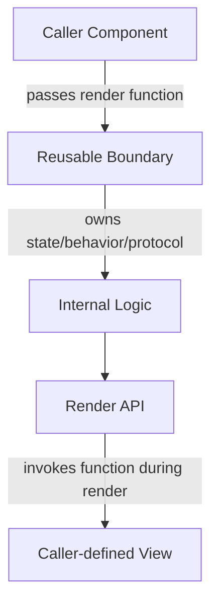

# Part 025 — Render Props and Function-as-Child

Render prop adalah pola ketika sebuah komponen menerima fungsi render dari caller, lalu memanggil fungsi itu untuk menentukan UI yang akan ditampilkan.

Bentuk paling umum:

```tsx
<DataLoader queryKey={['users']}>
  {({ data, isLoading, error, refetch }) => (
    <UserTable
      users={data ?? []}
      loading={isLoading}
      error={error}
      onRefresh={refetch}
    />
  )}
</DataLoader>
```

Di sini `DataLoader` memiliki behavior, state, lifecycle, atau orchestration. Caller memiliki markup.

```txt
Component owns behavior.
Caller owns rendering.
Render function connects both.
```

Ini bukan pola lama yang otomatis obsolete karena Hooks. Yang berubah adalah tempat terbaik untuk memakainya.

Custom Hook bagus untuk reusable stateful logic. Render prop bagus untuk reusable rendering boundary dan inversion of control.

---

## 1. Problem yang Diselesaikan

Tanpa render prop, komponen reusable sering jatuh ke salah satu dari dua ekstrem.

Ekstrem pertama: komponen terlalu opinionated.

```tsx
<PermissionGate permission="invoice.approve" />
```

Masalahnya: komponen ini harus tahu UI mana yang ditampilkan ketika allowed, denied, loading, atau error.

Lalu API membengkak.

```tsx
<PermissionGate
  permission="invoice.approve"
  allowedText="Approve"
  deniedText="No access"
  allowedIcon={<CheckIcon />}
  deniedIcon={<LockIcon />}
  buttonVariant="primary"
  deniedVariant="ghost"
  onAllowedClick={approve}
/>
```

Ekstrem kedua: semua logic dibocorkan ke caller.

```tsx
const { allowed, loading, reason } = usePermission('invoice.approve')

if (loading) return <Spinner />
if (!allowed) return <Tooltip content={reason}><DisabledButton /></Tooltip>
return <Button onClick={approve}>Approve</Button>
```

Ini fleksibel, tapi bila pola sama muncul puluhan kali, logic UI-state dan policy rendering mulai tersebar.

Render prop memberi titik tengah:

```tsx
<PermissionGate permission="invoice.approve">
  {({ allowed, loading, reason }) => {
    if (loading) return <Spinner />
    if (!allowed) {
      return (
        <Tooltip content={reason}>
          <Button disabled>Approve</Button>
        </Tooltip>
      )
    }
    return <Button onClick={approve}>Approve</Button>
  }}
</PermissionGate>
```

`PermissionGate` menjaga protokol permission. Caller tetap mengontrol UI.

---

## 2. Mental Model

Render prop adalah inversion of control.



Komponen biasa:

```txt
Caller passes data → Child renders fixed structure.
```

Render prop:

```txt
Caller passes rendering function → Child passes state back into caller-owned structure.
```

Ini mirip scoped slot.

```txt
A reusable component opens a scoped rendering zone.
Inside that zone, caller can access selected internal state and commands.
```

---

## 3. Render Prop vs Function-as-Child

Istilah sering bercampur.

### Render prop

Render function dikirim lewat prop bernama eksplisit.

```tsx
<Toggle
  render={({ on, toggle }) => (
    <button onClick={toggle}>{on ? 'On' : 'Off'}</button>
  )}
/>
```

### Function-as-child

Render function dikirim lewat `children`.

```tsx
<Toggle>
  {({ on, toggle }) => (
    <button onClick={toggle}>{on ? 'On' : 'Off'}</button>
  )}
</Toggle>
```

Keduanya konsep yang sama: callback render.

Perbedaan praktis:

```txt
render prop named explicitly  → clearer when multiple slots exist
function-as-child            → ergonomic for one main rendering zone
```

Gunakan `children` bila hanya ada satu zona render utama. Gunakan prop bernama bila ada banyak zona.

```tsx
<DateRangePicker
  renderInput={({ start, end, open }) => ...}
  renderCalendar={({ month, days, selectDay }) => ...}
  renderFooter={({ apply, reset }) => ...}
/>
```

Namun hati-hati: banyak render prop dalam satu komponen sering sinyal bahwa yang dibutuhkan adalah compound/headless component, bukan configuration object.

---

## 4. Render Prop di Era Hooks

Sebelum Hooks, render prop sering dipakai untuk reusable stateful logic.

Contoh klasik:

```tsx
<MousePosition>
  {({ x, y }) => <Cursor x={x} y={y} />}
</MousePosition>
```

Di era Hooks, logic ini lebih natural sebagai hook.

```tsx
const { x, y } = useMousePosition()
return <Cursor x={x} y={y} />
```

Tapi kesimpulan “render prop selalu obsolete” salah.

Yang benar:

```txt
Jika targetnya reusable logic → custom hook lebih sering tepat.
Jika targetnya reusable rendering boundary → render prop masih tepat.
```

Contoh rendering boundary:

```tsx
<AsyncBoundary promise={loadInvoice(id)}>
  {({ data }) => <InvoiceScreen invoice={data} />}
</AsyncBoundary>
```

```tsx
<FeatureFlag name="new-invoice-layout">
  {({ enabled }) => enabled ? <NewInvoice /> : <OldInvoice />}
</FeatureFlag>
```

```tsx
<FormField name="email">
  {({ inputProps, errorProps, error }) => (
    <Field>
      <Label>Email</Label>
      <Input {...inputProps} />
      {error && <ErrorMessage {...errorProps}>{error}</ErrorMessage>}
    </Field>
  )}
</FormField>
```

Di sini hook saja tidak selalu memberi boundary semantics yang jelas.

---

## 5. Kapan Render Prop Layak Dipakai

Gunakan render prop ketika komponen perlu mengontrol protokol tetapi caller perlu mengontrol tampilan.

```txt
Reusable behavior     yes
Markup flexibility    high
Internal state exposed selectively
Call site should remain explicit
Provider would be too broad
Compound API would be too heavy
```

Contoh cocok:

```txt
permission gate
feature flag gate
async/data boundary sederhana
responsive media query boundary
field binding boundary
virtualized row rendering
drag-and-drop item rendering
stateful overlay trigger rendering
accessibility primitive sederhana
```

Contoh kurang cocok:

```txt
shared app-wide state
complex multi-part widget
deep cross-tree communication
logic reused by many components without rendering boundary
render callback nested lebih dari 2 level
state machine workflow besar
```

---

## 6. Anatomy of a Good Render Prop API

Contoh sederhana: `Toggle`.

```tsx
type ToggleRenderApi = {
  on: boolean
  setOn: (next: boolean) => void
  toggle: () => void
}

type ToggleProps = {
  defaultOn?: boolean
  children: (api: ToggleRenderApi) => React.ReactNode
}

export function Toggle({ defaultOn = false, children }: ToggleProps) {
  const [on, setOn] = React.useState(defaultOn)

  const toggle = React.useCallback(() => {
    setOn((current) => !current)
  }, [])

  const api = React.useMemo(
    () => ({ on, setOn, toggle }),
    [on, toggle],
  )

  return <>{children(api)}</>
}
```

Call site:

```tsx
<Toggle defaultOn>
  {({ on, toggle }) => (
    <button aria-pressed={on} onClick={toggle}>
      {on ? 'Enabled' : 'Disabled'}
    </button>
  )}
</Toggle>
```

Perhatikan kontraknya:

```txt
on       = read model
setOn    = low-level command
toggle   = domain-like intent command
children = render function
```

Dalam API production, jangan selalu expose setter mentah. Lebih baik expose command yang menjaga invariant.

```tsx
type DisclosureApi = {
  open: boolean
  openPanel: () => void
  closePanel: () => void
  togglePanel: () => void
}
```

Setter mentah mudah membuat caller melewati aturan internal.

---

## 7. Render Function Harus Pure

Render prop dipanggil saat render.

Artinya callback ini harus mematuhi prinsip render React:

```txt
no side effect
no mutation of external object
no network request
no subscription
no setState during render
no analytics event during render
```

Buruk:

```tsx
<PermissionGate permission="invoice.approve">
  {({ allowed }) => {
    if (!allowed) {
      analytics.track('permission_denied_rendered')
    }

    return allowed ? <ApproveButton /> : <Denied />
  }}
</PermissionGate>
```

Analytics di atas terjadi saat render, bukan saat user melakukan action. Dalam concurrent rendering, render bisa diulang, dibatalkan, atau tidak pernah commit.

Lebih baik event-specific:

```tsx
<PermissionGate permission="invoice.approve">
  {({ allowed, reason }) => (
    <Button
      disabled={!allowed}
      onClick={() => {
        if (!allowed) {
          analytics.track('permission_denied_click', { reason })
          return
        }
        approve()
      }}
    >
      Approve
    </Button>
  )}
</PermissionGate>
```

Atau commit-specific melalui effect di komponen sungguhan.

---

## 8. Jangan Memanggil Hooks di Dalam Render Prop Callback

Ini bug penting.

Buruk:

```tsx
<Toggle>
  {({ on }) => {
    const id = React.useId() // jangan lakukan ini
    return <div id={id}>{on ? 'On' : 'Off'}</div>
  }}
</Toggle>
```

Render prop callback adalah fungsi biasa yang dipanggil oleh `Toggle`. Ia bukan komponen React yang dipanggil sebagai JSX oleh React.

Jika butuh Hooks, ekstrak menjadi komponen.

```tsx
function ToggleView({ on, toggle }: ToggleRenderApi) {
  const id = React.useId()

  return (
    <button id={id} aria-pressed={on} onClick={toggle}>
      {on ? 'On' : 'Off'}
    </button>
  )
}

<Toggle>
  {(api) => <ToggleView {...api} />}
</Toggle>
```

Aturan praktis:

```txt
Hooks hanya dipanggil di component body atau custom hook.
Render prop callback bukan component body.
```

---

## 9. TypeScript Contract

Render prop API harus typed sebagai public contract.

```tsx
type RenderProp<TApi> = (api: TApi) => React.ReactNode

type LoadState<TData, TError = Error> =
  | { status: 'idle'; data: null; error: null }
  | { status: 'loading'; data: null; error: null }
  | { status: 'success'; data: TData; error: null }
  | { status: 'error'; data: null; error: TError }

type ResourceBoundaryProps<TData, TError = Error> = {
  state: LoadState<TData, TError>
  children: RenderProp<{
    state: LoadState<TData, TError>
    hasData: boolean
    isLoading: boolean
    isError: boolean
  }>
}
```

Tapi jangan terlalu banyak boolean bila discriminated union sudah cukup.

Buruk:

```tsx
type Api<T> = {
  data?: T
  error?: Error
  loading: boolean
  success: boolean
  failed: boolean
  empty: boolean
}
```

Lebih baik:

```tsx
type Api<T> =
  | { status: 'loading' }
  | { status: 'empty' }
  | { status: 'success'; data: T }
  | { status: 'error'; error: Error }
```

Caller dipaksa menangani state secara eksplisit.

```tsx
<ResourceBoundary state={state}>
  {(api) => {
    switch (api.status) {
      case 'loading':
        return <Spinner />
      case 'empty':
        return <EmptyState />
      case 'success':
        return <Content data={api.data} />
      case 'error':
        return <ErrorState error={api.error} />
    }
  }}
</ResourceBoundary>
```

---

## 10. Case Study — Permission Boundary

Problem:

```txt
Beberapa action UI harus membaca permission.
Allowed/denied/loading/error harus konsisten.
Tampilan per use case harus fleksibel.
Permission logic tidak boleh diduplikasi di semua button.
```

API:

```tsx
type PermissionGateApi = {
  status: 'checking' | 'allowed' | 'denied' | 'error'
  allowed: boolean
  reason?: string
  retry: () => void
}

type PermissionGateProps = {
  permission: string
  resourceId?: string
  children: (api: PermissionGateApi) => React.ReactNode
}
```

Implementasi sederhana:

```tsx
function PermissionGate({ permission, resourceId, children }: PermissionGateProps) {
  const result = usePermissionCheck({ permission, resourceId })

  const api = React.useMemo<PermissionGateApi>(() => {
    if (result.status === 'loading') {
      return {
        status: 'checking',
        allowed: false,
        retry: result.retry,
      }
    }

    if (result.status === 'error') {
      return {
        status: 'error',
        allowed: false,
        reason: 'Unable to verify permission',
        retry: result.retry,
      }
    }

    if (!result.data.allowed) {
      return {
        status: 'denied',
        allowed: false,
        reason: result.data.reason,
        retry: result.retry,
      }
    }

    return {
      status: 'allowed',
      allowed: true,
      retry: result.retry,
    }
  }, [result.status, result.data, result.retry])

  return <>{children(api)}</>
}
```

Call site:

```tsx
<PermissionGate permission="invoice.approve" resourceId={invoice.id}>
  {({ status, allowed, reason, retry }) => {
    if (status === 'checking') return <Button disabled>Checking...</Button>

    if (status === 'error') {
      return <Button onClick={retry}>Retry permission check</Button>
    }

    return (
      <Tooltip content={!allowed ? reason : undefined}>
        <Button disabled={!allowed} onClick={approveInvoice}>
          Approve
        </Button>
      </Tooltip>
    )
  }}
</PermissionGate>
```

Invariant:

```txt
Action UI never decides permission by itself.
PermissionGate exposes a small read model.
Caller owns presentation.
```

---

## 11. Case Study — Form Field Binding

Form field composition sering butuh state dan accessibility wiring.

```tsx
<FormField name="email">
  {({ inputProps, labelProps, errorProps, error }) => (
    <div>
      <label {...labelProps}>Email</label>
      <input {...inputProps} type="email" />
      {error && <p {...errorProps}>{error}</p>}
    </div>
  )}
</FormField>
```

`FormField` dapat mengontrol:

```txt
field id
aria-describedby
aria-invalid
value binding
onChange bridge
onBlur bridge
touched state
error lookup
```

Caller tetap mengontrol markup.

Implementasi ringkas:

```tsx
type FieldApi = {
  inputProps: React.InputHTMLAttributes<HTMLInputElement>
  labelProps: React.LabelHTMLAttributes<HTMLLabelElement>
  errorProps: React.HTMLAttributes<HTMLElement>
  error?: string
}

function FormField({ name, children }: {
  name: string
  children: (api: FieldApi) => React.ReactNode
}) {
  const id = React.useId()
  const errorId = `${id}-error`
  const field = useFormField(name)

  const api = React.useMemo<FieldApi>(() => ({
    inputProps: {
      id,
      name,
      value: field.value,
      onChange: (event) => field.setValue(event.currentTarget.value),
      onBlur: field.markTouched,
      'aria-invalid': field.error ? true : undefined,
      'aria-describedby': field.error ? errorId : undefined,
    },
    labelProps: {
      htmlFor: id,
    },
    errorProps: {
      id: errorId,
      role: 'alert',
    },
    error: field.error,
  }), [id, name, field.value, field.error, field.setValue, field.markTouched, errorId])

  return <>{children(api)}</>
}
```

Poin penting:

```txt
Render prop bukan hanya memberi state.
Ia bisa memberi prop getter/prop bundle yang menjaga accessibility contract.
```

Ini jembatan menuju headless components.

---

## 12. Prop Getter Pattern

Render prop sering dipasangkan dengan prop getter.

Alih-alih expose semua event handler mentah:

```tsx
{({ open, setOpen }) => ...}
```

Expose fungsi yang menggabungkan internal props dengan external props.

```tsx
type MenuApi = {
  open: boolean
  getButtonProps: (
    props?: React.ButtonHTMLAttributes<HTMLButtonElement>,
  ) => React.ButtonHTMLAttributes<HTMLButtonElement>
  getMenuProps: (
    props?: React.HTMLAttributes<HTMLDivElement>,
  ) => React.HTMLAttributes<HTMLDivElement>
}
```

Call site:

```tsx
<Menu>
  {({ open, getButtonProps, getMenuProps }) => (
    <>
      <button {...getButtonProps({ className: 'icon-button' })}>
        Options
      </button>

      {open && (
        <div {...getMenuProps({ className: 'surface' })}>
          ...
        </div>
      )}
    </>
  )}
</Menu>
```

Getter menghindari caller lupa atribut penting.

```txt
role
aria-expanded
aria-controls
id
tabIndex
onKeyDown composition
onClick composition
ref composition
```

Namun getter juga bisa menjadi opaque. Dokumentasikan dengan jelas.

---

## 13. Event Handler Composition

Prop getter harus menggabungkan handler internal dan external secara aman.

```tsx
function composeEventHandlers<E extends React.SyntheticEvent>(
  userHandler: ((event: E) => void) | undefined,
  internalHandler: (event: E) => void,
) {
  return (event: E) => {
    userHandler?.(event)

    if (!event.defaultPrevented) {
      internalHandler(event)
    }
  }
}
```

Contoh:

```tsx
function getButtonProps(
  props: React.ButtonHTMLAttributes<HTMLButtonElement> = {},
) {
  return {
    ...props,
    type: props.type ?? 'button',
    'aria-expanded': open,
    onClick: composeEventHandlers(props.onClick, () => setOpen((v) => !v)),
  }
}
```

Ini memberi caller escape hatch:

```tsx
<button
  {...getButtonProps({
    onClick: (event) => {
      if (disabledByBusinessRule) {
        event.preventDefault()
      }
    },
  })}
/>
```

Prinsip:

```txt
Caller boleh mencegah behavior internal secara eksplisit.
Internal behavior tetap default yang aman.
```

---

## 14. Render Prop dan Performance

Render function biasanya dibuat ulang setiap render.

```tsx
<Toggle>{(api) => <Button {...api} />}</Toggle>
```

Ini normal. Jangan otomatis membungkus semua render prop dengan `useCallback`.

Yang penting adalah memahami konsekuensi.

Render prop dipanggil ketika parent render atau boundary render. Bila subtree mahal, optimasi di tempat yang tepat:

```tsx
const ExpensivePanel = React.memo(function ExpensivePanel(props: Props) {
  return ...
})

<Toggle>
  {({ on, toggle }) => (
    <ExpensivePanel on={on} onToggle={toggle} />
  )}
</Toggle>
```

Atau gunakan component extraction.

```tsx
function TogglePanel(api: ToggleRenderApi) {
  return <ExpensivePanel on={api.on} onToggle={api.toggle} />
}

<Toggle>{(api) => <TogglePanel {...api} />}</Toggle>
```

Jangan salah fokus:

```txt
Function identity is rarely the primary cost.
Expensive rendered subtree and unstable props usually are.
```

---

## 15. Render Prop vs Context

Render prop:

```txt
explicit at call site
narrow scope
good for one local boundary
no hidden dependency
can become nested/pyramidal
```

Context:

```txt
good for deep cross-tree access
implicit dependency
provider placement matters
can cause broad rerender if poorly designed
```

Contoh render prop lebih baik:

```tsx
<MediaQuery query="(min-width: 1024px)">
  {({ matches }) => matches ? <DesktopNav /> : <MobileNav />}
</MediaQuery>
```

Context berlebihan untuk satu decision boundary.

Contoh context lebih baik:

```tsx
<AuthProvider>
  <AppShell />
</AuthProvider>
```

Banyak komponen lintas tree butuh auth capability. Render prop akan menyebabkan prop drilling atau nesting.

---

## 16. Render Prop vs Custom Hook

Custom Hook:

```tsx
function InvoiceActions({ invoice }: Props) {
  const permission = usePermission('invoice.approve', invoice.id)

  return ...
}
```

Render prop:

```tsx
<PermissionGate permission="invoice.approve" resourceId={invoice.id}>
  {(permission) => ...}
</PermissionGate>
```

Gunakan custom hook jika:

```txt
consumer adalah komponen yang jelas
logic perlu dipakai bersama tanpa rendering boundary
consumer butuh bebas menggabungkan logic dengan hooks lain
```

Gunakan render prop jika:

```txt
ingin memaksa rendering protocol
ingin memberi scoped state pada satu zona JSX
ingin membungkus fallback/guard/boundary
ingin expose prop getters/accessibility wiring
```

Hybrid sering terbaik.

```tsx
function PermissionGate(props: PermissionGateProps) {
  const api = usePermissionGate(props.permission, props.resourceId)
  return <>{props.children(api)}</>
}
```

Hook adalah implementation. Render prop adalah API surface.

---

## 17. Render Prop vs Compound Component

Render prop cocok untuk satu scoped rendering function.

```tsx
<Toggle>{(api) => <button ... />}</Toggle>
```

Compound component cocok untuk multi-part widget.

```tsx
<Tabs>
  <Tabs.List>
    <Tabs.Trigger value="a">A</Tabs.Trigger>
  </Tabs.List>
  <Tabs.Content value="a">...</Tabs.Content>
</Tabs>
```

Smell render prop harus berubah ke compound:

```txt
children callback menerima terlalu banyak prop
callback mengembalikan struktur multi-part kompleks
caller harus menyambungkan banyak id/aria/handler manual
ada List/Item/Trigger/Content/Overlay implicit relationship
```

Contoh kurang baik:

```tsx
<Select>
  {({ selected, options, getTriggerProps, getListProps, getOptionProps }) => (
    <>
      <button {...getTriggerProps()}>{selected.label}</button>
      <ul {...getListProps()}>
        {options.map((option) => (
          <li {...getOptionProps(option)}>{option.label}</li>
        ))}
      </ul>
    </>
  )}
</Select>
```

Ini mungkin lebih baik sebagai headless/compound API.

```tsx
<Select>
  <Select.Trigger />
  <Select.Content>
    {options.map((option) => (
      <Select.Option key={option.id} value={option.id}>
        {option.label}
      </Select.Option>
    ))}
  </Select.Content>
</Select>
```

---

## 18. Nested Render Props

Render prop mudah menjadi pyramid.

```tsx
<AuthGate>
  {(auth) => (
    <FeatureFlag name="billing-v2">
      {(flag) => (
        <PermissionGate permission="invoice.pay">
          {(permission) => (
            <PaymentPanel auth={auth} flag={flag} permission={permission} />
          )}
        </PermissionGate>
      )}
    </FeatureFlag>
  )}
</AuthGate>
```

Ini smell orchestration.

Refactor 1: compose hooks inside a real component.

```tsx
function PaymentPanelBoundary() {
  const auth = useAuth()
  const flag = useFeatureFlag('billing-v2')
  const permission = usePermission('invoice.pay')

  return <PaymentPanel auth={auth} flag={flag} permission={permission} />
}
```

Refactor 2: create orchestration boundary.

```tsx
<PaymentCapabilityBoundary>
  {(capability) => <PaymentPanel capability={capability} />}
</PaymentCapabilityBoundary>
```

Refactor 3: page-level orchestration.

```tsx
function InvoicePaymentPage() {
  const model = useInvoicePaymentPageModel()
  return <InvoicePaymentView model={model} />
}
```

Prinsip:

```txt
One render prop is composition.
Three nested render props are often missing orchestration.
```

---

## 19. Error Boundary Interaction

Render prop callback dieksekusi saat render boundary component. Error yang dilempar dari callback akan ditangkap oleh error boundary di atasnya, seperti error render biasa.

```tsx
<ErrorBoundary fallback={<ErrorState />}>
  <DataBoundary>
    {({ data }) => <RiskyView data={data} />}
  </DataBoundary>
</ErrorBoundary>
```

Namun render prop component sendiri tidak otomatis menjadi error boundary.

Jangan campur konsep:

```txt
Render prop controls rendering delegation.
Error boundary controls render failure containment.
Suspense boundary controls async waiting UI.
```

Untuk production, boundary biasanya dipisah:

```tsx
<ErrorBoundary fallback={<InvoiceError />}>
  <React.Suspense fallback={<InvoiceSkeleton />}>
    <InvoiceDataBoundary id={id}>
      {({ invoice }) => <InvoiceView invoice={invoice} />}
    </InvoiceDataBoundary>
  </React.Suspense>
</ErrorBoundary>
```

---

## 20. Controlled Render Prop Component

Render prop component tetap bisa controlled/uncontrolled.

```tsx
type DisclosureProps = {
  open?: boolean
  defaultOpen?: boolean
  onOpenChange?: (open: boolean) => void
  children: (api: DisclosureApi) => React.ReactNode
}

function Disclosure({ open, defaultOpen = false, onOpenChange, children }: DisclosureProps) {
  const [uncontrolledOpen, setUncontrolledOpen] = React.useState(defaultOpen)
  const isControlled = open !== undefined
  const actualOpen = isControlled ? open : uncontrolledOpen

  const setOpen = React.useCallback((next: boolean) => {
    if (!isControlled) setUncontrolledOpen(next)
    onOpenChange?.(next)
  }, [isControlled, onOpenChange])

  const api = React.useMemo(() => ({
    open: actualOpen,
    openPanel: () => setOpen(true),
    closePanel: () => setOpen(false),
    togglePanel: () => setOpen(!actualOpen),
  }), [actualOpen, setOpen])

  return <>{children(api)}</>
}
```

Invariant:

```txt
When controlled, parent owns state.
When uncontrolled, boundary owns state.
In both modes, caller owns rendering.
```

---

## 21. Library API Design Guidelines

A render prop API should be small, stable, and semantic.

Good:

```tsx
type ComboboxItemApi<T> = {
  item: T
  active: boolean
  selected: boolean
  disabled: boolean
}
```

Poor:

```tsx
type ComboboxItemApi<T> = {
  item: T
  internalIndex: number
  internalFocusIndex: number
  mutableRegistry: Map<string, unknown>
  setInternalFocusIndex: (index: number) => void
}
```

Expose product-level or widget-level concepts, not internals.

Checklist:

```txt
Does the API describe meaning, not implementation?
Can we change internal state shape without breaking users?
Does each command preserve invariant?
Are illegal states unrepresentable or at least hard to create?
Is the render callback pure by contract?
Can consumers test behavior without depending on internals?
```

---

## 22. Advanced Pattern — Children as State Projection

Sometimes render prop is best thought of as projection from internal state to UI.

```tsx
<StateProjection state={state}>
  {(projection) => <View {...projection} />}
</StateProjection>
```

Example: approval status UI.

```tsx
type ApprovalProjection =
  | { kind: 'can-submit'; label: string; submit: () => void }
  | { kind: 'blocked'; reason: string }
  | { kind: 'pending'; message: string }
  | { kind: 'completed'; receiptId: string }

<ApprovalActionProjection caseId={caseId}>
  {(action) => {
    switch (action.kind) {
      case 'can-submit':
        return <Button onClick={action.submit}>{action.label}</Button>
      case 'blocked':
        return <Tooltip content={action.reason}><Button disabled>Submit</Button></Tooltip>
      case 'pending':
        return <Button disabled>{action.message}</Button>
      case 'completed':
        return <ReceiptLink id={action.receiptId} />
    }
  }}
</ApprovalActionProjection>
```

This is powerful because the render prop boundary transforms messy workflow state into a stable UI decision model.

---

## 23. Migration Patterns

### Render prop to custom hook

Before:

```tsx
<OnlineStatus>
  {({ online }) => <StatusBadge online={online} />}
</OnlineStatus>
```

After:

```tsx
function StatusBadgeContainer() {
  const online = useOnlineStatus()
  return <StatusBadge online={online} />
}
```

Use when boundary adds no value beyond logic reuse.

### Custom hook to render prop boundary

Before:

```tsx
const permission = usePermission(permissionName)
return renderPermission(permission)
```

After:

```tsx
<PermissionGate permission={permissionName}>
  {renderPermission}
</PermissionGate>
```

Use when you want standardized permission rendering contract.

### Render prop to compound component

Before:

```tsx
<Tabs>{({ tabs, active, select }) => ...}</Tabs>
```

After:

```tsx
<Tabs>
  <Tabs.List />
  <Tabs.Content />
</Tabs>
```

Use when multi-part coordination grows.

### Render prop to headless hook

Before:

```tsx
<Menu>{({ getButtonProps, getMenuProps }) => ...}</Menu>
```

After:

```tsx
const menu = useMenu()
return ...
```

Use when consumers need full control and are comfortable wiring props.

---

## 24. Testing Render Prop Components

Test behavior through rendered output, not internal callback calls.

```tsx
it('toggles state', async () => {
  const user = userEvent.setup()

  render(
    <Toggle>
      {({ on, toggle }) => (
        <button onClick={toggle}>{on ? 'On' : 'Off'}</button>
      )}
    </Toggle>,
  )

  expect(screen.getByRole('button', { name: 'Off' })).toBeInTheDocument()

  await user.click(screen.getByRole('button'))

  expect(screen.getByRole('button', { name: 'On' })).toBeInTheDocument()
})
```

Test contract:

```txt
initial state
command behavior
controlled mode
uncontrolled mode
accessibility props if exposed
escape hatch behavior
callback purity cannot be fully tested but can be linted/reviewed
```

Avoid testing:

```txt
children called N times
internal state variable names
internal helper function calls
implementation-specific memoization
```

---

## 25. Failure Modes

### 25.1 Hooks inside render callback

Symptom:

```txt
Invalid hook call
state order bug
lint rule violation
```

Fix:

```txt
Extract callback body into real component.
```

### 25.2 Side effect during render callback

Symptom:

```txt
duplicate analytics
unexpected network call
setState during render error
behavior changes under Strict Mode/concurrent render
```

Fix:

```txt
Move side effects into event handlers or effects in real components.
```

### 25.3 Too many render API fields

Symptom:

```txt
caller knows internals
breaking changes become frequent
hard to document
```

Fix:

```txt
Expose semantic commands and discriminated read model.
```

### 25.4 Nested callback pyramid

Symptom:

```txt
hard-to-read JSX
unclear orchestration owner
scattered dependency logic
```

Fix:

```txt
Extract orchestration component or compose custom hooks.
```

### 25.5 Render prop used as global state solution

Symptom:

```txt
same boundary repeated everywhere
deep nesting
hard to coordinate cross-tree updates
```

Fix:

```txt
Use context, external store, server-state cache, or state machine depending on state type.
```

### 25.6 Prop getter overwrites caller behavior

Symptom:

```txt
onClick passed by caller does not run
aria props disappear
keyboard behavior breaks
```

Fix:

```txt
Compose handlers and merge props intentionally.
```

---

## 26. Decision Matrix

| Need | Prefer |
|---|---|
| Reuse stateful logic only | Custom Hook |
| Reuse one local rendering boundary | Render prop / function-as-child |
| Multi-part coordinated widget | Compound component |
| Logic-only accessible primitive | Headless Hook or Headless Component |
| Deep cross-tree dependency | Context |
| Shared mutable client state | External store |
| Server-owned async data | Server-state cache |
| Complex workflow with legal transitions | State machine |

---

## 27. Production Checklist

Before adding render prop API, ask:

```txt
Is the callback a pure render function?
Is this a local scoped boundary rather than global state?
Is the exposed API semantic and stable?
Can callers avoid knowing internal state shape?
Are commands named as user/domain intents?
Can controlled and uncontrolled modes coexist safely if needed?
Is there a clear migration path if the component becomes compound/headless?
Are accessibility props impossible or hard to forget?
Can the component be tested from user-visible behavior?
```

---

## 28. Practical Exercise

Build three variants of the same behavior.

Feature:

```txt
A collapsible panel with open/close/toggle, controlled and uncontrolled mode, keyboard support, and analytics on user-triggered toggle.
```

Implement as:

```txt
1. custom hook: useDisclosure
2. render prop: <Disclosure>{api => ...}</Disclosure>
3. compound component: <Disclosure.Root><Disclosure.Trigger /><Disclosure.Panel /></Disclosure.Root>
```

Then compare:

```txt
Which API is easiest for one-off use?
Which API is safest for design system use?
Which API has best accessibility defaults?
Which API leaks the least internal state?
Which API creates the least nesting?
```

The goal is not to pick one pattern forever. The goal is to understand which boundary each pattern creates.

---

## 29. Key Takeaways

Render prop is not dead. It is narrower.

Use it when you need:

```txt
local scoped rendering
caller-owned markup
component-owned protocol
explicit state exposure
small boundary with controlled flexibility
```

Avoid it when:

```txt
it becomes global state
it becomes a nested pyramid
it exposes internals
it replaces a simple custom hook
it tries to model a complex multi-part widget alone
```

The strongest React engineers do not memorize patterns. They understand boundary shape.

Render prop is a boundary where behavior flows down into a callback and rendering flows back out as JSX.

---

## References

- React Docs — Passing Props to a Component: https://react.dev/learn/passing-props-to-a-component
- React Docs — Reusing Logic with Custom Hooks: https://react.dev/learn/reusing-logic-with-custom-hooks
- React Docs — Children API Caveats: https://react.dev/reference/react/Children
- React Legacy Docs — Render Props: https://legacy.reactjs.org/docs/render-props.html
- React Rules — Rules of Hooks: https://react.dev/reference/rules/rules-of-hooks
