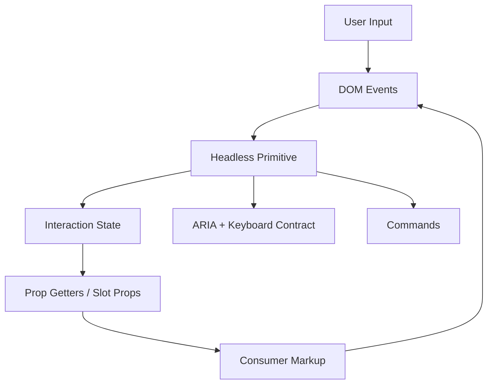
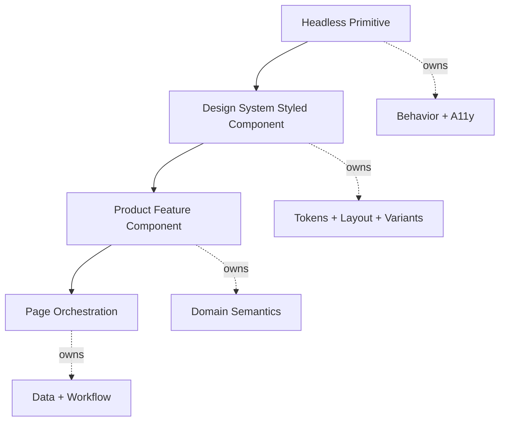

# Part 026 — Headless Components

Headless component adalah komponen atau hook yang menyediakan behavior, state, accessibility semantics, dan interaction protocol tanpa mengunci tampilan visual.

```txt
Headless = brains without imposed looks.
```

Contoh:

```tsx
const menu = useMenu()

return (
  <div>
    <button {...menu.getButtonProps()}>Options</button>

    {menu.open && (
      <div {...menu.getMenuProps()}>
        <button {...menu.getItemProps({ value: 'edit' })}>Edit</button>
        <button {...menu.getItemProps({ value: 'delete' })}>Delete</button>
      </div>
    )}
  </div>
)
```

Caller mengontrol markup dan styling. Headless primitive mengontrol state dan behavior contract.

Ini berbeda dari UI kit biasa.

```txt
Styled component library  → gives behavior + markup + style
Headless component        → gives behavior + accessibility + state protocol
Design system wrapper     → adds product-specific markup + style
```

---

## 1. Problem yang Diselesaikan

Enterprise UI sering memiliki kebutuhan yang bertentangan:

```txt
Behavior harus konsisten.
Accessibility harus benar.
Keyboard interaction harus lengkap.
Visual design harus fleksibel.
Markup harus cocok dengan product context.
Design system harus bisa evolve tanpa rewrite behavior.
```

Komponen styled biasa terlalu kaku.

```tsx
<Select options={countries} />
```

Awalnya enak. Lalu muncul kebutuhan:

```txt
option dengan flag icon
option grouped by region
option disabled karena permission
searchable select
virtualized long list
custom empty state
custom error state
custom footer action
mobile sheet rendering
desktop popover rendering
audit-friendly selected display
```

API mulai berubah menjadi configuration monster.

```tsx
<Select
  options={countries}
  renderOption={...}
  renderGroup={...}
  renderEmpty={...}
  renderFooter={...}
  mobileMode="sheet"
  virtualized
  permissionMap={...}
  searchable
  searchPlaceholder="Search country"
/>
```

Headless pattern memecah masalah:

```txt
Primitive owns behavior.
Consumer owns structure and visuals.
Design system can wrap primitive into opinionated components.
```

---

## 2. Mental Model



Headless primitive sits between browser interaction and consumer rendering.

It answers:

```txt
What is open?
What is selected?
Which item is active?
Which element owns focus?
Which keyboard event changes state?
Which ARIA attributes are required?
Which user event emits which command?
```

It does not answer:

```txt
What color is the button?
What spacing is used?
Which icon is displayed?
Which CSS framework is used?
Whether markup is div, button, li, or custom component where safe?
```

---

## 3. Headless Component vs Custom Hook

A custom hook can be headless.

```tsx
function useDisclosure() {
  const [open, setOpen] = React.useState(false)

  return {
    open,
    openPanel: () => setOpen(true),
    closePanel: () => setOpen(false),
    togglePanel: () => setOpen((v) => !v),
  }
}
```

But production headless primitives usually do more:

```txt
state
commands
prop getters
id management
keyboard behavior
focus behavior
ARIA attributes
controlled/uncontrolled state
registration of items
escape hatches
```

A headless component may be implemented as:

```txt
1. hook-only API
2. render prop component
3. compound components
4. hybrid hook + context + compound API
```

Example hook-only:

```tsx
const disclosure = useDisclosure()
return (
  <>
    <button {...disclosure.getButtonProps()}>Toggle</button>
    {disclosure.open && <div {...disclosure.getPanelProps()}>...</div>}
  </>
)
```

Example compound:

```tsx
<Disclosure>
  <Disclosure.Button>Toggle</Disclosure.Button>
  <Disclosure.Panel>...</Disclosure.Panel>
</Disclosure>
```

Same behavior, different API surface.

---

## 4. Headless Component vs Compound Component

Compound component is a composition shape.

Headless component is a styling/rendering philosophy.

They often combine.

```tsx
<Menu>
  <Menu.Button className="icon-button">Options</Menu.Button>
  <Menu.Items className="surface">
    <Menu.Item>{({ active }) => <button className={active ? 'active' : ''}>Edit</button>}</Menu.Item>
  </Menu.Items>
</Menu>
```

This is:

```txt
compound because Menu.Button/Menu.Items/Menu.Item coordinate
headless because visual styling is supplied by caller
```

Do not confuse the axes:

| Axis | Question |
|---|---|
| Compound | How are multiple parts coordinated? |
| Headless | Who owns visual rendering/styling? |
| Controlled | Who owns state? |
| Accessible | Does behavior match semantic/keyboard expectations? |

A component can be:

```txt
compound but styled
headless but not compound
controlled but not headless
headless and compound and controllable
```

---

## 5. Accessibility Is Not Optional in Headless Components

Headless does not mean “unstyled div with state”.

If you provide a menu primitive, it must encode the menu interaction contract.

If you provide a tabs primitive, it must encode the tabs interaction contract.

If you provide a combobox primitive, it must encode combobox semantics, active option, input relationship, popup relationship, keyboard navigation, and selection behavior.

A headless primitive that leaves all accessibility details to consumers is not a production primitive. It is just a state hook.

```txt
Headless component must remove visual opinion, not behavioral responsibility.
```

---

## 6. Anatomy of a Headless Primitive

Let's define a minimal disclosure primitive.

Requirements:

```txt
controlled/uncontrolled open state
button opens/closes panel
button exposes aria-expanded
button points to panel through aria-controls
panel has stable id
consumer can pass own props
consumer event handlers are composed
```

API:

```tsx
type DisclosureApi = {
  open: boolean
  setOpen: (open: boolean) => void
  toggle: () => void
  getButtonProps: (
    props?: React.ButtonHTMLAttributes<HTMLButtonElement>,
  ) => React.ButtonHTMLAttributes<HTMLButtonElement>
  getPanelProps: (
    props?: React.HTMLAttributes<HTMLDivElement>,
  ) => React.HTMLAttributes<HTMLDivElement>
}
```

Implementation:

```tsx
function composeEventHandlers<E extends React.SyntheticEvent>(
  userHandler: ((event: E) => void) | undefined,
  internalHandler: (event: E) => void,
) {
  return (event: E) => {
    userHandler?.(event)
    if (!event.defaultPrevented) internalHandler(event)
  }
}

function useControllableState({
  value,
  defaultValue,
  onChange,
}: {
  value?: boolean
  defaultValue: boolean
  onChange?: (value: boolean) => void
}) {
  const [uncontrolledValue, setUncontrolledValue] = React.useState(defaultValue)
  const controlled = value !== undefined
  const actualValue = controlled ? value : uncontrolledValue

  const setValue = React.useCallback((next: boolean) => {
    if (!controlled) setUncontrolledValue(next)
    onChange?.(next)
  }, [controlled, onChange])

  return [actualValue, setValue] as const
}

function useDisclosure({
  open,
  defaultOpen = false,
  onOpenChange,
}: {
  open?: boolean
  defaultOpen?: boolean
  onOpenChange?: (open: boolean) => void
} = {}): DisclosureApi {
  const buttonId = React.useId()
  const panelId = React.useId()
  const [actualOpen, setOpen] = useControllableState({
    value: open,
    defaultValue: defaultOpen,
    onChange: onOpenChange,
  })

  const toggle = React.useCallback(() => {
    setOpen(!actualOpen)
  }, [actualOpen, setOpen])

  const getButtonProps = React.useCallback<DisclosureApi['getButtonProps']>((props = {}) => {
    return {
      ...props,
      id: props.id ?? buttonId,
      type: props.type ?? 'button',
      'aria-expanded': actualOpen,
      'aria-controls': panelId,
      onClick: composeEventHandlers(props.onClick, toggle),
    }
  }, [actualOpen, buttonId, panelId, toggle])

  const getPanelProps = React.useCallback<DisclosureApi['getPanelProps']>((props = {}) => {
    return {
      ...props,
      id: props.id ?? panelId,
      'aria-labelledby': buttonId,
      hidden: !actualOpen,
    }
  }, [actualOpen, buttonId, panelId])

  return React.useMemo(() => ({
    open: actualOpen,
    setOpen,
    toggle,
    getButtonProps,
    getPanelProps,
  }), [actualOpen, setOpen, toggle, getButtonProps, getPanelProps])
}
```

Usage:

```tsx
function ProductDisclosure() {
  const disclosure = useDisclosure({ defaultOpen: true })

  return (
    <section>
      <button {...disclosure.getButtonProps({ className: 'section-title' })}>
        Product Details
      </button>

      <div {...disclosure.getPanelProps({ className: 'section-body' })}>
        Details content...
      </div>
    </section>
  )
}
```

This is headless because caller owns `section`, class names, content, spacing, and visual treatment.

---

## 7. Prop Getter Contract

Prop getter is a function that returns props to be spread onto a specific element.

```tsx
<button {...getButtonProps()} />
```

It solves a real problem:

```txt
Consumer controls markup.
Primitive still injects required behavior and accessibility attributes.
```

A good prop getter:

```txt
merges caller props
composes event handlers
preserves caller className/style
preserves caller ref or composes it
sets required aria attributes
sets safe defaults
allows explicit escape hatch through preventDefault or options
```

A bad prop getter:

```txt
overwrites caller onClick
hides required behavior
exposes too many internals
requires caller to spread props in a fragile order
returns props incompatible with target element
```

Spread order matters.

Bad:

```tsx
return {
  onClick: internalClick,
  ...props,
}
```

Here caller may accidentally erase internal behavior.

Also bad:

```tsx
return {
  ...props,
  onClick: internalClick,
}
```

Here internal behavior erases caller behavior.

Better:

```tsx
return {
  ...props,
  onClick: composeEventHandlers(props.onClick, internalClick),
}
```

---

## 8. Ref Composition

Headless primitives often need refs for focus management, measurement, or outside click detection.

Caller may also need refs.

Ref composition utility:

```tsx
function composeRefs<T>(
  ...refs: Array<React.Ref<T> | undefined>
): React.RefCallback<T> {
  return (node) => {
    for (const ref of refs) {
      if (!ref) continue

      if (typeof ref === 'function') {
        ref(node)
      } else {
        ref.current = node
      }
    }
  }
}
```

Use inside getter:

```tsx
const internalButtonRef = React.useRef<HTMLButtonElement | null>(null)

function getButtonProps(
  props: React.ButtonHTMLAttributes<HTMLButtonElement> & {
    ref?: React.Ref<HTMLButtonElement>
  } = {},
) {
  return {
    ...props,
    ref: composeRefs(internalButtonRef, props.ref),
    onClick: composeEventHandlers(props.onClick, toggle),
  }
}
```

In React 19, `ref` can be received as a prop by function components, but ecosystem/library compatibility may still require supporting older `forwardRef` consumers.

---

## 9. State Ownership in Headless Components

Headless primitives should be explicit about ownership.

```txt
Uncontrolled mode:
  primitive owns state
  caller passes defaultValue
  primitive emits changes

Controlled mode:
  caller owns state
  primitive receives value
  primitive emits requested changes
```

Example:

```tsx
const menu = useMenu({
  open,
  onOpenChange: setOpen,
})
```

Do not mix ownership silently.

Bad:

```tsx
function useMenu({ open, onOpenChange }) {
  const [internalOpen, setInternalOpen] = React.useState(false)

  // unclear which one wins
  const actualOpen = open || internalOpen
}
```

This breaks when `open={false}`.

Correct:

```tsx
const controlled = open !== undefined
const actualOpen = controlled ? open : internalOpen
```

Invariant:

```txt
A given state field has one owner at a time.
```

---

## 10. Item Registration

Complex headless widgets need to know their items.

Examples:

```txt
menu item focus order
combobox option active index
tabs trigger/content matching
roving tab index
virtualized list selection
```

A registry pattern:

```tsx
type ItemRecord = {
  id: string
  value: string
  disabled: boolean
  ref: React.RefObject<HTMLElement | null>
}

function useItemRegistry() {
  const itemsRef = React.useRef<ItemRecord[]>([])

  const register = React.useCallback((item: ItemRecord) => {
    itemsRef.current.push(item)

    return () => {
      itemsRef.current = itemsRef.current.filter((x) => x.id !== item.id)
    }
  }, [])

  const getItems = React.useCallback(() => {
    return itemsRef.current
      .slice()
      .sort((a, b) => {
        const aNode = a.ref.current
        const bNode = b.ref.current
        if (!aNode || !bNode) return 0
        const position = aNode.compareDocumentPosition(bNode)
        return position & Node.DOCUMENT_POSITION_FOLLOWING ? -1 : 1
      })
  }, [])

  return { register, getItems }
}
```

Why sort by DOM position?

```txt
React render order may not always represent final DOM order.
Conditional rendering, portals, and composition can change layout.
Keyboard navigation should follow actual DOM order when relevant.
```

Be careful: registry mutation lives in refs because registration is lifecycle state, not render state. If UI depends on item list, you may need external store or reducer updates.

---

## 11. Keyboard Orchestration

Headless primitives must encode keyboard behavior.

Example menu key handling:

```tsx
function onMenuKeyDown(event: React.KeyboardEvent) {
  switch (event.key) {
    case 'Escape':
      event.preventDefault()
      closeMenu()
      focusButton()
      break
    case 'ArrowDown':
      event.preventDefault()
      focusNextItem()
      break
    case 'ArrowUp':
      event.preventDefault()
      focusPreviousItem()
      break
    case 'Home':
      event.preventDefault()
      focusFirstItem()
      break
    case 'End':
      event.preventDefault()
      focusLastItem()
      break
  }
}
```

Do not leave this to every consumer.

If each product team reimplements keyboard behavior, the organization does not have a headless primitive. It has copy-pasted state hooks.

---

## 12. Focus Management

Focus is state, but not React state in the usual sense.

Focus belongs to the browser, while React can command it through refs.

Headless primitive often needs focus commands:

```txt
focus trigger after menu closes
focus active item after menu opens
trap focus inside dialog
restore focus after modal unmount
skip disabled items
preserve focus when item list changes
```

Example:

```tsx
function closeMenuAndRestoreFocus() {
  setOpen(false)
  requestAnimationFrame(() => {
    buttonRef.current?.focus()
  })
}
```

Why `requestAnimationFrame` may appear:

```txt
The target element may need to exist after state update commits.
Focus command must run after DOM is in expected shape.
```

But avoid sprinkling timing hacks. Prefer well-contained focus manager utilities.

---

## 13. ARIA Contract

ARIA should represent actual behavior.

Bad:

```tsx
<div role="button" onClick={toggle}>Open</div>
```

This misses keyboard behavior and native semantics.

Better:

```tsx
<button type="button" aria-expanded={open} onClick={toggle}>
  Open
</button>
```

Rule:

```txt
Prefer native semantic elements first.
Use ARIA to express relationships/states not available through native semantics.
Do not use ARIA as decoration.
```

For a real widget, follow established accessibility patterns.

Examples:

```txt
Tabs require tablist/tab/tabpanel relationships.
Combobox requires input-popup relationship and active option handling.
Menu button requires menu/menuitem roles and keyboard navigation.
Dialog requires focus containment and modal semantics.
```

Headless primitives should encode these relationships so consumers cannot easily forget them.

---

## 14. `as` and `asChild` Escape Hatches

Headless libraries often allow changing rendered element.

```tsx
<Menu.Button as="a" href="/settings">
  Settings
</Menu.Button>
```

Or `asChild` style:

```tsx
<Menu.Button asChild>
  <button className="icon-button">Options</button>
</Menu.Button>
```

This is powerful but dangerous.

Risks:

```txt
wrong semantic element
missing keyboard behavior
ref not forwarded
event handler not forwarded
required aria props dropped
invalid DOM nesting
```

Guideline:

```txt
Expose polymorphism only where you can preserve behavior contract.
Reject or document unsafe combinations.
Prefer native correct defaults.
```

For example, a trigger should usually render a `button` by default, not a `div`.

---

## 15. Building a Headless Tabs Primitive

Tabs is a good headless example because it has multiple parts and accessibility relationships.

### State model

```txt
selectedValue
orientation
activationMode: automatic/manual
disabled triggers
registered triggers
registered panels
```

### API shape

```tsx
type TabsApi = {
  value: string
  setValue: (value: string) => void
  getListProps: (props?: React.HTMLAttributes<HTMLDivElement>) => React.HTMLAttributes<HTMLDivElement>
  getTriggerProps: (
    value: string,
    props?: React.ButtonHTMLAttributes<HTMLButtonElement>,
  ) => React.ButtonHTMLAttributes<HTMLButtonElement>
  getPanelProps: (
    value: string,
    props?: React.HTMLAttributes<HTMLDivElement>,
  ) => React.HTMLAttributes<HTMLDivElement>
}
```

### Sketch

```tsx
function useTabs({
  value,
  defaultValue,
  onValueChange,
  orientation = 'horizontal',
}: {
  value?: string
  defaultValue: string
  onValueChange?: (value: string) => void
  orientation?: 'horizontal' | 'vertical'
}): TabsApi {
  const [selectedValue, setSelectedValue] = useControllableStringState({
    value,
    defaultValue,
    onChange: onValueChange,
  })

  const baseId = React.useId()

  const getTriggerId = React.useCallback(
    (tabValue: string) => `${baseId}-trigger-${tabValue}`,
    [baseId],
  )

  const getPanelId = React.useCallback(
    (tabValue: string) => `${baseId}-panel-${tabValue}`,
    [baseId],
  )

  const getListProps = React.useCallback<TabsApi['getListProps']>((props = {}) => ({
    ...props,
    role: 'tablist',
    'aria-orientation': orientation,
  }), [orientation])

  const getTriggerProps = React.useCallback<TabsApi['getTriggerProps']>((tabValue, props = {}) => {
    const selected = selectedValue === tabValue

    return {
      ...props,
      id: getTriggerId(tabValue),
      role: 'tab',
      type: props.type ?? 'button',
      'aria-selected': selected,
      'aria-controls': getPanelId(tabValue),
      tabIndex: selected ? 0 : -1,
      onClick: composeEventHandlers(props.onClick, () => setSelectedValue(tabValue)),
    }
  }, [selectedValue, getTriggerId, getPanelId, setSelectedValue])

  const getPanelProps = React.useCallback<TabsApi['getPanelProps']>((tabValue, props = {}) => {
    const selected = selectedValue === tabValue

    return {
      ...props,
      id: getPanelId(tabValue),
      role: 'tabpanel',
      'aria-labelledby': getTriggerId(tabValue),
      hidden: !selected,
    }
  }, [selectedValue, getTriggerId, getPanelId])

  return React.useMemo(() => ({
    value: selectedValue,
    setValue: setSelectedValue,
    getListProps,
    getTriggerProps,
    getPanelProps,
  }), [selectedValue, setSelectedValue, getListProps, getTriggerProps, getPanelProps])
}
```

Usage:

```tsx
function ProductTabs() {
  const tabs = useTabs({ defaultValue: 'overview' })

  return (
    <section>
      <div {...tabs.getListProps({ className: 'tab-list' })}>
        <button {...tabs.getTriggerProps('overview')}>Overview</button>
        <button {...tabs.getTriggerProps('billing')}>Billing</button>
        <button {...tabs.getTriggerProps('security')}>Security</button>
      </div>

      <div {...tabs.getPanelProps('overview')}>Overview content</div>
      <div {...tabs.getPanelProps('billing')}>Billing content</div>
      <div {...tabs.getPanelProps('security')}>Security content</div>
    </section>
  )
}
```

This is not a complete Tabs implementation. A production version must add arrow-key navigation, disabled tab handling, activation mode, and focus management.

But the skeleton shows the core headless contract.

---

## 16. Headless + Compound Hybrid

A more ergonomic API wraps the headless hook with context.

```tsx
const TabsContext = React.createContext<TabsApi | null>(null)

function TabsRoot(props: {
  defaultValue: string
  children: React.ReactNode
}) {
  const tabs = useTabs({ defaultValue: props.defaultValue })

  return (
    <TabsContext.Provider value={tabs}>
      {props.children}
    </TabsContext.Provider>
  )
}

function useTabsContext() {
  const value = React.useContext(TabsContext)
  if (!value) throw new Error('Tabs parts must be used inside <TabsRoot>')
  return value
}

function TabsList(props: React.HTMLAttributes<HTMLDivElement>) {
  const tabs = useTabsContext()
  return <div {...tabs.getListProps(props)} />
}

function TabsTrigger({ value, ...props }: React.ButtonHTMLAttributes<HTMLButtonElement> & {
  value: string
}) {
  const tabs = useTabsContext()
  return <button {...tabs.getTriggerProps(value, props)} />
}

function TabsPanel({ value, ...props }: React.HTMLAttributes<HTMLDivElement> & {
  value: string
}) {
  const tabs = useTabsContext()
  return <div {...tabs.getPanelProps(value, props)} />
}
```

Usage:

```tsx
<TabsRoot defaultValue="overview">
  <TabsList className="tab-list">
    <TabsTrigger value="overview">Overview</TabsTrigger>
    <TabsTrigger value="billing">Billing</TabsTrigger>
  </TabsList>

  <TabsPanel value="overview">Overview content</TabsPanel>
  <TabsPanel value="billing">Billing content</TabsPanel>
</TabsRoot>
```

This is often the sweet spot for design systems:

```txt
headless behavior
compound ergonomics
caller-owned style
library-owned accessibility
```

---

## 17. Design System Layering

A production design system can layer components like this:



Example layers:

```txt
useTabs / TabsPrimitive
  ↓
DesignSystemTabs
  ↓
InvoiceStatusTabs
  ↓
InvoicePage
```

Each layer has a different responsibility.

### Primitive layer

```txt
selected state
keyboard interaction
ARIA relationship
controlled/uncontrolled state
```

### Design system layer

```txt
spacing
typography
variant
theme tokens
animation
```

### Product layer

```txt
invoice-specific tab labels
permission rules
empty states
analytics events
```

### Page layer

```txt
query params
server state
navigation
workflow orchestration
```

Do not collapse all layers into one mega-component.

---

## 18. Server State and Headless Components

Headless UI primitives should not usually own server state.

Bad:

```tsx
<HeadlessCombobox endpoint="/api/users" />
```

This couples widget behavior to API transport.

Better:

```tsx
const usersQuery = useUsersSearch(searchText)
const combobox = useCombobox({
  items: usersQuery.data ?? [],
  inputValue: searchText,
  onInputValueChange: setSearchText,
  selectedValue,
  onSelectedValueChange: setSelectedValue,
})
```

Widget owns interaction state:

```txt
open
active item
selected item
input text if configured
keyboard behavior
```

Server state cache owns:

```txt
fetching
caching
staleness
retry
invalidation
```

Product layer composes both.

---

## 19. URL State and Headless Components

Some widget state belongs in URL.

Example tabs:

```tsx
const tab = searchParams.get('tab') ?? 'overview'

const tabs = useTabs({
  value: tab,
  onValueChange: (next) => setSearchParams({ tab: next }),
})
```

Here headless tabs are controlled by URL state.

This is correct when tab selection is:

```txt
shareable
bookmarkable
navigation-relevant
browser-back relevant
```

Do not hide URL state inside primitive. Primitive should accept controlled state and emit changes.

---

## 20. Headless Component Failure Modes

### 20.1 “Headless” but inaccessible

Symptom:

```txt
click works
keyboard broken
screen reader relationship missing
focus lost
```

Cause:

```txt
Primitive only modeled open/selected state, not widget semantics.
```

Fix:

```txt
Treat accessibility and keyboard behavior as part of primitive contract.
```

### 20.2 Prop getter is too magical

Symptom:

```txt
consumer cannot predict which props win
handlers silently overwritten
custom component integration breaks
```

Fix:

```txt
Document merge order.
Compose handlers.
Support ref composition.
Keep getter API narrow.
```

### 20.3 Primitive owns domain state

Symptom:

```txt
Select knows API endpoint
Tabs know invoice workflow
Dialog knows approval mutation
```

Fix:

```txt
Move domain/server/workflow state to product/page layer.
Primitive owns interaction behavior only.
```

### 20.4 Controlled/uncontrolled confusion

Symptom:

```txt
component sometimes ignores value=false
internal and external state drift
onChange fires but UI does not update
```

Fix:

```txt
Use explicit controllable-state helper.
```

### 20.5 Over-polymorphism

Symptom:

```txt
as='div' breaks button keyboard behavior
ref not forwarded
invalid semantics
```

Fix:

```txt
Limit polymorphism.
Prefer safe defaults.
Validate/document semantic requirements.
```

### 20.6 Context over-broadcast

Symptom:

```txt
all menu items rerender on every mouse move
large component tree becomes slow
```

Fix:

```txt
Split context.
Use external store/selectors for high-frequency state.
Avoid putting unstable object values in broad providers.
```

### 20.7 Registry memory leak

Symptom:

```txt
unmounted items still navigable
focus jumps to missing element
```

Fix:

```txt
Registration must return cleanup.
Cleanup must run reliably.
Use stable ids.
```

---

## 21. Testing Headless Components

Test through behavior and accessibility, not private state.

Example disclosure:

```tsx
it('toggles panel visibility', async () => {
  const user = userEvent.setup()

  render(<ProductDisclosure />)

  const button = screen.getByRole('button', { name: /product details/i })
  expect(button).toHaveAttribute('aria-expanded', 'true')

  await user.click(button)

  expect(button).toHaveAttribute('aria-expanded', 'false')
})
```

Example keyboard test:

```tsx
it('moves focus between menu items with arrow keys', async () => {
  const user = userEvent.setup()

  render(<ActionsMenu />)

  await user.click(screen.getByRole('button', { name: /options/i }))
  await user.keyboard('{ArrowDown}')

  expect(screen.getByRole('menuitem', { name: /edit/i })).toHaveFocus()
})
```

Test checklist:

```txt
roles and aria relationships
keyboard navigation
focus restoration
disabled item behavior
controlled mode
uncontrolled mode
custom props preserved
custom handlers composed
refs still work
unmount cleanup
```

---

## 22. Observability and Debugging

Headless primitives can be hard to debug because behavior is distributed through getters and parts.

Add debug affordances in development:

```tsx
function useDebugHeadlessState(name: string, state: unknown) {
  React.useDebugValue(state, (value) => `${name}: ${JSON.stringify(value)}`)
}
```

Use meaningful component display names:

```tsx
TabsRoot.displayName = 'Tabs.Root'
TabsList.displayName = 'Tabs.List'
TabsTrigger.displayName = 'Tabs.Trigger'
TabsPanel.displayName = 'Tabs.Panel'
```

For complex widgets, log semantic transitions in development, not low-level DOM noise.

```txt
menu.opened
menu.closed_by_escape
menu.item_focused
menu.item_selected
combobox.input_changed
combobox.option_selected
```

But do not put analytics in primitive unless it is explicitly an instrumentation primitive. Product layer should usually own analytics.

---

## 23. Performance Considerations

Headless components can accidentally rerender too much.

Common causes:

```txt
context value object recreated every render
all items consume same broad context
activeIndex changes on mouse movement
prop getters unstable
large list without virtualization
```

Mitigations:

```txt
memoize context value where useful
split static context from dynamic context
use item-level selectors for high-frequency state
use external store for large item collections
virtualize long lists
avoid storing derived values in state
profile before optimizing
```

Example split context:

```tsx
const TabsConfigContext = React.createContext<TabsConfig | null>(null)
const TabsStateContext = React.createContext<TabsStateApi | null>(null)
```

Static config changes rarely. Dynamic state changes often. Splitting reduces unnecessary consumers.

---

## 24. Security and Trust Boundaries

Headless components often pass props into arbitrary consumer markup.

Be careful with:

```txt
dangerouslySetInnerHTML
untrusted labels
URL props
custom item renderers
portal containers
focus stealing
```

A headless component should not sanitize arbitrary product data unless that is its explicit responsibility. But its API should avoid encouraging unsafe rendering.

Bad:

```tsx
<Option htmlLabel={serverProvidedHtml} />
```

Better:

```tsx
<Option>{safeTextLabel}</Option>
```

If rich rendering is needed, caller owns it explicitly.

---

## 25. Documentation Requirements

Headless primitives need stronger docs than styled components because consumers wire markup.

Document:

```txt
required roles/semantics if not using default parts
which props must be spread
which elements are expected
keyboard behavior
focus behavior
controlled/uncontrolled API
ref requirements
composition examples
anti-patterns
accessibility notes
testing examples
```

Poor docs say:

```txt
Use getButtonProps.
```

Good docs say:

```txt
Spread getButtonProps on a focusable button-like trigger. Prefer a native button. If using a custom component, it must forward ref and props to a focusable element and preserve keyboard activation semantics.
```

---

## 26. Decision Matrix

| Requirement | Prefer |
|---|---|
| One simple reusable behavior | Custom Hook |
| One scoped render zone | Render Prop |
| Multi-part widget with flexible styling | Headless Compound Component |
| Product-specific styled component | Design System Wrapper |
| Highly constrained visual component | Styled Component |
| Complex workflow transitions | State Machine + View Components |
| Large shared state with selective subscription | External Store |

---

## 27. Production Checklist

Before shipping a headless primitive:

```txt
Does it own only interaction behavior, not domain/server state?
Does it expose controlled and uncontrolled modes clearly?
Does it preserve caller props and handlers?
Does it compose refs?
Does it use native semantics where possible?
Does it encode required ARIA relationships?
Does it implement keyboard behavior expected for the widget?
Does it manage focus correctly?
Does it clean up registered items?
Does it avoid broad rerender propagation?
Does it document required spread points?
Does it have behavior tests and accessibility assertions?
Does it have escape hatches without breaking invariants?
```

---

## 28. Practical Exercise

Build a headless menu primitive.

Required behavior:

```txt
closed/open state
button toggles menu
Escape closes menu and restores focus to button
ArrowDown opens menu and focuses first item
ArrowUp opens menu and focuses last item
Home/End move focus
disabled item is skipped
Enter/Space selects active item
outside click closes menu
controlled and uncontrolled open mode
```

Build three APIs:

```txt
1. useMenu hook with prop getters
2. <Menu>{api => ...}</Menu> render prop
3. <Menu.Root><Menu.Button /><Menu.Items /><Menu.Item /></Menu.Root> compound API
```

Then evaluate:

```txt
Which API is most flexible?
Which API is hardest to misuse?
Which API requires the most documentation?
Which API is best for product teams?
Which API is best for a design system package?
```

---

## 29. Key Takeaways

Headless components are not about removing CSS. They are about separating responsibilities.

```txt
Primitive owns interaction semantics.
Design system owns visual language.
Product owns domain meaning.
Page owns orchestration.
```

A weak headless primitive exposes state and leaves accessibility to consumers.

A strong headless primitive exposes a safe protocol:

```txt
state
commands
prop getters
focus management
keyboard behavior
ARIA relationships
controlled ownership
escape hatches
```

The point is not flexibility at any cost. The point is flexibility inside a correct behavioral envelope.

---

## References

- React Docs — Passing Props to a Component: https://react.dev/learn/passing-props-to-a-component
- React Docs — Reusing Logic with Custom Hooks: https://react.dev/learn/reusing-logic-with-custom-hooks
- React Docs — Children API Caveats: https://react.dev/reference/react/Children
- WAI-ARIA Authoring Practices Guide — Patterns: https://www.w3.org/WAI/ARIA/apg/patterns/
- WAI-ARIA Authoring Practices Guide — Combobox Pattern: https://www.w3.org/WAI/ARIA/apg/patterns/combobox/
- Headless UI — Official Documentation: https://headlessui.com/
- Martin Fowler — Headless Component Pattern: https://martinfowler.com/articles/headless-component.html
