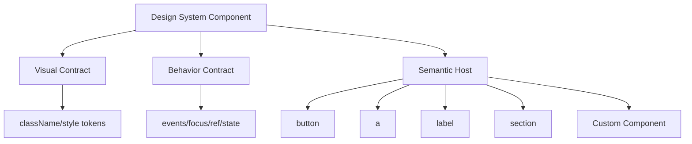
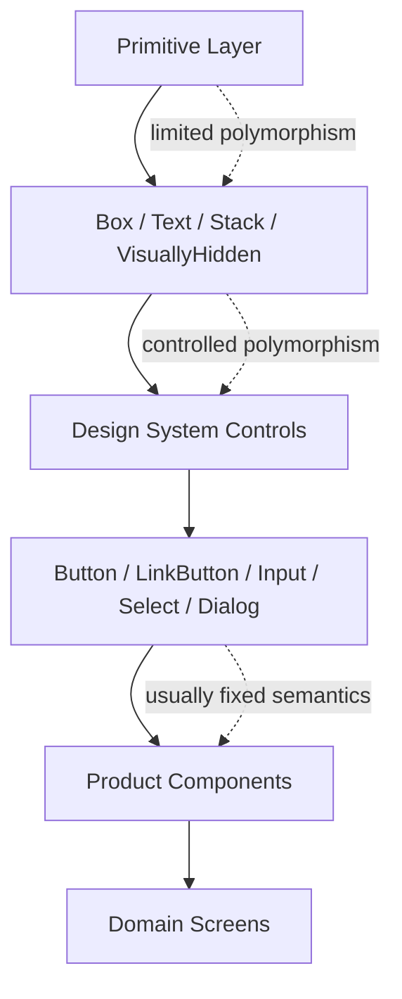

# Part 027 — Polymorphic Components and `as` Prop

Polymorphic component adalah komponen yang bisa merender element atau component berbeda melalui prop seperti `as`, `component`, atau `asChild`.

```tsx
<Button as="a" href="/settings">
  Settings
</Button>

<Text as="label" htmlFor="email">
  Email
</Text>

<Box as="section" aria-labelledby="case-title">
  ...
</Box>
```

Tujuannya bukan supaya semua komponen bisa menjadi apa saja.

Tujuannya adalah membuat **design-system primitive** yang fleksibel tanpa merusak semantic HTML, accessibility, ref, event contract, dan type safety.

```txt
Polymorphism is useful only when the visual abstraction and semantic element can vary independently.
```

Kalau variasinya hanya visual, jangan pakai polymorphism. Pakai `variant`.

Kalau variasinya semantic, polymorphism mungkin tepat.

---

## 1. Problem yang Diselesaikan

Design system sering punya primitive seperti ini:

```tsx
<Button>Save</Button>
```

Lalu product butuh tampilan yang sama, tetapi semantic berbeda:

```tsx
<a href="/billing">Billing</a>
```

Dari sisi visual, ini terlihat seperti button. Dari sisi semantic, ini adalah link.

Solusi buruk:

```tsx
<button onClick={() => navigate('/billing')}>Billing</button>
```

Masalahnya:

```txt
Browser tidak melihat ini sebagai link.
User tidak bisa open in new tab.
Screen reader mendapatkan semantic action, bukan navigation.
Right click link behavior hilang.
SEO/crawler behavior bisa berubah.
Keyboard/browser affordance tidak natural.
```

Polymorphic component mencoba menjaga dua hal sekaligus:

```txt
visual consistency + semantic correctness
```

Contoh:

```tsx
<Button as="a" href="/billing">
  Billing
</Button>
```

Secara visual tetap seperti button. Secara DOM tetap anchor.

---

## 2. Mental Model

Pikirkan polymorphic component sebagai **style/behavior shell** yang membiarkan caller memilih host element.



Komponen polymorphic biasanya punya tiga lapisan:

```txt
own props       → variant, size, tone, loading, selected
host props      → href, type, disabled, htmlFor, aria-*, onClick
merge behavior  → class merge, event compose, ref pass-through
```

Contoh:

```tsx
type ButtonOwnProps = {
  variant?: 'primary' | 'secondary' | 'ghost'
  size?: 'sm' | 'md' | 'lg'
  loading?: boolean
}
```

`ButtonOwnProps` adalah contract milik design system.

`href`, `target`, `type`, `disabled`, `aria-*`, `onClick`, dan `ref` adalah contract milik host element.

Polymorphic component harus menyatukan dua contract ini tanpa membuat hasilnya ambigu.

---

## 3. Kapan Perlu Polymorphic Component

Gunakan `as` ketika variasi host semantic adalah bagian sah dari API.

```txt
Good candidates:
- Text / Typography
- Box / Stack / Flex layout primitive
- Button-like Action component
- Link-like navigational primitive
- Visually styled primitive yang semantic host-nya valid berubah
- Headless trigger/item component yang perlu host berbeda
```

Contoh yang masuk akal:

```tsx
<Text as="p">Description</Text>
<Text as="span">Inline label</Text>
<Text as="legend">Shipping address</Text>

<Box as="main">...</Box>
<Box as="aside">...</Box>
<Box as="form" onSubmit={handleSubmit}>...</Box>
```

Jangan pakai polymorphism ketika component memiliki semantic kuat yang tidak boleh berubah.

```txt
Poor candidates:
- Checkbox
- RadioGroup
- Dialog
- Select
- Table
- FormField dengan label/error contract ketat
- Domain component seperti CaseApprovalPanel
```

Kalau `Dialog as="button"` masuk akal secara type tapi tidak masuk akal secara UI, contract-nya terlalu longgar.

---

## 4. `as` vs `variant`

Banyak tim mencampur dua hal ini.

```txt
variant → how it looks
as      → what it is semantically/rendered as
```

Contoh benar:

```tsx
<Button variant="primary">Save</Button>
<Button variant="ghost">Cancel</Button>
<Button as="a" href="/settings" variant="primary">Settings</Button>
```

Contoh buruk:

```tsx
<Button variant="link" onClick={() => navigate('/settings')}>
  Settings
</Button>
```

`variant="link"` hanya mengubah visual. Ia tidak mengubah semantic DOM.

Kalau behavior-nya navigation, host-nya harus anchor atau router Link.

---

## 5. The Semantic Trap

Polymorphic component sering gagal karena tim terlalu fokus pada style reuse.

```tsx
<Button as="div" onClick={submitForm}>Submit</Button>
```

Ini tampak fleksibel. Tetapi contract-nya rusak.

Masalah:

```txt
Tidak otomatis focusable.
Tidak punya keyboard activation default.
Tidak ikut form submit behavior.
Tidak punya disabled semantics.
Harus reimplement role, tabIndex, keydown.
Screen reader behavior bisa salah.
```

Rule praktis:

```txt
Do not replace native semantics with ARIA unless you have to.
Prefer native element first.
```

```tsx
// Better
<Button type="submit">Submit</Button>

// Avoid unless building custom widget with complete semantics
<Button as="div" role="button" tabIndex={0}>Submit</Button>
```

Polymorphism tidak boleh menjadi izin untuk menurunkan semantic quality.

---

## 6. Button vs Link: Decision Matrix

Ini matriks kecil yang harus ada di design-system team.

| User intent | Correct host | Example | Notes |
|---|---|---|---|
| Submit form | `button type="submit"` | Save form | Native form behavior |
| Trigger local action | `button type="button"` | Open modal | Action, bukan navigation |
| Navigate URL | `a href` atau router Link | Go to settings | Browser link affordance |
| Download resource | `a href download` | Download report | Native download behavior |
| Toggle value | `button` dengan `aria-pressed` atau input | Bold toggle | State must be announced |
| Select option | Proper option/menu/listbox pattern | Choose item | Needs widget semantics |
| Disabled navigation | Usually omit link or explain unavailable | Upgrade plan | `disabled` is not valid for anchor |

Contoh API yang lebih eksplisit daripada `Button as="a"`:

```tsx
<Action href="/cases/123">Open case</Action>
<Action onPress={approveCase}>Approve</Action>
```

`Action` bisa memilih host berdasarkan prop:

```tsx
function Action(props: ActionProps) {
  if ('href' in props) {
    return <a className="action" {...props} />
  }

  return <button type="button" className="action" {...props} />
}
```

Ini bukan murni polymorphic, tapi sering lebih defensible untuk enterprise app.

---

## 7. Minimal Polymorphic Component

Versi paling sederhana:

```tsx
type BoxProps = {
  as?: React.ElementType
  className?: string
  children?: React.ReactNode
}

function Box({ as: Comp = 'div', className, ...props }: BoxProps) {
  return <Comp className={className} {...props} />
}
```

Masalah versi ini:

```txt
Tidak type-safe untuk host props.
Tidak type-safe untuk ref.
Own props bisa conflict dengan host props.
Semua element diizinkan.
Semantics tidak dibatasi.
```

Sebagai mental model, boleh. Sebagai design-system production primitive, belum cukup.

---

## 8. TypeScript Polymorphic Props: Core Pattern

Kita ingin API seperti ini:

```tsx
<Text as="label" htmlFor="email">Email</Text>
<Text as="a" href="/terms">Terms</Text>
<Text as="button" type="button" onClick={open}>Open</Text>
```

Dan TypeScript sebaiknya menolak ini:

```tsx
<Text as="label" href="/terms">Invalid</Text>
<Text as="a" htmlFor="email">Invalid</Text>
```

Core type:

```tsx
type ElementType = React.ElementType

type PropsOf<C extends ElementType> = React.ComponentPropsWithoutRef<C>

type PolymorphicProps<C extends ElementType, OwnProps = {}> =
  OwnProps &
  { as?: C } &
  Omit<PropsOf<C>, keyof OwnProps | 'as'>
```

Implementasi:

```tsx
type TextOwnProps = {
  tone?: 'default' | 'muted' | 'danger'
  weight?: 'regular' | 'medium' | 'bold'
}

type TextProps<C extends React.ElementType = 'span'> =
  PolymorphicProps<C, TextOwnProps>

function Text<C extends React.ElementType = 'span'>({
  as,
  tone = 'default',
  weight = 'regular',
  className,
  ...props
}: TextProps<C>) {
  const Comp = as ?? 'span'

  return (
    <Comp
      className={cx(
        'text',
        `text--tone-${tone}`,
        `text--weight-${weight}`,
        className,
      )}
      {...props}
    />
  )
}
```

`Omit<PropsOf<C>, keyof OwnProps | 'as'>` penting agar own props menang dari host props.

Contoh conflict:

```tsx
type OwnProps = {
  size?: 'sm' | 'md' | 'lg'
}
```

Beberapa native element punya `size` attribute yang artinya berbeda. Dengan `Omit`, design-system `size` tidak bertabrakan dengan native `size`.

---

## 9. Prop Conflict Strategy

Polymorphic component harus punya strategi saat own prop bertabrakan dengan host prop.

Contoh conflict umum:

```txt
size       → design token vs native input/select size
color      → design token vs old HTML color attr
as         → polymorphic host vs library-specific prop
onChange   → form value change vs custom value change
ref        → host node ref vs imperative API ref
children   → free children vs structured children contract
```

Pattern:

```txt
Own props win.
Host props are allowed after removing conflicting keys.
If conflict is semantic, rename own prop.
```

Contoh:

```tsx
type ButtonOwnProps = {
  visualSize?: 'sm' | 'md' | 'lg'
  tone?: 'primary' | 'danger' | 'neutral'
}
```

Kadang nama `size` memang nyaman, tetapi `visualSize` lebih jelas untuk primitive yang bisa render ke banyak host.

Decision:

```txt
For narrow components: size is fine.
For wide polymorphic primitives: prefer visualSize or component-specific naming.
```

---

## 10. React 19 Ref as Prop

Di React 19, function component dapat menerima `ref` sebagai prop pada pola baru. Ini menyederhanakan API dibanding era sebelumnya yang membutuhkan `forwardRef` untuk expose DOM node.

Pola React 19:

```tsx
type PolymorphicRef<C extends React.ElementType> =
  React.ComponentPropsWithRef<C>['ref']

type PropsOfWithRef<C extends React.ElementType> =
  React.ComponentPropsWithRef<C>

type PolymorphicPropsWithRef<C extends React.ElementType, OwnProps = {}> =
  OwnProps &
  { as?: C; ref?: PolymorphicRef<C> } &
  Omit<PropsOfWithRef<C>, keyof OwnProps | 'as' | 'ref'>

type TextProps<C extends React.ElementType = 'span'> =
  PolymorphicPropsWithRef<C, TextOwnProps>

function Text<C extends React.ElementType = 'span'>({
  as,
  ref,
  className,
  tone = 'default',
  ...props
}: TextProps<C>) {
  const Comp = as ?? 'span'

  return (
    <Comp
      ref={ref}
      className={cx('text', `text--${tone}`, className)}
      {...props}
    />
  )
}
```

Penting:

```txt
ref harus menuju host/component yang benar.
Jangan expose internal wrapper ref jika caller mengharapkan semantic host ref.
```

Buruk:

```tsx
function Button({ ref, ...props }: ButtonProps<'button'>) {
  return (
    <span className="button-wrapper">
      <button ref={ref} {...props} />
    </span>
  )
}
```

Ini masih benar jika `ref` memang ke button. Tetapi jika style wrapper butuh ref internal, jangan campur dengan external ref.

---

## 11. React 18 Compatibility with `forwardRef`

Kalau library harus mendukung React 18, pakai `forwardRef`.

```tsx
type PolymorphicComponent = <C extends React.ElementType = 'span'>(
  props: TextProps<C> & { ref?: PolymorphicRef<C> }
) => React.ReactElement | null

const Text = React.forwardRef(function TextInner<C extends React.ElementType = 'span'>(
  { as, className, tone = 'default', ...props }: TextProps<C>,
  ref?: PolymorphicRef<C>,
) {
  const Comp = as ?? 'span'

  return (
    <Comp
      ref={ref}
      className={cx('text', `text--${tone}`, className)}
      {...props}
    />
  )
}) as PolymorphicComponent
```

Trade-off:

```txt
forwardRef polymorphic typing is verbose.
Type inference can degrade if terlalu abstrak.
Library authors sering butuh assertion.
Application code sebaiknya tidak terlalu sering menulis pattern ini sendiri.
```

Di application code, lebih baik buat beberapa component eksplisit daripada membuat generic polymorphic utility rumit untuk semua kasus.

---

## 12. Restricting Allowed Hosts

Kadang `as` tidak boleh menerima semua `ElementType`.

Contoh `Text` mungkin hanya boleh:

```txt
span, p, label, strong, em, small, div
```

Type:

```tsx
type TextElement = 'span' | 'p' | 'label' | 'strong' | 'em' | 'small' | 'div'

type TextProps<C extends TextElement = 'span'> =
  PolymorphicPropsWithRef<C, TextOwnProps>

function Text<C extends TextElement = 'span'>(props: TextProps<C>) {
  ...
}
```

Keuntungan:

```txt
API lebih kecil.
Semantic lebih defensible.
Autocomplete lebih berguna.
Failure mode berkurang.
```

Kekurangan:

```txt
Caller kadang butuh host yang belum dipikirkan.
Design system perlu update untuk kasus baru.
```

Untuk enterprise design system, restriction sering lebih baik daripada kebebasan mutlak.

```txt
A component API should make invalid composition hard, not just documented as discouraged.
```

---

## 13. `as` with Custom Component

`as` sering dipakai dengan router component:

```tsx
<Button as={NavLink} to="/cases">
  Cases
</Button>
```

Masalah:

```txt
NavLink mungkin tidak meneruskan className.
NavLink mungkin tidak meneruskan ref.
NavLink mungkin memakai prop `to`, bukan `href`.
NavLink mungkin render anchor tetapi menambah state sendiri.
```

Contract untuk custom component sebagai host:

```txt
It must accept className.
It should pass ref to the interactive/semantic host when needed.
It should preserve accessibility props.
It should preserve data-* attributes.
It should not swallow event handlers unexpectedly.
```

Contoh adapter:

```tsx
type RouterLinkAdapterProps = React.ComponentPropsWithoutRef<'a'> & {
  to: string
}

const RouterLinkAdapter = React.forwardRef<HTMLAnchorElement, RouterLinkAdapterProps>(
  function RouterLinkAdapter({ to, ...anchorProps }, ref) {
    return <RouterLink ref={ref} to={to} {...anchorProps} />
  },
)
```

Application boleh punya adapter per router agar design-system primitive tidak tahu router spesifik.

---

## 14. Prop Merging Order

Urutan merge props menentukan siapa yang menang.

```tsx
return <Comp {...props} className={computedClassName} />
```

Di sini `className` dari caller akan hilang jika `computedClassName` tidak memasukkannya.

Lebih baik:

```tsx
const mergedClassName = cx(baseClassName, variantClassName, className)

return <Comp {...props} className={mergedClassName} />
```

Untuk prop lain:

```tsx
return (
  <Comp
    {...props}
    data-ui="button"
    className={mergedClassName}
  />
)
```

Kalau `data-ui` internal harus selalu ada, taruh setelah spread.

Kalau caller boleh override, taruh sebelum spread.

Rule:

```txt
Internal invariant props after spread.
Caller extension props before spread.
Merged props explicit.
```

Contoh:

```tsx
<Comp
  {...props}
  role={requiredRole}
  aria-disabled={computedAriaDisabled}
  className={mergedClassName}
/>
```

Tetapi hati-hati: memaksa `role` bisa merusak semantic host. Jangan override role tanpa alasan kuat.

---

## 15. Event Handler Composition

Polymorphic component sering punya internal event handler dan caller event handler.

Buruk:

```tsx
function MenuTrigger({ onClick, ...props }) {
  return <button onClick={toggleOpen} {...props} />
}
```

`onClick` caller hilang atau override internal tergantung urutan.

Lebih baik:

```tsx
function composeEventHandlers<E>(
  theirHandler?: (event: E) => void,
  ourHandler?: (event: E) => void,
  options: { checkDefaultPrevented?: boolean } = { checkDefaultPrevented: true },
) {
  return (event: E & { defaultPrevented?: boolean }) => {
    theirHandler?.(event)

    if (options.checkDefaultPrevented === false || !event.defaultPrevented) {
      ourHandler?.(event)
    }
  }
}
```

Pemakaian:

```tsx
<Comp
  {...props}
  onClick={composeEventHandlers(props.onClick, event => {
    setOpen(value => !value)
  })}
/>
```

Kenapa caller dulu?

```txt
Caller may want to prevent default component behavior.
```

Contoh:

```tsx
<Menu.Trigger
  onClick={event => {
    if (isReadOnly) event.preventDefault()
  }}
/>
```

Internal toggle tidak jalan ketika caller mencegah default.

---

## 16. Disabled Semantics

`disabled` hanya valid untuk beberapa element seperti `button`, `input`, `select`, `textarea`, `fieldset`, `option`, `optgroup`.

Kalau `Button as="a" disabled`, apa yang terjadi?

```tsx
<Button as="a" href="/danger" disabled>
  Delete
</Button>
```

Anchor tidak punya native `disabled` behavior.

Design system harus memilih contract:

### Option A — Disallow

```tsx
type AnchorButtonProps = {
  as: 'a'
  href: string
  disabled?: never
}
```

### Option B — Map to `aria-disabled`

```tsx
<a
  aria-disabled={disabled ? true : undefined}
  onClick={disabled ? preventNavigation : onClick}
/>
```

Tapi ini tricky:

```txt
aria-disabled announces disabled state but does not block behavior.
You must prevent activation yourself.
You must decide whether element remains focusable.
```

Untuk enterprise apps, lebih baik bedakan:

```tsx
<Button disabled>Save</Button>
<LinkButton href="/settings">Settings</LinkButton>
```

Atau pakai `Action` union:

```tsx
type ActionProps =
  | ({ href: string; disabled?: never } & AnchorProps)
  | ({ onPress: () => void; disabled?: boolean } & ButtonProps)
```

---

## 17. Loading State in Polymorphic Button

Loading state sering tampak sederhana:

```tsx
<Button loading>Save</Button>
```

Tapi host berbeda mengubah behavior.

Untuk button:

```tsx
<button disabled={loading || disabled} aria-busy={loading || undefined}>
  {loading && <Spinner />}
  Save
</button>
```

Untuk anchor:

```txt
There is no native disabled anchor.
```

Pilihan:

```txt
1. Do not support loading for anchor-like host.
2. Support aria-busy only, navigation tetap jalan.
3. Prevent navigation while loading.
4. Split component: Button vs LinkButton.
```

Rule praktis:

```txt
If a prop changes interaction semantics, make sure it is valid for every allowed host.
```

Kalau tidak valid, batasi host atau pecah component.

---

## 18. `asChild` Pattern

Selain `as`, ada pola `asChild`:

```tsx
<Button asChild>
  <a href="/settings">Settings</a>
</Button>
```

Komponen tidak memilih host. Caller menyediakan child element. Component meng-inject props ke child.

Mental model:

```txt
as      → component chooses host from prop
asChild → caller provides host element; component decorates it
```

Implementasi minimal:

```tsx
function Slot({ children, ...slotProps }: SlotProps) {
  if (!React.isValidElement(children)) {
    throw new Error('Slot expects a single React element child.')
  }

  return React.cloneElement(children, mergeProps(slotProps, children.props))
}
```

Pemakaian:

```tsx
function Button({ asChild, className, ...props }: ButtonProps) {
  const Comp = asChild ? Slot : 'button'

  return (
    <Comp
      className={cx('button', className)}
      {...props}
    />
  )
}
```

Keuntungan:

```txt
Works with framework router components.
Caller fully controls host.
Avoids generic `as={Component}` typing complexity.
Good for headless/design-system primitives.
```

Risiko:

```txt
cloneElement can obscure data flow.
Only one child allowed.
Child must accept injected props.
Event/ref/class merging must be correct.
Type safety weaker.
```

---

## 19. `cloneElement` Caveat

`cloneElement` bukan pattern default untuk semua composition. Ia berguna untuk `Slot`, tetapi membuat data flow lebih implicit.

Contoh:

```tsx
<Button asChild>
  <RouterLink to="/billing">Billing</RouterLink>
</Button>
```

`Button` akan inject:

```txt
className
onClick
data-*
aria-*
ref
```

Masalah muncul jika `RouterLink` tidak meneruskan props ke anchor.

```tsx
function RouterLink({ to, children }: RouterLinkProps) {
  return <a href={to}>{children}</a>
}
```

`className`, `onClick`, `aria-*`, dan `ref` hilang.

Benar:

```tsx
type RouterLinkProps = React.ComponentPropsWithoutRef<'a'> & {
  to: string
}

const RouterLink = React.forwardRef<HTMLAnchorElement, RouterLinkProps>(
  function RouterLink({ to, ...props }, ref) {
    return <a ref={ref} href={to} {...props} />
  },
)
```

`asChild` bukan hanya fitur caller. Ia menuntut child component mengikuti pass-through contract.

---

## 20. Merging Props for `asChild`

Merge rules untuk `Slot` harus eksplisit.

```tsx
function mergeProps(slotProps: AnyProps, childProps: AnyProps) {
  const result = { ...slotProps, ...childProps }

  for (const key in childProps) {
    const slotValue = slotProps[key]
    const childValue = childProps[key]

    if (/^on[A-Z]/.test(key) && typeof slotValue === 'function' && typeof childValue === 'function') {
      result[key] = composeEventHandlers(childValue, slotValue)
    }

    if (key === 'className') {
      result[key] = cx(slotValue, childValue)
    }

    if (key === 'style') {
      result[key] = { ...slotValue, ...childValue }
    }
  }

  return result
}
```

Di sini child props menang untuk value biasa. Event handler dikomposisi. `className` digabung.

Rule:

```txt
Child remains the semantic owner.
Slot contributes behavior/style.
Caller can still prevent default behavior.
```

---

## 21. Ref Composition

Kadang component punya internal ref dan caller juga punya ref.

```tsx
function composeRefs<T>(
  ...refs: Array<React.Ref<T> | undefined>
): React.RefCallback<T> {
  return value => {
    for (const ref of refs) {
      if (!ref) continue

      if (typeof ref === 'function') {
        ref(value)
      } else {
        ref.current = value
      }
    }
  }
}
```

Pemakaian:

```tsx
const internalRef = React.useRef<HTMLButtonElement | null>(null)

return (
  <button
    ref={composeRefs(internalRef, externalRef)}
    {...props}
  />
)
```

Untuk polymorphic component, type ref bisa berubah berdasarkan host.

```tsx
<Button ref={buttonRef} />              // HTMLButtonElement
<Button as="a" ref={anchorRef} />      // HTMLAnchorElement
```

Kalau typing-nya tidak akurat, caller bisa salah mengakses API DOM.

---

## 22. Semantic Preservation Examples

### Typography

```tsx
<Heading as="h1" size="xl">Case Detail</Heading>
<Heading as="h2" size="lg">Timeline</Heading>
<Heading as="div" role="heading" aria-level={2}>Timeline</Heading>
```

Prefer native heading.

```txt
Use role=heading only when DOM structure forces it.
```

### Form Label

```tsx
<Text as="label" htmlFor="email">Email</Text>
```

Jangan render label sebagai `span` hanya karena style lebih mudah.

### Navigation

```tsx
<Button as="a" href="/cases/123">Open case</Button>
```

Kalau navigation, pakai anchor/router link.

### Action

```tsx
<Button type="button" onClick={openModal}>Open modal</Button>
```

Kalau action, pakai button.

---

## 23. Polymorphic Layout Primitive

Layout primitive biasanya paling aman untuk polymorphism.

```tsx
type StackOwnProps = {
  gap?: 'xs' | 'sm' | 'md' | 'lg'
  direction?: 'vertical' | 'horizontal'
  align?: 'start' | 'center' | 'end' | 'stretch'
}

type StackProps<C extends React.ElementType = 'div'> =
  PolymorphicPropsWithRef<C, StackOwnProps>

function Stack<C extends React.ElementType = 'div'>({
  as,
  gap = 'md',
  direction = 'vertical',
  align = 'stretch',
  className,
  ...props
}: StackProps<C>) {
  const Comp = as ?? 'div'

  return (
    <Comp
      className={cx(
        'stack',
        `stack--gap-${gap}`,
        `stack--${direction}`,
        `stack--align-${align}`,
        className,
      )}
      {...props}
    />
  )
}
```

Pemakaian:

```tsx
<Stack as="form" onSubmit={handleSubmit} gap="lg">
  ...
</Stack>

<Stack as="ul" gap="sm">
  {items.map(item => <li key={item.id}>{item.name}</li>)}
</Stack>
```

Layout primitive tidak membawa behavior interaktif, jadi risikonya lebih kecil.

Tetapi tetap ada semantic responsibility:

```txt
If Stack as="ul", children should be li.
If Stack as="dl", children should follow dt/dd structure.
```

TypeScript tidak selalu bisa menjaga semantic DOM structure. Review dan tests tetap dibutuhkan.

---

## 24. Polymorphic Action Component

Untuk action, lebih baik gunakan discriminated union dibanding `as` bebas.

```tsx
type CommonActionProps = {
  variant?: 'primary' | 'secondary' | 'ghost'
  size?: 'sm' | 'md' | 'lg'
  children: React.ReactNode
}

type ButtonActionProps = CommonActionProps &
  Omit<React.ComponentPropsWithoutRef<'button'>, keyof CommonActionProps> & {
    kind?: 'button'
    href?: never
  }

type LinkActionProps = CommonActionProps &
  Omit<React.ComponentPropsWithoutRef<'a'>, keyof CommonActionProps> & {
    kind: 'link'
    href: string
    disabled?: never
  }

type ActionProps = ButtonActionProps | LinkActionProps

function Action(props: ActionProps) {
  const { variant = 'primary', size = 'md', className, ...rest } = props
  const classes = cx('action', `action--${variant}`, `action--${size}`, className)

  if (props.kind === 'link') {
    const { kind, ...anchorProps } = rest as LinkActionProps
    return <a className={classes} {...anchorProps} />
  }

  const { kind, type = 'button', ...buttonProps } = rest as ButtonActionProps
  return <button type={type} className={classes} {...buttonProps} />
}
```

Keuntungan:

```txt
Navigation and action are explicit.
Invalid disabled anchor can be blocked.
Button gets default type="button".
Less semantic ambiguity than Button as="a".
```

Kekurangan:

```txt
Less open-ended than generic as prop.
Router links need adapter or separate prop.
```

Untuk enterprise app, explicit union sering lebih aman.

---

## 25. Button Default Type

HTML `button` di dalam form default-nya `submit`.

Banyak bug muncul dari ini:

```tsx
<form>
  <Button onClick={openHelp}>Help</Button>
</form>
```

Kalau `Button` render native button dan tidak set `type`, klik Help bisa submit form.

Design-system Button sebaiknya default:

```tsx
<button type={type ?? 'button'} />
```

Tapi hati-hati untuk polymorphic host:

```tsx
<Button as="a" type="button" href="/settings" />
```

`type` pada anchor punya arti lain atau tidak relevan.

Dengan polymorphic typing yang benar, TypeScript bisa membantu mencegah prop yang tidak valid.

---

## 26. Accessibility Contract

Polymorphic component harus mempertahankan accessibility contract.

Checklist:

```txt
Accessible name tetap ada.
Keyboard behavior sesuai host.
Focus ring tidak dihilangkan.
Disabled state valid.
aria-* diteruskan.
role tidak dipaksa sembarangan.
Ref menuju focusable/semantic node.
```

Contoh buruk:

```tsx
<IconButton as="a" href="/settings">
  <SettingsIcon />
</IconButton>
```

Kalau icon tidak punya label, accessible name kosong.

Lebih baik:

```tsx
<IconButton as="a" href="/settings" aria-label="Open settings">
  <SettingsIcon aria-hidden="true" />
</IconButton>
```

Tetapi `IconButton` sendiri bisa enforce:

```tsx
if (process.env.NODE_ENV !== 'production') {
  if (!props['aria-label'] && !props['aria-labelledby']) {
    console.warn('IconButton requires an accessible name.')
  }
}
```

---

## 27. Polymorphism and Headless Components

Headless primitive sering butuh polymorphism.

Contoh:

```tsx
<Menu.Trigger asChild>
  <Button variant="ghost">Actions</Button>
</Menu.Trigger>
```

`Menu.Trigger` butuh inject:

```txt
aria-haspopup
aria-expanded
aria-controls
onClick
onKeyDown
ref
```

`Button` harus menerima dan meneruskan semua props tersebut ke host button.

Jika tidak:

```txt
Menu state mungkin jalan.
Accessibility semantics hilang.
Focus management rusak.
Keyboard orchestration rusak.
```

Contract design-system + headless integration:

```txt
Components used asChild targets must be prop-transparent.
They must forward ref to their semantic host.
They must merge event handlers.
They must not swallow aria/data attributes.
```

---

## 28. Prop Transparency

Component disebut prop-transparent jika props yang tidak ia kenal diteruskan ke host element yang tepat.

```tsx
type ButtonProps = React.ComponentPropsWithoutRef<'button'> & {
  variant?: 'primary' | 'secondary'
}

const Button = React.forwardRef<HTMLButtonElement, ButtonProps>(
  function Button({ variant = 'primary', className, ...props }, ref) {
    return (
      <button
        ref={ref}
        className={cx('button', `button--${variant}`, className)}
        {...props}
      />
    )
  },
)
```

Ini prop-transparent.

Buruk:

```tsx
function Button({ variant, children, onClick }: ButtonProps) {
  return <button className="button" onClick={onClick}>{children}</button>
}
```

Ia menelan:

```txt
aria-*
data-*
id
role
tabIndex
onKeyDown
onPointerDown
ref
```

Komponen seperti ini sulit dipakai dengan headless library dan accessibility tooling.

---

## 29. The `Box` Debate

Banyak design system punya `Box` super fleksibel.

```tsx
<Box as="button" onClick={save} padding="md" color="danger" />
```

Kelebihan:

```txt
Fast layout composition.
Reduced CSS boilerplate.
Consistent spacing/token usage.
```

Kekurangan:

```txt
Semantic responsibility pindah ke caller.
Design intent bisa kabur.
Domain code menjadi penuh visual token.
Box bisa menjadi escape hatch untuk design-system governance.
```

Rule praktis:

```txt
Box is good at layout.
Box is dangerous as product semantic component.
```

Gunakan `Box` untuk structural layout:

```tsx
<Box as="section" padding="lg">
  ...
</Box>
```

Hindari `Box` untuk menggantikan component behavior:

```tsx
<Box as="button" onClick={approveCase}>Approve</Box>
```

Lebih baik:

```tsx
<Button onClick={approveCase}>Approve</Button>
```

---

## 30. Polymorphism in Domain Components

Domain component sebaiknya jarang polymorphic.

Buruk:

```tsx
<CaseStatusBadge as="button" onClick={openAuditTrail} status="escalated" />
```

`CaseStatusBadge` terdengar seperti display status. Jika bisa menjadi button, contract-nya berubah menjadi interactive control.

Lebih jelas:

```tsx
<button type="button" onClick={openAuditTrail} className="status-button">
  <CaseStatusBadge status="escalated" />
</button>
```

Atau component baru:

```tsx
<CaseStatusAction status="escalated" onOpenAuditTrail={openAuditTrail} />
```

Rule:

```txt
Primitive components may be polymorphic.
Domain components should be semantically explicit.
```

---

## 31. SSR and Hydration Consideration

Host element harus sama antara server render dan client render.

Buruk:

```tsx
function ResponsiveText(props: TextProps) {
  const isMobile = useMediaQuery('(max-width: 600px)')
  return <Text as={isMobile ? 'span' : 'p'} {...props} />
}
```

Kalau server tidak tahu viewport, server mungkin render `p`, client render `span`, lalu hydration mismatch.

Lebih baik:

```txt
Do not choose semantic host from client-only condition during initial render.
Use CSS for responsive visual changes.
Keep DOM semantics stable.
```

Kalau memang host harus berubah, pastikan render awal konsisten atau tunda perubahan setelah hydration dengan sadar.

---

## 32. Performance Consideration

Polymorphic component biasanya bukan bottleneck besar. Tetapi ada beberapa jebakan:

```txt
Creating dynamic components inline can remount subtree.
Passing unstable component to `as` can change element type.
Complex prop merging in huge lists adds cost.
cloneElement in massive trees can add overhead.
```

Buruk:

```tsx
<ListItem as={() => <a href="/x" />} />
```

Setiap render membuat component type baru. React melihat type berbeda dan bisa remount.

Lebih baik:

```tsx
const CaseLink = React.forwardRef<HTMLAnchorElement, AnchorProps>(...)

<ListItem as={CaseLink} />
```

Rule:

```txt
Do not create `as` component inline.
Use stable component references.
```

---

## 33. Testing Polymorphic Components

Test bukan hanya snapshot class.

Test harus menjawab:

```txt
Does it render the requested host?
Does it pass valid host props?
Does it merge className?
Does it compose event handlers?
Does it forward ref to correct node?
Does it preserve aria/data attributes?
Does it block invalid contracts where possible?
Does it keep semantic behavior for button/link?
```

Contoh:

```tsx
it('renders anchor when as=a', () => {
  render(<Button as="a" href="/settings">Settings</Button>)

  const link = screen.getByRole('link', { name: /settings/i })
  expect(link).toHaveAttribute('href', '/settings')
})
```

Test button:

```tsx
it('defaults button type to button', () => {
  render(<Button>Open</Button>)

  expect(screen.getByRole('button', { name: /open/i })).toHaveAttribute('type', 'button')
})
```

Test event composition:

```tsx
it('lets caller prevent internal behavior', async () => {
  const user = userEvent.setup()

  render(
    <Toggle
      onClick={event => event.preventDefault()}
    />,
  )

  await user.click(screen.getByRole('button'))

  expect(screen.getByRole('button')).toHaveAttribute('aria-pressed', 'false')
})
```

Test ref:

```tsx
it('forwards ref to anchor host', () => {
  const ref = React.createRef<HTMLAnchorElement>()

  render(<Button as="a" href="/x" ref={ref}>X</Button>)

  expect(ref.current?.tagName).toBe('A')
})
```

---

## 34. Build From Scratch: Polymorphic Text

```tsx
import * as React from 'react'

function cx(...values: Array<string | false | null | undefined>) {
  return values.filter(Boolean).join(' ')
}

type ElementType = React.ElementType

type PolymorphicRef<C extends ElementType> =
  React.ComponentPropsWithRef<C>['ref']

type PolymorphicProps<C extends ElementType, OwnProps = {}> =
  OwnProps &
  { as?: C; ref?: PolymorphicRef<C> } &
  Omit<React.ComponentPropsWithRef<C>, keyof OwnProps | 'as' | 'ref'>

type TextOwnProps = {
  tone?: 'default' | 'muted' | 'danger'
  weight?: 'regular' | 'medium' | 'bold'
}

type TextProps<C extends ElementType = 'span'> =
  PolymorphicProps<C, TextOwnProps>

export function Text<C extends ElementType = 'span'>({
  as,
  ref,
  tone = 'default',
  weight = 'regular',
  className,
  ...props
}: TextProps<C>) {
  const Comp = as ?? 'span'

  return (
    <Comp
      ref={ref}
      className={cx(
        'text',
        `text--tone-${tone}`,
        `text--weight-${weight}`,
        className,
      )}
      {...props}
    />
  )
}
```

Usage:

```tsx
<Text>Inline note</Text>
<Text as="p">Paragraph</Text>
<Text as="label" htmlFor="email">Email</Text>
<Text as="a" href="/terms">Terms</Text>
```

What this gives:

```txt
Default host span.
Host props inferred from as.
Own props preserved.
className merged.
ref typed by host.
```

What this does not give:

```txt
Semantic validation across all use cases.
Runtime accessibility warnings.
Restriction of allowed hosts.
asChild support.
```

---

## 35. Build From Scratch: Polymorphic Button with Restricted Hosts

```tsx
type ButtonHost = 'button' | 'a'

type ButtonOwnProps = {
  variant?: 'primary' | 'secondary' | 'ghost'
  size?: 'sm' | 'md' | 'lg'
  loading?: boolean
}

type ButtonProps<C extends ButtonHost = 'button'> =
  PolymorphicProps<C, ButtonOwnProps>

export function Button<C extends ButtonHost = 'button'>({
  as,
  ref,
  variant = 'primary',
  size = 'md',
  loading = false,
  className,
  children,
  ...props
}: ButtonProps<C>) {
  const Comp = as ?? 'button'

  const commonProps = {
    ref,
    className: cx('button', `button--${variant}`, `button--${size}`, className),
    'data-loading': loading ? '' : undefined,
  }

  if (Comp === 'button') {
    const buttonProps = props as React.ComponentPropsWithoutRef<'button'>

    return (
      <button
        {...buttonProps}
        {...commonProps}
        type={buttonProps.type ?? 'button'}
        disabled={loading || buttonProps.disabled}
        aria-busy={loading || undefined}
      >
        {loading && <Spinner />}
        {children}
      </button>
    )
  }

  const anchorProps = props as React.ComponentPropsWithoutRef<'a'>

  return (
    <a
      {...anchorProps}
      {...commonProps}
      aria-busy={loading || undefined}
    >
      {loading && <Spinner />}
      {children}
    </a>
  )
}
```

Catatan:

```txt
This is intentionally restricted to button and anchor.
It does not pretend all hosts are valid.
It makes button default type explicit.
It treats anchor loading as busy, not disabled.
```

Untuk production, Anda mungkin ingin memisahkan `Button` dan `LinkButton` agar lebih jelas.

---

## 36. Build From Scratch: Slot

```tsx
type AnyProps = Record<string, any>

type SlotProps = AnyProps & {
  children: React.ReactElement
}

function isEventHandler(key: string, value: unknown) {
  return /^on[A-Z]/.test(key) && typeof value === 'function'
}

function mergeSlotProps(slotProps: AnyProps, childProps: AnyProps) {
  const result = { ...slotProps, ...childProps }

  for (const key of Object.keys(slotProps)) {
    const slotValue = slotProps[key]
    const childValue = childProps[key]

    if (key === 'className') {
      result[key] = cx(slotValue, childValue)
      continue
    }

    if (key === 'style') {
      result[key] = { ...slotValue, ...childValue }
      continue
    }

    if (isEventHandler(key, slotValue) && isEventHandler(key, childValue)) {
      result[key] = composeEventHandlers(childValue, slotValue)
    }
  }

  return result
}

export function Slot({ children, ...slotProps }: SlotProps) {
  if (!React.isValidElement(children)) {
    throw new Error('Slot expects a single React element child.')
  }

  return React.cloneElement(
    children,
    mergeSlotProps(slotProps, children.props),
  )
}
```

Usage:

```tsx
<Button asChild>
  <RouterLink to="/cases/123">Open case</RouterLink>
</Button>
```

This pattern is powerful, but it makes prop flow less obvious. Use it for design-system/headless integration, not everywhere.

---

## 37. Failure Modes

### 37.1 Semantic Drift

Component looks like one thing but behaves as another.

```tsx
<Button as="div" onClick={submit}>Submit</Button>
```

Fix:

```tsx
<Button type="submit">Submit</Button>
```

### 37.2 Invalid Host Props

```tsx
<Text as="label" href="/x">Broken</Text>
```

Fix with polymorphic typing and restricted hosts.

### 37.3 Ref Goes to Wrong Node

```txt
Caller calls focus(), but ref points to wrapper div instead of button.
```

Fix:

```txt
Forward ref to semantic/focusable host.
Use separate internal refs for wrappers.
```

### 37.4 Event Handler Override

```txt
Internal onClick overrides caller onClick or vice versa.
```

Fix:

```txt
Compose handlers intentionally.
Allow caller preventDefault to cancel internal behavior when appropriate.
```

### 37.5 ClassName Lost

```txt
Caller className is swallowed.
Headless injected className is swallowed.
```

Fix:

```txt
Always merge className explicitly.
```

### 37.6 Over-Generalized Primitive

```txt
Box becomes button, link, form, section, card, modal, menu item, everything.
```

Fix:

```txt
Use polymorphism at primitive layer only.
Create semantic components for product/domain behavior.
```

### 37.7 Disabled Anchor Lie

```tsx
<Button as="a" disabled href="/delete">Delete</Button>
```

Fix:

```txt
Disallow disabled for anchor or implement explicit aria-disabled + activation blocking with documented behavior.
```

### 37.8 Inline Component Type

```tsx
<Component as={() => <a />} />
```

Fix:

```txt
Use stable component reference.
```

---

## 38. Design Heuristics

Use this decision table.

| Question | If yes | If no |
|---|---|---|
| Does the semantic host legitimately vary? | Consider `as` | Use fixed host |
| Is the component a low-level primitive? | Polymorphism may be okay | Prefer explicit semantic component |
| Does host variation change interaction behavior? | Consider union API or separate components | Generic `as` may be okay |
| Can TypeScript express valid host props? | Use polymorphic typing | Restrict host or avoid `as` |
| Does caller need to provide router/headless child? | Consider `asChild` | `as` is enough |
| Does accessibility depend on exact host? | Restrict strongly | Keep flexible |
| Is the component domain-specific? | Avoid polymorphism | Primitive may be polymorphic |

---

## 39. Architecture Guideline

Layer polymorphic components like this:



Guideline:

```txt
Primitive layer can be flexible.
Control layer should be semantically responsible.
Product/domain layer should be explicit.
```

---

## 40. Review Checklist

Before accepting a polymorphic component API, ask:

```txt
What host elements are allowed?
Why are they allowed?
Which own props conflict with host props?
Does ref point to expected node for every host?
Are event handlers merged or overridden?
Is className merged?
Are aria/data props preserved?
Does disabled/loading behavior make sense for every host?
Does default button type avoid accidental submit?
Does TypeScript reject invalid host props?
Does SSR render stable host element?
Can this be simpler with separate components?
```

If the team cannot answer these, the component is not ready.

---

## 41. Practical Recommendation

For application teams:

```txt
Use polymorphism sparingly.
Prefer explicit Button, LinkButton, Text, Stack.
Avoid generic `as` on domain components.
Do not build a universal Box that bypasses design-system semantics.
```

For design-system teams:

```txt
Implement polymorphism once, carefully.
Test prop merge/ref/a11y behavior heavily.
Restrict hosts where possible.
Document semantic expectations.
Provide adapters for router integration.
```

For headless component integration:

```txt
Prefer asChild when caller owns host.
Require prop-transparent child components.
Use event/ref composition utilities.
```

---

## 42. Exercises

### Exercise 1 — Build `Text`

Build a polymorphic `Text` component with:

```txt
as default span
variant: body, caption, code
weight: regular, medium, bold
ref support
className merge
host prop inference
```

Test:

```txt
Text as label accepts htmlFor.
Text as a accepts href.
Text default renders span.
ref points to correct host.
```

### Exercise 2 — Restrict `Heading`

Build `Heading` that only accepts:

```txt
h1, h2, h3, h4, h5, h6
```

Then decide whether `as="div" role="heading" aria-level={2}` should be supported.

Write the trade-off.

### Exercise 3 — Button vs LinkButton

Implement both APIs:

```tsx
<Button onClick={save}>Save</Button>
<LinkButton href="/settings">Settings</LinkButton>
```

Then compare with:

```tsx
<Button as="a" href="/settings">Settings</Button>
```

Document which API you would choose for a regulated enterprise product and why.

### Exercise 4 — Slot

Build `Slot` with:

```txt
single child enforcement
className merge
style merge
event handler composition
ref composition if needed
```

Use it to implement:

```tsx
<Button asChild>
  <RouterLink to="/cases">Cases</RouterLink>
</Button>
```

### Exercise 5 — Failure Review

Review this component:

```tsx
function CardAction({ as: Comp = 'div', onClick, children }) {
  return <Comp className="card-action" onClick={onClick}>{children}</Comp>
}
```

Find:

```txt
semantic issues
type issues
keyboard issues
ref issues
prop transparency issues
```

Refactor into a safer API.

---

## 43. Summary

Polymorphic components are not about making every component infinitely flexible.

They are about separating:

```txt
visual abstraction
semantic host
behavior contract
type contract
accessibility contract
```

The most important rule:

```txt
The rendered element still matters.
```

A component that looks right but has the wrong DOM semantics is not production-grade.

In strong React architecture:

```txt
Primitive components may be polymorphic.
Interactive controls should be semantically disciplined.
Domain components should be explicit.
Polymorphism must preserve props, refs, events, accessibility, and invariants.
```

Part berikutnya membahas **Component Contracts**: bagaimana mendesain props dan behavior component sebagai API yang punya invariant, failure modes, versioning, dan test strategy.
