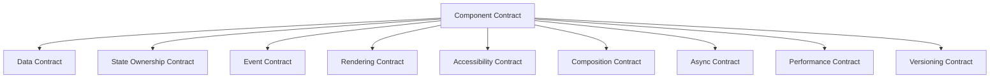
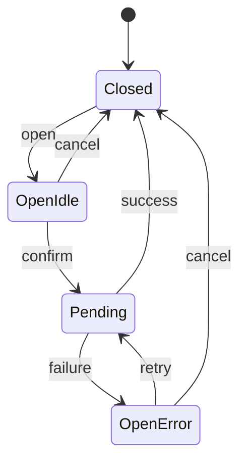

# Part 028 — Component Contracts

Component contract adalah seluruh janji yang dibuat component kepada caller.

Bukan hanya tipe props.

Contract mencakup:

```txt
what props mean
who owns state
when callbacks fire
what DOM semantics are rendered
how accessibility is guaranteed
what is controlled or uncontrolled
what can be composed inside
what is stable across releases
what failure modes are prevented
```

React component adalah function, tetapi component yang dipakai banyak orang adalah API.

```txt
A reusable component is a public protocol disguised as JSX.
```

Jika contract tidak jelas, app akan tetap berjalan, tetapi behavior-nya menjadi kumpulan kebetulan.

---

## 1. Why Contracts Matter

Komponen kecil sering terlihat harmless:

```tsx
function Modal({ open, children }) {
  if (!open) return null
  return <div className="modal">{children}</div>
}
```

Lalu product butuh:

```txt
close on escape
close on backdrop click
prevent close while submitting
focus trap
initial focus
restore focus
aria-labelledby
nested modal prevention
dirty form confirmation
animation lifecycle
portal container
```

Kalau contract awal hanya `open + children`, setiap kebutuhan baru akan ditambal secara acak.

Hasilnya:

```txt
props bertambah tanpa struktur
callback timing tidak konsisten
state ownership ambigu
accessibility rapuh
breaking change tidak terlihat
component sulit dites
```

Component contract mencegah ini dengan mendefinisikan batas dan invariant sejak awal.

---

## 2. Props Are an API Surface

Props bukan parameter biasa. Props adalah bahasa komunikasi antara caller dan component.

```tsx
<CaseTable
  cases={cases}
  selectedCaseId={selectedCaseId}
  onSelectedCaseChange={setSelectedCaseId}
  onOpenCase={openCase}
/>
```

Di sini ada contract:

```txt
cases                         → read model input
selectedCaseId                → controlled selection state
onSelectedCaseChange          → selection transition event
onOpenCase                    → command intent
```

Ini lebih jelas daripada:

```tsx
<CaseTable
  data={cases}
  value={selectedCaseId}
  onChange={setSelectedCaseId}
  onClick={openCase}
/>
```

`data`, `value`, `onChange`, `onClick` terlalu generic untuk domain behavior.

Rule:

```txt
Generic names are fine for primitives.
Domain components need domain language.
```

---

## 3. Contract Dimensions

Component contract punya beberapa dimensi.



Kebanyakan bug muncul saat salah satu dimensi ini implicit.

Contoh:

```txt
Data contract says items may be empty.
Rendering contract forgets empty state.
Event contract fires onSelect with stale item.
Accessibility contract forgets selected state.
```

---

## 4. Data Contract

Data contract menjawab:

```txt
What data shape is accepted?
Which fields are required?
Can data be empty?
Can data contain duplicate ids?
Can data change order?
Can data be partially loaded?
Does component own sorting/filtering or caller does?
```

Contoh buruk:

```tsx
type TableProps = {
  data: any[]
}
```

Tidak ada contract. Component tidak tahu identity, display, sorting, empty state.

Lebih baik:

```tsx
type CaseRow = {
  id: CaseId
  referenceNumber: string
  status: CaseStatus
  assigneeName: string | null
  updatedAt: string
}

type CaseTableProps = {
  cases: CaseRow[]
  getCaseId?: (caseRow: CaseRow) => CaseId
  emptyState?: React.ReactNode
}
```

Atau untuk reusable table:

```tsx
type DataTableProps<TItem, TId extends string | number> = {
  items: readonly TItem[]
  getItemId: (item: TItem) => TId
  columns: readonly ColumnDef<TItem>[]
  emptyState?: React.ReactNode
}
```

Identity harus eksplisit.

```txt
No identity, no stable selection.
No identity, no stable animation.
No identity, no reliable update reconciliation.
```

---

## 5. State Ownership Contract

Setiap state dalam component harus punya owner.

```txt
Owned by component
Owned by caller
Derived from props
Stored externally
Owned by server/cache
Owned by URL
```

Controlled component:

```tsx
<Tabs value={tab} onValueChange={setTab} />
```

Uncontrolled component:

```tsx
<Tabs defaultValue="activity" />
```

Hybrid controllable component:

```tsx
type TabsProps = {
  value?: string
  defaultValue?: string
  onValueChange?: (value: string) => void
}
```

Contract harus menjawab:

```txt
If value is provided, component is controlled.
If value is absent, component owns state initialized from defaultValue.
defaultValue is read only on mount.
onValueChange fires before/after internal state update?
Can controlled value be invalid?
What happens if selected tab disappears?
```

Tanpa jawaban ini, caller akan menebak.

---

## 6. Controlled/Uncontrolled Contract Template

Gunakan template seperti ini di dokumentasi component:

```txt
Ownership:
- Controlled when `value` is provided.
- Uncontrolled when `value` is undefined.
- `defaultValue` is only used for initial uncontrolled state.

Transitions:
- User interaction calls `onValueChange(nextValue)`.
- In controlled mode, caller must pass updated `value` to reflect change.
- In uncontrolled mode, component updates internal state after firing callback.

Invalid values:
- If `value` does not match any item, no item is selected.
- The component does not auto-correct controlled value.

Reset:
- Change `key` to reset uncontrolled state.
```

Ini kecil, tetapi mencegah banyak bug.

---

## 7. Event Contract

Callback bukan hanya function. Callback adalah event contract.

Bandingkan:

```tsx
onClick?: () => void
onChange?: (value: string) => void
onSubmit?: (data: FormData) => void
```

Nama harus menyatakan intent.

```txt
onClick          → low-level DOM-ish event
onSelect         → user selected item
onValueChange    → value changed
onOpenChange     → open state changed
onRequestClose   → user/system requests close, caller may deny
onConfirm        → user confirmed command
onCommit         → draft committed
onCancel         → user abandoned draft
```

Untuk component reusable, hindari overloading satu callback.

Buruk:

```tsx
<Dialog onChange={handleDialogChange} />
```

Apa yang berubah?

```txt
open state?
selected item?
form value?
loading state?
```

Lebih baik:

```tsx
<Dialog
  open={open}
  onOpenChange={setOpen}
  onConfirm={submit}
/>
```

---

## 8. Event Payload Design

Event payload harus cukup kaya, tapi tidak membocorkan detail internal berlebihan.

Buruk:

```tsx
onSelect?: (index: number) => void
```

Masalah:

```txt
Index berubah saat sorting/filtering.
Caller harus lookup item sendiri.
Identity tidak stabil.
```

Lebih baik:

```tsx
onSelect?: (event: {
  id: CaseId
  item: CaseRow
  source: 'mouse' | 'keyboard' | 'programmatic'
}) => void
```

Tapi jangan terlalu over-engineered jika tidak perlu.

Untuk primitive:

```tsx
onValueChange?: (value: string) => void
```

Untuk domain workflow:

```tsx
onDecisionSubmit?: (command: {
  caseId: CaseId
  decision: 'approve' | 'reject' | 'escalate'
  reason?: string
}) => Promise<void> | void
```

Payload harus mewakili intent, bukan DOM noise.

---

## 9. Command vs Event

Dalam UI, callback punya dua bentuk:

```txt
Event callback   → component reports something happened
Command callback → component asks application to do something
```

Event:

```tsx
onValueChange(nextValue)
onOpenChange(nextOpen)
onSelectionChange(nextSelection)
```

Command:

```tsx
onSave(command)
onApprove(command)
onNavigate(destination)
onUpload(file)
```

Event biasanya sinkron dan state-related.

Command bisa async dan punya error/loading semantics.

Jangan mencampur:

```tsx
<ApprovalPanel onChange={approveCase} />
```

Lebih jelas:

```tsx
<ApprovalPanel onApprove={approveCase} />
```

---

## 10. Async Contract

Kalau callback bisa async, contract harus eksplisit.

Pertanyaan:

```txt
Does component await the promise?
Does component show pending state?
Can user click twice?
What happens on rejection?
Does component catch error or caller handles it?
Can operation be cancelled?
Does successful command close modal automatically?
```

Contoh implicit yang berbahaya:

```tsx
<ConfirmDialog onConfirm={deleteCase} />
```

Apakah dialog close langsung atau menunggu `deleteCase` selesai?

Lebih baik:

```tsx
type ConfirmDialogProps = {
  open: boolean
  onOpenChange: (open: boolean) => void
  onConfirm: () => Promise<void> | void
  closeOnConfirm?: boolean
  closeOnConfirmSuccess?: boolean
}
```

Atau lebih opinionated:

```txt
Contract:
- onConfirm may return promise.
- Confirm button enters pending while promise is pending.
- Dialog remains open during pending.
- On success, dialog closes.
- On error, dialog remains open and calls onError.
```

Implementasi:

```tsx
async function handleConfirm() {
  try {
    setPending(true)
    await onConfirm()
    onOpenChange(false)
  } catch (error) {
    onError?.(error)
  } finally {
    setPending(false)
  }
}
```

Kalau component tidak ingin own async state, buat controlled:

```tsx
<ConfirmDialog
  pending={deleteMutation.isPending}
  onConfirm={() => deleteMutation.mutate(caseId)}
/>
```

Keduanya valid. Yang salah adalah tidak mendefinisikan contract.

---

## 11. Rendering Contract

Rendering contract menjawab:

```txt
What DOM role/element is rendered?
Does component render null in some states?
Does it use portal?
Does it preserve children order?
Does it clone children?
Does it add wrappers?
Does ref target host or wrapper?
Does it preserve stable keys?
```

Contoh:

```tsx
<Tooltip content="More info">
  <button>Info</button>
</Tooltip>
```

Rendering contract harus jelas:

```txt
Tooltip requires exactly one focusable child.
Tooltip may clone child to attach aria-describedby and event handlers.
Tooltip content is rendered in a portal.
Tooltip does not change child semantic role.
```

Tanpa ini, caller bisa memberi:

```tsx
<Tooltip content="Info">
  <span>Info</span>
</Tooltip>
```

Lalu keyboard user tidak bisa fokus.

---

## 12. Accessibility Contract

Accessibility bukan optional behavior. Ini bagian contract.

Component harus menjawab:

```txt
What accessible name is required?
What role is rendered?
What keyboard interactions are supported?
How focus is managed?
How disabled/loading/error states are announced?
What aria attributes are caller responsibility?
What aria attributes component owns?
```

Contoh `IconButton`:

```tsx
type IconButtonProps = React.ComponentPropsWithoutRef<'button'> & {
  'aria-label': string
  children: React.ReactElement
}
```

`aria-label` required karena icon-only button butuh accessible name.

Contoh `Dialog`:

```tsx
type DialogProps = {
  open: boolean
  onOpenChange: (open: boolean) => void
  title: React.ReactNode
  description?: React.ReactNode
  children: React.ReactNode
}
```

Component bisa memastikan `aria-labelledby` dari title.

Jika API hanya:

```tsx
<Dialog>{children}</Dialog>
```

Maka caller harus ingat accessibility sendiri. Untuk reusable design system, ini terlalu rapuh.

---

## 13. Composition Contract

Composition contract menjawab:

```txt
What children are allowed?
Is order important?
Can children be arbitrary ReactNode?
Must children be component parts?
Does component use context for descendants?
Can parts be nested?
Can parts be conditional?
Can parts render outside via portal?
```

Contoh compound component:

```tsx
<Tabs value={tab} onValueChange={setTab}>
  <Tabs.List>
    <Tabs.Trigger value="overview">Overview</Tabs.Trigger>
    <Tabs.Trigger value="history">History</Tabs.Trigger>
  </Tabs.List>
  <Tabs.Panel value="overview">...</Tabs.Panel>
  <Tabs.Panel value="history">...</Tabs.Panel>
</Tabs>
```

Contract:

```txt
Tabs.Trigger must be rendered under Tabs.
Each Trigger value should be unique.
Each Panel value should correspond to a Trigger.
Tabs.List provides keyboard roving focus among triggers.
Panels can be lazily mounted or always mounted depending prop.
```

Jika value duplicate, apa yang terjadi?

```txt
Warn in dev?
Last wins?
First wins?
Throw?
```

Contract harus memilih.

---

## 14. Illegal States

Strong component contract membuat illegal states sulit diekspresikan.

Buruk:

```tsx
type AlertProps = {
  type?: 'success' | 'error' | 'warning'
  successMessage?: string
  errorMessage?: string
  warningMessage?: string
}
```

Ini mengizinkan:

```tsx
<Alert type="success" errorMessage="Failed" />
```

Lebih baik:

```tsx
type AlertProps =
  | { type: 'success'; message: string; retry?: never }
  | { type: 'error'; message: string; retry?: () => void }
  | { type: 'warning'; message: string; action?: React.ReactNode }
```

Illegal combination hilang.

Untuk status UI:

```tsx
type LoadableViewProps<T> =
  | { status: 'idle' }
  | { status: 'loading' }
  | { status: 'error'; error: Error; onRetry?: () => void }
  | { status: 'success'; data: T }
```

Sekarang component tidak bisa menerima `status='success'` tanpa `data`.

---

## 15. Controlled Contract with Type-Level Guard

Kadang ingin melarang `value` tanpa `onValueChange`.

```tsx
type Controlled<T> = {
  value: T
  onValueChange: (value: T) => void
  defaultValue?: never
}

type Uncontrolled<T> = {
  value?: never
  onValueChange?: (value: T) => void
  defaultValue?: T
}

type ControllableProps<T> = Controlled<T> | Uncontrolled<T>
```

Pemakaian:

```tsx
type TabsProps = ControllableProps<string> & {
  children: React.ReactNode
}
```

Ini mencegah:

```tsx
<Tabs value="overview" />
```

Jika controlled, caller harus provide `onValueChange`.

Apakah selalu perlu? Tidak.

Kadang read-only controlled component valid:

```tsx
<Tabs value="overview" />
```

Maka contract-nya berbeda:

```txt
If value is provided without onValueChange, component is read-only controlled.
User interaction does not change selection.
```

Pilih contract dengan sadar.

---

## 16. Runtime Guard

TypeScript tidak menjaga semua hal.

Contoh:

```txt
Duplicate tab values.
Missing accessible name.
Value does not match item.
Child component not under provider.
```

Gunakan dev-only runtime guard.

```tsx
function invariant(condition: unknown, message: string): asserts condition {
  if (!condition) {
    throw new Error(message)
  }
}
```

Provider guard:

```tsx
function useTabsContext() {
  const context = React.useContext(TabsContext)

  invariant(
    context,
    'Tabs components must be rendered within <Tabs>.',
  )

  return context
}
```

Dev warning:

```tsx
if (process.env.NODE_ENV !== 'production') {
  if (values.size !== triggers.length) {
    console.warn('Tabs.Trigger values must be unique.')
  }
}
```

Throw untuk misuse yang membuat component tidak bisa bekerja.

Warn untuk misuse yang masih bisa render tetapi berisiko.

---

## 17. Default Values Contract

Default value terlihat kecil, tapi sering salah.

```tsx
function SearchBox({ defaultQuery = '' }) {
  const [query, setQuery] = useState(defaultQuery)
}
```

Contract:

```txt
defaultQuery is used only on initial mount.
Changing defaultQuery later does not reset query.
Use `key` or controlled `query` to reset.
```

Jika caller berharap `defaultQuery` sync setiap berubah, itu bukan default. Itu controlled/derived state.

Buruk:

```tsx
useEffect(() => {
  setQuery(defaultQuery)
}, [defaultQuery])
```

Ini dapat menghapus edit user ketika prop berubah.

Lebih baik contract eksplisit:

```tsx
<SearchBox query={query} onQueryChange={setQuery} />
```

Atau reset eksplisit:

```tsx
<SearchBox key={savedSearchId} defaultQuery={savedSearch.query} />
```

---

## 18. Ref Contract

Jika component menerima ref, contract harus jelas.

```txt
Does ref point to DOM node?
Which DOM node?
Does ref expose imperative handle?
Is ref stable across states?
Can ref be null when closed/unmounted?
```

Contoh:

```tsx
<TextInput ref={inputRef} />
```

Caller kemungkinan mengharapkan:

```txt
inputRef.current.focus()
inputRef.current.select()
```

Kalau `TextInput` ref menuju wrapper div, contract rusak.

Untuk component kompleks, gunakan imperative handle:

```tsx
type ComboboxHandle = {
  focusInput: () => void
  open: () => void
  close: () => void
}
```

Tapi jangan expose terlalu banyak internal.

```txt
Imperative API should be minimal and stable.
```

---

## 19. Styling Contract

Styling juga contract.

Pertanyaan:

```txt
Can caller pass className?
Where is className applied?
Can caller pass style?
Are data attributes exposed for styling states?
Are CSS variables part of public API?
Can caller override internal layout?
```

Contoh:

```tsx
<Button className="my-button" />
```

Apakah className di root?

```txt
Document it.
```

Untuk state styling, lebih baik expose `data-*`:

```tsx
<button
  data-state={open ? 'open' : 'closed'}
  data-disabled={disabled ? '' : undefined}
/>
```

Caller bisa style:

```css
.button[data-state='open'] {
  ...
}
```

Ini lebih stabil daripada bergantung pada class internal acak.

---

## 20. Slot Contract

Kalau component menerima slot, bedakan slot sebagai node vs slot sebagai component.

Node slot:

```tsx
<Card
  title="Case summary"
  actions={<Button>Edit</Button>}
/>
```

Component slot:

```tsx
<DataTable
  items={cases}
  renderRow={caseRow => <CaseRow case={caseRow} />}
/>
```

Element/component injection:

```tsx
<PageLayout
  sidebar={<CaseFilters />}
  content={<CaseList />}
/>
```

Contract harus menjawab:

```txt
How often is render function called?
Can it use Hooks? No, if it is callback, not component.
What props does slot receive?
Who owns key?
Who owns layout wrapper?
Can slot return null?
```

Render callback contract:

```tsx
type ListProps<T> = {
  items: readonly T[]
  getItemId: (item: T) => string
  renderItem: (item: T, meta: { selected: boolean }) => React.ReactNode
}
```

Document:

```txt
renderItem must be pure.
Do not call Hooks inside renderItem.
If item needs hooks, render a component from renderItem.
```

---

## 21. Context Contract

Jika component memakai context, contract tidak terlihat dari props. Maka dokumentasi dan runtime guard lebih penting.

```tsx
<FormField name="email">
  <FormLabel>Email</FormLabel>
  <FormInput />
  <FormError />
</FormField>
```

Context contract:

```txt
FormField provides id/name/error/describedBy to descendants.
FormInput reads field context.
FormLabel reads id and htmlFor.
FormError reads error and id.
```

Failure:

```tsx
<FormInput />
```

Tanpa provider, component harus:

```txt
throw helpful error
or support standalone mode explicitly
```

Jangan diam-diam fallback ke random id jika contract mengharuskan provider.

---

## 22. Boundary Contract

Component harus tahu apakah ia primitive, application, atau domain boundary.

```txt
Primitive component:
- generic props
- visual/behavior focused
- low domain knowledge

Application component:
- knows app services/hooks
- orchestrates data and commands
- composes primitives

Domain component:
- speaks domain language
- enforces business invariants at UI boundary
- does not expose generic low-level knobs unnecessarily
```

Contoh primitive:

```tsx
<Button variant="primary" />
```

Contoh domain:

```tsx
<EnforcementDecisionPanel
  caseId={caseId}
  allowedDecisions={allowedDecisions}
  onSubmitDecision={submitDecision}
/>
```

Jangan membuat domain component terlalu generic:

```tsx
<Panel data={caseData} actions={actions} renderFooter={...} />
```

Itu bukan contract kuat. Itu configuration bucket.

---

## 23. Error Contract

Component bisa error karena:

```txt
caller misuse
async command failed
data invalid
render child threw
external dependency failed
```

Contract harus membedakan.

Caller misuse:

```tsx
<Tabs.Trigger value="x" /> // outside Tabs
```

Throw developer error.

Async command failed:

```tsx
<ConfirmDialog onConfirm={deleteCase} />
```

Show error, call `onError`, or let caller control.

Data invalid:

```tsx
<Select value="missing" options={options} />
```

Options:

```txt
render empty selection
warn in dev
throw if invariant impossible
```

Jangan semua error dianggap sama.

---

## 24. Loading and Empty Contract

Reusable component harus punya posisi jelas terhadap loading/empty.

Option A — caller owns loading branching:

```tsx
{query.isLoading ? (
  <CaseTableSkeleton />
) : (
  <CaseTable cases={query.data ?? []} />
)}
```

Option B — component owns state rendering:

```tsx
<CaseTable
  status={query.status}
  cases={query.data ?? []}
  error={query.error}
/>
```

Untuk primitive table, Option A sering lebih baik.

Untuk product table yang highly standardized, Option B bisa lebih konsisten.

Contract:

```txt
Does component accept empty array as valid data?
Does empty array mean no result or not loaded yet?
Does loading preserve previous data?
Does error replace table or show inline?
```

Jangan membuat `items?: T[]` tanpa status jika `undefined` bisa berarti banyak hal.

---

## 25. Permission Contract

Enterprise UI sering butuh permission-aware component.

Buruk:

```tsx
<Button disabled={!canApprove}>Approve</Button>
```

Mungkin cukup, tapi contract permission tidak jelas.

Lebih eksplisit:

```tsx
<PermissionGate
  capability="case.approve"
  fallback={<Button disabled title="You cannot approve this case">Approve</Button>}
>
  <Button onClick={approve}>Approve</Button>
</PermissionGate>
```

Atau domain component:

```tsx
<ApproveCaseButton
  caseId={caseId}
  permission={approvalPermission}
  onApprove={approve}
/>
```

Permission contract harus menjawab:

```txt
Hidden or disabled?
Does disabled explain why?
Is unauthorized action still blocked server-side?
Is audit trail affected?
Can user request access?
```

UI permission is not security. It is UX and intent gating. Server authorization tetap wajib.

---

## 26. Performance Contract

Tidak semua component perlu menjanjikan performance, tetapi beberapa perlu.

Misalnya `DataTable`:

```txt
Can render 10 rows? 1,000 rows? 100,000 rows?
Does it virtualize?
Are row renderers memo-sensitive?
Does selection update rerender all rows?
Are callbacks stable?
Does component preserve row state while sorting?
```

Contract bisa eksplisit:

```txt
DataTable is optimized for up to 500 rows without virtualization.
For larger datasets, use VirtualizedDataTable.
getRowId must be stable.
columns should be memoized by caller.
```

Ini bukan premature optimization. Ini expectation management.

---

## 27. Versioning Contract

Reusable component API akan berubah.

Breaking changes bukan hanya TypeScript error.

Breaking behavior bisa berupa:

```txt
callback fires earlier/later
default prop changes
DOM structure changes
className target changes
role changes
focus behavior changes
controlled/uncontrolled semantics changes
portal container changes
```

Contoh:

```txt
Changing Dialog to close immediately before async onConfirm finishes is breaking.
Changing Button default type from submit to button is breaking for some forms.
Changing className from root to inner element is breaking for styling.
```

Document versioning-sensitive contract.

---

## 28. Contract Documentation Template

Untuk component penting, dokumentasi minimal:

```mdx
## Purpose
What problem this component solves.

## Ownership
Which state is owned by caller vs component.

## Props
Meaning of non-obvious props.

## Events
When callbacks fire and what payload means.

## Accessibility
Roles, labels, keyboard, focus, aria ownership.

## Composition
Allowed children/slots and structural constraints.

## Async behavior
Pending/error/success contract.

## Styling
className target, data attributes, CSS variables.

## Edge cases
Empty, invalid value, duplicate ids, disabled, loading.

## Examples
Controlled, uncontrolled, error, async, composition.
```

Ini tidak harus panjang untuk semua component. Tapi untuk shared component, ini murah dibanding production bug.

---

## 29. Build From Scratch: Contract-Strong Tabs

Types:

```tsx
type ControlledTabsProps = {
  value: string
  onValueChange: (value: string) => void
  defaultValue?: never
}

type UncontrolledTabsProps = {
  value?: never
  defaultValue?: string
  onValueChange?: (value: string) => void
}

type TabsProps = (ControlledTabsProps | UncontrolledTabsProps) & {
  orientation?: 'horizontal' | 'vertical'
  activationMode?: 'automatic' | 'manual'
  children: React.ReactNode
}
```

Hook:

```tsx
function useControllableState<T>({
  value,
  defaultValue,
  onChange,
}: {
  value?: T
  defaultValue: T
  onChange?: (value: T) => void
}) {
  const [internalValue, setInternalValue] = React.useState(defaultValue)
  const controlled = value !== undefined
  const currentValue = controlled ? value : internalValue

  const setValue = React.useCallback((nextValue: T) => {
    onChange?.(nextValue)

    if (!controlled) {
      setInternalValue(nextValue)
    }
  }, [controlled, onChange])

  return [currentValue, setValue, controlled] as const
}
```

Provider contract:

```tsx
type TabsContextValue = {
  value: string
  setValue: (value: string) => void
  orientation: 'horizontal' | 'vertical'
  activationMode: 'automatic' | 'manual'
}

const TabsContext = React.createContext<TabsContextValue | null>(null)

function useTabsContext(componentName: string) {
  const context = React.useContext(TabsContext)

  if (!context) {
    throw new Error(`${componentName} must be used within <Tabs>.`)
  }

  return context
}
```

Root:

```tsx
function Tabs({
  value,
  defaultValue = '',
  onValueChange,
  orientation = 'horizontal',
  activationMode = 'automatic',
  children,
}: TabsProps) {
  const [currentValue, setValue] = useControllableState({
    value,
    defaultValue,
    onChange: onValueChange,
  })

  const context = React.useMemo(() => ({
    value: currentValue,
    setValue,
    orientation,
    activationMode,
  }), [currentValue, setValue, orientation, activationMode])

  return (
    <TabsContext.Provider value={context}>
      {children}
    </TabsContext.Provider>
  )
}
```

Trigger:

```tsx
type TabsTriggerProps = React.ComponentPropsWithoutRef<'button'> & {
  value: string
}

function TabsTrigger({ value, onClick, ...props }: TabsTriggerProps) {
  const tabs = useTabsContext('Tabs.Trigger')
  const selected = tabs.value === value

  return (
    <button
      {...props}
      type="button"
      role="tab"
      aria-selected={selected}
      data-state={selected ? 'active' : 'inactive'}
      onClick={composeEventHandlers(onClick, () => {
        tabs.setValue(value)
      })}
    />
  )
}
```

Panel:

```tsx
type TabsPanelProps = React.ComponentPropsWithoutRef<'div'> & {
  value: string
  forceMount?: boolean
}

function TabsPanel({ value, forceMount = false, ...props }: TabsPanelProps) {
  const tabs = useTabsContext('Tabs.Panel')
  const selected = tabs.value === value

  if (!selected && !forceMount) return null

  return (
    <div
      {...props}
      role="tabpanel"
      hidden={!selected}
      data-state={selected ? 'active' : 'inactive'}
    />
  )
}
```

Contract now includes:

```txt
controlled/uncontrolled ownership
context guard
button semantics
role semantics
onValueChange timing
data-state styling
forceMount behavior
```

This is still incomplete for full keyboard roving focus, but the contract shape is clear.

---

## 30. Build From Scratch: Confirm Dialog Contract

Define contract before code:

```txt
ConfirmDialog is controlled by `open`.
`onOpenChange` reports requested open state changes.
`onConfirm` may be async.
While confirm is pending, confirm/cancel controls are disabled.
On success, dialog closes.
On error, dialog remains open and `onError` fires.
Caller may control error rendering via `error` prop.
```

Types:

```tsx
type ConfirmDialogProps = {
  open: boolean
  onOpenChange: (open: boolean) => void
  title: React.ReactNode
  description?: React.ReactNode
  confirmLabel?: string
  cancelLabel?: string
  onConfirm: () => Promise<void> | void
  onError?: (error: unknown) => void
  children?: React.ReactNode
}
```

Implementation sketch:

```tsx
function ConfirmDialog({
  open,
  onOpenChange,
  title,
  description,
  confirmLabel = 'Confirm',
  cancelLabel = 'Cancel',
  onConfirm,
  onError,
  children,
}: ConfirmDialogProps) {
  const [pending, setPending] = React.useState(false)

  async function handleConfirm() {
    try {
      setPending(true)
      await onConfirm()
      onOpenChange(false)
    } catch (error) {
      onError?.(error)
    } finally {
      setPending(false)
    }
  }

  return (
    <Dialog open={open} onOpenChange={pending ? () => {} : onOpenChange}>
      <Dialog.Content aria-busy={pending || undefined}>
        <Dialog.Title>{title}</Dialog.Title>
        {description && <Dialog.Description>{description}</Dialog.Description>}
        {children}
        <Dialog.Footer>
          <Button disabled={pending} onClick={() => onOpenChange(false)}>
            {cancelLabel}
          </Button>
          <Button disabled={pending} onClick={handleConfirm}>
            {pending ? 'Working...' : confirmLabel}
          </Button>
        </Dialog.Footer>
      </Dialog.Content>
    </Dialog>
  )
}
```

This component owns pending state. If product needs external mutation state, provide another variant:

```tsx
<ConfirmDialog
  open={open}
  onOpenChange={setOpen}
  pending={mutation.isPending}
  onConfirm={() => mutation.mutateAsync()}
/>
```

Do not mix both ownership models without documenting precedence.

---

## 31. Contract Testing Matrix

A component contract should become tests.

| Contract | Test type | Example |
|---|---|---|
| controlled state | interaction test | click trigger calls onValueChange but does not change without new value |
| uncontrolled state | interaction test | click trigger changes selected tab |
| accessibility | role/name test | dialog has accessible title |
| event timing | unit/integration | callback fires with next value once |
| async pending | interaction | confirm button disabled while promise pending |
| invalid usage | unit | Trigger outside provider throws helpful error |
| styling API | DOM assertion | data-state active/inactive present |
| ref | unit | ref points to expected DOM node |
| composition | render test | slot accepts custom trigger and keeps aria props |
| versioning | snapshot sparingly | DOM structure stable if documented |

Tests should verify behavior, not implementation trivia.

---

## 32. Anti-Patterns

### 32.1 Boolean Prop Explosion

```tsx
<Button primary danger outline large loading active />
```

Illegal combinations everywhere.

Fix:

```tsx
<Button variant="danger" size="lg" loading />
```

### 32.2 Ambiguous Callback

```tsx
<Component onChange={handleChange} />
```

Fix:

```tsx
<Component onSelectedCaseChange={handleSelectedCaseChange} />
```

or for primitive:

```tsx
<Select onValueChange={handleValueChange} />
```

### 32.3 Duplicated Ownership

```tsx
<Component value={value} defaultValue="x" />
```

Fix:

```txt
Use controlled or uncontrolled, not both.
```

### 32.4 Hidden Async Behavior

```tsx
<Dialog onConfirm={asyncSave} />
```

Dialog closes immediately, save fails later.

Fix:

```txt
Document and implement async lifecycle.
```

### 32.5 Styling Escape Hatch as Contract Substitute

```tsx
<Card className="make-it-clickable" onClick={...} />
```

Fix:

```tsx
<CardAction onOpen={...} />
```

### 32.6 Child Inspection Overreach

```tsx
React.Children.map(children, child => {
  if (child.type === CardHeader) ...
})
```

Fragile with wrappers, memo, lazy, HOC.

Fix:

```txt
Use explicit slots or context-based compound components.
```

### 32.7 Silent Fallback

```tsx
function useDialogContext() {
  return React.useContext(DialogContext) ?? defaultDialogContext
}
```

This hides misuse.

Fix:

```txt
Throw helpful error unless standalone mode is explicitly supported.
```

---

## 33. Component Contract Review Questions

Before merging a shared component, ask:

```txt
What is this component responsible for?
What is it explicitly not responsible for?
Who owns each piece of state?
Which props are source of truth?
Which props are initial-only?
What callbacks fire, when, and with what payload?
What invalid combinations are impossible by type?
What invalid combinations are guarded at runtime?
What DOM semantics are guaranteed?
What accessibility behavior is guaranteed?
Where does className attach?
Where does ref attach?
Can children be arbitrary?
Can this component be used without provider?
What happens on empty/loading/error states?
What behavior would be breaking if changed later?
```

If the answer is “caller should just know”, the contract is weak.

---

## 34. Case Study: `CaseDecisionPanel`

Bad API:

```tsx
<CaseDecisionPanel
  data={caseData}
  status={status}
  onChange={handleChange}
  onSubmit={handleSubmit}
  disabled={disabled}
/>
```

Problems:

```txt
data too generic
status could mean case status or loading status
onChange ambiguous
disabled does not explain permission/process reason
submit payload unclear
ownership of draft unclear
```

Better API:

```tsx
type CaseDecisionPanelProps = {
  caseId: CaseId
  currentStatus: CaseStatus
  availableDecisions: readonly DecisionOption[]
  permission: DecisionPermission
  defaultDraft?: DecisionDraft
  onDraftChange?: (draft: DecisionDraft) => void
  onSubmitDecision: (command: SubmitDecisionCommand) => Promise<void>
  onCancel?: () => void
}
```

Now contract is visible:

```txt
caseId identifies domain target
currentStatus is read model
availableDecisions constrains valid user choices
permission controls UI affordance
defaultDraft indicates uncontrolled draft initialization
onDraftChange reports draft edits
onSubmitDecision is async command
```

Even better if draft is controlled:

```tsx
type ControlledDecisionPanelProps = {
  draft: DecisionDraft
  onDraftChange: (draft: DecisionDraft) => void
}

type UncontrolledDecisionPanelProps = {
  defaultDraft?: DecisionDraft
  onDraftChange?: (draft: DecisionDraft) => void
}
```

Then combine with domain props.

---

## 35. Contract as State Machine

Complex component contract often becomes a state machine.

Confirm dialog example:



Props/callbacks map to transitions:

```txt
open=true              → enter OpenIdle
onConfirm              → OpenIdle -> Pending
onConfirm success      → Pending -> Closed
onConfirm failure      → Pending -> OpenError
onOpenChange(false)    → OpenIdle/OpenError -> Closed
```

If this transition map is not explicit, bug akan muncul:

```txt
double confirm
close during pending
lost error
retry after stale command
```

---

## 36. Minimal Contract Spec Example

```mdx
## ConfirmDialog Contract

### Ownership
`open` is controlled by caller. Internal component owns only transient pending state.

### Events
`onOpenChange(false)` is called when user requests close. It is not called while confirm is pending.

### Async
`onConfirm` may return a promise. While pending, buttons are disabled. On success, dialog closes. On error, dialog stays open and `onError` fires.

### Accessibility
Dialog content has role dialog through underlying Dialog primitive. `title` is required and used as accessible label.

### Composition
`children` render inside dialog body. Footer actions are owned by ConfirmDialog.

### Styling
`className` attaches to dialog content root. State is exposed through `data-pending`.
```

This is small enough to maintain, strong enough to test.

---

## 37. Summary

Component contract is the difference between reusable component and accidental JSX wrapper.

A strong contract defines:

```txt
data shape
state ownership
event meaning
async lifecycle
rendered semantics
accessibility responsibilities
composition rules
styling/ref behavior
invalid states
failure modes
versioning expectations
```

The key principle:

```txt
Every prop is a promise.
Every callback is an event protocol.
Every child slot is a composition contract.
Every rendered DOM node is a semantic commitment.
```

When contracts are explicit, components become easier to compose, test, migrate, and govern across teams.

Part berikutnya membahas **Designing Component Public API**: bagaimana memilih API yang kecil, stabil, expressive, extensible, dan sulit disalahgunakan.
