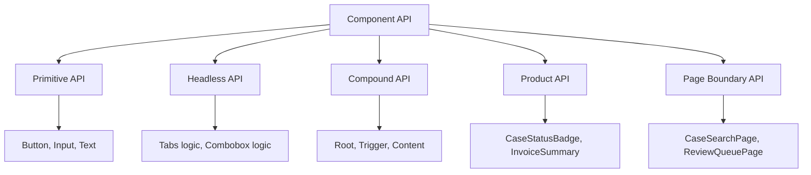

# Part 029 — Designing Component Public API

Reusable React component bukan hanya function yang return JSX.

Reusable component adalah **public API**.

Begitu component dipakai oleh banyak screen, banyak team, atau banyak product flow, props-nya berubah menjadi kontrak. Kontrak itu akan menentukan:

```txt
how easy the component is to use
how hard it is to misuse
how stable it is across product changes
how safely it can evolve
how much state leaks into callers
how many bugs become impossible by design
```

API component yang buruk tidak langsung terlihat ketika component masih kecil. Ia baru terasa saat product butuh edge case, accessibility, async behavior, permission, theming, testing, dan migration.

Mental model utama part ini:

```txt
A component API should expose intent, not implementation accidents.
```

---

## 1. What Is a Component Public API?

Public API component adalah semua hal yang caller boleh gunakan dan boleh asumsikan stabil.

Itu mencakup:

```txt
prop names
prop value semantics
callback timing
callback payload
children/slot structure
controlled/uncontrolled behavior
DOM/ref exposure
accessibility guarantees
styling hooks
state reset semantics
async/pending/error behavior
versioning and migration rules
```

Contoh:

```tsx
<CaseStatusBadge status="under_review" />
```

API-nya bukan hanya prop `status`.

API-nya adalah janji bahwa:

```txt
status under_review has a stable visual meaning
invalid status is rejected or handled explicitly
component renders semantically appropriate markup
caller does not need to know internal class names
future status additions won't break existing callers silently
```

Untuk component kecil, ini terdengar formal. Untuk codebase besar, ini yang membedakan reusable component dari potongan JSX yang kebetulan diekspor.

---

## 2. Public API Is a Boundary of Responsibility

Setiap prop menjawab pertanyaan ownership.

```tsx
<DataTable
  rows={rows}
  sort={sort}
  onSortChange={setSort}
  isLoading={isLoading}
/>
```

Contract-nya:

```txt
caller owns rows
caller owns sorting state
DataTable may request sorting transition
caller owns loading state
DataTable owns rendering and interaction semantics
```

Jika API-nya seperti ini:

```tsx
<DataTable
  data={rows}
  config={{ sortable: true, filterable: true }}
  onChange={handleChange}
/>
```

Contract-nya kabur:

```txt
Who owns sort state?
Who owns filter state?
What does onChange mean?
Does data table mutate data?
Does config affect state reset?
```

React state bugs sering bermula dari API yang tidak menjawab ownership.

---

## 3. API Design Starts from Caller Journey

Jangan mulai dari internal implementation.

Mulai dari caller journey.

Pertanyaan pertama:

```txt
What is the smallest useful thing a caller wants to express?
What is the most advanced thing a caller may need later?
Which details must remain private?
Which extension points are intentional?
Which states must be impossible?
```

Untuk `Modal`, caller journey bisa seperti ini:

```tsx
<Modal open={open} onOpenChange={setOpen}>
  <Modal.Content>
    <Modal.Title>Reject case?</Modal.Title>
    <Modal.Description>This action requires a reason.</Modal.Description>
    <RejectCaseForm />
  </Modal.Content>
</Modal>
```

Di sini caller mengekspresikan intent:

```txt
there is a modal
open state is controlled
content has title and description
form lives inside modal
```

Caller tidak perlu tahu:

```txt
portal implementation
focus trap implementation
escape listener implementation
aria wiring implementation
scroll lock implementation
```

Good public API hides mechanism but exposes enough structure to compose.

---

## 4. Component API Layers

Tidak semua component harus punya API yang sama.



### Primitive API

Primitive component dekat dengan DOM.

```tsx
<Button variant="primary" size="md" disabled={isSubmitting}>
  Submit
</Button>
```

API primitive boleh generic:

```txt
variant
size
disabled
children
className
```

### Headless API

Headless component mengekspos behavior tanpa styling final.

```tsx
const combobox = useCombobox({ items, value, onValueChange })
```

API-nya harus kuat pada:

```txt
state
keyboard behavior
ARIA attributes
prop getters
item registry
```

### Compound API

Compound component mengekspos struktur declarative.

```tsx
<Tabs value={tab} onValueChange={setTab}>
  <Tabs.List>
    <Tabs.Trigger value="overview">Overview</Tabs.Trigger>
    <Tabs.Trigger value="audit">Audit</Tabs.Trigger>
  </Tabs.List>
  <Tabs.Content value="overview">...</Tabs.Content>
  <Tabs.Content value="audit">...</Tabs.Content>
</Tabs>
```

API-nya harus kuat pada:

```txt
parent-child coordination
context boundary
required parts
ordering
keyboard behavior
controlled/uncontrolled behavior
```

### Product API

Product component memakai bahasa domain.

```tsx
<EnforcementCaseCard
  case={enforcementCase}
  currentUserCapabilities={capabilities}
  onOpenCase={openCase}
  onAssignCase={assignCase}
/>
```

API-nya harus kuat pada:

```txt
domain vocabulary
permission semantics
business lifecycle
empty/error/pending state
```

Jangan mencampur semua layer menjadi satu component super.

---

## 5. Prop Vocabulary: Name Intent, Not Mechanism

Nama prop adalah dokumentasi paling dekat dengan caller.

Buruk:

```tsx
<CaseActionButton
  flag
  mode="x"
  handler={fn}
  data={caseObj}
/>
```

Lebih baik:

```tsx
<CaseActionButton
  action="escalate"
  caseRecord={caseRecord}
  disabledReason={disabledReason}
  onRequestAction={handleRequestAction}
/>
```

Perbedaannya:

```txt
flag                    → meaningless
mode                    → vague
handler                 → mechanism
onRequestAction         → intent event
caseRecord              → domain object
disabledReason          → explicit UX and business state
```

Guideline:

| Prop Type | Naming Bias | Example |
|---|---|---|
| Boolean capability | `can*`, `is*`, `has*` | `canEscalate`, `isSelected` |
| Boolean visual state | `is*` | `isLoading`, `isInvalid` |
| Domain command | `onRequest*`, `onSubmit*`, `onConfirm*` | `onRequestEscalation` |
| Controlled value | domain noun | `selectedCaseId`, `open`, `value` |
| Controlled setter callback | `on*Change` | `onSelectedCaseIdChange` |
| Reason/explanation | `*Reason`, `*Message` | `disabledReason`, `errorMessage` |
| Render extension | `render*` or slot component | `renderAction`, `actions` |

For reusable primitives, generic names are fine.

For product components, domain names win.

---

## 6. Avoid Boolean Prop Explosion

Boolean props look simple until they become a state space.

```tsx
<Button primary secondary danger ghost loading disabled />
```

This creates impossible combinations:

```txt
primary + secondary
danger + ghost + primary
loading + disabled but clickable
```

Prefer explicit variants:

```tsx
<Button variant="primary" tone="danger" isLoading={isSubmitting} />
```

Or discriminated unions:

```ts
type ButtonProps =
  | {
      variant: 'solid'
      tone?: 'neutral' | 'danger' | 'success'
    }
  | {
      variant: 'ghost'
      tone?: 'neutral' | 'danger'
    }
  | {
      variant: 'link'
      tone?: 'neutral'
    }
```

The goal is not type cleverness.

The goal is to make invalid UI combinations unrepresentable.

---

## 7. Controlled / Uncontrolled API Pattern

A reusable component often needs both modes.

```tsx
<Tabs defaultValue="overview" />
```

Uncontrolled.

```tsx
<Tabs value={tab} onValueChange={setTab} />
```

Controlled.

Use this contract consistently:

```txt
value          → controlled state
onValueChange  → request to change controlled state
defaultValue   → initial uncontrolled state
```

Example helper:

```tsx
function useControllableState<T>({
  value,
  defaultValue,
  onChange,
}: {
  value?: T
  defaultValue: T
  onChange?: (nextValue: T) => void
}) {
  const [internalValue, setInternalValue] = React.useState(defaultValue)
  const isControlled = value !== undefined
  const currentValue = isControlled ? value : internalValue

  const setValue = React.useCallback(
    (nextValue: T) => {
      if (!isControlled) {
        setInternalValue(nextValue)
      }
      onChange?.(nextValue)
    },
    [isControlled, onChange]
  )

  return [currentValue, setValue] as const
}
```

But for production, add warnings:

```txt
warn if component switches from uncontrolled to controlled
warn if component switches from controlled to uncontrolled
warn if value is provided without onValueChange for mutable component
```

Why?

Because switching ownership at runtime is almost always a bug.

---

## 8. Callback API: Notification vs Intent

Not every callback means the same thing.

There are at least three kinds.

```txt
notification callback
intent callback
lifecycle callback
```

### Notification Callback

The component informs caller that something happened.

```tsx
<Tabs onValueChange={setTab} />
```

The component is saying:

```txt
selected tab changed or wants to change
```

### Intent Callback

The component asks caller to perform a domain command.

```tsx
<CaseActions onRequestEscalation={requestEscalation} />
```

The component is saying:

```txt
user expressed intent to escalate
```

It is not saying escalation succeeded.

### Lifecycle Callback

The component reports lifecycle boundary.

```tsx
<Modal onOpenAutoFocus={handleAutoFocus} onCloseComplete={handleCloseComplete} />
```

Use lifecycle callbacks sparingly. They can couple caller to implementation timing.

---

## 9. Callback Payload Design

Bad callback:

```tsx
onChange={(event) => ...}
```

This is okay for DOM primitives.

But for domain components, prefer semantic payload.

```tsx
<CaseTable
  onSelectionChange={(selection) => {
    console.log(selection.selectedCaseIds)
  }}
/>
```

Payload type:

```ts
type CaseSelectionChange = {
  selectedCaseIds: string[]
  source: 'row-click' | 'checkbox' | 'keyboard' | 'bulk-action'
}
```

Now caller can reason at the domain/UI-intent level.

Do not leak raw DOM event unless the caller truly needs DOM semantics.

Better:

```tsx
type SortChange = {
  field: 'createdAt' | 'priority' | 'status'
  direction: 'asc' | 'desc'
}
```

Than:

```tsx
onSort={(event, column, desc) => ...}
```

The former is stable. The latter exposes internal table implementation.

---

## 10. Slot API vs Configuration API

A common mistake is turning component composition into config objects.

```tsx
<PageHeader
  title="Cases"
  buttons={[
    { label: 'Export', icon: 'download', onClick: exportCases },
    { label: 'Create', icon: 'plus', onClick: createCase },
  ]}
/>
```

This looks convenient until caller needs:

```txt
custom tooltip
permission wrapper
loading button
split button
confirmation dialog
keyboard shortcut badge
tracking metadata
```

Prefer JSX slots when variation is structural.

```tsx
<PageHeader
  title="Cases"
  actions={
    <>
      <ExportCasesButton />
      <CreateCaseButton />
    </>
  }
/>
```

Decision rule:

```txt
If variation is data-like, use config.
If variation is UI structure or behavior, use composition.
```

Example valid config:

```tsx
<StatusBadge status="approved" />
```

Example better slot:

```tsx
<Card
  title="Investigation"
  actions={<CaseActionMenu caseId={caseId} />}
/>
```

---

## 11. Children, Named Slots, and Explicit Regions

`children` is good for one obvious content region.

```tsx
<Card>
  <CaseSummary />
</Card>
```

Named slots are better for multiple regions.

```tsx
<Card
  header={<CaseHeader />}
  footer={<CaseFooter />}
>
  <CaseSummary />
</Card>
```

Compound components are better when slots need coordination.

```tsx
<Card>
  <Card.Header>
    <CaseHeader />
  </Card.Header>
  <Card.Body>
    <CaseSummary />
  </Card.Body>
  <Card.Footer>
    <CaseFooter />
  </Card.Footer>
</Card>
```

Trade-off:

| API Shape | Strength | Weakness |
|---|---|---|
| `children` | simple, natural | only one obvious region |
| named JSX props | explicit regions | can become prop-heavy |
| compound parts | expressive structure | requires context/part contract |
| render prop | high control | callback complexity |
| config object | serializable/simple | poor for rich UI behavior |

---

## 12. Make Illegal States Unrepresentable

Component APIs should prevent nonsense.

Bad:

```ts
type EmptyStateProps = {
  loading?: boolean
  error?: Error
  empty?: boolean
  data?: CaseRecord[]
}
```

This allows:

```txt
loading + error + empty + data
```

Better:

```ts
type CaseListState =
  | { status: 'loading' }
  | { status: 'error'; error: Error; onRetry: () => void }
  | { status: 'empty'; message: string }
  | { status: 'ready'; cases: CaseRecord[] }
```

Usage:

```tsx
<CaseListView state={state} />
```

Renderer:

```tsx
function CaseListView({ state }: { state: CaseListState }) {
  switch (state.status) {
    case 'loading':
      return <CaseListSkeleton />
    case 'error':
      return <ErrorState error={state.error} onRetry={state.onRetry} />
    case 'empty':
      return <EmptyState message={state.message} />
    case 'ready':
      return <CaseList cases={state.cases} />
  }
}
```

This is not ceremony. It is invariant encoding.

---

## 13. Async API Semantics

Async behavior must be visible in the API.

Bad:

```tsx
<SubmitButton onClick={submit} />
```

Questions:

```txt
Does button disable while submitting?
Who catches error?
Can user click twice?
Does loading indicator show?
Can caller cancel?
What happens after success?
```

Better:

```tsx
<SubmitButton
  isSubmitting={isSubmitting}
  disabledReason={disabledReason}
  onSubmit={submit}
/>
```

Or with command object:

```tsx
type SubmitCommand = {
  execute: () => Promise<void>
  isPending: boolean
  error?: Error
  canExecute: boolean
  disabledReason?: string
}

<SubmitButton command={submitCommand} />
```

For product workflows, command object can be clearer than many props.

But do not make command object magical. Keep it inspectable and testable.

---

## 14. Reentrancy Contract

Any user-triggered command has a reentrancy problem.

```txt
Can user trigger it twice before first result returns?
```

Example:

```tsx
<ApproveCaseButton onApprove={approveCase} />
```

If API does not include pending/disabled semantics, the component cannot protect caller.

Better:

```tsx
<ApproveCaseButton
  isPending={approveMutation.isPending}
  disabledReason={reason}
  onApprove={approveCase}
/>
```

Inside:

```tsx
function ApproveCaseButton({ isPending, disabledReason, onApprove }: Props) {
  const disabled = isPending || Boolean(disabledReason)

  return (
    <button disabled={disabled} onClick={onApprove}>
      {isPending ? 'Approving...' : 'Approve'}
    </button>
  )
}
```

Contract:

```txt
caller owns command execution
caller exposes pending state
button prevents duplicate local interaction
server still must enforce idempotency
```

Frontend API can reduce duplicate intent. It cannot replace backend correctness.

---

## 15. Error Contract

Do not hide error semantics inside component internals unless the component truly owns the operation.

Bad:

```tsx
<CaseTransferDialog caseId={caseId} />
```

The dialog fetches users, submits transfer, handles error, closes itself, invalidates cache.

This might be acceptable for a page-level smart component, but it is dangerous for reusable UI.

Better boundary:

```tsx
<CaseTransferDialog
  open={open}
  onOpenChange={setOpen}
  assignees={assignees}
  isLoadingAssignees={isLoadingAssignees}
  submitState={submitState}
  onSubmitTransfer={submitTransfer}
/>
```

Now error ownership is explicit:

```txt
caller owns data fetching
caller owns submit mutation
component renders known states
component does not invent cache policy
```

---

## 16. Accessibility Contract Is Public API

Accessibility is not implementation detail.

If a component claims to be `Tabs`, `Dialog`, `Menu`, `Combobox`, or `Tooltip`, it inherits behavioral expectations.

Contract examples:

```txt
Dialog traps focus while open
Dialog restores focus on close
Tabs expose selected tab to assistive tech
Menu supports keyboard navigation
Form field connects label, input, description, and error
Disabled controls communicate disabled semantics
```

Expose API that supports this:

```tsx
<FormField name="reason">
  <FormField.Label>Reason</FormField.Label>
  <FormField.Control asChild>
    <textarea />
  </FormField.Control>
  <FormField.Error />
</FormField>
```

Do not force caller to manually wire every ARIA id unless caller is building headless behavior directly.

Good API makes accessible usage the default path.

---

## 17. Styling and Extensibility API

Styling extensibility is part of public API.

Common options:

```txt
className
data-state attributes
CSS variables
style prop
theme tokens
variant props
slot classNames
unstyled/headless mode
```

Example:

```tsx
<button
  className={cn(buttonVariants({ variant, size }), className)}
  data-state={isPressed ? 'pressed' : 'idle'}
  data-disabled={disabled ? '' : undefined}
>
  {children}
</button>
```

Public styling contract:

```txt
className applies to root element
data-state values are stable
variant names are stable
internal DOM structure is not guaranteed unless documented
```

Do not accidentally make internal class names public.

If users rely on `.card > div:nth-child(2)`, your component API has failed to provide intentional styling hooks.

---

## 18. Ref Contract

A ref exposes imperative capability.

That capability must be narrow.

Bad:

```tsx
ref.current.internalState = ...
ref.current.domNode.querySelector(...)
```

Better:

```tsx
type ModalHandle = {
  focusFirstField: () => void
}
```

Usage:

```tsx
const modalRef = React.useRef<ModalHandle>(null)

<CaseModal ref={modalRef} />
```

Implementation shape:

```tsx
function CaseModal({ ref }: { ref: React.Ref<ModalHandle> }) {
  const firstFieldRef = React.useRef<HTMLInputElement>(null)

  React.useImperativeHandle(ref, () => ({
    focusFirstField() {
      firstFieldRef.current?.focus()
    },
  }))

  return <input ref={firstFieldRef} />
}
```

Public ref rule:

```txt
Expose capability, not internal structure.
```

---

## 19. Performance Contract

Performance is not always public API, but reusable components should not force caller into accidental slowness.

Dangerous API:

```tsx
<DataGrid
  rows={rows}
  renderCell={(row, col) => <Cell row={row} col={col} />}
  getRowClassName={(row) => expensive(row)}
/>
```

This can be valid, but the contract must say:

```txt
callbacks may be called many times
callbacks must be pure
callbacks should be stable for large data
cell renderers should not perform side effects
```

For large components, prefer documented escape hatches:

```tsx
<DataGrid
  rows={rows}
  columns={columns}
  getRowId={(row) => row.id}
  virtualized
/>
```

And avoid hidden O(n²) behavior:

```tsx
rows.map(row => columns.map(col => computeExpensive(row, col)))
```

Expose APIs that allow memoization by stable identity:

```txt
getRowId
column id
item key
selector
render memo boundary
```

---

## 20. API Evolution: Additive First

Reusable component APIs must evolve.

Prefer additive changes:

```txt
add optional prop
add new variant value
add new compound part
add new callback with clearer semantics
support both old and new names temporarily
```

Avoid silent semantic changes:

```txt
same prop name, different meaning
same callback, different timing
same variant, different accessibility behavior
same ref, different target
```

Migration pattern:

```tsx
type OldProps = {
  onClose?: () => void
}

type NewProps = {
  open: boolean
  onOpenChange: (open: boolean) => void
}
```

Bridge for one version:

```tsx
function Dialog(props: OldProps & Partial<NewProps>) {
  if (process.env.NODE_ENV !== 'production') {
    if (props.onClose) {
      console.warn('Dialog onClose is deprecated. Use onOpenChange(false).')
    }
  }

  // compatibility layer here
}
```

A deprecation path is part of API design.

---

## 21. Case Study: From Prop Soup to Public API

Initial component:

```tsx
<CasePanel
  data={caseRecord}
  showHeader
  showAudit
  canEdit
  canClose
  closeText="Close"
  onClick1={edit}
  onClick2={close}
  loading={loading}
  error={error}
/>
```

Problems:

```txt
prop names are generic
callbacks don't reveal intent
visibility flags encode layout details
permission and action state are mixed
loading/error ownership is unclear
component is hard to extend
```

Refactored API:

```tsx
<CasePanel caseRecord={caseRecord} state={panelState}>
  <CasePanel.Header
    actions={
      <CaseActions
        capabilities={capabilities}
        onRequestEdit={editCase}
        onRequestClosure={closeCase}
      />
    }
  />
  <CasePanel.Body />
  <CasePanel.AuditTrail auditEvents={auditEvents} />
</CasePanel>
```

Now boundaries are clearer:

```txt
CasePanel owns layout semantics
CaseActions owns action rendering
caller owns capabilities and commands
AuditTrail receives explicit audit model
panelState represents loading/error/ready explicitly
```

If audit becomes lazy-loaded later, the API can evolve:

```tsx
<CasePanel.AuditTrail
  state={auditState}
  onRetry={refetchAudit}
/>
```

No need to mutate the root component into a god object.

---

## 22. API Review Checklist

Before exporting a reusable component, ask:

```txt
What is the component's responsibility?
What is explicitly outside its responsibility?
Who owns each state value?
Which props are data inputs?
Which props are commands?
Which props are render slots?
Which props are styling hooks?
Which combinations are illegal?
Can illegal combinations be represented by the type?
What does each callback mean?
When does each callback fire?
Does callback payload expose intent or implementation?
Is accessibility default or optional?
Does ref expose capability or internals?
How does the component handle pending/error/disabled?
What is stable across releases?
What can change without breaking callers?
How would we test this contract?
```

If you cannot answer these, the component is not ready to become shared API.

---

## 23. API Smells

Watch for these smells:

```txt
many booleans controlling layout
prop named config with many nested flags
callback named handleSomething
callback payload is raw implementation detail
component both fetches data and renders reusable UI
component mutates external store directly
component exposes internal DOM through ref
component requires caller to know internal class structure
component has multiple sources of truth
component accepts any children but expects specific children
component has undocumented order dependency
```

Smell does not always mean wrong.

It means review the boundary.

---

## 24. Minimal API, Not Weak API

A minimal API is not an API with too few props.

A minimal API is an API where every public option has a clear reason.

Bad minimalism:

```tsx
<Table data={data} />
```

If the real needs include selection, sorting, row identity, empty state, and loading, this API is not minimal. It is under-specified.

Better:

```tsx
<Table
  rows={rows}
  getRowId={(row) => row.id}
  sort={sort}
  onSortChange={setSort}
  selection={selection}
  onSelectionChange={setSelection}
  state={tableState}
/>
```

This is more props, but less ambiguity.

Effective API design optimizes for:

```txt
clarity over terseness
invariants over convenience
composition over prediction
migration over one-off hacks
```

---

## 25. Practical Exercise

Design a public API for an enterprise `ReviewDecisionPanel`.

Requirements:

```txt
shows case summary
supports approve, reject, request changes
some actions may be disabled by permission
reject requires reason
submit is async
panel can be embedded in modal or full page
caller owns mutation and audit logging
component must be testable without backend
```

Do not start from JSX.

Start by writing:

```txt
state ownership table
event contract table
illegal states list
accessibility requirements
extension points
```

Then design the component API.

One possible shape:

```tsx
<ReviewDecisionPanel
  caseSummary={caseSummary}
  availableDecisions={availableDecisions}
  selectedDecision={selectedDecision}
  onSelectedDecisionChange={setSelectedDecision}
  reason={reason}
  onReasonChange={setReason}
  submitState={submitState}
  onSubmitDecision={submitDecision}
/>
```

More composable shape:

```tsx
<ReviewDecisionPanel state={panelState} onSubmitDecision={submitDecision}>
  <ReviewDecisionPanel.Summary caseSummary={caseSummary} />
  <ReviewDecisionPanel.DecisionOptions />
  <ReviewDecisionPanel.ReasonField />
  <ReviewDecisionPanel.Actions />
</ReviewDecisionPanel>
```

Which one is better depends on expected variation.

Use explicit props when structure is stable.

Use compound composition when structure varies.

---

## 26. Part Summary

Component public API design is architecture work.

The core rules:

```txt
Expose intent, not internal mechanism.
Name props using domain meaning where appropriate.
Make state ownership explicit.
Separate notification, intent, and lifecycle callbacks.
Prefer JSX composition for structural variation.
Use config for data-like variation.
Prevent illegal states with types and runtime guardrails.
Expose accessibility as part of the contract.
Expose styling hooks intentionally.
Expose ref capabilities narrowly.
Design for migration before the API becomes popular.
```

A good component API makes the correct usage feel natural and the incorrect usage difficult.

That is the standard.
