# Part 030 — Composition Failure Modes

Composition adalah salah satu kekuatan terbesar React.

Tetapi composition juga bisa menjadi sumber kompleksitas terbesar ketika boundary tidak jelas.

Masalahnya jarang terlihat sebagai error syntax. Masalahnya muncul sebagai:

```txt
UI unexpectedly remounts
state resets when layout changes
component API becomes impossible to understand
children order matters but nobody documents it
context dependency is hidden
slots leak implementation details
provider tree becomes unmaintainable
render callbacks become stale or impure
accessibility breaks when component is composed differently
```

Part ini adalah failure-mode map untuk Module 2.

Tujuannya bukan membuat takut memakai composition. Tujuannya membuat composition bisa dipakai secara defensible di codebase besar.

---

## 1. Failure Mode Map

```mermaid
flowchart TD
    A[Composition Failure Modes] --> B[API Surface Failure]
    A --> C[Ownership Failure]
    A --> D[Identity Failure]
    A --> E[Context Failure]
    A --> F[Semantic Failure]
    A --> G[Extensibility Failure]
    A --> H[Testing Failure]

    B --> B1[Prop Explosion]
    B --> B2[Configuration Language]
    B --> B3[Ambiguous Slots]

    C --> C1[Double Source of Truth]
    C --> C2[Orphaned Callback]
    C --> C3[Unclear Command Boundary]

    D --> D1[Accidental Remount]
    D --> D2[Unstable Keys]
    D --> D3[Inline Component Definitions]

    E --> E1[Hidden Coupling]
    E --> E2[Provider Pyramid]
    E --> E3[Context Dumping Ground]

    F --> F1[Broken HTML Semantics]
    F --> F2[ARIA Contract Break]
    F --> F3[Polymorphic Misuse]

    G --> G1[Wrapper Hell]
    G --> G2[Leaky Abstraction]
    G --> G3[Fragile Children Manipulation]

    H --> H1[Only Snapshot Tests]
    H --> H2[No Contract Tests]
    H --> H3[No Composition Scenarios]
```



A production React engineer should recognize these before they become architecture debt.

---

## 2. Prop Explosion

Prop explosion happens when a component tries to support all variations through flat props.

```tsx
<Card
  title="Case"
  subtitle="Pending review"
  showIcon
  icon="warning"
  showActions
  primaryActionLabel="Approve"
  onPrimaryAction={approve}
  secondaryActionLabel="Reject"
  onSecondaryAction={reject}
  showFooter
  footerText="Updated today"
  compact
  bordered
  elevated
/>
```

This feels convenient at first.

Then requirements arrive:

```txt
custom action menu
action loading state
action permission tooltip
secondary action confirmation
custom footer content
audit badge in header
responsive header layout
```

The prop surface becomes a configuration language.

Better:

```tsx
<Card compact bordered elevated>
  <Card.Header
    title="Case"
    subtitle="Pending review"
    icon={<WarningIcon />}
    actions={<CaseActionMenu caseId={caseId} />}
  />
  <Card.Body>
    <CaseSummary caseRecord={caseRecord} />
  </Card.Body>
  <Card.Footer>
    <LastUpdated timestamp={caseRecord.updatedAt} />
  </Card.Footer>
</Card>
```

Refactor rule:

```txt
When variation becomes structural, replace props with composition.
```

---

## 3. Configuration Language Disguised as Component API

Some components expose config objects that become mini programming languages.

```tsx
<Table
  config={{
    columns: [
      {
        field: 'status',
        type: 'badge',
        colorMap: { open: 'blue', closed: 'green' },
        tooltip: true,
        permission: 'case.viewStatus',
      },
    ],
    actions: [
      {
        type: 'button',
        label: 'Approve',
        visibleWhen: 'case.status === pending',
        confirm: true,
      },
    ],
  }}
/>
```

This might be valid for metadata-driven UI.

But if this component lives in normal React product code, it can become worse than JSX:

```txt
less type-safe
less debuggable
less composable
harder to test
harder to integrate with hooks
harder to express custom behavior
```

Rule:

```txt
Do not build a configuration language unless configuration is truly the product requirement.
```

For normal UI, JSX is already the composition language.

---

## 4. Wrapper Hell

Wrapper hell happens when every variation creates another component wrapper.

```tsx
<PermissionWrapper permission="case.approve">
  <TooltipWrapper content="Approve this case">
    <TrackingWrapper event="approve_clicked">
      <ConfirmWrapper message="Are you sure?">
        <Button onClick={approve}>Approve</Button>
      </ConfirmWrapper>
    </TrackingWrapper>
  </TooltipWrapper>
</PermissionWrapper>
```

The UI still works, but control flow becomes unreadable.

Problems:

```txt
callback path is hard to trace
focus behavior may break
DOM structure becomes deeper than intended
styling selectors become fragile
testing requires too many providers/wrappers
```

Better: compose capability into a domain-level component.

```tsx
<CaseApproveAction
  caseId={caseId}
  capabilities={capabilities}
  onApprove={approve}
/>
```

Internally:

```tsx
function CaseApproveAction({ caseId, capabilities, onApprove }: Props) {
  const disabledReason = getApproveDisabledReason(capabilities)

  return (
    <ConfirmAction
      message="Approve this case?"
      disabledReason={disabledReason}
      trackingEvent="approve_clicked"
      onConfirm={onApprove}
    >
      Approve
    </ConfirmAction>
  )
}
```

Wrapper hell often means the composition level is too low for the use case.

---

## 5. Leaky Abstraction

A component leaks abstraction when caller must know its internals to use it correctly.

Example:

```tsx
<Modal className="modal-root">
  <div className="modal-header">...</div>
  <div className="modal-body">...</div>
</Modal>
```

Caller must know class names and structure.

Better:

```tsx
<Modal open={open} onOpenChange={setOpen}>
  <Modal.Content>
    <Modal.Header>
      <Modal.Title>Reject case</Modal.Title>
    </Modal.Header>
    <Modal.Body>
      <RejectForm />
    </Modal.Body>
  </Modal.Content>
</Modal>
```

The component now exposes intentional parts.

Leaky abstraction smells:

```txt
caller must use specific class names
caller must insert hidden DOM nodes
caller must know child order but API doesn't express it
caller must pass internal ids manually
caller must call internal methods to keep UI working
```

---

## 6. Ambiguous Slots

Named slots help, but ambiguous slots create bugs.

```tsx
<PageLayout
  top={<Toolbar />}
  left={<FilterPanel />}
  right={<DetailsPanel />}
/>
```

What does `top` mean?

```txt
page header?
sticky toolbar?
above content?
inside scroll region?
visible on mobile?
```

Better:

```tsx
<PageLayout
  header={<CaseSearchHeader />}
  sidebar={<CaseFilterPanel />}
  detailPanel={<CaseDetailsPanel />}
/>
```

Slot names should reflect semantic region, not implementation position.

Bad slot names:

```txt
top
bottom
left
right
extra
custom
content2
```

Better slot names:

```txt
header
actions
sidebar
filters
detailPanel
emptyState
footer
primaryAction
secondaryAction
```

---

## 7. Hidden Context Coupling

Context is useful, but context can make component dependencies invisible.

```tsx
function CaseActionButton() {
  const caseRecord = useCaseContext()
  const permissions = usePermissionContext()
  const audit = useAuditContext()

  return <button>Approve</button>
}
```

The component call site looks simple:

```tsx
<CaseActionButton />
```

But real dependency graph is hidden:

```txt
CaseProvider must exist
PermissionProvider must exist
AuditProvider must exist
provider values must be compatible
component cannot be reused outside that tree
```

Better for domain component:

```tsx
<CaseActionButton
  caseRecord={caseRecord}
  capabilities={capabilities}
  onAudit={recordAudit}
/>
```

Or make context dependency explicit at a boundary:

```tsx
function ConnectedCaseActionButton() {
  const caseRecord = useCaseContext()
  const capabilities = useCaseCapabilities()
  const audit = useAudit()

  return (
    <CaseActionButton
      caseRecord={caseRecord}
      capabilities={capabilities}
      onAudit={audit.record}
    />
  )
}
```

Rule:

```txt
Use context freely at orchestration boundaries.
Keep reusable leaf components explicit when possible.
```

---

## 8. Provider Pyramid

Provider pyramid happens when every concern adds a provider at the root.

```tsx
<AuthProvider>
  <ThemeProvider>
    <FeatureFlagProvider>
      <PermissionProvider>
        <CaseProvider>
          <SearchProvider>
            <TableProvider>
              <ModalProvider>
                <App />
              </ModalProvider>
            </TableProvider>
          </SearchProvider>
        </CaseProvider>
      </PermissionProvider>
    </FeatureFlagProvider>
  </ThemeProvider>
</AuthProvider>
```

Not all provider nesting is bad.

It becomes bad when:

```txt
provider scope is much wider than needed
provider value changes frequently
providers depend on each other implicitly
component tests require full app provider tree
feature-level concerns are globalized
```

Refactor:

```tsx
<AppShell>
  <Routes>
    <Route
      path="/cases"
      element={
        <CaseSearchProviders>
          <CaseSearchPage />
        </CaseSearchProviders>
      }
    />
  </Routes>
</AppShell>
```

Provider rule:

```txt
Global provider only for global concern.
Feature provider for feature concern.
Component provider for component coordination.
```

---

## 9. Context Dumping Ground

A context becomes a dumping ground when unrelated values are bundled together.

```tsx
type AppContextValue = {
  user: User
  theme: Theme
  cases: CaseRecord[]
  selectedCaseId: string | null
  setSelectedCaseId: (id: string | null) => void
  modalOpen: boolean
  setModalOpen: (open: boolean) => void
  notifications: Notification[]
}
```

Problems:

```txt
unrelated updates rerender unrelated consumers
ownership becomes unclear
testing one component requires huge fake context
feature boundaries blur
```

Better:

```txt
AuthContext
ThemeContext
CaseSearchContext
ModalManagerContext
NotificationStore
```

Even better: not all shared state needs context. Some should be external store, URL state, server cache, or local lifted state.

Context is dependency injection.

It is not a landfill.

---

## 10. Accidental Remount

Composition can accidentally change component identity.

Example:

```tsx
function Page({ compact }: { compact: boolean }) {
  return compact ? (
    <CompactLayout>
      <SearchForm />
    </CompactLayout>
  ) : (
    <FullLayout>
      <SearchForm />
    </FullLayout>
  )
}
```

`SearchForm` appears in both branches, but its position/type path changes.

Its state may reset.

Refactor:

```tsx
function Page({ compact }: { compact: boolean }) {
  const Layout = compact ? CompactLayout : FullLayout

  return (
    <Layout>
      <SearchForm />
    </Layout>
  )
}
```

Still be careful: if `Layout` identity changes, subtree behavior depends on where children are placed.

More explicit:

```tsx
function Page({ compact }: { compact: boolean }) {
  return (
    <ResponsiveLayout compact={compact}>
      <SearchForm />
    </ResponsiveLayout>
  )
}
```

Rule:

```txt
Changing composition structure can change state identity.
Review remount behavior when layout branches change.
```

---

## 11. Unstable Keys

Keys are part of identity.

Bad:

```tsx
items.map((item, index) => <Row key={index} item={item} />)
```

If items reorder, state follows position, not entity.

Better:

```tsx
items.map((item) => <Row key={item.id} item={item} />)
```

Composition bug example:

```tsx
<Tabs>
  {tabs.map((tab, index) => (
    <Tabs.Content key={index} value={tab.value}>
      <ExpensiveForm />
    </Tabs.Content>
  ))}
</Tabs>
```

If tabs reorder, form state can attach to wrong tab.

Use stable identity:

```tsx
<Tabs>
  {tabs.map((tab) => (
    <Tabs.Content key={tab.value} value={tab.value}>
      <ExpensiveForm />
    </Tabs.Content>
  ))}
</Tabs>
```

If you want reset, make it explicit:

```tsx
<CaseEditor key={caseId} caseId={caseId} />
```

Identity should be a design choice, not an accident.

---

## 12. Inline Component Definitions

Defining components inside components can accidentally reset state because the child component function identity changes per render.

Bad:

```tsx
function CasePage() {
  function Toolbar() {
    return <button>Refresh</button>
  }

  return <Toolbar />
}
```

Better:

```tsx
function Toolbar() {
  return <button>Refresh</button>
}

function CasePage() {
  return <Toolbar />
}
```

If you need closure values, pass props.

```tsx
function Toolbar({ onRefresh }: { onRefresh: () => void }) {
  return <button onClick={onRefresh}>Refresh</button>
}
```

This is not only about performance. It is about component identity and Hook correctness.

---

## 13. Fragile Children Manipulation

React allows inspecting and transforming `children`, but it is easy to create fragile code.

Example:

```tsx
function RowList({ children }: { children: React.ReactNode }) {
  return React.Children.map(children, (child) => (
    <div className="row">{child}</div>
  ))
}
```

This may work, but callers may not expect their children to be wrapped or reordered.

More fragile:

```tsx
function Tabs({ children }: Props) {
  const triggers = React.Children.toArray(children).filter(isTrigger)
  const contents = React.Children.toArray(children).filter(isContent)
  // implicit parsing logic
}
```

Problems:

```txt
fragments may behave unexpectedly
conditional children complicate parsing
component identity can be affected
TypeScript cannot strongly guarantee child element types
caller order dependencies become implicit
```

Prefer explicit compound component contracts with context, or explicit props.

```tsx
<Tabs>
  <Tabs.List>...</Tabs.List>
  <Tabs.Content value="overview">...</Tabs.Content>
</Tabs>
```

Avoid clever child parsing unless there is a strong reason.

---

## 14. `cloneElement` Overuse

`cloneElement` can inject props into children.

```tsx
React.cloneElement(child, { active: true })
```

But overuse causes hidden contracts.

Caller writes:

```tsx
<Menu>
  <Button>Open</Button>
</Menu>
```

But `Menu` silently expects child to accept:

```txt
onClick
aria-expanded
ref
id
data-state
```

If child does not forward props/ref correctly, behavior breaks.

Better options:

```txt
compound parts
prop getter pattern
asChild with documented requirements
explicit render function
```

Example prop getter:

```tsx
const triggerProps = menu.getTriggerProps()

<button {...triggerProps}>Open</button>
```

Hidden injection is powerful but must be treated as advanced API.

---

## 15. Render Prop Hook Misuse

Render props are callbacks.

They are not components.

Bad:

```tsx
<DataProvider>
  {(data) => {
    const [selected, setSelected] = React.useState(null)
    return <View data={data} selected={selected} />
  }}
</DataProvider>
```

This violates Hook rules because the callback is not a React component or custom Hook.

Better:

```tsx
<DataProvider>
  {(data) => <DataView data={data} />}
</DataProvider>

function DataView({ data }: { data: Data }) {
  const [selected, setSelected] = React.useState<string | null>(null)
  return <View data={data} selected={selected} onSelectedChange={setSelected} />
}
```

Render prop contract:

```txt
callback must be pure rendering function
callback must not call Hooks
callback must not perform side effects
callback should not depend on hidden invocation order
```

---

## 16. Polymorphic Semantic Breakage

The `as` prop is powerful.

It can also break semantics.

Bad:

```tsx
<Button as="div" onClick={submit}>Submit</Button>
```

Now it looks like a button but may not behave like one:

```txt
keyboard activation may be wrong
form submission semantics disappear
disabled semantics disappear
screen reader semantics change
```

Better:

```tsx
<Button type="submit">Submit</Button>
```

Or restrict polymorphism:

```ts
type ButtonAs = 'button' | 'a'
```

For product primitives, freedom is not always good.

Rule:

```txt
Polymorphism must preserve semantic contract.
```

---

## 17. Compound Component Order Hazards

Compound APIs can hide order requirements.

```tsx
<Select>
  <Select.Option value="a">A</Select.Option>
  <Select.Trigger />
</Select>
```

Does this work?

If not, does the API tell the caller?

Order hazards appear when internal registration depends on render order or effect timing.

Safer API:

```tsx
<Select>
  <Select.Trigger />
  <Select.Content>
    <Select.Option value="a">A</Select.Option>
  </Select.Content>
</Select>
```

Add runtime guard in development:

```tsx
function useSelectContext(componentName: string) {
  const context = React.useContext(SelectContext)

  if (!context) {
    throw new Error(`${componentName} must be used inside <Select>.`)
  }

  return context
}
```

If order matters, document it and test it.

Better: design so order matters as little as possible.

---

## 18. Double Source of Truth

Composition often creates duplicate state ownership.

```tsx
function CasePage() {
  const [selectedCaseId, setSelectedCaseId] = React.useState<string | null>(null)

  return (
    <CaseTable
      selectedCaseId={selectedCaseId}
      defaultSelectedCaseId="case-1"
      onSelectedCaseChange={setSelectedCaseId}
    />
  )
}
```

This mixes controlled and uncontrolled semantics.

Another example:

```tsx
<SearchBox value={query} />
```

But inside:

```tsx
function SearchBox({ value }: Props) {
  const [inputValue, setInputValue] = React.useState(value)
  // attempts to sync with effect
}
```

This creates drift.

Better:

```tsx
function SearchBox({ value, onValueChange }: Props) {
  return <input value={value} onChange={(e) => onValueChange(e.target.value)} />
}
```

Or explicit local draft:

```tsx
function SearchBox({ committedValue, onCommit }: Props) {
  const [draft, setDraft] = React.useState(committedValue)

  return (
    <form onSubmit={() => onCommit(draft)}>
      <input value={draft} onChange={(e) => setDraft(e.target.value)} />
    </form>
  )
}
```

Duplicate state is allowed only when it has a different lifecycle.

---

## 19. Orphaned Callback

An orphaned callback fires but no one owns the result.

```tsx
<DeleteButton onDelete={() => deleteCase(caseId)} />
```

Questions:

```txt
Who closes the dialog?
Who updates cache?
Who handles error?
Who shows pending state?
Who prevents double click?
Who tracks audit event?
```

If callback is domain command, wrap it in command state.

```tsx
<DeleteCaseDialog
  open={open}
  onOpenChange={setOpen}
  command={deleteCaseCommand}
/>
```

Where:

```ts
type Command = {
  execute: () => Promise<void>
  isPending: boolean
  error?: Error
  disabledReason?: string
}
```

Or keep ownership explicit:

```tsx
<DeleteCaseDialog
  open={open}
  onOpenChange={setOpen}
  isDeleting={deleteMutation.isPending}
  error={deleteMutation.error}
  onConfirmDelete={handleConfirmDelete}
/>
```

A callback should not be the only representation of an async workflow.

---

## 20. Effects Used to Repair Bad Composition

A common smell:

```tsx
useEffect(() => {
  onChange(internalState)
}, [internalState, onChange])
```

This often means state ownership is wrong.

If the change is caused by an event, call callback in the event handler.

Bad:

```tsx
function Toggle({ onCheckedChange }: Props) {
  const [checked, setChecked] = React.useState(false)

  React.useEffect(() => {
    onCheckedChange(checked)
  }, [checked, onCheckedChange])

  return <button onClick={() => setChecked(!checked)} />
}
```

Better:

```tsx
function Toggle({ onCheckedChange }: Props) {
  const [checked, setChecked] = React.useState(false)

  function toggle() {
    setChecked((current) => {
      const next = !current
      onCheckedChange(next)
      return next
    })
  }

  return <button onClick={toggle} />
}
```

Even better for controlled API:

```tsx
function Toggle({ checked, onCheckedChange }: Props) {
  return <button onClick={() => onCheckedChange(!checked)} />
}
```

Effects synchronize with external systems. They should not patch unclear component contracts.

---

## 21. Unbounded Composition

Sometimes an API accepts anything.

```tsx
<Dialog>{children}</Dialog>
```

This is flexible, but too flexible when behavior requires structure.

Dialog needs:

```txt
title
description
content region
close control
focus target
```

Unbounded children make it easy to create inaccessible dialogs.

Better:

```tsx
<Dialog open={open} onOpenChange={setOpen}>
  <Dialog.Content>
    <Dialog.Title>Reject case</Dialog.Title>
    <Dialog.Description>Provide a reason.</Dialog.Description>
    <RejectForm />
  </Dialog.Content>
</Dialog>
```

Freedom should match risk.

For low-risk layout, `children` is fine.

For high-risk behavior, expose structured parts.

---

## 22. Composition Across Permission Boundaries

Permission logic is often composed badly.

Bad:

```tsx
{canApprove && <ApproveButton onClick={approve} />}
```

This hides the button entirely.

Maybe correct. Maybe not.

In enterprise/regulatory UI, disabled-with-reason may be required:

```tsx
<ApproveButton
  disabledReason={approveDisabledReason}
  onApprove={approve}
/>
```

The composition decision must encode product and audit semantics:

```txt
hidden        → user should not know capability exists
visible disabled → user may know action exists but cannot use it
visible enabled  → user can execute action
visible read-only explanation → action blocked by workflow state
```

Do not bury this inside random conditionals across the tree.

Use a permission-aware composition boundary.

```tsx
<CaseActions
  capabilities={capabilities}
  workflowState={caseRecord.workflowState}
  onApprove={approve}
  onReject={reject}
/>
```

---

## 23. Composition and Accessibility Drift

Accessibility often breaks during composition refactors.

Example:

```tsx
<Tabs.Trigger asChild>
  <div>Audit</div>
</Tabs.Trigger>
```

If `div` does not implement button semantics, tab behavior may degrade.

Another example:

```tsx
<FormField>
  <CustomInput />
  <FormField.Error />
</FormField>
```

If `CustomInput` does not forward `id`, `aria-describedby`, and `aria-invalid`, the label/error relationship breaks.

Composition must preserve accessibility contract.

Checklist:

```txt
Does the composed element keep the correct role?
Does it forward required props?
Does it forward ref?
Does keyboard behavior still work?
Does disabled state remain semantic?
Are label/description/error ids connected?
```

---

## 24. Composition Testing Blind Spots

Snapshot tests are weak for composition.

They often confirm markup shape but miss behavior.

Better tests:

```txt
contract tests
keyboard interaction tests
controlled/uncontrolled tests
provider-missing tests
composition variant tests
accessibility relationship tests
remount/state preservation tests
```

Example test scenarios for compound Tabs:

```txt
throws helpful error when Trigger used outside Tabs
activates tab on click
supports keyboard navigation
preserves content state when configured to keep mounted
resets content state when configured to unmount
works in controlled mode
works in uncontrolled mode
```

Test public behavior, not internal implementation.

---

## 25. Failure Mode Diagnosis Table

| Symptom | Likely Failure Mode | First Refactor |
|---|---|---|
| Props keep growing | Prop explosion | Replace structural props with slots/compound parts |
| Component unusable outside one page | Hidden context coupling | Split connected wrapper from pure component |
| State resets on layout change | Accidental remount | Stabilize component identity/tree position |
| Child must be specific type but API accepts anything | Unbounded composition | Expose compound parts or runtime guards |
| Accessibility breaks with custom child | Polymorphic/ref forwarding issue | Restrict `as`, add prop getter, require ref forwarding |
| Tests require full app setup | Provider pyramid | Scope providers and create test harnesses |
| Component has loading/error but caller also has loading/error | Double source of truth | Move async state ownership to one boundary |
| Callback fires too often or at wrong time | Event contract ambiguity | Distinguish intent, notification, lifecycle callbacks |
| CSS overrides break after refactor | Leaky styling contract | Expose stable className/data-state/CSS variable hooks |
| Config object contains behavior strings | Configuration language | Use JSX composition or explicit domain model |

---

## 26. Refactor Recipe: From Failure to Boundary

When composition feels messy, do not immediately add another abstraction.

Use this sequence:

```txt
1. Identify the state owner.
2. Identify the behavior owner.
3. Identify whether variation is data-like or structural.
4. Identify required accessibility semantics.
5. Identify identity/reset expectations.
6. Split connected component from reusable component.
7. Replace accidental props with intentional slots.
8. Add runtime guards for invalid composition.
9. Add contract tests.
```

Example:

```tsx
<CasePageHeader
  showExport
  showCreate
  exportDisabled
  createDisabled
  onExport={exportCases}
  onCreate={createCase}
/>
```

Refactor:

```tsx
<PageHeader title="Cases">
  <PageHeader.Actions>
    <ExportCasesButton
      disabledReason={exportDisabledReason}
      onExport={exportCases}
    />
    <CreateCaseButton
      disabledReason={createDisabledReason}
      onCreate={createCase}
    />
  </PageHeader.Actions>
</PageHeader>
```

Now action complexity moves to action components, not header config.

---

## 27. Defensive Runtime Guards

TypeScript cannot catch every composition misuse.

Examples:

```txt
component used outside provider
required compound part missing
invalid child structure
controlled prop without callback
switching controlled/uncontrolled mode
asChild child does not accept ref
```

Add development-only guards.

```tsx
function invariant(condition: unknown, message: string): asserts condition {
  if (!condition) {
    throw new Error(message)
  }
}
```

Usage:

```tsx
function TabsTrigger(props: Props) {
  const context = React.useContext(TabsContext)
  invariant(context, 'Tabs.Trigger must be used inside <Tabs>.')

  // ...
}
```

Good guard messages are part of developer experience.

Bad:

```txt
Cannot read property value of null
```

Good:

```txt
Tabs.Trigger must be rendered inside <Tabs>. Move it under <Tabs> or use the headless useTabs hook directly.
```

---

## 28. Composition Review Checklist

Before approving a composition abstraction, ask:

```txt
What behavior is being composed?
What state is being shared?
Who owns that state?
Does composition preserve component identity?
Are keys stable and entity-based?
Are slots semantic or positional?
Does component require specific children?
Is that requirement enforced?
Does the API leak internal DOM/class structure?
Does context hide dependencies?
Is provider scope minimal?
Can this component be tested without full app tree?
Does polymorphism preserve semantic HTML?
Does ref forwarding work where required?
Does accessibility survive custom composition?
Are async commands represented as state, not only callbacks?
Are illegal states prevented?
```

Composition should reduce local complexity without increasing global ambiguity.

---

## 29. Module 2 Summary

Module 2 covered component composition as architecture:

```txt
composition over configuration
modern container/presentational boundaries
controlled/uncontrolled ownership
compound components
render props
headless components
polymorphic components
component contracts
public API design
composition failure modes
```

The deeper lesson:

```txt
Composition is not "put JSX inside JSX".
Composition is how React systems define ownership, extension points, identity, behavior, and semantic guarantees.
```

A strong React engineer does not ask only:

```txt
Can this component be reused?
```

They ask:

```txt
What contract does reuse create?
What invalid states does the API prevent?
What behavior is hidden or exposed?
What composition paths are safe?
What failure modes become impossible?
```

That is the difference between reusable UI and scalable UI architecture.

---

## 30. Transition to Module 3

The next module is **Context Passing**.

Composition eventually reaches a limit:

```txt
props become deeply threaded
component groups need shared coordination
capabilities must be passed across distance
feature boundaries need dependency injection
```

Context is one answer.

But context is not a global state manager by default.

The next parts will treat context as a precision tool:

```txt
dependency injection
capability passing
compound component coordination
provider boundary design
performance containment
anti-pattern avoidance
```

The goal is not to use more context.

The goal is to use context only where it creates a cleaner dependency boundary than props or store.
