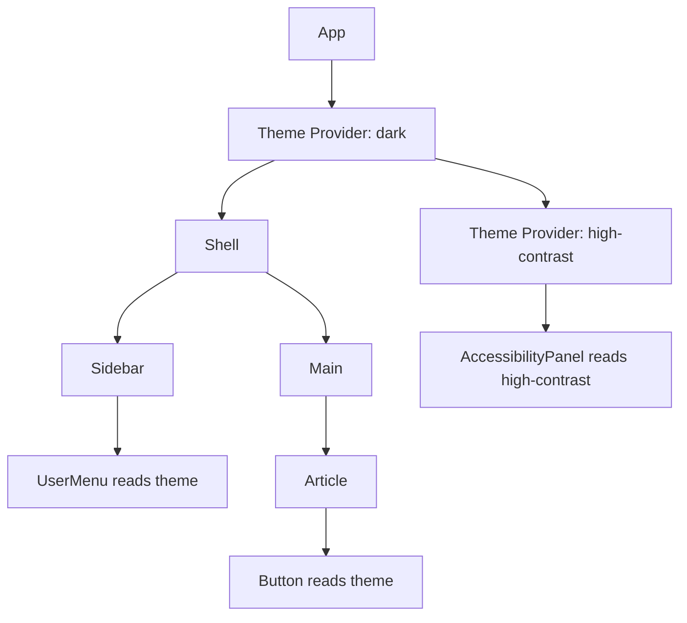
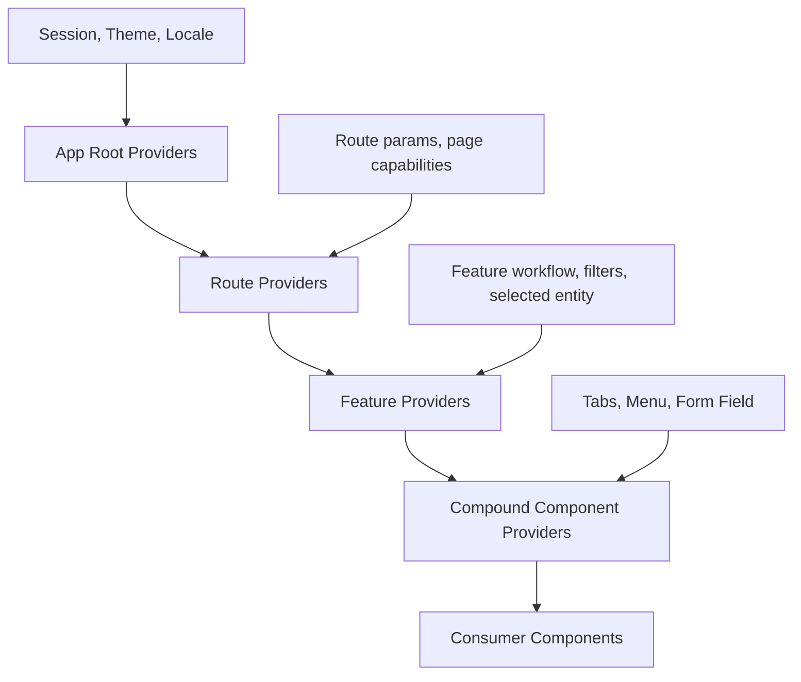

# Part 031 — Context Mental Model

Context sering disalahpahami sebagai “global state bawaan React”. Itu framing yang terlalu kasar dan sering berujung ke codebase yang lambat, implicit, dan sulit dites.

Framing yang lebih akurat:

> **Context adalah mekanisme untuk membuat sebuah value tersedia bagi subtree tertentu tanpa meneruskan props secara eksplisit melalui setiap level.**

Dari sudut arsitektur, Context adalah **scoped dependency passing**. Ia membuat value tersedia berdasarkan **posisi komponen di tree**, bukan berdasarkan file import, singleton, atau global registry.

Artinya, Context menjawab pertanyaan:

```txt
Untuk subtree ini, dependency/value/capability apa yang berlaku?
```

Bukan:

```txt
Di mana saya bisa menaruh semua state supaya mudah diakses dari mana saja?
```

Perbedaan itu kecil di kalimat, tetapi besar sekali di architecture outcome.

---

## 1. Masalah Yang Diselesaikan Context

Tanpa Context, data dari ancestor ke descendant biasanya lewat props.

```tsx
function App() {
  return <Shell theme="dark" currentUser={user} />;
}

function Shell({ theme, currentUser }) {
  return <Sidebar theme={theme} currentUser={currentUser} />;
}

function Sidebar({ theme, currentUser }) {
  return <UserMenu theme={theme} currentUser={currentUser} />;
}

function UserMenu({ theme, currentUser }) {
  return <Avatar user={currentUser} theme={theme} />;
}
```

Masalahnya bukan karena props itu buruk. Props justru mekanisme paling eksplisit dan paling mudah dilacak.

Masalah muncul saat komponen tengah hanya menjadi **wire-passing layer**:

```txt
Shell tidak memakai theme, tetapi harus menerima dan meneruskannya.
Sidebar tidak memakai currentUser, tetapi harus tahu prop itu ada.
Layout boundary ikut berubah hanya karena descendant butuh dependency baru.
```

Context menghilangkan kebutuhan untuk menyalurkan value lewat komponen yang tidak peduli.

```tsx
const ThemeContext = createContext<Theme | null>(null);
const SessionContext = createContext<Session | null>(null);

function App() {
  return (
    <ThemeContext value="dark">
      <SessionContext value={session}>
        <Shell />
      </SessionContext>
    </ThemeContext>
  );
}

function Avatar() {
  const theme = useRequiredContext(ThemeContext);
  const session = useRequiredContext(SessionContext);

  return ;
}
```

Di React 19, context object dapat dipakai langsung sebagai provider dengan `<SomeContext value={...}>`. Di React 18 dan ecosystem lama, bentuk yang umum adalah `<SomeContext.Provider value={...}>`.

---

## 2. Context Bukan Global State

Global state biasanya punya karakteristik:

```txt
Satu instance global.
Bisa dibaca banyak tempat.
Bisa diubah banyak tempat.
Umurnya biasanya sepanjang aplikasi.
Tidak selalu mengikuti struktur UI tree.
```

Context punya karakteristik berbeda:

```txt
Value berlaku hanya untuk subtree di bawah provider.
Provider dapat di-nest dan dioverride.
Consumer membaca provider terdekat di atasnya.
Value mengikuti komposisi tree.
Satu context bisa punya banyak value berbeda di subtree berbeda.
```

Contoh paling sederhana:

```tsx
<ThemeContext value="light">
  <MarketingPage />

  <ThemeContext value="dark">
    <AdminConsole />
  </ThemeContext>
</ThemeContext>
```

`MarketingPage` membaca `light`. `AdminConsole` membaca `dark`.

Kalau ini global state, override lokal seperti ini akan terasa aneh. Dalam Context, ini justru fitur utama: **scope**.

---

## 3. Mental Model: Context Sebagai Scoped Ambient Parameter

Bayangkan Context sebagai parameter implisit yang diwariskan melalui tree.



Setiap consumer bertanya:

```txt
Provider terdekat untuk Context ini siapa?
Value yang berlaku di scope saya apa?
```

Ini mirip lexical scope di bahasa pemrograman, tetapi berbasis **component tree**, bukan block syntax.

```txt
Lexical variable scope:
  block terdalam menang.

React context scope:
  provider terdekat di ancestor tree menang.
```

---

## 4. Anatomy Context

Context punya tiga elemen utama:

```txt
Context object  : identitas channel dependency.
Provider        : menentukan value untuk subtree.
Consumer        : membaca value provider terdekat.
```

```tsx
import { createContext, useContext } from 'react';

type Theme = 'light' | 'dark';

const ThemeContext = createContext<Theme | null>(null);

function ThemeProvider({ children }: { children: React.ReactNode }) {
  return <ThemeContext value="dark">{children}</ThemeContext>;
}

function useTheme() {
  const theme = useContext(ThemeContext);

  if (theme === null) {
    throw new Error('useTheme must be used inside ThemeProvider');
  }

  return theme;
}

function Button() {
  const theme = useTheme();
  return <button data-theme={theme}>Save</button>;
}
```

Catatan penting:

```txt
Context object tidak menyimpan state.
Provider menyediakan value.
Consumer subscribe terhadap value provider terdekat.
Default value dipakai hanya ketika tidak ada provider di atas consumer.
```

Jangan berpikir:

```txt
ThemeContext adalah tempat menyimpan theme.
```

Berpikir seperti ini:

```txt
ThemeContext adalah channel untuk membaca theme yang berlaku pada subtree ini.
```

---

## 5. Default Value: Fallback, Bukan Runtime Initial State

Saat membuat context:

```tsx
const ThemeContext = createContext('light');
```

`'light'` adalah fallback kalau consumer tidak menemukan provider di atasnya.

Itu bukan initial state provider.

Masalah umum:

```tsx
const AuthContext = createContext<AuthContextValue>({
  user: null,
  login: async () => {},
  logout: async () => {},
});
```

Kode ini terlihat nyaman, tapi berbahaya. Kalau developer lupa memasang `AuthProvider`, aplikasi tidak gagal cepat. Ia diam-diam memakai dummy function.

Lebih baik untuk context yang wajib:

```tsx
type AuthContextValue = {
  user: User | null;
  login(input: LoginInput): Promise<void>;
  logout(): Promise<void>;
};

const AuthContext = createContext<AuthContextValue | null>(null);

function useAuth() {
  const value = useContext(AuthContext);

  if (value === null) {
    throw new Error('useAuth must be used inside AuthProvider');
  }

  return value;
}
```

Prinsipnya:

```txt
Optional context boleh punya fallback bermakna.
Required context sebaiknya fail fast jika provider tidak ada.
```

Contoh optional context:

```tsx
const DensityContext = createContext<'comfortable' | 'compact'>('comfortable');
```

Contoh required context:

```tsx
const CaseWorkflowContext = createContext<CaseWorkflowApi | null>(null);
```

---

## 6. Context Sebagai Dependency Injection

Context paling sehat dipakai untuk mengirim dependency yang dibutuhkan banyak komponen dalam subtree.

Contoh:

```txt
Theme
Locale
i18n formatter
Feature flags
Permission/capability set
Analytics adapter
Router/navigation API
Form field registry
Modal manager
Design system configuration
Workflow command API
```

Ini bukan semuanya “state” dalam arti UI state. Banyak di antaranya lebih tepat disebut **capability**.

Capability adalah kemampuan yang diberikan kepada subtree:

```txt
boleh membaca permission?
boleh membuka modal?
boleh dispatch event workflow?
boleh mengirim analytics?
boleh resolve translation?
boleh melakukan navigation?
```

Contoh capability context:

```tsx
type CaseActions = {
  approve(caseId: string): Promise<void>;
  reject(caseId: string, reason: string): Promise<void>;
  escalate(caseId: string, targetQueue: string): Promise<void>;
};

const CaseActionsContext = createContext<CaseActions | null>(null);

function useCaseActions() {
  const actions = useContext(CaseActionsContext);

  if (!actions) {
    throw new Error('useCaseActions must be used inside CaseActionsProvider');
  }

  return actions;
}
```

Komponen descendant tidak perlu tahu apakah implementasi command memakai REST, GraphQL, TanStack Query mutation, message bus, atau mock adapter.

```tsx
function ApproveButton({ caseId }: { caseId: string }) {
  const { approve } = useCaseActions();

  return <button onClick={() => approve(caseId)}>Approve</button>;
}
```

Dengan desain ini, Context bukan tempat membuang state. Context menjadi **injection boundary**.

---

## 7. Context Sebagai Capability Passing: Lebih Aman Dari Global Import

Bandingkan dua pendekatan:

```tsx
// Global import
import { analytics } from '@/infra/analytics';

function SaveButton() {
  return <button onClick={() => analytics.track('save_clicked')}>Save</button>;
}
```

versus:

```tsx
function SaveButton() {
  const analytics = useAnalytics();
  return <button onClick={() => analytics.track('save_clicked')}>Save</button>;
}
```

Global import membuat komponen secara diam-diam bergantung pada runtime environment tertentu.

Context membuat dependency bisa di-scope:

```tsx
<AnalyticsContext value={productionAnalytics}>
  <App />
</AnalyticsContext>

<AnalyticsContext value={testAnalytics}>
  <StorybookScenario />
</AnalyticsContext>
```

Keuntungan:

```txt
Mudah dites.
Mudah dioverride per subtree.
Tidak tergantung singleton global.
Lebih mudah untuk multi-tenant/multi-workspace UI.
Lebih cocok untuk Storybook dan integration test.
```

---

## 8. Context Sebagai Tree-Scoped Value

Context sangat cocok untuk value yang maknanya tergantung scope UI.

Contoh: form field context.

```tsx
<FormFieldContext value={{ fieldId, errorId, describedBy }}>
  <Label>Email</Label>
  <Input />
  <ErrorMessage />
</FormFieldContext>
```

`Label`, `Input`, dan `ErrorMessage` tidak perlu menerima `fieldId`, `errorId`, dan `describedBy` lewat props satu per satu.

```tsx
function Input(props: React.ComponentProps<'input'>) {
  const field = useFormField();

  return (
    <input
      id={field.fieldId}
      aria-invalid={field.hasError}
      aria-describedby={field.describedBy}
      {...props}
    />
  );
}
```

Context di sini bukan global state. Ia adalah **local coordination scope** untuk komponen-komponen yang menjadi satu unit semantik.

---

## 9. Kapan Context Tepat Dipakai

Gunakan Context ketika beberapa kondisi ini terpenuhi:

```txt
Value dibutuhkan oleh banyak descendant.
Passing props melewati banyak komponen tengah hanya membuat noise.
Value berlaku untuk subtree tertentu.
Provider override per subtree berguna.
Value relatif stabil atau update frequency rendah.
Dependency lebih tepat di-inject daripada di-import global.
Komponen consumer memang secara konseptual berada dalam scope provider.
```

Contoh kuat:

```txt
ThemeProvider
LocaleProvider
AuthSessionProvider
PermissionProvider
FeatureFlagProvider
RouterProvider
FormProvider
TabsProvider
MenuProvider
ModalProvider
WorkflowProvider
```

---

## 10. Kapan Context Tidak Tepat Dipakai

Jangan otomatis memakai Context untuk semua shared state.

Context kurang cocok ketika:

```txt
Value sering berubah sangat cepat.
Consumer hanya butuh slice kecil dari object besar.
Banyak component membaca context tetapi tidak perlu rerender bersamaan.
State butuh selector granular.
State butuh devtools/time-travel/action log.
State sebenarnya server/cache state.
State harus survive di luar tree lifecycle.
State perlu subscription eksternal yang aman terhadap concurrent rendering.
```

Contoh kurang cocok:

```txt
Mouse position realtime.
Input keystroke global.
Large normalized entity store.
Query cache.
Collaborative document state.
High-frequency websocket feed.
Complex workflow dengan banyak actor terpisah.
```

Untuk kasus itu, pertimbangkan:

```txt
useSyncExternalStore-based store
Zustand
Redux Toolkit
TanStack Query
XState actor model
URL state
local component state
```

---

## 11. Context vs Props vs Composition vs Store

Gunakan tabel ini sebagai decision lens.

| Mekanisme | Cocok Untuk | Tidak Cocok Untuk | Sifat |
|---|---|---|---|
| Props | data eksplisit parent-child | passing lewat banyak intermediate layer | explicit, local |
| Composition | slot, layout, inversion of control | state yang banyak consumer-nya | structural |
| Context | scoped dependency/value untuk subtree | high-frequency granular state | implicit, scoped |
| External store | shared mutable state dengan subscription | local-only state sederhana | global/scoped external |
| Server state cache | remote data ownership server | UI-only state | async/cache-oriented |
| State machine | workflow dengan finite states | simple toggle | transition-oriented |

Rule of thumb:

```txt
Props first.
Composition when structure is the problem.
Context when dependency passing is the problem.
External store when subscription granularity and state lifecycle are the problem.
Server cache when data ownership is remote.
State machine when workflow correctness is the problem.
```

---

## 12. Context Membuat Dependency Implicit — Itu Kekuatan Dan Risiko

Context menyembunyikan dependency dari prop list.

Ini baik ketika prop list hanya menjadi noise.

Ini buruk ketika dependency penting menjadi tidak terlihat.

Contoh buruk:

```tsx
function DeleteCaseButton({ caseId }: { caseId: string }) {
  const permissions = useContext(PermissionContext);
  const workflow = useContext(WorkflowContext);
  const audit = useContext(AuditContext);
  const modal = useContext(ModalContext);
  const toast = useContext(ToastContext);

  // ...
}
```

Secara signature, komponen terlihat sederhana:

```tsx
<DeleteCaseButton caseId="C-123" />
```

Tapi runtime dependency-nya banyak.

Ini bukan berarti Context salah. Ini berarti komponen tersebut mungkin punya terlalu banyak responsibility.

Refactor yang lebih sehat:

```tsx
function DeleteCaseButton({ caseId }: { caseId: string }) {
  const deleteCase = useDeleteCaseCommand();

  return <button onClick={() => deleteCase(caseId)}>Delete</button>;
}
```

Lalu `useDeleteCaseCommand` menjadi orchestration boundary yang jelas:

```tsx
function useDeleteCaseCommand() {
  const permissions = usePermissions();
  const workflow = useCaseWorkflow();
  const audit = useAudit();
  const modal = useModal();
  const toast = useToast();

  return async function deleteCase(caseId: string) {
    if (!permissions.can('case.delete')) {
      toast.error('You do not have permission to delete this case.');
      return;
    }

    const confirmed = await modal.confirm({
      title: 'Delete case?',
      description: 'This action cannot be undone.',
    });

    if (!confirmed) return;

    await workflow.deleteCase(caseId);
    audit.track('case.deleted', { caseId });
  };
}
```

Dependency tetap implicit di hook, tetapi orchestration-nya punya nama dan kontrak.

---

## 13. Context Membaca Provider Terdekat

Context lookup selalu mencari provider terdekat di atas consumer.

```tsx
const CurrencyContext = createContext('USD');

function Price() {
  const currency = useContext(CurrencyContext);
  return <span>{currency}</span>;
}

function App() {
  return (
    <CurrencyContext value="USD">
      <Price />

      <CurrencyContext value="IDR">
        <Price />
      </CurrencyContext>
    </CurrencyContext>
  );
}
```

Hasil mental:

```txt
Price pertama  -> USD
Price kedua    -> IDR
```

Provider override ini berguna untuk:

```txt
Theme section override
Locale preview
Tenant/workspace boundary
Permission simulation
Storybook scenario
Nested form field
Nested menu/listbox/tabs
```

---

## 14. Context Value Adalah Bagian Dari Render Model

Provider value adalah input render untuk consumer.

Jika provider value berubah, consumer yang membaca context tersebut perlu mendapat value baru.

Contoh:

```tsx
<AuthContext value={{ user, login, logout }}>
  {children}
</AuthContext>
```

Object literal baru dibuat di setiap render provider. Jika consumer membaca context ini, value identity berubah walaupun `user` sama.

Untuk provider kecil dengan update jarang, ini mungkin tidak masalah. Untuk provider luas dengan banyak consumer, ini bisa menjadi sumber rerender yang tidak perlu.

Pola lebih aman:

```tsx
const value = useMemo(
  () => ({ user, login, logout }),
  [user, login, logout],
);

return <AuthContext value={value}>{children}</AuthContext>;
```

Tetapi jangan salah paham:

```txt
useMemo bukan solusi arsitektur untuk context yang terlalu besar.
useMemo hanya menjaga identity ketika dependency tidak berubah.
Jika user berubah, semua consumer context tetap harus mengevaluasi value baru.
```

Kalau consumer membutuhkan slice berbeda dengan frekuensi update berbeda, split context atau gunakan external store.

---

## 15. Context State vs Context Capability

Ada dua bentuk umum provider:

### 15.1 State Context

```tsx
type SidebarContextValue = {
  expanded: boolean;
  toggle(): void;
};
```

Ini memberikan state dan command sekaligus.

Cocok untuk state kecil dan scoped:

```txt
Tabs active tab
Accordion expanded item
Sidebar open/closed
Dropdown open/closed
Form field metadata
Theme mode
```

### 15.2 Capability Context

```tsx
type ToastApi = {
  success(message: string): void;
  error(message: string): void;
};
```

Ini memberikan kemampuan, bukan state utama.

Cocok untuk:

```txt
toast
modal
analytics
permission check
router/navigation
workflow command
feature flag access
```

Capability context biasanya lebih stabil dan lebih aman performanya karena value tidak harus berubah setiap interaksi kecil.

---

## 16. Context Sebagai Boundary, Bukan Convenience Global

Pertanyaan desain Context yang benar:

```txt
Provider ini mendefinisikan boundary apa?
```

Contoh buruk:

```tsx
<AppContext value={{
  user,
  theme,
  permissions,
  cases,
  selectedCaseId,
  filters,
  modalState,
  notifications,
  updateCase,
  deleteCase,
  setFilters,
  openModal,
}}>
  <App />
</AppContext>
```

Masalahnya:

```txt
Boundary tidak jelas.
Semua hal menjadi dependency semua hal.
Value berubah karena alasan terlalu banyak.
Consumer sulit dites.
Tidak ada ownership yang bersih.
Refactor menjadi berisiko.
```

Lebih sehat:

```tsx
<SessionProvider>
  <FeatureFlagProvider>
    <PermissionProvider>
      <ToastProvider>
        <ModalProvider>
          <CaseSearchPage />
        </ModalProvider>
      </ToastProvider>
    </PermissionProvider>
  </FeatureFlagProvider>
</SessionProvider>
```

Masih bisa terlihat seperti provider pyramid. Tetapi setiap provider punya boundary dan alasan hidup sendiri.

Kalau provider pyramid terlalu panjang, komposisikan di root module:

```tsx
function AppProviders({ children }: { children: React.ReactNode }) {
  return (
    <SessionProvider>
      <FeatureFlagProvider>
        <PermissionProvider>
          <ToastProvider>
            <ModalProvider>{children}</ModalProvider>
          </ToastProvider>
        </PermissionProvider>
      </FeatureFlagProvider>
    </SessionProvider>
  );
}
```

---

## 17. Context Dalam Layer Architecture

Context bisa hidup di beberapa layer.



### App Root Provider

Untuk value yang benar-benar berlaku luas:

```txt
theme
locale
session
feature flags
analytics adapter
query client provider
router provider
```

### Route Provider

Untuk dependency yang berlaku pada route tertentu:

```txt
case search filters
case detail workflow
route-level permission context
page-level modal host
```

### Feature Provider

Untuk state/capability satu feature:

```txt
invoice approval workflow
document review state
bulk action selection
wizard state
```

### Compound Component Provider

Untuk koordinasi local component group:

```txt
Tabs active value
Accordion expanded item
RadioGroup selected value
Menu open/highlighted item
FormField id/error relationship
```

Provider yang baik biasanya bisa dijelaskan dalam satu kalimat:

```txt
Provider ini membuat X tersedia untuk subtree Y agar Z tidak perlu dipassing manual.
```

Kalau tidak bisa, desainnya belum jelas.

---

## 18. Context Dan Ownership

Context tidak menghapus pertanyaan ownership.

Ia justru membuat pertanyaan ownership lebih penting:

```txt
Siapa pemilik value?
Siapa boleh mengubah value?
Apakah consumer boleh mutation langsung?
Apakah context membawa state, command, atau keduanya?
Apakah value ini harus persist saat subtree unmount?
Apakah value ini harus global atau scoped?
```

Contoh kurang sehat:

```tsx
type FiltersContextValue = {
  filters: Filters;
  setFilters: React.Dispatch<React.SetStateAction<Filters>>;
};
```

Consumer mana pun bisa mengubah filters dengan cara apa pun.

Lebih sehat:

```tsx
type CaseSearchContextValue = {
  filters: Filters;
  applyFilter(patch: Partial<Filters>): void;
  resetFilters(): void;
  setPage(page: number): void;
};
```

Sekarang context membawa **domain command**, bukan raw setter.

---

## 19. Context Dan Command Boundary

Raw setter leaking adalah anti-pattern umum.

```tsx
<WorkflowContext value={{ state, setState }}>
```

Masalah:

```txt
Consumer bisa membuat illegal transition.
Invariant tersebar di banyak tempat.
Sulit audit siapa mengubah apa.
Nama action tidak terlihat.
Testing harus mengejar banyak setter path.
```

Lebih baik:

```tsx
type WorkflowContextValue = {
  state: WorkflowState;
  submit(): Promise<void>;
  approve(): Promise<void>;
  reject(reason: string): Promise<void>;
  retry(): Promise<void>;
};
```

Consumer tidak perlu tahu implementasi internal.

```tsx
function ApproveButton() {
  const workflow = useWorkflow();

  return (
    <button
      disabled={workflow.state.status !== 'readyForApproval'}
      onClick={workflow.approve}
    >
      Approve
    </button>
  );
}
```

Di sistem regulatori atau case-management, command boundary ini sangat penting karena UI action sering punya konsekuensi audit, permission, transition, dan side effect.

---

## 20. Context Dan Security/Authorization UI

Context sering dipakai untuk permission atau capability.

Contoh:

```tsx
type PermissionContextValue = {
  can(action: string, resource?: unknown): boolean;
};

const PermissionContext = createContext<PermissionContextValue | null>(null);
```

Consumer:

```tsx
function EscalateButton({ caseId }: { caseId: string }) {
  const permissions = usePermissions();

  if (!permissions.can('case.escalate', { caseId })) {
    return null;
  }

  return <button>Escalate</button>;
}
```

Catatan arsitektur:

```txt
Permission context di frontend hanya mengatur UX.
Backend tetap harus melakukan authorization sebenarnya.
UI permission tidak boleh dianggap enforcement boundary.
```

Namun UI permission context tetap penting untuk:

```txt
mengurangi action yang tidak relevan
membuat UI konsisten
mendukung disabled/hidden policy
auditability UX
mengurangi accidental invalid action
```

---

## 21. Context Dan Testability

Context memudahkan test jika provider contract jelas.

```tsx
render(
  <PermissionContext value={{ can: () => true }}>
    <EscalateButton caseId="C-123" />
  </PermissionContext>,
);
```

Tetapi jika komponen membaca terlalu banyak context, test setup menjadi berat.

Gejala buruk:

```txt
Setiap test perlu AppProviders penuh.
Mock provider sulit dibuat.
Komponen kecil butuh banyak dependency.
Provider value shape terlalu besar.
```

Solusi:

```txt
Buat custom render helper per feature.
Pisahkan provider per capability.
Gunakan domain hook untuk orchestration kompleks.
Jangan membuat AppContext raksasa.
Expose test harness untuk feature provider.
```

---

## 22. Build a Tiny Context Mental Model From Scratch

Ini bukan implementasi React Context sungguhan. Ini hanya model untuk memahami konsep provider terdekat.

```tsx
type Context<T> = {
  defaultValue: T;
  stack: T[];
};

function createTinyContext<T>(defaultValue: T): Context<T> {
  return {
    defaultValue,
    stack: [],
  };
}

function provide<T>(context: Context<T>, value: T, renderSubtree: () => void) {
  context.stack.push(value);

  try {
    renderSubtree();
  } finally {
    context.stack.pop();
  }
}

function read<T>(context: Context<T>): T {
  const latest = context.stack.at(-1);
  return latest ?? context.defaultValue;
}
```

Jika kita panggil:

```tsx
const Theme = createTinyContext('light');

provide(Theme, 'dark', () => {
  console.log(read(Theme)); // dark

  provide(Theme, 'high-contrast', () => {
    console.log(read(Theme)); // high-contrast
  });

  console.log(read(Theme)); // dark
});
```

Mental model-nya:

```txt
Provider masuk scope -> value ditaruh.
Consumer membaca value terdekat.
Provider keluar scope -> value sebelumnya berlaku lagi.
```

React Context jauh lebih kompleks karena bekerja dengan fiber tree, reconciliation, concurrent rendering, dan subscription. Namun model sederhana ini cukup untuk memahami scope dan override.

---

## 23. Failure Modes Context Mental Model

### 23.1 AppContext Raksasa

Gejala:

```txt
Satu context berisi semua state dan action.
Setiap perubahan kecil menyentuh banyak consumer.
Tidak ada boundary ownership.
```

Fix:

```txt
Pisahkan berdasarkan capability dan update frequency.
Gunakan provider per domain/feature.
Gunakan external store jika butuh selector granular.
```

### 23.2 Context Untuk State Yang Terlalu Sering Berubah

Gejala:

```txt
Typing input membuat banyak component rerender.
Pointer movement dibroadcast ke subtree besar.
List selection besar membuat page tersendat.
```

Fix:

```txt
Localize state.
Gunakan external store dengan selector.
Virtualize list.
Pisahkan state high-frequency dari context low-frequency.
```

### 23.3 Default Value Menyembunyikan Provider Yang Hilang

Gejala:

```txt
Komponen berjalan di test tetapi rusak di runtime.
Dummy function terpanggil tanpa error.
Auth/permission default membuat false confidence.
```

Fix:

```txt
Gunakan null sentinel untuk required context.
Buat custom hook yang fail fast.
```

### 23.4 Context Membuat Dependency Terlalu Implicit

Gejala:

```txt
Komponen kecil membaca banyak context.
Sulit dipindahkan.
Sulit dites.
Sulit tahu dependency dari signature.
```

Fix:

```txt
Buat domain hook.
Pindahkan orchestration ke boundary.
Pertahankan view component tetap dependency-light.
```

### 23.5 Raw Setter Bocor Ke Consumer

Gejala:

```txt
Consumer membuat state invalid.
Transisi tersebar.
Tidak ada audit action.
```

Fix:

```txt
Expose command/event, bukan setState mentah.
Gunakan reducer untuk transition logic.
Gunakan state machine untuk workflow kompleks.
```

---

## 24. Context Review Checklist

Sebelum membuat Context baru, jawab ini:

```txt
1. Value ini berlaku untuk subtree apa?
2. Apakah props/composition lebih eksplisit dan cukup?
3. Apakah value ini dependency/capability atau state yang sering berubah?
4. Siapa owner value ini?
5. Siapa boleh mengubahnya?
6. Apakah consumer perlu semua value atau hanya slice?
7. Apakah update frequency-nya rendah?
8. Apakah provider override per subtree berguna?
9. Apakah default value aman?
10. Apakah custom hook bisa fail fast ketika provider hilang?
11. Apakah value shape terlalu besar?
12. Apakah context ini akan membuat test setup berat?
13. Apakah raw setter bocor ke consumer?
14. Apakah context ini sebenarnya server/cache state?
15. Apakah external store lebih tepat?
```

---

## 25. Heuristic Final

Context adalah alat yang kuat karena mengurangi wiring noise. Tetapi kekuatan itu datang dari implicitness.

Gunakan Context untuk:

```txt
scoped dependency
capability passing
cross-cutting read-mostly values
component group coordination
provider override per subtree
```

Hindari Context untuk:

```txt
global dumping ground
high-frequency granular state
large entity cache
workflow rumit tanpa transition model
server state ownership
```

Kalimat penutup yang perlu diingat:

> **Context bukan tempat state disimpan. Context adalah channel untuk membaca value yang berlaku pada posisi tertentu di component tree.**

Kalau mental model ini benar, Context akan membuat arsitektur lebih bersih. Kalau salah, Context akan menjadi global variable dengan syntax React.

---

## Referensi

- React Docs — Passing Data Deeply with Context: https://react.dev/learn/passing-data-deeply-with-context
- React Docs — `useContext`: https://react.dev/reference/react/useContext
- React Docs — `createContext`: https://react.dev/reference/react/createContext
- React Docs — Scaling Up with Reducer and Context: https://react.dev/learn/scaling-up-with-reducer-and-context
- React Docs — Sharing State Between Components: https://react.dev/learn/sharing-state-between-components
