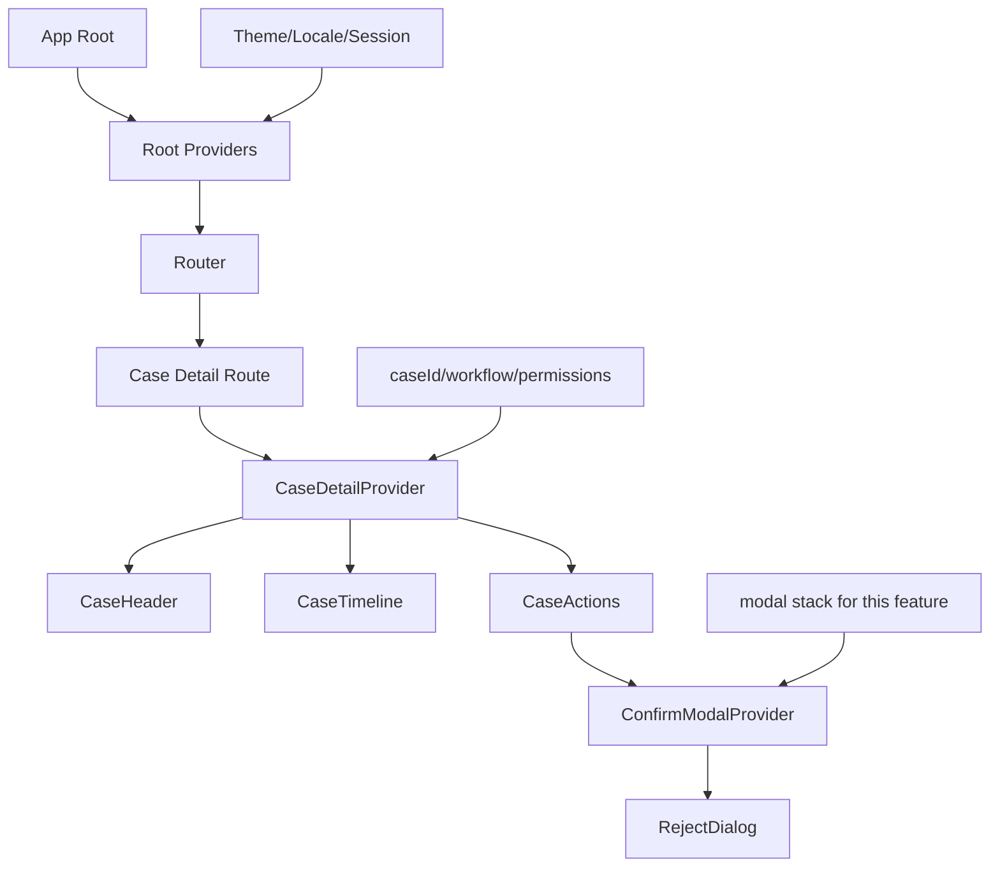

# Part 032 — Context Provider Design

Part sebelumnya membangun mental model: Context adalah **scoped dependency/capability passing**, bukan global state manager default.

Sekarang kita masuk ke desain provider.

Provider adalah boundary yang menjawab:

```txt
Value apa yang berlaku?
Untuk subtree mana?
Siapa owner-nya?
Seberapa sering berubah?
Bagaimana consumer membacanya?
Bagaimana consumer mengirim intent?
Bagaimana test mengganti value ini?
```

Provider yang bagus membuat codebase lebih modular. Provider yang buruk membuat coupling menjadi invisible, rerender sulit dikendalikan, dan state ownership kabur.

---

## 1. Provider Adalah Architectural Boundary

Provider bukan wrapper kosmetik.

Provider adalah deklarasi scope.

```tsx
<PermissionProvider user={user} policy={policy}>
  <CaseDetailPage caseId={caseId} />
</PermissionProvider>
```

Kalimat arsitekturalnya:

```txt
Di dalam CaseDetailPage, permission resolution memakai user dan policy ini.
```

Contoh lain:

```tsx
<CaseWorkflowProvider caseId={caseId}>
  <CaseHeader />
  <CaseTimeline />
  <CaseActions />
</CaseWorkflowProvider>
```

Kalimat arsitekturalnya:

```txt
Subtree ini berada dalam workflow untuk case tertentu.
```

Kalau provider tidak bisa dijelaskan seperti itu, kemungkinan ia hanya convenience wrapper yang belum punya boundary jelas.

---

## 2. Provider Placement: Letakkan Sedekat Scope Sebenarnya

Pertanyaan pertama:

```txt
Apakah value ini benar-benar berlaku untuk seluruh aplikasi?
```

Banyak provider diletakkan di root hanya karena “mudah”. Itu sering salah.

### 2.1 Root Provider

Root provider cocok untuk dependency yang benar-benar global secara UX/runtime.

```tsx
function RootProviders({ children }: { children: React.ReactNode }) {
  return (
    <ThemeProvider>
      <LocaleProvider>
        <SessionProvider>
          <FeatureFlagProvider>
            {children}
          </FeatureFlagProvider>
        </SessionProvider>
      </LocaleProvider>
    </ThemeProvider>
  );
}
```

Cocok untuk:

```txt
theme
locale
session
feature flag client
analytics adapter
router/query client provider
```

Tidak cocok untuk:

```txt
selected case id
search filters route tertentu
modal state feature tertentu
wizard step state
form dirty state
```

### 2.2 Route Provider

Route provider cocok ketika value berlaku untuk satu page/route.

```tsx
function CaseDetailRoute() {
  const { caseId } = useParams();

  return (
    <CaseDetailProvider caseId={caseId}>
      <CaseDetailPage />
    </CaseDetailProvider>
  );
}
```

Cocok untuk:

```txt
case detail workflow
route-level filters
selected tab dari URL
page command handlers
route permission context
```

### 2.3 Feature Provider

Feature provider cocok untuk satu area produk yang punya state/coordinator sendiri.

```tsx
function BulkReviewFeature() {
  return (
    <BulkSelectionProvider>
      <ReviewQueue />
      <BulkActionBar />
    </BulkSelectionProvider>
  );
}
```

Cocok untuk:

```txt
bulk selection
review queue interaction
wizard orchestration
local workflow command
feature-local modal manager
```

### 2.4 Component Group Provider

Provider kecil untuk compound/headless component.

```tsx
<TabsProvider value={activeTab} onValueChange={setActiveTab}>
  <TabsList />
  <TabsPanels />
</TabsProvider>
```

Cocok untuk:

```txt
Tabs
Accordion
RadioGroup
Menu
Listbox
FormField
TreeView
```

Prinsip placement:

```txt
Letakkan provider setinggi kebutuhan sharing, tetapi serendah mungkin agar scope tetap kecil.
```

---

## 3. Provider Scope Diagram



Provider root yang terlalu besar membuat semua page membawa dependency yang belum tentu relevan. Provider lokal yang terlalu rendah membuat sibling tidak bisa berbagi value. Desainnya adalah kompromi scope.

---

## 4. Provider Value Shape

Provider value shape menentukan coupling consumer.

Contoh buruk:

```tsx
type AppContextValue = {
  user: User | null;
  theme: Theme;
  cases: Case[];
  selectedCaseId: string | null;
  filters: Filters;
  modal: ModalState;
  setUser(user: User | null): void;
  setTheme(theme: Theme): void;
  setCases(cases: Case[]): void;
  setSelectedCaseId(id: string | null): void;
  setFilters(filters: Filters): void;
  setModal(modal: ModalState): void;
};
```

Ini bukan context. Ini “everything bagel”.

Value shape yang sehat punya satu reason to change.

```tsx
type PermissionContextValue = {
  can(action: PermissionAction, resource?: PermissionResource): boolean;
  explain?(action: PermissionAction, resource?: PermissionResource): PermissionReason;
};
```

```tsx
type ToastContextValue = {
  success(message: string, options?: ToastOptions): void;
  error(message: string, options?: ToastOptions): void;
  warning(message: string, options?: ToastOptions): void;
};
```

```tsx
type CaseWorkflowContextValue = {
  state: CaseWorkflowState;
  approve(): Promise<void>;
  reject(reason: string): Promise<void>;
  escalate(queueId: string): Promise<void>;
  retry(): void;
};
```

Prinsip:

```txt
Satu provider = satu boundary ownership.
Satu context value = satu domain/capability yang kohesif.
Jangan gabungkan value hanya karena consumer yang sama membacanya.
```

---

## 5. Stable Value Identity

Context consumer membaca `value` dari provider. Jika `value` berubah, consumer context tersebut mendapat value baru.

Masalah umum:

```tsx
function AuthProvider({ children }: { children: React.ReactNode }) {
  const [user, setUser] = useState<User | null>(null);

  return (
    <AuthContext value={{ user, setUser }}>
      {children}
    </AuthContext>
  );
}
```

Object literal `{ user, setUser }` dibuat ulang setiap render provider.

Versi lebih stabil:

```tsx
function AuthProvider({ children }: { children: React.ReactNode }) {
  const [user, setUser] = useState<User | null>(null);

  const value = useMemo(
    () => ({ user, setUser }),
    [user],
  );

  return <AuthContext value={value}>{children}</AuthContext>;
}
```

`setUser` dari `useState` stabil, jadi dependency cukup `[user]`.

Namun jangan jadikan `useMemo` sebagai obat semua penyakit.

```txt
Jika user berubah, consumer tetap perlu menerima value baru.
Jika context berisi 20 field dengan frekuensi perubahan berbeda, memoization tidak memperbaiki desain boundary.
```

---

## 6. Function Stability Dalam Provider

Function yang dibuat di dalam provider juga berubah identity jika tidak distabilkan.

```tsx
function ToastProvider({ children }: { children: React.ReactNode }) {
  const [toasts, setToasts] = useState<Toast[]>([]);

  const success = (message: string) => {
    setToasts((items) => [...items, createToast('success', message)]);
  };

  const error = (message: string) => {
    setToasts((items) => [...items, createToast('error', message)]);
  };

  const value = { success, error };

  return <ToastContext value={value}>{children}</ToastContext>;
}
```

Stabilkan command:

```tsx
function ToastProvider({ children }: { children: React.ReactNode }) {
  const [toasts, setToasts] = useState<Toast[]>([]);

  const success = useCallback((message: string) => {
    setToasts((items) => [...items, createToast('success', message)]);
  }, []);

  const error = useCallback((message: string) => {
    setToasts((items) => [...items, createToast('error', message)]);
  }, []);

  const value = useMemo(
    () => ({ success, error }),
    [success, error],
  );

  return (
    <ToastContext value={value}>
      {children}
      <ToastViewport toasts={toasts} />
    </ToastContext>
  );
}
```

Consumer toast API tidak perlu rerender saat `toasts` berubah karena context value hanya berisi stable commands. `ToastViewport` menerima state langsung dari provider.

Ini pattern penting:

```txt
Context untuk command API.
State visual disalurkan langsung ke viewport/host yang membutuhkannya.
```

---

## 7. Split State Context Dan Dispatch/Command Context

Jika satu provider membawa state dan action, consumer yang hanya butuh action bisa ikut terpengaruh oleh state change.

Contoh:

```tsx
type CounterContextValue = {
  count: number;
  increment(): void;
};
```

Split:

```tsx
const CounterStateContext = createContext<number | null>(null);
const CounterActionsContext = createContext<{ increment(): void } | null>(null);

function CounterProvider({ children }: { children: React.ReactNode }) {
  const [count, setCount] = useState(0);

  const increment = useCallback(() => {
    setCount((value) => value + 1);
  }, []);

  const actions = useMemo(() => ({ increment }), [increment]);

  return (
    <CounterActionsContext value={actions}>
      <CounterStateContext value={count}>
        {children}
      </CounterStateContext>
    </CounterActionsContext>
  );
}
```

Consumer:

```tsx
function CounterValue() {
  const count = useCounterState();
  return <span>{count}</span>;
}

function IncrementButton() {
  const { increment } = useCounterActions();
  return <button onClick={increment}>+</button>;
}
```

Manfaat:

```txt
Consumer action tidak membaca state.
Consumer state tidak perlu menerima command object.
Boundary read/write lebih jelas.
Testing lebih mudah.
```

Kapan split ini worth it?

```txt
Provider dipakai banyak consumer.
State sering berubah.
Banyak consumer hanya dispatch action.
Provider berada di subtree besar.
```

Kapan tidak perlu?

```txt
Provider kecil.
Consumer sedikit.
State jarang berubah.
Splitting membuat API terlalu rumit tanpa manfaat nyata.
```

---

## 8. Reducer Provider Pattern

Untuk state yang punya banyak transition, provider sebaiknya tidak berisi banyak setter terpisah.

Gunakan reducer.

```tsx
type SidebarState = {
  expanded: boolean;
};

type SidebarEvent =
  | { type: 'expanded' }
  | { type: 'collapsed' }
  | { type: 'toggled' };

function sidebarReducer(state: SidebarState, event: SidebarEvent): SidebarState {
  switch (event.type) {
    case 'expanded':
      return { expanded: true };
    case 'collapsed':
      return { expanded: false };
    case 'toggled':
      return { expanded: !state.expanded };
    default:
      return state;
  }
}
```

Provider:

```tsx
const SidebarStateContext = createContext<SidebarState | null>(null);
const SidebarCommandsContext = createContext<SidebarCommands | null>(null);

type SidebarCommands = {
  expand(): void;
  collapse(): void;
  toggle(): void;
};

function SidebarProvider({ children }: { children: React.ReactNode }) {
  const [state, dispatch] = useReducer(sidebarReducer, { expanded: true });

  const commands = useMemo<SidebarCommands>(
    () => ({
      expand: () => dispatch({ type: 'expanded' }),
      collapse: () => dispatch({ type: 'collapsed' }),
      toggle: () => dispatch({ type: 'toggled' }),
    }),
    [],
  );

  return (
    <SidebarCommandsContext value={commands}>
      <SidebarStateContext value={state}>
        {children}
      </SidebarStateContext>
    </SidebarCommandsContext>
  );
}
```

Kenapa command, bukan dispatch mentah?

```txt
Command memberi vocabulary domain.
Consumer tidak perlu tahu event internal.
Provider bisa menambah analytics, permission, logging, dan guard tanpa mengubah consumer.
Reducer tetap pure.
```

Untuk provider kecil, expose `dispatch` bisa diterima. Untuk provider yang menjadi API feature, command lebih stabil.

---

## 9. Provider Dengan Controlled/Uncontrolled Contract

Compound/headless provider sering perlu mendukung controlled dan uncontrolled mode.

Contoh Tabs provider:

```tsx
type TabsProviderProps = {
  value?: string;
  defaultValue?: string;
  onValueChange?: (value: string) => void;
  children: React.ReactNode;
};

function TabsProvider({
  value,
  defaultValue,
  onValueChange,
  children,
}: TabsProviderProps) {
  const isControlled = value !== undefined;
  const [internalValue, setInternalValue] = useState(defaultValue ?? '');

  const currentValue = isControlled ? value : internalValue;

  const setValue = useCallback(
    (nextValue: string) => {
      if (!isControlled) {
        setInternalValue(nextValue);
      }

      onValueChange?.(nextValue);
    },
    [isControlled, onValueChange],
  );

  const contextValue = useMemo(
    () => ({ value: currentValue, setValue }),
    [currentValue, setValue],
  );

  return <TabsContext value={contextValue}>{children}</TabsContext>;
}
```

Provider ini punya kontrak:

```txt
Jika value diberikan, owner state adalah parent.
Jika value tidak diberikan, owner state adalah provider.
onValueChange selalu dipanggil sebagai notification/intent.
defaultValue hanya initial value untuk uncontrolled mode.
```

Failure mode yang harus dicegah:

```txt
Komponen berubah dari uncontrolled ke controlled tanpa niat.
defaultValue diharapkan update setelah mount.
Provider mengubah internal state padahal controlled.
Consumer membaca value undefined tanpa guard.
```

---

## 10. Provider Dengan Derived Value

Provider boleh menghitung derived value, tetapi jangan menyimpan derived value sebagai state jika bisa dihitung dari source of truth.

Buruk:

```tsx
const [items, setItems] = useState<Item[]>([]);
const [selectedIds, setSelectedIds] = useState<Set<string>>(new Set());
const [selectedItems, setSelectedItems] = useState<Item[]>([]);
```

Lebih sehat:

```tsx
const selectedItems = useMemo(
  () => items.filter((item) => selectedIds.has(item.id)),
  [items, selectedIds],
);
```

Namun provider value harus tetap hati-hati.

```tsx
const value = useMemo(
  () => ({ items, selectedIds, selectedItems, toggleSelection }),
  [items, selectedIds, selectedItems, toggleSelection],
);
```

Jika `items` besar dan `selectedIds` sering berubah, semua consumer yang membaca context menerima value baru. Jika consumer hanya butuh count, pertimbangkan split context atau external store selector.

---

## 11. Provider Jangan Menjadi God Object

Provider yang terlalu kuat sering menjadi mini-application tersembunyi.

Gejala:

```txt
Provider file lebih dari ratusan baris.
Provider memuat fetch, permission, mutation, routing, modal, toast, cache invalidation, dan reducer sekaligus.
Consumer tampak sederhana tetapi behavior tersembunyi penuh.
Testing provider butuh mock banyak dependency.
```

Refactor menjadi layer:

```txt
Provider       : menyediakan state/capability ke subtree.
Reducer        : transition pure.
Service hook   : async orchestration.
Command hook   : action use-case.
View component : render dan event binding.
```

Contoh struktur:

```txt
case-detail/
  context/
    CaseDetailProvider.tsx
    useCaseDetail.ts
  state/
    caseDetailReducer.ts
    caseDetailEvents.ts
  hooks/
    useApproveCaseCommand.ts
    useRejectCaseCommand.ts
  components/
    CaseHeader.tsx
    CaseActions.tsx
```

Provider tidak harus memuat semua logic. Provider hanya boundary injection.

---

## 12. Provider Composition Pattern

Provider pyramid bisa dibungkus agar root bersih.

```tsx
function composeProviders(
  providers: Array<React.ComponentType<{ children: React.ReactNode }>>,
) {
  return providers.reduce(
    (AccumulatedProviders, CurrentProvider) => {
      return function ComposedProviders({ children }: { children: React.ReactNode }) {
        return (
          <AccumulatedProviders>
            <CurrentProvider>{children}</CurrentProvider>
          </AccumulatedProviders>
        );
      };
    },
    function EmptyProvider({ children }: { children: React.ReactNode }) {
      return <>{children}</>;
    },
  );
}

const AppProviders = composeProviders([
  ThemeProvider,
  LocaleProvider,
  SessionProvider,
  FeatureFlagProvider,
]);
```

Namun jangan menyembunyikan urutan dependency yang penting.

Jika `PermissionProvider` membutuhkan `SessionProvider`, urutan harus jelas dan dites.

```tsx
function AppProviders({ children }: { children: React.ReactNode }) {
  return (
    <SessionProvider>
      <PermissionProvider>
        <FeatureFlagProvider>
          {children}
        </FeatureFlagProvider>
      </PermissionProvider>
    </SessionProvider>
  );
}
```

Rule:

```txt
Composition helper boleh untuk provider independen.
Explicit nesting lebih baik untuk provider yang punya dependency order.
```

---

## 13. Provider Dependency Order

Provider sering bergantung pada provider lain.

Contoh:

```tsx
function PermissionProvider({ children }: { children: React.ReactNode }) {
  const session = useSession();
  const policy = usePolicyClient();

  const value = useMemo(
    () => createPermissionApi(session.user, policy),
    [session.user, policy],
  );

  return <PermissionContext value={value}>{children}</PermissionContext>;
}
```

Maka `PermissionProvider` harus berada di bawah `SessionProvider` dan `PolicyClientProvider`.

```tsx
<SessionProvider>
  <PolicyClientProvider>
    <PermissionProvider>
      <App />
    </PermissionProvider>
  </PolicyClientProvider>
</SessionProvider>
```

Dokumentasikan dependency ini.

```tsx
/**
 * Requires:
 * - SessionProvider
 * - PolicyClientProvider
 */
function PermissionProvider(...) {}
```

Untuk codebase besar, provider dependency yang tidak didokumentasikan menjadi sumber runtime error yang sulit dilacak.

---

## 14. Provider Override Pattern

Context mendukung override lokal.

```tsx
<ThemeProvider value="light">
  <PublicPage />

  <ThemeProvider value="dark">
    <AdminPreview />
  </ThemeProvider>
</ThemeProvider>
```

Gunakan override untuk:

```txt
Storybook scenario
Preview mode
Nested theme
Permission simulation
Tenant/workspace boundary
Experiment variation
Form field nesting
```

Contoh permission simulation:

```tsx
function PermissionScenario({ children }: { children: React.ReactNode }) {
  return (
    <PermissionContext value={{ can: (action) => action !== 'case.delete' }}>
      {children}
    </PermissionContext>
  );
}
```

Peringatan:

```txt
Override yang terlalu banyak bisa membuat behavior sulit ditebak.
Jangan override provider untuk mengecoh domain invariant.
Jangan memakai override sebagai hidden branching system.
```

---

## 15. Provider Untuk External Adapter

Context sangat cocok untuk external adapter yang ingin diinjeksi.

```tsx
type Analytics = {
  track(event: string, payload?: Record<string, unknown>): void;
};

const AnalyticsContext = createContext<Analytics | null>(null);

function AnalyticsProvider({
  analytics,
  children,
}: {
  analytics: Analytics;
  children: React.ReactNode;
}) {
  return (
    <AnalyticsContext value={analytics}>
      {children}
    </AnalyticsContext>
  );
}
```

Consumer:

```tsx
function useAnalytics() {
  const value = useContext(AnalyticsContext);

  if (!value) {
    throw new Error('useAnalytics must be used inside AnalyticsProvider');
  }

  return value;
}
```

Test:

```tsx
const events: unknown[] = [];

render(
  <AnalyticsProvider analytics={{ track: (...args) => events.push(args) }}>
    <SaveButton />
  </AnalyticsProvider>,
);
```

Ini lebih testable daripada import singleton langsung.

---

## 16. Provider Untuk Modal/Toast Host

Provider sering perlu menyediakan API dan host render.

```tsx
function ModalProvider({ children }: { children: React.ReactNode }) {
  const [stack, setStack] = useState<ModalRequest[]>([]);

  const open = useCallback((request: ModalRequest) => {
    setStack((items) => [...items, request]);
  }, []);

  const closeTop = useCallback(() => {
    setStack((items) => items.slice(0, -1));
  }, []);

  const api = useMemo(() => ({ open, closeTop }), [open, closeTop]);

  return (
    <ModalContext value={api}>
      {children}
      <ModalHost stack={stack} onCloseTop={closeTop} />
    </ModalContext>
  );
}
```

Kenapa API context tidak menyertakan `stack`?

```txt
Sebagian besar consumer hanya butuh membuka modal.
Hanya ModalHost yang butuh stack.
Jika stack dimasukkan ke context, semua consumer API bisa ikut menerima value baru saat modal berubah.
```

Pattern ini sangat berguna untuk:

```txt
modal
toast
command palette
notification viewport
floating overlay manager
```

---

## 17. Provider Untuk Feature Workflow

Untuk workflow kompleks, provider bisa menjadi boundary antara UI dan state machine/reducer.

```tsx
type ReviewWorkflowValue = {
  state: ReviewWorkflowState;
  submit(): Promise<void>;
  approve(): Promise<void>;
  reject(reason: string): Promise<void>;
};

function ReviewWorkflowProvider({
  reviewId,
  children,
}: {
  reviewId: string;
  children: React.ReactNode;
}) {
  const [state, dispatch] = useReducer(reviewWorkflowReducer, {
    status: 'idle',
    reviewId,
  });

  const submit = useCallback(async () => {
    dispatch({ type: 'submitRequested' });

    try {
      await submitReview(reviewId);
      dispatch({ type: 'submitSucceeded' });
    } catch (error) {
      dispatch({ type: 'submitFailed', error });
    }
  }, [reviewId]);

  const value = useMemo(
    () => ({
      state,
      submit,
      approve: async () => dispatch({ type: 'approveRequested' }),
      reject: async (reason: string) => dispatch({ type: 'rejectRequested', reason }),
    }),
    [state, submit],
  );

  return <ReviewWorkflowContext value={value}>{children}</ReviewWorkflowContext>;
}
```

Untuk workflow lebih rumit, provider sebaiknya tidak berisi semua async orchestration inline. Pindahkan ke command hooks atau actor/state-machine layer.

---

## 18. Provider Dan SSR/Hydration

Provider value yang bergantung pada browser-only API harus hati-hati.

Buruk:

```tsx
function ThemeProvider({ children }: { children: React.ReactNode }) {
  const theme = window.localStorage.getItem('theme') ?? 'light';

  return <ThemeContext value={theme}>{children}</ThemeContext>;
}
```

Masalah:

```txt
window tidak ada di server.
Initial server render bisa berbeda dari client render.
Hydration mismatch mungkin terjadi.
```

Lebih aman:

```tsx
function ThemeProvider({ children }: { children: React.ReactNode }) {
  const [theme, setTheme] = useState<Theme>('light');

  useEffect(() => {
    const stored = window.localStorage.getItem('theme');
    if (stored === 'light' || stored === 'dark') {
      setTheme(stored);
    }
  }, []);

  const value = useMemo(() => ({ theme, setTheme }), [theme]);

  return <ThemeContext value={value}>{children}</ThemeContext>;
}
```

Untuk aplikasi production, lebih baik lagi jika initial theme dikirim dari server/cookie agar render pertama sudah sesuai.

---

## 19. Provider Dan Error Boundary

Provider bisa gagal saat dependency hilang, fetch bootstrap gagal, atau adapter throw error.

Jangan biarkan semua failure jatuh sebagai blank screen tanpa boundary.

```tsx
<SessionBoundary>
  <PermissionProvider>
    <App />
  </PermissionProvider>
</SessionBoundary>
```

Provider yang memuat async bootstrap sebaiknya punya status jelas:

```tsx
type SessionState =
  | { status: 'loading' }
  | { status: 'authenticated'; user: User }
  | { status: 'anonymous' }
  | { status: 'failed'; error: unknown };
```

Consumer tidak boleh mengasumsikan user selalu ada.

```tsx
function useAuthenticatedUser() {
  const session = useSession();

  if (session.status !== 'authenticated') {
    throw new Error('Authenticated user is required here.');
  }

  return session.user;
}
```

Buat hook spesifik untuk kebutuhan berbeda:

```txt
useSession()               -> semua status
useAuthenticatedUser()     -> wajib authenticated
useOptionalUser()          -> user atau null
```

---

## 20. Provider Dan Access Pattern

Jangan biarkan consumer memakai `useContext` langsung di seluruh codebase.

Buruk:

```tsx
const value = useContext(PermissionContext);
```

Lebih baik:

```tsx
const permissions = usePermissions();
```

Custom hook memberi:

```txt
fail-fast ketika provider hilang
nama domain yang jelas
tempat untuk validasi runtime
tempat untuk selector/helper kecil
tempat untuk migrasi internal provider tanpa mengubah consumer
```

Pattern:

```tsx
function createRequiredContext<T>(name: string) {
  const Context = createContext<T | null>(null);

  function useRequiredValue() {
    const value = useContext(Context);

    if (value === null) {
      throw new Error(`${name} must be used inside ${name}.Provider`);
    }

    return value;
  }

  return [Context, useRequiredValue] as const;
}
```

Untuk library internal, helper seperti ini mengurangi boilerplate dan memastikan semua context wajib punya error message yang konsisten.

---

## 21. Context Selector Problem

React Context bawaan tidak memberi selector granular seperti:

```tsx
const userName = useContextSelector(SessionContext, (session) => session.user.name);
```

Jika consumer membaca context, ia bergantung pada provider value context tersebut. Karena itu, value object besar sering membuat rerender tidak perlu.

Opsi desain:

```txt
Split context berdasarkan update frequency.
Pisahkan state dan commands.
Letakkan state lebih lokal.
Gunakan external store dengan selector.
Gunakan library context selector jika memang distandarkan tim.
```

Contoh split berdasarkan update frequency:

```tsx
const SessionUserContext = createContext<User | null>(null);
const SessionStatusContext = createContext<SessionStatus | null>(null);
const SessionActionsContext = createContext<SessionActions | null>(null);
```

Namun jangan split berlebihan sampai consumer harus membaca lima context untuk satu konsep sederhana.

Prinsip:

```txt
Split karena alasan update frequency dan ownership, bukan karena perf anxiety.
```

---

## 22. Provider Testing Harness

Setiap provider feature yang kompleks sebaiknya punya test harness.

```tsx
function renderWithCaseWorkflow(
  ui: React.ReactElement,
  options?: {
    caseId?: string;
    initialState?: Partial<CaseWorkflowState>;
  },
) {
  return render(
    <CaseWorkflowProvider
      caseId={options?.caseId ?? 'CASE-001'}
      initialState={options?.initialState}
    >
      {ui}
    </CaseWorkflowProvider>,
  );
}
```

Untuk capability provider:

```tsx
function renderWithPermissions(
  ui: React.ReactElement,
  can: PermissionContextValue['can'] = () => true,
) {
  return render(
    <PermissionContext value={{ can }}>
      {ui}
    </PermissionContext>,
  );
}
```

Jika test harness sulit dibuat, provider terlalu banyak dependency atau kontraknya belum bersih.

---

## 23. Provider Observability

Provider yang mengelola workflow penting sebaiknya punya observability minimal.

Bukan berarti log setiap render.

Yang perlu dicatat:

```txt
command dipanggil
transition penting terjadi
async command gagal
permission denial
retry/rollback terjadi
illegal transition dicegah
```

Contoh:

```tsx
const approve = useCallback(async () => {
  audit.track('case.approve.requested', { caseId });

  dispatch({ type: 'approveRequested' });

  try {
    await api.approve(caseId);
    dispatch({ type: 'approveSucceeded' });
    audit.track('case.approve.succeeded', { caseId });
  } catch (error) {
    dispatch({ type: 'approveFailed', error });
    audit.track('case.approve.failed', { caseId });
  }
}, [api, audit, caseId]);
```

Untuk sistem regulatori, provider workflow sering menjadi titik bagus untuk breadcrumbs UI karena ia tahu intent user dan transition domain.

---

## 24. Provider Migration Path

Context design sering berevolusi.

### 24.1 Dari Props Ke Context

Sinyal:

```txt
Props dipassing lewat banyak intermediate component.
Banyak descendant butuh value sama.
Intermediate component tidak punya reason untuk tahu prop itu.
```

Refactor:

```txt
Buat context kecil.
Buat provider di nearest shared boundary.
Buat custom hook.
Hapus prop drilling bertahap.
```

### 24.2 Dari Context Ke Split Context

Sinyal:

```txt
Consumer action ikut rerender saat state berubah.
Value object membesar.
Consumer hanya perlu slice tertentu.
```

Refactor:

```txt
Pisahkan read context dan command context.
Pisahkan high-frequency dan low-frequency value.
```

### 24.3 Dari Context Ke External Store

Sinyal:

```txt
Butuh selector granular.
State besar dan normalized.
Banyak update independent.
Butuh subscription di luar React tree.
Butuh devtools/action trace.
```

Refactor:

```txt
Provider hanya menyediakan store instance.
Consumer memakai hook selector ke store.
Context tidak lagi membawa seluruh state value.
```

Contoh:

```tsx
const CaseStoreContext = createContext<CaseStore | null>(null);

function useCaseSelector<T>(selector: (state: CaseStoreState) => T): T {
  const store = useRequiredCaseStore();
  return useSyncExternalStore(
    store.subscribe,
    () => selector(store.getSnapshot()),
    () => selector(store.getServerSnapshot()),
  );
}
```

---

## 25. Provider Failure Modes

### 25.1 Provider Terlalu Tinggi

Gejala:

```txt
Feature-local state hidup sepanjang app.
Unmount route tidak reset state.
Subtree besar ikut dependency yang tidak relevan.
```

Fix:

```txt
Turunkan provider ke route/feature boundary.
Pastikan reset lifecycle sesuai kebutuhan UX.
```

### 25.2 Provider Terlalu Rendah

Gejala:

```txt
Sibling tidak bisa berbagi state.
State diduplikasi di beberapa subtree.
Command harus dipassing naik-turun.
```

Fix:

```txt
Naikkan provider ke nearest common boundary.
Jangan langsung ke app root.
```

### 25.3 Value Object Terlalu Besar

Gejala:

```txt
Context value berisi banyak domain.
Consumer sulit tahu dependency.
Update kecil menyentuh banyak consumer.
```

Fix:

```txt
Split provider berdasarkan cohesion dan update frequency.
Expose custom hooks per domain.
```

### 25.4 Function Tidak Stabil

Gejala:

```txt
Consumer memoization tidak efektif.
Effect consumer resubscribe terus karena function context berubah.
```

Fix:

```txt
Gunakan useCallback untuk command.
Gunakan useMemo untuk value object.
Hindari function inline di value provider luas.
```

### 25.5 Required Provider Hilang

Gejala:

```txt
useContext mengembalikan null/undefined.
Komponen crash jauh dari root cause.
```

Fix:

```txt
Gunakan custom hook fail fast.
Error message menyebut provider yang diperlukan.
Tambahkan test render provider.
```

### 25.6 Provider Menyimpan Server State Mentah

Gejala:

```txt
Manual fetch/cache/invalidation di provider.
Race condition dan stale data.
Duplicate request.
```

Fix:

```txt
Gunakan server-state cache seperti TanStack Query.
Provider boleh menyediakan command/capability, bukan menggantikan query cache.
```

### 25.7 Provider Menjadi Workflow Engine Tanpa Model Transisi

Gejala:

```txt
Banyak boolean: isLoading, isSaving, isApproving, isRejected, hasError.
Illegal state mudah terjadi.
Async result datang dalam urutan salah.
```

Fix:

```txt
Gunakan reducer/state machine.
Modelkan event dan finite state.
```

---

## 26. Provider Design Checklist

Gunakan checklist ini saat review PR yang menambah provider baru.

```txt
1. Provider ini boundary apa?
2. Value berlaku untuk subtree mana?
3. Apakah provider diletakkan serendah mungkin dan setinggi kebutuhan sharing?
4. Apakah value shape kohesif?
5. Apakah update frequency tiap field mirip?
6. Apakah value object stabil jika dependency tidak berubah?
7. Apakah function command stabil?
8. Apakah state dan command perlu dipisah?
9. Apakah raw setter bocor ke consumer?
10. Apakah default value aman?
11. Apakah ada custom hook fail fast?
12. Apakah provider bergantung pada provider lain? Apakah urutannya jelas?
13. Apakah override per subtree valid dan aman?
14. Apakah SSR/hydration aman?
15. Apakah provider bisa dites tanpa seluruh AppProviders?
16. Apakah context ini sebenarnya external store/server state/workflow machine?
17. Apakah consumer perlu selector granular?
18. Apakah provider terlalu tinggi atau terlalu rendah?
19. Apakah provider mencampur UI state, server state, permission, routing, dan modal sekaligus?
20. Apakah ada observability untuk command penting?
```

---

## 27. Practical Provider Templates

### 27.1 Required Value Provider

```tsx
type EnvironmentValue = {
  apiBaseUrl: string;
  appVersion: string;
};

const EnvironmentContext = createContext<EnvironmentValue | null>(null);

export function EnvironmentProvider({
  value,
  children,
}: {
  value: EnvironmentValue;
  children: React.ReactNode;
}) {
  return <EnvironmentContext value={value}>{children}</EnvironmentContext>;
}

export function useEnvironment() {
  const value = useContext(EnvironmentContext);

  if (value === null) {
    throw new Error('useEnvironment must be used inside EnvironmentProvider');
  }

  return value;
}
```

### 27.2 Capability Provider

```tsx
type NavigationCapability = {
  goToCase(caseId: string): void;
  goToQueue(queueId: string): void;
};

const NavigationCapabilityContext = createContext<NavigationCapability | null>(null);

export function useNavigationCapability() {
  const value = useContext(NavigationCapabilityContext);

  if (!value) {
    throw new Error('useNavigationCapability must be used inside its provider');
  }

  return value;
}
```

### 27.3 Reducer + Commands Provider

```tsx
type QueueState = {
  selectedIds: Set<string>;
};

type QueueEvent =
  | { type: 'selected'; id: string }
  | { type: 'unselected'; id: string }
  | { type: 'cleared' };

function queueReducer(state: QueueState, event: QueueEvent): QueueState {
  switch (event.type) {
    case 'selected': {
      const selectedIds = new Set(state.selectedIds);
      selectedIds.add(event.id);
      return { selectedIds };
    }
    case 'unselected': {
      const selectedIds = new Set(state.selectedIds);
      selectedIds.delete(event.id);
      return { selectedIds };
    }
    case 'cleared':
      return { selectedIds: new Set() };
  }
}
```

```tsx
const QueueStateContext = createContext<QueueState | null>(null);
const QueueCommandsContext = createContext<QueueCommands | null>(null);

type QueueCommands = {
  select(id: string): void;
  unselect(id: string): void;
  clear(): void;
};

function QueueProvider({ children }: { children: React.ReactNode }) {
  const [state, dispatch] = useReducer(queueReducer, {
    selectedIds: new Set(),
  });

  const commands = useMemo<QueueCommands>(
    () => ({
      select: (id) => dispatch({ type: 'selected', id }),
      unselect: (id) => dispatch({ type: 'unselected', id }),
      clear: () => dispatch({ type: 'cleared' }),
    }),
    [],
  );

  return (
    <QueueCommandsContext value={commands}>
      <QueueStateContext value={state}>{children}</QueueStateContext>
    </QueueCommandsContext>
  );
}
```

---

## 28. Heuristic Final

Provider design yang baik biasanya terasa membosankan:

```txt
scope jelas
value kecil
owner jelas
update frequency terkendali
custom hook tersedia
failure provider hilang fail fast
command tidak bocor sebagai setter mentah
test harness mudah
```

Provider design yang buruk biasanya terasa nyaman di awal:

```txt
satu AppContext
semua bisa akses semua
semua setter tersedia
root provider menyimpan semua state
```

Tetapi kenyamanan awal itu dibayar dengan coupling, rerender, dan cognitive load.

Kalimat yang perlu diingat:

> **Provider bukan tempat menaruh state. Provider adalah boundary yang menjelaskan value/capability apa yang berlaku untuk subtree tertentu.**

Kalau boundary-nya jelas, Context menjadi alat arsitektur. Kalau boundary-nya kabur, Context menjadi global variable yang diberi legitimasi oleh React.

---

## Referensi

- React Docs — `useContext`: https://react.dev/reference/react/useContext
- React Docs — `createContext`: https://react.dev/reference/react/createContext
- React Docs — Passing Data Deeply with Context: https://react.dev/learn/passing-data-deeply-with-context
- React Docs — Scaling Up with Reducer and Context: https://react.dev/learn/scaling-up-with-reducer-and-context
- React Docs — `useCallback`: https://react.dev/reference/react/useCallback
- React Docs — Components and Hooks must be pure: https://react.dev/reference/rules/components-and-hooks-must-be-pure
