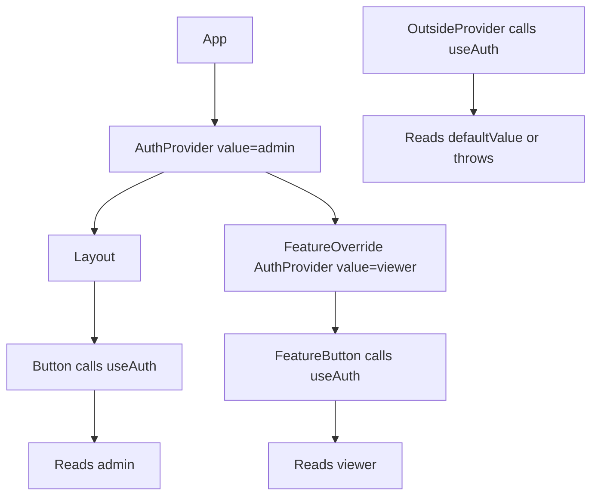

# Part 033 — Context Read Patterns

Context sering disalahpahami sebagai “state global versi React”. Cara pikir itu terlalu longgar.

Context adalah **mekanisme pembacaan dependency dari ancestor terdekat**.

Itu berarti pertanyaan utamanya bukan:

> “Data apa yang ingin saya global-kan?”

Pertanyaan yang lebih benar:

> “Dependency apa yang perlu bisa dibaca oleh subtree ini tanpa melewati setiap prop boundary?”

Kalau dependency tersebut berubah sering, perlu granular subscription, atau butuh observability seperti store, Context mungkin bukan boundary yang tepat. Kalau dependency tersebut adalah capability, konfigurasi scoped, environment, service adapter, theme, form field metadata, permission context, atau dispatch function, Context sering sangat tepat.

---

## 1. Mental Model

React membaca Context dengan cara sederhana:

```txt
component calls useContext(SomeContext)
→ React mencari provider terdekat di atas component tersebut
→ value dari provider itu menjadi hasil pembacaan
→ jika tidak ada provider, defaultValue dari createContext dipakai
```

Diagramnya:



Implikasi penting:

1. Context bukan singleton.
2. Provider bisa di-nest.
3. Subtree yang berbeda bisa melihat value berbeda untuk Context yang sama.
4. Consumer membaca provider terdekat, bukan provider “global”.
5. Default value bukan fallback dinamis; default value hanya dipakai jika tidak ada provider di atas consumer.
6. Jika value provider berubah, consumer yang membaca context tersebut bisa ikut render ulang.

---

## 2. Problem yang Diselesaikan oleh Context Read Pattern

Tanpa pattern yang disiplin, Context biasanya berubah menjadi:

```tsx
export const AppContext = createContext<any>(null);

const everything = useContext(AppContext);
```

Akibatnya:

- dependency komponen tersembunyi,
- test harus boot seluruh app,
- rerender sulit dipahami,
- type safety lemah,
- default value menipu,
- coupling antar fitur meningkat,
- migrasi ke store atau domain hook makin mahal.

Read pattern yang baik membuat Context terasa seperti **dependency contract**, bukan keranjang global.

---

## 3. Context Read Contract

Setiap Context read harus menjawab lima hal:

| Pertanyaan | Tujuan |
|---|---|
| Apa yang sedang dibaca? | Hindari context “everything bag” |
| Siapa provider-nya? | Pastikan ownership jelas |
| Apakah consumer wajib berada dalam provider? | Tentukan strict vs optional context |
| Apakah value berubah sering? | Tentukan risiko rerender |
| Apakah consumer membaca semua value atau sebagian? | Tentukan granularitas context |

Contoh Context yang baik:

```tsx
const ThemeContext = createContext<Theme | null>(null);

function useTheme(): Theme {
  const theme = useContext(ThemeContext);

  if (theme === null) {
    throw new Error("useTheme must be used within <ThemeProvider />");
  }

  return theme;
}
```

Consumer tidak membaca `ThemeContext` langsung. Consumer membaca `useTheme`.

Ini kecil, tapi sangat penting. `useTheme` menjadi API publik. `ThemeContext` adalah detail implementasi.

---

## 4. Jangan Mengekspor Context Mentah Jika Tidak Perlu

Pattern buruk:

```tsx
export const AuthContext = createContext<AuthContextValue | null>(null);
```

Lalu di mana-mana:

```tsx
const auth = useContext(AuthContext);
```

Masalah:

- setiap consumer harus tahu nullability,
- error handling tersebar,
- provider contract tidak terkapsulasi,
- mudah ada consumer membaca context yang salah,
- sulit mengubah implementasi internal nanti.

Pattern yang lebih kuat:

```tsx
const AuthContext = createContext<AuthContextValue | null>(null);

export function useAuth(): AuthContextValue {
  const value = useContext(AuthContext);

  if (value === null) {
    throw new Error("useAuth must be used within <AuthProvider />");
  }

  return value;
}

export function AuthProvider({ children }: { children: React.ReactNode }) {
  const value = useAuthProviderValue();

  return (
    <AuthContext.Provider value={value}>
      {children}
    </AuthContext.Provider>
  );
}
```

Dengan pattern ini, file lain hanya tahu:

```tsx
const auth = useAuth();
```

Bukan:

```tsx
const auth = useContext(AuthContext);
```

Ini adalah boundary.

---

## 5. Strict Context Helper

Di codebase besar, strict context akan berulang. Buat helper kecil.

```tsx
import { createContext, useContext } from "react";

export function createStrictContext<T>(name: string) {
  const Context = createContext<T | null>(null);
  Context.displayName = name;

  function useStrictContext(): T {
    const value = useContext(Context);

    if (value === null) {
      throw new Error(`${name} was read outside its provider`);
    }

    return value;
  }

  return [Context.Provider, useStrictContext] as const;
}
```

Penggunaan:

```tsx
type PermissionContextValue = {
  canApprove: boolean;
  canAssign: boolean;
  canEscalate: boolean;
};

const [PermissionProviderBase, usePermissionContext] =
  createStrictContext<PermissionContextValue>("PermissionContext");

export function PermissionProvider({
  value,
  children,
}: {
  value: PermissionContextValue;
  children: React.ReactNode;
}) {
  return (
    <PermissionProviderBase value={value}>
      {children}
    </PermissionProviderBase>
  );
}

export function usePermissions() {
  return usePermissionContext();
}
```

Benefit:

- null check konsisten,
- error message jelas,
- consumer API bersih,
- Context tidak tersebar,
- display name membantu debugging React DevTools.

---

## 6. Default Value: Berguna, tapi Berbahaya

`createContext(defaultValue)` bukan “default prop provider”. Ia hanya dipakai jika tidak ada provider di atas consumer.

Contoh berbahaya:

```tsx
const AuthContext = createContext<AuthContextValue>({
  user: null,
  login: async () => {},
  logout: async () => {},
});
```

Ini terlihat nyaman. Tapi kalau developer lupa memasang `<AuthProvider />`, aplikasi tidak crash. Lebih buruk: UI bisa diam-diam berjalan dengan user `null` dan function kosong.

Untuk dependency wajib, lebih baik gunakan `null` + strict hook.

```tsx
const AuthContext = createContext<AuthContextValue | null>(null);
```

Gunakan default value hanya saat benar-benar ada default yang valid secara domain:

```tsx
const DensityContext = createContext<"compact" | "comfortable">("comfortable");
```

Atau:

```tsx
const DirectionContext = createContext<"ltr" | "rtl">("ltr");
```

Default seperti itu masuk akal karena UI tetap valid tanpa provider.

---

## 7. Strict vs Optional Context

Tidak semua Context harus strict.

### 7.1 Strict Context

Gunakan saat consumer tidak bermakna tanpa provider.

```tsx
function useFormField() {
  const value = useContext(FormFieldContext);

  if (value === null) {
    throw new Error("useFormField must be used inside <FormField />");
  }

  return value;
}
```

Cocok untuk:

- form field context,
- compound component context,
- workflow context,
- permission context scoped,
- dependency service wajib,
- modal/overlay subtree.

### 7.2 Optional Context

Gunakan saat consumer punya perilaku valid tanpa provider.

```tsx
function useOptionalAnalytics() {
  return useContext(AnalyticsContext);
}

function SaveButton() {
  const analytics = useOptionalAnalytics();

  function handleClick() {
    analytics?.track("case_saved");
  }

  return <button onClick={handleClick}>Save</button>;
}
```

Cocok untuk:

- analytics,
- optional feature flag,
- optional telemetry,
- optional design-system environment,
- progressive enhancement.

### 7.3 Dual Hook Pattern

Kadang butuh dua mode:

```tsx
export function useOptionalDialogContext() {
  return useContext(DialogContext);
}

export function useDialogContext() {
  const value = useOptionalDialogContext();

  if (value === null) {
    throw new Error("useDialogContext must be used inside <Dialog.Root />");
  }

  return value;
}
```

Ini berguna untuk component yang bisa hidup standalone atau sebagai part dari compound component.

---

## 8. Custom Read Hook sebagai Public API

Jangan anggap custom hook hanya pembungkus `useContext`. Ia adalah tempat mendefinisikan read model.

Bad:

```tsx
const { user, session, token, refresh, logout, organization, permissions } = useAuth();
```

Better jika consumer hanya butuh permission:

```tsx
function useCanApproveCase(caseStatus: CaseStatus) {
  const { permissions } = useAuth();

  return permissions.includes("case.approve") && caseStatus === "READY_FOR_APPROVAL";
}
```

Consumer:

```tsx
const canApprove = useCanApproveCase(case.status);
```

Ini mengubah pembacaan dari data mentah menjadi domain read.

Bentuk umum:

```tsx
useAuth()
useCurrentUser()
useOrganization()
usePermission("case.approve")
useFeatureFlag("new-case-workflow")
useFormField()
useDialogState()
useTheme()
```

Semakin tinggi level hook, semakin kecil dependency mental di component.

---

## 9. Read Model Jangan Sama dengan Storage Model

Provider boleh menyimpan value yang besar. Consumer tidak harus membacanya mentah.

Misal provider menyimpan:

```tsx
type CaseWorkspaceContextValue = {
  caseId: string;
  caseRecord: CaseRecord;
  permissions: PermissionSet;
  workflow: WorkflowState;
  participants: Participant[];
  audit: AuditSummary;
};
```

Kalau semua consumer melakukan:

```tsx
const workspace = useCaseWorkspace();
```

maka setiap consumer terikat pada shape besar.

Lebih baik expose read hook spesifik:

```tsx
export function useCaseId() {
  return useCaseWorkspaceContext().caseId;
}

export function useCaseStatus() {
  return useCaseWorkspaceContext().caseRecord.status;
}

export function useCanAssignCase() {
  const { permissions, caseRecord } = useCaseWorkspaceContext();
  return permissions.can("case.assign") && caseRecord.status !== "CLOSED";
}
```

Catatan performa penting: hook di atas belum otomatis mencegah rerender jika provider value berubah. Context tetap memberi sinyal perubahan ke consumer context. Namun secara API, read hook spesifik tetap bernilai karena:

- menyembunyikan struktur internal,
- mengurangi coupling,
- memudahkan migrasi ke selector store nanti,
- membuat consumer bicara bahasa domain.

Jika granular rerender benar-benar dibutuhkan, pertimbangkan split context atau external store dengan selector.

---

## 10. Context Tidak Punya Selector Built-in

Ini salah satu batas terbesar Context.

Dengan Context:

```tsx
const value = useContext(AppContext);
```

Consumer subscribe pada **value context**, bukan field tertentu. Jika provider memberikan object baru, consumer yang membaca context itu dapat render ulang walaupun field yang dipakai tidak berubah.

Contoh:

```tsx
<AuthContext.Provider value={{ user, permissions, logout }}>
  {children}
</AuthContext.Provider>
```

Saat `permissions` berubah, component yang hanya memakai `logout` juga bisa ikut render karena object value berubah.

Solusi bertahap:

1. stabilkan value dengan `useMemo` jika object/function dibuat inline,
2. pisahkan context berdasarkan volatilitas,
3. pisahkan state context dan action context,
4. expose hook spesifik,
5. pindah ke external store jika butuh selector-level subscription.

---

## 11. Split Context by Volatility

Jangan split context hanya berdasarkan “kategori data”. Split berdasarkan **frekuensi perubahan dan pola pembacaan**.

Bad:

```tsx
type AppContextValue = {
  theme: Theme;
  user: User;
  notificationCount: number;
  liveConnectionStatus: ConnectionStatus;
  selectedRows: string[];
};
```

Masalah: value dengan frekuensi berubah sangat berbeda disatukan.

Better:

```tsx
const ThemeContext = createContext<Theme | null>(null);
const CurrentUserContext = createContext<User | null>(null);
const NotificationCountContext = createContext<number | null>(null);
const ConnectionStatusContext = createContext<ConnectionStatus | null>(null);
const SelectionContext = createContext<SelectionContextValue | null>(null);
```

Prinsip:

```txt
same lifecycle + same readership + same volatility
→ boleh satu context

different lifecycle or high-frequency updates
→ pisahkan
```

---

## 12. Read-Only Context

Context tidak harus membawa setter.

```tsx
type CurrentUserContextValue = {
  id: string;
  name: string;
  role: Role;
};

const CurrentUserContext = createContext<CurrentUserContextValue | null>(null);
```

Read-only context cocok untuk:

- current user,
- tenant/organization,
- feature flag snapshot,
- static page configuration,
- environment/capability,
- route-scoped metadata.

Kalau consumer tidak perlu update, jangan beri update capability.

Ini mengurangi accidental writes.

---

## 13. Capability Context

Capability context membawa kemampuan, bukan state mentah.

```tsx
type CaseCommandContextValue = {
  approveCase(input: ApproveCaseInput): Promise<void>;
  assignCase(input: AssignCaseInput): Promise<void>;
  escalateCase(input: EscalateCaseInput): Promise<void>;
};

const CaseCommandContext = createContext<CaseCommandContextValue | null>(null);
```

Consumer:

```tsx
function ApproveButton({ caseId }: { caseId: string }) {
  const { approveCase } = useCaseCommands();

  return (
    <button onClick={() => approveCase({ caseId })}>
      Approve
    </button>
  );
}
```

Benefit:

- component tidak tahu HTTP,
- component tidak tahu cache invalidation,
- component tidak tahu workflow detail,
- test bisa inject fake command,
- domain language lebih jelas.

Capability context sering lebih stabil daripada state context karena function identity bisa dikontrol.

---

## 14. Scoped Override Pattern

Provider terdekat menang. Itu bisa dipakai sebagai feature, bukan bug.

Contoh: halaman utama punya permission umum, tapi satu panel preview memakai permission simulasi.

```tsx
<PermissionProvider value={realPermissions}>
  <CasePage />

  <PermissionProvider value={previewPermissions}>
    <PreviewPanel />
  </PermissionProvider>
</PermissionProvider>
```

`PreviewPanel` membaca `previewPermissions`, bukan `realPermissions`.

Pattern ini berguna untuk:

- preview mode,
- impersonation,
- test harness,
- storybook scenario,
- nested theme,
- form field override,
- workflow sandbox.

Risikonya: override yang tidak terlihat bisa membingungkan. Gunakan nama provider yang eksplisit dan hindari nesting diam-diam.

---

## 15. Context Read dengan Portal

Portal memindahkan DOM node, bukan memindahkan posisi React tree.

Artinya, komponen di dalam portal masih bisa membaca Context dari React parent tree.

```tsx
function CaseModal() {
  const permissions = usePermissions();

  return createPortal(
    <ModalContent permissions={permissions} />,
    document.body
  );
}
```

Jika `<CaseModal />` berada di bawah `<PermissionProvider />`, modal content masih bisa membaca context yang sama walaupun DOM-nya muncul di `document.body`.

Ini penting untuk:

- modal,
- popover,
- tooltip,
- command palette,
- overlay manager.

Tetapi jangan campur dengan asumsi DOM ancestry. Untuk CSS, event focus, dan aria relationship, portal punya constraint sendiri.

---

## 16. Context Read di Compound Components

Compound component sering memakai strict context.

```tsx
const TabsContext = createContext<TabsContextValue | null>(null);

function useTabsContext(componentName: string) {
  const value = useContext(TabsContext);

  if (value === null) {
    throw new Error(`${componentName} must be used inside <Tabs.Root />`);
  }

  return value;
}
```

Penggunaan:

```tsx
function TabsTrigger({ value, children }: TabsTriggerProps) {
  const tabs = useTabsContext("Tabs.Trigger");

  return (
    <button
      role="tab"
      aria-selected={tabs.value === value}
      onClick={() => tabs.setValue(value)}
    >
      {children}
    </button>
  );
}
```

Error message harus menyebut component part, bukan hanya context name. Ini membuat DX jauh lebih baik.

---

## 17. Context Read dan TypeScript

Jangan gunakan non-null assertion di consumer:

```tsx
const value = useContext(AuthContext)!;
```

Itu menghapus safety tanpa memberikan runtime guard.

Lebih baik:

```tsx
function useAuth(): AuthContextValue {
  const value = useContext(AuthContext);

  if (!value) {
    throw new Error("useAuth must be used inside <AuthProvider />");
  }

  return value;
}
```

Jika value bisa valid tetapi falsy, jangan pakai `if (!value)`. Gunakan `value === null`.

```tsx
if (value === null) {
  throw new Error("...");
}
```

Ini penting untuk context value seperti:

```tsx
0
false
""
```

---

## 18. Narrowing Hook

Narrowing hook mengubah context besar menjadi contract kecil.

```tsx
function useRequiredPermission(permission: Permission) {
  const permissions = usePermissions();

  if (!permissions.has(permission)) {
    throw new Error(`Missing permission: ${permission}`);
  }

  return true;
}
```

Atau:

```tsx
function useCaseWorkflowStatus() {
  const { workflow } = useCaseWorkspace();
  return workflow.status;
}
```

Narrowing hook bisa menjadi seam untuk refactor.

Hari ini:

```tsx
function useCaseWorkflowStatus() {
  return useCaseWorkspace().workflow.status;
}
```

Besok:

```tsx
function useCaseWorkflowStatus() {
  return useCaseWorkflowStore((state) => state.status);
}
```

Consumer tidak berubah.

---

## 19. Context Read untuk Dependency Injection

Contoh service injection:

```tsx
type ApiClient = {
  getCase(caseId: string): Promise<CaseRecord>;
  approveCase(caseId: string): Promise<void>;
};

const ApiClientContext = createContext<ApiClient | null>(null);

export function useApiClient() {
  const client = useContext(ApiClientContext);

  if (client === null) {
    throw new Error("useApiClient must be used inside <ApiClientProvider />");
  }

  return client;
}
```

Consumer:

```tsx
function useCaseLoader(caseId: string) {
  const api = useApiClient();

  // query library integration, effect integration, or action integration
}
```

Ini memisahkan app dari implementasi API client.

Namun hati-hati: service object sebaiknya stabil. Jangan buat object baru setiap render provider jika tidak perlu.

```tsx
function ApiClientProvider({ children }: { children: React.ReactNode }) {
  const client = useMemo(() => createApiClient(), []);

  return (
    <ApiClientContext.Provider value={client}>
      {children}
    </ApiClientContext.Provider>
  );
}
```

---

## 20. Testing Context Read

### 20.1 Provider Harness

Buat wrapper test khusus.

```tsx
function renderWithPermissions(
  ui: React.ReactElement,
  permissions: PermissionContextValue
) {
  return render(
    <PermissionProvider value={permissions}>
      {ui}
    </PermissionProvider>
  );
}
```

Test:

```tsx
it("hides approve button when user cannot approve", () => {
  renderWithPermissions(<ApproveButton />, {
    canApprove: false,
    canAssign: true,
    canEscalate: false,
  });

  expect(screen.queryByRole("button", { name: /approve/i })).not.toBeInTheDocument();
});
```

### 20.2 Strict Context Error Test

Pastikan provider wajib benar-benar wajib.

```tsx
it("throws when used outside provider", () => {
  expect(() => render(<ApproveButton />)).toThrow(
    "usePermissions must be used within <PermissionProvider />"
  );
});
```

Ini test kecil, tapi menyelamatkan banyak bug integrasi.

### 20.3 Override Test

```tsx
it("uses nearest provider", () => {
  render(
    <PermissionProvider value={adminPermissions}>
      <PermissionProvider value={viewerPermissions}>
        <ApproveButton />
      </PermissionProvider>
    </PermissionProvider>
  );

  expect(screen.queryByRole("button", { name: /approve/i })).not.toBeInTheDocument();
});
```

---

## 21. Decision Matrix

| Situation | Pattern |
|---|---|
| Consumer wajib punya provider | Strict context hook |
| Consumer valid tanpa provider | Optional context hook |
| Context dipakai di banyak file | Jangan export context mentah |
| Value object besar | Expose domain read hooks |
| Value sering berubah | Split context atau external store |
| Consumer butuh hanya command | Command/capability context |
| Banyak nested override valid | Scoped provider pattern |
| Compound component | Strict internal context |
| Design system primitive | Context + slot/compound API |
| Testing banyak scenario | Provider harness |

---

## 22. Failure Modes

### 22.1 Silent Default

Gejala:

```tsx
const AuthContext = createContext(fakeAuth);
```

Provider lupa dipasang, app tetap berjalan dengan fake auth.

Fix:

```tsx
createContext<AuthContextValue | null>(null)
```

lalu strict hook.

---

### 22.2 Context Everything Bag

Gejala:

```tsx
const app = useAppContext();
```

dipakai di ratusan component.

Masalah:

- dependency tidak terlihat,
- perubahan shape merusak banyak consumer,
- rerender propagation luas,
- test berat.

Fix:

- pecah by domain/lifecycle/volatility,
- expose read hook spesifik,
- pertimbangkan external store.

---

### 22.3 Direct Context Import Everywhere

Gejala:

```tsx
import { AuthContext } from "@/contexts/AuthContext";
```

di banyak component.

Fix:

```tsx
import { useAuth } from "@/auth/useAuth";
```

Export hook, bukan context.

---

### 22.4 Optional Context Dipakai untuk Dependency Wajib

Gejala:

```tsx
const form = useContext(FormContext);

form?.setValue(name, value);
```

Jika provider hilang, input tampak hidup tapi tidak update form.

Fix: strict form context.

---

### 22.5 Provider Value Tidak Stabil

Gejala:

```tsx
<AuthContext.Provider value={{ user, logout }}>
```

Setiap render parent membuat object baru.

Fix:

```tsx
const value = useMemo(() => ({ user, logout }), [user, logout]);
```

Namun jangan gunakan `useMemo` sebagai penutup desain buruk. Jika value berubah sangat sering dan consumer banyak, split context atau store mungkin lebih benar.

---

### 22.6 Read Hook Mengembalikan Terlalu Banyak

Gejala:

```tsx
const workspace = useCaseWorkspace();
```

component hanya butuh `workspace.caseRecord.status`.

Fix:

```tsx
const status = useCaseStatus();
```

---

### 22.7 Hidden Override

Gejala:

```tsx
<PermissionProvider value={a}>
  ...
  <PermissionProvider value={b}>
    ...
  </PermissionProvider>
</PermissionProvider>
```

Consumer membaca provider terdekat, tapi developer mengira membaca provider atas.

Fix:

- nama provider spesifik,
- batasi nested override,
- test scenario override,
- dokumentasikan override sebagai feature.

---

## 23. Refactor Recipe: Dari Raw Context ke Read Pattern

Sebelum:

```tsx
export const CaseContext = createContext<any>(null);

function ApproveButton() {
  const context = useContext(CaseContext);

  return (
    <button disabled={!context.permissions.approve}>
      Approve
    </button>
  );
}
```

Sesudah:

```tsx
const CaseContext = createContext<CaseContextValue | null>(null);

export function useCaseContext() {
  const value = useContext(CaseContext);

  if (value === null) {
    throw new Error("useCaseContext must be used inside <CaseProvider />");
  }

  return value;
}

export function useCanApproveCase() {
  const { caseRecord, permissions } = useCaseContext();

  return permissions.has("case.approve") && caseRecord.status === "READY_FOR_APPROVAL";
}

function ApproveButton() {
  const canApprove = useCanApproveCase();

  return (
    <button disabled={!canApprove}>
      Approve
    </button>
  );
}
```

Ini belum menyelesaikan semua isu performa, tapi menyelesaikan isu **coupling dan domain readability**.

---

## 24. Review Checklist

Sebelum membuat atau membaca Context, cek:

```txt
[ ] Apakah Context ini benar-benar dependency scoped?
[ ] Apakah provider wajib? Jika ya, apakah strict hook dipakai?
[ ] Apakah default value valid secara domain?
[ ] Apakah Context mentah disembunyikan?
[ ] Apakah consumer membaca hook domain, bukan object besar?
[ ] Apakah value sering berubah?
[ ] Apakah context perlu di-split?
[ ] Apakah command dan state sebaiknya dipisah?
[ ] Apakah provider override memang fitur yang disengaja?
[ ] Apakah testing harness tersedia?
```

---

## 25. Latihan Implementasi

Bangun `CaseWorkspaceProvider` dengan requirement:

1. `CaseWorkspaceContext` tidak diekspor mentah.
2. `useCaseWorkspace()` strict.
3. `useCaseId()` mengembalikan id.
4. `useCaseStatus()` mengembalikan status.
5. `useCanApproveCase()` mengembalikan boolean berdasarkan permission dan status.
6. Test consumer yang dipanggil di luar provider harus throw.
7. Test nested provider harus membaca provider terdekat.
8. Tambahkan `CaseCommandContext` terpisah untuk `approveCase`.

Target bukan membuat “global context”. Targetnya adalah membangun **scoped workspace dependency boundary**.

---

## 26. Ringkasan

Context read pattern yang kuat punya lima prinsip:

```txt
1. Context adalah dependency reader, bukan global state default.
2. Export custom hook, bukan context mentah.
3. Gunakan strict context untuk dependency wajib.
4. Expose domain read hook, bukan storage model.
5. Pisahkan context berdasarkan lifecycle, readership, dan volatility.
```

Context yang baik membuat subtree lebih mandiri. Context yang buruk membuat dependency tersembunyi dan rerender sulit dikendalikan.

Di part berikutnya, kita akan membahas update pattern: bagaimana menulis Context yang bukan hanya bisa dibaca, tetapi juga bisa mengubah state tanpa menghancurkan boundary, performance, dan invariant.
