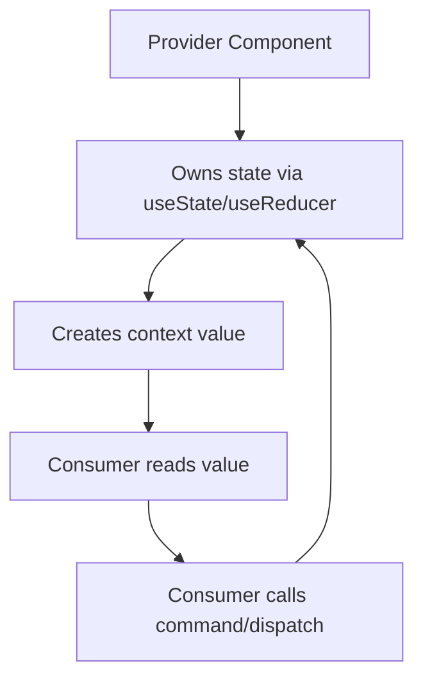
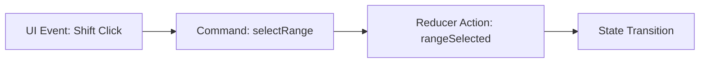
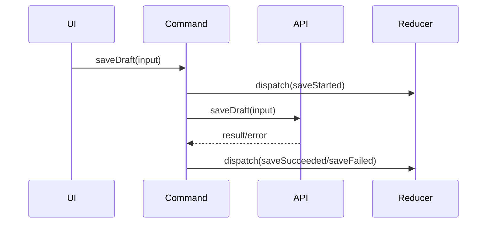
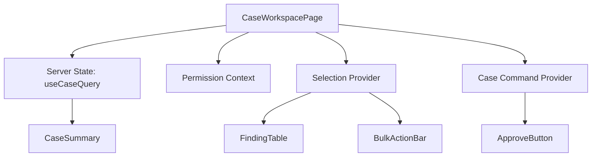

# Part 034 — Context Update Patterns

Part sebelumnya membahas cara membaca Context dengan aman. Sekarang kita masuk ke sisi yang lebih rawan: **mengubah state melalui Context**.

Kesalahan umum:

```tsx
const AppContext = createContext({
  state: {},
  setState: () => {},
});
```

Lalu semua component boleh membaca dan mengubah semuanya.

Itu bukan architecture. Itu global mutable object yang kebetulan dibungkus React.

Context update pattern yang benar harus menjawab:

```txt
Siapa pemilik state?
Siapa boleh mengirim event?
Apakah consumer boleh tahu bentuk storage?
Apakah update harus imperative command atau reducer action?
Apakah update local, shared, server, URL, atau workflow?
Apa invariant yang harus dijaga?
Apa dampak rerender saat value berubah?
```

---

## 1. Mental Model Update Context

Context sendiri tidak “mengelola state”. Context hanya menyebarkan value.

State tetap berasal dari:

- `useState`,
- `useReducer`,
- external store,
- server cache,
- parent props,
- route state,
- framework/router,
- machine/actor.

Provider biasanya menjadi bridge:



Jika provider value berubah, React memberitahu consumer context tersebut. Maka desain update Context selalu berhubungan dengan desain rerender.

---

## 2. Pattern 1 — State + Setter Context

Pattern paling sederhana:

```tsx
type SidebarContextValue = {
  isOpen: boolean;
  setOpen(next: boolean): void;
};

const SidebarContext = createContext<SidebarContextValue | null>(null);

function SidebarProvider({ children }: { children: React.ReactNode }) {
  const [isOpen, setOpen] = useState(false);

  const value = useMemo(
    () => ({ isOpen, setOpen }),
    [isOpen]
  );

  return (
    <SidebarContext.Provider value={value}>
      {children}
    </SidebarContext.Provider>
  );
}
```

Consumer:

```tsx
function SidebarToggle() {
  const { isOpen, setOpen } = useSidebar();

  return (
    <button onClick={() => setOpen(!isOpen)}>
      {isOpen ? "Close" : "Open"}
    </button>
  );
}
```

Cocok untuk:

- boolean sederhana,
- UI shell state,
- low-frequency state,
- subtree kecil,
- invariant ringan.

Kelemahan:

- setter terlalu primitive,
- consumer bisa membuat transisi ilegal,
- banyak consumer bisa menulis state secara tidak terkoordinasi,
- event domain tidak terdokumentasi,
- stale closure mudah muncul jika memakai `setOpen(!isOpen)` di banyak tempat.

Lebih aman:

```tsx
setOpen((current) => !current);
```

Atau expose command:

```tsx
type SidebarContextValue = {
  isOpen: boolean;
  open(): void;
  close(): void;
  toggle(): void;
};
```

---

## 3. Pattern 2 — State + Domain Commands

Daripada mengekspos setter mentah, expose command berbasis intent.

```tsx
type SidebarContextValue = {
  isOpen: boolean;
  openSidebar(): void;
  closeSidebar(): void;
  toggleSidebar(): void;
};

function SidebarProvider({ children }: { children: React.ReactNode }) {
  const [isOpen, setOpen] = useState(false);

  const openSidebar = useCallback(() => setOpen(true), []);
  const closeSidebar = useCallback(() => setOpen(false), []);
  const toggleSidebar = useCallback(() => {
    setOpen((current) => !current);
  }, []);

  const value = useMemo(
    () => ({
      isOpen,
      openSidebar,
      closeSidebar,
      toggleSidebar,
    }),
    [isOpen, openSidebar, closeSidebar, toggleSidebar]
  );

  return <SidebarContext.Provider value={value}>{children}</SidebarContext.Provider>;
}
```

Command lebih baik daripada setter karena:

- consumer bicara intent,
- provider menjaga implementasi,
- transisi bisa divalidasi,
- refactor ke reducer lebih mudah,
- logging/analytics bisa ditambahkan di satu tempat.

Contoh command dengan guard:

```tsx
const closeSidebar = useCallback(() => {
  setOpen((current) => {
    if (!current) return current;
    return false;
  });
}, []);
```

---

## 4. Pattern 3 — Reducer Context

Jika state punya banyak event dan invariant, gunakan reducer.

```tsx
type CaseSelectionState = {
  selectedIds: string[];
  anchorId: string | null;
};

type CaseSelectionAction =
  | { type: "selected"; id: string }
  | { type: "deselected"; id: string }
  | { type: "cleared" }
  | { type: "rangeSelected"; fromId: string; toId: string; visibleIds: string[] };

function caseSelectionReducer(
  state: CaseSelectionState,
  action: CaseSelectionAction
): CaseSelectionState {
  switch (action.type) {
    case "selected":
      if (state.selectedIds.includes(action.id)) {
        return state;
      }

      return {
        ...state,
        selectedIds: [...state.selectedIds, action.id],
        anchorId: action.id,
      };

    case "deselected":
      return {
        ...state,
        selectedIds: state.selectedIds.filter((id) => id !== action.id),
        anchorId: state.anchorId === action.id ? null : state.anchorId,
      };

    case "cleared":
      return {
        selectedIds: [],
        anchorId: null,
      };

    case "rangeSelected": {
      const fromIndex = action.visibleIds.indexOf(action.fromId);
      const toIndex = action.visibleIds.indexOf(action.toId);

      if (fromIndex === -1 || toIndex === -1) {
        return state;
      }

      const [start, end] =
        fromIndex < toIndex ? [fromIndex, toIndex] : [toIndex, fromIndex];

      const ids = action.visibleIds.slice(start, end + 1);
      const selected = new Set([...state.selectedIds, ...ids]);

      return {
        selectedIds: [...selected],
        anchorId: action.toId,
      };
    }

    default:
      return assertNever(action);
  }
}

function assertNever(value: never): never {
  throw new Error(`Unhandled action: ${JSON.stringify(value)}`);
}
```

Provider:

```tsx
type CaseSelectionContextValue = {
  state: CaseSelectionState;
  dispatch: React.Dispatch<CaseSelectionAction>;
};

const CaseSelectionContext =
  createContext<CaseSelectionContextValue | null>(null);

function CaseSelectionProvider({ children }: { children: React.ReactNode }) {
  const [state, dispatch] = useReducer(caseSelectionReducer, {
    selectedIds: [],
    anchorId: null,
  });

  const value = useMemo(() => ({ state, dispatch }), [state]);

  return (
    <CaseSelectionContext.Provider value={value}>
      {children}
    </CaseSelectionContext.Provider>
  );
}
```

Cocok untuk:

- multi-step UI,
- selection state,
- wizard state,
- form interaction state,
- local workflow,
- state dengan invariant eksplisit.

---

## 5. Problem Reducer Context Naif

Provider di atas memberikan object `{ state, dispatch }`.

Masalahnya: saat `state` berubah, object value berubah. Consumer yang hanya butuh `dispatch` juga bisa ikut render.

Contoh:

```tsx
function SelectAllToolbarButton() {
  const { dispatch } = useCaseSelection();

  return (
    <button onClick={() => dispatch({ type: "cleared" })}>
      Clear
    </button>
  );
}
```

Component ini tidak membaca `state`, tapi subscribe ke context yang value-nya berubah setiap state berubah.

Solusinya: split state context dan dispatch context.

---

## 6. Pattern 4 — Split State and Dispatch Context

```tsx
const CaseSelectionStateContext =
  createContext<CaseSelectionState | null>(null);

const CaseSelectionDispatchContext =
  createContext<React.Dispatch<CaseSelectionAction> | null>(null);

export function CaseSelectionProvider({
  children,
}: {
  children: React.ReactNode;
}) {
  const [state, dispatch] = useReducer(caseSelectionReducer, {
    selectedIds: [],
    anchorId: null,
  });

  return (
    <CaseSelectionDispatchContext.Provider value={dispatch}>
      <CaseSelectionStateContext.Provider value={state}>
        {children}
      </CaseSelectionStateContext.Provider>
    </CaseSelectionDispatchContext.Provider>
  );
}
```

Hooks:

```tsx
export function useCaseSelectionState() {
  const state = useContext(CaseSelectionStateContext);

  if (state === null) {
    throw new Error("useCaseSelectionState must be used inside <CaseSelectionProvider />");
  }

  return state;
}

export function useCaseSelectionDispatch() {
  const dispatch = useContext(CaseSelectionDispatchContext);

  if (dispatch === null) {
    throw new Error("useCaseSelectionDispatch must be used inside <CaseSelectionProvider />");
  }

  return dispatch;
}
```

Benefit:

- components yang hanya dispatch tidak subscribe ke state changes,
- action sender lebih murah,
- read/write dependency lebih eksplisit.

Catatan: `dispatch` dari `useReducer` stabil identitasnya. Ini membuat dispatch context sangat cocok untuk dipisah.

---

## 7. Pattern 5 — State Context + Command Context

Dispatch action kadang terlalu rendah level untuk UI consumer. Kita bisa expose command.

```tsx
type CaseSelectionCommands = {
  select(id: string): void;
  deselect(id: string): void;
  clear(): void;
  selectRange(input: {
    fromId: string;
    toId: string;
    visibleIds: string[];
  }): void;
};

const CaseSelectionCommandContext =
  createContext<CaseSelectionCommands | null>(null);

function CaseSelectionProvider({ children }: { children: React.ReactNode }) {
  const [state, dispatch] = useReducer(caseSelectionReducer, initialState);

  const commands = useMemo<CaseSelectionCommands>(
    () => ({
      select(id) {
        dispatch({ type: "selected", id });
      },
      deselect(id) {
        dispatch({ type: "deselected", id });
      },
      clear() {
        dispatch({ type: "cleared" });
      },
      selectRange(input) {
        dispatch({ type: "rangeSelected", ...input });
      },
    }),
    [dispatch]
  );

  return (
    <CaseSelectionCommandContext.Provider value={commands}>
      <CaseSelectionStateContext.Provider value={state}>
        {children}
      </CaseSelectionStateContext.Provider>
    </CaseSelectionCommandContext.Provider>
  );
}
```

Consumer:

```tsx
function ClearSelectionButton() {
  const { clear } = useCaseSelectionCommands();

  return <button onClick={clear}>Clear</button>;
}
```

Command context cocok saat:

- event/action name internal berbeda dari UI intent,
- command perlu analytics/logging,
- command perlu validasi,
- command perlu compose beberapa dispatch,
- command mungkin pindah ke external store nanti.

---

## 8. Reducer Action vs Command

Jangan campur dua level ini.

Reducer action adalah event/state transition internal:

```tsx
{ type: "rangeSelected", fromId, toId, visibleIds }
```

Command adalah capability yang dipanggil UI:

```tsx
selection.selectRange({ fromId, toId, visibleIds });
```

Mapping:



Kenapa dipisah?

- UI tidak perlu tahu action union,
- reducer tetap deterministic,
- command bisa punya dependency,
- command bisa memutuskan apakah dispatch diperlukan,
- action tetap serializable dan testable.

---

## 9. Pattern 6 — Controlled Provider

Kadang provider tidak boleh menjadi owner state. Ia hanya menyebarkan state dari parent.

```tsx
type CaseSelectionProviderProps = {
  selectedIds: string[];
  onSelectedIdsChange(next: string[]): void;
  children: React.ReactNode;
};

function CaseSelectionProvider({
  selectedIds,
  onSelectedIdsChange,
  children,
}: CaseSelectionProviderProps) {
  const commands = useMemo(
    () => ({
      select(id: string) {
        if (selectedIds.includes(id)) return;
        onSelectedIdsChange([...selectedIds, id]);
      },
      clear() {
        onSelectedIdsChange([]);
      },
    }),
    [selectedIds, onSelectedIdsChange]
  );

  const state = useMemo(
    () => ({ selectedIds }),
    [selectedIds]
  );

  return (
    <CaseSelectionCommandContext.Provider value={commands}>
      <CaseSelectionStateContext.Provider value={state}>
        {children}
      </CaseSelectionStateContext.Provider>
    </CaseSelectionCommandContext.Provider>
  );
}
```

Cocok saat:

- state harus sinkron dengan URL,
- parent/route owner state,
- server data menentukan selection,
- workflow engine owner state,
- component library primitive butuh controllable provider.

Risiko:

- parent callback harus stabil,
- update bisa race jika parent state berasal dari sumber async,
- provider tidak boleh menyimpan shadow state yang bertentangan.

---

## 10. Pattern 7 — Controllable Provider

Provider bisa mendukung controlled dan uncontrolled mode.

```tsx
type ControllableSelectionProviderProps = {
  selectedIds?: string[];
  defaultSelectedIds?: string[];
  onSelectedIdsChange?(next: string[]): void;
  children: React.ReactNode;
};

function ControllableSelectionProvider({
  selectedIds,
  defaultSelectedIds = [],
  onSelectedIdsChange,
  children,
}: ControllableSelectionProviderProps) {
  const [internalSelectedIds, setInternalSelectedIds] =
    useState(defaultSelectedIds);

  const isControlled = selectedIds !== undefined;
  const currentSelectedIds = isControlled ? selectedIds : internalSelectedIds;

  const setSelectedIds = useCallback(
    (next: string[]) => {
      if (!isControlled) {
        setInternalSelectedIds(next);
      }

      onSelectedIdsChange?.(next);
    },
    [isControlled, onSelectedIdsChange]
  );

  const commands = useMemo(
    () => ({
      select(id: string) {
        if (currentSelectedIds.includes(id)) return;
        setSelectedIds([...currentSelectedIds, id]);
      },
      clear() {
        setSelectedIds([]);
      },
    }),
    [currentSelectedIds, setSelectedIds]
  );

  return (
    <CaseSelectionCommandContext.Provider value={commands}>
      <CaseSelectionStateContext.Provider value={{ selectedIds: currentSelectedIds }}>
        {children}
      </CaseSelectionStateContext.Provider>
    </CaseSelectionCommandContext.Provider>
  );
}
```

Ini pattern design-system yang kuat, tapi harus punya aturan:

```txt
- controlled mode: selectedIds menjadi source of truth
- uncontrolled mode: internal state menjadi source of truth
- jangan switch controlled/uncontrolled selama lifecycle jika tidak sengaja
- onChange adalah notification, bukan source of truth
```

---

## 11. Pattern 8 — Update Context sebagai Capability, State dari Server Cache

Tidak semua update context harus mengubah local state. Kadang update berarti menjalankan command ke server/cache.

```tsx
type CaseCommands = {
  approveCase(caseId: string): Promise<void>;
  assignCase(caseId: string, assigneeId: string): Promise<void>;
};

const CaseCommandContext = createContext<CaseCommands | null>(null);
```

Provider:

```tsx
function CaseCommandProvider({ children }: { children: React.ReactNode }) {
  const queryClient = useQueryClient();
  const api = useApiClient();

  const commands = useMemo<CaseCommands>(
    () => ({
      async approveCase(caseId) {
        await api.approveCase(caseId);
        await queryClient.invalidateQueries({ queryKey: ["case", caseId] });
      },
      async assignCase(caseId, assigneeId) {
        await api.assignCase(caseId, assigneeId);
        await queryClient.invalidateQueries({ queryKey: ["case", caseId] });
      },
    }),
    [api, queryClient]
  );

  return (
    <CaseCommandContext.Provider value={commands}>
      {children}
    </CaseCommandContext.Provider>
  );
}
```

Consumer tidak tahu:

- endpoint,
- cache key,
- invalidation,
- optimistic update,
- retry policy.

Ia hanya tahu command domain.

Ini sering lebih baik daripada menyimpan server data di Context.

---

## 12. Async Boundary: Jangan Taruh Async di Reducer

Reducer harus pure.

Bad:

```tsx
async function reducer(state, action) {
  const result = await api.save(action.payload);
  return { ...state, result };
}
```

Reducer tidak boleh melakukan async work, mutation, logging side effect, fetch, atau random value.

Correct:

```tsx
async function saveDraft(input: DraftInput) {
  dispatch({ type: "saveStarted" });

  try {
    const result = await api.saveDraft(input);
    dispatch({ type: "saveSucceeded", result });
  } catch (error) {
    dispatch({ type: "saveFailed", error });
  }
}
```

Flow:



Command owns async. Reducer owns transition.

---

## 13. Update Invariants

Setiap update Context harus punya invariant.

Contoh selection invariant:

```txt
- selectedIds tidak boleh duplicate
- anchorId harus null atau salah satu visible/selected id
- clear harus menghapus selectedIds dan anchorId
- range selection harus mengabaikan id yang tidak visible
```

Reducer membuat invariant eksplisit.

Setter mentah membuat invariant tersebar.

Bad:

```tsx
setSelectedIds([...selectedIds, id]);
```

Good:

```tsx
dispatch({ type: "selected", id });
```

Better untuk consumer:

```tsx
selection.select(id);
```

---

## 14. Optimistic Context Update

Kadang Context dipakai untuk optimistic local state sebelum server confirm.

Contoh:

```tsx
type SaveState =
  | { tag: "idle" }
  | { tag: "saving"; draftId: string }
  | { tag: "saved"; savedAt: Date }
  | { tag: "failed"; error: string; draft: Draft };

type SaveAction =
  | { type: "saveRequested"; draftId: string }
  | { type: "saveSucceeded"; savedAt: Date }
  | { type: "saveFailed"; error: string; draft: Draft };
```

Command:

```tsx
async function saveDraft(draft: Draft) {
  dispatch({ type: "saveRequested", draftId: draft.id });

  try {
    await api.saveDraft(draft);
    dispatch({ type: "saveSucceeded", savedAt: new Date() });
  } catch (error) {
    dispatch({
      type: "saveFailed",
      error: toErrorMessage(error),
      draft,
    });
  }
}
```

Jangan hanya pakai boolean:

```tsx
const [isSaving, setSaving] = useState(false);
const [error, setError] = useState(null);
```

Untuk workflow async, boolean terpisah mudah menciptakan impossible states:

```txt
isSaving=true + error exists + savedAt exists
```

Gunakan tagged union/state machine style.

---

## 15. Context Update dan Event Handler

Consumer biasanya mengirim update dari event handler.

```tsx
function ApproveButton({ caseId }: { caseId: string }) {
  const { approveCase } = useCaseCommands();

  return (
    <button onClick={() => approveCase(caseId)}>
      Approve
    </button>
  );
}
```

Jangan mengirim update saat render.

Bad:

```tsx
function ApproveButton({ caseId, autoApprove }: Props) {
  const { approveCase } = useCaseCommands();

  if (autoApprove) {
    approveCase(caseId);
  }

  return <button>Approve</button>;
}
```

Render harus pure. Update harus terjadi di event, effect yang valid, action, atau external callback.

Jika perlu auto-run karena sinkronisasi external condition, evaluasi apakah itu benar-benar effect. Banyak kasus “auto update” sebenarnya sebaiknya menjadi responsibility parent/router/workflow, bukan render child.

---

## 16. Context Update dan Function Identity

Provider value sering seperti ini:

```tsx
const value = {
  state,
  saveDraft,
  approveCase,
  rejectCase,
};
```

Setiap render membuat object baru. Ini bisa memicu consumer context.

Gunakan `useMemo` dan `useCallback` untuk stabilitas identity ketika relevan.

```tsx
const saveDraft = useCallback(async (draft: Draft) => {
  // ...
}, [api]);

const value = useMemo(
  () => ({
    state,
    saveDraft,
  }),
  [state, saveDraft]
);
```

Namun jangan overfit. Jika context state berubah setiap keypress dan ratusan consumer subscribe, `useMemo` tidak menyelesaikan root problem. Root problem adalah provider value terlalu luas atau state terlalu volatile untuk Context.

---

## 17. Context Update Performance Ladder

Ketika Context update menyebabkan rerender terlalu luas, lakukan dari yang paling murah:

```txt
1. Pastikan provider tidak membuat value object/function baru tanpa perlu.
2. Split state context dan command/dispatch context.
3. Split context berdasarkan volatility dan readership.
4. Pindahkan high-frequency state lebih dekat ke owner.
5. Gunakan external store dengan selector subscription.
6. Gunakan server cache untuk server state, bukan Context.
7. Gunakan state machine/actor untuk workflow yang kompleks.
```

Jangan langsung lompat ke global store. Banyak masalah selesai dengan ownership dan context splitting.

---

## 18. Case Study: Case Workspace Context

Kita bangun mini architecture untuk halaman regulatory case.

### 18.1 Requirements

```txt
- Page menampilkan case detail.
- User bisa select related findings.
- User bisa approve case jika permission dan status valid.
- Selection state local ke page.
- Case data berasal dari server cache, bukan Context.
- Commands approval harus menyembunyikan API/cache detail.
```

### 18.2 State Boundary



Context yang dipakai:

```txt
PermissionContext       -> read-only/capability
CaseSelectionContext    -> local UI state
CaseCommandContext      -> async domain command
Server cache            -> case data owner
```

Kita tidak membuat `CaseWorkspaceEverythingContext`.

---

### 18.3 Selection Provider

```tsx
type SelectionState = {
  selectedFindingIds: string[];
};

type SelectionAction =
  | { type: "findingSelected"; id: string }
  | { type: "findingDeselected"; id: string }
  | { type: "selectionCleared" };

function selectionReducer(
  state: SelectionState,
  action: SelectionAction
): SelectionState {
  switch (action.type) {
    case "findingSelected":
      if (state.selectedFindingIds.includes(action.id)) {
        return state;
      }

      return {
        selectedFindingIds: [...state.selectedFindingIds, action.id],
      };

    case "findingDeselected":
      return {
        selectedFindingIds: state.selectedFindingIds.filter(
          (id) => id !== action.id
        ),
      };

    case "selectionCleared":
      return { selectedFindingIds: [] };

    default:
      return assertNever(action);
  }
}
```

Provider:

```tsx
const SelectionStateContext = createContext<SelectionState | null>(null);
const SelectionCommandContext = createContext<SelectionCommands | null>(null);

type SelectionCommands = {
  selectFinding(id: string): void;
  deselectFinding(id: string): void;
  clearSelection(): void;
};

function FindingSelectionProvider({ children }: { children: React.ReactNode }) {
  const [state, dispatch] = useReducer(selectionReducer, {
    selectedFindingIds: [],
  });

  const commands = useMemo<SelectionCommands>(
    () => ({
      selectFinding(id) {
        dispatch({ type: "findingSelected", id });
      },
      deselectFinding(id) {
        dispatch({ type: "findingDeselected", id });
      },
      clearSelection() {
        dispatch({ type: "selectionCleared" });
      },
    }),
    []
  );

  return (
    <SelectionCommandContext.Provider value={commands}>
      <SelectionStateContext.Provider value={state}>
        {children}
      </SelectionStateContext.Provider>
    </SelectionCommandContext.Provider>
  );
}
```

Read hooks:

```tsx
function useFindingSelectionState() {
  const state = useContext(SelectionStateContext);

  if (state === null) {
    throw new Error(
      "useFindingSelectionState must be used inside <FindingSelectionProvider />"
    );
  }

  return state;
}

function useFindingSelectionCommands() {
  const commands = useContext(SelectionCommandContext);

  if (commands === null) {
    throw new Error(
      "useFindingSelectionCommands must be used inside <FindingSelectionProvider />"
    );
  }

  return commands;
}
```

Domain read hook:

```tsx
function useIsFindingSelected(id: string) {
  const { selectedFindingIds } = useFindingSelectionState();
  return selectedFindingIds.includes(id);
}
```

Caveat: this still rerenders when selection state changes. For very large tables, move selection into external store with selector. For moderate page-local state, this is fine.

---

### 18.4 Command Provider

```tsx
type CaseCommands = {
  approveCase(caseId: string): Promise<void>;
};

const CaseCommandContext = createContext<CaseCommands | null>(null);

function CaseCommandProvider({ children }: { children: React.ReactNode }) {
  const api = useApiClient();
  const queryClient = useQueryClient();

  const commands = useMemo<CaseCommands>(
    () => ({
      async approveCase(caseId) {
        await api.approveCase(caseId);
        await queryClient.invalidateQueries({ queryKey: ["case", caseId] });
      },
    }),
    [api, queryClient]
  );

  return (
    <CaseCommandContext.Provider value={commands}>
      {children}
    </CaseCommandContext.Provider>
  );
}

function useCaseCommands() {
  const commands = useContext(CaseCommandContext);

  if (commands === null) {
    throw new Error("useCaseCommands must be used inside <CaseCommandProvider />");
  }

  return commands;
}
```

Consumer:

```tsx
function ApproveCaseButton({ caseId, status }: { caseId: string; status: CaseStatus }) {
  const { approveCase } = useCaseCommands();
  const canApprove = useCanApproveCase(status);

  return (
    <button
      disabled={!canApprove}
      onClick={() => approveCase(caseId)}
    >
      Approve
    </button>
  );
}
```

---

## 19. Testing Context Update

### 19.1 Reducer Unit Test

```tsx
it("does not duplicate selected ids", () => {
  const state = { selectedFindingIds: ["f-1"] };

  const next = selectionReducer(state, {
    type: "findingSelected",
    id: "f-1",
  });

  expect(next).toEqual(state);
});
```

### 19.2 Command Hook Test via Consumer

```tsx
function TestConsumer() {
  const { selectFinding } = useFindingSelectionCommands();
  const { selectedFindingIds } = useFindingSelectionState();

  return (
    <>
      <button onClick={() => selectFinding("f-1")}>Select</button>
      <output>{selectedFindingIds.join(",")}</output>
    </>
  );
}

it("selects finding through command context", async () => {
  render(
    <FindingSelectionProvider>
      <TestConsumer />
    </FindingSelectionProvider>
  );

  await userEvent.click(screen.getByRole("button", { name: /select/i }));

  expect(screen.getByText("f-1")).toBeInTheDocument();
});
```

### 19.3 Async Command Test

```tsx
it("approves case and invalidates query", async () => {
  const api = {
    approveCase: vi.fn().mockResolvedValue(undefined),
  };

  const queryClient = {
    invalidateQueries: vi.fn().mockResolvedValue(undefined),
  };

  render(
    <ApiClientProvider value={api}>
      <QueryClientProvider value={queryClient}>
        <CaseCommandProvider>
          <ApproveCaseButton caseId="case-1" status="READY_FOR_APPROVAL" />
        </CaseCommandProvider>
      </QueryClientProvider>
    </ApiClientProvider>
  );

  await userEvent.click(screen.getByRole("button", { name: /approve/i }));

  expect(api.approveCase).toHaveBeenCalledWith("case-1");
  expect(queryClient.invalidateQueries).toHaveBeenCalledWith({
    queryKey: ["case", "case-1"],
  });
});
```

---

## 20. Failure Modes

### 20.1 Global Setter Context

Gejala:

```tsx
const { setAppState } = useAppContext();
```

Semua component bisa mengubah semua state.

Dampak:

- invariant rusak,
- debugging sulit,
- event domain hilang,
- update source tidak terlacak.

Fix:

- expose command,
- gunakan reducer,
- split provider by ownership.

---

### 20.2 Context as Server Cache

Gejala:

```tsx
const CaseContext = createContext({
  case: null,
  setCase: () => {},
});
```

Lalu fetch, refresh, invalidation, retry, stale state, pagination, optimistic update ditangani manual.

Fix:

- server state ke query/cache library,
- Context untuk command/capability atau scoped metadata,
- jangan duplikasi server cache di Context.

---

### 20.3 State and Dispatch in Same Context

Gejala:

```tsx
const { dispatch } = useContext(StoreContext);
```

dispatch-only component rerender saat state berubah.

Fix:

- split state context dan dispatch/command context.

---

### 20.4 Reducer Menjadi Tempat Side Effect

Gejala:

```tsx
case "save":
  localStorage.setItem("draft", JSON.stringify(state));
  return state;
```

Fix:

- reducer pure,
- side effect di command/effect layer,
- reducer hanya transition.

---

### 20.5 Action Union Bocor ke UI

Gejala:

```tsx
dispatch({
  type: "caseWorkflowTransitionedFromReadyToApprovedBySupervisor",
  ...
});
```

UI terlalu tahu detail internal workflow.

Fix:

```tsx
approveCase(caseId)
```

Command mapping ke action internal.

---

### 20.6 Controlled Provider Shadow State

Gejala:

```tsx
const [internal, setInternal] = useState(props.value);
```

Lalu internal dan props diverge.

Fix:

- controlled mode menggunakan prop sebagai source of truth,
- uncontrolled mode menggunakan internal state,
- jangan sync prop ke state dengan effect kecuali ada alasan lifecycle yang jelas.

---

### 20.7 High-Frequency Context State

Gejala:

- mouse move,
- scroll position,
- text input per keypress,
- drag state,
- table selection ribuan row,

semuanya masuk Context besar.

Fix:

- localize state,
- use ref for non-render state,
- external store selector,
- virtualization-aware state,
- split high-frequency from low-frequency state.

---

## 21. Refactor Recipe: Dari Context Setter ke Reducer + Commands

Sebelum:

```tsx
type WizardContextValue = {
  step: number;
  setStep(step: number): void;
  data: WizardData;
  setData(data: WizardData): void;
};
```

Masalah:

```tsx
setStep(4);
setData({});
```

Consumer bisa skip validation dan menciptakan state ilegal.

Sesudah:

```tsx
type WizardState =
  | { tag: "editingProfile"; data: ProfileDraft }
  | { tag: "reviewing"; data: CompleteDraft }
  | { tag: "submitting"; data: CompleteDraft }
  | { tag: "submitted"; receiptId: string }
  | { tag: "failed"; data: CompleteDraft; error: string };

type WizardCommandContextValue = {
  submitProfile(input: ProfileDraft): void;
  confirmReview(): void;
  retry(): void;
  reset(): void;
};
```

Consumer tidak mengatur step. Consumer mengirim intent.

---

## 22. Decision Matrix

| Situation | Update Pattern |
|---|---|
| Boolean sederhana | state + command |
| Banyak event | reducer |
| Banyak consumer dispatch-only | split state/dispatch |
| UI tidak perlu tahu action | command context |
| Parent owner state | controlled provider |
| Library component | controllable provider |
| Async command | command layer + reducer events |
| Server mutation | command context + server cache invalidation |
| High-frequency granular update | external store |
| Workflow kompleks | state machine/actor |

---

## 23. Review Checklist

Sebelum menulis update Context:

```txt
[ ] Apakah Context ini benar-benar owner state?
[ ] Apakah state ini local/shared/server/URL/workflow?
[ ] Apakah setter mentah membocorkan invariant?
[ ] Apakah command lebih tepat daripada setter?
[ ] Apakah reducer diperlukan?
[ ] Apakah dispatch-only consumer harus terhindar dari rerender?
[ ] Apakah state context dan command context perlu dipisah?
[ ] Apakah async work berada di luar reducer?
[ ] Apakah provider value stabil?
[ ] Apakah state terlalu volatile untuk Context?
[ ] Apakah server state tidak diduplikasi?
[ ] Apakah update path bisa dites?
```

---

## 24. Latihan Implementasi

Bangun `CaseReviewProvider`:

Requirement:

```txt
- State:
  - selectedFindingIds
  - reviewMode: "idle" | "reviewing" | "submitting" | "submitted" | "failed"
  - error message saat gagal
- Commands:
  - selectFinding(id)
  - deselectFinding(id)
  - clearSelection()
  - submitReview(caseId)
  - retrySubmit(caseId)
- submitReview async:
  - dispatch submitStarted
  - call api.submitReview
  - dispatch submitSucceeded atau submitFailed
- Pisahkan StateContext dan CommandContext
- Jangan expose dispatch ke UI component biasa
- Reducer harus pure
- Tambahkan test untuk:
  - duplicate selection tidak terjadi
  - clear reset selection
  - submit success
  - submit failure
  - command hook throw jika di luar provider
```

Stretch goal:

```txt
Refactor submit state menjadi tagged union agar impossible states hilang.
```

---

## 25. Ringkasan

Context update pattern yang baik tidak dimulai dari “butuh global state”. Ia dimulai dari ownership dan invariant.

```txt
Setter mentah cocok untuk state kecil.
Command cocok untuk intent.
Reducer cocok untuk banyak transisi dan invariant.
Split context cocok untuk mengurangi rerender.
Controlled provider cocok saat parent adalah owner.
External store cocok saat perlu granular subscription.
Server cache cocok untuk server state.
State machine cocok untuk workflow.
```

Context tetap sederhana. Yang harus matang adalah boundary di sekitarnya.

Part berikutnya akan membahas Context performance cost: kapan Context rerender menjadi masalah, bagaimana membaca sinyalnya, dan strategi refactor tanpa premature optimization.
