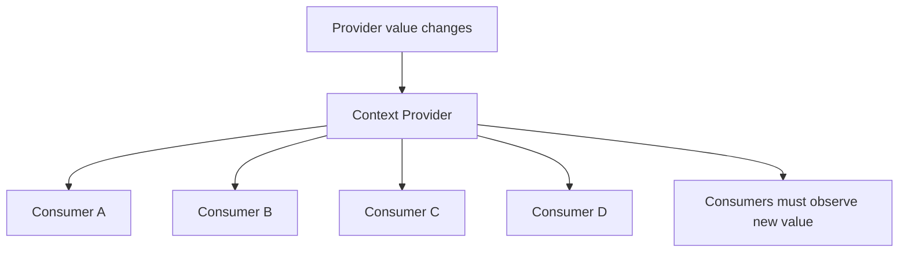
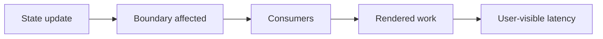
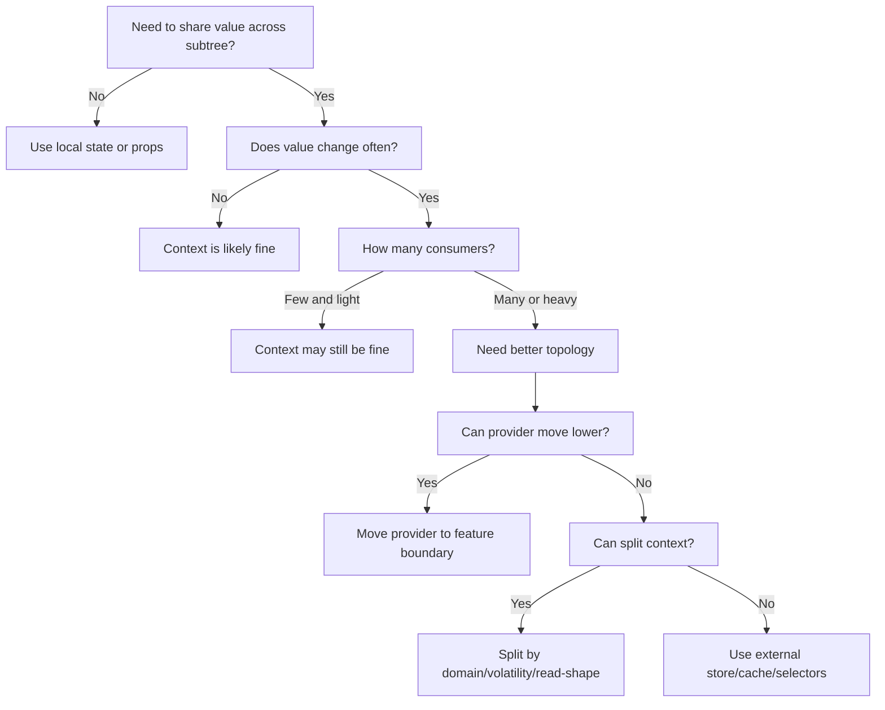

# Part 035 — Context Performance Cost

Context terlihat sederhana:

```tsx
const value = useContext(SomeContext);
```

Tetapi di aplikasi besar, Context sering berubah menjadi sumber rerender yang sulit dijelaskan.

Masalahnya bukan karena Context “lambat”. Masalahnya adalah **Context menyebarkan invalidation**. Ketika `value` provider berubah, seluruh consumer context tersebut perlu melihat value baru. Jika value itu dibaca oleh banyak component, atau berubah terlalu sering, biaya render bisa melebar ke banyak subtree.

Context performance harus dipahami sebagai biaya propagasi:

```txt
cost = update frequency × consumer fan-out × render weight × interaction sensitivity
```

Bukan semua context perlu dioptimasi. Context untuk theme yang jarang berubah biasanya aman. Context untuk mouse position, scroll position, text input, realtime feed, selection state besar, atau query result yang sering berubah bisa mahal.

Tujuan part ini: memberi mental model untuk membedakan Context yang sehat dari Context yang akan menjadi bottleneck.

---

## 1. Core Principle

Context adalah dependency injection mechanism untuk subtree.

Ia baik untuk:

- value yang dibutuhkan banyak component di subtree,
- value yang relatif stabil,
- capability/service yang identitasnya jarang berubah,
- configuration scoped seperti theme, locale, density,
- command interface yang stabil,
- form group / compound component coordination,
- provider override per subtree.

Ia buruk untuk:

- value yang berubah setiap keystroke dan dibaca ratusan consumer,
- object besar yang semua consumer baca sebagian kecilnya,
- global mutable state tanpa selector,
- server cache yang butuh invalidation granular,
- event stream frekuensi tinggi,
- data entity normalized yang berubah secara parsial,
- state dengan banyak independent slice tapi disatukan dalam satu value.

Context bukan store dengan selective subscription bawaan. Consumer membaca context value sebagai satu unit.

---

## 2. Mental Model: Context Update Propagation

Bayangkan provider sebagai pemancar sinyal.



Jika `Provider.value` berubah, consumer yang membaca context tersebut akan terdampak. React perlu memastikan setiap consumer melihat value terbaru.

Yang sering disalahpahami:

```txt
React.memo tidak menghentikan rerender karena context yang dibaca component berubah.
```

`memo` membantu ketika prop tidak berubah. Tetapi jika component sendiri memanggil `useContext`, context change adalah input baru bagi component tersebut.

---

## 3. Context Value Identity

Di JavaScript, object dan function baru memiliki identity baru.

```tsx
<UserContext.Provider value={{ user, logout }}>
  {children}
</UserContext.Provider>
```

Setiap render provider membuat object baru:

```txt
{ user, logout } !== { user, logout }
```

Walaupun isi terlihat sama, identity berbeda. Consumer context dapat menerima sinyal bahwa value berubah.

Better:

```tsx
const logout = useCallback(() => {
  authClient.logout();
}, [authClient]);

const value = useMemo(() => {
  return { user, logout };
}, [user, logout]);

return (
  <UserContext.Provider value={value}>
    {children}
  </UserContext.Provider>
);
```

Tetapi ini bukan silver bullet. `useMemo` hanya menjaga identity jika dependency tidak berubah. Jika `user` berubah setiap request polling, consumer tetap akan rerender.

---

## 4. False Optimization: Memoizing a Bad Shape

Ini sering terjadi:

```tsx
const value = useMemo(() => ({
  user,
  permissions,
  theme,
  locale,
  notifications,
  selectedRows,
  filters,
  setFilters,
  openModal,
  logout,
}), [
  user,
  permissions,
  theme,
  locale,
  notifications,
  selectedRows,
  filters,
  setFilters,
  openModal,
  logout,
]);
```

Secara identity mungkin “lebih rapi”. Secara arsitektur tetap buruk.

Kenapa?

Karena semua consumer dari `AppContext` tergantung pada satu value besar. Component yang hanya butuh `theme` ikut terhubung ke perubahan `selectedRows`. Component yang hanya butuh `openModal` ikut terhubung ke perubahan `notifications`.

Optimisasi yang benar bukan hanya memoization. Optimisasi yang benar adalah **memperbaiki topology dependency**.

---

## 5. Fan-Out: Ukur Luas Dampak, Bukan Ukuran Object

Context value kecil bisa mahal jika fan-out besar.

```txt
ThemeContext:    1 value, 800 consumers, changes rarely     => usually fine
CursorContext:   1 value, 800 consumers, changes per frame  => disaster
AuthContext:     1 value, 50 consumers, changes on login    => fine
FormContext:     1 object, 120 fields, changes per keypress => suspicious
```

Performance context tergantung empat variabel:

| Variable | Pertanyaan |
|---|---|
| Frequency | Seberapa sering value berubah? |
| Fan-out | Berapa banyak consumer membaca context ini? |
| Weight | Seberapa berat render consumer? |
| Sensitivity | Apakah update terjadi saat user interaction latency-sensitive? |

Jika salah satu besar, hati-hati. Jika semuanya besar, jangan gunakan Context sebagai store langsung.

---

## 6. Volatility Classes

Pisahkan value berdasarkan volatilitas.

| Class | Contoh | Cocok di Context? | Catatan |
|---|---|---:|---|
| Static | build config, app name | Ya | Identity stabil |
| Rarely changing | theme, locale, auth user | Ya | Split jika consumer besar |
| Session changing | selected tenant, workspace | Ya, scoped | Provider boundary harus tepat |
| Interaction changing | input value, hover, drag | Biasanya tidak | Local state / store selector |
| Streaming | cursor, scroll, websocket ticker | Tidak sebagai broad context | external store / event subscription |
| Large entity data | normalized entities | Tidak langsung | query cache / entity store |

Context paling sehat ketika value-nya stabil atau scope-nya kecil.

---

## 7. Provider Placement Is a Performance Decision

Provider terlalu tinggi memperluas blast radius.

```tsx
function App() {
  return (
    <SelectionProvider>
      <Routes />
    </SelectionProvider>
  );
}
```

Jika selection hanya dipakai di satu table page, provider global adalah keputusan mahal.

Better:

```tsx
function CaseListPage() {
  return (
    <SelectionProvider>
      <CaseListToolbar />
      <CaseTable />
      <BulkActionPanel />
    </SelectionProvider>
  );
}
```

Provider harus ditempatkan di boundary terendah yang masih mencakup semua consumer yang sah.

Rule:

```txt
Put provider as low as ownership allows, not as high as convenience suggests.
```

---

## 8. Context Is Not Free Just Because It Removes Prop Drilling

Prop drilling kadang lebih eksplisit dan lebih murah.

```tsx
<Page>
  <Toolbar user={user} />
  <Sidebar user={user} />
</Page>
```

Jika hanya dua branch butuh value, props lebih jelas.

Context berguna ketika:

```txt
- banyak level intermediate tidak peduli value,
- banyak leaf butuh value yang sama,
- provider override bermanfaat,
- value adalah dependency/capability scoped,
- prop drilling menciptakan coupling palsu di component intermediate.
```

Jangan memakai Context hanya karena tidak ingin menulis props.

---

## 9. Pattern 1 — Split State and Actions

Masalah:

```tsx
const CounterContext = createContext(null);

function CounterProvider({ children }) {
  const [count, setCount] = useState(0);

  const value = { count, increment: () => setCount(c => c + 1) };

  return <CounterContext.Provider value={value}>{children}</CounterContext.Provider>;
}
```

Consumer yang hanya butuh `increment` tetap rerender saat `count` berubah.

Better:

```tsx
const CounterStateContext = createContext<number | null>(null);
const CounterActionsContext = createContext<{
  increment(): void;
} | null>(null);

function CounterProvider({ children }: { children: React.ReactNode }) {
  const [count, setCount] = useState(0);

  const actions = useMemo(() => ({
    increment() {
      setCount(c => c + 1);
    },
  }), []);

  return (
    <CounterActionsContext.Provider value={actions}>
      <CounterStateContext.Provider value={count}>
        {children}
      </CounterStateContext.Provider>
    </CounterActionsContext.Provider>
  );
}
```

Sekarang consumer command tidak terikat pada state value.

```tsx
function IncrementButton() {
  const { increment } = useCounterActions();
  return <button onClick={increment}>+</button>;
}
```

`IncrementButton` tidak perlu rerender hanya karena `count` berubah.

---

## 10. Pattern 2 — Split by Domain

Bad:

```tsx
<AppContext.Provider value={{ auth, theme, modal, permissions, notifications }}>
  {children}
</AppContext.Provider>
```

Better:

```tsx
<AuthProvider>
  <PermissionProvider>
    <ThemeProvider>
      <ModalProvider>
        <NotificationProvider>
          {children}
        </NotificationProvider>
      </ModalProvider>
    </ThemeProvider>
  </PermissionProvider>
</AuthProvider>
```

Tetapi hati-hati: provider pyramid juga punya cost cognitive.

Jika provider benar-benar global dan stabil, composition helper boleh dipakai:

```tsx
function AppProviders({ children }: { children: React.ReactNode }) {
  return (
    <AuthProvider>
      <PermissionProvider>
        <ThemeProvider>
          <ModalProvider>{children}</ModalProvider>
        </ThemeProvider>
      </PermissionProvider>
    </AuthProvider>
  );
}
```

Yang penting bukan jumlah provider. Yang penting adalah boundary ownership dan volatility.

---

## 11. Pattern 3 — Split by Read Shape

Kadang domain sama, tetapi read shape berbeda.

Contoh form:

```txt
Form metadata      => jarang berubah
Field values       => berubah sering
Validation errors  => berubah sering tapi per field
Submit status      => berubah saat submit
Form commands      => stabil
```

Jangan satukan semua ke satu context besar.

```tsx
<FormConfigProvider>
  <FormCommandsProvider>
    <FieldStoreProvider>
      {children}
    </FieldStoreProvider>
  </FormCommandsProvider>
</FormConfigProvider>
```

Atau lebih baik: field values masuk external store dengan selector per field.

---

## 12. Pattern 4 — Stable Command Context

Command context sering paling aman untuk Context.

```tsx
interface ModalCommands {
  open(input: ModalInput): void;
  close(id: string): void;
}

const ModalCommandsContext = createContext<ModalCommands | null>(null);
```

Provider:

```tsx
function ModalProvider({ children }: { children: React.ReactNode }) {
  const [stack, setStack] = useState<ModalEntry[]>([]);

  const commands = useMemo<ModalCommands>(() => ({
    open(input) {
      setStack(stack => [...stack, createModalEntry(input)]);
    },
    close(id) {
      setStack(stack => stack.filter(entry => entry.id !== id));
    },
  }), []);

  return (
    <ModalCommandsContext.Provider value={commands}>
      {children}
      <ModalStack stack={stack} onClose={commands.close} />
    </ModalCommandsContext.Provider>
  );
}
```

Consumers yang hanya membuka modal tidak perlu subscribe ke `stack`.

```tsx
function DeleteButton({ id }: { id: string }) {
  const modal = useModalCommands();

  return (
    <button onClick={() => modal.open({ type: 'confirm-delete', id })}>
      Delete
    </button>
  );
}
```

Ini lebih scalable daripada semua component membaca `modalStack`.

---

## 13. Pattern 5 — Read Context in Outer, Render Heavy Child with Props

Jika component berat hanya butuh sebagian context, pisahkan reader kecil dari renderer berat.

```tsx
function UserPanel() {
  const { user } = useAuthContext();
  return <UserPanelView user={user} />;
}

const UserPanelView = memo(function UserPanelView({ user }: { user: User }) {
  return <ExpensiveUserLayout user={user} />;
});
```

Kenapa ini membantu?

`UserPanel` tetap rerender saat context berubah. Tetapi `UserPanelView` bisa skip jika prop `user` sama.

Ini pattern resmi yang praktis ketika Context tidak punya selector bawaan.

---

## 14. Pattern 6 — Context as Provider for External Store

Jika state butuh granular subscription, simpan store object stabil di Context.

```tsx
const TodoStoreContext = createContext<TodoStore | null>(null);

function TodoStoreProvider({ children }: { children: React.ReactNode }) {
  const storeRef = useRef<TodoStore | null>(null);

  if (storeRef.current === null) {
    storeRef.current = createTodoStore();
  }

  return (
    <TodoStoreContext.Provider value={storeRef.current}>
      {children}
    </TodoStoreContext.Provider>
  );
}
```

Consumer menggunakan selector via store subscription:

```tsx
function useTodoTitle(id: string) {
  const store = useTodoStore();

  return useSyncExternalStore(
    store.subscribe,
    () => store.getSnapshot().todos[id]?.title,
    () => store.getSnapshot().todos[id]?.title,
  );
}
```

Di sini Context hanya menyebarkan **reference store stabil**. Update data tidak mengubah context value. Granular rerender dikontrol oleh subscription.

Ini pola umum di banyak state library.

---

## 15. Context Selector: What React Context Does Not Give You by Default

Yang sering diinginkan:

```tsx
const userName = useContextSelector(AuthContext, value => value.user.name);
```

React built-in Context tidak menyediakan API selector seperti itu secara native pada level consumer umum.

Alternatif:

1. split context,
2. read context di outer component lalu pass prop ke memoized child,
3. gunakan external store + `useSyncExternalStore`,
4. gunakan library yang menyediakan selector semantics,
5. pindahkan state ke TanStack Query / Zustand / Redux Toolkit / XState jika memang cocok.

Jangan pura-pura punya selector dengan ini:

```tsx
const { user } = useAuthContext();
```

Component tetap membaca seluruh context value.

---

## 16. Why `React.memo` Alone Is Not Enough

```tsx
const Profile = memo(function Profile() {
  const auth = useAuthContext();
  return <div>{auth.user.name}</div>;
});
```

`memo` tidak membuat component kebal dari context change. Context adalah input. Jika input context berubah, component perlu render ulang.

`memo` berguna ketika:

- parent rerender tetapi props sama,
- heavy child menerima props hasil selection,
- context reader dipisah dari view.

`memo` bukan obat untuk context fan-out.

---

## 17. Why `useMemo` on Provider Value Sometimes Does Nothing

Contoh:

```tsx
function Provider({ children }) {
  const [formState, setFormState] = useState({});

  const value = useMemo(() => ({ formState, setFormState }), [formState]);

  return <FormContext.Provider value={value}>{children}</FormContext.Provider>;
}
```

Jika `formState` berubah setiap keystroke, `value` berubah setiap keystroke. `useMemo` tidak menghilangkan perubahan yang memang nyata.

`useMemo` membantu mencegah identity berubah karena parent rerender yang tidak relevan. Ia tidak mengubah topology state.

---

## 18. Provider Re-render vs Context Value Change

Ada dua hal berbeda:

```txt
1. Provider component render ulang.
2. Provider value berubah.
```

Jika provider render ulang tetapi `value` tetap sama, consumer context tidak perlu menerima value baru dari context change. Namun children provider tetap bagian dari render tree provider.

Karena itu optimisasi bisa ada di beberapa level:

| Level | Teknik |
|---|---|
| Provider value | `useMemo`, stable commands, split context |
| Provider render | colocate state, avoid parent noise, isolate providers |
| Consumer render | split reader/view, `memo`, selector store |
| State topology | move volatile state lower/external |

Jangan hanya melihat satu level.

---

## 19. Provider Nesting Does Not Automatically Mean Slow

Provider nesting sering terlihat menakutkan:

```tsx
<AuthProvider>
  <ThemeProvider>
    <PermissionProvider>
      <ModalProvider>
        <ToastProvider>{children}</ToastProvider>
      </ModalProvider>
    </PermissionProvider>
  </ThemeProvider>
</AuthProvider>
```

Tetapi provider nesting bukan masalah utama. Masalah utama adalah:

- provider sering rerender,
- provider value unstable,
- provider value besar,
- provider terlalu tinggi,
- consumer terlalu banyak,
- consumer terlalu berat,
- state volatility tidak dipisah.

Banyak provider kecil yang stabil sering lebih baik daripada satu provider besar yang volatile.

---

## 20. The Blast Radius Model

Setiap state update punya blast radius.



Target arsitektur: blast radius sekecil mungkin sesuai kebutuhan bisnis.

Contoh buruk:

```txt
Typing in one field rerenders entire form, sidebar, toolbar, and preview panel.
```

Contoh lebih baik:

```txt
Typing in one field rerenders field itself, dependent validation message, and submit eligibility indicator.
```

State topology yang benar membuat update punya batas yang masuk akal.

---

## 21. Case Study: Auth Context

Auth context biasanya aman.

```tsx
interface AuthValue {
  user: User | null;
  status: 'loading' | 'authenticated' | 'anonymous';
  login(input: LoginInput): Promise<void>;
  logout(): Promise<void>;
}
```

Masalah muncul saat AuthContext menjadi tempat semua hal:

```tsx
interface BadAuthValue {
  user: User | null;
  permissions: Permission[];
  organization: Organization;
  billingPlan: BillingPlan;
  featureFlags: Record<string, boolean>;
  notifications: Notification[];
  unreadCount: number;
  login(): Promise<void>;
  logout(): Promise<void>;
  markNotificationRead(id: string): void;
  switchOrganization(id: string): void;
}
```

Consumer `LoginButton` tidak perlu terhubung ke `notifications`.

Refactor:

```txt
AuthSessionContext      => user/status/login/logout
PermissionContext       => can/check capability
OrganizationContext     => selected org/workspace
FeatureFlagContext      => flag reader
NotificationStore       => server/external store
```

---

## 22. Case Study: Theme Context

Theme context biasanya wajar di root.

```tsx
<ThemeContext.Provider value={theme}>
  {children}
</ThemeContext.Provider>
```

Theme berubah jarang. Fan-out besar masih bisa diterima karena frequency rendah.

Tetapi jika theme object dibangun ulang setiap render:

```tsx
<ThemeContext.Provider value={{ mode, tokens: buildTokens(mode) }}>
  {children}
</ThemeContext.Provider>
```

Ini buruk jika parent sering rerender.

Better:

```tsx
const tokens = useMemo(() => buildTokens(mode), [mode]);
const value = useMemo(() => ({ mode, tokens }), [mode, tokens]);
```

Theme context adalah contoh bagus untuk `useMemo`: value jarang berubah secara semantik, tetapi object identity mudah tidak sengaja berubah.

---

## 23. Case Study: Form Context

Form context adalah area berbahaya.

Bad:

```tsx
<FormContext.Provider value={{ values, errors, touched, setValue, validate }}>
  {children}
</FormContext.Provider>
```

Jika `values.firstName` berubah, semua field yang membaca context bisa rerender.

Better options:

### Option A — Local field state, commit upward

Untuk form sederhana:

```tsx
function TextField({ defaultValue, onCommit }) {
  const [draft, setDraft] = useState(defaultValue);

  return (
    <input
      value={draft}
      onChange={e => setDraft(e.target.value)}
      onBlur={() => onCommit(draft)}
    />
  );
}
```

### Option B — Field-level external store

Untuk form besar:

```tsx
function useFieldValue(name: string) {
  const store = useFormStore();

  return useSyncExternalStore(
    store.subscribeField(name),
    () => store.getFieldValue(name),
    () => store.getFieldValue(name),
  );
}
```

### Option C — Split context by concern

```txt
FormConfigContext
FormCommandsContext
FormSubmitStatusContext
FieldRegistryContext
```

Field values tidak harus ada di broad context.

---

## 24. Case Study: Table Selection

Table selection sering berubah cepat.

Bad:

```tsx
<TableContext.Provider value={{ rows, selectedIds, toggleSelected }}>
  {children}
</TableContext.Provider>
```

Jika row selection berubah, semua row consumer bisa rerender.

Better:

```txt
Rows data       => server cache/query
Selection store => external store with per-row selector
Commands        => stable context
```

```tsx
function RowCheckbox({ rowId }: { rowId: string }) {
  const selected = useRowSelected(rowId);
  const selection = useSelectionCommands();

  return (
    <input
      type="checkbox"
      checked={selected}
      onChange={() => selection.toggle(rowId)}
    />
  );
}
```

Only row checkbox whose selected state changes should rerender.

---

## 25. Context and Server State

Server state should usually not be put directly into broad Context.

Bad:

```tsx
<CaseContext.Provider value={{ cases, refetch, updateCase }}>
  {children}
</CaseContext.Provider>
```

Problems:

- cache invalidation unclear,
- stale state risk,
- refetch coordination ad hoc,
- optimistic updates manual,
- consumers rerender broadly,
- pagination/filtering not encoded in key,
- duplicate data across providers.

Better:

```txt
TanStack Query / framework loader / route data / server cache owns server state.
Context may pass stable domain commands or query parameter scope.
```

Example:

```tsx
const CaseScopeContext = createContext<{ tenantId: string } | null>(null);
```

`tenantId` scope is fine. The actual `cases` list belongs in query cache.

---

## 26. Context and URL State

URL state is already global to route/browser.

Do not mirror URL state in Context unless you have a strong reason.

Bad:

```tsx
const [filters, setFilters] = useState(readFiltersFromUrl());

useEffect(() => {
  writeFiltersToUrl(filters);
}, [filters]);
```

Then pass `filters` through context.

Better:

```txt
URL/search params are source of truth.
Components read/write through router APIs or a custom hook.
Context may pass typed route-scope helpers if needed.
```

Duplicating URL state in Context creates sync bugs.

---

## 27. Context and Permissions

Permissions are often read widely but change rarely.

This makes PermissionContext usually acceptable.

But shape matters.

Bad:

```tsx
const PermissionContext = createContext<Permission[]>([]);
```

Every component starts inspecting raw permission arrays.

Better:

```tsx
interface PermissionCapability {
  can(action: string, resource: ResourceRef): boolean;
}
```

Now consumers depend on a stable capability, not raw policy storage.

If permissions change rarely, broad read may be okay. If permission checks are expensive, precompute or cache inside provider.

---

## 28. When to Move Away from Context

Move away from Context when you need:

- per-field subscription,
- per-entity subscription,
- high-frequency updates,
- cross-route persistent state with debugging tools,
- middleware,
- time-travel/debug action log,
- server cache semantics,
- normalized entity update,
- optimistic mutation with invalidation,
- multiple independent consumers reading slices,
- actor/workflow lifecycle.

Decision:

| Need | Better Tool |
|---|---|
| Small subtree shared state | Context + reducer |
| Stable capability | Context |
| Server cache | TanStack Query / router cache |
| Granular client store | Zustand / Redux Toolkit / external store |
| Workflow transitions | XState / reducer machine |
| URL-driven state | Router/search params |
| Field-level form state | Form library / external store / local state |

---

## 29. Profiling Context Issues

Do not optimize from anxiety. Optimize from evidence.

Workflow:

```txt
1. Reproduce slow interaction.
2. Use React DevTools Profiler.
3. Identify which components render.
4. Identify why they render: prop, state, context, parent.
5. Find high-frequency source.
6. Inspect provider value identity.
7. Inspect consumer fan-out.
8. Split/move/select state.
9. Re-profile.
```

Question list:

```txt
Which context changed?
How many consumers read it?
Did value identity change accidentally?
Is the value too broad?
Is update frequency too high?
Are heavy components reading context directly?
Can provider move lower?
Can read/write be split?
Does this need external store selectors?
```

---

## 30. Diagnostic Logging for Provider Identity

For local debugging:

```tsx
function useLogChangedDeps(name: string, deps: Record<string, unknown>) {
  const prev = useRef<Record<string, unknown> | null>(null);

  useEffect(() => {
    if (prev.current === null) {
      prev.current = deps;
      return;
    }

    for (const key of Object.keys(deps)) {
      if (!Object.is(prev.current[key], deps[key])) {
        console.log(`${name}: ${key} changed`, {
          before: prev.current[key],
          after: deps[key],
        });
      }
    }

    prev.current = deps;
  });
}
```

Use inside provider:

```tsx
useLogChangedDeps('AuthProvider value deps', {
  user,
  login,
  logout,
  permissions,
});
```

Ini bukan production code. Ini alat investigasi.

---

## 31. Refactor Recipe: One Big Context to Split Contexts

Starting point:

```tsx
const AppContext = createContext<AppContextValue | null>(null);
```

Step 1 — inventory consumers:

```txt
Component       Reads
Header          user, theme, logout
Sidebar         user, permissions
DeleteButton    permissions, openModal
ToastHost       toasts
CaseTable       filters, selectedRows, setSelectedRows
```

Step 2 — group by domain and volatility:

```txt
Auth: user/logout                      rare
Theme: theme                           rare
Permission: can()                      rare
Modal commands: open/close             stable commands
Toast state: toasts                    event-driven
Table selection: selectedRows          frequent
Filters: URL/search params             route state
```

Step 3 — create smaller contexts:

```txt
AuthContext
ThemeContext
PermissionContext
ModalCommandsContext
ToastStoreContext
SelectionStoreContext
```

Step 4 — migrate consumers incrementally.

Do not rewrite whole app in one PR unless app is small.

---

## 32. Refactor Recipe: Context to External Store

When context value changes too often:

```tsx
const SelectionContext = createContext<{
  selectedIds: Set<string>;
  toggle(id: string): void;
} | null>(null);
```

Move to store reference:

```tsx
const SelectionStoreContext = createContext<SelectionStore | null>(null);
```

Store:

```tsx
type Listener = () => void;

function createSelectionStore() {
  let selectedIds = new Set<string>();
  const listeners = new Set<Listener>();

  return {
    subscribe(listener: Listener) {
      listeners.add(listener);
      return () => listeners.delete(listener);
    },
    getSnapshot() {
      return selectedIds;
    },
    isSelected(id: string) {
      return selectedIds.has(id);
    },
    toggle(id: string) {
      selectedIds = new Set(selectedIds);

      if (selectedIds.has(id)) {
        selectedIds.delete(id);
      } else {
        selectedIds.add(id);
      }

      listeners.forEach(listener => listener());
    },
  };
}
```

Hook:

```tsx
function useIsSelected(id: string) {
  const store = useSelectionStore();

  return useSyncExternalStore(
    store.subscribe,
    () => store.isSelected(id),
    () => false,
  );
}
```

Now context value is stable store reference; per-row subscription controls rerender.

---

## 33. Selector Equality

Granular subscription still needs equality discipline.

If selector returns new object every time:

```tsx
() => ({ selected: store.isSelected(id) })
```

That snapshot is always a new object. Consumers may rerender unnecessarily.

Prefer primitives or stable references:

```tsx
() => store.isSelected(id)
```

Or use selector helpers with equality comparison in a state library.

Context performance often moves the problem into selector design. Do not return unstable derived objects casually.

---

## 34. React Compiler Does Not Remove Architecture Cost

React Compiler can reduce manual memoization burden in many cases, but it does not change ownership topology.

It cannot make one broad volatile context magically behave like granular subscriptions.

Compiler can help with:

- avoiding some unnecessary child rerenders,
- caching calculations/components when safe,
- reducing manual `memo`, `useMemo`, `useCallback` in supported cases.

Compiler does not remove need to answer:

```txt
Who owns this state?
Who subscribes to it?
How often does it change?
How big is its blast radius?
```

Architecture still matters.

---

## 35. Context Performance Decision Matrix

| Situation | Keep Context? | Action |
|---|---:|---|
| Theme, locale, density | Yes | Memoize value if object |
| Auth session | Yes | Split actions if needed |
| Permission capability | Yes | Pass `can()` not raw arrays |
| Modal open command | Yes | Stable command context |
| Modal stack state | Maybe | Keep local to host; do not expose broadly |
| Form values | Usually no | Local/field store/form library |
| Table row selection | Usually no | External store with row selector |
| Search filters | Maybe | URL state often better |
| Server results | No | Query cache/router data |
| Realtime stream | No | External subscription/store |
| Wizard workflow | Maybe | Reducer/machine provider scoped to wizard |
| Design system field group | Yes | Small scoped compound context |

---

## 36. Failure Mode 1 — God Context

Symptom:

```tsx
const { user, theme, filters, modal, permissions, notifications } = useAppContext();
```

Everything depends on everything.

Impact:

- broad rerenders,
- hidden dependencies,
- impossible local reasoning,
- hard testing,
- accidental coupling,
- provider migration painful.

Fix:

```txt
Split by ownership, volatility, and capability.
```

---

## 37. Failure Mode 2 — Unstable Provider Value

Symptom:

```tsx
<AuthContext.Provider value={{ user, login, logout }}>
```

Impact:

- consumers rerender after unrelated parent render,
- profiler shows context-driven renders,
- memoized children still render if they read context.

Fix:

```tsx
const value = useMemo(() => ({ user, login, logout }), [user, login, logout]);
```

But if `login/logout` are unstable, fix them too.

---

## 38. Failure Mode 3 — Volatile State at App Root

Symptom:

```tsx
<AppProvider value={{ selectedRows, setSelectedRows }}>
  <WholeApp />
</AppProvider>
```

Impact:

- small interaction invalidates global subtree,
- slow typing/clicking,
- unrelated panels render.

Fix:

```txt
Move provider down to feature/page boundary.
Or move volatile state to external store with selectors.
```

---

## 39. Failure Mode 4 — Context Used as Event Bus

Symptom:

```tsx
const { events, publish, subscribe } = useAppContext();
```

Impact:

- lifecycle leaks,
- untraceable flows,
- consumer rerender not tied to data needs,
- hidden temporal coupling.

Fix:

```txt
Use explicit commands, workflow machine, or proper event emitter outside render with lifecycle-safe subscription.
```

---

## 40. Failure Mode 5 — Raw Mutable Object in Context

Symptom:

```tsx
const cache = new Map();
<CacheContext.Provider value={cache}>
```

Then consumers mutate it directly:

```tsx
cache.set(key, value);
```

Impact:

- React does not know when data changes,
- UI stale,
- mutation uncontrolled,
- no invariant enforcement.

Fix:

```txt
Expose commands and subscription mechanism.
Do not expose writable mutable storage as public context contract.
```

---

## 41. Failure Mode 6 — Split Context Without Better Semantics

Sometimes teams split context mechanically:

```txt
UserContext
UserNameContext
UserEmailContext
UserAvatarContext
```

This can become noise.

Split context only when:

- update frequency differs,
- consumer groups differ,
- ownership differs,
- lifecycle differs,
- performance evidence supports it,
- semantic boundary exists.

Do not split everything into atoms without a model.

---

## 42. Failure Mode 7 — Provider Factory Inside Render

Bad:

```tsx
function App() {
  const store = createStore();

  return <StoreContext.Provider value={store}>{children}</StoreContext.Provider>;
}
```

Every render creates new store.

Better:

```tsx
function App() {
  const storeRef = useRef<Store | null>(null);

  if (storeRef.current === null) {
    storeRef.current = createStore();
  }

  return <StoreContext.Provider value={storeRef.current}>{children}</StoreContext.Provider>;
}
```

Or initialize outside component if safe for scope.

---

## 43. Performance Review Checklist

For every new Context provider, review:

```txt
[ ] What exact value does this context pass?
[ ] Is it data, command, configuration, capability, or store reference?
[ ] Who owns the state behind it?
[ ] How often can it change?
[ ] How many consumers are expected?
[ ] Is provider placed at lowest valid boundary?
[ ] Is value identity stable when semantic value is unchanged?
[ ] Are state and actions split if needed?
[ ] Are unrelated domains mixed?
[ ] Are heavy consumers reading context directly?
[ ] Would a selector store be more appropriate?
[ ] Would URL/server cache/local state be more appropriate?
[ ] How will this be tested?
[ ] How will performance regression be detected?
```

---

## 44. Naming Conventions

Names should reveal performance semantics.

Good:

```tsx
AuthSessionContext
AuthCommandsContext
PermissionCapabilityContext
ThemeTokensContext
ModalCommandsContext
FormStoreContext
FieldRegistryContext
SelectionStoreContext
```

Suspicious:

```tsx
GlobalContext
AppContext
SharedContext
CommonContext
DataContext
EverythingProvider
```

Names like `AppContext` hide volatility and ownership.

---

## 45. Practical Rule of Thumb

Use Context directly for values that are:

```txt
- shared by a subtree,
- semantically scoped,
- relatively stable,
- small enough to reason about,
- not requiring selector-level subscription.
```

Use external store/cache when values are:

```txt
- high-frequency,
- large,
- partially observed,
- entity-based,
- server-owned,
- workflow-heavy,
- requiring debugging/middleware/subscriptions.
```

Use props when:

```txt
- passing one or two levels is clear,
- ownership should remain explicit,
- consumer count is small,
- no provider override is needed.
```

---

## 46. Mini Architecture Kata

Scenario:

```txt
A regulatory case list page has:
- current user,
- permissions,
- route filters,
- server-loaded case list,
- selected rows,
- bulk action modal,
- toast notifications,
- theme,
- table column preferences.
```

Do not create:

```tsx
<CaseListContext.Provider value={{
  user,
  permissions,
  filters,
  cases,
  selectedRows,
  modal,
  toasts,
  theme,
  columns,
}}>
```

Better topology:

```txt
AuthSessionContext          => current user/session, rare
PermissionCapabilityContext => can(action, resource), rare/stable
Route Search Params         => filters, browser source of truth
TanStack Query              => cases, server cache
SelectionStoreContext       => row selection, granular
ModalCommandsContext        => open/close modal, stable
ToastCommandsContext        => push toast, stable
ThemeContext                => theme, rare
ColumnPreferenceStore       => persistent user preference
```

Render blast radius becomes predictable.

---

## 47. Mermaid: Context Performance Decision Flow



---

## 48. What to Remember

Context performance is not about fear. It is about invalidation topology.

Key ideas:

```txt
Context change propagates to consumers.
Provider value identity matters.
Memoization fixes accidental identity churn, not bad architecture.
High fan-out × high frequency × heavy consumers is dangerous.
Provider placement is a performance decision.
Split state/actions when commands should be stable.
Split by domain, volatility, and read shape.
Use external store/cache for granular subscription and server state.
Use Profiler before and after refactor.
```

The engineering move is not “never use Context”.

The engineering move is:

```txt
Use Context for scoped dependency passing.
Use stores/caches/machines when you need subscription, invalidation, or workflow semantics.
```

---

## References

- React Docs — `useContext`: https://react.dev/reference/react/useContext
- React Docs — Passing Data Deeply with Context: https://react.dev/learn/passing-data-deeply-with-context
- React Docs — `memo`: https://react.dev/reference/react/memo
- React Docs — `useMemo`: https://react.dev/reference/react/useMemo
- React Docs — `useSyncExternalStore`: https://react.dev/reference/react/useSyncExternalStore
- React Docs — Components and Hooks must be pure: https://react.dev/reference/rules/components-and-hooks-must-be-pure
