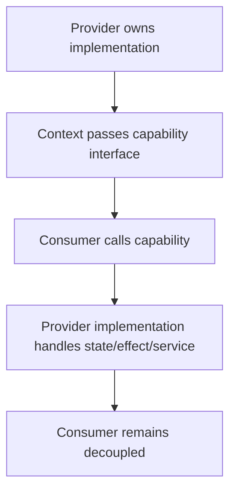
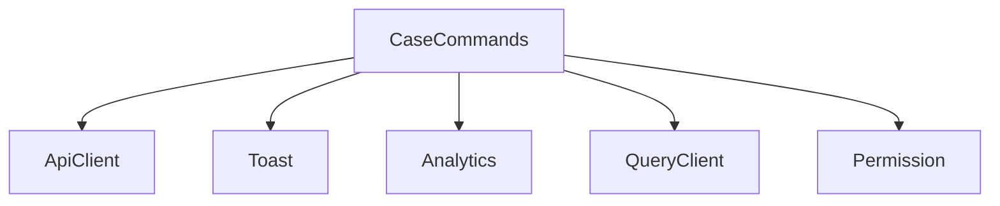
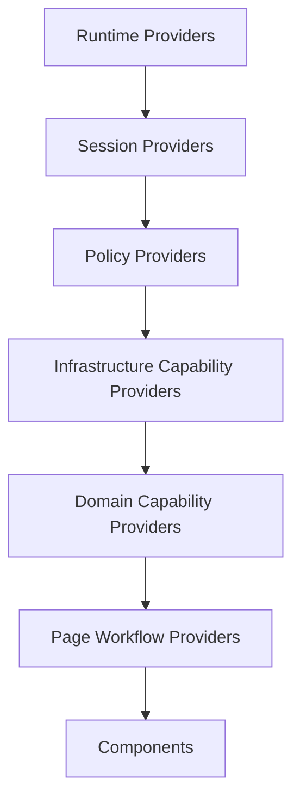
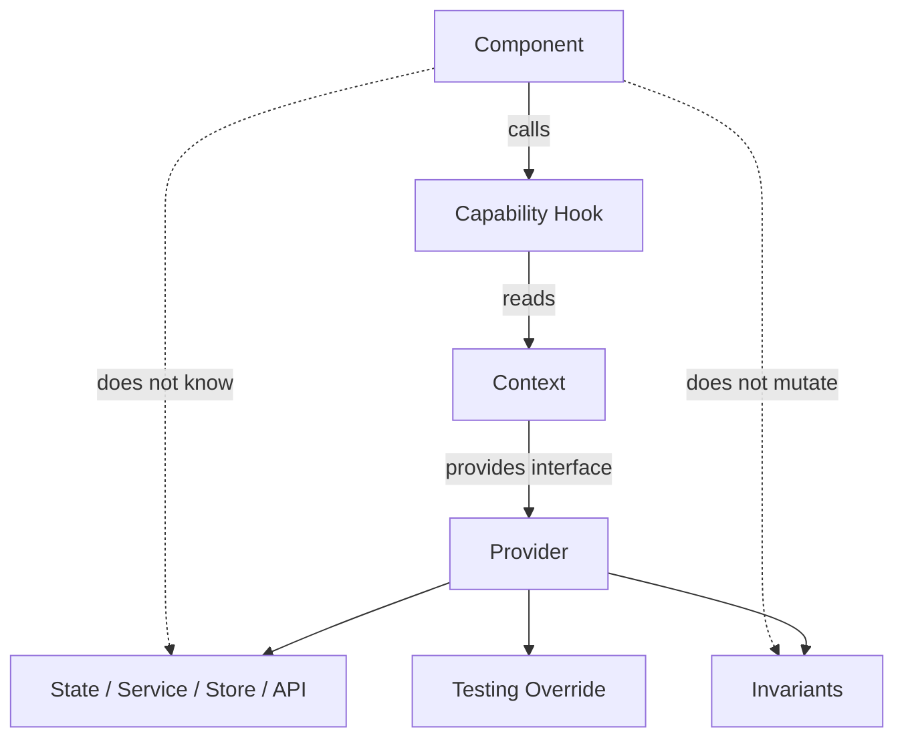
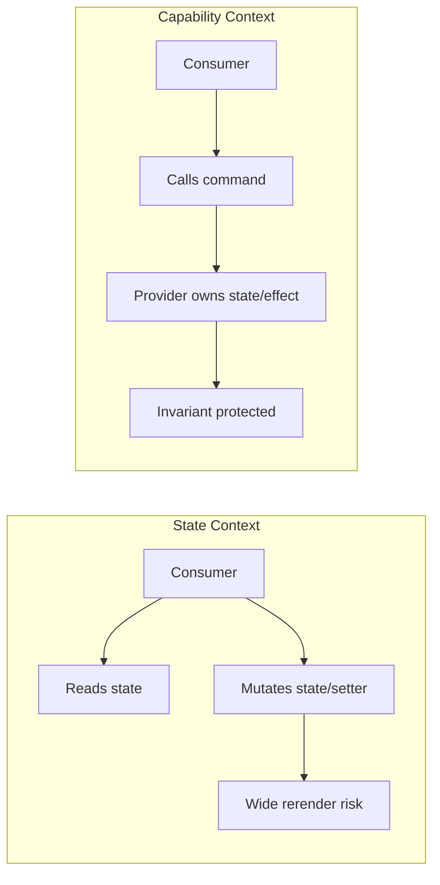

# Part 036 — Context as Capability Passing

Part sebelumnya membahas biaya performa Context. Sekarang kita masuk ke penggunaan Context yang paling kuat dan sering paling aman: **capability passing**.

Context tidak harus selalu membawa “data”. Context bisa membawa **kemampuan**.

Contoh:

```tsx
const modal = useModalCommands();
modal.open({ type: 'confirm-delete', caseId });
```

Component tidak perlu tahu:

- modal stack disimpan di mana,
- portal host ada di mana,
- focus trap diimplementasikan bagaimana,
- analytics dicatat di mana,
- closing transition memakai library apa.

Component hanya menerima capability: **boleh meminta modal dibuka**.

Itu jauh lebih bersih daripada menyebarkan state internal modal ke semua component.

---

## 1. What Is a Capability?

Dalam konteks UI architecture, capability adalah object/function yang memberi component hak terbatas untuk melakukan sesuatu.

```txt
Capability = authority + interface + scope
```

Contoh capability:

| Capability | Component boleh melakukan apa? |
|---|---|
| `modal.open()` | Meminta dialog dibuka |
| `toast.success()` | Menampilkan notification |
| `analytics.track()` | Merekam event |
| `permission.can()` | Mengecek izin UI |
| `featureFlags.enabled()` | Membaca flag |
| `router.navigate()` | Navigasi |
| `caseCommands.submit()` | Mengirim command domain |
| `logger.error()` | Melaporkan error |

Capability bukan data dump. Capability adalah API kecil yang sengaja dirancang.

---

## 2. Why Context Is Good for Capability Passing

Capability biasanya:

- dibutuhkan banyak component dalam subtree,
- identitasnya stabil,
- bisa di-override untuk testing/storybook/subtree,
- tidak perlu membuat consumer rerender sering,
- memiliki boundary ownership jelas,
- lebih aman daripada exposing mutable state.

Karena itu Context sangat cocok.



Consumer tidak tahu implementasi. Consumer tahu kontrak.

---

## 3. Capability vs State

State context:

```tsx
const { modalStack, setModalStack } = useModalContext();
```

Capability context:

```tsx
const modal = useModalCommands();
modal.open({ type: 'confirm', message: 'Delete case?' });
```

State context bertanya:

```txt
Apa data saat ini?
```

Capability context bertanya:

```txt
Apa operasi sah yang boleh saya minta?
```

Capability lebih kuat untuk menjaga invariant karena consumer tidak bisa memodifikasi state sembarangan.

---

## 4. Least Authority Principle

Berikan component authority sekecil mungkin.

Bad:

```tsx
const app = useAppContext();

app.setUser(null);
app.setPermissions([]);
app.setModalStack([]);
app.setCaseCache(new Map());
```

Good:

```tsx
const auth = useAuthCommands();
auth.logout();
```

Good:

```tsx
const modal = useModalCommands();
modal.openConfirm({ title, body, onConfirm });
```

Good:

```tsx
const permission = usePermissionCapability();
const allowed = permission.can('case.approve', { caseId });
```

A button should not receive admin power over the entire application just because it needs to open a dialog.

---

## 5. Capability Interface Design

A capability should be:

```txt
small,
explicit,
stable,
semantic,
testable,
scoped,
free from storage details.
```

Bad:

```tsx
interface ModalContextValue {
  modals: ModalEntry[];
  setModals(next: ModalEntry[]): void;
}
```

Better:

```tsx
interface ModalCapability {
  open(input: ModalInput): ModalId;
  close(id: ModalId): void;
  closeAll(reason?: CloseReason): void;
}
```

Even better if domain-specific:

```tsx
interface ConfirmationCapability {
  confirm(input: ConfirmInput): Promise<boolean>;
}
```

The API says what the consumer wants, not how provider stores it.

---

## 6. Building a Strict Capability Context

```tsx
type ToastCapability = {
  success(message: string): void;
  error(message: string): void;
  info(message: string): void;
};

const ToastContext = createContext<ToastCapability | null>(null);

export function useToast() {
  const value = useContext(ToastContext);

  if (value === null) {
    throw new Error('useToast must be used within ToastProvider');
  }

  return value;
}
```

Provider:

```tsx
function ToastProvider({ children }: { children: React.ReactNode }) {
  const [items, setItems] = useState<ToastItem[]>([]);

  const toast = useMemo<ToastCapability>(() => ({
    success(message) {
      setItems(items => [...items, createToast('success', message)]);
    },
    error(message) {
      setItems(items => [...items, createToast('error', message)]);
    },
    info(message) {
      setItems(items => [...items, createToast('info', message)]);
    },
  }), []);

  return (
    <ToastContext.Provider value={toast}>
      {children}
      <ToastViewport items={items} onDismiss={id => {
        setItems(items => items.filter(item => item.id !== id));
      }} />
    </ToastContext.Provider>
  );
}
```

Consumer:

```tsx
function SaveButton() {
  const toast = useToast();

  async function handleSave() {
    await save();
    toast.success('Saved');
  }

  return <button onClick={handleSave}>Save</button>;
}
```

The consumer never reads `items`. It only uses a capability.

---

## 7. Capability Context Usually Has Stable Identity

Capability methods can often use updater functions:

```tsx
setItems(items => [...items, nextItem]);
```

That means the capability object does not need current `items` in dependency array.

```tsx
const toast = useMemo(() => ({
  success(message: string) {
    setItems(items => [...items, createToast('success', message)]);
  },
}), []);
```

This is excellent for Context performance. Consumers do not rerender when internal toast state changes.

But do not fake stability if capability depends on changing values.

Bad:

```tsx
const permission = useMemo(() => ({
  can(action) {
    return currentUser.permissions.includes(action);
  },
}), []); // stale currentUser
```

Correct:

```tsx
const permission = useMemo(() => ({
  can(action: string) {
    return currentUser.permissions.includes(action);
  },
}), [currentUser.permissions]);
```

Or build immutable precomputed policy when user changes.

---

## 8. Capability as Dependency Injection

Context can implement scoped dependency injection.

Example:

```tsx
interface AnalyticsCapability {
  track(event: AnalyticsEvent): void;
}

const AnalyticsContext = createContext<AnalyticsCapability | null>(null);
```

Production provider:

```tsx
function AnalyticsProvider({ children }: { children: React.ReactNode }) {
  const analytics = useMemo<AnalyticsCapability>(() => ({
    track(event) {
      window.dataLayer?.push(event);
    },
  }), []);

  return (
    <AnalyticsContext.Provider value={analytics}>
      {children}
    </AnalyticsContext.Provider>
  );
}
```

Test provider:

```tsx
function createFakeAnalytics() {
  const events: AnalyticsEvent[] = [];

  return {
    capability: {
      track(event: AnalyticsEvent) {
        events.push(event);
      },
    },
    events,
  };
}
```

Now tests can assert behavior without loading analytics SDK.

---

## 9. Capability Is Not Service Locator by Default

Context capability is healthy when explicit and narrow.

Bad service locator:

```tsx
const services = useServices();

services.auth.logout();
services.analytics.track(...);
services.caseApi.approve(...);
services.router.navigate(...);
services.permissions.can(...);
services.modal.open(...);
```

This hides dependencies. Every component can access everything.

Better:

```tsx
const analytics = useAnalytics();
const modal = useModalCommands();
```

Narrow hooks reveal dependency at call site.

A general `ServicesContext` can exist internally for composition, but public hooks should expose narrow capability surfaces.

---

## 10. Capability Naming

Good names expose authority:

```tsx
useModalCommands()
useToast()
useAnalytics()
usePermissionCapability()
useFeatureFlags()
useCaseCommands()
useNavigationCommands()
useLogger()
useClock()
useIdGenerator()
```

Suspicious names:

```tsx
useApp()
useGlobal()
useCommon()
useShared()
useContextStuff()
useEverything()
```

Names should answer: **what power does this component receive?**

---

## 11. Permission Capability

Permission UI is a perfect capability case.

Bad:

```tsx
const { permissions } = useAuthContext();

if (permissions.includes('APPROVE_CASE')) {
  return <ApproveButton />;
}
```

Problems:

- component knows policy storage,
- raw permission strings spread everywhere,
- hard to change to ABAC/ReBAC/policy service,
- no central audit/logging/invariant,
- impossible to encode resource-specific checks cleanly.

Better:

```tsx
interface PermissionCapability {
  can(action: CaseAction, resource: CaseResource): boolean;
  explain?(action: CaseAction, resource: CaseResource): DenyReason | null;
}
```

Usage:

```tsx
function ApproveCaseButton({ caseRef }: { caseRef: CaseResource }) {
  const permission = usePermissionCapability();

  if (!permission.can('case.approve', caseRef)) {
    return null;
  }

  return <button>Approve</button>;
}
```

This makes UI permission checks policy-driven.

---

## 12. Authorization UI Must Not Be Security Boundary

Important: permission capability in React is for user experience and consistency.

It can:

- hide unavailable actions,
- disable invalid controls,
- show denial reason,
- reduce user confusion,
- align UI with domain policy.

It cannot:

- protect backend data,
- replace server authorization,
- prevent malicious API calls,
- act as final enforcement.

Server must enforce authorization. UI capability is a presentation-layer mirror/checker.

---

## 13. Permission Capability with Explanation

Production UI often needs more than boolean.

```tsx
type PermissionResult =
  | { allowed: true }
  | { allowed: false; reason: 'missing-role' | 'wrong-status' | 'not-owner' | 'locked' };

interface PermissionCapability {
  check(action: CaseAction, resource: CaseResource): PermissionResult;
}
```

Usage:

```tsx
function ApproveButton({ caseRef }: { caseRef: CaseResource }) {
  const permission = usePermissionCapability();
  const result = permission.check('case.approve', caseRef);

  if (!result.allowed) {
    return <DisabledAction reason={result.reason}>Approve</DisabledAction>;
  }

  return <button>Approve</button>;
}
```

This is better than sprinkling tooltip logic across buttons.

---

## 14. Feature Flag Capability

Bad:

```tsx
const flags = useContext(FeatureFlagContext);

if (flags['new-case-review-page']) {
  return <NewPage />;
}
```

Better:

```tsx
interface FeatureFlagCapability {
  enabled(flag: FeatureFlagKey): boolean;
  variant?<T extends string>(flag: FeatureFlagKey, fallback: T): T;
}
```

Usage:

```tsx
const flags = useFeatureFlags();
const useNewReview = flags.enabled('case-review-v2');
```

This protects consumers from raw provider shape.

If flag source later changes from static JSON to remote config, most components do not change.

---

## 15. Analytics Capability

Bad:

```tsx
window.gtag('event', 'case_approved', { caseId });
```

Problems:

- global dependency,
- hard to test,
- no schema,
- inconsistent event names,
- no privacy filtering,
- SDK leak into UI code.

Better:

```tsx
interface AnalyticsCapability {
  track(event: AnalyticsEvent): void;
}

type AnalyticsEvent =
  | { type: 'case.approve.clicked'; caseId: string }
  | { type: 'case.search.submitted'; filters: CaseSearchFilters }
  | { type: 'modal.opened'; modalType: string };
```

Usage:

```tsx
const analytics = useAnalytics();

analytics.track({
  type: 'case.approve.clicked',
  caseId,
});
```

Provider can enforce redaction, batching, sampling, or environment-specific behavior.

---

## 16. Logger Capability

```tsx
interface LoggerCapability {
  debug(message: string, fields?: Record<string, unknown>): void;
  info(message: string, fields?: Record<string, unknown>): void;
  warn(message: string, fields?: Record<string, unknown>): void;
  error(error: unknown, fields?: Record<string, unknown>): void;
}
```

Usage:

```tsx
const logger = useLogger();

try {
  await submitCase();
} catch (error) {
  logger.error(error, { area: 'case-submit', caseId });
}
```

Why Context?

- test can inject fake logger,
- storybook can log to action panel,
- production can use remote logger,
- local dev can use console,
- SSR can use request-scoped logger.

---

## 17. Clock and ID Generator Capability

Time and randomness are hidden dependencies.

Bad:

```tsx
const id = crypto.randomUUID();
const now = Date.now();
```

Inside business-ish UI logic, this makes tests harder.

Better:

```tsx
interface RuntimeCapability {
  now(): number;
  newId(): string;
}
```

Provider:

```tsx
const runtime = useMemo<RuntimeCapability>(() => ({
  now: () => Date.now(),
  newId: () => crypto.randomUUID(),
}), []);
```

Test:

```tsx
const runtime = {
  now: () => 1700000000000,
  newId: () => 'fixed-id',
};
```

Capability passing makes nondeterminism injectable.

---

## 18. API Client Capability

Be careful with API clients in Context.

Good:

```tsx
interface CaseCommandCapability {
  approve(input: ApproveCaseInput): Promise<ApproveCaseResult>;
  reject(input: RejectCaseInput): Promise<RejectCaseResult>;
}
```

Bad:

```tsx
interface ApiCapability {
  get(url: string): Promise<unknown>;
  post(url: string, body: unknown): Promise<unknown>;
}
```

The first is domain-specific. The second exposes transport details everywhere.

Prefer domain commands at application boundary:

```tsx
const caseCommands = useCaseCommands();
await caseCommands.approve({ caseId, reason });
```

A low-level HTTP client may still exist, but do not spread it through UI leaf components unless the app is very small.

---

## 19. Navigation Capability

Navigation is a side effect. Sometimes a component should navigate after action.

Instead of importing router everywhere, capability can narrow usage:

```tsx
interface NavigationCapability {
  goToCase(caseId: string): void;
  goToCaseList(filters?: CaseSearchFilters): void;
  replaceWithForbidden(): void;
}
```

Usage:

```tsx
const navigation = useCaseNavigation();

navigation.goToCase(result.caseId);
```

This avoids leaking route paths everywhere:

```tsx
navigate(`/tenants/${tenantId}/cases/${caseId}?tab=summary`);
```

Route construction becomes centralized.

---

## 20. Modal Capability

A modal capability should not expose modal internals.

```tsx
type ModalInput =
  | { type: 'confirm-delete-case'; caseId: string }
  | { type: 'assign-case'; caseId: string }
  | { type: 'edit-note'; noteId: string };

interface ModalCapability {
  open(input: ModalInput): ModalId;
  close(id: ModalId): void;
}
```

The modal host owns rendering:

```tsx
function ModalHost({ stack }: { stack: ModalEntry[] }) {
  return stack.map(entry => {
    switch (entry.input.type) {
      case 'confirm-delete-case':
        return <ConfirmDeleteCaseModal key={entry.id} entry={entry} />;
      case 'assign-case':
        return <AssignCaseModal key={entry.id} entry={entry} />;
      case 'edit-note':
        return <EditNoteModal key={entry.id} entry={entry} />;
    }
  });
}
```

Consumers only ask. Host decides.

---

## 21. Toast Capability

Toast is often a pure command capability.

```tsx
interface ToastCapability {
  show(input: ToastInput): ToastId;
  dismiss(id: ToastId): void;
}
```

Avoid this:

```tsx
const { toasts, setToasts } = useToastContext();
```

Most components do not need to read toast list. They only need to emit messages.

---

## 22. Confirmation as Async Capability

A powerful pattern:

```tsx
interface ConfirmationCapability {
  confirm(input: ConfirmInput): Promise<boolean>;
}
```

Usage:

```tsx
const confirmation = useConfirmation();

async function handleDelete() {
  const ok = await confirmation.confirm({
    title: 'Delete case?',
    body: 'This action cannot be undone.',
  });

  if (!ok) return;

  await deleteCase(caseId);
}
```

Provider controls modal lifecycle.

Sketch:

```tsx
function ConfirmationProvider({ children }: { children: React.ReactNode }) {
  const [request, setRequest] = useState<ConfirmRequest | null>(null);

  const confirm = useCallback((input: ConfirmInput) => {
    return new Promise<boolean>(resolve => {
      setRequest({ input, resolve });
    });
  }, []);

  const capability = useMemo<ConfirmationCapability>(() => ({ confirm }), [confirm]);

  return (
    <ConfirmationContext.Provider value={capability}>
      {children}
      {request && (
        <ConfirmDialog
          input={request.input}
          onConfirm={() => {
            request.resolve(true);
            setRequest(null);
          }}
          onCancel={() => {
            request.resolve(false);
            setRequest(null);
          }}
        />
      )}
    </ConfirmationContext.Provider>
  );
}
```

Caveat: handle unmount and multiple concurrent confirmations deliberately.

---

## 23. Async Capability Failure Modes

Async capability can leak if not designed.

Problems:

```txt
Provider unmounts while promise pending.
Multiple calls overlap but provider supports only one request.
Caller awaits forever.
User closes tab/dialog without resolution.
Error path never rejects/resolves.
```

Safer design:

```txt
- resolve pending request on unmount,
- queue or reject concurrent requests explicitly,
- support AbortSignal if long-running,
- document whether method throws or returns Result,
- make lifecycle visible in tests.
```

Example cleanup:

```tsx
useEffect(() => {
  return () => {
    setRequest(request => {
      request?.resolve(false);
      return null;
    });
  };
}, []);
```

---

## 24. Capability and Command Query Separation

Separate read model from command model.

Bad:

```tsx
const caseContext = useCaseContext();

caseContext.cases;
caseContext.approve(caseId);
caseContext.setCases(...);
```

Better:

```tsx
const caseQuery = useCaseQuery(caseId);        // read server state
const caseCommands = useCaseCommands();       // execute domain command
const permission = usePermissionCapability(); // check authority
```

Read and write have different lifecycle:

| Concern | Read Model | Command Model |
|---|---|---|
| Source | cache/store/state | action/service |
| Failure | stale/missing/loading | rejected/invalid/conflict |
| UI state | loading/suspense | pending/submitting |
| Test | render state | interaction outcome |
| Tool | query/store | capability/command hook |

Do not force them into one Context just because both relate to same domain.

---

## 25. Capability and Domain Commands

For complex apps, create domain capability:

```tsx
interface CaseCommandCapability {
  approve(input: { caseId: string; comment?: string }): Promise<void>;
  reject(input: { caseId: string; reason: string }): Promise<void>;
  assign(input: { caseId: string; assigneeId: string }): Promise<void>;
}
```

Provider can coordinate:

- API call,
- query invalidation,
- toast,
- analytics,
- navigation,
- optimistic updates,
- error mapping,
- audit metadata.

Consumer stays simple:

```tsx
const cases = useCaseCommands();

await cases.approve({ caseId, comment });
```

But keep provider from becoming a god object. Domain capability should be scoped to feature/module.

---

## 26. Capability Composition

Capabilities can depend on other capabilities.



Provider composition:

```tsx
function CaseCommandProvider({ children }: { children: React.ReactNode }) {
  const api = useCaseApi();
  const toast = useToast();
  const analytics = useAnalytics();
  const queryClient = useQueryClient();
  const permission = usePermissionCapability();

  const commands = useMemo<CaseCommandCapability>(() => ({
    async approve(input) {
      const allowed = permission.can('case.approve', { caseId: input.caseId });

      if (!allowed) {
        toast.error('You are not allowed to approve this case.');
        return;
      }

      await api.approve(input);
      await queryClient.invalidateQueries({ queryKey: ['case', input.caseId] });
      analytics.track({ type: 'case.approved', caseId: input.caseId });
      toast.success('Case approved.');
    },
  }), [api, toast, analytics, queryClient, permission]);

  return <CaseCommandContext.Provider value={commands}>{children}</CaseCommandContext.Provider>;
}
```

This is powerful. It is also where architecture discipline matters.

---

## 27. Beware Over-Orchestration in Capability Provider

A capability provider can become too smart.

Warning signs:

```txt
- provider knows every screen,
- provider contains large switch statements for unrelated workflows,
- every feature imports same command provider,
- command methods have many optional flags,
- command provider owns state, server cache, navigation, modal, analytics, policy, and form logic all at once.
```

Refactor by separating:

```txt
Domain API capability
Domain command capability
Workflow machine
UI modal/toast capabilities
Page-level orchestration hook
```

A capability is not an excuse to hide all application logic in Context.

---

## 28. Capability vs Custom Hook

Sometimes you do not need Context.

Use custom hook only:

```tsx
function useCaseCommands() {
  const queryClient = useQueryClient();

  return useMemo(() => ({
    async approve(input: ApproveInput) {
      await approveCase(input);
      await queryClient.invalidateQueries({ queryKey: ['case', input.caseId] });
    },
  }), [queryClient]);
}
```

Use Context when:

```txt
- implementation must be overridden by subtree/test/story,
- capability has shared internal state,
- capability depends on provider lifecycle,
- there are multiple implementations per environment/tenant,
- dependency should be request-scoped or feature-scoped.
```

Do not wrap every custom hook in Context automatically.

---

## 29. Capability and Storybook

Capability contexts make Storybook scenarios easier.

```tsx
export const Denied = () => (
  <PermissionContext.Provider value={{
    can: () => false,
    check: () => ({ allowed: false, reason: 'missing-role' }),
  }}>
    <ApproveCaseButton caseRef={{ caseId: 'CASE-1' }} />
  </PermissionContext.Provider>
);
```

You can test UI states without constructing whole app state.

Useful fake providers:

```txt
FakePermissionProvider
FakeFeatureFlagProvider
FakeAnalyticsProvider
FakeToastProvider
FakeModalProvider
FakeClockProvider
FakeCaseCommandProvider
```

Capability context creates controlled seams.

---

## 30. Capability and Tests

Component test:

```tsx
it('tracks approval click', async () => {
  const analytics = createFakeAnalytics();

  render(
    <AnalyticsContext.Provider value={analytics.capability}>
      <ApproveButton caseId="CASE-1" />
    </AnalyticsContext.Provider>
  );

  await user.click(screen.getByRole('button', { name: /approve/i }));

  expect(analytics.events).toContainEqual({
    type: 'case.approve.clicked',
    caseId: 'CASE-1',
  });
});
```

This is better than spying on global `window.gtag`.

Capability also lets you test denial:

```tsx
const permission = {
  can: () => false,
};
```

No real auth server needed.

---

## 31. Capability and SSR / Request Scope

In SSR, avoid module-level singleton capabilities that accidentally share request-specific data.

Bad:

```tsx
export const logger = createLogger({ requestId: globalRequestId });
```

Better:

```tsx
function RequestProvider({ request, children }: Props) {
  const logger = useMemo(() => createLogger({
    requestId: request.id,
  }), [request.id]);

  return (
    <LoggerContext.Provider value={logger}>
      {children}
    </LoggerContext.Provider>
  );
}
```

Request-scoped capabilities:

- logger,
- auth session,
- tenant/workspace,
- feature flags,
- locale,
- AB test assignment,
- data loader context.

Do not share request-specific mutable state across users.

---

## 32. Capability and Server Components

In React architectures using Server Components, be explicit about which capabilities are client-side.

Client-side capabilities:

```txt
modal,
toast,
analytics browser SDK,
DOM measurement,
local storage,
client navigation,
focus management.
```

Server-side/request capabilities:

```txt
database access,
server authorization,
request logger,
server feature evaluation,
server data loading.
```

Do not pass non-serializable client capabilities through server component props. Put client capability providers in client boundaries.

---

## 33. Capability and Privacy

Analytics/logger capability can enforce privacy rules.

Bad:

```tsx
analytics.track('search', { query: userTypedFreeText });
```

Better:

```tsx
analytics.track({
  type: 'case.search.submitted',
  filterCount: countFilters(filters),
  hasKeyword: Boolean(filters.keyword),
});
```

Capability provider can reject or redact sensitive fields.

```tsx
function createAnalyticsCapability(sender: AnalyticsSender): AnalyticsCapability {
  return {
    track(event) {
      sender.send(redactAnalyticsEvent(event));
    },
  };
}
```

Policy centralized. UI code less likely to leak data.

---

## 34. Capability and Auditability

For regulated systems, capability boundary can attach audit metadata.

```tsx
interface CaseCommandCapability {
  approve(input: ApproveInput): Promise<void>;
}
```

Provider can enrich:

```tsx
await api.approve({
  ...input,
  audit: {
    actorId: session.user.id,
    tenantId: session.tenantId,
    correlationId: runtime.newId(),
    clientTimestamp: runtime.now(),
  },
});
```

This does not replace backend audit. But it helps standardize client-side intent metadata.

---

## 35. Capability and Error Policy

A capability should document error behavior.

Options:

```tsx
interface ThrowingCapability {
  approve(input: ApproveInput): Promise<void>; // throws
}

interface ResultCapability {
  approve(input: ApproveInput): Promise<Result<void, ApproveError>>;
}
```

Do not mix randomly.

Bad:

```tsx
await commands.approve(input); // sometimes throws, sometimes returns false, sometimes shows toast
```

Better:

```txt
Command returns Result; caller decides UI.
```

or:

```txt
Command owns toast/error mapping; caller only handles completion.
```

Choose one per capability.

---

## 36. Capability and Idempotency

Some UI commands may be called twice:

- double-click,
- retry,
- transition replay,
- browser back/forward,
- optimistic rollback,
- interrupted render/event sequencing.

Design command capability with idempotency where needed.

```tsx
interface SubmitCapability {
  submit(input: SubmitInput, options?: { idempotencyKey?: string }): Promise<SubmitResult>;
}
```

Provider can generate key if caller does not supply one.

```tsx
const key = options?.idempotencyKey ?? runtime.newId();
```

Client idempotency is not enough; backend must cooperate. But capability boundary is a good place to standardize it.

---

## 37. Capability and AbortSignal

Long-running async capability should support cancellation.

```tsx
interface SearchCapability {
  search(input: SearchInput, options?: { signal?: AbortSignal }): Promise<SearchResult>;
}
```

Usage:

```tsx
useEffect(() => {
  const controller = new AbortController();

  search.search(input, { signal: controller.signal });

  return () => controller.abort();
}, [search, input]);
```

For UI event commands, cancellation may be less important. For background sync and external requests, it matters.

---

## 38. Capability and State Machine

Workflow-heavy capability often becomes cleaner as machine/actor.

Bad:

```tsx
const workflow = useWorkflowCommands();
workflow.next();
workflow.back();
workflow.submit();
workflow.retry();
workflow.cancel();
workflow.forceState('approved');
```

Better:

```tsx
const actor = useApprovalWorkflowActor();
actor.send({ type: 'APPROVE', comment });
```

Machine owns:

- finite states,
- legal transitions,
- guards,
- async invocation,
- retry,
- cancellation,
- effect actions.

Context can pass actor/capability. It should not encode ad hoc workflow chaos.

---

## 39. Capability Provider Layering

A mature app may have layers:



Example:

```txt
Runtime: clock, id generator, logger
Session: auth, tenant, locale
Policy: permissions, feature flags
Infrastructure: analytics, toast, modal, router
Domain: case commands, document commands
Workflow: approval flow, review wizard
```

Layering prevents random dependencies.

A domain command can use infrastructure capabilities. A low-level toast provider should not depend on case workflow.

---

## 40. Dependency Direction Rule

Capability dependency should flow inward to infrastructure or upward to domain carefully.

Good:

```txt
CaseCommands -> ApiClient
CaseCommands -> PermissionCapability
CaseCommands -> ToastCapability
CaseCommands -> AnalyticsCapability
```

Bad:

```txt
ToastProvider -> CaseCommands
AnalyticsProvider -> ModalProvider
PermissionProvider -> Random Page State
```

Infrastructure should not know product-specific flows.

---

## 41. Capability Contract Checklist

Before adding a capability context, answer:

```txt
[ ] What authority does this grant?
[ ] Which components are allowed to use it?
[ ] Is the interface narrow enough?
[ ] Does it expose storage details?
[ ] Does it expose mutable objects?
[ ] Is identity stable when implementation state changes?
[ ] Is error behavior documented?
[ ] Does it need AbortSignal?
[ ] Does it need idempotency?
[ ] Does it need audit metadata?
[ ] Can it be faked in tests?
[ ] Can it be overridden in Storybook?
[ ] Is it client-only, server-only, or request-scoped?
[ ] Does it violate dependency direction?
[ ] Would a custom hook without Context be enough?
```

---

## 42. Failure Mode 1 — AppServices God Object

Symptom:

```tsx
const services = useAppServices();
```

Impact:

- hidden dependencies,
- every component can do everything,
- no least authority,
- tests require large mocks,
- accidental coupling,
- hard to split features.

Fix:

```txt
Expose narrow capability hooks.
Keep implementation composition internal.
```

---

## 43. Failure Mode 2 — Capability Exposes Setters

Bad:

```tsx
interface ModalCapability {
  setModalStack(stack: ModalEntry[]): void;
}
```

This is not capability. This is state mutation leakage.

Better:

```tsx
interface ModalCapability {
  open(input: ModalInput): ModalId;
  close(id: ModalId): void;
}
```

Expose intent, not storage mutation.

---

## 44. Failure Mode 3 — Stale Capability Closure

Bad:

```tsx
const capability = useMemo(() => ({
  can(action: string) {
    return permissions.includes(action);
  },
}), []);
```

`permissions` becomes stale.

Fix:

```tsx
const capability = useMemo(() => ({
  can(action: string) {
    return permissions.includes(action);
  },
}), [permissions]);
```

Or precompute stable policy object whenever permissions change.

---

## 45. Failure Mode 4 — Too Much Domain Logic in Leaf Components

Bad:

```tsx
function ApproveButton({ caseId }) {
  const api = useApi();
  const toast = useToast();
  const analytics = useAnalytics();
  const permission = usePermissionCapability();
  const queryClient = useQueryClient();

  async function approve() {
    if (!permission.can('approve', { caseId })) return;
    await api.post(`/cases/${caseId}/approve`);
    await queryClient.invalidateQueries(...);
    analytics.track(...);
    toast.success(...);
  }
}
```

The button is orchestrating application workflow.

Better:

```tsx
function ApproveButton({ caseId }) {
  const cases = useCaseCommands();

  return <button onClick={() => cases.approve({ caseId })}>Approve</button>;
}
```

Move orchestration to domain/page boundary.

---

## 46. Failure Mode 5 — Capability Does Too Much UI

Opposite problem:

```tsx
caseCommands.approveAndNavigateAndOpenModalAndRefreshEverything(...)
```

This method name screams boundary failure.

Split:

```txt
caseCommands.approve()
pageWorkflow.afterApproval()
navigation.goToCase()
modal.open()
```

Or use a workflow machine.

---

## 47. Failure Mode 6 — Capability Without Scope

Bad:

```tsx
<GlobalCaseCommandProvider>
  <WholeApp />
</GlobalCaseCommandProvider>
```

But commands depend on current tenant, case list filters, page context, selected workspace.

Better:

```tsx
function CaseListPage() {
  const scope = useCaseListScopeFromRoute();

  return (
    <CaseCommandProvider scope={scope}>
      <CaseListScreen />
    </CaseCommandProvider>
  );
}
```

Capability should be scoped to the data and policy it needs.

---

## 48. Failure Mode 7 — Capability Hides Network Work in Render

Bad:

```tsx
const permission = usePermissionCapability();
const allowed = permission.canAsync(action, resource); // returns Promise in render
```

Render must stay pure and synchronous.

If capability needs async data:

- preload it,
- use query/cache,
- expose current snapshot,
- trigger async from event/effect/action,
- use Suspense boundary if designed for it.

`can()` used in render should be synchronous or based on already available snapshot.

---

## 49. Good Capability Examples

### Modal

```tsx
const modal = useModalCommands();
modal.open({ type: 'assign-case', caseId });
```

### Toast

```tsx
const toast = useToast();
toast.success('Case assigned.');
```

### Permission

```tsx
const permission = usePermissionCapability();
const allowed = permission.can('case.assign', { caseId });
```

### Feature flag

```tsx
const flags = useFeatureFlags();
const enabled = flags.enabled('case-assignment-v2');
```

### Analytics

```tsx
const analytics = useAnalytics();
analytics.track({ type: 'case.assign.clicked', caseId });
```

### Domain command

```tsx
const cases = useCaseCommands();
await cases.assign({ caseId, assigneeId });
```

Each hook exposes narrow authority.

---

## 50. Mini Architecture Kata

Scenario:

```txt
A case review screen needs:
- show approve/reject buttons based on policy,
- open confirmation modal,
- call API,
- invalidate case query,
- show toast,
- track analytics,
- navigate back to queue after success,
- log error with correlation id.
```

Poor leaf component:

```tsx
function ApproveButton() {
  // imports everything and orchestrates everything
}
```

Better topology:

```txt
PermissionCapabilityContext  => check whether action is allowed
ConfirmationCapability       => ask user to confirm
CaseCommandCapability        => approve/reject domain operation
ToastCapability              => notify result
AnalyticsCapability          => track event
LoggerCapability             => report failure
NavigationCapability         => route intent
Page hook / workflow machine => orchestrates screen-specific sequence
```

Implementation sketch:

```tsx
function useApproveCaseWorkflow(caseId: string) {
  const permission = usePermissionCapability();
  const confirmation = useConfirmation();
  const cases = useCaseCommands();
  const navigation = useCaseNavigation();

  return useCallback(async () => {
    const allowed = permission.can('case.approve', { caseId });
    if (!allowed) return;

    const ok = await confirmation.confirm({
      title: 'Approve case?',
      body: 'This will move the case to approved state.',
    });

    if (!ok) return;

    await cases.approve({ caseId });
    navigation.goToCaseQueue();
  }, [caseId, permission, confirmation, cases, navigation]);
}
```

Button becomes simple:

```tsx
function ApproveButton({ caseId }: { caseId: string }) {
  const approve = useApproveCaseWorkflow(caseId);

  return <button onClick={approve}>Approve</button>;
}
```

This is capability-driven orchestration.

---

## 51. Mermaid: Capability Boundary



---

## 52. Mermaid: State Context vs Capability Context



---

## 53. Capability Decision Matrix

| Need | Capability Context? | Reason |
|---|---:|---|
| Theme tokens | Maybe | Usually config context, not command |
| Modal open/close | Yes | Stable command with internal state |
| Toast notification | Yes | Most consumers only emit |
| Permission check | Yes | Policy abstraction and least authority |
| Feature flag reader | Yes | Hide provider implementation |
| Raw API client | Maybe | Prefer domain capability for leaf UI |
| Query cache data | No | Use server-state cache hooks |
| Row selection state | Not usually | Use selector store; context may pass store reference |
| Clock/ID | Yes in complex tests | Deterministic seams |
| Analytics/logger | Yes | Environment/test override, privacy control |
| Workflow actor | Yes | Context can pass scoped actor/capability |

---

## 54. What to Remember

Context is often at its best when it passes capability, not mutable state.

Key ideas:

```txt
Capability = authority + interface + scope.
Give components least authority.
Expose intent, not storage mutation.
Prefer narrow hooks over AppServices god object.
Keep capability identity stable when possible.
Avoid stale closures.
Make async behavior explicit.
Use capability contexts as test/storybook seams.
Do not use UI permission capability as security boundary.
Use domain commands to move orchestration out of leaf components.
Keep dependency direction clean.
```

The architectural question is not:

```txt
Should I use Context?
```

The better question is:

```txt
What capability does this subtree need, and how much authority should consumers receive?
```

That shift turns Context from a global-state convenience into a disciplined dependency boundary.

---

## References

- React Docs — Passing Data Deeply with Context: https://react.dev/learn/passing-data-deeply-with-context
- React Docs — `createContext`: https://react.dev/reference/react/createContext
- React Docs — `useContext`: https://react.dev/reference/react/useContext
- React Docs — Components and Hooks must be pure: https://react.dev/reference/rules/components-and-hooks-must-be-pure
- React Docs — Sharing State Between Components: https://react.dev/learn/sharing-state-between-components
- W3C WAI-ARIA Authoring Practices Guide: https://www.w3.org/WAI/ARIA/apg/
