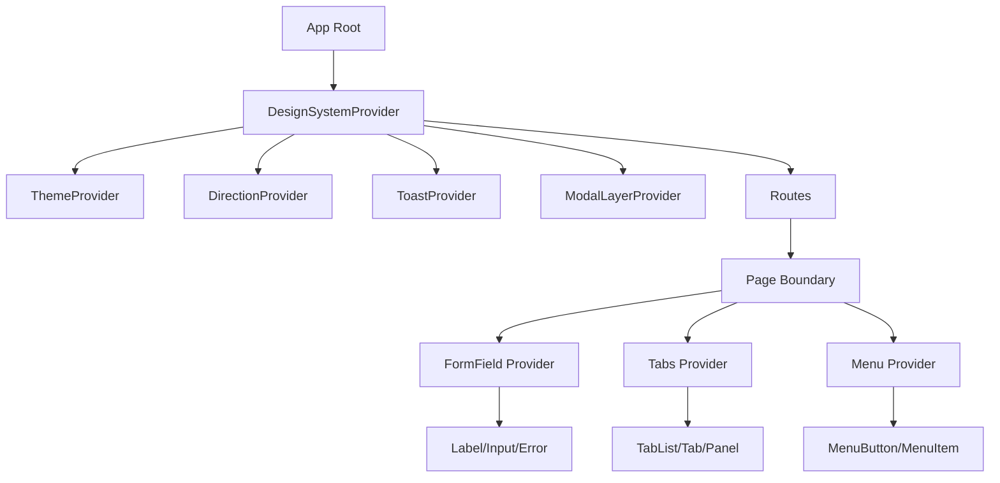
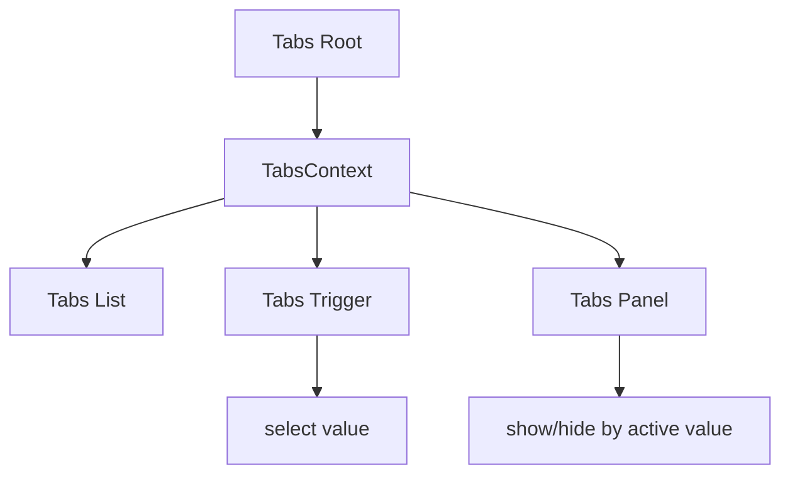

# Part 037 — Context and Design Systems

Part sebelumnya membahas Context sebagai **capability passing**. Sekarang kita pakai mental model itu untuk salah satu area paling nyata di aplikasi besar: **design system**.

Design system yang matang bukan kumpulan komponen cantik. Design system adalah **kontrak UI lintas produk**:

```txt
visual consistency
+ interaction consistency
+ accessibility consistency
+ composition consistency
+ migration consistency
```

Context sering muncul di design system karena banyak komponen perlu “beradaptasi terhadap lingkungan” tanpa prop drilling berlebihan.

Contoh:

```tsx
<AppThemeProvider mode="dark" density="compact" dir="rtl">
  <FormField name="email" error="Email is required">
    <Label>Email</Label>
    <Input />
    <FieldError />
  </FormField>
</AppThemeProvider>
```

`Input` tidak perlu menerima semua prop ini secara eksplisit:

```tsx
<Input
  id="email"
  aria-describedby="email-error"
  aria-invalid={true}
  density="compact"
  dir="rtl"
  colorMode="dark"
/>
```

Sebagian informasi memang lebih cocok mengalir lewat context karena ia adalah **ambient UI environment**.

Tetapi ini juga area yang mudah rusak. Context design system yang buruk membuat komponen menjadi magic, sulit dites, sering rerender, dan sulit dipakai di luar provider utama.

Tujuan part ini: memahami **Context sebagai infrastruktur design system**, bukan sebagai tempat membuang semua state UI.

---

## 1. The Core Idea

Context dalam design system biasanya membawa salah satu dari tiga hal:

| Jenis context | Contoh | Karakteristik |
|---|---|---|
| Environment context | theme, direction, locale, density | Berlaku untuk subtree luas, jarang berubah |
| Structural context | form field, tabs, accordion, menu | Berlaku untuk compound component kecil |
| Capability context | toast, modal, layer manager, focus manager | Memberi command terbatas ke subtree |

Ketiganya berbeda.

```txt
Environment context = "komponen hidup di lingkungan apa?"
Structural context  = "komponen ini bagian dari struktur apa?"
Capability context  = "komponen ini boleh meminta apa?"
```

Kesalahan umum adalah mencampur semuanya ke satu provider besar.

```tsx
// Bad smell
<AppContext value={{
  theme,
  density,
  user,
  permissions,
  selectedRows,
  modalState,
  openModal,
  formErrors,
  currentTab,
  queryResult,
}}>
  {children}
</AppContext>
```

Itu bukan design system. Itu global dumping ground.

---

## 2. Mental Model: Design System Context Is Scoped Ambient Input

React component adalah function dari:

```txt
props + state + context -> UI
```

Dalam design system, context sebaiknya merepresentasikan **ambient input** yang masuk akal dibaca banyak komponen.

Contoh ambient input:

- theme mode,
- CSS variable namespace,
- direction `ltr`/`rtl`,
- density `comfortable`/`compact`,
- form field id,
- disabled/readOnly state dari field group,
- validation status,
- compound component registry,
- layer/z-index manager,
- focus scope.

Ambient input berbeda dari business data.

```txt
Good context:
  Button membaca density dari DesignSystemProvider.

Bad context:
  Button membaca currentInvoice dari AppContext.
```

Sebuah komponen design system harus bisa dipakai di banyak domain. Begitu ia membaca data domain langsung, ia berhenti menjadi primitive dan berubah menjadi product component.

---

## 3. Provider Layering in a Design System

Aplikasi production biasanya punya beberapa lapisan provider.



Jangan semua provider harus global. Gunakan scope sesuai kebutuhan.

| Provider | Scope ideal | Kenapa |
|---|---|---|
| Theme | app atau product area | Banyak komponen butuh mode/tokens |
| Direction | app atau page | Layout dan keyboard behavior bisa berubah |
| Density | app, page, panel, table | Bisa beda antar area |
| Toast | app | Biasanya command global |
| Modal layer | app | Butuh portal root dan stacking global |
| Form field | field-level | Hanya label/input/error di field itu |
| Tabs | tabs root | Hanya tab parts terkait |
| Menu | menu root | Hanya menu parts terkait |
| Table state | table root atau external store | Biasanya terlalu volatile untuk context global |

Prinsipnya:

```txt
Provider scope harus sekecil mungkin, tapi sebesar yang diperlukan.
```

---

## 4. Theme Context: What Should It Contain?

Theme context sering menjadi provider pertama dalam design system.

Namun ada dua jenis theme data:

| Data | Cocok di Context? | Lebih cocok di CSS? |
|---|---:|---:|
| Current mode: `light/dark/system` | Ya | Kadang juga attribute DOM |
| Token values: colors, spacing, radius | Tidak selalu | Ya, CSS variables |
| Runtime setter: `setMode` | Ya, sebagai capability | Tidak |
| Resolved mode | Ya, jika perlu JS behavior | Bisa via DOM attr |
| Full token map besar | Hati-hati | Biasanya CSS variables |

Kesalahan umum:

```tsx
<ThemeContext value={{
  colors: hugeColorObject,
  spacing: hugeSpacingObject,
  typography: hugeTypographyObject,
  mode,
  setMode,
}}>
```

Setiap perubahan identity object dapat menyentuh semua consumer. Untuk design system modern, token visual lebih baik diekspresikan sebagai CSS custom properties.

```css
:root {
  --ds-color-bg: white;
  --ds-color-fg: black;
  --ds-radius-md: 8px;
}

[data-theme="dark"] {
  --ds-color-bg: #0b0b0f;
  --ds-color-fg: #f5f5f5;
}
```

Lalu React context hanya membawa state/command kecil.

```tsx
import { createContext, useContext, useMemo, useState } from 'react';

type ThemeMode = 'light' | 'dark' | 'system';
type ResolvedTheme = 'light' | 'dark';

type ThemeContextValue = {
  mode: ThemeMode;
  resolvedTheme: ResolvedTheme;
  setMode: (mode: ThemeMode) => void;
};

const ThemeContext = createContext<ThemeContextValue | null>(null);

export function ThemeProvider({ children }: { children: React.ReactNode }) {
  const [mode, setMode] = useState<ThemeMode>('system');

  // Simplified. Real implementation would subscribe to prefers-color-scheme.
  const resolvedTheme: ResolvedTheme = mode === 'system' ? 'light' : mode;

  const value = useMemo(
    () => ({ mode, resolvedTheme, setMode }),
    [mode, resolvedTheme]
  );

  return (
    <ThemeContext value={value}>
      <div data-theme={resolvedTheme}>{children}</div>
    </ThemeContext>
  );
}

export function useTheme() {
  const value = useContext(ThemeContext);
  if (!value) {
    throw new Error('useTheme must be used inside ThemeProvider');
  }
  return value;
}
```

Catatan penting: jika styling bisa diselesaikan oleh CSS, jangan memaksa semua component membaca Context hanya untuk menentukan class.

```tsx
// Often unnecessary
function Button() {
  const { resolvedTheme } = useTheme();
  return <button className={resolvedTheme === 'dark' ? 'darkBtn' : 'lightBtn'} />;
}

// Better for many visual concerns
function Button(props: ButtonProps) {
  return <button className="ds-button" {...props} />;
}
```

CSS variables membiarkan browser menyelesaikan styling tanpa React rerender.

---

## 5. Density Context

Density adalah contoh bagus untuk scoped environment context.

Aplikasi enterprise sering punya mode:

```txt
comfortable -> spacing besar, mudah dibaca
compact     -> spacing kecil, cocok data-dense admin UI
```

Density bisa global, tapi sering lebih baik scoped.

```tsx
<DensityProvider value="compact">
  <CaseTable />
</DensityProvider>

<DensityProvider value="comfortable">
  <CaseSummaryCard />
</DensityProvider>
```

Implementasi sederhana:

```tsx
type Density = 'comfortable' | 'compact';

const DensityContext = createContext<Density>('comfortable');

export function DensityProvider({
  value,
  children,
}: {
  value: Density;
  children: React.ReactNode;
}) {
  return (
    <DensityContext value={value}>
      <div data-density={value}>{children}</div>
    </DensityContext>
  );
}

export function useDensity() {
  return useContext(DensityContext);
}
```

Untuk sebagian besar styling, gunakan `data-density` + CSS variables.

```css
[data-density="comfortable"] {
  --ds-control-height: 40px;
  --ds-control-padding-x: 12px;
}

[data-density="compact"] {
  --ds-control-height: 32px;
  --ds-control-padding-x: 8px;
}

.ds-input {
  min-height: var(--ds-control-height);
  padding-inline: var(--ds-control-padding-x);
}
```

Komponen hanya perlu membaca density jika behavior berubah, bukan hanya tampilan.

Contoh behavior:

```tsx
function DataGridVirtualizer() {
  const density = useDensity();
  const estimatedRowHeight = density === 'compact' ? 32 : 44;

  return <VirtualizedTable estimatedRowHeight={estimatedRowHeight} />;
}
```

Rule:

```txt
Visual adaptation -> CSS variables / data attributes.
Behavioral adaptation -> Context read boleh dipakai.
```

---

## 6. Direction Context: LTR, RTL, and Keyboard Behavior

Direction bukan sekadar CSS.

Untuk `dir="rtl"`, beberapa keyboard interaction berubah makna. Misalnya horizontal navigation dalam tablist atau carousel bisa perlu membalik interpretasi ArrowLeft/ArrowRight.

```tsx
type Direction = 'ltr' | 'rtl';

const DirectionContext = createContext<Direction>('ltr');

export function DirectionProvider({
  dir,
  children,
}: {
  dir: Direction;
  children: React.ReactNode;
}) {
  return (
    <DirectionContext value={dir}>
      <div dir={dir}>{children}</div>
    </DirectionContext>
  );
}

export function useDirection() {
  return useContext(DirectionContext);
}
```

Keyboard helper:

```tsx
function getHorizontalIntent(event: KeyboardEvent, dir: 'ltr' | 'rtl') {
  if (event.key === 'ArrowRight') {
    return dir === 'rtl' ? 'previous' : 'next';
  }

  if (event.key === 'ArrowLeft') {
    return dir === 'rtl' ? 'next' : 'previous';
  }

  return null;
}
```

Jangan menyebarkan `dir` manual ke semua component. Direction adalah ambient UI environment yang cocok untuk Context.

---

## 7. Form Field Context

Form field adalah contoh structural context paling penting.

Masalah yang ingin diselesaikan:

```tsx
<label htmlFor="email">Email</label>
<input id="email" aria-describedby="email-hint email-error" aria-invalid="true" />
<p id="email-hint">Use your work email.</p>
<p id="email-error">Email is required.</p>
```

Jika semua id dikirim manual via props, API form menjadi berisik dan mudah salah.

Field context membantu menyatukan:

- `id`,
- `name`,
- `labelId`,
- `descriptionId`,
- `errorId`,
- `required`,
- `disabled`,
- `readOnly`,
- `invalid`,
- error message,
- described-by composition.

```tsx
import { createContext, useContext, useId, useMemo } from 'react';

type FieldContextValue = {
  id: string;
  name?: string;
  labelId: string;
  descriptionId: string;
  errorId: string;
  invalid: boolean;
  required: boolean;
  disabled: boolean;
  describedBy: string | undefined;
};

const FieldContext = createContext<FieldContextValue | null>(null);

export function Field({
  id: explicitId,
  name,
  error,
  required = false,
  disabled = false,
  children,
}: {
  id?: string;
  name?: string;
  error?: string;
  required?: boolean;
  disabled?: boolean;
  children: React.ReactNode;
}) {
  const generatedId = useId();
  const id = explicitId ?? generatedId;
  const invalid = Boolean(error);

  const labelId = `${id}-label`;
  const descriptionId = `${id}-description`;
  const errorId = `${id}-error`;

  const describedBy = invalid
    ? `${descriptionId} ${errorId}`
    : descriptionId;

  const value = useMemo(
    () => ({
      id,
      name,
      labelId,
      descriptionId,
      errorId,
      invalid,
      required,
      disabled,
      describedBy,
    }),
    [id, name, labelId, descriptionId, errorId, invalid, required, disabled, describedBy]
  );

  return <FieldContext value={value}>{children}</FieldContext>;
}

export function useFieldContext(componentName: string) {
  const value = useContext(FieldContext);
  if (!value) {
    throw new Error(`${componentName} must be used inside <Field>`);
  }
  return value;
}
```

Field parts:

```tsx
export function Label({ children }: { children: React.ReactNode }) {
  const field = useFieldContext('Label');

  return (
    <label id={field.labelId} htmlFor={field.id}>
      {children}
      {field.required ? <span aria-hidden="true"> *</span> : null}
    </label>
  );
}

export function Input(props: React.InputHTMLAttributes<HTMLInputElement>) {
  const field = useFieldContext('Input');

  return (
    <input
      {...props}
      id={field.id}
      name={props.name ?? field.name}
      disabled={props.disabled ?? field.disabled}
      required={props.required ?? field.required}
      aria-labelledby={field.labelId}
      aria-describedby={field.describedBy}
      aria-invalid={field.invalid || undefined}
    />
  );
}

export function FieldDescription({ children }: { children: React.ReactNode }) {
  const field = useFieldContext('FieldDescription');
  return <p id={field.descriptionId}>{children}</p>;
}

export function FieldError({ children }: { children?: React.ReactNode }) {
  const field = useFieldContext('FieldError');

  if (!field.invalid && !children) return null;

  return (
    <p id={field.errorId} role="alert">
      {children}
    </p>
  );
}
```

Ini contoh Context yang sehat:

- scope kecil,
- value relevan untuk semua part,
- tidak global,
- membantu accessibility,
- API lebih bersih,
- failure ketika salah pakai jelas.

---

## 8. Field Context and Form Libraries

Jangan campuradukkan field context design system dengan form state library.

```txt
Form library state:
  value, touched, dirty, validation lifecycle, submission lifecycle

Design system field context:
  id, label linkage, invalid flag, required flag, disabled flag, described-by ids
```

Design system tidak perlu tahu `react-hook-form`, Formik, TanStack Form, atau state manager lain.

Lebih baik buat adapter di layer aplikasi.

```tsx
function CaseFormTextField({ name, label }: { name: string; label: string }) {
  const field = useController({ name });
  const error = field.fieldState.error?.message;

  return (
    <Field name={name} error={error} required>
      <Label>{label}</Label>
      <Input
        value={field.field.value ?? ''}
        onChange={field.field.onChange}
        onBlur={field.field.onBlur}
      />
      <FieldError>{error}</FieldError>
    </Field>
  );
}
```

Dengan begini:

- design system tetap library-agnostic,
- aplikasi bebas memilih form engine,
- accessibility contract tetap terpusat,
- migration form library tidak merusak semua primitive.

---

## 9. Disabled, ReadOnly, and Required Context

Banyak design system butuh group-level state.

```tsx
<Fieldset disabled>
  <TextField name="firstName" />
  <TextField name="lastName" />
</Fieldset>
```

Kita bisa punya `FormControlContext` atau `FieldsetContext`.

```tsx
type FieldsetContextValue = {
  disabled: boolean;
  readOnly: boolean;
};

const FieldsetContext = createContext<FieldsetContextValue>({
  disabled: false,
  readOnly: false,
});

export function Fieldset({
  disabled = false,
  readOnly = false,
  children,
}: {
  disabled?: boolean;
  readOnly?: boolean;
  children: React.ReactNode;
}) {
  const value = useMemo(() => ({ disabled, readOnly }), [disabled, readOnly]);

  return (
    <FieldsetContext value={value}>
      <fieldset disabled={disabled}>{children}</fieldset>
    </FieldsetContext>
  );
}

export function useFieldsetContext() {
  return useContext(FieldsetContext);
}
```

Lalu field bisa merge state dari fieldset dan props lokal.

```tsx
function TextInput(props: React.InputHTMLAttributes<HTMLInputElement>) {
  const fieldset = useFieldsetContext();

  return (
    <input
      {...props}
      disabled={props.disabled ?? fieldset.disabled}
      readOnly={props.readOnly ?? fieldset.readOnly}
    />
  );
}
```

Tetapi hati-hati: merge rule harus eksplisit.

```txt
Local prop override group context?
Group context override local prop?
Apakah disabled bisa di-enable lagi di child?
Apakah readonly berbeda dari disabled?
```

Untuk state yang berdampak accessibility, kontraknya harus konsisten.

---

## 10. Compound Component Context in Design Systems

Banyak primitive design system memakai compound component:

```tsx
<Tabs defaultValue="details">
  <Tabs.List>
    <Tabs.Trigger value="details">Details</Tabs.Trigger>
    <Tabs.Trigger value="history">History</Tabs.Trigger>
  </Tabs.List>
  <Tabs.Panel value="details">...</Tabs.Panel>
  <Tabs.Panel value="history">...</Tabs.Panel>
</Tabs>
```

Context menghubungkan parts:



Contoh simplified:

```tsx
type TabsContextValue = {
  value: string;
  setValue: (value: string) => void;
  baseId: string;
};

const TabsContext = createContext<TabsContextValue | null>(null);

function useTabsContext(component: string) {
  const value = useContext(TabsContext);
  if (!value) throw new Error(`${component} must be used inside <Tabs>`);
  return value;
}

export function Tabs({
  value: controlledValue,
  defaultValue,
  onValueChange,
  children,
}: {
  value?: string;
  defaultValue?: string;
  onValueChange?: (value: string) => void;
  children: React.ReactNode;
}) {
  const baseId = useId();
  const [uncontrolledValue, setUncontrolledValue] = useState(defaultValue ?? '');

  const isControlled = controlledValue !== undefined;
  const value = isControlled ? controlledValue : uncontrolledValue;

  const setValue = useCallback(
    (nextValue: string) => {
      if (!isControlled) setUncontrolledValue(nextValue);
      onValueChange?.(nextValue);
    },
    [isControlled, onValueChange]
  );

  const contextValue = useMemo(
    () => ({ value, setValue, baseId }),
    [value, setValue, baseId]
  );

  return <TabsContext value={contextValue}>{children}</TabsContext>;
}
```

Trigger:

```tsx
export function TabsTrigger({
  value,
  children,
}: {
  value: string;
  children: React.ReactNode;
}) {
  const tabs = useTabsContext('TabsTrigger');
  const selected = tabs.value === value;
  const triggerId = `${tabs.baseId}-trigger-${value}`;
  const panelId = `${tabs.baseId}-panel-${value}`;

  return (
    <button
      id={triggerId}
      role="tab"
      type="button"
      aria-selected={selected}
      aria-controls={panelId}
      tabIndex={selected ? 0 : -1}
      onClick={() => tabs.setValue(value)}
    >
      {children}
    </button>
  );
}
```

Panel:

```tsx
export function TabsPanel({
  value,
  children,
}: {
  value: string;
  children: React.ReactNode;
}) {
  const tabs = useTabsContext('TabsPanel');
  const selected = tabs.value === value;
  const triggerId = `${tabs.baseId}-trigger-${value}`;
  const panelId = `${tabs.baseId}-panel-${value}`;

  return (
    <div
      id={panelId}
      role="tabpanel"
      aria-labelledby={triggerId}
      hidden={!selected}
    >
      {selected ? children : null}
    </div>
  );
}
```

Context di sini bukan global state. Ini **structural coordination**.

---

## 11. Accessibility Contract Is Part of the Design System

Design system context sering berfungsi untuk menjaga accessibility linkage.

Contoh linkage:

| Pattern | Linkage |
|---|---|
| Field | label ↔ input ↔ description ↔ error |
| Tabs | tab ↔ tabpanel |
| Accordion | header/button ↔ panel |
| Menu | button ↔ popup menu, active item |
| Dialog | trigger/open command ↔ title/description/focus scope |
| Tooltip | trigger ↔ tooltip content |
| Combobox | input ↔ listbox ↔ active option |

Context membantu karena setiap part butuh id dan state yang sama.

Namun context tidak menggantikan pemahaman ARIA. Misalnya untuk Tabs, kita tetap perlu role, id linkage, keyboard interaction, focus behavior, dan activation model yang benar.

```txt
Context coordinates data.
ARIA defines semantics.
Keyboard logic defines interaction.
Focus management defines usability.
```

Design system yang baik menyembunyikan kompleksitas ini dari product engineer.

---

## 12. Data Attributes as Public Styling Surface

Context sering dipakai oleh component untuk menentukan data attributes.

```tsx
<button
  data-state={selected ? 'active' : 'inactive'}
  data-disabled={disabled ? '' : undefined}
  data-density={density}
/>
```

Keuntungan:

- styling bisa dilakukan tanpa membaca React context di child lain,
- state visual dapat terlihat di DOM,
- testing lebih mudah,
- integrasi CSS lebih stabil,
- design token bisa di-layer.

Contoh:

```css
.ds-tabs-trigger[data-state="active"] {
  border-block-end-color: var(--ds-color-accent);
}

.ds-button[data-density="compact"] {
  min-height: 32px;
}
```

Tetapi jangan jadikan data attributes sebagai domain state bocor.

```tsx
// Bad smell
<div data-current-invoice-status="under-investigation" />
```

Untuk design system, data attribute sebaiknya menyatakan **UI state**, bukan domain detail.

---

## 13. Design Tokens: Context vs CSS Variables

Gunakan aturan ini:

```txt
Token visual stabil      -> CSS variables
Mode/current selection   -> Context or DOM attribute
Behavioral decision      -> Context
Huge token dictionary    -> Avoid in context
```

Contoh buruk:

```tsx
const token = useContext(TokenContext);
return <div style={{ color: token.colors.text.default }} />;
```

Itu membuat banyak component bergantung ke object token JS.

Contoh lebih baik:

```tsx
return <div className="ds-card" />;
```

```css
.ds-card {
  color: var(--ds-color-text-default);
  background: var(--ds-color-surface-default);
  border-radius: var(--ds-radius-md);
}
```

Jika token perlu dihitung di runtime, batasi scope-nya.

```tsx
<ColorSchemeProvider scheme={customerBrandScheme}>
  <PartnerPortal />
</ColorSchemeProvider>
```

Jangan membuat semua component membaca semua token hanya karena “bisa”.

---

## 14. Slot Context

Beberapa design system memakai slot context untuk menyebarkan props dari parent ke bagian tertentu.

Contoh:

```tsx
<Card>
  <Card.Header />
  <Card.Body />
  <Card.Footer />
</Card>
```

`Card.Header` mungkin perlu tahu variant/density/elevation dari `Card`.

```tsx
type CardContextValue = {
  variant: 'plain' | 'outlined' | 'elevated';
  density: 'comfortable' | 'compact';
};

const CardContext = createContext<CardContextValue | null>(null);

function Card({
  variant = 'plain',
  density = 'comfortable',
  children,
}: {
  variant?: CardContextValue['variant'];
  density?: CardContextValue['density'];
  children: React.ReactNode;
}) {
  const value = useMemo(() => ({ variant, density }), [variant, density]);

  return (
    <CardContext value={value}>
      <section data-variant={variant} data-density={density} className="ds-card">
        {children}
      </section>
    </CardContext>
  );
}

function CardHeader({ children }: { children: React.ReactNode }) {
  const card = useContext(CardContext);

  return (
    <header
      className="ds-card-header"
      data-card-variant={card?.variant}
      data-density={card?.density}
    >
      {children}
    </header>
  );
}
```

Tetapi pertimbangkan apakah context benar-benar perlu. Jika CSS descendant selector cukup, jangan tambahkan Context.

```css
.ds-card[data-density="compact"] .ds-card-header {
  padding: 8px;
}
```

Rule:

```txt
Jika child hanya perlu styling dari parent, CSS sering lebih murah dari Context.
Jika child perlu behavior/ARIA/id/registration, Context lebih masuk akal.
```

---

## 15. Registry Context

Beberapa komponen headless perlu mendaftarkan item.

Contoh:

- menu items,
- listbox options,
- roving focus items,
- accordion items,
- dynamic tabs,
- command palette items.

Context membawa registry API.

```tsx
type ItemRecord = {
  id: string;
  ref: React.RefObject<HTMLElement | null>;
  disabled: boolean;
};

type RovingFocusContextValue = {
  registerItem: (item: ItemRecord) => () => void;
  moveNext: () => void;
  movePrevious: () => void;
  activeId: string | null;
};
```

Important: registry biasanya mutable internal, bukan state yang harus merender semua consumer setiap perubahan kecil.

```tsx
function RovingFocusProvider({ children }: { children: React.ReactNode }) {
  const itemsRef = useRef<Map<string, ItemRecord>>(new Map());
  const [activeId, setActiveId] = useState<string | null>(null);

  const registerItem = useCallback((item: ItemRecord) => {
    itemsRef.current.set(item.id, item);

    return () => {
      itemsRef.current.delete(item.id);
    };
  }, []);

  const moveNext = useCallback(() => {
    const items = Array.from(itemsRef.current.values()).filter(item => !item.disabled);
    if (items.length === 0) return;

    const currentIndex = items.findIndex(item => item.id === activeId);
    const next = items[(currentIndex + 1) % items.length];
    setActiveId(next.id);
    next.ref.current?.focus();
  }, [activeId]);

  const movePrevious = useCallback(() => {
    const items = Array.from(itemsRef.current.values()).filter(item => !item.disabled);
    if (items.length === 0) return;

    const currentIndex = items.findIndex(item => item.id === activeId);
    const previous = items[(currentIndex - 1 + items.length) % items.length];
    setActiveId(previous.id);
    previous.ref.current?.focus();
  }, [activeId]);

  const value = useMemo(
    () => ({ registerItem, moveNext, movePrevious, activeId }),
    [registerItem, moveNext, movePrevious, activeId]
  );

  return <RovingFocusContext value={value}>{children}</RovingFocusContext>;
}
```

Perhatikan trade-off: karena `activeId` ada di context, semua consumer context bisa rerender saat active item berubah. Untuk menu kecil, ini baik-baik saja. Untuk list besar, gunakan external store atau subscription granular.

---

## 16. Layer Manager Context

Design system sering perlu mengatur overlay:

- Dialog,
- Popover,
- Tooltip,
- Dropdown menu,
- Toast,
- Command palette.

Masalah overlay bukan hanya render.

Masalahnya:

```txt
portal host
+ stacking order
+ escape key
+ outside click
+ focus return
+ inert background
+ scroll lock
+ nested overlay
+ dismissal policy
```

Layer manager context bisa memberi capability:

```tsx
type LayerManager = {
  registerLayer: (layer: LayerRecord) => () => void;
  isTopLayer: (id: string) => boolean;
  dismissTopLayer: () => void;
};
```

Overlay component membaca capability itu.

```tsx
function Dialog({ open, onOpenChange, children }: DialogProps) {
  const layerManager = useLayerManager();
  const id = useId();

  useEffect(() => {
    if (!open) return;

    return layerManager.registerLayer({
      id,
      type: 'dialog',
      dismiss: () => onOpenChange(false),
    });
  }, [open, id, layerManager, onOpenChange]);

  if (!open) return null;

  return createPortal(
    <div role="dialog" aria-modal="true">
      {children}
    </div>,
    document.body
  );
}
```

Context di sini bukan menyebarkan semua modal state. Context hanya menyebarkan **layer coordination capability**.

---

## 17. The Design System Boundary

Sebuah design system harus punya batas domain.

```txt
Design system component:
  Button, TextField, Dialog, Tabs, Menu, DataTable primitive

Product component:
  CaseStatusBadge, EnforcementActionPanel, InvoiceApprovalTimeline
```

Context design system tidak boleh membaca domain context secara langsung.

```tsx
// Bad smell
function Button(props: ButtonProps) {
  const permission = usePermission();
  const caseStatus = useCaseStatus();

  return <button disabled={!permission.canEditCase || caseStatus === 'closed'} />;
}
```

Lebih baik:

```tsx
function Button(props: ButtonProps) {
  return <button {...props} />;
}

function EditCaseButton({ caseId }: { caseId: string }) {
  const permission = useCasePermission(caseId);

  return (
    <Button disabled={!permission.canEdit}>
      Edit case
    </Button>
  );
}
```

Design system boleh support permission-related visual states, tetapi bukan memutuskan domain permission.

```tsx
<Button disabled tooltip="You do not have permission to edit this case">
  Edit
</Button>
```

---

## 18. Product Theme Overrides

Di enterprise, satu aplikasi bisa punya area berbeda:

- admin console,
- public portal,
- partner portal,
- enforcement workspace,
- reporting dashboard.

Masing-masing bisa override theme/density/layout.

```tsx
<DesignSystemProvider>
  <PublicPortalTheme>
    <PublicRoutes />
  </PublicPortalTheme>

  <WorkspaceTheme density="compact">
    <InternalRoutes />
  </WorkspaceTheme>
</DesignSystemProvider>
```

Context override harus predictable.

```txt
Provider terdekat menang.
Nested provider tidak boleh membuat state parent corrupt.
Override harus documented.
```

Contoh:

```tsx
function Surface({ tone = 'default', children }: SurfaceProps) {
  return (
    <SurfaceToneContext value={tone}>
      <section data-surface-tone={tone}>{children}</section>
    </SurfaceToneContext>
  );
}
```

Komponen di dalam surface bisa adapt.

```tsx
function Divider() {
  const tone = useContext(SurfaceToneContext);
  return <hr data-surface-tone={tone} />;
}
```

Tetapi jangan terlalu banyak override yang saling bertumpuk tanpa observability. UI bisa menjadi sulit ditebak.

---

## 19. Context and CSS Cascade: Use Both Deliberately

Context dan CSS cascade memecahkan masalah berbeda.

| Masalah | CSS cascade | React Context |
|---|---:|---:|
| Warna berdasarkan theme | Sangat cocok | Kadang perlu untuk JS behavior |
| Padding berdasarkan density | Sangat cocok | Kadang perlu untuk virtualization |
| Direction layout | Cocok via `dir` | Perlu untuk keyboard behavior |
| ARIA id linkage | Tidak | Sangat cocok |
| Register menu item | Tidak | Cocok |
| Open modal command | Tidak | Cocok |
| Token visual besar | Cocok via variables | Hindari object besar |
| Read current feature flag | Tidak | Cocok jika scoped |

React engineer yang matang tidak memindahkan semua hal ke JavaScript. Browser punya mekanisme sendiri yang lebih murah untuk styling.

Rule praktis:

```txt
Style belongs to CSS when possible.
Behavior coordination belongs to React.
Cross-cutting scoped capability belongs to Context.
```

---

## 20. Performance Model for Design System Context

Context design system biasanya aman jika:

- value kecil,
- update jarang,
- consumer ringan,
- scope provider kecil,
- styling tidak memaksa rerender,
- high-frequency state tidak dimasukkan ke context.

Risiko muncul ketika context membawa:

- hover/focus state banyak item,
- scroll position,
- mouse coordinates,
- active cell dalam grid besar,
- query result besar,
- entire form values,
- entire app config object yang berubah identity,
- token dictionary besar yang dibuat ulang.

Pakai rumus dari Part 035:

```txt
cost = update frequency × consumer fan-out × render weight × interaction sensitivity
```

Contoh buruk:

```tsx
<GridContext value={{ hoveredRowId, selectedRows, columns, rows, sort, filter }}>
  {children}
</GridContext>
```

Hover row berubah sangat sering. Jika semua cell membaca context yang sama, table besar akan bermasalah.

Lebih baik:

- context hanya untuk static grid configuration dan command API,
- row/cell subscription pakai external store atau props granular,
- visual hover pakai CSS jika bisa,
- selection pakai selector-based subscription untuk list besar.

---

## 21. Design System Context API Checklist

Sebelum menambahkan Context baru ke design system, jawab ini:

```txt
1. Apakah value ini benar-benar ambient untuk subtree?
2. Apakah value ini domain-agnostic?
3. Apakah scope provider sudah sekecil mungkin?
4. Apakah update frequency rendah?
5. Apakah styling bisa diselesaikan via CSS variables/data attributes?
6. Apakah context membawa object besar?
7. Apakah ada default value yang bisa menutupi missing provider bug?
8. Apakah consumer punya custom hook dengan error message jelas?
9. Apakah context mempermudah accessibility contract?
10. Apakah context bisa di-override di test/storybook?
11. Apakah provider menyebabkan remount tidak sengaja?
12. Apakah ada migration path jika context menjadi bottleneck?
```

Jika banyak jawaban tidak jelas, jangan buru-buru menambah context.

---

## 22. Testing Design System Context

Test design system context pada level behavior, bukan snapshot styling saja.

### 22.1 Field context test

```tsx
it('connects label, input, description, and error', () => {
  render(
    <Field error="Required" required>
      <Label>Email</Label>
      <Input />
      <FieldDescription>Use your work email.</FieldDescription>
      <FieldError>Required</FieldError>
    </Field>
  );

  const input = screen.getByLabelText(/email/i);

  expect(input).toHaveAttribute('aria-invalid', 'true');
  expect(input).toHaveAccessibleDescription(/use your work email/i);
  expect(screen.getByRole('alert')).toHaveTextContent('Required');
});
```

### 22.2 Direction behavior test

```tsx
it('reverses horizontal intent in RTL mode', async () => {
  render(
    <DirectionProvider dir="rtl">
      <Tabs defaultValue="one">
        <Tabs.List>
          <Tabs.Trigger value="one">One</Tabs.Trigger>
          <Tabs.Trigger value="two">Two</Tabs.Trigger>
        </Tabs.List>
      </Tabs>
    </DirectionProvider>
  );

  await user.keyboard('{ArrowLeft}');

  expect(screen.getByRole('tab', { name: /two/i })).toHaveAttribute('aria-selected', 'true');
});
```

### 22.3 Provider override test

```tsx
it('uses nearest density provider', () => {
  render(
    <DensityProvider value="comfortable">
      <Button>Comfortable</Button>
      <DensityProvider value="compact">
        <Button>Compact</Button>
      </DensityProvider>
    </DensityProvider>
  );

  expect(screen.getByRole('button', { name: /comfortable/i })).toHaveAttribute(
    'data-density',
    'comfortable'
  );

  expect(screen.getByRole('button', { name: /compact/i })).toHaveAttribute(
    'data-density',
    'compact'
  );
});
```

---

## 23. Storybook as Context Laboratory

Storybook bagus untuk menguji variasi context.

Buat decorator:

```tsx
export const decorators = [
  (Story, context) => (
    <ThemeProvider initialMode={context.globals.theme}>
      <DensityProvider value={context.globals.density}>
        <DirectionProvider dir={context.globals.dir}>
          <Story />
        </DirectionProvider>
      </DensityProvider>
    </ThemeProvider>
  ),
];
```

Lalu setiap component diuji pada matrix:

```txt
light/dark
comfortable/compact
ltr/rtl
valid/invalid
enabled/disabled/readOnly
controlled/uncontrolled
keyboard/mouse/touch
```

Design system bug sering hanya muncul pada kombinasi context tertentu.

---

## 24. Anti-Example: Theme Context Doing Too Much

```tsx
type BadThemeContextValue = {
  theme: Theme;
  setTheme: (theme: Theme) => void;
  spacing: Record<string, number>;
  colors: Record<string, string>;
  typography: Record<string, unknown>;
  currentUserBrand: Brand;
  permissions: PermissionMap;
  featureFlags: FeatureFlagMap;
  isSidebarOpen: boolean;
  setSidebarOpen: (open: boolean) => void;
};
```

Masalah:

- theme dicampur dengan user/domain/layout,
- object besar membuat identity sulit stabil,
- consumer tidak jelas membaca apa,
- rerender propagation luas,
- testing perlu provider raksasa,
- design system bergantung pada product domain.

Refactor:

```txt
ThemeProvider        -> mode/resolved mode + CSS variable boundary
DensityProvider      -> density only
PermissionProvider   -> product/application layer, bukan design system primitive
FeatureFlagProvider  -> capability/config layer
SidebarProvider      -> layout boundary
```

---

## 25. Anti-Example: Field Context Holding Field Value

```tsx
<FieldContext value={{ value, setValue, error, touched, dirty, id }}>
```

Ini terlihat praktis, tetapi berbahaya jika design system field menjadi form engine tersembunyi.

Masalah:

- semua field parts bisa rerender saat value berubah,
- design system terkunci ke state model tertentu,
- sulit integrasi dengan form library,
- uncontrolled input menjadi sulit,
- validation lifecycle bercampur dengan ARIA/id linkage.

Lebih baik:

```txt
Design system FieldContext:
  id, describedBy, invalid, disabled, required

Form adapter:
  value, onChange, onBlur, error, touched, dirty
```

---

## 26. Anti-Example: Context-Only Styling

```tsx
function Text({ children }: { children: React.ReactNode }) {
  const theme = useTheme();
  const density = useDensity();

  return (
    <span style={{
      color: theme.colors.text,
      fontSize: density === 'compact' ? 12 : 14,
    }}>
      {children}
    </span>
  );
}
```

Ini memindahkan cascade CSS ke render React.

Lebih baik:

```tsx
function Text({ children }: { children: React.ReactNode }) {
  return <span className="ds-text">{children}</span>;
}
```

```css
.ds-text {
  color: var(--ds-color-text-default);
  font-size: var(--ds-font-size-body);
}
```

Context boleh menentukan attribute root:

```tsx
<div data-theme={resolvedTheme} data-density={density}>{children}</div>
```

Lalu CSS menyelesaikan detail visual.

---

## 27. Decision Matrix

| Kebutuhan | Pakai props | Pakai Context | Pakai CSS vars/data attr | Pakai external store |
|---|---:|---:|---:|---:|
| Button variant eksplisit | Ya | Tidak | Bisa | Tidak |
| Theme mode subtree | Kadang | Ya | Ya | Tidak |
| Color token values | Tidak | Jarang | Ya | Tidak |
| Field id linkage | Bisa, tapi noisy | Ya | Tidak | Tidak |
| Form value setiap input | Ya/adaptor | Jangan di DS context | Tidak | Kadang |
| Active tab small component | Bisa | Ya | Data attr output | Tidak |
| Active row huge grid | Tidak cukup | Hati-hati | CSS hover | Ya |
| Modal open command | Prop atau context | Ya | Tidak | Kadang |
| Toast command | Tidak praktis | Ya | Tidak | Kadang |
| Permission decision domain | Product props/hook | Product context | Tidak | Kadang |
| Design-system disabled group | Bisa | Ya | Data attr output | Tidak |

---

## 28. Failure Modes

### 28.1 Provider too wide

Provider global membawa state yang hanya dipakai satu feature.

```txt
Symptom:
  Semua aplikasi rerender saat satu panel berubah.

Fix:
  Turunkan provider ke feature boundary.
```

### 28.2 Context replaces CSS cascade

Semua component membaca theme context untuk styling.

```txt
Symptom:
  Theme switch membuat semua component rerender berat.

Fix:
  Pindahkan token visual ke CSS variables.
```

### 28.3 Design system reads domain context

Primitive membaca user/permission/case/invoice langsung.

```txt
Symptom:
  Button tidak bisa dipakai di luar app tertentu.

Fix:
  Pindahkan domain decision ke product component.
```

### 28.4 Field context becomes form engine

Field context menyimpan value/touched/dirty/validation lifecycle.

```txt
Symptom:
  Design system sulit diganti form library.

Fix:
  Pisahkan field accessibility context dari form state adapter.
```

### 28.5 Compound context becomes global store

Tabs/Menu/Accordion context dipakai di luar root kecil.

```txt
Symptom:
  Parts saling bergantung secara tidak jelas.

Fix:
  Batasi scope, enforce provider, expose public API eksplisit.
```

### 28.6 Unstable provider value

Provider membuat object/function baru tanpa alasan.

```txt
Symptom:
  Consumer rerender walau value logis tidak berubah.

Fix:
  Memoize value atau split context.
```

### 28.7 Missing provider silently uses default

Default value terlihat valid, bug tidak langsung muncul.

```txt
Symptom:
  Component behave salah di test/storybook tanpa error.

Fix:
  Gunakan strict context untuk context yang wajib.
```

---

## 29. Production Checklist

Gunakan checklist ini saat review design system context:

```txt
[ ] Context name spesifik, bukan AppContext/UIContext generic.
[ ] Value kecil dan jelas.
[ ] Scope provider minimal.
[ ] Styling utama memakai CSS variables/data attributes jika memungkinkan.
[ ] Context tidak membawa domain data.
[ ] Context tidak membawa high-frequency state besar.
[ ] Custom hook memberi error jelas saat provider hilang.
[ ] Provider value identity stabil.
[ ] Ada override story/test harness.
[ ] Accessibility contract dites.
[ ] RTL/density/theme variations dites.
[ ] Ada documented merge rule antara props lokal dan group context.
[ ] Ada migration path jika context menjadi bottleneck.
```

---

## 30. Key Takeaways

Design system context yang baik bukan tempat global state. Ia adalah mekanisme untuk menyebarkan **environment**, **structure**, dan **capability** dengan scope jelas.

```txt
Use Context for:
  ambient UI environment,
  compound component coordination,
  accessibility linkage,
  scoped capabilities.

Avoid Context for:
  token dictionary besar,
  high-frequency UI state,
  domain data,
  form value engine tersembunyi,
  styling yang bisa diselesaikan CSS.
```

Kalau component hanya perlu warna, ukuran, spacing, atau radius, sering kali CSS variables lebih tepat daripada `useContext`. Kalau component perlu id linkage, keyboard coordination, overlay manager, atau provider override, Context adalah alat yang sangat kuat.

React engineer senior tahu perbedaan itu.

---

## References

- React Docs — Passing Data Deeply with Context: https://react.dev/learn/passing-data-deeply-with-context
- React Docs — `createContext`: https://react.dev/reference/react/createContext
- React Docs — `useContext`: https://react.dev/reference/react/useContext
- React Docs — Components and Hooks Must Be Pure: https://react.dev/reference/rules/components-and-hooks-must-be-pure
- WAI-ARIA Authoring Practices Guide: https://www.w3.org/WAI/ARIA/apg/
- WAI-ARIA Tabs Pattern: https://www.w3.org/WAI/ARIA/apg/patterns/tabs/
