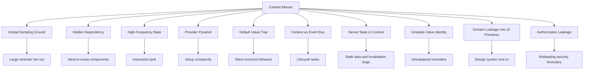

# Part 038 — Context Anti-Patterns

Part ini menutup Module 3 tentang Context Passing.

Kita sudah membahas:

- mental model Context,
- provider design,
- read pattern,
- update pattern,
- performance cost,
- capability passing,
- design system usage.

Sekarang kita bahas bagian yang paling sering terjadi di codebase besar: **Context anti-patterns**.

Context adalah alat yang nyaman. Justru karena nyaman, ia sering dipakai terlalu luas.

Masalah Context biasanya tidak muncul saat aplikasi kecil. Ia muncul saat:

```txt
jumlah fitur naik,
jumlah provider naik,
jumlah consumer naik,
update frequency naik,
dan domain logic mulai bocor ke primitive UI.
```

Context yang awalnya “menghindari prop drilling” berubah menjadi dependency graph tersembunyi.

Tujuan part ini: memberi peta bau arsitektur, gejala runtime, dan refactor path yang konkret.

---

## 1. Anti-Pattern Map



Setiap anti-pattern punya akar yang sama:

```txt
Context dipakai untuk menyembunyikan coupling, bukan mengelola dependency secara eksplisit.
```

---

## 2. Anti-Pattern: `AppContext`

Ini anti-pattern paling umum.

```tsx
type AppContextValue = {
  user: User;
  theme: Theme;
  permissions: PermissionMap;
  currentCase: Case;
  selectedRows: string[];
  filters: Filters;
  queryResult: QueryResult<Case[]>;
  isSidebarOpen: boolean;
  setSidebarOpen: (open: boolean) => void;
  openModal: (modal: ModalConfig) => void;
  refreshCases: () => Promise<void>;
};
```

Kelihatannya praktis karena semua bisa diakses di mana saja.

Namun ini membuat satu context menggabungkan banyak lifecycle berbeda:

| Value | Lifecycle |
|---|---|
| `user` | session-level |
| `theme` | app-level, jarang berubah |
| `currentCase` | route-level |
| `selectedRows` | page/table-level, sering berubah |
| `filters` | URL/page-level |
| `queryResult` | server cache lifecycle |
| `isSidebarOpen` | layout-level |
| `openModal` | app-level capability |

Satu provider tidak boleh memikul semua lifecycle itu.

### Gejala

```txt
- Component sulit dipakai ulang karena butuh AppContext.
- Test perlu mock context raksasa.
- Update kecil memicu rerender luas.
- Developer tidak tahu data berasal dari mana.
- Business logic menyebar ke component random.
```

### Refactor

Pecah berdasarkan ownership dan lifecycle.

```txt
SessionProvider        -> user/session capability
ThemeProvider          -> theme environment
PermissionProvider     -> policy/capability, jika memang scoped
Route loader/query     -> current route data
TableProvider/store    -> table state
URL search params      -> filters shareable
Query cache            -> server state
LayoutProvider         -> sidebar/layout state
ModalProvider          -> modal command capability
```

Better:

```tsx
function AppProviders({ children }: { children: React.ReactNode }) {
  return (
    <ThemeProvider>
      <SessionProvider>
        <PermissionProvider>
          <ModalProvider>
            {children}
          </ModalProvider>
        </PermissionProvider>
      </SessionProvider>
    </ThemeProvider>
  );
}
```

Ini masih provider layering, tetapi setiap provider punya scope dan lifecycle jelas.

---

## 3. Anti-Pattern: Context as “Avoid Thinking About Ownership”

Context sering dipakai ketika developer belum memutuskan siapa pemilik state.

```tsx
// "Let's put it in context so everyone can access it."
const CurrentTabContext = createContext(...);
```

Pertanyaan yang harus ditanyakan:

```txt
Siapa yang memiliki state ini?
Siapa yang boleh mengubahnya?
Berapa lama lifecycle-nya?
Apakah perlu survive route change?
Apakah perlu shareable via URL?
Apakah server adalah source of truth?
Apakah hanya parent-child biasa?
```

Jika state hanya dipakai dua sibling dekat, Context mungkin berlebihan.

```tsx
function Page() {
  const [activeTab, setActiveTab] = useState('summary');

  return (
    <>
      <TabHeader activeTab={activeTab} onTabChange={setActiveTab} />
      <TabContent activeTab={activeTab} />
    </>
  );
}
```

Ini lebih jelas daripada provider buatan yang menyembunyikan aliran data.

Rule:

```txt
Prop drilling dua atau tiga level bukan otomatis masalah.
Context dipakai ketika dependency memang ambient atau scope-nya jelas.
```

---

## 4. Anti-Pattern: Hidden Dependencies

Context membuat component bisa membaca dependency tanpa terlihat dari props.

Ini bagus untuk theme/direction/field context. Buruk untuk dependency domain yang menentukan perilaku utama.

```tsx
function SubmitButton() {
  const caseWorkflow = useCaseWorkflow();
  const permission = usePermission();
  const toast = useToast();

  return (
    <Button
      disabled={!permission.canSubmit}
      onClick={() => caseWorkflow.submit().then(() => toast.success('Submitted'))}
    >
      Submit
    </Button>
  );
}
```

Masalahnya bukan karena code ini salah secara lokal. Masalahnya adalah `SubmitButton` tampak sederhana tetapi punya dependency tersembunyi ke workflow, permission, toast, dan provider order.

### Gejala

```txt
- Component gagal saat dipakai di Storybook tanpa banyak provider.
- Test setup membengkak.
- Reuse di page lain sulit.
- Component menjadi feature component tapi disimpan di shared/ui.
```

### Refactor option A: make it product component

```tsx
function SubmitCaseButton({ caseId }: { caseId: string }) {
  const workflow = useCaseWorkflow(caseId);
  const permission = useCasePermission(caseId);
  const toast = useToast();

  return (
    <Button
      disabled={!permission.canSubmit}
      onClick={async () => {
        await workflow.submit();
        toast.success('Submitted');
      }}
    >
      Submit
    </Button>
  );
}
```

Letakkan di feature/domain folder, bukan design system primitive.

### Refactor option B: inject dependencies via props

```tsx
function SubmitButton({
  disabled,
  onSubmit,
}: {
  disabled: boolean;
  onSubmit: () => Promise<void>;
}) {
  return (
    <Button disabled={disabled} onClick={onSubmit}>
      Submit
    </Button>
  );
}
```

Pilih ini jika component benar-benar reusable dan dependency harus eksplisit.

---

## 5. Anti-Pattern: High-Frequency State in Context

Context bukan alat ideal untuk state yang berubah sangat sering dan dibaca banyak consumer.

Contoh buruk:

```tsx
<MouseContext value={{ x, y }}>
  {children}
</MouseContext>
```

Jika `x/y` berubah setiap mouse move, semua consumer context punya risiko rerender sangat sering.

Contoh lain:

```tsx
<ScrollContext value={{ scrollTop }}>
<HoverContext value={{ hoveredRowId }}>
<SelectionContext value={{ selectedCellId }}>
<InputContext value={{ currentText }}>
```

### Gejala

```txt
- Typing terasa lambat.
- Hover membuat list besar rerender.
- Scroll jank.
- Profiler menunjukkan banyak consumer rerender karena provider value berubah.
```

### Refactor

Gunakan salah satu:

| State | Alternatif |
|---|---|
| hover visual | CSS `:hover` atau local row state |
| scroll position | ref, event handler lokal, virtualizer store |
| input text | local state di input/field |
| selected rows besar | external store dengan selector |
| active cell grid besar | grid store + subscription granular |
| realtime data | query cache/external store |

Context masih bisa membawa capability stabil:

```tsx
<GridCommandContext value={{ selectRow, clearSelection, focusCell }}>
  {children}
</GridCommandContext>
```

Tapi data volatile dibaca via selector-based store.

---

## 6. Anti-Pattern: Provider Value Recreated Every Render

```tsx
function AuthProvider({ children }: { children: React.ReactNode }) {
  const [user, setUser] = useState<User | null>(null);

  return (
    <AuthContext value={{ user, login, logout, setUser }}>
      {children}
    </AuthContext>
  );
}
```

Object literal dibuat ulang setiap render. Jika provider render karena alasan lain, semua consumer melihat identity baru.

### Fix

```tsx
function AuthProvider({ children }: { children: React.ReactNode }) {
  const [user, setUser] = useState<User | null>(null);

  const login = useCallback(async (credentials: Credentials) => {
    const user = await authApi.login(credentials);
    setUser(user);
  }, []);

  const logout = useCallback(async () => {
    await authApi.logout();
    setUser(null);
  }, []);

  const value = useMemo(
    () => ({ user, login, logout }),
    [user, login, logout]
  );

  return <AuthContext value={value}>{children}</AuthContext>;
}
```

Namun jangan berhenti di `useMemo`. Jika `user` sering berubah dan banyak consumer hanya butuh `login/logout`, split context.

```tsx
<AuthStateContext value={user}>
  <AuthCommandContext value={commands}>
    {children}
  </AuthCommandContext>
</AuthStateContext>
```

`useMemo` mengurangi identity churn. Ia tidak mengubah fakta bahwa setiap perubahan `user` tetap menginvalidasi consumer state context.

---

## 7. Anti-Pattern: False Confidence from `useMemo`

Banyak codebase memakai `useMemo` sebagai obat universal.

```tsx
const value = useMemo(() => ({ state, dispatch }), [state]);
```

Ini stabil hanya ketika `state` tidak berubah. Jika `state` berubah setiap keypress, semua consumer tetap harus membaca value baru.

Problem sebenarnya mungkin bukan identity object, tetapi **granularity**.

```txt
Jika consumer A hanya butuh `state.theme`,
dan consumer B hanya butuh `state.user`,
dan consumer C hanya butuh `state.selectedRows`,
maka satu context state besar tetap membuat semuanya saling terikat.
```

Refactor:

- split context by lifecycle,
- split state and commands,
- use props for local data,
- use external store for selector reads,
- use query cache for server state.

---

## 8. Anti-Pattern: Default Value Trap

```tsx
const PermissionContext = createContext({
  can: () => false,
});
```

Ini terlihat aman. Tetapi jika provider lupa dipasang, aplikasi diam-diam menganggap semua permission false.

Untuk context wajib, default value sebaiknya `null` dan custom hook melempar error.

```tsx
const PermissionContext = createContext<PermissionService | null>(null);

export function usePermission() {
  const value = useContext(PermissionContext);

  if (!value) {
    throw new Error('usePermission must be used inside PermissionProvider');
  }

  return value;
}
```

Kapan default valid?

| Context | Default valid? | Contoh |
|---|---:|---|
| Theme | Kadang | `'light'` bisa masuk akal |
| Direction | Ya | `'ltr'` biasanya aman |
| Optional density | Ya | `'comfortable'` |
| Required form field context | Tidak | `Input` tanpa `Field` harus error jika memang wajib |
| Permission service | Biasanya tidak | Missing provider harus terlihat |
| Router/domain workflow | Tidak | Missing provider berarti bug |

Default value harus merepresentasikan fallback nyata, bukan menyembunyikan konfigurasi hilang.

---

## 9. Anti-Pattern: Provider Pyramid Without Composition

```tsx
<ThemeProvider>
  <DensityProvider>
    <DirectionProvider>
      <AuthProvider>
        <PermissionProvider>
          <FeatureFlagProvider>
            <QueryClientProvider>
              <ModalProvider>
                <ToastProvider>
                  <Routes />
                </ToastProvider>
              </ModalProvider>
            </QueryClientProvider>
          </FeatureFlagProvider>
        </PermissionProvider>
      </AuthProvider>
    </DirectionProvider>
  </DensityProvider>
</ThemeProvider>
```

Provider pyramid bukan selalu salah. Tetapi jika tidak dikelola, setup menjadi sulit dibaca dan sulit dites.

### Refactor: provider composition utility

```tsx
function composeProviders(...providers: React.ComponentType<{ children: React.ReactNode }>[]) {
  return providers.reduce(
    (Accumulated, Provider) => {
      return function ComposedProvider({ children }: { children: React.ReactNode }) {
        return (
          <Accumulated>
            <Provider>{children}</Provider>
          </Accumulated>
        );
      };
    },
    ({ children }: { children: React.ReactNode }) => <>{children}</>
  );
}
```

Usage:

```tsx
const AppProviders = composeProviders(
  ThemeProvider,
  DensityProvider,
  DirectionProvider,
  AuthProvider,
  PermissionProvider,
  ModalProvider,
  ToastProvider
);
```

Namun jangan sembunyikan provider order yang penting. Untuk dependency sensitif, explicit composition lebih baik.

```tsx
function AppProviders({ children }: { children: React.ReactNode }) {
  return (
    <SessionProvider>
      <PermissionProvider>
        <FeatureFlagProvider>
          {children}
        </FeatureFlagProvider>
      </PermissionProvider>
    </SessionProvider>
  );
}
```

Provider order adalah arsitektur. Jangan dibuat magic tanpa dokumentasi.

---

## 10. Anti-Pattern: Provider Created Inside Frequently Rendering Component

```tsx
function SearchPage() {
  const [query, setQuery] = useState('');

  return (
    <SearchContext value={{ query, setQuery }}>
      <SearchInput />
      <SearchResults />
    </SearchContext>
  );
}
```

Ini tidak selalu salah. Provider memang boleh berada di page.

Yang berbahaya adalah provider yang remount karena parent identity/key berubah.

```tsx
function App() {
  return routes.map(route => (
    <Route key={route.path} element={<FeatureProvider><route.Component /></FeatureProvider>} />
  ));
}
```

Jika route config dibuat ulang atau key tidak stabil, provider bisa remount dan state hilang.

### Gejala

```txt
- Form reset saat parent rerender.
- Tab state hilang saat filter berubah.
- Subscription reconnect terus.
- Provider effect cleanup/setup berulang.
```

### Fix

- Pastikan key stabil.
- Jangan define component provider inline jika membuat identity baru.
- Letakkan provider di boundary yang memang lifecycle-nya benar.
- Gunakan `key` secara sengaja hanya saat ingin reset state.

---

## 11. Anti-Pattern: Context as Event Bus

```tsx
const EventBusContext = createContext({
  emit: (event: Event) => {},
  on: (type: string, handler: Handler) => () => {},
});
```

Event bus terlihat fleksibel. Tetapi di React, event bus sering menimbulkan lifecycle leak dan dependency graph gelap.

### Gejala

```txt
- Sulit tahu siapa mendengar event apa.
- Handler lupa unsubscribe.
- Event order sulit dijamin.
- Component bereaksi pada event yang tidak terlihat dari JSX.
- Debugging memerlukan tracing manual.
```

Kapan event bus masih masuk akal?

- integrasi legacy,
- telemetry fire-and-forget,
- cross-boundary microfrontend event bridge,
- external imperative system adapter,
- command palette/global shortcut yang terisolasi.

Bahkan di situ, batasi API.

```tsx
type ToastCapability = {
  success: (message: string) => void;
  error: (message: string) => void;
};
```

Lebih baik daripada generic `emit('toast:success', payload)`.

Rule:

```txt
Prefer typed capability over generic event bus.
Prefer explicit command over string event.
Prefer scoped provider over global emitter.
```

---

## 12. Anti-Pattern: Server State in Context

```tsx
function CasesProvider({ children }: { children: React.ReactNode }) {
  const [cases, setCases] = useState<Case[]>([]);
  const [loading, setLoading] = useState(false);

  useEffect(() => {
    setLoading(true);
    fetchCases()
      .then(setCases)
      .finally(() => setLoading(false));
  }, []);

  return (
    <CasesContext value={{ cases, loading, setCases }}>
      {children}
    </CasesContext>
  );
}
```

Ini membuat query cache buatan yang biasanya kurang lengkap.

Masalah yang akan muncul:

- cache invalidation manual,
- duplicate request,
- stale response race,
- refetch on window focus tidak ada,
- pagination/infinite query sulit,
- optimistic update sulit,
- mutation rollback sulit,
- cache garbage collection tidak ada,
- error/retry behavior custom tersebar.

Server state punya lifecycle sendiri. Gunakan query/cache layer seperti TanStack Query, React Router data APIs, framework data layer, atau cache lain yang memang didesain untuk server state.

Context boleh membawa client boundary atau capability, bukan seluruh server cache.

```tsx
function CasesPage() {
  const query = useCasesQuery(filters);

  return <CasesView cases={query.data ?? []} loading={query.isLoading} />;
}
```

Jika banyak child perlu data yang sama, pertimbangkan composition/page boundary, bukan otomatis context.

---

## 13. Anti-Pattern: Duplicating Server State into Context

```tsx
const query = useCaseQuery(caseId);
const [currentCase, setCurrentCase] = useState(query.data);

<CaseContext value={{ currentCase, setCurrentCase }}>
```

Ini membuat dua source of truth:

```txt
query cache says A
context says B
UI shows maybe A or B depending component
```

Refactor:

- query cache adalah source of truth untuk server state,
- local draft state hanya untuk edit buffer,
- mutation invalidates or updates cache,
- context hanya untuk command/selection/workflow jika perlu.

```tsx
function CaseEditor({ caseId }: { caseId: string }) {
  const caseQuery = useCaseQuery(caseId);
  const [draft, setDraft] = useState(() => createDraft(caseQuery.data));

  // draft adalah local editing state, bukan duplikat global permanen
}
```

---

## 14. Anti-Pattern: Context for URL State

```tsx
<FilterContext value={{ filters, setFilters }}>
```

Jika filter menentukan hasil page dan harus shareable/bookmarkable/back-forward aware, URL adalah source of truth yang lebih tepat.

Contoh:

```txt
/cases?status=open&assignee=me&page=2
```

Keuntungan URL state:

- shareable,
- reload-safe,
- browser navigation-aware,
- deep-linkable,
- observability lebih baik,
- query key bisa berasal dari URL.

Context masih bisa digunakan sebagai adapter kecil jika API akses perlu dirapikan, tetapi source of truth tetap URL.

---

## 15. Anti-Pattern: Authorization Hidden in Context UI

```tsx
function DeleteButton() {
  const permission = usePermission();

  if (!permission.canDelete) return null;

  return <Button>Delete</Button>;
}
```

Ini boleh untuk UI gating, tetapi jangan keliru: ini bukan security boundary.

Authorization di UI hanya membantu UX. Enforcement tetap harus di server/API/domain layer.

Masalah muncul jika design system primitive melakukan permission logic tersembunyi.

```tsx
// Bad smell
<Button action="delete-case">Delete</Button>
```

Lalu Button membaca permission context dan memutuskan boleh/tidak.

Lebih baik:

```tsx
function DeleteCaseButton({ caseId }: { caseId: string }) {
  const permission = useCasePermission(caseId);

  if (!permission.canDelete) return null;

  return <Button intent="danger">Delete</Button>;
}
```

Untuk auditability, keputusan permission harus mudah ditemukan.

```txt
UI permission decision belongs near product/domain component,
not hidden inside generic design-system primitive.
```

---

## 16. Anti-Pattern: Context Mutation Without React State

```tsx
const value = {
  current: { count: 0 },
  increment() {
    value.current.count++;
  },
};
```

Consumer tidak akan rerender karena React tidak tahu value berubah.

Mutable ref dalam context boleh untuk registry/capability internal, tetapi jangan mengharapkan UI update otomatis.

Jika UI harus update, gunakan state/reducer/external store.

```tsx
function CounterProvider({ children }: { children: React.ReactNode }) {
  const [count, dispatch] = useReducer(counterReducer, 0);

  return (
    <CounterStateContext value={count}>
      <CounterDispatchContext value={dispatch}>
        {children}
      </CounterDispatchContext>
    </CounterStateContext>
  );
}
```

---

## 17. Anti-Pattern: Context Value Exposes Raw Setters

```tsx
<CaseContext value={{ caseState, setCaseState }}>
```

Raw setter memberi semua consumer hak menulis bebas.

Masalah:

```txt
- Invariant mudah dilanggar.
- Sulit audit siapa mengubah apa.
- Business transition tersebar.
- Illegal state mudah terbentuk.
```

Lebih baik expose domain command.

```tsx
type CaseWorkflowContextValue = {
  state: CaseWorkflowState;
  assign: (assigneeId: string) => void;
  submitForReview: () => Promise<void>;
  reject: (reason: string) => Promise<void>;
};
```

Atau expose dispatch event.

```tsx
type CaseWorkflowEvent =
  | { type: 'ASSIGN'; assigneeId: string }
  | { type: 'SUBMIT_FOR_REVIEW' }
  | { type: 'REJECT'; reason: string };
```

State transition menjadi eksplisit dan bisa dites.

---

## 18. Anti-Pattern: Context That Makes Illegal States Easy

```tsx
type UploadContextValue = {
  isUploading: boolean;
  isSuccess: boolean;
  isError: boolean;
  progress: number;
  error?: Error;
};
```

Ini mengizinkan state aneh:

```txt
isUploading=true, isSuccess=true, isError=true
progress=120
error exists while isSuccess=true
```

Gunakan discriminated union.

```tsx
type UploadState =
  | { status: 'idle' }
  | { status: 'uploading'; progress: number }
  | { status: 'success'; fileId: string }
  | { status: 'error'; error: Error };
```

Context bukan alasan untuk melemahkan state modeling.

---

## 19. Anti-Pattern: Context Used Instead of Composition

```tsx
function Layout() {
  return (
    <LayoutContext value={{ title: 'Cases', actions: <CaseActions /> }}>
      <Page />
    </LayoutContext>
  );
}

function Header() {
  const layout = useContext(LayoutContext);
  return <>{layout.title}{layout.actions}</>;
}
```

Kadang ini berguna. Tetapi sering lebih sederhana memakai composition.

```tsx
function Layout({
  title,
  actions,
  children,
}: {
  title: React.ReactNode;
  actions?: React.ReactNode;
  children: React.ReactNode;
}) {
  return (
    <>
      <Header title={title} actions={actions} />
      <main>{children}</main>
    </>
  );
}
```

Context tepat jika page dalam route subtree perlu update header dari jauh. Tetapi jangan gunakan context jika parent composition sudah cukup.

---

## 20. Anti-Pattern: Over-Abstracted Provider Factory

```tsx
const createStateContext = <T,>() => {
  const Context = createContext<[T, Dispatch<SetStateAction<T>>] | null>(null);
  // generic Provider, generic hook, generic everything
};
```

Factory seperti ini terlihat DRY. Tetapi sering menghapus vocabulary domain.

Bandingkan:

```tsx
const [state, setState] = useCaseContext();
```

versus:

```tsx
const workflow = useCaseWorkflow();
workflow.submitForReview();
```

Arsitektur bukan hanya mengurangi duplikasi. Arsitektur juga membuat maksud eksplisit.

Gunakan generic factory untuk infrastructure kecil yang benar-benar seragam. Jangan pakai untuk menyembunyikan domain transition.

---

## 21. Anti-Pattern: Context Import Coupling Everywhere

Jika hampir semua file import context yang sama, itu tanda coupling.

```txt
shared/ui/Button.tsx          imports AppContext
features/cases/List.tsx       imports AppContext
features/reports/Chart.tsx    imports AppContext
features/admin/Users.tsx      imports AppContext
```

Ini membuat context menjadi global service locator.

### Refactor

- Shared UI menerima props.
- Feature hooks membaca domain context/query.
- Page boundary menghubungkan data ke view.
- Context kecil hanya untuk ambient/capability scoped.

```tsx
function CasesPage() {
  const query = useCasesQuery();
  const commands = useCaseCommands();

  return <CasesView cases={query.data ?? []} onAssign={commands.assign} />;
}
```

View tidak harus tahu dari mana data berasal.

---

## 22. Anti-Pattern: Context Forces One App Architecture on Every Consumer

Design system atau shared library yang membutuhkan provider aplikasi tertentu akan sulit dipakai ulang.

```tsx
// Bad for shared library
function DataTable() {
  const queryClient = useCompanyQueryClient();
  const permission = useCompanyPermission();
  const router = useCompanyRouter();
  // ...
}
```

Better:

```tsx
function DataTable<T>({
  rows,
  columns,
  getRowId,
  onRowClick,
}: DataTableProps<T>) {
  // generic UI table
}
```

Feature adapter:

```tsx
function CaseTable() {
  const cases = useCasesQuery();
  const router = useRouter();

  return (
    <DataTable
      rows={cases.data ?? []}
      columns={caseColumns}
      getRowId={row => row.id}
      onRowClick={row => router.navigate(`/cases/${row.id}`)}
    />
  );
}
```

Context boleh ada di `CaseTable`, bukan di generic `DataTable`.

---

## 23. Anti-Pattern: Context with Async Effects but No Race Handling

```tsx
function UserProvider({ children }: { children: React.ReactNode }) {
  const [user, setUser] = useState<User | null>(null);

  useEffect(() => {
    fetchUser().then(setUser);
  }, []);

  return <UserContext value={user}>{children}</UserContext>;
}
```

Masalah:

- request bisa resolve setelah unmount,
- error tidak ditangani,
- retry tidak ada,
- loading state tidak jelas,
- Strict Mode development bisa mengekspose cleanup bug,
- duplicate provider bisa duplicate fetch.

Jika ini server state, gunakan data/query layer. Jika ini session bootstrap yang memang app-level, buat state machine eksplisit.

```tsx
type SessionState =
  | { status: 'loading' }
  | { status: 'authenticated'; user: User }
  | { status: 'anonymous' }
  | { status: 'error'; error: Error };
```

Dan effect harus punya cancellation/race guard jika masih dipakai.

---

## 24. Anti-Pattern: Provider Does Too Much Work During Render

```tsx
function ExpensiveProvider({ children }: { children: React.ReactNode }) {
  const value = buildHugePermissionGraph(loadFromStorage(), computeRules(), parsePolicies());

  return <PermissionContext value={value}>{children}</PermissionContext>;
}
```

Render harus pure dan sebaiknya murah. Computation besar di provider render akan memperlambat subtree.

Fix options:

- move static initialization outside component,
- lazy initialize state,
- memoize pure computation with correct dependencies,
- precompute on server/build step,
- load asynchronously at boundary,
- split provider.

```tsx
const defaultPolicyGraph = buildStaticPolicyGraph(staticRules);

function PermissionProvider({ policies, children }: Props) {
  const graph = useMemo(
    () => mergePolicyGraph(defaultPolicyGraph, policies),
    [policies]
  );

  return <PermissionContext value={graph}>{children}</PermissionContext>;
}
```

---

## 25. Anti-Pattern: Context Coupled to Storage

```tsx
function SettingsProvider({ children }: { children: React.ReactNode }) {
  const [settings, setSettings] = useState(() =>
    JSON.parse(localStorage.getItem('settings')!)
  );

  useEffect(() => {
    localStorage.setItem('settings', JSON.stringify(settings));
  }, [settings]);

  return <SettingsContext value={{ settings, setSettings }}>{children}</SettingsContext>;
}
```

Ini bisa valid untuk kecil. Tetapi hati-hati:

- SSR tidak punya `localStorage`,
- JSON parse bisa gagal,
- cross-tab sync tidak ada,
- schema migration tidak ada,
- privacy/security perlu dipikirkan,
- storage write setiap perubahan bisa mahal.

Untuk settings serius, buat adapter persistence eksplisit.

```tsx
type SettingsStorage = {
  read: () => Settings | null;
  write: (settings: Settings) => void;
  subscribe?: (listener: () => void) => () => void;
};
```

Provider menerima storage sebagai dependency. Testing dan migration menjadi lebih mudah.

---

## 26. Anti-Pattern: Context Without Observability

Context update sering sulit dilacak.

Jika state penting berubah lewat context, tambahkan observability di boundary command/reducer.

```tsx
function reducer(state: WorkflowState, event: WorkflowEvent): WorkflowState {
  const next = transition(state, event);

  if (process.env.NODE_ENV !== 'production') {
    console.debug('[CaseWorkflow]', { event, previous: state, next });
  }

  return next;
}
```

Untuk production, kirim event penting sebagai breadcrumb telemetry.

```tsx
commands.submitForReview = async () => {
  telemetry.track('case.submit_for_review.clicked', { caseId });
  await submitForReview(caseId);
};
```

Jangan logging semua context state besar. Log transition/event yang bermakna.

---

## 27. Diagnostics: How to Detect Context Misuse

Gunakan pertanyaan ini saat audit codebase.

```txt
1. Context apa yang paling banyak consumer-nya?
2. Context apa yang paling sering update?
3. Context value mana yang object besar?
4. Provider mana yang berada terlalu tinggi?
5. Component shared mana yang import domain context?
6. Test mana yang butuh provider setup paling besar?
7. Context mana yang membawa server state?
8. Context mana yang punya raw setter?
9. Context mana yang punya default value palsu?
10. Context mana yang berubah saat typing/hover/scroll?
```

Jika bisa, instrument provider saat development.

```tsx
function useDebugContextChange<T>(name: string, value: T) {
  const previousRef = useRef<T | null>(null);

  useEffect(() => {
    if (previousRef.current !== value) {
      console.debug(`[context:${name}] value changed`, {
        previous: previousRef.current,
        next: value,
      });
      previousRef.current = value;
    }
  }, [name, value]);
}
```

Jangan bawa helper ini ke hot path production tanpa kontrol.

---

## 28. Refactor Recipes

### 28.1 Context to props

Gunakan saat dependency hanya parent-child atau view boundary.

```txt
Before:
  Child reads CurrentCaseContext.

After:
  Page reads data, passes `case` prop to Child.
```

### 28.2 Context to composition

Gunakan saat parent hanya ingin mengisi area layout.

```txt
Before:
  Header reads LayoutContext for title/actions.

After:
  <Layout title actions>{children}</Layout>
```

### 28.3 Context to reducer

Gunakan saat raw setters melanggar invariant.

```txt
Before:
  setWorkflowState(anything)

After:
  dispatch({ type: 'SUBMIT_FOR_REVIEW' })
```

### 28.4 Context to split contexts

Gunakan saat state dan commands punya lifecycle berbeda.

```txt
Before:
  { state, dispatch }

After:
  StateContext + DispatchContext
```

### 28.5 Context to external store

Gunakan saat state besar, high-frequency, dan butuh selector.

```txt
Before:
  GridContext carries all grid state.

After:
  GridStoreContext carries store instance.
  Cells subscribe with selector.
```

### 28.6 Context to query cache

Gunakan saat data berasal dari server.

```txt
Before:
  CasesProvider fetches and stores cases.

After:
  useCasesQuery + query cache invalidation.
```

### 28.7 Context to URL

Gunakan saat state harus shareable/navigation-aware.

```txt
Before:
  FilterContext stores filters.

After:
  search params are source of truth.
```

### 28.8 Context to design-system primitive

Gunakan saat context sebenarnya structural UI primitive.

```txt
Before:
  Random field ids passed manually.

After:
  <Field><Label/><Input/><Error/></Field>
```

---

## 29. Migration Strategy for a Bad Context

Jangan refactor context besar sekaligus tanpa strategi. Lakukan bertahap.

### Step 1: classify values

```txt
theme             -> environment context
user              -> session context
permissions       -> capability/policy context
currentCase       -> route/query data
selectedRows      -> table state
filters           -> URL state
modal             -> capability context
queryResult       -> query cache
```

### Step 2: introduce new providers/hooks

Buat provider baru tanpa menghapus context lama.

```tsx
function useLegacyAppContext() {
  return useContext(AppContext);
}

function useThemeMode() {
  const legacy = useLegacyAppContext();
  return legacy.theme.mode;
}
```

Lalu secara bertahap pindahkan consumer ke hook spesifik.

### Step 3: split write paths

Ubah raw setter menjadi command.

```tsx
// Before
app.setCurrentCase(nextCase);

// After
caseCommands.updateDraft(patch);
```

### Step 4: migrate server state

Pindahkan fetch/cache/invalidation ke query layer.

### Step 5: remove legacy fields

Setelah consumer habis, hapus field dari context lama.

### Step 6: delete legacy provider

Baru hapus provider setelah tidak ada import tersisa.

---

## 30. Example: Refactoring `AppContext`

Before:

```tsx
type AppContextValue = {
  user: User | null;
  theme: 'light' | 'dark';
  cases: Case[];
  selectedCaseIds: string[];
  filters: CaseFilters;
  setFilters: (filters: CaseFilters) => void;
  openModal: (config: ModalConfig) => void;
  can: (action: string) => boolean;
};
```

After:

```tsx
// Environment
const ThemeContext = createContext<ThemeContextValue | null>(null);

// Session
const SessionContext = createContext<SessionState | null>(null);

// Capability
const ModalContext = createContext<ModalCommands | null>(null);
const PermissionContext = createContext<PermissionService | null>(null);

// Page-level
function CasesPage() {
  const filters = useCaseFiltersFromUrl();
  const cases = useCasesQuery(filters);
  const selection = useCaseSelectionStore();

  return (
    <CaseSelectionProvider store={selection}>
      <CasesView cases={cases.data ?? []} />
    </CaseSelectionProvider>
  );
}
```

Perhatikan pemisahan:

```txt
Session bukan theme.
Theme bukan modal.
Modal bukan server cache.
Server cache bukan selection state.
Selection state bukan URL filters.
```

Setiap state punya lifecycle sendiri.

---

## 31. Context Governance in Large Teams

Di tim besar, Context perlu governance.

Tambahkan aturan engineering:

```txt
1. Tidak boleh membuat `AppContext` baru.
2. Context harus punya nama spesifik.
3. Context wajib punya owner module.
4. Context wajib punya documented scope.
5. Context wajib punya update frequency expectation.
6. Context wajib punya custom hook.
7. Context wajib punya test harness.
8. Context tidak boleh membawa server state tanpa ADR.
9. Context tidak boleh membawa high-frequency state global.
10. Shared UI tidak boleh import feature/domain context.
```

Untuk context besar atau lintas team, buat ADR.

```mdx
# ADR: CaseSelectionStoreContext

## Problem
Case table has 10k virtualized rows and needs selection from toolbar, rows, and bulk-action panel.

## Decision
Use Context only to provide a selector-based external store instance.
Do not put selected row array directly in Context.

## Consequences
Rows subscribe by id.
Toolbar subscribes to aggregate count.
Selection can be reset on route change by remounting provider.
```

---

## 32. Smell-to-Fix Table

| Smell | Likely problem | Better direction |
|---|---|---|
| `AppContext` | Mixed lifecycles | Split by ownership |
| Context value has 20 fields | Unclear boundary | Multiple smaller contexts |
| Raw `setState` exposed | Invariant risk | Commands/reducer events |
| Context updates on keypress | High-frequency fan-out | Local state/external store |
| Provider at app root for page state | Scope too wide | Move to page/feature boundary |
| Shared UI imports domain context | Layer violation | Props/product adapter |
| Context stores fetched list | Server state misuse | Query/cache layer |
| Default value hides missing provider | Silent bug | Strict context hook |
| Test needs 10 providers | Hidden dependency | Inject props or test provider wrapper |
| `useMemo` everywhere but still slow | Granularity issue | Split/selector/external store |
| Permission inside Button primitive | Domain leakage | Product-specific button |
| Event bus context | Invisible control flow | Typed capability/command |

---

## 33. Final Mental Model

Context is not bad. Context is also not a universal state manager.

Use Context when the relationship is naturally ambient:

```txt
This subtree lives under this theme.
This field part belongs to this field.
This tab trigger belongs to this tabs root.
This component may call this scoped capability.
This page section uses this specific workflow service.
```

Be suspicious when the reason is merely:

```txt
I don't want to pass props.
Many components might need this someday.
This is convenient.
Let's make it global.
```

Convenience at small scale often becomes coupling at large scale.

---

## 34. Module 3 Closing Checklist

Setelah menyelesaikan Module 3, kamu harus bisa menjawab:

```txt
[ ] Apa bedanya Context sebagai data passing, dependency injection, dan capability passing?
[ ] Kapan Context lebih baik dari props?
[ ] Kapan props lebih baik dari Context?
[ ] Kapan Context harus diganti external store?
[ ] Kapan server state tidak boleh masuk Context?
[ ] Kenapa provider value identity penting?
[ ] Kenapa default context value bisa berbahaya?
[ ] Bagaimana split state dan command context?
[ ] Bagaimana Context membantu compound component?
[ ] Bagaimana Context membantu design system tanpa menggantikan CSS?
[ ] Apa smell dari AppContext?
[ ] Bagaimana migrasi context besar tanpa big bang rewrite?
```

Jika jawaban ini jelas, kamu sudah melewati level “tahu useContext” dan masuk ke level “bisa mendesain dependency topology React”.

---

## 35. Key Takeaways

```txt
Context is a scoped dependency mechanism.
Context is not a dumping ground.
Context is not a cache by default.
Context is not a security boundary.
Context is not a replacement for state modeling.
Context is not a fix for unclear ownership.
```

Context yang baik:

- punya scope jelas,
- punya lifecycle jelas,
- punya owner jelas,
- punya value kecil,
- punya update frequency masuk akal,
- punya consumer yang memang membutuhkan ambient dependency,
- punya test harness,
- punya migration path.

Context yang buruk:

- menyembunyikan dependency,
- mencampur lifecycle,
- membawa state volatile,
- menyimpan server cache manual,
- membuat design system membaca domain,
- mengekspos raw setter,
- memakai default value palsu,
- menjadi service locator global.

Kuasai Context bukan dengan menambah Context, tetapi dengan tahu kapan **tidak** menggunakannya.

---

## References

- React Docs — Passing Data Deeply with Context: https://react.dev/learn/passing-data-deeply-with-context
- React Docs — `createContext`: https://react.dev/reference/react/createContext
- React Docs — `useContext`: https://react.dev/reference/react/useContext
- React Docs — Scaling Up with Reducer and Context: https://react.dev/learn/scaling-up-with-reducer-and-context
- React Docs — Components and Hooks Must Be Pure: https://react.dev/reference/rules/components-and-hooks-must-be-pure
- React Docs — `Children` Pitfall: https://react.dev/reference/react/Children
- React Docs — `cloneElement`: https://react.dev/reference/react/cloneElement
