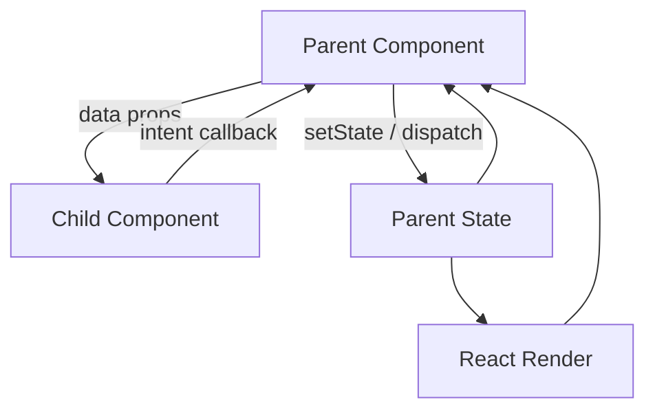

# Part 039 — Parent–Child Communication

Parent-child communication adalah jalur komunikasi paling dasar di React, tetapi di codebase besar ia bukan hal kecil. Banyak bug state, prop drilling, stale callback, duplicated source of truth, dan komponen yang sulit dites berasal dari satu masalah: parent dan child tidak memiliki kontrak komunikasi yang jelas.

Di React, parent-child communication bukan “child memanggil parent”. Model yang lebih tepat:

```txt
parent owns a render decision
child receives a snapshot
child emits an intent
parent decides the transition
React renders the next snapshot
```

Komunikasi parent-child yang sehat menjaga tiga hal:

1. **arah data jelas** — parent memberikan data ke child melalui props.
2. **arah intent jelas** — child memberi tahu parent bahwa sesuatu terjadi melalui callback.
3. **ownership jelas** — hanya satu pihak yang menjadi source of truth untuk state tertentu.

Ini bukan aturan gaya. Ini adalah mekanisme supaya UI tetap dapat diprediksi.

---

## 1. Mental Model

React component menerima input dari tiga sumber utama:

```txt
props + state + context -> render output
```

Untuk parent-child communication, kita terutama bicara tentang `props` dan `callbacks`.



Data turun sebagai snapshot. Intent naik sebagai event atau command. Child tidak mengubah state parent secara langsung. Child hanya mengirim sinyal yang cukup bermakna agar parent dapat mengambil keputusan.

Contoh buruk:

```tsx
function Child({ user, setUser }: Props) {
  return (
    <input
      value={user.name}
      onChange={(event) => {
        setUser({ ...user, name: event.target.value });
      }}
    />
  );
}
```

Kenapa buruk?

Child tahu struktur internal `user`. Child tahu cara update parent. Child ikut memikul ownership parent. Bila nanti update `name` harus melewati validation, audit, optimistic mutation, atau permission check, semua logic tersebar.

Versi lebih sehat:

```tsx
function Child({ name, onNameChange }: Props) {
  return (
    <input
      value={name}
      onChange={(event) => onNameChange(event.target.value)}
    />
  );
}
```

Parent tetap menjadi pemilik transisi:

```tsx
function Parent() {
  const [user, setUser] = useState({ id: "u1", name: "Alya" });

  function handleNameChange(nextName: string) {
    setUser((current) => ({ ...current, name: nextName }));
  }

  return <Child name={user.name} onNameChange={handleNameChange} />;
}
```

Perbedaannya kecil di kode, besar di arsitektur.

---

## 2. Props Are Read Models

Props yang dikirim parent ke child sebaiknya diperlakukan sebagai **read model**, bukan database record internal.

```tsx
type InvoiceSummaryProps = {
  invoiceNumber: string;
  customerName: string;
  statusLabel: string;
  amountLabel: string;
};

function InvoiceSummary(props: InvoiceSummaryProps) {
  return (
    <section>
      <h2>{props.invoiceNumber}</h2>
      <p>{props.customerName}</p>
      <p>{props.statusLabel}</p>
      <strong>{props.amountLabel}</strong>
    </section>
  );
}
```

Bandingkan dengan:

```tsx
function InvoiceSummary({ invoice }: { invoice: InvoiceEntity }) {
  return (
    <section>
      <h2>{invoice.number}</h2>
      <p>{invoice.customer.name}</p>
      <p>{invoice.status}</p>
      <strong>{invoice.currency} {invoice.amount}</strong>
    </section>
  );
}
```

Versi kedua tidak selalu salah. Tetapi ia membuat child tergantung pada bentuk domain entity. Untuk UI leaf component, sering lebih kuat mengirim read model yang sudah dibentuk oleh parent atau domain hook.

Prinsipnya:

```txt
parent may know domain
child should know display contract
```

Jika child adalah domain component, ia boleh tahu domain. Jika child adalah reusable UI component, ia sebaiknya tidak tahu domain.

---

## 3. Callback Is an Intent Port

Callback bukan sekadar “function prop”. Callback adalah **port komunikasi** dari child ke parent.

Nama callback harus menjawab:

```txt
apa yang child laporkan?
apakah ini event, intent, atau command?
siapa yang memutuskan hasil akhirnya?
```

Contoh nama callback yang terlalu teknis:

```tsx
<SearchInput onChange={setSearchText} />
```

Contoh yang lebih semantik:

```tsx
<SearchInput onSearchTextChange={handleSearchTextChange} />
```

Contoh untuk command/intention:

```tsx
<InvoiceActions
  onApproveRequested={requestApproval}
  onRejectRequested={requestRejection}
  onEscalateRequested={requestEscalation}
/>
```

Child tidak perlu tahu apakah parent akan membuka modal, memanggil API, mengecek permission, atau menjalankan state machine. Child hanya mengirim intent.

---

## 4. Event Payload Design

Kesalahan umum adalah melempar DOM event mentah ke parent padahal parent tidak perlu tahu detail DOM.

Kurang baik:

```tsx
function SearchInput({ onChange }: Props) {
  return <input onChange={onChange} />;
}
```

Parent jadi tergantung pada `ChangeEvent<HTMLInputElement>`.

Lebih baik:

```tsx
type SearchInputProps = {
  value: string;
  onValueChange: (value: string) => void;
};

function SearchInput({ value, onValueChange }: SearchInputProps) {
  return (
    <input
      value={value}
      onChange={(event) => onValueChange(event.target.value)}
    />
  );
}
```

DOM event berhenti di boundary child. Parent menerima value yang sudah menjadi domain UI event.

Untuk payload yang lebih kompleks, gunakan object agar API evolvable:

```tsx
type FilterChange = {
  field: "status" | "assignee" | "priority";
  value: string | null;
  source: "user" | "reset" | "preset";
};

type FilterPanelProps = {
  filters: CaseFilters;
  onFilterChange: (change: FilterChange) => void;
};
```

Object payload memberi ruang menambah field tanpa mengubah posisi argumen.

Hindari callback seperti ini:

```tsx
onChange(a, b, c, d, e)
```

Itu API yang mudah rusak dan sulit dibaca.

---

## 5. Controlled Child Pattern

Controlled component adalah bentuk parent-child communication yang paling eksplisit.

```tsx
type ToggleProps = {
  pressed: boolean;
  onPressedChange: (nextPressed: boolean) => void;
};

function Toggle({ pressed, onPressedChange }: ToggleProps) {
  return (
    <button
      aria-pressed={pressed}
      onClick={() => onPressedChange(!pressed)}
    >
      {pressed ? "On" : "Off"}
    </button>
  );
}
```

Parent owns state:

```tsx
function NotificationSetting() {
  const [enabled, setEnabled] = useState(false);

  return (
    <Toggle
      pressed={enabled}
      onPressedChange={setEnabled}
    />
  );
}
```

Kontrak controlled component:

```txt
child renders value from props
child never assumes callback succeeded
child emits requested next value
parent decides whether value changes
```

Itu penting. Child tidak boleh menganggap `onPressedChange(true)` pasti membuat `pressed` menjadi `true`. Parent mungkin menolak karena permission, validation, loading state, atau server failure.

Contoh:

```tsx
function NotificationSetting() {
  const [enabled, setEnabled] = useState(false);
  const [saving, setSaving] = useState(false);

  async function handlePressedChange(nextEnabled: boolean) {
    setSaving(true);
    try {
      await saveNotificationSetting(nextEnabled);
      setEnabled(nextEnabled);
    } finally {
      setSaving(false);
    }
  }

  return (
    <Toggle
      pressed={enabled}
      disabled={saving}
      onPressedChange={handlePressedChange}
    />
  );
}
```

Child emits intent. Parent owns commit.

---

## 6. Uncontrolled Child With Commit Boundary

Tidak semua state perlu dikontrol parent setiap karakter.

Untuk form besar, parent mungkin hanya butuh final value saat submit atau blur.

```tsx
type EditableTitleProps = {
  initialTitle: string;
  onCommit: (title: string) => void;
};

function EditableTitle({ initialTitle, onCommit }: EditableTitleProps) {
  const [draft, setDraft] = useState(initialTitle);

  return (
    <input
      value={draft}
      onChange={(event) => setDraft(event.target.value)}
      onBlur={() => onCommit(draft)}
    />
  );
}
```

Ini valid jika `draft` memang local editing state. Tetapi ada risiko: jika `initialTitle` berubah dari parent setelah child mount, local draft tidak otomatis sinkron. Itu bukan bug React; itu konsekuensi ownership.

Ada tiga pilihan:

1. treat `initialTitle` hanya sebagai initial value.
2. reset child dengan `key` saat entity berubah.
3. jadikan component controlled jika parent harus selalu sinkron.

```tsx
<EditableTitle
  key={caseId}
  initialTitle={caseTitle}
  onCommit={saveTitle}
/>
```

`key` di sini adalah reset contract, bukan hack.

---

## 7. Parent as Orchestrator, Child as View

Pada aplikasi enterprise, parent sering menjadi orchestration boundary.

```tsx
function CaseDetailPage() {
  const caseQuery = useCase(caseId);
  const permissions = useCasePermissions(caseId);
  const commands = useCaseCommands(caseId);

  if (caseQuery.isLoading) return <CaseDetailSkeleton />;
  if (caseQuery.isError) return <CaseDetailError />;

  return (
    <CaseDetailView
      caseNumber={caseQuery.data.caseNumber}
      status={caseQuery.data.status}
      assigneeName={caseQuery.data.assigneeName}
      canApprove={permissions.canApprove}
      canEscalate={permissions.canEscalate}
      onApproveRequested={commands.requestApproval}
      onEscalateRequested={commands.requestEscalation}
    />
  );
}
```

`CaseDetailView` tidak perlu tahu query cache, permission service, router, toast, modal, atau mutation strategy.

```tsx
type CaseDetailViewProps = {
  caseNumber: string;
  status: CaseStatus;
  assigneeName: string;
  canApprove: boolean;
  canEscalate: boolean;
  onApproveRequested: () => void;
  onEscalateRequested: () => void;
};
```

Ini pattern yang sering membuat React codebase tetap scalable:

```txt
Page/Boundary component:
  knows data loading
  knows permissions
  knows commands
  knows routing
  knows analytics

View component:
  knows layout
  knows interaction surface
  emits intent
```

---

## 8. Callback Stability: Correctness First, Performance Second

Banyak engineer terlalu cepat membungkus semua callback dengan `useCallback`.

```tsx
const handleClick = useCallback(() => {
  onSelect(item.id);
}, [onSelect, item.id]);
```

Ini tidak salah. Tetapi pertanyaan utamanya:

```txt
apakah child memoized dan benar-benar sensitif pada identity callback?
apakah callback dipakai sebagai dependency effect di child?
apakah identity callback bagian dari contract?
```

Gunakan `useCallback` saat ada alasan jelas:

1. callback dikirim ke memoized child yang mahal.
2. callback menjadi dependency effect/subscription.
3. callback menjadi bagian dari stable API custom hook.
4. callback dipakai dalam list besar dan profiling menunjukkan masalah.

Jangan gunakan `useCallback` untuk menutupi state model yang salah.

Kesalahan umum:

```tsx
const handleAdd = useCallback(() => {
  setItems([...items, createItem()]);
}, []); // stale items
```

Versi benar:

```tsx
const handleAdd = useCallback(() => {
  setItems((current) => [...current, createItem()]);
}, []);
```

Updater function menghilangkan dependency pada snapshot `items`.

---

## 9. Do Not Leak Parent Setters by Default

Mengirim setter mentah ke child sering terasa cepat:

```tsx
<FilterPanel setFilters={setFilters} />
```

Masalahnya, setter memberi child hak terlalu besar:

```tsx
setFilters({})
setFilters(null as never)
setFilters((current) => unsafeTransform(current))
```

Lebih baik berikan command semantik:

```tsx
<FilterPanel
  filters={filters}
  onStatusFilterChange={setStatusFilter}
  onAssigneeFilterChange={setAssigneeFilter}
  onFiltersReset={resetFilters}
/>
```

Parent menjaga invariant:

```tsx
function setStatusFilter(status: CaseStatus | null) {
  setFilters((current) => ({
    ...current,
    status,
    page: 1,
  }));
}
```

Perubahan status filter juga mereset pagination. Child tidak perlu tahu invariant itu.

---

## 10. Parent-Child Communication With Reducer

Jika callback mulai banyak dan state transition saling terkait, parent sebaiknya memakai reducer.

```tsx
type CaseListEvent =
  | { type: "searchChanged"; query: string }
  | { type: "statusFilterChanged"; status: CaseStatus | null }
  | { type: "pageChanged"; page: number }
  | { type: "filtersReset" };

function reducer(state: CaseListState, event: CaseListEvent): CaseListState {
  switch (event.type) {
    case "searchChanged":
      return { ...state, query: event.query, page: 1 };
    case "statusFilterChanged":
      return { ...state, status: event.status, page: 1 };
    case "pageChanged":
      return { ...state, page: event.page };
    case "filtersReset":
      return initialState;
  }
}
```

Parent wiring:

```tsx
function CaseListPage() {
  const [state, dispatch] = useReducer(reducer, initialState);

  return (
    <CaseListView
      query={state.query}
      status={state.status}
      page={state.page}
      onSearchChange={(query) => dispatch({ type: "searchChanged", query })}
      onStatusChange={(status) => dispatch({ type: "statusFilterChanged", status })}
      onPageChange={(page) => dispatch({ type: "pageChanged", page })}
      onReset={() => dispatch({ type: "filtersReset" })}
    />
  );
}
```

Reducer membuat callback menjadi event adapter, bukan tempat logic tersebar.

---

## 11. Async Parent Callback Contract

Callback yang async perlu kontrak eksplisit.

Buruk:

```tsx
<Button onClick={onSave}>Save</Button>
```

Pertanyaannya:

```txt
siapa yang menampilkan loading?
siapa yang mencegah double submit?
siapa yang menangani error?
apakah child boleh await callback?
apakah callback idempotent?
```

Untuk UI reusable, biasanya child tidak menjalankan orchestration async. Parent memberi state eksplisit:

```tsx
type SaveBarProps = {
  isSaving: boolean;
  canSave: boolean;
  onSaveRequested: () => void;
};

function SaveBar({ isSaving, canSave, onSaveRequested }: SaveBarProps) {
  return (
    <button disabled={!canSave || isSaving} onClick={onSaveRequested}>
      {isSaving ? "Saving..." : "Save"}
    </button>
  );
}
```

Parent:

```tsx
function EditorPage() {
  const [isSaving, setIsSaving] = useState(false);

  async function handleSaveRequested() {
    if (isSaving) return;

    setIsSaving(true);
    try {
      await saveDocument();
    } finally {
      setIsSaving(false);
    }
  }

  return (
    <SaveBar
      isSaving={isSaving}
      canSave={true}
      onSaveRequested={handleSaveRequested}
    />
  );
}
```

Child renders state. Parent owns async transition.

---

## 12. Error Communication

Parent-child communication juga butuh error contract.

Untuk form field:

```tsx
type TextFieldProps = {
  label: string;
  value: string;
  error?: string;
  onValueChange: (value: string) => void;
};
```

Child hanya menampilkan error. Parent/domain validator menentukan error.

Untuk command button:

```tsx
type ApproveButtonProps = {
  disabledReason?: string;
  isPending: boolean;
  onApproveRequested: () => void;
};
```

`disabledReason` lebih informatif daripada hanya `disabled` jika UI perlu menjelaskan sebabnya.

---

## 13. Imperative Parent-to-Child Communication

Kadang parent perlu memanggil method child: focus input, scroll to item, reset internal uncontrolled draft, open native picker.

Gunakan imperative handle hanya saat aksi tersebut memang bersifat imperative.

```tsx
type SearchBoxHandle = {
  focus: () => void;
  clear: () => void;
};

type SearchBoxProps = {
  onSearchChange: (value: string) => void;
};

function SearchBox({ onSearchChange, ref }: SearchBoxProps & { ref?: React.Ref<SearchBoxHandle> }) {
  const inputRef = useRef<HTMLInputElement | null>(null);
  const [value, setValue] = useState("");

  useImperativeHandle(ref, () => ({
    focus() {
      inputRef.current?.focus();
    },
    clear() {
      setValue("");
      onSearchChange("");
    },
  }), [onSearchChange]);

  return (
    <input
      ref={inputRef}
      value={value}
      onChange={(event) => {
        setValue(event.target.value);
        onSearchChange(event.target.value);
      }}
    />
  );
}
```

Gunakan ini untuk command UI yang tidak natural diekspresikan sebagai props. Jangan pakai imperative handle untuk mengganti data flow.

Buruk:

```tsx
formRef.current?.setUser(user)
```

Lebih sehat:

```tsx
<UserForm value={user} onChange={handleUserChange} />
```

Imperative API harus kecil, semantik, dan tidak membuka internal state sembarangan.

---

## 14. Child Composition as Communication

Kadang parent tidak hanya mengirim data, tetapi juga struktur.

```tsx
<Card
  title="Case Summary"
  actions={<CaseActions onApproveRequested={approve} />}
>
  <CaseSummary case={caseData} />
</Card>
```

Di sini parent berkomunikasi melalui composition. Parent menentukan apa yang muncul di slot `actions` dan `children`.

Ini berguna saat child adalah layout boundary:

```tsx
type PanelProps = {
  header: React.ReactNode;
  footer?: React.ReactNode;
  children: React.ReactNode;
};
```

Tetapi jangan ubah slot menjadi configuration language:

```tsx
<Panel
  headerType="case"
  showApproveButton
  approveButtonVariant="primary"
  showEscalateButton
  escalateButtonPermission="case.escalate"
/>
```

Jika parent sudah tahu struktur, kirim element. Jangan minta child menebak dunia parent.

---

## 15. Communication Granularity

Terlalu banyak callback kecil bisa membuat parent noisy. Terlalu sedikit callback besar bisa membuat child terlalu tahu domain.

Contoh terlalu kecil:

```tsx
onFirstNameChange
onLastNameChange
onEmailChange
onPhoneChange
onCountryChange
onCityChange
onPostalCodeChange
```

Contoh terlalu besar:

```tsx
onUserChanged(nextUser)
```

Tidak ada jawaban universal. Gunakan aturan ini:

```txt
Jika field punya invariant berbeda -> callback berbeda.
Jika perubahan selalu diproses sebagai patch -> satu onPatchChange cukup.
Jika child reusable -> payload harus UI-oriented.
Jika child domain-specific -> payload boleh domain-oriented.
```

Pattern patch:

```tsx
type UserDraftPatch = Partial<Pick<UserDraft, "firstName" | "lastName" | "email">>;

type UserEditorProps = {
  value: UserDraft;
  onPatchChange: (patch: UserDraftPatch) => void;
};
```

Parent tetap bisa menjaga invariant:

```tsx
function handlePatchChange(patch: UserDraftPatch) {
  setDraft((current) => normalizeUserDraft({ ...current, ...patch }));
}
```

---

## 16. Avoid Bidirectional Illusion

Parent-child communication terlihat seperti dua arah:

```txt
parent -> child props
child -> parent callback
```

Tetapi state flow tetap satu arah:

```txt
state -> render -> event -> state transition -> render
```

Jangan desain UI seolah-olah parent dan child sama-sama mengubah object yang sama.

Buruk:

```tsx
const user = props.user;
user.name = nextName;
props.onUserMutated(user);
```

Ini melanggar immutability dan membuat perubahan tidak jelas.

Gunakan new value atau event:

```tsx
props.onNameChange(nextName);
```

atau:

```tsx
props.onUserPatch({ name: nextName });
```

---

## 17. Build From Scratch: Parent-Child Contract for Approval Action

Kita bangun komponen approval kecil.

Domain requirement:

```txt
User dapat approve case jika:
- case belum closed
- user punya permission approve
- tidak ada mutation pending
Saat approve diklik:
- tampilkan confirm modal
- jika confirm, jalankan mutation
- jika sukses, update UI
- jika gagal, tampilkan error
```

Jangan masukkan semua ke button.

Child:

```tsx
type ApprovalActionProps = {
  disabledReason?: string;
  isPending: boolean;
  onApproveRequested: () => void;
};

function ApprovalAction({ disabledReason, isPending, onApproveRequested }: ApprovalActionProps) {
  const disabled = Boolean(disabledReason) || isPending;

  return (
    <div>
      <button disabled={disabled} onClick={onApproveRequested}>
        {isPending ? "Approving..." : "Approve"}
      </button>
      {disabledReason ? <p role="note">{disabledReason}</p> : null}
    </div>
  );
}
```

Parent:

```tsx
function CaseApprovalBoundary({ caseId }: { caseId: string }) {
  const caseQuery = useCase(caseId);
  const permissions = useCasePermissions(caseId);
  const approveCase = useApproveCaseMutation();
  const confirm = useConfirmDialog();

  const disabledReason = getApprovalDisabledReason({
    status: caseQuery.data?.status,
    canApprove: permissions.canApprove,
  });

  async function handleApproveRequested() {
    const accepted = await confirm({
      title: "Approve case?",
      description: "This transition will be recorded in the audit trail.",
    });

    if (!accepted) return;

    await approveCase.mutateAsync({ caseId });
  }

  return (
    <ApprovalAction
      disabledReason={disabledReason}
      isPending={approveCase.isPending}
      onApproveRequested={handleApproveRequested}
    />
  );
}
```

Hasilnya:

```txt
button knows rendering and click surface
parent knows workflow
mutation layer knows server command
permission layer knows access policy
```

Boundary bersih.

---

## 18. Failure Modes

| Failure Mode | Gejala | Penyebab | Perbaikan |
|---|---|---|---|
| Raw setter leak | Child mengubah state parent sembarangan | Parent mengirim `setState` langsung | Ganti dengan semantic callback |
| DOM event leakage | Parent tahu detail input DOM | Child meneruskan event mentah | Kirim value/domain event |
| Duplicated ownership | Parent dan child sama-sama punya versi state | Controlled/uncontrolled tidak jelas | Tentukan source of truth |
| Stale callback | Callback membaca state lama | Dependency salah atau closure stale | Pakai updater/reducer/dependency benar |
| Callback explosion | Parent punya terlalu banyak handler granular | Boundary terlalu rendah | Naikkan abstraction atau pakai patch/reducer |
| God child | Child tahu router, permission, API, toast | Orchestration masuk ke leaf | Pindahkan ke boundary parent |
| Async ambiguity | Double submit, loading tidak sinkron | Callback async tanpa contract | Ekspos `isPending`, `disabled`, command state |
| Imperative abuse | Parent memanggil method untuk set data child | Ref dipakai mengganti data flow | Pakai controlled props |
| Hidden mutation | Props object dimutasi child | Object dianggap shared mutable state | Treat props immutable |
| Slot overconfiguration | Child punya terlalu banyak flag rendering | Config menggantikan composition | Kirim element/slot eksplisit |

---

## 19. Decision Matrix

| Need | Pattern |
|---|---|
| Child hanya menampilkan data | Data props |
| Child melaporkan user intent | Semantic callback |
| Parent mengontrol value child | Controlled component |
| Child butuh local draft | Uncontrolled/local state + commit callback |
| Parent perlu focus/scroll | Ref + imperative handle |
| Parent menentukan struktur visual | `children`/slot/element injection |
| Banyak transition saling terkait | Reducer event dispatch |
| Async command dengan loading/error | Parent orchestration + explicit pending/error props |
| Child perlu reusable lintas domain | UI-oriented props dan callbacks |
| Child domain-specific | Domain event/payload boleh dipakai |

---

## 20. Review Checklist

Gunakan checklist ini saat review PR:

```txt
[ ] Apakah state punya satu source of truth?
[ ] Apakah props child adalah read model yang sesuai boundary?
[ ] Apakah callback mewakili intent, bukan detail implementasi parent?
[ ] Apakah child mengirim DOM event mentah yang tidak perlu?
[ ] Apakah parent mengirim raw setter tanpa alasan kuat?
[ ] Apakah async callback punya pending/error/disabled contract?
[ ] Apakah child terlalu tahu domain/API/router/permission?
[ ] Apakah callback dependency aman dari stale closure?
[ ] Apakah ref dipakai hanya untuk imperative escape hatch?
[ ] Apakah callback names mencerminkan kejadian atau intent?
```

---

## 21. Latihan

### Latihan 1 — Refactor Raw Setter

Ubah API ini:

```tsx
<UserFilters filters={filters} setFilters={setFilters} />
```

Menjadi API yang menjaga invariant:

```txt
changing any filter resets page to 1
reset clears filters and page
search text is debounced outside child
```

### Latihan 2 — Controlled vs Uncontrolled

Buat `EditableText` dengan dua mode:

1. controlled: `value`, `onValueChange`
2. uncontrolled: `defaultValue`, `onCommit`

Pastikan component tidak mendukung mode campuran secara diam-diam.

### Latihan 3 — Async Command Boundary

Buat `DeleteButton` yang tidak tahu API. Parent harus mengelola:

```txt
confirmation
pending state
error display
permission disabled reason
server mutation
```

### Latihan 4 — Reducer Migration

Ambil parent dengan 6 callback state update. Refactor ke reducer event model.

---

## 22. Ringkasan

Parent-child communication yang kuat bukan sekadar “props down, events up”. Itu hanya bentuk luar.

Intinya:

```txt
props are read models
callbacks are intent ports
parent owns transitions
child owns interaction surface
state has one source of truth
imperative APIs are escape hatches
async callbacks need explicit contracts
```

Jika prinsip ini dijaga, component tree tetap dapat dipahami meskipun aplikasi bertambah besar. Jika prinsip ini dilanggar, React codebase berubah menjadi jaringan setter, callback, duplicated state, dan effect yang saling mengejar.

---

## References

- React Docs — Passing Props to a Component: https://react.dev/learn/passing-props-to-a-component
- React Docs — Responding to Events: https://react.dev/learn/responding-to-events
- React Docs — Sharing State Between Components: https://react.dev/learn/sharing-state-between-components
- React Docs — State as a Snapshot: https://react.dev/learn/state-as-a-snapshot
- React Docs — Queueing a Series of State Updates: https://react.dev/learn/queueing-a-series-of-state-updates
- React Docs — useImperativeHandle: https://react.dev/reference/react/useImperativeHandle
