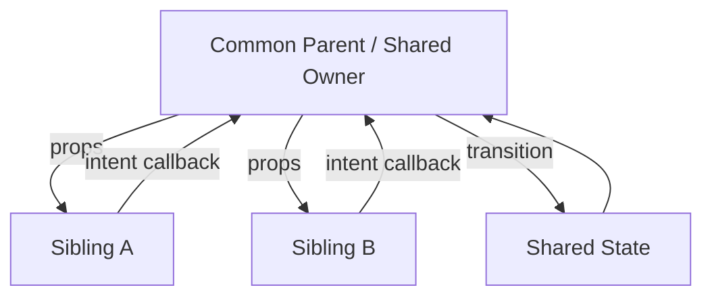
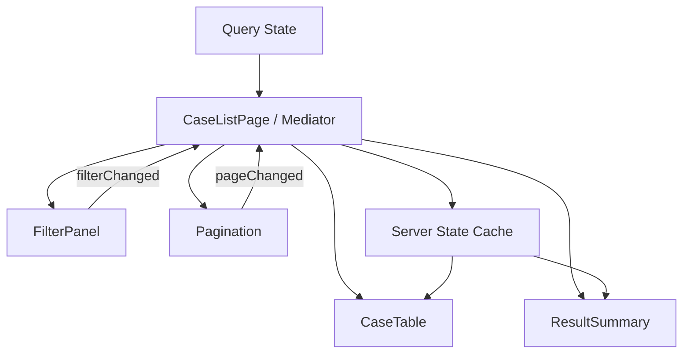
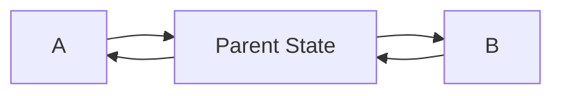

# Part 040 — Sibling Communication

Sibling communication sering dibahas seolah-olah masalahnya adalah “bagaimana component A memanggil component B”. Itu framing yang kurang tepat.

Di React, sibling tidak perlu berkomunikasi langsung. Yang perlu terjadi adalah:

```txt
state or event from one sibling changes a shared owner
shared owner renders both siblings with a new snapshot
```

Dengan kata lain, sibling communication adalah masalah **state ownership topology**.

Jika dua sibling perlu sinkron, cari dulu:

```txt
state apa yang disinkronkan?
siapa pemilik state yang paling benar?
apakah state ini local, URL, server cache, external store, atau workflow state?
apakah perubahan sibling A adalah event, command, atau derived view?
```

Jawaban dari pertanyaan itu menentukan pola komunikasi.

---

## 1. Mental Model

Dua sibling tidak memiliki jalur langsung dalam data flow React.



Sibling A tidak “mengirim data ke sibling B”. Sibling A mengirim intent ke owner. Owner mengubah state. React merender ulang B dengan snapshot baru.

Ini menjaga UI tetap deterministic.

---

## 2. The Wrong Question

Pertanyaan yang sering muncul:

```txt
Bagaimana cara component A memanggil function di component B?
```

Pertanyaan yang lebih benar:

```txt
Apa state atau command yang perlu dimiliki oleh boundary bersama?
```

Contoh:

```txt
SearchBox perlu mengubah Table.
```

Jangan desain sebagai:

```txt
SearchBox -> Table.search(query)
```

Desain sebagai:

```txt
SearchBox emits queryChanged
Page owns query
Table receives query/result snapshot
```

```tsx
function CaseSearchPage() {
  const [query, setQuery] = useState("");

  return (
    <>
      <SearchBox value={query} onValueChange={setQuery} />
      <CaseTable query={query} />
    </>
  );
}
```

Itu sibling communication melalui shared owner.

---

## 3. Pattern 1 — Lift State to the Nearest Common Parent

Ini pattern default untuk sibling yang perlu berbagi state lokal.

Sebelum:

```tsx
function SearchBox() {
  const [query, setQuery] = useState("");
  return <input value={query} onChange={(event) => setQuery(event.target.value)} />;
}

function SearchSummary() {
  return <p>...</p>;
}
```

`SearchSummary` tidak bisa tahu query.

Sesudah:

```tsx
function SearchSection() {
  const [query, setQuery] = useState("");

  return (
    <section>
      <SearchBox value={query} onValueChange={setQuery} />
      <SearchSummary query={query} />
    </section>
  );
}
```

Child menjadi controlled:

```tsx
type SearchBoxProps = {
  value: string;
  onValueChange: (value: string) => void;
};

function SearchBox({ value, onValueChange }: SearchBoxProps) {
  return (
    <input
      value={value}
      onChange={(event) => onValueChange(event.target.value)}
    />
  );
}
```

Rule:

```txt
If two children need the same changing value, move that value to their nearest common owner.
```

Jangan naikkan state lebih tinggi dari yang diperlukan. “Nearest common parent” penting karena state yang terlalu tinggi memperbesar fan-out rerender dan coupling.

---

## 4. Pattern 2 — Mediator Parent

Kadang parent tidak sekadar menyimpan state, tetapi mengoordinasikan beberapa sibling.

Contoh: filter panel, table, pagination, summary.



Implementation:

```tsx
type CaseListState = {
  query: string;
  status: CaseStatus | null;
  page: number;
};

function CaseListPage() {
  const [state, setState] = useState<CaseListState>({
    query: "",
    status: null,
    page: 1,
  });

  const cases = useCasesQuery(state);

  function handleQueryChange(query: string) {
    setState((current) => ({ ...current, query, page: 1 }));
  }

  function handleStatusChange(status: CaseStatus | null) {
    setState((current) => ({ ...current, status, page: 1 }));
  }

  function handlePageChange(page: number) {
    setState((current) => ({ ...current, page }));
  }

  return (
    <>
      <FilterPanel
        query={state.query}
        status={state.status}
        onQueryChange={handleQueryChange}
        onStatusChange={handleStatusChange}
      />
      <ResultSummary total={cases.data?.total ?? 0} />
      <CaseTable rows={cases.data?.rows ?? []} isLoading={cases.isLoading} />
      <Pagination
        page={state.page}
        totalPages={cases.data?.totalPages ?? 1}
        onPageChange={handlePageChange}
      />
    </>
  );
}
```

Mediator parent menjaga invariant:

```txt
changing query resets page
changing status resets page
page change does not clear filters
server query key follows current state
```

Jika logic makin kompleks, pindahkan ke reducer.

---

## 5. Pattern 3 — Reducer as Sibling Coordinator

Jika banyak sibling mengirim event ke owner yang sama, reducer membuat event model eksplisit.

```tsx
type Event =
  | { type: "queryChanged"; query: string }
  | { type: "statusChanged"; status: CaseStatus | null }
  | { type: "pageChanged"; page: number }
  | { type: "sortChanged"; sort: SortSpec }
  | { type: "filtersReset" };

function reducer(state: State, event: Event): State {
  switch (event.type) {
    case "queryChanged":
      return { ...state, query: event.query, page: 1 };
    case "statusChanged":
      return { ...state, status: event.status, page: 1 };
    case "pageChanged":
      return { ...state, page: event.page };
    case "sortChanged":
      return { ...state, sort: event.sort, page: 1 };
    case "filtersReset":
      return initialState;
  }
}
```

Parent wiring:

```tsx
function CaseListPage() {
  const [state, dispatch] = useReducer(reducer, initialState);

  return (
    <>
      <FilterPanel
        query={state.query}
        status={state.status}
        onQueryChange={(query) => dispatch({ type: "queryChanged", query })}
        onStatusChange={(status) => dispatch({ type: "statusChanged", status })}
      />
      <SortBar
        sort={state.sort}
        onSortChange={(sort) => dispatch({ type: "sortChanged", sort })}
      />
      <Pagination
        page={state.page}
        onPageChange={(page) => dispatch({ type: "pageChanged", page })}
      />
    </>
  );
}
```

Reducer adalah tempat sibling event bertemu.

---

## 6. Pattern 4 — Context for Deep Sibling Families

Lifted state cukup jika sibling dekat. Jika sibling tersebar dalam subtree besar, props bisa menjadi noisy.

Context bisa menjadi scoped communication channel.

```tsx
type CaseListContextValue = {
  state: CaseListState;
  dispatch: React.Dispatch<CaseListEvent>;
};

const CaseListContext = createContext<CaseListContextValue | null>(null);

function useCaseListContext() {
  const value = useContext(CaseListContext);
  if (!value) {
    throw new Error("useCaseListContext must be used inside CaseListProvider");
  }
  return value;
}

function CaseListProvider({ children }: { children: React.ReactNode }) {
  const [state, dispatch] = useReducer(reducer, initialState);

  const value = useMemo(() => ({ state, dispatch }), [state]);

  return (
    <CaseListContext.Provider value={value}>
      {children}
    </CaseListContext.Provider>
  );
}
```

Consumers:

```tsx
function FilterPanel() {
  const { state, dispatch } = useCaseListContext();

  return (
    <input
      value={state.query}
      onChange={(event) => dispatch({ type: "queryChanged", query: event.target.value })}
    />
  );
}

function ResultSummary() {
  const { state } = useCaseListContext();
  return <p>Search: {state.query || "All"}</p>;
}
```

Context menyelesaikan prop drilling, tetapi menambah implicit dependency. Jangan pakai context untuk semua sibling hanya karena malas passing props.

Gunakan context jika:

```txt
subtree adalah satu feature scope
banyak descendants butuh value yang sama
provider boundary jelas
state update frequency masih wajar
implicit dependency dapat diterima
```

Jika update sangat sering atau consumer sangat banyak, pertimbangkan external store atau selector-based store.

---

## 7. Pattern 5 — URL State for Shareable Sibling Synchronization

State tertentu lebih tepat hidup di URL daripada parent memory.

Contoh:

```txt
search query
filters
sort
pagination
selected tab
view mode
```

Alasan:

```txt
browser back/forward harus bekerja
page dapat dibagikan
reload tidak menghapus state
server route/data loader bisa membaca state
```

Pattern:

```tsx
function CaseListPage() {
  const [searchParams, setSearchParams] = useSearchParams();

  const query = searchParams.get("q") ?? "";
  const status = searchParams.get("status") as CaseStatus | null;
  const page = Number(searchParams.get("page") ?? "1");

  function updateParams(patch: Record<string, string | null>) {
    const next = new URLSearchParams(searchParams);

    for (const [key, value] of Object.entries(patch)) {
      if (value === null || value === "") next.delete(key);
      else next.set(key, value);
    }

    setSearchParams(next);
  }

  return (
    <>
      <FilterPanel
        query={query}
        status={status}
        onQueryChange={(nextQuery) => updateParams({ q: nextQuery, page: "1" })}
        onStatusChange={(nextStatus) => updateParams({ status: nextStatus, page: "1" })}
      />
      <CaseTable query={query} status={status} page={page} />
      <Pagination
        page={page}
        onPageChange={(nextPage) => updateParams({ page: String(nextPage) })}
      />
    </>
  );
}
```

Di sini sibling disinkronkan oleh URL, bukan local state.

Decision rule:

```txt
If user expects reload/share/back-forward to preserve it, consider URL state.
```

---

## 8. Pattern 6 — External Store for Wide or High-Frequency Sibling Communication

Jika sibling berada di cabang berbeda atau state update sangat sering, lifted parent/context bisa mahal atau awkward.

External store cocok untuk:

```txt
global-ish UI shell state
cross-route selection
real-time connection status
large editor state
collaboration presence
high-frequency drag/drop state
complex client cache not owned by server
```

Minimal shape:

```tsx
type SelectionStore = {
  getSnapshot: () => SelectionState;
  subscribe: (listener: () => void) => () => void;
  select: (id: string) => void;
  clear: () => void;
};
```

React integration memakai `useSyncExternalStore`:

```tsx
function useSelectedCaseId(store: SelectionStore) {
  return useSyncExternalStore(
    store.subscribe,
    () => store.getSnapshot().selectedCaseId,
    () => null,
  );
}
```

A dan B tidak berkomunikasi langsung. Keduanya membaca store yang sama.

```tsx
function CaseList({ store }: { store: SelectionStore }) {
  const selectedCaseId = useSelectedCaseId(store);

  return rows.map((row) => (
    <button
      key={row.id}
      aria-current={row.id === selectedCaseId}
      onClick={() => store.select(row.id)}
    >
      {row.title}
    </button>
  ));
}

function CaseInspector({ store }: { store: SelectionStore }) {
  const selectedCaseId = useSelectedCaseId(store);

  if (!selectedCaseId) return <p>No case selected</p>;
  return <CaseDetail caseId={selectedCaseId} />;
}
```

Store menjadi shared owner.

Peringatan:

```txt
external store increases power and coupling
make it scoped when possible
avoid turning every UI interaction into global store
```

---

## 9. Pattern 7 — Server State Cache for Remote Data Synchronization

Jika sibling perlu data remote yang sama, jangan copy data remote ke local parent state hanya agar dua sibling sinkron.

Contoh:

```tsx
function CasePage({ caseId }: { caseId: string }) {
  return (
    <>
      <CaseHeader caseId={caseId} />
      <CaseTimeline caseId={caseId} />
      <CaseActions caseId={caseId} />
    </>
  );
}
```

Masing-masing bisa membaca query cache yang sama:

```tsx
function CaseHeader({ caseId }: { caseId: string }) {
  const caseQuery = useCaseQuery(caseId);
  return <h1>{caseQuery.data?.caseNumber}</h1>;
}

function CaseActions({ caseId }: { caseId: string }) {
  const caseQuery = useCaseQuery(caseId);
  const mutation = useApproveCaseMutation();

  return (
    <button
      disabled={caseQuery.data?.status !== "READY" || mutation.isPending}
      onClick={() => mutation.mutate({ caseId })}
    >
      Approve
    </button>
  );
}
```

Cache menjadi sinkronisasi remote data. Mutation invalidates/updates cache. Sibling tidak saling tahu.

Rule:

```txt
If the source of truth is server, use a server-state cache instead of duplicating remote data in sibling-local state.
```

---

## 10. Pattern 8 — Command Channel / Event Bus, With Restraint

Event bus bisa berguna, tetapi sering menjadi jalan pintas yang membuat data flow tidak terlihat.

Gunakan event bus untuk:

```txt
integration boundary
analytics event
toast notification
legacy bridge
global keyboard shortcut
non-stateful broadcast
```

Jangan gunakan event bus sebagai default sibling communication.

Buruk:

```tsx
bus.emit("filter:changed", query)
```

lalu table diam-diam subscribe:

```tsx
bus.on("filter:changed", setQuery)
```

Masalah:

```txt
ownership hilang
subscriber tersembunyi
cleanup rawan bocor
ordering sulit dijamin
testing sulit
```

Jika tetap perlu event bus, bungkus sebagai capability dengan lifecycle-safe hook.

```tsx
function useEventSubscription<T>(eventName: string, handler: (payload: T) => void) {
  useEffect(() => {
    return eventBus.subscribe(eventName, handler);
  }, [eventName, handler]);
}
```

Tetapi sebelum memakai bus, tanyakan:

```txt
Bisakah ini menjadi lifted state?
Bisakah ini menjadi context command?
Bisakah ini menjadi URL state?
Bisakah ini menjadi external store dengan explicit subscription?
```

---

## 11. Communication Strategy Matrix

| Scenario | Best First Pattern | Kenapa |
|---|---|---|
| SearchBox mengubah Table dalam satu page | Lift state / mediator parent | Shared state lokal dengan owner jelas |
| Filter/pagination/sort harus shareable | URL state | Back/forward/reload/share bekerja |
| Banyak descendants dalam satu feature perlu dispatch | Context + reducer | Scoped feature coordination |
| High-frequency state dipakai banyak cabang | External store | Granular subscription |
| Remote data dipakai banyak sibling | Server-state cache | Server tetap source of truth |
| Modal/toast dari banyak sibling | Capability context | Command tanpa prop drilling |
| Legacy component perlu broadcast event | Event bus adapter | Integration boundary, bukan domain state |
| Wizard step saling memengaruhi | Reducer/state machine owner | Transition dan invariant eksplisit |
| Cross-route selected item | URL atau scoped external store | Tergantung shareability dan lifecycle |

---

## 12. Build From Scratch: Selection Coordinator

Kita buat coordinator kecil untuk sibling list dan detail panel.

Requirement:

```txt
CaseList menampilkan list case
CaseInspector menampilkan selected case
Selection harus bisa clear
Selection tidak perlu masuk URL
Selection hanya berlaku dalam CaseWorkspace
```

### Step 1 — State Owner

```tsx
type SelectionState = {
  selectedCaseId: string | null;
};

type SelectionEvent =
  | { type: "caseSelected"; caseId: string }
  | { type: "selectionCleared" };

function selectionReducer(state: SelectionState, event: SelectionEvent): SelectionState {
  switch (event.type) {
    case "caseSelected":
      return { selectedCaseId: event.caseId };
    case "selectionCleared":
      return { selectedCaseId: null };
  }
}
```

### Step 2 — Mediator Workspace

```tsx
function CaseWorkspace() {
  const [state, dispatch] = useReducer(selectionReducer, {
    selectedCaseId: null,
  });

  return (
    <div className="case-workspace">
      <CaseList
        selectedCaseId={state.selectedCaseId}
        onCaseSelected={(caseId) => dispatch({ type: "caseSelected", caseId })}
      />
      <CaseInspector
        selectedCaseId={state.selectedCaseId}
        onSelectionCleared={() => dispatch({ type: "selectionCleared" })}
      />
    </div>
  );
}
```

### Step 3 — Siblings Stay Simple

```tsx
type CaseListProps = {
  selectedCaseId: string | null;
  onCaseSelected: (caseId: string) => void;
};

function CaseList({ selectedCaseId, onCaseSelected }: CaseListProps) {
  const rows = useCaseRows();

  return (
    <ul>
      {rows.map((row) => (
        <li key={row.id}>
          <button
            aria-current={row.id === selectedCaseId}
            onClick={() => onCaseSelected(row.id)}
          >
            {row.title}
          </button>
        </li>
      ))}
    </ul>
  );
}
```

```tsx
type CaseInspectorProps = {
  selectedCaseId: string | null;
  onSelectionCleared: () => void;
};

function CaseInspector({ selectedCaseId, onSelectionCleared }: CaseInspectorProps) {
  if (!selectedCaseId) {
    return <p>Select a case</p>;
  }

  return (
    <aside>
      <button onClick={onSelectionCleared}>Close</button>
      <CaseDetail caseId={selectedCaseId} />
    </aside>
  );
}
```

No sibling direct call. No global store. No event bus. Ownership clear.

---

## 13. Build From Scratch: Same Problem With URL State

Jika selection harus shareable:

```tsx
function CaseWorkspace() {
  const [params, setParams] = useSearchParams();
  const selectedCaseId = params.get("caseId");

  function selectCase(caseId: string) {
    const next = new URLSearchParams(params);
    next.set("caseId", caseId);
    setParams(next);
  }

  function clearSelection() {
    const next = new URLSearchParams(params);
    next.delete("caseId");
    setParams(next);
  }

  return (
    <div className="case-workspace">
      <CaseList
        selectedCaseId={selectedCaseId}
        onCaseSelected={selectCase}
      />
      <CaseInspector
        selectedCaseId={selectedCaseId}
        onSelectionCleared={clearSelection}
      />
    </div>
  );
}
```

Same UI, different owner.

Decision difference:

```txt
local reducer -> selection is workspace memory
URL state -> selection is navigation state
external store -> selection is shared application state
server cache -> selection is not state; data ownership is remote
```

---

## 14. Derived Sibling State

Kadang sibling B tidak butuh state baru. Ia butuh derived value dari state yang sudah dimiliki parent.

```tsx
function CartPage() {
  const [items, setItems] = useState<CartItem[]>([]);

  const subtotal = items.reduce((sum, item) => sum + item.price * item.quantity, 0);
  const itemCount = items.reduce((sum, item) => sum + item.quantity, 0);

  return (
    <>
      <CartItems items={items} onItemsChange={setItems} />
      <CartSummary subtotal={subtotal} itemCount={itemCount} />
    </>
  );
}
```

Jangan buat `subtotal` sebagai state terpisah kecuali ada alasan kuat.

Buruk:

```tsx
const [items, setItems] = useState([]);
const [subtotal, setSubtotal] = useState(0);
```

Ini membuat dua source of truth. `subtotal` harus selalu sinkron dengan `items`; jika satu update lupa, UI inconsistent.

Rule:

```txt
If B can be computed from A during render, derive it; do not synchronize it with effects.
```

---

## 15. Avoid Cyclic Sibling Updates

Bug yang sulit dilacak sering muncul ketika sibling saling mengubah state melalui effect.

```tsx
function A({ valueFromB, onAChange }) {
  useEffect(() => {
    onAChange(transform(valueFromB));
  }, [valueFromB, onAChange]);
}

function B({ valueFromA, onBChange }) {
  useEffect(() => {
    onBChange(transform(valueFromA));
  }, [valueFromA, onBChange]);
}
```

Ini menciptakan loop konseptual:



Perbaikan:

```txt
move derivation into parent
use reducer transition
remove effect-based synchronization
make one value source of truth
```

---

## 16. Prop Drilling vs Explicit Wiring

Tidak semua passing props beberapa level adalah masalah. Kadang itu justru dokumentasi dependency yang jelas.

Prop drilling menjadi masalah jika:

```txt
intermediate components tidak peduli props tersebut
banyak props melewati banyak level
perubahan API merembet ke banyak component
dependency sudah menjadi feature-wide capability
```

Sebelum pindah ke context, coba pecah component dengan composition:

```tsx
function Page() {
  const [selectedId, setSelectedId] = useState<string | null>(null);

  return (
    <WorkspaceLayout
      sidebar={<CaseList selectedId={selectedId} onSelect={setSelectedId} />}
      inspector={<CaseInspector selectedId={selectedId} />}
    />
  );
}
```

`WorkspaceLayout` tidak perlu menerima `selectedId`. Ia hanya menerima slot.

Ini sering lebih baik daripada context.

---

## 17. When Sibling Communication Should Become a State Machine

Jika sibling communication sudah melibatkan workflow, bukan sekadar shared value, reducer biasa bisa kurang eksplisit.

Contoh wizard:

```txt
StepA validates identity
StepB validates documents
StepC confirms submission
Sidebar shows completion
Footer controls next/back/submit
```

State bukan hanya data. State adalah workflow:

```txt
editingIdentity
validatingIdentity
editingDocuments
validatingDocuments
reviewing
submitting
submitted
failed
```

Siblings:

```txt
StepPanel
WizardSidebar
WizardFooter
ValidationBanner
```

Mereka harus disinkronkan oleh workflow owner/state machine, bukan saling memanggil.

```tsx
function WizardShell() {
  const [state, send] = useWizardMachine();

  return (
    <>
      <WizardSidebar currentStep={state.step} completedSteps={state.completedSteps} />
      <WizardStepPanel state={state} send={send} />
      <WizardFooter
        canGoBack={state.canGoBack}
        canGoNext={state.canGoNext}
        isSubmitting={state.matches("submitting")}
        onBack={() => send({ type: "BACK" })}
        onNext={() => send({ type: "NEXT" })}
        onSubmit={() => send({ type: "SUBMIT" })}
      />
    </>
  );
}
```

Jika sibling communication punya states, events, guards, dan illegal transitions, pakai state-machine thinking.

---

## 18. Failure Modes

| Failure Mode | Gejala | Penyebab | Perbaikan |
|---|---|---|---|
| Direct sibling call | Component A mencoba memanggil method B | Salah model data flow | Gunakan shared owner/ref hanya jika imperative UI |
| Duplicated sibling state | A dan B punya copy state sendiri | Ownership tidak jelas | Lift ke common parent/URL/store |
| Effect synchronization loop | Render berulang tanpa henti | Sibling sync via effect | Derive di parent/reducer |
| State lifted too high | Banyak rerender dan coupling app-wide | Common parent terlalu atas | Turunkan owner ke feature boundary |
| Prop drilling overreaction | Context dipakai terlalu cepat | Passing props dianggap selalu buruk | Coba composition slot dulu |
| Context fan-out | Banyak consumer rerender | Context value volatile | Split context/external store/selectors |
| Event bus chaos | Subscriber tersembunyi, order tidak jelas | Bus menggantikan ownership | Gunakan bus hanya integration boundary |
| URL overuse | URL penuh transient state | Semua state dianggap shareable | Bedakan navigation vs ephemeral state |
| Store overuse | Global state membesar | Semua sibling state masuk store | Scope store atau local owner |
| Server data copied locally | UI stale/inconsistent | Remote data dipindah ke local state | Gunakan query cache dan invalidation |
| Workflow hidden in booleans | Impossible state | Banyak sibling mengubah flag | Reducer/state machine |

---

## 19. Debugging Protocol

Saat sibling communication bug muncul, jangan langsung cari library.

Ikuti urutan ini:

```txt
1. Identifikasi value yang tidak sinkron.
2. Cari semua tempat yang menyimpan value tersebut sebagai state.
3. Tentukan source of truth yang seharusnya.
4. Hapus duplicated state atau jadikan derived value.
5. Jika harus shared, pilih owner paling dekat.
6. Jika harus shareable, pindah ke URL.
7. Jika remote, pindah ke server-state cache.
8. Jika wide/high-frequency, pindah ke external store.
9. Jika workflow, modelkan event dan transition.
10. Hapus effect yang hanya menyinkronkan dua state lokal.
```

---

## 20. Review Checklist

```txt
[ ] Apakah sibling benar-benar butuh komunikasi, atau hanya derived value?
[ ] Apakah state sudah dimiliki nearest common parent?
[ ] Apakah state dinaikkan terlalu tinggi?
[ ] Apakah URL lebih tepat karena state harus shareable?
[ ] Apakah remote data disimpan ulang sebagai client state?
[ ] Apakah context dipakai sebagai shortcut tanpa provider boundary jelas?
[ ] Apakah external store dipakai untuk state yang sebenarnya lokal?
[ ] Apakah ada effect yang hanya menjaga dua sibling tetap sinkron?
[ ] Apakah event bus dipakai untuk domain state?
[ ] Apakah workflow sudah punya transition model eksplisit?
```

---

## 21. Latihan

### Latihan 1 — Search + Table + Summary

Bangun page dengan tiga sibling:

```txt
SearchBox
ResultTable
ResultSummary
```

State:

```txt
query
page
sort
```

Invariant:

```txt
query change resets page
sort change resets page
page change preserves query and sort
```

Implementasi pertama dengan `useState`, lalu refactor ke `useReducer`.

### Latihan 2 — URL State

Pindahkan `query`, `page`, dan `sort` ke URL search params.

Pastikan:

```txt
reload preserves state
back button works
empty values are removed from URL
invalid page value is normalized
```

### Latihan 3 — Context Boundary

Ambil feature dengan prop drilling 4 level. Jangan langsung pakai global context. Buat `FeatureProvider` scoped untuk subtree itu saja.

### Latihan 4 — Remove Effect Sync

Diberikan dua sibling yang saling sync lewat `useEffect`, refactor menjadi single owner + derived state.

### Latihan 5 — Workflow Owner

Buat wizard 3 step dengan sidebar dan footer sebagai sibling. Gunakan reducer atau state machine model. Pastikan impossible state tidak bisa terjadi.

---

## 22. Ringkasan

Sibling communication bukan jalur rahasia antar component. Ia adalah keputusan ownership.

Gunakan model ini:

```txt
same local UI concern        -> nearest common parent
many descendants same scope  -> context + reducer
shareable/navigation state   -> URL
remote source of truth        -> server-state cache
wide/high-frequency client    -> external store
workflow/illegal transitions  -> reducer or state machine
integration broadcast         -> event bus adapter, rarely
```

Jika dua sibling perlu sinkron, jangan mulai dari “bagaimana A mengirim ke B”. Mulai dari “siapa pemilik state/transition yang benar”.

Itulah perbedaan antara React component tree yang sekadar jalan dan React architecture yang bisa bertahan di codebase besar.

---

## References

- React Docs — Sharing State Between Components: https://react.dev/learn/sharing-state-between-components
- React Docs — Passing Props to a Component: https://react.dev/learn/passing-props-to-a-component
- React Docs — Choosing the State Structure: https://react.dev/learn/choosing-the-state-structure
- React Docs — Scaling Up with Reducer and Context: https://react.dev/learn/scaling-up-with-reducer-and-context
- React Docs — You Might Not Need an Effect: https://react.dev/learn/you-might-not-need-an-effect
- React Docs — useSyncExternalStore: https://react.dev/reference/react/useSyncExternalStore
