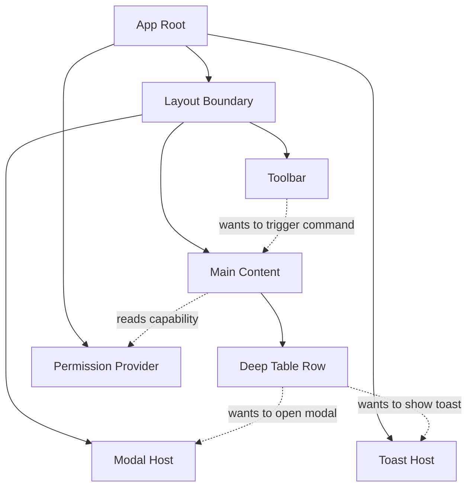
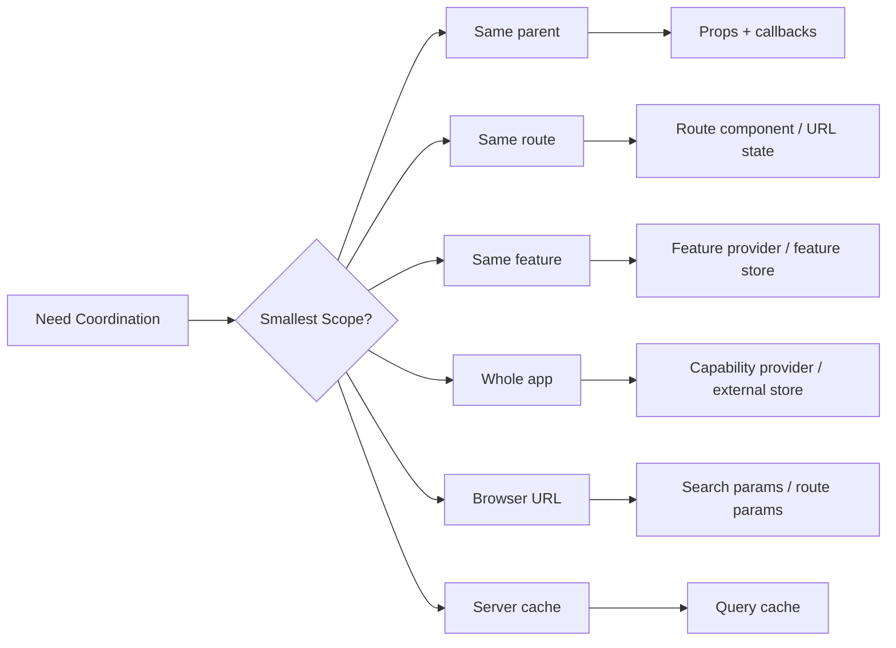
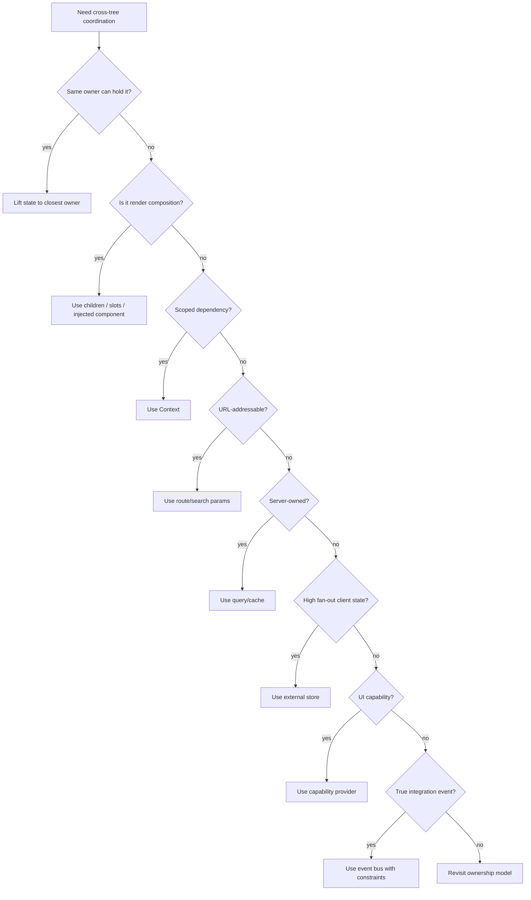
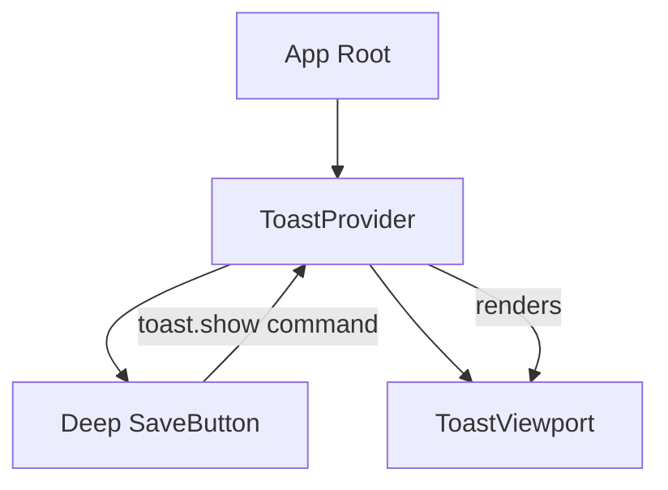
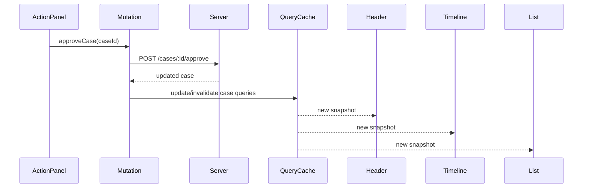
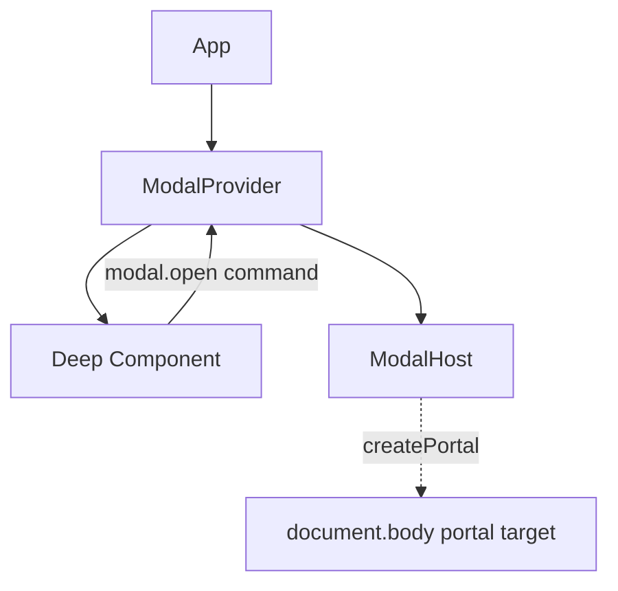

# Part 041 — Cross-Tree Communication

Cross-tree communication muncul ketika dua component yang perlu berkoordinasi tidak berada dalam hubungan parent-child yang dekat.

Contoh umum:

```txt
Toolbar button membuka modal yang dirender jauh di AppShell
Table row memicu toast yang hidup di root provider
Form field membaca permission dari route boundary
Sidebar selection memengaruhi main panel dan breadcrumb
Wizard step memengaruhi footer action bar
Nested page ingin mengubah document title, command palette, or route search params
```

Problem ini sering diselesaikan dengan “pakai global store saja”. Itu sering bekerja di awal, lalu perlahan membuat dependency tidak terlihat, ownership kabur, dan test menjadi berat.

Cross-tree communication bukan izin untuk menghapus arsitektur. Ia adalah sinyal bahwa ada **coordination boundary** yang belum diberi bentuk yang tepat.

---

## 1. Mental Model

React data flow tetap sederhana:

```txt
parent renders child with props
child reports intent upward through callback
context makes scoped values available downward
external store lets many nodes subscribe to shared external source
```

Cross-tree communication terjadi ketika jalur alami props/callback terlalu panjang atau tidak merepresentasikan ownership yang benar.



The real question is not:

```txt
How can C talk to D?
```

The better question is:

```txt
What shared abstraction owns this coordination?
```

Possible answers:

```txt
route boundary
layout boundary
feature provider
external store
server-state cache
URL
modal/toast capability provider
state machine actor
command bus
```

---

## 2. Define Cross-Tree Precisely

Cross-tree does not always mean global.

A component pair can be cross-tree within:

```txt
a compound component
an application shell
a route segment
a feature module
a microfrontend island
a portal layer
a server/client boundary
a workflow actor tree
```

That distinction matters because the safest solution is usually the **narrowest shared scope**, not the widest available tool.



Rule:

```txt
Never promote state farther than its lifecycle requires.
```

If state dies with a modal, keep it in modal. If state dies with a route, keep it at route. If state is shareable/bookmarkable, put it in URL. If server owns it, put it in server cache. If it coordinates a global UI capability, expose a capability provider.

---

## 3. Communication Channels in React

Cross-tree communication usually uses one of these channels:

| Channel | Direction | Best For | Risk |
|---|---:|---|---|
| Lifted owner | down props, up callbacks | Nearby coordination | Prop drilling if too far |
| Composition slot | parent injects child/behavior | Layout and extensibility | Hidden coupling if overused |
| Context | down scoped dependency | Theme, permissions, capabilities, feature services | Rerender fan-out, hidden dependencies |
| URL state | browser-addressable state | Filters, tabs, search, pagination | Serialization complexity |
| External store | many subscribers | High fan-out client state | Global coupling, tearing if unsafe |
| Server-state cache | many readers of server data | Remote data, freshness, invalidation | Cache inconsistency if keys are weak |
| Command provider | arbitrary caller to scoped host | Toast, modal, command palette, confirmation | Turns into event bus if undisciplined |
| Event bus | publish/subscribe | Decoupled integration events | Causal opacity, leaks, ordering bugs |
| Imperative ref | direct command to component instance | Focus, scroll, measurement, media control | Breaks declarative topology |

The table is intentionally not ranked by popularity. It is ranked by architectural meaning.

---

## 4. Decision Ladder

Use this ladder before creating a global store.

```txt
1. Can the state stay local?
2. Can the closest common owner hold it?
3. Is the problem actually composition/slot injection?
4. Is the value a scoped dependency? Use Context.
5. Is the state route-addressable? Use URL.
6. Is the state server-owned? Use server-state cache.
7. Is it high fan-out client state? Use external store.
8. Is it a UI capability? Use capability provider.
9. Is it a true decoupled event? Use event bus with strict rules.
10. Is it an imperative DOM/component command? Use ref handle.
```

Mermaid version:



---

## 5. Pattern 1 — Closest Shared Owner

This is still the default answer.

```tsx
function CaseWorkspace() {
  const [selectedCaseId, setSelectedCaseId] = useState<string | null>(null);

  return (
    <WorkspaceLayout
      sidebar={
        <CaseList
          selectedCaseId={selectedCaseId}
          onSelectCase={setSelectedCaseId}
        />
      }
      content={
        <CaseDetail caseId={selectedCaseId} />
      }
    />
  );
}
```

The sibling components never talk directly. The shared owner coordinates them.

This is correct when:

```txt
state is needed by a small subtree
state lifecycle matches that subtree
updates are not extremely frequent
owner can express the transition clearly
```

Bad sign:

```tsx
<App
  selectedCaseId={selectedCaseId}
  onSelectCase={setSelectedCaseId}
  activeFilter={activeFilter}
  onFilterChange={setActiveFilter}
  draftComment={draftComment}
  onDraftCommentChange={setDraftComment}
  modalState={modalState}
  onModalChange={setModalState}
/>
```

This is not cross-tree communication anymore. This is missing boundaries.

Refactor by splitting ownership:

```txt
route state -> route component
modal state -> modal provider or modal host
filter state -> URL/search params or feature owner
draft state -> local form owner
server data -> query cache
```

---

## 6. Pattern 2 — Composition Slot as Communication

Sometimes cross-tree communication is actually a composition problem.

Instead of this:

```tsx
function Page() {
  return (
    <>
      <Header />
      <Content />
    </>
  );
}

function Content() {
  // wants to modify Header actions somehow
}
```

Make the page own the composition:

```tsx
function CasePage() {
  const actions = <CaseActions />;

  return (
    <PageShell header={<Header actions={actions} />}>
      <CaseDetail />
    </PageShell>
  );
}
```

If the content needs to contribute to header actions dynamically, use a route-level boundary:

```tsx
function CaseRoute() {
  const [headerActions, setHeaderActions] = useState<ReactNode>(null);

  return (
    <HeaderContributionContext.Provider value={setHeaderActions}>
      <PageShell header={<Header actions={headerActions} />}>
        <CaseDetail />
      </PageShell>
    </HeaderContributionContext.Provider>
  );
}
```

But be careful. Dynamic contribution APIs can become invisible layout mutation. Prefer explicit composition where possible.

---

## 7. Pattern 3 — Context for Scoped Dependency

Context is good when the data is naturally scoped to a subtree.

Examples:

```txt
theme
density
direction
current route permissions
form field registration
modal service
analytics service
feature commands
```

A safe context should answer:

```txt
what is the provider scope?
what is the value lifecycle?
who may update it?
what rerenders when it changes?
is this data or capability?
```

Example: scoped permission dependency.

```tsx
type PermissionContextValue = {
  canApprove: boolean;
  canEscalate: boolean;
  canAssign: boolean;
};

const PermissionContext = createContext<PermissionContextValue | null>(null);

export function usePermissions() {
  const value = useContext(PermissionContext);
  if (!value) {
    throw new Error('usePermissions must be used inside PermissionProvider');
  }
  return value;
}

function CaseRoute({ permissions }: { permissions: PermissionContextValue }) {
  return (
    <PermissionContext.Provider value={permissions}>
      <CasePage />
    </PermissionContext.Provider>
  );
}
```

Consumer:

```tsx
function EscalateButton() {
  const { canEscalate } = usePermissions();

  return (
    <button disabled={!canEscalate}>
      Escalate
    </button>
  );
}
```

This is not “global auth state”. It is route-scoped capability data.

---

## 8. Pattern 4 — Capability Provider

Capability provider is a specialized context pattern.

It passes a **thing you can do**, not a blob of state.

Example: toast.

```tsx
type ToastCommand = {
  kind: 'success' | 'error' | 'info';
  message: string;
};

type ToastApi = {
  show(command: ToastCommand): void;
};

const ToastContext = createContext<ToastApi | null>(null);

export function useToast() {
  const api = useContext(ToastContext);
  if (!api) {
    throw new Error('useToast must be used inside ToastProvider');
  }
  return api;
}
```

Provider:

```tsx
function ToastProvider({ children }: { children: ReactNode }) {
  const [toasts, setToasts] = useState<Array<ToastCommand & { id: string }>>([]);

  const api = useMemo<ToastApi>(() => ({
    show(command) {
      setToasts(current => [
        ...current,
        { ...command, id: crypto.randomUUID() },
      ]);
    },
  }), []);

  return (
    <ToastContext.Provider value={api}>
      {children}
      <ToastViewport toasts={toasts} />
    </ToastContext.Provider>
  );
}
```

Caller:

```tsx
function SaveButton() {
  const toast = useToast();

  async function handleSave() {
    await save();
    toast.show({ kind: 'success', message: 'Saved' });
  }

  return <button onClick={handleSave}>Save</button>;
}
```

The caller does not own toast rendering. It only sends a command to a scoped capability.

This is useful because the caller and host are far apart:



---

## 9. Capability Provider vs Event Bus

A capability provider has a named API.

```tsx
toast.show({ kind: 'success', message: 'Saved' });
modal.confirm({ title: 'Delete case?' });
commandPalette.open();
analytics.track({ name: 'case_saved' });
```

An event bus often has generic string events.

```tsx
bus.emit('toast', payload);
bus.emit('modal:open', payload);
bus.emit('case:saved', payload);
```

The provider API is easier to type, test, refactor, and restrict.

Use capability provider when there is an obvious host/service.

Use event bus only when:

```txt
publisher and subscriber are intentionally decoupled
there may be multiple subscribers
the event represents something that happened, not a command to a single host
lifecycle and cleanup are strictly controlled
ordering semantics are documented
```

This distinction becomes central in Part 042 and Part 045.

---

## 10. Pattern 5 — URL State

URL is the correct cross-tree channel when the state is part of navigation identity.

Examples:

```txt
selected tab
search text
filter conditions
sort order
pagination cursor
view mode
entity id
```

If state should survive reload, be shareable, or support browser back/forward, URL is often better than context or store.

```tsx
function CaseSearchRoute() {
  const [searchParams, setSearchParams] = useSearchParams();

  const filters = parseFilters(searchParams);

  function updateFilters(next: CaseFilters) {
    setSearchParams(serializeFilters(next));
  }

  return (
    <CaseSearchPage
      filters={filters}
      onFiltersChange={updateFilters}
    />
  );
}
```

Cross-tree benefit:

```txt
FilterPanel reads filters
ResultTable reads filters
Breadcrumb reads filters
ExportButton reads filters
Browser history tracks filters
```

The URL becomes the shared owner.

But URL state must be serialized carefully:

```txt
stable key names
versioned encoding for complex filters
default value normalization
avoid encoding sensitive state
avoid huge state blobs
```

Bad URL state:

```txt
?state={massive-json-dump}
?token=secret
?draftComment=private-text
```

Good URL state:

```txt
?status=open&assignee=me&page=2&sort=updated_desc
```

---

## 11. Pattern 6 — Server-State Cache

If the state is owned by the server, cross-tree communication should often happen through a cache layer, not direct component messaging.

Example:

```txt
CaseHeader shows case status
CaseTimeline shows latest action
CaseActionPanel mutates case status
CaseList row also displays case status
```

The action panel should not manually notify every component. It should mutate server state and invalidate/update the relevant cache entries.

Conceptual flow:



The communication channel is not component-to-component. It is server-state invalidation.

This prevents:

```txt
manual fan-out updates
stale duplicated data
hidden imperative callbacks
inconsistent views after mutation
```

---

## 12. Pattern 7 — External Store

External store is appropriate when many distant components need to read/write shared client state with finer subscription control than Context.

Examples:

```txt
selection model for a large table
collaborative editor local presence
client-side command palette registry
feature-wide UI store
workspace layout state
multi-panel drag state
```

The store exists outside React; components subscribe to slices.

Conceptual store:

```tsx
type WorkspaceState = {
  selectedPanelId: string | null;
  sidebarCollapsed: boolean;
};

type Listener = () => void;

function createWorkspaceStore(initial: WorkspaceState) {
  let state = initial;
  const listeners = new Set<Listener>();

  return {
    getSnapshot() {
      return state;
    },
    subscribe(listener: Listener) {
      listeners.add(listener);
      return () => listeners.delete(listener);
    },
    setState(updater: (state: WorkspaceState) => WorkspaceState) {
      state = updater(state);
      listeners.forEach(listener => listener());
    },
  };
}
```

Then React integrates through a safe subscription hook.

```tsx
function useWorkspaceSnapshot() {
  return useSyncExternalStore(
    workspaceStore.subscribe,
    workspaceStore.getSnapshot,
    workspaceStore.getSnapshot,
  );
}
```

This pattern will be expanded in Parts 060–066.

For now, the rule is:

```txt
Use external store when you need shared client state with independent subscriptions.
Do not use it merely to avoid thinking about ownership.
```

---

## 13. Pattern 8 — Portal Communication

Portals complicate intuition because the DOM location changes, but the React owner tree remains the source of truth.

Typical overlay architecture:



The modal may render into `document.body`, but its state can still be owned by `ModalProvider`.

Example capability API:

```tsx
type ModalApi = {
  confirm(options: ConfirmOptions): Promise<boolean>;
};
```

Usage:

```tsx
function DeleteButton({ caseId }: { caseId: string }) {
  const modal = useModal();
  const toast = useToast();

  async function handleDelete() {
    const confirmed = await modal.confirm({
      title: 'Delete case?',
      description: 'This cannot be undone.',
    });

    if (!confirmed) return;

    await deleteCase(caseId);
    toast.show({ kind: 'success', message: 'Case deleted' });
  }

  return <button onClick={handleDelete}>Delete</button>;
}
```

The component does not know where the modal lives. It only knows a capability.

Caveat:

```txt
Promise-returning modal APIs are convenient but can hide workflow state.
For complex workflows, model the flow explicitly with reducer/state machine.
```

---

## 14. Pattern 9 — Command Channel

A command channel is narrower than an event bus.

It exposes commands to a known domain/service.

Example:

```tsx
type WorkspaceCommand =
  | { type: 'openPanel'; panelId: string }
  | { type: 'closePanel'; panelId: string }
  | { type: 'focusSearch' };

type WorkspaceCommands = {
  dispatch(command: WorkspaceCommand): void;
};
```

Provider:

```tsx
const WorkspaceCommandContext = createContext<WorkspaceCommands | null>(null);

function WorkspaceProvider({ children }: { children: ReactNode }) {
  const [state, dispatch] = useReducer(workspaceReducer, initialWorkspace);

  const commands = useMemo<WorkspaceCommands>(() => ({
    dispatch,
  }), []);

  return (
    <WorkspaceCommandContext.Provider value={commands}>
      <WorkspaceStateContext.Provider value={state}>
        {children}
      </WorkspaceStateContext.Provider>
    </WorkspaceCommandContext.Provider>
  );
}
```

A deep component can dispatch intent without reading all state.

```tsx
function SearchShortcutButton() {
  const { dispatch } = useWorkspaceCommands();

  return (
    <button onClick={() => dispatch({ type: 'focusSearch' })}>
      Focus search
    </button>
  );
}
```

Why split command context and state context?

```txt
command identity can stay stable
command users do not rerender for state changes
readers and writers can be governed separately
```

This is especially useful for large layout/workspace boundaries.

---

## 15. Cross-Tree Communication as Ports and Adapters

A production React app benefits from thinking in ports.

```txt
UI component -> intent port -> owner/provider/store -> transition -> new snapshot
```

Instead of giving components access to implementation details:

```tsx
const { setModalState, setToasts, setSidebarCollapsed, setSelectedCase } = useAppContext();
```

Give them narrow ports:

```tsx
const modal = useModal();
const toast = useToast();
const workspace = useWorkspaceCommands();
```

This creates auditability:

```txt
What can this component do?
What is it allowed to read?
What transitions can happen?
Where is the side effect boundary?
```

---

## 16. Build From Scratch: Scoped Command Host

Let us build a small command host for a route-level action bar.

Goal:

```txt
Deep content can contribute actions to route header/footer.
The route owns the slot.
Cleanup happens automatically on unmount.
The API is scoped to the route, not global.
```

### 16.1 Define the contract

```tsx
type ActionContribution = {
  id: string;
  node: ReactNode;
  order?: number;
};

type ActionRegistry = {
  register(action: ActionContribution): () => void;
};
```

### 16.2 Create strict context

```tsx
const ActionRegistryContext = createContext<ActionRegistry | null>(null);

function useActionRegistry() {
  const registry = useContext(ActionRegistryContext);
  if (!registry) {
    throw new Error('useActionRegistry must be used inside ActionRegistryProvider');
  }
  return registry;
}
```

### 16.3 Provider owns the registry

```tsx
function ActionRegistryProvider({ children }: { children: ReactNode }) {
  const [actions, setActions] = useState<ActionContribution[]>([]);

  const registry = useMemo<ActionRegistry>(() => ({
    register(action) {
      setActions(current => {
        const withoutSame = current.filter(item => item.id !== action.id);
        return [...withoutSame, action].sort((a, b) => (a.order ?? 0) - (b.order ?? 0));
      });

      return () => {
        setActions(current => current.filter(item => item.id !== action.id));
      };
    },
  }), []);

  return (
    <ActionRegistryContext.Provider value={registry}>
      <RouteShell actions={actions.map(action => action.node)}>
        {children}
      </RouteShell>
    </ActionRegistryContext.Provider>
  );
}
```

### 16.4 Deep component contributes action

```tsx
function useActionContribution(action: ActionContribution) {
  const registry = useActionRegistry();

  useEffect(() => {
    return registry.register(action);
  }, [registry, action]);
}
```

But `action` is an object. If created inline, it changes every render.

Better:

```tsx
function CaseDetailActions({ caseId }: { caseId: string }) {
  const action = useMemo<ActionContribution>(() => ({
    id: `approve-${caseId}`,
    order: 10,
    node: <ApproveCaseButton caseId={caseId} />,
  }), [caseId]);

  useActionContribution(action);

  return null;
}
```

This is a valid cross-tree pattern when used sparingly.

But if every page region mutates every other region through registries, the architecture becomes implicit and hard to debug.

---

## 17. Anti-Pattern: AppContext as Service Locator

Bad:

```tsx
const app = useAppContext();

app.setCurrentCase(case);
app.setModal({ type: 'delete-case' });
app.setToast({ message: 'Saved' });
app.analytics.track('case_saved');
app.router.navigate('/cases');
```

This makes every component able to do almost anything.

Problems:

```txt
unclear authority
hard to test
accidental rerender fan-out
weak type boundary
no transition audit
no feature ownership
no clear migration path
```

Better:

```tsx
const modal = useModal();
const toast = useToast();
const analytics = useAnalytics();
const caseCommands = useCaseCommands();
```

Even better:

```tsx
function useApproveCaseFlow(caseId: string) {
  const modal = useModal();
  const toast = useToast();
  const approveCase = useApproveCaseMutation();

  return async function approve() {
    const confirmed = await modal.confirm({ title: 'Approve case?' });
    if (!confirmed) return;

    await approveCase.mutateAsync({ caseId });
    toast.show({ kind: 'success', message: 'Case approved' });
  };
}
```

Now cross-tree communication is hidden behind a workflow hook with explicit dependencies.

---

## 18. Cross-Tree Read vs Cross-Tree Write

Separate reads and writes.

Cross-tree read examples:

```txt
read theme
read current permission
read selected workspace
read feature flags
read query data
```

Cross-tree write examples:

```txt
open modal
enqueue toast
mutate server data
dispatch workflow event
update URL param
```

Reads and writes have different performance and authority concerns.

Pattern:

```tsx
const WorkspaceStateContext = createContext<WorkspaceState | null>(null);
const WorkspaceCommandsContext = createContext<WorkspaceCommands | null>(null);
```

Avoid:

```tsx
const WorkspaceContext = createContext<{
  state: WorkspaceState;
  setState: Dispatch<SetStateAction<WorkspaceState>>;
} | null>(null);
```

Raw setter access is too broad. It lets random children violate invariants.

---

## 19. Choosing the Right Scope

Scope examples:

| Coordination | Suggested Scope |
|---|---|
| Field label/input/error linkage | FormField provider |
| Tabs trigger/content | Tabs root provider |
| Route header actions | Route shell provider |
| Modal/toast | App shell provider |
| Case workflow transition | Case route/workflow provider |
| Table selection | Table provider or feature store |
| Query filters | URL/search params |
| Remote entity data | Server-state cache |
| Theme/direction | App or design-system provider |
| Permission snapshot | Route/feature provider |

The narrowest scope wins unless there is a concrete reason to widen it.

---

## 20. Failure Modes

### 20.1 Global store used as wiring shortcut

Symptom:

```txt
State is global only because two distant components needed it once.
```

Consequence:

```txt
lifecycle becomes app-wide
state survives longer than expected
unrelated screens observe or mutate it
```

Fix:

```txt
move state to route/provider scope
or encode in URL/server cache if lifecycle requires it
```

### 20.2 Context with high-frequency updates

Symptom:

```txt
mouse position, drag state, scroll position, resize metrics in context
```

Consequence:

```txt
large subtree rerenders too often
```

Fix:

```txt
external store with selective subscription
localize state
throttle updates
use DOM/ref for non-render-critical values
```

### 20.3 Command provider becomes event bus

Symptom:

```tsx
commands.dispatch({ type: 'anything', payload: unknown });
```

Consequence:

```txt
no domain boundary
weak auditability
large switch statements
unclear ownership
```

Fix:

```txt
split capability APIs
use typed domain commands
move workflow into reducer/machine
```

### 20.4 Hidden layout mutation

Symptom:

```txt
Deep child modifies header/footer/sidebar through contribution registry.
```

Consequence:

```txt
layout cannot be understood from route component
cleanup bugs can leave stale actions
```

Fix:

```txt
prefer explicit slot composition
use registry only when dynamic contribution is essential
ensure cleanup on unmount
```

### 20.5 Cross-tree async race

Symptom:

```txt
Deep component triggers command; host state changes after caller unmounts.
```

Consequence:

```txt
stale promise continuation
modal resolves into unmounted workflow
lost updates
```

Fix:

```txt
AbortController
mounted guard for non-critical UI continuation
state machine actor lifecycle
idempotent commands
```

---

## 21. Review Checklist

Before approving cross-tree communication code, ask:

```txt
What is being communicated: data, intent, command, event, or capability?
Is this state local, route, URL, server, external, or workflow state?
What is the smallest correct owner?
Does the channel make authority explicit?
Does the reader subscribe only to what it needs?
Can this update violate invariants?
Can it leak after unmount?
Is cleanup deterministic?
Is ordering important?
Is the contract typed and named by domain intent?
Can we test the interaction without rendering the whole app?
```

If the answer is unclear, the pattern is not ready.

---

## 22. Practical Refactor Recipes

### Recipe A — Prop drilling to scoped context

Before:

```tsx
<App permission={permission}>
  <Layout permission={permission}>
    <Page permission={permission}>
      <Panel permission={permission}>
        <Button permission={permission} />
      </Panel>
    </Page>
  </Layout>
</App>
```

After:

```tsx
<PermissionProvider value={permission}>
  <Layout>
    <Page />
  </Layout>
</PermissionProvider>
```

Use only when many descendants truly need the same scoped value.

### Recipe B — AppContext to capability providers

Before:

```tsx
const { setToast, setModal, setSidebarOpen } = useAppContext();
```

After:

```tsx
const toast = useToast();
const modal = useModal();
const workspace = useWorkspaceCommands();
```

### Recipe C — Shared filters to URL

Before:

```tsx
const { filters, setFilters } = useSearchStore();
```

After:

```tsx
const filters = parseFilters(searchParams);
const setFilters = updateSearchParams;
```

### Recipe D — Remote entity duplication to query cache

Before:

```tsx
const [caseRecord, setCaseRecord] = useState<CaseRecord | null>(null);
```

Across multiple components.

After:

```tsx
const caseQuery = useCaseQuery(caseId);
const approveCase = useApproveCaseMutation();
```

Mutation updates or invalidates query cache.

---

## 23. Summary

Cross-tree communication is not one technique. It is an ownership problem.

Good React architecture does not ask:

```txt
How do I make distant components talk?
```

It asks:

```txt
Who owns the thing being coordinated?
What is the lifecycle of that thing?
What channel expresses that lifecycle with the least coupling?
```

Use props/callbacks when the owner is close. Use composition when the parent should assemble structure. Use Context for scoped dependencies and capabilities. Use URL for addressable navigation state. Use server-state cache for server-owned data. Use external store for high fan-out client state. Use command providers for scoped UI capabilities. Use event bus only when the event is truly decoupled and lifecycle-safe.

Cross-tree communication is production-safe only when authority, ownership, lifecycle, and failure modes are explicit.

---

## References

- React — Passing Props to a Component: https://react.dev/learn/passing-props-to-a-component
- React — Sharing State Between Components: https://react.dev/learn/sharing-state-between-components
- React — Passing Data Deeply with Context: https://react.dev/learn/passing-data-deeply-with-context
- React — Responding to Events: https://react.dev/learn/responding-to-events
- React — Separating Events from Effects: https://react.dev/learn/separating-events-from-effects
