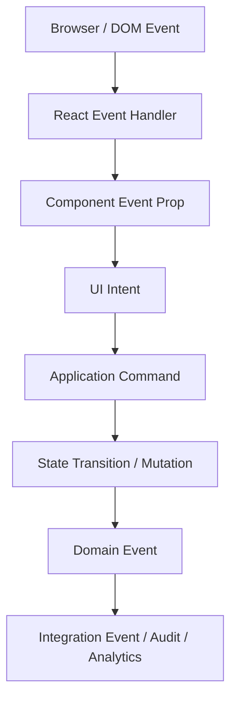
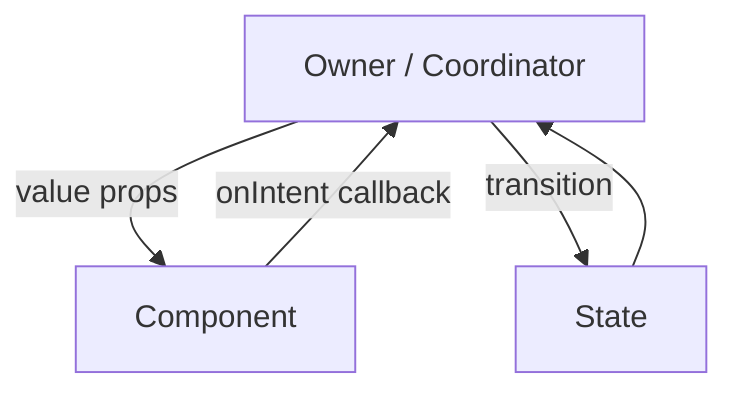
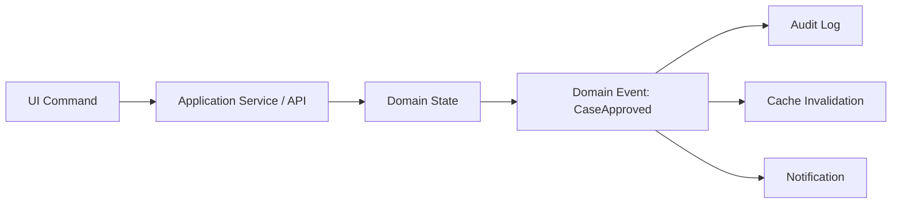
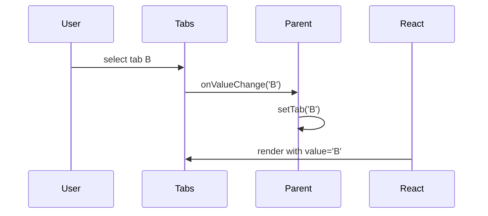
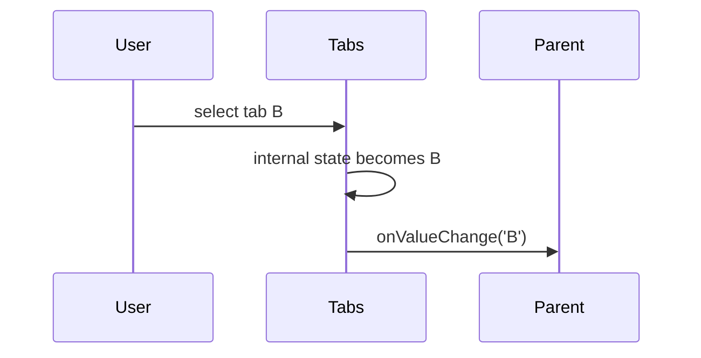

# Part 042 — Component Events vs Domain Events

Most React apps start with `onClick`.

Then they grow into:

```txt
onChange
onSubmit
onSave
onApprove
onClose
onSelected
onCaseUpdated
onSomethingHappened
```

At first, these look like the same concept: “events”. In production architecture, they are not the same.

A click is not a save. A save is not an approval. An approval is not a domain event. A domain event is not a command. A command is not a callback prop.

If you collapse all of them into “handler functions”, the UI becomes hard to reason about:

```txt
Who initiated the transition?
What actually happened?
Who owns the state change?
Can the action fail?
Can it be retried?
Is it user intent or domain fact?
Should multiple subscribers observe it?
Should it be persisted/audited?
```

This part builds a precise vocabulary.

---

## 1. The Event Stack

In a React application, “event” may refer to several layers.



Each layer has different semantics.

| Layer | Example | Meaning |
|---|---|---|
| DOM event | `click`, `keydown`, `input` | Browser interaction occurred |
| React event handler | `onClick={handleClick}` | Component responds to DOM event |
| Component event prop | `onOpenChange`, `onValueChange` | Component reports meaningful UI change |
| UI intent | `requestDelete`, `submitDraft` | User/application wants something |
| Application command | `approveCase(caseId)` | System is asked to perform action |
| State transition | `status: pending -> approved` | Local/client state changed |
| Domain event | `CaseApproved` | Business fact happened |
| Integration event | analytics/audit/outbox event | Fact emitted outside current UI boundary |

The bug in many React codebases is mixing these layers.

---

## 2. React Event Handler Is Not a Domain Event

React event handlers respond to interactions.

```tsx
function SaveButton({ onSave }: { onSave(): void }) {
  return <button onClick={onSave}>Save</button>;
}
```

This is acceptable for a simple button because the button does not know domain semantics.

But this is weak for a domain component:

```tsx
function ApproveCaseButton({ onClick }: { onClick(): void }) {
  return <button onClick={onClick}>Approve</button>;
}
```

Better:

```tsx
function ApproveCaseButton({ onApprove }: { onApprove(): void }) {
  return <button onClick={onApprove}>Approve</button>;
}
```

Why?

`onClick` describes the physical gesture. `onApprove` describes the component-level intent.

If later approval can be triggered by keyboard shortcut, command palette, or voice action, `onApprove` still makes sense. `onClick` does not.

---

## 3. Naming Contract

Name handlers by abstraction level.

| Component Level | Handler Name | Payload |
|---|---|---|
| Primitive button | `onClick` | React mouse event or no payload |
| Input primitive | `onChange` | React change event or value depending contract |
| Headless select | `onValueChange` | selected value |
| Modal | `onOpenChange` | next open state / reason |
| Form | `onSubmit` | submitted values / command payload |
| Domain action | `onApproveCase` | domain-specific payload |
| Workflow component | `onTransition` | event/transition object |

Bad generic names:

```txt
onAction
onEvent
onData
onUpdate
onSuccess
handleThing
```

These names hide intent.

Good names:

```txt
onOpenChange
onValueCommit
onDraftChange
onFilterApply
onCaseApproveRequest
onAssigneeSelect
onEscalationSubmit
```

A useful rule:

```txt
The handler name should still make sense if the trigger changes.
```

If `onClick` is used for “approve case”, the name is too low-level.

---

## 4. Component Event vs UI Intent

A component event reports something meaningful about that component.

```tsx
type TabsProps = {
  value: string;
  onValueChange(nextValue: string): void;
};
```

The Tabs component should not call it `onTabClick`, because the selected tab could change through:

```txt
mouse click
keyboard arrow navigation
programmatic change
initial controlled value
```

The component event is:

```txt
value changed
```

Not:

```txt
a trigger was clicked
```

This distinction makes components durable.

---

## 5. Intent vs Command

Intent says what the user wants.

Command asks the system to do it.

Example:

```tsx
function CaseActionPanel({ caseId }: { caseId: string }) {
  const approveCase = useApproveCaseCommand();

  async function handleApproveRequest() {
    await approveCase({ caseId });
  }

  return <ApproveCaseButton onApprove={handleApproveRequest} />;
}
```

Here:

```txt
button click -> component event
onApprove -> UI intent
approveCase({ caseId }) -> application command
server confirms -> domain fact / cache update
```

Commands usually have:

```txt
validation
authorization
idempotency
async lifecycle
failure mode
retry/cancel semantics
audit implications
```

A component event usually should not encode all of that.

---

## 6. Domain Event Is a Fact, Not a Request

Domain event names should be past tense because they represent something that has happened.

```txt
CaseApproved
CommentAdded
AssigneeChanged
InvestigationEscalated
DocumentUploaded
```

Commands are imperative:

```txt
ApproveCase
AddComment
ChangeAssignee
EscalateInvestigation
UploadDocument
```

UI intents are often request-shaped:

```txt
onApproveRequest
onDeleteRequest
onEscalationSubmit
onFilterApply
```

Why this matters:

```txt
ApproveCase can fail.
CaseApproved cannot fail; it already happened.
```

Bad:

```tsx
emitDomainEvent({ type: 'CaseApproved', caseId });
```

inside a button before the server confirms.

Better:

```tsx
await approveCase({ caseId });
```

Then after success, the server/cache/audit system may expose:

```txt
CaseApproved
```

as a fact.

---

## 7. The Direction of Truth

React component events usually flow upward.



Domain events often flow outward or into a domain event stream.



Do not pretend a child component emitting `onCaseApproved` is the same thing as the business domain event `CaseApproved`.

A React child can report:

```txt
user requested approval
form submitted approval payload
optimistic local transition started
```

But the business fact belongs to the application/domain boundary.

---

## 8. Payload Design

Handler payload should match abstraction level.

### Low-level primitive

```tsx
<button onClick={(event) => { ... }} />
```

The payload is a React event object.

### Design-system input

```tsx
<TextField value={name} onValueChange={setName} />
```

The payload is the value, not the DOM event.

### Domain component

```tsx
type EscalationSubmitPayload = {
  caseId: string;
  reasonCode: string;
  comment: string;
};

<EscalationForm onSubmitEscalation={handleSubmitEscalation} />
```

The payload is a domain command candidate.

### Workflow event

```tsx
type WizardEvent =
  | { type: 'next' }
  | { type: 'back' }
  | { type: 'submit'; values: FormValues }
  | { type: 'serverRejected'; errors: ValidationErrors };
```

The payload is an event in a local workflow state machine.

Rule:

```txt
Do not leak lower-level payloads into higher-level contracts.
```

Bad:

```tsx
function EscalationForm({ onSubmit }: { onSubmit(event: FormEvent): void }) {
  // parent must know DOM details
}
```

Better:

```tsx
function EscalationForm({
  onSubmitEscalation,
}: {
  onSubmitEscalation(payload: EscalationSubmitPayload): void;
}) {
  // form owns DOM event details
}
```

---

## 9. Reasons and Causes

Some component events need a reason.

Example: modal close.

```tsx
type ModalCloseReason =
  | 'escapeKey'
  | 'backdropClick'
  | 'closeButton'
  | 'programmatic'
  | 'submitSuccess';

type ModalProps = {
  open: boolean;
  onOpenChange(open: boolean, reason: ModalCloseReason): void;
};
```

Why include reason?

```txt
prevent accidental close on backdrop
record analytics differently
skip confirmation on submit success
handle escape differently for destructive flows
```

But do not overdo it.

If the parent never uses reason and the component is simple, adding reason creates unnecessary API surface.

Use reason when policy differs by cause.

---

## 10. Event Propagation vs Intent Propagation

Browser/React events propagate through the UI tree.

Component intent propagation is explicit through props.

Example:

```tsx
function Card({ onOpen }: { onOpen(): void }) {
  return (
    <article onClick={onOpen}>
      <button
        onClick={(event) => {
          event.stopPropagation();
          archive();
        }}
      >
        Archive
      </button>
    </article>
  );
}
```

This is event propagation management.

But at higher level, do not use DOM bubbling as application architecture.

Bad:

```tsx
<div onClick={handleAllDomainActions}>
  <DeepCaseButton data-action="approve" />
</div>
```

This can be useful for low-level event delegation, but it is poor domain communication.

Better:

```tsx
<ApproveCaseButton onApprove={approveCase} />
```

Application intent should be explicit.

---

## 11. Do Not Leak Synthetic Events Across Async Boundaries

React event handlers receive event objects. For domain-level callbacks, prefer extracting the data you need immediately and passing a domain payload.

Bad:

```tsx
function SearchBox({ onSearch }: { onSearch(event: ChangeEvent<HTMLInputElement>): void }) {
  return <input onChange={onSearch} />;
}
```

Now parent knows this is an input and must parse `event.target.value`.

Better:

```tsx
function SearchBox({ onSearchTextChange }: { onSearchTextChange(value: string): void }) {
  return (
    <input
      onChange={event => onSearchTextChange(event.currentTarget.value)}
    />
  );
}
```

The component boundary converts DOM event into component event.

---

## 12. Event Handler Should Not Hide State Ownership

Bad:

```tsx
function CaseRow({ caseRecord }: { caseRecord: CaseRecord }) {
  const { setSelectedCase, setPanelOpen, setBreadcrumb } = useAppContext();

  function handleClick() {
    setSelectedCase(caseRecord);
    setPanelOpen(true);
    setBreadcrumb(caseRecord.title);
  }

  return <tr onClick={handleClick}>...</tr>;
}
```

This row secretly updates three separate owners.

Better:

```tsx
type CaseRowProps = {
  caseRecord: CaseSummary;
  onSelectCase(caseId: string): void;
};

function CaseRow({ caseRecord, onSelectCase }: CaseRowProps) {
  return (
    <tr onClick={() => onSelectCase(caseRecord.id)}>
      ...
    </tr>
  );
}
```

Then the owner coordinates transitions:

```tsx
function CaseSearchPage() {
  const [selectedCaseId, setSelectedCaseId] = useState<string | null>(null);

  function handleSelectCase(caseId: string) {
    setSelectedCaseId(caseId);
  }

  return (
    <CaseTable onSelectCase={handleSelectCase} />
  );
}
```

If selection also affects URL, panel, and breadcrumb, the page/route boundary is the correct coordinator.

---

## 13. Events as Transition Inputs

Reducers and state machines clarify event semantics.

Bad setter style:

```tsx
setIsSubmitting(true);
setError(null);
setResult(null);
```

Better event style:

```tsx
dispatch({ type: 'submitRequested', values });
```

Reducer:

```tsx
type FormState =
  | { tag: 'editing'; values: FormValues }
  | { tag: 'submitting'; values: FormValues }
  | { tag: 'failed'; values: FormValues; error: string }
  | { tag: 'submitted'; receiptId: string };

type FormEvent =
  | { type: 'changed'; values: FormValues }
  | { type: 'submitRequested' }
  | { type: 'submitSucceeded'; receiptId: string }
  | { type: 'submitFailed'; error: string };

function formReducer(state: FormState, event: FormEvent): FormState {
  switch (state.tag) {
    case 'editing':
      if (event.type === 'changed') {
        return { tag: 'editing', values: event.values };
      }
      if (event.type === 'submitRequested') {
        return { tag: 'submitting', values: state.values };
      }
      return state;

    case 'submitting':
      if (event.type === 'submitSucceeded') {
        return { tag: 'submitted', receiptId: event.receiptId };
      }
      if (event.type === 'submitFailed') {
        return { tag: 'failed', values: state.values, error: event.error };
      }
      return state;

    case 'failed':
      if (event.type === 'changed') {
        return { tag: 'editing', values: event.values };
      }
      if (event.type === 'submitRequested') {
        return { tag: 'submitting', values: state.values };
      }
      return state;

    case 'submitted':
      return state;
  }
}
```

The event becomes an input to a controlled state transition.

---

## 14. Component Event Contract Checklist

For every public component event prop, define:

```txt
Name: what semantic change/request does this represent?
Direction: who calls whom?
Timing: before state change, after state change, or during attempted change?
Payload: DOM event, value, reason, command payload, or transition event?
Authority: can parent veto? can child continue independently?
Async: may callback return Promise? does child await it?
Errors: who catches failure?
Reentrancy: can it fire multiple times quickly?
Idempotency: can duplicate events be ignored safely?
Accessibility: can non-click interactions trigger the same event?
```

Example:

```tsx
type DialogProps = {
  open: boolean;
  onOpenChange(open: boolean, reason: DialogOpenChangeReason): void;
};
```

This tells the parent:

```txt
Dialog reports desired open-state change.
Parent owns final open state.
Reason indicates trigger cause.
Dialog does not persist state itself when controlled.
```

---

## 15. Controlled Component Event Semantics

For controlled components, event callback does not mutate internal source of truth. It requests owner transition.

```tsx
<Tabs value={tab} onValueChange={setTab} />
```

Flow:



The selected tab is not truly changed until parent passes the new `value`.

This matters for validation/veto:

```tsx
function handleTabChange(nextTab: string) {
  if (hasUnsavedChanges && nextTab !== currentTab) {
    confirmLeave(nextTab);
    return;
  }

  setCurrentTab(nextTab);
}
```

The component event is a request. The owner decides.

---

## 16. Uncontrolled Component Event Semantics

For uncontrolled components, the component owns state and reports changes outward.

```tsx
<Tabs defaultValue="overview" onValueChange={trackTabChange} />
```

Flow:



The parent observes. It does not own.

This is fine for local UI state. It is wrong when parent must enforce policy.

---

## 17. Async Handler Semantics

Be explicit about whether child awaits parent callback.

Bad unclear API:

```tsx
type SaveButtonProps = {
  onSave(): Promise<void> | void;
};
```

Does the button show loading? Disable itself? Catch error? Ignore the promise?

Better:

```tsx
type SaveButtonProps = {
  pending?: boolean;
  onSaveRequest(): void;
};
```

Parent owns async state:

```tsx
function SaveSection() {
  const saveMutation = useSaveMutation();

  return (
    <SaveButton
      pending={saveMutation.isPending}
      onSaveRequest={() => saveMutation.mutate()}
    />
  );
}
```

Alternative if child owns async lifecycle:

```tsx
type AsyncActionButtonProps = {
  action(): Promise<void>;
  successLabel?: string;
  errorLabel?: string;
};
```

But then the component contract must say it owns pending/error display.

---

## 18. Events, Commands, and Analytics

Do not let analytics define your event model.

Bad:

```tsx
function handleApproveClick() {
  analytics.track('approve_clicked');
  approveCase();
}
```

This records gesture, not outcome. That might be valid, but it is not the same as `case_approved`.

Better separation:

```tsx
function handleApproveRequest() {
  analytics.track('case_approve_requested', { caseId });
  approveCase.mutate(
    { caseId },
    {
      onSuccess() {
        analytics.track('case_approved', { caseId });
      },
      onError(error) {
        analytics.track('case_approve_failed', { caseId, reason: classify(error) });
      },
    },
  );
}
```

Three different facts:

```txt
user requested approval
approval succeeded
approval failed
```

Do not collapse them.

---

## 19. Case Study: Approval Button

Naive implementation:

```tsx
function ApproveButton({ caseRecord }: { caseRecord: CaseRecord }) {
  const app = useAppContext();

  async function handleClick() {
    app.setLoading(true);
    await api.approveCase(caseRecord.id);
    app.emit('CaseApproved', caseRecord);
    app.setLoading(false);
  }

  return <button onClick={handleClick}>Approve</button>;
}
```

Problems:

```txt
component owns too much
loading state is global and vague
emits domain event before canonical server/cache model is clarified
no error path
no idempotency
no permission boundary
no transition naming
no testable command abstraction
```

Better:

```tsx
type ApproveCaseButtonProps = {
  disabled?: boolean;
  pending?: boolean;
  onApproveRequest(): void;
};

function ApproveCaseButton({
  disabled,
  pending,
  onApproveRequest,
}: ApproveCaseButtonProps) {
  return (
    <button
      disabled={disabled || pending}
      onClick={onApproveRequest}
    >
      {pending ? 'Approving...' : 'Approve'}
    </button>
  );
}
```

Container:

```tsx
function ApproveCaseAction({ caseId }: { caseId: string }) {
  const permissions = usePermissions();
  const approveCase = useApproveCaseMutation();
  const toast = useToast();

  function handleApproveRequest() {
    approveCase.mutate(
      { caseId },
      {
        onSuccess() {
          toast.show({ kind: 'success', message: 'Case approved' });
        },
      },
    );
  }

  return (
    <ApproveCaseButton
      disabled={!permissions.canApprove}
      pending={approveCase.isPending}
      onApproveRequest={handleApproveRequest}
    />
  );
}
```

Now the component event is UI intent. The mutation command owns the application action. Server/cache update owns the domain result. Toast is a capability.

---

## 20. Case Study: Select Component

Bad:

```tsx
type SelectProps = {
  onClick(option: Option): void;
};
```

Click is not the semantic event. Selection can happen through keyboard.

Better:

```tsx
type SelectProps<TValue> = {
  value?: TValue;
  defaultValue?: TValue;
  onValueChange?(value: TValue, meta: { reason: 'pointer' | 'keyboard' | 'programmatic' }): void;
};
```

For a domain wrapper:

```tsx
type AssigneeSelectProps = {
  assigneeId: string | null;
  onAssigneeChange(assigneeId: string | null): void;
};
```

And at command boundary:

```tsx
function CaseAssigneeField({ caseId, assigneeId }: Props) {
  const changeAssignee = useChangeAssigneeMutation();

  return (
    <AssigneeSelect
      assigneeId={assigneeId}
      onAssigneeChange={(nextAssigneeId) => {
        changeAssignee.mutate({ caseId, assigneeId: nextAssigneeId });
      }}
    />
  );
}
```

The event vocabulary gets more domain-specific as it moves upward.

---

## 21. Event Bus Vocabulary

If you must use an event bus, distinguish event types.

Bad:

```tsx
bus.emit('approveCase', { caseId });
bus.emit('approved', { caseId });
bus.emit('approval', { caseId });
```

Better:

```tsx
commandBus.dispatch({ type: 'ApproveCase', caseId });
domainEvents.publish({ type: 'CaseApproved', caseId, approvedAt });
analytics.track({ name: 'case_approve_requested', caseId });
```

Three separate channels:

```txt
command bus asks for work
domain event stream announces facts
analytics records observations
```

In frontend code, most event bus use cases are better represented as:

```txt
Context capability
external store
state machine actor
server cache invalidation
```

Event bus should be a last-resort integration mechanism, not the default communication model.

---

## 22. Testing Event Semantics

Do not only test that a callback is called. Test semantic payload and ownership.

Example:

```tsx
it('reports selected value, not DOM event', async () => {
  const onValueChange = vi.fn();

  render(
    <Select
      value="open"
      onValueChange={onValueChange}
      options={['open', 'closed']}
    />,
  );

  await user.click(screen.getByRole('option', { name: 'closed' }));

  expect(onValueChange).toHaveBeenCalledWith('closed', expect.anything());
});
```

For controlled component:

```tsx
it('does not visually change until owner passes next value', async () => {
  const onValueChange = vi.fn();

  render(
    <Tabs value="a" onValueChange={onValueChange}>
      ...
    </Tabs>,
  );

  await user.click(screen.getByRole('tab', { name: 'B' }));

  expect(onValueChange).toHaveBeenCalledWith('b');
  expect(screen.getByRole('tab', { name: 'A' })).toHaveAttribute('aria-selected', 'true');
});
```

This verifies controlled semantics.

---

## 23. Failure Modes

### 23.1 Handler name too low-level

Symptom:

```tsx
<ApproveCaseButton onClick={approveCase} />
```

Consequence:

```txt
component contract tied to physical gesture
keyboard/programmatic invocation becomes awkward
intent is hidden
```

Fix:

```tsx
<ApproveCaseButton onApproveRequest={approveCase} />
```

### 23.2 Domain event emitted before domain fact exists

Symptom:

```tsx
emit({ type: 'CaseApproved' });
await api.approveCase(caseId);
```

Consequence:

```txt
audit lies
subscribers update from false fact
rollback becomes complex
```

Fix:

```txt
emit request/optimistic event if needed
emit approved fact only after canonical success
```

### 23.3 DOM event leaked through design-system component

Symptom:

```tsx
<TextField onChange={(event) => setName(event.target.value)} />
```

Consequence:

```txt
consumer knows implementation detail
component cannot change internal DOM easily
```

Fix:

```tsx
<TextField onValueChange={setName} />
```

### 23.4 Async ownership unclear

Symptom:

```tsx
<ActionButton onAction={async () => save()} />
```

No one knows who owns pending/error state.

Fix:

```txt
parent-owned pending prop
or child-owned async contract with explicit error policy
```

### 23.5 One callback does too much

Symptom:

```tsx
onSave={() => {
  validate();
  mutate();
  navigate();
  toast();
  analytics();
  closeModal();
}}
```

Consequence:

```txt
workflow hidden in anonymous callback
hard to test failure paths
no transition model
```

Fix:

```txt
extract useSaveWorkflow
or model with reducer/state machine
```

---

## 24. Practical Naming Guide

Use these conventions unless you have a stronger team convention.

### Primitive components

```txt
onClick
onFocus
onBlur
onKeyDown
```

### Value components

```txt
onValueChange
onCheckedChange
onOpenChange
onSelectedKeysChange
onInputValueChange
```

### Draft/commit split

```txt
onDraftChange
onValueCommit
onFilterPreviewChange
onFilterApply
```

### Domain UI intents

```txt
onApproveRequest
onDeleteRequest
onEscalationSubmit
onAssignmentChangeRequest
```

### Workflow/state machine events

```txt
dispatch({ type: 'submitRequested' })
dispatch({ type: 'serverAccepted' })
dispatch({ type: 'cancelRequested' })
```

### Domain facts

```txt
CaseApproved
EscalationSubmitted
AssignmentChanged
DocumentUploaded
```

### Analytics observations

```txt
case_approval_requested
case_approval_succeeded
case_approval_failed
```

---

## 25. Review Checklist

For every event/callback API, ask:

```txt
Is this name tied to gesture or semantic intent?
Is the payload at the correct abstraction level?
Does the callback represent request, change, command, or fact?
Can the action fail?
Who owns pending/error state?
Can parent veto the change?
Can the event fire through keyboard or programmatic action?
Is this a component event or domain event?
Is analytics recording request, success, or failure?
Does any component emit domain facts before confirmation?
Are event names consistent across the design system?
```

---

## 26. Summary

A mature React codebase treats events as architecture, not just callback props.

The stack is:

```txt
DOM event
→ React event handler
→ component event
→ UI intent
→ application command
→ state transition / mutation
→ domain event
→ integration/audit/analytics event
```

Each layer should have its own vocabulary.

Use `onClick` for primitive interaction. Use `onValueChange` for component value changes. Use `onApproveRequest` for user intent. Use `ApproveCase` for command. Use `CaseApproved` only after approval has actually happened.

This precision prevents false facts, hidden ownership, leaky DOM details, and accidental workflow logic buried in anonymous callbacks.

In production React, event design is state design.

---

## References

- React — Responding to Events: https://react.dev/learn/responding-to-events
- React — Passing Props to a Component: https://react.dev/learn/passing-props-to-a-component
- React — Sharing State Between Components: https://react.dev/learn/sharing-state-between-components
- React — Separating Events from Effects: https://react.dev/learn/separating-events-from-effects
- React DOM Components — Common props and events: https://react.dev/reference/react-dom/components/common
