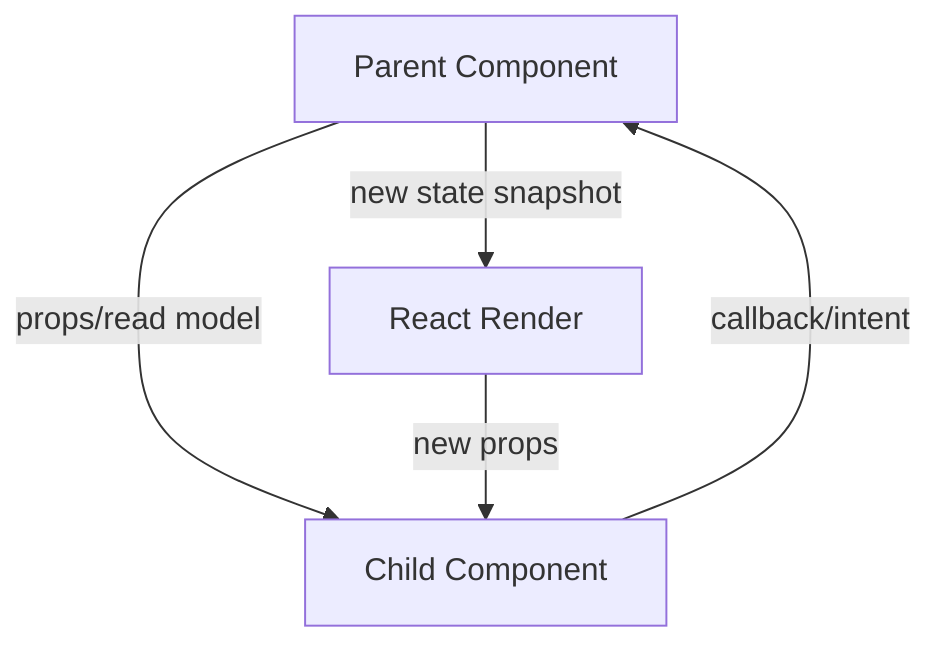
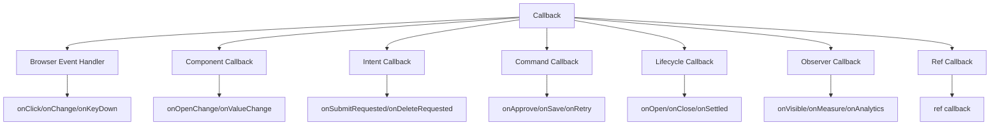

# Part 043 — Callback Design

Callback di React sering terlihat sederhana:

```tsx
<Button onClick={() => save()} />
```

Tapi di codebase besar, callback adalah **port komunikasi**. Callback menentukan:

- siapa pemilik keputusan,
- siapa pemilik state transition,
- payload apa yang boleh keluar dari boundary,
- apakah operasi sinkron atau asinkron,
- bagaimana error dikembalikan,
- apakah caller boleh mengandalkan return value,
- apakah event boleh dipanggil berkali-kali,
- dan apakah callback tersebut stabil secara identity.

Di level production, callback bukan cuma function. Callback adalah **kontrak arsitektur kecil**.

Mental model utamanya:

> A component should not expose internal mechanics. It should expose intents.

Komponen tidak seharusnya berkata:

```tsx
onSetSelectedTab(index)
```

Lebih baik ia berkata:

```tsx
onTabChange(nextTabId, reason)
```

Karena yang penting bukan mekanisme setter, melainkan intent: user atau sistem meminta tab aktif berubah.

---

## 1. Posisi Callback dalam Model React

React punya beberapa jalur komunikasi dasar:



Props membawa **data masuk**. Callback membawa **intent keluar**.

Itu berarti callback tidak seharusnya dipakai sebagai dump pipe untuk semua detail internal child. Callback harus membawa sinyal yang cukup bagi owner state untuk memutuskan next transition.

---

## 2. Callback Bukan Public Setter

Anti-pattern paling umum:

```tsx
function Parent() {
  const [selectedIds, setSelectedIds] = useState<string[]>([]);

  return <DataGrid setSelectedIds={setSelectedIds} />;
}
```

Masalahnya bukan karena ini selalu salah secara teknis. Masalahnya adalah parent membocorkan **mechanical setter** ke child. Child sekarang tahu bahwa parent menyimpan array, dan bisa melakukan transisi apa pun:

```tsx
props.setSelectedIds([]);
props.setSelectedIds(['x']);
props.setSelectedIds((prev) => prev.reverse());
```

Child menjadi punya hak terlalu besar.

Versi lebih baik:

```tsx
function Parent() {
  const [selectedIds, setSelectedIds] = useState<string[]>([]);

  return (
    <DataGrid
      selectedIds={selectedIds}
      onSelectionChange={(nextSelectedIds, meta) => {
        setSelectedIds(nextSelectedIds);
        auditSelectionChange(meta);
      }}
    />
  );
}
```

Lebih baik lagi jika domain punya invariant:

```tsx
function Parent() {
  const [state, dispatch] = useReducer(selectionReducer, initialSelectionState);

  return (
    <DataGrid
      selectedIds={state.selectedIds}
      onRowSelected={(rowId, meta) => {
        dispatch({ type: 'row.selected', rowId, source: meta.source });
      }}
      onRowDeselected={(rowId, meta) => {
        dispatch({ type: 'row.deselected', rowId, source: meta.source });
      }}
    />
  );
}
```

Perbedaannya:

| Bentuk | Child tahu apa? | Risiko |
|---|---|---|
| `setSelectedIds` | struktur state parent | child bisa melanggar invariant |
| `onSelectionChange` | value baru yang diminta | cukup baik untuk UI primitive |
| `onRowSelected` / `onRowDeselected` | intent domain-ish | paling kuat untuk state yang punya aturan |

Rule praktis:

> Pass setters only across very small, private boundaries. Across reusable or domain boundaries, pass intent callbacks.

---

## 3. Taxonomy Callback

Tidak semua callback sama. Nama dan payload harus mencerminkan jenisnya.



### 3.1 Browser Event Handler

Contoh:

```tsx
<button onClick={handleClick} />
<input onChange={handleInputChange} />
```

Karakteristik:

- menerima event object dari React/browser,
- biasanya dipasang pada DOM element,
- event dapat bubble,
- payload sangat dekat dengan DOM.

Browser event handler cocok berada di leaf component. Jangan bocorkan event DOM ke parent domain tanpa alasan kuat.

Kurang baik:

```tsx
<SearchBox onChange={(event) => setQuery(event.target.value)} />
```

Lebih baik:

```tsx
<SearchBox onQueryChange={(nextQuery) => setQuery(nextQuery)} />
```

Kenapa? Karena parent tidak perlu tahu apakah query berasal dari `<input>`, autocomplete, paste action, voice input, atau saved search.

---

### 3.2 Component Callback

Contoh:

```tsx
<Tabs value={tab} onValueChange={setTab} />
<Dialog open={open} onOpenChange={setOpen} />
```

Callback ini bagian dari kontrak reusable component.

Biasanya payload-nya masih general:

```tsx
type TabsProps = {
  value: string;
  onValueChange?: (nextValue: string) => void;
};
```

Cocok untuk primitive/headless component.

Tapi jika component sudah domain-specific, nama harus naik level.

Kurang baik:

```tsx
<InvoiceApprovalPanel
  status={status}
  onStatusChange={setStatus}
/>
```

Lebih baik:

```tsx
<InvoiceApprovalPanel
  status={status}
  onApprovalRequested={requestApproval}
  onRejectionRequested={requestRejection}
/>
```

---

### 3.3 Intent Callback

Intent callback menyatakan apa yang diminta user, bukan apa yang harus langsung terjadi.

Contoh:

```tsx
type CaseActionsProps = {
  onEscalationRequested: (input: EscalationRequest) => void;
  onAssignmentRequested: (input: AssignmentRequest) => void;
};
```

Kata `Requested` penting ketika child tidak punya wewenang final.

```tsx
function CaseActions({ onEscalationRequested }: CaseActionsProps) {
  return (
    <button
      onClick={() => {
        onEscalationRequested({ reason: 'sla_breach' });
      }}
    >
      Escalate
    </button>
  );
}
```

Parent atau orchestration layer dapat:

- mengecek permission,
- membuka confirmation modal,
- menjalankan mutation,
- menulis audit trail,
- menampilkan toast,
- rollback jika gagal.

Child hanya menyampaikan intent.

---

### 3.4 Command Callback

Command callback mewakili operasi yang benar-benar dijalankan.

Contoh:

```tsx
type SubmitButtonProps = {
  onSubmit: () => Promise<void>;
  disabled?: boolean;
};
```

Jika callback adalah command, kontraknya harus jelas:

- apakah boleh async?
- siapa mengatur pending state?
- siapa menangkap error?
- apakah command idempotent?
- apakah caller boleh memanggilnya lagi sebelum selesai?

Kurang lengkap:

```tsx
<SaveButton onSave={saveInvoice} />
```

Lebih lengkap:

```tsx
<SaveButton
  pending={saveMutation.isPending}
  disabled={!canSave}
  onSave={async () => {
    await saveInvoice();
  }}
/>
```

Lebih eksplisit lagi:

```tsx
type SaveButtonProps = {
  pending: boolean;
  disabled?: boolean;
  onSaveRequested: () => void;
};
```

Di sini button tidak perlu menunggu promise. Ia hanya mengirim intent.

---

### 3.5 Lifecycle Callback

Lifecycle callback memberi tahu bahwa suatu fase terjadi.

Contoh:

```tsx
<Dialog
  open={open}
  onOpenChange={setOpen}
  onAfterOpen={() => focusFirstField()}
  onAfterClose={() => restorePreviousFocus()}
/>
```

Hati-hati: lifecycle callback mudah berubah menjadi side-effect soup.

Gunakan jika callback benar-benar bagian dari kontrak component. Untuk logic internal component, effect/ref internal biasanya lebih tepat.

---

### 3.6 Observer Callback

Observer callback hanya mengobservasi, tidak menentukan state utama.

Contoh:

```tsx
<ProductCard
  product={product}
  onVisible={(productId) => analytics.track('product_visible', { productId })}
/>
```

Observer callback harus dianggap best-effort:

- tidak boleh mengubah invariant utama,
- tidak boleh menjadi syarat UI benar,
- harus aman jika dipanggil lebih dari sekali,
- harus aman jika tidak terpanggil karena component unmount.

Jika observer callback mulai mengubah state domain, ia bukan observer lagi. Ia sudah menjadi command atau intent.

---

## 4. Naming Contract

Callback naming harus mengirim sinyal semantik.

| Nama | Arti | Cocok untuk |
|---|---|---|
| `onClick` | DOM/browser event | native element atau wrapper tipis |
| `onChange` | perubahan value generic | input-like component |
| `onValueChange` | value component berubah | headless primitive |
| `onOpenChange` | state open berubah | dialog/popover/disclosure |
| `onSubmit` | submit dijalankan | form boundary |
| `onSubmitRequested` | user meminta submit | child tidak punya wewenang final |
| `onDeleteRequested` | user meminta delete | butuh confirmation/permission |
| `onDeleteConfirmed` | confirmation selesai | modal/action boundary |
| `onSettled` | async process selesai | mutation/lifecycle callback |
| `onError` | error terjadi | boundary/adapter callback |

Rule:

> `onXChange` cocok untuk state primitive. `onXRequested` cocok ketika ada policy, permission, confirmation, atau async orchestration.

Contoh:

```tsx
<Dialog open={open} onOpenChange={setOpen} />
```

Ini bagus karena `Dialog` primitive hanya tahu open/closed.

```tsx
<DeleteCaseButton onDeleteRequested={openDeleteConfirmation} />
```

Ini lebih baik daripada:

```tsx
<DeleteCaseButton onClick={deleteCase} />
```

Karena delete case biasanya bukan sekadar click. Ada permission, confirmation, mutation, invalidation, audit, dan error handling.

---

## 5. Payload Design

Callback payload harus cukup untuk membuat keputusan, tapi tidak membocorkan detail internal.

### 5.1 Jangan Bocorkan DOM Event Jika Tidak Perlu

Kurang baik:

```tsx
type SearchBoxProps = {
  onChange: (event: React.ChangeEvent<HTMLInputElement>) => void;
};
```

Lebih baik:

```tsx
type SearchBoxProps = {
  query: string;
  onQueryChange: (nextQuery: string) => void;
};
```

DOM event adalah implementation detail.

Parent tidak perlu tahu:

- element apa yang dipakai,
- apakah value berasal dari `event.target.value`,
- apakah input nanti diganti autocomplete component,
- apakah query dibersihkan via shortcut keyboard.

---

### 5.2 Payload Harus Mewakili Transition Intent

Kurang baik:

```tsx
onAction('approve')
```

Lebih baik:

```tsx
onApprovalRequested({
  caseId,
  comment,
  source: 'toolbar',
})
```

Payload yang baik berisi:

- entity id,
- user input yang relevan,
- source/reason jika memengaruhi policy/audit,
- correlation id jika perlu tracing,
- expected version jika ada optimistic concurrency.

Contoh domain yang lebih defensible:

```tsx
type ApprovalRequest = {
  caseId: string;
  comment: string;
  expectedVersion: number;
  source: 'toolbar' | 'detail_panel' | 'bulk_action';
};
```

Ini lebih kuat daripada callback yang hanya membawa boolean.

---

### 5.3 Jangan Kirim Object Terlalu Besar Jika Hanya Butuh ID

Kurang baik:

```tsx
<Row onSelect={(row) => selectRow(row)} />
```

Jika parent hanya butuh ID:

```tsx
<Row onSelect={(rowId) => selectRow(rowId)} />
```

Mengirim seluruh object membuat caller tergantung pada shape object internal. Ini juga memperbesar kemungkinan stale object ketika data cache berubah.

---

### 5.4 Gunakan Metadata dengan Disiplin

Kadang payload butuh metadata.

```tsx
type ChangeMeta = {
  source: 'keyboard' | 'pointer' | 'programmatic';
  reason?: 'clear' | 'select' | 'remove' | 'reset';
};

type SelectProps = {
  value: string | null;
  onValueChange: (nextValue: string | null, meta: ChangeMeta) => void;
};
```

Metadata berguna untuk:

- analytics,
- audit,
- accessibility behavior,
- differentiating user action vs programmatic reset,
- preventing cyclic updates.

Tapi metadata jangan menjadi tempat sampah.

Jika metadata makin besar, mungkin callback tersebut harus dipecah menjadi event yang lebih spesifik.

---

## 6. Callback Timing Contract

Callback harus jelas kapan dipanggil.

Contoh `onValueChange`:

- dipanggil saat user memilih item?
- dipanggil saat text input berubah?
- dipanggil saat blur?
- dipanggil setelah validation?
- dipanggil sebelum internal state berubah atau sesudah?

Kontrak buruk:

```tsx
onChange?: (value: string) => void;
```

Kontrak lebih eksplisit:

```tsx
type EditableTitleProps = {
  value: string;
  draftValue?: string;
  onDraftChange?: (nextDraft: string) => void;
  onCommitRequested?: (nextValue: string) => void;
  onCancelRequested?: () => void;
};
```

Dengan ini, parent tahu:

- draft berubah setiap ketikan,
- commit diminta saat Enter/blur/save,
- cancel diminta saat Escape.

---

## 7. Controlled Callback Semantics

Untuk controlled component, callback tidak boleh mengasumsikan bahwa state internal langsung berubah.

```tsx
function Tabs({ value, onValueChange }: TabsProps) {
  function selectTab(nextValue: string) {
    onValueChange?.(nextValue);
  }

  return <TabsView activeValue={value} onSelect={selectTab} />;
}
```

`Tabs` meminta perubahan. Owner boleh menerima atau menolak.

Contoh parent menolak perubahan karena dirty form:

```tsx
<Tabs
  value={activeTab}
  onValueChange={(nextTab) => {
    if (formState.dirty) {
      openConfirmLeaveDialog({ nextTab });
      return;
    }

    setActiveTab(nextTab);
  }}
/>
```

Jangan tulis child seperti ini:

```tsx
function BadTabs({ value, onValueChange }: TabsProps) {
  const [internalValue, setInternalValue] = useState(value);

  function selectTab(nextValue: string) {
    setInternalValue(nextValue);
    onValueChange?.(nextValue);
  }

  return <TabsView activeValue={internalValue} onSelect={selectTab} />;
}
```

Ini menciptakan double source of truth. Controlled component harus menampilkan value dari owner.

---

## 8. Uncontrolled Callback Semantics

Uncontrolled component boleh punya internal state, tapi callback tetap harus jelas.

```tsx
type DisclosureProps = {
  defaultOpen?: boolean;
  onOpenChange?: (open: boolean) => void;
};

function Disclosure({ defaultOpen = false, onOpenChange }: DisclosureProps) {
  const [open, setOpen] = useState(defaultOpen);

  function setOpenAndNotify(nextOpen: boolean) {
    setOpen(nextOpen);
    onOpenChange?.(nextOpen);
  }

  return (
    <button onClick={() => setOpenAndNotify(!open)}>
      {open ? 'Collapse' : 'Expand'}
    </button>
  );
}
```

Uncontrolled callback biasanya bersifat notification:

> Internal state already changed; parent may observe or mirror it.

Controlled callback biasanya bersifat request:

> Child requests owner to change state.

Itu harus dipahami oleh pengguna component.

---

## 9. Callback Identity dan `useCallback`

Function di JavaScript punya identity baru setiap dibuat ulang.

```tsx
<ExpensiveChild onSave={() => save(id)} />
```

Setiap render parent membuat function baru. Ini normal dan sering tidak masalah.

Gunakan `useCallback` ketika identity penting:

- callback dipakai sebagai dependency effect di child/custom hook,
- callback diteruskan ke memoized child,
- callback didaftarkan ke external subscription,
- callback menjadi key dalam registry internal,
- callback dipakai di expensive component tree yang terbukti rerender.

Contoh:

```tsx
const handleSave = useCallback(() => {
  save(id);
}, [id, save]);

return <Toolbar onSave={handleSave} />;
```

Tapi jangan memakai `useCallback` sebagai ritual.

```tsx
const handleClick = useCallback(() => {
  setOpen(true);
}, []);
```

Ini tidak selalu salah, tapi jika tidak ada consumer yang peduli identity, tidak ada manfaat berarti.

Di era React Compiler, banyak memoization dapat dioptimalkan otomatis oleh compiler, tapi `useCallback` tetap relevan sebagai escape hatch ketika identity memang bagian dari kontrak, misalnya dependency effect atau subscription adapter.

Rule praktis:

> Optimize callback identity only when identity participates in a contract.

---

## 10. Stale Closure

Callback menangkap snapshot render saat callback dibuat.

Contoh bug:

```tsx
function Counter() {
  const [count, setCount] = useState(0);

  const incrementLater = useCallback(() => {
    setTimeout(() => {
      setCount(count + 1);
    }, 1000);
  }, []);

  return <button onClick={incrementLater}>Increment later</button>;
}
```

Callback punya dependency kosong, jadi `count` yang ditangkap adalah nilai dari render pertama.

Perbaikan dengan updater function:

```tsx
function Counter() {
  const [count, setCount] = useState(0);

  const incrementLater = useCallback(() => {
    setTimeout(() => {
      setCount((current) => current + 1);
    }, 1000);
  }, []);

  return <button onClick={incrementLater}>Increment later</button>;
}
```

Jika next state bergantung pada current state, gunakan updater function.

---

## 11. Latest Callback Ref Pattern

Kadang kita butuh subscription stabil, tapi callback harus selalu melihat logic terbaru.

Contoh custom hook:

```tsx
function useWindowEvent<K extends keyof WindowEventMap>(
  type: K,
  handler: (event: WindowEventMap[K]) => void,
) {
  const handlerRef = useRef(handler);

  useEffect(() => {
    handlerRef.current = handler;
  }, [handler]);

  useEffect(() => {
    function listener(event: WindowEventMap[K]) {
      handlerRef.current(event);
    }

    window.addEventListener(type, listener);
    return () => window.removeEventListener(type, listener);
  }, [type]);
}
```

Ini berguna untuk event listener external.

Tapi jangan memakai pattern ini untuk menyembunyikan dependency effect yang sebenarnya harus reactive. Ini escape hatch, bukan default.

Untuk logic non-reactive di dalam effect, React modern juga menyediakan `useEffectEvent`. Intinya: pisahkan logic yang harus men-trigger re-synchronization dari logic yang hanya perlu membaca latest value.

---

## 12. Callback dan Effect Dependency

Jika custom hook menerima callback, tentukan apakah callback itu reactive dependency.

Contoh hook subscription:

```tsx
function useChatConnection(roomId: string, onMessage: (message: Message) => void) {
  useEffect(() => {
    const connection = createConnection(roomId);

    connection.on('message', onMessage);
    connection.connect();

    return () => connection.disconnect();
  }, [roomId, onMessage]);
}
```

Kontrak hook ini:

- jika `onMessage` identity berubah, connection dibuat ulang.

Mungkin ini bukan yang kita mau.

Alternatif:

```tsx
function useChatConnection(roomId: string, onMessage: (message: Message) => void) {
  const onMessageRef = useRef(onMessage);

  useEffect(() => {
    onMessageRef.current = onMessage;
  }, [onMessage]);

  useEffect(() => {
    const connection = createConnection(roomId);

    connection.on('message', (message) => {
      onMessageRef.current(message);
    });

    connection.connect();
    return () => connection.disconnect();
  }, [roomId]);
}
```

Kontrak hook ini:

- connection hanya bergantung pada `roomId`,
- callback terbaru tetap dipakai untuk message.

Tidak ada satu jawaban universal. Yang penting adalah kontraknya eksplisit.

---

## 13. Async Callback Contract

Async callback paling sering menjadi sumber bug.

Contoh buruk:

```tsx
type ButtonProps = {
  onClick: () => Promise<void>;
};

function Button({ onClick }: ButtonProps) {
  return <button onClick={onClick}>Save</button>;
}
```

Pertanyaan yang tidak dijawab:

- apakah button harus disabled ketika promise pending?
- siapa menangkap error?
- apakah double click boleh menjalankan dua request?
- apakah caller menunggu promise?
- apakah component unmount saat promise pending aman?

Desain lebih jelas:

```tsx
type SaveButtonProps = {
  pending: boolean;
  disabled?: boolean;
  onSaveRequested: () => void;
};

function SaveButton({ pending, disabled, onSaveRequested }: SaveButtonProps) {
  return (
    <button disabled={disabled || pending} onClick={onSaveRequested}>
      {pending ? 'Saving...' : 'Save'}
    </button>
  );
}
```

Sekarang button tidak mengelola async lifecycle. Owner yang punya command lifecycle.

Atau jika reusable component memang ingin mengelola async:

```tsx
type AsyncButtonProps = {
  onPress: () => Promise<void>;
  children: React.ReactNode;
};

function AsyncButton({ onPress, children }: AsyncButtonProps) {
  const [pending, setPending] = useState(false);

  async function handleClick() {
    if (pending) return;

    setPending(true);
    try {
      await onPress();
    } finally {
      setPending(false);
    }
  }

  return (
    <button disabled={pending} onClick={handleClick}>
      {pending ? 'Please wait...' : children}
    </button>
  );
}
```

Ini boleh, tapi contract-nya harus didokumentasikan:

- component akan await `onPress`,
- double press dicegah,
- error dilempar ke caller/console jika tidak ditangkap,
- pending hanya local.

Untuk domain command, lebih baik pending/error hidup di orchestration layer, bukan di primitive button.

---

## 14. Error Contract

Callback bisa gagal. Ada beberapa strategi.

### 14.1 Fire-and-Forget

```tsx
onAnalyticsEvent?: (event: AnalyticsEvent) => void;
```

Kontrak:

- tidak ditunggu,
- error tidak memengaruhi UI,
- harus best-effort.

Implementation:

```tsx
try {
  onAnalyticsEvent?.({ type: 'viewed', itemId });
} catch {
  // swallow or report separately; analytics should not break UI
}
```

### 14.2 Caller Handles Error

```tsx
type SaveFormProps = {
  onSubmit: (input: SaveInput) => Promise<void>;
};
```

Form menunggu callback dan menampilkan error:

```tsx
async function handleSubmit(input: SaveInput) {
  setError(null);
  setPending(true);

  try {
    await onSubmit(input);
  } catch (error) {
    setError(normalizeError(error));
  } finally {
    setPending(false);
  }
}
```

### 14.3 Parent Owns Error

```tsx
type FormProps = {
  pending: boolean;
  error: string | null;
  onSubmitRequested: (input: SaveInput) => void;
};
```

Form hanya mengirim intent. Parent mengelola mutation lifecycle.

Ini sering lebih baik untuk app-level workflows.

---

## 15. Idempotency dan Reentrancy

Callback harus mendefinisikan apakah aman dipanggil dua kali.

Contoh berbahaya:

```tsx
<button onClick={onSubmit}>Submit</button>
```

Jika user double click, `onSubmit` mungkin memanggil API dua kali.

Mitigasi UI:

```tsx
<button disabled={pending} onClick={onSubmitRequested}>
  Submit
</button>
```

Mitigasi command:

```tsx
async function submit() {
  if (submitRef.current.pending) return;

  submitRef.current.pending = true;
  try {
    await api.submit();
  } finally {
    submitRef.current.pending = false;
  }
}
```

Mitigasi backend/domain:

- idempotency key,
- expected version,
- duplicate request detection,
- optimistic concurrency.

UI guard bukan pengganti domain guard.

---

## 16. Callback Composition

Kadang component harus menggabungkan internal handler dan external handler.

Contoh:

```tsx
function composeEventHandlers<E>(
  internalHandler: (event: E) => void,
  externalHandler?: (event: E) => void,
) {
  return (event: E) => {
    internalHandler(event);
    externalHandler?.(event);
  };
}
```

Tapi ordering penting.

Untuk keyboard handling, external handler mungkin ingin mencegah internal behavior:

```tsx
type PreventableEvent = {
  defaultPrevented: boolean;
};

function composePreventableHandlers<E extends PreventableEvent>(
  externalHandler: ((event: E) => void) | undefined,
  internalHandler: (event: E) => void,
) {
  return (event: E) => {
    externalHandler?.(event);

    if (!event.defaultPrevented) {
      internalHandler(event);
    }
  };
}
```

Pattern ini umum pada headless component.

Kontraknya:

- user handler dipanggil dulu,
- user bisa `preventDefault`,
- internal behavior tidak jalan jika default dicegah.

---

## 17. Callback dalam List

Masalah umum:

```tsx
{items.map((item) => (
  <Row key={item.id} item={item} onSelect={() => selectItem(item)} />
))}
```

Ini sering baik-baik saja. Jangan prematurely optimize.

Tapi untuk list besar/memoized rows, function identity dapat memicu rerender.

Alternatif:

```tsx
function Row({ item, onSelect }: RowProps) {
  return (
    <button onClick={() => onSelect(item.id)}>
      {item.name}
    </button>
  );
}

function Table({ items }: TableProps) {
  const handleSelect = useCallback((itemId: string) => {
    selectItem(itemId);
  }, []);

  return items.map((item) => (
    <Row key={item.id} item={item} onSelect={handleSelect} />
  ));
}
```

Trade-off:

| Pattern | Kelebihan | Risiko |
|---|---|---|
| closure per row | sederhana | function baru per render |
| stable handler + id payload | baik untuk memoized rows | child lebih tahu event mapping |
| event delegation | optimal untuk sangat besar | kompleksitas meningkat |

Jangan pilih pattern paling kompleks tanpa profiling.

---

## 18. Debounce dan Throttle Callback

Untuk input search:

```tsx
function SearchBox({ value, onQueryChange }: SearchBoxProps) {
  return (
    <input
      value={value}
      onChange={(event) => onQueryChange(event.target.value)}
    />
  );
}
```

Jangan selalu debounce di reusable input. Debounce adalah policy, bukan mekanik input.

Lebih baik debounce di owner:

```tsx
function SearchPage() {
  const [draft, setDraft] = useState('');
  const deferredQuery = useDebouncedValue(draft, 300);

  useSearchResults(deferredQuery);

  return <SearchBox value={draft} onQueryChange={setDraft} />;
}
```

Jika component bernama `DebouncedSearchBox`, baru debounce menjadi bagian kontrak:

```tsx
type DebouncedSearchBoxProps = {
  value: string;
  delayMs: number;
  onDebouncedQueryChange: (query: string) => void;
};
```

Nama harus mengungkap timing semantics.

---

## 19. Callback sebagai Capability

Kadang callback bukan event dari child, tapi capability yang diberikan ke subtree.

Contoh:

```tsx
type ToastCapability = {
  showToast: (message: ToastMessage) => void;
};
```

Atau:

```tsx
type PermissionCapability = {
  can: (action: Action, resource: Resource) => boolean;
};
```

Capability callback biasanya dilewatkan via context.

Bedanya dengan event callback:

| Callback event | Capability callback |
|---|---|
| child memberi tahu parent | child meminta service melakukan sesuatu |
| mengalir upward | tersedia downward/cross-tree via context |
| `onDeleteRequested` | `confirm`, `toast`, `track`, `can` |
| bagian dari component API | bagian dari environment API |

Jangan campur tanpa sadar.

---

## 20. Callback Return Value

React event handler return value biasanya tidak dipakai untuk mengontrol React. Jangan desain callback component yang mengandalkan return value tanpa alasan kuat.

Kurang baik:

```tsx
type DialogProps = {
  onBeforeClose?: () => boolean;
};
```

Ini terlihat praktis:

```tsx
if (onBeforeClose?.() === false) return;
close();
```

Tapi dapat menjadi membingungkan ketika async validation diperlukan.

Lebih eksplisit:

```tsx
type DialogProps = {
  open: boolean;
  onOpenChange: (nextOpen: boolean, meta: OpenChangeMeta) => void;
};
```

Parent bisa menolak dengan tidak mengubah `open`.

Atau jika memang butuh guard:

```tsx
type DialogProps = {
  requestClose: () => Promise<'allow' | 'deny'>;
};
```

Tapi ini membuat Dialog mengelola workflow async. Biasanya lebih baik parent mengelola.

---

## 21. Callback Contract Template

Untuk reusable component serius, dokumentasikan callback seperti ini:

```md
### `onValueChange(nextValue, meta)`

Called when the user requests a value change.

- Called for keyboard and pointer selection.
- Not called when `value` prop changes from parent.
- In controlled mode, component does not update visible value until parent passes new `value`.
- In uncontrolled mode, internal state is updated before callback is called.
- `meta.source` is `keyboard`, `pointer`, or `programmatic`.
- Callback return value is ignored.
- Callback errors are not caught by the component.
```

Ini terlihat berlebihan untuk small app, tapi sangat berguna untuk design system atau platform UI.

---

## 22. Reference Implementation: Controllable Callback Hook

Banyak component butuh controlled/uncontrolled behavior.

```tsx
type UseControllableStateOptions<T> = {
  value?: T;
  defaultValue: T;
  onChange?: (nextValue: T, meta: ChangeMeta) => void;
};

type ChangeMeta = {
  source: 'keyboard' | 'pointer' | 'programmatic';
  reason?: string;
};

function useControllableState<T>({
  value,
  defaultValue,
  onChange,
}: UseControllableStateOptions<T>) {
  const [uncontrolledValue, setUncontrolledValue] = useState(defaultValue);
  const controlled = value !== undefined;
  const currentValue = controlled ? value : uncontrolledValue;

  const setValue = useCallback(
    (nextValue: T, meta: ChangeMeta) => {
      if (!controlled) {
        setUncontrolledValue(nextValue);
      }

      onChange?.(nextValue, meta);
    },
    [controlled, onChange],
  );

  return [currentValue, setValue] as const;
}
```

Contoh pemakaian:

```tsx
type ToggleProps = {
  pressed?: boolean;
  defaultPressed?: boolean;
  onPressedChange?: (pressed: boolean, meta: ChangeMeta) => void;
};

function Toggle({
  pressed,
  defaultPressed = false,
  onPressedChange,
}: ToggleProps) {
  const [currentPressed, setPressed] = useControllableState({
    value: pressed,
    defaultValue: defaultPressed,
    onChange: onPressedChange,
  });

  return (
    <button
      aria-pressed={currentPressed}
      onClick={() => {
        setPressed(!currentPressed, { source: 'pointer', reason: 'toggle' });
      }}
    >
      {currentPressed ? 'On' : 'Off'}
    </button>
  );
}
```

Catatan penting:

- controlled mode tidak mengubah UI sendiri,
- uncontrolled mode mengubah state internal,
- callback tetap dipanggil di dua mode,
- metadata menjelaskan sumber perubahan.

---

## 23. Reference Implementation: Intent Callback + Reducer

```tsx
type CaseState = {
  status: 'draft' | 'submitted' | 'approved' | 'rejected';
  pendingCommand: null | 'submit' | 'approve' | 'reject';
};

type CaseEvent =
  | { type: 'submit.requested' }
  | { type: 'submit.succeeded' }
  | { type: 'submit.failed' }
  | { type: 'approve.requested' }
  | { type: 'approve.succeeded' }
  | { type: 'approve.failed' };

function caseReducer(state: CaseState, event: CaseEvent): CaseState {
  switch (event.type) {
    case 'submit.requested':
      if (state.status !== 'draft') return state;
      return { ...state, pendingCommand: 'submit' };

    case 'submit.succeeded':
      return { status: 'submitted', pendingCommand: null };

    case 'submit.failed':
      return { ...state, pendingCommand: null };

    case 'approve.requested':
      if (state.status !== 'submitted') return state;
      return { ...state, pendingCommand: 'approve' };

    case 'approve.succeeded':
      return { status: 'approved', pendingCommand: null };

    case 'approve.failed':
      return { ...state, pendingCommand: null };
  }
}
```

UI child tidak menerima `setStatus`. Ia menerima intent callbacks:

```tsx
function CaseActionBar({
  status,
  pending,
  onSubmitRequested,
  onApproveRequested,
}: {
  status: CaseState['status'];
  pending: boolean;
  onSubmitRequested: () => void;
  onApproveRequested: () => void;
}) {
  return (
    <div>
      <button
        disabled={status !== 'draft' || pending}
        onClick={onSubmitRequested}
      >
        Submit
      </button>

      <button
        disabled={status !== 'submitted' || pending}
        onClick={onApproveRequested}
      >
        Approve
      </button>
    </div>
  );
}
```

Container mengelola command:

```tsx
function CaseDetailPage({ caseId }: { caseId: string }) {
  const [state, dispatch] = useReducer(caseReducer, {
    status: 'draft',
    pendingCommand: null,
  });

  async function submit() {
    dispatch({ type: 'submit.requested' });

    try {
      await api.submitCase(caseId);
      dispatch({ type: 'submit.succeeded' });
    } catch {
      dispatch({ type: 'submit.failed' });
    }
  }

  async function approve() {
    dispatch({ type: 'approve.requested' });

    try {
      await api.approveCase(caseId);
      dispatch({ type: 'approve.succeeded' });
    } catch {
      dispatch({ type: 'approve.failed' });
    }
  }

  return (
    <CaseActionBar
      status={state.status}
      pending={state.pendingCommand !== null}
      onSubmitRequested={submit}
      onApproveRequested={approve}
    />
  );
}
```

Ini jauh lebih aman daripada menyebarkan setter status ke banyak child.

---

## 24. Callback Failure Modes

| Failure mode | Gejala | Penyebab | Perbaikan |
|---|---|---|---|
| Setter leakage | child melanggar state invariant | setter parent diberikan mentah | intent callback / reducer event |
| DOM event leakage | parent tergantung detail input | event object dibocorkan | kirim value/domain payload |
| Ambiguous callback | caller tidak tahu kapan dipanggil | nama terlalu generic | `onDraftChange`, `onCommitRequested` |
| Stale closure | callback membaca state lama | dependency salah | updater function, deps benar, ref escape hatch |
| Callback identity churn | memo child tetap rerender | function baru tiap render | `useCallback` jika identity kontrak |
| Over-memoization | kode rumit tanpa manfaat | `useCallback` ritual | profil dulu, hapus memo yang tidak perlu |
| Async double submit | request ganda | callback reentrant | pending guard, idempotency key |
| Swallowed error | UI diam saat gagal | error contract tidak jelas | pending/error model eksplisit |
| Observer mutates domain | analytics mengubah state utama | callback category salah | pisahkan observer dan command |
| Return value trap | callback sync sulit diubah async | component mengandalkan boolean return | controlled request pattern |
| Metadata dumping | payload kacau | callback terlalu generic | pecah event/callback |
| Inverted ownership | child menentukan policy | child menjalankan command domain | parent orchestration callback |

---

## 25. Decision Matrix

| Pertanyaan | Jika jawabannya ya | Pattern |
|---|---|---|
| Apakah callback hanya membaca event DOM? | ya | browser handler lokal |
| Apakah component reusable primitive? | ya | `onValueChange`, `onOpenChange` |
| Apakah action butuh permission/confirmation? | ya | `onXRequested` |
| Apakah action menjalankan side effect async? | ya | command callback di owner |
| Apakah callback hanya observability? | ya | observer callback best-effort |
| Apakah child perlu memanggil service? | ya | capability callback via context |
| Apakah state punya invariant kuat? | ya | reducer event, bukan setter |
| Apakah identity callback dipakai sebagai dependency? | ya | stabilize dengan `useCallback` atau hook design yang benar |
| Apakah callback butuh latest value tanpa re-subscribe? | ya | latest ref atau `useEffectEvent` untuk effect-specific logic |

---

## 26. Callback Review Checklist

Sebelum merge component API yang punya callback, cek:

```txt
[ ] Nama callback menjelaskan intent, bukan mekanik internal.
[ ] Payload tidak membocorkan DOM event jika parent tidak butuh DOM event.
[ ] Payload cukup untuk decision, audit, dan invariant.
[ ] Callback timing jelas: draft, commit, request, after-change, settled.
[ ] Return value tidak dipakai kecuali benar-benar bagian kontrak.
[ ] Async behavior jelas: pending, error, retry, cancellation, double-submit.
[ ] Controlled/uncontrolled behavior jelas.
[ ] Setter tidak dibocorkan melewati boundary reusable/domain.
[ ] Callback identity distabilkan hanya jika identity bagian kontrak.
[ ] Effect dependency tidak disembunyikan tanpa alasan.
[ ] Callback observer tidak mengubah state domain utama.
[ ] Tests memverifikasi callback payload dan timing, bukan implementation detail.
```

---

## 27. Latihan

### Latihan 1 — Refactor Setter Leakage

Refactor ini:

```tsx
<UserRolePicker
  roles={roles}
  setRoles={setRoles}
/>
```

Menjadi API yang membedakan:

- role selected,
- role removed,
- role clear requested,
- source action.

Target:

```tsx
<UserRolePicker
  roles={roles}
  onRoleSelected={...}
  onRoleRemoved={...}
  onClearRequested={...}
/>
```

### Latihan 2 — Desain Async Callback

Desain `ApproveButton` untuk workflow:

- harus disabled jika user tidak punya permission,
- butuh confirmation modal,
- mutation async,
- optimistic update,
- rollback jika gagal,
- audit event best-effort.

Tentukan callback mana yang milik button, mana yang milik page orchestration.

### Latihan 3 — Tulis Callback Contract

Untuk component `Combobox`, tulis kontrak callback:

- `onInputValueChange`,
- `onSelectedValueChange`,
- `onOpenChange`,
- `onHighlightedIndexChange`.

Jelaskan kapan dipanggil dan payload metadata-nya.

---

## 28. Ringkasan

Callback design adalah micro-architecture.

Di codebase kecil, callback tampak seperti plumbing. Di codebase besar, callback menentukan apakah component tree tetap mudah dikembangkan atau berubah menjadi jaringan implicit coupling.

Prinsip akhir:

```txt
Props carry read model downward.
Callbacks carry intent upward.
Capabilities are passed through environment boundaries.
Commands are owned by orchestration boundaries.
Setters stay near their state owner.
```

Jika callback membawa intent yang jelas, payload yang cukup, timing yang eksplisit, dan ownership yang benar, React component menjadi jauh lebih mudah diuji, dikomposisi, dan di-refactor.

---

## References

- React Documentation — Responding to Events: https://react.dev/learn/responding-to-events
- React Documentation — Separating Events from Effects: https://react.dev/learn/separating-events-from-effects
- React Documentation — State as a Snapshot: https://react.dev/learn/state-as-a-snapshot
- React Documentation — Queueing a Series of State Updates: https://react.dev/learn/queueing-a-series-of-state-updates
- React Documentation — `useCallback`: https://react.dev/reference/react/useCallback
- React Documentation — `useRef`: https://react.dev/reference/react/useRef
- React Documentation — `useEffectEvent`: https://react.dev/reference/react/useEffectEvent
