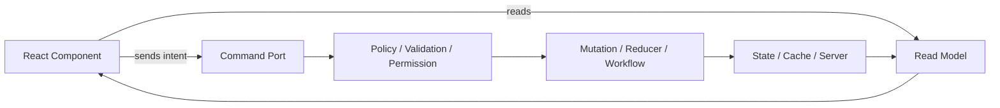
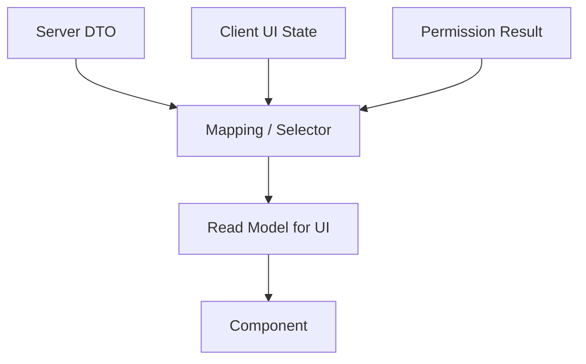
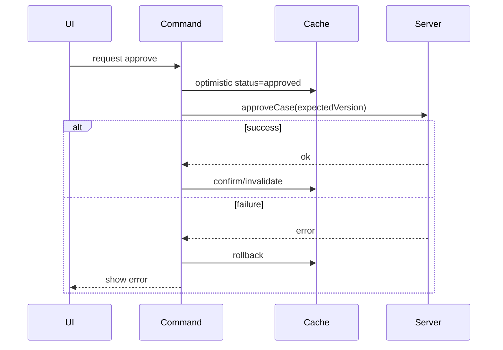

# Part 044 — Command Query Separation in UI

Command Query Separation di UI berarti:

> Separate what the component reads from what the component asks the system to do.

Ini bukan berarti kita harus membangun full CQRS backend, event sourcing, command bus enterprise, atau distributed architecture. Di React, ini jauh lebih sederhana dan sangat praktis:

- **Query/read side**: data yang component butuhkan untuk render.
- **Command/write side**: intent atau operasi yang component minta dijalankan.

Contoh buruk:

```tsx
<CaseHeader case={caseDetail} setCase={setCaseDetail} />
```

Contoh lebih baik:

```tsx
<CaseHeader
  caseView={caseView}
  onTitleEditRequested={requestTitleEdit}
  onEscalationRequested={requestEscalation}
/>
```

Dengan begitu, component tidak diberi akses bebas untuk mengubah seluruh object case. Ia hanya diberi read model dan command port yang diizinkan.

---

## 1. Mental Model



Component render dari read model. Component tidak langsung memanipulasi state arbitrary. Ia mengirim command/intent ke boundary yang punya authority.

Rule inti:

```txt
Read data should be easy to consume.
Write operations should be hard to misuse.
```

---

## 2. Kenapa Ini Penting di React

Tanpa separation, UI mudah berubah menjadi campuran:

- rendering logic,
- validation,
- mutation,
- permission check,
- audit logging,
- cache invalidation,
- optimistic update,
- analytics,
- navigation,
- toast,
- confirmation modal,
- retry behavior.

Contoh yang sering tumbuh liar:

```tsx
function ApproveButton({ caseData, setCaseData }: Props) {
  async function handleClick() {
    if (!caseData.permissions.canApprove) return;

    setCaseData({ ...caseData, status: 'approved' });

    try {
      await api.approveCase(caseData.id);
      toast.success('Approved');
      analytics.track('case_approved');
    } catch (error) {
      setCaseData({ ...caseData, status: 'submitted' });
      toast.error('Failed');
    }
  }

  return <button onClick={handleClick}>Approve</button>;
}
```

Masalah:

- button tahu permission model,
- button tahu status transition,
- button melakukan optimistic update,
- button tahu API,
- button tahu toast,
- button tahu analytics,
- rollback memakai stale `caseData`,
- invariant domain tersebar.

Versi lebih sehat:

```tsx
<ApproveButton
  disabled={!caseView.actions.approve.enabled}
  reason={caseView.actions.approve.reason}
  pending={commands.approve.pending}
  onApproveRequested={commands.approve.request}
/>
```

Button hanya tahu:

- apakah action bisa diklik,
- apakah pending,
- apa yang harus dipanggil saat user meminta approve.

Semua policy dan lifecycle ada di orchestration boundary.

---

## 3. Query Side: Read Model

Read model adalah bentuk data yang nyaman untuk render, bukan selalu bentuk data mentah dari server.

Server response:

```ts
type CaseDto = {
  id: string;
  status: 'DRAFT' | 'SUBMITTED' | 'APPROVED' | 'REJECTED';
  assigneeUserId: string | null;
  slaDueAt: string | null;
  version: number;
  permissions: string[];
};
```

Read model UI:

```ts
type CaseView = {
  id: string;
  statusLabel: string;
  statusTone: 'neutral' | 'warning' | 'success' | 'danger';
  assigneeLabel: string;
  sla: {
    label: string;
    overdue: boolean;
  };
  actions: {
    approve: ActionAvailability;
    reject: ActionAvailability;
    escalate: ActionAvailability;
  };
  version: number;
};

type ActionAvailability = {
  enabled: boolean;
  reason?: string;
};
```

Component lebih mudah ditulis:

```tsx
function CaseActionBar({
  caseView,
  commands,
}: {
  caseView: CaseView;
  commands: CaseCommands;
}) {
  return (
    <div>
      <button
        disabled={!caseView.actions.approve.enabled || commands.approve.pending}
        title={caseView.actions.approve.reason}
        onClick={commands.approve.request}
      >
        Approve
      </button>
    </div>
  );
}
```

UI tidak harus mengulang permission logic di tiap tempat.

---

## 4. Command Side: Command Port

Command port adalah API tindakan yang boleh diminta UI.

```ts
type CaseCommands = {
  approve: Command<void>;
  reject: Command<{ reason: string }>;
  escalate: Command<{ reason: string; targetQueueId: string }>;
};

type Command<TInput> = {
  pending: boolean;
  error: string | null;
  request: (input: TInput) => void;
};
```

Atau lebih sederhana:

```ts
type CaseCommands = {
  requestApproval: () => void;
  requestRejection: (reason: string) => void;
  requestEscalation: (input: EscalationInput) => void;
};
```

Kuncinya:

- command berbentuk intent,
- command tidak mengekspos setter mentah,
- command bisa mengatur pending/error,
- command bisa menjalankan permission guard,
- command bisa membuka confirmation modal,
- command bisa menjalankan mutation,
- command bisa invalidasi cache,
- command bisa audit.

---

## 5. Command Bukan Event DOM

Kurang baik:

```tsx
<button onClick={(event) => approve(event)} />
```

Lebih baik:

```tsx
<button onClick={() => commands.approve.request()} />
```

DOM event berhenti di leaf. Command port menerima domain input.

Jika command butuh input:

```tsx
commands.reject.request({ reason });
```

Bukan:

```tsx
commands.reject(event);
```

Command harus bebas dari detail DOM agar bisa dipanggil dari:

- button,
- keyboard shortcut,
- command palette,
- context menu,
- bulk action,
- automation test,
- retry handler.

---

## 6. Read Model vs State Model

Jangan samakan read model dengan state internal.



Read model boleh derived.

Contoh selector:

```ts
function toCaseView(caseDto: CaseDto, currentUser: User): CaseView {
  const canApprove =
    caseDto.status === 'SUBMITTED' &&
    caseDto.permissions.includes('case.approve');

  return {
    id: caseDto.id,
    statusLabel: formatStatus(caseDto.status),
    statusTone: statusTone(caseDto.status),
    assigneeLabel: caseDto.assigneeUserId ?? 'Unassigned',
    sla: toSlaView(caseDto.slaDueAt),
    actions: {
      approve: canApprove
        ? { enabled: true }
        : { enabled: false, reason: 'Case is not approvable' },
      reject: {
        enabled:
          caseDto.status === 'SUBMITTED' &&
          caseDto.permissions.includes('case.reject'),
      },
      escalate: {
        enabled: caseDto.permissions.includes('case.escalate'),
      },
    },
    version: caseDto.version,
  };
}
```

Component tidak perlu tahu expression permission. Ia menerima result.

---

## 7. Read Model Harus Stabil Secara Semantik

Jika read model dibuat ulang setiap render, tidak selalu masalah. Tapi jika diteruskan ke memoized subtree, context, atau external registry, identity bisa penting.

```tsx
const caseView = useMemo(() => {
  return toCaseView(caseDto, currentUser);
}, [caseDto, currentUser]);
```

Gunakan memoization karena ada kontrak identity/performance, bukan ritual.

Jika read model murah dan tidak melewati memo boundary, plain calculation saat render sering lebih baik.

---

## 8. Command Harus Menjaga Invariant

Setter tidak menjaga invariant.

```tsx
setStatus('approved')
```

Command bisa menjaga invariant.

```tsx
requestApproval()
```

Implementation:

```ts
function canApprove(caseDto: CaseDto): boolean {
  return (
    caseDto.status === 'SUBMITTED' &&
    caseDto.permissions.includes('case.approve')
  );
}

async function approveCaseCommand(caseDto: CaseDto) {
  if (!canApprove(caseDto)) {
    throw new Error('Case cannot be approved in current state');
  }

  return api.approveCase({
    caseId: caseDto.id,
    expectedVersion: caseDto.version,
  });
}
```

UI disabled state adalah hint, bukan security/invariant mechanism. Command tetap harus guard.

---

## 9. Local Reducer as Command Boundary

Untuk UI-only workflow, reducer bisa menjadi command boundary.

```ts
type WizardState = {
  step: 'profile' | 'documents' | 'review' | 'submitted';
  dirty: boolean;
};

type WizardEvent =
  | { type: 'next.requested' }
  | { type: 'back.requested' }
  | { type: 'field.changed' }
  | { type: 'submit.requested' }
  | { type: 'submit.succeeded' };

function wizardReducer(state: WizardState, event: WizardEvent): WizardState {
  switch (event.type) {
    case 'next.requested':
      if (state.step === 'profile') return { ...state, step: 'documents' };
      if (state.step === 'documents') return { ...state, step: 'review' };
      return state;

    case 'back.requested':
      if (state.step === 'review') return { ...state, step: 'documents' };
      if (state.step === 'documents') return { ...state, step: 'profile' };
      return state;

    case 'field.changed':
      return { ...state, dirty: true };

    case 'submit.requested':
      if (state.step !== 'review') return state;
      return state;

    case 'submit.succeeded':
      return { ...state, step: 'submitted', dirty: false };
  }
}
```

Command port:

```tsx
function useWizardCommands() {
  const [state, dispatch] = useReducer(wizardReducer, {
    step: 'profile',
    dirty: false,
  });

  const commands = {
    next: () => dispatch({ type: 'next.requested' }),
    back: () => dispatch({ type: 'back.requested' }),
    markDirty: () => dispatch({ type: 'field.changed' }),
    submit: () => dispatch({ type: 'submit.requested' }),
  };

  return { state, commands };
}
```

Component tidak diberi `setStep`. Ia diberi `next`, `back`, `submit`.

---

## 10. Server Mutation as Command Boundary

Untuk server state, command biasanya berupa mutation.

```tsx
function useApproveCaseCommand(caseId: string) {
  const queryClient = useQueryClient();

  const mutation = useMutation({
    mutationFn: async (input: { expectedVersion: number }) => {
      return api.approveCase({ caseId, expectedVersion: input.expectedVersion });
    },
    onSuccess: () => {
      queryClient.invalidateQueries({ queryKey: ['case', caseId] });
      queryClient.invalidateQueries({ queryKey: ['cases'] });
    },
  });

  return {
    pending: mutation.isPending,
    error: mutation.error,
    request: mutation.mutate,
  };
}
```

UI:

```tsx
function ApproveButton({
  availability,
  command,
  version,
}: {
  availability: ActionAvailability;
  command: ReturnType<typeof useApproveCaseCommand>;
  version: number;
}) {
  return (
    <button
      disabled={!availability.enabled || command.pending}
      title={availability.reason}
      onClick={() => command.request({ expectedVersion: version })}
    >
      Approve
    </button>
  );
}
```

Separation:

- component reads `availability`, `pending`, `version`,
- component sends command input,
- command handles API + invalidation.

---

## 11. React 19 Form Actions as Command Boundary

React 19 memperkuat pola form action: form dapat menerima action function, dan hooks seperti `useActionState` / `useFormStatus` membantu pending/error state.

Secara arsitektural, ini cocok dengan command separation:

```tsx
function RenameCaseForm({ actionState, formAction }: Props) {
  return (
    <form action={formAction}>
      <input name="title" />
      {actionState.error ? <p>{actionState.error}</p> : null}
      <SubmitButton />
    </form>
  );
}
```

Submit button membaca form status:

```tsx
function SubmitButton() {
  const { pending } = useFormStatus();

  return (
    <button disabled={pending}>
      {pending ? 'Saving...' : 'Save'}
    </button>
  );
}
```

Modelnya tetap sama:

```txt
Form renders read model.
Form submits command.
Action returns next action state.
UI renders the result.
```

Jangan membuat form child memanggil arbitrary setter parent jika form command punya lifecycle, validation, dan server interaction.

---

## 12. Optimistic Command

Optimistic update adalah command yang memperbarui UI sebelum server memberi hasil final.



Command contract harus memuat:

- optimistic state apa yang diubah,
- rollback snapshot,
- conflict handling,
- invalidation setelah success,
- duplicate command prevention,
- user feedback jika gagal.

Contoh simplified:

```tsx
function useOptimisticApproveCase(caseId: string) {
  const queryClient = useQueryClient();

  return useMutation({
    mutationFn: api.approveCase,
    onMutate: async (input: { expectedVersion: number }) => {
      await queryClient.cancelQueries({ queryKey: ['case', caseId] });

      const previous = queryClient.getQueryData<CaseDto>(['case', caseId]);

      queryClient.setQueryData<CaseDto>(['case', caseId], (current) => {
        if (!current) return current;
        return { ...current, status: 'APPROVED' };
      });

      return { previous };
    },
    onError: (_error, _input, context) => {
      if (context?.previous) {
        queryClient.setQueryData(['case', caseId], context.previous);
      }
    },
    onSettled: () => {
      queryClient.invalidateQueries({ queryKey: ['case', caseId] });
    },
  });
}
```

UI tidak perlu tahu rollback mechanics.

---

## 13. Query Key and Command Boundary

Dalam server-state cache, read side biasanya query key.

```tsx
const caseQuery = useQuery({
  queryKey: ['case', caseId],
  queryFn: () => api.getCase(caseId),
});
```

Command side harus tahu query mana yang perlu di-invalidasi.

```tsx
const approveMutation = useMutation({
  mutationFn: api.approveCase,
  onSuccess: () => {
    queryClient.invalidateQueries({ queryKey: ['case', caseId] });
    queryClient.invalidateQueries({ queryKey: ['case-history', caseId] });
    queryClient.invalidateQueries({ queryKey: ['cases', 'submitted'] });
  },
});
```

Jangan sembarangan invalidasi semua query jika boundary bisa lebih spesifik. Tapi jangan juga terlalu granular sampai UI stale.

Command design harus menjawab:

```txt
After this command succeeds, which read models are no longer trustworthy?
```

---

## 14. Command Result Model

Command bisa punya result berbeda.

### 14.1 Void Command

```ts
type VoidCommand = {
  request: () => void;
  pending: boolean;
};
```

Cocok jika hasilnya hanya invalidasi/refetch.

### 14.2 Data-Returning Command

```ts
type RenameCommand = {
  request: (input: RenameInput) => Promise<RenameResult>;
  pending: boolean;
};
```

Cocok jika caller perlu result langsung, misalnya created id.

### 14.3 State-Producing Command

```ts
type FormCommand = {
  actionState: ActionState;
  formAction: (formData: FormData) => void;
};
```

Cocok untuk form actions.

### 14.4 Workflow Command

```ts
type WorkflowCommand<TInput> = {
  state: 'idle' | 'confirming' | 'pending' | 'succeeded' | 'failed';
  request: (input: TInput) => void;
  confirm: () => void;
  cancel: () => void;
  retry: () => void;
};
```

Cocok untuk command dengan confirmation dan retry.

---

## 15. Do Not Over-Engineer Small Components

Command Query Separation bukan alasan membuat abstraction berlebihan.

Untuk local input:

```tsx
<input value={name} onChange={(event) => setName(event.target.value)} />
```

Ini cukup.

Jangan ubah semua hal menjadi:

```tsx
const nameReadModel = useNameReadModel();
const nameCommandBus = useNameCommandBus();
```

Gunakan separation saat ada kompleksitas nyata:

- shared state,
- domain invariant,
- async mutation,
- permission,
- audit,
- cache invalidation,
- confirmation,
- optimistic update,
- multi-component orchestration,
- workflow step transitions,
- repeated pattern across features.

Prinsipnya:

```txt
Simple state can use setters locally.
Boundary state should expose commands.
```

---

## 16. Page Orchestration Hook Pattern

Pattern yang kuat:

```tsx
function useCaseDetailPage(caseId: string) {
  const caseQuery = useCaseQuery(caseId);
  const approveCommand = useApproveCaseCommand(caseId);
  const rejectCommand = useRejectCaseCommand(caseId);

  const caseView = useMemo(() => {
    if (!caseQuery.data) return null;
    return toCaseView(caseQuery.data);
  }, [caseQuery.data]);

  return {
    read: {
      loading: caseQuery.isLoading,
      error: caseQuery.error,
      caseView,
    },
    commands: {
      approve: approveCommand,
      reject: rejectCommand,
    },
  };
}
```

Page:

```tsx
function CaseDetailPage({ caseId }: { caseId: string }) {
  const model = useCaseDetailPage(caseId);

  if (model.read.loading) return <CaseSkeleton />;
  if (model.read.error) return <ErrorState />;
  if (!model.read.caseView) return <NotFoundState />;

  return (
    <CaseDetailScreen
      caseView={model.read.caseView}
      commands={model.commands}
    />
  );
}
```

Screen:

```tsx
function CaseDetailScreen({
  caseView,
  commands,
}: {
  caseView: CaseView;
  commands: CaseCommands;
}) {
  return (
    <>
      <CaseHeader caseView={caseView} />
      <CaseActionBar caseView={caseView} commands={commands} />
      <CaseTimeline caseId={caseView.id} />
    </>
  );
}
```

Keuntungan:

- page hook mengatur query/mutation orchestration,
- screen component mostly presentational,
- action bar tidak tahu API,
- case header tidak tahu commands,
- tests bisa fokus per boundary.

---

## 17. Command Context Pattern

Jika banyak component dalam subtree butuh command yang sama, command bisa lewat context.

```tsx
type CaseCommandContextValue = {
  approve: Command<void>;
  reject: Command<{ reason: string }>;
  escalate: Command<EscalationInput>;
};

const CaseCommandContext = createContext<CaseCommandContextValue | null>(null);

function useCaseCommands() {
  const value = useContext(CaseCommandContext);
  if (!value) throw new Error('useCaseCommands must be used within CaseCommandProvider');
  return value;
}
```

Provider:

```tsx
function CaseCommandProvider({ caseId, children }: PropsWithChildren<{ caseId: string }>) {
  const commands = useMemo(
    () => ({
      approve: createApproveCommand(caseId),
      reject: createRejectCommand(caseId),
      escalate: createEscalateCommand(caseId),
    }),
    [caseId],
  );

  return (
    <CaseCommandContext.Provider value={commands}>
      {children}
    </CaseCommandContext.Provider>
  );
}
```

Namun hati-hati: command object yang unstable dapat menyebabkan rerender luas. Jika command state berubah high-frequency, external store atau colocated command state mungkin lebih tepat.

---

## 18. Command Bus: Kapan Boleh?

Command bus di UI bisa berguna untuk cross-tree commands:

- global command palette,
- keyboard shortcuts,
- modal service,
- toast service,
- layout shell actions.

Contoh capability-style command bus:

```ts
type AppCommand =
  | { type: 'modal.open'; modal: ModalDescriptor }
  | { type: 'toast.show'; message: ToastMessage }
  | { type: 'shortcut.register'; shortcut: ShortcutDescriptor };

type CommandBus = {
  dispatch: (command: AppCommand) => void;
};
```

Tapi command bus untuk domain state sering berbahaya.

Anti-pattern:

```tsx
commandBus.dispatch({ type: 'case.approve', caseId });
```

Jika ini membuat domain mutation tersembunyi dari feature boundary, debugging akan sulit.

Gunakan command bus untuk infrastructure/capability, bukan sebagai jalan pintas semua domain action.

---

## 19. Permission as Query, Enforcement as Command Guard

UI sering butuh menampilkan action availability.

Read side:

```ts
type ActionAvailability = {
  visible: boolean;
  enabled: boolean;
  reason?: string;
};
```

Command side:

```ts
async function approveCase(input: ApproveInput) {
  const permission = await permissionService.check('case.approve', input.caseId);

  if (!permission.allowed) {
    throw new ForbiddenCommandError(permission.reason);
  }

  return api.approveCase(input);
}
```

Pemisahan penting:

- read side memberi UX yang jelas,
- command side tetap enforce.

Jangan hanya menyembunyikan button dan menganggap system aman.

---

## 20. Confirmation as Command Orchestration

Delete action biasanya punya confirmation.

Jangan letakkan semua di button reusable.

```tsx
function DeleteCaseButton({ onDeleteRequested, disabled }: Props) {
  return (
    <button disabled={disabled} onClick={onDeleteRequested}>
      Delete
    </button>
  );
}
```

Orchestration:

```tsx
function useDeleteCaseWorkflow(caseId: string) {
  const confirm = useConfirmDialog();
  const mutation = useDeleteCaseMutation(caseId);

  async function request() {
    const accepted = await confirm({
      title: 'Delete case?',
      body: 'This action cannot be undone.',
      confirmLabel: 'Delete',
    });

    if (!accepted) return;

    mutation.mutate();
  }

  return {
    pending: mutation.isPending,
    error: mutation.error,
    request,
  };
}
```

Button tetap kecil. Workflow boundary memegang confirmation + mutation.

---

## 21. Navigation as Command or Effect?

Navigation setelah action sukses bisa menjadi bagian command lifecycle.

```tsx
const mutation = useMutation({
  mutationFn: api.createCase,
  onSuccess: (createdCase) => {
    navigate(`/cases/${createdCase.id}`);
  },
});
```

Atau orchestration callback:

```tsx
async function createAndNavigate(input: CreateCaseInput) {
  const created = await createCase(input);
  navigate(`/cases/${created.id}`);
}
```

Jangan memakai effect yang mengamati `createdCase` jika navigation adalah akibat langsung dari user command dan bisa dijalankan di command handler.

Kurang baik:

```tsx
useEffect(() => {
  if (createdCase) {
    navigate(`/cases/${createdCase.id}`);
  }
}, [createdCase, navigate]);
```

Ini mengubah event-specific logic menjadi reactive effect. Effect sebaiknya untuk sinkronisasi external system, bukan default tempat response command.

---

## 22. Read Side Tidak Boleh Menjalankan Command

Selector/read model harus pure.

Buruk:

```ts
function toCaseView(caseDto: CaseDto) {
  if (caseDto.status === 'EXPIRED') {
    api.markExpired(caseDto.id);
  }

  return { ... };
}
```

Read mapping tidak boleh punya side effect.

Read side harus bisa dipanggil berkali-kali tanpa mengubah sistem.

Benar:

```ts
function toCaseView(caseDto: CaseDto): CaseView {
  return { ... };
}
```

Command terpisah:

```ts
function requestMarkExpired(caseId: string) {
  return api.markExpired(caseId);
}
```

Ini sejalan dengan purity React: render dan calculation yang dipakai render harus idempotent.

---

## 23. Command Tidak Harus Selalu Async

Command bisa lokal:

```tsx
const commands = {
  openFilterPanel: () => setFilterPanelOpen(true),
  closeFilterPanel: () => setFilterPanelOpen(false),
  resetFilters: () => dispatch({ type: 'filters.reset' }),
};
```

Bahkan untuk local state, command API bisa berguna jika component boundary besar.

Tapi jangan over-abstraction untuk state trivial di component kecil.

---

## 24. Example: Complex Search Page

State:

- query text,
- filters,
- sort,
- page,
- selected row ids,
- server results,
- export command,
- saved search command.

Tanpa separation, search page cepat kacau.

Read model:

```ts
type SearchPageReadModel = {
  query: string;
  filters: FilterView[];
  sort: SortView;
  results: ResultRowView[];
  pagination: PaginationView;
  selectedCount: number;
  loading: boolean;
  error: string | null;
  actions: {
    export: ActionAvailability;
    saveSearch: ActionAvailability;
    bulkAssign: ActionAvailability;
  };
};
```

Command port:

```ts
type SearchPageCommands = {
  setQuery: (query: string) => void;
  setFilter: (filterId: string, value: unknown) => void;
  clearFilters: () => void;
  setSort: (sort: SortInput) => void;
  goToPage: (page: number) => void;
  selectRow: (rowId: string) => void;
  clearSelection: () => void;
  exportResults: () => void;
  saveSearch: () => void;
};
```

Catatan: `setQuery` di sini masih command port karena boundary-nya page-level. Namun untuk domain action, gunakan nama intent seperti `exportResults`, bukan `setExporting(true)`.

---

## 25. Example: Regulatory Case Workflow

Read side:

```ts
type EnforcementCaseView = {
  id: string;
  status: 'Intake' | 'Assessment' | 'Investigation' | 'Enforcement' | 'Closed';
  riskLevel: 'Low' | 'Medium' | 'High' | 'Critical';
  assignedUnit: string;
  nextActions: {
    acceptIntake: ActionAvailability;
    requestMoreInfo: ActionAvailability;
    escalateToInvestigation: ActionAvailability;
    closeNoAction: ActionAvailability;
  };
  auditSummary: string;
  version: number;
};
```

Command side:

```ts
type EnforcementCaseCommands = {
  acceptIntake: Command<{ expectedVersion: number }>;
  requestMoreInfo: Command<{ message: string; expectedVersion: number }>;
  escalateToInvestigation: Command<{ reason: string; expectedVersion: number }>;
  closeNoAction: Command<{ reason: string; expectedVersion: number }>;
};
```

Kenapa ini kuat?

- UI membaca possible actions,
- command tetap membawa expected version,
- audit reason eksplisit,
- illegal transition bisa dicegah,
- permission bisa muncul di read model tapi tetap enforce di command.

---

## 26. Testing Strategy

### 26.1 Test Read Model Mapping

```ts
it('disables approve when case is draft', () => {
  const view = toCaseView({
    ...caseFixture,
    status: 'DRAFT',
    permissions: ['case.approve'],
  });

  expect(view.actions.approve.enabled).toBe(false);
});
```

### 26.2 Test Command Guard

```ts
it('does not call API when case cannot be approved', async () => {
  const api = createMockApi();
  const command = createApproveCaseCommand({
    api,
    caseDto: { ...caseFixture, status: 'DRAFT' },
  });

  await expect(command.request()).rejects.toThrow('cannot be approved');
  expect(api.approveCase).not.toHaveBeenCalled();
});
```

### 26.3 Test Component Wiring

```tsx
it('calls approve command when approve button is clicked', async () => {
  const request = vi.fn();

  render(
    <ApproveButton
      availability={{ enabled: true }}
      pending={false}
      onApproveRequested={request}
    />,
  );

  await userEvent.click(screen.getByRole('button', { name: /approve/i }));

  expect(request).toHaveBeenCalledTimes(1);
});
```

Component test tidak perlu tahu API, cache invalidation, atau reducer internals.

---

## 27. Failure Modes

| Failure mode | Gejala | Penyebab | Perbaikan |
|---|---|---|---|
| Setter as command | child mengubah state arbitrarily | setter bocor melewati boundary | command/intent callback |
| Read side mutation | render memicu side effect | selector tidak pure | pisahkan command |
| Button owns domain | leaf component tahu API/policy | orchestration salah tempat | page/domain hook command |
| UI-only permission | user action diblok di button saja | command tidak guard | enforce di command/backend |
| Cache stale | UI tidak berubah setelah mutation | invalidation tidak jelas | command owns invalidation map |
| Over-invalidating | semua data refetch | command terlalu kasar | query key boundary |
| Duplicate submit | command reentrant | pending/idempotency tidak ada | pending guard + idempotency key |
| Command hidden in effect | action jalan karena state berubah | event logic ditaruh di effect | jalankan di command handler |
| Read model too raw | component berisi mapping policy | DTO langsung ke UI | selector/read model layer |
| Read model too magical | mapping menyembunyikan domain | selector terlalu besar | pisah policy/domain selector |
| Command bus abuse | sulit trace mutation | semua action global | feature-scoped command ports |
| Async lifecycle scattered | pending/error banyak versi | command tidak punya state model | command object dengan pending/error |
| Optimistic rollback broken | UI inconsistent | rollback snapshot hilang | command owns rollback context |

---

## 28. Refactoring Recipe

Ketika menemukan component seperti ini:

```tsx
<Widget data={data} setData={setData} api={api} toast={toast} />
```

Refactor bertahap:

### Step 1 — Pisahkan read props dan callbacks

```tsx
<Widget
  view={toWidgetView(data)}
  onPrimaryActionRequested={handlePrimaryAction}
/>
```

### Step 2 — Pindahkan mutation ke command hook

```tsx
const primaryCommand = usePrimaryWidgetCommand(widgetId);

<Widget
  view={widgetView}
  primaryCommand={primaryCommand}
/>
```

### Step 3 — Jadikan read model explicit

```tsx
type WidgetView = {
  title: string;
  description: string;
  actions: {
    primary: ActionAvailability;
  };
};
```

### Step 4 — Tambahkan command lifecycle

```tsx
type WidgetCommand = {
  pending: boolean;
  error: string | null;
  request: () => void;
};
```

### Step 5 — Test boundary

- test selector,
- test command,
- test component wiring.

---

## 29. Decision Matrix

| Kondisi | Read side | Command side |
|---|---|---|
| Local input sederhana | local state | local setter |
| Reusable primitive | controlled value props | `onValueChange` |
| Complex form | form read model | submit command/action |
| Server data | query result/view model | mutation command |
| Workflow | state machine snapshot | transition event/command |
| Permissioned action | action availability | guarded command |
| Optimistic UI | optimistic read model/cache | command with rollback |
| Cross-tree infra | capability context | command bus/capability |
| Domain mutation | domain view model | feature-scoped command |

---

## 30. Review Checklist

```txt
[ ] Apakah component menerima read model, bukan raw mutable state yang terlalu besar?
[ ] Apakah component mengirim intent/command, bukan memanggil setter arbitrary?
[ ] Apakah read model pure dan idempotent?
[ ] Apakah command menjaga invariant, bukan hanya button disabled?
[ ] Apakah command punya pending/error/retry semantics yang jelas?
[ ] Apakah command tahu query/cache mana yang harus invalidated?
[ ] Apakah optimistic update punya rollback path?
[ ] Apakah navigation/toast/audit berada di orchestration boundary yang tepat?
[ ] Apakah permission muncul sebagai UX hint dan juga command/backend enforcement?
[ ] Apakah command bus tidak dipakai sebagai global dumping ground?
[ ] Apakah tests memisahkan read mapping, command behavior, dan component wiring?
```

---

## 31. Latihan

### Latihan 1 — Refactor Detail Page

Ambil component yang menerima:

```tsx
<DetailPanel entity={entity} setEntity={setEntity} />
```

Refactor menjadi:

```tsx
<DetailPanel view={entityView} commands={entityCommands} />
```

Tentukan:

- field mana masuk read model,
- command apa saja yang boleh dilakukan,
- pending/error state setiap command,
- invalidation setelah command sukses.

### Latihan 2 — Build Command Hook

Buat `useApproveInvoiceCommand(invoiceId)` yang:

- cek expected version,
- disable double submit,
- optimistic update status,
- rollback jika gagal,
- invalidasi invoice detail dan invoice list,
- expose `{ pending, error, request }`.

### Latihan 3 — Separate Form Draft and Submit Command

Untuk form edit profile:

- draft state lokal,
- validation read model,
- submit command async,
- server error mapping,
- success navigation.

Jangan taruh navigation di effect yang mengamati `success` jika bisa langsung menjadi bagian command lifecycle.

---

## 32. Ringkasan

Command Query Separation di React adalah alat untuk menjaga UI tetap bisa dipahami saat kompleksitas naik.

Tanpa separation:

```txt
component reads everything, mutates everything, and knows everything
```

Dengan separation:

```txt
component reads a view model
component sends an intent
orchestration boundary owns command lifecycle
state/cache/server produces new read model
```

Prinsip akhir:

```txt
Queries shape the screen.
Commands change the world.
Do not let every component change the world directly.
```

Jika read side dan command side jelas, component menjadi lebih kecil, invariant lebih kuat, testing lebih fokus, dan perubahan arsitektur state management tidak memaksa rewrite seluruh UI.

---

## References

- React Documentation — Responding to Events: https://react.dev/learn/responding-to-events
- React Documentation — Separating Events from Effects: https://react.dev/learn/separating-events-from-effects
- React Documentation — Components and Hooks must be pure: https://react.dev/reference/rules/components-and-hooks-must-be-pure
- React Documentation — `useActionState`: https://react.dev/reference/react/useActionState
- React Documentation — `<form>` Actions: https://react.dev/reference/react-dom/components/form
- React 19 Release Notes: https://react.dev/blog/2024/12/05/react-19
