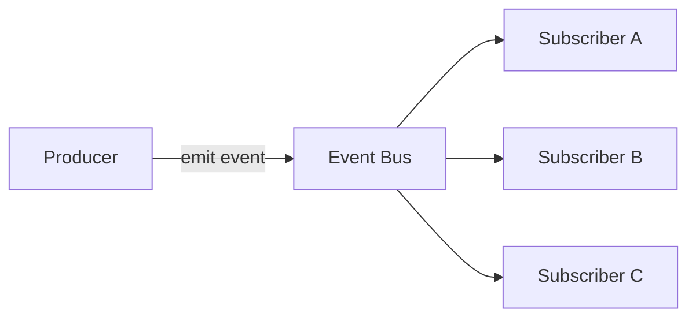
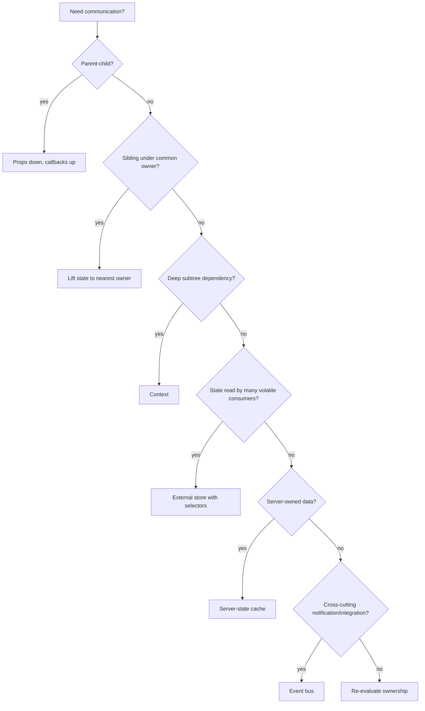
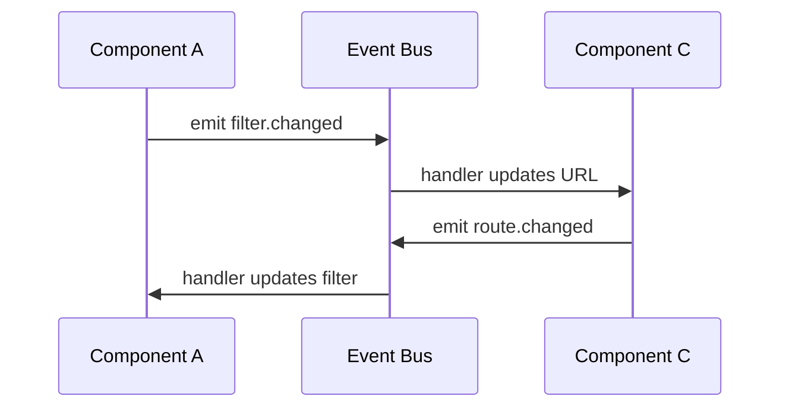
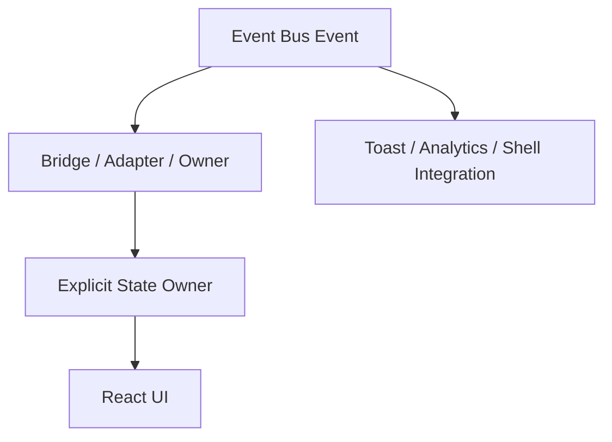

# Part 045 — Event Bus in React

Event bus adalah salah satu alat yang sering disalahgunakan di aplikasi React besar.

Ia terlihat sederhana:

```ts
bus.emit("case:closed", payload)
bus.on("case:closed", handler)
```

Tapi di balik kesederhanaan itu ada risiko besar:

- dependency tersembunyi,
- flow yang sulit dilacak,
- mutation yang tidak punya owner jelas,
- event cycle,
- memory leak,
- race condition,
- testing yang kabur,
- debugging yang bergantung pada keberuntungan.

Namun bukan berarti event bus selalu buruk.

Event bus berguna ketika kita memang butuh **decoupled notification boundary**, bukan ketika kita malas menentukan state owner.

Rule pertama:

```txt
Use an event bus for notifications, integration boundaries, and fire-and-observe signals.
Do not use it as the default state propagation mechanism.
```

Jika sesuatu mempengaruhi render secara langsung, biasanya ia harus menjadi state, context, external store, URL state, atau server-state cache — bukan sekadar event yang lewat tanpa jejak.

---

## 1. Mental Model

Event bus adalah channel untuk menyampaikan bahwa sesuatu terjadi.



Tapi bus tidak otomatis menjawab pertanyaan arsitektural paling penting:

```txt
Siapa owner state setelah event terjadi?
Siapa yang boleh mutate?
Apa invariant-nya?
Apa yang terjadi jika subscriber gagal?
Apa yang terjadi jika event datang dua kali?
Apa yang terjadi jika subscriber belum mounted?
Apa ordering guarantee-nya?
```

Event bus hanya memindahkan pesan. Ia bukan ownership model.

---

## 2. React Communication Ladder

Sebelum memakai event bus, naikkan dulu pertanyaan ke communication ladder.



Event bus berada di bagian bawah karena ia mengurangi local reasoning. Semakin banyak komunikasi lewat bus, semakin sulit menjawab “siapa memanggil siapa”.

---

## 3. Event Bus Bukan State Manager

Bad smell:

```ts
bus.emit("user:changed", user)

bus.on("user:changed", (user) => {
  setCurrentUser(user)
})
```

Jika banyak component menyimpan salinan `currentUser` setelah mendengar event, kita sedang menciptakan distributed duplicated state.

Lebih baik:

```ts
const currentUser = useUserStore((s) => s.currentUser)
```

atau:

```tsx
<AuthProvider user={user}>
  <App />
</AuthProvider>
```

atau jika user berasal dari server:

```ts
const userQuery = useCurrentUserQuery()
```

Event boleh memberi sinyal bahwa sesuatu perlu di-refresh, tapi source of truth tetap harus jelas.

---

## 4. Kapan Event Bus Layak Dipakai

### 4.1 Cross-cutting notification

Contoh:

```ts
bus.emit("toast:show", {
  variant: "success",
  message: "Case has been assigned",
})
```

Toast bukan state domain utama. Ia adalah transient UI notification.

### 4.2 Integration dengan non-React system

Contoh:

- legacy widget,
- browser extension boundary,
- embedded app,
- microfrontend shell,
- analytics SDK,
- map/chart library,
- WebSocket event adapter.

### 4.3 Shell-level coordination

Contoh:

- global command palette opened,
- route shell asked to refresh sidebar badge,
- host app tells embedded feature that tenant changed,
- iframe bridge emits external event.

### 4.4 Instrumentation

Contoh:

```ts
bus.emit("analytics:user-action", {
  action: "case_assignment_submitted",
  caseId,
})
```

Analytics adalah side-channel. Ia tidak boleh menentukan render correctness.

### 4.5 Domain event fan-out setelah command sukses

Misal setelah mutation sukses:

```ts
bus.emit("case:assignment-completed", {
  caseId,
  assigneeId,
})
```

Subscriber yang valid:

- audit breadcrumb,
- toast,
- local cache invalidation adapter,
- notification badge refresh,
- external shell sync.

Subscriber yang mencurigakan:

- component detail diam-diam mutate state lokal,
- form diam-diam reset tanpa owner tahu,
- permission UI diam-diam berubah tanpa source of truth.

---

## 5. Kapan Event Bus Hampir Pasti Salah

Gunakan smell list ini.

```txt
Jika event bus dipakai agar dua sibling berbicara, coba lift state.
Jika dipakai agar deep child membaca config, coba context.
Jika dipakai untuk server data, coba query cache.
Jika dipakai untuk frequently changing UI state, coba external store.
Jika dipakai untuk multi-step workflow, coba reducer/state machine.
Jika dipakai agar component mana pun bisa mutate apa pun, desain sedang bocor.
```

Event bus yang buruk biasanya lahir dari kalimat:

> “Lebih cepat emit event aja.”

Kalimat itu sering berarti:

> “Kita belum menentukan owner dan invariant.”

---

## 6. Event Taxonomy

Tidak semua event sama.

| Event Type | Meaning | Should affect render directly? | Example |
|---|---|---:|---|
| DOM event | Browser interaction | Indirectly | `click`, `keydown` |
| React handler event | Component-level reaction | Indirectly | `onClick`, `onSubmit` |
| Component event | Child intent to parent | Yes, via owner | `onSelectionChange` |
| UI notification event | Transient side-channel | Usually no | `toast:show` |
| Application command | Request to do operation | Yes, through command boundary | `assignCase()` |
| Domain event | Fact after command succeeds | Maybe, through source of truth | `case.assigned` |
| Integration event | Boundary with outside system | Maybe, via adapter | `shell.tenantChanged` |
| Analytics event | Observation | No | `analytics.track` |

The bus is most appropriate for notification, integration, analytics, and carefully bounded domain-event fan-out.

---

## 7. Naming Events

Event names are API.

Bad:

```ts
bus.emit("update", data)
bus.emit("change", value)
bus.emit("refresh")
bus.emit("modal")
```

Better:

```ts
bus.emit("case.assignment.completed", payload)
bus.emit("toast.show.requested", payload)
bus.emit("shell.sidebar.refreshRequested", payload)
bus.emit("analytics.userAction.recorded", payload)
```

Naming rule:

```txt
<bounded-context>.<thing>.<fact-or-request>
```

Examples:

```txt
case.assignment.completed
case.assignment.failed
toast.show.requested
modal.confirmation.requested
shell.navigation.blocked
analytics.userAction.recorded
```

Distinguish **facts** from **requests**:

```txt
completed = already happened
requested = asking some owner to do something
failed = already failed
changed = ambiguous; avoid unless the event contract is precise
```

---

## 8. Payload Design

Bad payload:

```ts
bus.emit("case.assignment.completed", caseDetail)
```

Why bad?

- Too large.
- Carries stale data.
- Encourages subscribers to clone domain state.
- Couples event to current response shape.
- Makes event versioning painful.

Better:

```ts
bus.emit("case.assignment.completed", {
  caseId,
  assigneeId,
  assignedAt,
  correlationId,
})
```

Payload should be:

- small,
- serializable,
- versionable,
- explicit,
- not a mutable object reference,
- not a component instance,
- not a callback unless event is intentionally command-like.

A good event payload carries enough context to react, not enough power to own the world.

---

## 9. Build a Typed Event Bus from Scratch

Minimal implementation:

```ts
type Unsubscribe = () => void

type EventMap = {
  "toast.show.requested": {
    variant: "success" | "error" | "info"
    message: string
  }
  "case.assignment.completed": {
    caseId: string
    assigneeId: string
    correlationId: string
  }
  "analytics.userAction.recorded": {
    action: string
    entity?: string
    entityId?: string
  }
}

type EventName = keyof EventMap

type Handler<T> = (payload: T) => void

export function createEventBus<Events extends Record<string, unknown>>() {
  const listeners = new Map<keyof Events, Set<Handler<any>>>()

  function on<Name extends keyof Events>(
    name: Name,
    handler: Handler<Events[Name]>
  ): Unsubscribe {
    let handlers = listeners.get(name)

    if (!handlers) {
      handlers = new Set()
      listeners.set(name, handlers)
    }

    handlers.add(handler)

    return () => {
      handlers?.delete(handler)
      if (handlers?.size === 0) {
        listeners.delete(name)
      }
    }
  }

  function emit<Name extends keyof Events>(
    name: Name,
    payload: Events[Name]
  ) {
    const handlers = listeners.get(name)

    if (!handlers) return

    // Snapshot protects iteration from subscription changes during emit.
    for (const handler of Array.from(handlers)) {
      handler(payload)
    }
  }

  function listenerCount(name?: keyof Events) {
    if (name) return listeners.get(name)?.size ?? 0

    let count = 0
    for (const handlers of listeners.values()) {
      count += handlers.size
    }
    return count
  }

  return { on, emit, listenerCount }
}

export const appEvents = createEventBus<EventMap>()
```

Usage:

```ts
appEvents.emit("toast.show.requested", {
  variant: "success",
  message: "Case assigned",
})
```

TypeScript now protects event names and payload shapes.

---

## 10. React Subscription Hook

Subscribing in React must respect component lifecycle.

```tsx
import { useEffect, useRef } from "react"

function useLatest<T>(value: T) {
  const ref = useRef(value)
  ref.current = value
  return ref
}

export function useEventBus<Events extends Record<string, unknown>, Name extends keyof Events>(
  bus: {
    on: (name: Name, handler: (payload: Events[Name]) => void) => () => void
  },
  name: Name,
  handler: (payload: Events[Name]) => void
) {
  const latestHandler = useLatest(handler)

  useEffect(() => {
    return bus.on(name, (payload) => {
      latestHandler.current(payload)
    })
  }, [bus, name, latestHandler])
}
```

But there is a subtle issue: `latestHandler` ref object is stable, so including it in dependency array is not harmful, but unnecessary.

Simpler:

```tsx
export function useEventBus<Events extends Record<string, unknown>, Name extends keyof Events>(
  bus: {
    on: (name: Name, handler: (payload: Events[Name]) => void) => () => void
  },
  name: Name,
  handler: (payload: Events[Name]) => void
) {
  const handlerRef = useRef(handler)
  handlerRef.current = handler

  useEffect(() => {
    return bus.on(name, (payload) => {
      handlerRef.current(payload)
    })
  }, [bus, name])
}
```

Why this pattern?

- Subscribe only when `bus` or `name` changes.
- Use latest handler logic without resubscribing every render.
- Cleanup reliably on unmount.
- Avoid stale closure inside subscriber.

---

## 11. Strict Mode and Idempotency

In development, React Strict Mode can intentionally stress setup/cleanup behavior. If subscription cleanup is wrong, Strict Mode helps expose it.

Bad:

```tsx
useEffect(() => {
  bus.on("toast.show.requested", showToast)
}, [])
```

This leaks because no unsubscribe is returned.

Good:

```tsx
useEffect(() => {
  return bus.on("toast.show.requested", showToast)
}, [])
```

The subscription contract should satisfy:

```txt
subscribe -> unsubscribe -> subscribe
```

without producing duplicate handlers.

---

## 12. Bus Provider vs Global Singleton

### Global singleton

```ts
export const appEvents = createEventBus<AppEvents>()
```

Pros:

- simple,
- easy for integration adapters,
- no provider plumbing.

Cons:

- hard to isolate in tests,
- dangerous in SSR/request-scoped apps,
- can leak across tenants/sessions if misused,
- encourages global hidden dependency.

### Provider-scoped bus

```tsx
const EventBusContext = createContext<AppEventBus | null>(null)

export function EventBusProvider({ children }: { children: React.ReactNode }) {
  const busRef = useRef<AppEventBus | null>(null)

  if (!busRef.current) {
    busRef.current = createEventBus<AppEvents>()
  }

  return (
    <EventBusContext.Provider value={busRef.current}>
      {children}
    </EventBusContext.Provider>
  )
}

export function useAppEvents() {
  const bus = useContext(EventBusContext)
  if (!bus) throw new Error("useAppEvents must be used within EventBusProvider")
  return bus
}
```

Provider-scoped bus is usually better for application UI because:

- tests can create isolated bus instance,
- feature shell can override bus,
- SSR request boundaries are safer,
- multiple app instances do not accidentally share events.

---

## 13. Event Bus as External System

From React's perspective, an event bus is an external system. Subscription belongs in Effect.

```tsx
function ToastBridge() {
  const [toasts, setToasts] = useState<Toast[]>([])
  const bus = useAppEvents()

  useEventBus(bus, "toast.show.requested", (event) => {
    setToasts((current) => [
      ...current,
      {
        id: crypto.randomUUID(),
        variant: event.variant,
        message: event.message,
      },
    ])
  })

  return <ToastViewport toasts={toasts} />
}
```

This component becomes the owner of toast state. The event only requests a toast.

Important distinction:

```txt
The bus transports intent.
The bridge owns state.
```

---

## 14. Event Bus and Reducer Boundary

Instead of letting event handlers mutate random state, route events into reducer transitions.

```tsx
type ToastState = {
  toasts: Toast[]
}

type ToastAction =
  | { type: "toastQueued"; toast: Toast }
  | { type: "toastDismissed"; toastId: string }

function toastReducer(state: ToastState, action: ToastAction): ToastState {
  switch (action.type) {
    case "toastQueued":
      return { toasts: [...state.toasts, action.toast] }
    case "toastDismissed":
      return { toasts: state.toasts.filter((t) => t.id !== action.toastId) }
    default:
      return state
  }
}
```

Bridge:

```tsx
function ToastBridge() {
  const [state, dispatch] = useReducer(toastReducer, { toasts: [] })
  const bus = useAppEvents()

  useEventBus(bus, "toast.show.requested", (event) => {
    dispatch({
      type: "toastQueued",
      toast: {
        id: crypto.randomUUID(),
        variant: event.variant,
        message: event.message,
      },
    })
  })

  return <ToastViewport toasts={state.toasts} onDismiss={(id) => dispatch({ type: "toastDismissed", toastId: id })} />
}
```

Reducer gives the bus event a controlled landing zone.

---

## 15. Observable Event Bus

Production event bus should be observable.

Add middleware:

```ts
type EventEnvelope<Name extends string, Payload> = {
  name: Name
  payload: Payload
  emittedAt: number
  correlationId?: string
}

type EventObserver<Events extends Record<string, unknown>> = <Name extends keyof Events>(
  envelope: EventEnvelope<Name & string, Events[Name]>
) => void

export function createObservableEventBus<Events extends Record<string, unknown>>(options?: {
  observers?: EventObserver<Events>[]
}) {
  const listeners = new Map<keyof Events, Set<(payload: any) => void>>()
  const observers = options?.observers ?? []

  function emit<Name extends keyof Events>(name: Name, payload: Events[Name]) {
    const envelope: EventEnvelope<Name & string, Events[Name]> = {
      name: name as Name & string,
      payload,
      emittedAt: Date.now(),
      correlationId:
        typeof payload === "object" && payload && "correlationId" in payload
          ? String((payload as any).correlationId)
          : undefined,
    }

    for (const observe of observers) {
      observe(envelope)
    }

    for (const handler of Array.from(listeners.get(name) ?? [])) {
      handler(payload)
    }
  }

  function on<Name extends keyof Events>(name: Name, handler: (payload: Events[Name]) => void) {
    let set = listeners.get(name)
    if (!set) {
      set = new Set()
      listeners.set(name, set)
    }
    set.add(handler)
    return () => set?.delete(handler)
  }

  return { emit, on }
}
```

This enables:

- debug logging,
- test assertions,
- user journey breadcrumbs,
- correlation IDs,
- audit-friendly UI events,
- traceability across orchestration boundaries.

---

## 16. Synchronous vs Asynchronous Emit

Most small event buses emit synchronously.

```ts
bus.emit("toast.show.requested", payload)
// all handlers run before this line finishes
```

Pros:

- predictable order,
- easy test,
- no task scheduling surprise.

Cons:

- one slow handler blocks the emitter,
- handler error can break emit,
- recursive emit can create cycles.

Async emit:

```ts
queueMicrotask(() => handler(payload))
```

Pros:

- avoids blocking immediate caller,
- can isolate failure,
- breaks recursive stack growth.

Cons:

- ordering is harder,
- tests need async flush,
- UI timing can be surprising.

Default recommendation:

```txt
Keep emit synchronous, but make handlers small.
Use explicit async work inside subscriber if needed.
```

If event ordering matters enough to document, event bus might be the wrong abstraction. Use reducer/state machine/workflow engine.

---

## 17. Error Handling

Naive bus:

```ts
for (const handler of handlers) {
  handler(payload)
}
```

If one handler throws, later handlers do not run.

Options:

### Fail-fast

Good for internal critical events:

```ts
handler(payload)
```

### Isolate handlers

Good for telemetry/notification events:

```ts
for (const handler of handlers) {
  try {
    handler(payload)
  } catch (error) {
    reportEventHandlerError({ eventName: name, error })
  }
}
```

Rule:

```txt
The error policy is part of the event bus contract.
Never leave it accidental.
```

---

## 18. Avoid Request/Response Through Bus

Bad:

```ts
const user = await bus.request("user.current.get", {})
```

This turns event bus into hidden service locator and RPC system.

Better:

```ts
const user = useCurrentUser()
```

or:

```ts
const auth = useAuthCapability()
const user = auth.getCurrentUserSnapshot()
```

or:

```ts
const userQuery = useCurrentUserQuery()
```

Event bus is weak for request/response because:

- no visible dependency,
- no clear owner,
- timeout semantics unclear,
- multiple responders ambiguous,
- error handling awkward,
- tracing difficult.

If you need request/response, use explicit service/capability dependency.

---

## 19. Event Bus and Microfrontends

Event bus becomes tempting in microfrontends because normal React tree boundaries may not exist.

Acceptable shell event:

```ts
shellEvents.emit("tenant.changed", {
  tenantId,
  correlationId,
})
```

Feature app adapter:

```ts
shellEvents.on("tenant.changed", ({ tenantId }) => {
  queryClient.clear()
  featureStore.resetForTenant(tenantId)
})
```

But avoid cross-MFE state mutation:

```ts
shellEvents.emit("featureA.internalFilter.changed", filter)
```

This couples feature internals through a global channel.

Microfrontend rule:

```txt
Use event bus for shell-level facts and coarse integration events.
Do not use it for another feature's internal component state.
```

---

## 20. Event Bus and Server-State Cache

Sometimes a bus event should invalidate server-state cache.

```ts
useEventBus(bus, "case.assignment.completed", ({ caseId }) => {
  queryClient.invalidateQueries({ queryKey: ["case", caseId] })
  queryClient.invalidateQueries({ queryKey: ["case-list"] })
})
```

This is acceptable if the bus event is a fact after mutation succeeds.

Bad:

```ts
useEventBus(bus, "case.updated", (caseDetail) => {
  setLocalCase(caseDetail)
})
```

Better:

```txt
Event says: something changed.
Cache decides: what data becomes stale.
Query decides: when/how to refetch.
Component reads: from cache.
```

---

## 21. Event Cycles

Event cycles are easy to create.



This can create:

- infinite loops,
- duplicate actions,
- inconsistent ordering,
- flickering UI,
- hard-to-reproduce bugs.

Prevention:

- include correlation ID,
- make events idempotent,
- distinguish request from fact,
- do not emit from every subscriber blindly,
- put workflow in reducer/state machine if ordering matters.

Example guard:

```ts
type EventMeta = {
  correlationId: string
  source: "case-page" | "sidebar" | "shell"
}
```

Then subscriber can avoid echoing its own event.

---

## 22. Event Bus Testing

Test bus behavior without rendering entire app when possible.

```ts
it("notifies subscribers", () => {
  const bus = createEventBus<{
    "toast.show.requested": { message: string }
  }>()

  const received: string[] = []

  const unsubscribe = bus.on("toast.show.requested", (event) => {
    received.push(event.message)
  })

  bus.emit("toast.show.requested", { message: "Saved" })
  unsubscribe()
  bus.emit("toast.show.requested", { message: "Ignored" })

  expect(received).toEqual(["Saved"])
})
```

Test bridge behavior with fake bus:

```tsx
it("renders toast when toast event is emitted", async () => {
  const bus = createEventBus<AppEvents>()

  render(
    <EventBusContext.Provider value={bus}>
      <ToastBridge />
    </EventBusContext.Provider>
  )

  act(() => {
    bus.emit("toast.show.requested", {
      variant: "success",
      message: "Saved",
    })
  })

  expect(screen.getByText("Saved")).toBeInTheDocument()
})
```

Testing rule:

```txt
Test event transport separately from UI state ownership.
```

---

## 23. Production Checklist

Before adding an event bus event, answer:

```txt
1. Why are props/context/store/query cache not enough?
2. Is this event a request or a fact?
3. Who owns the resulting state?
4. Is the payload small and versionable?
5. What happens if no subscriber exists?
6. What happens if two subscribers exist?
7. What happens if handler throws?
8. Is event ordering important?
9. Can the event be emitted twice safely?
10. Is this observable in logs/devtools/tests?
```

If you cannot answer these, do not add the event.

---

## 24. Failure Modes

### 24.1 Hidden global state

Symptom:

```txt
No component prop/context shows dependency, but behavior changes when an event fires.
```

Fix:

```txt
Move state to explicit owner: component, context, external store, or query cache.
```

### 24.2 Event spaghetti

Symptom:

```txt
One action emits event A, which causes event B, which causes event C.
```

Fix:

```txt
Move orchestration into reducer/state machine/workflow service.
```

### 24.3 Memory leak

Symptom:

```txt
Handler fires multiple times after navigation.
```

Fix:

```txt
Always return unsubscribe from Effect.
```

### 24.4 Stale closure

Symptom:

```txt
Subscriber sees old props/state.
```

Fix:

```txt
Use latest-ref pattern or resubscribe intentionally with correct dependencies.
```

### 24.5 Missing subscriber

Symptom:

```txt
Event emitted before bridge mounts; event disappears.
```

Fix:

```txt
If event must be durable, it is not an event bus problem. Use state/store/queue/cache.
```

### 24.6 Ordering dependency

Symptom:

```txt
App only works if subscriber X runs before subscriber Y.
```

Fix:

```txt
Make ordering explicit in a coordinator, reducer, or state machine.
```

### 24.7 Payload bloat

Symptom:

```txt
Event payload is entire domain aggregate or API response.
```

Fix:

```txt
Emit stable identifiers and minimal fact context.
```

---

## 25. Practical Refactor Recipes

### Recipe A — Event bus to lifted state

Before:

```ts
bus.emit("filter.changed", filter)
```

After:

```tsx
<SearchPage>
  <FilterPanel value={filter} onChange={setFilter} />
  <ResultTable filter={filter} />
</SearchPage>
```

Use when communication is within one ownership boundary.

### Recipe B — Event bus to context capability

Before:

```ts
bus.emit("permission.check", { action, resource })
```

After:

```ts
const permissions = usePermissions()
const canAssign = permissions.can("case.assign", caseView)
```

Use when consumers need a scoped dependency.

### Recipe C — Event bus to external store

Before:

```ts
bus.emit("selection.changed", selection)
```

After:

```ts
const selection = useSelectionStore((s) => s.selection)
const select = useSelectionStore((s) => s.select)
```

Use when many unrelated components need volatile shared state.

### Recipe D — Event bus to query invalidation

Before:

```ts
bus.emit("case.updated", updatedCase)
```

After:

```ts
bus.emit("case.updated", { caseId })
queryClient.invalidateQueries({ queryKey: ["case", caseId] })
```

Use when data is server-owned.

### Recipe E — Event bus to state machine

Before:

```ts
bus.emit("wizard.next")
bus.emit("wizard.validation.failed")
bus.emit("wizard.submitted")
```

After:

```ts
send({ type: "NEXT" })
send({ type: "VALIDATION_FAILED", errors })
send({ type: "SUBMIT" })
```

Use when ordering and legal transitions matter.

---

## 26. Final Model

Event bus is a tool for decoupled signaling.

It is not a replacement for:

- state ownership,
- context dependency,
- external store subscription,
- server-state cache,
- workflow engine,
- explicit command boundary.

The correct model:



An event bus is safe when it lands in explicit owners.
It becomes dangerous when it replaces ownership.

Remember:

```txt
Events announce.
Owners decide.
State renders.
```
