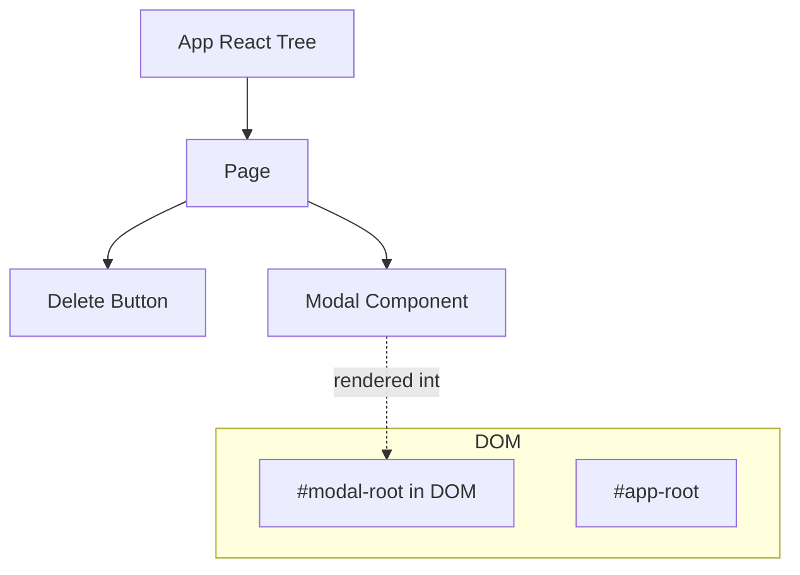
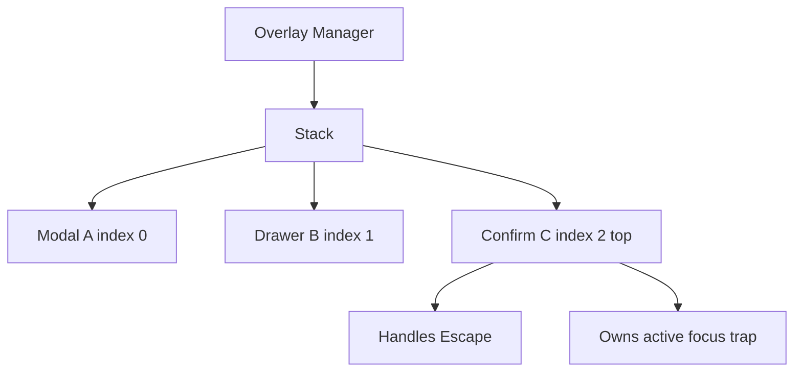
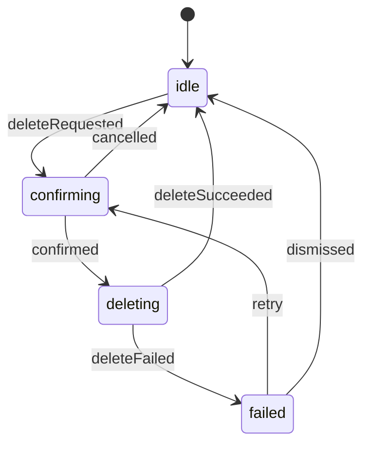
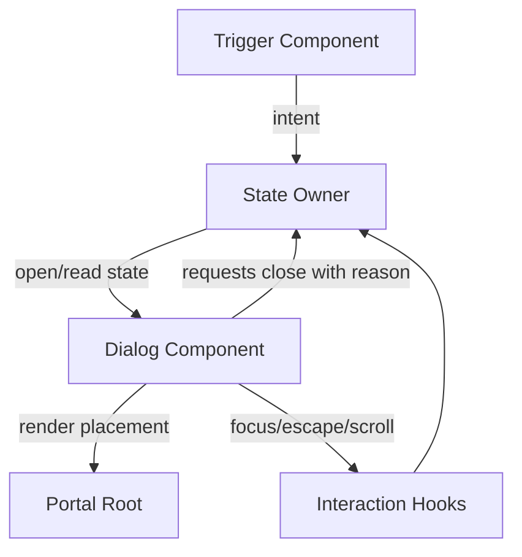
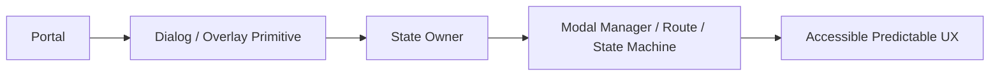

# Part 046 — Portals, Modals, and Overlay Communication

Overlay adalah salah satu area React yang terlihat UI-only, tetapi sebenarnya penuh komunikasi lintas boundary.

Contoh overlay:

- modal dialog,
- confirmation dialog,
- drawer,
- popover,
- tooltip,
- dropdown menu,
- command palette,
- toast viewport,
- context menu,
- sheet,
- full-screen blocking workflow.

Masalahnya bukan hanya “bagaimana render di atas halaman”.

Masalah sebenarnya:

```txt
Siapa membuka overlay?
Siapa menutup overlay?
Siapa owner state overlay?
Apa yang terjadi saat Escape ditekan?
Apa yang terjadi saat klik backdrop?
Apakah close boleh dibatalkan?
Bagaimana focus dikembalikan?
Bagaimana nested modal bekerja?
Bagaimana prevent double submit?
Bagaimana route change menutup overlay?
Bagaimana accessibility dijaga?
```

Overlay adalah orchestration problem.

---

## 1. Portal Mental Model

React portal memungkinkan component dirender ke DOM node lain tanpa memutus logical React tree.



Portal memindahkan **physical DOM placement**, bukan ownership React.

Artinya:

```txt
Context masih bekerja.
State owner tetap di React tree.
Event React tetap mengikuti React tree, bukan semata-mata DOM tree.
```

Ini penting. Modal bisa terlihat berada di luar DOM parent, tetapi secara React ia tetap child dari component yang merendernya.

---

## 2. Portal Tidak Menyelesaikan Modal Architecture

Portal hanya menjawab:

```txt
Render children ke DOM node mana?
```

Portal tidak menjawab:

```txt
Apakah modal controlled atau uncontrolled?
Bagaimana close contract?
Bagaimana focus trap?
Bagaimana aria attribute?
Bagaimana z-index stack?
Bagaimana scroll lock?
Bagaimana nested overlay?
Bagaimana asynchronous confirmation?
```

Jangan menyamakan portal dengan modal system.

```txt
Portal = placement primitive.
Modal = interaction primitive.
Overlay manager = orchestration primitive.
```

---

## 3. Overlay Taxonomy

| Overlay Type | Blocks background? | Needs focus trap? | Usually portal? | Example |
|---|---:|---:|---:|---|
| Tooltip | No | No | Sometimes | Hover hint |
| Popover | Usually no | Sometimes | Often | Filter panel |
| Dropdown menu | No, but focus managed | Yes, locally | Often | User menu |
| Modal dialog | Yes | Yes | Usually | Confirmation dialog |
| Drawer/sheet | Often | Often | Usually | Side panel edit form |
| Command palette | Yes | Yes | Usually | Global search |
| Toast | No | No | Usually | Save notification |

Not every overlay is a modal.

This matters because treating every overlay like modal creates bad UX, while treating modal like popover breaks accessibility.

---

## 4. Local Modal State

Simplest valid pattern:

```tsx
function DeleteCaseButton({ caseId }: { caseId: string }) {
  const [open, setOpen] = useState(false)

  return (
    <>
      <button onClick={() => setOpen(true)}>Delete</button>

      <ConfirmDeleteCaseDialog
        open={open}
        caseId={caseId}
        onOpenChange={setOpen}
      />
    </>
  )
}
```

Good when:

- modal belongs to one trigger,
- state is local,
- no global stack coordination,
- no cross-route orchestration,
- no central analytics/permission workflow needed.

Local state is often the best modal state.

Do not start with a global modal manager unless there is a real shared orchestration problem.

---

## 5. Controlled Modal Contract

A modal should usually expose controlled state:

```tsx
<Dialog open={open} onOpenChange={setOpen}>
  ...
</Dialog>
```

The owner decides whether modal is open.

Dialog requests close:

```ts
onOpenChange(false)
```

Owner may accept or reject.

Example: block close while submit is pending.

```tsx
<Dialog
  open={open}
  onOpenChange={(nextOpen) => {
    if (isSubmitting) return
    setOpen(nextOpen)
  }}
/>
```

Rule:

```txt
Overlay component may request close.
Owner decides close.
```

This is critical for complex workflows.

---

## 6. Close Reasons

`onOpenChange(false)` is often too vague.

Better:

```ts
type CloseReason =
  | "escapeKey"
  | "backdropClick"
  | "closeButton"
  | "cancelAction"
  | "confirmAction"
  | "routeChange"
  | "programmatic"

type DialogProps = {
  open: boolean
  onOpenChange: (nextOpen: boolean, meta: { reason: CloseReason }) => void
}
```

Usage:

```tsx
<Dialog
  open={open}
  onOpenChange={(nextOpen, meta) => {
    if (!nextOpen && meta.reason === "backdropClick" && hasUnsavedChanges) {
      setShowDiscardConfirm(true)
      return
    }

    setOpen(nextOpen)
  }}
/>
```

Close reason turns modal communication from boolean flip into explicit intent.

---

## 7. Basic Portal Implementation

```tsx
import { createPortal } from "react-dom"

function Portal({ children }: { children: React.ReactNode }) {
  const root = document.getElementById("modal-root")

  if (!root) {
    throw new Error("Missing #modal-root")
  }

  return createPortal(children, root)
}
```

HTML:

```html
<body>
  <div id="root"></div>
  <div id="modal-root"></div>
</body>
```

This is simple, but insufficient for SSR and dynamic environments.

Safer client-only portal:

```tsx
function ClientPortal({ children }: { children: React.ReactNode }) {
  const [root, setRoot] = useState<HTMLElement | null>(null)

  useEffect(() => {
    setRoot(document.getElementById("modal-root"))
  }, [])

  if (!root) return null

  return createPortal(children, root)
}
```

Why?

- `document` is not available during server render.
- Portal root may be created after initial render.
- Hydration must not assume unavailable DOM.

---

## 8. Portal Event Propagation

Portal content is physically elsewhere in DOM, but React event propagation follows React tree.

```tsx
function Page() {
  return (
    <div onClick={() => console.log("page clicked")}> 
      <Portal>
        <button onClick={() => console.log("modal button clicked")}>
          Click
        </button>
      </Portal>
    </div>
  )
}
```

Clicking the button can trigger the parent React `onClick` unless propagation is stopped or tree placement is changed.

For modals:

```tsx
<div className="backdrop" onClick={() => requestClose("backdropClick")}>
  <div
    role="dialog"
    aria-modal="true"
    onClick={(event) => event.stopPropagation()}
  >
    {children}
  </div>
</div>
```

This is a communication issue: backdrop click should close, dialog content click should not.

---

## 9. Accessibility Contract for Modal Dialog

Modal dialog contract:

```txt
1. Focus moves into dialog when opened.
2. Focus does not escape dialog while modal is open.
3. Escape usually closes the dialog, unless workflow intentionally blocks it.
4. Background content is inert/unavailable to interaction.
5. Screen reader semantics identify dialog and accessible name.
6. Focus returns to a sensible element when dialog closes.
```

Basic markup:

```tsx
<div
  role="dialog"
  aria-modal="true"
  aria-labelledby={titleId}
  aria-describedby={descriptionId}
>
  <h2 id={titleId}>Delete case?</h2>
  <p id={descriptionId}>This action cannot be undone.</p>
  ...
</div>
```

Do not ship modal without focus management.

---

## 10. Focus Return

When modal opens, remember previously focused element.

```tsx
function useFocusReturn(open: boolean) {
  const previousFocusRef = useRef<HTMLElement | null>(null)

  useEffect(() => {
    if (!open) return

    previousFocusRef.current = document.activeElement as HTMLElement | null

    return () => {
      previousFocusRef.current?.focus?.()
    }
  }, [open])
}
```

This is simplified. Production code needs guards:

- element may be removed,
- element may be disabled,
- route may change,
- nested modal may take focus,
- user may intentionally focus elsewhere before cleanup.

Better return strategy:

```tsx
type FocusReturnTarget = HTMLElement | (() => HTMLElement | null) | null
```

Owner can pass explicit target:

```tsx
<Dialog returnFocusTo={() => deleteButtonRef.current} />
```

---

## 11. Focus Trap Skeleton

Minimal concept:

```tsx
function getFocusable(container: HTMLElement) {
  return Array.from(
    container.querySelectorAll<HTMLElement>(
      [
        "a[href]",
        "button:not([disabled])",
        "textarea:not([disabled])",
        "input:not([disabled])",
        "select:not([disabled])",
        "[tabindex]:not([tabindex='-1'])",
      ].join(",")
    )
  ).filter((element) => !element.hasAttribute("disabled"))
}

function trapTabKey(event: KeyboardEvent, container: HTMLElement) {
  if (event.key !== "Tab") return

  const focusable = getFocusable(container)
  if (focusable.length === 0) {
    event.preventDefault()
    container.focus()
    return
  }

  const first = focusable[0]
  const last = focusable[focusable.length - 1]
  const active = document.activeElement

  if (event.shiftKey && active === first) {
    event.preventDefault()
    last.focus()
  } else if (!event.shiftKey && active === last) {
    event.preventDefault()
    first.focus()
  }
}
```

Hook:

```tsx
function useFocusTrap(open: boolean, containerRef: React.RefObject<HTMLElement>) {
  useEffect(() => {
    if (!open) return

    const container = containerRef.current
    if (!container) return

    const onKeyDown = (event: KeyboardEvent) => {
      trapTabKey(event, container)
    }

    document.addEventListener("keydown", onKeyDown)
    return () => document.removeEventListener("keydown", onKeyDown)
  }, [open, containerRef])
}
```

This is educational skeleton. For production, prefer well-tested primitives or thoroughly test edge cases:

- shadow DOM,
- radio groups,
- hidden elements,
- disabled controls,
- iframe,
- nested dialogs,
- browser focus quirks.

---

## 12. Escape Key Contract

```tsx
function useEscapeKey(open: boolean, onEscape: () => void) {
  const onEscapeRef = useRef(onEscape)
  onEscapeRef.current = onEscape

  useEffect(() => {
    if (!open) return

    const onKeyDown = (event: KeyboardEvent) => {
      if (event.key === "Escape") {
        onEscapeRef.current()
      }
    }

    document.addEventListener("keydown", onKeyDown)
    return () => document.removeEventListener("keydown", onKeyDown)
  }, [open])
}
```

Usage:

```tsx
useEscapeKey(open, () => {
  onOpenChange(false, { reason: "escapeKey" })
})
```

Do not let every modal listen globally without stack awareness. If two modals are open, only the topmost should respond.

---

## 13. Overlay Stack

Overlay stack tracks ordering.

```ts
type OverlayEntry = {
  id: string
  type: "modal" | "drawer" | "popover" | "toast"
  modal: boolean
  createdAt: number
}

type OverlayState = {
  stack: OverlayEntry[]
}
```

Stack invariant:

```txt
Only topmost modal handles Escape/backdrop close.
Only topmost modal traps focus.
Scroll lock exists if at least one blocking overlay is open.
Z-index derives from stack position, not random CSS numbers.
```

Diagram:



---

## 14. Modal Manager from Scratch

Reducer:

```ts
type ModalDescriptor = {
  id: string
  kind: "confirmDeleteCase" | "discardChanges" | "custom"
  props: Record<string, unknown>
}

type ModalState = {
  stack: ModalDescriptor[]
}

type ModalAction =
  | { type: "opened"; modal: ModalDescriptor }
  | { type: "closed"; id: string }
  | { type: "closedTop" }
  | { type: "closedAll" }

function modalReducer(state: ModalState, action: ModalAction): ModalState {
  switch (action.type) {
    case "opened":
      return { stack: [...state.stack, action.modal] }

    case "closed":
      return { stack: state.stack.filter((modal) => modal.id !== action.id) }

    case "closedTop":
      return { stack: state.stack.slice(0, -1) }

    case "closedAll":
      return { stack: [] }

    default:
      return state
  }
}
```

Provider:

```tsx
type ModalManager = {
  open: (modal: Omit<ModalDescriptor, "id">) => string
  close: (id: string) => void
  closeTop: () => void
  closeAll: () => void
}

const ModalManagerContext = createContext<ModalManager | null>(null)

export function ModalProvider({ children }: { children: React.ReactNode }) {
  const [state, dispatch] = useReducer(modalReducer, { stack: [] })

  const manager = useMemo<ModalManager>(() => {
    return {
      open(modal) {
        const id = crypto.randomUUID()
        dispatch({ type: "opened", modal: { id, ...modal } })
        return id
      },
      close(id) {
        dispatch({ type: "closed", id })
      },
      closeTop() {
        dispatch({ type: "closedTop" })
      },
      closeAll() {
        dispatch({ type: "closedAll" })
      },
    }
  }, [])

  return (
    <ModalManagerContext.Provider value={manager}>
      {children}
      <ModalViewport stack={state.stack} manager={manager} />
    </ModalManagerContext.Provider>
  )
}

export function useModalManager() {
  const manager = useContext(ModalManagerContext)
  if (!manager) throw new Error("useModalManager must be used within ModalProvider")
  return manager
}
```

Viewport:

```tsx
function ModalViewport({ stack, manager }: { stack: ModalDescriptor[]; manager: ModalManager }) {
  return (
    <ClientPortal>
      {stack.map((modal, index) => {
        const topmost = index === stack.length - 1

        return (
          <ModalFrame
            key={modal.id}
            topmost={topmost}
            zIndex={1000 + index}
            onClose={(reason) => manager.close(modal.id)}
          >
            <ModalRenderer modal={modal} />
          </ModalFrame>
        )
      })}
    </ClientPortal>
  )
}
```

This keeps modal stack centralized while modal content stays composable.

---

## 15. Modal Renderer

```tsx
function ModalRenderer({ modal }: { modal: ModalDescriptor }) {
  switch (modal.kind) {
    case "confirmDeleteCase":
      return <ConfirmDeleteCaseModal {...(modal.props as ConfirmDeleteCaseProps)} />

    case "discardChanges":
      return <DiscardChangesModal {...(modal.props as DiscardChangesProps)} />

    case "custom":
      return modal.props.children as React.ReactNode

    default:
      return null
  }
}
```

Be careful with `custom` modal. It can become an escape hatch that bypasses accessibility and lifecycle constraints.

Better design for large systems:

```txt
Allow registered modal types.
Require each modal type to define title, close policy, focus policy, and render function.
```

---

## 16. Promise-Based Confirmation API

Developers often like this:

```ts
const confirmed = await confirm({
  title: "Delete case?",
  description: "This cannot be undone.",
})

if (confirmed) {
  await deleteCase(caseId)
}
```

It is ergonomic, but dangerous if unmanaged.

Failure modes:

- promise never resolves if provider unmounts,
- caller continues after route change,
- double click opens duplicate confirmations,
- confirmation mixes UI orchestration with domain command,
- pending action is invisible in state graph.

A safer implementation must resolve/reject deterministically.

```ts
type ConfirmRequest = {
  id: string
  title: string
  description?: string
  resolve: (value: boolean) => void
}
```

Provider cleanup:

```tsx
useEffect(() => {
  return () => {
    for (const request of pendingRequestsRef.current.values()) {
      request.resolve(false)
    }
    pendingRequestsRef.current.clear()
  }
}, [])
```

Rule:

```txt
Promise-based modal APIs are acceptable for simple confirmation UX.
For multi-step workflows, use explicit state machine or reducer state.
```

---

## 17. Confirmation as Explicit State

Instead of promise:

```tsx
type DeleteFlowState =
  | { status: "idle" }
  | { status: "confirming"; caseId: string }
  | { status: "deleting"; caseId: string }
  | { status: "failed"; caseId: string; error: string }
```

Reducer:

```ts
type DeleteFlowEvent =
  | { type: "deleteRequested"; caseId: string }
  | { type: "cancelled" }
  | { type: "confirmed" }
  | { type: "deleteSucceeded" }
  | { type: "deleteFailed"; error: string }
```

This makes workflow observable.



Use this when delete is policy-heavy, permissioned, auditable, or retryable.

---

## 18. Scroll Lock

Modal usually locks background scroll.

Naive:

```ts
document.body.style.overflow = "hidden"
```

But nested overlays break it:

```txt
Modal A opens -> body locked
Modal B opens -> body locked
Modal B closes -> body unlocked incorrectly while Modal A still open
```

Use reference count:

```ts
let lockCount = 0
let previousOverflow = ""

export function lockBodyScroll() {
  if (lockCount === 0) {
    previousOverflow = document.body.style.overflow
    document.body.style.overflow = "hidden"
  }

  lockCount += 1

  return () => {
    lockCount -= 1

    if (lockCount === 0) {
      document.body.style.overflow = previousOverflow
    }
  }
}
```

Hook:

```tsx
function useBodyScrollLock(active: boolean) {
  useEffect(() => {
    if (!active) return
    return lockBodyScroll()
  }, [active])
}
```

Still simplified. Production scroll lock must consider:

- scrollbar compensation,
- iOS scroll behavior,
- nested scroll containers,
- fixed headers,
- viewport resizing.

---

## 19. Background Inertness

A modal should make background unavailable.

Modern browsers support `inert` on elements, but production support strategy depends on target browsers.

Concept:

```tsx
function setAppInert(inert: boolean) {
  const root = document.getElementById("root")
  if (!root) return

  if (inert) {
    root.setAttribute("inert", "")
  } else {
    root.removeAttribute("inert")
  }
}
```

Fallbacks may include:

- `aria-hidden`,
- pointer-events control,
- focus guard,
- library-managed inert polyfill.

Do not rely on visual backdrop alone.

---

## 20. Route-Aware Modals

Some modals are route state.

Example:

```txt
/cases/123?modal=assign
```

Good for:

- shareable UI state,
- browser back closes modal,
- reload preserves modal,
- deep links into detail overlay.

Bad for:

- transient confirmation,
- toast,
- local tooltip,
- sensitive temporary draft.

Route modal communication:

```tsx
function CasePage() {
  const [searchParams, setSearchParams] = useSearchParams()
  const modal = searchParams.get("modal")

  return (
    <>
      <CaseDetail />

      <AssignCaseDialog
        open={modal === "assign"}
        onOpenChange={(nextOpen) => {
          setSearchParams((params) => {
            if (nextOpen) params.set("modal", "assign")
            else params.delete("modal")
            return params
          })
        }}
      />
    </>
  )
}
```

Rule:

```txt
If modal state should survive reload/share/back-forward, put it in URL.
If it is private transient interaction, keep it local or manager-scoped.
```

---

## 21. Async Close and Pending State

Bad:

```tsx
<button onClick={async () => {
  await submit()
  onClose()
}}>
  Save
</button>
```

Issues:

- double click may submit twice,
- modal may close after unmount,
- errors may disappear,
- owner cannot block close,
- pending state may not disable Escape/backdrop.

Better:

```tsx
function EditCaseDialog({ open, onOpenChange, caseId }: Props) {
  const [status, setStatus] = useState<"idle" | "submitting" | "error">("idle")

  async function handleSubmit(form: FormData) {
    if (status === "submitting") return

    setStatus("submitting")

    try {
      await updateCase(caseId, form)
      onOpenChange(false, { reason: "confirmAction" })
    } catch (error) {
      setStatus("error")
    }
  }

  return (
    <Dialog
      open={open}
      onOpenChange={(nextOpen, meta) => {
        if (!nextOpen && status === "submitting") return
        onOpenChange(nextOpen, meta)
      }}
    >
      ...
    </Dialog>
  )
}
```

Close is now policy-aware.

---

## 22. Backdrop Click Semantics

Backdrop click is not always cancel.

For destructive or unsaved workflows:

```tsx
onOpenChange={(nextOpen, meta) => {
  if (!nextOpen && meta.reason === "backdropClick") {
    if (hasUnsavedChanges) {
      openDiscardChangesDialog()
      return
    }
  }

  setOpen(nextOpen)
}}
```

Never assume outside click is harmless.

Backdrop click should often be disabled for:

- destructive confirmation,
- payment flow,
- irreversible action,
- form with unsaved changes,
- legal/regulatory attestation,
- required acknowledgment.

---

## 23. Nested Dialogs

Nested dialogs happen:

- edit form opens discard confirmation,
- delete confirmation opens reason selector,
- command palette opens create dialog,
- modal opens help dialog.

Stack model must ensure:

```txt
Only topmost dialog gets Escape.
Only topmost dialog traps focus.
Closing top returns focus to previous dialog, not page.
Scroll lock remains until all blocking dialogs close.
Background inertness remains active while any modal exists.
```

If your modal abstraction cannot handle nested overlays, document it explicitly.

---

## 24. Overlay Communication Patterns

### 24.1 Parent-owned modal

```tsx
const [open, setOpen] = useState(false)

<Button onClick={() => setOpen(true)} />
<Dialog open={open} onOpenChange={setOpen} />
```

Best default.

### 24.2 Provider-owned modal manager

```tsx
const modal = useModalManager()
modal.open({ kind: "confirmDeleteCase", props: { caseId } })
```

Good for global workflows and shell-level overlays.

### 24.3 Route-owned modal

```txt
?modal=assign-case
```

Good for shareable/back-forward modal state.

### 24.4 Event bus requested modal

```ts
bus.emit("modal.confirmation.requested", payload)
```

Use carefully. It is acceptable when a shell/bridge owns modal state and the event is only a request.

### 24.5 State machine-owned modal

```tsx
state.matches("confirmingDelete") && <ConfirmDeleteDialog />
```

Best for workflow-heavy UI.

---

## 25. Modal Manager vs Event Bus

Event bus approach:

```ts
bus.emit("modal.open", { kind: "confirmDeleteCase", caseId })
```

Modal manager approach:

```ts
modal.open({ kind: "confirmDeleteCase", props: { caseId } })
```

Difference:

```txt
Event bus broadcasts request.
Modal manager is explicit capability.
```

Prefer modal manager when caller directly depends on modal capability.

Use event bus only when caller is an integration boundary that should not import modal capability directly.

---

## 26. Z-Index Governance

Bad:

```css
.modal { z-index: 999999; }
.dropdown { z-index: 1000000; }
.tooltip { z-index: 2147483647; }
```

This is not architecture. This is escalation.

Better:

```ts
const layers = {
  base: 0,
  sticky: 100,
  dropdown: 300,
  popover: 400,
  modalBackdrop: 800,
  modal: 900,
  toast: 1000,
}
```

For stacked modals:

```tsx
const zIndex = layers.modal + stackIndex * 10
```

Layer values should be tokens, not random numbers in component CSS.

---

## 27. Overlay Boundary Diagram



This is the core architecture.

Overlay does not decide the business workflow alone.
It reports intent and interaction signals to the owner.

---

## 28. Testing Overlay Communication

Test interaction semantics, not CSS stacking alone.

### Open/close

```tsx
await user.click(screen.getByRole("button", { name: /delete/i }))
expect(screen.getByRole("dialog", { name: /delete case/i })).toBeInTheDocument()

await user.keyboard("{Escape}")
expect(screen.queryByRole("dialog", { name: /delete case/i })).not.toBeInTheDocument()
```

### Backdrop close blocked

```tsx
await user.click(backdrop)
expect(screen.getByRole("dialog")).toBeInTheDocument()
expect(screen.getByText(/discard changes/i)).toBeInTheDocument()
```

### Focus

```tsx
expect(screen.getByRole("dialog")).toContainElement(document.activeElement)
```

### Topmost modal

```tsx
await user.keyboard("{Escape}")
expect(topConfirm).not.toBeInTheDocument()
expect(parentDialog).toBeInTheDocument()
```

Testing rule:

```txt
A modal test should prove communication contract, focus behavior, and close policy.
```

---

## 29. Failure Modes

### 29.1 Portal without accessibility

Symptom:

```txt
Looks like modal, behaves like random absolute-positioned div.
```

Fix:

```txt
Add dialog semantics, focus management, inertness, Escape/backdrop policy.
```

### 29.2 Modal owns business state secretly

Symptom:

```txt
Parent cannot prevent close or observe submit state.
```

Fix:

```txt
Move workflow state to owner or reducer/state machine.
```

### 29.3 Global modal manager for everything

Symptom:

```txt
Even local dropdowns and one-off dialogs go through global registry.
```

Fix:

```txt
Keep local overlays local. Use manager only for cross-cutting overlays.
```

### 29.4 Missing close reason

Symptom:

```txt
Cannot distinguish Escape, backdrop, cancel, confirm, or route-change close.
```

Fix:

```txt
Add close metadata.
```

### 29.5 Broken focus return

Symptom:

```txt
After close, focus jumps to body or top of page.
```

Fix:

```txt
Track return target and handle removed/disabled elements.
```

### 29.6 Multiple modals handle Escape

Symptom:

```txt
Pressing Escape closes several overlays at once.
```

Fix:

```txt
Use stack topmost guard.
```

### 29.7 Scroll lock released too early

Symptom:

```txt
Parent modal remains open but page scroll unlocks.
```

Fix:

```txt
Use reference-counted scroll lock.
```

### 29.8 Event propagation surprise

Symptom:

```txt
Click inside portal triggers parent React handler unexpectedly.
```

Fix:

```txt
Understand React tree propagation; stop propagation or move portal component in React tree.
```

---

## 30. Production Checklist

Before shipping overlay:

```txt
1. Is ownership local, provider, route, or state-machine based?
2. Is open state controlled by the correct owner?
3. Can close be requested with a reason?
4. Can owner block close during pending/dirty state?
5. Does focus enter the overlay on open?
6. Does focus stay inside modal while open?
7. Does focus return correctly on close?
8. Is Escape handled only by the topmost overlay?
9. Is backdrop click policy explicit?
10. Is background inert/unavailable for modal?
11. Is scroll lock reference-counted?
12. Is z-index governed by layer tokens?
13. Is route-change behavior explicit?
14. Are async submit and error states visible?
15. Are nested overlays supported or explicitly disallowed?
```

---

## 31. Final Model

Portals solve placement.
Modals solve interaction.
Overlay managers solve orchestration.

Do not collapse them into one vague abstraction.



The strongest overlay architecture has clear separation:

```txt
Portal decides where DOM appears.
Dialog primitive enforces accessibility and interaction behavior.
Owner decides open/close state.
Workflow decides whether close is legal.
Manager coordinates stack only when needed.
```

Overlay quality is not measured by whether it appears above the page.
It is measured by whether users, keyboard, screen readers, async workflows, and future maintainers can all survive it.
