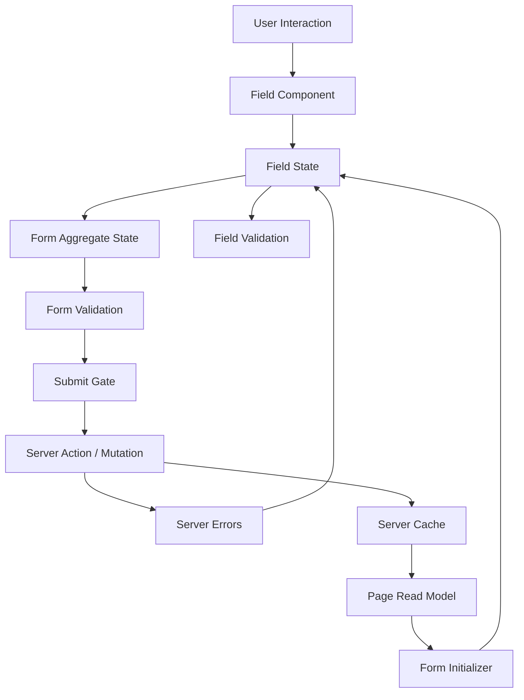
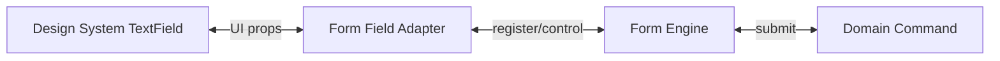
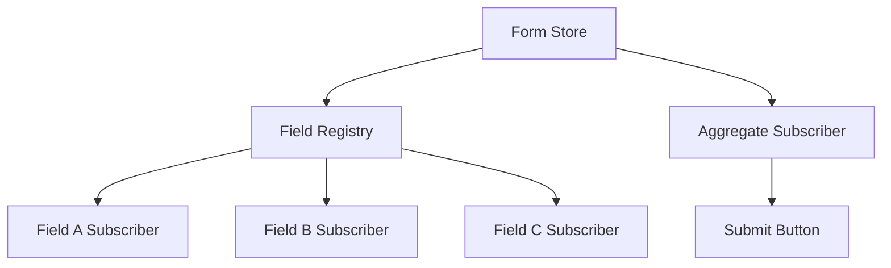
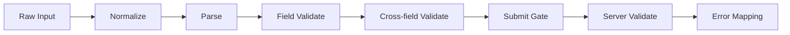
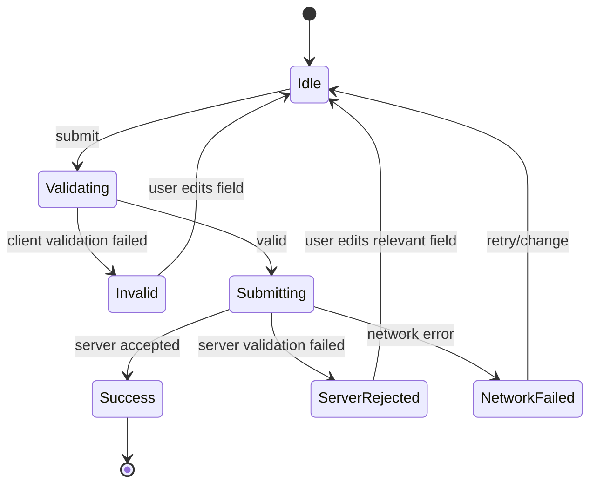
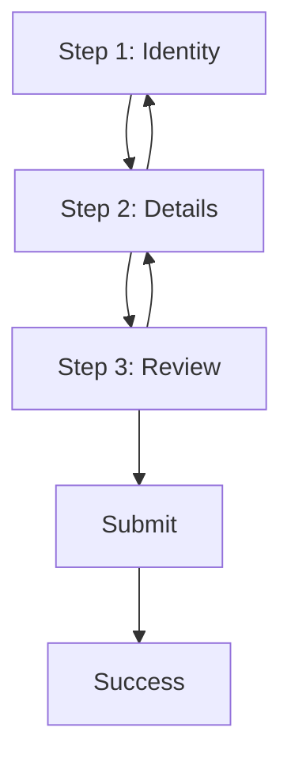

# Part 047 — Form Communication

Form adalah salah satu tempat paling sering React app berubah dari “component tree sederhana” menjadi **orchestration graph**.

Di permukaan, form terlihat seperti kumpulan input dan submit button.

Di production, form adalah koordinasi antara:

- user input,
- field state,
- form aggregate state,
- validation state,
- dirty/touched state,
- permission state,
- async lookup,
- server validation,
- optimistic update,
- navigation guard,
- accessibility contract,
- analytics/audit event,
- submit lifecycle.

Masalah form jarang berasal dari `input` itu sendiri. Masalah biasanya muncul karena **ownership dan komunikasi antar layer tidak jelas**.

Pertanyaan utama dalam part ini:

```txt
Siapa owner nilai field?
Siapa owner status dirty/touched/error?
Siapa yang boleh menjalankan validation?
Siapa yang boleh submit?
Apakah server response menjadi source of truth baru?
Apakah form boleh menyimpan data yang juga ada di cache server?
Bagaimana field saling bergantung tanpa membuat cycle?
Bagaimana invalid state dicegah, bukan hanya ditampilkan?
```

---

## 1. Mental Model: Form Bukan Object, Form Adalah Graph

Form sederhana sering dimodelkan sebagai object:

```ts
const form = {
  name: 'Ana',
  email: 'ana@example.com',
  role: 'admin',
};
```

Model itu benar untuk payload, tetapi tidak cukup untuk UI form.

UI form lebih dekat ke graph:



Ada beberapa edge penting:

```txt
User -> Field               : input/change/blur/focus
Field -> Form               : value commit, touch, validation signal
Form -> Field               : error, disabled, default value, reset
Form -> Server              : submit command
Server -> Form              : success/error/conflict
Form -> Page                : submitted, cancelled, dirty change
Page -> Form                : initial data, permission, mode
```

Jika edge-edge ini tidak eksplisit, form akan berubah menjadi kumpulan `useEffect`, setter silang, dan state duplikat.

---

## 2. State Taxonomy Dalam Form

Jangan masukkan semua ke satu `formState` tanpa klasifikasi.

Form biasanya punya beberapa jenis state berbeda:

| Jenis State | Contoh | Owner Ideal | Catatan |
|---|---|---|---|
| Field value | `email`, `amount` | field/form controller | Bisa controlled atau uncontrolled |
| Field meta | `dirty`, `touched`, `focused` | form controller | Tidak selalu perlu global rerender |
| Validation result | `errors.email` | validation layer | Derived dari value atau server response |
| Submit state | `idle`, `submitting`, `success`, `failed` | form orchestrator | Lifecycle command |
| Server result | created invoice, updated case | server cache/page boundary | Jangan dicampur dengan draft form |
| Permission state | can edit, can approve | capability/context/page | Bukan milik field |
| Visibility state | field hidden/visible | form schema/workflow | Bisa derived dari value + mode |
| Draft state | unsaved edits | form/session | Harus punya reset/commit semantics |
| Navigation guard | has unsaved changes | page/form boundary | Efek ke router/window |

Rule praktis:

```txt
Payload value boleh berada di form.
Server entity canonical seharusnya tetap di server cache/read model.
Validation boleh derived, kecuali server error perlu dipertahankan sampai field relevan berubah.
Dirty/touched adalah UI interaction metadata, bukan domain data.
Submit status adalah command lifecycle, bukan field value.
```

---

## 3. Field Communication: Value, Intent, dan Meta

Field component tidak seharusnya tahu semua tentang form.

Field idealnya berkomunikasi lewat kontrak kecil:

```tsx
export type TextFieldProps = {
  name: string;
  value: string;
  onValueChange: (nextValue: string) => void;
  onBlur?: () => void;
  error?: string;
  disabled?: boolean;
  required?: boolean;
};
```

Di sini:

```txt
value          = read model
onValueChange  = intent/event port
onBlur         = meta event
disabled       = command gate
error          = validation read model
```

Jangan bocorkan implementation detail form ke field:

```tsx
// Kurang baik: field tahu terlalu banyak tentang form library atau store.
<TextField form={form} path="customer.email" />
```

Lebih baik field menerima kontrak UI yang stabil:

```tsx
<TextField
  name="email"
  value={email.value}
  onValueChange={email.setValue}
  onBlur={email.markTouched}
  error={email.error}
/>
```

Dalam design system, field primitive sebaiknya tidak tergantung pada domain form library. Adapter-lah yang menghubungkan field dengan form engine.



---

## 4. Controlled vs Uncontrolled Dalam Form Besar

Controlled input berarti React state adalah source of truth untuk value.

```tsx
function ControlledEmail() {
  const [email, setEmail] = useState('');

  return (
    <input
      value={email}
      onChange={(event) => setEmail(event.target.value)}
    />
  );
}
```

Uncontrolled input berarti DOM menyimpan current value dan React membaca saat diperlukan.

```tsx
function UncontrolledEmail() {
  const ref = useRef<HTMLInputElement>(null);

  function submit() {
    const email = ref.current?.value ?? '';
    // submit email
  }

  return <input ref={ref} defaultValue="" />;
}
```

Untuk form production, keputusan controlled/uncontrolled bukan soal preferensi. Ini soal komunikasi.

| Kebutuhan | Controlled | Uncontrolled |
|---|---:|---:|
| Live validation setiap ketik | Kuat | Perlu adapter/event |
| Conditional UI berdasarkan value | Kuat | Perlu watch/register |
| Banyak field dengan performa tinggi | Bisa mahal | Sering lebih efisien |
| Reset by state | Mudah | Perlu key/form reset/ref |
| Integrasi native form/action | Bisa | Sangat natural |
| Complex field custom | Kuat | Kadang sulit |
| Draft observable di parent | Mudah | Perlu bridge |

Rule yang lebih akurat:

```txt
Controlled cocok ketika UI lain harus re-render berdasarkan value field saat itu juga.
Uncontrolled cocok ketika value hanya dibaca pada submit/blur atau form engine punya subscription granular.
```

Kesalahan umum:

```tsx
// Buruk: controlled semua field di page besar tanpa alasan.
const [form, setForm] = useState(hugeObject);

<input
  value={form.firstName}
  onChange={(e) => setForm({ ...form, firstName: e.target.value })}
/>
```

Masalahnya:

```txt
Setiap keypress membuat owner form re-render.
Semua child yang tergantung object form berisiko ikut re-render.
Validasi dan derivasi sering ikut berjalan terlalu sering.
Field meta tercampur dengan payload.
```

Refactor minimum:

```tsx
setForm((current) => ({
  ...current,
  firstName: e.target.value,
}));
```

Refactor arsitektural:

```txt
Split field state.
Gunakan reducer untuk transition kompleks.
Gunakan field-level subscription jika field banyak.
Jangan expose entire form object ke semua child.
Pisahkan payload, meta, dan validation state.
```

---

## 5. Form Aggregate State

Field value sendiri-sendiri tidak cukup. Form butuh aggregate view:

```ts
type FormAggregate = {
  values: Record<string, unknown>;
  errors: Record<string, string[]>;
  touched: Record<string, boolean>;
  dirty: Record<string, boolean>;
  submitStatus: 'idle' | 'submitting' | 'success' | 'failed';
};
```

Tetapi aggregate view tidak harus selalu menjadi satu state React besar.

Ada tiga model umum:

### 5.1 Single React State Object

```tsx
const [form, setForm] = useState<FormState>(initialFormState);
```

Cocok untuk:

```txt
Form kecil.
Field sedikit.
Validasi ringan.
Komunikasi sederhana.
```

Tidak cocok untuk:

```txt
Form besar.
Field dinamis.
Field-level subscription.
High-frequency input.
Wizard kompleks.
```

### 5.2 Reducer-Based Form

```tsx
type FormEvent =
  | { type: 'FIELD_CHANGED'; name: string; value: unknown }
  | { type: 'FIELD_BLURRED'; name: string }
  | { type: 'VALIDATION_FAILED'; errors: Record<string, string[]> }
  | { type: 'SUBMIT_STARTED' }
  | { type: 'SUBMIT_SUCCEEDED' }
  | { type: 'SUBMIT_FAILED'; errors: Record<string, string[]> };
```

Cocok jika form punya invariant:

```txt
Submit hanya boleh jika valid.
Server error field harus hilang saat field terkait berubah.
Changing country harus reset province.
Changing role harus reset permission set.
Submit failed harus mempertahankan draft.
Submit success harus commit dan reset dirty state.
```

### 5.3 External Form Store / Field Registry

Cocok untuk:

```txt
Banyak field.
Dynamic schema.
Form builder.
Subscription granular.
Nested fields.
Virtualized fields.
Complex validation graph.
```

Mental model-nya:



Field hanya subscribe ke slice yang dibutuhkan.

---

## 6. Build From Scratch: Reducer Form Controller

Kita buat form controller kecil untuk menunjukkan komunikasi yang eksplisit.

```tsx
type Values = {
  email: string;
  password: string;
};

type FormState = {
  values: Values;
  touched: Partial<Record<keyof Values, boolean>>;
  errors: Partial<Record<keyof Values, string>>;
  status: 'idle' | 'submitting' | 'success' | 'failed';
};

type FormEvent =
  | { type: 'FIELD_CHANGED'; field: keyof Values; value: string }
  | { type: 'FIELD_BLURRED'; field: keyof Values }
  | { type: 'SUBMIT_STARTED' }
  | { type: 'SUBMIT_FAILED'; errors: Partial<Record<keyof Values, string>> }
  | { type: 'SUBMIT_SUCCEEDED' }
  | { type: 'RESET'; values: Values };

function validate(values: Values) {
  const errors: Partial<Record<keyof Values, string>> = {};

  if (!values.email.includes('@')) {
    errors.email = 'Email must be valid.';
  }

  if (values.password.length < 8) {
    errors.password = 'Password must contain at least 8 characters.';
  }

  return errors;
}

function reducer(state: FormState, event: FormEvent): FormState {
  switch (event.type) {
    case 'FIELD_CHANGED': {
      const values = {
        ...state.values,
        [event.field]: event.value,
      };

      const nextErrors = { ...state.errors };
      delete nextErrors[event.field];

      return {
        ...state,
        values,
        errors: nextErrors,
        status: state.status === 'failed' ? 'idle' : state.status,
      };
    }

    case 'FIELD_BLURRED': {
      const errors = validate(state.values);

      return {
        ...state,
        touched: {
          ...state.touched,
          [event.field]: true,
        },
        errors,
      };
    }

    case 'SUBMIT_STARTED': {
      const errors = validate(state.values);

      if (Object.keys(errors).length > 0) {
        return {
          ...state,
          errors,
          touched: {
            email: true,
            password: true,
          },
          status: 'failed',
        };
      }

      return {
        ...state,
        errors: {},
        status: 'submitting',
      };
    }

    case 'SUBMIT_FAILED':
      return {
        ...state,
        errors: event.errors,
        status: 'failed',
      };

    case 'SUBMIT_SUCCEEDED':
      return {
        ...state,
        errors: {},
        touched: {},
        status: 'success',
      };

    case 'RESET':
      return {
        values: event.values,
        touched: {},
        errors: {},
        status: 'idle',
      };
  }
}
```

Sekarang buat hook controller:

```tsx
function useLoginForm(initialValues: Values) {
  const [state, dispatch] = useReducer(reducer, {
    values: initialValues,
    touched: {},
    errors: {},
    status: 'idle',
  });

  function field(name: keyof Values) {
    return {
      name,
      value: state.values[name],
      error: state.touched[name] ? state.errors[name] : undefined,
      onChange: (event: React.ChangeEvent<HTMLInputElement>) => {
        dispatch({
          type: 'FIELD_CHANGED',
          field: name,
          value: event.target.value,
        });
      },
      onBlur: () => {
        dispatch({ type: 'FIELD_BLURRED', field: name });
      },
    };
  }

  return {
    state,
    field,
    dispatch,
  };
}
```

Pemakaian:

```tsx
function LoginForm() {
  const form = useLoginForm({ email: '', password: '' });

  async function submit(event: React.FormEvent) {
    event.preventDefault();

    form.dispatch({ type: 'SUBMIT_STARTED' });

    if (form.state.status === 'failed') {
      return;
    }

    try {
      await login(form.state.values);
      form.dispatch({ type: 'SUBMIT_SUCCEEDED' });
    } catch (error) {
      form.dispatch({
        type: 'SUBMIT_FAILED',
        errors: normalizeServerErrors(error),
      });
    }
  }

  return (
    <form onSubmit={submit} noValidate>
      <TextField label="Email" {...form.field('email')} />
      <TextField label="Password" type="password" {...form.field('password')} />

      <button disabled={form.state.status === 'submitting'}>
        Sign in
      </button>
    </form>
  );
}
```

Ada bug halus di atas.

`form.dispatch({ type: 'SUBMIT_STARTED' })` tidak langsung membuat `form.state.status` berubah dalam handler yang sama, karena state adalah snapshot render saat ini.

Perbaikan: jangan dispatch lalu membaca state baru dalam closure yang sama. Jalankan validation sebelum command async, atau jadikan reducer hanya update state dan handler memakai hasil validation lokal.

```tsx
async function submit(event: React.FormEvent) {
  event.preventDefault();

  const errors = validate(form.state.values);

  if (Object.keys(errors).length > 0) {
    form.dispatch({ type: 'SUBMIT_FAILED', errors });
    return;
  }

  form.dispatch({ type: 'SUBMIT_STARTED' });

  try {
    await login(form.state.values);
    form.dispatch({ type: 'SUBMIT_SUCCEEDED' });
  } catch (error) {
    form.dispatch({
      type: 'SUBMIT_FAILED',
      errors: normalizeServerErrors(error),
    });
  }
}
```

Ini contoh penting: form communication harus menghormati model state snapshot React.

---

## 7. Validation Sebagai Pipeline

Validation bukan satu fungsi besar.

Pipeline yang lebih stabil:



Contoh:

```txt
Raw input       : "  Rp 10.000 "
Normalize       : "10000"
Parse           : 10000
Field validate  : amount > 0
Cross-field     : amount <= availableBudget
Server validate : budget still available, user has permission
Error mapping   : field error or form-level error
```

Pisahkan jenis error:

| Error Type | Contoh | Ditampilkan Di |
|---|---|---|
| Field error | email invalid | field |
| Cross-field error | end date before start date | field group/form summary |
| Form-level error | submit failed | top of form |
| Server field error | username already taken | field |
| Conflict error | entity already updated by someone else | conflict banner/workflow |
| Permission error | cannot approve this case | command area |
| Network error | request timeout | retry UI |

Jangan paksa semua error menjadi field error.

---

## 8. Cross-Field Communication

Field sering bergantung pada field lain:

```txt
country -> province options
startDate -> endDate min
role -> permission set
caseType -> required fields
paymentMethod -> bank/account fields
```

Cara buruk:

```tsx
useEffect(() => {
  if (country === 'ID') {
    setProvince('DKI Jakarta');
  }
}, [country]);
```

Ini bisa valid dalam kasus tertentu, tetapi sering membuat dependency graph tersembunyi.

Lebih baik jadikan sebagai transition eksplisit:

```tsx
type FormEvent =
  | { type: 'COUNTRY_CHANGED'; country: string }
  | { type: 'PROVINCE_CHANGED'; province: string };

function reducer(state: State, event: FormEvent): State {
  switch (event.type) {
    case 'COUNTRY_CHANGED': {
      return {
        ...state,
        values: {
          ...state.values,
          country: event.country,
          province: '',
        },
        errors: removeProvinceError(state.errors),
      };
    }

    case 'PROVINCE_CHANGED': {
      return {
        ...state,
        values: {
          ...state.values,
          province: event.province,
        },
      };
    }
  }
}
```

Dengan reducer, perubahan `country` dan reset `province` adalah satu transition atomik.

Inilah perbedaan antara:

```txt
field saling mengawasi lewat effect
```

versus:

```txt
form owner menjalankan transition yang menjaga invariant
```

---

## 9. Field Context: Accessibility dan Composition

Form field sering terdiri dari label, control, description, dan error.

```tsx
<FormField name="email">
  <FormLabel>Email</FormLabel>
  <FormControl>
    <Input />
  </FormControl>
  <FormDescription>Use your work email.</FormDescription>
  <FormError />
</FormField>
```

Komponen-komponen ini perlu berbagi:

```txt
field id
name
error id
is invalid
is required
is disabled
aria-describedby
```

Ini cocok untuk scoped context.

```tsx
type FieldContextValue = {
  name: string;
  inputId: string;
  descriptionId: string;
  errorId: string;
  invalid: boolean;
};

const FieldContext = createContext<FieldContextValue | null>(null);

function useFieldContext() {
  const value = useContext(FieldContext);

  if (!value) {
    throw new Error('Field components must be used inside <FormField>.');
  }

  return value;
}
```

Provider:

```tsx
function FormField({ name, invalid, children }: FormFieldProps) {
  const reactId = useId();

  const value = useMemo(
    () => ({
      name,
      inputId: `${reactId}-input`,
      descriptionId: `${reactId}-description`,
      errorId: `${reactId}-error`,
      invalid,
    }),
    [name, reactId, invalid],
  );

  return (
    <FieldContext.Provider value={value}>
      <div data-field={name}>{children}</div>
    </FieldContext.Provider>
  );
}
```

Control:

```tsx
function FormInput(props: React.ComponentProps<'input'>) {
  const field = useFieldContext();

  return (
    <input
      {...props}
      id={field.inputId}
      name={field.name}
      aria-invalid={field.invalid || undefined}
      aria-describedby={
        field.invalid
          ? `${field.descriptionId} ${field.errorId}`
          : field.descriptionId
      }
    />
  );
}
```

Context di sini bukan global store. Context adalah koordinasi compound component lokal.

---

## 10. Form Submission Sebagai Command Lifecycle

Submit bukan event biasa. Submit adalah command.

Lifecycle minimal:



Setiap state punya UI berbeda:

| Submit State | UI |
|---|---|
| `idle` | editable form |
| `validating` | optional validation indicator |
| `invalid` | errors visible |
| `submitting` | submit disabled/pending |
| `serverRejected` | server errors mapped |
| `networkFailed` | retry UI |
| `success` | navigate, reset, or success state |

Jangan hanya punya boolean `isSubmitting` jika workflow punya banyak kemungkinan.

```tsx
const [isSubmitting, setSubmitting] = useState(false);
const [error, setError] = useState<string | null>(null);
```

Ini cepat berubah menjadi state kombinasi ilegal:

```txt
isSubmitting=true, error="failed"
isSubmitting=false, success=true, error="failed"
isSubmitting=true, dirty=false, disabled=false
```

Gunakan union state untuk lifecycle penting.

```ts
type SubmitState =
  | { status: 'idle' }
  | { status: 'invalid'; errors: FieldErrors }
  | { status: 'submitting'; requestId: string }
  | { status: 'serverRejected'; errors: FieldErrors }
  | { status: 'networkFailed'; message: string }
  | { status: 'success'; resultId: string };
```

---

## 11. React 19 Form Actions: Progressive Form Communication

React modern menambahkan dukungan yang lebih kuat untuk form action.

Dengan `<form action={fn}>`, form bisa menjalankan function saat submit. `useActionState` membantu menyimpan state hasil action. `useFormStatus` membantu child form membaca status submit dari form terdekat.

Pola sederhananya:

```tsx
async function submitProfile(
  previousState: ProfileActionState,
  formData: FormData,
): Promise<ProfileActionState> {
  const payload = parseProfileFormData(formData);
  const result = await updateProfile(payload);

  if (!result.ok) {
    return {
      status: 'failed',
      errors: result.errors,
    };
  }

  return {
    status: 'success',
    profileId: result.profileId,
  };
}

function ProfileForm() {
  const [state, action] = useActionState(submitProfile, {
    status: 'idle',
    errors: {},
  });

  return (
    <form action={action}>
      <input name="displayName" />
      {state.errors.displayName ? (
        <p role="alert">{state.errors.displayName}</p>
      ) : null}
      <SubmitButton />
    </form>
  );
}

function SubmitButton() {
  const status = useFormStatus();

  return (
    <button disabled={status.pending}>
      {status.pending ? 'Saving...' : 'Save'}
    </button>
  );
}
```

Mental model-nya:

```txt
FormData adalah command payload.
Action adalah command handler.
useActionState adalah result state.
useFormStatus adalah descendant read model untuk pending submit.
```

Tetap ada batas:

```txt
Untuk dynamic client-side validation kompleks, masih butuh form controller.
Untuk field-level subscription besar, gunakan form engine/subscription.
Untuk server cache invalidation, action success harus terhubung ke cache/router boundary.
```

---

## 12. Server Errors dan Field Reconciliation

Server error harus diperlakukan sebagai state dengan lifetime jelas.

Contoh server response:

```json
{
  "fieldErrors": {
    "email": ["Email is already registered"]
  },
  "formErrors": ["Cannot create user in this workspace"]
}
```

Pertanyaannya:

```txt
Kapan error hilang?
Saat field berubah?
Saat blur?
Saat submit ulang?
Saat server menerima payload baru?
```

Pola umum:

```tsx
case 'FIELD_CHANGED': {
  return {
    ...state,
    values: updateValue(state.values, event.field, event.value),
    serverErrors: removeErrorForField(state.serverErrors, event.field),
  };
}
```

Tetapi jangan hilangkan form-level error yang tidak berhubungan dengan field tertentu.

```txt
Email already registered  -> hilang saat email berubah.
Workspace locked          -> tidak hilang hanya karena email berubah.
Network timeout           -> hilang saat retry dimulai.
Permission denied         -> biasanya tidak hilang dari edit field.
Conflict version mismatch -> butuh reload/merge workflow.
```

---

## 13. Dynamic Form dan Field Registry

Dynamic form muncul saat:

```txt
schema berasal dari server,
field bergantung pada pilihan user,
field array bisa bertambah/berkurang,
wizard punya step dinamis,
role/permission mengubah field visibility,
regulatory workflow punya conditional requirement.
```

Masalah utama dynamic form:

```txt
Field bisa mount/unmount.
Value field tersembunyi bisa masih tersimpan.
Validation schema berubah.
Error stale bisa tertinggal.
Submit payload bisa mengandung field yang sudah tidak relevan.
Focus order berubah.
```

Field registry membantu melacak field aktif.

```tsx
type FieldRegistration = {
  name: string;
  validate?: (value: unknown, values: Values) => string | null;
  serialize?: (value: unknown) => unknown;
};

function useFieldRegistration(registration: FieldRegistration) {
  const form = useFormRegistry();

  useEffect(() => {
    return form.register(registration);
  }, [form, registration.name]);
}
```

Tetapi hati-hati: object `registration` harus stabil atau register/unregister berulang akan terjadi.

```tsx
const registration = useMemo(
  () => ({ name, validate }),
  [name, validate],
);

useFieldRegistration(registration);
```

Untuk dynamic field, policy harus eksplisit:

| Saat Field Hidden/Unmount | Policy |
|---|---|
| Keep value | Untuk wizard/back navigation |
| Drop value | Untuk conditional irrelevant fields |
| Keep but exclude from submit | Untuk temporary hidden UI |
| Mark stale | Untuk data yang butuh revalidation |

Jangan biarkan default browser/React menentukan domain policy secara tidak sengaja.

---

## 14. Multi-Step Form Communication

Wizard bukan hanya form yang dibagi beberapa halaman.

Wizard punya workflow:



Ada dua model ownership:

### 14.1 Single Owner Wizard

```txt
Wizard root memiliki seluruh draft.
Step menerima slice state dan command.
Navigasi step menjaga invariant.
```

Cocok untuk:

```txt
Short wizard.
Cross-step validation.
Review page.
Draft save.
```

### 14.2 Step-Local Owner dengan Commit

```txt
Step punya local draft.
Saat next, step commit ke wizard aggregate.
Back bisa rehydrate dari aggregate.
```

Cocok untuk:

```txt
Step berat.
Step punya local async lookup.
Step bisa dibuka independen.
Performance isolation.
```

Jangan mencampur dua model tanpa kontrak.

Buruk:

```txt
Step punya local state.
Wizard juga punya state yang sync lewat useEffect.
Server cache juga di-update sebelum submit.
```

Itu tiga source of truth.

---

## 15. Form Performance

Form besar rentan terhadap rerender berlebihan.

Penyebab umum:

```txt
Satu state object besar.
Provider context value berubah setiap keypress.
Semua field membaca entire form state.
Validation berjalan di render.
Derived error object dibuat ulang terus.
Callback per-field tidak stabil.
Async validation tanpa debounce/cancellation.
```

Optimasi berurutan:

```txt
1. Ukur dahulu.
2. Split form menjadi section.
3. Hindari passing entire form object.
4. Field subscribe hanya ke value/error/meta sendiri.
5. Memoize adapter jika perlu.
6. Debounce expensive validation.
7. Pindahkan heavy validation ke event/worker jika perlu.
8. Gunakan uncontrolled/subscription model untuk field sangat banyak.
```

Contoh field-level subscription dengan external store akan dibahas lebih dalam pada module external store. Untuk sekarang, pahami prinsipnya:

```txt
Input email berubah tidak seharusnya membuat field address, role, dan notes re-render kecuali mereka benar-benar bergantung pada email.
```

---

## 16. Form Accessibility Communication

Accessibility bukan dekorasi setelah UI selesai.

Field harus mengkomunikasikan statusnya ke assistive technology.

Minimal:

```tsx
<label htmlFor="email">Email</label>
<input
  id="email"
  name="email"
  aria-invalid={error ? true : undefined}
  aria-describedby={error ? 'email-error' : undefined}
/>
{error ? (
  <p id="email-error" role="alert">
    {error}
  </p>
) : null}
```

Untuk form-level error summary:

```tsx
function ErrorSummary({ errors }: { errors: FieldError[] }) {
  if (errors.length === 0) return null;

  return (
    <section role="alert" aria-labelledby="error-summary-title">
      <h2 id="error-summary-title">Please fix the following fields</h2>
      <ul>
        {errors.map((error) => (
          <li key={error.field}>
            <a href={`#${error.field}`}>{error.message}</a>
          </li>
        ))}
      </ul>
    </section>
  );
}
```

Communication channel-nya bukan hanya visual.

```txt
Visual user       : red border, text error
Keyboard user     : focus order, summary links
Screen reader     : label, describedby, invalid state, alert
Motor impairment  : no timing traps, clear retry, disabled semantics
```

---

## 17. Form Communication Dengan Page dan Router

Form sering perlu memberi sinyal ke page:

```txt
Form became dirty.
Form submitted successfully.
Form cancelled.
Form failed because entity conflict.
Form needs navigation block.
```

Jangan biarkan page membaca field detail jika hanya butuh aggregate intent.

```tsx
<CaseEditForm
  caseId={caseId}
  initialValues={initialValues}
  onDirtyChange={setHasUnsavedChanges}
  onSubmitted={(result) => navigate(`/cases/${result.caseId}`)}
  onConflict={(conflict) => openConflictDialog(conflict)}
/>
```

Callback ini bukan sekadar technical callback. Ini boundary antara form workflow dan page orchestration.

Kontrak harus jelas:

```txt
onDirtyChange dipanggil kapan?
onSubmitted dipanggil setelah server/cache update atau sebelum?
onConflict apakah form tetap editable?
onCancel apakah parent boleh block close?
```

---

## 18. Production Failure Modes

### 18.1 Double Source of Truth

Gejala:

```txt
Input menampilkan value A, submit mengirim value B.
Reset tidak konsisten.
Parent dan child saling sync lewat effect.
```

Root cause:

```txt
Value field dimiliki oleh dua tempat.
```

Fix:

```txt
Pilih satu owner.
Gunakan controlled contract atau commit contract.
Hapus sync effect yang tidak perlu.
```

### 18.2 Server Error Tidak Pernah Hilang

Gejala:

```txt
User memperbaiki field, error lama tetap muncul.
```

Fix:

```txt
Map server error ke field terkait.
Hapus error field saat field berubah.
Pertahankan form-level error sesuai domain policy.
```

### 18.3 Error Hilang Terlalu Cepat

Gejala:

```txt
User mengetik satu karakter, error hilang padahal value masih invalid.
```

Fix:

```txt
Bedakan server error dan client validation error.
Revalidate field saat change/blur sesuai UX policy.
```

### 18.4 Submit Ganda

Gejala:

```txt
Dua request terkirim.
Record duplicate.
Button disabled terlambat.
```

Fix:

```txt
Submit state sebagai command lifecycle.
Disable command saat pending.
Gunakan idempotency key untuk server command penting.
```

### 18.5 Race Async Validation

Gejala:

```txt
Username lama dianggap valid setelah user mengetik username baru.
```

Fix:

```txt
Gunakan AbortController/request id.
Ignore response yang bukan request terbaru.
```

```tsx
const requestIdRef = useRef(0);

async function validateUsername(username: string) {
  const requestId = ++requestIdRef.current;
  const result = await checkUsername(username);

  if (requestId !== requestIdRef.current) {
    return;
  }

  setUsernameStatus(result);
}
```

### 18.6 Hidden Field Masih Tersubmit

Gejala:

```txt
User memilih payment method cash, tetapi payload masih berisi bankAccount.
```

Fix:

```txt
Tentukan policy hidden field.
Serialize payload berdasarkan active schema, bukan seluruh draft mentah.
```

---

## 19. Decision Matrix

| Problem | First Tool | Escalate To |
|---|---|---|
| 2-5 simple fields | local state | reducer if transitions grow |
| Field depends on another field | reducer transition | validation graph/form engine |
| Many fields rerender too often | component split | external/subscription form store |
| Server validation errors | submit lifecycle state | action/query mutation integration |
| Dynamic schema | field registry | form engine/workflow machine |
| Wizard | wizard owner + reducer | state machine |
| Form builder | registry + schema renderer | external store + validation graph |
| Async lookup | debounced command + cancellation | query cache/subscription |
| Permissioned fields | capability input from page/context | policy-aware schema |
| Audit-heavy submit | command object | workflow engine + idempotency |

---

## 20. Engineering Checklist

Sebelum merge form kompleks, jawab ini:

```txt
[ ] Field value punya satu owner.
[ ] Payload state dipisah dari field meta.
[ ] Server entity tidak diduplikasi sebagai draft tanpa reset/commit policy.
[ ] Validation pipeline jelas.
[ ] Server error lifetime jelas.
[ ] Submit lifecycle bukan cuma boolean jika ada banyak state.
[ ] Double submit dicegah di UI dan server.
[ ] Async validation punya race handling.
[ ] Hidden/dynamic field punya serialization policy.
[ ] Form accessibility diuji dengan keyboard dan screen reader assumptions.
[ ] Page callback contract jelas.
[ ] Dirty/navigation guard tidak membaca detail field tanpa perlu.
[ ] Performance diukur untuk form besar.
```

---

## 21. Latihan

Bangun form `CreateCaseForm` dengan requirement:

```txt
caseType menentukan field wajib.
assignee lookup async.
priority mengubah SLA date default.
submit bisa gagal karena server validation.
form harus menampilkan error summary.
user tidak boleh meninggalkan halaman saat dirty.
```

Implementasi pertama boleh pakai reducer lokal.

Lalu refactor menjadi:

```txt
Form root sebagai orchestrator.
Field components sebagai UI primitives.
Validation sebagai pipeline terpisah.
Server submit sebagai command lifecycle.
Dirty state sebagai aggregate signal ke page.
```

Tujuannya bukan membuat form library sendiri. Tujuannya melihat komunikasi form sebagai graph yang bisa dikontrol.

---

## 22. Ringkasan

Form communication yang kuat berdiri di atas beberapa prinsip:

```txt
Form adalah graph, bukan object.
Field tidak boleh tahu terlalu banyak tentang form engine.
Payload, meta, validation, dan submit lifecycle adalah state berbeda.
Cross-field behavior sebaiknya transition eksplisit, bukan effect saling mengawasi.
Server errors butuh lifetime policy.
Dynamic fields butuh registry/serialization policy.
Accessibility adalah bagian dari communication contract.
```

Kalau form mulai terasa kacau, jangan langsung ganti library.

Tanyakan dulu:

```txt
Owner-nya siapa?
Edge komunikasinya apa?
State ini canonical, draft, derived, meta, atau command lifecycle?
Invariant apa yang sedang dilanggar?
```

Itulah cara engineer production-grade membaca form React.

---

## Referensi

- React Docs — `<form>`: `https://react.dev/reference/react-dom/components/form`
- React Docs — `useActionState`: `https://react.dev/reference/react/useActionState`
- React Docs — `useFormStatus`: `https://react.dev/reference/react-dom/hooks/useFormStatus`
- React Docs — Input: `https://react.dev/reference/react-dom/components/input`
- React Docs — State as a Snapshot: `https://react.dev/learn/state-as-a-snapshot`
- React Docs — Sharing State Between Components: `https://react.dev/learn/sharing-state-between-components`
