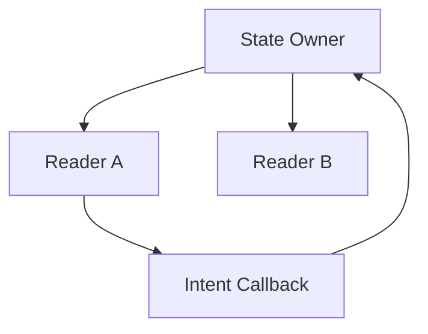
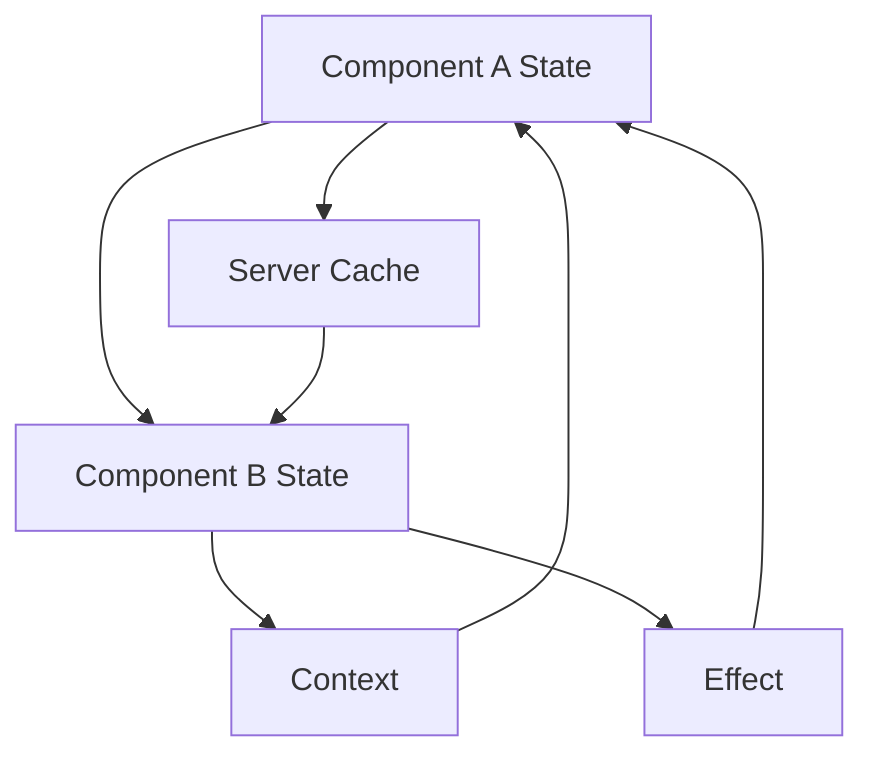
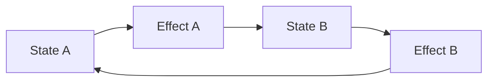
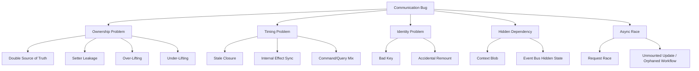

# Part 048 — Component Communication Failure Modes

Komunikasi komponen biasanya gagal bukan karena React “aneh”.

Komunikasi gagal karena graph-nya salah:

```txt
state punya lebih dari satu owner,
callback membawa makna yang ambigu,
effect dipakai untuk sinkronisasi internal,
context menyembunyikan dependency,
store menjadi global dumping ground,
event bus dipakai untuk state,
async response datang ke snapshot yang sudah basi,
key/remount menghapus state tanpa sengaja.
```

Part ini adalah katalog failure modes.

Tujuannya bukan menghafal anti-pattern, tetapi membangun kemampuan diagnosis:

```txt
Gejalanya apa?
Edge komunikasi mana yang salah?
Owner state-nya siapa?
Invariant apa yang dilanggar?
Refactor minimum apa?
Refactor arsitektural apa?
```

---

## 1. Communication Graph Sebagai Alat Debug

Setiap komunikasi component bisa digambar sebagai graph.



Graph sehat biasanya punya sifat:

```txt
Satu owner untuk satu state canonical.
Reader tidak mengubah state langsung.
Child mengirim intent, bukan memutasi parent.
Cross-tree dependency punya boundary eksplisit.
Async command punya lifecycle.
Derived state tidak disimpan kecuali ada alasan kuat.
```

Graph sakit biasanya terlihat seperti ini:



Jika sulit menjawab “siapa owner?”, hampir pasti bug akan muncul.

---

## 2. Failure Mode: Double Source of Truth

### Gejala

```txt
UI menampilkan satu nilai, submit mengirim nilai lain.
Reset hanya mereset sebagian UI.
Parent mengira item selected, child mengira tidak selected.
Form dan cache server berbeda tanpa policy.
```

Contoh:

```tsx
function Parent() {
  const [selectedId, setSelectedId] = useState<string | null>(null);

  return (
    <UserList
      selectedId={selectedId}
      onSelectedIdChange={setSelectedId}
    />
  );
}

function UserList({ selectedId, onSelectedIdChange }: Props) {
  const [localSelectedId, setLocalSelectedId] = useState(selectedId);

  function select(id: string) {
    setLocalSelectedId(id);
    onSelectedIdChange(id);
  }

  // render using localSelectedId
}
```

`selectedId` dimiliki parent dan child.

### Root Cause

```txt
Controlled dan uncontrolled model dicampur tanpa commit contract.
```

### Fix Minimum

Jadikan child controlled:

```tsx
function UserList({ selectedId, onSelectedIdChange }: Props) {
  return users.map((user) => (
    <button
      key={user.id}
      aria-pressed={selectedId === user.id}
      onClick={() => onSelectedIdChange(user.id)}
    >
      {user.name}
    </button>
  ));
}
```

Atau jadikan child uncontrolled dengan initial value saja:

```tsx
function UserList({ defaultSelectedId, onCommitSelection }: Props) {
  const [selectedId, setSelectedId] = useState(defaultSelectedId);

  function commit() {
    onCommitSelection(selectedId);
  }
}
```

### Rule

```txt
Jika parent mengirim value dan onChange, child controlled.
Jika parent mengirim defaultValue, child boleh punya local owner.
Jangan sync props ke state kecuali ada explicit draft/commit semantics.
```

---

## 3. Failure Mode: Setter Leakage

### Gejala

```txt
Child bisa mengubah parent state dalam bentuk apa pun.
Invariant parent tersebar di banyak child.
State update sulit dilacak.
```

Contoh:

```tsx
<InvoiceEditor setInvoice={setInvoice} />
```

Child bisa melakukan ini:

```tsx
setInvoice((invoice) => ({
  ...invoice,
  status: 'PAID',
  total: -999,
}));
```

### Root Cause

Parent membocorkan mekanisme mutasi, bukan intent.

### Fix

Expose command spesifik:

```tsx
<InvoiceEditor
  invoice={invoice}
  onLineItemAdded={addLineItem}
  onDiscountChanged={changeDiscount}
  onInvoiceSubmitted={submitInvoice}
/>
```

Parent menjaga invariant:

```tsx
function changeDiscount(nextDiscount: Discount) {
  dispatch({
    type: 'DISCOUNT_CHANGED',
    discount: nextDiscount,
  });
}
```

### Rule

```txt
Setter adalah implementation detail owner.
Callback publik harus mewakili intent/domain event.
```

---

## 4. Failure Mode: Callback Ambiguity

### Gejala

```txt
onChange dipanggil saat typing, blur, reset, atau server update?
Parent bingung apakah event sudah committed.
Analytics double count.
Validation berjalan terlalu sering.
```

Contoh ambigu:

```tsx
<SearchBox onChange={handleSearchChange} />
```

Tidak jelas apakah `onChange` berarti:

```txt
input changed,
query committed,
search submitted,
filter applied,
debounced value changed.
```

### Fix

Gunakan nama yang menyatakan lifecycle:

```tsx
<SearchBox
  value={draftQuery}
  onDraftQueryChange={setDraftQuery}
  onSearchCommitted={executeSearch}
/>
```

Untuk form:

```tsx
<AmountField
  value={draftAmount}
  onDraftValueChange={setDraftAmount}
  onValueCommitted={commitAmount}
  onValidationRequested={validateAmount}
/>
```

### Rule

```txt
Callback name harus menjawab: event ini terjadi kapan dan maknanya apa?
```

---

## 5. Failure Mode: Stale Callback / Stale Closure

### Gejala

```txt
Handler membaca state lama.
Async callback submit mengirim value lama.
Timeout memakai prop lama.
Subscription listener tidak update.
```

Contoh:

```tsx
function AutoSave({ documentId, content }: Props) {
  useEffect(() => {
    const id = setInterval(() => {
      saveDocument(documentId, content);
    }, 5000);

    return () => clearInterval(id);
  }, []);
}
```

Effect hanya subscribe sekali, tetapi membaca `documentId` dan `content` dari render pertama.

### Fix 1: Dependency Benar

```tsx
useEffect(() => {
  const id = setInterval(() => {
    saveDocument(documentId, content);
  }, 5000);

  return () => clearInterval(id);
}, [documentId, content]);
```

Tetapi ini membuat interval restart setiap content berubah.

### Fix 2: Pisahkan Clock dan Latest Value

```tsx
function AutoSave({ documentId, content }: Props) {
  const latest = useRef({ documentId, content });

  useEffect(() => {
    latest.current = { documentId, content };
  }, [documentId, content]);

  useEffect(() => {
    const id = setInterval(() => {
      saveDocument(latest.current.documentId, latest.current.content);
    }, 5000);

    return () => clearInterval(id);
  }, []);
}
```

### Rule

```txt
Jika callback membaca reactive value, dependency harus benar.
Jika subscription harus stabil tetapi membaca value terbaru, gunakan latest-ref pattern dengan sadar.
```

Jangan gunakan ref untuk menyembunyikan dependency yang sebenarnya harus reactive.

---

## 6. Failure Mode: Effect Dipakai Untuk Komunikasi Internal

### Gejala

```txt
State update berantai.
Render ganda tidak perlu.
Sulit tahu urutan update.
Strict Mode memperlihatkan bug.
```

Contoh:

```tsx
const [items, setItems] = useState<Item[]>([]);
const [total, setTotal] = useState(0);

useEffect(() => {
  setTotal(items.reduce((sum, item) => sum + item.price, 0));
}, [items]);
```

`total` adalah derived value, bukan state canonical.

### Fix

```tsx
const total = items.reduce((sum, item) => sum + item.price, 0);
```

Jika mahal:

```tsx
const total = useMemo(
  () => items.reduce((sum, item) => sum + item.price, 0),
  [items],
);
```

### Rule

```txt
Effect untuk sinkronisasi external system.
Derived internal data dihitung saat render.
Event-specific logic berada di event handler.
```

---

## 7. Failure Mode: Sibling Communication Tanpa Shared Owner

### Gejala

```txt
Sibling A update sibling B lewat imperative ref.
Sibling saling subscribe event bus.
Parent hanya menjadi tempat lewat callback berantai tanpa model.
```

Contoh:

```tsx
function Page() {
  const tableRef = useRef<TableHandle>(null);

  return (
    <>
      <FilterPanel onFilterChanged={(filter) => tableRef.current?.reload(filter)} />
      <DataTable ref={tableRef} />
    </>
  );
}
```

Kadang ini valid untuk imperative refresh, tetapi sering menyembunyikan state yang seharusnya dimiliki parent.

### Fix

```tsx
function Page() {
  const [filter, setFilter] = useState(defaultFilter);

  return (
    <>
      <FilterPanel filter={filter} onFilterChange={setFilter} />
      <DataTable filter={filter} />
    </>
  );
}
```

Jika data server:

```tsx
function Page() {
  const [filter, setFilter] = useUrlFilter();
  const query = useCasesQuery(filter);

  return (
    <>
      <FilterPanel filter={filter} onFilterChange={setFilter} />
      <DataTable data={query.data} isLoading={query.isLoading} />
    </>
  );
}
```

### Rule

```txt
Jika sibling harus konsisten, cari owner bersama.
Jika state harus shareable/bookmarkable, pertimbangkan URL.
Jika state adalah server data, pakai cache/query boundary.
```

---

## 8. Failure Mode: Over-Lifting State

### Gejala

```txt
Page root punya ratusan state.
Setiap keypress membuat seluruh page re-render.
Komponen kecil tidak reusable karena tergantung page owner.
State lokal yang sederhana menjadi global dalam satu screen.
```

Contoh:

```tsx
function DashboardPage() {
  const [isTooltipOpen, setTooltipOpen] = useState(false);
  const [hoveredRowId, setHoveredRowId] = useState<string | null>(null);
  const [draftNote, setDraftNote] = useState('');
  const [localPopoverAnchor, setLocalPopoverAnchor] = useState<HTMLElement | null>(null);

  // everything lives here
}
```

### Root Cause

State dinaikkan karena “mungkin nanti dibutuhkan”, bukan karena ada shared invariant.

### Fix

Turunkan state yang hanya diperlukan lokal:

```txt
Tooltip open state -> Tooltip owner
Popover anchor     -> Popover owner
Draft note         -> Note editor owner, commit upward on save
Hovered row        -> Table/row owner kecuali dipakai global
```

### Rule

```txt
Lift state only when there is a shared consistency requirement.
```

---

## 9. Failure Mode: Under-Lifting State

### Gejala

```txt
Dua component terlihat harus sinkron tapi tidak sinkron.
Duplicated filters.
Submit button tidak tahu validitas field.
Summary panel menampilkan data lama.
```

Contoh:

```tsx
function FilterPanel() {
  const [filter, setFilter] = useState(defaultFilter);
}

function ResultsTable() {
  const [filter, setFilter] = useState(defaultFilter);
}
```

### Fix

Naikkan ke owner bersama:

```tsx
function SearchPage() {
  const [filter, setFilter] = useState(defaultFilter);

  return (
    <>
      <FilterPanel filter={filter} onFilterChange={setFilter} />
      <ResultsTable filter={filter} />
    </>
  );
}
```

### Rule

```txt
Jika dua component harus berubah bersama, state perlu owner bersama.
```

---

## 10. Failure Mode: Hidden Context Dependency

### Gejala

```txt
Component sulit dipakai di test/story karena butuh provider tidak terlihat.
Component gagal saat dipindah subtree.
Dependency bisnis tidak tampak dari props.
```

Contoh:

```tsx
function DeleteButton({ caseId }: Props) {
  const permissions = usePermissions();
  const toast = useToast();
  const audit = useAudit();
  const modal = useModal();

  // lots of hidden dependencies
}
```

Ini tidak selalu salah. Tetapi jika dependency menentukan behavior penting, boundary-nya harus sadar.

### Fix

Pindahkan orchestration ke boundary lebih tinggi:

```tsx
function CaseActionBar({ caseId }: Props) {
  const permissions = usePermissions();
  const toast = useToast();
  const audit = useAudit();
  const modal = useModal();

  return (
    <DeleteButton
      disabled={!permissions.canDeleteCase(caseId)}
      onDeleteRequested={() => confirmAndDelete({ caseId, modal, toast, audit })}
    />
  );
}
```

`DeleteButton` menjadi UI component yang jelas.

### Rule

```txt
Context baik untuk capability passing.
Jangan biarkan context menyembunyikan domain orchestration yang seharusnya explicit.
```

---

## 11. Failure Mode: Context Sebagai High-Frequency Store

### Gejala

```txt
Typing di satu field membuat seluruh subtree rerender.
Mouse position dalam context membuat app lambat.
Selection state besar membuat semua consumer update.
```

Contoh:

```tsx
<FormContext.Provider value={{ values, errors, setValue }}>
  {children}
</FormContext.Provider>
```

Setiap perubahan `values` mengganti context value. Semua consumer context berpotensi ikut render.

### Fix Ladder

```txt
1. Split read/write context.
2. Split provider per scope.
3. Memoize value jika identity noise.
4. Pecah component agar hanya child tertentu membaca context.
5. Gunakan external store + selector subscription untuk high-frequency shared state.
```

### Rule

```txt
Context cocok untuk low/medium frequency dependency.
Untuk high-frequency granular state, gunakan subscription model.
```

---

## 12. Failure Mode: Event Bus Menjadi State Manager Tersembunyi

### Gejala

```txt
Tidak jelas siapa owner state.
Event order menentukan correctness.
Subscriber lama tidak cleanup.
Bug hanya muncul saat screen tertentu pernah dibuka.
```

Contoh:

```tsx
bus.emit('user:selected', userId);
bus.emit('drawer:open');
bus.emit('table:reload');
bus.emit('breadcrumb:update');
```

Jika event bus mengatur state UI utama, app menjadi imperative distributed system.

### Fix

Klasifikasikan event:

| Event | Better Owner |
|---|---|
| `user:selected` | route/search/page state |
| `drawer:open` | overlay manager or page state |
| `table:reload` | query invalidation/cache |
| `breadcrumb:update` | route metadata/layout data |
| `toast:show` | capability event bus valid |

Event bus valid untuk:

```txt
toast,
analytics,
telemetry,
microfrontend bridge,
external system integration,
rare command fan-out dengan lifecycle aman.
```

Tidak valid sebagai default coordination mechanism.

---

## 13. Failure Mode: Async Race

### Gejala

```txt
Response request lama menimpa request baru.
Loading state salah.
Component unmounted masih menerima update.
Search result tidak sesuai query terakhir.
```

Contoh:

```tsx
useEffect(() => {
  setLoading(true);

  fetchUsers(query).then((users) => {
    setUsers(users);
    setLoading(false);
  });
}, [query]);
```

Jika `query` berubah cepat, response lama bisa datang terakhir.

### Fix Dengan Ignore Flag

```tsx
useEffect(() => {
  let ignore = false;

  setLoading(true);

  fetchUsers(query).then((users) => {
    if (ignore) return;
    setUsers(users);
    setLoading(false);
  });

  return () => {
    ignore = true;
  };
}, [query]);
```

### Fix Dengan AbortController

```tsx
useEffect(() => {
  const controller = new AbortController();

  setLoading(true);

  fetchUsers(query, { signal: controller.signal })
    .then((users) => {
      setUsers(users);
      setLoading(false);
    })
    .catch((error) => {
      if (error.name === 'AbortError') return;
      setLoading(false);
      setError(error);
    });

  return () => controller.abort();
}, [query]);
```

Untuk server state serius, lebih baik gunakan query cache library yang sudah memodelkan cache, observer, cancellation, stale time, dan invalidation.

---

## 14. Failure Mode: Command dan Query Tercampur

### Gejala

```txt
Render membaca data sekaligus menjalankan mutation.
Component view melakukan navigation, audit, mutation, toast, dan cache update sendiri.
Testing sulit karena read dan write bercampur.
```

Contoh:

```tsx
function ApproveButton({ caseId }: Props) {
  const caseDetail = useCaseDetail(caseId);

  async function click() {
    await approveCase(caseDetail.data);
    await audit('case approved');
    toast.success('Approved');
    navigate('/cases');
  }
}
```

Ini bisa bekerja, tetapi boundary-nya kabur.

### Fix

Pisahkan read model dan command:

```tsx
function CaseApprovalBoundary({ caseId }: Props) {
  const caseDetail = useCaseDetail(caseId);
  const approve = useApproveCaseCommand();

  return (
    <ApproveButton
      disabled={!caseDetail.data.canApprove}
      onApproveRequested={() => approve.execute({ caseId })}
    />
  );
}
```

Command hook mengurus lifecycle:

```tsx
function useApproveCaseCommand() {
  const toast = useToast();
  const audit = useAudit();
  const navigate = useNavigate();

  return {
    async execute(command: { caseId: string }) {
      await approveCase(command.caseId);
      await audit.caseApproved(command.caseId);
      toast.success('Case approved.');
      navigate('/cases');
    },
  };
}
```

### Rule

```txt
Render path = query/read.
Event path = command/write.
Effect path = external synchronization.
```

---

## 15. Failure Mode: Portal Communication Salah

### Gejala

```txt
Modal close tanpa memberi reason.
Nested modal menutup parent.
Focus tidak kembali.
Backdrop click dianggap cancel walau submit pending.
Route change meninggalkan overlay orphaned.
```

Bad API:

```tsx
<Modal open={open} onClose={() => setOpen(false)} />
```

Untuk modal serius, close punya alasan:

```tsx
type CloseReason =
  | 'escape'
  | 'backdrop'
  | 'cancel-button'
  | 'confirm-success'
  | 'route-change';

<Modal
  open={open}
  onOpenChange={(nextOpen, reason) => {
    if (isSubmitting && reason !== 'confirm-success') return;
    setOpen(nextOpen);
  }}
/>
```

### Rule

```txt
Overlay communication harus membawa close reason, focus policy, dan async guard.
```

---

## 16. Failure Mode: Key dan Remount Tidak Sengaja

### Gejala

```txt
Input kehilangan focus.
Form reset saat parent render.
Component state hilang saat list reorder.
Animation restart.
```

Contoh:

```tsx
items.map((item, index) => (
  <EditableRow key={index} item={item} />
));
```

Jika list reorder, React bisa mempertahankan state pada posisi yang salah.

### Fix

```tsx
items.map((item) => (
  <EditableRow key={item.id} item={item} />
));
```

Gunakan key untuk reset secara sengaja:

```tsx
<CaseEditForm key={caseId} caseId={caseId} />
```

### Rule

```txt
Key adalah identity contract.
Jangan gunakan key acak atau index untuk item reorderable.
Gunakan key untuk reset hanya jika reset memang policy yang diinginkan.
```

---

## 17. Failure Mode: Props Menjadi Configuration Language

### Gejala

```txt
Component punya 40 props boolean.
Kombinasi props menghasilkan state ilegal.
Internal component penuh if/else.
Consumer sulit tahu kombinasi valid.
```

Contoh:

```tsx
<DataPanel
  showHeader
  showFooter
  dense
  selectable
  multiSelect
  remote
  paginated
  virtualized
  editable
  editableInline
  editableModal
  exportable
/>
```

### Fix

Pecah boundary dan gunakan composition:

```tsx
<DataPanel>
  <DataPanel.Header />
  <DataPanel.Toolbar>
    <ExportButton />
  </DataPanel.Toolbar>
  <SelectableDataTable selectionMode="multiple" />
  <DataPanel.Footer>
    <Pagination />
  </DataPanel.Footer>
</DataPanel>
```

Atau gunakan discriminated union:

```ts
type EditMode =
  | { kind: 'readonly' }
  | { kind: 'inline-edit'; onRowSave: (row: Row) => void }
  | { kind: 'modal-edit'; onEditRequested: (row: Row) => void };
```

### Rule

```txt
Jika props mulai menjadi bahasa konfigurasi, component mungkin mengandung terlalu banyak responsibility.
```

---

## 18. Failure Mode: Child Manipulation Rapuh

### Gejala

```txt
Component hanya bekerja jika children dalam urutan tertentu.
Wrapper kecil merusak behavior.
Type checking sulit.
Nested children tidak terbaca.
```

Contoh:

```tsx
function Tabs({ children }: Props) {
  return Children.map(children, (child, index) => {
    return cloneElement(child, { index });
  });
}
```

Masalahnya:

```txt
Fragment/wrapper bisa mengubah asumsi.
Child non-element perlu ditangani.
cloneElement bisa override props consumer.
Nested composition rapuh.
```

### Fix

Gunakan context dan explicit compound parts:

```tsx
<Tabs.Root defaultValue="profile">
  <Tabs.List>
    <Tabs.Trigger value="profile">Profile</Tabs.Trigger>
    <Tabs.Trigger value="billing">Billing</Tabs.Trigger>
  </Tabs.List>
  <Tabs.Content value="profile">...</Tabs.Content>
  <Tabs.Content value="billing">...</Tabs.Content>
</Tabs.Root>
```

### Rule

```txt
Jika perlu koordinasi compound component, context biasanya lebih stabil daripada introspeksi children yang agresif.
```

---

## 19. Failure Mode: State Update Cycle

### Gejala

```txt
Maximum update depth exceeded.
Effect A memicu Effect B, lalu balik lagi.
UI flicker antara dua state.
```

Graph:



Contoh:

```tsx
useEffect(() => {
  setSelectedId(items[0]?.id ?? null);
}, [items]);

useEffect(() => {
  setItems(filterItems(allItems, selectedId));
}, [selectedId, allItems]);
```

`selectedId` derived dari `items`, sementara `items` derived dari `selectedId`.

### Fix

Tentukan source of truth:

```txt
allItems + filter = visibleItems
selectedId valid jika ada di visibleItems
```

```tsx
const visibleItems = useMemo(
  () => filterItems(allItems, filter),
  [allItems, filter],
);

const selectedItem = visibleItems.find((item) => item.id === selectedId) ?? null;
```

Jika selected harus auto-reset, lakukan di event yang mengubah filter:

```tsx
function changeFilter(nextFilter: Filter) {
  dispatch({ type: 'FILTER_CHANGED', filter: nextFilter });
}
```

Reducer menjaga transition atomik.

---

## 20. Diagnosis Protocol

Saat menemukan bug komunikasi, jangan mulai dari library.

Gunakan protocol ini:

```txt
1. Tuliskan state yang salah.
2. Tentukan apakah state itu canonical, derived, draft, meta, cache, atau command lifecycle.
3. Cari owner saat ini.
4. Cari owner yang seharusnya.
5. Gambar edge komunikasi.
6. Tandai edge yang imperative/tersembunyi.
7. Cari duplicated owner.
8. Cari effect internal yang bisa dihapus.
9. Cari async edge tanpa cancellation/lifecycle.
10. Pilih refactor minimum.
```

Template diagnosis:

```txt
Symptom:
  Submit mengirim filter lama.

State involved:
  draftFilter, committedFilter, queryKey.

Current owner:
  FilterPanel owns draftFilter.
  Page owns committedFilter.
  Table derives queryKey from committedFilter.

Broken edge:
  FilterPanel calls onChange on every keypress, but Page treats it as committed filter.

Invariant violated:
  Query should run only after user applies filter.

Fix:
  Rename callback to onDraftFilterChange and add onFilterCommitted.
```

---

## 21. Refactor Recipes

### 21.1 Props Drill Terlalu Dalam

Jangan langsung context.

Coba urutan:

```txt
1. Component composition / slots.
2. Move logic to nearer owner.
3. Custom hook at boundary.
4. Scoped context.
5. External store jika banyak distant readers/writers.
```

### 21.2 Context Terlalu Besar

```txt
1. Split by volatility.
2. Split by domain capability.
3. Split read/write.
4. Move high-frequency state out.
5. Replace with selector store.
```

### 21.3 Callback Chain Terlalu Panjang

```txt
1. Apakah intermediate component hanya forwarding? Gunakan composition slot.
2. Apakah event domain-level? Naikkan boundary command.
3. Apakah distant subtree butuh capability? Scoped context.
4. Apakah banyak independent sender? Command bus/capability provider, bukan state event bus.
```

### 21.4 Form Kacau

```txt
1. Pisahkan payload/meta/error/submit state.
2. Tentukan controlled vs uncontrolled policy.
3. Jadikan cross-field behavior sebagai reducer transition.
4. Map server errors dengan lifetime jelas.
5. Tambahkan field registry untuk dynamic fields.
```

### 21.5 Async Race

```txt
1. Tambahkan request id atau abort.
2. Pisahkan draft vs committed input.
3. Gunakan query cache untuk server data.
4. Jangan simpan duplicated server data dalam component state.
```

---

## 22. Communication Design Checklist

Sebelum membuat component communication baru:

```txt
[ ] Apakah ini data read, user intent, command, domain event, atau external signal?
[ ] Siapa owner state canonical?
[ ] Apakah state ini derived? Jika iya, kenapa disimpan?
[ ] Apakah callback name menjelaskan timing dan makna?
[ ] Apakah child menerima setter mentah?
[ ] Apakah context menyembunyikan dependency penting?
[ ] Apakah update high-frequency lewat context?
[ ] Apakah async edge punya cancellation/race handling?
[ ] Apakah key/remount policy sengaja?
[ ] Apakah route/URL lebih tepat sebagai owner?
[ ] Apakah server cache lebih tepat sebagai owner?
[ ] Apakah imperative ref benar-benar escape hatch, bukan komunikasi utama?
```

---

## 23. Anti-Pattern Map



Gunakan map ini untuk debugging.

---

## 24. Latihan

Ambil satu screen nyata dari codebase:

```txt
search/filter page,
large edit form,
table with selection,
modal-driven workflow,
approval action bar,
notification center.
```

Buat communication map:

```txt
Components:
State:
Owner:
Readers:
Writers:
Callbacks:
Context:
Effects:
External systems:
Async commands:
```

Lalu cari:

```txt
duplicated owner,
raw setter leakage,
ambiguous callback,
derived state stored,
internal sync effect,
high-frequency context,
event bus misuse,
async race,
accidental remount.
```

Refactor hanya satu edge dulu. Jangan refactor seluruh screen sekaligus.

---

## 25. Ringkasan

Component communication failure hampir selalu dapat dilacak ke satu dari lima akar:

```txt
Ownership tidak jelas.
Timing tidak eksplisit.
Identity tidak stabil.
Dependency tersembunyi.
Async lifecycle tidak dimodelkan.
```

React memberi primitive sederhana:

```txt
props,
state,
callbacks,
context,
refs,
effects,
keys,
external store subscription.
```

Engineering maturity terlihat dari cara memilih primitive yang tepat untuk edge komunikasi yang tepat.

Jika bingung, kembali ke pertanyaan dasar:

```txt
Ini state atau event?
Ini read atau command?
Ini local, shared, URL, server, external, atau workflow state?
Siapa owner-nya?
Siapa boleh mengubahnya?
Apa invariant-nya?
Apa failure mode-nya?
```

Part ini menutup Module 4 — Component Communication.

Module berikutnya akan masuk ke taxonomy state management: bagaimana menentukan apakah sebuah state seharusnya local, lifted, URL, persistent, normalized, external store, server cache, atau workflow machine.

---

## Referensi

- React Docs — Sharing State Between Components: `https://react.dev/learn/sharing-state-between-components`
- React Docs — State as a Snapshot: `https://react.dev/learn/state-as-a-snapshot`
- React Docs — Separating Events from Effects: `https://react.dev/learn/separating-events-from-effects`
- React Docs — Removing Effect Dependencies: `https://react.dev/learn/removing-effect-dependencies`
- React Docs — Preserving and Resetting State: `https://react.dev/learn/preserving-and-resetting-state`
- React Docs — `useContext`: `https://react.dev/reference/react/useContext`
