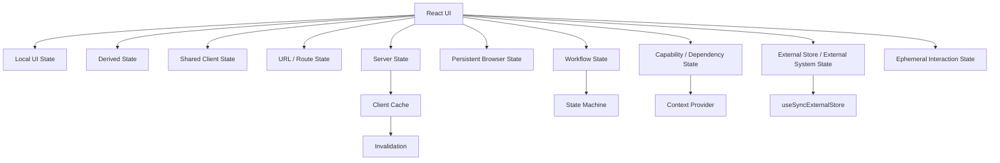
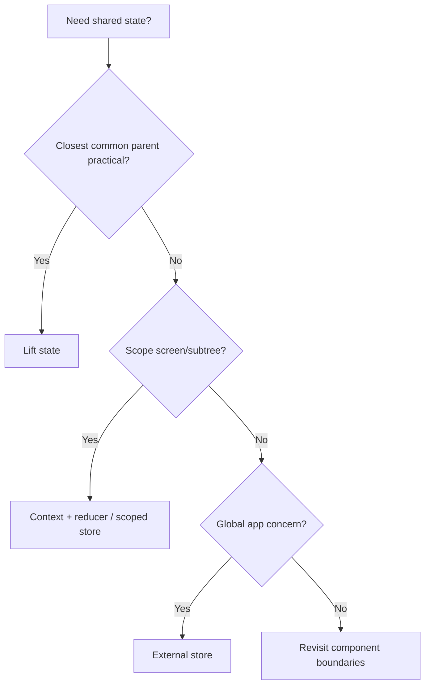
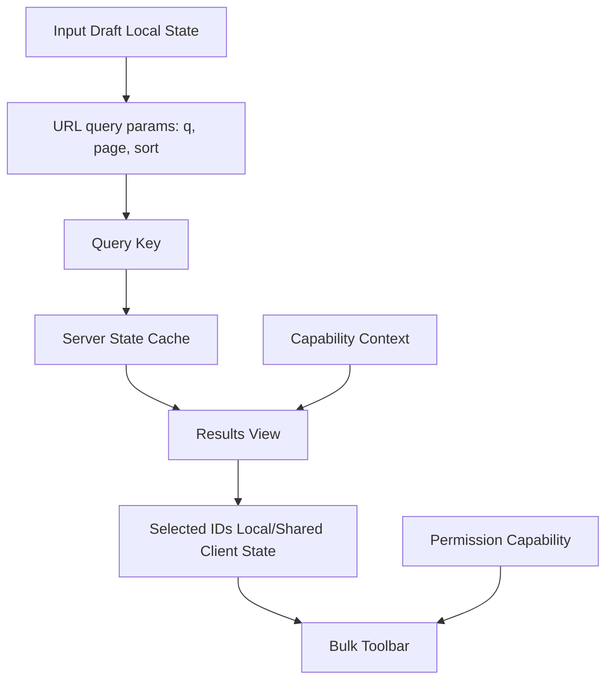
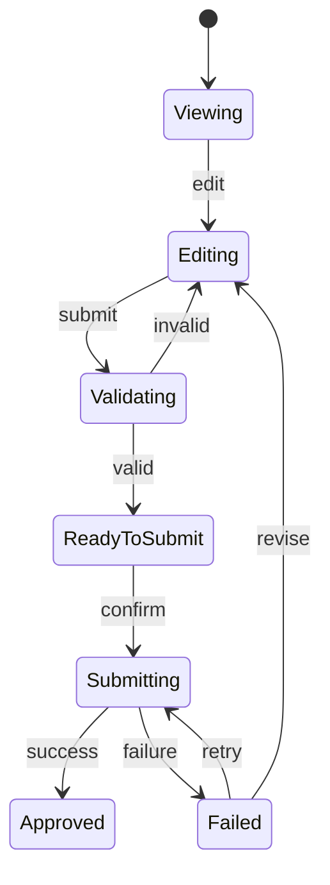
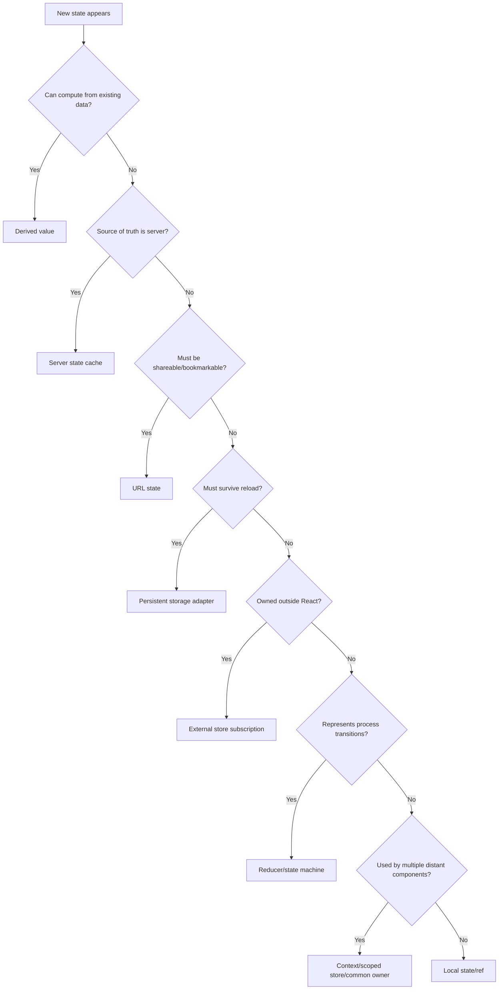

# Part 049 — State Taxonomy

State management yang matang dimulai bukan dari pertanyaan:

```txt
Pakai Redux, Zustand, Context, TanStack Query, atau useState?
```

Pertanyaan yang benar:

```txt
State apa ini?
Siapa owner-nya?
Berapa lama lifecycle-nya?
Siapa yang boleh mengubahnya?
Apakah data ini canonical atau derived?
Apakah sumber kebenarannya ada di client, URL, server, browser, atau external system?
Bagaimana invalidation-nya?
Apa failure mode paling mahal jika state ini salah tempat?
```

Banyak codebase React rusak bukan karena kekurangan library, tetapi karena semua jenis state diperlakukan sama.

```txt
UI toggle disimpan di global store.
Server response disimpan di context.
Form draft disamakan dengan entity canonical.
Permission diperlakukan sebagai boolean lokal.
URL filter disimpan hanya di component state.
Async mutation diperlakukan sebagai satu flag isLoading.
Workflow multi-step disusun dari 11 useState tanpa transition invariant.
```

Part ini membangun taxonomy. Tujuannya agar setiap state bisa ditempatkan secara defensible.

---

## 1. Definisi State di React

Dalam React, state adalah informasi yang memengaruhi output render sebuah component atau subtree.

Tetapi dalam arsitektur aplikasi, definisi itu belum cukup.

Kita butuh definisi operasional:

```txt
State adalah fakta sementara atau canonical yang memengaruhi UI,
memiliki owner,
lifecycle,
aturan update,
aturan invalidation,
dan konsekuensi ketika nilainya salah.
```

Beda jenis state punya konsekuensi berbeda.

```txt
Modal open salah -> annoying.
Permission salah -> security bug.
Cache server basi -> data integrity risk.
Form draft hilang -> user trust issue.
Workflow stuck -> business process failure.
URL state tidak sinkron -> shareability/back-navigation rusak.
```

Jadi taxonomy bukan teori. Ini alat risk management.

---

## 2. High-Level State Map



Setiap bucket punya rule berbeda.

```txt
Local state       -> dekatkan ke component yang memakai.
Shared state      -> naikkan ke owner bersama atau scoped store.
Derived state     -> hitung dari source, jangan duplikasi.
Server state      -> cache, revalidate, invalidate.
URL state         -> jadikan alamat UI yang shareable.
Persistent state  -> simpan hati-hati, versioning, privacy.
External state    -> subscribe dengan contract aman.
Workflow state    -> modelkan sebagai transition graph.
Capability state  -> pass sebagai dependency, bukan data volatile.
Ephemeral state   -> jangan naikkan jika tidak perlu.
```

---

## 3. Taxonomy Table

| Jenis State | Source of Truth | Owner Umum | Update Oleh | Lifecycle | Tool Umum |
|---|---|---|---|---|---|
| Local UI state | Component | Component | Event handler lokal | Selama component mounted | `useState`, `useReducer` |
| Derived state | State/props lain | Tidak canonical | Render calculation/selector | Mengikuti source | expression, selector, `useMemo` jika perlu |
| Shared client state | Client | Common parent / scoped provider / store | Domain command | Selama screen/app aktif | lifted state, context+reducer, Zustand/Redux |
| URL state | Browser URL/router | Route | Navigation/update params | Persist via history | router search params |
| Server state | Server | Server, mirrored by cache | Fetch/mutation/invalidation | Tergantung cache policy | TanStack Query, SWR, framework cache |
| Persistent browser state | Browser storage | Browser/client app | Persistence adapter | Across reload/session | localStorage, sessionStorage, IndexedDB |
| External system state | Non-React system | External source | External emitter/store | Outside React lifecycle | `useSyncExternalStore` |
| Workflow state | Process/UI machine | Workflow owner | Events/transitions | Sampai workflow selesai | reducer, state machine, XState |
| Capability/dependency state | Provider/config/env | App/scope provider | Rare update | Scope lifetime | context, DI provider |
| Ephemeral interaction state | Interaction | Component/DOM | Pointer/keyboard/timer | Very short | ref, local state, browser API |

---

## 4. Local UI State

Local state adalah state yang hanya relevan untuk satu component atau subtree kecil.

Contoh:

```txt
isPopoverOpen
activeTab dalam isolated Tabs
input draft lokal
hover/focus visual state
expanded row dalam table kecil
selected option dalam uncontrolled widget
```

Rule utama:

```txt
Jika state hanya dibaca dan diubah oleh satu component/subtree kecil,
jangan naikkan.
```

Local state sehat karena:

```txt
scope kecil,
rerender terbatas,
owner jelas,
test sederhana,
removal mudah,
dan tidak menciptakan coupling global.
```

### Contoh

```tsx
function Disclosure() {
  const [open, setOpen] = useState(false);

  return (
    <section>
      <button onClick={() => setOpen(value => !value)}>
        {open ? 'Hide' : 'Show'} details
      </button>
      {open ? <p>Advanced details...</p> : null}
    </section>
  );
}
```

Ini tidak butuh Context, Zustand, Redux, URL, atau query cache.

### Failure Mode

```tsx
// Buruk: state lokal dipromosikan ke global store tanpa alasan.
const open = useAppStore(state => state.sidebar.open);
const setOpen = useAppStore(state => state.sidebar.setOpen);
```

Jika `sidebar.open` hanya dipakai oleh satu layout shell, global store membuat state terlalu terlihat.

```txt
Visibility yang terlalu besar meningkatkan coupling.
Coupling meningkatkan biaya refactor.
```

---

## 5. Derived State

Derived state adalah nilai yang bisa dihitung dari source lain.

Contoh:

```txt
fullName = firstName + lastName
visibleItems = items filtered by query
isSubmitDisabled = !isValid || isPending
selectedItem = items.find(id)
totalPrice = cartLines sum
```

Rule utama:

```txt
Jika bisa dihitung secara deterministic dari state/props yang sudah ada,
jangan simpan sebagai state canonical.
```

### Buruk

```tsx
function CartSummary({ lines }: { lines: CartLine[] }) {
  const [total, setTotal] = useState(0);

  useEffect(() => {
    setTotal(lines.reduce((sum, line) => sum + line.price * line.qty, 0));
  }, [lines]);

  return <strong>{total}</strong>;
}
```

Masalah:

```txt
render pertama punya total lama/default,
ada extra render,
source of truth dobel,
effect dipakai untuk kalkulasi internal,
dan invariant total == sum(lines) bisa pecah sementara.
```

### Baik

```tsx
function CartSummary({ lines }: { lines: CartLine[] }) {
  const total = lines.reduce((sum, line) => sum + line.price * line.qty, 0);

  return <strong>{total}</strong>;
}
```

Jika kalkulasi mahal:

```tsx
const total = useMemo(() => computeExpensiveTotal(lines), [lines]);
```

Tetapi `useMemo` adalah cache, bukan state canonical.

---

## 6. Shared Client State

Shared client state dibutuhkan ketika beberapa component harus membaca/mengubah state yang sama.

Contoh:

```txt
selected rows di table + toolbar + bulk action dialog
wizard progress dibaca header/sidebar/content
draft filter dipakai filter panel + result summary
layout sidebar state dipakai shell + keyboard shortcut
cart lokal sebelum checkout
```

Pertanyaan penting:

```txt
Apakah state harus shared karena memang domain-nya shared,
atau karena component tree saat ini kebetulan menyulitkan props?
```

Jika hanya props drilling kecil, composition bisa cukup.
Jika banyak node unrelated butuh read/write, gunakan provider/store scoped.

### Shared State Options



### Lifted State

```tsx
function SearchPage() {
  const [selectedIds, setSelectedIds] = useState<Set<string>>(() => new Set());

  return (
    <>
      <ResultToolbar selectedCount={selectedIds.size} onClear={() => setSelectedIds(new Set())} />
      <ResultTable selectedIds={selectedIds} onSelectionChange={setSelectedIds} />
    </>
  );
}
```

Ini tepat jika owner bersama dekat dan tidak membuat parent terlalu gemuk.

---

## 7. Server State

Server state adalah data yang sumber kebenarannya ada di server.

Contoh:

```txt
user profile dari API
invoice list dari backend
permission policy dari auth service
case details dari regulatory case service
notification count dari server
```

Server state bukan client state.

Perbedaannya:

| Dimensi | Client State | Server State |
|---|---|---|
| Owner canonical | Browser/client | Server |
| Update | Event lokal | Mutation/network |
| Freshness | Selalu sesuai owner | Bisa stale |
| Conflict | Jarang | Mungkin |
| Invalidation | Biasanya tidak perlu | Wajib dipikirkan |
| Persistence | Optional | Di server |
| Failure | Logic/UI bug | Network, auth, concurrency, conflict |

### Buruk

```tsx
const UserContext = createContext<User | null>(null);
```

Lalu semua user profile API disimpan manual di context.

Masalah:

```txt
cache policy tidak jelas,
stale time tidak jelas,
refetch tidak standar,
mutation invalidation manual,
loading/error tersebar,
duplicate fetch mudah terjadi.
```

### Lebih Baik

Gunakan server-state cache abstraction.

```tsx
function useUserProfile(userId: string) {
  return useQuery({
    queryKey: ['user', userId],
    queryFn: () => fetchUserProfile(userId),
    staleTime: 60_000,
  });
}
```

Context boleh menyimpan capability seperti `currentUserId` atau `authSession`, tetapi entity server tetap sebaiknya melalui cache yang punya lifecycle.

---

## 8. URL State

URL state adalah state yang menjadi bagian dari alamat UI.

Contoh:

```txt
/search?q=react&page=2&sort=recent
/cases?status=open&assignee=me
/orders?tab=failed
/invoices/123?panel=history
```

URL state tepat ketika state perlu:

```txt
shareable,
bookmarkable,
back/forward-aware,
refresh-safe,
deep-linkable,
atau menjadi identity query server.
```

### Salah Tempat

```tsx
const [page, setPage] = useState(1);
const [sort, setSort] = useState('recent');
const [query, setQuery] = useState('');
```

Untuk search page production, ini membuat:

```txt
refresh reset filter,
copy URL tidak membawa context,
back button tidak bekerja benar,
analytics/navigation sulit,
query cache key terpisah dari route identity.
```

### Lebih Tepat

```tsx
function useSearchRouteState() {
  const [params, setParams] = useSearchParams();

  return {
    query: params.get('q') ?? '',
    page: Number(params.get('page') ?? 1),
    sort: params.get('sort') ?? 'recent',
    setQuery(query: string) {
      setParams(previous => {
        const next = new URLSearchParams(previous);
        next.set('q', query);
        next.set('page', '1');
        return next;
      });
    },
  };
}
```

URL adalah state container dengan semantics sendiri: serialization, history, navigation, dan shareability.

---

## 9. Persistent Browser State

Persistent browser state hidup melewati reload.

Contoh:

```txt
theme preference
sidebar collapsed preference
last selected workspace
draft offline form
feature onboarding dismissed
local-only queue
```

Rule utama:

```txt
Persist hanya state yang benar-benar boleh hidup melewati reload/session.
```

Pertanyaan keamanan:

```txt
Apakah data sensitif?
Apakah boleh dibaca extension/user lain?
Apakah ada expiry?
Apakah schema berubah antar versi?
Apakah data terkait user tertentu?
Apakah perlu clear saat logout?
```

### Adapter Pattern

Jangan taburkan `localStorage` di banyak component.

```tsx
function createJsonStorage<T>(key: string, fallback: T) {
  return {
    read(): T {
      const raw = window.localStorage.getItem(key);
      if (!raw) return fallback;
      try {
        return JSON.parse(raw) as T;
      } catch {
        return fallback;
      }
    },
    write(value: T) {
      window.localStorage.setItem(key, JSON.stringify(value));
    },
  };
}
```

Lalu bungkus dalam hook/provider yang jelas.

---

## 10. External Store State

External store state adalah state yang hidup di luar React tetapi UI perlu subscribe.

Contoh:

```txt
browser online/offline status
media query store
WebSocket connection state
legacy observable store
custom event emitter
shared worker state
multi-tab broadcast channel state
Zustand/Redux store
```

External store butuh contract:

```txt
getSnapshot harus mengembalikan snapshot konsisten.
subscribe harus cleanup.
React harus tahu kapan snapshot berubah.
SSR snapshot harus bisa disediakan jika perlu.
```

Pattern React modern untuk external subscription adalah `useSyncExternalStore`.

```tsx
function subscribe(callback: () => void) {
  window.addEventListener('online', callback);
  window.addEventListener('offline', callback);

  return () => {
    window.removeEventListener('online', callback);
    window.removeEventListener('offline', callback);
  };
}

function getSnapshot() {
  return navigator.onLine;
}

function useOnlineStatus() {
  return useSyncExternalStore(subscribe, getSnapshot, () => true);
}
```

Jangan pakai `useEffect + useState` untuk semua external source jika consistency dan concurrent rendering matters.

---

## 11. Workflow State

Workflow state adalah state yang merepresentasikan proses.

Contoh:

```txt
idle -> editing -> validating -> submitting -> succeeded
idle -> loading -> loaded -> refreshing -> failed
draft -> pendingApproval -> approved -> rejected
selecting -> confirming -> executing -> completed
```

Workflow state bukan sekadar banyak boolean.

### Buruk

```tsx
const [isLoading, setLoading] = useState(false);
const [isSubmitting, setSubmitting] = useState(false);
const [isSuccess, setSuccess] = useState(false);
const [error, setError] = useState<Error | null>(null);
```

Illegal state mudah muncul:

```txt
isLoading = true
isSuccess = true
error != null
isSubmitting = true
```

### Lebih Baik

```tsx
type SaveState =
  | { status: 'idle' }
  | { status: 'saving' }
  | { status: 'saved'; savedAt: Date }
  | { status: 'failed'; error: Error };
```

Workflow state perlu event dan transition.

```tsx
type SaveEvent =
  | { type: 'submit' }
  | { type: 'resolve'; savedAt: Date }
  | { type: 'reject'; error: Error }
  | { type: 'retry' };
```

Reducer atau state machine cocok untuk workflow.

---

## 12. Capability / Dependency State

Capability state bukan data domain volatile. Ini dependency yang component butuhkan untuk melakukan sesuatu.

Contoh:

```txt
analytics.track
permission.can
modal.open
toast.show
logger.error
clock.now
idGenerator.next
featureFlags.isEnabled
apiClient
```

Capability cocok dengan Context karena:

```txt
subtree butuh dependency,
value jarang berubah,
provider scope eksplisit,
test bisa override dependency,
dan consumer tidak perlu prop drilling capability ke semua lapisan.
```

### Contoh

```tsx
type PermissionCapability = {
  can(action: string, resource: string): boolean;
};

const PermissionContext = createContext<PermissionCapability | null>(null);

function usePermission() {
  const value = useContext(PermissionContext);
  if (!value) throw new Error('usePermission must be used inside PermissionProvider');
  return value;
}
```

Capability berbeda dari state permission entity server.

```txt
Policy data -> server/cache state.
can() API   -> capability interface.
```

---

## 13. Ephemeral Interaction State

Ephemeral state sangat pendek lifecycle-nya.

Contoh:

```txt
pointer down coordinates
drag hover target
last focused element
animation frame id
temporary timeout id
composing IME status
current AbortController
```

Banyak ephemeral state tidak perlu render.

Jika tidak memengaruhi JSX, gunakan ref.

```tsx
function DragBox() {
  const startRef = useRef<{ x: number; y: number } | null>(null);

  function onPointerDown(event: React.PointerEvent) {
    startRef.current = { x: event.clientX, y: event.clientY };
  }

  function onPointerUp() {
    startRef.current = null;
  }

  return <div onPointerDown={onPointerDown} onPointerUp={onPointerUp} />;
}
```

Jika state memengaruhi render, gunakan state.

```tsx
const [dragging, setDragging] = useState(false);
```

---

## 14. State Ownership Matrix

| Pertanyaan | Jawaban | Implikasi |
|---|---|---|
| Siapa yang paling tahu kapan state berubah? | Component lokal | local state |
| Siapa yang harus menjaga invariant? | Parent/domain boundary | lift/reducer |
| Apakah server adalah source of truth? | Ya | query/cache |
| Apakah URL harus mewakili state? | Ya | route/search params |
| Apakah value hanya dependency? | Ya | context capability |
| Apakah data datang dari non-React store? | Ya | external subscription |
| Apakah banyak boolean mewakili proses? | Ya | reducer/state machine |
| Apakah value hanya cache derivasi? | Ya | selector/useMemo |
| Apakah harus survive reload? | Ya | persistence adapter |
| Apakah hanya dibutuhkan selama pointer/timer? | Ya | ref/local ephemeral |

---

## 15. Lifecycle Matrix

| Lifecycle | State Type Candidate | Contoh |
|---|---|---|
| selama event saja | local variable | value hasil parse dalam handler |
| selama render saja | derived calculation | `isDisabled` |
| selama component mounted | local state/ref | popover open |
| selama screen aktif | lifted/context/reducer | selected rows |
| selama route aktif | URL + query cache | search filters |
| selama app session | scoped store/session storage | workspace preference |
| melewati reload | persistent storage | theme |
| controlled server | server cache | invoice details |
| controlled external source | external store | online status |
| controlled process | state machine | approval workflow |

---

## 16. Invalidation Matrix

State yang bagus punya invalidation rule.

| State Type | Invalidation Trigger |
|---|---|
| Local UI | unmount, reset action, key change |
| Derived | source berubah |
| Shared client | domain event/command |
| URL | navigation/history update |
| Server | stale time, mutation success, focus reconnect, explicit invalidate |
| Persistent | schema version, logout, expiry, user switch |
| External | external emitter/store update |
| Workflow | transition event, terminal state |
| Capability | provider scope change |
| Ephemeral | pointer up, timeout, cleanup |

Jika invalidation tidak bisa dijelaskan, state kemungkinan salah tempat.

---

## 17. Canonical vs Cached vs Derived

Tiga hal ini sering tercampur.

```txt
Canonical = sumber kebenaran.
Cached    = salinan untuk performa/freshness boundary.
Derived   = hasil hitung dari canonical/cached.
```

Contoh order list:

```txt
Server DB          -> canonical orders
TanStack Query     -> cached server state
visibleOrders      -> derived filtered list
selectedOrderIds   -> client state
page/sort/filter   -> URL state
```

Jangan jadikan semua canonical di client.

---

## 18. Example: Search Page Taxonomy



Taxonomy:

| Concern | State Type | Owner |
|---|---|---|
| `q`, `page`, `sort` | URL state | route |
| result data | server state | server/cache |
| selected IDs | shared client state | page boundary |
| input currently being typed | local draft | search box |
| permission check | capability | provider |
| loading/error | query lifecycle | query cache |

---

## 19. Example: Approval Workflow UI



Taxonomy:

| Concern | State Type |
|---|---|
| case data | server state |
| editable draft | local/shared client state |
| validation result | derived/workflow state |
| submit lifecycle | workflow state |
| permission to approve | capability + server policy cache |
| current route tab | URL state |
| toast/modal | capability/context + local overlay state |

---

## 20. Decision Tree



---

## 21. Smell Catalog

### Smell 1 — Everything in Context

```txt
Context contains user, permissions, invoices, filters, modal, toast,
selected IDs, loading flags, mutation errors, and form draft.
```

Diagnosis:

```txt
taxonomy missing.
```

Refactor:

```txt
server entities -> query cache
capabilities -> context
page filters -> URL
selection -> page/local state
workflow -> reducer/machine
```

### Smell 2 — Everything in URL

URL bagus untuk shareability, tapi buruk untuk high-frequency ephemeral changes.

Jangan masukkan pointer position, hover, intermediate keystroke draft, atau internal menu open state ke URL.

### Smell 3 — Everything in Global Store

Global store memperbesar visibility state.

Gunakan untuk state yang benar-benar global atau cross-cutting dengan value proposition jelas:

```txt
observability,
time travel,
cross-route coordination,
external access,
large shared client model,
team governance.
```

### Smell 4 — Effect as State Copier

```tsx
useEffect(() => {
  setLocalValue(props.value);
}, [props.value]);
```

Sering berarti ownership tidak jelas.

---

## 22. State Review Checklist

Gunakan ini saat code review.

```txt
[ ] State ini canonical, cached, derived, atau ephemeral?
[ ] Source of truth-nya jelas?
[ ] Owner-nya satu?
[ ] Update path-nya eksplisit?
[ ] Invalidation rule-nya tertulis?
[ ] Lifecycle-nya sesuai storage/hook/tool?
[ ] State ini perlu URL/shareability?
[ ] State ini server-owned?
[ ] State ini sebenarnya capability/dependency?
[ ] State ini bisa dihitung dari data lain?
[ ] Ada illegal state yang mungkin muncul?
[ ] Ada effect yang hanya menyalin state internal?
[ ] Ada hidden dependency lewat context/store?
[ ] Ada risiko stale cache/security/data integrity?
```

---

## 23. Practical Heuristics

### Heuristic A — Prefer Smallest Correct Scope

```txt
Letakkan state di scope terkecil yang masih bisa menjaga invariant.
```

Bukan selalu lokal. Bukan selalu global.

### Heuristic B — Owner Should Match Mutation Authority

State harus dimiliki oleh boundary yang punya hak menentukan transisinya.

```txt
Jika child hanya mengirim intent,
parent/domain boundary memutuskan next state.
```

### Heuristic C — Source of Truth Beats Convenience

Jangan memilih store karena nyaman.
Pilih berdasarkan source of truth.

### Heuristic D — URL Is Product Surface

Jika user menganggap kondisi UI sebagai “halaman”, maka URL harus mewakilinya.

### Heuristic E — Server State Needs Cache Semantics

Jika data datang dari server dan bisa stale, perlu cache semantics.

### Heuristic F — Workflow Needs Transition Semantics

Jika ada proses, jangan pakai boolean soup.

---

## 24. Mini Lab: Classify State

Untuk setiap state di bawah ini, tentukan taxonomy.

```txt
1. `isTooltipOpen`
2. `currentUser.profile`
3. `invoiceSearch.sort`
4. `checkoutStep`
5. `draftComment`
6. `onlineStatus`
7. `themePreference`
8. `canApproveCase`
9. `selectedTableRows`
10. `modalService.openConfirm`
```

Jawaban defensible:

| State | Taxonomy |
|---|---|
| `isTooltipOpen` | ephemeral/local UI |
| `currentUser.profile` | server state cache |
| `invoiceSearch.sort` | URL state jika shareable, local jika isolated |
| `checkoutStep` | workflow state |
| `draftComment` | local/persistent draft tergantung requirement |
| `onlineStatus` | external store/browser state |
| `themePreference` | persistent preference + capability to design system |
| `canApproveCase` | derived from permission capability and server policy data |
| `selectedTableRows` | shared page/client state |
| `modalService.openConfirm` | capability command + overlay local state |

---

## 25. Summary

State taxonomy adalah kemampuan arsitektural dasar React production.

Intinya:

```txt
Jangan mulai dari tool.
Mulai dari jenis state.
```

Taxonomy yang sehat membuat keputusan tool menjadi jelas.

```txt
Local UI state        -> useState/useReducer/ref.
Derived state         -> calculate/select.
Shared client state   -> lift/context/scoped store.
Server state          -> query/cache/invalidation.
URL state             -> router/search params.
Persistent state      -> storage adapter with versioning.
External state        -> useSyncExternalStore/subscription.
Workflow state        -> reducer/state machine.
Capability state      -> context/DI provider.
Ephemeral state       -> ref/local short lifecycle.
```

Part berikutnya akan memperdalam satu bucket pertama: **Local State Design**.
