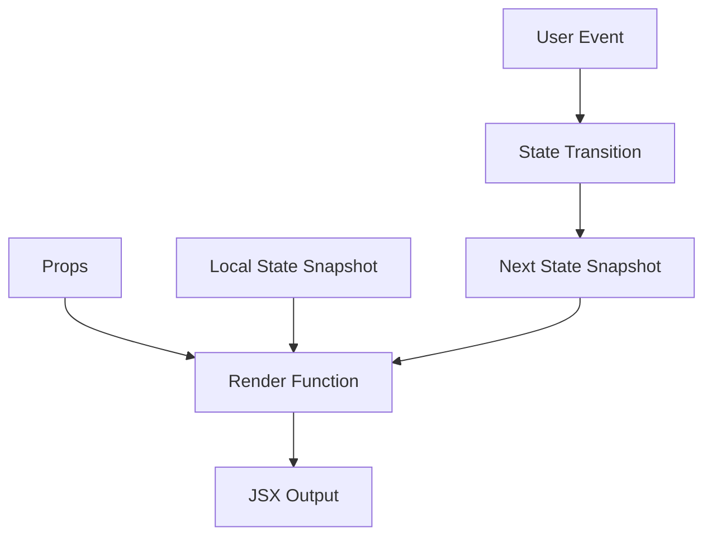
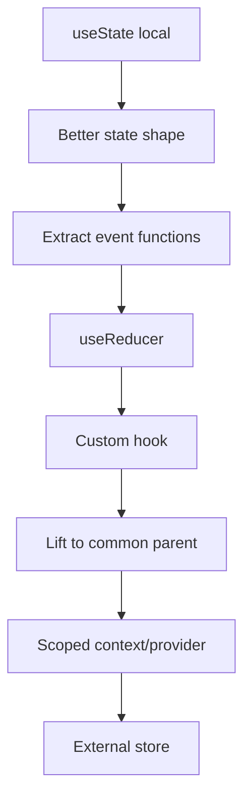

# Part 050 — Local State Design

Local state adalah pilihan default yang paling sering benar—selama scope-nya benar.

Tetapi local state juga bisa menjadi sumber bug jika:

```txt
state shape salah,
state duplikat,
setter tersebar,
boolean saling bertentangan,
reset semantics tidak jelas,
state lokal menyalin props tanpa kontrak,
atau local draft bercampur dengan canonical data.
```

Part ini membahas local state sebagai desain arsitektural kecil.

Bukan:

```txt
cara memanggil useState secara dasar.
```

Melainkan:

```txt
bagaimana merancang local state agar invariant jelas,
transisi terkendali,
rerender masuk akal,
reset predictable,
dan mudah dipromosikan jika suatu saat perlu shared scope.
```

---

## 1. Mental Model: Local State Adalah Memory Milik Boundary

Local state bukan “variabel component”.

Local state adalah memory yang React simpan untuk sebuah component identity.



Implikasi:

```txt
state tidak berubah di render yang sama,
setState meminta render berikutnya,
state terikat ke identity/position/key,
reset terjadi saat identity berubah,
dan owner state adalah component boundary yang mendeklarasikannya.
```

---

## 2. Kapan Local State Tepat?

Gunakan local state ketika:

```txt
state hanya dipakai oleh component/subtree kecil,
state tidak perlu shareable via URL,
state bukan canonical server data,
state tidak perlu survive reload,
state tidak dikelola external system,
state tidak membutuhkan observability global,
dan invariant bisa dijaga lokal.
```

Contoh bagus:

```txt
popover open/closed,
accordion section selected,
input draft sebelum commit,
local validation touched fields,
selected tab dalam isolated widget,
image preview loaded/error,
measurement result milik satu component,
transient edit mode dalam row.
```

---

## 3. Local State Co-location

Co-location berarti state diletakkan sedekat mungkin dengan UI yang membacanya dan event yang mengubahnya.

### Buruk: Parent Menyimpan Terlalu Banyak

```tsx
function Dashboard() {
  const [profileMenuOpen, setProfileMenuOpen] = useState(false);
  const [helpPopoverOpen, setHelpPopoverOpen] = useState(false);
  const [sidebarTooltipOpen, setSidebarTooltipOpen] = useState(false);

  return (
    <Shell
      profileMenuOpen={profileMenuOpen}
      onProfileMenuOpenChange={setProfileMenuOpen}
      helpPopoverOpen={helpPopoverOpen}
      onHelpPopoverOpenChange={setHelpPopoverOpen}
      sidebarTooltipOpen={sidebarTooltipOpen}
      onSidebarTooltipOpenChange={setSidebarTooltipOpen}
    />
  );
}
```

Parent menjadi dumping ground untuk state yang tidak perlu diketahui parent.

### Baik: State Dekat Pemakai

```tsx
function ProfileMenu() {
  const [open, setOpen] = useState(false);

  return (
    <Menu open={open} onOpenChange={setOpen}>
      <MenuButton>Profile</MenuButton>
      <MenuContent />
    </Menu>
  );
}
```

Rule:

```txt
State naik hanya ketika ada consumer atau invariant di atasnya.
```

---

## 4. Local State Shape

State shape menentukan seberapa mudah invariant dijaga.

React docs menyarankan beberapa prinsip struktur state:

```txt
kelompokkan state yang berubah bersama,
hindari kontradiksi,
hindari redundant state,
hindari duplikasi,
dan hindari nested state terlalu dalam.
```

Dalam production, kita bisa ubah menjadi rule engineering:

```txt
State shape harus membuat illegal state sulit atau tidak mungkin direpresentasikan.
```

---

## 5. Pisahkan State Independen

Jika dua nilai berubah independen, pisahkan.

```tsx
const [query, setQuery] = useState('');
const [showAdvanced, setShowAdvanced] = useState(false);
```

Ini lebih baik daripada:

```tsx
const [state, setState] = useState({
  query: '',
  showAdvanced: false,
});
```

Jika tidak ada invariant bersama, object state hanya membuat update lebih verbose.

---

## 6. Gabungkan State yang Berubah Bersama

Jika beberapa nilai selalu berubah sebagai satu transisi, gabungkan.

### Kurang Baik

```tsx
const [x, setX] = useState(0);
const [y, setY] = useState(0);

function onPointerMove(event: PointerEvent) {
  setX(event.clientX);
  setY(event.clientY);
}
```

### Lebih Baik

```tsx
const [position, setPosition] = useState({ x: 0, y: 0 });

function onPointerMove(event: React.PointerEvent) {
  setPosition({ x: event.clientX, y: event.clientY });
}
```

Kenapa?

```txt
x dan y adalah satu fakta: position.
```

---

## 7. Hindari Contradictory State

### Buruk

```tsx
const [isLoading, setIsLoading] = useState(false);
const [isSuccess, setIsSuccess] = useState(false);
const [isError, setIsError] = useState(false);
```

Illegal state:

```txt
isLoading = true
isSuccess = true
isError = true
```

### Baik

```tsx
type LoadState<T> =
  | { status: 'idle' }
  | { status: 'loading' }
  | { status: 'success'; data: T }
  | { status: 'error'; error: Error };

const [state, setState] = useState<LoadState<User>>({ status: 'idle' });
```

Sekarang UI bisa switch berdasarkan `status`.

```tsx
switch (state.status) {
  case 'idle':
    return <IdleView />;
  case 'loading':
    return <Spinner />;
  case 'success':
    return <Profile data={state.data} />;
  case 'error':
    return <ErrorView error={state.error} />;
}
```

---

## 8. Hindari Redundant State

### Buruk

```tsx
const [firstName, setFirstName] = useState('Ada');
const [lastName, setLastName] = useState('Lovelace');
const [fullName, setFullName] = useState('Ada Lovelace');
```

`fullName` redundant.

### Baik

```tsx
const fullName = `${firstName} ${lastName}`;
```

Rule:

```txt
Jika state B selalu bisa dihitung dari state A,
state B bukan state.
```

---

## 9. Hindari Duplicate State

### Buruk

```tsx
const [items, setItems] = useState<Item[]>(initialItems);
const [selectedItem, setSelectedItem] = useState<Item | null>(items[0]);
```

Jika `items` berubah, `selectedItem` bisa menunjuk object lama.

### Baik

```tsx
const [items, setItems] = useState<Item[]>(initialItems);
const [selectedId, setSelectedId] = useState(items[0]?.id ?? null);

const selectedItem = items.find(item => item.id === selectedId) ?? null;
```

Simpan identity minimal, derive object penuh.

---

## 10. Avoid Deeply Nested Local State

Deep update raw React state membuat update verbose dan rawan bug.

```tsx
setForm(previous => ({
  ...previous,
  address: {
    ...previous.address,
    city: nextCity,
  },
}));
```

Ini valid, tapi jika terlalu dalam, sinyal desain:

```txt
state terlalu besar,
boundary component bisa dipecah,
atau butuh reducer/form model.
```

Pilihan refactor:

```txt
split component,
split local state,
normalize shape,
use reducer,
gunakan form library jika domain form kompleks.
```

---

## 11. Draft State vs Canonical State

Draft state adalah local copy yang sengaja berbeda sementara dari canonical value.

Contoh valid:

```txt
edit form yang belum disubmit,
search box draft sebelum debounce/commit ke URL,
modal form yang bisa cancel,
inline row edit sebelum save,
wizard step local draft sebelum final submit.
```

Draft state harus punya contract:

```txt
initialization,
edit,
commit,
cancel,
reset when identity changes,
conflict when canonical changes externally.
```

### Contoh Draft yang Benar

```tsx
type UserDraft = {
  name: string;
  email: string;
};

function EditUserDialog({ user, open, onSave, onClose }: Props) {
  const [draft, setDraft] = useState<UserDraft>(() => ({
    name: user.name,
    email: user.email,
  }));

  function changeName(name: string) {
    setDraft(previous => ({ ...previous, name }));
  }

  function submit() {
    onSave({ id: user.id, ...draft });
  }

  return (
    <Dialog open={open} onClose={onClose}>
      <input value={draft.name} onChange={event => changeName(event.target.value)} />
      <button onClick={submit}>Save</button>
    </Dialog>
  );
}
```

Tetapi ada bug tersembunyi: jika `user.id` berubah sementara dialog tetap mounted, draft lama masih ada.

---

## 12. Reset Draft by Identity

Gunakan `key` ketika ingin reset state berdasarkan identity.

```tsx
function UserPage({ userId }: { userId: string }) {
  const user = useUser(userId);

  if (!user) return null;

  return <EditUserPanel key={user.id} user={user} />;
}
```

`key` menyatakan:

```txt
Ini instance state berbeda untuk user berbeda.
```

Ini lebih eksplisit daripada effect sync:

```tsx
// Hindari jika hanya untuk reset draft saat identity berubah.
useEffect(() => {
  setDraft(fromUser(user));
}, [user]);
```

Effect sync sering menghapus perubahan user secara tidak sengaja ketika prop object berubah identity.

---

## 13. Controlled vs Local Draft

Kadang component local draft perlu controlled dari parent.

### Local-only

```tsx
function SearchInput() {
  const [draft, setDraft] = useState('');
  return <input value={draft} onChange={event => setDraft(event.target.value)} />;
}
```

### Controlled

```tsx
function SearchInput({ value, onChange }: Props) {
  return <input value={value} onChange={event => onChange(event.target.value)} />;
}
```

### Controllable

```tsx
function useControllableState<T>({
  value,
  defaultValue,
  onChange,
}: {
  value?: T;
  defaultValue: T;
  onChange?: (value: T) => void;
}) {
  const [internalValue, setInternalValue] = useState(defaultValue);
  const controlled = value !== undefined;
  const currentValue = controlled ? value : internalValue;

  function setValue(next: T | ((previous: T) => T)) {
    const resolved = typeof next === 'function'
      ? (next as (previous: T) => T)(currentValue)
      : next;

    if (!controlled) {
      setInternalValue(resolved);
    }

    onChange?.(resolved);
  }

  return [currentValue, setValue] as const;
}
```

Controllable pattern valid untuk reusable component, tetapi jangan overuse untuk app-specific local state.

---

## 14. State Transitions, Not Random Setters

Setter mentah mudah bocor.

### Kurang Baik

```tsx
function InvoiceRow() {
  const [editing, setEditing] = useState(false);
  const [draft, setDraft] = useState('');
  const [error, setError] = useState<string | null>(null);

  return <Editor setEditing={setEditing} setDraft={setDraft} setError={setError} />;
}
```

Child bisa membuat kombinasi illegal.

### Lebih Baik

```tsx
function InvoiceRow() {
  const [state, setState] = useState<RowState>({ status: 'viewing' });

  function startEdit(currentValue: string) {
    setState({ status: 'editing', draft: currentValue, error: null });
  }

  function cancelEdit() {
    setState({ status: 'viewing' });
  }

  function failValidation(message: string) {
    setState(previous => {
      if (previous.status !== 'editing') return previous;
      return { ...previous, error: message };
    });
  }

  return <Editor onStartEdit={startEdit} onCancelEdit={cancelEdit} onInvalid={failValidation} />;
}
```

API lokal lebih kuat jika memakai domain event.

---

## 15. Kapan `useReducer` Lebih Baik dari `useState`?

Gunakan `useReducer` ketika:

```txt
state transition bercabang,
beberapa field berubah bersama,
ada invariant yang perlu dijaga,
event vocabulary lebih penting daripada setter,
state machine kecil mulai muncul,
atau update logic membuat component sulit dibaca.
```

### Sebelum

```tsx
const [status, setStatus] = useState<'idle' | 'editing' | 'saving' | 'failed'>('idle');
const [draft, setDraft] = useState('');
const [error, setError] = useState<string | null>(null);
```

### Sesudah

```tsx
type State =
  | { status: 'idle' }
  | { status: 'editing'; draft: string }
  | { status: 'saving'; draft: string }
  | { status: 'failed'; draft: string; error: string };

type Event =
  | { type: 'edit'; value: string }
  | { type: 'change'; value: string }
  | { type: 'submit' }
  | { type: 'resolve' }
  | { type: 'reject'; error: string }
  | { type: 'cancel' };

function reducer(state: State, event: Event): State {
  switch (event.type) {
    case 'edit':
      return { status: 'editing', draft: event.value };
    case 'change':
      if (state.status !== 'editing' && state.status !== 'failed') return state;
      return { status: 'editing', draft: event.value };
    case 'submit':
      if (state.status !== 'editing' && state.status !== 'failed') return state;
      return { status: 'saving', draft: state.draft };
    case 'resolve':
      return { status: 'idle' };
    case 'reject':
      if (state.status !== 'saving') return state;
      return { status: 'failed', draft: state.draft, error: event.error };
    case 'cancel':
      return { status: 'idle' };
  }
}
```

Reducer membuat transition graph eksplisit.

---

## 16. Local State and Refs

Tidak semua local memory harus state.

Gunakan state jika value memengaruhi render.
Gunakan ref jika value hanya dibutuhkan event/effect/imperative logic.

| Need | Use |
|---|---|
| tampil di JSX | state |
| trigger rerender | state |
| simpan timer id | ref |
| simpan AbortController | ref |
| simpan previous value untuk effect | ref |
| expose DOM node | ref |
| count render tanpa render ulang | ref |
| cache object expensive yang tidak reactive | ref/useMemo tergantung kasus |

### Contoh Timer

```tsx
function AutoCloseToast({ onClose }: { onClose: () => void }) {
  const timeoutRef = useRef<number | null>(null);

  useEffect(() => {
    timeoutRef.current = window.setTimeout(onClose, 3000);

    return () => {
      if (timeoutRef.current !== null) {
        window.clearTimeout(timeoutRef.current);
      }
    };
  }, [onClose]);

  return <div role="status">Saved</div>;
}
```

Timer id tidak perlu render, jadi ref.

---

## 17. Local State Reset Semantics

Reset state harus disengaja.

Ada beberapa cara reset:

```txt
explicit reset event,
key remount,
identity-scoped component,
controlled prop from parent,
form reset,
navigation unmount.
```

### Explicit Reset

```tsx
function FilterPanel() {
  const initialState = { query: '', onlyOpen: false };
  const [filters, setFilters] = useState(initialState);

  function reset() {
    setFilters(initialState);
  }

  return <button onClick={reset}>Reset</button>;
}
```

Pastikan `initialState` tidak mutable shared object jika akan dimodifikasi.

### Key Reset

```tsx
<Editor key={documentId} document={document} />
```

Gunakan saat state instance memang berbeda untuk identity berbeda.

---

## 18. Local State Initialization

Jika initializer mahal, gunakan lazy initializer.

```tsx
const [items, setItems] = useState(() => buildInitialItems(rawItems));
```

Lazy initializer hanya dipakai untuk initial render component identity.

Jangan mengira initializer berjalan ulang saat prop berubah.

```tsx
function Editor({ user }: { user: User }) {
  const [draft] = useState(() => fromUser(user));
  // Tidak otomatis reset saat user berubah.
}
```

Jika identity berubah harus reset, pakai `key` atau explicit event.

---

## 19. Local State and Object Updates

React state harus diperlakukan immutable.

### Buruk

```tsx
user.name = nextName;
setUser(user);
```

Masalah:

```txt
object identity sama,
React mungkin tidak melihat perubahan,
render snapshot rusak,
mutation menyebar ke tempat lain,
time-travel/debugging sulit.
```

### Baik

```tsx
setUser(previous => ({
  ...previous,
  name: nextName,
}));
```

Untuk array:

```tsx
setItems(previous =>
  previous.map(item =>
    item.id === id ? { ...item, selected: !item.selected } : item
  )
);
```

---

## 20. State Update Function: Always Consider Previous State

Jika next state bergantung pada previous state, gunakan updater function.

### Buruk

```tsx
setCount(count + 1);
setCount(count + 1);
setCount(count + 1);
```

Dalam satu event snapshot, `count` sama.

### Baik

```tsx
setCount(value => value + 1);
setCount(value => value + 1);
setCount(value => value + 1);
```

Rule:

```txt
Jika update = f(previous), gunakan updater.
```

---

## 21. Local State and Async Boundaries

Async handler menangkap snapshot render saat handler dibuat.

### Bug

```tsx
async function submit() {
  setSaving(true);
  await save(draft);
  setSaving(false);
  setMessage(`Saved ${draft}`);
}
```

Jika user mengubah draft saat request berjalan, message bisa merujuk snapshot lama atau lifecycle tidak jelas.

### Lebih Eksplisit

```tsx
async function submit() {
  const submittedDraft = draft;

  setState({ status: 'saving', draft: submittedDraft });

  try {
    await save(submittedDraft);
    setState({ status: 'saved', draft: submittedDraft });
  } catch (error) {
    setState({ status: 'failed', draft: submittedDraft, error: toMessage(error) });
  }
}
```

Untuk race yang lebih kompleks, gunakan request id/AbortController/reducer.

---

## 22. Race Guard Pattern

```tsx
function usePreview(markdown: string) {
  const [state, setState] = useState<PreviewState>({ status: 'idle' });
  const requestIdRef = useRef(0);

  useEffect(() => {
    const requestId = ++requestIdRef.current;
    setState({ status: 'loading' });

    renderMarkdown(markdown).then(
      html => {
        if (requestIdRef.current !== requestId) return;
        setState({ status: 'success', html });
      },
      error => {
        if (requestIdRef.current !== requestId) return;
        setState({ status: 'error', error });
      },
    );
  }, [markdown]);

  return state;
}
```

Tetapi untuk server state fetching, prefer query/cache library. Race guard lokal cocok untuk local async computation atau external integration kecil.

---

## 23. Local State Performance

Local state biasanya baik untuk performance karena scope rerender kecil.

Tetapi beberapa pola buruk:

```txt
state terlalu tinggi,
object state besar berubah sering,
setter memicu parent besar rerender,
high-frequency pointer state ditaruh di React state,
derived expensive calculation tanpa profiling,
context membawa local volatile state ke subtree besar.
```

### Turunkan State

```tsx
function Page() {
  return (
    <>
      <HeavyReport />
      <LocalFilterBox />
    </>
  );
}

function LocalFilterBox() {
  const [open, setOpen] = useState(false);
  return <FilterPopover open={open} onOpenChange={setOpen} />;
}
```

Jangan letakkan `open` di `Page` jika tidak perlu.

### Gunakan Ref untuk High-Frequency Non-Visual Data

Pointer tracking mentah bisa disimpan ref dan hanya commit state pada frame tertentu.

---

## 24. Local State Testing

Local state dites lewat behavior, bukan implementation detail.

### Buruk

```txt
expect(component.state.open).toBe(true)
```

### Baik

```tsx
await user.click(screen.getByRole('button', { name: /open/i }));
expect(screen.getByRole('dialog')).toBeInTheDocument();
```

Untuk reducer lokal, test reducer langsung.

```tsx
expect(reducer({ status: 'idle' }, { type: 'edit', value: 'A' })).toEqual({
  status: 'editing',
  draft: 'A',
});
```

Test invariant:

```txt
submit dari idle tidak boleh masuk saving,
reject hanya valid dari saving,
cancel selalu kembali idle,
change hanya valid saat editing/failed.
```

---

## 25. Local State Refactor Ladder

Saat local state tumbuh, jangan langsung lompat ke global store.



Urutan ini menjaga kompleksitas naik bertahap.

### Stage 1 — Simple Local State

```tsx
const [open, setOpen] = useState(false);
```

### Stage 2 — Named Transitions

```tsx
function openDialog() {
  setOpen(true);
}

function closeDialog() {
  setOpen(false);
}
```

### Stage 3 — Reducer

```tsx
const [state, dispatch] = useReducer(reducer, initialState);
```

### Stage 4 — Custom Hook

```tsx
function useInvoiceEditor(invoice: Invoice) {
  const [state, dispatch] = useReducer(reducer, invoice, createInitialState);

  return {
    state,
    startEdit: () => dispatch({ type: 'startEdit' }),
    changeDraft: (patch: DraftPatch) => dispatch({ type: 'changeDraft', patch }),
    cancel: () => dispatch({ type: 'cancel' }),
  };
}
```

### Stage 5 — Lift/Provider

Baru naik jika lebih dari satu boundary butuh koordinasi.

---

## 26. Local State Smells

### Smell 1 — Boolean Soup

```tsx
const [isOpen, setOpen] = useState(false);
const [isEditing, setEditing] = useState(false);
const [isSaving, setSaving] = useState(false);
const [isFailed, setFailed] = useState(false);
```

Refactor ke union state atau reducer.

### Smell 2 — Prop Sync Effect

```tsx
useEffect(() => {
  setValue(propValue);
}, [propValue]);
```

Tanya:

```txt
Ini controlled component?
Ini draft reset by identity?
Ini derived value?
```

### Smell 3 — State Object Terlalu Besar

Jika satu `formState` mengandung semua UI, server result, modal, focus, selected row, dan error, taxonomy hilang.

### Smell 4 — Local State Dibaca Terlalu Jauh

Jika state lokal mulai diprop-drill ke 5 level, mungkin owner harus naik atau boundary harus diubah.

### Smell 5 — Local State Menyimpan Server Entity

```tsx
const [invoice, setInvoice] = useState(fetchedInvoice);
```

Valid hanya jika itu draft edit. Jika bukan draft, server cache harus jadi owner.

---

## 27. Example: Local Editable Row

### Requirement

```txt
Table row bisa masuk edit mode.
User bisa mengubah amount dan note.
Cancel mengembalikan nilai awal.
Save menjalankan async mutation.
Saat saving, input disabled.
Jika save gagal, draft tetap ada dan error tampil.
```

### State Model

```tsx
type RowState =
  | { status: 'viewing' }
  | { status: 'editing'; draft: Draft }
  | { status: 'saving'; draft: Draft }
  | { status: 'failed'; draft: Draft; error: string };
```

### Reducer

```tsx
type RowEvent =
  | { type: 'edit'; initial: Draft }
  | { type: 'change'; patch: Partial<Draft> }
  | { type: 'cancel' }
  | { type: 'submit' }
  | { type: 'resolve' }
  | { type: 'reject'; error: string };

function rowReducer(state: RowState, event: RowEvent): RowState {
  switch (event.type) {
    case 'edit':
      return { status: 'editing', draft: event.initial };
    case 'change':
      if (state.status !== 'editing' && state.status !== 'failed') return state;
      return { status: 'editing', draft: { ...state.draft, ...event.patch } };
    case 'cancel':
      return { status: 'viewing' };
    case 'submit':
      if (state.status !== 'editing' && state.status !== 'failed') return state;
      return { status: 'saving', draft: state.draft };
    case 'resolve':
      return { status: 'viewing' };
    case 'reject':
      if (state.status !== 'saving') return state;
      return { status: 'failed', draft: state.draft, error: event.error };
  }
}
```

### Hook

```tsx
function useEditableRow(initial: Draft, save: (draft: Draft) => Promise<void>) {
  const [state, dispatch] = useReducer(rowReducer, { status: 'viewing' });

  async function submit() {
    if (state.status !== 'editing' && state.status !== 'failed') return;

    const draft = state.draft;
    dispatch({ type: 'submit' });

    try {
      await save(draft);
      dispatch({ type: 'resolve' });
    } catch (error) {
      dispatch({ type: 'reject', error: toMessage(error) });
    }
  }

  return {
    state,
    startEdit: () => dispatch({ type: 'edit', initial }),
    change: (patch: Partial<Draft>) => dispatch({ type: 'change', patch }),
    cancel: () => dispatch({ type: 'cancel' }),
    submit,
  };
}
```

Catatan: untuk mutation server state production, integrasikan dengan mutation library. Reducer lokal tetap useful untuk draft dan local workflow UI.

---

## 28. Example: Search Draft Commit to URL

Draft input lokal, URL canonical untuk search result.

```tsx
function SearchBox({ value, onCommit }: { value: string; onCommit: (query: string) => void }) {
  const [draft, setDraft] = useState(value);

  function submit(event: React.FormEvent) {
    event.preventDefault();
    onCommit(draft.trim());
  }

  return (
    <form onSubmit={submit}>
      <input value={draft} onChange={event => setDraft(event.target.value)} />
      <button>Search</button>
    </form>
  );
}
```

Jika `value` berubah karena navigasi browser, reset by key:

```tsx
<SearchBox key={urlQuery} value={urlQuery} onCommit={setUrlQuery} />
```

Ini lebih eksplisit daripada effect sync.

---

## 29. Checklist Local State Design

```txt
[ ] Apakah state ini benar-benar local?
[ ] Apakah ada consumer di luar subtree kecil?
[ ] Apakah state ini bisa dihitung dari props/state lain?
[ ] Apakah state shape menghindari illegal state?
[ ] Apakah field yang berubah bersama digabung?
[ ] Apakah field independen dipisah?
[ ] Apakah object/array update immutable?
[ ] Apakah updater function dipakai saat bergantung previous state?
[ ] Apakah draft punya commit/cancel/reset semantics?
[ ] Apakah reset by identity memakai key atau explicit event?
[ ] Apakah async lifecycle punya race/cleanup strategy?
[ ] Apakah ref dipakai untuk mutable value yang tidak memengaruhi render?
[ ] Apakah reducer perlu untuk transition yang kompleks?
[ ] Apakah setter mentah bocor ke child?
[ ] Apakah test memverifikasi behavior dan invariant?
```

---

## 30. Summary

Local state adalah unit terkecil state architecture.

Desain yang baik mengikuti prinsip:

```txt
co-locate by default,
lift only when necessary,
store canonical facts only,
derive what can be derived,
model impossible states out,
name transitions,
use reducer when invariant grows,
use ref for non-render memory,
reset state intentionally,
and promote scope gradually.
```

Local state yang baik membuat aplikasi lebih mudah dipahami karena setiap boundary kecil punya memory dan aturan transisi yang jelas.

Part berikutnya akan membahas ketika state memang perlu naik: **Lifted State Design**.
