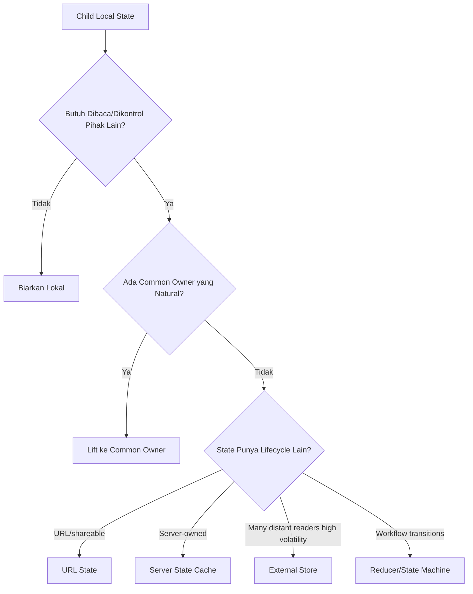
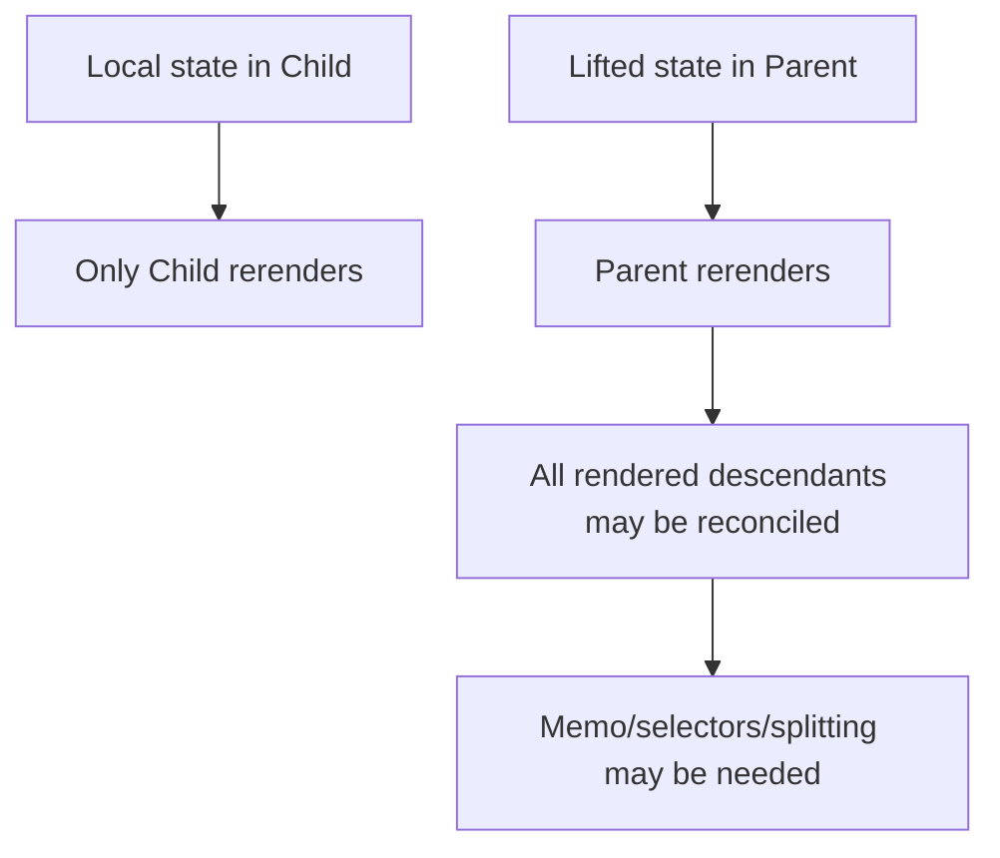

# Part 051 — Lifted State Design

Lifted state adalah salah satu pola React paling sederhana, tetapi di codebase besar ia sering berubah menjadi salah satu sumber kompleksitas paling mahal.

Bukan karena lifting state itu salah.

Masalahnya: banyak engineer menganggap lifting state hanya berarti “pindahkan `useState` ke parent”. Padahal secara arsitektural, lifting state berarti **memindahkan ownership**.

Ketika state diangkat, yang berpindah bukan hanya value. Yang ikut berpindah adalah:

```txt
source of truth,
transition authority,
validation rule,
reset semantics,
performance blast radius,
API contract child,
dan tanggung jawab orchestration.
```

React menyarankan shared state dipindahkan ke closest common parent ketika beberapa component harus berubah bersama. Tetapi di aplikasi production, “closest common parent” bukan hanya node terdekat di JSX tree. Ia harus menjadi **nearest component yang secara domain memang pantas memiliki keputusan tersebut**.

Part ini membahas lifted state sebagai desain ownership, bukan sekadar refactor mekanis.

---

## 1. Problem yang Diselesaikan Lifted State

Misal dua sibling harus konsisten:

```tsx
function FilterPanel() {
  const [query, setQuery] = useState('');
  return <input value={query} onChange={(e) => setQuery(e.target.value)} />;
}

function ResultSummary() {
  // Butuh query yang sama, tapi tidak bisa mengakses state sibling.
  return <p>Showing result for ...</p>;
}
```

State di `FilterPanel` terlalu rendah karena `ResultSummary` juga membutuhkan state itu.

Solusi dasar:

```tsx
function SearchPage() {
  const [query, setQuery] = useState('');

  return (
    <>
      <FilterPanel query={query} onQueryChange={setQuery} />
      <ResultSummary query={query} />
    </>
  );
}
```

Ini benar secara mekanik, tapi belum tentu benar secara desain.

Pertanyaan sebenarnya:

```txt
Apakah SearchPage memang pemilik query?
Apakah query bagian dari URL?
Apakah query harus survive reload?
Apakah query harus trigger server query?
Apakah query sekadar draft lokal sebelum submit?
Apakah summary butuh committed query atau live draft query?
```

Jika pertanyaan ini tidak dijawab, lifting state bisa menghasilkan state yang “terlihat bekerja” tetapi sulit dijaga ketika fitur bertambah.

---

## 2. Mental Model: Lifting State = Ownership Migration



Lift state jika:

```txt
1. dua atau lebih component harus membaca state yang sama,
2. satu component harus mengontrol component lain,
3. transition satu component harus memengaruhi component lain,
4. state lokal menyebabkan duplicated source of truth,
5. parent perlu menegakkan invariant lintas child.
```

Jangan lift state jika:

```txt
1. state hanya dipakai untuk detail interaksi internal child,
2. parent tidak punya alasan domain untuk tahu state itu,
3. state sangat volatile dan parent besar akan rerender mahal,
4. state sebenarnya milik URL/server/cache/workflow engine,
5. lifting hanya dilakukan agar callback lebih mudah ditulis.
```

---

## 3. Closest Common Parent vs Correct Owner

Dokumentasi React menjelaskan pola paling umum: pindahkan shared state ke closest common parent.

Tetapi dalam aplikasi besar, ada dua jenis parent:

```txt
structural parent = parent karena JSX tree
semantic owner    = parent karena domain responsibility
```

Contoh structural parent yang buruk:

```tsx
function LayoutShell() {
  const [selectedInvoiceId, setSelectedInvoiceId] = useState<string | null>(null);

  return (
    <AppChrome>
      <InvoiceList selectedId={selectedInvoiceId} onSelect={setSelectedInvoiceId} />
      <InvoicePreview invoiceId={selectedInvoiceId} />
    </AppChrome>
  );
}
```

`LayoutShell` hanya layout. Ia tidak pantas tahu invoice selection.

Lebih baik:

```tsx
function InvoiceWorkspace() {
  const [selectedInvoiceId, setSelectedInvoiceId] = useState<string | null>(null);

  return (
    <SplitPane>
      <InvoiceList selectedId={selectedInvoiceId} onSelect={setSelectedInvoiceId} />
      <InvoicePreview invoiceId={selectedInvoiceId} />
    </SplitPane>
  );
}
```

`InvoiceWorkspace` adalah semantic owner: ia merepresentasikan screen/workspace yang memang mengatur relasi list-preview.

Rule:

```txt
Lift state to the nearest component that owns the decision, not merely the nearest JSX ancestor.
```

---

## 4. Anatomy of Lifted State

Lifted state yang sehat memiliki lima bagian:

```txt
1. canonical value
2. transition function / command
3. read model untuk child
4. event contract dari child
5. reset/invalidation rule
```

Contoh buruk:

```tsx
function Parent() {
  const [filters, setFilters] = useState({ status: 'open', assignee: null });

  return <FilterPanel filters={filters} setFilters={setFilters} />;
}
```

Masalah:

```txt
Child bisa mengubah shape apa pun.
Parent kehilangan kontrol invariant.
Tidak jelas transition apa yang valid.
Sulit audit, test, dan refactor.
```

Lebih baik:

```tsx
type FilterState = {
  status: 'open' | 'closed' | 'all';
  assigneeId: string | null;
};

function SearchPage() {
  const [filters, setFilters] = useState<FilterState>({
    status: 'open',
    assigneeId: null,
  });

  function changeStatus(status: FilterState['status']) {
    setFilters((current) => ({
      ...current,
      status,
      // invariant: closed items ignore assignee filter in this product rule
      assigneeId: status === 'closed' ? null : current.assigneeId,
    }));
  }

  function changeAssignee(assigneeId: string | null) {
    setFilters((current) => ({ ...current, assigneeId }));
  }

  return (
    <FilterPanel
      value={filters}
      onStatusChange={changeStatus}
      onAssigneeChange={changeAssignee}
    />
  );
}
```

State lifted bukan berarti child mendapat setter mentah. Child harus mendapat **event/command API** yang menjaga invariant parent.

---

## 5. Lifted State Pattern 1: Controlled Child

Controlled child adalah bentuk paling umum dari lifted state.

```tsx
type SearchBoxProps = {
  value: string;
  onValueChange: (next: string) => void;
};

function SearchBox({ value, onValueChange }: SearchBoxProps) {
  return (
    <input
      value={value}
      onChange={(event) => onValueChange(event.target.value)}
      placeholder="Search cases"
    />
  );
}
```

Parent menjadi owner:

```tsx
function CaseSearchPage() {
  const [query, setQuery] = useState('');

  return (
    <>
      <SearchBox value={query} onValueChange={setQuery} />
      <ResultSummary query={query} />
    </>
  );
}
```

Ini cocok ketika:

```txt
parent perlu membaca value,
parent perlu reset value,
parent perlu menyimpan value ke URL/cache,
parent perlu membuat beberapa child konsisten,
parent perlu validate atau normalize input.
```

Tetapi controlled child bisa menjadi terlalu chatty jika value berubah setiap keystroke dan parent subtree besar.

---

## 6. Lifted State Pattern 2: Draft Local, Commit Up

Tidak semua value perlu dilift secara live. Banyak UI enterprise membutuhkan draft lokal dan commit event.

Contoh:

```tsx
type AssigneeEditorProps = {
  assigneeId: string | null;
  onCommit: (nextAssigneeId: string | null) => Promise<void> | void;
};

function AssigneeEditor({ assigneeId, onCommit }: AssigneeEditorProps) {
  const [draft, setDraft] = useState(assigneeId);
  const [isSaving, setIsSaving] = useState(false);

  useEffect(() => {
    setDraft(assigneeId);
  }, [assigneeId]);

  async function save() {
    setIsSaving(true);
    try {
      await onCommit(draft);
    } finally {
      setIsSaving(false);
    }
  }

  return (
    <section>
      <AssigneeSelect value={draft} onChange={setDraft} />
      <button disabled={isSaving || draft === assigneeId} onClick={save}>
        Save
      </button>
    </section>
  );
}
```

Di sini ada prop-to-state sync. Biasanya ini warning smell, tetapi valid jika kontraknya jelas:

```txt
prop = committed canonical value
draft = editable local copy
onCommit = request to change canonical value
prop change = external canonical reset
```

Lebih eksplisit:

```tsx
function AssigneeEditor({ assigneeId, revision, onCommit }: AssigneeEditorProps & { revision: number }) {
  const [draft, setDraft] = useState(assigneeId);

  useEffect(() => {
    setDraft(assigneeId);
  }, [assigneeId, revision]);

  // ...
}
```

`revision` membuat reset semantics jelas ketika canonical data refresh dari server.

Rule:

```txt
Lift canonical value; keep temporary edit buffers local when parent does not need every intermediate keystroke.
```

---

## 7. Lifted State Pattern 3: Mediator Parent

Mediator parent mengatur koordinasi antar child tanpa membuat child saling tahu.

```tsx
function CaseWorkspace() {
  const [selectedCaseId, setSelectedCaseId] = useState<string | null>(null);
  const [activePanel, setActivePanel] = useState<'summary' | 'timeline' | 'evidence'>('summary');

  function selectCase(caseId: string) {
    setSelectedCaseId(caseId);
    setActivePanel('summary');
  }

  return (
    <WorkspaceLayout>
      <CaseList selectedCaseId={selectedCaseId} onCaseSelect={selectCase} />
      <CaseDetail caseId={selectedCaseId} activePanel={activePanel} onPanelChange={setActivePanel} />
    </WorkspaceLayout>
  );
}
```

`CaseList` tidak tahu bahwa selecting case mereset active panel. `CaseDetail` tidak tahu list exists. Parent mengatur invariant orchestration:

```txt
when selectedCase changes, activePanel must reset to summary
```

Jika invariant bertambah, reducer lebih baik:

```tsx
type WorkspaceState = {
  selectedCaseId: string | null;
  activePanel: 'summary' | 'timeline' | 'evidence';
};

type WorkspaceEvent =
  | { type: 'case.selected'; caseId: string }
  | { type: 'panel.changed'; panel: WorkspaceState['activePanel'] };

function reducer(state: WorkspaceState, event: WorkspaceEvent): WorkspaceState {
  switch (event.type) {
    case 'case.selected':
      return { selectedCaseId: event.caseId, activePanel: 'summary' };
    case 'panel.changed':
      return { ...state, activePanel: event.panel };
  }
}
```

Reducer membuat lifted state menjadi explicit transition system.

---

## 8. Lifted State Pattern 4: Split Canonical and View State

Sering terjadi state “diangkat terlalu besar” karena semua dianggap satu object.

Buruk:

```tsx
const [tableState, setTableState] = useState({
  filters: {},
  sort: { field: 'createdAt', direction: 'desc' },
  selectedRows: [],
  hoveredRowId: null,
  columnWidths: {},
  isColumnMenuOpen: false,
});
```

Tidak semua property punya lifecycle sama.

Pisahkan:

```tsx
function CaseTableController() {
  const [queryState, setQueryState] = useState({
    filters: {},
    sort: { field: 'createdAt', direction: 'desc' as const },
  });

  const [selectionState, setSelectionState] = useState<Set<string>>(() => new Set());

  return (
    <CaseTable
      queryState={queryState}
      onQueryStateChange={setQueryState}
      selectedIds={selectionState}
      onSelectedIdsChange={setSelectionState}
    />
  );
}
```

Lalu biarkan state yang murni visual tetap lokal di table atau row:

```txt
hovered row,
open row action menu,
measurement,
column drag draft,
focus roving index.
```

Rule:

```txt
Lift the smallest state that must be shared. Do not lift unrelated interaction details just because they live in the same widget.
```

---

## 9. Lifting Decision Matrix

| Pertanyaan | Jika Ya | Implikasi |
|---|---|---|
| Apakah sibling perlu value yang sama? | Lift ke nearest correct owner | Parent menjadi source of truth |
| Apakah parent harus reset child? | Controlled child atau key reset | Reset semantics harus eksplisit |
| Apakah value harus shareable/bookmarkable? | URL state | Jangan simpan canonical di local state saja |
| Apakah value berasal dari backend? | Server state cache | Local hanya draft/selection/optimistic patch |
| Apakah banyak distant readers? | Context/external store | Hindari prop drilling ekstrem |
| Apakah transition punya invariant kompleks? | Reducer/state machine | Jangan pakai raw setter scattered |
| Apakah value berubah sangat sering? | Keep local / external fine-grained store | Hindari parent rerender besar |
| Apakah hanya detail visual child? | Keep local | Parent tidak perlu tahu |

---

## 10. State Shape After Lifting

Saat state masih lokal, shape boleh sederhana. Setelah lifted, shape harus lebih disiplin.

Buruk:

```tsx
const [selected, setSelected] = useState<any>(null);
```

Lebih baik:

```tsx
type SelectionState =
  | { kind: 'none' }
  | { kind: 'single'; id: string }
  | { kind: 'multi'; ids: Set<string> };
```

Kenapa?

Karena lifted state biasanya dibaca banyak component. Jika shape ambigu, ambiguity menyebar.

Contoh invariant:

```txt
none  => detail panel empty
single => detail panel shows one entity
multi => bulk action bar visible, detail panel hidden
```

Implementasi:

```tsx
function CaseWorkspace() {
  const [selection, setSelection] = useState<SelectionState>({ kind: 'none' });

  return (
    <>
      <CaseList selection={selection} onSelectionChange={setSelection} />
      {selection.kind === 'single' ? <CaseDetail id={selection.id} /> : null}
      {selection.kind === 'multi' ? <BulkActionBar ids={selection.ids} /> : null}
    </>
  );
}
```

Lifted state harus membuat illegal states sulit direpresentasikan.

---

## 11. Event Contract untuk Child

Jangan expose `setState` ketika child hanya boleh meminta intent tertentu.

Buruk:

```tsx
<CaseList selection={selection} setSelection={setSelection} />
```

Lebih baik:

```tsx
<CaseList
  selection={selection}
  onCaseSelected={(id) => dispatch({ type: 'case.selected', id })}
  onCaseToggled={(id) => dispatch({ type: 'case.toggled', id })}
  onSelectionCleared={() => dispatch({ type: 'selection.cleared' })}
/>
```

Child API menjadi domain-specific.

Checklist callback:

```txt
Apakah callback merepresentasikan intent, bukan implementation?
Apakah payload minimal tapi cukup?
Apakah parent dapat menjaga invariant?
Apakah callback punya timing jelas?
Apakah callback sync/async?
Apakah child perlu tahu return value?
```

---

## 12. Derived State Setelah Lifting

Saat state diangkat, godaan membuat derived state baru meningkat.

Buruk:

```tsx
const [items, setItems] = useState<Item[]>([]);
const [selectedId, setSelectedId] = useState<string | null>(null);
const [selectedItem, setSelectedItem] = useState<Item | null>(null);
```

`selectedItem` adalah derived dari `items + selectedId`.

Lebih baik:

```tsx
const selectedItem = items.find((item) => item.id === selectedId) ?? null;
```

Jika expensive:

```tsx
const itemById = useMemo(() => {
  return new Map(items.map((item) => [item.id, item]));
}, [items]);

const selectedItem = selectedId ? itemById.get(selectedId) ?? null : null;
```

Rule:

```txt
When lifting state, lift identifiers and canonical facts. Derive views near readers.
```

---

## 13. Reset Semantics

Lifted state sering butuh reset ketika parent entity berubah.

Contoh bug:

```tsx
function CaseWorkspace({ organizationId }: { organizationId: string }) {
  const [selectedCaseId, setSelectedCaseId] = useState<string | null>(null);

  return <CaseDetail organizationId={organizationId} caseId={selectedCaseId} />;
}
```

Ketika `organizationId` berubah, `selectedCaseId` lama mungkin tidak valid.

Solusi event transition:

```tsx
useEffect(() => {
  setSelectedCaseId(null);
}, [organizationId]);
```

Ini valid karena state harus disinkronkan dengan external prop boundary. Tetapi lebih baik bila perubahan organization diproses sebagai event di owner yang sama:

```tsx
type State = {
  organizationId: string;
  selectedCaseId: string | null;
};

type Event =
  | { type: 'organization.changed'; organizationId: string }
  | { type: 'case.selected'; caseId: string };

function reducer(state: State, event: Event): State {
  switch (event.type) {
    case 'organization.changed':
      return { organizationId: event.organizationId, selectedCaseId: null };
    case 'case.selected':
      return { ...state, selectedCaseId: event.caseId };
  }
}
```

Atau gunakan `key` untuk reset subtree:

```tsx
<OrganizationWorkspace key={organizationId} organizationId={organizationId} />
```

Pilih `key` reset jika seluruh subtree memang harus dianggap instance baru.

---

## 14. Performance Blast Radius

Saat state diangkat, rerender scope membesar.



Contoh masalah:

```tsx
function Dashboard() {
  const [hoveredPoint, setHoveredPoint] = useState<Point | null>(null);

  return (
    <>
      <HugeChart hoveredPoint={hoveredPoint} onHover={setHoveredPoint} />
      <ExpensiveSidebar />
      <AuditTimeline />
    </>
  );
}
```

Hover berubah puluhan kali per detik. Jika diangkat ke dashboard besar, UI bisa berat.

Refactor:

```tsx
function Dashboard() {
  return (
    <>
      <ChartRegion />
      <ExpensiveSidebar />
      <AuditTimeline />
    </>
  );
}

function ChartRegion() {
  const [hoveredPoint, setHoveredPoint] = useState<Point | null>(null);

  return <HugeChart hoveredPoint={hoveredPoint} onHover={setHoveredPoint} />;
}
```

Jika sibling kecil butuh hover:

```tsx
function ChartRegion() {
  const [hoveredPoint, setHoveredPoint] = useState<Point | null>(null);

  return (
    <>
      <HugeChart hoveredPoint={hoveredPoint} onHover={setHoveredPoint} />
      <PointTooltip point={hoveredPoint} />
    </>
  );
}
```

Rule:

```txt
Lift to the smallest owner that satisfies communication, not to the largest page because it is convenient.
```

---

## 15. When Lifted State Should Become Context

Lifting via props is best when the state path is short and explicit.

Context mulai masuk akal ketika:

```txt
many components in subtree need same value,
prop drilling hides actual component API,
the value is capability/configuration-like,
there is a natural provider boundary,
updates are not too high-frequency,
or state can be split into stable actions and volatile values.
```

Contoh:

```tsx
function CaseWorkspace() {
  const [selection, dispatch] = useReducer(selectionReducer, initialSelection);

  return (
    <SelectionProvider value={selection} dispatch={dispatch}>
      <CaseList />
      <CaseToolbar />
      <CaseDetailRegion />
    </SelectionProvider>
  );
}
```

Tetapi jangan jadikan context sebagai shortcut agar tidak perlu desain owner.

Context tidak menghapus ownership; context hanya mengubah cara value didistribusikan.

---

## 16. When Lifted State Should Become URL State

Jika lifted state mulai butuh hal-hal ini:

```txt
shareable link,
bookmark,
back/forward navigation,
reload persistence,
server-side route awareness,
deep link to same UI state,
```

maka kemungkinan besar state itu bukan sekadar lifted state. Ia adalah URL state.

Contoh candidate:

```txt
search query,
filters,
sort,
page,
active tab yang merepresentasikan route/section,
selected entity id pada master-detail,
view mode.
```

Bukan candidate umum:

```txt
input draft sebelum submit,
hover,
modal temporary internal state,
unsaved form field values,
focus index,
menu open state.
```

Part 052 akan membahas URL state secara detail.

---

## 17. When Lifted State Should Become Server State

Jika state sebenarnya berasal dari backend, jangan membuat local lifted copy sebagai canonical.

Buruk:

```tsx
const [caseDetail, setCaseDetail] = useState<CaseDetail | null>(null);
```

Jika `caseDetail` diambil dari API dan punya freshness/invalidation rule, ia bukan client state. Ia server state.

Lebih baik:

```tsx
const caseQuery = useCaseDetailQuery(caseId);
```

Local/lifted state boleh menyimpan:

```txt
selectedCaseId,
expandedSections,
local draft patch,
optimistic temporary marker,
mutation pending state jika belum dikelola library.
```

Canonical case data tetap milik server/cache layer.

---

## 18. Refactor Recipe: From Local to Lifted

Mulai dari child lokal:

```tsx
function TogglePanel() {
  const [open, setOpen] = useState(false);

  return <button onClick={() => setOpen((x) => !x)}>{open ? 'Close' : 'Open'}</button>;
}
```

Langkah 1 — pisahkan controlled view:

```tsx
type TogglePanelViewProps = {
  open: boolean;
  onOpenChange: (open: boolean) => void;
};

function TogglePanelView({ open, onOpenChange }: TogglePanelViewProps) {
  return <button onClick={() => onOpenChange(!open)}>{open ? 'Close' : 'Open'}</button>;
}
```

Langkah 2 — buat uncontrolled wrapper jika masih dibutuhkan:

```tsx
function TogglePanel() {
  const [open, setOpen] = useState(false);
  return <TogglePanelView open={open} onOpenChange={setOpen} />;
}
```

Langkah 3 — parent bisa mengontrol:

```tsx
function Parent() {
  const [openPanel, setOpenPanel] = useState<'filters' | 'summary' | null>(null);

  return (
    <>
      <TogglePanelView
        open={openPanel === 'filters'}
        onOpenChange={(open) => setOpenPanel(open ? 'filters' : null)}
      />
      <TogglePanelView
        open={openPanel === 'summary'}
        onOpenChange={(open) => setOpenPanel(open ? 'summary' : null)}
      />
    </>
  );
}
```

Sekarang invariant “hanya satu panel terbuka” dimiliki parent.

---

## 19. Refactor Recipe: From Lifted `useState` to Reducer

Jika lifted state mulai punya banyak setter:

```tsx
const [selectedId, setSelectedId] = useState<string | null>(null);
const [mode, setMode] = useState<'view' | 'edit'>('view');
const [dirty, setDirty] = useState(false);
const [error, setError] = useState<string | null>(null);
```

Dan transition tersebar:

```tsx
setSelectedId(id);
setMode('view');
setDirty(false);
setError(null);
```

Gunakan reducer:

```tsx
type State = {
  selectedId: string | null;
  mode: 'view' | 'edit';
  dirty: boolean;
  error: string | null;
};

type Event =
  | { type: 'record.selected'; id: string }
  | { type: 'edit.started' }
  | { type: 'field.changed' }
  | { type: 'save.failed'; message: string }
  | { type: 'save.succeeded' };

function reducer(state: State, event: Event): State {
  switch (event.type) {
    case 'record.selected':
      return { selectedId: event.id, mode: 'view', dirty: false, error: null };
    case 'edit.started':
      return { ...state, mode: 'edit', error: null };
    case 'field.changed':
      return { ...state, dirty: true };
    case 'save.failed':
      return { ...state, error: event.message };
    case 'save.succeeded':
      return { ...state, mode: 'view', dirty: false, error: null };
  }
}
```

Reducer adalah tanda bahwa ownership bukan lagi hanya value sharing, tetapi workflow coordination.

---

## 20. Lifted State and Async Commands

Ketika child meminta command async ke parent, child dan parent harus sepakat mengenai lifecycle.

Buruk:

```tsx
function DeleteButton({ onDelete }: { onDelete: () => Promise<void> }) {
  return <button onClick={onDelete}>Delete</button>;
}
```

Tidak jelas:

```txt
siapa memegang pending?
siapa menangani error?
apakah button disabled saat pending?
apakah double click allowed?
apakah parent bisa reject?
```

Lebih baik:

```tsx
type DeleteButtonProps = {
  disabled?: boolean;
  pending?: boolean;
  onDeleteRequested: () => void;
};

function DeleteButton({ disabled, pending, onDeleteRequested }: DeleteButtonProps) {
  return (
    <button disabled={disabled || pending} onClick={onDeleteRequested}>
      {pending ? 'Deleting...' : 'Delete'}
    </button>
  );
}
```

Parent:

```tsx
function CaseActions({ caseId }: { caseId: string }) {
  const [pending, setPending] = useState(false);

  async function deleteCase() {
    if (pending) return;

    setPending(true);
    try {
      await api.deleteCase(caseId);
      // navigate, invalidate query, close modal, etc.
    } finally {
      setPending(false);
    }
  }

  return <DeleteButton pending={pending} onDeleteRequested={deleteCase} />;
}
```

The child emits intent. Parent owns command lifecycle.

---

## 21. Anti-Pattern: Lift Everything to the Page

A common page component failure:

```tsx
function Page() {
  const [search, setSearch] = useState('');
  const [filters, setFilters] = useState({});
  const [selectedId, setSelectedId] = useState(null);
  const [modalOpen, setModalOpen] = useState(false);
  const [hoveredRow, setHoveredRow] = useState(null);
  const [editingCell, setEditingCell] = useState(null);
  const [columnWidths, setColumnWidths] = useState({});
  const [toast, setToast] = useState(null);

  return <VeryLargeTree />;
}
```

This creates a “page god component”.

Symptoms:

```txt
setters passed through many layers,
page rerenders for tiny interactions,
state names become generic,
invariants are not centralized,
child components are not reusable,
testing requires rendering whole page,
refactor becomes risky.
```

Better architecture:

```txt
Page orchestration state:
  selected entity id, active route/tab, query params

Feature region state:
  table selection, panel open, form draft

Component local state:
  hover, menu open, measurement, focus

External/server state:
  API data, cache freshness, mutations

Capability context:
  modal, toast, analytics, permission service
```

---

## 22. Anti-Pattern: Under-Lifting

Opposite bug: state remains too low.

```tsx
function StatusFilter() {
  const [status, setStatus] = useState('open');
  return <Select value={status} onChange={setStatus} />;
}

function ResultList() {
  // fetches without knowing status
}
```

Symptoms:

```txt
sibling cannot reflect state,
API query does not match UI controls,
URL does not match visible state,
summary/count incorrect,
duplicated state appears elsewhere,
effects added to sync components indirectly.
```

Refactor by asking:

```txt
Who needs this value?
Who changes it?
Who must remain consistent with it?
What external representation must reflect it?
```

Then move it to the correct owner.

---

## 23. Testing Lifted State

Test behavior, not implementation.

Example:

```tsx
it('resets active panel when selecting another case', async () => {
  render(<CaseWorkspace />);

  await user.click(screen.getByRole('button', { name: /case a/i }));
  await user.click(screen.getByRole('tab', { name: /timeline/i }));

  expect(screen.getByRole('tabpanel', { name: /timeline/i })).toBeVisible();

  await user.click(screen.getByRole('button', { name: /case b/i }));

  expect(screen.getByRole('tabpanel', { name: /summary/i })).toBeVisible();
});
```

This tests the invariant, not whether `useState` or `useReducer` was used.

For reducer:

```tsx
it('resets panel on case selection', () => {
  const state = { selectedCaseId: 'a', activePanel: 'timeline' } as const;

  expect(reducer(state, { type: 'case.selected', caseId: 'b' })).toEqual({
    selectedCaseId: 'b',
    activePanel: 'summary',
  });
});
```

Reducer tests are cheap because transition logic is pure.

---

## 24. Debugging Protocol

When lifted state behaves incorrectly, inspect in this order:

```txt
1. Is there more than one source of truth?
2. Is state owned by the correct semantic owner?
3. Is child receiving raw setter instead of intent callback?
4. Is derived data stored as state?
5. Is reset rule explicit?
6. Is async command lifecycle owned by one place?
7. Is the state actually URL/server/external/workflow state?
8. Is performance issue caused by too-large rerender boundary?
9. Is child mixing controlled and uncontrolled mode?
10. Is key causing accidental remount/reset?
```

---

## 25. Production Checklist

Before lifting state, answer:

```txt
What invariant becomes possible after lifting?
Which component owns the decision?
Which components read the value?
Which components emit intents?
Is the lifted value canonical or draft?
Should value live in URL instead?
Should value live in server-state cache instead?
Does parent need every intermediate update?
What resets the state?
What happens during async pending/error?
How large is rerender blast radius?
How will this be tested?
```

---

## 26. Summary

Lifted state is not “state moved upward”. It is ownership migration.

Good lifted state has:

```txt
clear owner,
minimal scope,
explicit source of truth,
intent-based callbacks,
smallest necessary rerender boundary,
well-defined reset semantics,
no duplicated derived state,
and transition logic that protects invariants.
```

Bad lifted state creates:

```txt
god page components,
setter leakage,
expensive rerenders,
implicit workflow,
duplicated canonical data,
and components that cannot be reused outside their current parent.
```

The top-level decision is simple:

```txt
Lift state only when it improves consistency, ownership, or orchestration.
Do not lift state merely because it is convenient to access from somewhere else.
```

---

## References

- React Docs — Sharing State Between Components: https://react.dev/learn/sharing-state-between-components
- React Docs — Choosing the State Structure: https://react.dev/learn/choosing-the-state-structure
- React Docs — State as a Snapshot: https://react.dev/learn/state-as-a-snapshot
- React Docs — Preserving and Resetting State: https://react.dev/learn/preserving-and-resetting-state
- React Docs — Extracting State Logic into a Reducer: https://react.dev/learn/extracting-state-logic-into-a-reducer
