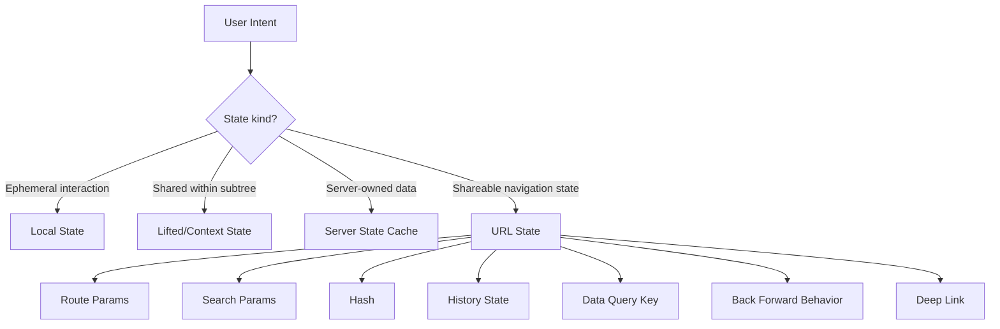
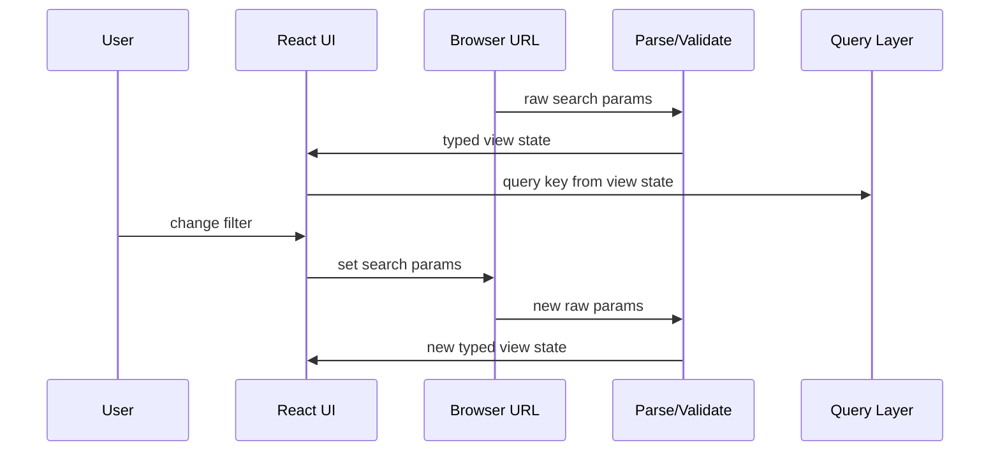

# Part 052 — URL State

URL state adalah state yang hidup di address bar.

Bukan karena kita ingin terlihat “RESTful”. Bukan karena query string terlihat rapi. URL state adalah desain ownership: beberapa state UI seharusnya dimiliki oleh browser navigation model, bukan oleh `useState` di component.

Jika sebuah state harus:

```txt
bisa dibookmark,
bisa dishare,
bisa survive reload,
terintegrasi dengan back/forward,
menentukan data yang di-fetch,
atau merepresentasikan lokasi pengguna dalam aplikasi,
```

maka kemungkinan besar state itu harus masuk URL.

Part ini membahas URL state sebagai **canonical UI state boundary**, bukan sekadar teknik `useSearchParams`.

---

## 1. Mental Model



URL state should answer:

```txt
What screen am I on?
What resource am I looking at?
What filters/sort/page define this view?
What sub-view is active?
Can another user open this same state from a link?
```

Local state should answer:

```txt
What temporary interaction is happening right now?
What field draft has not been committed?
What menu is open?
What item is hovered?
What focus index is active?
```

---

## 2. URL State Types

| Type | Example | Use For | Avoid For |
|---|---|---|---|
| Path param | `/cases/CASE-123` | Resource identity | Temporary UI detail |
| Search param | `/cases?status=open&page=2` | Filter/sort/pagination/view state | Sensitive/large objects |
| Hash | `/docs#section-4` | In-page anchor/fragment | App data that needs validation |
| History state | navigation internal state | Non-shareable route transition context | Canonical data |

Most app-level URL state lives in:

```txt
path params + search params
```

Path param identifies **where** you are. Search param identifies **how** you are viewing it.

Example:

```txt
/regulatory/cases/CASE-123?tab=evidence&version=latest
```

Interpretation:

```txt
resource      = CASE-123
active tab    = evidence
view version  = latest
```

---

## 3. What Belongs in URL State

Good candidates:

```txt
search query after commit,
filters,
sort,
pagination cursor/page,
selected resource id,
active tab when it represents meaningful section,
view mode: table/card/map,
date range,
comparison mode,
report period,
workspace id,
locale when URL-addressable,
feature preview flags intended to be shareable.
```

Bad candidates:

```txt
passwords,
access tokens,
PII or sensitive data,
large JSON blobs,
raw form draft,
unsaved validation errors,
hover state,
focus state,
open dropdown state,
transient modal animation state,
AbortController/timer handles,
non-serializable objects.
```

Grey-area candidates:

```txt
modal open state,
selected row,
active wizard step,
form draft,
expanded accordion,
```

They depend on product semantics.

A modal for `/cases/123/delete` may be URL state if it is route-addressable and should survive refresh. A small tooltip/modal for confirming local row action may stay local.

---

## 4. Why `useState` Alone Is Wrong for URL-Owned State

Example:

```tsx
function CaseListPage() {
  const [status, setStatus] = useState('open');
  const [page, setPage] = useState(1);

  const cases = useCases({ status, page });

  return <CaseTable cases={cases} />;
}
```

Problems:

```txt
Reload loses filter.
Link cannot share current view.
Back button does not restore filter changes.
Browser history does not represent user navigation.
Analytics may see ambiguous page state.
Server rendering/router cannot know intended view.
```

If the URL is:

```txt
/cases?status=closed&page=3
```

but component local state says:

```txt
status = open
page = 1
```

there are two sources of truth. One must win. For URL-owned state, URL wins.

---

## 5. URL as Source of Truth

The clean pattern:

```txt
URL search params → parse → validated view state → render/query → user intent → serialize → update URL
```



Do not maintain duplicated canonical local state:

```tsx
const [status, setStatus] = useState(searchParams.get('status') ?? 'open');
```

This creates sync problems.

Instead derive from URL on each render:

```tsx
const status = parseStatus(searchParams.get('status'));
```

Then update URL when user changes it.

---

## 6. React Router Pattern

React Router's `useSearchParams` returns current `URLSearchParams` and a setter. Setting search params causes navigation.

Basic:

```tsx
import { useSearchParams } from 'react-router';

function CaseListPage() {
  const [searchParams, setSearchParams] = useSearchParams();

  const status = parseStatus(searchParams.get('status'));
  const page = parsePositiveInt(searchParams.get('page'), 1);

  function changeStatus(nextStatus: CaseStatus) {
    setSearchParams((current) => {
      const next = new URLSearchParams(current);
      next.set('status', nextStatus);
      next.delete('page'); // reset page when filter changes
      return next;
    });
  }

  function changePage(nextPage: number) {
    setSearchParams((current) => {
      const next = new URLSearchParams(current);
      next.set('page', String(nextPage));
      return next;
    });
  }

  return (
    <CaseListView
      status={status}
      page={page}
      onStatusChange={changeStatus}
      onPageChange={changePage}
    />
  );
}
```

Important: reset dependent params inside the same URL transition.

Changing `status` while keeping `page=12` may produce empty results if page 12 only existed for old filter.

---

## 7. Next.js App Router Pattern

In Next.js App Router, `useSearchParams` is a Client Component hook that reads current query string as a read-only `URLSearchParams`-like interface. Updating usually goes through router navigation.

Example:

```tsx
'use client';

import { usePathname, useRouter, useSearchParams } from 'next/navigation';

function CaseFilters() {
  const router = useRouter();
  const pathname = usePathname();
  const searchParams = useSearchParams();

  const status = parseStatus(searchParams.get('status'));

  function changeStatus(nextStatus: CaseStatus) {
    const next = new URLSearchParams(searchParams.toString());
    next.set('status', nextStatus);
    next.delete('page');

    router.replace(`${pathname}?${next.toString()}`);
  }

  return <StatusSelect value={status} onChange={changeStatus} />;
}
```

Use `replace` when the change is a refinement and should not spam browser history. Use `push` when it represents meaningful navigation step.

Example:

```txt
typing in search draft       -> local state
press Enter / Apply filters  -> router.push/replace URL
changing page                -> push or replace depending product expectation
changing sort                -> replace usually okay
opening detail route         -> push
```

---

## 8. Raw Params Are Untrusted Input

URL is user-editable. Treat it like external input.

Bad:

```tsx
const page = Number(searchParams.get('page'));
```

Could be:

```txt
NaN
0
-1
999999999999999999
<script>
```

Better:

```tsx
function parsePositiveInt(value: string | null, fallback: number): number {
  if (value == null) return fallback;

  const parsed = Number(value);

  if (!Number.isInteger(parsed)) return fallback;
  if (parsed < 1) return fallback;
  if (parsed > 500) return fallback;

  return parsed;
}
```

For enum:

```tsx
const statuses = ['open', 'closed', 'all'] as const;
type CaseStatus = (typeof statuses)[number];

function parseStatus(value: string | null): CaseStatus {
  if (value && statuses.includes(value as CaseStatus)) {
    return value as CaseStatus;
  }

  return 'open';
}
```

Rule:

```txt
URL decode -> validate -> normalize -> use typed state.
Never let raw params leak into domain logic.
```

---

## 9. Canonicalization

Canonicalization means different equivalent URLs should collapse into one stable representation.

Examples:

```txt
/cases?page=1&status=open
/cases?status=open
```

If `page=1` is default, maybe omit it.

```tsx
function encodeCaseListParams(state: CaseListViewState): URLSearchParams {
  const params = new URLSearchParams();

  if (state.status !== 'open') {
    params.set('status', state.status);
  }

  if (state.page !== 1) {
    params.set('page', String(state.page));
  }

  if (state.query.trim()) {
    params.set('q', state.query.trim());
  }

  return params;
}
```

Canonicalization benefits:

```txt
fewer duplicate URLs,
cleaner share links,
better analytics aggregation,
more stable query keys,
fewer accidental cache variants,
easier testing.
```

But do not remove params that are semantically meaningful even if they equal a common default in a specific context.

---

## 10. Serialization Strategy

Search params are strings. Your app state is not.

You need a serializer boundary.

```tsx
type CaseListViewState = {
  q: string;
  status: 'open' | 'closed' | 'all';
  page: number;
  sort: {
    field: 'createdAt' | 'priority' | 'assignee';
    direction: 'asc' | 'desc';
  };
  assigneeIds: string[];
};
```

Decode:

```tsx
function decodeCaseListParams(params: URLSearchParams): CaseListViewState {
  return {
    q: params.get('q')?.trim() ?? '',
    status: parseStatus(params.get('status')),
    page: parsePositiveInt(params.get('page'), 1),
    sort: parseSort(params.get('sort')),
    assigneeIds: parseStringList(params.getAll('assignee')),
  };
}
```

Encode:

```tsx
function encodeCaseListParams(state: CaseListViewState): URLSearchParams {
  const params = new URLSearchParams();

  if (state.q) params.set('q', state.q);
  if (state.status !== 'open') params.set('status', state.status);
  if (state.page !== 1) params.set('page', String(state.page));

  params.set('sort', `${state.sort.field}:${state.sort.direction}`);

  for (const id of state.assigneeIds) {
    params.append('assignee', id);
  }

  return params;
}
```

Notice `append` for repeated params:

```txt
/cases?assignee=u1&assignee=u2
```

Alternative comma encoding:

```txt
/cases?assignee=u1,u2
```

Repeated params are often easier because `URLSearchParams` directly supports `getAll`.

---

## 11. Search Params and Query Keys

Server-state cache keys should derive from parsed URL state, not raw unvalidated params.

Bad:

```tsx
const cases = useCases(searchParams.toString());
```

Problems:

```txt
param order changes cache key,
invalid params create useless cache entries,
default params duplicate cache,
raw string hides meaning.
```

Better:

```tsx
const viewState = decodeCaseListParams(searchParams);

const query = useCasesQuery({
  status: viewState.status,
  page: viewState.page,
  q: viewState.q,
  sort: viewState.sort,
  assigneeIds: viewState.assigneeIds,
});
```

Or:

```tsx
const queryKey = ['cases', canonicalizeCaseListViewState(viewState)] as const;
```

URL state defines query intent. Query cache owns fetched data.

Do not put fetched data into the URL. Do not put raw URL params directly into domain data fetching without validation.

---

## 12. Draft vs Committed URL State

Search input is a classic trap.

Bad UX:

```tsx
<input value={qFromUrl} onChange={(e) => updateUrl(e.target.value)} />
```

Every keystroke mutates URL and maybe fires query/navigation.

Often better:

```tsx
function SearchBox({ committedQuery, onCommit }: {
  committedQuery: string;
  onCommit: (query: string) => void;
}) {
  const [draft, setDraft] = useState(committedQuery);

  useEffect(() => {
    setDraft(committedQuery);
  }, [committedQuery]);

  return (
    <form
      onSubmit={(event) => {
        event.preventDefault();
        onCommit(draft.trim());
      }}
    >
      <input value={draft} onChange={(event) => setDraft(event.target.value)} />
      <button type="submit">Search</button>
    </form>
  );
}
```

Parent:

```tsx
function CaseListPage() {
  const [searchParams, setSearchParams] = useSearchParams();
  const viewState = decodeCaseListParams(searchParams);

  function commitQuery(query: string) {
    const next = { ...viewState, q: query, page: 1 };
    setSearchParams(encodeCaseListParams(next));
  }

  return <SearchBox committedQuery={viewState.q} onCommit={commitQuery} />;
}
```

Mental model:

```txt
input draft      = local state
committed search = URL state
results data     = server state cache
```

This separation prevents typing from becoming navigation spam.

---

## 13. Back/Forward Semantics

URL state must respect browser history.

Ask:

```txt
Should every change create a history entry?
Should back undo each filter change?
Should back leave the page instead?
Should typing create history entries? Usually no.
```

Guideline:

| User action | Usually use | Reason |
|---|---|---|
| Open detail page | push | Meaningful navigation |
| Change tab representing section | push or replace | Product-dependent |
| Apply filter form | push or replace | Depends whether back should undo |
| Type draft | local only | Not navigation |
| Change page | push often | Back returns previous page |
| Change sort | replace often | Refinement, not location |
| Toggle view mode | replace often | View preference |

There is no universal answer. The important part is intentionality.

---

## 14. Dependent Params

Params often depend on each other.

Examples:

```txt
status change resets page
organization change clears assignee
query change resets cursor
viewMode change clears selected row
reportType change clears unsupported date grain
```

Use one transition function:

```tsx
function changeStatus(status: CaseStatus) {
  updateViewState((current) => ({
    ...current,
    status,
    page: 1,
    cursor: null,
  }));
}
```

If using search params directly:

```tsx
function changeOrganization(organizationId: string) {
  setSearchParams((current) => {
    const next = new URLSearchParams(current);
    next.set('organizationId', organizationId);
    next.delete('assigneeId');
    next.delete('page');
    return next;
  });
}
```

Never update dependent params in separate effects. That creates intermediate invalid URLs.

Bad:

```tsx
useEffect(() => {
  setSearchParams((p) => {
    p.delete('page');
    return p;
  });
}, [status]);
```

The transition should happen where intent happens.

---

## 15. URL State Hook Abstraction

Create a domain hook when URL state has parsing/encoding rules.

```tsx
function useCaseListUrlState() {
  const [searchParams, setSearchParams] = useSearchParams();

  const value = useMemo(() => decodeCaseListParams(searchParams), [searchParams]);

  const setValue = useCallback(
    (recipe: (current: CaseListViewState) => CaseListViewState) => {
      setSearchParams((currentParams) => {
        const current = decodeCaseListParams(currentParams);
        const next = recipe(current);
        return encodeCaseListParams(next);
      });
    },
    [setSearchParams],
  );

  return [value, setValue] as const;
}
```

Usage:

```tsx
function CaseListPage() {
  const [viewState, setViewState] = useCaseListUrlState();

  const casesQuery = useCasesQuery(viewState);

  return (
    <CaseListView
      value={viewState}
      loading={casesQuery.isLoading}
      cases={casesQuery.data?.items ?? []}
      onStatusChange={(status) =>
        setViewState((current) => ({ ...current, status, page: 1 }))
      }
      onPageChange={(page) =>
        setViewState((current) => ({ ...current, page }))
      }
    />
  );
}
```

This hook becomes the boundary:

```txt
raw URL params outside,
typed UI state inside.
```

---

## 16. Schema-Based URL State

For complex screens, write a small codec layer.

```tsx
type Codec<T> = {
  parse: (params: URLSearchParams) => T;
  serialize: (value: T) => URLSearchParams;
};
```

Example:

```tsx
const caseListCodec: Codec<CaseListViewState> = {
  parse: decodeCaseListParams,
  serialize: encodeCaseListParams,
};
```

Then generic hook:

```tsx
function useUrlState<T>(codec: Codec<T>) {
  const [searchParams, setSearchParams] = useSearchParams();

  const value = useMemo(() => codec.parse(searchParams), [codec, searchParams]);

  const setValue = useCallback(
    (nextValue: T) => {
      setSearchParams(codec.serialize(nextValue));
    },
    [codec, setSearchParams],
  );

  return [value, setValue] as const;
}
```

Caveat: keep `codec` stable or define it outside component.

In production, you may use a validation library. But the architecture remains the same:

```txt
URL is external input.
Codec converts raw string map into typed application state.
```

---

## 17. URL State and Forms

Not all form state belongs in URL.

Filter form:

```txt
fields define result view
safe to share
not sensitive
usually belongs in URL after commit
```

Entity edit form:

```txt
fields are unsaved draft
may contain sensitive data
should not be in URL
belongs in local/form state
```

Report builder:

```txt
some fields define shareable report configuration
some are temporary editor state
split them
```

Example split:

```tsx
type ReportUrlState = {
  reportType: 'aging' | 'throughput';
  from: string;
  to: string;
  groupBy: 'team' | 'assignee' | 'status';
};

type ReportLocalDraft = {
  titleDraft: string;
  descriptionDraft: string;
  unsavedChartLayout: ChartLayout;
};
```

Do not force everything into URL just because the screen is a “configuration” page.

---

## 18. URL State and Selection

Selection is tricky.

Candidate URL state:

```txt
selectedCaseId in master-detail view,
selectedTab,
selectedWorkspace,
selectedReportId.
```

Usually local state:

```txt
multi-selected table rows for bulk action,
currently focused row,
hovered item,
temporary checked rows before submit.
```

Example:

```txt
/cases?selected=CASE-123
```

This is useful if opening the link should show the same detail panel.

But:

```txt
/cases?selectedRows=1000,1001,1002,1003...
```

This might be bad if selection is temporary and large.

Rule:

```txt
Put selection in URL only if selection is part of addressable navigation or meaningful shared context.
```

---

## 19. Sensitive Data and URL Leakage

URLs leak more than many developers expect.

They can appear in:

```txt
browser history,
server logs,
analytics,
proxy logs,
error reports,
Referer headers,
screenshots,
shared links,
bookmarks.
```

Never put into URL:

```txt
access token,
refresh token,
password,
OTP,
secret,
private notes,
raw PII,
large internal identifiers if they reveal sensitive info,
full-text confidential search if policy forbids it.
```

For regulatory/case-management systems, also consider:

```txt
case identifiers might be sensitive,
investigation filters might reveal protected categories,
search text might contain names or evidence references,
audit/compliance requirements may limit URL content.
```

Architecture is not only technical; URL state can become data disclosure.

---

## 20. URL Length and Complexity

URLs have practical length limits across browsers, infrastructure, proxies, and logs. Even if modern browsers tolerate long URLs, long query strings are a smell.

Avoid:

```txt
large JSON objects,
large arrays,
base64 encoded config blobs,
serialized entire form state,
client cache snapshots,
```

Use alternatives:

```txt
short id pointing to saved server-side view config,
local storage for private non-shareable preferences,
server state for report definitions,
POST body for complex non-bookmarkable operation,
external store for temporary interaction state.
```

Example:

```txt
/reports/saved/RPT-123
```

instead of:

```txt
/reports?config=<huge-json>
```

---

## 21. Avoid URL-State Sync Effects

A common bad pattern:

```tsx
const [status, setStatus] = useState('open');

useEffect(() => {
  const statusFromUrl = searchParams.get('status');
  if (statusFromUrl) setStatus(statusFromUrl);
}, [searchParams]);

useEffect(() => {
  setSearchParams({ status });
}, [status]);
```

This creates:

```txt
double source of truth,
effect loops,
history spam,
race with navigation,
intermediate inconsistent renders,
unclear default precedence.
```

Better:

```tsx
const status = parseStatus(searchParams.get('status'));

function changeStatus(nextStatus: CaseStatus) {
  setSearchParams(encodeStatus(nextStatus));
}
```

The URL is source of truth. React state is not mirroring it.

---

## 22. URL State and Transitions

When URL update triggers expensive rendering or data fetching, consider non-blocking UI transitions.

```tsx
const [isPending, startTransition] = useTransition();

function changeFilter(status: CaseStatus) {
  startTransition(() => {
    setSearchParams((current) => {
      const next = new URLSearchParams(current);
      next.set('status', status);
      next.delete('page');
      return next;
    });
  });
}
```

This is useful when route/search param update causes large UI change.

But do not use transition to hide poor state ownership. First ensure:

```txt
URL state is canonical,
params are validated,
query cache keys are stable,
render boundary is reasonable.
```

Then optimize scheduling.

---

## 23. URL State with Debounce

For search-as-you-type, choose one of two models.

### Model A — Draft local, commit URL

```txt
type freely -> local draft
press Enter / Apply -> URL update
```

Best for expensive queries and precise history.

### Model B — Debounced URL update

```txt
type freely -> local draft
wait 300ms -> URL update
```

Example:

```tsx
function DebouncedSearch({ committedQuery, onCommit }: Props) {
  const [draft, setDraft] = useState(committedQuery);

  useEffect(() => {
    setDraft(committedQuery);
  }, [committedQuery]);

  useEffect(() => {
    const timeoutId = window.setTimeout(() => {
      if (draft !== committedQuery) {
        onCommit(draft);
      }
    }, 300);

    return () => window.clearTimeout(timeoutId);
  }, [draft, committedQuery, onCommit]);

  return <input value={draft} onChange={(e) => setDraft(e.target.value)} />;
}
```

Use `replace`, not `push`, for debounced URL update to avoid making every debounce tick a history entry.

---

## 24. SSR and Hydration Considerations

Frameworks differ.

With React Router, search params are part of navigation state. With Next.js App Router, `useSearchParams` is a Client Component hook and returns read-only search params; server components receive search params through page props in the App Router model.

Important architecture rule:

```txt
Parse URL state at the boundary appropriate to the framework.
Do not let server and client parse differently.
```

If server renders based on one default and client parses another, hydration and data mismatch bugs can appear.

Use shared parsing code:

```txt
/url-state/caseListCodec.ts
```

Then both server loader/page and client component use same codec where framework permits.

---

## 25. URL State and Accessibility

URL state affects accessibility indirectly.

Examples:

```txt
Back button should be meaningful.
Deep-linked tabs should set correct active tab and focus behavior.
Filter changes should announce updated result count if needed.
Pagination URL changes should keep focus predictable.
Route/modal URL should manage focus on open and return/restore correctly on close.
```

URL state is not only data. It participates in user journey.

For tab-like route state, ensure actual component semantics still follow accessible tab/navigation patterns. Do not let URL state become excuse to render non-semantic clickable divs.

---

## 26. Testing URL State

Test three directions:

```txt
URL -> UI
UI -> URL
URL -> data query
```

Example URL to UI:

```tsx
it('renders filters from URL', () => {
  renderWithRouter(<CaseListPage />, {
    route: '/cases?status=closed&page=3',
  });

  expect(screen.getByRole('combobox', { name: /status/i })).toHaveValue('closed');
  expect(screen.getByRole('button', { name: /page 3/i })).toHaveAttribute('aria-current', 'page');
});
```

UI to URL:

```tsx
it('updates URL when status changes and resets page', async () => {
  const router = renderWithRouter(<CaseListPage />, {
    route: '/cases?status=open&page=4',
  });

  await user.selectOptions(screen.getByRole('combobox', { name: /status/i }), 'closed');

  expect(router.location.search).toBe('?status=closed');
});
```

Invalid URL:

```tsx
it('normalizes invalid page to fallback', () => {
  renderWithRouter(<CaseListPage />, {
    route: '/cases?page=-99&status=unknown',
  });

  expect(screen.getByRole('combobox', { name: /status/i })).toHaveValue('open');
  expect(screen.getByRole('button', { name: /page 1/i })).toHaveAttribute('aria-current', 'page');
});
```

Also test codec as pure functions:

```tsx
it('decodes defaults', () => {
  expect(decodeCaseListParams(new URLSearchParams())).toEqual({
    q: '',
    status: 'open',
    page: 1,
    sort: { field: 'createdAt', direction: 'desc' },
    assigneeIds: [],
  });
});
```

---

## 27. Failure Modes

### 27.1 Double Source of Truth

```txt
URL says status=closed.
React state says status=open.
```

Fix: derive canonical value from URL.

### 27.2 Sync Effect Loop

```txt
useEffect URL -> state
useEffect state -> URL
```

Fix: remove mirror. Use parse/render/update URL transition.

### 27.3 Invalid Params Leak

```txt
page=-1 reaches API.
```

Fix: validate and normalize before domain/query layer.

### 27.4 History Spam

```txt
every keystroke creates history entry.
```

Fix: local draft + commit, debounce + replace, or explicit Apply.

### 27.5 Cache Fragmentation

```txt
?status=open&page=1
?page=1&status=open
?status=open
```

Fix: canonicalize parsed state and query keys.

### 27.6 Sensitive Data Leakage

```txt
?token=...
?customerName=...
?privateInvestigationNote=...
```

Fix: never store secrets/PII/sensitive details in URL.

### 27.7 Over-Encoded State

```txt
?config=<giant-json>
```

Fix: save config server-side and URL references config id.

### 27.8 Dependent Param Drift

```txt
status changed but old page remains.
```

Fix: transition function updates all dependent params atomically.

### 27.9 Different Server/Client Defaults

```txt
server default status=all, client default status=open.
```

Fix: shared codec/defaults.

### 27.10 Router API Misunderstanding

```txt
mutation of URLSearchParams object without returning new value,
using push where replace expected,
assuming searchParams setter is local state setter in every router.
```

Fix: follow framework API contract and isolate it behind domain hook.

---

## 28. Implementation Blueprint

For a production screen:

```txt
1. Identify addressable state.
2. Define typed view state.
3. Write parser with validation/defaults.
4. Write serializer with canonicalization.
5. Derive query keys from typed view state.
6. Keep drafts local until committed.
7. Update dependent params atomically.
8. Decide push vs replace per user intent.
9. Test URL -> UI, UI -> URL, invalid URL, and query key.
10. Document sensitive fields that must never enter URL.
```

Example folder:

```txt
features/cases/list/
  caseListUrlState.ts
  useCaseListUrlState.ts
  CaseListPage.tsx
  CaseListFilters.tsx
  CaseListTable.tsx
  caseListUrlState.test.ts
```

`caseListUrlState.ts`:

```tsx
export type CaseListViewState = {
  q: string;
  status: 'open' | 'closed' | 'all';
  page: number;
  sort: { field: 'createdAt' | 'priority'; direction: 'asc' | 'desc' };
};

export function parseCaseListUrl(params: URLSearchParams): CaseListViewState {
  return {
    q: params.get('q')?.trim() ?? '',
    status: parseStatus(params.get('status')),
    page: parsePositiveInt(params.get('page'), 1),
    sort: parseSort(params.get('sort')),
  };
}

export function serializeCaseListUrl(value: CaseListViewState): URLSearchParams {
  const params = new URLSearchParams();

  if (value.q) params.set('q', value.q);
  if (value.status !== 'open') params.set('status', value.status);
  if (value.page !== 1) params.set('page', String(value.page));
  if (value.sort.field !== 'createdAt' || value.sort.direction !== 'desc') {
    params.set('sort', `${value.sort.field}:${value.sort.direction}`);
  }

  return params;
}
```

---

## 29. Production Checklist

Before placing state in URL, answer:

```txt
Should this state survive reload?
Should this state be shareable?
Should browser back/forward restore it?
Is it safe to expose in logs/history/referrer?
Can it be represented as small strings?
Is it canonical or merely a draft?
What are defaults?
How are invalid values handled?
What params depend on each other?
Does changing it reset pagination/cursor/selection?
Should update use push or replace?
Does it define data query key?
Is parsing shared between server/client where needed?
Is the test suite covering invalid and canonical URLs?
```

---

## 30. Summary

URL state is not a router trick. It is state ownership by the browser navigation layer.

Use URL state for:

```txt
addressable,
shareable,
reload-safe,
navigation-relevant,
data-query-defining UI state.
```

Do not use URL state for:

```txt
secrets,
PII,
large objects,
unsaved drafts,
hover/focus/open-menu details,
non-serializable runtime handles.
```

A robust URL state architecture has:

```txt
typed view state,
strict parser,
canonical serializer,
atomic param transitions,
clear push/replace policy,
separation of draft vs committed state,
and query keys derived from validated state.
```

The core rule:

```txt
If the user expects the address bar, reload, share link, and back button to preserve it, it is probably URL state.
If not, keep it local, lifted, context, external store, or server-state cache depending on lifecycle.
```

---

## References

- MDN — URLSearchParams: https://developer.mozilla.org/en-US/docs/Web/API/URLSearchParams
- MDN — URL.searchParams: https://developer.mozilla.org/en-US/docs/Web/API/URL/searchParams
- React Router — useSearchParams: https://reactrouter.com/api/hooks/useSearchParams
- Next.js Docs — useSearchParams: https://nextjs.org/docs/app/api-reference/functions/use-search-params
- React Docs — State as a Snapshot: https://react.dev/learn/state-as-a-snapshot
- React Docs — Sharing State Between Components: https://react.dev/learn/sharing-state-between-components
